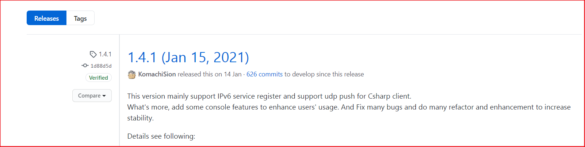
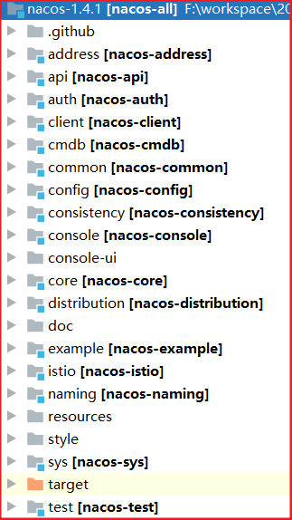
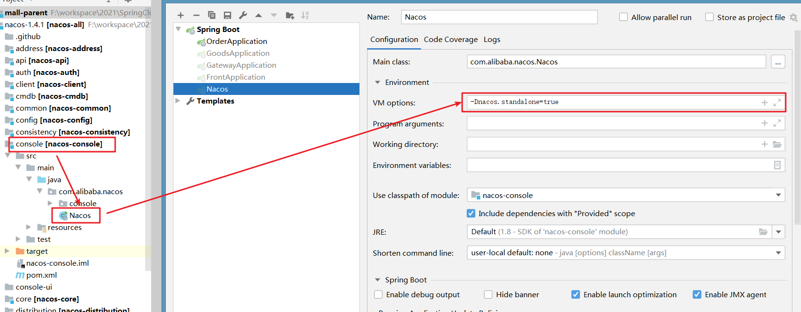
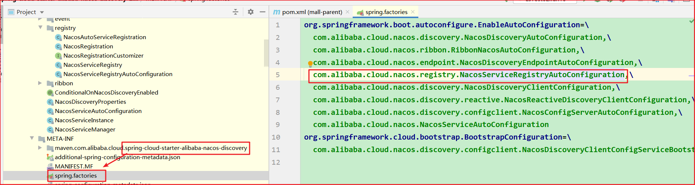
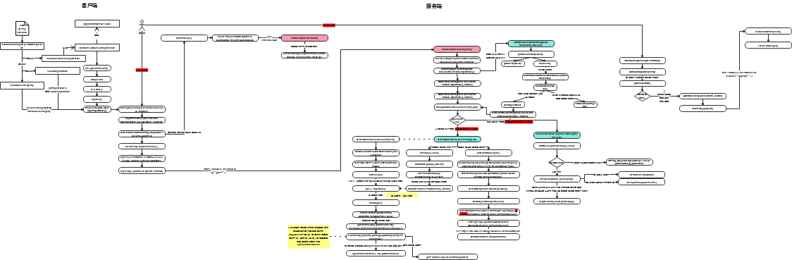
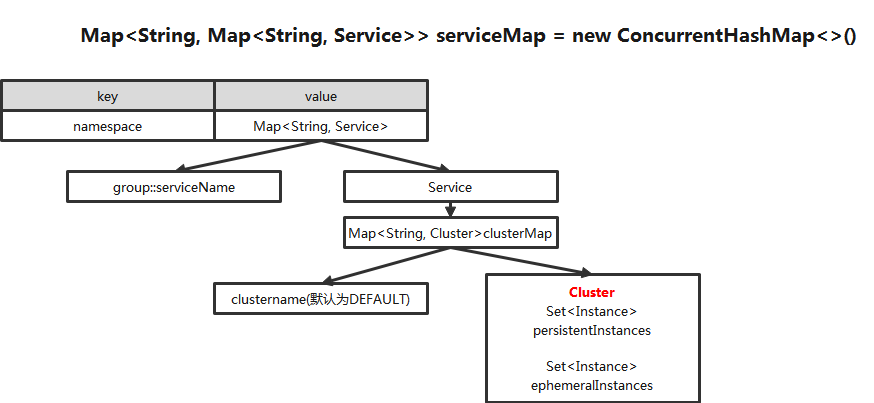

# SpringCloud源码

# 第一章-Nacos源码准备

## 1.Nacos核心功能

+ 服务注册：Nacos Client会通过发送REST请求的方式向Nacos Server注册自己的服务，提供自身的元数据，比如ip地址、端口等信息。
+ Nacos Server接收到注册请求后，就会把这些元数据信息存储在一个双层的内存Map中。
  服务心跳：在服务注册后，Nacos Client会维护一个定时心跳来持续通知Nacos Server，说明服务一直处于可用状态，防止被剔除。默认5s发送一次心跳。
+ 服务同步：Nacos Server集群之间会互相同步服务实例，用来保证服务信息的一致性。
+ 服务发现：服务消费者（Nacos Client）在调用服务提供者的服务时，会发送一个REST请求给Nacos Server，获取上面注册的服务清单，并且缓存在Nacos Client本地，同时会在Nacos Client本地开启一个定时任务定时拉取服务端最新的注册表信息更新到本地缓存
+ 服务健康检查：Nacos Server会开启一个定时任务用来检查注册服务实例的健康情况，对于超过15s没有收到客户端心跳的实例会将它的healthy属性置为false(客户端服务发现时不会发现)，如果某个实例超过30秒没有收到心跳，直接剔除该实例(被剔除的实例如果恢复发送心跳则会重新注册)  

## 2.Nacos服务端准备

+ 版本1.4.1 `https://github.com/alibaba/nacos/releases/tag/1.4.1`

 

+ 导入到IDEA

 

+ 启动 

  加入运行参数 `-Dnacos.standalone=true` 单机启动



+ 访问

```
http://localhost:8848/nacos/#/configurationManagement?dataId=&group=&appName=&namespace=&pageSize=&pageNo=
```

## 3.Nacos客户端准备

+ 版本

```
<spring-cloud-alibba.version>2.2.5.RELEASE</spring-cloud-alibba.version>
```

+ 入口

  

# 第二章-Nacos源码

## 1.服务注册,发现源码流程图



## 2.注册表



## 3.CP模式-Raft协议

### 3.1什么是Raft协议

​	Raft 是一种管理复制日志的一致性算法。它提供了和Paxos算法相同的功能和性能，但是它的算法结构和Paxos不同，使得Raft算法更加容易理解并且更容易构建实际的系统。为了提升可理解性，Raft将一致性算法分解成了几个关键模块，例如领导人选举、日志复制和安全性。

Raft 集群中的成员分三种角色：

1. Leader
2. Follower
3. Condidate

### 3.2Raft 的选举过程

​	Raft 协议在集群初始状态下是没有 Leader 的, 集群中所有成员均是 Follower，在选举开始期间所有 Follower 均可参与选举，这时所有 Follower 的角色均转变为 Condidate, Leader 由集群中所有的 Condidate 投票选出，最后获得投票最多的 Condidate 获胜，其角色转变为 Leader 并开始其任期，其余落败的 Condidate 角色转变为 Follower 开始服从 Leader 领导。这里有一种意外的情况会选不出 Leader 就是所有 Condidate 均投票给自己，这样无法决出票数多的一方，Raft 算法为了解决这个问题引入了北洋时期袁世凯获选大总统的谋略，即选不出 Leader 不罢休，直到选出为止，一轮选不出 Leader，便令所有 Condidate 随机 sleap（Raft 论文称为 timeout）一段时间，然后马上开始新一轮的选举，这里的随机 sleep 就起了很关键的因素，第一个从 sleap 状态恢复过来的 Condidate 会向所有 Condidate 发出投票给我的申请，这时还没有苏醒的 Condidate 就只能投票给已经苏醒的 Condidate ，因此可以有效解决 Condiadte 均投票给自己的故障，便可快速的决出 Leader。

​	选举出 Leader 后 Leader 会定期向所有 Follower 发送 heartbeat 来维护其 Leader 地位，如果 Follower 一段时间后未收到 Leader 的心跳则认为 Leader 已经挂掉，便转变自身角色为 Condidate，同时发起新一轮的选举，产生新的 Leader。

http://thesecretlivesofdata.com/raft/

### 3.3Raft 的数据一致性策略

​	Raft 协议强依赖 Leader 节点来确保集群数据一致性。即 client 发送过来的数据均先到达 Leader 节点，Leader 接收到数据后，先将数据标记为 uncommitted 状态，随后 Leader 开始向所有 Follower 复制数据并等待响应，在获得集群中大于 N/2 个 Follower 的已成功接收数据完毕的响应后，Leader 将数据的状态标记为 committed，随后向 client 发送数据已接收确认，在向 client 发送出已数据接收后，再向所有 Follower 节点发送通知表明该数据状态为committed。

### 3.4Nacos源码解析

#### 3.4.1RaftCore.init()

+ Nacos Server在启动的时候会调用RaftCore.init()方法进行集群选举操作和节点之间的心跳机制

```java
/**
 * @author nacos
 */
@Component
public class RaftCore {
   @PostConstruct
    public void init() throws Exception {
 
        Loggers.RAFT.info("initializing Raft sub-system");
 
        executor.submit(notifier);
 
        long start = System.currentTimeMillis();
 
        raftStore.loadDatums(notifier, datums);
 
        setTerm(NumberUtils.toLong(raftStore.loadMeta().getProperty("term"), 0L));
 
        Loggers.RAFT.info("cache loaded, datum count: {}, current term: {}", datums.size(), peers.getTerm());
 
        while (true) {
            if (notifier.tasks.size() <= 0) {
                break;
            }
            Thread.sleep(1000L);
        }
 
        initialized = true;
 
        Loggers.RAFT.info("finish to load data from disk, cost: {} ms.", (System.currentTimeMillis() - start));
 
        //节点选举
        GlobalExecutor.registerMasterElection(new MasterElection());
     
        //集群节点的心跳机制
        GlobalExecutor.registerHeartbeat(new HeartBeat());
 
        Loggers.RAFT.info("timer started: leader timeout ms: {}, heart-beat timeout ms: {}",
            GlobalExecutor.LEADER_TIMEOUT_MS, GlobalExecutor.HEARTBEAT_INTERVAL_MS);
    }
 
}
```

在init()方法中，使用GlobalExecutor.registerMasterElection(new MasterElection());方法来进行选举操作；

registerMasterElection()方法中，启动了一个定时任务去执行MasterElection里面的操作；接下来MasterElection里面的逻辑

#### 3.4.2new MasterElection()

```java
public class MasterElection implements Runnable {
        @Override
        public void run() {
            try {
 
                if (!peers.isReady()) {
                    return;
                }
                
 
                //获取本机RaftPeer信息
                RaftPeer local = peers.local();
                local.leaderDueMs -= GlobalExecutor.TICK_PERIOD_MS;
 
                if (local.leaderDueMs > 0) {
                    return;
                }
 
                // reset timeout
                //重置选举超时时间和发送心跳时间
                local.resetLeaderDue();
                local.resetHeartbeatDue();
 
                //发送选票信息到其他nacos节点
                sendVote();
            } catch (Exception e) {
                Loggers.RAFT.warn("[RAFT] error while master election {}", e);
            }
 
        }
```

在new MasterElection()线程中，首先会获取本机nacos节点的RaftPeer信息；RaftPeer包括了一下信息：

+ ip：节点ip地址
+ voteFor：节点选票信息
+ term：可理解为选举时间，同zookeeper的逻辑时钟
+ state：节点角色，默认为follower

获取到了本机RaftPeer信息之后，首先重置选举超时时间和发送心跳时间；然后调用sendVote()方法进行选举操作

#### 3.4.3RaftCore.sendVote()

```java
public void sendVote() {
 
            //1、获取本机nacos节点的RaftPeer信息
            RaftPeer local = peers.get(NetUtils.localServer());
            Loggers.RAFT.info("leader timeout, start voting,leader: {}, term: {}",
                JSON.toJSONString(getLeader()), local.term);
 
            //2、重置leader节点==null,同时重置其他各个节点的选票信息==null
            peers.reset();
 
            //3、本机节点设置term+1
            local.term.incrementAndGet();
            
            //4、本机节点设置选票信息为自己
            local.voteFor = local.ip;
            
            //5、同时修改本机节点信息为CANDIDATE昨天
            local.state = RaftPeer.State.CANDIDATE;
 
            Map<String, String> params = new HashMap<>(1);
 
            //6、将本机节点的RaftPeer信息进行组装
            params.put("vote", JSON.toJSONString(local));
 
            //7、通过httpClient给nacos集群的其他节点发送选票信息
            for (final String server : peers.allServersWithoutMySelf()) {
                final String url = buildURL(server, API_VOTE);
                try {
                    HttpClient.asyncHttpPost(url, null, params, new AsyncCompletionHandler<Integer>() {
                        @Override
                        public Integer onCompleted(Response response) throws Exception {
                            if (response.getStatusCode() != HttpURLConnection.HTTP_OK) {
                                Loggers.RAFT.error("NACOS-RAFT vote failed: {}, url: {}", response.getResponseBody(), url);
                                return 1;
                            }
                            
                            //8、接收其他节点对于前面发送的选票信息的返回结果
                            RaftPeer peer = JSON.parseObject(response.getResponseBody(), RaftPeer.class);
 
                            Loggers.RAFT.info("received approve from peer: {}", JSON.toJSONString(peer));
                    
                            //9、决定哪一个是Leader节点操作
                            peers.decideLeader(peer);
 
                            return 0;
                        }
                    });
                } catch (Exception e) {
                    Loggers.RAFT.warn("error while sending vote to server: {}", server);
                }
            }
        }
    }
```

在sendVote()方法中，主要的步骤是：

+ 获取本机nacos节点的RaftPeer信息（ip，term，voteFor，state）
+ 调用peers.reset()方法，重置nacos集群leader的RaftPeer节点内容为null
+ 重新设置本机节点RaftPeer的信息；主要是修改state，设置选票信息，term+1
+ 将设置好的本机RaftPeer信息进行封装到HashMap中
+ 通过httpClient给nacos集群的其他节点发送选票信息
+ 接收其他节点对于前面发送的选票信息的返回结果
+ 通过选举结果选出Leader结果

其中peers.reset()方法中的逻辑代码为：

```java
public void reset() {
 
        leader = null;
 
        for (RaftPeer peer : peers.values()) {
            peer.voteFor = null;
        }
    }
```

通过httpClient将本机选票信息发送给其他节点，并返回其他节点的选票结果逻辑主要是将请求到RaftController.vote()方法中：

```java
@NeedAuth
    @PostMapping("/vote")
    public JSONObject vote(HttpServletRequest request, HttpServletResponse response) throws Exception {
 
        RaftPeer peer = raftCore.receivedVote(
            JSON.parseObject(WebUtils.required(request, "vote"), RaftPeer.class));
 
        return JSON.parseObject(JSON.toJSONString(peer));
    }
```

在vote()方法中，主要是调用RaftCore.receivedVote()方法；

#### 3.4.4RaftCore.receivedVote()

该方法就是nacos节点接受其他节点的选票信息并返回自己的选票信息结果

```
public synchronized RaftPeer receivedVote(RaftPeer remote) {
        if (!peers.contains(remote)) {
            throw new IllegalStateException("can not find peer: " + remote.ip);
        }
 
        RaftPeer local = peers.get(NetUtils.localServer());
        if (remote.term.get() <= local.term.get()) {
            String msg = "received illegitimate vote" +
                ", voter-term:" + remote.term + ", votee-term:" + local.term;
 
            Loggers.RAFT.info(msg);
            if (StringUtils.isEmpty(local.voteFor)) {
                local.voteFor = local.ip;
            }
 
            return local;
        }
 
        local.resetLeaderDue();
 
        local.state = RaftPeer.State.FOLLOWER;
        local.voteFor = remote.ip;
        local.term.set(remote.term.get());
 
        Loggers.RAFT.info("vote {} as leader, term: {}", remote.ip, remote.term);
 
        return local;
    }
```

该方法中的逻辑比较简单明了：

+ 首先判断RaftPeerSet中是否包含了远程RaftPeer信息（可以把RaftPeer看成nacos节点对象，RaftPeerSet就是nacos集群节点的组合）
+ 然后获取本机节点RaftPeer信息
+ 通过比较本机节点和远程节点信息的term值，来做出选票结果（如果本机节点term的值大于远程节点term的值，那么本机节点选票信息就设置为自己，选自己作为Leader节点，并返回给远程节点；反之则将选票信息设置为远程节点信息）

#### 3.4.5 RaftPeerSet.decideLeader()

在3.4.3的RaftCore.sendVote()方法中，每个本机nacos节点都会将自己的选票信息发送给nacos集群中的其他节点，请求到其他节点的RaftController.vote()方法中，vote()方法通过调用2.4中的RaftCore.receivedVote()方法来处理其他节点的选票信息并进行判断之后返回自身的选票信息给原来的nacos节点；

RaftCore.sendVote()方法中获取到了其他节点的选票结果之后，会调用decideLeader()方法来选出Leade节点

```java
public RaftPeer decideLeader(RaftPeer candidate) {
        peers.put(candidate.ip, candidate);
 
        SortedBag ips = new TreeBag();
        int maxApproveCount = 0;
        String maxApprovePeer = null;
        for (RaftPeer peer : peers.values()) {
            if (StringUtils.isEmpty(peer.voteFor)) {
                continue;
            }
 
            ips.add(peer.voteFor);
            if (ips.getCount(peer.voteFor) > maxApproveCount) {
                maxApproveCount = ips.getCount(peer.voteFor);
                maxApprovePeer = peer.voteFor;
            }
        }
 
        if (maxApproveCount >= majorityCount()) {
            RaftPeer peer = peers.get(maxApprovePeer);
            peer.state = RaftPeer.State.LEADER;
 
            if (!Objects.equals(leader, peer)) {
                leader = peer;
                applicationContext.publishEvent(new LeaderElectFinishedEvent(this, leader));
                Loggers.RAFT.info("{} has become the LEADER", leader.ip);
            }
        }
 
        return leader;
    }
```

​	该方法中首先会找出得票最多的节点的信息以及该节点的得票数；然后判断得票数是否超过了一半的nacos集群节点数量；如果没有超过，直接返回leader(null)；如果超过了则将该节点的信息赋值给Leader节点并返回。

#### 3.4.6集群心跳机制

GlobalExecutor.registerHeartbeat(new HeartBeat())

RaftCore.init()方法除了上面的选举操作之外，紧跟着进行了集群心跳机制的逻辑；同样调用了一个定时任务，每个5s执行一个发送心跳的操作new HeartBeat()：

```java
public class HeartBeat implements Runnable {
        @Override
        public void run() {
            try {
 
                if (!peers.isReady()) {
                    return;
                }
 
                RaftPeer local = peers.local();
                local.heartbeatDueMs -= GlobalExecutor.TICK_PERIOD_MS;
                if (local.heartbeatDueMs > 0) {
                    return;
                }
 
                local.resetHeartbeatDue();
 
                sendBeat();
            } catch (Exception e) {
                Loggers.RAFT.warn("[RAFT] error while sending beat {}", e);
            }
 
        }
```

该方法中，首先会获取本机节点的RaftPeer信息，并重置心跳信息；同时调用sendBeat()方法发送心跳：

```java
public void sendBeat() throws IOException, InterruptedException {
            RaftPeer local = peers.local();
            if (local.state != RaftPeer.State.LEADER && !STANDALONE_MODE) {
                return;
            }
 
            if (Loggers.RAFT.isDebugEnabled()) {
                Loggers.RAFT.debug("[RAFT] send beat with {} keys.", datums.size());
            }
 
            local.resetLeaderDue();
 
            // build data
            JSONObject packet = new JSONObject();
            packet.put("peer", local);
 
            JSONArray array = new JSONArray();
 
            if (switchDomain.isSendBeatOnly()) {
                Loggers.RAFT.info("[SEND-BEAT-ONLY] {}", String.valueOf(switchDomain.isSendBeatOnly()));
            }
 
            if (!switchDomain.isSendBeatOnly()) {
                for (Datum datum : datums.values()) {
 
                    JSONObject element = new JSONObject();
 
                    if (KeyBuilder.matchServiceMetaKey(datum.key)) {
                        element.put("key", KeyBuilder.briefServiceMetaKey(datum.key));
                    } else if (KeyBuilder.matchInstanceListKey(datum.key)) {
                        element.put("key", KeyBuilder.briefInstanceListkey(datum.key));
                    }
                    element.put("timestamp", datum.timestamp);
 
                    array.add(element);
                }
            }
 
            packet.put("datums", array);
            // broadcast
            Map<String, String> params = new HashMap<String, String>(1);
            params.put("beat", JSON.toJSONString(packet));
 
            String content = JSON.toJSONString(params);
 
            ByteArrayOutputStream out = new ByteArrayOutputStream();
            GZIPOutputStream gzip = new GZIPOutputStream(out);
            gzip.write(content.getBytes(StandardCharsets.UTF_8));
            gzip.close();
 
            byte[] compressedBytes = out.toByteArray();
            String compressedContent = new String(compressedBytes, StandardCharsets.UTF_8);
 
            if (Loggers.RAFT.isDebugEnabled()) {
                Loggers.RAFT.debug("raw beat data size: {}, size of compressed data: {}",
                    content.length(), compressedContent.length());
            }
 
            for (final String server : peers.allServersWithoutMySelf()) {
                try {
                    final String url = buildURL(server, API_BEAT);
                    if (Loggers.RAFT.isDebugEnabled()) {
                        Loggers.RAFT.debug("send beat to server " + server);
                    }
                    HttpClient.asyncHttpPostLarge(url, null, compressedBytes, new AsyncCompletionHandler<Integer>() {
                        @Override
                        public Integer onCompleted(Response response) throws Exception {
                            if (response.getStatusCode() != HttpURLConnection.HTTP_OK) {
                                Loggers.RAFT.error("NACOS-RAFT beat failed: {}, peer: {}",
                                    response.getResponseBody(), server);
                                MetricsMonitor.getLeaderSendBeatFailedException().increment();
                                return 1;
                            }
 
                            peers.update(JSON.parseObject(response.getResponseBody(), RaftPeer.class));
                            if (Loggers.RAFT.isDebugEnabled()) {
                                Loggers.RAFT.debug("receive beat response from: {}", url);
                            }
                            return 0;
                        }
 
                        @Override
                        public void onThrowable(Throwable t) {
                            Loggers.RAFT.error("NACOS-RAFT error while sending heart-beat to peer: {} {}", server, t);
                            MetricsMonitor.getLeaderSendBeatFailedException().increment();
                        }
                    });
                } catch (Exception e) {
                    Loggers.RAFT.error("error while sending heart-beat to peer: {} {}", server, e);
                    MetricsMonitor.getLeaderSendBeatFailedException().increment();
                }
            }
 
        }
    }
```

该方法中大致的过程是：

首先判断本机节点是否是Leader节点，如果不是则直接返回，如果是Leader节点，则将RaftPeer和时间戳等信息封装并通过httpClient远程发送到其他nacos集群follower节点中；请求会发送到RaftController.beat()方法；beat方法中调用了RaftCore.receivedBeat()方法；并将远程nacos节点RaftPeer返回到本机节点中；然后更新RaftPeerSet集合信息，保持nacos集群数据节点的一致性。

#### 3.4.7 RaftCore.receivedBeat()

+ 核心代码

```java
if (local.state != RaftPeer.State.FOLLOWER) {
            Loggers.RAFT.info("[RAFT] make remote as leader, remote peer: {}", JSON.toJSONString(remote));
            // mk follower
            local.state = RaftPeer.State.FOLLOWER;
            local.voteFor = remote.ip;
        }
 
        final JSONArray beatDatums = beat.getJSONArray("datums");
        local.resetLeaderDue();
        local.resetHeartbeatDue();
 
        peers.makeLeader(remote);
 }
```

在该方法中会判断该远程节点是否为follower，如果不是则修改为follower状态，同时调用makeLeader()方法将其他非follower的节点状态改为follower；最后返回远程节点RaftPeer。

### 3.5Raft 如何处理 Leader 意外的

1. client 发送数据到达 Leader 之前 Leader 就挂了，因为数据还没有到达集群内部，所以对集群内部数据的一致性没有影响，Leader 挂了之后，集群会进行新的选举产生新的 Leader，之前挂掉的 Leader 重启后作为 Follower 加入集群，并同步 Leader 上的数据。这里最好要求 client 有重试机制在一定时间没有收到 Leader 的数据已接收确认后进行一定次数的重试，并再次向新的 Leader 发送数据来确保业务的流畅性
2. client 发送数据到 Leader，数据到达 Leader 后，Leader 还没有开始向 Folloers 复制数据，Leader就挂了，此时数据仍被标记为 uncommited 状态，这时集群会进行新的选举产生新的 Leader，之前挂掉的 Leader 重启后作为 Follower 加入集群，并同步 Leader 上的数据，来保证数据一致性，之前接收到 client 的数据由于是 uncommited 状态所以可能会被丢弃。这里同样最好要求 client 有重试机制通过在一定时间在没有收到 Leader 的数据已接收确认后进行一定次数的重试，再次向新的 Leader 发送数据来确保业务的流畅性。
3. client 发送数据到 Leader, Leader 接收数据完毕后标记为 uncommited，开始向 Follower复制数据，在复制完毕一小部分 Follower 后 Leader 挂了，此时数据在所有已接收到数据的 Follower 上仍被标记为 uncommitted，但国不可一日无君，此时集群将进行新的选举，而拥有最新数据的 Follower 变换角色为 Condidate，也就意味着 Leader 将在拥有最新数据的 Follower 中产生，新的 Leader 产生后所有节点开始从新 Leader 上同步数据确保数据的一致性，包括之前挂掉后恢复了状态的 老Leader，这时也以 Follower 的身份同步新 Leader 上的数据。
4. client 发送数据到 Leader，Leader 接收数据完毕后标记为 uncommitted，开始向 Follower 复制数据，在复制完毕所有 Follower 节点或者大部分节点（大于 N/2），并接收到大部分节点接收完毕的响应后，Leader 节点将数据标记为 committed，这时 Leader 挂了，此时已接收到数据的所有 Follower 节点上的数据状态由于还没有接收到 Leader 的 commited 通知，均处于 uncommited 状态。这时集群进行了新的选举，新的 Leader 将在拥有最新数据的节点中产生，新的 Leader 产生后，由于 client 端因老 Leader 挂掉前没有通知其数据已接收，所以会向新的 Leader 发送重试请求，而新的 Leader 上已经存在了这个之前从老 Leader 上同步过来的数据，因此 Raft 集群要求各节点自身实现去重的机制，保证数据的一致性。
5. 集群脑裂的一致性处理，多发于双机房的跨机房模式的集群。假设一个 5 节点的 Raft 集群，其中三个节点在 A 机房，Leader 节点也在 A 机房，两个节点在 B 机房。突然 A、B 两个机房之间因其他故障无法通讯，那么此时 B 机房中的 2 个Follower 因为失去与 Leader 的联系，均转变自身角色为 Condidate。根据 Leader 选举机制，B 机房中产生了一个新的 Leader，这就发生了脑裂即存在 A 机房中的老 Leader 的集群与B机房新 Leader 的集群。Raft 针对这种情况的处理方式是老的 Leader 集群虽然剩下三个节点，但是 Leader 对数据的处理过程还是在按原来 5 个节点进行处理，所以老的 Leader 接收到的数据，在向其他 4 个节点复制数据，由于无法获取超过 N/2 个 Follower 节点的复制完毕数据响应（因为无法连接到 B 机房中的 2个节点），所以 client 在向老 Leader 发送的数据请求均无法成功写入，而 client 向B机房新 Leader 发送的数据，因为是新成立的集群，所以可以成功写入数据，在A、B两个机房恢复网络通讯后，A 机房中的所有节点包括老 Leader 再以 Follower 角色接入这个集群，并同步新 Leader 中的数据，完成数据一致性处理。

## 4.AP模式-Distro协议

### 4.1Distro协议介绍

​	Distro是阿里巴巴的私有协议，目前流行的Nacos服务管理框架就采用了Distro协议。Distro 协议被定位为 临时数据的一致性协议：该类型协议， 不需要把数据存储到磁盘或者数据库，因为临时数据通常和服务器保持一个session会话， 该会话只要存在，数据就不会丢失 。

​	Distro 协议保证写必须永远是成功的，即使可能会发生网络分区。当网络恢复时，把各数据分片的数据进行合并。

1. 专门为了注册中心而创造出的协议；
2. 客户端与服务端有两个重要的交互，服务注册与心跳发送；
3. 客户端以服务为维度向服务端注册，注册后每隔一段时间向服务端发送一次心跳，心跳包需要带上注册服务的全部信息，在客户端看来，服务端节点对等，所以请求的节点是随机的；
4. 客户端请求失败则换一个节点重新发送请求；
5. 服务端节点都存储所有数据，但每个节点只负责其中一部分服务，在接收到客户端的“写”（注册、心跳、下线等）请求后，服务端节点判断请求的服务是否为自己负责，如果是，则处理，否则交由负责的节点处理；
6. 每个服务端节点主动发送健康检查到其他节点，响应的节点被该节点视为健康节点；
7. 服务端在接收到客户端的服务心跳后，如果该服务不存在，则将该心跳请求当做注册请求来处理；
8. 服务端如果长时间未收到客户端心跳，则下线该服务；
9. 负责的节点在接收到服务注册、服务心跳等写请求后将数据写入后即返回，后台异步地将数据同步给其他节点；
10. 节点在收到读请求后直接从本机获取后返回，无论数据是否为最新。

### 4.2Nacos源码解析

+ 我们回到服务注册，服务注册的`InstanceController.register()`就是数据入口，它会调用`ServiceManager.registerInstance()`，执行数据同步的时候，调用`addInstance()`,在该方法中会执行`DistroConsistencyServiceImpl.put()`，该方法是增量同步的入口，会调用`distroProtocol.sync()`方法，代码如下：

```java
/***
 * 数据保存
 * @param key   key of data, this key should be globally unique
 * @param value value of data
 * @throws NacosException
 */
@Override
public void put(String key, Record value) throws NacosException {
    //将数据存入到dataStore中
    onPut(key, value);
    //使用distroProtocol同步数据
    distroProtocol.sync(
        new DistroKey(key, KeyBuilder.INSTANCE_LIST_KEY_PREFIX),
        DataOperation.CHANGE,
        globalConfig.getTaskDispatchPeriod() / 2);
}
```

+ `sync()`方法会执行任务发布，代码如下：

```java
public void sync(DistroKey distroKey, DataOperation action, long delay) {
    //向除了自己外的所有节点广播
    for (Member each : memberManager.allMembersWithoutSelf()) {
        DistroKey distroKeyWithTarget = new DistroKey(distroKey.getResourceKey(), distroKey.getResourceType(),
                each.getAddress());
        DistroDelayTask distroDelayTask = new DistroDelayTask(distroKeyWithTarget, action, delay);
        //从distroTaskEngineHolder获取延时执行引擎，并将distroDelayTask任务添加进来
        //执行延时任务发布
        distroTaskEngineHolder.getDelayTaskExecuteEngine().addTask(distroKeyWithTarget, distroDelayTask);
        if (Loggers.DISTRO.isDebugEnabled()) {
            Loggers.DISTRO.debug("[DISTRO-SCHEDULE] {} to {}", distroKey, each.getAddress());
        }
    }
}
```

+ 延迟任务对象我们可以从`DistroTaskEngineHolder`构造函数中得知是`DistroDelayTaskProcessor`，代码如下：

```java
/***
 * 构造函数指定任务处理器
 * @param distroComponentHolder
 */
public DistroTaskEngineHolder(DistroComponentHolder distroComponentHolder) {
    DistroDelayTaskProcessor defaultDelayTaskProcessor = new DistroDelayTaskProcessor(this, distroComponentHolder);
    //指定任务处理器defaultDelayTaskProcessor
    delayTaskExecuteEngine.setDefaultTaskProcessor(defaultDelayTaskProcessor);
}
```

+ 它延迟执行的时候会执行`process`方法，该方法正是执行数据同步的地方，它会执行DistroSyncChangeTask任务，代码如下：

```java
/***
 * 任务处理过程
 * @param task     task.
 * @return
 */
@Override
public boolean process(NacosTask task) {
    if (!(task instanceof DistroDelayTask)) {
        return true;
    }
    DistroDelayTask distroDelayTask = (DistroDelayTask) task;
    DistroKey distroKey = distroDelayTask.getDistroKey();
    if (DataOperation.CHANGE.equals(distroDelayTask.getAction())) {
        //将延迟任务变更成异步任务，异步任务对象是一个线程
        DistroSyncChangeTask syncChangeTask = new DistroSyncChangeTask(distroKey, distroComponentHolder);
        //将任务添加到NacosExecuteTaskExecuteEngine中，并执行
        distroTaskEngineHolder.getExecuteWorkersManager().addTask(distroKey, syncChangeTask);
        return true;
    }
    return false;
}
```

+ `DistroSyncChangeTask`实质上是任务的开始，它自身是一个线程，所以会执行它的run方法，而run方法这是数据同步操作，代码如下：

```java
/***
 * 执行数据同步
 */
@Override
public void run() {
    Loggers.DISTRO.info("[DISTRO-START] {}", toString());
    try {
        //获取本地缓存数据
        String type = getDistroKey().getResourceType();
        DistroData distroData = distroComponentHolder.findDataStorage(type).getDistroData(getDistroKey());
        distroData.setType(DataOperation.CHANGE);
        //向其他节点同步数据
        boolean result = distroComponentHolder.findTransportAgent(type).syncData(distroData, getDistroKey().getTargetServer());
        if (!result) {
            handleFailedTask();
        }
        Loggers.DISTRO.info("[DISTRO-END] {} result: {}", toString(), result);
    } catch (Exception e) {
        Loggers.DISTRO.warn("[DISTRO] Sync data change failed.", e);
        handleFailedTask();
    }
}
```

+ 数据同步会执行调用`syncData`，该方法其实就是通过Http协议将数据发送到其他节点实现数据同步，代码如下：

```java
/***
 * 向其他节点同步数据
 * @param data         data
 * @param targetServer target server
 * @return
 */
@Override
public boolean syncData(DistroData data, String targetServer) {
    if (!memberManager.hasMember(targetServer)) {
        return true;
    }
    //获取数据字节数组
    byte[] dataContent = data.getContent();
    //通过Http协议同步数据
    return NamingProxy.syncData(dataContent, data.getDistroKey().getTargetServer());
}
```

# 结论

## 一,服务注册

+ 本质就是微服务向nacos发送HTTP POST方式请求
  + 每隔5s发送和nacos服务心跳, 本质还是发送HTTP请求
+ 如果成功了,nacos把服务节点信息保存到ConcurrentHashMap<>()


