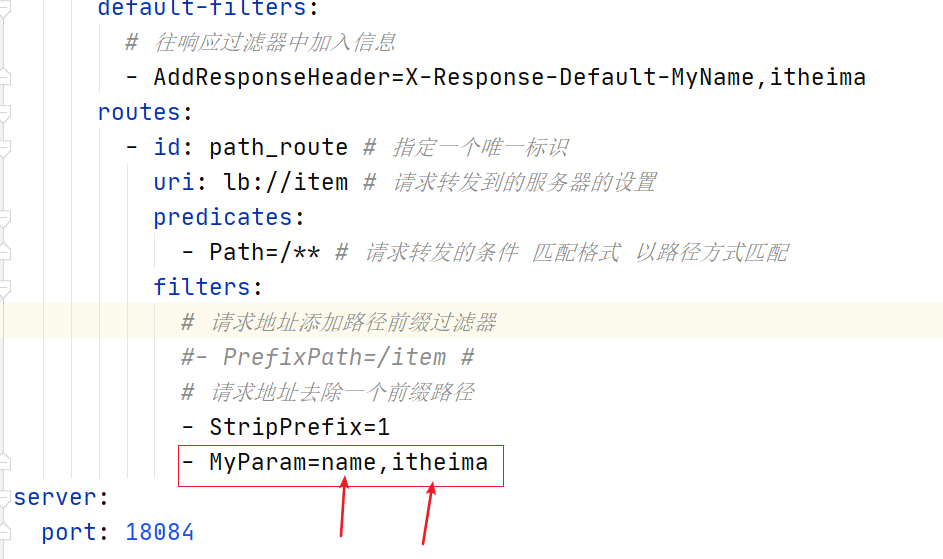

## 局部过滤器定义（了解）

自定义局部过滤器，该过滤器在控制台输出配置文件中指定名称的请求参数及参数的值,以及判断是否携带请求中参数,打印.

**实现步骤：**

```properties
1. 在gateway-service中编写MyParamGatewayFilterFactory类
2. 实现业务代码：循环请求参数中是否包含name，如果包含则输出参数值,并打印在第三步配置的参数名和值
3. 修改配置文件
4. 访问请求测试，带name参数
```


**实现过程：**

在gateway-service中`com.itheima.filter`下创建MyParamGatewayFilterFactory类

```java
package com.itheima.filter;

import org.springframework.cloud.gateway.filter.GatewayFilter;
import org.springframework.cloud.gateway.filter.GatewayFilterChain;
import org.springframework.cloud.gateway.filter.factory.AbstractNameValueGatewayFilterFactory;
import org.springframework.stereotype.Component;
import org.springframework.util.StringUtils;
import org.springframework.web.server.ServerWebExchange;
import reactor.core.publisher.Mono;

@Component
public class MyParamGatewayFilterFactory extends AbstractNameValueGatewayFilterFactory {
    /**
     * 处理过程  默认需要在配置配置文件中配置 NAME ,VALUE
     *
     * @param config
     * @return
     */
    public GatewayFilter apply(NameValueConfig config) {

        return new GatewayFilter() {
            //- MyParam=name,value
            @Override
            public Mono<Void> filter(ServerWebExchange exchange, GatewayFilterChain chain) {
                String configName = config.getName();//获取参数名name的值
                String configValue = config.getValue();//获取参数名value的值
                System.out.println("获取配置中的参数的NAME值:" + configName);
                System.out.println("获取配置中的参数的VALUE值:" + configValue);
                //传递给下游微服务
                exchange.getRequest().mutate().header(configName,configValue);
                
                return chain.filter(exchange);
            }
        };
    }
}
```


在user-provider中添加如下代码用于测试获取头信息：

```java
@GetMapping("/{itemId}")
public OrderInfo getItemInfo(@PathVariable(name = "itemId") String itemId, @RequestHeader(value="name")String value) {
    System.out.println(value);
    OrderInfo orderInfo = new OrderInfo();

    orderInfo.setItemId(itemId);
    orderInfo.setPrice(89L);
    orderInfo.setItemName("华为手机P40");
    System.out.println("=============================111====================");
    return orderInfo;
}
```


修改application.yml配置文件




测试访问，检查后台是否输出name和itheima；访问`<http://localhost:18084/api/item/2?token=123456`会输出,并在itheima-item项目中控制台显示头部数据

打印如下

 

1