# 第3天 SpringCloud

## 学习目标

- 理解雪崩效应及相关的解决办法
- 掌握什么是sentinel了解相关的特点
- 掌握基本的sentinel的相关概念和控制台使用
- 掌握sentinel常见的运用案例
- 理解链路跟踪以及相关概念
- 掌握zipkin+sleuth的整合


## 1 Sentinel介绍

### 1.1 目标

- 理解什么是雪崩效应
- 掌握雪崩效应的几种解决方案
- 理解基本的sentinel的介绍

### 1.2 讲解

#### 1.2.1 雪崩效应

```properties
如下图：
当用户请求 A、P、H、I 四个服务获取数据时，在正常流量下系统稳定运行，如果某天系统进来大量流量，其中服务 I 出现 CPU、内存占用过高等问题，结果导致服务 I 出现延迟、响应过慢，随着请求的持续增加，服务 I 承受不住压力导致内部错误或资源耗尽，一直不响应，此时更糟糕的是其他服务对 I 有依赖，那么这些依赖 I 的服务一直等待 I 的响应，也会出现请求堆积、资源占用，慢慢扩散到所有微服务，从而导致整个系统出现更多级联故障。引发雪崩效应。
```

 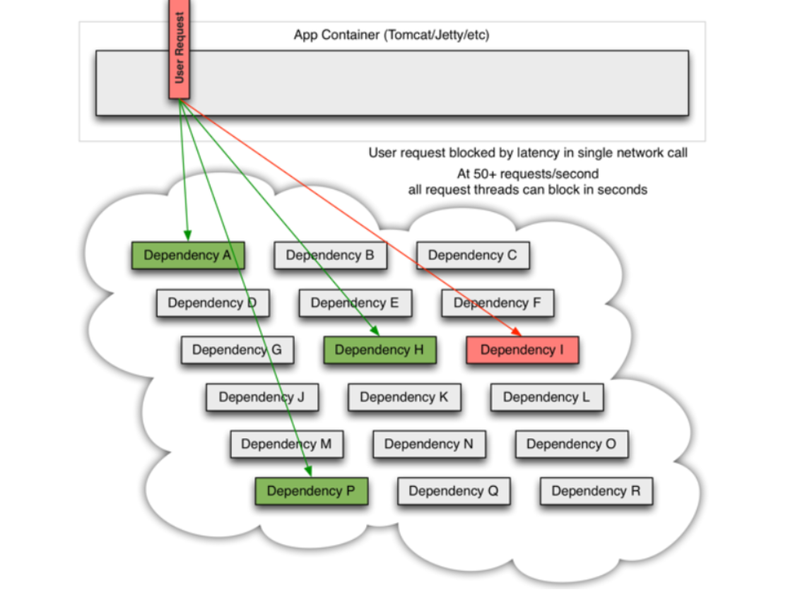

如果失败发生的越来越多就会引发其他的服务也出现故障，这种现象就是雪崩效应。如下图：

 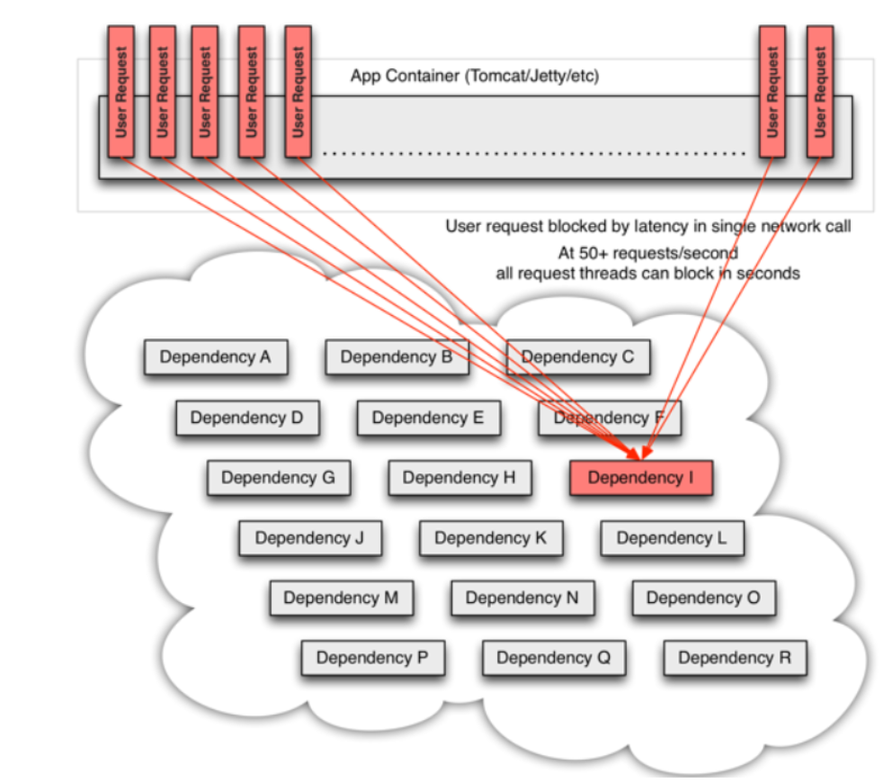


#### 1.2.2 防止雪崩效应的解决办法

 

```properties
主动超时：Http请求主动设置一个超时时间，超时就直接返回，不会造成服务堆积。

限流：限制最大并发数

熔断：当错误数超过阈值时快速失败，不调用后端服务，同时隔一定时间放几个请求去重试后端服务是否能正常调用，如果成功则关闭熔断状态，失败则继续快速失败，直接返回。（此处有个重试，重试就是弹性恢复的能力）

线程隔离：把每个依赖或调用的服务都隔离开来，防止级联失败引起整体服务不可用。


服务降级：服务失败或异常后，返回指定的默认信息
```


这里就可以使用很多的已有的成熟的主流框架：hystrix 和sentinel以及resilience4j.


Hystrix常用的线程池隔离会造成线程上下切换的overhead比较大；Hystrix使用的信号量隔离对某个资源调用的并发数进行控制，效果不错，但是无法对慢调用进行自动降级；Sentinel通过并发线程数的流量控制提供信号量隔离的功能；

 此外，Sentinel支持的熔断降级维度更多，可对多种指标进行流控、熔断，且提供了实时监控和控制面板，功能更为强大。

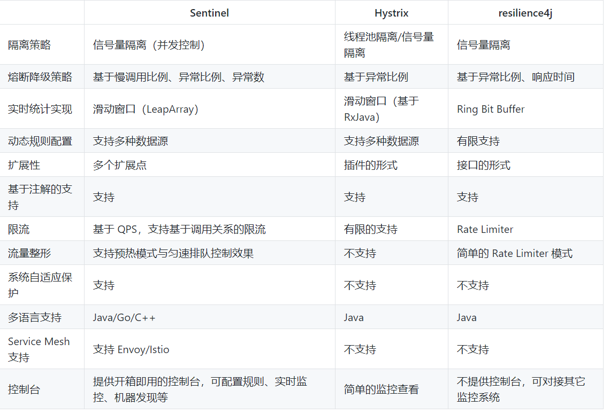


#### 1.2.3 sentinel是什么

##### 1.2.3.1 Sentinel 介绍

​	随着微服务的流行，服务和服务之间的稳定性变得越来越重要。Sentinel 是面向分布式服务架构的流量控制组件，主要以流量为切入点，从限流、流量整形、熔断降级、系统负载保护、热点防护等多个维度来帮助开发者保障微服务的稳定性

- 2012 年，Sentinel 诞生，主要功能为入口流量控制。
- 2013-2017 年，Sentinel 在阿里巴巴集团内部迅速发展，成为基础技术模块，覆盖了所有的核心场景。Sentinel 也因此积累了大量的流量归整场景以及生产实践。
- 2018 年，Sentinel 开源，并持续演进。
- 2019 年，Sentinel 朝着多语言扩展的方向不断探索，推出 [C++ 原生版本](https://github.com/alibaba/sentinel-cpp)，同时针对 Service Mesh 场景也推出了 [Envoy 集群流量控制支持](https://github.com/alibaba/Sentinel/tree/master/sentinel-cluster/sentinel-cluster-server-envoy-rls)，以解决 Service Mesh 架构下多语言限流的问题。
- 2020 年，推出 [Sentinel Go 版本](https://github.com/alibaba/sentinel-golang)，继续朝着云原生方向演进。

```properties
https://sentinelguard.io/zh-cn/index.html
https://github.com/alibaba/Sentinel 
https://github.com/alibaba/Sentinel/wiki
```


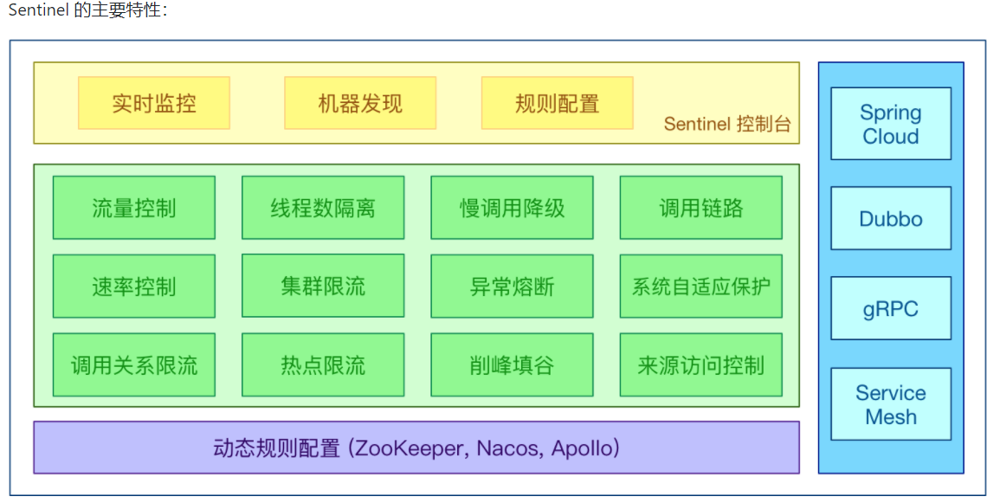

Sentinel 分为两个部分:

- 核心库（Java 客户端）不依赖任何框架/库，能够运行于所有 Java 运行时环境，同时对 Dubbo / Spring Cloud 等框架也有较好的支持。
- 控制台（Dashboard）基于 Spring Boot 开发，打包后可以直接运行，不需要额外的 Tomcat 等应用容器。

```properties
控制台的主要目的就是用图形化的界面进行各种规则的配置对系统进行限流保护
```

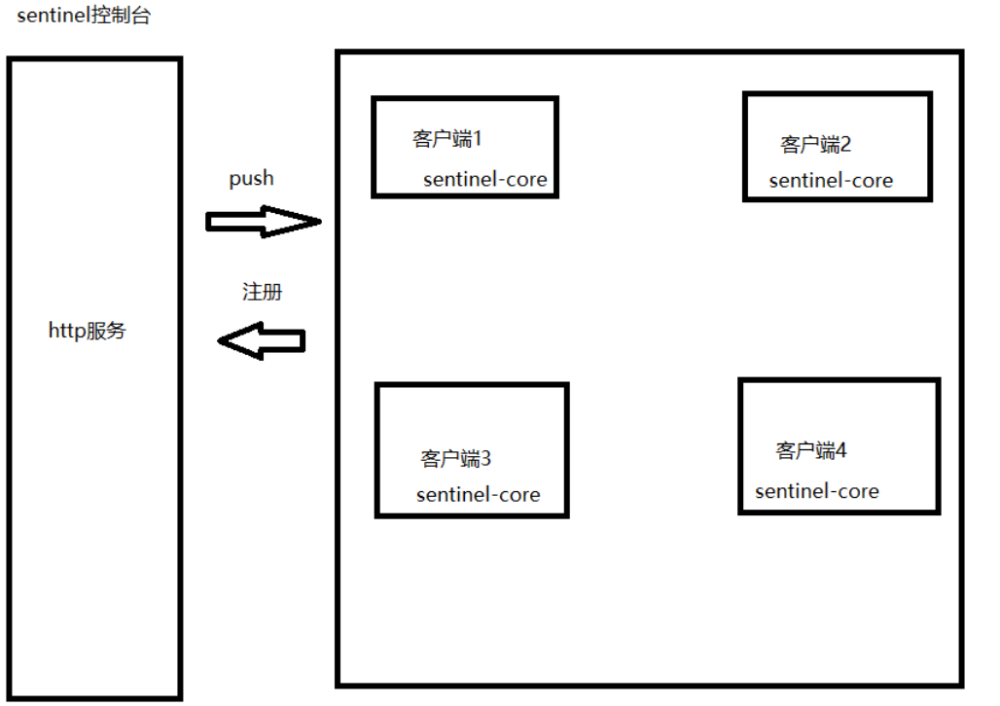


##### 1.2.3.2 Sentinel 基本概念

资源：

​	资源是 Sentinel 的关键概念。它可以是 Java 应用程序中的任何内容，例如，由应用程序提供的服务，或由应用程序调用的其它应用提供的服务，甚至可以是一段代码。在接下来的文档中，我们都会用资源来描述代码块。

只要通过 Sentinel API 定义的代码，就是资源，能够被 Sentinel 保护起来。大部分情况下，可以使用方法签名，URL，甚至服务名称作为资源名来标示资源。

规则：

​	围绕资源的实时状态设定的规则，可以包括流量控制规则、熔断降级规则以及系统保护规则。所有规则可以动态实时调整。


##### 1.2.3.3 Sentinel 功能和设计理念

**流量控制**

​	流量控制在网络传输中是一个常用的概念，它用于调整网络包的发送数据。然而，从系统稳定性角度考虑，在处理请求的速度上，也有非常多的讲究。任意时间到来的请求往往是随机不可控的，而系统的处理能力是有限的。我们需要根据系统的处理能力对流量进行控制。Sentinel 作为一个调配器，可以根据需要把随机的请求调整成合适的形状，如下图所示：

 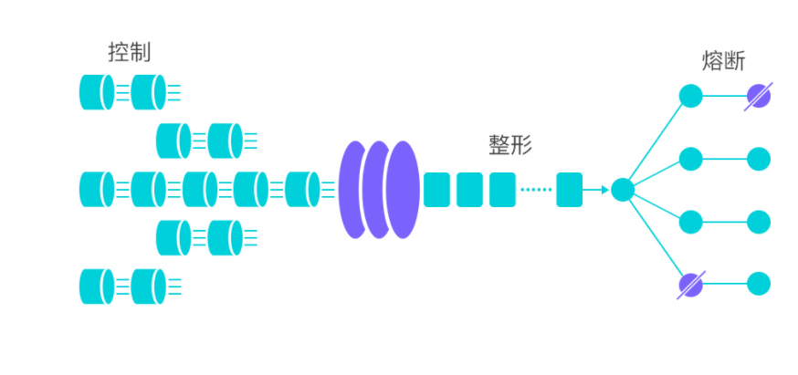

流量控制有以下几个角度:

- 资源的调用关系，例如资源的调用链路，资源和资源之间的关系；
- 运行指标，例如 QPS、线程池、系统负载等；
- 控制的效果，例如直接限流、冷启动、排队等。

Sentinel 的设计理念是让您自由选择控制的角度，并进行灵活组合，从而达到想要的效果。


**熔断降级**

​	Sentinel 和 Hystrix 的原则是一致的: 当调用链路中某个资源出现不稳定，例如，表现为 timeout，异常比例升高的时候，则对这个资源的调用进行限制，并让请求快速失败，避免影响到其它的资源，最终产生雪崩的效果。


**系统负载保护**

​	Sentinel 同时提供[系统维度的自适应保护能力](https://sentinelguard.io/zh-cn/docs/system-adaptive-protection.html)。防止雪崩，是系统防护中重要的一环。当系统负载较高的时候，如果还持续让请求进入，可能会导致系统崩溃，无法响应。在集群环境下，网络负载均衡会把本应这台机器承载的流量转发到其它的机器上去。如果这个时候其它的机器也处在一个边缘状态的时候，这个增加的流量就会导致这台机器也崩溃，最后导致整个集群不可用。

针对这个情况，Sentinel 提供了对应的保护机制，让系统的入口流量和系统的负载达到一个平衡，保证系统在能力范围之内处理最多的请求。


##### 1.2.3.4 Sentinel 基本原理

在 Sentinel 里面，所有的资源都对应一个资源名称以及一个 Entry。Entry 可以通过对主流框架的适配自动创建，也可以通过注解的方式或调用 API 显式创建；每一个 Entry 创建的时候，同时也会创建一系列功能插槽（slot chain）。这些插槽有不同的职责，例如:

- `NodeSelectorSlot` 负责收集资源的路径，并将这些资源的调用路径，以树状结构存储起来，用于根据调用路径来限流降级；
- `ClusterBuilderSlot` 则用于存储资源的统计信息以及调用者信息，例如该资源的 RT, QPS, thread count 等等，这些信息将用作为多维度限流，降级的依据；
- `StatisticSlot` 则用于记录、统计不同纬度的 runtime 指标监控信息；
- `FlowSlot` 则用于根据预设的限流规则以及前面 slot 统计的状态，来进行流量控制；
- `AuthoritySlot` 则根据配置的黑白名单和调用来源信息，来做黑白名单控制；
- `DegradeSlot` 则通过统计信息以及预设的规则，来做熔断降级；
- `SystemSlot` 则通过系统的状态，例如 load1 等，来控制总的入口流量；

总体的框架如下:

 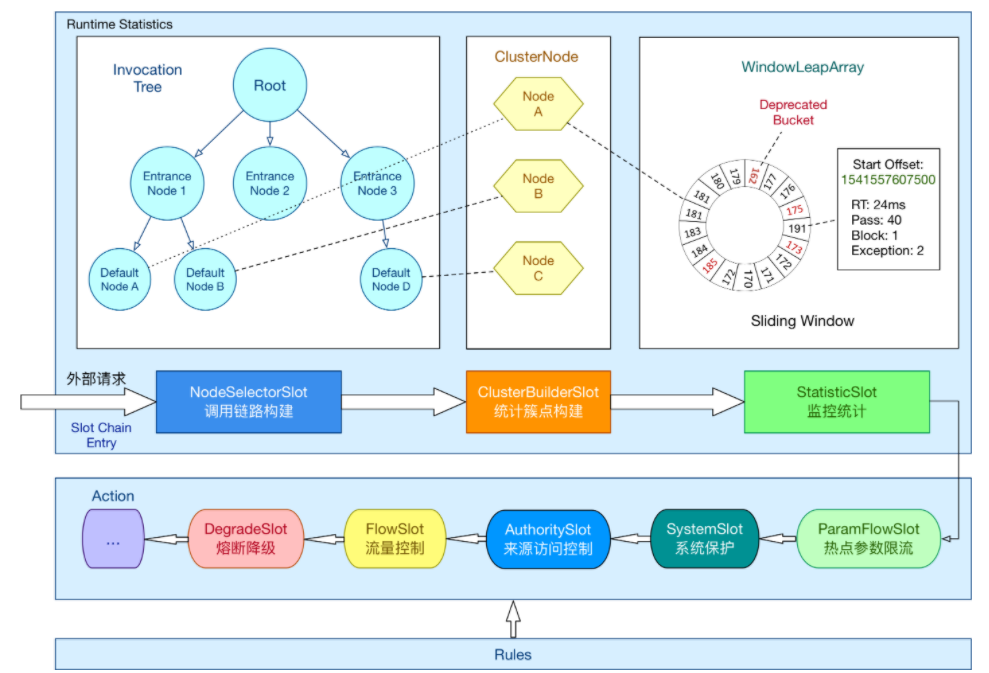


Sentinel 将 `ProcessorSlot` 作为 SPI 接口进行扩展（1.7.2 版本以前 `SlotChainBuilder` 作为 SPI），使得 Slot Chain 具备了扩展的能力。您可以自行加入自定义的 slot 并编排 slot 间的顺序，从而可以给 Sentinel 添加自定义的功能。

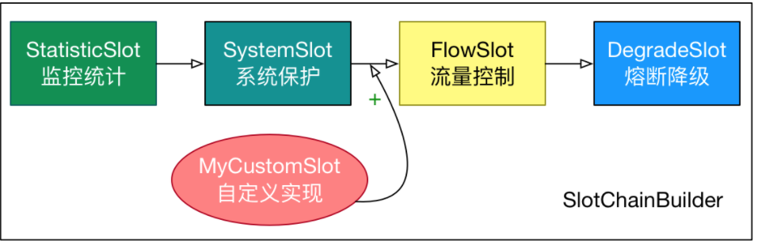

官方文档：

```properties
https://sentinelguard.io/zh-cn/docs/basic-implementation.html
```


### 1.3 小结

+ 雪崩效应：即大量发生成异常状况导致微服务调用链路上的级联失败
+ 解决雪崩效应的解决方案：熔断、降级、隔离、限流、主动超时、快速失败等。
+ 现有的解决方案主流技术：hystrix和sentinel
+ sentinel 是一个流量控制的框架解决系统中的一些诸如雪崩的问题的。
+ sentinel有两个核心部件：控制台 和 sentinel-core 


## 2 Sentinel的使用

### 2.1 目标

- Sentinel的控制台安装和使用
- Sentinel的核心场景案例的使用

### 2.2 讲解

#### 2.2.1 控制台的安装启动

下载jar包，如上图:

```
https://github.com/alibaba/Sentinel/releases
```

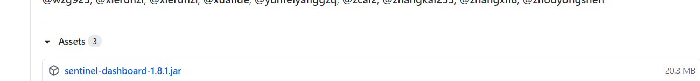

启动jar包：

```shell
java -Dserver.port=8080 -Dcsp.sentinel.dashboard.server=localhost:8080 -Dproject.name=sentinel-dashboard -jar sentinel-dashboard-1.8.1.jar
```

浏览器访问：`localhost:8080`即可出现如下界面

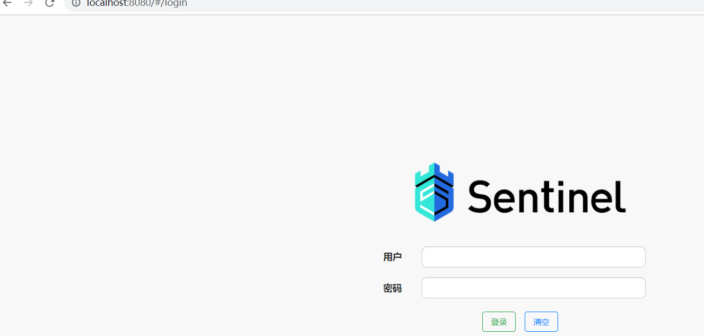


出现以上界面说明OK了。用户名/密码：sentinel/sentinels


#### 2.2.2 快速入门

系统中的微服务都是属于控制台的客户端。如上图介绍的控制台一样。

**实现步骤：**

```properties
1. 在itheima-item项目中添加控制台客户端的坐标
2. 在itheima-item项目中添加sentinel-core的坐标

以上两个步骤合并为一个步骤：如果使用springcloud 只需添加spring cloud alibaba sentinel starter即可

3. 配置yaml 指定服务端地址
4. 启动客户端进行测试
```


itheima-item项目中pom.xml添加坐标：

```xml
<dependency>
    <groupId>com.alibaba.cloud</groupId>
    <artifactId>spring-cloud-starter-alibaba-sentinel</artifactId>
</dependency>
```


(2)pom.xml依赖

```xml
<?xml version="1.0" encoding="UTF-8"?>
<project xmlns="http://maven.apache.org/POM/4.0.0"
         xmlns:xsi="http://www.w3.org/2001/XMLSchema-instance"
         xsi:schemaLocation="http://maven.apache.org/POM/4.0.0 http://maven.apache.org/xsd/maven-4.0.0.xsd">
    <parent>
        <artifactId>springcloud107-parent</artifactId>
        <groupId>com.itheima</groupId>
        <version>1.0-SNAPSHOT</version>
    </parent>
    <modelVersion>4.0.0</modelVersion>

    <artifactId>itheima-item</artifactId>

    <dependencies>
        <!--web起步依赖-->
        <dependency>
            <groupId>org.springframework.boot</groupId>
            <artifactId>spring-boot-starter-web</artifactId>
        </dependency>

        <dependency>
            <groupId>com.alibaba.cloud</groupId>
            <artifactId>spring-cloud-starter-alibaba-nacos-discovery</artifactId>
        </dependency>

        <dependency>
            <groupId>com.alibaba.cloud</groupId>
            <artifactId>spring-cloud-starter-alibaba-nacos-config</artifactId>
        </dependency>

        <!--junit5 可加可不加-->
        <dependency>
            <groupId>org.springframework.boot</groupId>
            <artifactId>spring-boot-starter-test</artifactId>
            <scope>test</scope>
            <exclusions>
                <exclusion>
                    <groupId>org.junit.vintage</groupId>
                    <artifactId>junit-vintage-engine</artifactId>
                </exclusion>
            </exclusions>
        </dependency>

        <dependency>
            <groupId>com.alibaba.cloud</groupId>
            <artifactId>spring-cloud-starter-alibaba-sentinel</artifactId>
        </dependency>

    </dependencies>

    <build>
        <plugins>
            <!--springboot maven插件-->
            <plugin>
                <groupId>org.springframework.boot</groupId>
                <artifactId>spring-boot-maven-plugin</artifactId>
            </plugin>
        </plugins>
    </build>

</project>
```

(3)application.yml配置

```properties
spring:
  application:
    name: item
  cloud:
    sentinel:
      transport:
        port: 8719 # http服务的端口 用于规则设置生效时使用
        dashboard: localhost:8080 # 链接到的控制台服务端的地址链接
server:
  port: 18081
```

(4)bootstrap.yml

```yaml
spring:
  application:
    name: item
  cloud:
    nacos:
      discovery:
        server-addr: localhost:8848
      config:
        server-addr: localhost:8848
        file-extension: yaml
  profiles:
    active: dev
```

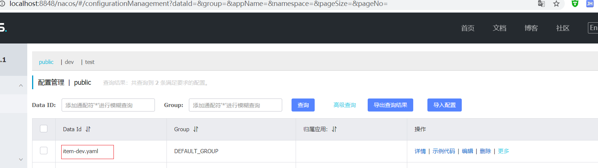

注意：这里创建两个 是为了简单起见，其实可以在nacos配置中心进行配置，这里我保留便于方便。


（5）登录sentinel控制台并设置

先启动nacos 和 微服务以及sentinel的控制台，并先访问下微服务：

```
http://localhost:18081/item/info
```

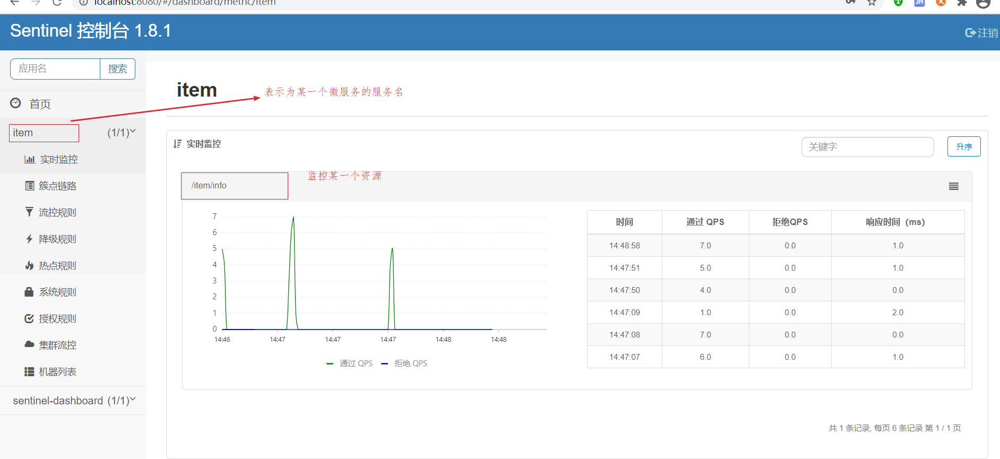

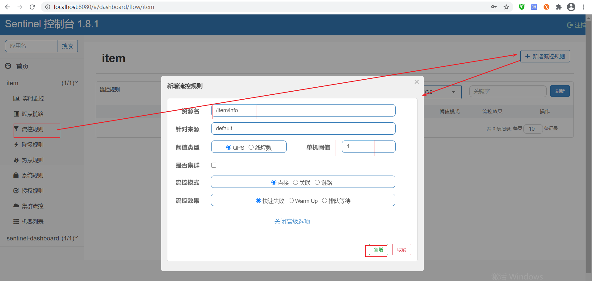


页面再进行访问频繁刷新，会出现如下界面：

 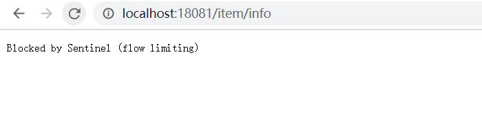

### 2.3 小结

+ sentinel 控制台服务端安装
+ sentinel 控制台对应客户端的安装（就是微服务）添加坐标即可
+ 登录sentinel控制台 默认用户名和密码为：sentinel/sentinel
+ 客户端配置 http 端口和 控制服务端地址
+ 控制台访问 并设置规则即可。

## 3 sentinel知识点

### 3.1 目标

+ 理解各个sentinel知识点的概念
+ 掌握各个知识点的常见的场景案例规则设置

### 3.2 讲解

#### 3.2.1 流控规则

##### 3.2.1.1 流量控制介绍

​	 流量控制在网络传输中是一个常用的概念，它用于调整网络包的发送数据。然而，从系统稳定性角度考虑，在处理请求的速度上，也有非常多的讲究。任意时间到来的请求往往是随机不可控的，而系统的处理能力是有限的。我们需要根据系统的处理能力对流量进行控制。Sentinel 作为一个调配器，可以根据需要把随机的请求调整成合适的形状，如下图所示：

 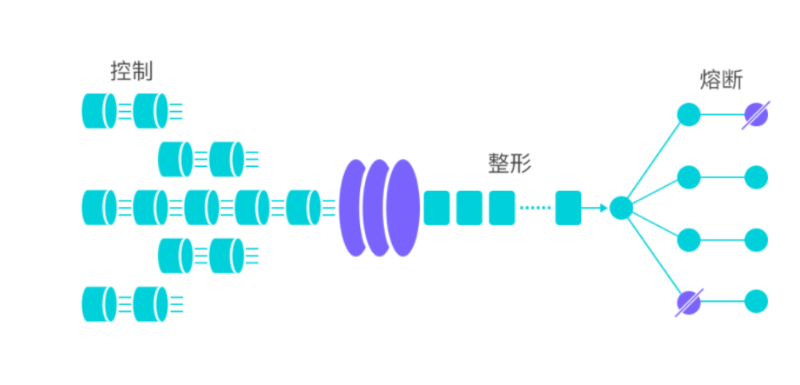

##### 3.2.1.2 流控规则

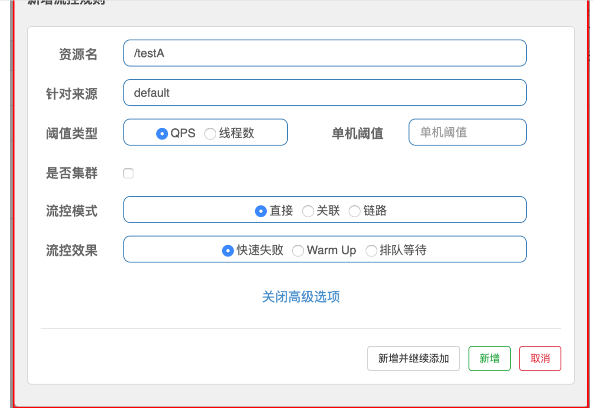

- 资源名： 唯一名称，默认请求路径
- 针对来源：Sentinel可以针对调用者进行限流，填写服务名，默default（不区分来源）
- 阈值类型/单机阈值
- QPS（每秒钟的请求数量）： 当调用该API的QPS达到阈值的时候，进行限流
- 线程数：当调用该API的线程数达到阈值的时候，进行限流
- 是否集群： 不需要集群
- 流控模式：
- 直接：API达到限流条件，直接限流
- 关联：当关联的资源达到阈值，就限流自己
- 链路：只记录指定链路上的流量（指定资源从入口资源进来的流量，如果达到阈值，就进行限流）
- 流控效果
- 快速失败：直接失败，抛异常
- Warm Up：根据codeFactor（冷加载因子，默认3）的值，从阈值/codeFactor,经过预热时长，才达到设置的QPS阈值
- 排队等待：匀速排队（RuleConstant.CONTROL_BEHAVIOR_RATE_LIMITER）方式会严格控制请求通过的间隔时间，也即是让请求以均匀的速度通过，对应的是漏桶算法。详细文档可以参考 流量控制 - 匀速器模式

 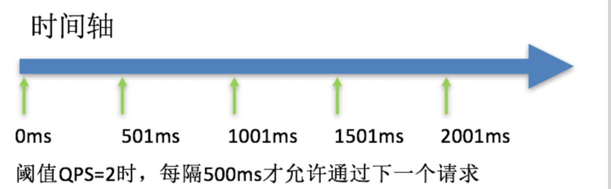


##### 3.2.1.3 阈值类型-QPS


如上图：

```properties
1.选择QPS 类型 并设置单机阈值为1
2.选择流控模式和流控效果为直接并快速失败
```


解释：

```properties
当访问/hello的资源的时候 采用限流，设置为阈值类型为QPS ，
当超过 阈值为 1 时 使用限流策略 直接快速失败即可
```


测试效果如下：

 

##### 3.2.1.4 阈值类型-线程数

编辑流控，选择线程数，设置阈值为1 


解释：

```
当请求/hello资源的时候 如果处理的线程数超过1 采用直接失败策略。
```


测试: 改java代码为：

```java
@RestController
public class TestController {

    @GetMapping(value = "/hello")
    public String hello() {
        try {
            Thread.sleep(1000);
        } catch (InterruptedException e) {
            e.printStackTrace();
        }
        return "Hello Sentinel";
    }

}
```

打开jemeter工具来模拟线程测试：

 


 


从图中可以看出 如果超过1个线程 就会报错，标识过多的请求429到来。

##### 3.2.1.5 流控模式-直接

​	流控模式 直接，指定的是选择如果满足了流控规则阈值，则采取的流控策略或方式。而直接模式为默认的模式。表示 针对该资源直接操作。

##### 3.2.1.6 流控模式-关联

​	流控模式 关联，指定的是选择如果满足了流控规则阈值，则采取的流控策略或方式，关联模式为 关联的资源，一般需要和流控效果一起组合使用。

即是 关联的资源触发规则，原来的资源触发流控效果。举例如下：

修改java代码：

```java
//资源1
@GetMapping(value = "/hello1")
public String hello1() {
    return "Hello Sentinel1";
}

//资源2
@GetMapping(value = "/hello2")
public String hello2() {
    return "Hello Sentinel2";
}
```


配置流控规则如下：

 


解释：

```properties
当我们访问/hello2的资源的时候 达到流控规则，则访问/hello1的资源的时候报错
```

测试：

 

 


再访问资源/hello1 则出现下面的错误信息：

 

##### 3.2.1.7 流控模式-链路


##### 3.2.1.8 流控效果-快速失败

流控效果的快速失败 实际上类似于hystrix熔断之后的兜底方法。一旦发生了错误或者触发了到规则的阈值，则采取的流控处理效果，这种效果之一就是快速失败，直接返回一个默认的兜底的值。

此处不再演示。上边已经演示过了。


##### 3.2.1.9 流控效果-warn-up

预热效果，当设置阈值之后，按照阈值的信息，根据冷加载因子 在配置的时间内达到预期的效果

修改代码：

```java
//资源3   warn-up
@GetMapping(value = "/hello3")
public String hello3() {
    return "Hello Sentinel3";
}
```

配置规则：

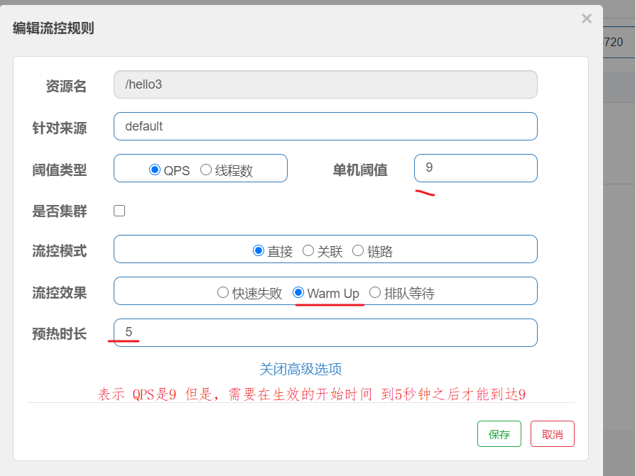

测试：

配置完成之后，重新刷新，会报错限流，但是经过5秒钟之后，就达到了QPS为9的效果了。


##### 3.2.1.10 流控效果-排队等候

匀速排队（`RuleConstant.CONTROL_BEHAVIOR_RATE_LIMITER`）方式会严格控制请求通过的间隔时间，也即是让请求以均匀的速度通过，对应的是漏桶算法。

这种方式主要用于处理间隔性突发的流量，例如消息队列。想象一下这样的场景，在某一秒有大量的请求到来，而接下来的几秒则处于空闲状态，我们希望系统能够在接下来的空闲期间逐渐处理这些请求，而不是在第一秒直接拒绝多余的请求。

匀速器模式：

`<https://github.com/alibaba/Sentinel/wiki/%E6%B5%81%E9%87%8F%E6%8E%A7%E5%88%B6-%E5%8C%80%E9%80%9F%E6%8E%92%E9%98%9F%E6%A8%A1%E5%BC%8F>`


修改代码：

```java
//资源4   RATE_LIMITER 匀速排队
@GetMapping(value = "/hello4")
public String hello4() {
    return "Hello Sentinel4";
}
```


配置：

 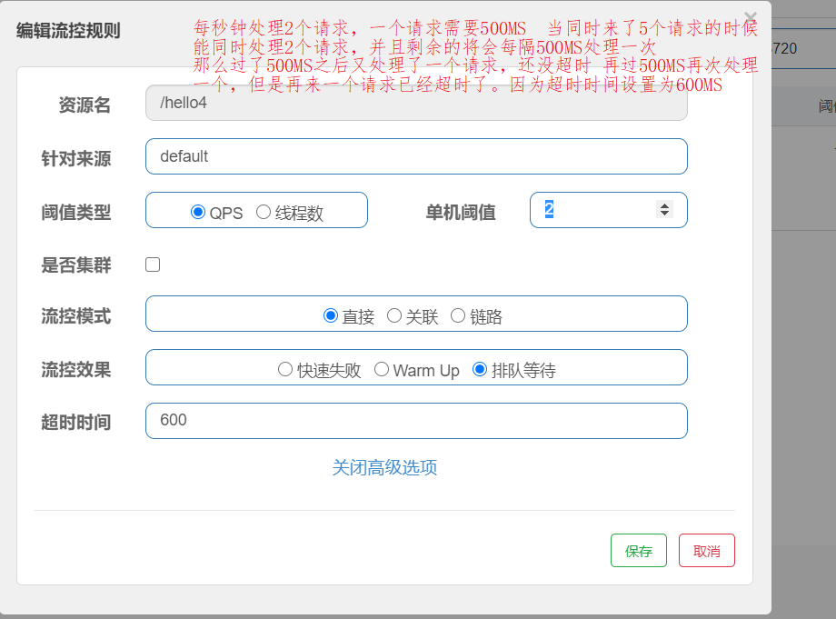


测试：

 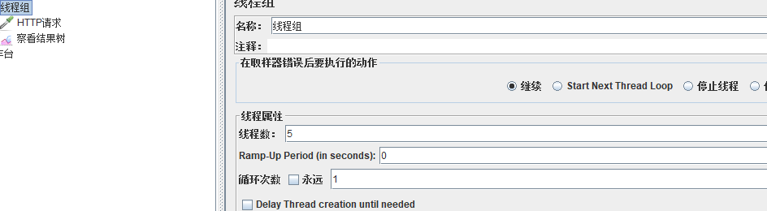

 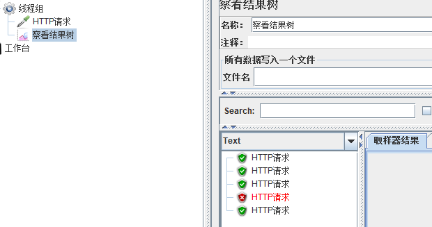


#### 3.2.2 熔断降级

##### 3.2.2.1 降级说明

​	除了流量控制以外，对调用链路中不稳定的资源进行熔断降级也是保障高可用的重要措施之一。一个服务常常会调用别的模块，可能是另外的一个远程服务、数据库，或者第三方 API 等。例如，支付的时候，可能需要远程调用银联提供的 API；查询某个商品的价格，可能需要进行数据库查询。然而，这个被依赖服务的稳定性是不能保证的。如果依赖的服务出现了不稳定的情况，请求的响应时间变长，那么调用服务的方法的响应时间也会变长，线程会产生堆积，最终可能耗尽业务自身的线程池，服务本身也变得不可用。

在限制的手段上，Sentinel 和 Hystrix 采取了完全不一样的方法。

Hystrix 通过 线程池隔离 的方式，来对依赖（在 Sentinel 的概念中对应 资源）进行了隔离。这样做的好处是资源和资源之间做到了最彻底的隔离。缺点是除了增加了线程切换的成本（过多的线程池导致线程数目过多），还需要预先给各个资源做线程池大小的分配。

Sentinel 对这个问题采取了两种手段:

- 通过并发线程数进行限制
  和资源池隔离的方法不同，Sentinel 通过限制资源并发线程的数量，来减少不稳定资源对其它资源的影响。这样不但没有线程切换的损耗，也不需要您预先分配线程池的大小。当某个资源出现不稳定的情况下，例如响应时间变长，对资源的直接影响就是会造成线程数的逐步堆积。当线程数在特定资源上堆积到一定的数量之后，对该资源的新请求就会被拒绝。堆积的线程完成任务后才开始继续接收请求。
- 通过响应时间对资源进行降级
  除了对并发线程数进行控制以外，Sentinel 还可以通过响应时间来快速降级不稳定的资源。当依赖的资源出现响应时间过长后，所有对该资源的访问都会被直接拒绝，直到过了指定的时间窗口之后才重新恢复。

Sentinel的断路器是没有半开状态的（半开的状态，系统会自动检测是否请求有异常，没有异常就关闭断路器恢复使用，有异常则继续打开断路器不可用）， Hystrix有

##### 3.2.2.2 降级策略


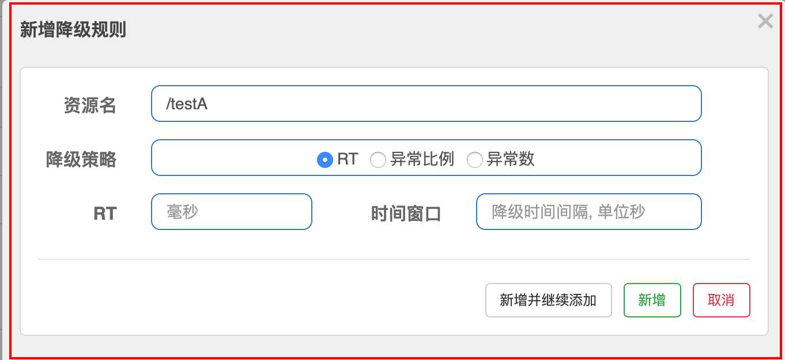 

- 资源名： 唯一名称，默认请求路径
- 降级策略
  - 平均响应时间 (DEGRADE_GRADE_RT)：当 1s 内持续进入 N 个请求，对应时刻的平均响应时间（秒级）均超过阈值（count，以 ms 为单位），那么在接下的时间窗口（DegradeRule 中的 timeWindow，以 s 为单位）之内，对这个方法的调用都会自动地熔断（抛出 DegradeException）。注意 Sentinel 默认统计的 RT 上限是 4900 ms，超出此阈值的都会算作 4900 ms，若需要变更此上限可以通过启动配置项 -Dcsp.sentinel.statistic.max.rt=xxx 来配置。
  - 异常比例 (DEGRADE_GRADE_EXCEPTION_RATIO)：当资源的每秒请求量 >= N（可配置），并且每秒异常总数占通过量的比值超过阈值（DegradeRule 中的 count）之后，资源进入降级状态，即在接下的时间窗口（DegradeRule 中的 timeWindow，以 s 为单位）之内，对这个方法的调用都会自动地返回。异常比率的阈值范围是 [0.0, 1.0]，代表 0% - 100%。
  - 异常数 (DEGRADE_GRADE_EXCEPTION_COUNT)：当资源近 1 分钟的异常数目超过阈值之后会进行熔断。注意由于统计时间窗口是分钟级别的，若 timeWindow 小于 60s，则结束熔断状态后仍可能再进入熔断状态。

##### 3.2.2.3 RT策略

修改代码

```java
//资源5  降级
@GetMapping(value = "/hello5")
public String hello5() {
    try {
        Thread.sleep(1000);
    } catch (InterruptedException e) {
        e.printStackTrace();
    }
    return "Hello Sentinel5";
}
```


修改配置：

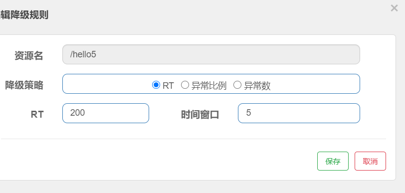

解释：

```properties
如果1S钟内进入N个请求，如果响应时间大于200毫秒，在接下来的5S之内不能使用，将会被降级处理
```

测试：

添加10个线程，一秒钟内达到10个线程，并且永远每隔1S就发送10个请求过来。先点击启动

 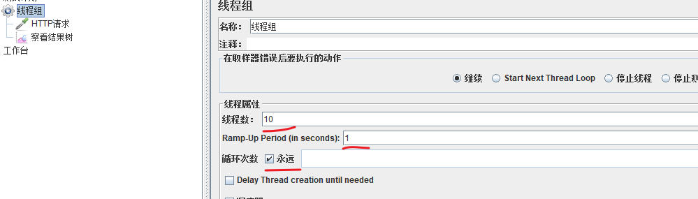

再在浏览器中访问：会出现如下所示，但是当过5S钟之后再访问又可以，与此同时，由于10个线程进入，又会出现降级

 

##### 3.2.2.4  异常比例策略

修改代码：

```java
@GetMapping(value = "/hello6")
public String hello6() {
    int i=1/0;
    return "Hello Sentinel6";
}
```


修改配置：


解释：

```properties
当访问资源/hello6的时候 如果在1S内持续进入大于N个请求中，发送了异常，所占的比例为50%的时候，在接下来的5S内 自动熔断。
```

测试：


浏览器访问展示如下图所示：

 


##### 3.2.2.5 异常数策略

修改代码：

```java
//资源7  降级  异常数
@GetMapping(value = "/hello7")
public String hello7() {
    int i = 1 / 0;
    return "Hello Sentinel7";
}
```


修改配置：


解释：

```properties
当访问请求的路径/hello7 发生了异常，并产生了5个异常数量之后，再次访问的时候就会降级返回默认的错误信息，时间窗口再经过5秒钟之后，再次访问又一次进行计算。
```


测试：

浏览器访问路径：`localhost:9001/hello7`


多访问5次之后再次访问，变成如下所示：

 


#### 3.2.3 热点限流

何为热点？热点即经常访问的数据。很多时候我们希望统计某个热点数据中访问频次最高的 Top K 数据，并对其访问进行限制。比如：

- 商品 ID 为参数，统计一段时间内最常购买的商品 ID 并进行限制
- 用户 ID 为参数，针对一段时间内频繁访问的用户 ID 进行限制

热点参数限流会统计传入参数中的热点参数，并根据配置的限流阈值与模式，对包含热点参数的资源调用进行限流。热点参数限流可以看做是一种特殊的流量控制，仅对包含热点参数的资源调用生效。

 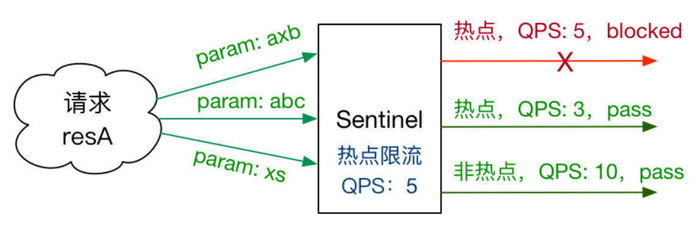

Sentinel 利用 LRU 策略统计最近最常访问的热点参数，结合令牌桶算法来进行参数级别的流控。热点参数限流支持集群模式。


##### 3.2.3.1 使用

 

- 资源名： 唯一名称，默认请求路径
- 参数索引：传入参数的索引（0开始技术）
- 单机阈值：当调用该API的QPS达到阈值的时候，进行限流

##### 3.2.3.2 案例说明

 修改代码：

```java
//资源8  热点key限流
@GetMapping(value = "/hello8")
@SentinelResource("hello8")
public String hello8(@RequestParam(required = false) String userId, @RequestParam(required = false) String skuId) {
    return "Hello Sentinel8";
}
```

 解释：

```properties
@SentinelResource("hello8") 为注解 标识资源名称
```

配置规则：

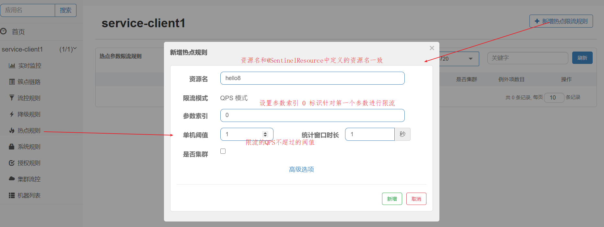


测试：

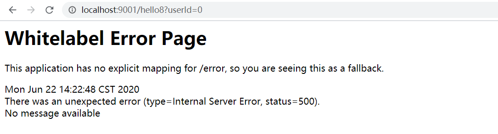

超过1的阈值之后将出现如图所示错误。表示 限流规则生效，后台发生异常信息：

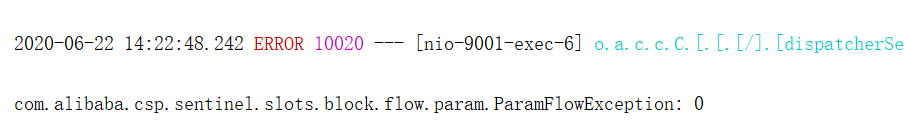

以上是正常的现象，但是一般情况下发生了错误，不应该给用户返回错误500信息，我们应该给一个兜底的方法返回默认的数据类似于hystrix一样。改造如下：

代码修改如下：

```java
//资源8  热点key限流
@GetMapping(value = "/hello8")
@SentinelResource(value="hello8",blockHandler = "handlerExecption")
public String hello8(@RequestParam(required = false) String userId, @RequestParam(required = false) String skuId) {
    return "Hello Sentinel8";
}
//BlockException 是上边那个异常的父类，用于发送异常由该方法处理
public String handlerExecption(String userId, String skuId, BlockException e) {
    return "兜底的方法 当上边的方法报错的时候输出："+userId;
}
```


测试：

 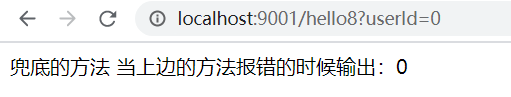

(2)例外参数 

如果有这种需求，当userId的参数为某一个特定的值时，我们的限流规则可能和其他的参数不一样，这种情况下需要用到例外参数

例如：修改规则：

 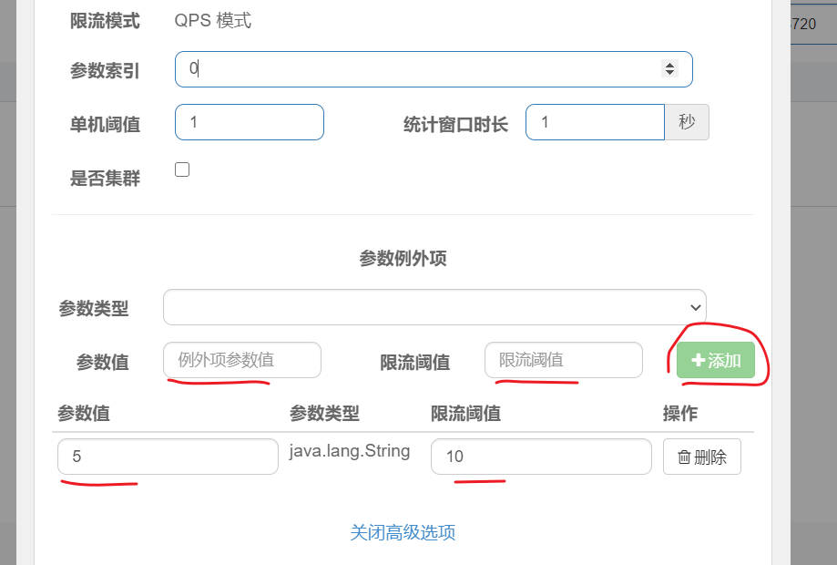

解释：

```properties
标识当userId参数为的值为5的时候限流的QPS为10
```

 

浏览器中输入serId为5的时候 不管怎么刷新都不会报错了。

注意：

```properties
参数类型为基本类型+字符串类型 另外针对同一资源可以设置不同参数的限流规则，只需要添加一行即可,如下图所示
```

 


#### 3.2.4 注解埋点

##### 3.2.4.1 注解介绍

​	Sentinel 提供了 @SentinelResource 注解用于定义资源，并提供了 AspectJ 的扩展用于自动定义资源、处理 BlockException 等。常见属性：

- value

  资源名称，必需项，因为需要通过resource name找到对应的规则，这个是必须配置的。

- blockHandler

  blockHandler 对应处理 BlockException 的函数名称，可选项。
  blockHandler 函数访问范围需要是 public，返回类型需要与原方法相匹配，
  参数类型需要和原方法相匹配并且最后加一个额外的参数，类型为 BlockException。

- blockHandlerClass

  ​	blockHandler 函数默认需要和原方法在同一个类中，如果希望使用其他类的函数，
  则需要指定 blockHandlerClass 为对应的类的 Class 对象，注意对应的函数必需为 static 函数，否则无法解析。

- fallback

  ​	fallback 函数名称，可选项，用于在抛出异常的时候提供 fallback 处理逻辑。
  fallback 函数可以针对所有类型的异常（除了 exceptionsToIgnore 里面排除掉的异常类型）进行处理。

- fallbackClass

  fallbackClass的应用和blockHandlerClass类似，fallback 函数默认需要和原方法在同一个类中。
  若希望使用其他类的函数，则可以指定 fallbackClass 为对应的类的 Class 对象，注意对应的函数必需为 static 函数，否则无法解析。

- exceptionsToIgnore（since 1.6.0）

  用于指定哪些异常被排除掉，不会计入异常统计中，也不会进入 fallback 逻辑中，而是会原样抛出。

- defaultFallback（since 1.6.0）

  如果没有配置defaultFallback方法，默认都会走到这里来。
  默认的 fallback 函数名称，可选项，通常用于通用的 fallback 逻辑。
  默认 fallback 函数可以针对所有类型的异常（除了 exceptionsToIgnore 里面排除掉的异常类型）进行处理。
  若同时配置了 fallback 和 defaultFallback，则只有 fallback 会生效。

`https://github.com/alibaba/Sentinel/wiki/%E6%B3%A8%E8%A7%A3%E6%94%AF%E6%8C%81`

##### 3.2.4.2 注解使用

1）局部使用

编写controller代码：

```java

//资源9  热点key限流
@GetMapping(value = "/hello9")
@SentinelResource(value="hello9",blockHandler = "handlerExecption9")
public String hello9() {
    return "Hello Sentinel9";
}

public String handlerExecption9(BlockException e) {
    return "handlerExecption9 兜底的方法 当上边的方法报错的时候输出：";
}
```

控制台编辑规则：

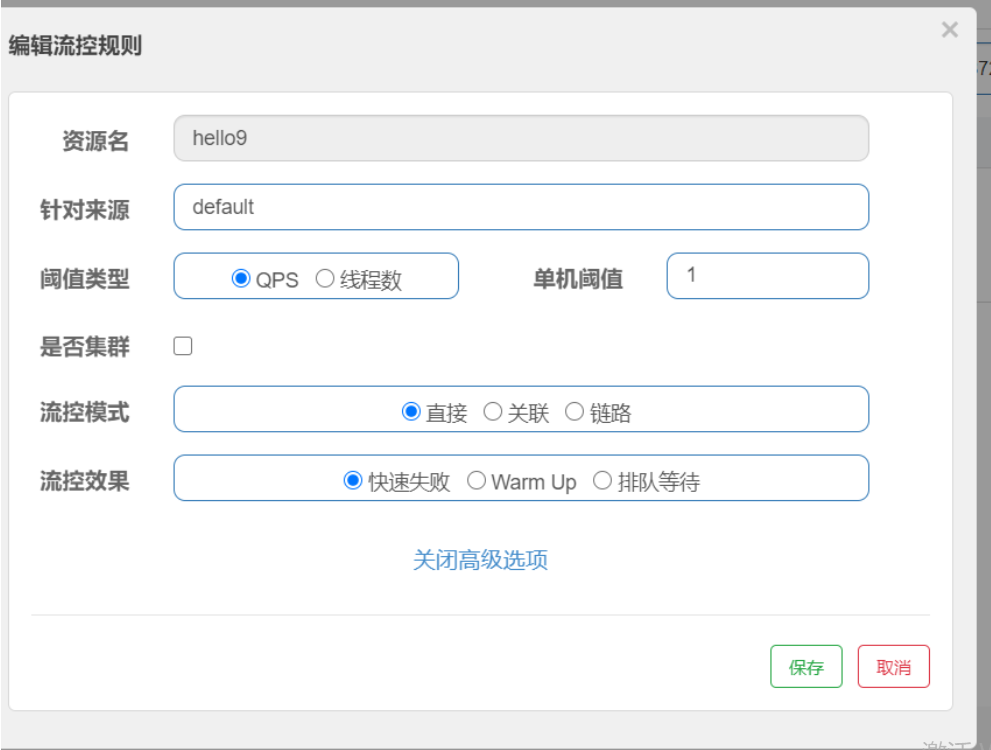

测试：QPS超过1的时候

 


2）全局使用

注意：方法必须是静态方法

```java
public class CustomerHandler {
    //处理sentinel产生的异常 （指的是 如果触发了限流就会抛出该异常）
    public static String handleBlock(BlockException e) {
        return "String 兜底的数据";
    }

    //处理系统本身的异常
    public static String handleFallback(Throwable t) {
        return "String："+t.getMessage();
    }
}
```


注意：编写controller:

```java
//资源10
@GetMapping(value = "/hello10")
@SentinelResource(value = "hello10", blockHandlerClass = CustomerHandler.class,blockHandler = "handleBlock")
public String hello10() {
    return "Hello Sentinel10";
}
```

3）fallback属性

fallback 用于在业务发生错误的时候，需要兜底的时候指定兜底的方法，这类似于hystrix

```java
@GetMapping(value = "/hello11")
@SentinelResource(value = "hello11", blockHandlerClass = CustomerHandler.class,blockHandler = "handleBlock",fallback = "bsFallback")
public String hello11() {
    int i=1/0;
    return "Hello Sentinel11";
}

public String bsFallback() {
    return "业务报错了就要返回该兜底方法";
}
```

异常处理类：

```java
public class CustomerHandler {
    //处理sentinel产生的异常 （指的是 如果触发了限流就会抛出该异常）
    public static String handleBlock(BlockException e) {
        return "String 流控报错了或者说限流发生了  使用该方法返回兜底的数据";
    }

    //处理系统本身的异常
    public static String handleFallback(Throwable t) {
        return "String："+t.getMessage();
    }
}
```

配置规则：

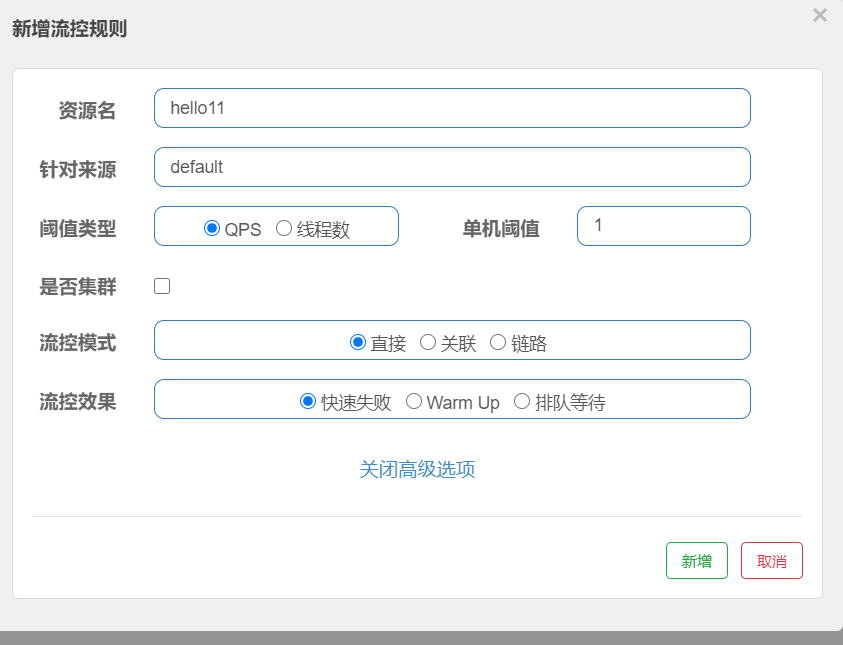


测试：访问路径时即报错 调用业务的兜底方法：

 

疯狂刷新之后显示如下：

 


#### 3.2.5 Sentinel整合feign

##### 3.2.5.1 整合说明

当feign调用发生错误的时候，如果调用方自己进行处理熔断降级，那么如果多个地方出现了该错误，就要要求多个地方都要处理。所以相对来说比较麻烦。我们可以统一在feign接口上进行容错处理。这样调用方只需要调用接口即可，不需要关心容错。这样有利于维护升级。

 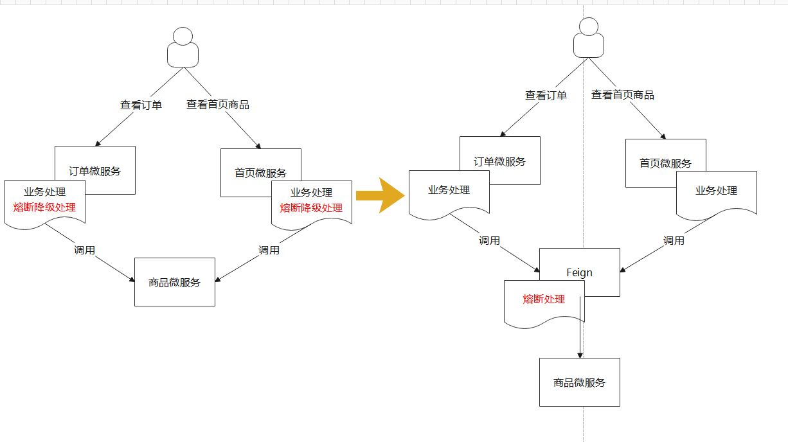

如上图所示：

```properties
左侧 如果没有Feign上进行处理，那么需要各自在自己的业务代码中逻辑中进行熔断降级处理，如果多个地方调用，那么多个地方都要进行处理

右侧 有了feign的支持之后，我们可以在feign接口上进行统一熔断降级处理，还可以抽取出来独立lib 供其他微服务进行调用，当然也可以不抽取，这样就有利于统一修改，维护升级方便，处理粒度更细
```


##### 3.2.5.2 整合操作步骤

（1）流程说明

```properties
使用现有的微服务 通过订单微服务 调用 商品微服务进行测试。并模拟商品微服务调用出错。
```

（2）itheima-order项目中添加坐标

```xml
<dependency>
    <groupId>com.alibaba.cloud</groupId>
    <artifactId>spring-cloud-starter-alibaba-sentinel</artifactId>
</dependency>
```

（3）配置yaml

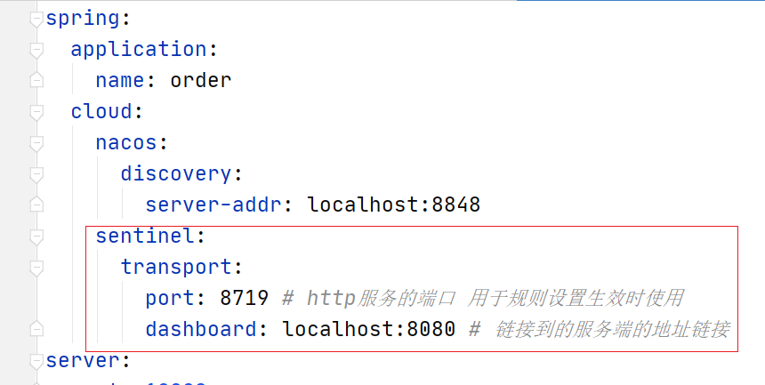

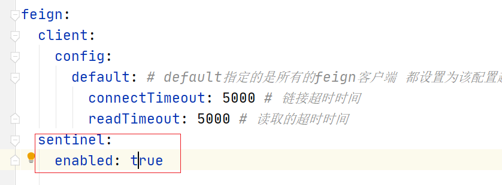

整体代码如下：

```yaml
spring:
  application:
    name: order
  cloud:
    nacos:
      discovery:
        server-addr: localhost:8848
    sentinel:
      transport:
        port: 8719 # http服务的端口 用于规则设置生效时使用
        dashboard: localhost:8080 # 链接到的服务端的地址链接
server:
  port: 18082
item:
  ribbon:
    #轮询
    NFLoadBalancerRuleClassName: com.netflix.loadbalancer.RoundRobinRule
#    NFLoadBalancerRuleClassName: com.itheima.rule.MyRule
#ribbon:
#  eager-load:
#    enabled: true
#    clients: item

feign:
  client:
    config:
      default: # default指定的是所有的feign客户端 都设置为该配置超时时间
        connectTimeout: 5000 # 链接超时时间
        readTimeout: 5000 # 读取的超时时间
  sentinel:
    enabled: true
```


（4）创建feign接口的实现类 实现类中的方法即为降级方法

 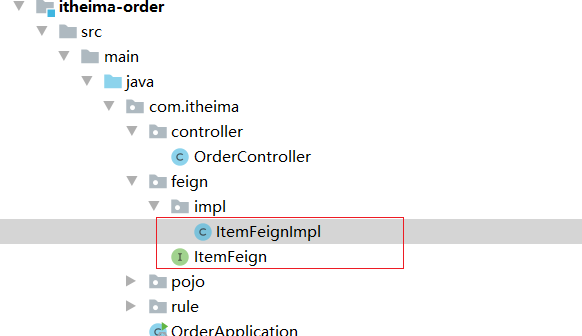

```java
@Component
public class ItemFeignImpl implements ItemFeign {
    @Override
    public OrderInfo getOrderInfo(String itemId) {
        OrderInfo orderInfo = new OrderInfo();
        orderInfo.setItemName("华为默认手机");
        orderInfo.setPrice(1999L);
        orderInfo.setItemId("SMR:00001");
        return orderInfo;
    }
}
```

Feign接口中添加fallback指定错误时使用的兜底方法所在的类：

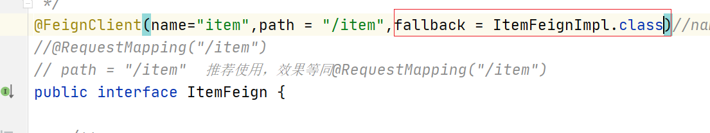


（5）在itheima-item项目中模拟异常

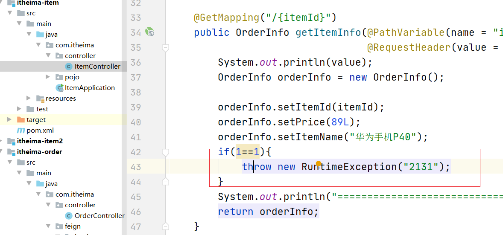

（6）调用

启动dashbord 和微服务 浏览器中输入地址：

```
http://localhost:18082/order/zhangsan
```

 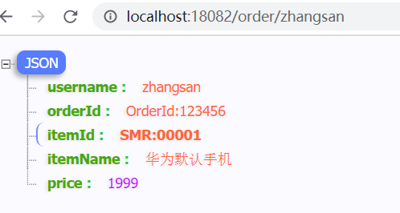

出现如上数据，并不是具体itheima-item项目中返回的数据了。

## 4 spring cloud sleuth+zipkin

### 4.1 目标

+ 理解微服务中的调用问题
+ 理解分布式跟踪相关的概念以及什么是spring cloud sleuth 和zipkin
+ 掌握spring cloud sleuth整合zipkin的基本使用

### 4.2 讲解

#### 4.2.1 案例说明

​	在微服务调用中。一旦出现调用链路过长，出现了问题，那么就需要出问题所在点，就需要知道他们之间的服务调用关系，根据日志追踪到某一个微服务，才能发现问题，并解决问题，但是往往大型的微服务系统的数量很多，调用链路很复杂，需要及时的跟踪和发现才可以。由此就需要一个分布式跟踪链路调用的工具帮助我们定位问题。

​	现今业界分布式服务跟踪的理论基础主要来自于 Google 的一篇论文[《Dapper, a Large-Scale Distributed Systems Tracing Infrastructure》](https://research.google.com/pubs/pub36356.html)，使用最为广泛的开源实现是 Twitter 的 Zipkin，为了实现平台无关、厂商无关的分布式服务跟踪，CNCF 发布了布式服务跟踪标准 Open Tracing。国内，淘宝的“鹰眼”、京东的“Hydra”、大众点评的“CAT”、新浪的“Watchman”、唯品会的“Microscope”、窝窝网的“Tracing”都是这样的系统。

一般的，一个分布式服务跟踪系统，主要有三部分：数据收集、数据存储和数据展示。根据系统大小不同，每一部分的结构又有一定变化。譬如，对于大规模分布式系统，数据存储可分为实时数据和全量数据两部分，实时数据用于故障排查（troubleshooting），全量数据用于系统优化；数据收集除了支持平台无关和开发语言无关系统的数据收集，还包括异步数据收集（需要跟踪队列中的消息，保证调用的连贯性），以及确保更小的侵入性；数据展示又涉及到数据挖掘和分析。虽然每一部分都可能变得很复杂，但基本原理都类似。

 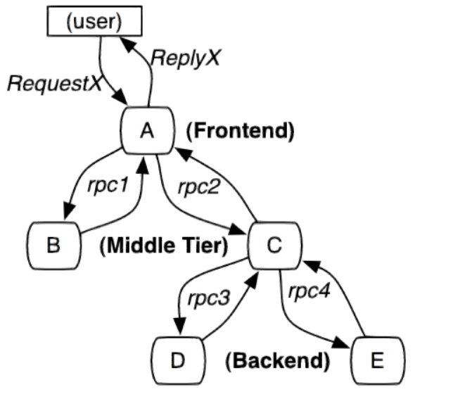


服务追踪的追踪单元是从客户发起请求（request）抵达被追踪系统的边界开始，到被追踪系统向客户返回响应（response）为止的过程，称为一个“trace”。每个 trace 中会调用若干个服务，为了记录调用了哪些服务，以及每次调用的消耗时间等信息，在每次调用服务时，埋入一个调用记录，称为一个“span”。这样，若干个有序的 span 就组成了一个 trace。在系统向外界提供服务的过程中，会不断地有请求和响应发生，也就会不断生成 trace，把这些带有span 的 trace 记录下来，就可以描绘出一幅系统的服务拓扑图。附带上 span 中的响应时间，以及请求成功与否等信息，就可以在发生问题的时候，找到异常的服务；根据历史数据，还可以从系统整体层面分析出哪里性能差，定位性能优化的目标。

Spring Cloud Sleuth为服务之间调用提供链路追踪。通过Sleuth可以很清楚的了解到一个服务请求经过了哪些服务，每个服务处理花费了多长。从而让我们可以很方便的理清各微服务间的调用关系。此外Sleuth可以帮助我们：

- 耗时分析: 通过Sleuth可以很方便的了解到每个采样请求的耗时，从而分析出哪些服务调用比较耗时;
- 可视化错误: 对于程序未捕捉的异常，可以通过集成Zipkin服务界面上看到;
- 链路优化: 对于调用比较频繁的服务，可以针对这些服务实施一些优化措施。

spring cloud sleuth可以结合zipkin，将信息发送到zipkin，利用zipkin的存储来存储信息，利用zipkin ui来展示数据。

通过zipkin的UI可以展示调用的链路情况信息。方便我们进行追踪。

 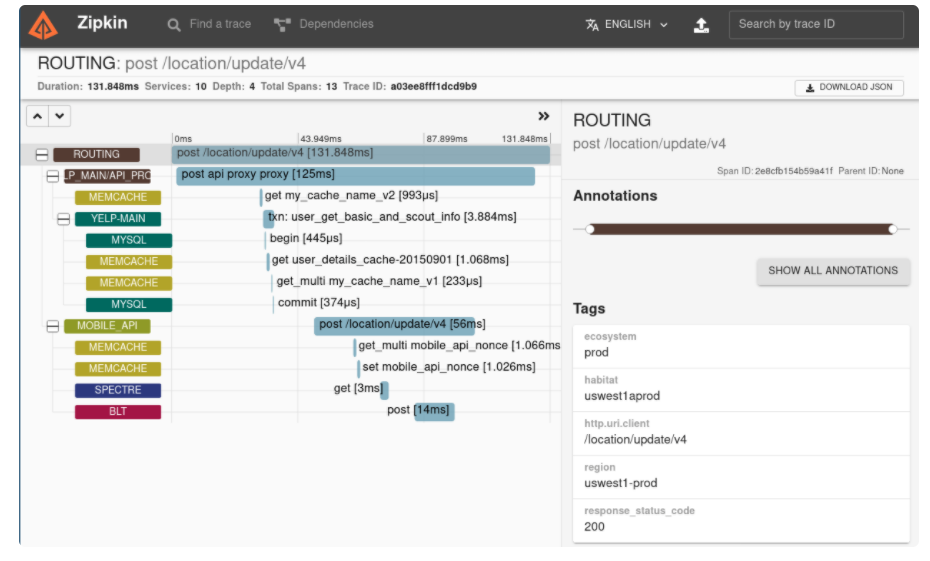

#### 4.2.2 什么是spring cloud sleuth

官方的解释：spring cloud sleuth

```properties
Spring Cloud Sleuth provides API for distributed tracing solution for Spring Cloud. It integrates with OpenZipkin Brave

Spring Cloud Sleuth is able to trace your requests and messages so that you can correlate that communication to corresponding log entries. You can also export the tracing information to an external system to visualize latency. Spring Cloud Sleuth supports OpenZipkin compatible systems directly.
```


spring cloud sleuth 是**springcloud家族**中提供的一个组件 用于实现分布式跟踪，它集成了openzipkin的brave组件。Spring Cloud Sleuth直接支持[OpenZipkin](https://zipkin.io/)兼容系统

openzipkin是什么？

```
openZipkin也就是一般意义上的zipkin。 openzipkin（用于分布式跟踪的一套组件的总称）中有很多组件，包括了brave zipkin ui等。
```

brave是什么？

```properties
Brave is a distributed tracing instrumentation library. Brave typically intercepts production requests to gather timing data, correlate and propagate trace contexts. While typically trace data is sent to Zipkin server, third-party plugins are available to send to alternate services
翻译下：
基于java的用于分布式跟踪服务zipkin的一个实现。简单说：（工具lib）就是一个jar包。
```

zipkin是什么？可以参考：`https://zipkin.io/`

Zipkin是一款开源的分布式实时数据追踪系统（Distributed Tracking System），基于 [Google Dapper]的论文设计而来，由 Twitter 公司开发贡献。其主要功能是聚集来自各个异构系统的实时监控数据，用来追踪微服务架构下的系统延时问题。

应用系统需要进行装备（instrument）以向 Zipkin 报告数据。Zipkin 的用户界面可以呈现一幅关联图表，以显示有多少被追踪的请求通过了每一层应用。

总结：

```properties
spring cloud sleuth 是spring cloud 家族的基于brave的工具库的 组件 实现分布式跟踪
zipkin 是一个开源的分布式实时数据追踪系统，用存储和聚集实时监控数据，进行展示和汇报的一套系统，它包含了ui界面，核心依赖库等众多组件。
而spring cloud sleuth可以集成zipkin进行实现。

spring cloud sleuth 用于追踪数据

zipkin 服务端用于存储数据，分析数据

zipkin ui 用于展示调用链路数据

通常来讲两者需要结合使用。当然其他的分布式最终系统也是可以的，国内也有很多。
```

#### 4.2.3 基础概念

**Span**：这是调用链中基本的工作单元，例如发送一个RPC请求是一个Span。每个Span都有一个64位的唯一的ID。Span也包含了其他的数据，例如描述、时间戳等。

**Trace**：一个由一组Span构成的树形结构。通常我们可以认为一个调用链就相当于一个Trace。

**Annotation**：用来记录事件的各个状态。通常我们可以用下面的内容来表示服务端和客户端在一个事件中的接收和发送状态。

- cs：客户端发送状态。客户端已经发送了一个请求，这个注释表示一个Span的开始。
- sr：服务端接收状态。服务端接收请求并且开始处理。根据sr和cs的时间，我们可以计算出来网络延迟。
- ss：服务端发送状态。这个注释用于在一个请求处理已经完成（响应将发送给客户端）的时候。通过ss和sr的计算我们可以得到服务端处理请求耗费的时间。
- cr：客户端接收状态。预示着Span结束。这个状态表示客户端已经成功收取到了响应从服务端。通过cr与cs的计算，我们可以的得到整个请求的耗时。

 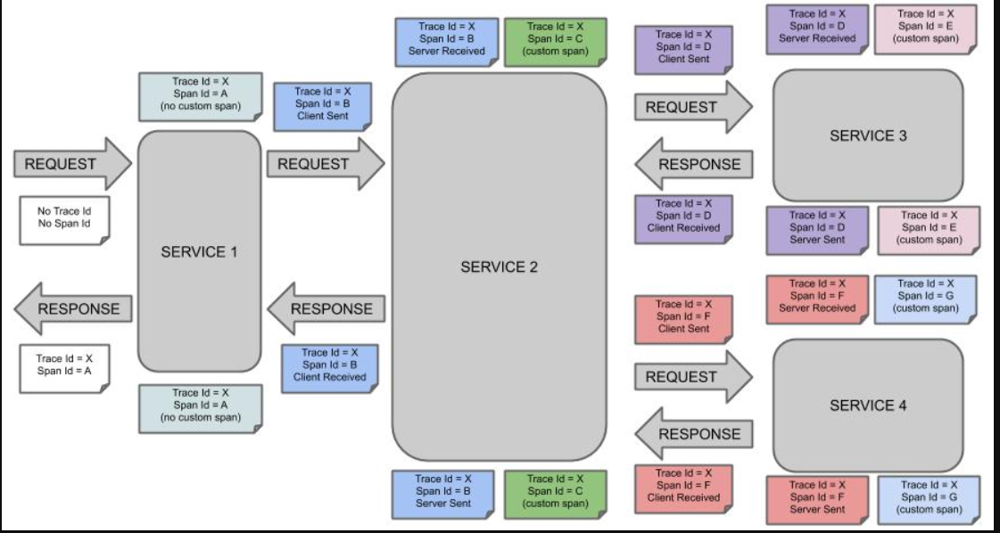


每一种颜色代表的就是一个span,如图 大概有7种 。例如：

```properties
Trace Id = X
Span Id = D
Client Sent
```


#### 4.2.4 使用spring cloud sleuth+zipkin

我们使用spring cloud sleuth来收集数据，跟踪数据，用zipkin来进行存储和展示数据。架构如下

 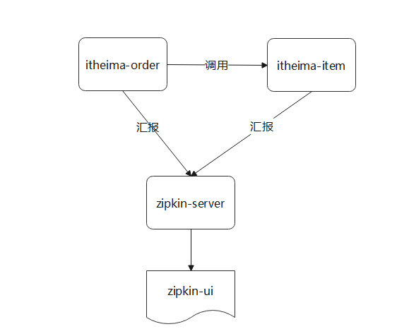

（1）下载zipkin-server

```
https://search.maven.org/remote_content?g=io.zipkin&a=zipkin-server&v=LATEST&c=exec
```

（2）执行java命令行

```
java -jar zipkin-server-2.23.2-exec.jar
```

 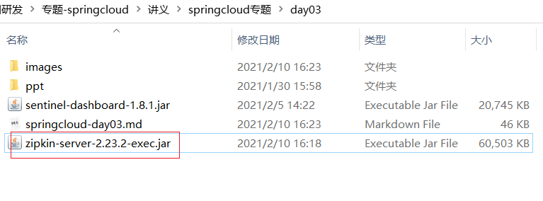

浏览器中访问：localhost:9411 如下图

 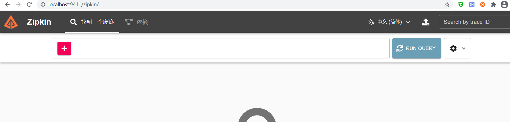


(3)搭建微服务 添加spring cloud sleuth坐标

在itheima-order和itheima-item项目中添加如下坐标，里面已经包含了spring cloud sleuth 和zipkin了

```xml
<dependency>
    <groupId>org.springframework.cloud</groupId>
    <artifactId>spring-cloud-starter-zipkin</artifactId>
</dependency>
```

 


（4）配置连接zipkin服务端的配置项 ，在itheima-order项目和itheima-item项目中都配置如下

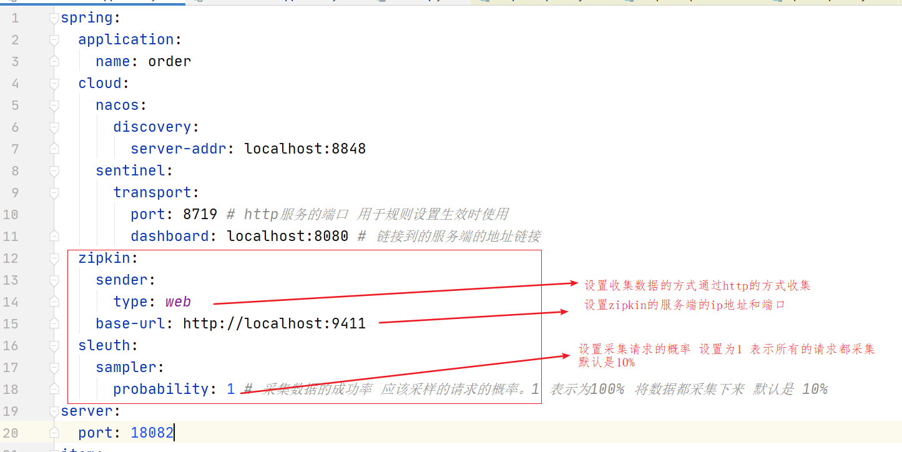

（5）启动微服务 

浏览器输入地址：`http://localhost:18082/order/zhangsan`

 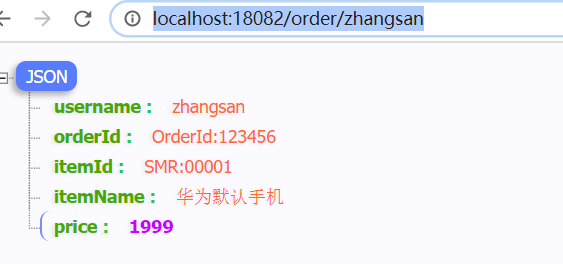

并在localhost:9411上查询信息如下

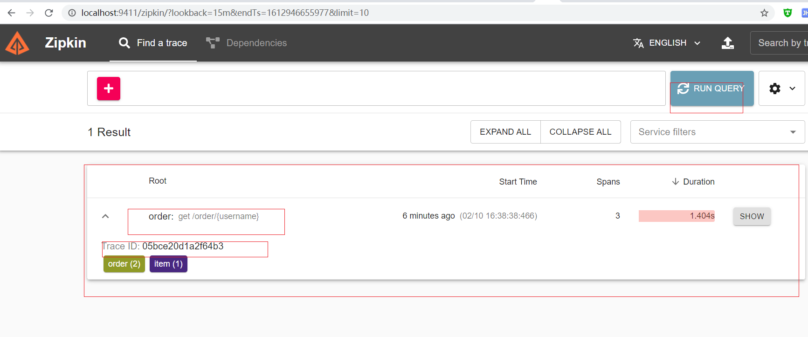

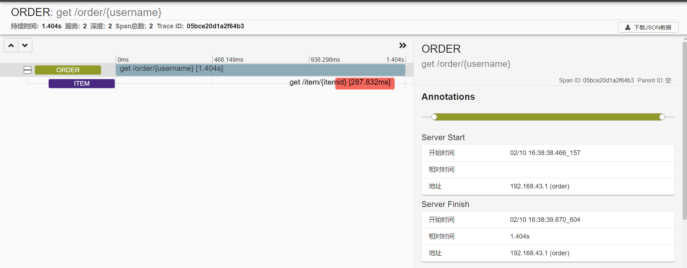


依赖关系如下：

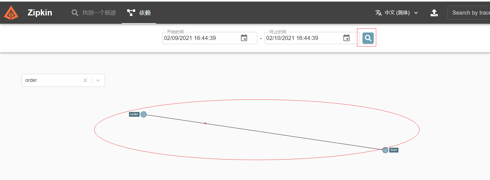


这样就可以知道微服务之间的调用关系了。并且能知道调用链路和调用的消耗的时间等。

