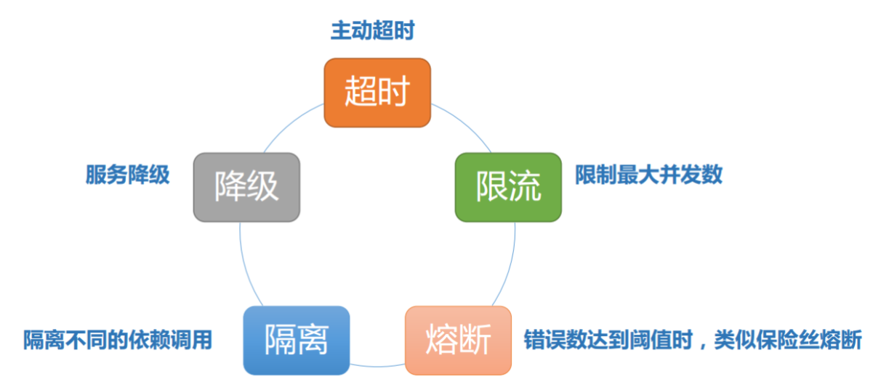
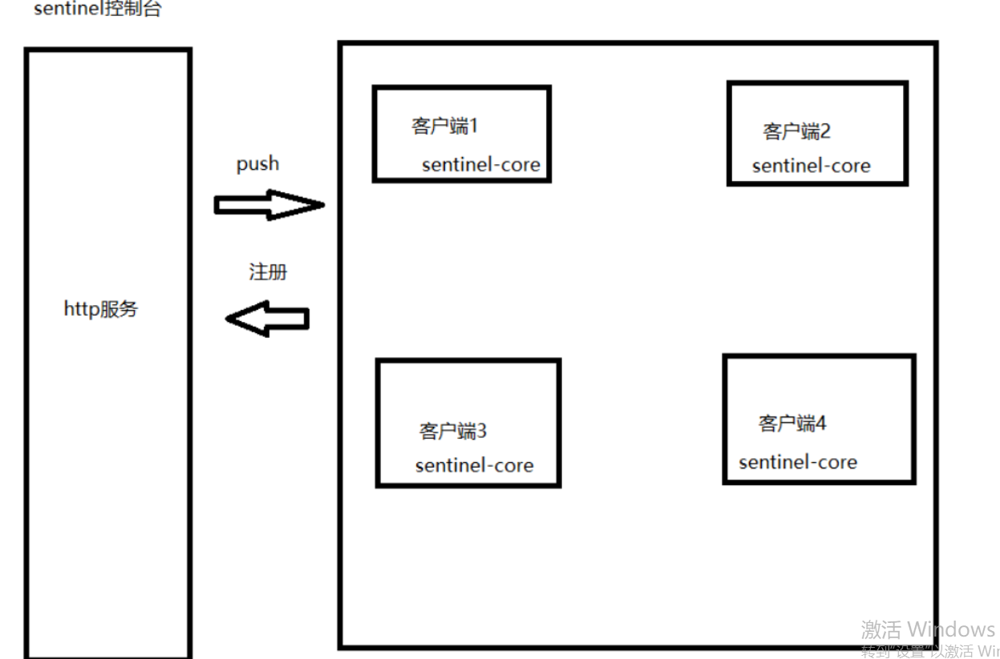

# springcloud day03

## 目标

+ 理解雪崩效应及相关的解决办法（掌握）
+ 使用sentinel(了解)
+ 使用sentinel + feign集成使用 解决雪崩的解决问题（掌握）
+ 理解链路跟踪以及相关概念
+ 掌握zipkin+sleuth的整合


## 1 雪崩效应

```
由于微服务调用 出现了某一个服务的故障，引起其他的级联的微服务调用出现问题，从而引发雪崩效应。
```

## 2  防止雪崩效应的解决方案



## 3.阿里巴巴sentinel框架





## 4.注解

```properties
@SentinelResource 作用就是指定资源---》请求路径 

@SentinelResource(value="hello8",blockHandler = "handlerException",fallback = "fallbacks")

blockHandler 指定处理 出现了流控 异常的时候调用 
fallback 指定处理 系统业务出现的异常的 使用。
```


## 5feign集成sentinel

```
1.在微服务中添加sentinel起步依赖
2.yml中进行配置 让feign支持sentinel
3.编写feign接口对应的实现类 交给spring容器管理
4.在feign接口上的注解@feignclient 其中一个属性fallback 指定 实现的类字节码对象即可。 实现类中的方法就是兜底的方法。
```


