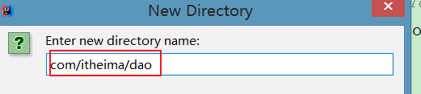
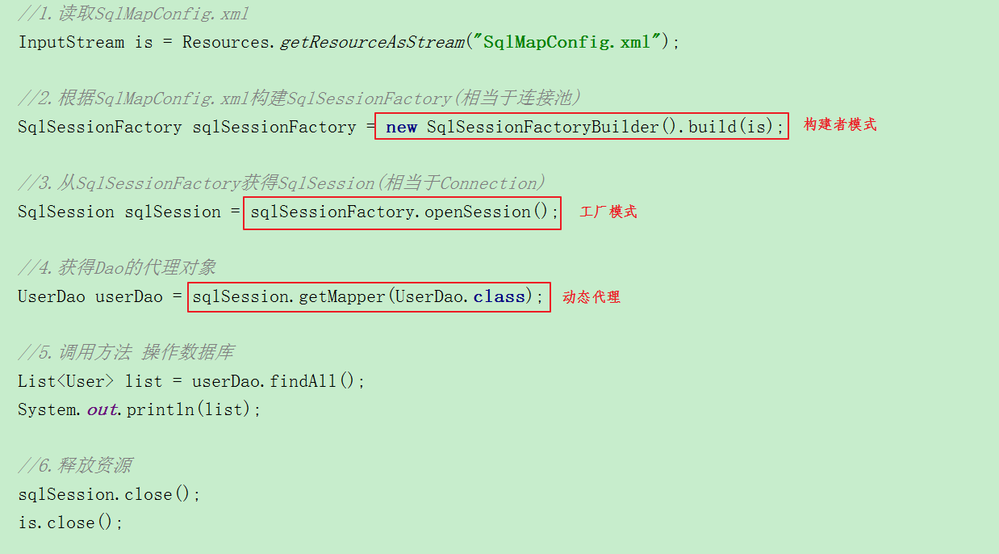
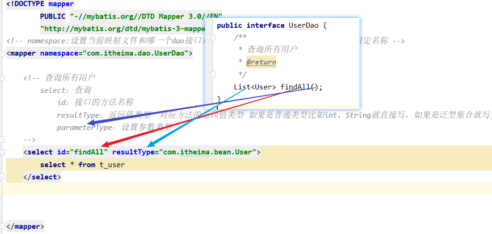

# day33-MyBatis 

# 学习目标

- [ ] 能够了解什么是框架
- [ ] 掌握Mybatis框架开发快速入门
- [ ] 掌握Mybatis框架的基本CRUD操作
- [ ] 掌握mybatis-config.xml配置文件 
- [ ] 掌握Mybatis的parameterType的配置
- [ ] 掌握Mybatis的resultType的配置

# 第一章-框架概述 

## 知识点-框架概述

### 1.目标

- [ ] 能够了解什么是框架

### 2.路径

1. 什么是框架 
2. 框架要解决的问题 

### 3.讲解

#### 3.1什么是框架 

​	框架（Framework）是整个或部分系统的可重用设计，表现为一组抽象构件及构件实例间交互的方法;另一种定义认为，框架是可被应用开发者定制的应用骨架。前者是从应用方面而后者是从目的方面给出的定义。

​	简而言之，框架**是软件(系统)的半成品**，框架封装了很多的细节，使开发者可以使用简单的方式实现功能,**大大提高开发效率**。 

​		一句话解释： **框架其实就是一套模板**，或者可重用的设计，套路。按照这种套路来写代码。尤其是在开发大型项目上，框架的作用体现得就更加淋漓尽致。小型项目，没有框架的用武之地。！

开发好比表演节目, 开发者好比演员, 框架好比舞台

#### 3.2框架要解决的问题 

​	框架要解决的最重要的一个问题是**技术整合**的问题，在 JAVA EE 的 框架中，有着各种各样的技术，不同的软件企业需要从J2EE 中选择不同的技术，这就使得软件企业最终的应用依赖于这些技术，技术自身的复杂性和技术的风险性将会直接对应用造成冲击。而应用是软件企业的核心，是竞争力的关键所在，因此应该将应用自身的设计和具体的实现技术解耦。这样，软件企业的研发将集中在应用的设计上，而不是具体的技术实现，技术实现是应用的底层支撑，它不应该直接对应用产生影响。

​	 框架一般处在低层应用平台（如 J2EE）和高层业务逻辑之间的中间层。

代码是要分层，项目要分层，每一层的代码需要进行交互，对话。

### 4.小结

1. 框架: 软件的半成品.软件的模板， 我们开发者使用框架开发, 更加的简单, 提高开发效率，只关注核心业务功能实现。
2. 学框架就是学套路，开发规范流程，在学习框架的时候主要注意 如何使用，当你用熟了之后再去理解框架的底层设计。
3. 学习方法：**了解**(概念、特点、作用) -- **使用**(练习)  -- **理解**(研究原理)
4. SSM框架

 


## 知识点-MyBatis框架概述

### 1.目标

- [ ] 能够了解什么是MyBatis

### 2.路径

1. jdbc 程序回顾
2. MyBatis框架概述 

### 3.讲解

#### 3.1jdbc 程序回顾

##### 3.1.1程序回顾

+ 注册驱动				    
+ 获得连接                            
+ 创建预编译sql语句对象    
+ 设置参数, 执行
+ 处理结果
+ 释放资源

```java
    public static void main(String[] args) {
        Connection connection = null;
        PreparedStatement preparedStatement = null;
        ResultSet resultSet = null;
        try {
            //1.加载数据库驱动
            Class.forName("com.mysql.jdbc.Driver");
            //2.通过驱动管理类获取数据库链接
            connection = DriverManager.getConnection("jdbc:mysql://localhost:3306/mybatis?characterEncoding=utf-8", "root", "123456"); 
            //3.定义 sql 语句 ?表示占位符
            String sql = "select * from user where username = ?";
            //4.获取预处理 statement
            preparedStatement = connection.prepareStatement(sql);
            //5.设置参数，第一个参数为 sql 语句中参数的序号（从 1 开始），第二个参数为设置的参数值
            preparedStatement.setString(1, "王五");
            //6.向数据库发出 sql 执行查询，查询出结果集
            resultSet = preparedStatement.executeQuery();
            //7.遍历查询结果集
            while (resultSet.next()) {
                System.out.println(resultSet.getString("id") + "
                        "+resultSet.getString(" username"));
            }
        } catch (Exception e) {
            e.printStackTrace();
        } finally {
		//8.释放资源
            if (resultSet != null) {
                try {
                    resultSet.close();
                } catch (SQLException e) {
                    e.printStackTrace();
                }
            }
            if (preparedStatement != null) {
                try {
                    preparedStatement.close();
                } catch (SQLException e) {
                    e.printStackTrace();
                }
            }
            if (connection != null) {
                try {
                    connection.close();
                } catch (SQLException e) {
                    e.printStackTrace();
                }
            }
        }
    }
```

##### 3.1.2 jdbc 问题分析  

1. 数据库连接创建、释放频繁造成系统资源浪费从而影响系统性能，如果使用数据库连接池可解决此问题。
2. Sql 语句在代码中硬编码，造成代码不易维护，实际应用 sql 变化的可能较大， sql 变动需要改变java 代码。 
3. 使用 preparedStatement 向占有位符号传参数存在硬编码，因为 sql 语句的 where 条件不一定，可能多也可能少，修改 sql 还要修改代码，系统不易维护。
4. 对结果集解析存在硬编码（查询列名）， sql 变化导致解析代码变化，系统不易维护，如果能将数据库记录封装成 pojo 对象解析比较方便  

#### 3.2MyBatis框架概述  

​	mybatis 是一个优秀的基于 java 的**持久层框架，它内部封装了 jdbc**，使开发者只需要关注 sql 语句本身，而不需要花费精力去处理加载驱动、创建连接、创建 statement 等繁杂的过程。

​	**mybatis 通过xml 或注解的方式将执行的各种statement 配置起来，并通过java 对象和statement 中sql的动态参数进行映射生成最终执行的 sql 语句，最后由 mybatis 框架执行 sql并将结果映射为 java 对象并返回。**采用 ORM  ( Object relational mapping)思想解决了实体和数据库映射的问题，对jdbc 进行了封装，屏蔽了jdbc api 底层访问细节，使我们不用与 jdbc api打交道，就可以完成对数据库的持久化操作。

​	官网: http://www.mybatis.org/mybatis-3/

### 4.小结

1. MyBatis: 持久层的一个框架, 封装了JDBC. 操作数据库
2. 为什么要学习MyBatis?
   + JDBC和DBUtils都有一些很明显的缺点, JDBC和DBUtils不适合做项目
   + MyBatis是工作里面的主流的持久层框架, 使用几率基本上100%

# 第二章-Mybatis入门 【重点】

## 案例-Mybatis快速入门 

### 1.需求

- [ ] 使用MyBatis查询所有的用户, 封装到List集合

### 2.分析

1. 创建Maven工程项目，导入jar包
2. 创建pojo(javabean)
3. 创建dao接口
4. 创建dao接口映射文件(xml文件)
5. 创建MyBatis的配置文件(mybatis-config.xml)
6. 编写测试类 进行测试

### 3.实现

#### 3.1准备工作

+ 数据库

```sql
CREATE DATABASE mybatis_day01;
USE mybatis_day01;
CREATE TABLE t_user(
		uid int PRIMARY KEY auto_increment,
		username varchar(40),
	 	sex varchar(10),
		birthday date,
		address varchar(40)
);

INSERT INTO `t_user` VALUES (null, 'zs', '男', '2018-08-08', '北京');
INSERT INTO `t_user` VALUES (null, 'ls', '女', '2018-08-30', '武汉');
INSERT INTO `t_user` VALUES (null, 'ww', '男', '2018-08-08', '北京');
```

#### 3.2.MyBatis快速入门

 


##### 3.2.1创建Maven工程(jar)导入坐标

```xml
 <!--1. 添加依赖-->
    <dependencies>
        <!--单元测试-->
        <dependency>
            <groupId>junit</groupId>
            <artifactId>junit</artifactId>
            <version>4.12</version>
            <scope>test</scope>
        </dependency>
        <!--MyBatis坐标-->
        <dependency>
            <groupId>org.mybatis</groupId>
            <artifactId>mybatis</artifactId>
            <version>3.4.6</version>
        </dependency>
        <!--mysql驱动-->
        <dependency>
            <groupId>mysql</groupId>
            <artifactId>mysql-connector-java</artifactId>
            <version>5.1.47</version>
        </dependency>
        <!--lombok 依赖-->
        <dependency>
            <groupId>org.projectlombok</groupId>
            <artifactId>lombok</artifactId>
            <version>1.18.18</version>
        </dependency>
    </dependencies>
```

##### 3.2.2创建User实体类

+ User .java

```java
@AllArgsConstructor
@NoArgsConstructor
@Data
public class User implements Serializable {
    private int uid;
    private String username;
    private String sex;
    private Date birthday;
    private String address;
}
```

##### 3.2.3创建 UserDao 接口

- UserDao 接口就是我们的持久层接口（也可以写成 UserMapper) .我们就写成UserDao ,具体代码如下： 

```java
public interface UserDao {

    /**
     * 查询所有的用户
     */
    List<User> findAll();
}
```

##### 3.2.4创建 UserDao.xml 映射文件

> 在resources 下面创建文件夹 com/itheima/dao  文件夹的名字需要与dao包的名字一样。 
>
> 注意:  该文件要放在com/itheima/dao里面, 不要写成com.itheima.dao

 

```xml
<?xml version="1.0" encoding="UTF-8" ?>
<!DOCTYPE mapper
        PUBLIC "-//mybatis.org//DTD Mapper 3.0//EN"
        "http://mybatis.org/dtd/mybatis-3-mapper.dtd">
<!--namespace:dao接口的全限定名 用于指定关联哪一个dao接口-->
<mapper namespace="com.itheima.dao.UserDao">

    <!--
        select标签：查询
            id:接口中的方法名  注意：namespace+id要是唯一的！！！！ 在同一个映射文件中id是唯一的！
            resultType：指定返回结果类型  如果是普通类型（String int），就直接写，如果是泛型集合，就写集合的泛型
            parameterType：指定参数类型
    -->
    <select id="findAll" resultType="com.itheima.bean.User" >
        select * from t_user
    </select>
</mapper>
```

##### 3.2.5创建 mybatis-config.xml 配置文件

> 它的作用：告诉mybatis去连接哪个数据， 告诉mybatis 项目有哪些映射文件（需要登记） ， 起别名 ...

```xml
<?xml version="1.0" encoding="UTF-8" ?>
<!DOCTYPE configuration
        PUBLIC "-//mybatis.org//DTD Config 3.0//EN"
        "http://mybatis.org/dtd/mybatis-3-config.dtd">

<configuration>
    <!--数据库环境-->
    <environments default="development">
        <environment id="development">
            <!--MyBatis事务管理  默认使用JDBC事务-->
            <transactionManager type="JDBC"/>
            <!--MyBatis连接池设置 POOLED表示默认使用MyBatis自带的连接池-->
            <dataSource type="POOLED">
                <property name="driver" value="com.mysql.jdbc.Driver"/>
                <property name="url" value="jdbc:mysql://localhost:3306/mybatis_day01"/>
                <property name="username" value="root"/>
                <property name="password" value="root"/>
            </dataSource>
        </environment>
    </environments>

    <!--引入映射文件-->
    <mappers>
        <mapper resource="com/itheima/dao/UserDao.xml"/>
    </mappers>
</configuration>
```

##### 3.2.6测试

```java
package com.itheima.test;

import com.itheima.bean.User;
import com.itheima.dao.UserDao;
import org.apache.ibatis.io.Resources;
import org.apache.ibatis.session.SqlSession;
import org.apache.ibatis.session.SqlSessionFactory;
import org.apache.ibatis.session.SqlSessionFactoryBuilder;
import org.junit.Test;

import java.io.InputStream;
import java.util.List;

public class MyBatisTest {


    //测试使用MyBatis查询所有用户
    @Test
    public void testFindAll() throws Exception {
        //1.读取配置文件
        InputStream is = Resources.getResourceAsStream("mybatis-config.xml");
        //2.加载配置文件创建SqlSessionFactory
        SqlSessionFactory sqlSessionFactory = new SqlSessionFactoryBuilder().build(is);
        //3.通过sqlSessionFactory获得SqlSession对象
        SqlSession sqlSession = sqlSessionFactory.openSession();
        //4.使用SqlSession通过UserDao接口获取UserDao实例
        UserDao userDao = sqlSession.getMapper(UserDao.class);
        //5.执行操作
        List<User> users = userDao.findAll();
        System.out.println("users = " + users);
        //6.关闭对象 释放资源
        is.close();
        sqlSession.close();

    }

}

```

### 4.小结

#### 4.1步骤

1. 创建Maven工程，添加依赖
2. 创建pojo(javabean)
3. 创建dao接口(UserDao)
4. 创建dao接口映射文件(UserDao.xml)
5. 创建MyBatis核心配置文件(mybatis-config.xml)
6. 编写测试类 进行测试

#### 4.2注意事项

Dao的映射文件的路径

 


## 知识点-Mapper动态代理方式规范【注意】

### 1.目标

- [ ] 掌握Mapper动态代理方式规范

### 2.路径

1. 入门案例回顾
2. 规范

### 3.讲解

#### 3.1入门案例回顾

##### 3.1.1 创建一个接口

```java

public interface UserDao {
    List<User> findAll();
}
```

##### 3.1.2Mapper.xml(映射文件)

​	定义mapper映射文件UserDao.xml，需要修改namespace的值为 UserDao接口全限定名。将UserDao.xml放在classpath的xxx.xxx.dao目录下

```xml
<?xml version="1.0" encoding="UTF-8" ?>
<!DOCTYPE mapper
        PUBLIC "-//mybatis.org//DTD Mapper 3.0//EN"
        "http://mybatis.org/dtd/mybatis-3-mapper.dtd">
<!-- namespace:设置当前映射文件和哪一个dao接口对应   namespace的值就是对应接口的全限定名称 -->
<mapper namespace="com.itheima.dao.UserDao">

    <!-- 查询所有用户
        select：查询
            id：接口的方法名称
            resultType：返回值类型  对应方法的返回值类型 如果是普通类型比如int、String就直接写，
								   如果是泛型集合就写集合的泛型类型就好
            parameterType：设置参数类型
    -->
    <select id="findAll" resultType="com.itheima.bean.User">
        select * from t_user
    </select>

</mapper>
```

##### 3.2.3测试

```java
package com.itheima.test;

import com.itheima.bean.User;
import com.itheima.dao.UserDao;
import org.apache.ibatis.io.Resources;
import org.apache.ibatis.session.SqlSession;
import org.apache.ibatis.session.SqlSessionFactory;
import org.apache.ibatis.session.SqlSessionFactoryBuilder;
import org.junit.Test;

import java.io.InputStream;
import java.util.List;

public class MyBatisTest {


    //测试使用MyBatis查询所有用户
    @Test
    public void testFindAll() throws Exception {
        //1.读取配置文件
        InputStream is = Resources.getResourceAsStream("mybatis-config.xml");
        //2.加载配置文件创建SqlSessionFactory
        SqlSessionFactory sqlSessionFactory = new SqlSessionFactoryBuilder().build(is);
        //3.通过sqlSessionFactory获得SqlSession对象
        SqlSession sqlSession = sqlSessionFactory.openSession();
        //4.使用SqlSession通过UserDao接口获取UserDao实例
        UserDao userDao = sqlSession.getMapper(UserDao.class);
        //5.执行操作
        List<User> users = userDao.findAll();
        System.out.println("users = " + users);
        //6.关闭对象 释放资源
        is.close();
        sqlSession.close();


    }

}

```



#### 3.2规范

Mapper接口开发需要遵循以下规范： 

1、 Mapper.xml（**UserDao.xml**）文件中的namespace必须和mapper(Dao)接口的全限定名相同。

> 表示当前的映射文件和哪一个dao接口进行绑定

2、Mapper.xml文件中select,update等的标签id的值必须和mapper(Dao)接口的方法名相同

> 映射文件中的id和dao接口中的方法名保持一致，并且id在当前的映射文件中要是唯一的

3、Mapper.xml文件中select,update等的标签的parameterType必须和mapper(Dao)接口的方法的形参类型对应

4, Mapper.xml文件中select,update等的标签的resultType必须和mapper(Dao)接口的方法的返回值类型对应

5,  Mapper.xml文件的文件名尽量和mapper(Dao)接口的名字一样

6, Mapper.xml文件的路径尽量和mapper(Dao)接口的路径在同一层目录

### 4.小结



1. 我们使用MyBatis 遵循这些规范

## 知识点-核心配置文件详解

### 1.目标

- [ ] 掌握mybatis-config.xml配置文件

### 2.路径

1. 核心配置文件的顺序
2. properties
3. typeAliases
4. Mapper

### 3.讲解

#### 3.1.核心配置文件的顺序

  

**properties（引入外部properties文件）**

settings（全局配置参数）

**typeAliases（类型别名）**

typeHandlers（类型处理器）

objectFactory（对象工厂）

plugins（插件）

**environments（环境集合属性对象）**

​	environment（环境子属性对象）

​		transactionManager（事务管理）

​		dataSource（数据源）

**mappers（映射器）**

#### 3.2.properties

- jdbc.properties

```properties
jdbc.driver=com.mysql.jdbc.Driver
jdbc.url=jdbc:mysql://localhost:3306/mybatis_day01?characterEncoding=utf-8
jdbc.username=root
jdbc.password=123456
```

- 引入到核心配置文件

```xml
<configuration>
   <properties resource="jdbc.properties">
    </properties>
    <!--数据源配置-->
    <environments default="development">
        <environment id="development">
            <transactionManager type="JDBC"/>
            <dataSource type="UNPOOLED">
                <property name="driver" value="${jdbc.driver}"/>
                <property name="url" value="${jdbc.url}"/>
                <property name="username" value="${jdbc.username}"/>
                <property name="password" value="${jdbc.password}"/>
            </dataSource>
        </environment>
    </environments>
</configuration>
```

#### 3.3.typeAliases（类型别名）

##### 3.3.1定义单个别名

- 核心配置文件

```xml
<typeAliases>
      <typeAlias type="com.itheima.bean.User" alias="User"></typeAlias>
 </typeAliases>
```

- 修改UserDao.xml

```java
<select id="findAll" resultType="User">
    SELECT  * FROM  user
</select>
```

##### 3.3.2批量定义别名

使用package定义的别名：就是pojo的类名，大小写都可以

- 核心配置文件

```xml
<typeAliases>
    <package name="com.itheima.bean"/>
</typeAliases>
```

- 修改UserDao.xml

```java
<select id="findAll" resultType="User">
         SELECT  * FROM  user
</select>
```

#### 3.4.Mapper

##### 3.4.1方式一:引入映射文件路径

```xml
<mappers>
     <mapper resource="com/itheima/dao/UserDao.xml"/>
 </mappers>
```

##### 3.4.2方式二:扫描接口

注: 此方式只能用作:代理开发模式,原始dao方式不能使用.

- 配置单个接口

```xml
<mappers>
 	<mapper class="com.itheima.dao.UserDao"></mapper>
</mappers>
```

- 批量配置

```xml
<mappers>
   <package name="com.itheima.dao"></package>
</mappers>
```


### 4.小结

1. 核心配置文件的顺序

 


2. properties 引入properties文件的
   + 创建properties文件
   + 使用 `<properties resource="文件的路径"/>`
   + 使用 ${key}
3. typeAliases（类型别名）  在Dao映射文件里面 直接写类(pojo)的名字, 不需要写类全限定名了

```xml
<!-- 通过包批量扫描 -->
<typeAliases>
    <package name="com.itheima.bean"/>
</typeAliases>
```

4. Mapper 引入Dao映射文件的

```xml
<!-- 通过包批量扫描 -->
<mappers>
   <package name="com.itheima.dao"></package>
</mappers>
```


# 第三章-MyBatis进阶【重点】

## 案例-使用Mybatis完成CRUD【重点】

### 1.需求

- [ ] 使用Mybatis完成CRUD

### 2.分析

1. 编写dao接口方法
2. 编写dao映射文件
3. 运行测试

### 3.实现

#### 3.1新增用户

##### 3.1.1实现步骤

- UserDao中添加新增方法 

```java
// 增加用户
int addUser(User user);
```

- 在 UserDao.xml 文件中加入新增配置 

```xml
<!--
  insert：增加
  id：dao接口方法名
  parameterType：方法参数类型
        情况一：如果传递时java对象，在sql语句中通过#{对象属性}直接获取
  resultType：增删改返回受影响的行数 是int类型  所以在MyBatis进行增删改不需要指定返回值类型 直接默认返回int
-->
    <insert id="addUser" parameterType="User">
        INSERT INTO `t_user` VALUES (NULL, #{username},#{sex}, #{birthday}, #{address})
    </insert>
```

- 添加测试类中的测试方法 

```java
//测试增加用户
    @Test
    public void TestAddUser() throws IOException {
        //1.读取配置文件
        InputStream is = Resources.getResourceAsStream("mybatis-config.xml");
        //2.加载配置文件 获得SqlSessionFactory对象
        SqlSessionFactory sqlSessionFactory = new SqlSessionFactoryBuilder().build(is);
        //3.获得SqlSession对象
        SqlSession sqlSession = sqlSessionFactory.openSession();
        //4.获得dao接口的代理对象
        UserDao userDao = sqlSession.getMapper(UserDao.class);
        //5.执行方法
        User user = new User(null,"赵六","男",new Date(),"深圳");
        int rows = userDao.addUser(user);
        /*
            MyBatis默认关闭事务的自动提交 所以在使用MyBatis做增删改的时候需要进行手动提交事务
            JDBC：connection.setAutoCommit(false);  connection.commit();
            MyBatis:sqlSession.commit();
         */
        //提交事务
        sqlSession.commit();
        //6.关闭对象
        is.close();
        sqlSession.close();
    }
```

##### 3.1.2新增用户 id 的返回值 

1. 有时候我们存在一些场景，把一条数据存储到数据库了之后，需要马上得到这条记录的id值。因为这条数据是我们自己创建赶出来的，它的id是多少，我们是不知道的，只有这条记录已经存在于数据库里面了，才知道它的id值。

2. 什么情况下|场景下，我们需要在插入完这条记录之后，立即就需要得到这条记录的id呢？

   **当我们往A表里面添加一条记录之后，需要继续往B表里面添加一条记录，但是A表和B表形成了一种主外键关系。B表里面的外键就是A表里面的主键，所以往B表里面添加记录，必须要先知道A表的这条记录的主键**

​	新增用户后， 同时还要返回当前新增用户的 id 值，因为 id 是由数据库的自动增长来实现的，所以就相当于我们要在新增后将自动增长 auto_increment 的值返回。 

- 方式一 SelectKey获取主键

| **属性**    | **描述**                                                     |
| ----------- | ------------------------------------------------------------ |
| keyProperty | selectKey 语句结果应该被设置的目标属性。                     |
| resultType  | 结果的类型。MyBatis 通常可以算出来,但是写上也没有问题。MyBatis 允许任何简单类型用作主键的类型,包括字符串。 |
| order       | 这可以被设置为 BEFORE 或 AFTER。如果设置为 BEFORE,那么它会首先选择主键,设置 keyProperty 然后执行插入语句。如果设置为 AFTER,那么先执行插入语句,然后是 selectKey 元素-这和如  Oracle 数据库相似,可以在插入语句中嵌入序列调用。 |

  UserDao.xml

```xml
 <!--
        方式一：新增用户  并获取新增用户的id  【企业常用】
 -->
<insert id="addUser" parameterType="User">
    <!--
        keyProperty：数据库表中主键对应的java类中属性
        resultType：数据类型
        order：主键的生成 是在执行sql语句之前还是之后   由于这里使用的数据库自增 所以主键生成是在添加sql语句之后 应该写AFTER
            -->
    <selectKey keyProperty="uid" resultType="int" order="AFTER">
        SELECT LAST_INSERT_ID();
    </selectKey>
    INSERT INTO `t_user` VALUES (NULL, #{username}, #{sex}, #{birthday}, #{address});
</insert>
```

- 方式二属性配置

  UserDao.xml

```xml

    <!--新增用户完毕之后，获取这条记录的id-->
    <insert id="addUser" parameterType="com.itheima.bean.User" keyProperty="uid" useGeneratedKeys="true">
         insert into t_user values(null , #{username} , #{sex} , #{birthday} , #{address})
    </insert>

```

##### 3.1.3新增用户 id 的返回值(字符串类型)

> 企业中开发项目：一般主键不会使用int、bigint，除非这个项目比较low！
>
> 因为在实际项目中，如果数据量比较大，到时候会搭建数据库集群 进行分库分表，因此一个表中的数据会被拆分到多个表中存储，如果你此时主键还使用bigint数据库自增，则容易相同的id！
>
> 一般正常的项目都会使用UUID作为表中主键列。当然更高级一点，公司会开发一个发号器程序，专门生成主键id，避免重复。
>
> 插入数据时，要先生成主键UUID字符串，插入之后要将主键赋值到对象的uid属性上
>
> 实际项目：主键（自增、uuid、雪花算法生成id）

```xml
<insert id="save" parameterType="com.itheima.bean.User">
    <selectKey  keyProperty="uid" resultType="string" order="BEFORE">
        select uuid()
    </selectKey>
        INSERT INTO t_user(username,sex,birthday,address) VALUES (#{username},#{sex},#{birthday},#{address})
</insert>
```

#### 3.2修改用户

- UserDao中添加修改方法 

```java
	/**
     * 修改用户
     * @param user
     * @return
     */
    int updateUser(User user);
```

- 在 UserDao.xml 文件中加入新增配置 

```xml
<update id="updateUser" parameterType="User">
    UPDATE `t_user` SET username=#{username},sex=#{sex},birthday=#{birthday},address=#{address} WHERE uid=#{uid}
</update>
```

- 添加测试类中的测试方法 

```java
//测试修改用户
    @Test
    public void TestUpdateUser() throws IOException {
        //1.读取配置文件
        InputStream is = Resources.getResourceAsStream("mybatis-config.xml");
        //2.加载配置文件 获得SqlSessionFactory对象
        SqlSessionFactory sqlSessionFactory = new SqlSessionFactoryBuilder().build(is);
        //3.获得SqlSession对象
        SqlSession sqlSession = sqlSessionFactory.openSession();
        //4.获得dao接口的代理对象
        UserDao userDao = sqlSession.getMapper(UserDao.class);
        //5.执行方法
        User user = new User(8,"张三疯","男",new Date(),"黑马");
        int rows = userDao.updateUser(user);
        /*
                MyBatis默认关闭事务的自动提交 所以在使用MyBatis做增删改的时候需要进行手动提交事务
                JDBC：connection.setAutoCommit(false);  connection.commit();
                MyBatis:sqlSession.commit();
         */
        //事务提交
        sqlSession.commit();
        //6.关闭对象
        is.close();
        sqlSession.close();
    }
```

#### 3.3删除用户

- UserDao中添加新增方法 

```java
public interface UserDao {

	//删除用户
    int deleteUserById(Integer uid);

}
```

- 在 UserDao.xml 文件中加入新增配置 

```xml
<!--删除用户
   delete：删除
      id：接口的方法名
      parameterType：接口方法参数类型
      情况一：当参数时pojo对象时  使用#{对象的属性}直接获取
      情况二：当参数时基本数据类型时(int、String)  使用#{名称随便写}直接获取  当然一般为了规范，还是习惯写#{参数名称}获取
    -->
    <delete id="deleteUserById" parameterType="int">
        delete from t_user where uid=#{uid}
    </delete>

```

- 添加测试类中的测试方法 

```java
 //测试删除用户
    @Test
    public void TestDeleteUser() throws IOException {
        //1.读取配置文件
        InputStream is = Resources.getResourceAsStream("mybatis-config.xml");
        //2.加载配置文件 获得SqlSessionFactory对象
        SqlSessionFactory sqlSessionFactory = new SqlSessionFactoryBuilder().build(is);
        //3.获得SqlSession对象
        SqlSession sqlSession = sqlSessionFactory.openSession();
        //4.获得dao接口的代理对象
        UserDao userDao = sqlSession.getMapper(UserDao.class);
        //5.执行方法
        int rows = userDao.deleteUserById(7);
        /*
                MyBatis默认关闭事务的自动提交 所以在使用MyBatis做增删改的时候需要进行手动提交事务
                JDBC：connection.setAutoCommit(false);  connection.commit();
                MyBatis:sqlSession.commit();
         */
        //事务提交
        sqlSession.commit();
        //6.关闭对象
        is.close();
        sqlSession.close();
    }
```

#### 3.4模糊查询

##### 3.4.1 方式一

- UserDao 中添加根据姓氏来查询用户的方法 

```java
public interface UserDao {
  //根据用户名的姓氏进行模糊查询
  List<User> getUserListByName(String username);

}
```

- 在 UserDao.xml 文件中加入新增配置 

```xml
<select id="getUserListByName" parameterType="string" resultType="User">
    select * from t_user where username like #{username}
    <!--select * from t_user where username like CONCAT(#{username},'%')-->
</select>
    
```

- 添加测试类中的测试方法 

```java
 //测试根据用户名姓氏进行模糊查询
@Test
public void TestGetUserListByName() throws IOException {
    //1.读取配置文件
    InputStream is = Resources.getResourceAsStream("mybatis-config.xml");
    //2.加载配置文件 获得SqlSessionFactory对象
    SqlSessionFactory sqlSessionFactory = new SqlSessionFactoryBuilder().build(is);
    //3.获得SqlSession对象
    SqlSession sqlSession = sqlSessionFactory.openSession();
    //4.获得dao接口的代理对象
    UserDao userDao = sqlSession.getMapper(UserDao.class);
    //5.执行方法
    List<User> list = userDao.getUserListByName("张%");
    System.out.println("list = " + list);

    //6.关闭对象
    is.close();
    sqlSession.close();
}
```

##### 3.4.2 方式二

- UserDao 中添加新增方法 

```java
public interface UserDao {
     //根据用户名的姓氏进行模糊查询
    List<User> getUserListByName2(String username);
}
```

- 在 UserDao.xml 文件中加入新增配置 

```xml
<!--
    使用${}获取简单类型数据时：只能使用${value}
-->
<select id="getUserListByName2" parameterType="string" resultType="User">
    select * from t_user where username like '${value}%'
</select>   
```

​	` 我们在上面将原来的#{}占位符，改成了${value}。注意如果用模糊查询的这种写法，那么${value}的写法就是固定的，不能写成其它名字。` 

- 添加测试类中的测试方法 

```java
//测试根据用户名姓氏进行模糊查询
@Test
public void TestGetUserListByName2() throws IOException {
    //1.读取配置文件
    InputStream is = Resources.getResourceAsStream("mybatis-config.xml");
    //2.加载配置文件 获得SqlSessionFactory对象
    SqlSessionFactory sqlSessionFactory = new SqlSessionFactoryBuilder().build(is);
    //3.获得SqlSession对象
    SqlSession sqlSession = sqlSessionFactory.openSession();
    //4.获得dao接口的代理对象
    UserDao userDao = sqlSession.getMapper(UserDao.class);
    //5.执行方法
    List<User> list = userDao.getUserListByName2("张");
    System.out.println("list = " + list);

    //6.关闭对象
    is.close();
    sqlSession.close();
}
```

##### 3.4.3 #{}与${}的区别【面试】

1. `#{}`表示一个占位符号 ， 传什么进来，就是什么。 有点类似以前的  ? 
   + 通过`#{}`可以实现 preparedStatement 向占位符中设置值,自动进行 java 类型和 数据库 类型转换 
   + `#{}`可以有效防止 sql 注入 
   + `#{}`可以接收简单类型值或 pojo 属性值
   + 如果 parameterType 传输单个简单类型值(String,基本类型int...)， `#{}` 括号中可以是 value 或其它名称。
2. `${}`表示拼接 sql 串
   + 通过`${}`可以将 parameterType 传入的内容拼接在 sql 中且不进行 jdbc 类型转换. 
   + `${}`不能防止 sql 注入
   + `${}`可以接收简单类型值或 pojo 属性值
   + 如果 parameterType 传输单个简单类型值.`${}`括号中只能是 value 

> #{}获取参数可以进行预编译，有效防止SQL注入，会进行类型自动转换，可以使用它获取简单类型参数和pojo对象  #{对象的属性名称}
>
> ${}获取参数不会进行预编译，只会进行sql拼接，不能防止SQL注入，不会进行类型转换，使用它获取单个简单类型参数只能使用${value}进行获取。 ${对象的属性名称}
>
> 实际工作中，一般都使用#{}获取传递的参数

#### 3.5.SqlSessionFactory工具类的抽取

**步骤:**

1. 创建SqlSessionFactoryUtils
2. 定义一个getSqlSession()方法获得sqlSession
3. 定义释放资源方法
4. 保证SqlSessionFactory只有一个(静态代码块)

**实现**

```java
package com.itheima.utils;

import org.apache.ibatis.io.Resources;
import org.apache.ibatis.session.SqlSession;
import org.apache.ibatis.session.SqlSessionFactory;
import org.apache.ibatis.session.SqlSessionFactoryBuilder;

import java.io.IOException;
import java.io.InputStream;

/**
 * 工具类
 *  1.封装获取SqlSession对象的代码   getSqlSession()
 *  2.封装关闭SqlSession对象的代码   close()
 *  3.使用静态代码块保证SqlSessionFactory是单例的
 */
public class SqlSessionFactoryUtils {

    private static SqlSessionFactory sqlSessionFactory;
    static {
        //1.读取配置文件
        InputStream is = null;
        try {
            is = Resources.getResourceAsStream("mybatis-config.xml");
            //2.加载配置文件 获得SqlSessionFactory对象
            sqlSessionFactory = new SqlSessionFactoryBuilder().build(is);
        } catch (IOException e) {
            e.printStackTrace();
        }finally {
            if(is!=null){
                try {
                    is.close();
                } catch (IOException e) {
                    e.printStackTrace();
                }
            }
        }
    }


    /**
     * 获取SqlSession对象
     * @return
     */
    public static SqlSession getSqlSession(){
        //3.获得SqlSession对象
        return sqlSessionFactory.openSession();
    }

    /**
     * 关闭SqlSession对象
     * @param sqlSession
     */
    public static void close(SqlSession sqlSession){
        if(sqlSession!=null){
            sqlSession.close();
        }
    }

}
```

### 4.小结

#### 4.1增删改查

+ 增加

  ```xml
  <!-- 注意1：增删改默认返回受影响的行数 int类型  所以在这里不需要设置resultType 
  	 注意2：由于MyBatis默认关闭了事务的自动提交，所以在进行增删改操作时需要手动提交事务
  -->
  <insert id="接口方法名称" parameterType="接口方法参数类型">
      <!-- 获取增加数据的id -->
      <selectKey keyProperty="主键对应的属性" resultType="属性类型" order="主键生成的顺序">
      	select last_insert_id();
      </selectKey>
  	增加的sql语句
  </insert>
  ```

+ 删除

  ```xml
  <delete id="接口方法名称" parameterType="接口方法参数类型">
  	删除的sql语句
  </delete>
  ```

+ 修改

  ```xml
  <update id="接口方法名称" parameterType="接口方法参数类型">
  	修改的sql语句
  </update>
  ```

+ 查询

  ```xml
  <!-- 情况一：如果返回的是简单数据类型，直接写
  	 情况二：如果返回的是单个对象，也直接写
       情况三：如果返回的是泛型集合，写集合的泛型类型
  -->
  <select id="接口方法名称" parameterType="接口方法参数类型" resultType="接口返回值类型">
  	查询的sql语句
  </select>
  ```

  

2.#{}和${}的区别

​		#{}：可以进行预编译，有效防止sql注入，会进行类型自动转换

​       ${}：只会进行sql拼接，不能防止SQL注入，不会进行类型自动转换，获取单个简单类型值时，使用${value}

​		实际工作：一般都使用#{}获取参数

## 知识点-parameterType深入

### 1.目标

- [ ] 掌握Mybatis的参数深入(parameterType)

### 2.路径

1. 传递简单类型
2. 传递 pojo 对象
3. 传递 pojo 包装对象类型
4. 直接传递多个参数

### 3.讲解

#### 3.1传递简单类型

​	基本的类型,字符串

​	直接写`#{任意字段}`或者`${value}`

* dao

```java
   //传递简单的参数 :: int | String
    User findUserByUsername(String username);

```

* 映射文件

```xml
   <!--parameterType传递简单的参数：
        1. 直接使用#{} 取值即可
        2. 大括号里面一般写参数的名字，当然写什么都可以！！但是不建议这么做-->
    <select id="findUserByUsername" resultType="com.itheima.bean.User" parameterType="java.lang.String">
        select * from t_user where username = #{username}
    </select>
```

#### 3.2传递 pojo 对象 

​	Mybatis 使用 ognl 表达式解析对象字段的值， #{}或者${}括号中的值为 pojo 属性名称。 

* dao

```java
    //传递对象参数
    User findUserByUsername02(User user );
```


* 映射文件

```xml
 <!--parametertype传递对象数据
        1. 也是使用#{}取值
        2. 大括号里面一般写属性的名字。
    -->
    <select id="findUserByUsername02" resultType="com.itheima.bean.User" parameterType="com.itheima.bean.User">
        <!-- select * from t_user where username = #{对象的属性名}-->
         select * from t_user where username = #{username}
    </select>
```


#### 3.3传递 pojo 包装对象类型 

​	开发中通过 pojo 传递查询条件 ，查询条件是综合的查询条件，不仅包括用户查询条件还包括其它的查询条件（比如将用户购买商品信息也作为查询条件），这时可以使用包装对象传递输入参数。Pojo 类中包含 pojo。

​	京东查询的例子:


​	需求：根据用户id查询用户信息，查询条件放到 QueryVo 的 user 属性中。 

- QueryVo  

```java
@Data
@NoArgsConstructor
@AllArgsConstructor
public class QueryVo {
    private User user;
}

```

- UserDao接口 

```java
//传递包装对象的参数
User findUserByUsername03(QueryVo  qv);
```

- UserDao.xml文件 

```xml
  <!--parametertype 传递包装对象数据
        1. 也是使用#{}取值
        2. 取值的时候，需要先找到QueryVo里面的属性user
        3. 再使用user.username 去找到username 的值。
    -->
    <select id="findUserByUsername03" resultType="com.itheima.bean.User" parameterType="com.itheima.bean.QueryVo">
        select * from t_user where username = #{user.username}
    </select>
```

- 测试代码

```java
  @Test
    public void testFindUserByUsername03() throws IOException {

        SqlSession session = SqlSessionFactoryUtil.getSession();

        UserDao02 dao02 = session.getMapper(UserDao02.class);


        QueryVo qv = new QueryVo();

        User user = new User();
        user.setUsername("ww");

        qv.setUser(user);

        User findUser = dao02.findUserByUsername03(qv);

        System.out.println("user=" + findUser);

        session.close();
    }
```


#### 3.4  传递多个参数

> 在方法的参数上打上注解@param 

* UserDao

```java
public interface UserDao {

    //根据多个参数来找人。
    User findUserByUsernameAndAddress(@Param("username") String username , @Param("address") String address);
}

```

* UsreDao.xml

```xml
    <select id="findUserByUsernameAndAddress" resultType="com.itheima.bean.User" >
        select * from t_user where username = #{username} and address = #{address}
    </select>
```

### 4.小结

1. 传递单个简单类型值

```
#{任意字段}或者${value}
```

2. 传递pojo对象类型

```
#{javaBean属性名}或者${javaBean属性名}
```

3. 传递多个简单类型数据

```java
// 方式一：使用@Param注解 直接传递   #{参数名称}
	List<User> getList(@Param("username") String username,@Param("roleId") Integer roleId);
	select * from t_user where username like concat('%',#{username},'%') and roleId=#{roleId}
// 方式二：封装成一个pojo对象类型   #{javabean属性名称}    【实际开发】
	public class ParamVo(){
		private String username;
		private Integer roleId;
	}
	select * from t_user where username like concat('%',#{username},'%') and roleId=#{roleId}
// 方式三：封装成一个Map集合  #{map的key}
	Map map = new HashMap();
	map.put("username","张");
	map.put("roleId",3);
	select * from t_user where username like concat('%',#{username},'%') and roleId=#{roleId}
```

4. 传递多个对象或一个对象+多个其他数据类型参数

```java
// 封装所有的参数到一个pojo包装对象类型
@Data
public class QueryVo {
    private List<Integer> ids;
    private User user;		//user对象  eg：user.uid  user.username
    private Role role;		//role对象  eg：role.roleId
}
```

## 知识点-resultType深入   

### 1.目标

- [ ] 掌握Mybatis的参数深入(resultType)

### 2.路径

1. 输出简单类型
2. 输出pojo对象
3. 输出pojo列表
4. resultMap结果类型 

### 3.讲解

#### 3.1输出简单类型

​	直接写对应的Java类型. eg: 返回int

```xml
<!--
    返回简单的数据：
        如果返回的是基本数据类型，那么直接写名字就行： int |long ..
        如果返回的是字符串，还是要写它String的全路径名。-->
    <select id="findCount" resultType="int">
        select count(*) from t_user ;
    </select>
```

#### 3.2 输出pojo对象

​	直接写当前pojo类的全限定名 eg: 返回User

```xml
    <!--返回对象的数据-->
    <select id="findUserById" parameterType="int" resultType="com.itheima.bean.User">
        select * from t_user where uid = #{id};
    </select>
```

#### 3.3 输出pojo列表

​	直接写当前pojo类的全限定名 eg: 返回 List<User> list;

```xml
 <!--

        返回的是一个集合。那么只要写集合里面装的元素的类型即可。
        1. mybatis 在底层需要知道查询的结果集里面每一条记录对应的类型是什么
        2. 直接把list集合告诉它明显是不对的，虽然最终的产出的结果是一个lsit集合
        3. 在底层，mybatis会对数据的数量进行分析|判别，如果超过一条，那么会使用集合来装。
    -->
    <select id="findAll" resultType="com.itheima.bean.User">
        select * from t_user;
    </select>
```

#### 3.4 resultMap结果类型 

> 因为MyBatis会自动的帮忙完成数据库表中字段到javabean属性的映射   ORM
>
> 但是如果出现表中字段和javabean属性不一致时，就需要 手动进行映射配置！
>
> 如何配置？
>
> 使用ResultMap进行配置
>
> ​	①：解决数据库表中字段和javabean属性不一致问题
>
>    ②：配置关联映射

       1. resultType可以指定pojo将查询结果映射为pojo，但需要**pojo的属性名和sql查询的列名一致**方可映射成功。

       2. 如果sql查询字段名和pojo的属性名不一致，可以通过resultMap将字段名和属性名作一个对应关系 ，resultMap实质上还需要将查询结果映射到pojo对象中。

   2. resultMap可以实现将查询结果映射为复杂类型的pojo，比如在查询结果映射对象中包括pojo和list实现一对一查询和一对多查询 （多表联合查询）。(下次课讲)

​	那我们今天就来看返回的列名与实体类的属性不一致时的情况. 下次课再接着研究复杂的封装(多表查询)

​	通过改别名的方式，现在返回结果集的列名已经与 User 类的属性名不相同了。 

user

```java
@Data
@NoArgsConstructor
@AllArgsConstructor
public class User {
    private int uid;
    private String name;
    private String sex;
    private Date birthday;
    private String address;
}

```

- UserDao.java

```java
public interface UserDao {

    //返回对象的数据
    User findUserById(int id);

}

```

- UserDao04.xml

```xml
<?xml version="1.0" encoding="UTF-8"?>
<!DOCTYPE mapper
        PUBLIC "-//mybatis.org//DTD Mapper 3.0//EN"
        "http://mybatis.org/dtd/mybatis-3-mapper.dtd">
<mapper namespace="com.itheima.dao.UserDao04">
    
    <!--
        当我们的表和Javabean里面的属性名字不一样的时候，可以通过设置resultMap来产生映射关系
        1. resultMap 标签适用于做映射处理的。
        2. id用于表示这份结果映射的唯一标识
        3. type类型就是使用了这份映射最终得到的javaBean对象是什么，
        4. 其实resultmap里面只需要写不一样的名字映射关系即可，如果类的属性名字和表里面的字段名字一样
            那么他们可以不用做映射。

        5. 每一个result标签就是对每一个属性进行映射
            column 指的是表里面的字段
            property 指的是javabean里面的属性。
    -->
    
    <resultMap id="userMap" type="com.itheima.bean.User04">
        <result column="u_id"  property="uid" />
        <result column="username" property="name"/>
        <result column="sex" property="sex"/>
        <result column="birthday" property="birthday"/>
        <result column="address" property="address"/>
    </resultMap>
    <!--
        只要表里面的字段和类里面的属性不一样，那么就绝对不能使用resultType这个属性了。
    必须要换成resultMap
    -->
    <select id="findAll" resultMap="userMap">
        select * from t_user
    </select>
</mapper>
```

### 4.小结

1. 输出简单类型  直接写 `java类型名`  eg: int 、string
2. 输出pojo对象  直接写 `pojo类型名`  eg: User
3. 输出pojo列表类型  写 `列表里面的泛型的类型` eg: List<User>    写User
4. 数据库表中字段和javabean属性不一致，使用ResultMap
   + 解决查询出来的结果的列名和javaBean属性不一致的问题
   + 注意：在select标签中，ResultType和ResultMap只能用一个，不能同时使用！


# 第四章-日志【了解】

## 知识点-日志的使用

### 1.目标

​	我们在使用MyBatis的时候, 其实MyBatis框架会打印一些必要的日志信息, 在开发阶段这些日志信息对我们分析问题,理解代码的执行是特别有帮助的; 包括**项目上线**之后,我们也可以**收集项目的错误日志到文件里面去**;  所有我们采用专门的日志系统来处理.

### 2.步骤

1. 导入坐标
2. 拷贝日志配置文件到项目

### 3.讲解

- 导入坐标

```xml
<!-- log start -->
<!-- 日志的具体实现  -->
<dependency>
    <groupId>log4j</groupId>
    <artifactId>log4j</artifactId>
    <version>1.2.17</version>
</dependency>
<!--  接口  -->
<dependency>
    <groupId>org.slf4j</groupId>
    <artifactId>slf4j-api</artifactId>
    <version>1.7.25</version>
</dependency>
<dependency>
    <groupId>org.slf4j</groupId>
    <artifactId>slf4j-log4j12</artifactId>
    <version>1.7.25</version>
</dependency>
```

- 拷贝log4j.properties到resources目录

> 在resources文件夹下，创建一个文件 log4j.properties

```properties
##设置日志记录到控制台的方式
log4j.appender.std=org.apache.log4j.ConsoleAppender
log4j.appender.std.Target=System.err
log4j.appender.std.layout=org.apache.log4j.PatternLayout
log4j.appender.std.layout.ConversionPattern=%d{yyyy-MM-dd HH:mm:ss} %5p %c{1}:%L - %m%n

##设置日志记录到文件的方式
log4j.appender.file=org.apache.log4j.FileAppender
log4j.appender.file.File=mylog.txt
log4j.appender.file.layout=org.apache.log4j.PatternLayout
log4j.appender.file.layout.ConversionPattern=%d{ABSOLUTE} %5p %c{1}:%L - %m%n

##日志输出的级别，以及配置记录方案
log4j.rootLogger= debug,std,file	
```

  级别:error > warn > info>debug>trace  

### 4.小结

1. 日志系统就是一个工具  （帮助记录项目执行过程）

   + 拷贝坐标
   + 拷贝log4J.properties到项目

2. 配置文件一般的配置

   + 开发阶段:  log4j.rootLogger= debug,std,file	
   + 上线之后:  log4j.rootLogger= error,file	

# 总结

1. 框架概述

   - 框架概念：框架是软件系统的半成品，就是软件开发的模板，主要目的提高开发效率。
   - MyBatis概念：是一个持久层的框架，封装了JDBC，方便操作数据库。

2. MyBatis入门

   - 创建Maven项目，添加依赖jar包
   - 创建javabean
   - 创建dao接口
   - 创建dao接口映射文件(注意：和dao接口名称以及目录结构保持一致)
   - 创建MyBatis核心配置文件(mybatis-config.xml)
   - 创建测试类 测试(SqlSessionFactoryBuilder-->SqlSessionFactory-->SqlSession-->代理对象)

3. MyBatis开发使用规范

4. MyBatis核心配置文件

   ```xml
   <?xml version="1.0" encoding="UTF-8" ?>
   <!DOCTYPE configuration
           PUBLIC "-//mybatis.org//DTD Config 3.0//EN"
           "http://mybatis.org/dtd/mybatis-3-config.dtd">
   <configuration>
   
       <!--引入外部的properties文件-->
       <properties resource="jdbc.properties" />
     
       <!--设置别名 批量扫描   name这里写的是包名所以用.-->
       <typeAliases>
           <package name="com.itheima.bean"/>
       </typeAliases>
   
       <!--配置数据库连接信息-->
       <environments default="development">
           <environment id="development">
               <!-- 事务管理：表示使用JDBC事务管理 -->
               <transactionManager type="JDBC"/>
               <!--MyBatis连接池：表示使用MyBatis默认的连接池-->
               <dataSource type="POOLED">
                   <property name="driver" value="${jdbc.driver}"/>
                   <property name="url" value="${jdbc.url}"/>
                   <property name="username" value="${jdbc.username}"/>
                   <property name="password" value="${jdbc.password}"/>
               </dataSource>
           </environment>
       </environments>
       
       <!--配置映射文件 批量扫描  通过包名进行扫描
           注意：①映射文件和dao接口要在同一级目录  ②dao接口类名要和映射文件名称保持一致
        -->
       <mappers>
           <package name="com.itheima.dao"/>
       </mappers>
   
   </configuration>
   ```

5. MyBatis增删改查

   ```xml
   <!--增加-->
   <!-- 注意1：增删改默认返回受影响的行数 int类型  所以在这里不需要设置resultType 
   	 注意2：由于MyBatis默认关闭了事务的自动提交，所以在进行增删改操作时需要手动提交事务
   -->
   <insert id="接口方法名称" parameterType="接口方法参数类型">
       <!-- 获取增加数据的id -->
       <selectKey keyProperty="主键对应的属性" resultType="属性类型" order="主键生成的顺序">
       	select last_insert_id();
       </selectKey>
   	增加的sql语句
   </insert>
   <!--删除-->
   <delete id="接口方法名称" parameterType="接口方法参数类型">
   	删除的sql语句
   </delete>
   <!--修改-->
   <update id="接口方法名称" parameterType="接口方法参数类型">
   	修改的sql语句
   </update>
   <!--查询-->
   <!-- 情况一：如果返回的是简单数据类型，直接写
   	 情况二：如果返回的是单个对象，也直接写
        情况三：如果返回的是泛型集合，写集合的泛型类型
   -->
   <select id="接口方法名称" parameterType="接口方法参数类型" resultType="接口返回值类型">
   	查询的sql语句
   </select>
   <!--面试题：  ${}和#{}获取参数的区别-->
   
   ```

6. ParmeterType深入

   ```
   情况一：简单类型  
   情况二：pojo类型
   情况三：多个简单类型 --> 使用@Param注解 使用对象封装 使用Map集合封装
   情况四：多个参数包含对象 --> pojo包装类型
   ```

7. resultType深入

   ```
   情况一：输出简单类型   		int、String
   情况二：输出pojo类型  		  User
   情况三：输出pojo列表类型 		泛型类型User
   情况四：表中字段和javabean属性不一致  使用ResultMap
   注意：resultType和resultMap只能使用一个
   ```

8. 日志【了解 会用就可以】


