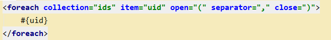
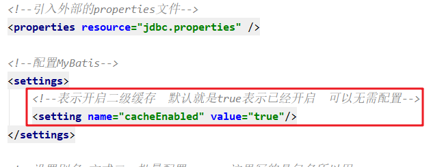
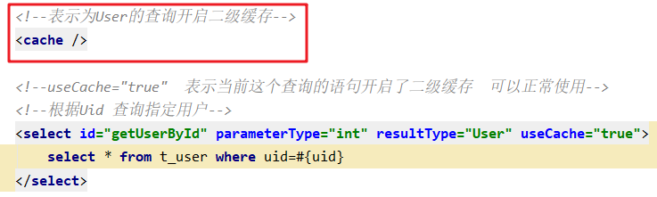
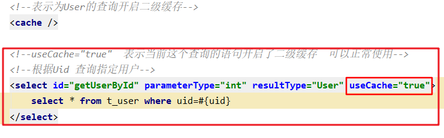
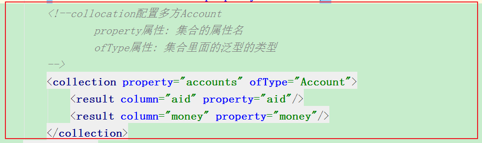
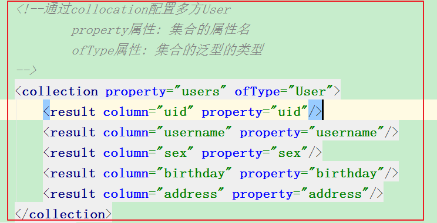

# 3day34-MyBatis

# 学习目标

- [ ] 了解Mybatis连接池与事务操作
- [ ] 掌握Mybatis动态SQL
- [ ] 了解Mybatis一级缓存
- [ ] 了解Mybatis二级缓存
- [ ] 掌握Mybatis一对一关系
- [ ] 掌握Mybatis一对多关系
- [ ] 掌握Mybatis多对多关系


# 第一章-Mybatis 连接池与事务【了解】

## 知识点-Mybatis 的连接池技术【了解】

### 1.目标

​	我们在前面的 WEB 课程中也学习过类似的连接池技术 ，而在 Mybatis 中也有连接池技术，但是它采用的是自己的连接池技术 。

​	在 Mybatis 的 mybatis-config.xml 配置文件中， 通过  `<dataSource type=”pooled”>`来实现 Mybatis 中连接池的配置.

### 2.路径

1. Mybatis 连接池的分类 
2. Mybatis 中数据源的配置
3. Mybatis 中 DataSource 配置分析 

### 3.讲解

#### 3.1Mybatis 连接池的分类 

+ 可以看出 Mybatis 将它自己的数据源分为三类：

  +  UNPOOLED 不使用连接池的数据源
  +  POOLED   【默认】使用连接池的数据源
  +  JNDI 使用 JNDI 实现的数据源,不一样的服务器获得的DataSource是不一样的. 注意: 只有是web项目或者Maven的war工程, 才能使用. 我们用的是tomcat, 用的连接池是dbcp.

  

+ 在这三种数据源中，我们目前阶段一般采用的是 POOLED 数据源（很多时候我们所说的数据源就是为了更好的管理数据库连接，也就是我们所说的连接池技术）,等后续学了Spring之后,会整合一些第三方连接池。 

#### 3.2Mybatis 中数据源的配置 

+ 我们的数据源配置就是在 mybatis-config.xml 文件中， 具体配置如下： 

  

+ MyBatis 在初始化时，解析此文件，根据<dataSource>的 type 属性来创建相应类型的的数据源DataSource，即：

  ​	type=”POOLED”： MyBatis 会创建 PooledDataSource 实例, 使用连接池
  ​	type=”UNPOOLED” ： MyBatis 会创建 UnpooledDataSource 实例, 没有使用的,只有一个连接对象的
  ​	type=”JNDI”： MyBatis 会从 JNDI 服务上（tomcat ... jboss...）查找 DataSource 实例，然后返回使用. 只有在web项目里面才有的,用的是服务器里面的.  默认会使用tomcat里面的dbcp

#### 3.3Mybatis 中 DataSource 配置分析 

+ 代码,在21行加一个断点, 当代码执行到21行时候,我们根据不同的配置(POOLED和UNPOOLED)来分析DataSource


+ 当配置文件配置的是type=”POOLED”, 可以看到数据源连接信息

  


+ 当配置文件配置的是type=”UNPOOLED”, 没有使用连接池

  

### 4.小结

1. 配置

   type="POOLED"  使用连接池(MyBatis内置的)
   type="UNPOOLED" 不使用连接池

2. 后面做项目, 工作里面的连接池, 我们都是使用的第三方的(C3P0,Druid,光连接池), 都有让Spring管理.此章节只做了解


## 知识点-Mybatis 的事务控制 【了解】

### 1.目标

- [ ] 了解MyBatis事务操作

### 2.路径

1. JDBC 中事务的回顾
2. Mybatis 中事务提交方式 
3. Mybatis 自动提交事务的设置

### 3.讲解

#### 3.1 JDBC 中事务的回顾 

​	在 JDBC 中我们可以通过手动方式将事务的提交改为手动方式，通过 setAutoCommit()方法就可以调整。通过 JDK 文档，我们找到该方法如下： 

开启事务：connection.setAutoCommit(false);

提交事务：操作成功：connection.commit()       操作失败：connection.rollback();


​	那么我们的 Mybatis 框架因为是对 JDBC 的封装，所以 Mybatis 框架的事务控制方式，本身也是用 JDBC的 setAutoCommit()方法来设置事务提交方式的。 

#### 3.2Mybatis 中事务提交方式 

+ Mybatis 中事务的提交方式，本质上就是调用 JDBC 的 setAutoCommit()来实现事务控制。我们运行之前所写的

  connection --> sqlSession   MyBatis默认关闭事务自动提交，采用手动方式进行提交

  代码： 


+ userDao 所调用的 saveUser()方法如下： 

  

+ 观察在它在控制台输出的结果： 

  

  ​	这是我们的 Connection 的整个变化过程， 通过分析我们能够发现之前的 CUD操作过程中，我们都要手动进行事务的提交，原因是 setAutoCommit()方法，在执行时它的值被设置为 false 了，所以我们在CUD 操作中，必须通过 sqlSession.commit()方法来执行提交操作。 

#### 3.3 Mybatis 自动提交事务的设置 

​	通过上面的研究和分析，现在我们一起思考，为什么 CUD 过程中必须使用 sqlSession.commit()提交事务？主要原因就是在连接池中取出的连接，都会将调用 connection.setAutoCommit(false)方法，这样我们就必须使用 sqlSession.commit()方法，相当于使用了 JDBC 中的 connection.commit()方法实现事务提交。明白这一点后，我们现在一起尝试不进行手动提交，一样实现 CUD 操作。 


​	我们发现，此时事务就设置为自动提交了，同样可以实现 CUD 操作时记录的保存。虽然这也是一种方式，但就编程而言，设置为自动提交方式为 false 再根据情况决定是否进行提交，这种方式更常用。因为我们可以根据业务情况来决定提交是否进行提交。 

> 在实际开发中，程序一般不会设置事务自动提交，因为往往一个业务实现需要多个操作，如果说设置事务自动提交，可能导致执行结果不正常(成功部分提交  失败部分不提交)。
>
> Spring 控制事务提交回滚！

### 4.小结

1. MyBatis的事务使用的是JDBC事务策略. 
   + 通过设置autoCommit()去控制的
   + 默认情况下, MyBatis使用的时候 就把autoCommit(false)  默认关闭事务的自动提交
     + 也就是意味着, 我们要进行增删改的时候, 需要手动的commit
2. 后面做项目, 工作里面的事务管理, 基本上都是交给Spring管理. 所以此章节只做了解

# 第二章-Mybatis 的动态SQL【重点】 

​	Mybatis 的映射文件中，前面我们的 SQL 都是比较简单的，有些时候业务逻辑复杂时，我们的 SQL是动态变化的，此时在前面的学习中我们的 SQL 就不能满足要求了。

## 知识点-动态 SQL 之if标签 

### 1.目标

​	我们根据实体类的不同取值，使用不同的 SQL 语句来进行查询。

​	比如在 id 如果不为空时可以根据 id查询，如果 username 不为空时还要加入用户名作为条件。这种情况在我们的多条件组合查询中经常会碰到

### 2.讲解

+ QueryVo.java

> 它的作用专门是用来包装查询参数的。

```java
@AllArgsConstructor
@NoArgsConstructor
@Data
public class QueryVo implements Serializable {

    //封装查询对象(参数)
    private User user;
}
```

+ UserDao.java

```java
public interface UserDao {
    /**
     * 使用if
     * 使用pojo包装类  根据用户名和id进行查询用户列表
     * @param queryVo
     * @return
     */
    List<User> getUserListByQueryVo1(QueryVo queryVo);
}
```

+ UserDao.xml

```xml
<!--使用pojo包装类型  根据用户名和id进行查询用户列表-->
<select id="getUserListByQueryVo1" parameterType="QueryVo" resultType="User">
    select * from t_user where 1=1
    <if test="user.uid!=null and user.uid>0">
        and uid=#{user.uid}
    </if>
    <if test="user.username!=null and user.username.length>0">
        and username=#{user.username}
    </if>
</select>
```

+ 测试

```java
//测试  使用pojo包装类 根据用户名和id查询所有的用户信息
    @Test
    public void test02(){
        SqlSession sqlSession = SqlSessionFactoryUtils.getSqlSession();
        UserDao userDao = sqlSession.getMapper(UserDao.class);
        //调用方法
        User user0 = new User();
        user0.setUid(7);
        user0.setUsername("张三丰");
        QueryVo queryVo = new QueryVo();
        queryVo.setUser(user0);
        List<User> users = userDao.getUserListByQueryVo1(queryVo);
        for (User user : users) {
            System.out.println("user = " + user);
        }
        SqlSessionFactoryUtils.close(sqlSession);
    }
```

### 3.小结

1. if适合动态多条件查询
2. 注意

 

 

## 知识点-动态 SQL 之where标签 

### 1.目标

​	为了简化上面 where 1=1 的条件拼装，我们可以采用<where>标签来简化开发。

### 2.讲解

userDao.java

```java
/**
     * 使用where+if
     * 使用pojo包装类型  根据用户名和id进行查询用户列表
     * @param queryVo
     * @return
*/
List<User> getUserListByQueryVo2(QueryVo queryVo);
```


修改 UserDao.xml 映射文件如下： 

```xml
<!--使用pojo包装类型  根据用户名和id进行查询用户列表-->
    <select id="getUserListByQueryVo2" parameterType="QueryVo" resultType="User">
        select * from t_user
        <!--  使用where标签  会自动去除多余的关键字and|or  但是不会自动添加 -->
        <where>
            <if test="user.uid!=null and user.uid>0">
                and uid=#{user.uid}
            </if>
            <if test="user.username!=null and user.username.length>0">
                and username=#{user.username}
            </if>
        </where>
    </select>
```


> 注意: <where />可以自动处理第一个 and 

测试类：

```java
//测试  使用pojo包装类 根据用户名和id查询所有的用户信息
@Test
public void test02(){
    SqlSession sqlSession = SqlSessionFactoryUtils.getSqlSession();
    UserDao userDao = sqlSession.getMapper(UserDao.class);
    //调用方法
    User user0 = new User();
    user0.setUid(7);
    user0.setUsername("张三丰");
    QueryVo queryVo = new QueryVo();
    queryVo.setUser(user0);
    List<User> users = userDao.getUserListByQueryVo2(queryVo);
    for (User user : users) {
        System.out.println("user = " + user);
    }
    SqlSessionFactoryUtils.close(sqlSession);
}
```


### 3.小结

1. where标签用在自己写sql语句的时候 where关键字不好处理的情况,代替where 1= 1
2. **注意**：where只会自动去除多余的关键字  不会自动添加  所以在编写sql语句时关键字and、or不能省略

## 知识点-动态标签之foreach标签  

### 1.目标

- [ ] 掌握foreach标签的使用

### 2.讲解

#### 2.1需求

+ 传入多个 id 查询用户信息，用下边sql 实现：

```sql
-- 根据用户名和用户id进行模糊查询
SELECT uid ,username ,birthday ,sex, address FROM t_user 
	WHERE username LIKE '张%' AND  uid IN (1,2,6)
```

这样我们在进行范围查询时，就要将一个集合中的值，作为参数动态添加进来。这样我们将如何进行参数的传递？ 

+ 在QueryVo.java 添加一个集合

```java
/**
 * pojo包装类型  封装参数
 */
@AllArgsConstructor
@NoArgsConstructor
@Data
public class QueryVo implements Serializable {

    private List<Integer> ids;

    //封装查询条件
    private User user;
}
```

+ UserDao.java

```java
/**
     * 使用 pojo包装类  QueryVo
     * 根据用户名和用户id进行模糊查询
*/

List<User> getUserListByQueryVo3(QueryVo queryVo);
```

+ UserDao.xml

```xml
<!--使用 pojo包装类  QueryVo 根据用户名和用户id进行模糊查询-->
<select id="getUserListByQueryVo3" parameterType="QueryVo" resultType="User">
    SELECT uid ,username ,birthday ,sex, address FROM t_user
    WHERE username LIKE concat(#{user.username},'%')
    AND  uid IN
    <!--
             foreach：遍历标签 用来遍历集合数组数据
                 collection：要遍历的集合
                 item：遍历得到的元素
                 open：遍历的内容以什么开头
                 separator：遍历的元素之间以什么分割
                 close：遍历的内容以什么结尾
         -->
    <foreach collection="ids" item="uid" open="(" separator="," close=")">
        #{uid}
    </foreach>
</select>
```

+ 测试

```java
// 需求：查询姓张的并且uid为1 2 6 的用户
// 测试  使用 pojo包装类  QueryVo 根据用户名和用户id进行模糊查询
@Test
public void test03(){
    SqlSession sqlSession = SqlSessionFactoryUtils.getSqlSession();
    UserDao userDao = sqlSession.getMapper(UserDao.class);
    //调用方法
    User user0 = new User();
    user0.setUsername("张");
    ArrayList<Integer> ids = new ArrayList<Integer>();
    ids.add(1);
    ids.add(2);
    ids.add(6);
    QueryVo queryVo = new QueryVo();
    queryVo.setUser(user0);
    queryVo.setIds(ids);

    List<User> users = userDao.getUserListByQueryVo3(queryVo);
    for (User user : users) {
        System.out.println("user = " + user);
    }
    SqlSessionFactoryUtils.close(sqlSession);
}
```

### 3.小结

foreach标签用于遍历集合，它的属性：

+ collection:代表要遍历的集合元素，注意编写时不要写#{}
+ open:代表语句的开始部分(一直到动态的值之前)
+ close:代表语句结束部分
+ item:代表遍历集合的每个元素，生成的变量名(随便取)
+ sperator:代表分隔符 (动态值之间的分割)

 


## 知识点-SQL 片段 

### 1.目标

​	Sql 中可将重复的 sql 提取出来，使用时用 include 引用即可，最终达到 sql 重用的目的。我们先到 UserDao.xml 文件中使用<sql>标签，定义出公共部分.

### 2.讲解

+ 使用sql标签抽取

```xml
<!--sql标签：提取公共的sql片段  方便重用-->
<sql id="selectUser">
    SELECT uid ,username ,birthday ,sex, address FROM t_user
</sql>
```

+ 使用include标签引入使用

```xml
<!--使用 pojo包装类  QueryVo 根据用户名和用户id进行模糊查询-->
<select id="getUserListByQueryVo3" parameterType="QueryVo" resultType="User">
    <include refid="selectUser"></include>
    WHERE username LIKE concat(#{user.username},'%')
    AND  uid IN
    <!--
             foreach：遍历标签 用来遍历集合数组数据
                 collection：要遍历的集合
                 item：遍历得到的元素
                 open：遍历的内容以什么开头
                 separator：遍历的元素之间以什么分割
                 close：遍历的内容以什么结尾
         -->
    <foreach collection="ids" item="uid" open="(" separator="," close=")">
        #{uid}
    </foreach>
</select>
```

+ 整个图示


### 3.小结

1. sql标签可以把公共的sql语句进行抽取, 再使用include标签引入. 好处:好维护, 提高效率

# 第三章 - MyBatis缓存【了解】

## 知识点-缓存概述

### 1.目标

- [ ] 掌握MyBatis缓存类别

### 2.路径

1. 缓存概述
2. 为什么使用缓存
3. 缓存的适用情况
4. MyBatis缓存类别

### 3.讲解

#### 3.1缓存概述

​	缓存就是一块内存空间.保存临时数据 

#### 3.2为什么使用缓存

​	将数据源（数据库或者文件）中的数据读取出来存放到缓存中，再次获取的时候 ,直接从缓存中获取，**可以减少和数据库交互的次数,这样可以提升程序的性能！**

#### 3.3缓存的适用情况

+ 适用于缓存的：经常查询但不经常修改的(eg: 省市,商品信息)，数据的正确与否对最终结果影响不大的
+ 不适用缓存的：经常改变的数据 , 敏感数据（例如：股市的牌价，银行的汇率，银行卡里面的钱)等等, 

#### 3.4MyBatis缓存类别

​	一级缓存：它是sqlSession对象的缓存，自带的(不需要配置)不可卸载的(不想使用还不行).  一级缓存的生命周期与sqlSession一致。

​	二级缓存：它是SqlSessionFactory的缓存。只要是同一个SqlSessionFactory创建的SqlSession就共享二级缓存的内容，并且可以操作二级缓存。**二级缓存如果要使用的话，需要我们自己手动开启(需要配置的)。**

### 4.小结

1. 缓存: 内存空间, 保存临时数据到内存中
2. 为什么要使用缓存?  减少与数据库交互的次数，提高程序性能
3. 适合使用缓存?  经常查询的, 数据不经常改变
4. MyBatis的缓存类别
   + 一级缓存 ： 默认开启的，属于sqlsession级别
   + 二级缓存 ： 需要配置，默认不开启， 属于sqlsessionfactory  它的范围要比一级缓存大

## 知识点-一级缓存 

### 1.目标

- [ ] 掌握MyBatis一级缓存

### 2.路径

1. 证明一级缓存的存在
2. 一级缓存分析
3. 测试一级缓存清空

### 3.讲解

#### 3.1证明一级缓存的存在

> 只有查询的操作，才有缓存的必要性。增删改的操作不会有缓存。

```java
//测试  证明MyBatis一级缓存的存在  一级缓存缓存的是对象地址！！！
@Test
public void test01(){
    //1.获取SqlSession对象
    SqlSession sqlSession = SqlSessionFactoryUtils.getSqlSession();
    UserDao userDao = sqlSession.getMapper(UserDao.class);
    //2.调用方法
    User user = userDao.getUserById(6);
    System.out.println("user = " + user);

    //证明一级缓存的存在  不关闭SqlSession  重新查询一次 看数据是从哪里获取到的？
    User user1 = userDao.getUserById(6);
    System.out.println("user1 = " + user1);
    //判断user对象和user1对象是不是在同一个内存地址 (是不是同一个对象)
    System.out.println(user==user1);


    SqlSessionFactoryUtils.close(sqlSession);
}
```

#### 3.2一级缓存分析

​	

​	第一次发起查询用户 id 为 1 的用户信息，先去找缓存中是否有 id 为 1 的用户信息，如果没有，从数据库查询用户信息。得到用户信息，将用户信息存储到一级缓存中。第二次发起查询用户 id 为 1 的用户信息，先去找缓存中是否有 id 为 1 的用户信息，缓存中有，直接从缓存中获取用户信息。 

​	**:smiley:如果 sqlSession 去执行 commit操作（执行插入、更新、删除），清空 SqlSession 中的一级缓存，这样做的目的为了让缓存中存储的是最新的信息，避免脏读。 commit动作一定会清空缓存，因为有可能存在一种假设： 原来查询的是id为1的用户信息，接着做了更新操作，把id为1的用户信息给修改了，那么此时缓存里面的数据就是过期数据。**

#### 3.3测试一级缓存清空

+ 关闭session

```java
/*
        测试：一级缓存清空
            情况一：SqlSession关闭，两次查询使用的不是同一个SqlSession对象
     */
    @Test
    public void test02(){
        //1.获取SqlSession对象
        SqlSession sqlSession = SqlSessionFactoryUtils.getSqlSession();
        UserDao userDao = sqlSession.getMapper(UserDao.class);
        //2.调用方法
        User user = userDao.getUserById(6);
        System.out.println("user = " + user);
        
        //3.关闭SqlSession对象
        SqlSessionFactoryUtils.close(sqlSession);


        //重新获取SqlSession对象
        SqlSession sqlSession1 = SqlSessionFactoryUtils.getSqlSession();
        UserDao userDao1 = sqlSession1.getMapper(UserDao.class);
        User user1 = userDao1.getUserById(6);
        System.out.println("user1 = " + user1);

        //判断user对象和user1对象是不是在同一个内存地址 (是不是同一个对象)
        System.out.println(user==user1);
    }
```

+ 提交事务会清空一级缓存

```java
/**
    测试：一级缓存清空
    情况一：SqlSession关闭，两次查询使用的不是同一个SqlSession对象
    情况二：当查询的数据 进行增删改操作 执行commit提交之后，一级缓存清空
*/
@Test
public void test03(){
    //1.获取SqlSession对象
    SqlSession sqlSession = SqlSessionFactoryUtils.getSqlSession();
    UserDao userDao = sqlSession.getMapper(UserDao.class);
    //2.调用方法
    User user = userDao.getUserById(6);
    System.out.println("user = " + user);

    //执行修改  并且commit
    user.setUsername("张三三");
    user.setAddress("东莞");
    int rows = userDao.updateUser(user);
    sqlSession.commit();

    //使用同一个SqlSession对象 重新查询一次
    User user1 = userDao.getUserById(6);
    System.out.println("user1 = " + user1);

    //判断user对象和user1对象是不是在同一个内存地址 (是不是同一个对象)
    System.out.println(user==user1);
}
```

### 4.小结

1. 一级缓存:  依赖sqlSession对象的, 自带的不可卸载的. 一级缓存的生命周期和sqlSession一致
2. 一级缓存清空
   + sqlSession销毁 ， 调用close()
   + 增删改 提交之后  , 调用了commit

## 补充知识点-序列化和反序列化

### 1.目标

- [ ] 了解序列化和反序列化

### 2.路径

1. 序列化
2. 反序列化

### 3.讲解

Java对象是在JVM中生成的，如果需要远程传输或保存到硬盘上，就需要将**Java对象转换成可传输的文件流**。

**序列化**：把Java对象转换为字节序列的过程。  方便对象传输

​					ObjectOutputStream代表对象输出流，它的writeObject(Object obj)方法可对参数指定的obj对象进行序列化，把得到的字节序列写到一个目标输出流中。

**反序列化**：把字节序列恢复为Java对象的过程。

​					ObjectInputStream代表对象输入流，它的readObject()方法从一个源输入流中读取字节序列，再把它们反序列化为一个对象，并将其返回。

**注意：**对象进行序列化或反序列化类必须实现Serializable接口   java自带一个机制

```java
public class User implements Serializable {
    private Integer uid;
    private String username;
    private String sex;
    private Date birthday;
    private String address;
}
```

测试类：

```java

public class SerilizableTest {

    @Test
    public void test01() throws Exception {
        File file = new File("user.txt");

        //序列化持久化对象
        ObjectOutputStream out = new ObjectOutputStream(new FileOutputStream(file));
        User user = new User();
        user.setUsername("zs");
        user.setAddress("深圳");
        out.writeObject(user);
        out.close();

        //反序列化，并得到对象
        ObjectInputStream in = new ObjectInputStream(new FileInputStream(file));
        Object obj = in.readObject(); 
        User newUser = (User) obj;
        in.close();
        System.out.println(newUser);
    }
}

```


## 知识点-二级缓存

### 1.目标

- [ ] 掌握MyBatis二级缓存

### 2.路径

1. 二级缓存的结构
2. 二级缓存的使用
3. 二级缓存的测试

### 3.讲解

​	二级缓存是SqlSessionFactory的缓存。只要是同一个SqlSessionFactory创建的SqlSession就共享二级缓存的内容，并且可以操作二级缓存. **默认mybatis不会开启二级缓存，需要手动配置**

#### 3.1二级缓存的结构


#### 3.2二级缓存的使用

##### 3.2.1 在 MyBatis的核心配置mybatis-config.xml 文件开启二级缓存 

> **二级缓存默认是开启的，当然我们可以手动关闭**



​	==因为 cacheEnabled 的取值默认就为 true==，所以这一步可以省略不配置。为 true 代表开启二级缓存；为 false 代表不开启二级缓存。  

##### 3.2.2 配置相关的 Mapper 映射文件 

> `<cache />` 标签表示当前这个 mapper 映射将使用二级缓存，即：该mapper文件中的所有查询操作都讲使用二级缓存无序单独为每一个<select>标签开启。



##### 3.2.3 配置 statement 上面的 useCache 属性 

​	若不想让某个`<select>`标签使用二级缓存，则可以把useCache设置为false 。
​	注意： 针对每次查询都需要最新的数据 sql，要设置成 useCache=false，禁用二级缓存。 



#### 3.3测试

```java
/**
     * 情况：SqlSession已经关闭 使用的不是同一个了
     * 测试二级缓存 可以使用
*/
@Test
public void test04(){
    //1.获取SqlSession对象
    SqlSession sqlSession = SqlSessionFactoryUtils.getSqlSession();
    UserDao userDao = sqlSession.getMapper(UserDao.class);
    //2.调用方法
    User user = userDao.getUserById(6);
    System.out.println("user = " + user);
    //3.关闭SqlSession对象
    SqlSessionFactoryUtils.close(sqlSession);


    //重新获取SqlSession对象
    SqlSession sqlSession1 = SqlSessionFactoryUtils.getSqlSession();
    UserDao userDao1 = sqlSession1.getMapper(UserDao.class);
    User user1 = userDao1.getUserById(6);
    System.out.println("user1 = " + user1);

    //一级缓存 缓存的对象的内存地址  注意：二级缓存缓存的是对象序列化之后的数据
    System.out.println(user==user1);
}
```

​	经过上面的测试，我们发现执行了两次查询，并且在执行第一次查询后，我们关闭了一级缓存，再去执行第二次查询时，我们发现并没有对数据库发出 sql 语句，所以此时的数据就只能是来自于我们所说的二级缓存。 

### 4.小结

1. 二级缓存的使用

   二级缓存是将数据缓存在与SqlSessionFactory对象关联的内存空间中

   配置使用：mybatis核心配置开启全局缓存  --> 映射文件开启缓存 <cache />  --> 指定查询使用二级缓存 useCache="true"

2. 二级缓存清空

   1. 关闭SqlSessionFactory
   2. 当数据执行增删改操作 进行commit提交之后  二级缓存会清空

3. 注意事项

​	当我们在使用二级缓存时，缓存的类一定要实现 java.io.Serializable 接口，这种就可以使用序列化方式来保存对象。 


# 第四章-Mybatis 的多表关联查询【重点】 

## 知识点-一(多)对一

### 1.需求

​	本次案例以简单的用户和账户的模型来分析 Mybatis 多表关系。用户为 User 表，账户为Account 表。一个用户（User）可以有多个账户（Account）,**但是**一个账户(Account)只能属于一个用户(User)。 类比到生活中的： 一个人可以有多张银行卡账户，但是一个银行卡账户只能属于一个人。具体关系如下： 

 

* 需求

**查询所有账户信息， 关联查询账户的用户名和地址**

​	因为一个账户信息只能供某个用户使用，所以从查询账户信息出发关联查询用户信息为一对一查询。

- 数据库的准备

```sql
CREATE TABLE t_account(
		aid INT PRIMARY KEY auto_increment,
		money DOUBLE,
		uid INT
);
ALTER TABLE t_account ADD FOREIGN KEY(uid) REFERENCES t_user(uid);

INSERT INTO `t_account` VALUES (null, '1000', '1');
INSERT INTO `t_account` VALUES (null, '2000', '1');
INSERT INTO `t_account` VALUES (null, '1000', '2');
INSERT INTO `t_account` VALUES (null, '2000', '2');
INSERT INTO `t_account` VALUES (null, '800', '3');
```

### 2.分析

+ 查询语句

A： 内连接  inner join    B ： 外连接  outer join  

```
SELECT a.*,u.username,u.address FROM t_account AS a,t_user AS u WHERE a.uid=u.uid
```

### 3.实现

#### 3.1方式一

> 需求：在查询账户信息的同时查询出关联的用户信息(用户名称 用户地址)  账户表  -1:1-  用户表
>
> 上面的sql语句是要查询两张表的，得到的结果必然是两张表的集合（包含了两张表的所有列） ，但是目前没有直接的一个javabean能够包容（包装）多张表的数据。

+ Account.java

```java
@AllArgsConstructor
@NoArgsConstructor
@Data
public class Account {
    private Integer aid;
    private double money;
    private Integer uid;
}
```

+ AccountCustom.java

  ​	为了能够封装上面 SQL 语句的查询结果，定义 AccountCustom类中要包含账户信息同时还要包含用户信息，所以我们要在定义 AccountCustom类时可以继承 Account类 

```java
@ToString(callSuper = true)
@Data
@NoArgsConstructor
@AllArgsConstructor
public class AccountCustom extends Account {
    //用户表查询得到的数据。
    private String username;
    private String address;
}
```

+ AccountDao.java

```java
public interface AccountDao {
    /**
     * 查询所有的账户信息 并关联用户名和地址
     * @return
     */
     List<AccountCustom> findAll();
}
```

+ AccountDao.xml

```xml
<mapper namespace="com.itheima.dao.AccountDao">

    <!--查询所有的账户信息 并关联用户名和地址-->
    <select id="findAll" resultType="AccountCustom">
        SELECT a.*,u.username,u.address FROM t_account AS a,t_user AS u WHERE a.uid=u.uid
    </select>

</mapper>
```

#### 3.2方式二【重点】

**需求：在查询账户信息的同时查询出关联的用户信息(用户名称 用户地址)  账户表  -1:1-  用户表**

+ 修改Account.java

  在 Account 类中加入 User类的对象作为 Account 类的一个属性。 

 ```java
@AllArgsConstructor
@NoArgsConstructor
@Data
public class Account {
    private Integer aid;
    private double money;
    private Integer uid;
    //表示Account和User 1:1关系  当你查询出一条Account账户信息时 同时可以得到它对应的用户信息
    //在一方添加另外一个一方的javabean属性
    private User user;
}
 ```

+ AccountDao.java

```java
/**
     * 采用关联映射配置进行查询
     * 查询所有的账户信息 并关联用户名和地址
*/
List<Account> findAccountList();
```

+ AccountDao.xml

```xml
<?xml version="1.0" encoding="UTF-8" ?>
<!DOCTYPE mapper
        PUBLIC "-//mybatis.org//DTD Mapper 3.0//EN"
        "http://mybatis.org/dtd/mybatis-3-mapper.dtd">
<!-- namespace:设置当前映射文件和哪一个dao接口对应   namespace的值就是对应接口的全限定名称 -->
<mapper namespace="com.itheima.dao.AccountDao">

    <resultMap id="findAccountListId" type="Account">
        <id column="aid" property="aid" />
        <result column="money" property="money" />
        <result column="uid" property="uid" />
        <!--一对一关联映射配置
            associafindtion：用来进行一对一的关联映射配置
                property：指向一方属性
                javaType：一方属性类型
        -->
        <association property="user" javaType="User">
            <result column="username" property="username"/>
            <result column="address" property="address"/>
        </association>

    </resultMap>

    <!--查询所有的账户信息 并关联用户名和地址 一对一关联映射配置-->
    <select id="findAccountList" resultMap="findAccountListId">
        SELECT a.*,u.username,u.address FROM t_account AS a,t_user AS u WHERE a.uid=u.uid
    </select>

</mapper>
```

### 4.小结

1. 表达关系:

   + 实体类里面  【在一方【多方】配置另外一个一方对象属性】

     

   + 映射文件 【在一方【多方】映射文件中使用association配置另外一个一方对象和数据库中字段的映射】

    

    


## 知识点-一对多

### 1.需求

​		查询所有用户信息及用户关联的账户信息。

### 2.分析

​	分析： 用户信息和他的账户信息为**一对多**关系，并且查询过程中如果用户没有账户信息，此时也要将用户信息查询出来，我们需要使用外连接查询。 

* 前面的多对一的需求：

> 需求：查询所有的账户，并且把该账户所属的用户信息给查询出来
>
> sql:   外连接或者内连接都可以。 一定是根据账户的信息能查到这个账户属于谁。不会出现一种情况就是： 有账户但是不知道这个账户属于谁的情况！！！

* 一对多的需求

> 需求： 查询所有的用户，以及这个用户有哪些账户，都查询出来。
>
> sql :  不能使用内连接了，内连接的核心就是查询出来两张表都有对等关系的记录信息。但是有一种极端的情况： 有的用户可能没有账户。此时就必须使用外连接。其实左外和右外都可以，只是他们的区别就是谁在左边谁在右边而已。

+ sql语句

```mysql
SELECT * FROM t_user AS u LEFT JOIN t_account AS a ON u.uid=a.uid
```

### 3.实现

+ Account.java

```java

@Data
@NoArgsConstructor
@AllArgsConstructor
public class Account {
	private Integer aid;
	private Integer uid;
	private Double money;
}
```

+ User.java

  ​	为了能够让查询的 User 信息中，带有他的个人多个账户信息，我们就需要在 User 类中添加一个集合，
  用于存放他的多个账户信息，这样他们之间的关联关系就保存了。 

```java
@AllArgsConstructor
@NoArgsConstructor
@Data
public class User implements Serializable{
    private Integer uid;
    private String username;
    private String sex;
    private Date birthday;
    private String address;

    //改造javabean
    //在一方 添加多方的对象集合属性
    private List<Account> accounts;
}
```

+ UserDao.java

```java
public interface UserDao {
    /**
     * 查询所有用户信息及用户关联的账户信息。
     */
    public List<User> findAll();
}
```

+ UserDao.xml

```xml
<?xml version="1.0" encoding="UTF-8" ?>
<!DOCTYPE mapper
        PUBLIC "-//mybatis.org//DTD Mapper 3.0//EN"
        "http://mybatis.org/dtd/mybatis-3-mapper.dtd">
<!-- namespace:设置当前映射文件和哪一个dao接口对应   namespace的值就是对应接口的全限定名称 -->
<mapper namespace="com.itheima.dao.UserDao">

    <resultMap id="findAllId" type="User">
        <id column="uid" property="uid" />
        <result column="username" property="username" />
        <result column="sex" property="sex" />
        <result column="birthday" property="birthday" />
        <result column="address" property="address" />
        <!--
            collection：用来进行一对多的关联映射配置
                property：多方属性名称
                ofType：多方属性类型
        -->
        <collection property="accounts" ofType="Account">
            <result column="aid" property="aid" />
            <result column="money" property="money" />
            <result column="uid" property="uid" />
        </collection>
    </resultMap>

    <!--查询所有用户信息及用户关联的账户信息。-->
    <select id="findAll" resultMap="findAllId">
        SELECT * FROM t_user AS u LEFT JOIN t_account AS a ON u.uid=a.uid
    </select>
</mapper>
```

### 4.小结

1. 语句, 建议使用外连接. 用户可以没有账户的, 但是用户信息需要查询出来, 账户的个数就为0

```
SELECT u.*, a.aid, a.money  FROM t_user u LEFT OUTER JOIN t_account a ON u.uid = a.uid
```

2. 表达关系  【一对多配置】

   + 实体类 【在一方配置多方的对象集合属性】

    

   + 映射文件 【在一方映射文件中使用collection为多方的对象集合属性值与数据库查询的列进行映射】

   

小结：配置多(一)对一使用association【javaType】，配置一对多使用collection【ofType】


## 知识点-多对多

### 1. 需求

​	通过前面的学习，我们使用 Mybatis 实现一对多关系的维护。多对多关系其实我们看成是**双向的一对多关系**。用户与角色的关系模型就是典型的多对多关系.


​	需求：实现查询所有角色对象并且加载它所分配的用户信息。 

+ 建表语句

```sql
CREATE TABLE t_role(
	rid INT PRIMARY KEY AUTO_INCREMENT,
	rName varchar(40),
	rDesc varchar(40)
);
INSERT INTO `t_role` VALUES (null, '校长', '负责学校管理工作');
INSERT INTO `t_role` VALUES (null, '副校长', '协助校长负责学校管理');
INSERT INTO `t_role` VALUES (null, '班主任', '负责班级管理工作');
INSERT INTO `t_role` VALUES (null, '教务处主任', '负责教学管理');
INSERT INTO `t_role` VALUES (null, '班主任组长', '负责班主任小组管理');


-- 中间表(关联表)
CREATE TABLE user_role(
	uid INT,
	rid INT
);

ALTER TABLE  user_role ADD FOREIGN KEY(uid) REFERENCES t_user(uid);
ALTER TABLE  user_role ADD FOREIGN KEY(rid) REFERENCES t_role(rid);

INSERT INTO `user_role` VALUES ('1', '1');
INSERT INTO `user_role` VALUES ('3', '3');
INSERT INTO `user_role` VALUES ('2', '3');
INSERT INTO `user_role` VALUES ('2', '5');
INSERT INTO `user_role` VALUES ('3', '4');
```

### 2.分析

​	查询角色我们需要用到 Role 表，但角色分配的用户的信息我们并不能直接找到用户信息，而是要通过中间表(USER_ROLE 表)才能关联到用户信息。
下面是实现的 SQL 语句： 

```sql
SELECT * FROM t_role AS r
 	LEFT JOIN user_role AS ur
 	ON r.`rid` = ur.`rid`
 	LEFT JOIN t_user AS u
 	ON u.`uid` = ur.`uid`
```

> 实现：多对多就相对于两个一对多 

### 3.实现

+ User.java

```java
package com.itheima.bean;

import lombok.AllArgsConstructor;
import lombok.Data;
import lombok.NoArgsConstructor;

import java.util.Date;

@AllArgsConstructor
@NoArgsConstructor
@Data
public class User implements Serializable{
    private Integer uid;
    private String username;
    private String sex;
    private Date birthday;
    private String address;
}
```

+ Role.java

```java
/**
 * 需求：实现查询所有角色对象并且加载它所分配的用户信息。
 * 就是在角色对象下加一个用户集合属性
 */
@NoArgsConstructor
@AllArgsConstructor
@Data
public class Role {
    private Integer rid;
    private String rName;
    private String rDesc;

    //改造 角色的实体类  添加多方对象集合属性
    private List<User> users;
}
```

+ RoleDao.java

```java
public interface RoleDao {
    /**
     * 实现查询所有角色对象并且加载它所分配的用户信息。
     */
    List<Role> findAll();
}
```

+ RoleDao.xml

```xml
<?xml version="1.0" encoding="UTF-8" ?>
<!DOCTYPE mapper
        PUBLIC "-//mybatis.org//DTD Mapper 3.0//EN"
        "http://mybatis.org/dtd/mybatis-3-mapper.dtd">
<!-- namespace:设置当前映射文件和哪一个dao接口对应   namespace的值就是对应接口的全限定名称 -->
<mapper namespace="com.itheima.dao.RoleDao">

    <resultMap id="findAllId" type="Role">
        <id column="rid" property="rid"/>
        <result column="rName" property="rName" />
        <result column="rDesc" property="rDesc" />
        <!--配置多对多 实际上就是配置双向的一对多 使用collection  角色：用户 = 1：N -->
        <collection property="users" ofType="User">
            <result column="uid" property="uid"/>
            <result column="username" property="username"/>
            <result column="sex" property="sex"/>
            <result column="birthday" property="birthday"/>
            <result column="address" property="address"/>
        </collection>
    </resultMap>
    
    <!--实现查询所有角色对象并且加载它所分配的用户信息。角色：用户 = 1：N -->
    <select id="findAll" resultMap="findAllId">
        SELECT * FROM t_role AS r
             LEFT JOIN user_role AS ur
             ON r.`rid` = ur.`rid`
             LEFT JOIN t_user AS u
             ON u.`uid` = ur.`uid`
    </select>
</mapper>
```

### 4.小结

1. 多对多本质就是两个1对多. 实现起来基本和1对多是一样的【除了SQL语句】

2. 表达关系

   + 实体类

    

   + 映射文件

    

    

# 总结

1. 连接池和事务【了解】

   1. 连接池
      1. 一般目前使用POOLED , 代表使用mybatis内置的连接池
      2. UNPOOLED  表示不使用连接池
      
      注意：当后面学习Spring，实际工作中，会使用第三方的连接池(druid 光连接池...)
      
   2. 事务
      1. mybatis其实它的底层还是jdbc, 所以它的事务还是那一套 conn.setAutoCommit(false);
      2. 增删改了之后，需要手动提交事务。sqlSession.commit();
      3. 如果希望mybatis具有自动提交事务的功能，在开始openSession(true);

3. 动态SQL

   1. 特点：就是sql语句可以动态变化，不是一成不变的，是根据条件在变化。
   2. <if>  ： 用来判断参数，设置条件
   3. <where> ： 用来设置where关键字，在拼接条件时可以自动去除多余的关键字and|or
   4. foreach :  遍历集合参数的

```xml
 <!--
             foreach：遍历标签 用来遍历集合数组数据
                 collection：要遍历的集合
                 item：遍历得到的元素
                 open：遍历的内容以什么开头
                 separator：遍历的元素之间以什么分隔
                 close：遍历的内容以什么结尾
			eg：(1,2,6)
         -->
    <foreach collection="ids" item="uid" open="(" separator="," close=")">
        #{uid}
    </foreach>
```

​				5.  sql标签：抽取公共sql，实现重用

 	3.	MyBatis缓存
 	  	1.	缓存的概念：在内存中开辟一块空间，保存临时数据
 	  	2.	一级缓存：默认开启 和SqlSession相关 ，当SqlSession关闭或增删改操作事务提交
 	  	3.	二级缓存：手动开启 和SqlSessionFactory相关，当SqlSessionFactory销毁或增删改操作事务提交
 	       - mybatis-config.xml(开启全局缓存 可以不用设置 默认开启)
 	       - xxxDao.xml (使用<cache/> 进行局部开启使用)
 	       - 在指定要使用二级缓存的查询语句处使用(useCache="true")

4. 多表关联查询

1. 一对一
   1. 改造javabean，添加一方对象属性 eg：private User user;

   2. 在映射文件中，使用association配置一对一  

      ```xml
      <association property="一方属性名称" javaType="一方属性类型"></association >
      ```

2. 一对多   
   1. 改造javabean，添加多方对象集合属性：private List<Account> accounts;

   2. 在映射文件中，使用collection配置一对多

      ```xml
      <collection property="多方属性名称" ofType="多方属性类型"></collection >
      ```

3. 多对多： 多对多就可以看成是两个一对多  去实现就可以了。

