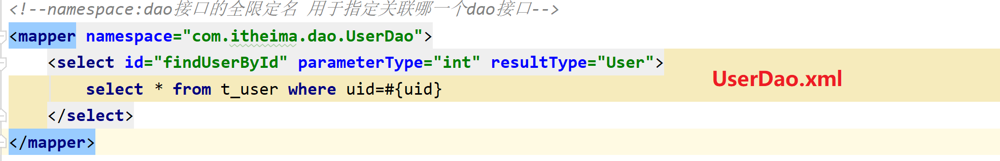
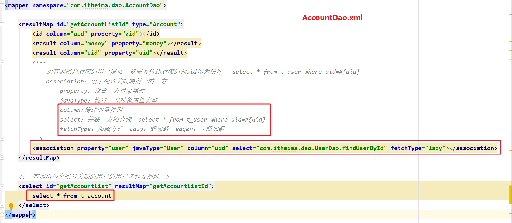
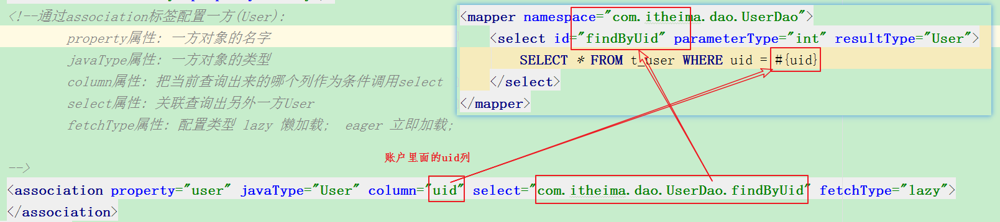
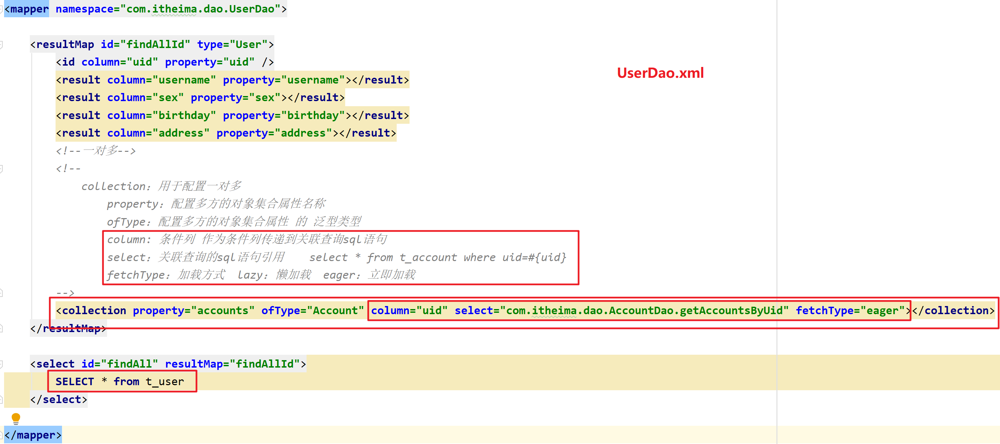
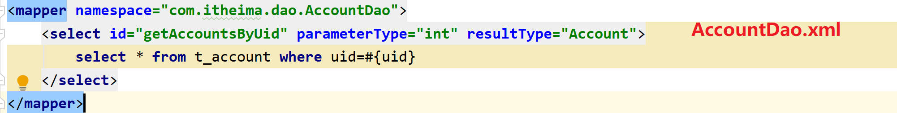
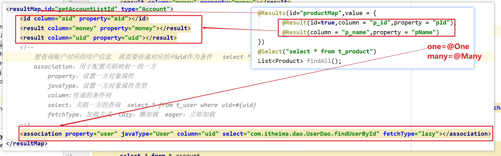
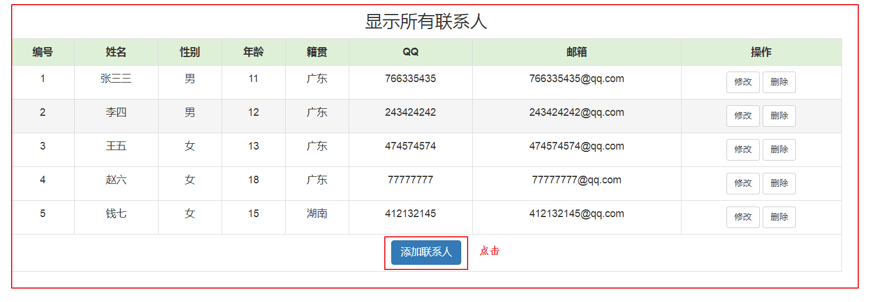
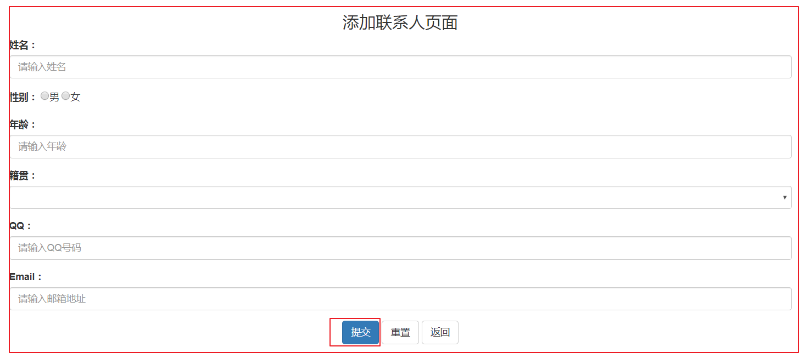
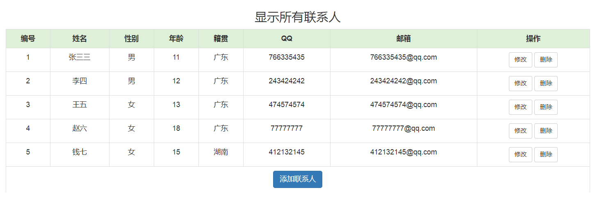
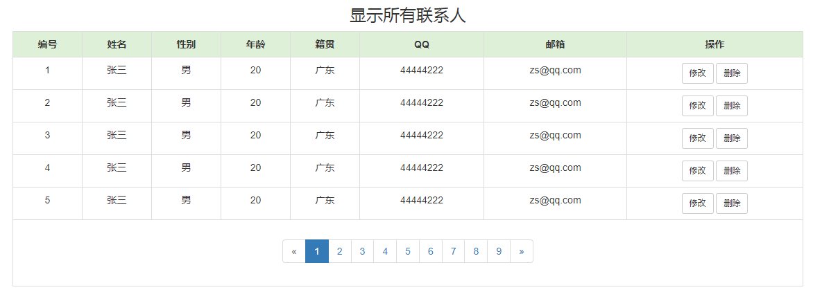

# day35 - Mybatis

# 学习目标

- [ ] 掌握Mybatis的延迟加载
- [ ] 掌握Mybatis注解开发
- [ ] 掌握Mybatis分页处理

# 第一章 - Mybatis 延迟加载策略【重点】

## 知识点-Mybatis 延迟加载策略 

### 1.目标

​	通过前面的学习，我们已经掌握了 Mybatis 中一对一，一对多，多对多关系的配置及实现，可以实现对象的关联查询 （它属于立即查询， 查询A表的时候，立即查询B表出来。）。实际开发过程中很多时候我们并不需要总是在加载一方信息时就一定要加载另外一方的信息。 此时就是我们所说的**延迟加载**。

### 2.路径

1. 什么是延迟加载 
2. 使用 Assocation 实现延迟加载 (多对一,一对一)
3. Collection 实现延迟加载  (一对多)

### 3.讲解

#### 3.1什么是延迟加载 

​	延迟加载：就是在需要用到数据时才进行加载，不需要用到数据时就不加载数据。延迟加载也称懒加载.

​	**坏处： 因为只有当需要用到数据时，才会进行数据库查询，这样在大批量数据查询时，因为查询工作也要消耗时间，所以可能造成用户等待时间变长，造成用户体验下降。**

​	**好处： 先从单表查询，需要时再从关联表去关联查询，大大提高数据库性能，因为查询单表要比关联查询多张表速度要快.**   

> 懒加载只有在多表联合查询的时候才会出现，只查单张表的时候，不存在什么懒加载

#### 3.2使用 Assocation 实现延迟加载 (多(一)对一)

##### 3.2.1需求

​	查询账户(Account)信息并且关联查询用户(User)信息。

* 分析

> 1. 所有的懒加载查询工作，都不能使用多张表的连接查询了（内连接|外连接）
> 2. 必须把这些工作拆分成查单张表的工作
>    1.  先查询所有的账户信息 ：  select * from t_account
>    2. 得到所有的账户了之后， select  * from t_user where uid  = ?

```
-- 1. 查询账户
SELECT * FROM t_account
-- 2, 再查询用户(等使用到用户再查询 account.getUser().getName())
--    再根据查询结果里面的uid查询当前账户所属的用户
SELECT * FROM t_user WHERE uid = 1
```

​	`sql:select * from account `

##### 3.2.2实现

+ User.java

```java
@AllArgsConstructor
@NoArgsConstructor
@Data
public class User implements Serializable{
    private Integer uid;
    private String username;
    private String sex;
    private Date birthday;
    private String address;
}
```

+ Account.java

```java
@Data
@NoArgsConstructor
@AllArgsConstructor
public class Account {
    private Integer aid;
    private Integer uid;
    private Double money;

    //添加user属性  添加一方对象属性
    private User user;
}
```

+ AccountDao.java

```java
public interface AccountDao {

    /**
     * 查询所有账户
     */
    List<Account> getAccountList();
}
```

+ AccountDao.xml

```xml
<?xml version="1.0" encoding="UTF-8" ?>
<!DOCTYPE mapper
        PUBLIC "-//mybatis.org//DTD Mapper 3.0//EN"
        "http://mybatis.org/dtd/mybatis-3-mapper.dtd">
<mapper namespace="com.itheima.dao.AccountDao">
    <resultMap id="getAccountListId" type="Account">
        <id column="aid" property="aid"></id>
        <result column="money" property="money"></result>
        <result column="uid" property="uid"></result>
        <!--
            想查询账户对应的用户信息  就需要传递对应的列uid作为条件   select * from t_user where uid=#{uid}
            association：用于配置关联映射一的一方
                property：设置一方对象属性
                javaType：设置一方对象属性类型
                column:传递的条件列
                select：关联一方的查询  select * from t_user where uid=#{uid}
                fetchType：加载方式  lazy：懒加载  eager：立即加载
        -->
        <association property="user" javaType="User" column="uid" select="com.itheima.dao.UserDao.getUserByUid" fetchType="lazy"></association>
    </resultMap>

    <!--查询出每个账号关联的用户的用户名称及地址-->
    <select id="getAccountList" resultMap="getAccountListId">
        select * from t_account
    </select>
</mapper>
```

+ UserDao.java

```java
public interface UserDao {

    /**
     * 根据uid查询用户信息
     */
    User getUserByUid(Integer uid);
}
```

+ UserDao.xml

```xml
<?xml version="1.0" encoding="UTF-8" ?>
<!DOCTYPE mapper
        PUBLIC "-//mybatis.org//DTD Mapper 3.0//EN"
        "http://mybatis.org/dtd/mybatis-3-mapper.dtd">
<mapper namespace="com.itheima.dao.UserDao">
    <!--根据uid查询用户-->
    <select id="getUserByUid" parameterType="int" resultType="User">
        select * from t_user where uid=#{uid}
    </select>
</mapper>
```

+ 测试

```java
package com.itheima.test;

import com.itheima.bean.Account;
import com.itheima.dao.AccountDao;
import com.itheima.utils.SqlSessionFactoryUtils;
import org.apache.ibatis.session.SqlSession;
import org.junit.Test;

import java.util.List;

public class MyBatisTest {

    //测试  查询所有的账户信息 并关联用户名和地址  一对一查询
    @Test
    public void test02(){
        //1.获取SqlSession
        SqlSession sqlSession = SqlSessionFactoryUtils.getSqlSession();
        //2.获取代理对象
        AccountDao accountDao = sqlSession.getMapper(AccountDao.class);
        //3.调用方法
        List<Account> accountList = accountDao.findAccountList();
        for (Account account : accountList) {
            System.out.println("aid=" + account.getAid()+" money="+account.getMoney());
            //需要知道当前账户所对应的用户信息
            //System.out.println("username="+account.getUser().getUsername());

        }
        //4.关闭SqlSession
        SqlSessionFactoryUtils.close(sqlSession);
    }

}
```

##### 3.2.3小结


1. 语句不能再使用多表连接查询语句了, 拆成单表查询

```sql
-- 1.查询账户
SELECT * FROM t_account;

-- 2. 查询当前账户的对应的用户
-- 把当前账户的uid作为条件查询用户表
SELECT * FROM t_user WHERE uid = 1;
```

2. 映射文件








* 懒加载有没有用武之地，有没有存在的必要性！
  * 不管是懒加载还是以前的关联查询（内连接|外连接），它们都是要查询两张表的。
  * 但是它们也是由区别的：
    * 关联查询的动作： 会把两张表同时都查询出来，意思就是：数据结果在一次就搞定，不会再来第二次。
    * 懒加载的动作： 分开来查，先查询A表， B表会不会查询，取决于用户想不想看B表的数据。如果想看，就查询B表，如果不想看，就不查询B表。


#### 3.3Collection 实现延迟加载  (一对多,多对多)

##### 3.3.1需求

​	查询所有的用户信息，并且把这个用户拥有的账户信息也查询出来

* 分析
  * 1. 所有的懒加载都是要分两步走的。
    2. 先查询A表（主表--用户表）的所有记录
    3. 再查询B表 （从表--账户吧）的单条记录，要根据id去查询。

```sql
-- 1. 查询用户
SELECT * FROM t_user
-- 2. 查询当前用户下的账户信息
-- 把用户里面的uid作为条件查询账户表
SELECT * FROM t_account WHERE uid = 1
```

##### 3.3.2实现

+ Account.java

```java
@Data
@NoArgsConstructor
@AllArgsConstructor
public class Account {
    private Integer aid;
    private Integer uid;
    private Double money;
}
```

+ User.java

```java
@AllArgsConstructor
@NoArgsConstructor
@Data
public class User implements Serializable{
    private Integer uid;
    private String username;
    private String sex;
    private Date birthday;
    private String address;

    //改造javabean
    //在一方 添加多方的对象集合属性
    private List<Account> accounts;
}
```

+ UserDao.java

```java
public interface UserDao {

    /**
     * 查询所有用户信息
     * @return
     */
    List<User> findAll();

}
```

+ UserDao.xml

```xml
<?xml version="1.0" encoding="UTF-8" ?>
<!DOCTYPE mapper
        PUBLIC "-//mybatis.org//DTD Mapper 3.0//EN"
        "http://mybatis.org/dtd/mybatis-3-mapper.dtd">
<!-- namespace:设置当前映射文件和哪一个dao接口对应   namespace的值就是对应接口的全限定名称 -->
<mapper namespace="com.itheima.dao.UserDao">

    <resultMap id="findAllId" type="User">
        <id column="uid" property="uid" />
        <result column="username" property="username" />
        <result column="sex" property="sex" />
        <result column="birthday" property="birthday" />
        <result column="address" property="address" />
        <!--
            collection：用来进行一对多的关联映射配置
                property：多方属性名称
                ofType：多方属性类型
                column:作为下一个查询的条件列
                select：指向下一个查询的SQL语句
                fetchType：加载类型 lazy：懒加载  eager：立即加载
        -->
        <collection property="accounts" ofType="Account" column="uid" select="com.itheima.dao.AccountDao.getAccountByUid" fetchType="lazy"></collection>
    </resultMap>

    <!--查询所有用户信息及用户关联的账户信息。-->
    <select id="findAll" resultMap="findAllId">
        select * from t_user
    </select>
</mapper>
```

+ AccountDao.java

```java
public interface AccountDao {

     /**
     * 根据uid查询存在的账户
     */
    List<Account> getAccountsByUid(Integer uid);
}

```

+ AccountDao.xml

```xml
<?xml version="1.0" encoding="UTF-8" ?>
<!DOCTYPE mapper
        PUBLIC "-//mybatis.org//DTD Mapper 3.0//EN"
        "http://mybatis.org/dtd/mybatis-3-mapper.dtd">
<!-- namespace:设置当前映射文件和哪一个dao接口对应   namespace的值就是对应接口的全限定名称 -->
<mapper namespace="com.itheima.dao.AccountDao">
    <!--根据uid查询存在的账户-->
    <select id="getAccountsByUid" parameterType="int" resultType="Account">
        select * from t_account where uid=#{uid}
    </select>
</mapper>
```

+ 测试方法

```java
package com.itheima.test;

import com.itheima.bean.Account;
import com.itheima.bean.User;
import com.itheima.dao.AccountDao;
import com.itheima.dao.UserDao;
import com.itheima.utils.SqlSessionFactoryUtils;
import org.apache.ibatis.session.SqlSession;
import org.junit.Test;

import java.util.List;

public class MyBatisTest {

    //测试  查询所有的账户信息 并关联用户名和地址
    @Test
    public void test01(){
        //1.获取SqlSession
        SqlSession sqlSession = SqlSessionFactoryUtils.getSqlSession();
        //2.获取代理对象
        UserDao userDao = sqlSession.getMapper(UserDao.class);
        //3.调用方法
        List<User> users = userDao.findAll();
        for (User user : users) {
            System.out.println("username = " + user.getUsername());
            //需要查询用户下对应的账户信息
            System.out.println("accounts="+user.getAccounts());
        }
        //4.关闭SqlSession
        SqlSessionFactoryUtils.close(sqlSession);
    }
}
```

##### 3.3.3小结


1. 语句不能再使用多表查连接询语句了, 拆成单表查询   

```sql
-- 1.查询所有用户
SELECT * FROM t_user;

-- 2. 查询当前用户的对应的账户
-- 把当前用户的uid作为条件查询账户表
SELECT * FROM t_account WHERE uid = 1;
```

2. 映射文件






### 4.总结

| 类别     | 特点                                               |
| -------- | -------------------------------------------------- |
| 立即加载 | 只要一调用方法，则马上发起查询                     |
| 延迟加载 | 只有在真正使用时，才发起查询，如果不用，则不查询。 |

# 第二章 - MyBatis注解开发【重点】

​	这几年来注解开发越来越流行， Mybatis 也可以使用注解开发方式，这样我们就可以减少编写 Mapper映射文件了。 本次我们先围绕一些基本的 CRUD来学习，再学习复杂映射关系及延迟加载。

## 知识点-使用 Mybatis 注解实现基本CRUD 

### 1.目标

- [ ] 使用 Mybatis 注解实现基本CRUD

### 2.路径

1. @Insert:实现新增
2. @Update:实现更新
3. @Delete:实现删除
4. @Select:实现查询
5. @SelectKey:保存之后 获得保存的id

### 3.实现

+ Dao

```java
package com.itheima.dao;

import com.itheima.bean.QueryVo;
import com.itheima.bean.User;
import org.apache.ibatis.annotations.*;

import javax.management.Query;
import javax.management.relation.Role;
import java.util.List;

public interface UserDao {
    // 查询所有用户
    @Select("select * from t_user")
    List<User> findAll();

    // 增加用户
    /**
        keyProperty：主键所对应的javabean属性
        resultType：主键属性类型
        before：主键如果在插入语句之前生成就设置为true，如果主键是在插入语句之后生成设置为false
        statement：获取主键id
     */
    @Insert("insert into t_user values(null,#{username},#{sex},#{birthday},#{address})")
    @SelectKey(keyProperty = "uid",resultType = int.class,before = false,statement = "select last_insert_id()")
    int addUser(User user);

    // 修改用户
    @Update("update t_user set username=#{username},address=#{address} where uid=#{uid}")
    int updateUser(User user);

    // 删除用户
    @Delete("delete from t_user where uid=#{uid}")
    int deleteUserById(Integer uid);

    // 需求1：查询用户表的用户记录数
    int count();

    // 需求2：根据uid查询指定用户
    User getUserByUid(Integer uid);
}

```

+ SqlMapConfig.xml

 

- MyBatisTest.java

```java
package com.itheima.test;

import com.itheima.bean.QueryVo;
import com.itheima.bean.Role;
import com.itheima.bean.User;
import com.itheima.dao.UserDao;
import com.itheima.utils.SqlSessionFactoryUtils;
import org.apache.ibatis.io.Resources;
import org.apache.ibatis.session.SqlSession;
import org.apache.ibatis.session.SqlSessionFactory;
import org.apache.ibatis.session.SqlSessionFactoryBuilder;
import org.junit.Test;

import java.io.IOException;
import java.io.InputStream;
import java.util.Date;
import java.util.List;

public class MyBatisTest {

    //测试
    @Test
    public void test01(){
        //1.获取SqlSession对象
        SqlSession sqlSession = SqlSessionFactoryUtils.getSqlSession();
        //2.获取代理对象
        UserDao userDao = sqlSession.getMapper(UserDao.class);
        //3.调用方法

        /* 删除

         */
        int rows = userDao.deleteUserById(6);
        sqlSession.commit();


        /* 修改
            User user = new User(6,"张三峰","男",new Date(),"西安");
            int rows = userDao.updateUser(user);
            sqlSession.commit();
         */

        /*增加
            User user = new User(null,"张伟威","男",new Date(),"深圳");
            int rows = userDao.addUser(user);
            sqlSession.commit();
            if(rows>0){
                System.out.println("增加成功！uid="+user.getUid());
            }else{
                System.out.println("增加失败！");
            }
         */

        /* 查询所有
            List<User> users = userDao.findAll();
            System.out.println("users = " + users);
        */

        //4.关闭SqlSession对象
        SqlSessionFactoryUtils.close(sqlSession);
    }
}
```


### 4.小结

1. 查询

```
@Select("sql语句")
```

2. 新增

```
@SelectKey(keyProperty = "主键属性名",resultType = 主键Java类型,before = false,statement = "SELECT LAST_INSERT_ID()")
@Insert("sql语句")
```

3. 更新

```
@Update("sql语句")
```

4. 删除

```
@Delete("sql语句)
```

## 知识点-使用Mybatis注解实现复杂关系映射开发

### 1.目标

- [ ] 掌握Mybatis注解开发

### 2.路径

1. 复杂关系映射的注解说明 
2. 使用注解实现一对一复杂关系映射及延迟加载
3. 使用注解实现一对多复杂关系映射及延迟加载 

### 3.讲解 

​	实现复杂关系映射之前我们可以在映射文件中通过配置<resultMap>来实现, @ResultMap 这个注解不是封装用的。

​	下面我们一起来学习 **@Results 注解， @Result 注解， @One 注解， @Many注解。 **



#### 3.1复杂关系映射的注解说明 

+ @Results 注解 , 代替的是标签<resultMap> 

```java
//该注解中可以使用单个@Result 注解，也可以使用@Result 集合
@Results（{@Result（）， @Result（） }）或@Results（@Result（））

```

+ @Resutl 注解 ,代替了 <id>标签和<result>标签 ,

```java
@Result(column="列名",property="属性名",one=@One(select="指定用来多表查询的 sqlmapper"),many=@Many(select=""))

@Resutl 注解属性说明	
    column 数据库的列名
    Property 需要装配的属性名
    one 需要使用的@One 注解（@Result（one=@One）（）））
    many 需要使用的@Many 注解（@Result（many=@many）（）））

```

+ @One 注解（一对一）,代替了<assocation>标签，是多表查询的关键，在注解中用来指定子查询返回单一对象。 

```java
@Result(column="列名",property="属性名",one=@One(select="指定用来多表查询的 sqlmapper"))

```

+ @Many 注解（一对多） ,代替了<collection>标签,是是多表查询的关键，在注解中用来指定子查询返回对象集合 

  ​	注意：聚集元素用来处理“一对多”的关系。需要指定映射的 Java 实体类的属性，属性的 javaType（一般
  为 ArrayList） 但是注解中可以不定义； 

```java
@Result(property="",column="",many=@Many(select=""))

```

#### 3.2使用注解实现（多）一对一复杂关系映射及延迟加载 

##### 3.2.1需求

​	查询账户(Account)信息并且关联查询用户(User)信息。

​	先查询账户(Account)信息，当我们需要用到用户(User)信息时再查询用户(User)信息。

##### 3.2.2实现

+ User.java

```java
package com.itheima.bean;

import lombok.AllArgsConstructor;
import lombok.Data;
import lombok.NoArgsConstructor;

import java.util.Date;

@Data
@NoArgsConstructor
@AllArgsConstructor
public class User {
    private Integer uid;
    private String username;
    private String sex;
    private Date birthday;
    private String address;
}

```

- Account.java

```java
package com.itheima.bean;

import lombok.AllArgsConstructor;
import lombok.Data;
import lombok.NoArgsConstructor;

@Data
@NoArgsConstructor
@AllArgsConstructor
public class Account {
	private Integer aid;
	private Integer uid;
	private Double money;

	//表示这个账户属于哪个用户
	private User user;

}

```

- AccountDao.java

```java
package com.itheima.dao;

import com.itheima.bean.Account;
import com.itheima.bean.AccountCustom;
import org.apache.ibatis.annotations.One;
import org.apache.ibatis.annotations.Result;
import org.apache.ibatis.annotations.Results;
import org.apache.ibatis.annotations.Select;
import org.apache.ibatis.mapping.FetchType;

import java.util.List;

public interface AccountDao {
    /**
     * 采用自定义类封装查询结果
     * 查询所有的账户信息 并关联用户名和地址
     * @return
     */
     List<AccountCustom> findAll();

    /**
     * 采用关联映射配置进行查询
     * 查询所有的账户信息 并关联用户名和地址
     */
    /*
         @Results：代替resultMap标签
         @Result：代替id标签 和result标签  用于配置表中字段和javabean属性映射
         @One：代替association标签  用于配置一对一
    */
    @Results(value = {
            @Result(id = true,column = "aid",property = "aid"),
            @Result(column = "money",property = "money"),
            @Result(column = "uid",property = "uid"),
            /*
                column：表示的就是要传递的条件列
                property：表示配置一方属性
                @One：代替association标签
                    select：表示要关联的下一条查询SQL语句
                    fetchType：加载方式  FetchType.LAZY：懒加载  FetchType.EAGER：立即加载
             */
            @Result(column = "uid",property = "user",
                    one = @One(select = "com.itheima.dao.UserDao.getUserByUid",fetchType = FetchType.LAZY)
            )
    })
    @Select("select * from t_account")
    List<Account> findAccountList();
}
```

+ UserDao.java

```java
package com.itheima.dao;

import com.itheima.bean.User;
import org.apache.ibatis.annotations.Select;

public interface UserDao {

    /**
     * 根据uid查询用户信息
     */
    @Select("select * from t_user where uid=#{uid}")
    User getUserByUid(Integer uid);
}
```

+ 测试

```java
package com.itheima.test;

import com.itheima.bean.Account;
import com.itheima.bean.AccountCustom;
import com.itheima.dao.AccountDao;
import com.itheima.utils.SqlSessionFactoryUtils;
import org.apache.ibatis.session.SqlSession;
import org.junit.Test;

import java.util.List;

public class MyBatisTest {

    //测试  查询所有的账户信息 并关联用户名和地址
    @Test
    public void test01(){
        //1.获取SqlSession
        SqlSession sqlSession = SqlSessionFactoryUtils.getSqlSession();
        //2.获取代理对象
        AccountDao accountDao = sqlSession.getMapper(AccountDao.class);
        //3.调用方法
        List<AccountCustom> list = accountDao.findAll();
        for (AccountCustom accountCustom : list) {
            System.out.println("accountCustom = " + accountCustom);
        }
        //4.关闭SqlSession
        SqlSessionFactoryUtils.close(sqlSession);
    }

    //测试  查询所有的账户信息 并关联用户名和地址  一对一查询
    @Test
    public void test02(){
        //1.获取SqlSession
        SqlSession sqlSession = SqlSessionFactoryUtils.getSqlSession();
        //2.获取代理对象
        AccountDao accountDao = sqlSession.getMapper(AccountDao.class);
        //3.调用方法
        List<Account> accountList = accountDao.findAccountList();
        for (Account account : accountList) {
            System.out.println("aid=" + account.getAid()+" money="+account.getMoney());
            //需要知道当前账户所对应的用户信息
            //System.out.println("username="+account.getUser().getUsername());

        }
        //4.关闭SqlSession
        SqlSessionFactoryUtils.close(sqlSession);
    }
}
```

#### 3.3使用注解实现一对多复杂关系映射及延迟加载 

##### 3.3.1需求

​	完成加载用户对象时，查询该用户所拥有的账户信息。 

​	等账户信息使用的时候再查询.

##### 3.3.2实现

* Account.java

```java
package com.itheima.bean;

import lombok.AllArgsConstructor;
import lombok.Data;
import lombok.NoArgsConstructor;

@Data
@NoArgsConstructor
@AllArgsConstructor
public class Account {
	private Integer aid;
	private Integer uid;
	private Double money;

}
```

+ User.java

```java
@AllArgsConstructor
@NoArgsConstructor
@Data
public class User implements Serializable{
    private Integer uid;
    private String username;
    private String sex;
    private Date birthday;
    private String address;

    //改造javabean
    //在一方 添加多方的对象集合属性
    private List<Account> accounts;
}

```

- UserDao.java

```java
package com.itheima.dao;

import com.itheima.bean.User;
import org.apache.ibatis.annotations.Many;
import org.apache.ibatis.annotations.Result;
import org.apache.ibatis.annotations.Results;
import org.apache.ibatis.annotations.Select;
import org.apache.ibatis.mapping.FetchType;

import java.util.List;

public interface UserDao {

    /**
     * 查询所有用户信息及用户关联的账户信息。
     */
    @Results(value = {
            @Result(id = true,column = "uid",property = "uid"),
            @Result(column = "username",property = "username"),
            @Result(column = "sex",property = "sex"),
            @Result(column = "birthday",property = "birthday"),
            @Result(column = "address",property = "address"),
            /* 一对多配置
                column：要传递的条件列
                property：多方属性名称
                @Many：替代collection标签 用于配置一对多
                    select：指向下一条查询的SQL语句
                    fetchType：加载类型  FetchType.LAZY：懒加载  FetchType.EAGER：立即加载
             */
            @Result(column = "uid",property = "accounts" ,
                many = @Many(select = "com.itheima.dao.AccountDao.getAccountsByUid",fetchType = FetchType.LAZY)
            )

    })
    @Select("select * from t_user")
    public List<User> findAll();
}
```

+ AccountDao.java

```java
public interface AccountDao {
    /**
     * 根据uid查询存在的账户
     */
    @Select("select * from t_account where uid=#{uid}")
    List<Account> getAccountsByUid(Integer uid);
}

```

+ 测试

```java
package com.itheima.test;

import com.itheima.bean.Account;
import com.itheima.bean.User;
import com.itheima.dao.AccountDao;
import com.itheima.dao.UserDao;
import com.itheima.utils.SqlSessionFactoryUtils;
import org.apache.ibatis.session.SqlSession;
import org.junit.Test;

import java.util.List;

public class MyBatisTest {

    //测试  查询所有的账户信息 并关联用户名和地址
    @Test
    public void test01(){
        //1.获取SqlSession
        SqlSession sqlSession = SqlSessionFactoryUtils.getSqlSession();
        //2.获取代理对象
        UserDao userDao = sqlSession.getMapper(UserDao.class);
        //3.调用方法
        List<User> users = userDao.findAll();
        for (User user : users) {
            System.out.println("username = " + user.getUsername());
            //需要查询用户下对应的账户信息
            System.out.println("accounts="+user.getAccounts());
        }
        //4.关闭SqlSession
        SqlSessionFactoryUtils.close(sqlSession);
    }
}
```

### 4.小结

1. 代替ResultMap标签

```java
@Results(value={
	@Result(column = "列名",property = "属性名",id = boolean值),
	//一对一配置 使用@One替代xml配置的association
	@Result(column = "要传递的条件列",property = "一方对象属性", 
            one=@One(select="关联的下一条查询SQL语句", fetchType=FetchType.LAZY) ),
    //一对多配置 使用@Many替代xml配置的collection
    @Result(column = "要传递的条件列",property = "多方对象集合属性名称", 
            many=@Many(select="关联的下一条查询的SQL语句", fetchType=FetchType.LAZY) )
})
```

# 第三章 - 分页处理【重点】

## 知识点 - 分页

### 1.目标

- [ ] 掌握Mybatis 分页处理

### 2.路径

1. 使用PageHelper实现分页效果

### 3.讲解

#### 3.1 添加依赖

```xml
 <dependency>
     <groupId>com.github.pagehelper</groupId>
     <artifactId>pagehelper</artifactId>
     <version>5.1.10</version>
</dependency>
```

#### 3.2 添加插件

> 需要在mybatis的核心配置文件中，配置分页插件。 位于`environments` 的前面。 配置分页的插件其实就是配置拦截器。这个拦截器有什么作用呢？ 它的作用是能够让我们在不侵入代码|源码的情况下实现分页的效果，也就是它会在底层的sql语句给我们追加 limit ? ,? 

```xml
<plugins>
    <plugin interceptor="com.github.pagehelper.PageInterceptor"></plugin>
</plugins>
```

#### 3.3 示例代码

* javabean

```java
@Data
@NoArgsConstructor
@AllArgsConstructor
public class User implements Serializable {
    private Integer uid;
    private String username;
    private String sex;
    private Date birthday;
    private String address;
}
```

* dao

> 1. 返回值使用pagehelper提供的 Page
> 2. 最终的sql语句使用查询所有的语句

```java
public interface UserDao {
    //查询所有用户 返回分页数据
    @Select("select * from t_user")
    List<User> findAll01();

    //查询所有用户 返回分页信息
    @Select("select * from t_user")
    Page<User> findAll02();
}
```

* 测试代码

> 在查询之前需要设置查询的参数。

```java
package com.itheima.test;

import com.github.pagehelper.Page;
import com.github.pagehelper.PageHelper;
import com.github.pagehelper.PageInfo;
import com.itheima.bean.User;
import com.itheima.dao.UserDao;
import com.itheima.utils.SqlSessionFactoryUtils;
import org.apache.ibatis.session.SqlSession;
import org.junit.Test;

import java.util.List;

public class MyBatisTest {

    //测试 分页
    @Test
    public void test01(){
        //1.获取SqlSession对象
        SqlSession sqlSession = SqlSessionFactoryUtils.getSqlSession();
        //2.获取代理对象
        UserDao userDao = sqlSession.getMapper(UserDao.class);
        //3.调用方法
        //实现分页  在查询之前设置分页条件
        PageHelper.startPage(2,3);

        List<User> users = userDao.findAll01();
        for (User user : users) {
            System.out.println("user = " + user);
        }

        //4.关闭SqlSession对象
        SqlSessionFactoryUtils.close(sqlSession);
    }
    //测试 分页 获取具体的分页信息
    @Test
    public void test02(){
        //1.获取SqlSession对象
        SqlSession sqlSession = SqlSessionFactoryUtils.getSqlSession();
        //2.获取代理对象
        UserDao userDao = sqlSession.getMapper(UserDao.class);
        //3.调用方法
        //实现分页  在查询之前设置分页条件
        PageHelper.startPage(2,3);

        List<User> users = userDao.findAll01();
        //将分页数据封装到PageInfo中  可以得到分页信息(当前页码、总条数、总页数、每页条数、每页数据)
        PageInfo<User> pageInfo = new PageInfo(users);
        System.out.println("当前页码：" + pageInfo.getPageNum());
        System.out.println("总条数：" + pageInfo.getTotal());
        System.out.println("总页数:" + pageInfo.getPages());
        System.out.println("每页条数:" + pageInfo.getPageSize());
        List<User> list = pageInfo.getList();
        for (User user : list) {
            System.out.println("user = " + user);
        }
        //4.关闭SqlSession对象
        SqlSessionFactoryUtils.close(sqlSession);
    }

    //测试 分页 获取具体的分页信息
    @Test
    public void test03(){
        //1.获取SqlSession对象
        SqlSession sqlSession = SqlSessionFactoryUtils.getSqlSession();
        //2.获取代理对象
        UserDao userDao = sqlSession.getMapper(UserDao.class);
        //3.调用方法
        //实现分页  在查询之前设置分页条件
        PageHelper.startPage(1,3);
        Page<User> page = userDao.findAll02();
        System.out.println("当前页码：" + page.getPageNum());
        System.out.println("总条数：" + page.getTotal());
        System.out.println("总页数:" + page.getPages());
        System.out.println("每页条数:" + page.getPageSize());
        //每页数据
        List<User> users = page.getResult();
        for (User user : users) {
            System.out.println("user = " + user);
        }
        //实际开发中 不返回Page对象(归根结底还是一个list集合) 返回PageInfo对象(货真价实的分页信息封装工具类)
        PageInfo<User> pageInfo = page.toPageInfo();

        //4.关闭SqlSession对象
        SqlSessionFactoryUtils.close(sqlSession);
    }
}
```

### 4.总结

1. 添加依赖
2. 添加配置【注意：添加在mybatis-config.xml中environments元素上方】
3. 查询的语句为 select * from t_user 
4. 在调用查询语句前 设置分页条件   PageHelper.startPage(1,2);

# 第四章 - 综合案例

## 案例一 - 显示所有联系人

### 一，案例需求


### 二 、实现步骤

* 添加依赖

```xml
<dependencies>
   <!--junit 坐标-->
    <dependency>
      <groupId>junit</groupId>
      <artifactId>junit</artifactId>
      <version>4.12</version>
      <scope>test</scope>
    </dependency>
	<!--Servlet jar包-->
    <dependency>
      <groupId>javax.servlet</groupId>
      <artifactId>javax.servlet-api</artifactId>
      <version>3.1.0</version>
      <scope>provided</scope>
    </dependency>
	<!--JSP编译jar包-->
    <dependency>
      <groupId>javax.servlet.jsp</groupId>
      <artifactId>jsp-api</artifactId>
      <version>2.0</version>
      <scope>provided</scope>
 	</dependency>
    <!--MyBatis坐标-->
    <dependency>
      <groupId>org.mybatis</groupId>
      <artifactId>mybatis</artifactId>
      <version>3.4.6</version>
    </dependency>
    <!--mysql驱动-->
    <dependency>
      <groupId>mysql</groupId>
      <artifactId>mysql-connector-java</artifactId>
      <version>5.1.47</version>
    </dependency>
    <!--lombok 依赖-->
    <dependency>
      <groupId>org.projectlombok</groupId>
      <artifactId>lombok</artifactId>
      <version>1.18.18</version>
    </dependency>
    <!-- log start -->
    <!-- 日志的具体实现  -->
    <dependency>
      <groupId>log4j</groupId>
      <artifactId>log4j</artifactId>
      <version>1.2.17</version>
    </dependency>
    <!--  接口  -->
    <dependency>
      <groupId>org.slf4j</groupId>
      <artifactId>slf4j-api</artifactId>
      <version>1.7.25</version>
    </dependency>
    <dependency>
      <groupId>org.slf4j</groupId>
      <artifactId>slf4j-log4j12</artifactId>
      <version>1.7.25</version>
    </dependency>
    <!--fastjson-->
    <dependency>
      <groupId>com.alibaba</groupId>
      <artifactId>fastjson</artifactId>
      <version>1.2.39</version>
    </dependency>
    <!--BeanUtils-->
    <dependency>
      <groupId>commons-beanutils</groupId>
      <artifactId>commons-beanutils</artifactId>
      <version>1.8.3</version>
    </dependency>
	<!--分页插件-->
    <dependency>
      <groupId>com.github.pagehelper</groupId>
      <artifactId>pagehelper</artifactId>
      <version>5.1.10</version>
    </dependency>
	<!--JSTL标签库-->
    <dependency>
      <groupId>jstl</groupId>
      <artifactId>jstl</artifactId>
      <version>1.2</version>
    </dependency>
    <dependency>
      <groupId>taglibs</groupId>
      <artifactId>standard</artifactId>
      <version>1.1.2</version>
    </dependency>
    <!-- dbutils :: 可以不添加 -->
    <dependency>
      <groupId>commons-dbutils</groupId>
      <artifactId>commons-dbutils</artifactId>
      <version>1.6</version>
    </dependency>

    <!-- c3p0:: 可以不添加 -->
    <dependency>
      <groupId>com.mchange</groupId>
      <artifactId>c3p0</artifactId>
      <version>0.9.2.1</version>
    </dependency>
  </dependencies>

```

* 拷贝配置文件  mybatis-config.xml  db.properties log4j.properties 到 resources目录

> 记得修改db.propeties里面的数据库连接

```properties
jdbc.driver=com.mysql.jdbc.Driver
jdbc.url=jdbc:mysql://localhost:3306/day27
jdbc.username=root
jdbc.password=root
```

* 拷贝工具类 SqlSessionFactoryUtils
* dao代码

```java
package com.itheima.dao;

import com.github.pagehelper.Page;
import com.itheima.bean.LinkMan;
import org.apache.commons.dbutils.QueryRunner;
import org.apache.commons.dbutils.handlers.BeanListHandler;
import org.apache.commons.dbutils.handlers.ScalarHandler;
import org.apache.ibatis.annotations.Delete;
import org.apache.ibatis.annotations.Insert;
import org.apache.ibatis.annotations.Select;

import java.sql.SQLException;
import java.util.List;

public interface LinkManDao {


    /**
     * 查询所有联系人
     * @return
     * @throws SQLException
     */
    @Select("select * from linkman")
    List<LinkMan> findAll();

    /**
     * 增加联系人
     * @param linkMan
     * @return
     */
    @Insert("insert into linkman values(null,#{name},#{sex},#{age},#{address},#{qq},#{email})")
    int add(LinkMan linkMan);

    /**
     * 删除联系人
     * @param id
     * @return
     */
    @Delete("delete from linkman where id=#{id}")
    int deleteById(Integer id);

    /**
     * 查询联系人总记录数
     * @return
     */
    @Select("select count(*) from linkman")
    int count();

    /**
     * 查询分页展示的集合数据
     * @param pageSize
     * @return
     */
    @Select("select * from linkman")
    Page<LinkMan> findPage(int pageNum, int pageSize);
}

```

* service代码

```java
package com.itheima.service;

import com.itheima.bean.LinkMan;
import com.itheima.dao.LinkManDao;
import com.itheima.utils.SqlSessionFactoryUtils;
import org.apache.ibatis.session.SqlSession;

import java.sql.SQLException;
import java.util.List;

public class LinkManService {

    /**
     * 查询所有联系人
     * @return
     * @throws SQLException
     */
    public List<LinkMan> findAll() throws SQLException {
        SqlSession sqlSession = SqlSessionFactoryUtils.getSqlSession();
        LinkManDao linkManDao = sqlSession.getMapper(LinkManDao.class);
        List<LinkMan> list = linkManDao.findAll();
        SqlSessionFactoryUtils.commitAndClose(sqlSession);
        return list;
    }

    /**
     * 添加联系人
     * @param linkMan
     * @return
     * @throws SQLException
     */
    public boolean add(LinkMan linkMan) throws SQLException {
        SqlSession sqlSession = SqlSessionFactoryUtils.getSqlSession();
        LinkManDao linkManDao = sqlSession.getMapper(LinkManDao.class);
        int result =  linkManDao.add(linkMan);
        SqlSessionFactoryUtils.commitAndClose(sqlSession);
         if(result>0){
             return  true;
         }
         return false;
    }

    /**
     * 删除联系人
     * @param id
     * @throws SQLException
     */
    public void delete(Integer id) throws SQLException {
        SqlSession sqlSession = SqlSessionFactoryUtils.getSqlSession();
        LinkManDao linkManDao = sqlSession.getMapper(LinkManDao.class);
        linkManDao.deleteById(id);
        SqlSessionFactoryUtils.commitAndClose(sqlSession);
    }

    public List<LinkMan> findPage(int curPageNo, int pageSize) throws SQLException {
        return null;

    }

    public int count() throws SQLException {
        SqlSession sqlSession = SqlSessionFactoryUtils.getSqlSession();
        LinkManDao linkManDao = sqlSession.getMapper(LinkManDao.class);
        int count = linkManDao.count();
        SqlSessionFactoryUtils.commitAndClose(sqlSession);
        return count;
    }
}

```

## 案例二 - 添加联系人

### 一,案例需求

1. 点击添加联系人跳转添加联系人页面

   

2. 在添加联系人页面，点击提交按钮,把数据提交到服务器,保存到数据库

   

3. 在添加完成，可以查看到新建的联系人信息

    

### 二、实现步骤

* dao 代码

```java
public interface LinkManDao02 {
     @Insert("insert into linkman values(null , #{name} , #{sex}, #{age} , #{address} , #{qq} , #{email})")
     int insert(LinkMan linkMan) ;
}

```

* service代码

```java
public class LinkManService {
    public int add( LinkMan linkMan) throws SQLException {
        System.out.println("add........");
        SqlSession session = SqlSessionFactoryUtil.getSession();
        LinkManDao02 dao = session.getMapper(LinkManDao02.class);
        int row = dao.insert(linkMan);
        session.close();
        return row;
    }
}
```


## 案例三 - 分页展示联系人

### 一,案例需求



### 二、 实现步骤

* dao实现

```java
public interface LinkManDao {
     /**
     * 查询分页展示的集合数据
     * @return
     */
    @Select("select * from linkman")
    Page<LinkMan> findPage();
}

```


* service实现

```java
/**
     * 分页查询
     * @param pageNum  当前页码
     * @param pageSize 每页显示条数
     * @return
     */
    public Page<LinkMan> findPage(int pageNum, int pageSize) throws SQLException {
        SqlSession sqlSession = SqlSessionFactoryUtils.getSqlSession();
        LinkManDao linkManDao = sqlSession.getMapper(LinkManDao.class);
		//查询之前设置一下，需要查询哪一页，每页查询多少条
        PageHelper.startPage(pageNum,pageSize);
        Page<LinkMan> page = linkManDao.findPage();
        SqlSessionFactoryUtils.commitAndClose(sqlSession);
        return page;
    } 
```

- Servlet实现

```JAVA
/**
   * 分页展示联系人
*/
private void findPage(HttpServletRequest request, HttpServletResponse response) throws IOException {
    try {
        //1.获取请求参数
        String pageNumStr = request.getParameter("pageNum");
        int pageNum = pageNumStr == null || "".equals(pageNumStr) ? 1 : Integer.parseInt(pageNumStr);
        int pageSize = 2;   //默认设置每页显示条数
        //2.调用业务处理
        Page<LinkMan> page = linkManService.findPage(pageNum, pageSize);
        System.out.println("page = " + page);

        //通过自定义的PageBean将分页所需数据进行封装 响应给前台
        PageBean<LinkMan> pageBean = new PageBean<LinkMan>(page.getPageNum(),page.getPageSize(),page.getResult(),page.getTotal(),page.getPages());

        request.setAttribute("page",pageBean);
        request.getRequestDispatcher("list_page.jsp").forward(request,response);
    } catch (Exception e) {
        e.printStackTrace();
        response.getWriter().print("服务器异常！");
    }
}
```

- PageBean

```java
/**
 * 分页工具类
 * 分页显示页面所需数据
 */
@AllArgsConstructor
@NoArgsConstructor
@Data
public class PageBean<T> implements Serializable {
    //当前页码
    private int pageNum;
    //每页显示的条数
    private int pageSize;
    //每页显示的集合数据
    private List<T> list;
    private Long total;
    //总页数
    private int pages;
}
```

- 前端页面实现

```jsp
<body>
<div class="container">
    <h3 style="text-align: center">显示所有联系人</h3>
    <table border="1" class="table table-bordered table-hover">
        <tr class="success">
            <th>编号</th>
            <th>姓名</th>
            <th>性别</th>
            <th>年龄</th>
            <th>籍贯</th>
            <th>QQ</th>
            <th>邮箱</th>
            <th>操作</th>
        </tr>
        <%--
            1.获取request作用域中pageBean对象 拿到每页要显示的联系人集合数据  page.list
            2.使用forEach标签遍历 每遍历一次  就显示一个联系人信息
        --%>
        <c:forEach items="${page.list}" var="linkman">
            <tr>
                <td>${linkman.id}</td>
                <td>${linkman.name}</td>
                <td>${linkman.sex}</td>
                <td>${linkman.age}</td>
                <td>${linkman.address}</td>
                <td>${linkman.qq}</td>
                <td>${linkman.email}</td>
                <td><a class="btn btn-default btn-sm" href="修改联系人.html">修改</a>&nbsp;<a class="btn btn-default btn-sm" href="修改联系人.html">删除</a></td>
            </tr>
        </c:forEach>
        <tr>
            <td colspan="8" align="center">
				<ul class="pagination success">
                    <c:if test="${page.pageNum >1}">
                        <li ><a href="linkMan?method=findPage&pageNum=${page.pageNum-1}" aria-label="Previous"><span aria-hidden="true">&laquo;</span></a></li>
                    </c:if>
                    <%--
                        1.遍历显示所有页码  根据总页数进行遍历
                        2.判断当前页码是哪一页 如果是当前页就高亮显示
                        3.设置指定页码跳转   linkMan?method=findPage&pageNum=${i}
                        4.设置上一页  linkMan?method=findPage&pageNum=${page.pageNum-1}
                            添加判断：是不是首页   ${page.pageNum >1}
                        5.设置下一页  linkMan?method=findPage&pageNum=${page.pageNum+1}
                            添加判断：是否是尾页  ${page.pageNum < page.pages}
                    --%>
					<c:forEach var="i" begin="1" end="${page.pages}">
                        <c:choose>
                            <c:when test="${i eq page.pageNum}">
                                <li class="active"><a href="linkMan?method=findPage&pageNum=${i}">${i}</a></li>
                            </c:when>
                            <c:otherwise>
                                <li><a href="linkMan?method=findPage&pageNum=${i}">${i}</a></li>
                            </c:otherwise>
                        </c:choose>
                    </c:forEach>

					<c:if test="${page.pageNum < page.pages}">
                        <li><a href="linkMan?method=findPage&pageNum=${page.pageNum+1}" aria-label="Next"><span aria-hidden="true">&raquo;</span></a></li>
                    </c:if>
				</ul>
            </td>
        </tr>
    </table>
</div>
</body>
```


# 总结

 1. 延迟加载

     1. 懒加载只有在多表联合查询的时候才会出现。

     2. 懒加载的意思就是： 查询从表的数据的时机取决于用户什么时候想看这份数据，也就是查询从表的动作可以稍微的晚一些时候进行。不用直接就全部查询出来。

     3. 一对一 | 一对多 都有懒加载

        1. 一对一 ：  查询所有的账户，并且把该账户属于哪一个用户的信息给查询出来

        ```xml
        <!--一对一关联映射配置
                    association：用来进行一对一的关联映射配置
                        property：指向一方属性
                        javaType：一方属性类型
                        column：关联查询的下一条SQL语句需要使用到的条件列
                        select：配置关联查询的下一条SQL
                        fetchType：加载类型 是否使用懒加载   lazy：使用懒加载  eager：立即加载
        
        -->
        <association property="user" javaType="User" column="uid" select="com.itheima.dao.UserDao.getUserByUid" fetchType="lazy"></association>
        ```

        2. 一对多：  查询所有的用户，并且把该用户拥有的所有账户都查出来：

        ```xml
        <!--
                    collection：用来进行一对多的关联映射配置
                        property：多方属性名称
                        ofType：多方属性类型
                        column:作为下一个查询的条件列
                        select：指向下一个查询的SQL语句
                        fetchType：加载类型 lazy：懒加载  eager：立即加载
        -->
        <collection property="accounts" ofType="Account" column="uid" select="com.itheima.dao.AccountDao.getAccountsByUid" fetchType="lazy"></collection>
        ```

 2. 注解开发

      1. crud注解
           	1. @insert("增加sql语句")
          	2. @update("修改sql语句")
          	3. @delete("删除sql语句")
          	4. @select("查询sql语句")
          	5. @selectKey(keyProperty = "uid",resultType = int.class,before = false,statement = "select last_insert_id()")
          
      2. 多表查询
               1. 注解开发的多表查询，只能使用类似懒加载的写法，就是要拆分成两个单表查询动作。
                                  	2. @@Results :  对应 resultMap标签
                                
             2. @Result ：对应 id和 result标签

             3. @One  ： 对应association标签

                   ```java
                    /*
                        column：表示的就是要传递的条件列
                        property：表示配置一方属性
                        @One：代替association标签
                        	   select：表示要关联的下一条查询SQL语句
                              fetchType：加载方式  FetchType.LAZY：懒加载  FetchType.EAGER：立即加载
                   */
                   @Result(column = "uid",property = "user",
                           one = @One(select = "com.itheima.dao.UserDao.getUserByUid",
                                      fetchType = FetchType.LAZY)
                   )
                   ```

             4. @Many： 对应collection标签

                   ```java
                   /* 一对多配置
                        column：要传递的条件列
                        property：多方属性名称
                        @Many：替代collection标签 用于配置一对多
                             select：指向下一条查询的SQL语句
                             fetchType：加载类型  FetchType.LAZY：懒加载  FetchType.EAGER：立即加载
                   */
                   @Result(column = "uid",property = "accounts" ,
                           many = @Many(select = "com.itheima.dao.AccountDao.getAccountsByUid",
                                        fetchType = FetchType.LAZY)
                   )
                   ```

 4. 分页

     	1. 添加依赖
      2. 添加插件（mybatis-config.xml 中的environments元素上面）
      3. 写dao的方法，查询语句是 select * from 表名
      4. 在执行查询之前，一定要记得先设置分页条件
             PageHelper.startPage(1, 5) ; //查询第一页，每页看5条记录。

4. 综合案例实现，将原来的普通javaweb项目改为Maven项目并且操作数据库使用MyBatis实现

      ```
      1.将普通的javaweb项目改造成maven项目
          注意：将原来javaweb项目中的jar交由maven进行管理
          注意：Maven项目自动生成web.xml版本比较低  不支持el表达式的解析，需要替换成高版本的web.xml
      2.使用MyBatis改造联系人案例
          jdbc --> DBUtils --> MyBatis
          需要修改：dao
      3.使用MyBatis改造的顺序
          1.添加配置文件 mybatis-config.xml 、jdbc.properties、log4j.properties
          2.添加SqlSessionFactoryUtils工具类
          3.改造dao层 将原来操作数据库的dao类改成到dao接口
          4.针对具体的操作 使用注解完成
          5.改造service层  完成对dao接口的调用实现操作数据库
      4.tomcat发布项目无法正常启动的情况
          1.tomcat端口号占用
              查看端口号占用情况：netstat -ano | findstr "8080"
              解除端口占用：taskkill -PID 16648 -F
          2.多个Servlet、Filter共用一个请求路径
              eg：名为 [com.itheima.web.LinkManServlet]和 [com.itheima.web.LinkManServletOri] 的servlet不能映射为一个url模式(url-pattern) [/linkMan]
          3.Servlet完全路径匹配时，不以/开头
      eg：Caused by: java.lang.IllegalArgumentException: servlet映射中的<url pattern>[linkMan]无效
      ```

      

5. 扩展-动态SQL

   userDao.java

   ```java
   public interface UserDao {
     
       //根据用户id和用户名称进行模糊查询  如果id为null  就使用username查询，如果id不为空，使用id查询
       List<User> getUserList01(User user);
   
       List<User> getUserList02(User user);
   
       List<User> getUserList03(User user);
   
       //修改用户
       int updateUser01(User user);
   
       int updateUser02(User user);
   
       int updateUser03(User user);
   
   }
   ```

   userDao.xml

   ```xml
   <?xml version="1.0" encoding="UTF-8" ?>
   <!DOCTYPE mapper
           PUBLIC "-//mybatis.org//DTD Mapper 3.0//EN"
           "http://mybatis.org/dtd/mybatis-3-mapper.dtd">
   <mapper namespace="com.itheima.dao.UserDao">
       <!--choose(when+otherwise) 表示的就是if-else 实现动态SQL-->
       <select id="getUserList01" parameterType="User" resultType="User">
           select * from t_user  where 1=1
           <choose>
               <when test="uid!=null and uid>0">
                   and uid=#{uid}
               </when>
               <otherwise>
                   and username like concat('%',#{username},'%')
               </otherwise>
           </choose>
       </select>
   
       <!--where + choose(when+otherwise) 表示的就是if-else 实现动态SQL-->
       <select id="getUserList02" parameterType="User" resultType="User">
           select * from t_user
           <where>
               <choose>
                   <when test="uid!=null and uid>0">
                       and uid=#{uid}
                   </when>
                   <otherwise>
                       and username like concat('%',#{username},'%')
                   </otherwise>
               </choose>
           </where>
       </select>
   
       <!--trim + choose(when+otherwise) 表示的就是if-else 实现动态SQL
           trim标签：
               prefix：设置拼接sql语句的前缀
               prefixOverrides：去除SQL片段前面多余的关键字and|or
               suffix：设置拼接sql语句的后缀
               suffixOverrides：去除SQL片段后面多余的内容
       -->
       <select id="getUserList03" parameterType="User" resultType="User">
           select * from t_user
           <trim prefix="where" prefixOverrides="and|or" suffix="">
               <choose>
                   <when test="uid!=null and uid>0">
                       and uid=#{uid}
                   </when>
                   <otherwise>
                       and username like concat('%',#{username},'%')
                   </otherwise>
               </choose>
           </trim>
       </select>
   
       <!--if实现动态修改-->
       <update id="updateUser01" parameterType="User">
           update t_user set
           <if test="username!=null and username.length>0">
               username=#{username},
           </if>
           <if test="sex!=null and sex.length>0">
               sex=#{sex},
           </if>
           <if test="birthday!=null">
               birthday=#{birthday},
           </if>
           <if test="address!=null and address.length>0">
               address=#{address}
           </if>
           where uid=#{uid}
       </update>
   
       <!--set+if实现动态修改
           set：可以去除多余sql片段后面多余的,
       -->
       <update id="updateUser02" parameterType="User">
           update t_user
           <set>
               <if test="username!=null and username.length>0">
                   username=#{username},
               </if>
               <if test="sex!=null and sex.length>0">
                   sex=#{sex},
               </if>
               <if test="birthday!=null">
                   birthday=#{birthday},
               </if>
               <if test="address!=null and address.length>0">
                   address=#{address}
               </if>
           </set>
           where uid=#{uid}
       </update>
   
       <!--trim+if实现动态修改
           set：可以去除多余sql片段后面多余的,
       -->
       <update id="updateUser03" parameterType="User">
           update t_user
           <trim prefix="set" suffix="where uid=#{uid}" suffixOverrides=",">
               <if test="username!=null and username.length>0">
                   username=#{username},
               </if>
               <if test="sex!=null and sex.length>0">
                   sex=#{sex},
               </if>
               <if test="birthday!=null">
                   birthday=#{birthday},
               </if>
               <if test="address!=null and address.length>0">
                   address=#{address}
               </if>
           </trim>
       </update>
   
   </mapper>
   ```

   