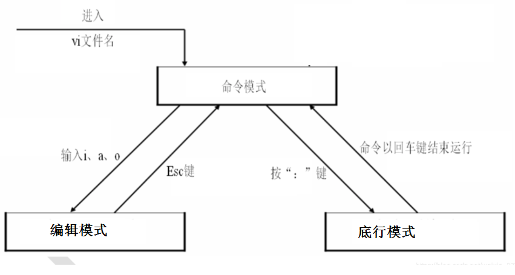
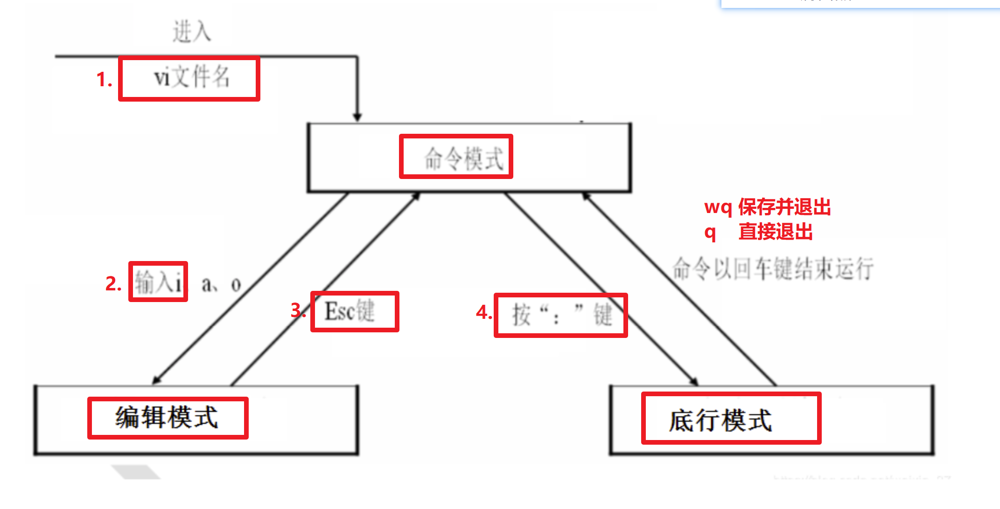
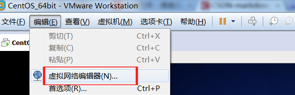
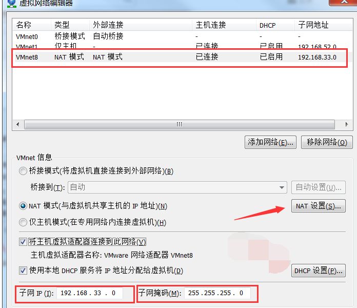
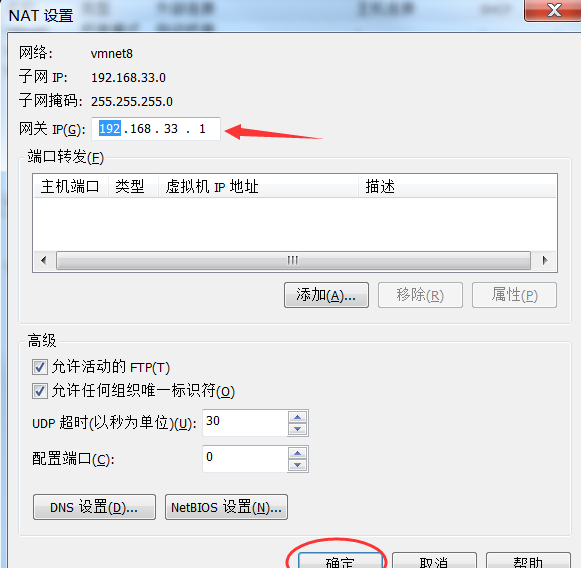
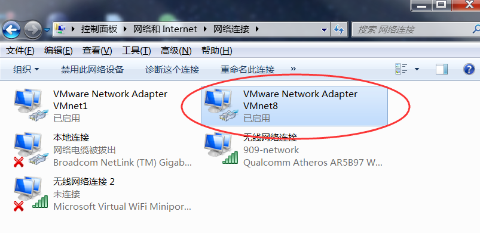
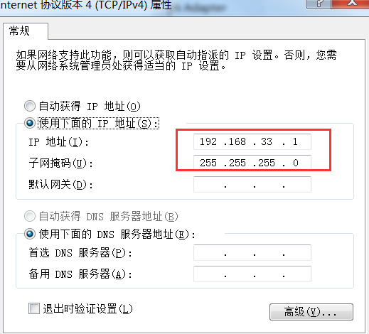
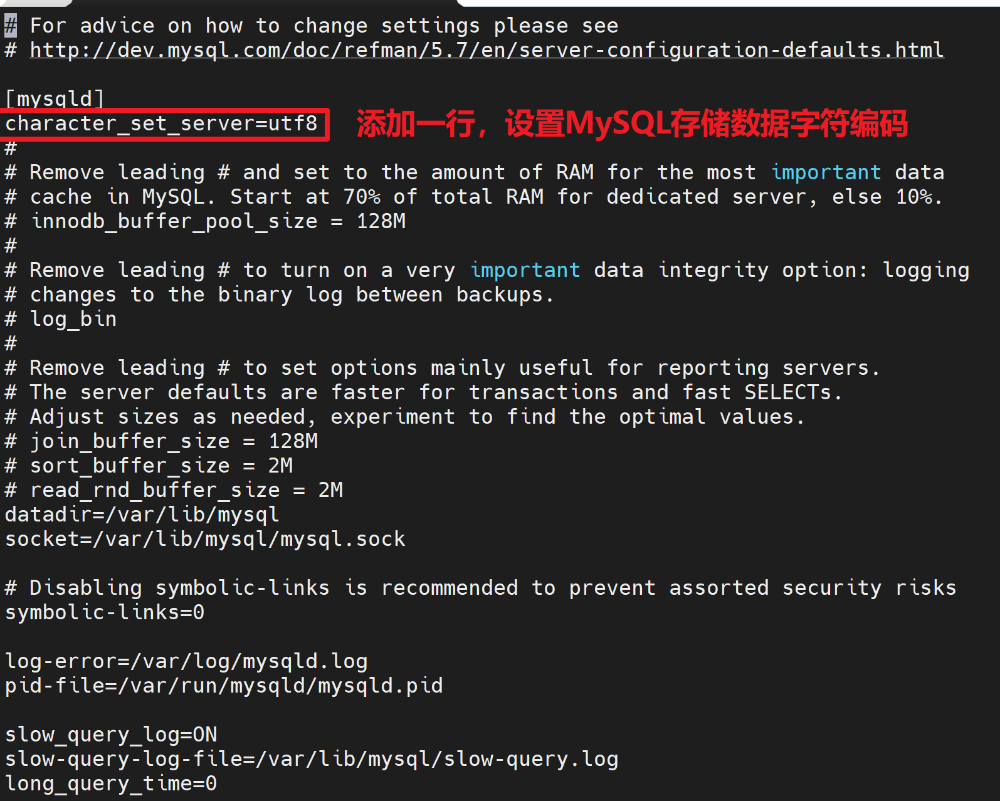

# day36-Linux

# 学习目标

- [ ] 能够独立搭建Linux环境
- [ ] 能够使用Linux进行目录操作的命令
- [ ] 能够使用Linux进行文件操作的命令
- [ ] 能够使用Linux进行目录文件压缩和解压的命令
- [ ] 能够使用Linux进行目录文件权限的命令
- [ ] 能够使用其它常用的Linux命令
- [ ] 掌握Linux网络进行管理和防火墙设置
- [ ] 能够安装JDK
- [ ] 能够安装Tomcat
- [ ] 能够安装MySql


# 第一章-Linux概述

## 知识点-Linux概述

### 1.目标

​		我们一般在window系统下开发,  开发完成后部署到Linux系统下. 我们先来了解下什么是Linux

### 2.路径

1. Linux介绍
2. 为什么要学习Linux
3. Linux的历史

### 3.讲解

#### 3.1.Linux简介

​	是基于Unix的**开源免费**，多用户，多任务的操作系统， 

​	由于Linux系统的**稳定性和安全性**几乎成为程序代码运行的最佳系统环境。

#### 3.2为什么要学习Linux

对于windows操作系统而言，大家应该不陌生，这里我列举一些windows的不足：

1. 个人用户正版windows需要收费 
2. 系统长时间运行后，不稳定，变慢，容易死机    
3. 且windows经常招到病毒攻击等 

相反，上述windows的不足，恰好是另一款操作系统Linux的优势所在，这里我也列举一些Linux的优点：

1. 个人用户正版Linux不需要收费

2. 系统长时间运行后，还是比较稳定，比较快，不容易死机

3. 且Linux不常招到病毒攻击等

   

  ​	做为一个后端JavaEE程序员，通常在windows/MAC中开发完程序后，得部署到一个相对比较安全，稳定的服务器中运行，这台服务器上安装的不是windows操作系统，而是Linux操作系统。


#### 3.3.Linux的历史              

​		Linux最初是由芬兰赫尔辛基大学学生Linus Torvalds由于自己不满意教学中使用的MINIX操作系统， 所以在1990年底由于个人爱好设计出了LINUX系统核心。后来发布于芬兰最大的ftp服务器上，用户可以免费下载，所以它的周边的程序越来越多，Linux本身也逐渐发展壮大起来，之后Linux在不到三年的时间里成为了一个功能完善，稳定可靠的操作系统.   Git版本控制工具 


### 4.小结

1. Linux:  操作系统

2. 为什么要学习Linux?

   开源免费，**稳定安全**，适合用于做项目发布的服务器操作系统


## 知识点-Linux的版本

### 1.目标

​	知道内核版本和发行版本区别, 以及常见的发行版本

### 2.路径

1. Linux的版本
2. Linux的主流发行版本

### 3.讲解

#### 3.1Linux的版本

Linux的版本分为两种：内核版本和发行版本；

+ 内核版本是指在Linus领导下的内核小组开发维护的系统内核的版本号 ； 
+ 发行版本是一些组织和公司根据自己发行版的不同而自定的 	

#### 3.2Linux常见发行版本


### 4.小结

1. 版本

   + 内核版本：核心
   + 发行版本：核心+外衣

2. 我们学习的版本

   ​	发行版本CentoOS6.5


# 第二章-Linux的安装

## 实操-Linux的安装

### 1.目标

- [ ] 能够独立搭建Linux环境

### 2.路径

1. 虚拟机的安装  
2. CentOS的安装
3. Linux的目录结构

### 3.讲解 

#### 3.1虚拟机的安装

​	虚拟机：虚拟一台电脑.  独立的  ，共用物理主机的硬件。

​	虚拟机软件:

​		 VmWare:收费的.

​		 VirtualBox:免费的. Oracle的产品 . 

​	参考《01.VMware使用》

#### 3.2 CentOS的安装

​	参考《02.Linux(CentOS)安装.pdf》

#### 3.3.Linux的目录结构


​	Linux不像windows那样有盘符的概念，它的最高目录为根目录（用**==/==**表示）

​	/:系统根目录  

​		bin目录：存放可执行文件

​		root目录：超级管理员所在的目录，用~表示    

​		home目录：普通用户所在的目录

​		**etc:配置文件所在目录**

​		**usr:存放共享文件的  (安装的软件基本都是在usr目录)**

### 4.小结

1. 安装时候注意事项

   + 内存    4G(512M)  8G(1,2G)  16G(1,2,4,8G) 
   + 不要忘记选择镜像,选择64位(**如果无法安装，开启intel虚拟技术 --> 电脑重启进入Bios开启**)
   + 需要配置自动连接

    

   ```
   //1.启动网卡eth0	 ifconfig eth0 up
   //2.重新获取ip		 dhclient
   //3.获取ip地址		 ifconfig
   -------------------------------------------
   //后期使用命令配置网络自动连接 进入配置文件修改配置
   //1.进入配置文件目录	cd /etc/sysconfig/network-scripts/
   //2.编辑配置文件		 vi ifcfg-eth0 将“ONBOOT=no” 选项改成“ONBOOT=yes”
   ```

   

2. 目录结构
   + /    系统根目录
     + root  超级管理员所在目录
     + home 普通用户所在目录
     + etc  配置文件目录
     + usr  文件共享目录(一般在这里装软件)

## 实操-Linux客户端工具CRT

### 1.目标

- [ ] 能够安装CRT 

### 2.路径

1. 客户端工具CRT介绍
2. CRT 安装
3. CRT 的使用

### 3.讲解

#### 3.1CRT介绍

​	SecureCRT是一款支持SSH（SSH1和SSH2）协议的终端仿真软件，常被用来运行于Windows下远程登录UNIX或Linux服务器 。

#### 3.2.CRT 安装

​	参考《03.CRT连接linux.pdf》

#### 3.3.CRT 的使用

​	参考《03.CRT连接linux.pdf》

### 4.小结

1. 使用CRT软件连接的时候, 需要输入的是:

    主机名是**服务器(虚拟机)的ip地址**, 不是localhost.

   CentOS的默认端口号是**22**


# 第三章- Linux的常用命令【重点】

## 知识点-目录操作命令【重点】

### 1.目标

- [ ] 掌握目录操作相关的命令

### 2.路径

1. cd目录
2. ls命令
3. mkdir命令
4. pwd命令

### 3.讲解

#### 3.1切换目录命令

​	cd app	切换到app目录

​	cd ..         切换到上一层目录

​	cd /          切换到系统根目录

​	cd ~         切换到用户主目录

​	cd -           切换到上一次操作的目录

#### 3.2 列出文件列表

​	ls(list)是一个非常有用的命令，用来显示当前目录下的内容。配合参数的使用，能以不同的方式显示目录内容。

+ 格式

  ```
  ls[参数] [路径或文件名]
  ```

  ls		展示当前目录下资源（不包含隐藏的文件）

  **ls -a** 	显示所有文件或目录（包含隐藏的文件）, 文件带点的是隐藏文件

  ls -l  	展示文件的详细信息,  **简写成 ll**  (1TB=1024G 1G=1024MB  1MB = 1024KB  1KB = 1024Byte)

  **ll -h**		友好显示文件大小

  ls -al	展示所有文件的详细信息（包含隐藏的文件）


#### 3.3.创建目录和移除目录

##### 3.3.1mkdir  

用来创建子目录.  

+ 格式:  mkdir 目录名;   在当前目录下创建目录

```
mkdir app 在当前目录下创建app目录
```

+ 格式:  mkdir -p  目录名/子目录;  级联创建目录

```
mkdir –p app3/test  级联创建app3以及test目录
```

##### 3.3.2rmdir【了解】

用来删除“空”的子目录

+ 格式:  rmdir 目录名;

```
rmdir app   删除app目录
```

#### 3.4显示当前目录的绝对路径 

+ 格式: pwd

### 4.小结

1. cd 切换目录

   ```shell
   cd app 	#切换到当前目录下的app目录
   cd ..	#返回上一级目录
   cd /   	#切换到系统根目录
   cd ~	#切换到当前用户主目录
   cd -	#回到上一次操作目录
   ```

2. ls 查看目录下的文件

   ```shell
   ls		#查看当前目录下的内容(不显示隐藏内容)
   ls -a	#查看当目录下所有内容(包含隐藏内容 隐藏内容前会有点)
   ll		#以列表的方式查看当前目录下内容的详细信息
   ll -h	#以友好的方式查看内容，会显示文件大小
   ```

3. mkdir 创建目录

   ```shell
   mkdir app			#在当前文件夹下创建目录
   mkdir -p app2/test	#级联创建目录
   ```

4. pwd

   ```shell
   pwd			#查看当前所在目录的绝对路径
   ```

   

## 知识点-文件操作命令【重点】

### 1.目标

- [ ] 掌握文件操作相关的命令

### 2.路径

1. cat			/		tac
2. more     /        less
4. tail       /          header

### 3.讲解

#### 3.1cat

用于显示文件的内容

+  格式：cat[参数]<文件名>

```
cat yum.conf    查看yum.conf 的内容	
```

#### 3.2more

**分页查看**,   按空格键显示下一个画面(下一页)。回车显示下一行内容。按 q 键退出查看。(Ctrl+C退出查看)

+ 格式: more 文件名

```
more services 
```

#### 3.3less

用法和more类似，不同的是less可以通过方向键上下来控制。 

+  格式: less文件名

```
less services
```

#### 3.4tail

tail命令是在实际使用过程中使用非常多的一个命令，它的功能是：用于显示文件后几行的内容。动态监控文件内容变化

+ 格式: tail -n 文件名:查看文件的末尾几行

```
tail -10 /etc/passwd
```

+ 格式: tail -f 文件名:滚动的查看文件. 

```
tail -f catalina.log
```

+ ctrl+c 结束查看

### 4.小结

```shell
#文件查看
cat a.txt 		# 查看文件全部内容(顺序查看)
tac a.txt		# 查看文件全部内容(倒序查看)
more a.txt		# 分页查看 enter键向下一行 空格键向下一页  q键退出查看
less a.txt		# 方向键向上查看  方向键向下查看  		 q键退出查看
tail -n a.txt	# 查看最后几行 n表示行数
tail -f a.txt	# 动态监控a.txt内容变化 ctrl+c终止

#实际开发使用：cat、more、tail  查看文件内容
```


## 知识点-文件目录通用操作命令

### 1.目标

- [ ] 掌握文件目录通用操作命令

### 2.路径

2. mv
3. cp
4. rm

### 3.讲解

#### 3.0touch 创建文件

+ touch 文件名; 创建文件

#### 3.1mv 移动文件       mv  源文件|目录  目标目录

- mv 文件 目录:移动到指定目录
- mv 文件 目录/文件名:移动到指定目录且重命名
- mv 目录 指定的目录:移动一个目录到指定的目录下
- mv 文件名 新文件名:重命名

#### 3.2cp 拷贝文件        

- cp 文件 目录:把一个文件复制到某目录下
- cp 文件 目录/文件名:复制且重命名
- cp 文件 新文件名 :当前目录下复制一个
- cp ==-r== 目录 新目录:递归复制目录(复制非空目录)


#### 3.3rm删除文件     

+ rm  文件;	 询问删除文件

```
rm a.txt  删除a.txt文件
```

+ rm -f 文件;不询问，直接删除

```
rm -f a.txt  不询问，直接删除a.txt 
```

+ rm -r 目录; 删除目录(递归删除)

```
rm -r a; 递归删除a目录
```

+ rm -rf 目录; 不询问递归删除（慎用)  

```
rm -rf  a  不询问递归删除  
rm -rf *   删除当前目录下所有文件
rm -rf /*  自杀	*********(不要用)    
```

### 4.小结

1. 创建文件

```
touch 文件名;
```

2. 移动mv  剪切

```shell
mv a.txt app		# mv 文件 目录;           把文件移动到目录
mv a.txt app/b.txt	# mv 文件 目录/文件名;     把文件移动到目录,重新命名
mv app app2 		# mv 目录 目录;           移动目录
mv a.txt aa.txt		# mv 文件 新的文件;        重新命名
```

3. 拷贝cp

```shell
cp a.txt app2		# cp 文件 目录;           把文件拷贝到目录
cp a.txt app2/b.txt	# cp 文件 目录/文件名;     把文件拷贝到目录,重新命名
cp -r app app2		# cp -r 目录 目录;        拷贝目录
cp a.txt aa.txt 	# cp 文件 新的文件;        拷贝 重新命名
```

4. 删除rm

```shell
rm -rf app	# rm -rf 文件/目录 
```


## 知识点-文件编辑命令【重点】

### 1.目标

- [ ]  掌握文件编辑命令

### 2.路径

1. vi编辑器介绍
2. vi编辑器三种模式和常用命令
3. vi编辑器使用
4. vim编辑器

### 3.讲解    

#### 3.1vi编辑器介绍

​	vi编辑器是所有Unix及Linux系统下标准的编辑器，对Unix及Linux系统的任何版本，vi编辑器是完全相同的

#### 3.2三种模式和常用命令



+ 命令模式:对行进行操作 移动光标.  常用的命令: 

  ​	yy:复制当前行

  ​	p:粘贴

  ​	dd:删除当前行		

  ​    **/   :搜索**		eg：/port 回车  在文档中搜索port关键字

+ 编辑模式:对具体的字符进行操作. 切换到插入模式：按 i键

+ 底行模式:退出esc. 先进入命令模式，按：，切换到底行模式   常用的命令:    

  ​	:wq!  保存并退出

  ​	:q	 退出(不保存)

  ​	:q!  强制退出(不保存)

#### 3.3vi编辑器使用

##### 3.3.1基本使用

+ 编辑a.txt, 编译的内容是: hello world... 

```
vi a.txt	进入命令模式
按住i		   切换到了编辑模式,输入hello world... 
按住Esc	   切换到命令模式
按住:wq	   切换到底行模式 保存并且退出
```

+ 复制2行hello world..

```
vi a.txt	进入命令模式
yy          复制
p           粘贴
按住:wq	   切换到底行模式 保存并且退出
```

+ 删除最后一行hello world

```
vi a.txt	进入命令模式
dd		    删除当前行
按住:wq	  切换到底行模式 保存并且退出  	
```

##### 3.3.2练习

```
在root目录下创建a.txt
	cd ~		切换到root目录
	touch a.txt 创建a.txt

编辑a.txt hello...
	vi a.txt	进入命令模式
	按住i		   切换到编辑模式 
	输入hello
	Esc			切换到命令模式
	:wq			保存并且退出 

复制两行hello...
	vi a.txt	进入命令模式
    yy			复制
    p			粘贴
 	:wq			保存并且退出   

删除最后一行hello...
	vi a.txt	进入命令模式
    dd			删除行
 	:wq			保存并且退出       

删除a.txt
	rm -rf a.txt 

```


#### 3.4vim编译器

​	vim是vi的升级版，增加了一些功能，对vi命令是完全兼容的。在一些基本命令上两者都是一样的

### 4.小结

1. 模式

 

2. 命令模式下的常用命令
   1. yy：复制当前行
   2. p：粘贴
   3. dd：删除当前行
   4. /：搜索

## 知识点-压缩解压【重点】

### 1.目标

- [ ] 掌握解压和压缩

### 2.路径

1. 打包压缩
2. 解压

### 3.讲解

打包: 将多个文件打包成一个特定文件, 文件扩展名一般是.tar

压缩: 将多个文件打包成一个特定文件并且做压缩处理(gzip), 文件扩展名一般是.gz    

#### 3.1打包压缩【tar -zcvf】

+ 语法：tar  -zcvf   打包并压缩后的文件名   要打包压缩的文件/目录

  + -z调用压缩命令进行压缩, 没有加上-z就是打包（可选项）

  + -c 创建新的文件（必选项）
  + -v 输出文件清单（可选项）
  + -f 文件名由命令行设置（必选项)

+ 练习: 把app文件夹进行压缩

```shell
# 打包
tar -vcf app.tar app
# 打包并压缩
tar -zcvf app.tar.gz app
```

#### 3.2解压【tar -xvf】 【重点】

+ 语法
  + tar -xvf 压缩文件;          									      解压到当前目录
  + tar -xvf 压缩文件 -C /usr/local                         解压到/usr/local目录
  + 参数含义
    + -x  取出文件中内容
    + -v  输入文件清单
    + -f  文件名由命令台设置

+ 练习

  + 解压打包文件app.tar

  ```
  tar -xvf app.tar
  ```

  + **解压app.gz 到 /usr/home目录**

  ```shell
  tar -xvf app.tar -C /usr/home
  ```
  
  - 解压tar.gz的文件 也就是解压使用gzip压缩的包
  
  ```shell
  tar -zxvf app.tar.gz [-C /usr/home]
  ```
  
  

### 4.小结

1. 扩展名
   + .tar   包
   + .gz  压缩包（采用gzip压缩后包）
2. 压缩

```shell
tar -cvf  打包名字   要打包的文件/目录	#只是单纯对文件/目录打包
tar -zcvf 压缩包名字  要压缩的文件/目录	#采用gzip压缩打包
```

3. 解压

```shell
tar -xvf 压缩包名字  		解压到当前目录
tar -xvf 压缩包名字 -C 目录   解压到指定目录
```


## 知识点-其它常用的命令

### 1.目标

- [ ] 掌握其它常用命令

### 2.路径

1. halt
2. reboot
3. ifconfig
4. ps                                                       【重点】
5. kill                                                      【重点】
6. 管道 |
7. top 动态查看系统资源使用情况     【重点】
8. free 查看内存使用情况

### 3.讲解

#### 3.1关机

```
halt   
```

#### 3.2重启

```
reboot
```

#### 3.3  查看网卡信息

```
ifconfig
```

#### 3.4查看进程

```
ps -ef    查看所有进程
```

#### 3.5 管道

```
命令1  | 命令2  解释：一个命令的输出，可以作为另一个命令的输入，至少有二个命令参与执行。 常用的需要使用管道命令有					  more，grep。	

eg: ps -ef | grep vi  #在所有的进程里面筛选出和vi相关的进程
```

注: grep 筛选指定的内容,grep -i:忽略大小写

​		ps -ef  | grep vi:  查看所有vi的进程


#### 3.6杀死进程

```
kill 进程号(pid)     杀死指定的进程	
kill -9 进程号(pid)  杀死指定的进程	立即终止
```

#### 3.7top 动态查看系统资源使用情况

```
top
-- 面试题：线上项目发布 CPU使用率排查    https://www.cnblogs.com/heyanan/p/9261695.html
1.top  找出是哪个进程占用了cpu比较多
2.top -Hp PID  找到具体是这个进程下的哪个线程使用CPU比较高
3.jstack PID：分析是具体该线程下的那句java代码导致CPU占用高
```

#### 3.8free 查看内存使用情况

```
free  -m
```


### 4.小结

1. halt  关机

2. reboot 重启

3. ps -ef 查看所有的进程

4. kill -9 pid  杀死进程

5. |  管道

6. grep xx  筛选

   ```
   eg: ps -ef | grep vi  筛选出vi的进程
   ```

7. top 动态监控系统资源变化

8. free 查看内存使用情况

## 知识点-Linux文件权限【了解】 

### 1.目标

- [ ] 万物皆文件  
- [ ] 了解权限命令

### 2.路径

1. 权限简介
2. 权限参数和数字说明
3. 权限命令操作

### 3.讲解      

#### 3.1权限介绍

​	Linux中对每个目录和文件都做了规定，只能由满足条件的用户才能操作，这个规定叫权限

#### 3.2权限参数和数字说明


​	

r  可读

w  可写

x  可操作


root当做校长, 文件当做我们班,   

第1位:文件类型   - 文件, d是目录,l:快捷方式

​	2,3,4:当前用户操作权限    					我们班的班主任的权限     									  卢老师				

​	5,6,7:当前组中其他用户的操作权限      和我们班班主任在同一组里面的其它班主任权限  李老师		    

​	8,9,10:其他用户的操作权限  		         网络管理员权限

#### 3.3权限命令操作         

##### 3.3.1语法一     

+ 语法：chmod   [参数]   目录/文件
+ 参数说明:
  - u  作者
  - g  组员
  - o  它人
  - -r  只读
  - -w 只写
  - -x  只执行
+ 权限操作

```shell
#修改a.java文件的权限：作者具有rwx权限，组员具有rx权限， 其它人具有x权限
chmod  u=rwx , g=rx , o=x  a.java        
#或者
chmod  751 a.java         
```

##### 3.3.2语法二

chmod xxx  文件/目录

```
 r 可读   4
 w 可写   2
 x 可操作  1
 --可读可写：6  只读：4  只读和执行：5
 
 1   可操作
 2   可写
 3   可写+可操作
 4   可读
 5   可操作+可读  
 6   可读+可写
 7   都可以
```

### 4.小结

​	文件权限了解即可

​		文件有三组权限，分别是作者、同组用户、其他用户，都一组角色都对应着读、写、执行三种权限。

```shell
chmod 参数 文件/目录
r：可读  4
w：可写  2
x：可执行 1
eg：chmod 777 app  表示当前文件作者，同组用户，其他人都对app这个文件具有读写执行的权限。
```


# 第四种-Linux网络管理和防火墙设置

## 知识点-Linux网络管理

### 1.目标

- [ ] 掌握Linux网络管理

### 2.路径

1. ifconfig命令
2. 启动和停止
3. 网络模型
4. 配置NAT网络模型

### 3.讲解

#### 3.1ifconfig命令

```
ifconfig   #查看网卡信息 以及ip地址
```

#### 3.2网络服务启动和停止

+ 启动 

```
service network start
```

+ 停止

```
 service network stop
```

+ 重启

```
 service network restart
```

### 3.2网卡启动和停止

+ 启用网卡

```
ifconfig 网卡名称[eg:eth0] up
```

+ 禁用网卡

```
 ifconfig 网卡名称[eg:eth0] down
```

#### 3.3网络模型

+ 桥接模式：虚拟机和物理机处于同一个局域网，容易导致ip冲突，优点是和物理机同处一个局域网中，方便通信。

  ​	物理主机就好像一个交换机，将物理主机和虚拟机连接在一个局域网内。和主机的关系就像局域网中一台独立的主机，和主机同等地位。获取外网ip进行上网。物理机上有一个自身的网卡，虚拟机虚拟一个虚拟网卡，两者可以连接到外网。

  ​	桥接模式下虚拟机和主机不仅应该处于同一网段，而且相关DNS和网关都应该相同。 

+ NAT ：虚拟机和物理机共享一个外部ip地址。

  ​	俗称网络地址转换，是将内部私有网络地址翻译成合法网络地址。物理机上有一个自身的网卡，和虚拟NAT设备直连，还有一个虚拟网卡直接连在虚拟交换机上。虚拟NAT设备与虚拟DHCP服务器直接连在虚拟交换机上，虚拟机通过虚拟交换机和NAT设备实现联网，但是和本机的连接是通过物理主机的虚拟网卡vm adapter8来实现的。虚拟机向外部网络发送的请求数据"包裹"，都会交由NAT网络适配器加上"特殊标记"并以主机的名义转发出去，外部网络返回的响应数据"包裹"，也是先由主机接收，然后交由NAT网络适配器根据"特殊标记"进行识别并转发给对应的虚拟机，因此，虚拟机在外部网络中不必具有自己的IP地址。

  ​	从外部网络来看，虚拟机和主机在共享一个IP地址。

+ 仅主机

  ​	仅主机模式即是nat模式去除 了nat设备，虚拟机是一个独立的系统，只能实现虚拟机和主机间的通信，如果虚拟机需要联网的话，还需要主机共享网卡,所以一般情况下虚拟机不能联网。

#### 3.4配置NAT网络模型

+ 选择编辑>虚拟网络编辑器

 

+ 选择NAT 模式的VMnet8

  

+ 将其中的“网关IP”设置为“192.168.33.1”

  

+ 然后在本机的“网络连接”中对VMnet8进行设置

 


 

### 4.小结

1. 查看网络命令

```shell
ifconfig
```

2. 关闭/启动/重新启动网络服务

```
service network start  启动
service network stop   关闭
service network restart 重启
```

3. 启用禁用网卡

```
ifconfig 网卡名称 up
ifconfig 网卡名称 down
```

​	4. 网络故障排查

```
客户端无法正常连接虚拟机？
//1.查看虚拟机ip地址
//2.重启网络服务  	service network restart
//3.重启网卡	  	  ifconfig eth0 up
//4.重新分配ip地址     dhclient
//5.ip正常了，仍然不能连接
//6.看物理机虚拟网卡vmnet8是否启用
//7.仍然不能连接,看看防火墙
```


## 知识点-Linux防火墙设置【重点】

### 1.目标

- [ ] 掌握防火墙设置

### 2.路径

1. 什么是防火墙
2. 查看防火墙状态
3. 关闭防火墙
4. 禁用防火墙
5. 设置端口防火墙放行

### 3.讲解

#### 3.1什么是防火墙

​	防火墙技术是通过有机结合各类用于安全管理与筛选的软件和硬件设备，帮助计算机网络于其内、外网之间构建一道相对隔绝的**保护屏障**，以**保护用户资料与信息安全性的一种技术**。

​	在默认情况下，Linux系统的防火墙状态是打开的，已经启动。

#### 3.2查看防火墙状态

+ 语法：

```
service  服务     status
```

+ 命令：

```
service  iptables   status
```

#### 3.3临时开启/关闭防火墙  

+ 语法：

```
service  服务    start/stop/restart
```

+  命令:

```
开启：service iptables start
关闭：service iptables stop
重启：service iptables restart
```

#### 3.4设置开机开启/关闭防火墙

+ 语法

```
chkconfig    服务    on/off
```

+ 命令

```
开机开启：chkconfig iptables on
开机关闭：chkconfig iptables off
```

#### 3.5设置端口防火墙放行【重点】

==修改配置文件开放端口号【方式一】==

+ 修改配置文件

```
vi /etc/sysconfig/iptables
```

+ 添加放行的端口(vi   复制yy 粘贴p)

```
-A INPUT -m state --state NEW -m tcp -p tcp --dport 端口号 -j ACCEPT
```

- 重启防火墙

```shell
service iptables restart
```

> 备注: 默认情况下22端口号是放行的

==使用命令开放指定端口号【方式二】==

```shell
# 指定要开放的端口号
iptables -I INPUT -p tcp --dport 8080 -j ACCEPT
# 2：保存设置
service iptables save
# 3：重启防火墙
service iptables restart
```

### 4.小结

1. Linux的防火墙默认是开启的. 工作里面的服务器几乎没有关闭防火墙的, 用到哪个端口,就放行哪一个
2. 临时开启和关闭

```
service iptables start    开启
service iptables stop     关闭
service iptables restart  重启
service iptables status   查看防火墙状态
```

3. 设置开机开启/关闭防火墙

```
开启：chkconfig iptables on
关闭：chkconfig iptables off
```

​	4. 开放指定端口号

```shell
# 1.打开防火墙配置文件
vi /etc/sysconfig/iptables
# 2.添加要放行的端口号(复制 yy  粘贴p 修改端口号)  保存退出
# 3.重启防火墙
service iptables restart
```

​	

# 第五章-软件安装

## 知识点-rpm软件包管理器  

### 1.目标

- [ ] 掌握rpm常见的命令

### 2.路径

1. rpm介绍
2. rpm常见的命令

### 3.讲解

#### 3.1rpm介绍

​	一种用于互联网下载包的**打包及安装工具**，它包含在某些Linux(CentOs)分发版中。

#### 3.2rpm常见的命令

​	rpm -qa : 查询所有安装过的软件包

​	rpm -e --nodeps  删除的软件包名: 删除指定的安装包 

​	rpm -ivh  包名 :安装rpm包

### 4.小结

1. rpm : 工具, 用来打包 和安装
2. 命令
   ```shell
   # 查看所有安装过的包
   rpm -qa  
   # 查看某个软件是否安装过
   rpm -qa | grep java
   # 根据包名卸载  -e：卸载  --nodeps：删除相关的内容
   rpm -e --nodeps java-1.7.0-openjdk-1.7.0.45-2.4.3.3.el6.x86_64
   # rpm 安装
   rpm -ivh 包名
   ```

## 实操-安装JDK

### 1.目标

- [ ] 掌握jdk的安装

### 2.讲解   

1. 下载jdk 

   http://www.oracle.com/technetwork/java/javase/downloads/jdk8-downloads-2133151.html

2. 从windows上传到linux

   ```
   在CRT下,Alt+P
   ```

3. 检查系统上是否安装了jdk(若安装了就需要先卸载再使用我们自己的)

   ```
   java -version 
   ```

4. 查看出安装的java的软件包

   ```
   rpm -qa | grep java
   ```

5. 卸载linux自带的jdk

   ```
   rpm -e --nodeps java-1.6.0-openjdk-1.6.0.0-1.66.1.13.0.el6.i686
   rpm -e --nodeps java-1.7.0-openjdk-1.7.0.45-2.4.3.3.el6.i686 tzdata-java-2013g-1.el6.noarch
   ```

6. 在 /usr/local 新建一个文件夹 java

   ```
   mkdir /usr/local/java
   ```

7. 解压 jdk.....gz 到 /usr/local/java下

   ```shell
   tar -zxvf jdk-8u192-linux-x64.tar.gz -C /usr/local/java
   ```

9. 配置环境变量  

   ```
   vi /etc/profile
   
   #在文件的最后面添加如下代码
   export JAVA_HOME=/usr/local/java/jdk1.8.0_192
   export PATH=$JAVA_HOME/bin:$PATH  
   ```

10. 保存退出

11. 重新加载配置文件

    ```
     source /etc/profile
    ```

### 3.小结

```
//1.将jdk的压缩包上传到linux   (alt+p   直接拖)
//2.检查当前linux系统是否已安装jdk，如果已安装，先进行卸载
//3.解压jdk安装包到/usr/local/java目录下
//4.配置jdk环境变量，重新加载配置文件
```

## 实操-安装Tomcat

### 1.目标

- [ ] 掌握Tomcat的安装

### 2.讲解

1. 下载tomcat

2. 上传到linux

   ```
   在crt上 使用 alt+p 
   ```
   
3. 在 /usr/local 新建一个文件夹tomcat

   ```
   mkdir /usr/local/tomcat
   ```

4. 将上传的tomcat压缩包 解压到/usr/local/tomcat目录下

   ```shell
   [root@sz113 ~]# tar -zxvf apache-tomcat-8.5.65.tar.gz -C /usr/local/tomcat/
   ```

6. 进入 /usr/local/tomcat/apache-tomcat-8.5.32/bin

   ```
   cd /usr/local/tomcat/apache-tomcat-8.5.32/bin
   ```

7. 启动tomcat

   ```
   方式1:
   	sh startup.sh
   方式2:
   	./startup.sh
   ```

8. 修改防火墙的规则 

   ```
   方式1:service iptables stop  关闭防火墙(不建议); 用到哪一个端口号就放行哪一个(80,8080,3306...)
   
   方式2:放行8080 端口
   	修改配置文件
   		cd /etc/sysconfig
   		vi iptables
   			复制(yy , p)	
   				-A INPUT -m state --state NEW -m tcp -p tcp --dport 22 -j ACCEPT
   			改成
   				-A INPUT -m state --state NEW -m tcp -p tcp --dport 8080 -j ACCEPT
   		重启加载防火墙或者重启防火墙
   			service iptables reload  
   			或者
   			service iptables restart
   ```


### 3.小结

```
//1.将tomcat压缩包拷贝到linux主机上
//2.将tomcat压缩包解压到/usr/local/tomcat/文件夹下
//3.开放tomcat端口号8080
//4.启动tomcat 外部即可访问   
	进入到bin目录：eg：./startup.sh   或 sh startup.sh
    外部访问：eg：http:虚拟机ip地址:8080

```


## 知识点-安装MySql

### 1.目标

- [ ] 掌握MySql的安装

### 2.讲解

1. 下载mysql

2. 上传到linux  在CRT下,按Alt+P

3. 检查系统上是否安装了mysql( 若安装了就需要先卸载再安装我们自己的)

   ```
   rpm -qa |grep -i mysql                          #查看
   rpm -e --nodeps mysql-libs-5.1.71-1.el6.i686    #卸载
   ```

4. 在 /usr/local 新建一个文件夹mysql

   ```
   mkdir /usr/local/mysql
   ```

5. 把mysql压缩包解压 到/usr/local/mysql目录下

   ```shell
   [root@sz113 ~]# tar -xvf mysql-5.7.28-1.el6.x86_64.rpm-bundle.tar -C /usr/local/mysql
   ```

6. 开始安装  顺序：common-libs-client-server

   ```shell
   # 切换到 mysql rpm 安装包所在路径 cd /usr/local/mysql
   [root@localhost mysql]# rpm -ivh mysql-community-common-5.7.28-1.el6.x86_64.rpm 
   
   [root@localhost mysql]# rpm -ivh mysql-community-libs-5.7.28-1.el6.x86_64.rpm 
   
   [root@localhost mysql]# rpm -ivh mysql-community-client-5.7.28-1.el6.x86_64.rpm 
   
   [root@localhost mysql]# rpm -ivh mysql-community-server-5.7.28-1.el6.x86_64.rpm 
   ```

7. 启动Mysql

   ```shell
   service mysqld start  #启动mysql (注意:只启动一次)  
   
   
   # 启动MySQL  显示初始化失败 初始化失败的原因：一般是datadir不是空目录
   # 1.查看mysql配置文件 找到datadir路径 datadir=/var/lib/mysql
   [root@localhost mysql]#  cat /etc/my.cnf
   # 2.清空datadir目录
   [root@localhost mysql]# rm -rf /var/lib/mysql/*
   # 3.手动初始化
   [root@localhost mysql]# mysqld --initialize --user=mysql
   # 4.启动MySQL服务
   [root@localhost mysql]# service mysqld start
   ```

10. 获取MySQL安装时root账号分配的随机密码

    ```
    grep 'temporary password' /var/log/mysqld.log
    ```
    
9. 登录，修改密码   

   ```shell
   # 2021-01-11T16:41:17.944107Z 1 [Note] A temporary password is generated for root@localhost: zUswE;5:eGlf
   [root@localhost mysql]# mysql -uroot -p
   Enter password: 输入随机密码
   # 修改root账户密码
   mysql> set password=password("root");
   ```

10. 登录mysql

```
mysql -uroot -proot
```

11. 设置数据库字符编码集及端口号

    ```shell
    # 进入MySQL查看字符编码设置： 
    mysql> show variables like 'char%';
    # 退出MySQL，编辑MySQL配置文件  将拉丁文的设置改为 utf8
    mysql> quit
    [root@localhost bin]# vi /etc/my.cnf
    
    character_set_server=utf8
    
    # 添加完成之后文件保存退出，重启mysql
    [root@localhost bin]# service mysqld restart
    ```
    
    
    
12. 放行3306端口号

    ```shell
    # 1.使用命令开放指定端口
    [root@localhost mysql]# iptables -I INPUT -p tcp --dport 3306 -j ACCEPT
    # 2.保存配置
    [root@localhost mysql]# service iptables save
    # 3.重启防火墙
    [root@localhost mysql]# service iptables restart
    ```


```
修改配置文件
   	cd /etc/sysconfig
   	vi iptables
   复制(yy  p)	
   	-A INPUT -m state --state NEW -m tcp -p tcp --dport 22 -j ACCEPT
   改成
   	-A INPUT -m state --state NEW -m tcp -p tcp --dport 3306 -j ACCEPT
   重启加载防火墙或者重启防火墙
   	service iptables reload  
   	或者
   	service iptables restart
   	
```

​	13.	允许远程连接 mysql

```shell
 在linux上 先登录mysql	
   	cd /usr/local/mysql   	 #进入mysql目录
   	mysql -uroot -proot    #登录
   	
   创建远程账号
   create user 'root'@'%' identified by 'root';
   授权
   grant all on *.* to 'root'@'%' with grant option;
   刷新权限
   flush privileges;
```


### 3.小结	

```
//CentOS6.5安装MySQL5.7.28
//1.检查当前linux是否已经安装过MySQL，如果已安装，需要卸载干净
//2.注意安装顺序common-lib-client-server
//3.启动MySQL服务，如果初始化失败。。。
//4.获取root随机密码登录，修改root密码
//5.创建远程登录用户并授权
//6.开放MySQL端口号3306
```

# 本章小结

1. Linux概述

   1. linux：操作系统  特点：安全稳定，用它作为服务器的操作系统
   2. Linux版本：内核版本、发行版本(CentOS)

2. Linux安装

   1. VMWare软件安装  推荐安装VMWare16.0版本
   2. 在虚拟机软件中虚拟一台电脑 安装Linux操作系统
      1. 网络设置时 选择自动连接
      2. 操作系统类型选择时  选择Basic Server
   3. 安装CRT(Linux客户端软件)   解压即用

3. Linux命令

   1. 目录操作命令  

      1. cd：切换目录   
         - cd ..：返回上一层目录
         - cd /：切换到根目录
         - cd ~：切换到用户主目录
         - cd -：切换到上一次操作的目录
      2. ls：查看目录下内容
         - ll：以列表方式显示
         - ll -a：以列表方式显示所有的内容
      3. mkdir：创建目录
      4. pwd：查看当前所在目录

   2. 文件操作命令

      1. cat
      2. more
      3. tail

   3. 文件目录通用操作命令

      1. mv
      2. cp
      3. rm

   4. 文件编辑命令

      1. vi编辑器：命令模式、编辑模式、底行模式
      2. 命令模式(复制：yy  粘贴：p  删除：dd  搜索：/)

   5. 压缩解压

      1. 压缩：tar -zcvf 压缩包文件名  要压缩的文件或目录
      2. 解压：tar -xvf  压缩包  -C  指定目录

   6. 其他常用命令

      1. ps -ef
      2. ps -ef | grep vi
      3. kill -9 PID
      4. top
      5. free

   7. Linux文件权限

      1. chmod  777 文件|目录

   8. 网络管理

      1. 网络服务启动关闭：service network start|stop|restart
      2. 网卡的启动关闭：     ifconfig 网卡名称【eth0】 up|down
      3. 重新分配ip地址：dhclient

   9. 防火墙

      1. 

      

4. Linux下的软件安装

   


​	

