#  day37 - Linux和Nginx

# 学习目标

- [ ] 能够完成项目的部署
- [ ] 能够使用Nginx部署静态web应用
- [ ] 能够使用Nginx配置端口和域名
- [ ] 能够使用Nginx配置反向代理
- [ ] 能够使用Nginx配置负载均衡

 

# 第一章-项目部署

​	在企业中，一般都采用linux系统作为Web应用服务器，所以我们需要在linux系统搭建项目运行环境。在linux系统上搭建运行环境需要安装jdk、myql、tomcat相关软件。

## 实操-部署管理后台

### 1.目标

- [ ] 能够掌握部署管理后台

### 2.步骤

1. 服务器环境准备(安装JDK、Tomcat、MySQL)
2. 向MySQL数据库服务器添加项目数据库
3. 把项目打成war包,上传到tomcat服务器webapps目录

### 3.讲解

#### 3.1.linux系统myql导入数据库

1. 把windows的mysql数据库day27的数据库导出day27.sql文件
2. 使用sqlyog远程连接到linux的MySQL数据库
3. 重新在导入day27.sql文件，这样linux里面的mysql数据库就有了。

* 数据库中文乱码

```shell
# 进入MySQL查看字符编码设置： 
mysql> show variables like 'char%';
# 退出MySQL，编辑MySQL配置文件  将拉丁文的设置改为 utf8
mysql> quit
[root@localhost bin]# vi /etc/my.cnf

character_set_server=utf8

# 添加完成之后文件保存退出，重启mysql
[root@localhost bin]# service mysqld restart
```


#### 3.2.导出war包部署到tomcat上

1. 在linux上传要安装的Tomcat 8.5.65的压缩包， 只要解压即可。

   ```shell
   # 1.打开文件上传窗口 上传tomcat压缩包
   alt+ p 打开上传文件的窗口
   # 2.在/usr/local目录下创建tomcat目录
   mkdir /usr/local/tomcat
   # 3.解压tomcat安装包到/usr/local/tomcat目录
   tar -zxvf apache-tomcat-8.5.65.tar.gz -C /usr/local/tomcat/
   # 4.切换到tomcat解压目录bin下 启动tomcat
   cd /usr/local/tomcat/apache-tomcat-8.5.65/bin
   sh startup.sh
   # 5.开放端口号8080
   # 6.访问
   在Windows打开浏览器，输入  http://你的linux的ip地址:8080/ 
   # 7.停止tomcat 
   sh shutdown.sh 
   ```

   

2. 把javaweb项目打成war包

   ```shell
   # 1.打包之前，修改db.properties里面的数据库连接配置信息与Linux服务器安装的MySQL一致
   # 2.执行项目右侧  mvn package 命令打包
   # 3.打包完毕之后，在项目里面的target目录下存在javaweb项目的war包
   # 4.修改war包名称，war包的名字就是一会部署到tomcat了之后访问项目的名字【虚拟路径】。
   ```

   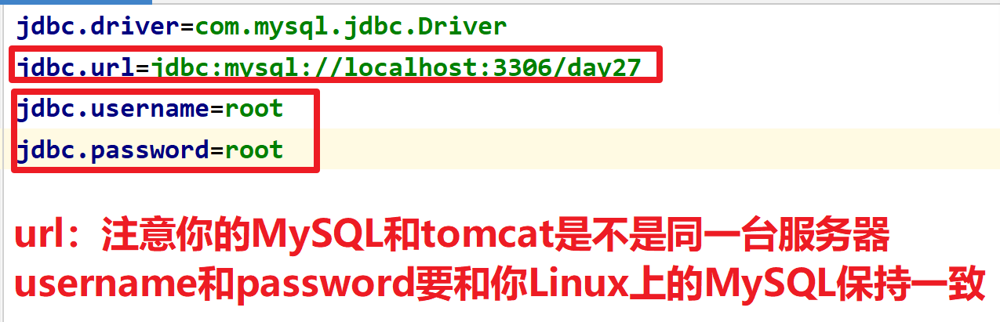

3. 上传war包 到 tomcat里面的webapps目录

   ```shell
   # 1.打开文件上传窗口 上传war包
   alt + p 
   # 2.将war包复制到tomcat里面webapps目录下
   cp day39_mm.war /usr/local/tomcat/apache-tomcat-8.5.27/webapps/
   # 3.切换到tomcat bin目录下
   cd /usr/local/tomcat/apache-tomcat-8.5.27/bin  
   # 4.重新启动tomcat
   ./startup.sh
   # 5.访问项目
   # 在Windows下打开浏览器，输入http://你linux的ip地址:8080/war包名称 
   ```

### 小结

1. 准备Linux下软件环境(JDK、tomcat、MySQL)

2. 将项目的数据库导入到Linux的MySQL数据库中

3. 将项目打war包  部署到tomcat的webapps目录下 ，重新启动tomcat

   注意：打包项目时，注意项目中数据库连接信息要和Linux下的MySQL保持一致

# 第二章-Nginx介绍和安装  

## 知识点-Nginx介绍

### 1. 目标

- [ ] 知道Nginx的作用

### 2. 路径

1. Nginx简介
2. Nginx作用

### 3. 讲解

#### 3.1 Nginx简介

​	Nginx（engine x）是一个**高性能的HTTP和反向代理web**服务器，同时也提供了IMAP/POP3/SMTP服务(这三种协议的服务都是针对邮件|邮箱)。

​	Nginx是由伊戈尔·赛索耶夫为俄罗斯访问量第二的Rambler.ru站点（俄文：Рамблер）开发的，第一个公开版本0.1.0发布于2004年10月4日。

​	因它的稳定性、丰富的功能集、示例配置文件和低系统资源的消耗而闻名，其特点是**占有内存少，并发能力强**，事实上nginx的并发能力确实在同类型的网页服务器中表现较好，中国大陆使用nginx网站用户有：百度、京东、新浪、网易、腾讯、淘宝等。

#### 3.2 Nginx作用

- Nginx是一款轻量级的web 服务器，可以处理 **静态资源**
- Nginx是反向代理服务器，实现负载均衡
- Nginx也是电子邮件（IMAP/POP3）代理服务器，能够代理收发电子邮件

#### 3.3tomcat与nginx的区别 

- 设计目的   

  ​	Tomcat是一个免费的开源的Servlet(**动态资源**)容器，实现了JAVAEE规范，遵循http协议的的服务器

  ​	Nginx是一款轻量级的电子邮件（电子邮件遵循IMAP/POP3协议）代理服务器，后来又发展成**可以部署静态应用程序和进行反向代理的服务器**

- 存放内容  

  ​	tomcat可以存放静态和动态资源

  ​	nginx可以存放静态资源

- 应用场景

  ​	tomcat用来开发和测试javaweb应用程序

  ​	nginx用来做负载均衡服务器, 发布静态网页

### 4. 小结

1. Nginx 是一款轻量级高性能的WEB服务器
2. 作用
   - 发布静态资源
   - 反向代理服务区
   - **实现负载均衡**
   - 邮箱代理服务器

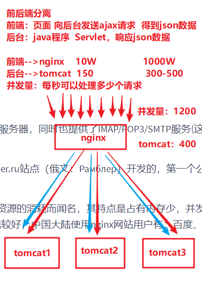


## 实操-Nginx安装和启动

### 1. 目标

- [ ] 能够安装和使用Nginx

### 2. 步骤

1. 下载Nginx
2. 安装Nginx
3. nginx常用操作命令

### 3. 实现

#### 3.1 下载

- Nginx的下载地址：http://nginx.org/en/download.html


#### 3.2 安装

##### 3.2.1window下安装Nginx

- Nginx的Windows版免安装，解压可直接使用

> 解压要放到没有中文和空格的目录下！

- 解压后目录结构如下：


```
nginx-1.16.1
	|--conf			配置文件，其中有一个nginx.conf是核心配置文件
	|--contrib		nginx提供的一些脚本工具等
	|--docs			文档说明
	|--html			nginx的默认部署的静态资源，其中有欢迎页面和错误页面
	|--logs			日志
	|--temp			临时文件夹
	|--nginx.exe	nginx程序 ★
```

##### 3.2.2Linux下安装Nginx

1. 进入http://nginx.org/网站，下载nginx-1.16.1.tar.gz文件


2. 把安装包上传到Linux

```shell
crt中 alt+p
```

3. 在 /usr/local下新建文件夹 nginx

```shell
[root@shuaige ~]# mkdir /usr/local/nginx
```

4. 将root下的nginx压缩包解压到 /usr/local/nginx目录下

```shell
[root@shuaige ~]# tar -zxvf nginx-1.16.1.tar.gz -C /usr/local/nginx/
```

5. 安装Nginx依赖环境gcc  

```shell
#由于CentOS6.X版本较旧，使用yum在线安装的软件源仓库官方已经移除，需要个人重新查找配置 这里找到阿里云提供可以使用
# 5.1：关闭fastestmirror
sed -i "s|enabled=1|enabled=0|g" /etc/yum/pluginconf.d/fastestmirror.conf
# 5.2：备份之前的repo
mv /etc/yum.repos.d/CentOS-Base.repo /etc/yum.repos.d/CentOS-Base.repo.bak
# 5.3：替换为阿里云Vault镜像(国内服务器用)
curl -o /etc/yum.repos.d/CentOS-Base.repo https://www.xmpan.com/Centos-6-Vault-Aliyun.repo
```

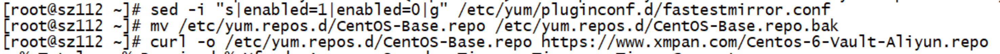

Nginx是C/C++语言开发，建议在Linux上运行，安装Nginx需要先将官网下载的源码进行编译，编译依赖gcc环境，所以需要安装gcc。一直y(同意)(需要网络), 

```shell
[root@shuaige ~]# yum -y install gcc-c++ 
```

6. 连接网络，安装Nginx依赖环境pcre/zlib/openssl.  y表示安装过程如有提示，默认选择y

```shell
[root@shuaige ~]# yum -y install pcre pcre-devel
[root@shuaige ~]# yum -y install zlib zlib-devel
[root@shuaige ~]# yum -y install openssl openssl-devel                            
```

7. 编译和安装nginx

```shell
# 进入nginx目录 切换到nginx解压目录下
[root@shuaige ~]# cd /usr/local/nginx/nginx-1.16.1/
# 配置nginx(在nginx-1.16.1目录中执行这个配置文件)
[root@shuaige nginx-1.16.1]# ./configure
# 编译nginx
[root@shuaige nginx-1.16.1]# make      
# 安装nginx
[root@shuaige nginx-1.16.1]# make install        
```

8. 进入sbin目录,启动nginx

```shell
# 进入/usr/local/nginx/sbin这个目录
[root@shuaige nginx-1.16.1]# cd /usr/local/nginx/sbin
# 启动Nginx
./nginx         			 
```

9. 开放Linux的对外访问的端口80，在默认情况下，Linux不会开放端口号80

```shell
# 1.修改防火墙配置文件
[root@shuaige sbin]# vi /etc/sysconfig/iptables
      复制(yy  p)	
      	-A INPUT -m state --state NEW -m tcp -p tcp --dport 22 -j ACCEPT
      改成
      	-A INPUT -m state --state NEW -m tcp -p tcp --dport 80 -j ACCEPT
# 2.重启加载防火墙或者重启防火墙
[root@shuaige sbin]# service iptables restart
```

10. 测试访问

> Windows浏览器的地址栏输入  linux的ip地址访问

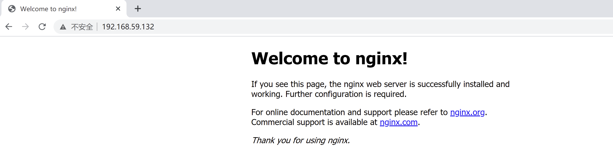

11. 停止Nginx服务器

```shell
# 进入/usr/local/nginx/sbin这个目录
[root@shuaige sbin]# cd   /usr/local/nginx/sbin            
#  停止Nginx
[root@shuaige sbin]# ./nginx -s stop                 
```


#### 3.3 常用操作命令

##### 3.3.1 操作命令

1. 打开cmd，切换到nginx的解压目录
2. 输入命令，操作nginx：
   - 启动Nginx：`start nginx.exe`
   - 重新载入配置文件：`nginx.exe -s reload`
     - 如果修改了配置文件，不需要重启，只要重新载入即可
   - 停止：`nginx.exe -s stop`

##### 3.3.2 演示效果

1. 启动nginx

   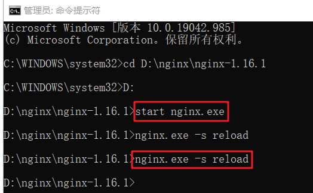

   - 启动成功后，在任务管理器中会有两个nginx的进程

   

   

2. 使用浏览器访问nginx

   - nginx的默认端口是80，所以访问地址是：`http://localhost:80`

   

3. 如果修改了配置文件，就重新载入

   

4. 停止nginx

   

### 4. 小结

1. 下载

   我们工作里面一般不会使用最新的版本的. 一般在稳定(正式)版本里面选择最新的

2. 安装

   + window: 解压即用，解压到一个没有中文和空格目录
   + Linux: 安装C++ 及其他的依赖环境,  【注意：yum配置】 

3. 常用的命令

   + window

     ```shell
      # 开启nginx   cmd进入nginx的解压目录
      start nginx.exe
      # 重新加载配置文件
      nginx.exe -s reload
      # 关闭nginx
      nginx.exe -s stop
     ```
   
   - linux
   
     ```shell
     # 启动 进入sbin目录
     ./nginx
     # 关闭 进入sbin目录
     ./nginx -s stop
     ```

4. windows查找端口使用进程并关闭

   ```cmd
   # 0.win+r 进入运行 输入cmd进入dos窗口
   # 1.查找端口占用进程
   netstat -ano|findstr "80"
   # 2.结束进程   【注意：如果权限不足，需要以管理员身份进入dos窗口结束进程】
   taskkill -PID 进程号 -F
   ```

   

# 第三章-Nginx的功能

## 实操-Nginx部署静态web应用

### 1. 目标

- 使用Nginx部署静态web应用

### 2. 步骤

1. 准备一个静态web应用
2. 修改nginx的配置文件
3. 启动nginx，使用浏览器访问

### 3. 实现

#### 3.1 准备一个静态web应用

- 有静态项目如下：（任意静态项目均可）

> 项目的目录不要有中文和空格。


#### 3.2 修改nginx的配置文件

- 打开`conf\nginx.conf`配置文件，修改`http`中`server`的内容
  - 配置文件中`#`开头的是注释


#### 3.3 启动nginx，使用浏览器访问

- 打开cmd，启动nginx：`start nginx.exe `
- 使用浏览器访问：`http://localhost:80`，或者使用ip访问：`http://192.168.1.100:80`


### 4. 小结

1. 修改nginx的配置文件

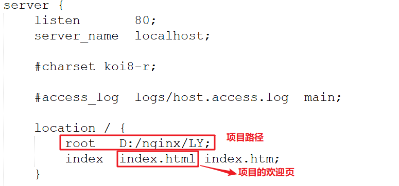 

2. 我们后面项目或者工作里面, 可以把一些访问量比较大的页面， 通过模版静态化技术, 生成静态页面, 直接部署到Nginx(商品详细页)
3. 以后基本上不怎么用jsp页面了。
   1. jsp的背后其实就是一个servlet ，每次访问都需要转化java文件，然后输出。
   2. html页面属于静态资源，不需要转化，直接可以输出。（肯定也需要填数据）
   3. 现在前后端分离已经成趋势。 
   4. 静态网页，方便搜索引擎的抓取 ，方便SEO。

## 实操-Nginx虚拟主机-配置端口

### 1. 目标

- 使用nginx部署多个web应用，通过不同端口访问不同web应用

### 2. 分析

- Nginx可以配置多个虚拟主机，每个虚拟主机里部署不同的web项目
- 我们可以
  - 方案一：给每个虚拟主机设置不同的端口，浏览器通过不同端口访问不同的web项目
  - 方案二：给每个虚拟主机设置不同的域名，浏览器通过不同域名访问不同的web项目
- 这里我们将演示方案一：虚拟主机监听端口
  - 通过`18081和18082`两个端口，分别访问两个web项目
  - 项目A
    - localhost:18081
  - 项目B
    - localhost:18082

### 3. 实现

#### 1.1 准备两个web应用

- 在E盘里准备了两个web应用（其实就是两个文件夹）
  - 第1个web应用：login
  - 第2个web应用：regist

 


#### 1.2 修改nginx配置文件

- 找到Nginx的`conf/nginx.conf`，打开并修改文件：
  - 其中每个`server`是一个虚拟主机，`server`中的`listen`是要监听的端口
  - 我们拷贝，得到两个server
    - 第1个：监听端口18081，配置login项目
    - 第2个：监听端口18082，配置regist项目

```
server {
        listen       18081;
        server_name  localhost;

        location / {
            root   D:/nginx/login;
            index  index.html index.htm;
        }

        error_page   500 502 503 504  /50x.html;
        location = /50x.html {
            root   html;
        }
    }
	
	server {
        listen       18082;
        server_name  localhost;

        location / {
            root   D:/nginx/regist;
            index  index.html index.htm;
        }

        error_page   500 502 503 504  /50x.html;
        location = /50x.html {
            root   html;
        }
    }
```

#### 1.3 重新加载nginx配置文件，使用浏览器访问

- 使用端口18081，访问travel：`http://localhost:18081/`

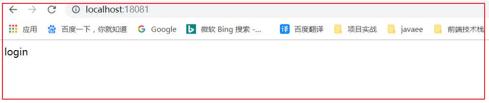 

- 使用端口18082，访问regist：`http://localhost:18082/`

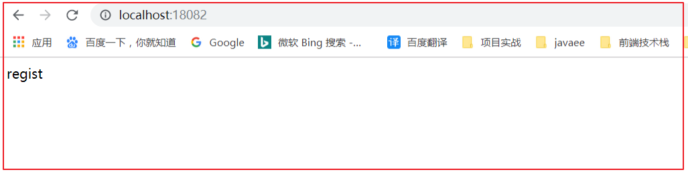 


### 4. 小结

1. 配置虚拟主机(端口)

```
	# 一个server就表示一个虚拟主机  对应一个web项目
	server {
        listen       18081;
        server_name  localhost;

        location / {
            root   D:/nginx/login;
            index  index.html index.htm;
        }

        error_page   500 502 503 504  /50x.html;
        location = /50x.html {
            root   html;
        }
    }
```


## 实操-Nginx虚拟主机-配置域名

### 1. 目标

- 配置虚拟主机，能够使用指定域名访问web应用

### 2. 分析

- Nginx可以配置多个虚拟主机，每个虚拟主机里部署不同的web项目
- 我们可以
  - 方案一：给每个虚拟主机设置不同的端口，浏览器通过不同端口访问不同的web项目
  - 方案二：给每个虚拟主机设置不同的域名，浏览器通过不同域名访问不同的web项目
- 这里我们将方案二演示：让Nginx监听域名
  - 通过`www.sz113.com`和`www.sz114.com`两个域名，分别访问两个web项目

### 3. 实现

#### 3.1 修改hosts文件，设置域名映射

- `www.sz113.com`和`www.sz114.com`两个域名是我们自定义的，如果想让浏览器通过两个域名能访问到nginx部署的web项目，必须要设置两个域名对应的ip。
- 因为实际上计算机只能识别ip地址，是不能识别域名的。当我们向一个域名发请求时，必须要把域名转换成对应的ip地址，实际是还是通过ip地址向服务器发请求。

##### 3.1.1 域名和ip映射介绍

- 当我们上网时，在浏览器里输入的地址通常是域名，例如：`http://www.jd.com`。2
- 当我们浏览器向`http://www.jd.com`域名发请求时，域名解析的流程如下：
  1. Windows会自动把本地的DNS配置，加载到本地DNS缓存中(第①步) ， 先要在自己电脑上找一找域名和ip地址的映射规则，这个规则的配置文件是： `C:\Windows\System32\drivers\etc\hosts`
     - 本地的DNS配置文件是：`C:\Windows\System32\drivers\etc\hosts`
  2. 先查找本地的DNS缓存(第②步)；如果本地缓存了域名对应的ip，则获取ip，直接向ip发请求(第④步)
  3. 如果本地没有找到，则请求到DNS服务器(第③步)，得到对应的ip，然后发ip发请求(第④步)


##### 3.1.2 修改hosts文件

- 把`www.sz113.com`和`www.sz114.com`域名，和`127.0.0.1`域名进行绑定，这样的话：

  - 浏览器上输入域名：`www.sz113.com`，实际访问的是绑定的ip`127.0.0.1`
  - 浏览器上输入域名：`www.sz114.com`，实际访问的是绑定的ip`127.0.0.1`

- 修改方式：打开`C:\Windows\System32\drivers\etc\hosts`文件，在文件最后增加：

  ```
  127.0.0.1 www.sz113.com
  127.0.0.1 www.sz114.com
  ```

#### 3.2 准备两个web应用

- 在E盘里准备了两个web应用
  - 第1个web应用：login
  - 第2个web应用：regist

#### 3.3 修改nginx配置文件 

- 找到Nginx的`conf/nginx.conf`，打开并修改文件：
  - 其中每个`server`是一个虚拟主机，`server`中的`listen`是要监听的端口
  - 我们拷贝，得到两个server
    - 第1个：监听域名`www.sz85.com`，端口使用默认的80，配置login项目
    - 第2个：监听域名`www.sz86.com`，端口使用默认的80，配置regist项目

```
server {
        listen       80;
        server_name  www.sz113.com;

        location / {
            root   D:/nginx/login;
            index  index.html index.htm;
        }

        error_page   500 502 503 504  /50x.html;
        location = /50x.html {
            root   html;
        }
    }
	
	server {
        listen       80;
        server_name  www.sz114.com;

        location / {
            root   D:/nginx/regist;
            index  index.html index.htm;
        }

        error_page   500 502 503 504  /50x.html;
        location = /50x.html {
            root   html;
        }
    }
```

#### 3.4重新加载nginx配置文件，使用浏览器访问

- 输入`http://www.sz85.com`，访问login项目

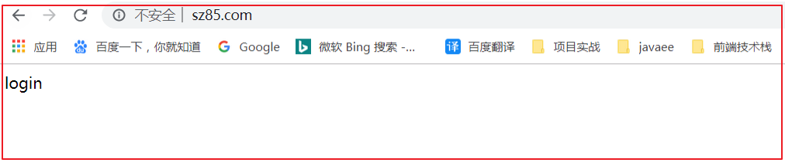 

- 输入`http://sz86.com`，访问regist项目

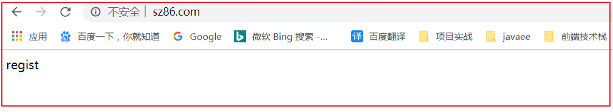 

### 4. 小结

1. 配置虚拟主机(域名)

   + 修改hosts文件  ==C:\Windows\System32\drivers\etc\hosts==

   ```
   127.0.0.1 www.sz113.com
   127.0.0.1 www.sz114.com
   ```

   + 修改nginx的配置文件

   ```
   	server {
           listen       80;
           server_name  www.sz113.com;
   
           location / {
               root   G:/login;
               index  index.html index.htm;
           }
   
         
       }	
   ```
   


## 知识点-反向代理介绍

### 1. 目标

- 了解什么是反向代理

### 2. 路径

1. 正向代理
2. 反向代理
3. 正向代理和反向代理区别

### 3. 讲解

#### 3.1 正向代理

##### 3.1.1正向代理介绍

正向代理类似一个跳板机，代理访问外部资源。


举个例子：

　　我是一个用户，我访问不了某网站，但是我能访问一个代理服务器，这个代理服务器呢,它能访问那个我不能访问的网站，于是我先连上代理服务器,告诉他我需要那个无法访问网站的内容，代理服务器去取回来,然后返回给我。从那个网站的角度来看，只在代理服务器来取内容的时候有一次记录，有时候并不知道是用户的请求，也隐藏了用户的资料，这取决于代理告不告诉网站。

**注意：客户端必须设置正向代理服务器，当然前提是要知道正向代理服务器的IP地址，还有代理程序的端口。**

本地客户端设置代理服务器操作如下：


##### 3.1.2正向代理原理 


​	总结来说：正向代理 是一个位于客户端和原始服务器(origin server)之间的服务器，为了从原始服务器取得内容，客户端向代理发送一个请求并指定目标(原始服务器)，然后代理向原始服务器转交请求并将获得的内容返回给客户端。客户端必须要进行一些特别的设置才能使用正向代理。

​	一句话：**正向代理为客户端进行代理，和客户端处于同一个局域网内，同时还可以访问外网。**

##### 3.1.3正向代理的用途

　　（1）访问原来无法访问的资源，如google

 	   （2） 可以做缓存，加速访问资源 ， 迅雷VIP ... 

　　（3）对客户端访问授权，上网进行认证

　　（4）代理可以记录用户访问记录（上网行为管理），对外隐藏用户信息

#### 3.2.反向代理

##### 3.2.1反向代理介绍

​	反向代理（Reverse Proxy）方式是指以**代理服务器来接受internet上的连接请求 ， 然后将请求转发给内部网络上的服务器，并将从服务器上得到的结果返回给internet上请求连接的客户端**，此时代理服务器对外就表现为一个服务器。

正向代理：  

​		我想买香港海港城1楼中间商铺的ipad , 但是我过不去，徐立强可以过去，我拜托它帮我去买。

​		我就是客户端， 徐立强就是代理服务器 ， 海港城1楼中间商铺 具体的服务端。

​        正向代理： 我明确知道我想要买什么地方的东西。

反向代理：

​		我想买iPad，徐立强明天去香港，我就说，明天帮我拿回来一个iPad， 徐立强同学给我带回来了ipad. 至于他从哪里拿回来的，我不知道。

​		这就是反向代理！


##### 3.2.2反向代理原理


一句话：**反向代理是为服务端进行代理，与服务端处在同一个局域网内。并且可以访问外网。**

  eg：A 想去访问 C，但是不知道C的地址  但是指定B的地址，B可以访问C，这个时候B就是C的反向代理。

  eg：A想去访问C，并且知道C的地址，但是无法访问，这个时候A知道B可以访问，就把C的地址告诉B，让B帮忙进行访问，这个时候B就是A的正向代理。

##### 3.2.3反向代理的作用

（1） 保证内网的安全，可以使用反向代理提供防火墙（WAF）功能，阻止web攻击。大型网站，通常将反向代理作为公网访问地址，Web服务器是内网。


（2）负载均衡，通过反向代理服务器来优化网站的负载。当大量客户端请求代理服务器时，反向代理可以集中分发不同用户请求给不同的web服务器进行处理请求。（本阶段不实现，负载均衡技术项目阶段讲解）


### 4. 小结

#### 4.1 反向代理与正向代理区别

正向代理中，proxy和client同属一个局域网（Local Area Network，LAN），对server透明；

反向代理中，proxy和server同属一个局域网（Local Area Network，LAN），对client透明；

​	实际上proxy在两种代理中做的事都是代为收发请求和响应，不过从结构上来看正好左右互换了下，所以把后出现的那种代理方式叫反向代理。

  ==我们使用Nginx作为反向代理服务器==


## 实操-Nginx反向代理配置

### 1. 目标

- 使用Nginx实现服务器的反向代理配置

### 2. 步骤

1. 准备一个服务器实例，这里使用Tomcat
2. 修改配置nginx，使用Nginx作为服务端的代理（反向代理服务器）
3. 启动Nginx，浏览器通过Nginx访问目标服务器

### 3. 实现

#### 3.1 准备一个服务器实例

- 把web应用`linkmanSys.war`拷贝到Tomcat的`webapps`里

- 双击Tomcat的`bin\startup.bat`，启动Tomcat
- 访问 `http://localhost:8080/linkmanSys/`

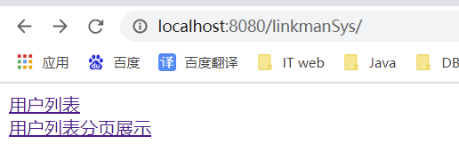 


#### 3.2 修改配置nginx，使用Nginx作为反向代理

- 打开Nginx的`conf\nginx.conf`，修改配置信息

  1. 在`http`里增加`upstream`
  2. 修改`server`的配置

  ```
      # tomcatServers 是自己命名的，可以叫其它名称
      upstream tomcatServers{ 
      	# 格式：  server 服务器的域名或ip:端口;
  		server 127.0.0.1:8080;   
      }
  
      server {
          listen       80;
          server_name  localhost;
  
          #charset koi8-r;
  
          #access_log  logs/host.access.log  main;
  
  		location / {
              #root   html;
              #index  index.html index.htm;
              # 设置反向代理
  			proxy_pass http://tomcatServers;
          }
  
          error_page   500 502 503 504  /50x.html;
          location = /50x.html {
              root   html;
          }
      }
  ```

#### 3.3 启动Nginx，浏览器通过Nginx访问目标服务器

- 浏览器输入地址：`http://localhost:80/linkmanSys`，是Nginx的访问地址
  - 请求过程：浏览器发请求到Nginx
    - Nginx把请求分发到Tomcat上，由Tomcat处理
  - 响应过程：Tomcat把响应返回给Nginx
    - Nginx把响应返回给浏览器

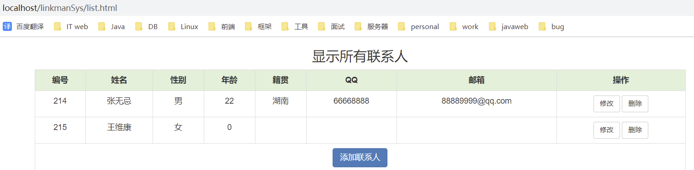 

### 4. 小结

1. 配置tomcat

```
	# nginx.conf配置http里面 server上面
	# tomcatServers 是自己命名的，可以叫其它名称
	upstream tomcatServers{ 
		# 格式：  server 服务器的域名或ip:端口;
		server 127.0.0.1:8080;   
    }
```


2. 配置反向代理

```
 # localhost:80 --> http://tomcatServers --> http://127.0.0.1:8080 
 # localhost/linkmanSys
 server {
        location / {
			proxy_pass http://tomcatServers;
        }
    }
```


## 实操-Nginx实现负载均衡

### 1. 目标

- 使用Nginx实现负载均衡

### 2. 步骤

- 了解负载均衡的概念
- 使用Nginx实现负载均衡

### 3. 实现

#### 3.1 负载均衡介绍

​	负载均衡，英文名称为Load Balance，其含义就是指将负载（工作任务）进行平衡、分摊到多个操作单元上进行运行，例如FTP服务器、Web服务器、企业核心应用服务器和其它主要任务服务器等，从而协同完成工作任务。

​	负载均衡构建在原有网络结构之上，它提供了一种透明且廉价有效的方法扩展服务器和网络设备的带宽、加强网络数据处理能力、增加吞吐量、提高网络的可用性和灵活性。


#### 3.2 Nginx实现负载均衡的步骤

- 在服务器集群环境中，要有多个服务器实例共同提供服务。这些服务器由Nginx实现负载均衡
- Nginx实现负载均衡的步骤：
  1. 准备多个服务器实例，这里使用Tomcat
     - 服务器1地址：`localhost:8081`
     - 服务器2地址：`localhost:8082`
     - 服务器3地址：`localhost:8083`
  2. 修改配置nginx，实现负载均衡
     - 主要是配置文件中`upstream`的配置
  3. 启动Nginx，浏览器通过Nginx访问目标服务器

#### 3.3 Nginx实现负载均衡

##### 3.3.1 准备多个服务器实例

- 这里我们使用Tomcat，部署启动三个服务。为了避免端口冲突，需要设置三个Tomcat使用不同的端口


​		`参考修改tomcat默认端口号.mhtml`

- 三个Tomcat都部署了`wx.war`
  - 为了能让客户端可以区分访问的是哪个服务器，我们对三个Tomcat部署的`travel`代码做了以下修改
    - 8081的首页`index.html`，`<h1>hello mm_wx_api 8081</h1>`
    - 8082的首页`index.html`，`<h1>hello mm_wx_api 8082</h1>`
    - 8083的首页`index.html`，`<h1>hello mm_wx_api 8083</h1>`
- 分别启动三个Tomcat

##### 3.3.2 修改配置nginx，实现负载均衡

- 打开Nginx的`conf\nginx.conf`，修改配置信息

  1. 在`upstream`里设置多个服务器的地址，并增加`weight`设置每个服务器被访问的权重
     - `weight`：服务器的权重，可以理解为服务器被访问到的机率
  2. 修改`server`的配置

  ```
      # 三个服务器8081:8082:8083 被访问到的机率是 10:5:2 
      upstream tomcatServers{
          server 127.0.0.1:8081 weight=10;
          server 127.0.0.1:8082 weight=5;
          server 127.0.0.1:8083 weight=2;
      }
  
      server {
          listen       80;
          server_name  localhost;
  
          #charset koi8-r;
  
          #access_log  logs/host.access.log  main;
  
    		location / {
              #root   html;
              #index  index.html index.htm;
  			proxy_pass http://tomcatServers;
          }
  
          error_page   500 502 503 504  /50x.html;
          location = /50x.html {
              root   html;
          }
      }
  ```

##### 3.3.3 启动Nginx，浏览器通过Nginx访问目标服务器

### 4. 小结

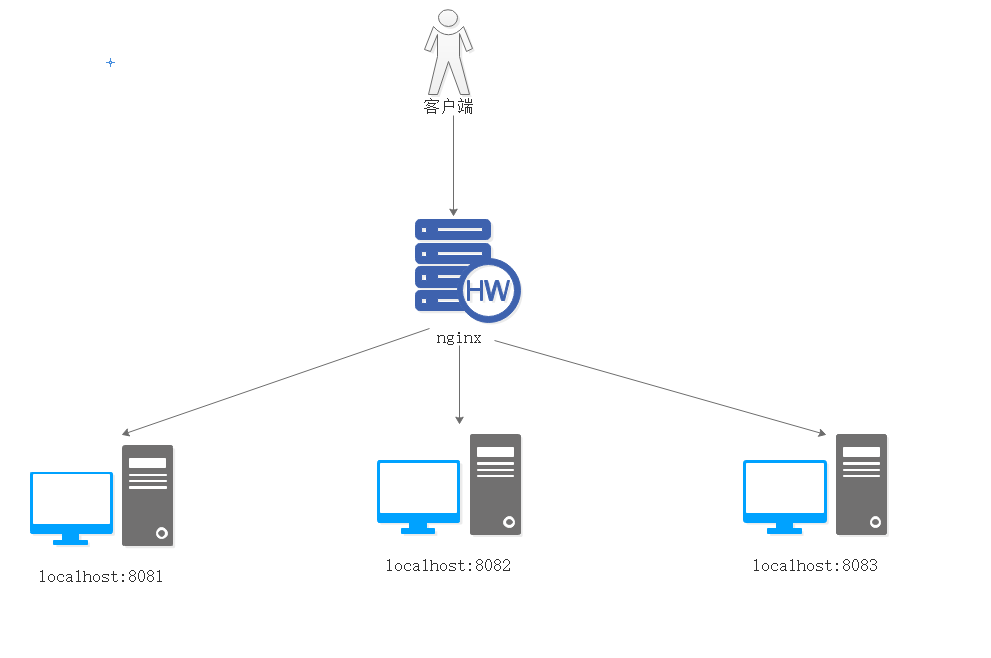

```java
配置步骤
   1：准备3台tomcat实例
    注意：
      1.1：修改tomcat的端口号  【两个地方】
      1.2：修改项目首页，方便区分看效果  【8081、8082、8083】
    2.nginx.conf配置
    
    # tomcat_servers 是自己命名的，可以叫其它名称
	upstream tomcatServers{ 
		# 格式：  server 服务器的域名或ip:端口;  
		server 127.0.0.1:8081 weight=3;
        server 127.0.0.1:8082 weight=1;
        server 127.0.0.1:8083 weight=1;
    }
	
    server {
        listen       80;
        server_name  localhost;
        location / {
            # root   D:/nginx/login;
            # index  index.html index.htm;
			proxy_pass http://tomcatServers;
        }
        error_page   500 502 503 504  /50x.html;
        location = /50x.html {
            root   html;
        }
    }
```


# 第四章-Redis安装

## 实操-Linux版本Redis的安装

### 1.目标

- [ ] 掌握Redis的安装

### 2.讲解

1. 在Linux虚拟机中安装c++环境(C的编译运行环境)

```bash
yum -y install gcc-c++
```

2. 下载Redis
3. 上传到Linux
4. 解压

```shell
# 创建目录/usr/local/redis
[root@shuaige ~]# mkdir /usr/local/redis
# 将redis解压到/usr/local/redis目录下
[root@shuaige ~]# tar -zxvf redis-4.0.14.tar.gz -C /usr/local/redis
```

5. 编译

```shell
# 切换到redis解压目录
[root@shuaige ~]# cd /usr/local/redis/redis-4.0.14/
# 执行编译
[root@shuaige redis-4.0.14]# make
```

6.  安装

```shell
[root@shuaige redis-4.0.14]# make install PREFIX=/usr/local/redis
```

7. 进入安装好的redis目录,复制配置文件

```shell
# 进入bin目录
[root@shuaige redis-4.0.14]# cd /usr/local/redis/bin
# 将redis配置文件复制到bin目录下
[root@shuaige bin]# cp ../redis-4.0.14/redis.conf ./
```

8. 修改配置文件

```bash
# 修改配置文件
[root@shuaige bin]# vi redis.conf
# Redis后台启动
修改 daemonize 为 yes
# 设置Redis服务器可以跨网络访问 
修改 bind 为 0.0.0.0
```

9. 开放端口号6379

```shell
# 编辑防火墙配置文件
[root@shuaige bin]# vi /etc/sysconfig/iptables
-A INPUT -m state --state NEW -m tcp -p tcp --dport 6379 -j ACCEPT
# 重启防火墙
[root@shuaige bin]# service iptables restart
```

10. 启动redis

```shell
[root@shuaige bin]# ./redis-server redis.conf
```

### 3.小结

1. 对着笔记安装就可以！！！


# 补充一：服务器相关

1. ### 服务器:一款软件

   Web服务器：安装了tomcat软件的计算机

   MySQL服务器：安装了MySQL软件的计算机

   + **硬件+软件**

2. 工作里面的服务器(外网)

   + 买  
     + 买主机
     + 自己装环境(Linux系统, 服务器软件JDK、MySQL、Tomcat)
     + 托管到机房/去运行商拉宽带(固定ip) 可能会绑定域名
   + 租【推荐】
     + 云服务器(阿里云,腾讯云...)

3. 域名(www.baidu.com =  14.215.177.39:80  80一般是默认端口 )

   + 域名会被DNS解析成对应的IP地址, IP地址对应的就是服务器

# 补充二：项目部署

## 1. 服务器环境准备

```
//1.准备一台Linux服务器
//2.安装项目运行所需的软件环境(jdk、MySQL、tomcat。。。)
```

## 2. 项目打包和数据库准备

```
java工程一般打成jar包
java web工程一般打成war包，发布项目将war包直接丢到tomcat的webapps目录下即可
```

### 1.设置打包环境(为哪个项目打包  打包名称)

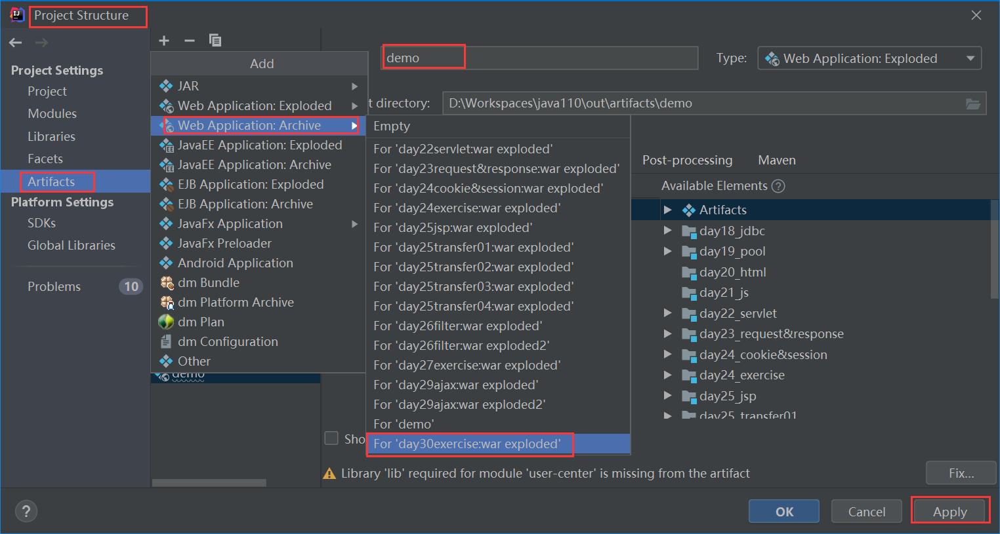

### 2.生成war包

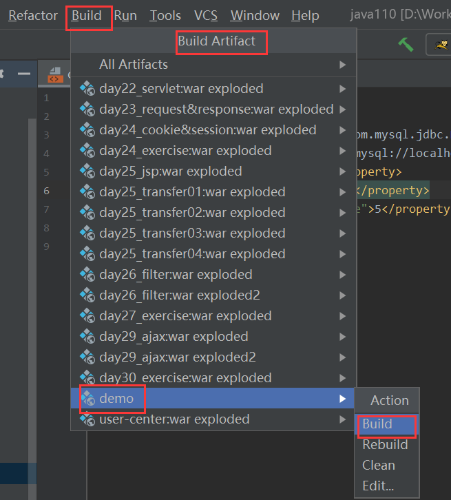

### 3.找到war包

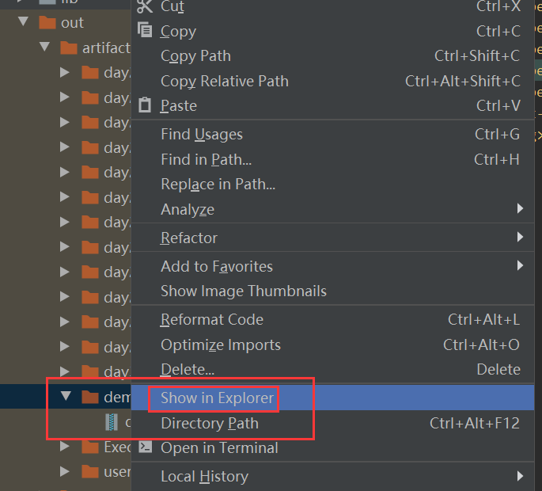

### 4.准备数据库环境

#### 注意1：新安装的数据库要去设置字符编码，否则默认拉丁字符编码存储中文报错。

```mysql
#数据库准备
#注意中文插入报错 要解决字符编码问题
# 查看数据库字符编码设置
SHOW VARIABLES LIKE 'char%';
# 设置字符编码为utf8
SET character_set_server=utf8;
SET character_set_database=utf8;
```

#### 注意2：项目在打包的时候要注意数据库环境是否与服务器上面的数据库环境一致！

```
url：数据库地址、数据库名称
user：用户名
password：密码
```

## 3. 项目发布，启动服务器访问

```xml
//1.将war包放入到tomcat的webapps目录下
//2.重启tomcat 访问 http://192.168.142.130:8080/demo
//3.添加中文内容乱码 useUnicode=true&amp;characterEncoding=utf-8
jdbc:mysql://localhost:3306/day27?useUnicode=true&amp;characterEncoding=utf-8
```

# 补充三：项目发布 负载均衡

​	目前：所有的功能都在一个项目中   

​			访问量比较大，使用nginx反向代理，搭建tomcat集群，实现负载均衡

​	实际工作：把每一个功能都拆分一个子系统，子系统分别发布到tomcat服务器上  SpringBoot SpringCloud 微服务开发

​	商城：用户系统、商品系统、订单系统、客服系统、商家后台...

​	tomcat实际并发量300-500

​    用户系统：访问量大  3W				100个tomcat      ---》   100台服务器

​    商品系统：访问量大				500个tomcat

​	 订单系统：访问量大				50个tomcat

​	 客服系统：访问量大				20个tomcat

​     商家后台：访问量相对较小   1个tomcat

​      如果后期功能修改了，商品系统增加了一个1元购活动

运维：持续集成部署  DevOps   CI/CD

开发者开发项目-->git托管-->项目管理平台-->一键编译部署运行-->推送到多个服务器上


