# day39- 面面项目第一天  

# 学习目标

- [ ] 了解版本控制相关的概念
- [ ] 掌握SVN的安装
- [ ] 掌握SVN的操作
- [ ] 掌握在idea中集成SVN
- [ ] 掌握自定义MVC框架

# 第一章-版本控制

## 知识点-版本控制相关的概念

### 1.目标

- [ ] 掌握版本控制相关的概念

### 2.路径

1. 什么是版本控制
2. 为什么要进行版本控制
3. 常见版本控制工具

### 3.讲解

#### 3.1什么是版本控制

​	版本控制(Revision control)是一种软体工程技巧，籍以在开发的过程中，确保由不同人所编辑的同一档案(项目代码)都得到更新。 对我们开发的项目进行版本管理，管理的这些项目具有版本号，可以看到某一个版本的所有修改内容，也可以回退到以前的某一个版本。

**一句话概括： 版本控制就是一个工具。**

#### 3.2为什么要进行版本控制

1. 回退代码到以前的某个阶段..
2. 查看以往的代码修改记录及变化  c3p0utils.java
3. 协同开发时，合并同一文件中不同开发者写的代码  CookieUtil 
4. 协同开发时定位修改代码的责任人 可以看到代码的修改记录。
5. 统计工作任务量
6. 备份源代码
7. 保护代码不被外泄 ， QQ ， Weixin 

#### 3.3常见版本控制工具

- CVS 早期版本管理软件
- ClearCase  IBM企业级大型版本管理工具, 收费
- VSS 微软推出的版本管理工具, 较少使用
- SVN市面最流行的版本管理工具之一,拥有CVS所有功能,修复了CVS的不足
- GIT 分布式版本管理工具, 已经是趋势

### 4.小结

1. 什么版本控制

   ​	是一种软体工程技巧, 确保由不同人所编辑的同一档案(项目代码)都得到更新。

2. 为什么要使用版本控制

   ​	工作里面要协同开发

3. 常见的版本控制工具

   ​    SVN

   ​    Git

## 知识点-SVN介绍

### 1.目标

- [ ] 掌握什么是SVN以及SVN的工作方式

### 2.路径

1. SVN概述
2. SVN工作方式【重点】

### 3.讲解

#### 3.1SVN概述

​	Svn（Subversion）是版本管理工具，在当前的开源项目里(J2EE)，几乎95%以上的项目都用到了 SVN。Subversion 项目的初衷是为了替换当年开源社区最为流行的版本控制软件CVS，在CVS的功能的基础上有很多的提升同时也能较好的解决CVS系统的一些不足。

#### 3.2 SVN工作方式【重点】


### 4.小结

1. SVN: 就是一个版本管理工具
2. SVN工作方式

 


## 实操-SVN的安装

### 1.目标

- [ ] 掌握SVN服务端和客户端的安装

### 2.路径

1. SVN服务器的安装
2. SVN客户端的安装

### 3.讲解

#### 3.1SVN服务器的安装

详情参考资料 【 01_VisualSVNServer安装步骤.html】

#### 3.2SVN客户端的安装

详情参考资料 【02_svn客户端安装步骤.html】 

**唯一要注意的地方就是：这里面有一个选项一定要选择安装它。**

### 4.小结

1. 注意

​	目录都不要有中文和空格

2. 装客户端
   + 先装客户端软件
   + 再装语言包

## 实操-创建仓库和用户

### 1.目标

- [ ] 掌握创建仓库和用户

### 2.路径

1. 创建仓库
2. 创建用户

### 3.讲解

#### 3.1创建仓库

详情参考资料  【03_VisualSVN创建仓库.html】

#### 3.2创建用户

详情参考资料 【04_VisualSVN创建用户步骤.html】

### 4.小结

1. 创建仓库

    

2. 用户和组

   + 给用户或者组分配权限


## 实操-SVN功能操作【重点】

### 1.目标

- [ ] 掌握SVN的功能操作

### 2.路径

### 3.讲解

#### 3.1检出代码（checkout）

> 可以看成是让我们目前的本地和服务器处于同步状态。服务器上有什么，我们本地就有什么！
>
> **不管仓库里面现在有什么（有还是没有东西，空的仓库。），第一次跟这个仓库对话永远是检出代码：** 检出的操作可以看成是让本地和服务器处于同样的状态。

1. 拷贝路径

    

2. 通过svn客户端检出代码

   
   
   

3. 检出的结果

   

   > .svn文件夹为版本控制的标记记录


#### 3.2提交代码

1. 新建文件

   

   > 新建完成后，**文件会有一个？号图标，代表当前文件未纳入到版本控制中**

2. 添加到版本控制中

   
   
   
   	

   > 添加操作完成后，文件图标会变为+号图标，代表当前文件已经纳入到版本控制中，但是没有上传到svn服务器中。	

3. 提交到版本控制器服务器

   
   
   
   

   > 提交操作完成后，图标会变为对钩，代表文件已经上传到版本控制服务器中。


#### 3.3更新代码

Update，它是更新操作,可以将svn服务器上的内容更新到本地

#### 3.4冲突解决 

+ 冲突产生的原因 

   `多个人同时修改一个文件`. eg: A，B同时下载最新的代码都修改同一个文件，A修改后上传提交。B修改提交，B就会提交失败。因为B的文件已经过时。必须重新更新。当更新的时候出现：

  

+ 编辑冲突，标记为解决


#### 3.5更新到某个版本

​	选中文件，右键更新之某个版本


#### 3.6 版本库的备份和还原【了解】

+ 到版本VisualSVN的仓库目录中拷贝要备份版本库。


+ 还原


### 4.小结

#### 4.1SVN图标


#### 4.2 SVN使用规范

+ 先更新，再提交     

  ​	SVN更新的原则是要随时更新，随时提交。当完成了一个小功能，能够通过编译并且自己测试之后，谨慎地提交。 
  如果在修改的期间别人也更改了svn的对应文件，那么commit就可能会失败。如果别人和自 己更改的是同一个文件，那么update时会自动进行合并，如果修改的是同一行，那么合并时会产生冲突，这种情况就需要同之前的开发人员联系，两个人一起协商解决冲突，解决冲突之后，需要两人一起测试保证解决冲突之后，程序不会影响其他功能。 
  在更新时注意所更新文件的列表，如果提交过程中产生了更新，则也是需要重新编译并且完成自己的一些必要测试，再进行提交。这样既能了解别人修改了哪些文件，同时也能避免SVN合并错误导致代码有错。

+ 多提交    

  ​	每次提交的间歇尽可能地短，以几个小时的开发工作为宜。例如在更改UI界面的时候，可以每完成一个UI界面的修改或者设计，就提交一次

  。在开发功能模块的时候，可以每完成一个小细节功能的测试，就提交一次，在修改bug的时候，每修改掉一个bug并且确认修改了这个bug，也就提交一次。我们提倡多提交，也就能多为代码添加上保险。

+ 不要提交不能通过编译的代码 （有错的代码不要提交!!!）

  ​	代码在提交之前，首先要确认自己能够在本地编译。如果在代码中使用了第三方类库，要考虑到项目组成员中有些成员可能没有安装相应的第三方类库。项目经理在准备项目工作区域的时候，需要考虑到这样的情况，确保开发小组成员在签出代码之后能够在统一的环境中进行编译。

+ 每次提交必须写明注释  code review... 

  ​	在一个项目组中使用SVN，如果提交空的标注或者不确切的标注将会让项目组中其他的成员感到很无奈，项目经理无法很清晰的掌握工作进度，无法清晰的把握此次提交的概要信息。在发现错误后也无法准确的定位引起错误的文件。所以，在提交工作时，要填写明晰的标注，能够概要的描述所提交文件的信息，让项目组其他成员在看到标注后不用详细看代码就能了解你所做的修改。

+ 不要提交本地自动生成的文件 (忽略的功能)

  ​	IDEA里面的编译之后的文件target, .idea文件

+ 不要提交自己不明白的代码 :: code review ...

  ​	代码在提交入SVN之后，你的代码将被项目成员所分享。如果提交了你不明白的代码，你看不懂，别人也看不懂，如果在以后出现了问题将会成为项目质量的隐患。因此在引入任何第三方代码之前，确保你对这个代码有一个很清晰的了解。

+ 慎用(**不要用)**锁定功能

  ​	在项目中要慎用锁定的功能，在你锁定了一个文件之后别人就无法继续修改提交该文件，虽然可以杜绝冲突的问题出现，但是可能会影响项目组中其他人员的工作。平时只有在编辑那些无法合并的文件（例如图片文件，flash文件等）时，才适当的采用锁定操作。

## 实操-在IDEA中使用SVN

### 1.目标

- [ ] 掌握在IDEA中配置SVN

### 2.路径

1. 配置SVN
2. IDEA SVN使用

### 3.讲解

#### 3.1 配置SVN

注意： 需要认证证书时，删除这个目录下所有内容C:\Users\自己的用户名\AppData\Roaming\Subversion

选择File>Settings>Version Controller>Subversion,分别设置命令行客户端工具和svn配置信息存储目录。如下图：


#### 3.2 IDEA SVN使用

##### 3.2.1 浏览仓库

选中IDEA菜单栏的VCS > Browse VCS Repository > Browse Subversion Repository


此时会出现如下界面，我们点击+号，输入本地SVN地址，再点击OK即可将本地SVN地址加入进来。

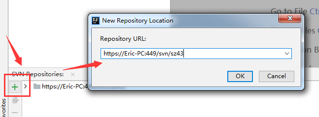


如果没有记住用户名和密码时，它就会弹出界面如下，需要我们输入正确的账号和密码方能实现仓库浏览。


账号密码正确后，如下浏览：

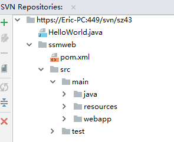


##### 3.2.2 上传本地项目到SVN 【重点】

在IDEA中，将本地项目共享到SVN，这个操作比较简单。

要做这个练习，我们先创建一个maven工程，这个工程还没有连接到SVN。然后再做以下操作

1. 确保SVN功能已经开启：菜单栏VCS > Enable Version Control Integration


2. 选中Subversion，此时功能的颜色会变成黄色，表明SVN功能已经开启。


3. **2020版本的idea以后(2018版本可以忽略这个步骤)，需要多增加这个步骤：**

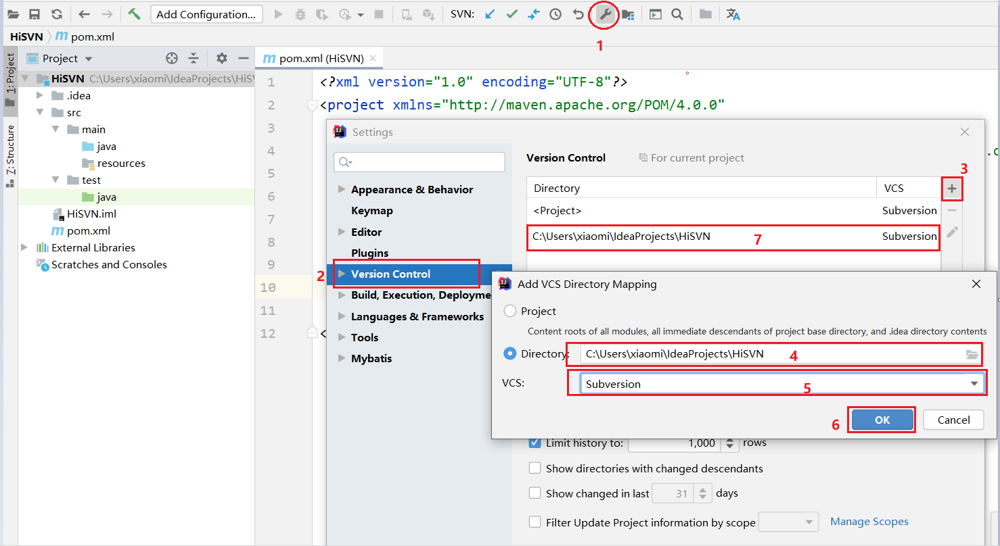

3. 共享操作：在项目上右键 > Subversion > Share Directory

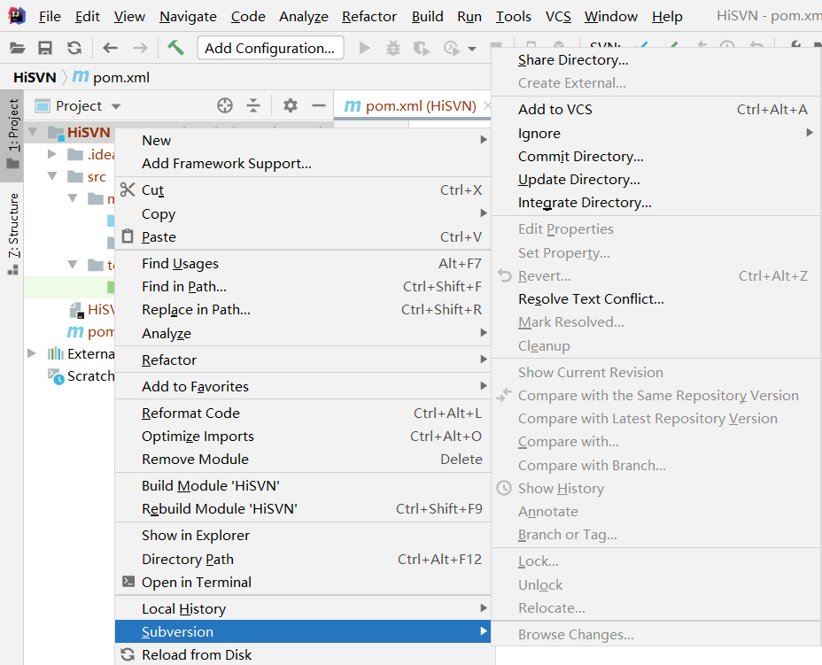


选择要共享的目标SVN地址，接着指定要共享的目标对象，点击Share之后，会在SVN创建一个对应的版本库文件，但该项目并未立刻提交。


提交对应工程：选择对应工程 > Subversion > Commit Directory

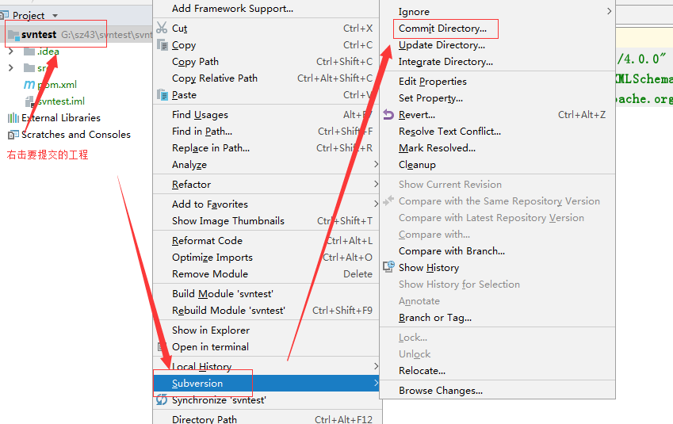


勾选要提交的内容，并填写上提交内容的注释信息，然后点击commit提交，提交完成后，项目就会被提交到SVN

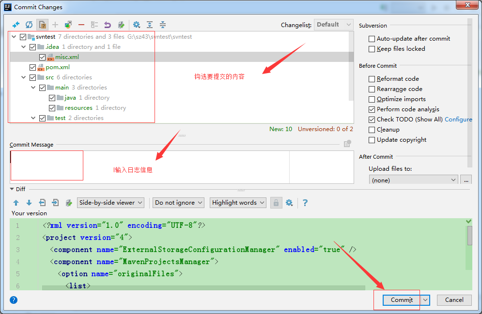

成功后再查询仓库，此时新的项目就出现了

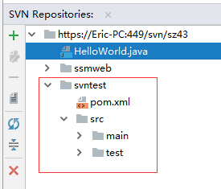


##### 3.2.3 Add Commit

添加新文件时，idea会访问是否将新文件添加到SVN管理中


注意，此时的文件是没有上传到svn上的，需要通过commit file才行


如果文件有修改，也是要在项目上或者修改的文件上右击Subversion > Commit File

选择要提交的内容，并填写上注释，然后选中commit即可。


##### 3.2.4 checkout 检出

​	打开上面浏览的SVN目录信息，并选中任意一个项目，并右键，选中checkout，该功能是将SVN上的资源检出到本地。

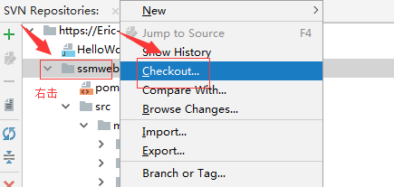


选中本地目录，用于存储从SVN服务器上检出的项目，目录选中后，直接点击OK，进入版本选择和存储目标地址选中

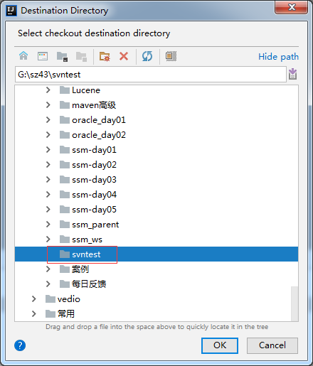


接着我们选中要检出的项目存储目标地址，并选中要检出的版本信息，最后点击OK即可。


按默认的就可以了

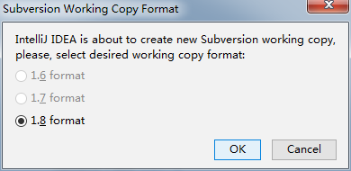

这里我们直接勾选第一个，从现有资源创建项目。

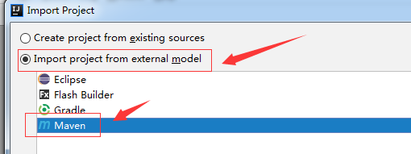


然后一路next，最后选择finish即可完成项目的导出。

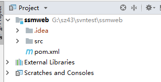

##### 3.2.5 Update

如果需要更新服务器上的文件，选中要更新的项目并右键 > Subversion > Update Directory


一般直接点击OK即可，但如果需要选择历史版本，则勾上HEAD选项。


##### 3.2.6 解决冲突

多个用户同时编辑一个文件并都直接执行提交时，容易导致冲突产生，如下：

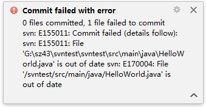

产生了冲突 
我们在工程上执行更新操作


如果文件变更发生冲突，会看到如下界面，这里会有三个选项：


Accept Yours：接受你的版本,会以自己的版本为正确版本。

Accept Theirs：接受SVN上的版本，会把服务器的版本作为正确版本。

Merge：合并，需要将冲突手动排除。


最后还要把这个文件提交

##### 3.2.7 忽略

> 项目并不是所有的内容都往上提交。比如： target ， out目录 , .idea , .iml 这些都不用提交...

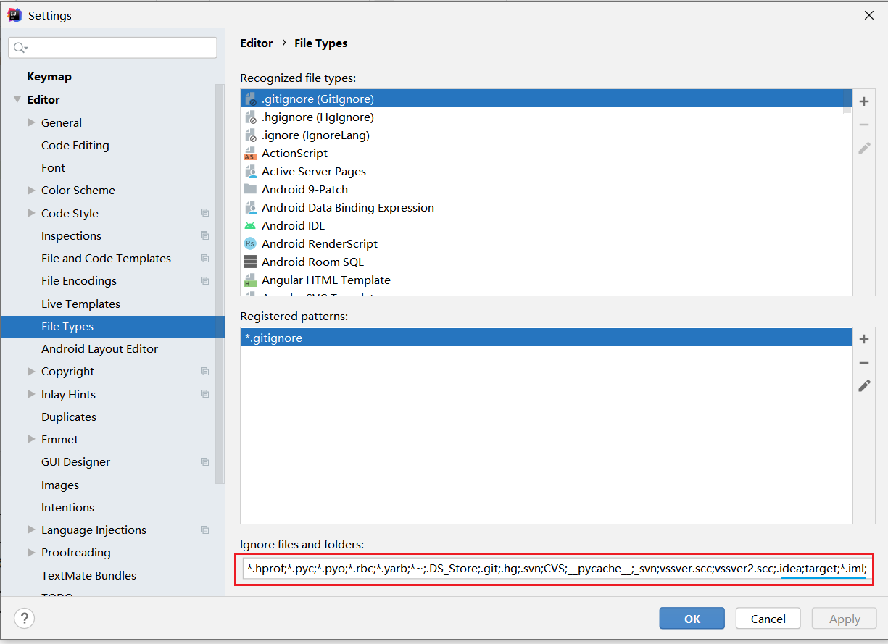

### 4.小结

1. 大家对着文档操作


# 第二章-自定义MVC框架 

## 知识点-以模块为单位创建Servlet

### 1.目标

- [ ] 掌握以模块为单位创建Servlet

### 2.路径

1. 复习 以模块为单位创建Servlet
2. 使用反射优化

### 3.讲解

#### 3.1以模块为单位创建Servlet

​	传统方式的开发一个请求对应一个Servlet:这样的话会导致一个模块的Servlet过多,导致整个项目的Servlet都会很多.能不能做一个处理?让一个模块都用一个Servlet处理请求. 用户模块, 创建UserServlet	

早期的servlet

​	注册 ------ RegisterServlet

​     登录 ----- LoginServlet

​     ...

模块化的Servlet   User模块  ---- UserServlet

​	注册:http://localhost:8080/day36/userServlet?method=regist

​	登录:http://localhost:8080/day36/userServlet?method=login

​	激活:http://localhost:8080/day36/userServle?method=active

- 以"模块为单位"创建Servlet的方式

```java
class UserServlet extend HttpServlet{
  
  	... doGet(HttpServletRequest request, HttpServletResponse response){
        
        //1.获得请求参数method
        String methodStr =  request.getParameter("method");
        
        //2.判断, 调用对应的方法
        if("regist".equals(methodStr)){
            //注册
           regist(request,response);
        }else if("login".equals(methodStr)){
            //登录
           login(request,response);
        }else if("active".equals(methodStr)){
            //激活
           active(request,response);
        }else if("delete".equals(methodStr)){
            
            delete(request,response);
        }else if("findById".equals(methodStr)){
            findById(request,response);
        }
  	}
    
    public viod findById(HttpServletRequest request, HttpServletResponse response){}
    
    public viod delete(HttpServletRequest request, HttpServletResponse response){}

  	public void regist(HttpServletRequest request, HttpServletResponse response){
      	//1. 接受请求参数
      	//2. 调用业务
      	//3. 响应
  	}
  	
  	 public void login(HttpServletRequest request, HttpServletResponse response){
      	//1. 接受请求参数
      	//2. 调用业务
    	//3. 响应
  	}
  	public void active(HttpServletRequest request, HttpServletResponse response){
      	//1. 接受请求参数
      	//2. 调用业务
     	//3. 响应
  	}
  
  
}
```

#### 3.2使用反射优化

发现在上面的doGet方法里面,有大量的if语句,能不能不写if语句

​	注册:http://localhost:8080/day31/userServlet?method=regist

​	登录:http://localhost:8080/day31/userServlet?method=login

​	激活:http://localhost:8080/day31/userServlet?method=active

- 优化后  

```java
class UserServlet extend HttpServlet{
  
    //找到对应的方法 执行
  	... doGet(HttpServletRequest request, HttpServletResponse response){
      	//1. 获得method请求参数的值【说白了就是方法名】
      	String methodStr =  request.getParameter("method");
        //2.获得字节码对象 参数的值就是方法名。
        Class clazz  = this.getClass();
        //3.根据方法名反射获得Method
      Method method =   clazz.getMethod(methodStr,HttpServletRequest.class,HttpServletResponse.class);
        
        //4.调用
        method.invoke(this,request,response)
          
  	}

  	public void regist(HttpServletRequest request, HttpServletResponse response){
      	//1. 接受请求参数
      	//2. 调用业务
      	//3. 响应
  	}
  	
    public void login(HttpServletRequest request, HttpServletResponse response){
      	//1. 接受请求参数
      	//2. 调用业务
    	//3. 响应
  	}
  	public void active(HttpServletRequest request, HttpServletResponse response){
      	//1. 接受请求参数
      	//2. 调用业务
     	//3. 响应
  	}
 
}
```

### 4.小结

1. 一个模块就创建一个Servlet, 每个请求都携带请求参数method=xx


## 知识点-BaseServlet

### 1.目标

- [ ] 掌握BaseServlet的编写

### 2.路径

1. BaseServlet分析
2. BaseServlet编写

### 3.讲解

#### 3.1BaseServlet分析

以模块为单元创建Servlet

```java
-- 用户模块
	注册:http://localhost:8080/day31/userServlet?method=regist
	登录:http://localhost:8080/day31/userServlet?method=login
	激活:http://localhost:8080/day31/userServlet?method=active

class UserServlet extend HttpServlet{
  
    //找到对应的方法 执行
  	... doGet(HttpServletRequest request, HttpServletResponse response){
      	//1. 获得method请求参数的值【说白了就是方法名】
      	String methodStr =  request.getParameter("method");
        //2.获得字节码对象
        Class clazz  = this.getClass();
        //3.根据方法名反射获得Method
      Method method =   clazz.getMethod(methodStr,HttpServletRequest.class,HttpServletResponse.class);
        
        //4.调用
        method.invoke(this,request,response)
  	}

  	public void regist(HttpServletRequest request, HttpServletResponse response){
      	//1. 接受请求参数
      	//2. 调用业务
      	//3. 响应
  	}
  	
  	 public void login(HttpServletRequest request, HttpServletResponse response){
      	//1. 接受请求参数
      	//2. 调用业务
    	//3. 响应
  	}
  	public void active(HttpServletRequest request, HttpServletResponse response){
      	//1. 接受请求参数
      	//2. 调用业务
     	//3. 响应
  	}
 
}


-- 商品模块
	增加:http://localhost:8080/day31/productServlet?method=add
	删除:http://localhost:8080/day31/productServlet?method=delete
	查询所有:http://localhost:8080/day31/productServlet?method=findAll

class ProductServlet extend HttpServlet{
  
    //找到对应的方法 执行
  	... doGet(HttpServletRequest request, HttpServletResponse response){
      	//1. 获得method请求参数的值【说白了就是方法名】
      	String methodStr =  request.getParameter("method");
        //2.获得字节码对象
        Class clazz  = this.getClass();
        //3.根据方法名反射获得Method
      Method method =   clazz.getMethod(methodStr,HttpServletRequest.class,HttpServletResponse.class);
        
        //4.调用
        method.invoke(this,request,response)
          
      
  	}

  	public void add(HttpServletRequest request, HttpServletResponse response){
      	//1. 接受请求参数
      	//2. 调用业务
      	//3. 响应
  	}
  	
  	 public void delete(HttpServletRequest request, HttpServletResponse response){
      	//1. 接受请求参数
      	//2. 调用业务
    	//3. 响应
  	}
  	public void findAll(HttpServletRequest request, HttpServletResponse response){
      	//1. 接受请求参数
      	//2. 调用业务
     	//3. 响应
  	}
 
}

-- 类别模块
	增加:http://localhost:8080/day31/categoryServlet?method=add
	删除:http://localhost:8080/day31/categoryServlet?method=delete
	

class CategoryServlet extend HttpServlet{
  
    //找到对应的方法 执行
  	... doGet(HttpServletRequest request, HttpServletResponse response){
      	//1. 获得method请求参数的值【说白了就是方法名】
      	String methodStr =  request.getParameter("method");
        //2.获得字节码对象
        Class clazz  = this.getClass();
        //3.根据方法名反射获得Method
      Method method =   clazz.getMethod(methodStr,HttpServletRequest.class,HttpServletResponse.class);
        
        //4.调用
        method.invoke(this,request,response)
          
      
  	}

  	public void add(HttpServletRequest request, HttpServletResponse response){
      	//1. 接受请求参数
      	//2. 调用业务
      	//3. 响应
  	}
  	
  	 public void delete(HttpServletRequest request, HttpServletResponse response){
      	//1. 接受请求参数
      	//2. 调用业务
    	//3. 响应
  	}
}
```

* 以模块划分创建servlet的问题分析
  * 以模块来创建servlet在一定程度上可以减少我们的servlet创建的数量，并且可以把同一个模块的代码给聚集起来，统一管理 （UserServlet | ProductServlet | OrderServlet）
  * 但是也要看到这种模式的问题，进行横向对比，把UserServlet和ProductServlet进行对比，两个servlet里面的doGet方法和doPost方法几乎一模一样。唯一的不同就是它们所处理的功能不同。
  * 此时就可以考虑把这些共性的代码给提取出来， 这里最好采用父类向上的抽取，而不是以前我们习惯的工具类方法抽取。因为这里连方法名都一样了。

```java
class BaseServlet extend HttpServlet{
  
    //找到对应的方法 执行
  	... service(HttpServletRequest request, HttpServletResponse response){
      	//1. 获得method请求参数的值【说白了就是方法名】
      	String methodStr =  request.getParameter("method");
        //2.获得字节码对象
        Class clazz  = this.getClass();
        //3.根据方法名反射获得Method
      Method method =   clazz.getMethod(methodStr,HttpServletRequest.class,HttpServletResponse.class);
        
        //4.调用
        method.invoke(this,request,response)
    }
    
  
      
  	}

-- 用户模块
	注册:http://localhost:8080/day31/userServlet?method=regist
	登录:http://localhost:8080/day31/userServlet?method=login
	激活:http://localhost:8080/day31/userServlet?method=active

class UserServlet extend BaseServlet{
 

  	public void regist(HttpServletRequest request, HttpServletResponse response){
      	//1. 接受请求参数
      	//2. 调用业务
      	//3. 响应
  	}
  	
  	 public void login(HttpServletRequest request, HttpServletResponse response){
      	//1. 接受请求参数
      	//2. 调用业务
    	//3. 响应
  	}
  	public void active(HttpServletRequest request, HttpServletResponse response){
      	//1. 接受请求参数
      	//2. 调用业务
     	//3. 响应
  	}
 
}


-- 商品模块
	增加:http://localhost:8080/day31/productServlet?method=add
	删除:http://localhost:8080/day31/productServlet?method=delete
	查询所有:http://localhost:8080/day31/productServlet?method=findAll

class ProductServlet extend BaseServlet{

  	public void add(HttpServletRequest request, HttpServletResponse response){
      	//1. 接受请求参数
      	//2. 调用业务
      	//3. 响应
  	}
  	
  	 public void delete(HttpServletRequest request, HttpServletResponse response){
      	//1. 接受请求参数
      	//2. 调用业务
    	//3. 响应
  	}
  	public void findAll(HttpServletRequest request, HttpServletResponse response){
      	//1. 接受请求参数
      	//2. 调用业务
     	//3. 响应
  	}
 
}

-- 类别模块
	增加:http://localhost:8080/day31/categoryServlet?method=add
	删除:http://localhost:8080/day31/categoryServlet?method=delete
	

class CategoryServlet extend BaseServlet{
  

  	public void add(HttpServletRequest request, HttpServletResponse response){
      	//1. 接受请求参数
      	//2. 调用业务
      	//3. 响应
  	}
  	
  	 public void delete(HttpServletRequest request, HttpServletResponse response){
      	//1. 接受请求参数
      	//2. 调用业务
    	//3. 响应
  	}
}
```

#### 3.2 BaseServlet编写 

* 步骤

1.  定义一个类，名字一般叫做BaseXXX, BaseServlet。
2. 这个类也是一个Servlet， 把刚才的UserServlet和OrderServlet的doGet方法和doPost方法的代码全部剪切到BaseServlet里面去。
3. 让UserServlet和OrderServlet继承BaseServlet即可

```java
package com.itheima.servlet02;

import javax.servlet.ServletException;
import javax.servlet.annotation.WebServlet;
import javax.servlet.http.HttpServlet;
import javax.servlet.http.HttpServletRequest;
import javax.servlet.http.HttpServletResponse;
import java.io.IOException;
import java.lang.reflect.Method;

/*
    这是所有servlet的父类，
        1. 用于存放所有子类的doGet和doPost代码
        2. BaseServlet必须是一个servlet，所以要继承HTTPServlet
        3. BaseServlet其实它只做一件事：
            收到请求之后，去调用子类的方法。
        4. 既然只做一件事情而已，那么有没有必要重写两个方法 doGet和doPost
            能否只重写一个方法即可？ 可以选择去重写 service 方法

        5. 有以下几个疑问：
            1. 方法里面的this是谁？
                A : BaseServlet  B :  可能是UserServlet|OrderServlet  C :  子类

                this :谁调用这个方法，那么this就是谁。肯定就是子类对象来调用这些方法

            2. BaseServlet也是一个Servlet，要不要加上@WebServlet("/base");
                不需要加上，因为BaseServlet仅仅只是一个父类，用来做一个请求方法的判定调用而已。
                    真正干活的是子类。


 */
public class BaseServlet extends HttpServlet {
    @Override
    protected void service(HttpServletRequest req, HttpServletResponse resp) throws ServletException, IOException {
        try {
            //1. 获取请求参数 method
            String methodStr = req.getParameter("method");

            //2. 找方法
             Method m = this.getClass().getMethod(methodStr , HttpServletRequest.class , HttpServletResponse.class);

            //3. 调用方法
            m.invoke( this ,req , resp );
        } catch (Exception e) {
            e.printStackTrace();
        }
    }

}
```

* UserServlet

```java
package com.itheima.servlet02;

import javax.servlet.ServletException;
import javax.servlet.annotation.WebServlet;
import javax.servlet.http.HttpServlet;
import javax.servlet.http.HttpServletRequest;
import javax.servlet.http.HttpServletResponse;
import java.io.IOException;
import java.lang.reflect.Method;

/*
    负责处理所有有关用户的请求
 */
@WebServlet("/user02")
public class UserServlet extends BaseServlet {

    public void delete(HttpServletRequest req, HttpServletResponse resp){
        System.out.println("执行了UserServlet02的delete方法~！");
    }

    public void register(HttpServletRequest req, HttpServletResponse resp){
        System.out.println("执行了UserServlet02的register方法~！");
    }

    public void login(HttpServletRequest req, HttpServletResponse resp){
        System.out.println("执行了UserServlet02的login方法~！");

    }

}

```


### 4.小结

1. 把公共的代码抽取到父类BaseServlet, 模块的Servlet继承BaseServlet就可以了
2. BaseServlet里面的异常打印不要删除

  

3. 在BaseServlet里面反射的API是getMethod 也就意味着模块里面的Servlet的方法应该是public的

 


## 知识点-自定义MVC框架

### 1.目标

- [ ] 掌握自定义SpringMVC框架

### 2.路径

1. BaseServlet问题分析
2. 自定义MVC框架初级版本
3. 自定义MVC框架终极版本

### 3.讲解

#### 3.1BaseServlet问题分析  

​		这种实现要求客户端的每个请求都==必须传递一个method参数，否则无法找到对应的web方法，另外这个控制器(子模块的servlet)也必须要继承父类BaseServlet，因为是在父类的service()中完成请求解析与调用。这种方式不是很便捷并且耦合度比较高。
​	接下来想进一步重构BaseServlet，让其用起来更方便更便捷，让它们的耦合关系更松散，比如写**一个总控制器类 (类似BaseServlet)**，这个总控制器继承HttpServlet类，其他的控制器（子控制器 **【类似UserServlet...】**）是普通Java类，谁都不用继承（**不用继承总的控制器类 （BaseServlet），也不用继承HttpServlet类**），然后由总控制器动态的去调用子控制器的业务方法，这种动态调用是采用在参数中不加入method的方式来实现的。

* 问题

  * 1. 所有的请求必须携带一个method的参数，否则会抛出异常。
    2. 所有的模块servlet必须继承BaseServlet，才能够使用上判断的逻辑

* 解决

  * 1. 创建一个总的控制器类BaseServlet （其实就是类似刚才的BaseServlet）
    2. 这个BaseServlet要捕获所有的请求，（比如：捕获*.do这样的请求）
    3. 模块化的类，就是一个普通的java类（不用继承BaseServlet，也不用继承HTTPServlet）
    4. 传递参数的时候，也不用携带method参数，由总的控制器类（BaseServlet） 根据请求来决定到底调用哪一个模块类的方法执行。

    BaseServlet中，可以灵活的处理客户端的请求，应对部分项目开发没有问题。

```java
@WebServlet("*.do")
class BaseServlet extends HttpServlet{
    void service(){
        
        //1. 抓住所有带有 .do的请求
        
    }
    
}

localhost:8080/项目映射名/a/b.do  ====>  /a/b

//模块
class UserServlet{
    
    @RequestMapping("/user/register")
    public void register(HttpServletRequest req , HttpServletResponse resp){
        
        
    }
    
}

1. 访问register方法的时候，地址路径是这样的： localhost:8080/项目映射名/user/register.do
2. BaseServlet能抓住请求。截取地址： 得到 /user/register
3. 跟类里面的方法上的注解内容进行比对。 @RequestMapping("/user/register")
4. 如果一样就调用对应的方法。


```

如下:

 

直接在方法上添加一个注解@RequestMapping("/user/login"), 

就可以处理http://localhost:8080/day36/user/login.do这个请求

#### 3.2自定义SpringMVC框架初级版本

##### 3.2.1思路 

1. 创建@RequestMapping注解
   1. 注解的作用主要是为了给servlet里面的方法做映射的。
   2. 注解一般是作用于方法上，并且保留到运行的时候还要存在于字节码
2. 创建UserController （UserServlet） , 定义方法, 
3. 在这个方法上面添加@RequestMapping注解
4. 创建DispatcherServlet （BaseServlet）继承HttpServlet, 映射路径配置 *.do
5. 在DispatcherServlet （BaseServlet） 重写的service()方法里面

```
//1.获得请求的URI和项目部署路径, 截取获得映射路径 eg: /user/login
//2.扫描某个包里面的所有类的字节码对象集合List
//3.遍历字节码对象集合List
//4.获得类里面的所有的Method
//5.遍历所有的Method
//6.获得method上面的RequestMapping注解 获得注解的value属性值
//7.判断value属性值是否和获得映路径一致, 一致 就调用method
```

##### 3.2.2代码实现

+ RequestMapping注解

```java
package com.itheima.servlet03;

import java.lang.annotation.ElementType;
import java.lang.annotation.Retention;
import java.lang.annotation.RetentionPolicy;
import java.lang.annotation.Target;
/*
    注解：
        1. 应用在什么位置
        2. 能保留到什么时候
        3. 属性：
            value
 */
@Target(ElementType.METHOD)
@Retention(RetentionPolicy.RUNTIME)
public @interface RequestMapping {

    /*
        注解的value属性 ： 这个注解写在方法上的时候，可以在括号里面写上value的值
            而value的值，就相当于是这个方法的映射地址路径。
     */
    String value();
}

```

+ BaseServlet

```java
package com.itheima.servlet03;

import com.itheima.utils.ClassScannerUtils;

import javax.servlet.ServletException;
import javax.servlet.annotation.WebServlet;
import javax.servlet.http.HttpServlet;
import javax.servlet.http.HttpServletRequest;
import javax.servlet.http.HttpServletResponse;
import java.io.IOException;
import java.lang.reflect.InvocationTargetException;
import java.lang.reflect.Method;
import java.util.List;

/*
    1. 这是总的servlet，用来抓取所有尾巴带有.do的请求
    2. 抓到这些请求之后，对请求的地址进行截取、比对，然后去调用子模块(servlet)的方法
    3. 在service里面截取地址，和包下的类中的方法上的注解value比对。
 */
@WebServlet("*.do")
public class BaseServlet extends HttpServlet {

    @Override
    protected void service(HttpServletRequest req, HttpServletResponse resp) throws ServletException, IOException {
        System.out.println("执行了BaseServlet的service方法~！");

        try {
            //1. 获取请求地址，并把映射路径给截取出来
            //req.getRequestURL(); //    http://localhost:8080/day39_mvc01_war_exploded/user/register.do
            String uri = req.getRequestURI(); //   /day39_mvc01_war_exploded/user/register.do
            int start = req.getContextPath().length() ; //项目映射名的长度
            int end = uri.lastIndexOf('.') ; //最后一个.的位置
            String path = uri.substring(start , end ); //    /user/register
            System.out.println("path=" + path);

            //2. 扫描指定包 com.itheima.servlet03包， 得到包下的所有类的字节码
            List<Class<?>> classList = ClassScannerUtils.getClasssFromPackage("com.itheima.servlet03");


            //3. 遍历包下的所有类
            for (Class<?> clazz : classList) {

                //4. 获取这个类身上的所有方法
                Method[] methods = clazz.getMethods();

                //5. 遍历每一个方法
                for (Method method : methods) {

                    //6. 获取这个方法身上的注解 @RequestMapping 对象
                    // 要注意，并不是所有类中的所有方法都被打上了 @RequestMapping的注解
                    RequestMapping annotation = method.getAnnotation(RequestMapping.class);

                    //7. 判定有没有注解 如果不是null，就表示这个方法身上有@RequestMapping的注解
                    if(annotation != null){

                        //8. 获取@RequestMapping里面的value属性值
                        String value = annotation.value();

                        //9. 判定截获的地址和value是否一样，一样就执行方法
                        if(value.equals(path)){
                            method.invoke(clazz.newInstance() , req, resp);
                        }
                    }
                }
            }
        } catch (Exception e) {
            e.printStackTrace();
        }

    }
}
```

+ UserServlet

```java
package com.itheima.servlet03;

import javax.servlet.http.HttpServletRequest;
import javax.servlet.http.HttpServletResponse;

/*
    所有与用户相关的操作都交给这个类来完成。
 */
public class UserServlet {


    /**
     * 注册的方法
     *   @RequestMapping的作用就是用于定义什么样的请求地址，能够执行这个register方法
     * @param request
     * @param response
     */
    @RequestMapping("/user/register")
    public void  register(HttpServletRequest request , HttpServletResponse response){
        System.out.println("执行了UserServlet的register方法~！");
    }


    public void login(HttpServletRequest request , HttpServletResponse response){
        System.out.println("执行了UserServlet的login方法~！");
    }
}
```

#### 3.3自定义SpringMVC框架终极版本

初级版本存在问题:
1. 在总的控制器里面扫描指定包的时候，遍历的类太多了！
2. 等来了请求再去解析,再去反射创建对象调用 ---> 影响处理请求的速度的
3. 扫描的包名写死了

##### 3.1.1思路

1. 在项目部署的时候，就马上启动扫描的工作了。

   a. 把扫描的工作提前放到servlet的init方法去做

   b. 让这个init方法调用的时机再提前一些，提前到项目发布的时候就执行。

   c. 设置 <load-on-startup> 1</load-on-startup>

2. DispatcherServlet注册的时候，不要使用注解来注册了，而是使用xml来注册， 在xml里面注册的时候，就可以配置servlet的初始化参数，用户指定扫描具体那个包。

3. 扫描得到包下的所有类了之后，不是每一个类我们都要查看它的所有方法有没有requestMapping这个注解

   1. 只看类上有没有一个注解@Controller ， 这个注解是自定义的注解。
   2. 谁身上有这个注解，我们就解析这个类里面的所有方法。

4. 在init方法里面完成扫描的工作之后，需要使用一个Map集合来进行映射关系，也就是完成扫描工作之后，使用一个map集合来包装 映射的地址和和一个javaBean对象。 这个javaBean对象里面有两个属性： 要执行的方法method对象， 调用这个方法要用到的实例对象。

   ```java
   class MethodBean{
   		private Method method;  //具体的方法对象
   		private Object obj; //调用这个方法要用的实例对象
   }
   
   Map<String , MethodBean> map ;
   MethodBean mb = new MethodBean(方法对象 ， 类的实例对象);
   map.put("/user/register" , mb);
   ```

5. 在请求来的时候，在service里面获取请求的地址

6. 截获请求的地址了之后，就可以直接问map要方法来调用。

   ```java
   MethodBean mb  = map.get("/user/register");
   
   Method m = mb.getMethod();
   
   m.invoke(mb.getObj() , req , resp);
   ```

##### 3.1.2代码实现

+ Controller注解 

> 打在类上

```java
package com.itheima.annotation;

import java.lang.annotation.ElementType;
import java.lang.annotation.Retention;
import java.lang.annotation.RetentionPolicy;
import java.lang.annotation.Target;

/*
    这个注解打在类身上，主要是为了解决我们在总的控制器类里面解析太多类的问题
    以后只要解析哪个类身上打上这个注解，我们就解析哪个类
 */
@Target(ElementType.TYPE)
@Retention(RetentionPolicy.RUNTIME)
public @interface Controller {
}
```

+ RequestMapping注解	

> 打在方法上

```java
package com.itheima.annotation;


/*
    这个注解打在方法身上，用于表示这个方法的映射路径是什么
 */

import java.lang.annotation.ElementType;
import java.lang.annotation.Retention;
import java.lang.annotation.RetentionPolicy;
import java.lang.annotation.Target;

@Target(ElementType.METHOD)
@Retention(RetentionPolicy.RUNTIME)
public @interface RequestMapping {
    String value();
}

```

* UserController

```java
package com.itheima.controller;

import com.itheima.annotation.Controller;
import com.itheima.annotation.RequestMapping;

import javax.servlet.http.HttpServletRequest;
import javax.servlet.http.HttpServletResponse;

/*
    所有有关用户操作的请求，都交给这个controller来完成
        1. 类上打注解 @Controller
        2. 方法上打注解 @RequestMappting
 */
@Controller
public class UserController {

    @RequestMapping("/user/register")
    public void register(HttpServletRequest req , HttpServletResponse resp){
        System.out.println("执行了UserController的register方法~！");
    }

    @RequestMapping("/user/login")
    public void login(HttpServletRequest req , HttpServletResponse resp){
        System.out.println("执行了UserController的login方法~！");
    }
}

```

+ MethodBean

> 主要是用来封装 被调用的方法和 调用这个方法用到的实例对象

```java
package com.itheima.bean;

import lombok.AllArgsConstructor;
import lombok.Data;
import lombok.NoArgsConstructor;

import java.lang.reflect.Method;

@Data
@AllArgsConstructor
@NoArgsConstructor
public class MethodBean {
    private Method method; //真正要执行的方法
    private Object object ;  // 调用上面的方法用什么对象来调用
}
```

+ DispatcherServlet

```java
package com.itheima.servlet;

import com.itheima.annotation.Controller;
import com.itheima.annotation.RequestMapping;
import com.itheima.bean.MethodBean;
import com.itheima.utils.ClassScannerUtils;

import javax.servlet.ServletConfig;
import javax.servlet.ServletException;
import javax.servlet.annotation.WebServlet;
import javax.servlet.http.HttpServlet;
import javax.servlet.http.HttpServletRequest;
import javax.servlet.http.HttpServletResponse;
import java.io.IOException;
import java.lang.reflect.InvocationTargetException;
import java.lang.reflect.Method;
import java.util.HashMap;
import java.util.List;
import java.util.Map;

/*
    DispatcherServlet:
        1. 它是一个servlet，要抓住所有尾巴带.do的请求
        2. 重写两个方法 init方法和service
            2.1. init方法负责完成初始化，包括：扫描包，解析方法，得到映射，封装映射和方法以及对象的关系
            2.2. service方法负责完成具体方法调用

        3. 注册DispatcherServlet，使用xml方式来注册
            3.1. 抓.do的后缀
            3.2. 配置初始化参数，初始化参数就用来指定扫描的包名
            3.3. 让这个servlet的init方法调用时机更加的提前。 <load-on-startup>1</load-on-startup>

        init :
            1. 要读取配置DispatcherServlet里面给的初始化参数，这样就知道要扫描哪个包了。
            2. 扫描指定的包，得到所有的类
            3. 遍历类

        service：
            1. 当请求来的时候，获取请求的地址
            2. 截取映射地址
            3. 拿着映射地址去map集合里面找匹配的methodBean
            4. 找到之后就调用对应的方法， 要是找不到，也可以给一句提示！

 */
public class DispatcherServlet extends HttpServlet {

    //定义map集合
    Map<String , MethodBean> map = new HashMap<>();

    @Override
    public void init(ServletConfig config) throws ServletException {

        try {
            //1. 读取初始化参数
            String packageName = config.getInitParameter("packageName");

            //2. 扫描这个包
            List<Class<?>> classList = ClassScannerUtils.getClasssFromPackage(packageName);

            //3. 遍历集合中的每一个类
            for (Class<?> clazz : classList) {

                //4. 判定这个类身上有没有 @Controller注解
                boolean flag = clazz.isAnnotationPresent(Controller.class);
                if(flag){ //表示有这个注解

                    //5. 得到这个类里面所有方法
                    Method[] methods = clazz.getMethods();

                    //6. 遍历每一个方法
                    for (Method method : methods) {
                        //7. 判断方法上是否有注解 @RequestMapping , 要注意有的方法身上没有这个注解，那么返回的是null
                        RequestMapping annotation = method.getAnnotation(RequestMapping.class);

                        if(annotation != null){//身上有这个注解
                            //获取注解身上的value值。
                            String mapping = annotation.value();

                            //8. 使用map集合来装映射管理  key : mapping  ，value : method &  clazz.newInstance();
                            MethodBean bean = new MethodBean(method , clazz.newInstance());
                            map.put(mapping , bean); // key : /user/register , value :  register方法和UserController对象

                        }
                    }
                }
            }
        } catch (Exception e) {
            e.printStackTrace();
        }
    }

    @Override
    protected void service(HttpServletRequest req, HttpServletResponse resp) throws ServletException, IOException {

        try {
            //1. 获取请求地址
            String uri = req.getRequestURI();  //    /day39_mvc01_war_exploded/user/register.do
            String path  = uri.substring(req.getContextPath().length() , uri.lastIndexOf('.'));  //   /user/register

            //2. 拿着地址去map集合里面找匹配的集合
            MethodBean bean = map.get(path);

            //3. 要记得判定map返回的结果，因为这个映射地址在map集合里面并不一定有方法与之对应
            if(bean != null){
                //如果进入这个if分支，即表示找到匹配的记录，找到之后，就让方法执行即可
                Method method = bean.getMethod();
                Object object = bean.getObject();

                method.invoke(object ,req , resp );
            }else{
                System.out.println(path + " ,没有找到匹配的方法可以执行！");
            }
        } catch (Exception e) {
            e.printStackTrace();
        }
    }
}

```

+ web.xml

```xml
<?xml version="1.0" encoding="UTF-8"?>
<web-app xmlns:xsi="http://www.w3.org/2001/XMLSchema-instance"
	xmlns="http://java.sun.com/xml/ns/javaee"
	xsi:schemaLocation="http://java.sun.com/xml/ns/javaee http://java.sun.com/xml/ns/javaee/web-app_2_5.xsd"
	version="2.5">

	<!--配置DispatcherServlet-->
	<servlet>
		<servlet-name>dispatcher</servlet-name>
		<servlet-class>com.itheima.servlet.DispatcherServlet</servlet-class>

		<!--这里还需要额外的配置-->
		<!--1. 要告诉这个DispatcherServlet扫描哪个包？-->
		<init-param>
			<param-name>packageName</param-name>
			<param-value>com.itheima.controller</param-value>
		</init-param>

		<!--2. 让servlet初始化的时机提前-->
		<load-on-startup>1</load-on-startup>

	</servlet>

	<servlet-mapping>
		<servlet-name>dispatcher</servlet-name>
		<url-pattern>*.do</url-pattern>
	</servlet-mapping>

</web-app>
```


### 4.小结

1. 我们自定义MVC框架的目的: 锻炼大家的能力. 但是我们后面的大项目, 工作里面的开发是使用别人写好的框架 SpringMVC

# 总结

* SVN
  * SVN 它是一个版本控制工具， 与 Git 在市场上并驾齐驱。
  * 基本功能操作
    * checkout  下载代码
    * commit  提交
    * update  更新
    * 最常出现的问题： 冲突的问题。
  * Idea里面的使用
* 自定义MVC框架
  * 模块化servlet
  * BaseServlet
  * 初级版本
  * 终极版本