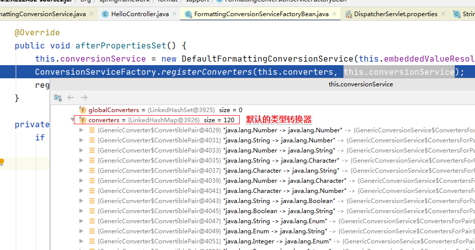

# day44_SpringMVC

# 学习目标

- [ ] 了解SpringMVC框架
- [ ] 能够实现SpringMVC的环境搭建 
- [ ] 掌握RequestMapping的使用
- [ ] 掌握SpringMVC的参数绑定  
- [ ] 掌握SpringMVC的自定义类型转换器的使用 
- [ ] 掌握SpringMVC的常用注解

# 第一章-SpringMVC入门

## 知识点-概述

### 1. 目标

- [ ] 能够了解什么是SpringMVC

### 2. 路径

1.  三层架构
2. SpringMVC介绍

### 3. 讲解

#### 3.1 三层架构


**服务器端程序，一般都基于两种形式，一种C/S架构程序，一种B/S架构程序. 使用Java语言基本上都是开发B/S架构的程序，B/S架构又分成了三层架构**

- 三层架构

  ​	表现层：WEB层，用来和客户端进行数据交互的。表现层一般会采用MVC的设计模型

  ​	业务层：处理公司具体的业务逻辑的

  ​	持久层：用来操作数据库的

- MVC全名是Model View Controller 模型视图控制器，每个部分各司其职。

  ​	Model：数据模型，JavaBean的类，用来进行数据封装。   

  ​	View：指JSP、HTML用来展示数据给用户				   

  ​	Controller：用来接收用户的请求，整个流程的控制器。用来进行数据校验等(Hibernate Validator)

#### 3.2 SpringMVC

##### 3.2.1 概述

* SpringMVC是一种基于Java的、实现MVC设计模型的、请求驱动类型的(基于HTTP协议)、轻量级Web框架，属于 Spring FrameWork 的后续产品。Spring 框架提供了构建 Web 应用程序的全功能 MVC 模块。 
* SpringMVC已经成为目前最主流的 MVC 框架之一，并且随着Spring3.0的发布，全面超越 Struts2，成为最优秀的 MVC(web层的) 框架。 
* 它通过一套注解，让一个简单的Java类成为处理请求的控制器，而无须实现任何接口（跟Servlet对比）。同时它还支持RESTful编程风格的请求。

##### 3.2.2 SpringMVC的优点

1.清晰的角色划分：
	前端控制器（DispatcherServlet）  
	请求到处理器映射（HandlerMapping）
	处理器适配器（HandlerAdapter）
	视图解析器（ViewResolver）
	处理器或页面控制器（Controller）
	验证器（ Validator）
	命令对象（Command 请求参数绑定到的对象就叫命令对象）
	表单对象（Form Object 提供给表单展示和提交到的对象就叫表单对象）。
2、分工明确，而且扩展点相当灵活，可以很容易扩展，虽然几乎不需要。
3、由于命令对象就是一个 POJO， 无需继承框架特定 API，可以使用命令对象直接作为业务对象。
4、和 Spring 其他框架无缝集成，是其它 Web 框架所不具备的。
5、可适配，通过 HandlerAdapter 可以支持任意的类作为处理器。
6、可定制性， HandlerMapping、 ViewResolver 等能够非常简单的定制。
7、功能强大的数据验证、格式化、绑定机制。
8、利用 Spring 提供的 Mock 对象能够非常简单的进行 Web 层单元测试。
9、本地化、主题的解析的支持，使我们更容易进行国际化和主题的切换。
10、强大的 JSP 标签库，使 JSP 编写更容易。
………………还有比如RESTful风格的支持、简单的文件上传、约定大于配置的契约式编程支持、基于注解的零配
置支持等等。 

### 4. 小结

1. Spring MVC 是Spring开发的关于Web层的框架
2. 它的作用：接收请求，调用service，响应结果

## 案例-快速入门【重点】

### 1.需求

- [ ] 浏览器请求服务器(SpringMVC), 响应成功页面

### 2. 分析

1. 创建maven工程，导入依赖
2. 创建Controller, 处理的请求
3. 创建一个index.jsp页面, success.jsp
4. 配置springmvc.xml
5. 配置web.xml 启动时加载springmvc.xml

### 3. 实现

#### 3.1 导入依赖

```xml
<dependencies>
    <!--springmvc-->
    <dependency>
        <groupId>org.springframework</groupId>
        <artifactId>spring-webmvc</artifactId>
        <version>5.0.2.RELEASE</version>
    </dependency>
    <!--servlet-api-->
    <dependency>
        <groupId>javax.servlet.jsp</groupId>
        <artifactId>javax.servlet.jsp-api</artifactId>
        <version>2.3.1</version>
        <scope>provided</scope>
    </dependency>
    <!--jsp-api-->
    <dependency>
        <groupId>javax.servlet</groupId>
        <artifactId>javax.servlet-api</artifactId>
        <version>3.1.0</version>
        <scope>provided</scope>
    </dependency>
</dependencies>
```

#### 3.2 编写页面

> 在webapp里创建`index.jsp`

```html
<%--
  Created by IntelliJ IDEA.
  User: xiaomi
  Date: 2021/6/2
  Time: 9:06
  To change this template use File | Settings | File Templates.
--%>
<%@ page contentType="text/html;charset=UTF-8" language="java" %>
<html>
<head>
    <title>Title</title>
</head>
<body>

<a href="sayHi">点我发起请求</a>

</body>
</html>

```

> 在webapp里创建`success.jsp`

```html
<%--
  Created by IntelliJ IDEA.
  User: xiaomi
  Date: 2021/6/2
  Time: 9:07
  To change this template use File | Settings | File Templates.
--%>
<%@ page contentType="text/html;charset=UTF-8" language="java" %>
<html>
<head>
    <title>Title</title>
</head>
<body>
<h2>这是成功的页面！</h2>
</body>
</html>

```

#### 3.3 编写Controller

* 在`com.itheima.controller`包中创建类`Controller01`
* 类上增加`@Controller`注解，声明成为一个bean
* 创建`sayHi方法`，并在方法上增加`@RequestMapping`注解，声明方法的访问路径

```java
package com.itheima.controller;

import org.springframework.stereotype.Controller;
import org.springframework.web.bind.annotation.RequestMapping;

@Controller
public class Controller01 {

    @RequestMapping("/sayHi")
    public String sayHi(){
        System.out.println("执行了Controller01的sayHi方法~！~");
        //返回页面
        return "success.jsp";
    }

}
```

#### 3.4 编写配置文件

> 在`resources`中创建springmvc的配置文件`springmvc.xml`  , 这个名字可以随意，也可以写成前几天的 `applicationContext.xml`

```xml
<?xml version="1.0" encoding="UTF-8"?>
<beans xmlns="http://www.springframework.org/schema/beans"
       xmlns:context="http://www.springframework.org/schema/context"
       xmlns:mvc="http://www.springframework.org/schema/mvc"
       xmlns:xsi="http://www.w3.org/2001/XMLSchema-instance"
       xsi:schemaLocation="http://www.springframework.org/schema/beans
        http://www.springframework.org/schema/beans/spring-beans.xsd
        http://www.springframework.org/schema/context
        http://www.springframework.org/schema/context/spring-context.xsd
        http://www.springframework.org/schema/mvc
        http://www.springframework.org/schema/mvc/spring-mvc.xsd">

    <!--开启组件扫描-->
    <context:component-scan base-package="com.itheima"/>
</beans>
```

#### 3.5 修改Web.xml

> 在`webapp/WEB-INF/web.xml`中配置前端控制器`DispatcherServlet`

```xml
<?xml version="1.0" encoding="UTF-8"?>
<web-app xmlns:xsi="http://www.w3.org/2001/XMLSchema-instance"
	xmlns="http://java.sun.com/xml/ns/javaee"
	xsi:schemaLocation="http://java.sun.com/xml/ns/javaee http://java.sun.com/xml/ns/javaee/web-app_2_5.xsd"
	version="2.5">

	<!--
		配置DispatcherServlet
			1. DispatcherServlet 是SpringMVC的核心，让它在最早的时机，执行初始化
			2. load-on-startup 必须要写，然后值 要写成 1.
			3. 配置初始化参数
				contextConfigLocation ： 这是固定的名字
				classpath:springmvc.xml ： 这是用来指定配置文件在哪里。
				只要项目启动了，那么DispatcherServlet就会解析 springmvc.xml文件
	-->
	<servlet>
		<servlet-name>dispatcher</servlet-name>
		<servlet-class>org.springframework.web.servlet.DispatcherServlet</servlet-class>


		<!--告诉DispatcherServlet，我们的配置文件在哪里？ 因为DispatcherServlet会解读配置文件-->
		<init-param>
			<param-name>contextConfigLocation</param-name>
			<param-value>classpath:springmvc.xml</param-value>
		</init-param>


		<!--让DispatcherServlet初始化提前-->
		<load-on-startup>1</load-on-startup>
	</servlet>
	<!--
		1. 这里的DispatcherServlet映射的地址路径为什么不写成 *.do
			其实也可以写成*.do, 只是我们用起来不方便，因为所有的请求都要带上.do 尾巴
		2. 为什么也不写成 /* 呢？
			2.1 在tomcat里面有一个servlet，名叫：JspServlet，它能处理jsp页面。它的映射地址是 *.jsp
			2.2 如果DispatcherServlet 映射成了 /*  那么 我们的优先级更高。
			2.3 /* 属于目录匹配方式 *.jsp 属于后缀名匹配， 目录匹配的优先级更高。
			2.4 这就会出现一种情况，当我们真的来请求一个jsp页面的时候， 原来的tomcat里面的JspServlet 收
				不到这个请求，请求被	DispatcherServlet 收到了。但是DispatcherServlet 不能处理jsp资源
				所以会报错！

		3. 为什么写成 /  ，它是什么意思？
			3.1 / 属于缺省配置，优先级是最低的， 它比 *.do | *.jsp 扩展名匹配还低。
			3.2 配置成 / 的用意主要还是为了确保 jsp页面能够正常的被Tomcat里面的JspServlet处理。
	-->
	<servlet-mapping>
		<servlet-name>dispatcher</servlet-name>
		<url-pattern>/</url-pattern>
	</servlet-mapping>

</web-app>
```

#### 3.6 运行测试

* 启动项目，点击首页的超链接访问Controller
* `sayHi`方法被访问到，并且页面跳转到了`success.jsp`

### 4. 小结

1. 创建web工程，导入依赖：`spring-webmvc, servlet-api, jsp-api`
2. 编写Controller
3. 提供springmvc.xml：开启组件扫描
4. 修改web.xml：配置前端控制器DispatcherServlet

## 知识点-配置详解

### 1. 目标

- [ ] 掌握入门案例执行流程

- [ ] 掌握入门案例的配置

### 2. 路径

1. 原理分析
2. springmvc.xml的配置
3. web.xml的配置
4. controller的配置

### 3. 讲解

#### 3.1. 原理分析

##### 3.1.1 请求响应流程


##### 3.1.2 三大组件

* `HandlerMapping`处理器映射器
  * 作用：根据客户端请求的资源路径，查找匹配的`Controller`及拦截器（类似过滤器）链
* `HandlerAdapter`处理器适配器
  * 作用：用于适配调用不同的`Controller` 执行Controller，得到模型和视图
* `ViewResolver`视图解析器
  * 作用：用于解析视图，根据视图路径找到真实视图（页面）

##### 3.1.3 详细执行流程

1. 客户端发请求到`DispatcherServlet`
2. `DispatcherServlet`
   1. 通过`HandlerMapping`处理器映射器，根据请求路径，查找匹配的`Controller`及拦截器
   2. 得到要执行的`Controller`和拦截器（执行链）
3. `DispatcherServlet`
   1. 通过`HandlerAdapter`处理器适配器，调用控制器`Controller`
   2. 得到`ModelAndView`对象（其中View指视图路径，Model要响应的数据对象）
4. `DispatcherServlet`
   1. 通过`ViewResolver`解析视图，得到真实视图（视图路径对应的页面）
   2. 渲染视图（把Model里的数据填充到View里）
5. 把最终渲染的结果，响应到客户端

#### 3.2. springmvc.xml的配置 

> 跟前几天的 `applicationContext.xml` 是一样的。只是换了个名字而已。**springmvc和spring可以共用同一个配置文件！**

##### 3.2.1 基本配置示例

```xml
<!--开启组件扫描-->
<context:component-scan base-package="com.itheima.controller"/>

<!--开启mvc的注解驱动-->
<mvc:annotation-driven/>

<!--视图解析器-->
<bean class="org.springframework.web.servlet.view.InternalResourceViewResolver">
    <property name="prefix" value="/"/>
    <property name="suffix" value=".jsp"/>
</bean>

<!-- 静态资源的配置：让SpringMVC不处理静态资源 -->
<mvc:default-servlet-Handler/>
```

##### 3.2.2 mvc的注解驱动

###### 配置语法

```xml
    <!--
        2. 配置mvc注解驱动开关
            不要导错了，如果导入了cache约束文件，那么就会报这个错 No bean named 'cacheManager' available

            在入门代码里面不写这个配置也可以，但是后面的课程中，使用到了其他的注解，所以这个开关|标签，最好
            都写上。
    -->
    <mvc:annotation-driven/>
```

###### 配置说明

- 在SpringMVC中，处理器映射器，处理器适配器，视图解析器 被称为三大组件
- 在springmvc.xml中配置`<mvc:annotation-driven/>`标签，可以加载SpringMVC的组件
  - 如果没有此项配置，SpringMVC也会自动加载组件，所以快速入门中，不配置这一项也可以
  - 但是后边课程中，这个标签还有其它作用，所以要配置上

##### 3.2.3 视图解析器设置

###### 1) 视图路径的配置方式

- SpringMVC把显示层的内容（页面）称为视图，例如JSP|HTML页面就是视图。**在`Controller`的方法中，返回的字符串就是跳转的视图（页面）路径**
- 视图的路径有两种写法：
  - 物理视图：`/success.jsp | success.jsp` ，即：视图的真实路径（完整路径）
    - 直观，但是写起来麻烦
    - 例如： 如果有一个页面page.jsp 位于 /webapp/a/b/c/page.jsp , 那么物理视图返回： "/a/b/c/page.jsp"; 
  - 逻辑视图：`success`，需要配合视图解析器，才能得到真实路径
    - 不直观，但是写起来简单
    - 例如： 如果有一个页面page.jsp 位于 /webapp/a/b/c/page.jsp  , 那么逻辑视图返回： "page"

###### 2) 物理视图的配置方式

* 在`Controller`的方法中，直接返回物理视图路径。
* **不需要**配置视图解析器

```java
    /*
        物理视图的写法：完整路径
            优点： 直观，一看就知道是哪个页面，这个页面在哪个位置下。
            缺点： 如果页面位于多级目录下，那么这里的返回值就要连着写很多的目录结构
                比如：return "/a/b/c/d/success.jsp";
     */
    @RequestMapping("/sayHi02")
    public String sayHi02(){
        System.out.println("执行了Controller01的sayHi02方法~！~");
        //返回页面
        return "/success.jsp";
        //return "success.jsp";
    }
```

###### 3) 逻辑视图的配置方式

- 在`springmvc.xml`中增加以下内容：

```xml
<!--
        3. 配置视图解析器
            1. 需要指定前缀和和后缀。
            2. 这个前缀和后缀会和我们的方法的返回值，组成页面的完整路径
            3. 视图解析器配置了之后，即影响全局的所有路径设置。以前的物理视图的写法，也会主动
                加上前缀和后缀。
    -->
    <bean class="org.springframework.web.servlet.view.InternalResourceViewResolver">
        <property name="prefix" value="/"/>
        <property name="suffix" value=".jsp"/>
    </bean>
```

- 在`Controller`中修改代码，简化方法返回值

```java
  /*
        返回页面： 逻辑视图的写法
            优点： 简单，方便，快捷，
            缺点： 不直观，看名字不知道它在哪个位置下，也不知道这个文件的后缀面是 .jsp还是.html
                需要配合视图解析器来用

     */
    @RequestMapping("/sayHi03")
    public String sayHi03(){
        System.out.println("执行了Controller01的sayHi03方法~！~");
        //返回页面
        return "success";
    }
```

- 由视图解析器，帮我们把`prefix + "success" + suffix`，拼接成物理视图`/success.jsp`

##### 3.2.4 处理静态资源

###### 2.4.1 请求静态资源的说明

* 使用SpringMVC时，客户端访问静态资源时，会访问不到

* Tomcat本身具备处理静态资源的能力，但是我们配置的`DispatcherServlet`把Tomcat的默认处理器覆盖掉了；而`DispatcherServlet`没有处理静态资源的能力，所以：访问不到静态资源

  Tomcat里面有一个Servlet，可以处理静态资源：  DefaultServlet，它的映射路径是  /
  
  我们使用SpringMVC的时候，在web.xml中，配置DispatcherServlet，配置的地址路径也是  /
  
  

###### 2.4.2 两种配置方式解决问题

**方案一：指定静态资源的位置**

* 针对客户端对静态资源的请求，指定资源所在的位置。让SpringMVC直接去指定目录下加载
* 示例：

```xml
<!--4. 配置静态资源-->
    
    <!--
        4.1 我们自己处理，告诉springmvc，静态资源在什么文件夹里面，以后什么样的请求来了，就去对应的文件夹里面找资源响应
            mvc:resources : 是用来配置请求地址和资源的路径映射关系的
                mapping : 请求的地址
                    a. 可以直接写完整的名字  /js/my.js
                    b. 可以写匹配的任意字符 /js/*    * 只能表示一级地址
                    c. 要想匹配任意路径， /js/**     **表示任意地址路径，可以有多级路径
                location : 资源的位置 后面的地址的  /  不能省略掉

     -->
    <mvc:resources mapping="/js/**" location="/js/"/>
    <mvc:resources mapping="/css/**" location="/css/"/>
    <mvc:resources mapping="/html/**" location="/html/"/>
```

**方案二：由Tomcat处理静态资源(推荐)**

* 如果客户端请求了静态资源，DispatcherServlet处理不了，就交给Tomcat的原生Servlet来处理
* 示例：

```xml
    <!--4.2 把静态资源的处理，交给tomcat来处理，我们不处理-->
    <mvc:default-servlet-handler/>
```

##### 小结

* 配置视图解析器

  * Controller里的方法返回值要写逻辑视图
  * 再配置视图解析器

  ```xml
   <bean class="org.springframework.web.servlet.view.InternalResourceViewResolver">
       <property name="prefix" value="/pages/"/>
       <property name="suffix" value=".jsp"/>
  </bean>
  ```
  
* 如果有静态资源要访问，把静态资源仍然交给Tomcat处理

  ```xml
  <mvc:default-servlet-handler/>
  ```

* 开启mvc的注解驱动：会注册一些组件，提供一些功能

  ```xml
  <mvc:annotation-driven/>
  ```

* 开启组件扫描

  ```xml
  <context:component-scan base-pcakge="com.itheima.controller"/>
  ```


#### 3.3. web.xml的配置

##### 3.3.1 配置示例

```xml
<?xml version="1.0" encoding="UTF-8"?>
<web-app xmlns:xsi="http://www.w3.org/2001/XMLSchema-instance"
	xmlns="http://java.sun.com/xml/ns/javaee"
	xsi:schemaLocation="http://java.sun.com/xml/ns/javaee http://java.sun.com/xml/ns/javaee/web-app_2_5.xsd"
	version="2.5">

	<!--
		配置DispatcherServlet
			1. DispatcherServlet 是SpringMVC的核心，让它在最早的时机，执行初始化
			2. load-on-startup 必须要写，然后值 要写成 1.
			3. 配置初始化参数
				contextConfigLocation ： 这是固定的名字
				classpath:springmvc.xml ： 这是用来指定配置文件在哪里。
				只要项目启动了，那么DispatcherServlet就会解析 springmvc.xml文件
	-->
	<servlet>
		<servlet-name>dispatcher</servlet-name>
		<servlet-class>org.springframework.web.servlet.DispatcherServlet</servlet-class>


		<!--告诉DispatcherServlet，我们的配置文件在哪里？ 因为DispatcherServlet会解读配置文件-->
		<init-param>
			<param-name>contextConfigLocation</param-name>
			<param-value>classpath:springmvc.xml</param-value>
		</init-param>


		<!--让DispatcherServlet初始化提前-->
		<load-on-startup>1</load-on-startup>
	</servlet>
	<!--
		1. 这里的DispatcherServlet映射的地址路径为什么不写成 *.do
			其实也可以写成*.do, 只是我们用起来不方便，因为所有的请求都要带上.do 尾巴
		2. 为什么也不写成 /* 呢？
			2.1 在tomcat里面有一个servlet，名叫：JspServlet，它能处理jsp页面。它的映射地址是 *.jsp
			2.2 如果DispatcherServlet 映射成了 /*  那么 我们的优先级更高。
			2.3 /* 属于目录匹配方式 *.jsp 属于后缀名匹配， 目录匹配的优先级更高。
			2.4 这就会出现一种情况，当我们真的来请求一个jsp页面的时候， 原来的tomcat里面的JspServlet 收
				不到这个请求，请求被	DispatcherServlet 收到了。但是DispatcherServlet 不能处理jsp资源
				所以会报错！

		3. 为什么写成 /  ，它是什么意思？
			3.1 / 属于缺省配置，优先级是最低的， 它比 *.do | *.jsp 扩展名匹配还低。
			3.2 配置成 / 的用意主要还是为了确保 jsp页面能够正常的被Tomcat里面的JspServlet处理。
	-->
	<servlet-mapping>
		<servlet-name>dispatcher</servlet-name>
		<url-pattern>/</url-pattern>
	</servlet-mapping>

</web-app>
```

##### 3.3.2 配置说明

* `load-on-startup`：配置Servlet的创建时机，值是整数
  * 如果是正整数，表示服务器一启动就要创建Servlet对象。数值越小，创建的越早
  * 如果是0或者负数，表示默认的：第一次访问时，创建Servlet对象
  * `DispatcherServlet`是SpringMVC一切功能的基础和核心，要求：服务器启动时就创建，并且要最早创建，所以设置值为1
* `init-param`：配置Servlet的初始化参数
  * `contextConfigLocation`：配置springmvc.xml的路径，让DispatcherServlet被创建时，加载配置文件，初始化Spring容器
* `url-pattern`：配置Servlet的路径，通常配置为`/`

##### 拓展：`DispatcherServlet`配置成`/`和`/*`的区别：

* 对JSP的处理不同。当客户端请求了`xxx.jsp`时

* 如果`DispatcherServlet`配置的是`/*`，不能正常访问JSP
  * `/*`是目录匹配，优先级高于扩展名匹配（Tomcat里有`JspServlet`，路径是`*.jsp`）
  * 必定是由`DispatcherServlet`来处理JSP，但是DispatcherServlet不具备查找和处理jsp的能力，会报错
  
* 如果`DispatcherServlet`配置的是`/`，可以正常访问JSP
  * `/`是缺省匹配，优先级低于扩展名匹配（Tomcat里有`JspServlet`，路径是`*.jsp`）
  * 必定是由Tomcat来处理JSP，Tomcat本身具备查找和处理JSP的能力，可以正常访问JSP
  
  完全路径匹配  >  目录匹配  > 扩展名匹配 > 缺省匹配
  
  /aa   >  /*  > *.do >  /


#### 3.4. controller的配置

##### 3.4.1 配置示例

```java


/*
    @Controller
        作用： 仅仅是为了让spring把这个类给托管起来，没有别的用意。
    @RequestMapping
        作用： 用于设置请求地址路径，也就是什么样的请求地址，能够执行对应的方法。
        属性：
            value |  path : 指的就是请求的地址是什么
            method : 请求方式，指定什么样的请求方式，能够到达这个方法，默认get和post都可以
            params: 表示请求一定要携带具体的参数过来，否则即报错
         位置：
            1. 可以写在方法上，也可以写类身上,要想写在类身上，必须方法上也要有。
            2. 写在类上，主要是为了做区分，跟其他的controller做进一步区分。模块化管理。
 */

@Controller
public class Controller01 {


    @RequestMapping( value = "/sayHi04" , method = RequestMethod.GET , params = "username")
    public String sayHi04(){
        System.out.println("执行了Controller01的sayHi04方法~！~");
        return "success";
    }
}
```

##### 3.4.2 配置说明

> `@RequestMapping`注解 ， 通常用在`Controller`里，用于设置访问路径

* 注解语法

```java
@RequestMapping(
	value="访问路径",
    method=请求方式,
    params="请求参数"
)
```

* 常用属性：
  * value/path：访问路径，即：什么路径能够访问到这个方法
  * method：请求方式，即：什么请求方式能够访问这个方法。从枚举`RequestMethod`中取值
    * `RequestMethod.POST`：必须是POST方式，才可以访问到
    * `RequestMethod.GET`：必须是GET方式，才可以访问到
  * params：请求参数，即：请求携带了什么样的参数能够访问这个方法（了解）
    * `params="username"`：必须提交了 名称为username的表单参数，才可以访问
    * `params="username=tom"`：必须提交了 名称为username、值为tom的表单参数，才可以访问
    * `params="username!=tom"`：提交了表单参数  名称为username、值不是tom， 才可以访问
* 如果注解用在Controller类上
  * 表示设置访问路径的一级目录，要和方法上的路径组装成访问路径。用于模块化管理，例如：
    * 类上有注解`@RequestMapping("/user")`
    * 类里方法上有注解`@RequestMapping("/save")`
    * 那么方法的访问路径是：`/user/save`


# 第二章-获取请求数据【重点】

## 知识点-请求参数的绑定

### 1.目标

- [ ] 掌握请求参数的获取

### 2.路径

1. 绑定机制
2. 支持的数据类型
3. 使用要求

### 3.讲解

+ 绑定机制

  表单提交的数据都是key=value格式的(username=zs&password=123),  SpringMVC的参数绑定过程是把表单提交的请求参数，作为控制器中方法的参数进行绑定的(要求：提交表单的name和方法的参数的名称是相同的)

+ 支持的数据类型

  ​	基本数据类型和字符串类型

  ​	实体类型（JavaBean）

  ​	集合数据类型（List、map集合等）

+ 使用要求

  + 如果是基本类型或者 String 类型： 要求我们的参数名称必须和controller中方法的形参名称保持一致。 (严格区分大小写) .
  
  + 如果是 对象 类型，或者它的关联对象： 要求表单中参数名称和 POJO 类的属性名称保持一致。并且controller中方法的参数类型是 POJO 类型 .  传递过来的参数的名字必须和javabean里面的属性名一样
  
  + 如果是集合类型,有两种方式： 
    + 第一种：要求集合类型的请求参数必须在 POJO 中。在表单中请求参数名称要和 POJO 中集合属性名称相同。给 List 集合中的元素赋值， 使用下标。给 Map 集合中的元素赋值， 使用键值对。
  
    + 第二种：**接收的请求参数是 json 格式数据。需要借助一个注解实现  @RequestBody**

### 4.小结

1. 绑定机制

> SpringMVC的参数绑定过程是把表单提交的请求参数，作为controller里面方法的参数进行绑定的。

2. 支持的数据类型 : 

> ​	基本数据类型和字符串类型
>
> ​	实体类型（JavaBean）
>
> ​	集合数据类型（List、map集合等）

3. 使用要求： 名字需要一样

## 知识点-获取请求参数

### 1.目标

- [ ] 掌握简单参数的获取

### 2.路径

1. 基本类型和String
2. 对象类型
3. 数组
4. 对象包含属性

### 3.讲解

#### 3.1 基本类型和String

* 说明
  * **客户端提交的表单参数名称， 和Controller里方法参数名称相同**
  * SpringMVC会自动绑定同名参数，并自动转换类型
* 页面

* index.jsp

```html
<%--
  Created by IntelliJ IDEA.
  User: xiaomi
  Date: 2021/5/10
  Time: 11:17
  To change this template use File | Settings | File Templates.
--%>
<%@ page contentType="text/html;charset=UTF-8" language="java" %>
<html>
<head>
    <title>Title</title>
</head>
<body>

<h2>提交简单的参数：</h2>
<form action="getSimpleParams">
    用户名: <input type="text" name="username"/><br/>
    密  码: <input type="text" name="password"/><br/>
    <input type="submit">
</form>

</body>
</html>

```

* success.jsp

```html
<%--
  Created by IntelliJ IDEA.
  User: xiaomi
  Date: 2021/6/2
  Time: 11:37
  To change this template use File | Settings | File Templates.
--%>
<%@ page contentType="text/html;charset=UTF-8" language="java" %>
<html>
<head>
    <title>Title</title>
</head>
<body>

<h2>这是成功的页面~</h2>
</body>
</html>

```

* controller

```java
@Controller
public class Controller01 {

    /*
        获取简单的请求参数
         要求：
            方法的形参的名字，必须和页面提交过来的name属性的值一样。
             用户名: <input type="text" name="username"/><br/>
     */
    @RequestMapping("/getSimpleParams")
    public String getSimpleParams(String username , String password){
        System.out.println(username + "=" + password);
        return "success";
    }
}

```

#### 3.2  对象类型

> SpringMVC会帮我们自动把表单参数，封装成POJO对象，但是要求：
>
> * 客户端提交的表单参数名称，必须等于JavaBean的属性名

* Pojo(Account)

```java
package com.itheima.bean;

import lombok.Data;

@Data
public class Account {
    private int id;
    private String name;
    private int money;
}

```

* 前端页面

```html

<h2>提交对象的参数：</h2>
<form action="getObjectParams">
    姓  名: <input type="text" name="name"/><br/>
    金  额: <input type="text" name="money"/><br/>
    <input type="submit">
</form>
```

* controller

```java
  /*
        获取对象参数
            要求：
               1. 方法形参必须是对象类型
               2. 页面的name属性的值必须和对象类里面的属性名字一样。否则接收不到数据。
     */
    @RequestMapping("/getObjectParams")
    public String getObjectParams(Account a){
        System.out.println("a=" + a);
        return "success";
    }
```

#### 3.3 数组

> 注：只能用数组来接前端多个参数，不能用List集合。确实需要List集合接收时，使用包装user.list

* 页面

```html

<h2>提交数组的参数：</h2>
<form action="getArrayParams">
    爱好：
        <input type="checkbox" name="hobby" value="抽烟">抽烟
        <input type="checkbox" name="hobby" value="喝酒">喝酒
        <input type="checkbox" name="hobby" value="烫头">烫头
    <input type="submit">
</form>
```

* Controller01

```java
  /*
        获取数组参数
            要求：
                1. 方法参数的名字，必须和页面的name属性的值一样。
     */
    @RequestMapping("/getArrayParams")
    public String getArrayParams(String [] hobby){
        System.out.println("hobby=" + Arrays.toString(hobby));
        return "success";
    }
```

#### 3.4 对象包含集合

##### 3.4.1 对象中包含对象

* 对象

```java
@Data
public class Address {
    private String province;
    private String city;
}


@Data
public class Account02 {
    private int id;
    private String name;
    private int money;

    //表示这个账户的地址信息 （省 + 城市）
   private Address address;

}
```

* 页面

```html

<h2>提交对象包含对象的参数：</h2>
<form action="getObjectInObjectParams">
    姓  名: <input type="text" name="name"/><br/>
    金  额: <input type="text" name="money"/><br/>

    省  份: <input type="text" name="province"/><br/>
    城  市: <input type="text" name="city"/><br/>

    <input type="submit">
</form>
```

* Controller01

```java
 /*
        获取对象包含对象的参数
            要求：
                1. 方法的形参必须是最终要包装出来的对象类型
                2. 页面里面的name属性的值必须要和类里面的属性一样。
                3. 如果希望把页面的某个数据封装到内部对象里面的属性去，那么name的属性需要写成这样
                    name="对象属性.属性"  如： name="address.city"
     */
    @RequestMapping("/getObjectInObjectParams")
    public String getObjectInObjectParams(Account02 a){
        System.out.println("a=" + a);
        return "success";
    }

```


##### 3.4.2 对象中包含List

+ User

```java
package com.itheima.bean;

import lombok.Data;

import java.util.List;

@Data
public class User {
    private int id ;
    private String name;
    private int age ;

    //账户信息
    private List<Account> accountList;
}
```

+ 前端页面

```html

<h2>提交对象包含List的参数：</h2>
<form action="getListInObjectParams">
    姓  名: <input type="text" name="name"/><br/>
    年  龄: <input type="text" name="age"/><br/>

    第一个账户的名称: <input type="text" name="accountList[0].name"/><br/>
    第一个账户的金额: <input type="text" name="accountList[0].money"/><br/>

    第二个账户的名称: <input type="text" name="accountList[1].name"/><br/>
    第二个账户的金额: <input type="text" name="accountList[1].money"/><br/>

    <input type="submit">
</form>
```

+ Controller01.java

```java
  /*
        对象包含List集合
            要求：
                1. 方法的形参必须是对象类型
                2. 页面的name属性赋值的时候，需要使用 集合属性[下标].对象属性的方式赋值
     */
    @RequestMapping("/getListInObjectParams")
    public String getListInObjectParams(User user){
        System.out.println("user=" + user);
        return "success";
    }
```

##### 3.4.3 对象中包含Map

+ User02.java

```java
package com.itheima.bean;

import lombok.Data;

import java.util.List;
import java.util.Map;

@Data
public class User02 {
    private int id ;
    private String name;
    private int age ;

    //账户信息
    private Map<String , Account> accountMap;
}

```

+ 页面

```html
<h2>提交对象包含Map的参数：</h2>
<form action="getMapInObjectParams" method="post">
    姓  名: <input type="text" name="name"/><br/>
    年  龄: <input type="text" name="age"/><br/>

    第一个账户的名称: <input type="text" name="accountMap['aa'].name"/><br/>
    第一个账户的金额: <input type="text" name="accountMap['aa'].money"/><br/>

    第二个账户的名称: <input type="text" name="accountMap['bb'].name"/><br/>
    第二个账户的金额: <input type="text" name="accountMap['bb'].money"/><br/>

    <input type="submit">
</form>
```

+ Controller01.java

```java
 /*
        获取对象包含Map集合

     */
    @RequestMapping("/getMapInObjectParams")
    public String getMapInObjectParams(User02 user){
        System.out.println("user=" + user);
        return "success";
    }
```

### 4.小结

1. 请求参数类型是简单(基本,String)类型

   + 方法的形参和请求参数的name一致就可以

2. 请求参数类型是pojo对象类型

   + 形参就写pojo对象
   + pojo的属性必须和请求参数的name一致就可以

3. 请求参数类型是pojo对象类型, 包含集合

   + 形参就写pojo对象
   + pojo的属性必须和请求参数的name一致就可以
   + 如果包含对象, 页面的name属性=对象属性名.自己属性
   + 如果包含List,  页面上的name属性=list的属性名[下标].pojo属性名
   + 如果包含map,  面上的name属性=map的属性名[key].pojo属性名

4. 提交数组，只能用数组接收，多个参数的参数名一致，参数要与controller中的参数名一致。

   ​	不能直接提交List与map集合, 需要通过其它方式转换(fastjson)

## 知识点-细节处理和特殊情况

### 1.目标

- [ ] 掌握乱码处理和自定义类型转换器

### 2.路径

1. 请求参数乱码处理
2. 自定义类型转换器
3. 使用 ServletAPI 对象作为方法参数

### 3.讲解

#### 3.1 请求参数乱码

> 如果请求参数或者响应中有中文就会乱码。在web阶段，我们通过一个自定义的过滤器实现了统一乱码解决
>
> 现在SpringMVC本身 ，也给我们提供了一个过滤器`CharacterEncodingFilter`，用于解决乱码问题 。 只有在post请求才会有中文乱码，如果tomcat  >  8.5的版本，那么tomcat已经帮助修复了get请求的中文乱码。

* 在web.xml里面配置编码过滤器

```xml
<!--
		配置过滤器，解决中文乱码问题
			1. 配置了之后，需要加上初始化参数。encoding
			2. 参数的名字 encoding 是固定写法，  ， 参数的值一般就写 utf-8
	-->
	<filter>
		<filter-name>char</filter-name>
		<filter-class>org.springframework.web.filter.CharacterEncodingFilter</filter-class>
		
		<init-param>
			<param-name>encoding</param-name>
			<param-value>utf-8</param-value>
		</init-param>
	</filter>
	<filter-mapping>
		<filter-name>char</filter-name>
		<url-pattern>/*</url-pattern>
	</filter-mapping>
```

#### 3.2 自定义类型转换器

> 默认情况下,SpringMVC已经实现一些数据类型自动转换。 内置转换器全都在：		`org.springframework.core.convert.support ` 包下 ,如遇特殊类型转换要求，需要我们自己编写自定义类型转换器。 

)


##### 3.2.1 场景 

+ 页面

```html

<br/>
<h2>提交包含日期的参数：</h2>
<form action="getDateParams" method="get">
    用户名: <input type="text" name="username"/><br/>
    密  码: <input type="text" name="password"/><br/>
    生  日: <input type="date" name="birthday"/><br/>

    <input type="submit">
</form>
```

+ User03

```java
package com.itheima.bean;

import lombok.Data;

import java.util.Date;

@Data
public class User03 {
    private String username;
    private String password;
    private Date birthday;
}


```

+ Controller02.java

```java
package com.itheima.controller;

import com.itheima.bean.User03;
import org.springframework.stereotype.Controller;
import org.springframework.web.bind.annotation.RequestMapping;

import java.text.SimpleDateFormat;

@Controller
public class Controller02 {

    @RequestMapping("/getDateParams")
    public String getDateParams(User03 user){
        System.out.println("user=" + user);


        SimpleDateFormat sf = new SimpleDateFormat("yyyy-MM-dd");
        String birthday = sf.format(user.getBirthday());
        System.out.println("birtyday=" + birthday);

        return "success";
    }
}
```

+ 报错了:


##### 3.2.2 自定义类型转换器

步骤:

1. 创建一个类实现Converter 接口
2. 配置类型转换器

实现:

+ 定义一个类，实现 Converter 接口

  该接口有两个泛型,S:表示接受的类型， T：表示目标类型(需要转的类型)

```java
package com.itheima.converter;

import lombok.SneakyThrows;
import org.springframework.core.convert.converter.Converter;

import java.text.ParseException;
import java.text.SimpleDateFormat;
import java.util.Date;

/*
    1. 这是自定义的类型转换器， 实现Converter接口
    2. Converter里面的两个泛型，即表示： 源数据的类型 和 目标数据的类型。
 */
public class DateConverter implements Converter<String , Date> {

    /**
     * 用于转化数据
     * @param s  页面传递过来的源数据，字符串
     * @return 要转化出来的日期对象数据。
     */
    public Date convert(String s) {  //String s = "2020-10-10"

        try {
            //1. 创建SimpleDateFormat
            SimpleDateFormat sf = new SimpleDateFormat("yyyy-MM-dd");

            //2. 转化
            return sf.parse(s);
        } catch (ParseException e) {
            e.printStackTrace();
        }
        //转化不了就返回null
        return null;
    }
}

```

+ 在springmvc.xml里面配置转换器

  spring 配置类型转换器的机制是，将自定义的转换器注册到类型转换服务中去 

```xml
  <!--2. 打开注解驱动-->
 <!-- 在 annotation-driven 标签中引用配置的类型转换服务  -->
    <mvc:annotation-driven conversion-service="cs"/>


	<!--
        注册类型转换器
            1. 让spring托管这个ConversionServiceFactoryBean
            2. 它里面有一个属性converters 这是一个set集合，
            3. 我们可以给这个set集合注入值，注入的就是我们自己写好的类型转化器的对象。
     -->
    <bean id="cs" class="org.springframework.context.support.ConversionServiceFactoryBean">
        <property name="converters">
            <set>
                <bean class="com.itheima.converter.DateConverter"/>
            </set>
        </property>
    </bean>
```

#### 3.3  使用原始Servlet的API

##### 3.3.1 说明

* 在Controller的方法中，可以使用Servlet的原始API，只要在方法中直接定义参数即可，SpringMVC框架会提供对应的实参
* SpringMVC支持的Servlet原始API有：
  * **HttpServletRequest** ：代表HTTP请求
  * **HttpServletResponse** ：代表HTTP响应
  * **HttpSession** ：代表会话
  * java.security.Principal ：Java的授权认证接口，当前已认证的用户
  * Locale ：当前请求的语言环境
  * InputStream ：请求体的字节流对象
  * OutputStream ：响应体的字节流对象
  * Reader ：请求体的字符流对象
  * Writer：响应体的字符流对象

##### 示例

+ index.jsp

```html

<br/>
<h2>使用原始的Servlet API来获取参数：</h2>
<form action="getParams" method="get">
    用户名: <input type="text" name="username"/><br/>
    密  码: <input type="text" name="password"/><br/>
    <input type="submit">
</form>
```

+ success.jsp

```jsp
<%--
  Created by IntelliJ IDEA.
  User: xiaomi
  Date: 2021/6/2
  Time: 11:37
  To change this template use File | Settings | File Templates.
--%>
<%@ page contentType="text/html;charset=UTF-8" language="java" %>
<html>
<head>
    <title>Title</title>
</head>
<body>

<h2>这是成功的页面~ ${username}</h2>
</body>
</html>

```

+ Controller02.java

```java
package com.itheima.controller;

import org.springframework.beans.factory.annotation.Autowired;
import org.springframework.stereotype.Controller;
import org.springframework.web.bind.annotation.CookieValue;
import org.springframework.web.bind.annotation.RequestMapping;

import javax.servlet.http.Cookie;
import javax.servlet.http.HttpServletRequest;
import javax.servlet.http.HttpServletResponse;
import javax.servlet.http.HttpSession;

/*
    使用原始的Servlet Api来获取数据
 */
@Controller
public class Controller03 {


    @RequestMapping("/getParams")
    public String getParams(HttpServletRequest request , HttpServletResponse response , HttpSession session){

        //1. 获取参数
        String username = request.getParameter("username");
        String password = request.getParameter("password");

        System.out.println(username + "=" + password);

        //2. 返回cookie
        Cookie c = new Cookie("username", username);
        response.addCookie(c);

        //3. session存数据
        session.setAttribute("username",username);


        return "success";
    }
}
```

### 4.小结

1. 处理post乱码  直接在web.xml 配置编码过滤器 characterEncodingFilter  过滤地址是： /*

2. 类型转换器,

   + 创建一个类实现Converter <src, target>
   + 在springmvc.xml进行配置 conversionService 
   + springmvc默认使用的日期格式yyyy/MM/dd

3. ServletApi方式

   1. 直接方法的形参里面绑定request(获取ip,获取项目路径), response(下载文件). session...

   2. 使用属性注入

      ```java
      @Autowired
      private HttpServletRequest req
      ```

## 知识点-常用的注解

### 1. 目标

- [ ] 掌握常用注解的使用

### 2. 路径

1. @RequestParam 【重点】
2. @RequestBody  【重点】
3. @PathVariable  【重点】
4. @RequestHeader【重点】
5. @CookieValue【了解】

### 3. 讲解

#### 3.1 @RequestParam【重点】

##### 3.1.1 使用说明

+ 作用：

  把请求中指定名称的参数给控制器中的形参赋值。 

+ 属性

  value： 要求携带的参数名字
  required：请求参数中是否必须提供此参数。 默认值： true。表示必须提供，如果不提供将报错。 

  defaultValue:默认值

* 使用场景：
  * form提交，url参数使用的是?方式来提交请求
  * request.getParameter

##### 3.1.2 使用示例

+ 页面

```html
<a href="controller01/requestParam?name=李四">测试RequestParam </a>
```

+ UserController.java

```java
package com.itheima.controller;

import org.springframework.stereotype.Controller;
import org.springframework.web.bind.annotation.RequestMapping;
import org.springframework.web.bind.annotation.RequestParam;

@Controller
public class Controller01 {

     /*
        @RequestParam
            作用： 要求请求里面一定要带参数，而且可以指定参数的名字，并且可以把这个参数值，赋给方法的形参。
            属性：
                name | value :  要求页面一定要携带的参数名字
                required : 页面是否必须要携带这个参数 true :  false
                defaultValue : 如果页面不带这个参数，那么也有一个默认值。
            一旦给某一个形参打上了注解@RequestParam之后，那么页面携带的参数名字应该要以@RequestParam 里面规定的名字为准！
     */
    @RequestMapping("/requestParam")
    public String requestParam(@RequestParam(value = "name" , required = false , defaultValue = "管理员") String username){

        System.out.println("username=" + username);

        return "success";
    }

}
```

@RequestParam 只能用于接收 url 的传参 ?name=xxx, form表单的提交。

无法接收提交的json数据(contentType=application/json)

#### 3.2 @RequestBody【重点】

##### 3.2.1 使用说明

+ 作用

  1. 用于获取请求体内容。 直接使用得到是 key=value&key=value...结构的字符串。

  2. 把获得json类型的数据转成pojo对象(后面再讲)【推荐】

  **注意: get 请求方式不适用。 **

+ 属性

  required：是否必须有请求体。默认值是:true。当取值为 true 时,get 请求方式会报错。如果取值为 false， get 请求得到是 null。 

* @RequestBody 不能使用get请求, 在Controller的方法参数里，有且只能有一个形参
* 匹配json数据的获取，例如：Request.getInputStream()

##### 3.2.2 使用实例

+ 页面

```html

<h2>使用RequestBody接受页面提交的表单数据</h2>
<form action="requestBody01" method="post">
    用户名: <input type="text" name="username"/> <br/>
    密  码: <input type="text" name="password"/> <br/>
    <input type="submit">
</form>
```

+ UserController.java

```java
   /**
     * 使用@RequestBody 获取form表单提交的请求体，它只对post请求有效
     * @param data
     * @return
     */
    @RequestMapping("/requestBody01")
    public String requestBody01(@RequestBody String data){ // username=张三&password=123456
        System.out.println("data=" + data);
        return "success";
    }

```

##### 3.3.3 接收json数据

###### 需求描述

* 客户端发Ajax请求，提交json格式的数据
* 服务端接收json格式的数据，直接封装成User对象

###### 前提条件

* pom.xml中添加jackson的依赖：

```xml
<dependency>
    <groupId>com.fasterxml.jackson.core</groupId>
    <artifactId>jackson-databind</artifactId>
    <version>2.9.6</version>
</dependency>
```

* springmvc.xml中，增加配置静态资源的处理

```xml
<!--配置静态资源的处理-->
<mvc:default-servlet-handler/>
```

###### 需求实现

* jsp：使用axios发异步请求

```jsp
<h2>使用axios发起异步请求，提交json数据</h2>
<input type="button" value="点我提交json数据" onclick="sendJson()"/>
<script src="js/axios-0.18.0.js"></script>
<script>
    function sendJson(){
        //1. 创建一份json数据
        var param = {"username":"zhangsan" , "password":"123456"}

        //2. 发起异步请求
        axios.post("requestBody02" , param);
    }
</script>
```

* Controller

```java
 /**
     * 使用@RequestBody 获取页面提交上来的json数据，直接转化成一个对象
     * 有要求：
     *      1. 页面一定要使用post请求提交，并且提交上来的必须是一个json数据
     *      2. 后台的项目一定要添加jackson的依赖。因为springmvc在底层转化数据的时候，默认采用jackson来转化
     * 细节：
     *      如果不想用对象来装也可以，也可以使用Map集合来装
     *          public String requestBody02(@RequestBody User user ){
     *           public String requestBody02(@RequestBody Map<String , String>  map ){
     * @param user
     * @return
     */
    @RequestMapping("/requestBody02")
    public String requestBody02(@RequestBody User user ){
        System.out.println("user=" + user);
        return "success";
    }

```

#### 3.3 @PathVariable【重点】

##### 3.3.1 使用说明

+ 作用：

  用于绑定（截获） url 中的占位符。 例如：请求 url 中 /delete/{id}， 这个{id}就是 url 占位符。
  url 支持占位符是 spring3.0 之后加入的。是 springmvc 支持 rest 风格 URL 的一个重要标志。

+ 属性：

  value： 用于指定 url 中占位符名称。
  required：是否必须提供占位符。 

* 场景：获取路径中的参数，与restful编程风格一起，通常微服架构中使用
* Request.getRequestURI，通过字符串截取

##### 3.3.2 使用实例

+ 页面

```html

<h2>使用PathVariable 截取地址上的数据</h2>
<a href="delete/3">点我发起请求</a>

```

+ UserController.java

```java
 
    /*
        以前：
            删除的URL 地址是这样： localhost:8080/项目映射名/delete?id=3
        现在（restful）：
            删除的URL地址是这样的： localhost:8080/项目映射名/delete/3

         @PathVariable 就是为了截获地址里面的 3 这个id值。然后赋值给方法的形参 id
            要求：  映射地址里面的占位符 {名字} 必须和 @PathVariable里面的名字一样！
     */
    @RequestMapping("/delete/{id}")
    public String pathVariable(@PathVariable(value="id") int id ){
        System.out.println("id=" + id);
        return "success";
    }
```

#### 3.4 @RequestHeader【重点】

##### 3.4.1 使用说明

+ 作用：
  用于获取请求消息头。
+ 属性：
  value：提供消息头名称
  required：是否必须有此消息头 
+ 从请求头中获取参数，鉴权(token 畅购open auth 2.0 jwt token) Authorization
+ Request.getHeader()

##### 3.4.2 使用实例

+ 页面

```html
<h2>使用RequestHeader 获取指定的请求头</h2>
<a href="requestHeader">点我发起请求</a>
```

+ UserController.java

```java
 /*
        @RequestHeader
            作用：就是获取指定的请求头的数据，然后赋值给方法形参
            如果希望获取所有的请求头，那么可以使用原始的ServletAPI来获取它们
     */
    @RequestMapping("/requestHeader")
    public String requestHeader(@RequestHeader(name="User-Agent") String value){
        System.out.println("value=" + value);
        return "success";
    }
```


#### 3.5 @CookieValue【了解】

##### 3.5.1 使用说明

+ 作用：

  用于把指定 cookie 名称的值传入控制器方法参数。

+ 属性：

  value：指定 cookie 的名称。
  required：是否必须有此 cookie。 

* 框架封闭才会用到，如：获取用户浏览记录

##### 3.5.2 使用实例

+ 页面

```html
<h2>使用CookieValue 获取指定的Cookie</h2>
<a href="cookieValue">点我发起请求</a>

```

+ UserController.java

```java
/*
        @CookieValue
            作用： 获取指定的cookie，然后赋值给方法形参

            答疑：
                Session好像也没有创建，为什么这个方法就能够直接拿到JESSIONID了呢？

            原因：
                1. jsp页面会有session的创建。
                2. 当我们启动项目的时候，默认方法的是index.jsp , 此时只要我们打开了index.jsp
                    那么服务器就会在后台创建了session，并且把这个sessionid通过cookie给我们返回了。
                3. 当我们再来请求这个方法的时候，也就必然会携带上了cookie。
     */
    @RequestMapping("/cookieValue")
    public String cookieValue(@CookieValue(name="JSESSIONID") String value){
        System.out.println("value=" + value);
        return "success";
    }
```

### 4. 小结

* 如何 接收请求过来的参数 ?

> 取决于前端提交的数据类型及提交方式

1. form表单提交，url?name=axxx key=value形式 使用@RequestParam 可以省略（数组转成List，不能省略)

   请求的参数名与方法的形参名要一致，如果pojo类型，参数名必须与pojo属性名一致。严格大小写。key=value,或form表单

2. 请求体提交Play load, json提交的, 用@RequestBody接收, 指定pojo, json对象, 引入jaskson依赖

3. 参数从url路径中，参数属于url中的一部分, @PathVariable  基础数据类型或字符串  user/delete/3

4. 参数从Request Header，使用@RequestHeader, 字符串

# 总结

* springmvc是什么？

  * 是一套位于web层的框架，能够帮助我们接收请求和处理请求。

* 入门

  * 1. 写了一个类 Controller ， 类上打注解 @Controller
    2. 写一个方法 sayHi , 方法上打注解 @RequestMappding("/sayHi")
    3. 在springmvc.xml中，要记得打开扫描的开关  
    4. 在web.xml中，要记得配置DispatcherServlet，映射路径为   / 

* 获取请求参数

  * 简单参数

    * 页面上的name属性的值必须和方法的形参名一样。

  * 数组参数

    * 页面上的name属性的值必须和方法的形参名一样。 方法的形参是一个数组

  * 对象参数

    * 页面上的name属性的值必须和类里面的属性名字一样，方法的形参是一个对象

  * 对象包含对象

    * 如果期望把页面上的数据填充到内部子对象身上的某些属性，那么语法应该是这样：

      name="内部对象属性.属性名"

  * 对象包含集合

    * List :  页面上的赋值就写成  name="集合属性[下标].属性名"
    * Map:  页面上的赋值就写成  name="map属性名['KEY名字'].属性名"

* 中文乱码的问题

  * springmvc已经提供了一个过滤器，我们只要配置即可，但是不要忘记了过滤器配置的时候，需要加上初始化参数，参数的名字为：  encoding  , 参数的值： utf-8

* 类型转换器

  * springmvc无法识别页面传递过来的 有 -  这样格式日期数据， 默认支持  / 的写法 ，比如：  2020/10/10
  * 需要我们自定义类型转换器

* 使用原始ServletAPI

  * 即便我们使用了springmvc，原来的servlet那一套API也还是可以用的。只要我们在方法的形参里面，写上这些参数，那么spring会把它们注入进来。 
