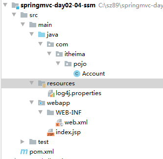

# day46_springmvc

# 学习目标

- [ ] 掌握SpringMVC的统一异常处理
- [ ] 了解SpringMVC拦截器 :: 过滤器
- [ ] 掌握ssm整合（SpringMVC+spring+mybatis)

# 第一章-异常处理

## 知识点-异常处理的思路

### 1.目标

- [ ] 掌握异常的处理思路

### 2.路径

1. 异常分类

### 3.讲解

#### 3.1 异常分类

* 编译期异常，通过try...catch捕获异常,否则代码没法写了，从而获取异常信息
* 运行时异常RuntimeException，通过规范代码开发、测试等，减少运行时异常的发生

#### 3.2 处理思路

* dao异常通常抛给Service
* Service异常通常抛给Controller
* Controller把异常抛给前端控制器（SpringMVC框架）
* 由前端控制器（DispatcherServlet）把异常交给异常处理器进行处理

 

### 4.小结

1. 异常分类
   1. 编译期异常 :  代码在编译的时候，就已经发现有异常了
   2. 运行期异常： 代码在运行的额时候，才会出现异常。
2. 异常处理思路
   1. 一级一级的向上抛出，最终交给异常处理器处理

## 知识点-异常处理的方式

### 1.目标

- [ ] 掌握springmvc的异常处理

### 2.路径

1. 异常处理两种方式

2. 自定义异常处理器

3. 简单异常处理器

### 3.讲解

#### 3.1 异常处理两种方式

* 实现Spring的异常处理器接口`HandlerExceptionResolver`，自定义异常处理器
  * 需要自己编写代码
  * 也需要进行配置，配置比较简单。只需要在sringmvc.xml里，配置bean对象即可
* 使用SpringMVC提供好的简单异常处理器`SimpleMappingExceptionResolver`
  * 不需要自己编写代码
  * 但需要进行配置，配置略微麻烦

#### 3.2 自定义异常处理器

##### 3.2.1 步骤

1. 创建异常页面，出现异常之后，会打开这个页面给客户端看。
2. 创建异常处理器，实现`HandlerExceptionResolver`接口
3. 在springmvc.xml中配置异常处理器，把自定义异常处理器类声明成为bean对象

##### 3.2.2 配置示例

* 创建项目，导入依赖

```xml
<dependencies>
    <!--servlet-api-->
    <dependency>
      <groupId>javax.servlet.jsp</groupId>
      <artifactId>javax.servlet.jsp-api</artifactId>
      <version>2.3.1</version>
      <scope>provided</scope>
    </dependency>
    <!--springmvc-->  
    <dependency> 
      <groupId>org.springframework</groupId>  
      <artifactId>spring-webmvc</artifactId>  
      <version>5.1.2.RELEASE</version> 
    </dependency>
    <dependency>
      <groupId>javax.servlet</groupId>
      <artifactId>javax.servlet-api</artifactId>
      <version>3.1.0</version>
      <scope>provided</scope>
    </dependency>
  </dependencies>	
```

* 编写Controller 模拟抛出异常

```java
package com.itheima.controller;

import org.springframework.stereotype.Controller;
import org.springframework.web.bind.annotation.RequestMapping;

@Controller
public class Controller01 {

    @RequestMapping("/show")
    public void show(int no){
        System.out.println("执行了Controller01的show方法~~" + no);
        if(no == 1 ){
            throw  new NullPointerException();
        }else if(no == 2){
            throw new ClassCastException();
        }else{
            throw new RuntimeException();
        }
    }
}

```

* 准备异常页面 error.jsp

```jsp
<%--
  Created by IntelliJ IDEA.
  User: xiaomi
  Date: 2021/6/5
  Time: 8:58
  To change this template use File | Settings | File Templates.
--%>
<%@ page contentType="text/html;charset=UTF-8" language="java" %>
<html>
<head>
    <title>Title</title>
</head>
<body>

<h2>这是错误的页面！</h2>
${msg}
</body>
</html>
```

* 创建自定义异常处理器

```java
    package com.itheima.exception;
    
    import org.springframework.web.servlet.HandlerExceptionResolver;
    import org.springframework.web.servlet.ModelAndView;
    
    import javax.servlet.http.HttpServletRequest;
    import javax.servlet.http.HttpServletResponse;
    
    /*
        自定义的异常处理器
            1. 实现接口HandlerExceptionResolver
            2. 实现方法resolveException ： 处理异常的
     */
    
    public class MyExceptionHandler implements HandlerExceptionResolver {
    
        /**
         *
         * @param request
         * @param response
         * @param handler
         * @param ex   异常对象，到底现在出现的是什么异常？
         * @return ModelAndView , 为了让我们包装视图和数据，给用户看
         */
        public ModelAndView resolveException(HttpServletRequest request, HttpServletResponse response,
                                             Object handler, Exception ex) {
    
            //1. 创建ModelAndView对象
            ModelAndView mv = new ModelAndView();
    
            //2. 包装视图
            mv.setViewName("error");
    
            //3. 包装数据
            String  msg =  "出现类运行时异常啦~~";
    
    
            if(ex instanceof  NullPointerException){
                msg = "出现空异常啦~~";
            }else if(ex instanceof  ClassCastException){
                msg = "出现类型转换异常啦~~";
            }
    
    
            mv.addObject("msg", msg);
    
            return mv;
        }
    }
```

* 在springmvc.xml中配置异常处理器

> 也可以使用注解来托管自定义的异常处理器

```xml
<bean class="com.itheima.exception.MyExceptionHandler"/>
```

#### 3.3 简单异常处理器

> SpringMVC已经定义好了异常处理器，在使用时根据项目情况，配置异常与视图的映射关系

##### 3.3.1 配置步骤

1. 创建异常页面。可以根据实际需求创建错误页面，比如：
   * 所有异常，都使用同一页面error.jsp
   * 不同异常，配置不同的错误页面
     * 类转换异常，配置castError.jsp
     * 空指定异常，配置nullError.jsp
     * ...
2. 在springmvc.xml中，配置简单异常处理器`SimpleMappingExceptionResolver`

##### 3.3.2 配置示例

* 准备异常页面`error02.jsp`

```jsp
<%--
  Created by IntelliJ IDEA.
  User: xiaomi
  Date: 2021/6/5
  Time: 8:58
  To change this template use File | Settings | File Templates.
--%>
<%@ page contentType="text/html;charset=UTF-8" language="java" %>
<html>
<head>
    <title>Title</title>
</head>
<body>

<h2>服务器开小差了，一会再回来~！</h2>
</body>
</html>


```

* 在springmvc.xml中配置

```xml
    <!--6. 配置简单的异常处理器-->
    <bean class="org.springframework.web.servlet.handler.SimpleMappingExceptionResolver">
        <!--配置了通用的异常显示页面-->
        <property name="defaultErrorView" value="error02"/>

        <!--对具体的每一个异常进行细化的处理-->
        <property name="exceptionMappings">
            <props>
                <prop key="java.lang.NullPointerException">error02_null</prop>
                <prop key="java.lang.ClassCastException">error02_cast</prop>
            </props>
        </property>
    </bean>
```

### 4.小结

1. 创建一个Java类，实现`HandlerExceptionResolver`接口：编写代码处理异常
2. 把创建好的异常处理器注册bean

# 第二章-拦截器

## 知识点-拦截器入门

### 1. 目标

- [ ] 掌握SpringMVC 拦截器的基本使用

### 2. 路径

1. 拦截器概述 
2. 自定义拦截器入门
   * 创建自定义的拦截器实现handlerInterceptor接口，实现preHandler的方法 前置拦截
   * 配置它 springmvc.xml mvc:interceptors标签 1. 拦截的路径规则, 2.处理类

### 3. 讲解

#### 3.1 拦截器概述

* SpringMVC中的拦截器，相当于web开发中的过滤器Filter，用于对Controller进行**预处理**和**后处理**
* 多个拦截器形成的一条链，称为**拦截器链**（Interceptor chain）
  * 当访问被拦截的（具体的目标Controller）方法时，拦截器链中的拦截器就会按照之前定义的顺序被调用
* 拦截器也是AOP思想的具体实现

#### 3.2 拦截器和过滤器的区别

| 区别     | 过滤器Filter                                               | 拦截器                                                       |
| -------- | ---------------------------------------------------------- | ------------------------------------------------------------ |
| 使用范围 | 是Servlet规范的一部分，任何Javaweb项目都可以使用           | 是SpringMVC自己的，只有使用了SpringMVC框架，才可以使用拦截器 |
| 拦截范围 | 配置了urlPatterns="/*"之后，可以对所有要访问的资源进行拦截 | 只会拦截访问的控制器方法，如果访问的是JSP、HTML、CSS、图片或者js时，不拦截 |
| 拦截精度 | 只能拦截某个请求，不能对Servlet里某个方法进行拦截 ,        | 可以精细到拦截Controller里的某个方法                         |

* 拦截精度答疑：
  * 因为servlet里面写映射地址的时候，是在类上面写的，一个servlet只会有一个映射地址，
  * controller不一样，它里面可以有很多方法，每一个方法都对应一个不同的路径地址。

#### 3.3 快速入门

##### 3.3.1 准备工作

* 创建maven项目，准备SpringMVC的环境
* 创建控制器`DemoController`，准备一个目标方法`show()`

```java
package com.itheima.controller;

import org.springframework.stereotype.Controller;
import org.springframework.web.bind.annotation.RequestMapping;

@Controller
public class Controller01 {

    @RequestMapping("/show")
    public String show(){

        System.out.println("调用了Controller01 的 show方法~！");
        return "success";
    }
}

```

##### 3.3.2 实现步骤

1. 创建一个Java类，实现`HandlerInterceptor`接口
   * 重写接口的方法，共三个方法：`preHandle, postHandle, afterCompletion`
2. 在springmvc.xml中配置拦截器

##### 3.3.3 功能实现

* 创建Java类，实现`HandlerInterceptor`接口

```java
package com.itheima.interceptor;

import org.springframework.web.servlet.HandlerInterceptor;
import org.springframework.web.servlet.ModelAndView;

import javax.servlet.http.HttpServletRequest;
import javax.servlet.http.HttpServletResponse;


/*
    自定义拦截器
        1. 定义一个类，实现接口HandlerInterceptor

        2. 重写三个方法 preHandle |  postHandle | afterCompletion

        3. 要登记|注册这个拦截器
 */

public class MyInterceptor implements HandlerInterceptor {

    // 在目标方法(Controller01的show方法)执行之前，调用  返回true: 表示放行，返回false: 表示拦截
    public boolean preHandle(HttpServletRequest request, HttpServletResponse response, Object handler) throws Exception {
        System.out.println("执行了MyInterceptor的preHandle...");
        return false;
    }

    // 在目标方法(Controller01的show方法)执行之后，调用
    public void postHandle(HttpServletRequest request, HttpServletResponse response, Object handler, ModelAndView modelAndView) throws Exception {
        System.out.println("执行了MyInterceptor的postHandle...");
    }

    // 在页面渲染完毕之后调用。
    public void afterCompletion(HttpServletRequest request, HttpServletResponse response, Object handler, Exception ex) throws Exception {
        System.out.println("执行了MyInterceptor的afterCompletion...");

    }
}

```

* 在springmvc.xml中配置拦截器

```xml
 <mvc:interceptors>

        <!--配置自定义的拦截器
            mvc:mapping : 出现什么样的地址路径就拦截
                path: 表示拦截什么具体的路径
                路径的写法有以下几种：
                    直接写明要拦截谁：  /show  /user  /add
                    采用*匹配符：  /show/*  /*   /user/*
                    采用**匹配符：  /show/**  /**  /user/**

                    * 只能表示一级目录
                    ** 可以表示任意级别的目录

                如果写成了 /** ,并且我们也在xml文件中开启了静态资源的处理，那么/**会拦截所有内容！
                此时可以通过设置排除，来排除静态资源不拦截
                     <mvc:exclude-mapping path="/**/*.js"/>

            bean : 指定我们自定义的拦截器，好让springmvc知道什么样的路径，用我们的这个拦截器去拦截

       -->
        <mvc:interceptor>
            <mvc:mapping path="/**"/>
            <mvc:exclude-mapping path="/**/*.js"/>
            <mvc:exclude-mapping path="/**/*.html"/>
            <mvc:exclude-mapping path="/**/*.css"/>
            <bean class="com.itheima.interceptor.MyInterceptor"/>

        </mvc:interceptor>
    </mvc:interceptors>
```

### 4. 小结

1. 拦截器，在进入 controller之前拦截。
2. 实现HandlerInterceptor接口, preHandler方法， 返回true则可以调用controller方法，false则不会调用controller
3. 需要在springmvc.xml配置
4. 作用：权限控制（认证，有没有登陆），微服的链路跟踪, 记录用户的访问日志

## 知识点-拦截器进阶

### 1.目标

- [ ] 掌握自定义拦截器的高级使用

### 2.路径

1. 拦截器的放行
2. 拦截后跳转
3. 拦截器的路径
4. 拦截器的其它方法
5. 多个拦截器执行顺序

### 3.讲解

#### 3.2.3.1 拦截器的放行


#### 3.2.3.2 拦截后跳转

​	拦截器的处理结果，莫过于两种:

​		放行：  如果后面还有拦截器就执行下一个拦截器，如果后面没有了拦截器，就执行Controller方法

​		拦截： 但是注意，拦截后也需要返回到一个具体的结果(页面,Controller)。 

- 在preHandle方法返回false,通过reque
- st进行转发,或者通过response对象进行重定向,输出

```java
package com.itheima.interceptor;

import org.springframework.web.servlet.HandlerInterceptor;
import org.springframework.web.servlet.ModelAndView;

import javax.servlet.http.HttpServletRequest;
import javax.servlet.http.HttpServletResponse;


/*
    自定义拦截器
        1. 定义一个类，实现接口HandlerInterceptor

        2. 重写三个方法 preHandle |  postHandle | afterCompletion

        3. 要登记|注册这个拦截器
 */

public class MyInterceptor implements HandlerInterceptor {

    // 在目标方法(Controller01的show方法)执行之前，调用  返回true: 表示放行，返回false: 表示拦截
    public boolean preHandle(HttpServletRequest request, HttpServletResponse response, Object handler) throws Exception {
        System.out.println("执行了MyInterceptor的preHandle...");


        /*
            1. 即便我们拦截到了请求， return false了之后，请求必然交不到后面的controller去了。
            2. 但是我们的这个拦截器还是要对这次请求作出响应的，否则浏览器的页面将会是一片空白！（用户体验不佳）
            3. 对请求作出响应，其实就是跳转页面或者跳转到某一个controller去。（一般是跳转页面）
         */
        //请求转发
        //request.getRequestDispatcher("error.jsp").forward(request , response);

        //重定向  localhost:8080/项目映射名/error.jsp
        /*
            由于这个拦截器，我们可以配置成拦截/show/** , 那么此时会出现一种情况
            就是多级目录的情况也被拦截了，但是这里使用相对路径跳转是非常危险的一件事。我们需要写多少个 ../ 不得而知！

            使用绝对路径
         */
        response.sendRedirect(request.getContextPath()+"/error.jsp");

        return false;
    }
}

```

#### 3.2.3.3 拦截器的路径


#### 3.2.3.4 拦截器的其它方法

+ afterCompletion  在目标方法完成视图层渲染后执行。
+ postHandle  在被拦截的目标方法执行完毕获得了返回值后执行。
+ preHandle 被拦截的目标方法执行之前执行。

```java
package com.itheima.interceptor;

import org.springframework.web.servlet.HandlerInterceptor;
import org.springframework.web.servlet.ModelAndView;

import javax.servlet.http.HttpServletRequest;
import javax.servlet.http.HttpServletResponse;


public class MyInterceptor implements HandlerInterceptor {

    // 在目标方法(Controller01的show方法)执行之前，调用  返回true: 表示放行，返回false: 表示拦截
    public boolean preHandle(HttpServletRequest request, HttpServletResponse response, Object handler) throws Exception {
        System.out.println("执行了MyInterceptor的preHandle...");
        return false;
    }

    // 在目标方法(Controller01的show方法)执行之后，调用
    public void postHandle(HttpServletRequest request, HttpServletResponse response, Object handler, ModelAndView modelAndView) throws Exception {
        System.out.println("执行了MyInterceptor的postHandle...");
    }

    // 在页面渲染完毕之后调用。
    public void afterCompletion(HttpServletRequest request, HttpServletResponse response, Object handler, Exception ex) throws Exception {
        System.out.println("执行了MyInterceptor的afterCompletion...");

    }
}

```


#### 3.2.3.5 多个拦截器执行顺序

​	我们可以配置多个拦截器, 所以就存在一个优先级问题了.多个拦截器的优先级是按照配置的顺序决定的。 

1. 如果有多个拦截器的，并且最终也执行到了Controller的方法，那么一定会执行他们的postHandle方法和afterCompletion方法
2. 只要是到了Controller，那么一定会有postHandle方法执行
3. 如果一开始就不放行，那么只会执行一个preHandle方法
4. 如果有拦截器链存在，第一个选择放行，第二个（后面的某一个拦截器）选择不放行，那么最后也还是会执行前面放行的过滤器的afterCompletion方法


+ 拦截器

拦截器1

```java
package com.itheima.interceptor02;

import org.springframework.web.servlet.HandlerInterceptor;
import org.springframework.web.servlet.ModelAndView;

import javax.servlet.http.HttpServletRequest;
import javax.servlet.http.HttpServletResponse;

public class MyInterceptor01 implements HandlerInterceptor {

    public boolean preHandle(HttpServletRequest request, HttpServletResponse response, Object handler) throws Exception {
        System.out.println("调用了MyInterceptor01的preHandle方法~");
        return true;
    }

    public void postHandle(HttpServletRequest request, HttpServletResponse response, Object handler, ModelAndView modelAndView) throws Exception {

        System.out.println("调用了MyInterceptor01的postHandle方法~");
    }

    public void afterCompletion(HttpServletRequest request, HttpServletResponse response, Object handler, Exception ex) throws Exception {
        System.out.println("调用了MyInterceptor01的afterCompletion方法~");

    }
}

```

拦截器2

```java
package com.itheima.interceptor02;

import org.springframework.web.servlet.HandlerInterceptor;
import org.springframework.web.servlet.ModelAndView;

import javax.servlet.http.HttpServletRequest;
import javax.servlet.http.HttpServletResponse;

public class MyInterceptor02 implements HandlerInterceptor {

    public boolean preHandle(HttpServletRequest request, HttpServletResponse response, Object handler) throws Exception {
        System.out.println("调用了MyInterceptor02的preHandle方法~");
        return true;
    }

    public void postHandle(HttpServletRequest request, HttpServletResponse response, Object handler, ModelAndView modelAndView) throws Exception {
        System.out.println("调用了MyInterceptor02的postHandle方法~");
    }

    public void afterCompletion(HttpServletRequest request, HttpServletResponse response, Object handler, Exception ex) throws Exception {
        System.out.println("调用了MyInterceptor02的afterCompletion方法~");
    }
}

```

拦截器3

```java
package com.itheima.interceptor02;

import org.springframework.web.servlet.HandlerInterceptor;
import org.springframework.web.servlet.ModelAndView;

import javax.servlet.http.HttpServletRequest;
import javax.servlet.http.HttpServletResponse;

public class MyInterceptor03 implements HandlerInterceptor {

    public boolean preHandle(HttpServletRequest request, HttpServletResponse response, Object handler) throws Exception {
        System.out.println("调用了MyInterceptor03的preHandle方法~");
        return true;
    }

    public void postHandle(HttpServletRequest request, HttpServletResponse response, Object handler, ModelAndView modelAndView) throws Exception {

        System.out.println("调用了MyInterceptor03的postHandle方法~");
    }

    public void afterCompletion(HttpServletRequest request, HttpServletResponse response, Object handler, Exception ex) throws Exception {
        System.out.println("调用了MyInterceptor03的afterCompletion方法~");

    }
}

```

+ controller

```java
package com.itheima.controller;

import org.springframework.stereotype.Controller;
import org.springframework.web.bind.annotation.RequestMapping;

@Controller
public class Controller01 {

    @RequestMapping("/show")
    public String show(){

        System.out.println("调用了Controller01 的 show方法~！");
        return "success";
    }
}

```

+ 配置

```xml
 <!--配置拦截器链-->
    <mvc:interceptors>
         <mvc:interceptor>
            <mvc:mapping path="/show"/>
            <bean class="com.itheima.interceptor02.MyInterceptor01"/>
        </mvc:interceptor>

        <mvc:interceptor>
            <mvc:mapping path="/show"/>
            <bean class="com.itheima.interceptor02.MyInterceptor02"/>
        </mvc:interceptor>

        <mvc:interceptor>
            <mvc:mapping path="/show"/>
            <bean class="com.itheima.interceptor02.MyInterceptor03"/>
        </mvc:interceptor>

    </mvc:interceptors>
```

+ 结果


### 4.小结

1. 拦截器属于链式模式

2. 只有preHandler方法才有返回true 放行，false拦截

3. 拦截后也需要对此次请求做出响应（跳转页面|跳转Controller）

4. 拦截器执行方法顺序 preHandle->postHandle->afterCompletion

5. 存在拦截器链时，按照配置文件顺序执行，自上而下。先进(preHandle)后出(postHandle,afterCompletion)

6. 当我们的springmvc配置了静态资源处理，并且拦截器配置成了  /** ，那么拦截器也会拦截静态资源。如果非要让拦截器不拦截静态资源：

   1. 手动指定静态资源的路径，然后拦截器排除具体静态资源

   2. <mvc:default-servlet-handler> 和  拦截器 /** 还是照常写

      需要在web.xml中，添加DefaultServlet的映射路径

   ```xml
   <servlet-mapping>
   			<servlet-name>default</servlet-name>
   			<url-pattern>*.jsp</url-pattern>
   			<url-pattern>*.css</url-pattern>
   			<url-pattern>*.html</url-pattern>
   			<url-pattern>*.js</url-pattern>
   		</servlet-mapping>
   ```

   3. DispatcherServlet 只拦截*.do

# 第三章 SSM整合【重点】

## 案例-环境准备

### 1.需求

- [ ] 能独立搭建环境

### 2.分析

1. 创建数据库和表
2. 创建Maven工程(web工程)
   + 导入坐标
   + 创建实体类
   + 拷贝log4J日志到工程

### 3.实现

#### 4.3.1 创建数据库和表结构 

```mysql
 
```

#### 4.3.2 创建Maven工程

+ 创建web项目

  

+ 导入依赖

```xml
<properties>
    <!-- 版本锁定 -->
    <spring.version>5.0.2.RELEASE</spring.version>
    <log4j.version>1.2.17</log4j.version>
    <slf4j.version>1.6.6</slf4j.version>
    <mysql.version>5.1.47</mysql.version>
    <mybatis.version>3.4.6</mybatis.version>
</properties>

<dependencies>
    <!--Spring：ioc和aop，事务-->
    <dependency>
        <groupId>org.springframework</groupId>
        <artifactId>spring-context</artifactId>
        <version>${spring.version}</version>
    </dependency>
    <dependency>
        <groupId>org.springframework</groupId>
        <artifactId>spring-jdbc</artifactId>
        <version>${spring.version}</version>
    </dependency>
    <dependency>
        <groupId>org.aspectj</groupId>
        <artifactId>aspectjweaver</artifactId>
        <version>1.8.9</version>
    </dependency>

    <!--Mybatis-->
    <dependency>
        <groupId>mysql</groupId>
        <artifactId>mysql-connector-java</artifactId>
        <version>${mysql.version}</version>
    </dependency>
    <dependency>
        <groupId>com.mchange</groupId>
        <artifactId>c3p0</artifactId>
        <version>0.9.5.4</version>
    </dependency>
    <dependency>
        <groupId>org.mybatis</groupId>
        <artifactId>mybatis</artifactId>
        <version>${mybatis.version}</version>
    </dependency>
    <dependency>
        <groupId>org.mybatis</groupId>
        <artifactId>mybatis-spring</artifactId>
        <version>2.0.2</version>
    </dependency>

    <!--SpringMVC，jstl，json转换-->
    <dependency>
        <groupId>org.springframework</groupId>
        <artifactId>spring-webmvc</artifactId>
        <version>${spring.version}</version>
    </dependency>
    <dependency>
        <groupId>com.fasterxml.jackson.core</groupId>
        <artifactId>jackson-databind</artifactId>
        <version>2.9.6</version>
    </dependency>
    <dependency>
        <groupId>javax.servlet</groupId>
        <artifactId>javax.servlet-api</artifactId>
        <version>3.1.0</version>
        <scope>provided</scope>
    </dependency>
    <dependency>
        <groupId>javax.servlet.jsp</groupId>
        <artifactId>javax.servlet.jsp-api</artifactId>
        <version>2.3.1</version>
        <scope>provided</scope>
    </dependency>
    <dependency>
        <groupId>jstl</groupId>
        <artifactId>jstl</artifactId>
        <version>1.2</version>
    </dependency>

    <!--日志-->
    <dependency>
        <groupId>log4j</groupId>
        <artifactId>log4j</artifactId>
        <version>${log4j.version}</version>
    </dependency>
    <dependency>
        <groupId>org.slf4j</groupId>
        <artifactId>slf4j-api</artifactId>
        <version>${slf4j.version}</version>
    </dependency>
    <dependency>
        <groupId>org.slf4j</groupId>
        <artifactId>slf4j-log4j12</artifactId>
        <version>${slf4j.version}</version>
    </dependency>

    <!--测试-->
    <dependency>
        <groupId>junit</groupId>
        <artifactId>junit</artifactId>
        <version>4.12</version>
        <scope>test</scope>
    </dependency>
    <dependency>
        <groupId>org.springframework</groupId>
        <artifactId>spring-test</artifactId>
        <version>${spring.version}</version>
        <scope>test</scope>
    </dependency>
    <dependency>
      <groupId>com.alibaba</groupId>
      <artifactId>druid</artifactId>
      <version>1.1.19</version>
    </dependency>
    
    <!-- lombok -->
       <dependency>
            <groupId>org.projectlombok</groupId>
            <artifactId>lombok</artifactId>
            <version>1.18.8</version>
        </dependency>
</dependencies>
```

+ 编写实体类 

```java
package com.itheima.bean;

import lombok.Data;

@Data
public class Account {
    private int id;
    private String name;
    private int money;
}

```

+ 拷贝log4J配置文件到工程 

> 在resource目录下创建一个`log4j.properties`文件

```properties
##设置日志记录到控制台的方式
log4j.appender.std=org.apache.log4j.ConsoleAppender
log4j.appender.std.Target=System.err
log4j.appender.std.layout=org.apache.log4j.PatternLayout
log4j.appender.std.layout.ConversionPattern=%d{yyyy-MM-dd HH:mm:ss} %5p %c{1}:%L - %m%n

##设置日志记录到文件的方式
log4j.appender.file=org.apache.log4j.FileAppender
log4j.appender.file.File=mylog.txt
log4j.appender.file.layout=org.apache.log4j.PatternLayout
log4j.appender.file.layout.ConversionPattern=%d{ABSOLUTE} %5p %c{1}:%L - %m%n

##日志输出的级别，以及配置记录方案 debug info   warn  error
log4j.rootLogger= trace,std,file
```

### 4 小结

1. 按步骤操作

## 案例-整合SpringMVC

### 1.需求

- [ ] 能整合进来SpringMVC

### 2.分析

1. 创建AccountController, 定义方法 添加注解
2. 创建springmvc.xml(开启包扫描, 注册视图解析器,静态资源处理, 注解驱动)
3. 配置web.xml(前端控制器, 编码过滤器)
4. 测试

### 3.实现

* 创建AccountController.java

```java
package com.itheima.controller;
import com.itheima.bean.Account;
import org.springframework.stereotype.Controller;
import org.springframework.web.bind.annotation.RequestMapping;

import java.util.List;

@Controller
public class AccountController {

    /**
     * 查询所有的账户
     * @return
     */
    @RequestMapping("/findAll")
    public String findAll(){

        System.out.println("执行了AccountController的findAll方法~");

        return "success";
    }
}

```

+ 创建springmvc.xml配置文件

```xml
<?xml version="1.0" encoding="UTF-8"?>
<beans xmlns="http://www.springframework.org/schema/beans"
       xmlns:xsi="http://www.w3.org/2001/XMLSchema-instance"
       xmlns:context="http://www.springframework.org/schema/context"
       xmlns:mvc="http://www.springframework.org/schema/mvc"
       xsi:schemaLocation="http://www.springframework.org/schema/beans http://www.springframework.org/schema/beans/spring-beans.xsd http://www.springframework.org/schema/context http://www.springframework.org/schema/context/spring-context.xsd http://www.springframework.org/schema/mvc http://www.springframework.org/schema/mvc/spring-mvc.xsd">

<!--    1. 扫描包-->
    <context:component-scan base-package="com.itheima"/>
<!--    2. 注解开关-->
    <mvc:annotation-driven/>

<!--    3. 静态资源处理-->
    <mvc:default-servlet-handler/>

<!--    4. 视图解析器-->
    <bean class="org.springframework.web.servlet.view.InternalResourceViewResolver">
        <property name="prefix" value="/"/>
        <property name="suffix" value=".jsp"/>
    </bean>


</beans>
```

+ 在web.xml里面配置前端控制器和编码过滤器

```xml
<?xml version="1.0" encoding="UTF-8"?>
<web-app xmlns:xsi="http://www.w3.org/2001/XMLSchema-instance"
	xmlns="http://java.sun.com/xml/ns/javaee"
	xsi:schemaLocation="http://java.sun.com/xml/ns/javaee http://java.sun.com/xml/ns/javaee/web-app_2_5.xsd"
	version="2.5">

	<!--配置前端控制器 DispatcherServlet-->
		<servlet>
			<servlet-name>dispatcher</servlet-name>
			<servlet-class>org.springframework.web.servlet.DispatcherServlet</servlet-class>

			<init-param>
				<param-name>contextConfigLocation</param-name>
				<param-value>classpath:springmvc.xml</param-value>
			</init-param>

			<load-on-startup>1</load-on-startup>
		</servlet>

		<servlet-mapping>
			<servlet-name>dispatcher</servlet-name>
			<url-pattern>/</url-pattern>
		</servlet-mapping>

	<!--springmvc已经定义好了过滤器，可以帮助我们解决post请求，中文乱码的问题，我们只需要配置即可-->
		<filter>
			<filter-name>char</filter-name>
			<filter-class>org.springframework.web.filter.CharacterEncodingFilter</filter-class>

			<!--设置编码，通过初始化参数来设置编码-->
			<init-param>
				<param-name>encoding</param-name>
				<param-value>utf-8</param-value>
			</init-param>
		</filter>

		<filter-mapping>
			<filter-name>char</filter-name>
			<url-pattern>/*</url-pattern>
		</filter-mapping>
</web-app>
```

### 4. 小结

1. 创建Controller, 创建方法 添加注解
2. 创建springmvc.xml(开启包扫描, 注册视图解析器,忽略静态资源,开启注解驱动)
3. 配置web.xml(前端控制器, 编码过滤器)

## 案例-整合Spring

### 1. 需求

- [ ] 能整合进来Spring

### 2. 分析

1. 编写Service
2. 在Controller里面注入Service
3. 在controller里面调用service的方法

### 3. 实现

+ 编写AccountService.java

```java
package com.itheima.service;

import com.itheima.bean.Account;

import java.util.List;

public interface AccountService {

    /**
     * 查询所有的账户
     * @return
     */
    List<Account> findAll();
}


```

+ 编写AccountServiceImpl.java

```java
package com.itheima.service.impl;

import com.itheima.bean.Account;
import com.itheima.service.AccountService;
import org.springframework.stereotype.Service;

import java.util.List;

@Service
public class AccountServiceImpl implements AccountService {


    /**
     * 查询所有账户
     * @return
     */
    public List<Account> findAll() {
        System.out.println("调用了AccountServiceImpl的findAll方法~！~");
        return null;
    }
}

```

+ 在AccountController调用AccountService

```java
@Controller
public class AccountController {

    @Autowired
    private AccountService as;

    /**
     * 查询所有的账户
     * @return
     */
    @RequestMapping("/findAll")
    public String findAll(){

        System.out.println("执行了AccountController的findAll方法~");

        //调用Service方法
        List<Account> list = as.findAll();

        System.out.println("list=" + list);

        return "success";
    }
}

```

### 4. 小结

1. 创建业务接口与实现类
2. 在实现类上加@Service 把交给spring容器管理
3. AccountController 注入进来 @Autowired, 调用业务方法

## 案例-整合Mybatis

### 1. 初级版本  (独立运行)

#### 1.目标

- [ ] 能够整合进来MyBatis

#### 2.路径

1. 创建Dao接口, 定义方法, 添加注解
2. 创建SqlMapConfig.xml
3. 编写Java代码测试

#### 3.讲解

+ 创建AccountDao.java, 添加注解

```java
package com.itheima.dao;

import com.itheima.bean.Account;
import org.apache.ibatis.annotations.Select;

import java.util.List;

public interface AccountDao {

    /**
     * 查询所有
     * @return
     */
    @Select("select * from account")
    List<Account>  findAll();
}
```

+ 编写MyBatis核心配置文件:SqlMapConfig.xml

```xml
<?xml version="1.0" encoding="UTF-8" ?>
<!DOCTYPE configuration
        PUBLIC "-//mybatis.org//DTD Config 3.0//EN"
        "http://mybatis.org/dtd/mybatis-3-config.dtd">
<configuration>
    
    <!--1. 配置如何连接数据库-->
    <environments default="dev">
        <environment id="dev">
            <transactionManager type="JDBC"/>
            <dataSource type="POOLED">
                <property name="driver" value="com.mysql.jdbc.Driver"/>
                <property name="url" value="jdbc:mysql:///ssm"/>
                <property name="username" value="root"/>
                <property name="password" value="root"/>
            </dataSource>
        </environment>
    </environments>

   <!-- 2. 配置映射文件在哪里？-->
    <mappers>
        <package name="com.itheima.dao"/>
    </mappers>

</configuration>
```

+ 测试运行结果 

```java
package com.itheima.test;

import com.itheima.bean.Account;
import com.itheima.dao.AccountDao;
import org.apache.ibatis.io.Resources;
import org.apache.ibatis.session.SqlSession;
import org.apache.ibatis.session.SqlSessionFactory;
import org.apache.ibatis.session.SqlSessionFactoryBuilder;
import org.junit.Test;

import java.io.IOException;
import java.io.InputStream;
import java.util.List;

public class TestAccountDao {

    @Test
    public void testFindAll() throws IOException {

        //1. 读取核心配置文件
        InputStream is = Resources.getResourceAsStream("SqlMapConfig.xml");

        //2. 创建SqlSessionFactory
        SqlSessionFactoryBuilder builder = new SqlSessionFactoryBuilder();
        SqlSessionFactory sessionFactory = builder.build(is);

        //3. 创建SqlSession
        SqlSession session = sessionFactory.openSession();

        //4. 获取代理对象
        AccountDao dao = session.getMapper(AccountDao.class);

        //5. 调用方法
        List<Account> list = dao.findAll();
        System.out.println("list=" + list);

        //6. 关闭sqlsession
        session.close();
    }
}
```

#### 4.小结

1. 创建Dao接口, 定义方法, 添加注解
2. 创建SqlMapConfig.xml
3. 编写Java测试代码

### 2. 终极版本（整合运行）

#### 1.需求

- [ ] 能够使用Spring管理MyBatis

#### 2.分析

* 初级版本存在的问题
  * 连接池还是用的MyBatis自带的    ---->   用第三方的连接池,通过Spring管理
  * SqlSessionFactory还是我们自己构建的    ---->   通过Spring管理SqlSessionFactory
  * 扫描Dao还是由MyBatis加载的    ---->   通过Spring扫描Dao
  * 事务还是由MyBatis管理    ---->   通过Spring管理事务

#### 3. 实现

##### 3.1 Spring接管Mybatis的Session工厂

* 创建applicationContext.xml

> 1. 引入外部的数据源（连接池）
> 2. 由Spring来管理SqlSessionFactory工厂
> 3. 由Spring来扫描dao接口包
> 4. 这么做的目的只有一个： 就是顶替掉mybatis的核心配置文件SqlMapConfig.xml

```xml
<?xml version="1.0" encoding="UTF-8"?>
<beans xmlns="http://www.springframework.org/schema/beans"
       xmlns:xsi="http://www.w3.org/2001/XMLSchema-instance"
       xmlns:context="http://www.springframework.org/schema/context" xmlns:tx="http://www.springframework.org/schema/tx"
       xmlns:aop="http://www.springframework.org/schema/aop"
       xsi:schemaLocation="http://www.springframework.org/schema/beans http://www.springframework.org/schema/beans/spring-beans.xsd http://www.springframework.org/schema/context http://www.springframework.org/schema/context/spring-context.xsd http://www.springframework.org/schema/tx http://www.springframework.org/schema/tx/spring-tx.xsd http://www.springframework.org/schema/aop http://www.springframework.org/schema/aop/spring-aop.xsd">


    <context:property-placeholder location="classpath:db.properties"/>
    <!--1. 定义连接池-->
    <bean id="dataSource" class="com.mchange.v2.c3p0.ComboPooledDataSource">
         <property name="driverClass" value="${driverClass}"/>
         <property name="jdbcUrl" value="${jdbcUrl}"/>
         <property name="user" value="${user}"/>
         <property name="password" value="${password}"/>
    </bean>
    <!--<bean id="dataSource" class="com.mchange.v2.c3p0.ComboPooledDataSource">
         <property name="driverClass" value="com.mysql.jdbc.Driver"/>
         <property name="jdbcUrl" value="jdbc:mysql:///ssm"/>
         <property name="user" value="root"/>
         <property name="password" value="root"/>
    </bean>-->

    <!--
        2. 由spring创建SqlSessionFactory工厂
            2.1 SqlSessionFactory 是一个工厂，专门用于生成SqlSession
            2.2 SqlSession是用来操作数据库，那么就必须要知道连接的是什么数据库
            2.3 所以要给这个SqlSessionFactoryBean 注入DataSource
    -->
    <bean class="org.mybatis.spring.SqlSessionFactoryBean">
        <property name="dataSource" ref="dataSource"/>

        <!--给指定的包下的所有类，起别名-->
        <property name="typeAliasesPackage" value="com.itheima.bean"/>

        <!--也可以把一部分mybatis里面的配置放在SqlMapConfig.xml中，然后在这里引入它即可-->
        <!--<property name="configLocation" value="SqlMapConfig.xml"/>-->
    </bean>

    <!--3. 告诉spring扫描dao的包-->
    <bean class="org.mybatis.spring.mapper.MapperScannerConfigurer">
        <property name="basePackage" value="com.itheima.dao"/>
    </bean>

</beans>
```

##### 3.2 配置 spring 的事务

> mybatis默认不会自动提交： setAutoCommit（false） , 所以对于增伤改的动作，需要提交事务才行。

```xml
  <!--
        4. 配置事务 就是使用spring的那一套就可以了！
            4.1 配置事务一定要有一个管理员，不管是xml的方式还是注解的方式
            4.2 事务得管理员根据dao的技术不同而不同
                jdbc|mysql  ===== DataSourceTransactionManager
                hibernate  ===== HibernateTransactionManager
     -->

    <bean id="tm" class="org.springframework.jdbc.datasource.DataSourceTransactionManager">
        <property name="dataSource" ref="dataSource"/>
    </bean>
    </bean>

    <tx:annotation-driven transaction-manager="tm"/>
```

##### 3.3 配置applicationContext

> 由于配置`springmvc`的时候，写了`springmvc.xml` , 配置`Mybatis`的时候，有`applicationContext.xml  ` 但是项目启动的时候，解析的入口是在`web.xml`里面配置。此时存在两个文件，如何抉择呢？有三种方式可供选择。

1. 方式一:别写applicationContext.xml了, 直接把applicationContext.xml里面的配置定义在springmvc.xml

2. 方式二: 名字上面下功夫.

    

```
<!--初始化参数:加载配置文件-->
<init-param>
    <param-name>contextConfigLocation</param-name>
    <param-value>classpath:applicationContext*.xml</param-value>
</init-param>
```

3. 方式三: 在springmvc.xml 引入applicationContext.xml【推荐】

​	在springmvc.xml中导入applicationContext.xml  , 然后在web.xml中只需要引入springmvc.xml即可

```xml
  <import resource="classpath:applicationContext.xml"/>

<!-- 或者： -->

   <!--引入applicationContext.xml-->
    <import resource="applicationContext.xml"/>
```

##### 3.4 在service中调用dao

```java
package com.itheima.service.impl;

import com.itheima.bean.Account;
import com.itheima.dao.AccountDao;
import com.itheima.service.AccountService;
import org.springframework.beans.factory.annotation.Autowired;
import org.springframework.stereotype.Service;
import org.springframework.transaction.annotation.Transactional;

import java.util.List;


@Transactional  // 类上打上注解，表示这个类里面的所有方法都应用上了事务
@Service
public class AccountServiceImpl implements AccountService {

    @Autowired
    private AccountDao dao ;


    /**
     * 查询所有账户
     * @return
     */
    public List<Account> findAll() {
        System.out.println("调用了AccountServiceImpl的findAll方法~！~");
        return dao.findAll();
    }
}

```

#### 4. 小结

* 细节处理
  * 1. 使用xml管理事务！
    2. 数据源连接的账号密码可以提出来使用properties来写！
    3. mapper能不能使用xml来做！
    4. 别名怎么整？
    5. sqlMapconfig.xml文件还有没有存在的必要！

# 总结：

* 异常处理
* 异常分类
  * 编译时异常，由方法抛出，我们需要捕获异常
    * 运行时异常，需要调试和规范编码才能避免或者降低它的概率
  * 异常的处理
    * 核心： 异常都是从下往上，一层一层的向上抛出来，在最上面的位置处理异常。
    * 自定义异常处理器
      * 需要我们手动编写类，实现接口HandlerExceptionResovler  
      * 需要登记| 注册成一个bean
      * 自由度更高一些
    * 简单的异常处理器
      * 由springmvc提供的，只需要配置即可。
* 拦截器
  * 是springmvc自己定义的一套类似过滤器的组件。
  * 它可以看成是AOP的思想，可以看成是对Controller 进行增强。
  * 入门
    * 写一个类，实现接口 HandleInterceptor  重写三个方法： preHandle | postHandle |  afterCompletion 
    * 在preHandle 里面对请求进行拦截，返回false， 表示拦截，返回true ，表示放行。
    * 即便拦截下来的请求，也依然要对这次请求作出响应，否则页面就是一片空白！
* SSM整合 【重点】