# day47-Maven高级&Git

# 学习目标

- [ ] Maven中jar包冲突问题
- [ ] 理解maven继承与聚合
- [ ] 能够完成分模块构建maven工程
- [ ] 能够概述git基本概念
- [ ] 能够概述git工作流程
- [ ] 能够使用git基本命令
- [ ] 能够使用idea操作git

# 第一章 - maven高级

## 知识点-依赖冲突

### 1. 目标

解决maven项目中的依赖冲突

### 2. 路径

1. 第一声明优先原则
2. 就近原则
3. 直接排除法

### 3. 讲解

* 什么是依赖的冲突？

> 当我们的多个jar包里面包含了同样，重复的jar包，那么此时maven会根据一系列的规则来选择使用某一个具体的jar包。
>
> * 依赖传递
>
> 当我们使用A jar包的时候， A jar包的代码需要用到Bjar包，那么此时maven也会把Bjar包给弄进来。

#### 3.1.1 第一声明优先原则

哪个jar包在靠上的位置，这个jar包就是先声明的，先声明的jar包下的依赖包，可以优先引入项目中。

如： 我们在pom.xml中引入如下坐标，分别是spring中不同的版本。

```xml
<?xml version="1.0" encoding="UTF-8"?>
<project xmlns="http://maven.apache.org/POM/4.0.0"
         xmlns:xsi="http://www.w3.org/2001/XMLSchema-instance"
         xsi:schemaLocation="http://maven.apache.org/POM/4.0.0 http://maven.apache.org/xsd/maven-4.0.0.xsd">
    <modelVersion>4.0.0</modelVersion>

    <groupId>com.itheima</groupId>
    <artifactId>maven_day01_demo</artifactId>
    <version>1.0-SNAPSHOT</version>

    <packaging>jar</packaging>

    <!--导入相关依赖包-->
    <dependencies>
        <!--引入spring-context，它所以来的包都会导入进来-->
        <dependency>
            <groupId>org.springframework</groupId>
            <artifactId>spring-context</artifactId>
            <version>5.0.2.RELEASE</version>
        </dependency>

        <dependency>
            <groupId>org.springframework</groupId>
            <artifactId>spring-beans</artifactId>
            <version>4.2.4.RELEASE</version>
        </dependency>
    </dependencies>

</project>
```

我们在控制面板的maven面板，点击查看依赖关系按钮，看到了包和包之间的依赖关系存在冲突，都使用了spring-core包，关系图如下：

 

我们再来看看他们依赖包的导入，发现导入的包却没有问题，包使用的都是5.0.2的版本。

 

我们把上面2个包的顺序调换后就变成了低版本的依赖导入。

 

#### 3.1.2 就近原则

直接依赖比传递依赖路径近，你那么最终进入项目的jar包会是路径近的直接依赖包。

直接依赖：项目中直接导入的jar包就是项目的直接依赖包。

传递依赖（间接依赖）：项目中没有直接导入的jar包，可以通过中直接依赖包传递到项目中去。

修改jar包，直接引入依赖spring-core

```xml
<!--导入相关依赖包-->
<dependencies>
    <dependency>
        <groupId>org.springframework</groupId>
        <artifactId>spring-beans</artifactId>
        <version>4.2.4.RELEASE</version>
    </dependency>

    <dependency>
        <groupId>org.springframework</groupId>
        <artifactId>spring-context</artifactId>
        <version>5.0.2.RELEASE</version>
    </dependency>

    <!--引入直接依赖-->
    <dependency>
        <groupId>org.springframework</groupId>
        <artifactId>spring-core</artifactId>
        <version>4.2.8.RELEASE</version>
    </dependency>
</dependencies>
```

此时优先引入的是直接依赖的引用


#### 3.1.3 直接排除法

> 除了使用前面的两种办法来解决依赖冲突的问题，也可以直接使用排除的办法来解决。即直接忽略掉后续依赖中的某一个具体的jar包，选择排除它。

```xml
<!--导入相关依赖包-->
<dependencies>
    <dependency>
        <groupId>org.springframework</groupId>
        <artifactId>spring-beans</artifactId>
        <version>4.2.4.RELEASE</version>
        <!--直接排除-->
        <exclusions>
            <exclusion>
                <groupId>org.springframework</groupId>
                <artifactId>spring-core</artifactId>
            </exclusion>
        </exclusions>
    </dependency>

    <dependency>
        <groupId>org.springframework</groupId>
        <artifactId>spring-context</artifactId>
        <version>5.0.2.RELEASE</version>
    </dependency>
</dependencies>
```

快捷操作：

 

依赖导入的jar包如下：

没有添加exclusion之前

 

添加exclusion之后，因为排除了4.2.4的版本spring-core的jar包

 

### 4. 小结

> 真实项目中，出现1个项目存在多个同种jar包的时候，需要我们进行解决maven的jar包冲突问题（异常：Class not found， class not defined、Method not found, NoSuchField等） jdk版本过高

1. 路径近者优先

2. 节点路径相同时，使用第一声明优先（xml上下顺序有关）

3. 无法通过依赖管理原则排除的，使用直接排除法

```xml
<exclusions>
    <exclusion>
        <groupId>org.springframework</groupId>
        <artifactId>spring-core</artifactId>
    </exclusion>
</exclusions>
```


## 知识点-继承和聚合

### 1. 目标

实现项目工程拆分合和继承的作用

### 2. 路径

1. 继承和聚合

### 3. 讲解

#### 3.1 工程创建模式

* 以前创建工程


* 聚合模式创建工程


#### 3.2 继承和聚合

* 继承

>  继承是为了消除重复，如果将 dao、 service、 web 分开创建独立的工程则每个工程的 pom.xml 文件中的内容存在重复，比如：设置编译版本、锁定 spring 的版本的等，可以将这些重复的 配置提取出来在父工程的 pom.xml 中定义。

* 聚合

> 项目开发通常是分组分模块开发， 每个模块开发完成要运行整个工程需要将每个模块聚合在 一起运行，比如： dao、 service、 web 三个工程最终会打一个独立的 war 运行。

* 继承聚合的特点

```java
特点1（继承）：
	ssm_parent父工程：存放项目的所有jar包。定义了所有的依赖
	ssm_web和ssm_service和ssm_dao有选择的继承jar包，并在自己的工程中使用。这样可以消除jar包重复，并	锁定版本
    
特点2（聚合）：
	ssm_web依赖于ssm_service，ssm_service依赖于ssm_dao，我们启动ssm_web，便可以访问我们的程序。
	执行安装的时候，执行ssm_pa rent，就可以将所有的子工程全部进行安装。    
```

* 项目结构示例


### 4. 小结

## 案例 - 分模块构建工程【重点】

### 1. 需求

能够使用分模块构建工程

### 2. 分析

1. 创建ssm_parent  ： 父工程
2. 创建ssm_model ： 其实就是用来放javabean
3. 创建ssm_dao
4. 创建ssm_service
5. 创建ssm_web

### 3. 实现

* 准备数据库环境

```sql
SET FOREIGN_KEY_CHECKS=0;
-- ----------------------------
-- Table structure for `items`
-- ----------------------------
DROP TABLE IF EXISTS `items`;
CREATE TABLE `items` (
  `id` int(10) NOT NULL auto_increment,
  `name` varchar(20) default NULL,
  `price` float(10,0) default NULL,
  `pic` varchar(40) default NULL,
  `createtime` datetime default NULL,
  `detail` varchar(200) default NULL,
  PRIMARY KEY  (`id`)
) ENGINE=InnoDB AUTO_INCREMENT=6 DEFAULT CHARSET=utf8;

-- ----------------------------
-- Records of items
-- ----------------------------
INSERT INTO `items` VALUES ('1', '传智播客web课程', '1000', null, '2018-03-13 09:29:30', '带我走上人生巅峰');
INSERT INTO `items` VALUES ('2', '黑马之路', null, null, '2018-03-28 10:05:52', '插入测试');
INSERT INTO `items` VALUES ('3', '黑马之路二', '199', null, '2018-03-07 10:08:04', '插入测试');
INSERT INTO `items` VALUES ('4', '插入测试', null, null, null, null);
INSERT INTO `items` VALUES ('5', '插入测试', null, null, null, null); 
```

#### 3.1 创建ssm_parent

 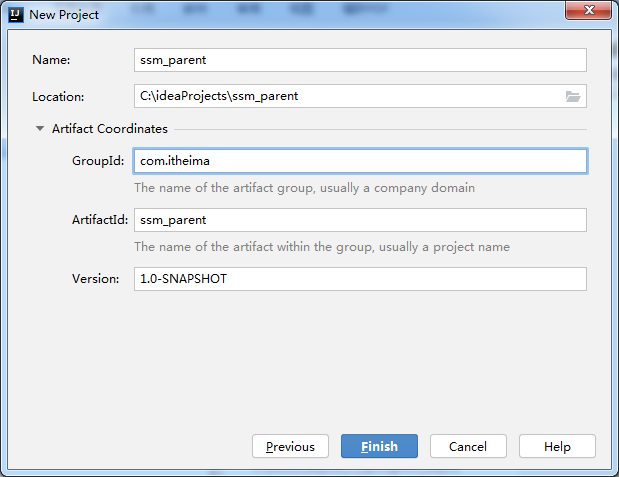 

删除src文件夹

 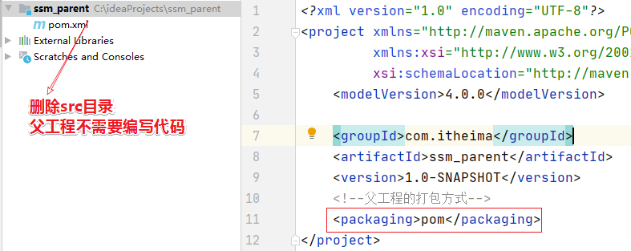 

##### 3.1.1 pom.xml

```xml
<?xml version="1.0" encoding="UTF-8"?>
<project xmlns="http://maven.apache.org/POM/4.0.0"
         xmlns:xsi="http://www.w3.org/2001/XMLSchema-instance"
         xsi:schemaLocation="http://maven.apache.org/POM/4.0.0 http://maven.apache.org/xsd/maven-4.0.0.xsd">
    <modelVersion>4.0.0</modelVersion>

    <groupId>com.itheima</groupId>
    <artifactId>ssm_parent</artifactId>
    <version>1.0-SNAPSHOT</version>

    <packaging>pom</packaging>

    <!--
        特殊属性定义，一般是版本号
    -->
    <properties>
        <spring.version>5.0.2.RELEASE</spring.version>
        <slf4j.version>1.6.6</slf4j.version>
        <mysql.version>5.1.6</mysql.version>
        <mybatis.version>3.4.5</mybatis.version>
        <aspectjweaver.version>1.6.8</aspectjweaver.version>
        <junit.version>4.12</junit.version>
        <jsp-api.version>2.0</jsp-api.version>
        <servlet-api.version>2.5</servlet-api.version>
        <jstl.version>1.2</jstl.version>
        <mybatis-spring.version>1.3.0</mybatis-spring.version>
        <druid.version>1.0.9</druid.version>
         <lombok.version>1.18.8</lombok.version>
        <!--文件的编码格式-->
        <project.build.sourceEncoding>UTF-8</project.build.sourceEncoding>
        <project.reporting.outputEncoding>UTF-8</project.reporting.outputEncoding>
    </properties>

    <!--
        【注意】dependencyManagement:并非导入依赖，而只是管理依赖的版本
    -->
    <dependencyManagement>
        <!--引入版本管理-->
        <dependencies>
            <!-- spring（切面） -->
            <dependency>
                <groupId>org.aspectj</groupId>
                <artifactId>aspectjweaver</artifactId>
                <version>${aspectjweaver.version}</version>
            </dependency>
			<!-- spring（aop） -->
            <dependency>
                <groupId>org.springframework</groupId>
                <artifactId>spring-aop</artifactId>
                <version>${spring.version}</version>
            </dependency>

            <!--spring包（核心）-->
            <dependency>
                <groupId>org.springframework</groupId>
                <artifactId>spring-context</artifactId>
                <version>${spring.version}</version>
            </dependency>

            <!--用于SpringMVC-->
            <dependency>
                <groupId>org.springframework</groupId>
                <artifactId>spring-webmvc</artifactId>
                <version>${spring.version}</version>
            </dependency>
            <dependency>
                <groupId>org.springframework</groupId>
                <artifactId>spring-web</artifactId>
                <version>${spring.version}</version>
            </dependency>

            <!--用于数据库源相关操作-->
            <!-- spring（整合jdbc） -->
            <dependency>
                <groupId>org.springframework</groupId>
                <artifactId>spring-jdbc</artifactId>
                <version>${spring.version}</version>
            </dependency>
			<!-- spring（事务） -->
            <dependency>
                <groupId>org.springframework</groupId>
                <artifactId>spring-tx</artifactId>
                <version>${spring.version}</version>
            </dependency>

            <!--Servlet相关API（可以使用Request、Response）-->
            <dependency>
                <groupId>javax.servlet</groupId>
                <artifactId>servlet-api</artifactId>
                <version>${servlet-api.version}</version>
                <scope>provided</scope>
            </dependency>

            <dependency>
                <groupId>javax.servlet.jsp</groupId>
                <artifactId>jsp-api</artifactId>
                <version>${jsp-api.version}</version>
                <scope>provided</scope>
            </dependency>

            <!--jstl标签-->
            <dependency>
                <groupId>jstl</groupId>
                <artifactId>jstl</artifactId>
                <version>${jstl.version}</version>
            </dependency>

            <!--MySQL数据库驱动-->
            <dependency>
                <groupId>mysql</groupId>
                <artifactId>mysql-connector-java</artifactId>
                <version>${mysql.version}</version>
				<scope>runtime</scope>
            </dependency>

            <!--spring测试-->
            <dependency>
                <groupId>org.springframework</groupId>
                <artifactId>spring-test</artifactId>
                <version>${spring.version}</version>
            </dependency>

            <dependency>
                <groupId>junit</groupId>
                <artifactId>junit</artifactId>
                <version>${junit.version}</version>
                <scope>test</scope>
            </dependency>


            <!-- log日志 start -->
            <dependency>
                <groupId>org.slf4j</groupId>
                <artifactId>slf4j-log4j12</artifactId>
                <version>${slf4j.version}</version>
            </dependency>
            <!-- log end -->

            <!--mybatis-->
            <dependency>
                <groupId>org.mybatis</groupId>
                <artifactId>mybatis</artifactId>
                <version>${mybatis.version}</version>
            </dependency>

            <!--MyBatis集成Spring-->
            <dependency>
                <groupId>org.mybatis</groupId>
                <artifactId>mybatis-spring</artifactId>
                <version>${mybatis-spring.version}</version>
            </dependency>

            <!--数据源-->
            <dependency>
                <groupId>com.alibaba</groupId>
                <artifactId>druid</artifactId>
                <version>${druid.version}</version>
            </dependency>
            
            <!--lombok-->
            <dependency>
                <groupId>org.projectlombok</groupId>
                <artifactId>lombok</artifactId>
                <version>${lombok.version}</version>
            </dependency>
        </dependencies>
    </dependencyManagement>

    <!--真正的引入依赖的地方-->
    <dependencies>
        <dependency>
            <groupId>junit</groupId>
            <artifactId>junit</artifactId>
            <scope>test</scope>
        </dependency>
    </dependencies>
</project>
```

#### 3.2 创建ssm_model

 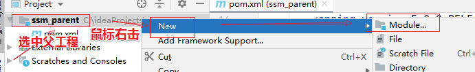 

 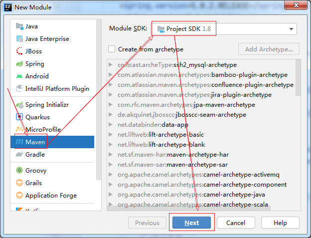 

 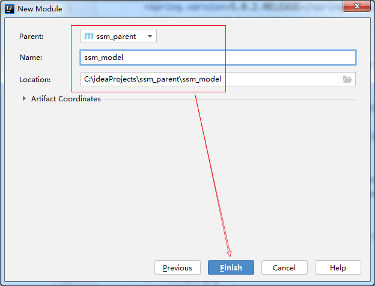

##### 3.2.1 pom.xml

```xml
<?xml version="1.0" encoding="UTF-8"?>
<project xmlns="http://maven.apache.org/POM/4.0.0"
         xmlns:xsi="http://www.w3.org/2001/XMLSchema-instance"
         xsi:schemaLocation="http://maven.apache.org/POM/4.0.0 http://maven.apache.org/xsd/maven-4.0.0.xsd">
    <parent>
        <artifactId>ssm_parent</artifactId>
        <groupId>com.itheima</groupId>
        <version>1.0-SNAPSHOT</version>
    </parent>
    <modelVersion>4.0.0</modelVersion>

    <artifactId>ssm_model</artifactId>
 
    <packaging>jar</packaging>
    
    <dependencies>
        <dependency>
            <groupId>org.projectlombok</groupId>
            <artifactId>lombok</artifactId>
        </dependency>
    </dependencies>

</project>
```

**此时父工程的pom.xml显示**

```xml
<modules>
    <module>ssm_model</module>
</modules>
```

##### 3.2.2 编写Items

```java
package com.itheima.pojo;

import java.util.Date;

@Data
public class Items {

    private Integer id;
    private String name;
    private Float price;
    private String pic;
    private Date createtime;
    private String detail;
}
```

##### 3.2.3 打包安装ssm_model 到本地仓库

#### 3.3 创建ssm_dao


##### 3.3.1 pom.xml

```xml
<?xml version="1.0" encoding="UTF-8"?>
<project xmlns="http://maven.apache.org/POM/4.0.0"
         xmlns:xsi="http://www.w3.org/2001/XMLSchema-instance"
         xsi:schemaLocation="http://maven.apache.org/POM/4.0.0 http://maven.apache.org/xsd/maven-4.0.0.xsd">
    <parent>
        <artifactId>ssm_parent</artifactId>
        <groupId>com.itheima</groupId>
        <version>1.0-SNAPSHOT</version>
    </parent>
    <modelVersion>4.0.0</modelVersion>

    <artifactId>ssm_dao</artifactId>

    <!--jar包-->
    <packaging>jar</packaging>

    <!--引入依赖-->
    <dependencies>
        <!--model的依赖-->
        <dependency>
            <groupId>com.itheima</groupId>
            <artifactId>ssm_model</artifactId>
            <version>1.0-SNAPSHOT</version>
        </dependency>

        <!--mybatis-->
        <dependency>
            <groupId>org.mybatis</groupId>
            <artifactId>mybatis</artifactId>
        </dependency>

        <!--MyBatis集成Spring-->
        <dependency>
            <groupId>org.mybatis</groupId>
            <artifactId>mybatis-spring</artifactId>
        </dependency>

        <!--数据源-->
        <dependency>
            <groupId>com.alibaba</groupId>
            <artifactId>druid</artifactId>
        </dependency>

        <!--MySQL数据库驱动-->
        <dependency>
            <groupId>mysql</groupId>
            <artifactId>mysql-connector-java</artifactId>
        </dependency>

        <!--SpringJdbc -->
        <dependency>
            <groupId>org.springframework</groupId>
            <artifactId>spring-jdbc</artifactId>
        </dependency>

        <!-- log start -->
        <dependency>
            <groupId>org.slf4j</groupId>
            <artifactId>slf4j-log4j12</artifactId>
        </dependency>
        <!-- log end -->
        
        <dependency>
            <groupId>org.springframework</groupId>
            <artifactId>spring-context</artifactId>
        </dependency>
    </dependencies>
</project>
```

**此时查看父工程pom.xml**

```xml
<modules>
    <module>ssm_model</module>
    <module>ssm_dao</module>
</modules>
```


##### 3.3.2 spring-mybatis.xml

在resources下创建spring-mybatis.xml

```xml
<?xml version="1.0" encoding="UTF-8"?>
<beans xmlns="http://www.springframework.org/schema/beans"
       xmlns:xsi="http://www.w3.org/2001/XMLSchema-instance"
       xsi:schemaLocation="http://www.springframework.org/schema/beans http://www.springframework.org/schema/beans/spring-beans.xsd">
    <!--1.数据库连接池-->
    <bean id="dataSource" class="com.alibaba.druid.pool.DruidDataSource">
        <property name="driverClassName" value="com.mysql.jdbc.Driver"/>
        <property name="url" value="jdbc:mysql://localhost:3306/你的数据库?characterEncoding=utf8"/>
        <property name="username" value="root"/>
        <property name="password" value="root用户的密码"/>
    </bean>

    <!--2.配置sqlSessionFactoryBean-->
    <bean id="sqlSessionFactory" class="org.mybatis.spring.SqlSessionFactoryBean">
        <!--配置数据源-->
        <property name="dataSource" ref="dataSource"/>
        <!--别名配置 【注意】包名的拼写是否正确-->
        <property name="typeAliasesPackage" value="com.itheima.pojo"/>
    </bean>
    <!--3.dao接口扫描-->
    <bean class="org.mybatis.spring.mapper.MapperScannerConfigurer">
        <!--【注意】包名的拼写是否正确-->
        <property name="basePackage" value="com.itheima.dao"/>
    </bean>
</beans>
```

##### 3.3.3 ItemsDao.java

```java
public interface ItemsDao {

    /***
     * 查询所有
     * @return
     */
    List<Items> findAll();

    /***
     * 保存操作
     * @param items
     * @return
     */
    int save(Items items);
}
```

##### 3.3.4 ItemsDao.xml

在com/itheima/dao/ItemsDao.xml

```xml
<?xml version="1.0" encoding="UTF-8" ?>
<!DOCTYPE mapper
        PUBLIC "-//mybatis.org//DTD Mapper 3.0//EN"
        "http://mybatis.org/dtd/mybatis-3-mapper.dtd">

<!--
    namespace="Dao接口的全限定名"
-->
<mapper namespace="com.itheima.dao.ItemsDao">

    <!--保存操作-->
    <insert id="save" parameterType="Items">
        INSERT  INTO items(name,price,pic,createtime,detail) VALUES(#{name},#{price},#{pic},#{createtime},#{detail})
    </insert>

    <!--查询所有 【注意】这里用的是resultType，不是resultMap -->
    <select id="findAll" resultType="Items">
        SELECT * FROM  items
    </select>

</mapper>
```

##### 3.3.5 sqlMapConfig.xml 

在resources下创建mybatis.xml ， **可以不写这个文件了**

```xml
<?xml version="1.0" encoding="UTF-8" ?>
<!DOCTYPE configuration
        PUBLIC "-//mybatis.org//DTD Config 3.0//EN"
        "http://mybatis.org/dtd/mybatis-3-config.dtd">
<configuration>
</configuration>
```

##### 3.3.6 dao测试

在test下创建DaoTest

```java
package com.itheima.test;

import com.itheima.bean.Items;
import com.itheima.dao.ItemsDao;
import org.junit.Test;
import org.junit.runner.RunWith;
import org.springframework.beans.factory.annotation.Autowired;
import org.springframework.context.ApplicationContext;
import org.springframework.context.support.ClassPathXmlApplicationContext;

import java.util.List;

public class TestItemsDao {

    @Test
    public void testFindAll(){

        //1 创建spring的工厂
        ApplicationContext context = new ClassPathXmlApplicationContext("spring-mybatis.xml");

        //2. 问spring的工厂要ItemsDao的代理对象。
        ItemsDao dao = context.getBean(ItemsDao.class);

        //3. 调用方法
        List<Items> all = dao.findAll();

        System.out.println("all=" + all);

    }
}

```

#### 3.4 创建ssm_service


##### 3.4.1 pom.xml

```xml
<?xml version="1.0" encoding="UTF-8"?>
<project xmlns="http://maven.apache.org/POM/4.0.0"
         xmlns:xsi="http://www.w3.org/2001/XMLSchema-instance"
         xsi:schemaLocation="http://maven.apache.org/POM/4.0.0 http://maven.apache.org/xsd/maven-4.0.0.xsd">
    <parent>
        <artifactId>ssm_parent</artifactId>
        <groupId>com.itheima</groupId>
        <version>1.0-SNAPSHOT</version>
    </parent>
    <modelVersion>4.0.0</modelVersion>

    <artifactId>ssm_service</artifactId>

    <!--jar包-->
    <packaging>jar</packaging>

    <!--依赖-->
    <dependencies>
        <!--依赖dao-->
        <dependency>
            <groupId>com.itheima</groupId>
            <artifactId>ssm_dao</artifactId>
            <version>1.0-SNAPSHOT</version>
        </dependency>

        <!-- spring -->
        <dependency>
            <groupId>org.aspectj</groupId>
            <artifactId>aspectjweaver</artifactId>
        </dependency>

        <dependency>
            <groupId>org.springframework</groupId>
            <artifactId>spring-aop</artifactId>
        </dependency>

        <dependency>
            <groupId>org.springframework</groupId>
            <artifactId>spring-context</artifactId>
        </dependency>

        <dependency>
            <groupId>org.springframework</groupId>
            <artifactId>spring-tx</artifactId>
        </dependency>
    </dependencies>
</project>
```

**此时父工程的pom.xml显示**

```xml
<modules>
    <module>ssm_model</module>
    <module>ssm_dao</module>
    <module>ssm_service</module>
</modules>
```

##### 3.4.2 spring-service.xml

```xml
<?xml version="1.0" encoding="UTF-8"?>
<beans xmlns="http://www.springframework.org/schema/beans"
       xmlns:xsi="http://www.w3.org/2001/XMLSchema-instance"
       xmlns:context="http://www.springframework.org/schema/context" xmlns:tx="http://www.springframework.org/schema/tx"
       xsi:schemaLocation="http://www.springframework.org/schema/beans http://www.springframework.org/schema/beans/spring-beans.xsd http://www.springframework.org/schema/context http://www.springframework.org/schema/context/spring-context.xsd http://www.springframework.org/schema/tx http://www.springframework.org/schema/tx/spring-tx.xsd">


    <!--  1. 引入|导入 dao层的配置文件 spring-mybatis.xml-->
    <import resource="spring-mybatis.xml"/>

    <!--2. 配置事务-->

    <!--配置事务管理员，需要指定进来datasource-->
    <bean id="tm" class="org.springframework.jdbc.datasource.DataSourceTransactionManager">
        <property name="dataSource" ref="ds"/>
    </bean>

    <!--配置事务的注解驱动-->
    <tx:annotation-driven transaction-manager="tm"/>


    <!--3. 扫描指定包-->
    <context:component-scan base-package="com.itheima"/>


</beans>
```

 

##### 3.4.3 ItemsService接口

```java
public interface ItemsService {

    /***
     * 列表查询
     * @return
     */
    List<Items> findAll();

    /***
     * 增加商品
     * @param items
     * @return
     */
    int save(Items items);
}
```

##### 3.4.4 ItemsServiceImpl

```java
package com.itheima.service.impl;

import com.itheima.bean.Items;
import com.itheima.dao.ItemsDao;
import com.itheima.service.ItemsService;
import org.springframework.beans.factory.annotation.Autowired;
import org.springframework.stereotype.Service;
import org.springframework.transaction.annotation.Transactional;

import java.util.List;

@Transactional //使用事务
@Service
public class ItemsServiceImpl implements ItemsService {

    @Autowired
    private ItemsDao dao ;

    public List<Items> findAll() {
        return dao.findAll();
    }

    public int save(Items items) {
        int  row  = dao.save(items);
        //int a = 1 / 0 ;
        return row ;
    }
}

```

##### 3.4.5 service测试

```java
package com.itheima.test;

import com.itheima.bean.Items;
import com.itheima.service.ItemsService;
import org.junit.Test;
import org.springframework.context.ApplicationContext;
import org.springframework.context.support.ClassPathXmlApplicationContext;

public class TestItemsServiceImpl {

    @Test
    public void testFindAll(){

        //1 建工厂
        ApplicationContext context = new ClassPathXmlApplicationContext("spring-service.xml");

        //2. 问工厂要对象
        ItemsService is = context.getBean(ItemsService.class);

        //3. 调用方法
        System.out.println(is.findAll());


    }

    @Test
    public void testSave(){

        //1 建工厂
        ApplicationContext context = new ClassPathXmlApplicationContext("spring-service.xml");

        //2. 问工厂要对象
        ItemsService is = context.getBean(ItemsService.class);

        //3. 调用方法
        Items i = new Items();
        i.setName("yyyyy");
        int row = is.save(i);
        System.out.println("row=" + row);


    }
}

```


#### 3.5 创建ssm_web


##### 3.5.1 pom.xml

```xml
<?xml version="1.0" encoding="UTF-8"?>
<project xmlns="http://maven.apache.org/POM/4.0.0"
         xmlns:xsi="http://www.w3.org/2001/XMLSchema-instance"
         xsi:schemaLocation="http://maven.apache.org/POM/4.0.0 http://maven.apache.org/xsd/maven-4.0.0.xsd">
    <parent>
        <artifactId>ssm_parent</artifactId>
        <groupId>com.itheima</groupId>
        <version>1.0-SNAPSHOT</version>
    </parent>
    <modelVersion>4.0.0</modelVersion>

    <artifactId>ssm_web</artifactId>

    <!--war包-->
    <packaging>war</packaging>

    <!--依赖引入-->
    <dependencies>
        <!--依赖service-->
        <dependency>
            <groupId>com.itheima</groupId>
            <artifactId>ssm_service</artifactId>
            <version>1.0-SNAPSHOT</version>
        </dependency>

	    <!--导入springmvc-->
        <dependency>
            <groupId>org.springframework</groupId>
            <artifactId>spring-web</artifactId>
        </dependency>

        <dependency>
            <groupId>org.springframework</groupId>
            <artifactId>spring-webmvc</artifactId>
        </dependency>

        <!--servletAPI -->
        <dependency>
            <groupId>javax.servlet</groupId>
            <artifactId>servlet-api</artifactId>
            <scope>provided</scope>
        </dependency>

        <dependency>
            <groupId>javax.servlet.jsp</groupId>
            <artifactId>jsp-api</artifactId>
            <scope>provided</scope>
        </dependency>
        
        <!--jstl表达式 -->
        <dependency>
            <groupId>jstl</groupId>
            <artifactId>jstl</artifactId>
        </dependency>
    </dependencies>

    <build>
        <!--插件-->
        <plugins>
            <!--tomcat插件-->
            <plugin>
                <groupId>org.apache.tomcat.maven</groupId>
                <artifactId>tomcat7-maven-plugin</artifactId>
                <!--插件使用的相关配置-->
                <configuration>
                    <!--端口号-->
                    <port>18081</port> 
                    <!--写当前项目的名字(虚拟路径),如果写/，那么每次访问项目就不需要加项目名字了-->
                    <path>/</path>
                    <!--解决get请求乱码-->
                    <uriEncoding>UTF-8</uriEncoding>
                </configuration>
            </plugin>
        </plugins>
    </build>

</project>
```

**此时查看父工程pom.xml**

```xml
<modules>
    <module>ssm_model</module>
    <module>ssm_dao</module>
    <module>ssm_service</module>
    <module>ssm_web</module>
</modules>
```

##### 3.5.2 ItemsController

```java
package com.itheima.controller;

import com.itheima.bean.Items;
import com.itheima.service.ItemsService;
import org.springframework.beans.factory.annotation.Autowired;
import org.springframework.stereotype.Controller;
import org.springframework.ui.Model;
import org.springframework.web.bind.annotation.RequestMapping;

import java.util.List;

@Controller
@RequestMapping("/items")
public class ItemsController {

    @Autowired
    private ItemsService service;

    //查询所有的
    @RequestMapping("/list")
    public String list(Model model){
        List<Items> list = service.findAll();

        //装到model里面
        model.addAttribute("items" , list);

        //返回页面
        return "items";
    }

    /**
     * 添加 ，添加完成之后，跳转到list方法去，查询出来所有的内容，然后再到items页面去显示。
     * @param items
     * @return
     */
    @RequestMapping("/save")
    public String save(Items items){
        service.save(items);
        return "redirect:/items/list";
    }
}

```

##### 3.5.3 springmvc.xml

```xml
<?xml version="1.0" encoding="UTF-8"?>
<beans xmlns="http://www.springframework.org/schema/beans"
       xmlns:xsi="http://www.w3.org/2001/XMLSchema-instance"
       xmlns:context="http://www.springframework.org/schema/context"
       xmlns:mvc="http://www.springframework.org/schema/mvc"
       xsi:schemaLocation="http://www.springframework.org/schema/beans http://www.springframework.org/schema/beans/spring-beans.xsd http://www.springframework.org/schema/context http://www.springframework.org/schema/context/spring-context.xsd http://www.springframework.org/schema/mvc http://www.springframework.org/schema/mvc/spring-mvc.xsd">


<!--    1. 扫描包-->
    <context:component-scan base-package="com.itheima"/>
<!--    2. 注解开关-->
    <mvc:annotation-driven/>

<!--    3. 静态资源处理-->
    <mvc:default-servlet-handler/>

<!--    4. 视图解析器-->
    <bean class="org.springframework.web.servlet.view.InternalResourceViewResolver">
        <property name="prefix"  value="/WEB-INF/pages/"/>
        <property name="suffix" value=".jsp"/>
    </bean>

    <!--
        5. 导入service模块里面的配置文件 ： spring-service.xml
     -->
    <import resource="spring-service.xml"/>
</beans>
```

##### 3.5.4 web.xml 

```xml
<?xml version="1.0" encoding="UTF-8"?>
<web-app xmlns:xsi="http://www.w3.org/2001/XMLSchema-instance"
	xmlns="http://java.sun.com/xml/ns/javaee"
	xsi:schemaLocation="http://java.sun.com/xml/ns/javaee http://java.sun.com/xml/ns/javaee/web-app_2_5.xsd"
	version="2.5">

	<!--配置前端控制器 DispatcherServlet-->
		<servlet>
			<servlet-name>dispatcher</servlet-name>
			<servlet-class>org.springframework.web.servlet.DispatcherServlet</servlet-class>

			<init-param>
				<param-name>contextConfigLocation</param-name>
				<param-value>classpath:springmvc.xml</param-value>
			</init-param>

			<load-on-startup>1</load-on-startup>
		</servlet>

		<servlet-mapping>
			<servlet-name>dispatcher</servlet-name>
			<url-pattern>/</url-pattern>
		</servlet-mapping>

	<!--springmvc已经定义好了过滤器，可以帮助我们解决post请求，中文乱码的问题，我们只需要配置即可-->
		<filter>
			<filter-name>char</filter-name>
			<filter-class>org.springframework.web.filter.CharacterEncodingFilter</filter-class>

			<!--设置编码，通过初始化参数来设置编码-->
			<init-param>
				<param-name>encoding</param-name>
				<param-value>utf-8</param-value>
			</init-param>
		</filter>

		<filter-mapping>
			<filter-name>char</filter-name>
			<url-pattern>/*</url-pattern>
		</filter-mapping>
</web-app>
```

##### 3.5.5 items.jsp

在/WEB-INF/pages/创建items.jsp

```html
<%@ page contentType="text/html;charset=UTF-8" language="java" %>
<%@taglib prefix="c" uri="http://java.sun.com/jsp/jstl/core" %>
<html>
<head>
    <title>新增/查询</title>
</head>
<body>
<table>
    <form action="/items/save" method="post">
        <table>
            <tr>
                <td>名称</td>
                <td><input type="text" name="name"/></td>
            </tr>
            <tr>
                <td>价格</td>
                <td><input type="text" name="price"/></td>
            </tr>
            <tr>
                <td>图片</td>
                <td><input type="text" name="pic"/></td>
            </tr>
            <tr>
                <td>创建日期</td>
                <td><input type="text" name="createtime"/></td>
            </tr>
            <tr>
                <td>详情</td>
                <td><input type="text" name="detail"/></td>
            </tr>
            <tr>
                <td colspan="2">
                    <input type="submit" value="提交"/>
                </td>
            </tr>
        </table>
    </form>
</table>
<hr>
<table border="1">
    <tr>
        <td>ID</td>
        <td>name</td>
        <td>price</td>
        <td>pic</td>
        <td>createTime</td>
        <td>detail</td>
        <td></td>
    </tr>
    <c:forEach items="${items}" var="item">
        <tr>
            <td>${item.id}</td>
            <td>${item.name}</td>
            <td>${item.price}</td>
            <td>${item.pic}</td>
            <td>${item.createtime}</td>
            <td>${item.detail}</td>
        </tr>
    </c:forEach>
</table>

</body>
</html>
```

#### 3.6 测试

##### 3.6.1 方式一：tomcat插件发布（配置父工程）【单web工程使用】

> 把tomcat插件配置到父工程里面去。

 

使用http://localhost:18081/items/list测试：

 


##### 3.6.2 方式二：tomcat插件发布（配置web工程）【不推荐】

> 把tomcat插件，配置在web项目里面，启动web项目

在父工程打包

 

所有的子工程都会被打包（package）。这就是“聚合”的作用。

也可以同时安装（install），同时部署（deploy）

 

【小结】

使用maven内置的tomcat插件的时候 ：

第一种：配置D:\ideaProjects\ssm_parent：parent是有聚合的功能，不需要将ssm_parent，ssm_model，ssm_dao，ssm_service安装到本地仓库。

第二种：配置D:\ideaProjects\ssm_parent\ssm_web：需要将ssm_parent，ssm_model，ssm_dao，ssm_service安装到本地仓库。

##### 3.6.3 方式三：发布到外部tomcat

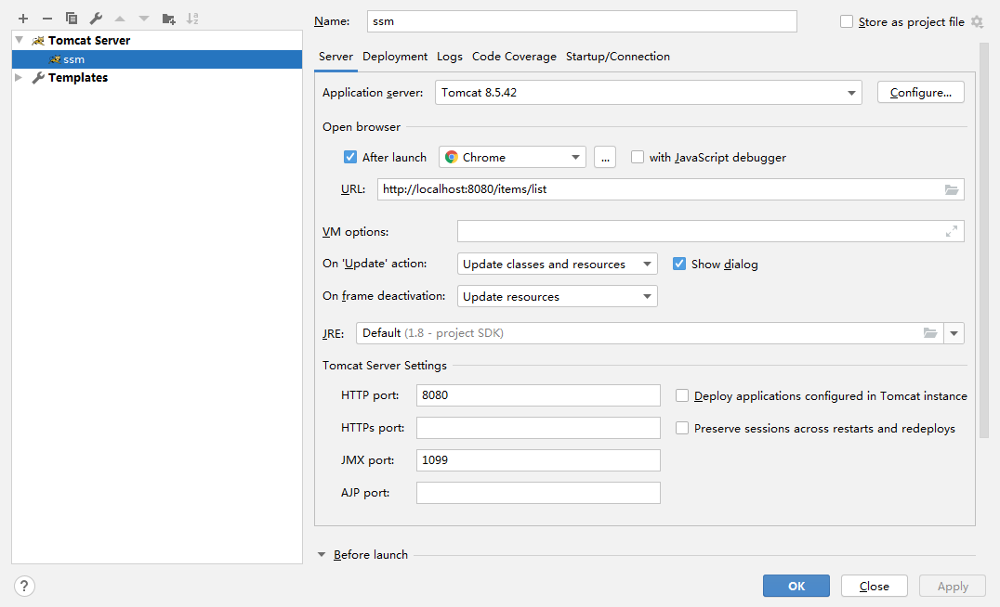 

【注意】：要选择xxx_web:war exploded的，不要选择错了

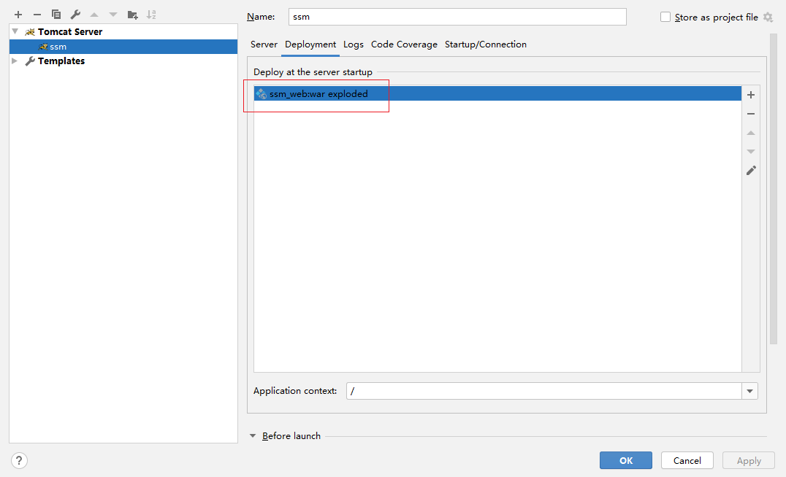 

使用http://localhost:8080/items/list测试：

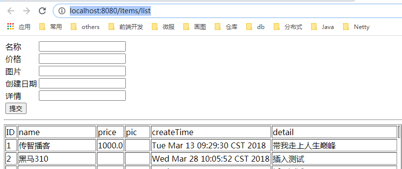 

#### 3.7 maven依赖报错处理

当下载jar的时候，如果断网，或者连接超时的时候，会自动在文件夹中创建一个名为*.lastupdate的文件，当有了这个文件之后，当你再次联网的时候，那么该文件不会再自动联网，必须手动删除jar包的文件夹，才能正常下载使用。如何删除呢？

使用工具：

 

 

如何使用？打开工具

 

双击运行

 

Maven项目，如果正在下载一个jar，但是突然断网，此时，就会产生一个m2e-lastUpdated.，别指望下次上网就会自动下载，必须手动删除该文件，然后再进行下载。

### 4.小结

1：拆分与聚合和继承 

​	拆分：解耦，代码最大程度的重复使用，维护方便

​	聚合：靠父工程来聚合，单一工程是没法完成工作。

​    继承：父工程引入依赖，子工程就不需要再引了, 父式程依赖的版本管理

2: Maven的jar包冲突解决

* 路径近者优先
* 路径相同，第一声明优先
* 路径相同，使用强制排除exclusions

3：准备数据库环境

* ssm_parent（父工程）聚合，引入依赖管理

* ssm_model（子工程） 实体类

* ssm_dao（子工程） mybatis, dataSource, sqlSessionFactorybean, MapperScannerConfigurer

  注：映射文件的路径必须与包名路径一样

* ssm_service（子工程）

  扫service包，事务管理器，通知、切面, 导入dao的配置。

* ssm_web（子工程）

  * SpringMVC.xml 扫controller, 视图解析器，注解驱动，静态资源过滤，导入service配置
  * web.xml 编码过滤器，前端核心控制器(load-on-startup)

8：测试（工程发布tomcat）

* 推荐使用本地tomcat

# 第二章 - Git

## 知识点-Git介绍

### 1.目标

了解Git与Svn区别

### 2.路径

1：svn是什么

2：git是什么

3：了解Git与Svn区别

### 3.讲解

 

同生活中的许多伟大事件一样，Git 诞生于一个极富纷争大举创新的年代。Linux 内核开源项目有着为数众广的参与者。绝大多数的 Linux 内核维护工作都花在了提交补丁和保存归档的繁琐事务上（1991－2002年间）。到 2002 年，整个项目组开始启用分布式版本控制系统 BitKeeper 来管理和维护代码。

到 2005 年的时候，开发 BitKeeper 的商业公司同 Linux 内核开源社区的合作关系结束，他们收回了免费使用 BitKeeper 的权力。这就迫使 Linux 开源社区（特别是 Linux的缔造者 Linus Torvalds ）不得不吸取教训，只有开发一套属于自己的版本控制系统才不至于重蹈覆辙。他们对新的系统订了若干目标：

• 速度

• 简单的设计

• 对非线性开发模式的强力支持（允许上千个并行开发的分支）

• 完全分布式

• 有能力高效管理类似 Linux 内核一样的超大规模项目（速度和数据量）

#### 3.1 **Git与svn对比**

SVN:

SVN是集中式版本控制系统，版本库是集中放在中央服务器的，而干活的时候，用的都是自己的电脑，所以首先要从中央服务器哪里得到最新的版本，然后干活，干完后，需要把自己做完的活推送到中央服务器。集中式版本控制系统是必须联网才能工作，如果在局域网还可以，带宽够大，速度够快，如果在互联网下，如果网速慢的话，就郁闷了。下图就是标准的集中式版本控制工具管理方式：

 

集中管理方式在一定程度上看到其他开发人员在干什么，而管理员也可以很轻松掌握每个人的开发权限。

但是相较于其优点而言，集中式版本控制工具缺点很明显：

- 服务器单点故障


- 容错性差 

Git:

Git是分布式版本控制系统，那么它就没有中央服务器的，每个人的电脑就是一个完整的版本库，这样，工作的时候就不需要联网了，因为版本（仓库）都是在自己的电脑上。既然每个人的电脑都有一个完整的版本库，那多个人如何协作呢？比如说自己在电脑上改了文件A，可以将文件A提交到本地版本库；其他人也在电脑上改了文件A，也可以将文件A提交到自己的本地版本库，这时，你们俩之间只需把本地版本库的内容各自的修改推送给对方（使用共享版本库，例如github、码云...），就可以互相看到对方的修改了。

#### 3.2 git工作流程（重点）

一般工作流程如下：

1．从远程仓库中克隆 Git 资源作为本地仓库。

2．从本地仓库中checkout代码然后进行代码修改

3．在提交前先将代码提交到暂存区。

4．提交执行commit命令。提交到本地仓库。本地仓库中保存修改的各个历史版本。

5．在修改完成后，需要和团队成员共享代码时，可以将本地仓库的代码push到远程仓库。

下图展示了 Git 的工作流程：

 

### 4.小结

1.Git与SVN区别

svn：集中式版本控制工具（服务器完成对文件的版本控制）（一个仓库）

git：分布式版本控制工具（客户端、服务器都可以完成对文件的版本控制）（两个仓库，本地仓库、远程仓库）

2：本地仓库：

​	命令：add（添加到暂存区）；commit（提交到本地仓库）

3：远程仓库：

​	命令：clone （远程仓库的代码克隆到本地仓库）；pull （将代码从远程仓库拉取到本地开发）；push（将代码从本地仓库推送到远程仓库）

​	clone与pull的区别

​	   clone：第一次连接远程仓库

​		pull：第一次用clone命令，后续的都用pull命令拉取内容

## 知识点-Git 安装

最早Git是在Linux上开发的，很长一段时间内，Git也只能在Linux和Unix系统上跑。不过，慢慢地有人把它移植到了Windows上。现在，Git可以在Linux、Unix、Mac和Windows这几大平台上正常运行了。由于开发机大多数情况都是windows，所以本教程只讲解windows下的git的安装及使用。

### 1. 目标

掌握git的安装

### 2. 路径

1：软件下载

2：软件安装

​	（1）安装Git for windows

​	（2）安装TortoiseGit客户端

​	（3）安装TortoiseGit中文语言包

### 3. 讲解

#### 3.1 软件下载

下载地址：

<https://git-scm.com/download>

 

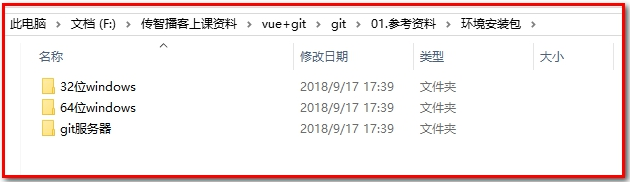 

参考资料中安装包已经下载完毕，根据不同的操作系统选择对应的安装包。

#### 3.2 **软件安装**

##### 3.2.1 **安装git for windows**

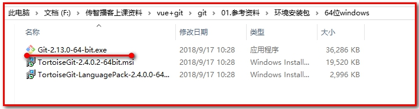 

 

一路“下一步”使用默认选项即可。

我这里安装到D盘

 

判断是否安装成功，输入git --version

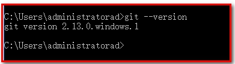  

##### 3.2.2 安装TortoiseGit

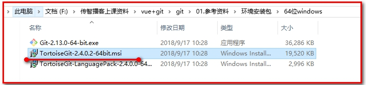  

  

一路“下一步”使用默认选项即可。

默认选项下会启动配置画面：

  

由于目前只有英文语言包，默认即可继续下一步。

配置git.exe，在4.2.1中已经安装过git-for-windows了所以在此找到git.exe所在的目录。

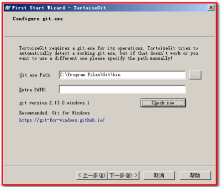  

配置开发者姓名及邮箱，每次提交代码时都会把此信息包含到提交的信息中。

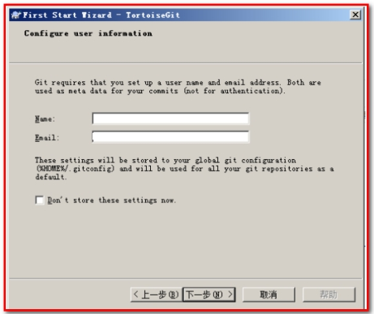  

安装完成后，查看机器的用户和email

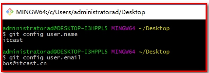  

  

使用默认配置，点击“完成”按钮完成配置。

完整完毕后在系统右键菜单中会出现git的菜单项。

  

##### 3.2.3 安装中文语言包

安装中文语言包并不是必选项。可以根据个人情况来选择安装。

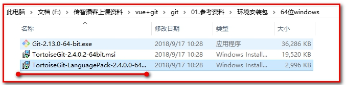  

   

直接“下一步”完整完毕。

语言包安装完毕后可以在TortoiseGit的”设置”中调整语言

   

### 4. 小结

​	（1）安装Git for windows（先安装Git，再安装TortoiseGit）

​		安装成功，在cmd下执行，git --version

​	（2）安装TortoiseGit客户端（重启电脑 重启电脑 重启电脑） 重启一次

​	（3）安装TortoiseGit中文语言包

## 知识点-操作本地仓库【重点】

### 1. 目标

使用git在本地仓库完成版本控制，及相关命令的使用。

### 2. 路径

1. 创建版本库

2. 添加文件

3. 修改文件

4. 删除文件

5. 删除文件并保留副本

6. 将java工程提交到版本库

7. 忽略文件（提交版本库时，可忽略某些文件）

### 3. 讲解

#### 3.1 创建版本库

​	什么是版本库呢？版本库又名仓库，英文名repository，你可以简单理解成一个目录，这个目录里面的所有文件都可以被Git管理起来，每个文件的新增、修改、删除，Git都能跟踪，以便任何时刻都可以追踪历史，或者在将来某个时刻可以“还原”。由于git是分布式版本管理工具，所以git在不需要联网的情况下也具有完整的版本管理能力。

​	创建一个版本库非常简单，可以使用git bash也可以使用TortoiseGit。首先，选择一个合适的地方，创建一个空目录（F:\repository）。

##### 3.1.1 使用GitBash

在当前目录中点击右键中选择Git Bash来启动。

     

或者在开始菜单中启动。注意如果是从开始菜单启动的gitbash需要切换目录到仓库所在的目录。

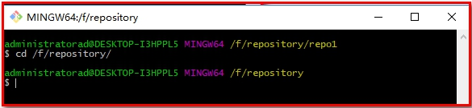   

创建仓库执行命令：

$ git init

   

查看

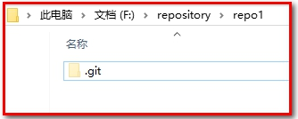   

测试一下，git --bare init

   

##### 3.1.2 使用TortoiseGit

使用TortoiseGit时只需要在目录中点击右键菜单选择“在这里创建版本库”

   

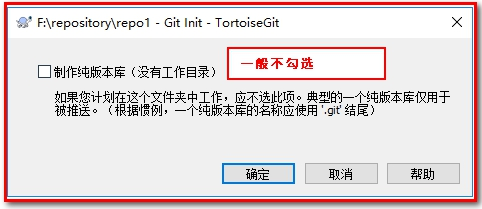   

 

版本库创建成功，会在此目录下创建一个.git的隐藏目录（叫做版本库），如下所示：

 

在windows中如何显示隐藏目录？

 

 

**概念：**

**版本库**：“.git”目录就是版本库，将来文件都需要保存到版本库中。

**工作目录（工作区）**：包含“.git”文件夹的目录，就是工作目录。 这个工作目录里面的内容都可以被保存到版本库中

 

#### 3.2 添加文件

##### 3.2.1 添加文件过程

在F:\repository目录下创建一个mytest.txt文件

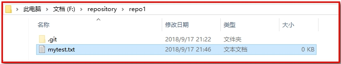 

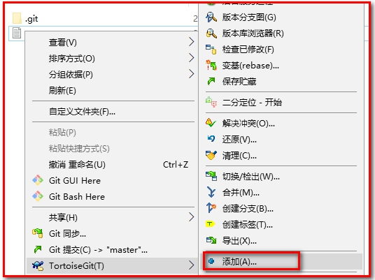 

 

文本文件变为带“+”号的图标，表示该文件被放置到暂存区中：

 

提交文件：在mytest.txt上再次点击右键选择“提交”，此时将文件保存至版本库中。

 

 

 

查看文件：

 

##### 3.2.2 工作区和暂存区

Git和其他版本控制系统如SVN的一个不同之处就是有暂存区的概念。

什么是工作区（Working Directory）？

​	工作区就是你在电脑里能看到的目录，比如我的reporstory/repo1文件夹就是一个工作区。

什么是版本库？

​	在这个工作区目录中的“.git”隐藏文件夹是版本库。

​	Git的版本库里存了很多东西，其中最重要的就是称为stage（或者叫index）的暂存区，还有Git为我们自动创建的第一个分支master，以及指向master的一个指针叫HEAD。

如下图所示：


​	分支和HEAD的概念我们稍后再讲。前面讲了我们把文件往Git版本库里添加的时候，是分两步执行的：

​	第一步是用git add把文件添加进去，实际上就是把文件修改添加到暂存区；

​	第二步是用git commit提交更改，实际上就是把暂存区的所有内容提交到当前分支（默认是master）。

 

​	因为我们创建Git版本库时，Git自动为我们创建了唯一一个master分支，所以，现在，git commit就是往master分支上提交更改。

​	你可以简单理解为，需要提交的文件修改通通放到暂存区，然后，一次性提交暂存区的所有修改。

​	查看版本库，可点击“版本库浏览器”

 

 

#### 3.3 修改文件

##### 3.3.1 提交修改

被版本库管理的文件不可避免的要发生修改，此时只需要直接对文件修改即可。修改完毕后需要将文件的修改提交到版本库。

在mytest.txt文件上点击右键，然后选择“提交”
 

 

 

##### 3.3.2 查看修改历史

在开发过程中可能会经常查看代码的修改历史，或者叫做修改日志。来查看某个版本是谁修改的，什么时间修改的，修改了哪些内容。

可以在文件上点击右键选择“显示日志”来查看文件的修改历史。

 

 

可以【导出】指定版本，如果编写错误，用于还原到历史版本。

 

##### 3.3.3 差异比较

当文件内容修改后，需要和修改之前对比一下修改了哪些内容此时可以使用“比较差异功能”

 

 

##### 3.3.4 还原修改

当文件修改后不想把修改的内容提交，还想还原到未修改之前的状态。此时可以使用“还原”功能

 

 

 

**注意：此操作会撤销所有未提交的修改，所以当使用还原操作是需要慎重慎重！！！**

#### 3.4 删除文件

##### 3.4.1 彻底删除

需要删除无用的文件时可以使用git提供的删除功能直接将文件从版本库中删除。

 

此时不是真的删除，可以通过还原功能，还原文件。

 

如果真的想删除文件，可以选择【提交】

 

如果文件版本库也被删除，此时本地文件彻底丢失了。

##### 3.4.2  删除文件并保留副本

 

 

此时文件删除，但是本地参考仍然存在，执行【提交】可以删除版本库的文件，但是mytest3.txt在本地会保留。

 

【提交】后，查看仓库，可以查看本地是存在副本文件。

 

#### 3.5 案例：提交工程并忽略

第一步：将参考资料中的java工程HelloProjet复制到工作目录中

第二步：将工程添加到暂存区。

 

 

 

点击确定

 

点击【确定】完成暂存区添加。

第三步：忽略文件或文件夹【重点】

在此工程中，并不是所有文件都需要保存到版本库中的例如“out”目录及目录下的文件就可以忽略。好在Git考虑到了大家的感受，这个问题解决起来也很简单，在Git工作区的根目录下创建一个特殊的.gitignore文件，然后把要忽略的文件名填进去，Git就会自动忽略这些文件。

如果使用TortoiseGit的话可以使用菜单项直接进行忽略。

 

 

 

选择保留本地文件。完成后在此文件夹内会多出一个.gitignore文件，这个文件就是文件忽略文件，当然也可以手工编辑。其中的内容就是把.idea和out目录忽略掉。

 

 

打开.gitinore文件

 

第四步：提交代码

将代码添加到master分支上，其中.gitignore文件也需要添加到暂存区，然后提交到版本库。

 

查看版本库浏览器，不会出现.out和.idea的文件，却多出了一个.gitignore的文本文件。

 

【重要：忽略文件要添加的内容】

*.iml
.idea/
target/

#### 3.6 忽略文件（.gitignore）语法规范

空行或是以 # 开头的行即注释行将被忽略。

可以在前面添加正斜杠 / 来避免递归,下面的例子中可以很明白的看出来与下一条的区别。

可以在后面添加正斜杠 / 来忽略文件夹，例如 build/ 即忽略build文件夹。

可以使用 ! 来否定忽略，即比如在前面用了 *.apk ，然后使用 !a.apk ，则这个a.apk不会被忽略。

*用来匹配零个或多个字符，如 *.[oa] 忽略所有以".o"或".a"结尾， *~ 忽略所有以 ~ 结尾的文件（这种文件通常被许多编辑器标记为临时文件）； [] 用来匹配括号内的任一字符，如 [abc] ，也可以在括号内加连接符，如 [0-9] 匹配0至9的数； ? 用来匹配单个字符。 

看了这么多，还是应该来个例子：

.gitignore文件

```
# 忽略 .a 文件
*.a
# 不忽略 lib.a, 尽管已经在前面忽略了 .a 文件
!lib.a
# 仅在当前目录下忽略 TODO 文件， 但不包括子目录下的 subdir/TODO
/TODO
# 忽略 build/ 文件夹下的所有文件
build/
# 忽略 doc/notes.txt, 不包括 doc/server/arch.txt
doc/*.txt
# 忽略所有的 .pdf 文件，包括在 doc/ directory 下的
doc/**/*.pdf
```

### 4. 小结

1：创建版本库

>  git init：初始化仓库(包含工作目录)   --bare[创建的是纯仓库]

2：添加文件

> git add：把文件添加进暂存区
>
> git commit提交文件至本地仓库 添加提交日志

3：修改文件

4：删除文件

5：删除文件并保留副本

6：将java工程提交到版本库【重点-不要提交忽略文件】

7：忽略文件（提交版本库时，可忽略某些文件。提交工程源码与jar和pom.xml，其它不提交）（了解）

   先添加忽略文件 再添加 再提交

## 知识点-操作远程仓库【重点】

### 1.目标

使用git在远程仓库完成版本控制，及相关命令的使用，远程仓库可实现项目组人员之间的文件版本控制

### 2.路径

1：添加到远程仓库

​	（1）在github上创建仓库

​	（2）什么是ssh协议

​	（3）使用ssh协议同步到远程仓库

​	（4）使用https协议同步到远程仓库

2：从远程仓库上克隆

3：从远程仓库取代码

4：解决多人协作中版本冲突问题

### 3.讲解

#### 3.1 添加远程仓库【重点】

现在我们已经在本地创建了一个Git仓库，又想让其他人来协作开发，此时就可以把本地仓库同步到远程仓库，同时还增加了本地仓库的一个备份。

常用的远程仓库就是github：<https://github.com/>，接下来我们演示如何将本地代码同步到github。

##### 3.1.1 在github上创建仓库

首先你得在github上创建一个账号，这个就不演示了。然后在github上创建一个仓库：

官网：<https://github.com/>

注册账号：

 

登录：

 

新建仓库

 

登录后：选择Start a project

 

 

点击“create repository”按钮仓库就创建成功了。

 

Github支持两种同步方式“https”和“ssh”。如果使用https很简单基本不需要配置就可以使用，但是每次提交代码和下载代码时都需要输入用户名和密码（github注册的账号和密码）。如果使用ssh方式就需要客户端先生成一个密钥对，即一个公钥一个私钥。然后还需要把公钥放到githib的服务器上。这两种方式在实际开发中都有应用，所以我们都需要掌握。接下来我们先看ssh方式。

##### 3.1.2 ssh协议

###### 3.1.2.1 什么是ssh

SSH 为 Secure Shell（安全外壳协议）的缩写，由 IETF 的网络小组（Network Working Group）所制定。SSH 是目前较可靠，专为远程登录会话和其他网络服务提供安全性的协议。利用 SSH 协议可以有效防止远程管理过程中的信息泄露问题。

###### 3.1.2.2 基于密匙的安全验证

使用ssh协议通信时，推荐使用基于密钥的验证方式。你必须为自己创建一对密匙（第1步），并把公用密匙放在需要访问的服务器上（第2步）。如果你要连接到SSH服务器上，客户端软件就会向服务器发出请求，请求用你的密匙进行安全验证。服务器收到请求之后，先在该服务器上你的主目录下寻找你的公用密匙，然后把它和你发送过来的公用密匙进行比较。如果两个密匙一致，服务器就用公用密匙加密“质询”（challenge）并把它发送给客户端软件。客户端软件收到“质询”之后就可以用你的私人密匙解密再把它发送给服务器。

###### 6.1.2.3 **s**sh密钥生成

在windows下我们可以使用 Git Bash.exe来生成密钥，可以通过开始菜单或者右键菜单打开Git Bash

   

git bash 执行命令,生命公钥和私钥

```
命令: ssh-keygen -t rsa -C ‘邮箱’
其中’邮箱’为注册github的登录账号的邮箱（也可使用github注册的账号）
当你创建ssh的时候：-t 表示密钥的类型 ，-b表示密钥的长度，-C 用于识别这个密钥的注释 ，这个注释你可以输入任何内容，很多网站和软件用这个注释作为密钥的名字
一路回车即可
```

**当你创建ssh的时候：-t 表示密钥的类型 ，-b表示密钥的长度，-C 用于识别这个密钥的注释 ，这个注释你可以输入任何内容，很多网站和软件用这个注释作为密钥的名字**

**一路回车即可**

 

执行命令完成后,在window本地用户.ssh目录C:\Users\用户名\.ssh下面生成如下名称的公钥和私钥:

 

###### 6.1.2.4 **ssh密钥配置**

密钥生成后需要在github上配置密钥本地才可以顺利访问。

 

 

在key部分将id_rsa.pub文件内容添加进去，然后点击“Add SSH key”按钮完成配置。

 

##### 3.1.3 使用ssh协议同步到远程仓库

同步到远程仓库可以使用git bash也可以使用tortoiseGit

###### 3.1.3.1 使用git bash

在仓库所在的目录（F:\repository）点击右键选择“Git Bash Here”，启动git bash程序。

 

然后在git bash中执行如下语句：

```bash
git remote add origin git@github.com:itcast888/mytest.git 【后面的地址换成自己的仓库地址】
git push -u origin master
```

其中：origin就是一个名字，它是在你clone一个托管在Github上代码库时，git为你默认创建的指向这个远程代码库的标签， origin指向的是repository，master只是这个repository中默认创建的第一个分支。

 

==如果==出现如下错误：

 

可以先执行如下命令，然后再执行上面的命令

$ git remote rm origin，表示删除origin

 

查看github

 

###### 3.1.3.2 使用TortoiseGit同步

由于TortoiseGit使用的ssh工具是“PuTTY”，git Bash使用的ssh工具是“openSSH”，如果想让TortoiseGit也使用刚才生成的密钥可以做如下配置：

右键，选择“git 同步”

 

点击管理。

 

【注意】：首先保证：ssh客户端需配置成git使用的客户端

 

可以重新创建一个仓库

 

 

Url：远程仓库的地址

推送URL：也是相同的（可以不填写）

Putty密钥：选择刚才生成的密钥中的私钥

 

【推送】：即push指令

查看github

 

##### 3.1.4 使用https协议同步到远程仓库

###### 3.1.4.1 使用git push

等同于ssh协议的操作（省略）

 

###### 3.1.4.2 使用TortoiseGit同步

创建仓库mytest3

 

选择“Git同步”

 

 

 

这时候推送需要输入“用户名”和“密码”，对应注册github的账号和密码。

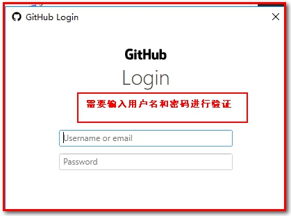 

查看github

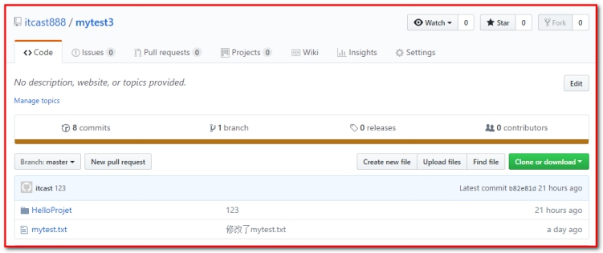 

#### 3.2 从远程仓库克隆

克隆远程仓库也就是从远程把仓库复制一份到本地，克隆后会创建一个新的本地仓库。选择一个任意部署仓库的目录，然后克隆远程仓库。

创建F/repository/clone_repo目录，用来存放clone下来的项目

##### 3.2.1 使用git bash：

找到github中mytest仓库的url，我们先演示使用ssh协议。

 

$ git clone [git@github.com:sublun/mytest.git](mailto:git@github.com:sublun/mytest.git)

 

##### 3.2.2  使用TortoiseGit：

使用远程仓库的mytest3为例，使用https协议克隆：

 

在任意目录点击右键：

 

 

查看：F/repository/clone_repo目录

 

#### 3.3 从远程仓库拉取代码

Git中从远程的分支获取最新的版本到本地有这样2个命令：

```bash
1. git fetch：相当于是从远程获取最新版本到本地，不会自动merge（合并代码）

2. git pull：相当于是从远程获取最新版本并merge到本地，上述命令其实相当于git fetch 和 git merge
```

在实际使用中，git fetch更安全一些，但是不常用！

因为在merge前，我们可以查看更新情况，然后再决定是否合并。

git pull更常用，因为即得代码又可以自动合并

如果使用TortoiseGit的话可以从右键菜单中点击“拉取”（pull）或者“获取”（fetch）

 

#### 3.4 解决版本冲突

##### 3.4.1 制造冲突

第一步：将aaa.txt文件，推送（push）到远程仓库mytest中。

 

 

第二步：从远程仓库mytest中获取代码（pull）

 

 

我们试想一下两边同时修改了aaa.txt，会出现什么结果。

先提交，不会有问题；

后提交，会怎么样？

 

##### 3.4.2 解决冲突

其中，F:/repository/repo1中的aaa.txt先提交到本地仓库，再推送到远程仓库没有问题

而F:/repository/clone_repo1/mytest中的aaa.txt先提交到本地仓库，再推送到远程仓库的时候出现问题。如图：

 

这个时候，出现版本冲突，先拉取（pull）远程仓库的代码到本地。

 

编辑冲突：

 

 

合并成一个新的文件

 

再次推送，没有问题

 

避免冲突： 产生 的原因，在旧版本上做修改，远程仓库已经推送过新的版本了

1. 做完功能先测试完后，找老大，跟他说能不能提交代码
2. 组内成员推送到远程后，通知所有组内成员去拉取
3. 分配任务时，按业务划分，尽量避免操作同一个文件

### 4. 小结

1.按照步骤一步一步来操作即可

## 知识点-分支管理（了解）

### 1.目标

在本地仓库中使用分支，可在一个项目中使用多条路径，完成版本控制。

### 2.路径

1：分支的概念

2：使用TortoiseGit实现分支管理

（1）创建分支

（2）合并分支

（3）解决冲突

（4）删除分支

### 3.讲解

#### 3.1 分支的概念

在我们每次的提交，Git都把它们串成一条时间线，这条时间线就是一个分支。截止到目前，只有一条时间线，在Git里，这个分支叫主分支，即master分支。HEAD指针严格来说不是指向提交，而是指向master，master才是指向提交的，所以，HEAD指向的就是当前分支。

如图：只要有本地仓库就有master分支。

 

一开始的时候，master分支是一条线，Git用master指向最新的提交，再用HEAD指向master，就能确定当前分支，以及当前分支的提交点：

 

每次提交，master分支都会向前移动一步，这样，随着你不断提交，master分支的线也越来越长。

当我们创建新的分支，例如dev时，Git新建了一个指针叫dev，指向master相同的提交，再把HEAD指向dev，就表示当前分支在dev上：

 

你看，Git创建一个分支很快，因为除了增加一个dev指针，改改HEAD的指向，工作区的文件都没有任何变化！

 

不过，从现在开始，对工作区的修改和提交就是针对dev分支了，比如新提交一次后，dev指针往前移动一步，而master指针不变：

 

假如我们在dev上的工作完成了，就可以把dev合并到master上。Git怎么合并呢？最简单的方法，就是直接把master指向dev的当前提交，就完成了合并：

 

所以Git合并分支也很快！就改改指针，工作区内容也不变！

 

合并完分支后，甚至可以删除dev分支。删除dev分支就是把dev指针给删掉，删掉后，我们就剩下了一条master分支：

 

如图：查看分支、合并

 

#### 3.2 使用TortoiseGit实现分支管理

使用TortoiseGit管理分支就很简单了。

##### 3.2.1 创建分支

在本地仓库文件夹中点击右键，然后从菜单中选择“创建分支”：

 

 

如果想创建完毕后直接切换到新分支可以勾选“切换到新分支”选项或者从菜单中选择“切换/检出”来切换分支：

 

右键查看，再提交，指向新的分支。

 

##### 3.2.2 合并分支

分支切换到dev后就可以对工作区的文件进行修改，然后提交到dev分支，原来的master分支不受影响。例如我们修改mytest.txt中的内容，然后提交到dev分支。

 

同时提交到dev的分支上

 

切换到master分支，我们在修改mytest.txt，同时新建master.txt文件，并同时提交

 

 

不难发现，我们切换到master分支/dev分支后还是原来的内容：2个分支的开发互不影响，相互独立的。

 

最后，我们将dev分支的内容合并到master分支，切换当前分支为master。从右键菜单中选择“合并”：

 

再查看mytest.txt、dev.txt、master.txt的内容就已经更新了：

 

解决冲突后提交即可：此时可以提交到主线上。

 

##### 3.2.3 删除分支

右键选择“切换/检出”,选择分支。

 

 

**注意：如果当前分支为dev，则不能删除dev。**

###  4.小结

分支：方便解决bug, 定制化开发，分业务模块构建项目

操作：创建分支，检出分支，切换到主线(master)再合并分支，删除分支

分支的操作由项目经理操作

程序员：

1. 检出分支 (目录A)
2. 复制分支到开发目录（目录B）
3. 使用idea加载项目开发（目录B）
4. 在原有的分支（目录A）上先拉取，再把idea中的项目代码复制到原来的分支下（目录A）进行替换
5. 先比较，解决差异后 再提交分支，推送

## 知识点 -  IDEA中使用git

### 1.目标

在idea使用git完成版本控制

git操作本地仓库（自己进行版本控制）

git操作远程仓库（多人进行版本控制）

### 2.路径

1. 配置Git
2. 创建工程集成Git
3. 推送代码到远程仓库
4. 从远程仓库克隆
5. 从远程仓库拉取
6. 使用分支

### 3.讲解

#### 3.1 在Idea中配置git

​	安装好IntelliJ IDEA后，如果Git安装在默认路径下，那么idea会自动找到git的位置，如果更改了Git的安装位置则需要手动配置下Git的路径。

- 选择File→Settings打开设置窗口，找到Version Control下的git选项：

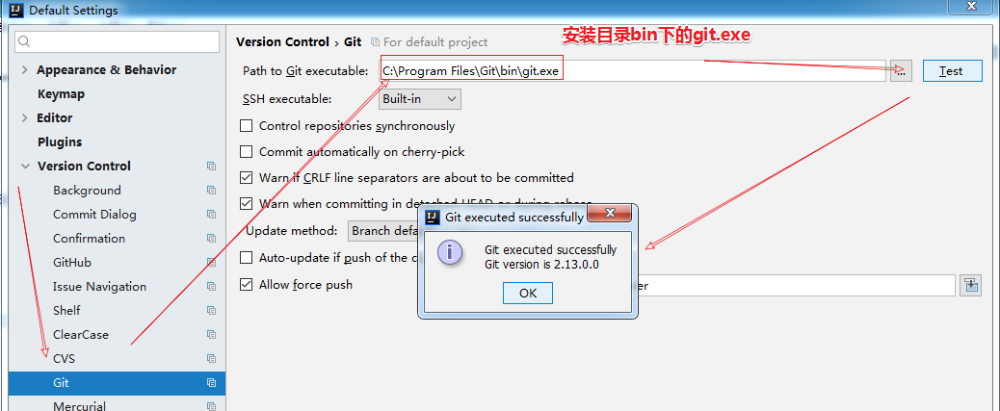 

- 选择git的安装目录后可以点击“Test”按钮测试是否正确配置。

   

- 使用idea操作github远程服务器的时候，在idea中配置用户名和密码，这样使用https协议访问github的时候，不需要输入用户名和密码了。

  

#### 3.2 创建工程集成GIT

##### 3.2.1 创建maven工程

创建Maven工程打包方式为jar包，创建User类

 

 创建本地仓库

在菜单中选择“vcs”→Import into Version Control→Create Git Repository...

 

 

此时样式改变，查看本地工程目录，有绿色箭头。说明创建了本地仓库。


 

##### 3.2.2 添加暂存区

 

##### 3.2.3 提交本地仓库

 


 


提交：样式变化：

 

#### 3.3 远程仓库操作

##### 3.3.1 推送到远程仓库

- 在github上创建一个仓库然后将本地仓库推送到远程。创建远程仓库itcast_git

 

 

​	这里注意：我们使用https的协议连接。

- 在工程上点击右键，选择git→Repository→Remotes，

  

   


- 在工程上点击右键，选择git→Repository→Push，


 


 


##### 3.3.2 从远程仓库克隆

  方式一：选择VCS--->Checkout from Version Control--->GitHub

  

方式二：或者：关闭工程后，在idea的欢迎页上有“Checkout from version control”下拉框，选择git

 

 

- 此处仍然推荐使用https形式的url，

 

 

- 拉取成功

 

##### 3.3.3 修改文件push到远程仓库

- 修改User
- 先commit到本地


 

- 再push到远程

  

##### 3.3.4 从远程仓库拉取


#### 3.4. 在Idea中使用分支（频率低）

- 我们选择VCS--->Git--->Branches，

 

 

- 我们点击“New Branch”，新建一个分支

 

 

 

- 分支操作

 

Checkout：为切换分支

Merge：为合并分支

Delete：删除分支

###  4.小结

1：在idea中配置git

2：将工程添加至git（操作本地仓库，将工程推送到远程仓库）添加.gitignore

3：从远程仓库克隆（远程仓库）

4：从服务端拉取代码（远程仓库）

5：在idea中使用分支（了解）