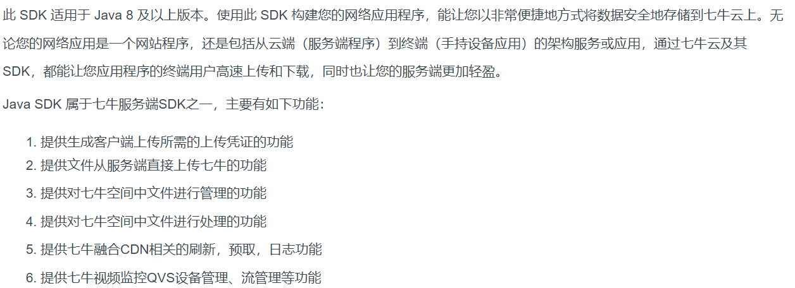

# day50-传智健康第三天

# 学习目标

- [ ] 完成检查组的分页功能
- [ ] 完成检查组的更新功能
- [ ] 会使用七牛云的存储方案
- [ ] 完成新增套餐
- [ ] 能够掌握定时任务Quartz的基本用法
- [ ] 能够使用功能Quartz来清理垃圾图片

# 第一章 - 检查组模块

## 案例-检查组分页

### 1. 目标

 	完成检查组查询分页

### 2. 路径

1：前台代码

（1）定义分页相关模型数据 pagination

（2）定义分页方法 findPage

​		提交pagination,响应结果处理，如果失败则提示，成功则绑定数据(分页结果集绑定dataList, 总记录数pagination.total)

（3）完善分页方法执行时机（点击“查询”，点击“分页”）

2：后台代码

执行

- 检查组分页查询

（1）CheckGroupController.java（Controller）

​		提供findPage方法，调用业务查询，PageResult，把pageResult封装到result再返回给页面

（2）CheckGroupService.java（服务接口）

（3）CheckGroupServiceImpl.java（服务实现类）

​	添加findPage的方法，

	* 判断是否有查询条件，如果有则实现模糊查询，拼接%
	* 使用PageHelper.startPage(页码，大小)
	* 调用dao的findByCondition条件查询，返回page对象
	* 通过page对象获取total,result分页结果集
	* 封装到pageResult，返回给controller

（4）CheckGroupDao.java（Dao接口）

（5）CheckGroupDao.xml（Mapper映射文件）


### 3. 讲解

#### 3.1. 前台代码

##### 3.1.1. 定义分页相关模型数据

```javascript
pagination: {//分页相关模型数据
    currentPage: 1,//当前页码
    pageSize:10,//每页显示的记录数
    total:0,//总记录数
    queryString:null//查询条件
},
dataList: [],//当前页要展示的分页列表数据
```

##### 3.1.2. **定义分页方法**

在页面中提供了findPage方法用于分页查询，为了能够在checkgroup.html页面加载后直接可以展示分页数据，可以在VUE提供的钩子函数created中调用findPage方法

```javascript
//钩子函数，VUE对象初始化完成后自动执行
created() {
    this.findPage();
},
```

findPage()方法。

```javascript
//分页查询
findPage() {

    /*
        1. 来到这个方法，有两个入口：
            1.1. 点击左侧菜单条目： 检查组管理 ， 不带有任何的过滤条件
            1.2. 点击左上角查询： 查询 ， 有可能带有过滤条件
        2. 我们希望这两个入口，都执行一个后台方法就可以了，因为它们都是完成分页的功能
            所不同的是左侧的检查组管理菜单点击，没有任何的过滤条件，顶部的查询操作可能有过滤条件，也可能没有过滤条件
        3. 为了吻合这两种情况，传递给服务器的数据必须包含所有可能存在的参数, 最少要传递三个参数：
            3.1 要查询第几页
            3.2 每页查询多少条
            3.3 查询的条件参数
    */
    console.log("分页查询参数：");
    console.log(this.pagination);

    //1. 发请求
    axios.post("/checkgroup/findPage.do", this.pagination).then(response=>{
        console.log(response);
        if(response.data.flag){
           this.$message.success("查询检查组成功！");
           this.pagination.total = response.data.data.total; //设置总记录数
            this.dataList = response.data.data.rows;
       } else{
           this.$message.error("查询检查组失败！");
       }
    });
},
```

##### 3.1.3. **完善分页方法执行时机**

除了在created钩子函数中调用findPage方法查询分页数据之外，当用户点击查询按钮或者点击分页条中的页码时也需要调用findPage方法重新发起查询请求。

（1）为查询按钮绑定单击事件，调用findPage方法

```html
<el-button @click="handleCurrentChange(1)" class="dalfBut">查询</el-button>
```

 

（2）为分页条组件绑定current-change事件，此事件是分页条组件自己定义的事件，当页码改变时触发，对应的处理函数为handleCurrentChange

```html
<div class="pagination-container">
    <el-pagination
        class="pagiantion"
        @current-change="handleCurrentChange"
        :current-page="pagination.currentPage"
        :page-size="pagination.pageSize"
        layout="total, prev, pager, next, jumper"
        :total="pagination.total">
    </el-pagination>
</div>
```

 

（3）定义handleCurrentChange方法

```javascript
//切换页码
handleCurrentChange(currentPage) {

    //1. 设置当前页
    this.pagination.currentPage = currentPage;

    //2. 再查询一次数据
    this.findPage();
},
```

#### 3.2 **后台代码**

##### 3.2.1. **Controller**

在CheckGroupController中增加分页查询方法

```java
    /**
     * 分页处理
     * @param bean
     * @return
     */
    @RequestMapping("/findPage")
    public Result findPage(@RequestBody QueryPageBean bean){
        //1. 调用service
        PageResult<CheckGroup> pageResult = cs.findPage(bean);

        //2. 封装数据返回
        return new Result(true , MessageConstant.QUERY_CHECKGROUP_SUCCESS , pageResult);
    }
```

##### 3.2.2. Service**服务实现类**

在CheckGroupService服务接口中扩展分页查询方法

```java
     /**
     * 检查组分页
     * @param bean
     * @return
     */
    PageResult<CheckGroup> findPage(QueryPageBean bean);

```

在CheckGroupServiceImpl服务实现类中实现分页查询方法，基于Mybatis分页助手插件实现分页

```java
/**
     * 分页实现
     *  1. service的返回值一般都是从dao返回的。
     *  2. 但是这里要返回PageResult，dao是无法返回PageResult类型的
     *  3. 所以我们要自己手动封装PageResult
     * @param bean
     * @return
     */
    @Override
    public PageResult<CheckGroup> findPage(QueryPageBean bean) {

        //0. 告诉分页插件，想要查询第几页，每页查询多少条
        PageHelper.startPage(bean.getCurrentPage(), bean.getPageSize() );


        //1. 调用dao 返回数据
        Page<CheckGroup> page = dao.findPage(bean);

        //2. 定义数据
        long total = page.getTotal() ; //总的记录数
        List<CheckGroup> rows = page.getResult(); // 当前这一页的集合数据

        //3. 返回
        return new PageResult<CheckGroup>(total , rows );
    }
```

##### 3.2.3. **Dao接口**

在CheckGroupDao接口中扩展分页查询方法

```java
    /**
     * 分页展示
     * @param bean
     * @return
     */
    Page<CheckGroup> findPage(QueryPageBean bean);
```

##### 3.2.4. **Mapper映射文件**

在CheckGroupDao.xml文件中增加SQL定义

```xml
    <!--分页查询-->
    <select id="findPage" parameterType="com.itheima.entity.QueryPageBean" resultType="checkGroup">
        select * from t_checkgroup
      <!--  要考虑到右可能来进行分页查询的时候，是通过点击顶部的查询进来的，有可能携带了查询的参数，
        所以要对查询的参数进行判定，如果有值，就追加where条件-->
      <where>
          <if test="queryString != null and queryString.length > 0">
                code like '%${queryString}%' or name  like '%${queryString}%' or helpCode  like '%${queryString}%'
          </if>
      </where>
    </select>
```

### 4. 小结

 1：前台代码

（1）定义分页相关模型数据

（2）定义分页方法findPage()

（3）完善分页方法执行时机（点击“查询”，点击“分页”）

2：后台代码

- 检查组分页查询

（1）CheckGroupController.java（Controller）

（2）CheckGroupService.java（服务接口）

（3）CheckGroupServiceImpl.java（服务实现类）

（4）CheckGroupDao.java（Dao接口）

（5）CheckGroupDao.xml（Mapper映射文件）

## 案例-编辑检查组

### 1.目标

​	完成编辑检查组

### 2. 路径

* 回显

  直接把row赋值给formData即可

* 更新
  * 绑定编辑窗口的【确定】按钮，提交formData(checkgroup),checkitemIds(选中的检查项id)，对结果提示，成功则关闭编辑窗口且刷新列表数据
  * CheckGroupController，提供update的方法，用户checkgroup接收formData 用Integer[]接收checkitemIds，调用业务更新检查组，返回结果给页面
  * CheckGroupService与实现类，提供update方法
    * 更新检查组信息
    * 获取新增的检查组id
    * 先通过检查组id删除检查组与检查项的关系
    * 遍历选中的检查项id数组，空判断
    * 添加检查组与检查项的新关系
    * 事务控制
  * 创建CheckGroupDao与映射文件
    * 更新检查组信息
    * 通过检查组id删除检查组与检查项的关系

### 3. 讲解

#### 3.1. 前台页面

用户点击编辑按钮时，需要弹出编辑窗口并且将当前记录的数据进行回显，用户修改完成后点击确定按钮将修改后的数据提交到后台进行数据库操作。此处进行数据回显的时候，除了需要检查组基本信息的回显之外，还需要回显当前检查组包含的检查项（以复选框勾选的形式回显）。

##### 3.1.1. **绑定单击事件**

（1）需要为编辑按钮绑定单击事件，并且将当前行数据作为参数传递给处理函数

```xml
<el-table-column label="操作" align="center">
    <template slot-scope="scope">
        <el-button type="primary" size="mini" @click="handleUpdate(scope.row)">编辑</el-button>
        <el-button size="mini" type="danger" @click="handleDelete(scope.row)">删除</el-button>
    </template>
</el-table-column>
```

（2）handleUpdate事件

```javascript
// 弹出编辑窗口
handleUpdate(row) {
    alert(row.id);
},
```

##### 3.1.2. **弹出编辑窗口回显数据**

当前页面的编辑窗口已经提供好了，默认处于隐藏状态。在handleUpdate方法中需要将编辑窗口展示出来，并且需要发送多个ajax请求分别查询当前检查组数据、所有检查项数据、当前检查组包含的检查项id用于基本数据回显

```javascript
// 弹出编辑窗口
handleUpdate(row) {

    //一. 弹出对话框，设置回显数据，回显的数据从row里面直接拿即可
    // 1.1 重置表单 新建对话框和更新的对话框，绑定数据的时候，都是用formData来绑定。
    this.resetForm();
    //1.2. 设置数据
    this.formData = row;

    //1.3. 弹出对话框
    this.dialogFormVisible4Edit = true;

    //1.4 默认选中第一个选项卡：基本信息
    this.activeName = 'first';


    //二. 对话框里面有两个选项卡：  基本信息、检查项的信息，不仅要回显检查组的基本信息
    // 也要把这个检查组都选中（包含）哪些检查项给表示出来。

    //2.1 查询所有的检查项，得到所有检查项了之后，把数据赋值给tableData即可
    axios.get("/checkitem/findAll.do").then(response=>{
        if(response.data.flag){
            this.tableData = response.data.data;
        }else{
            this.$message.error(this.response.message);
        }
    })

    //2.2 查询当前的这个检查组，都包含了哪些检查项。要想让检查组显示出来它包含了哪些检查项，
    //其实就只要给checkitemIds 赋值，里面写上检查组包含的检查项的id即可
    //this.checkitemIds = [28,29,30];
    axios.get("/checkgroup/findItemsById.do?id="+row.id).then(response=>{
        console.log(response);
        if(response.data.flag){
           this.$message.success("查询成功！");
            this.checkitemIds = response.data.data;
        } else{
           this.$message.error("查询失败！");
       }
    });
},
```

##### 3.1.3. **发送请求，编辑保存检查组**

（1）在编辑窗口中修改完成后，点击确定按钮需要提交请求，所以需要为确定按钮绑定事件并提供处理函数handleEdit

```html
<el-button type="primary" @click="handleEdit()">确定</el-button>
```

（2）handleEdit()方法

```javascript
//编辑
handleEdit() {

    /*
        1. 发起请求，更新检查组信息
           1.1 传递的参数，有两个：
                1.1.1 : 基本信息 ，formData
                1.1.2 ： 检查组包含的检查项的信息 , checkitemIds

        2. 由于参数要上传两个，所以可以像检查项一样，一个参数绑定在地址上，一个参数绑定在参数位置上
               checkitemIds :: 绑定在地址上
               formData :: 绑定在参数上
    */

    console.log("更新检查组的参数：");
    console.log(this.formData);
    console.log(this.checkitemIds);
    axios.post("/checkgroup/update.do?checkitemIds="+this.checkitemIds , this.formData).then(response=>{
        console.log(response);
        if(response.data.flag){
            this.$message.success(response.data.message);

            //1. 隐藏对话框
            this.dialogFormVisible4Edit = false;

            //2. 重新刷新页面数据
            this.findPage();
        }else{
            this.$message.error(response.data.message);
        }
    })


},
```

#### 3.2. **后台代码**

##### 3.2.1. **Controller**

* 在CheckGroupController中增加方法

```java

    /**
     * 根据检查组的id，查询这个检查组都包含了哪些检查项
     * @param id 检查组的id
     * @return
     */
    @RequestMapping("/findItemsById")
    public Result findItemsById(int id){

        //1. 调用Service
        List<Integer> list = cs.findItemsById(id);

        //2. 返回
        return new Result(true , MessageConstant.QUERY_CHECKITEM_SUCCESS , list);

    }

    /**
     * 更新检查组
     * @param checkGroup 检查组的基本信息
     * @param checkitemIds 检查组包含的检查项的id
     * @return
     */
    @RequestMapping("/update")
    public Result update(@RequestBody CheckGroup checkGroup , int [] checkitemIds){

        //1. 调用service
        int row = cs.update(checkGroup, checkitemIds);

        //2. 判断
        Result result = null;
        if(row > 0 ){
            result = new Result(true , MessageConstant.EDIT_CHECKGROUP_SUCCESS);
        }else{
            result = new Result(false , MessageConstant.EDIT_CHECKGROUP_FAIL);
        }
        return result;
    }


```


##### 3.2.2. Service**服务实现类**

在CheckGroupService服务接口中扩展方法

```java
    /**
     * 根据检查组的id 查询它包含的检查项的id
     * @param id
     * @return
     */
    List<Integer> findItemsById(int id);

    /**
     * 更新见擦汗组
     * @param checkGroup  检查组的基本信息
     * @param checkitemIds 检查组包含的检查项的id值
     * @return >0 : 添加成功，否则：添加失败。
     */
    int update(CheckGroup checkGroup , int [] checkitemIds);
```

在CheckGroupServiceImpl实现类中实现编辑方法

```java


   @Override
    public List<Integer> findItemsById(int id) {
        return dao.findItemsById(id);
    }

/**
     * 更新检查组
     * @param checkGroup  检查组的基本信息
     * @param checkitemIds 检查组包含的检查项的id值
     * @return
     */
    @Override
    public int update(CheckGroup checkGroup, int[] checkitemIds) {

        //1. 检查组的基本信息是位于： t_checkgroup表
        int row1 = dao.update(checkGroup);

        /*
            2. 检查组包含的检查项信息是位于： t_checkgroup_checkitem表
                2.1 要想更新检查组包含哪些检查项，这个看似简单的工作，其实背后还是有点复杂的。
                2.2 检查组包含的检查项，可以有，也可以没有，也可以多，也可以少，甚至可以不变！
                2.3 对于后台来说，怎么知道要改哪个检查项呢？ 要去掉还是增加？还是不变？
                2.4 中间表里面只有两个列，一个检查组的id值， 一个是检查项的id值。
            3. 其实对于检查组来说，它只需要在数据库（中间表）里面表示出来这个检查组有多少个检查项即可
                我们怎么折腾都可以，只要结果是对的就行。
                3.1 把这个检查组包含的所有检查项的记录都删除掉。

                3.2 再重新把这个检查组包含的检查项记录给添加进来。
         */

        //2. 使用检查组的id去中间表删除掉这个检查组的所有记录
        dao.deleteItemsById(checkGroup.getId());

        //3. 再把检查项添加进去。 要考虑检查组原来没有任何的检查项，现在也没有任何的检查项的情况
        int row3 = 0 ;
        if(checkitemIds != null && checkitemIds.length >0 ){
            //遍历所有的检查项id, 然后添加到表里面
            for (int checkitemId : checkitemIds) {
                row3 += dao.addItem(checkGroup.getId() ,checkitemId );
            }
        }

        return (row1 >0 && row3 == checkitemIds.length) ? 1 : 0;
    }
```

##### 3.2.3. **Dao接口**

在CheckGroupDao接口中扩展方法

```java
   /**
     * 根据检查组的id，查询它包含的检查项
     * @param id
     * @return
     */
    List<Integer> findItemsById(int id);

    /**
     * 更新检查组
     * @param checkGroup 检查组对象
     * @return
     */
    int update(CheckGroup checkGroup);


    /**
     * 根据检查组的id，把这个检查组包含的所有检查项记录都给删除掉 ，操作的是中间表（t_checkgroup_chekitem）
     * @param id
     * @return
     */
    int deleteItemsById(int id);

    /**
     * 添加检查组和检查项的关系到中间表去
     * @param checkGroupId 检查组的id
     * @param checkItemId 检查项的id
     * @return  影响的行数
     */
    int addItem(@Param("checkGroupId") int checkGroupId , @Param("checkItemId") int checkItemId);
```

##### 3.2.4. **Mapper映射文件**

在CheckGroupDao.xml中扩展SQL语句

```xml
 <select id="findItemsById" parameterType="int" resultType="integer">
        select checkitem_id from t_checkgroup_checkitem where checkgroup_id = #{id}
    </select>


    <!--更新检查组-->
<!--    1. 更新基本信息-->
    <update id="update" parameterType="checkGroup">
        update t_checkgroup set code = #{code} , name = #{name} , helpCode=#{helpCode}
            ,sex = #{sex} , remark=#{remark} , attention = #{attention} where id = #{id}
    </update>
<!--    2. 删除检查项-->
    <delete id="deleteItemsById" parameterType="int">
        delete from t_checkgroup_checkitem where checkgroup_id = #{id}
    </delete>
<!--    3. 添加检查项-->
    <insert id="addItems" parameterType="int">
        insert into t_checkgroup_checkitem values (#{groupId} , #{itemId})
    </insert>

```

### 4. 小结

关系维护：先删除旧关系，再添加新关系，使用事务来保证完整性

1：前台页面

（1）绑定“编辑”单击事件

（2）弹出编辑窗口回显数据

- 回显检查组数据
- 查询检查项列表
- 当前检查组具有的检查项的复选框需要选中

（3）发送请求，编辑保存检查组

- 编辑检查组

2：后台编码

- 编辑检查组保存
- 删除检查项和检查组中间表数据
- 重新新增检查项和检查组中间表数据

（1）CheckGroupController.java（Controller）

（2）CheckGroupService.java（服务接口）

（3）CheckGroupServiceImpl.java（服务实现类）

（4）CheckGroupDao.java（Dao接口）

（5）CheckGroupDao.xml（Mapper映射文件）

### 课后作业-删除检查组分析

页面：

1. 给【删除】按钮绑定事件
2. 获取要删除的检查组id
3. 弹出询问窗口
4. 确定后，提交删除，把id传递给后台
5. 对结果提示，如果成功则要刷新列表数据

后台

1. Controller提供删除的方法，接收传过来的id, 调用业务删除，返回结果给页面
2. Service 提供删除的方法
   * 判断这个检查组是否被套餐使用，统计检查组的id在t_setmeal_checkgroup 中的个数
   * 个数>0 被使用了，抛出异常报错，不能删除
   * 个数=0 则可以删除
     * 先通过检查组id删除检查组与检查项的关系
     * 删除检查组
3. Dao
   * 统计检查组的id在t_setmeal_checkgroup 中的个数
   * 通过id删除检查组

# 第二章 - 图片存储方案

## 知识点-七牛云存储

### 1. 目标

完成传智健康图片存储

### 2. 路径

1：文件上传功能介绍

2：七牛云存储

### 3. 讲解

#### 3.1. **介绍**

在实际开发中，我们会有很多处理不同功能的服务器。例如： 

应用服务器：负责部署我们的应用 

数据库服务器：运行我们的数据库 

文件服务器：负责存储用户上传文件的服务器

 

分服务器处理的目的是让服务器各司其职，从而提高我们项目的运行效率。 

常见的图片存储方案：

方案一：使用nginx搭建图片服务器

方案二：使用开源的分布式文件存储系统，例如Fastdfs、HDFS等 

方案三：使用云存储，例如阿里云、七牛云等

#### 3.2. **七牛云存储**

七牛云（隶属于上海七牛信息技术有限公司）是国内领先的以视觉智能和数据智能为核心的企业级云计算服务商，同时也是国内知名智能视频云服务商，累计为 70 多万家企业提供服务，覆盖了国内80%网民。围绕富媒体场景推出了**对象存储**、融合 CDN 加速、容器云、大数据平台、深度学习平台等产品、并提供一站式智能视频云解决方案。为各行业及应用提供可持续发展的智能视频云生态，帮助企业快速上云，创造更广阔的商业价值。

官网：<https://www.qiniu.com/>

通过七牛云官网介绍我们可以知道其提供了多种服务，我们主要使用的是七牛云提供的对象存储服务来存储图片。

##### 7.2.1. **注册、登录**

要使用七牛云的服务，首先需要注册成为会员。地址：<https://portal.qiniu.com/signup>

 

登录成功后点击页面右上角管理控制台：


注意：登录成功后还需要进行实名认证才能进行相关操作。

##### 7.2.2. **新建存储空间**

要进行图片存储，我们需要在七牛云管理控制台新建存储空间。点击管理控制台首页对象存储下的立即添加按钮，页面跳转到新建存储空间页面：


可以创建多个存储空间，各个存储空间是相互独立的。

##### 7.2.3. **查看存储空间信息**

存储空间创建后，会在左侧的存储空间列表菜单中展示创建的存储空间名称，点击存储空间名称可以查看当前存储空间的相关信息


课程中重点关注【内容管理】中的信息。

##### 7.2.4. **开发者中心**

可以通过七牛云提供的开发者中心学习如何操作七牛云服务，地址：<https://developer.qiniu.com/>


点击对象存储，跳转到对象存储开发页面，地址：<https://developer.qiniu.com/kodo>


 

操作步骤：

第一步：导入jar包：

 

第二步：鉴权

 

点击“管理控制台”，点击右上图标

 

可根据文档中提供的上传文件和删除文件进行测试：

在health_common中测试

###### 7.2.4.1.文件上传

 

```java
import com.google.gson.Gson;
import com.qiniu.common.QiniuException;
import com.qiniu.common.Zone;
import com.qiniu.http.Response;
import com.qiniu.storage.Configuration;
import com.qiniu.storage.UploadManager;
import com.qiniu.storage.model.DefaultPutRet;
import com.qiniu.util.Auth;
import org.junit.Test;

public class TestQiniu {

    // 上传本地文件
    @Test
    public void uploadFile(){
        //构造一个带指定Zone对象的配置类
        Configuration cfg = new Configuration(Zone.zone2());
        //...其他参数参考类注释
        UploadManager uploadManager = new UploadManager(cfg);
        //...生成上传凭证，然后准备上传
        String accessKey = "liyKTcQC5TP1LrhgZH6Xem8zqMXbEtVgfAINP53w";
        String secretKey = "f5zpuzKAPceEMG77-EK3XbwqgOBRDXDawG4UHRtb";
        String bucket = "itcast_health";
        //如果是Windows情况下，格式是 D:\\qiniu\\test.png，可支持中文
        String localFilePath = "D:/2.jpg";
        //默认不指定key的情况下，以文件内容的hash值作为文件名
        String key = null;
        Auth auth = Auth.create(accessKey, secretKey);
        String upToken = auth.uploadToken(bucket);
        try {
            Response response = uploadManager.put(localFilePath, key, upToken);
            //解析上传成功的结果
            DefaultPutRet putRet = new Gson().fromJson(response.bodyString(), DefaultPutRet.class);
            System.out.println(putRet.key);
            System.out.println(putRet.hash);
        } catch (QiniuException ex) {
            Response r = ex.response;
            System.err.println(r.toString());
            try {
                System.err.println(r.bodyString());
            } catch (QiniuException ex2) {
                //ignore
            }
        }
    }
}
```

###### 7.2.4.2.文件删除

 

```java
  // 删除空间中的文件
    @Test
    public void deleteFile(){
        //构造一个带指定Zone对象的配置类
        Configuration cfg = new Configuration(Zone.zone0());
        //...其他参数参考类注释
        String accessKey = "liyKTcQC5TP1LrhgZH6Xem8zqMXbEtVgfAINP53w";
        String secretKey = "f5zpuzKAPceEMG77-EK3XbwqgOBRDXDawG4UHRtb";
        String bucket = "itcast_health";
        String key = "Fu3Ic6TV6wIbJt793yaGeBmCkzTX";
        Auth auth = Auth.create(accessKey, secretKey);
        BucketManager bucketManager = new BucketManager(auth, cfg);
        try {
            bucketManager.delete(bucket, key);
        } catch (QiniuException ex) {
            //如果遇到异常，说明删除失败
            System.err.println(ex.code());
            System.err.println(ex.response.toString());
        }
    }
```

 七牛云提供了多种方式操作对象存储服务，本项目采用Java SDK方式，地址：<https://developer.qiniu.com/kodo/sdk/1239/java>



使用Java SDK操作七牛云需要导入如下maven坐标：（项目已经引入）

```xml
<dependency>
    <groupId>com.qiniu</groupId>
    <artifactId>qiniu-java-sdk</artifactId>
    <version>7.2.0</version>
</dependency>
```

##### 7.2.5. **鉴权**

Java SDK的所有的功能，都需要合法的授权。授权凭证的签算需要七牛账号下的一对有效的Access Key和Secret Key，这对密钥可以在七牛云管理控制台的个人中心（<https://portal.qiniu.com/user/key>）获得，如下图：


##### 7.2.6. **Java SDK操作七牛云**

本章节我们就需要使用七牛云提供的Java SDK完成图片上传和删除，我们可以参考官方提供的例子。

上传文件：

```java
//构造一个带指定Zone对象的配置类，zone0表示华东地区（默认）
Configuration cfg = new Configuration(Zone.zone0());
//...其他参数参考类注释

UploadManager uploadManager = new UploadManager(cfg);
//...生成上传凭证，然后准备上传
String accessKey = "your access key";
String secretKey = "your secret key";
String bucket = "your bucket name";

//默认不指定key的情况下，以文件内容的hash值作为文件名
String key = null;

try {
    byte[] uploadBytes = "hello qiniu cloud".getBytes("utf-8");
    ByteArrayInputStream byteInputStream=new ByteArrayInputStream(uploadBytes);
    Auth auth = Auth.create(accessKey, secretKey);
    String upToken = auth.uploadToken(bucket);

    try {
        Response response = uploadManager.put(byteInputStream,key,upToken,null, null);
        //解析上传成功的结果
        DefaultPutRet putRet = new Gson().fromJson(response.bodyString(), DefaultPutRet.class);
        System.out.println(putRet.key);
        System.out.println(putRet.hash);
    } catch (QiniuException ex) {
        Response r = ex.response;
        System.err.println(r.toString());
        try {
            System.err.println(r.bodyString());
        } catch (QiniuException ex2) {
            //ignore
        }
    }
} catch (UnsupportedEncodingException ex) {
    //ignore
}
```

删除文件：

```java
//构造一个带指定Zone对象的配置类，zone0表示华东地区（默认）
Configuration cfg = new Configuration(Zone.zone0());
//...其他参数参考类注释

String accessKey = "your access key";
String secretKey = "your secret key";

String bucket = "your bucket name";
String key = "your file key";

Auth auth = Auth.create(accessKey, secretKey);
BucketManager bucketManager = new BucketManager(auth, cfg);
try {
    bucketManager.delete(bucket, key);
} catch (QiniuException ex) {
    //如果遇到异常，说明删除失败
    System.err.println(ex.code());
    System.err.println(ex.response.toString());
}
```

##### 7.2.7. **封装工具类**

为了方便操作七牛云存储服务，我们可以将官方提供的案例简单改造成一个工具类，在我们的项目中直接使用此工具类来操作就可以：

```java
package com.itheima.utils;

import com.google.gson.Gson;
import com.qiniu.common.QiniuException;
import com.qiniu.common.Zone;
import com.qiniu.http.Response;
import com.qiniu.storage.BucketManager;
import com.qiniu.storage.Configuration;
import com.qiniu.storage.UploadManager;
import com.qiniu.storage.model.BatchStatus;
import com.qiniu.storage.model.DefaultPutRet;
import com.qiniu.storage.model.FileInfo;
import com.qiniu.util.Auth;

import java.util.ArrayList;
import java.util.List;

public class QiNiuUtils {

    private static final String ACCESSKEY = "SALBDqm3En6D4p9bvdu4lurtR37t5siwLY34sgzk";
    private static final String SECRETKEY = "SHtc8QcH_omIPDAM0Eh4eyb5enehl7UGT8-XIVrB";
    // 对象仓库
    private static final String BUCKET = "heima11302";  //对象空间的名字
    public static final String DOMAIN= "http://quiph0nsi.hn-bkt.clouddn.com/";

    public static void main(String[] args) {
        uploadFile("D:\\上课\\113期\\day50_传智健康\\04_资料\\图片资源\\2.jpg","aa.jpg");
        //removeFiles("20190529083159.jpg","20190529083241.jpg");
        //listFile();
    }

    /**
     * 遍历7牛上的所有图片
     * @return
     */
    public static List<String> listFile(){
        BucketManager bucketManager = getBucketManager();
        //列举空间文件列表, 第一个参数：图片的仓库（空间名）,第二个参数，文件名前缀过滤。“”代理所有
        BucketManager.FileListIterator fileListIterator = bucketManager.createFileListIterator(BUCKET,"");
        List<String> imageFiles = new ArrayList<String>();
        while (fileListIterator.hasNext()) {
            //处理获取的file list结果
            FileInfo[] items = fileListIterator.next();
            for (FileInfo item : items) {
                // item.key 文件名
                imageFiles.add(item.key);
                System.out.println(item.key);
            }
        }
        return imageFiles;
    }

    /**
     * 批量删除
     * @param filenames 需要删除的文件名列表
     * @return 删除成功的文件名列表
     */
    public static List<String> removeFiles(String... filenames){
        // 删除成功的文件名列表
        List<String> removeSuccessList = new ArrayList<String>();
        if(filenames.length > 0){
            // 创建仓库管理器
            BucketManager bucketManager = getBucketManager();
            // 创建批处理器
            BucketManager.Batch batch = new BucketManager.Batch();
            // 批量删除多个文件
            batch.delete(BUCKET,filenames);
            try {
                // 获取服务器的响应
                Response res = bucketManager.batch(batch);
                // 获得批处理的状态
                BatchStatus[] batchStatuses = res.jsonToObject(BatchStatus[].class);
                for (int i = 0; i < filenames.length; i++) {
                    BatchStatus status = batchStatuses[i];
                    String key = filenames[i];
                    System.out.print(key + "\t");
                    if (status.code == 200) {
                        removeSuccessList.add(key);
                        System.out.println("delete success");
                    } else {
                        System.out.println("delete failure");
                    }
                }
            } catch (QiniuException e) {
                e.printStackTrace();
                throw new RuntimeException("上传文件失败");
            }
        }
        return removeSuccessList;
    }

    public static void uploadFile(String localFilePath, String savedFilename){
        UploadManager uploadManager = getUploadManager();
        String upToken = getToken();
        try {
            Response response = uploadManager.put(localFilePath, savedFilename, upToken);
            //解析上传成功的结果
            DefaultPutRet putRet = new Gson().fromJson(response.bodyString(), DefaultPutRet.class);
            System.out.println(String.format("key=%s, hash=%s",putRet.key, putRet.hash));
        } catch (QiniuException ex) {
            Response r = ex.response;
            System.err.println(r.toString());
            try {
                System.err.println(r.bodyString());
            } catch (QiniuException ex2) {
                //ignore
            }
            throw new RuntimeException("上传文件失败");
        }
    }

    public static void uploadViaByte(byte[] bytes, String savedFilename){
        UploadManager uploadManager = getUploadManager();
        String upToken = getToken();
        try {
            Response response = uploadManager.put(bytes, savedFilename, upToken);
            //解析上传成功的结果
            DefaultPutRet putRet = new Gson().fromJson(response.bodyString(), DefaultPutRet.class);
            System.out.println(putRet.key);
            System.out.println(putRet.hash);
        } catch (QiniuException ex) {
            Response r = ex.response;
            System.err.println(r.toString());
            try {
                System.err.println(r.bodyString());
            } catch (QiniuException ex2) {
                //ignore
            }
            throw new RuntimeException("上传文件失败");
        }
    }

    private static String getToken(){
        // 创建授权
        Auth auth = Auth.create(ACCESSKEY, SECRETKEY);
        // 获得认证后的令牌
        String upToken = auth.uploadToken(BUCKET);
        return upToken;
    }

    private static UploadManager getUploadManager(){
        //构造一个带指定Zone对象的配置类
        Configuration cfg = new Configuration(Zone.zone2());
        //构建上传管理器
        return new UploadManager(cfg);
    }

    private static BucketManager getBucketManager(){
        // 创建授权信息
        Auth auth = Auth.create(ACCESSKEY, SECRETKEY);
        // 创建操作某个仓库的管理器 zone2()代表是华南地区
        return new BucketManager(auth, new Configuration(Zone.zone2()));
    }
}
```

将此工具类放在health_common工程中，后续会使用到。

### 4. 小结

1：介绍

（1）文件上传功能介绍

2：七牛云存储

（1）注册

（2）新建存储空间

（3）查看存储空间信息

（4）开发者中心

（5）鉴权

（6）Java SDK操作七牛云

（7）封装工具类


## 案例-新增套餐【重点】

### 1. 目标

实现新增套餐功能

### 2. 路径

上传图片：

1. 弹出新增窗口

2. 重置表单

3. 创建SetmealController, 添加upload方法 绑定url路径/setmeal/upload.do

   * MultipartFile imgFile 接收上传过来的图片

   * 获取原文件名，截取后缀

   * 生成唯一文件名，拼接后缀

   * 调用QiNiuUtils上传

   * 返回结果给前端：

     ```json
     result{
         flag:
         message:
         data:{
         	imgName: 唯一的文件名(七牛上的文件名) 补充formData.img
     		domain: 七牛上bucket的域名  imageUrl=domain+imgName
     	}
     }
     http://qotintfhc.hn-bkt.clouddn.com/dlrb.jpg
     ```

4. handleAvatarSuccess 上传成功后回调的方法。

   * 给formData 补充formData.img属性与值
   * 给imageUrl 变量赋值 完整的图片路径domain+imgName


检查组列表数据展示

* 弹出窗口时，发送请求查询所有的检查组信息，绑定到tableData里就可以了
* CheckGroupController-service-dao提供findAll的方法，查询所有的检查组

提交：

* 【确定】按钮，发送请求，提交formData, checkgroupIds，对结果提示，如果成功则关闭新增窗口且刷新列表数据
* SetmealController提供add的方法，使用Setmeal接收formData,使用Integer[] 接收checkgroupIds，调用业务添加，返回结果给前端
* 创建SetmealService与实现类，提供add的方法
  * 先添加套餐
  * 获取套餐的id
  * 遍历选中的检查组id集合，非空判断
  * 添加套餐与检查组的关系
  * 事务控制
* 创建SetmealDao与映射文件
  * 添加套餐的方法 insert into t_setmeal...
  * 添加套餐与检查组关系  insert into t_setmeal_checkgroup

### 3. 讲解

#### 3.1. **需求分析**

套餐其实就是检查组的集合，例如有一个套餐为“入职体检套餐”，这个检查组可以包括多个检查组：一般检查、血常规、尿常规、肝功三项等。

所以在添加套餐时需要选择这个套餐包括的检查组。

套餐对应的实体类为Setmeal，

```java
public class Setmeal implements Serializable {
    private Integer id;
    private String name;
    private String code;
    private String helpCode;
    private String sex;//套餐适用性别：0不限 1男 2女
    private String age;//套餐适用年龄
    private Float price;//套餐价格
    private String remark;
    private String attention;
    private String img;//套餐对应图片名称（用于存放七牛云上的图片名称-唯一）
    private List<CheckGroup> checkGroups;//体检套餐对应的检查组，多对多关系
}
```

其中img字段表示套餐对应图片存储路径（用于存放七牛云上的图片名称）

对应的数据表为t_setmeal。套餐和检查组为多对多关系，所以需要中间表t_setmeal_checkgroup进行关联。

t_setmeal表

 

t_setmeal_checkgroup表

 

#### 3.2. 前台代码

套餐管理页面对应的是setmeal.html页面，根据产品设计的原型已经完成了页面基本结构的编写，现在需要完善页面动态效果。

 

##### 3.2.1. **弹出新增窗口**

页面中已经提供了新增窗口，只是出于隐藏状态。只需要将控制展示状态的属性dialogFormVisible改为true接口显示出新增窗口。点击新建按钮时绑定的方法为handleCreate，所以在handleCreate方法中修改dialogFormVisible属性的值为true即可。同时为了增加用户体验度，需要每次点击新建按钮时清空表单输入项。

由于新增套餐时还需要选择此套餐包含的检查组，所以新增套餐窗口分为两部分信息：基本信息和检查组信息，如下图：

 

 

（1）：新建按钮绑定单击事件，对应的处理函数为handleCreate

```html
<el-button type="primary" class="butT" @click="handleCreate()">新建</el-button>
```

（2）：handleCreate()方法：

```javascript
    // 重置表单
resetForm() {

    this.formData = {}; //对话框内容为空
    this.checkgroupIds = []; //不选中任何检查组
    this.activeName = 'first'; //默认选中基本信息选项卡
    this.imageUrl = null; //图片不要显示

},
// 弹出添加窗口
handleCreate() {
    this.dialogFormVisible = true;
    this.resetForm();
},
```

 

##### 3.2.2. **动态展示检查组列表**

现在虽然已经完成了新增窗口的弹出，但是在检查组信息标签页中需要动态展示所有的检查组信息列表数据，并且可以进行勾选。具体操作步骤如下：

（1）定义模型数据

```javascript
tableData:[],//添加表单窗口中检查组列表数据
checkgroupIds:[],//添加表单窗口中检查组复选框对应id
```

 

（2）动态展示检查组列表数据，数据来源于上面定义的tableData模型数据

```html
<el-tab-pane label="检查组信息" name="second">
<div class="checkScrol">
   <table class="datatable">
      <thead>
      <tr>
         <th>选择</th>
         <th>项目编码</th>
         <th>项目名称</th>
         <th>项目说明</th>
      </tr>
      </thead>
      <tbody>
      <!--循环遍历tableData-->
      <tr v-for="c in tableData">
         <td>
            <!--复选框绑定checkgroupIds，存放到值是id-->
            <input :id="c.id" v-model="checkgroupIds" type="checkbox" :value="c.id">
         </td>
         <td><label :for="c.id">{{c.code}}</label></td>
         <td><label :for="c.id">{{c.name}}</label></td>
         <td><label :for="c.id">{{c.remark}}</label></td>
      </tr>
      </tbody>
   </table>
</div>
</el-tab-pane>
```

 其中：v-model="checkgroupIds"，用于回显复选框。

（3）完善handleCreate方法，发送ajax请求查询所有检查组数据并将结果赋值给tableData模型数据用于页面表格展示

```javascript
// 弹出添加窗口
handleCreate() {

    //0. 重置内容
    this.resetForm();

    //1. 让对话框显示
    this.dialogFormVisible = true;

    //2. 发起请求，去获取所有的检查组下来。
    axios.get("/checkgroup/findAll.do").then(response=>{
        console.log(response);
        if(response.data.flag){
            this.$message.success("获取所有检查组成功");
            //设置显示所有的检查组
            this.tableData  = response.data.data;
        }else{
            this.$message.error("获取所有检查组失败");
        }
    });

},
```

 

（4）分别在CheckGroupController、CheckGroupService、CheckGroupServiceImpl、CheckGroupDao、CheckGroupDao.xml中扩展方法查询所有检查组数据

1：CheckGroupController：

```java
 /**
     * 查询所有的检查组
     * @return
     */
    @RequestMapping("/findAll")
    public Result findAll(){
        List<CheckGroup> list = cs.findAll();
        return new Result (true , MessageConstant.QUERY_CHECKGROUP_SUCCESS , list);
    }
```

 

2：CheckGroupService：

```java
    /**
     * 查询所有的检查组数据
     * @return
     */
    List<CheckGroup> findAll();
```

 

3：CheckGroupServiceImpl：

```java
/**
     * 查询所有的检查组
     * @return
     */
    @Override
    public List<CheckGroup> findAll() {
        return dao.findAll();
    }

```

 

4：CheckGroupDao：

```java
    /**
     * 查询所有的检查组
     * @return
     */
    List<CheckGroup> findAll();

```

5：CheckGroupDao.xml：

```xml
    <select id="findAll" resultType="checkGroup">
        select * from t_checkgroup
    </select>
```

##### 3.2.3. **图片上传并预览**

此处使用的是ElementUI提供的上传组件el-upload，提供了多种不同的上传效果，上传成功后可以进行预览。

实现步骤：

（1）定义模型数据，用于后面上传文件的图片预览：

```javascript
imageUrl:null,//模型数据，用于上传图片完成后图片预览
```

（2）定义ElementUI上传组件：

```html
<!--
  el-upload：上传组件
  action：上传的提交地址（七牛云服务器）
  auto-upload：选中文件后是否自动上传
  name：上传文件的名称，服务端可以根据名称获得上传的文件对象
  show-file-list：是否显示已上传文件列表
  on-success：文件上传成功时的钩子
  before-upload：上传文件之前的钩子
-->
<el-upload
         class="avatar-uploader"
         action="/setmeal/upload.do"
         :auto-upload="autoUpload"
         name="imgFile"
         :show-file-list="false"
         :on-success="handleAvatarSuccess"
         :before-upload="beforeAvatarUpload">
     <!--用于上传图片预览-->
     
     <!--用于展示上传图标-->
     <i v-else class="el-icon-plus avatar-uploader-icon"></i>
</el-upload>
```

 

（3）定义对应的钩子函数：

```javascript
//文件上传成功后的钩子，response为服务端返回的值，file为当前上传的文件封装成的js对象
handleAvatarSuccess(response, file) {
    console.log(response); // response :  {data: {imgName:"xxx.jpg",domain:"域名"}, flag: true, message: "图片上传成功"}
    //判定图片上传是否成功
    if(response.flag){
        this.$message.success("上传成功");

        //1. 让图片显示出来
        this.imageUrl = response.data.domain + response.data.imgName;

        //2. 设置图片的名字，一会点击确定的时候，要提交到数据库去的。
        this.formData.img = response.data.imgName;
    }
},
//上传图片之前执行
beforeAvatarUpload(file) {
  const isJPG = file.type === 'image/jpeg';
  const isLt2M = file.size / 1024 / 1024 < 2;
  if (!isJPG) {
	this.$message.error('上传套餐图片只能是 JPG 格式!');
  }
  if (!isLt2M) {
	this.$message.error('上传套餐图片大小不能超过 2MB!');
  }
  return isJPG && isLt2M;
},
```

 

（4）创建SetmealController，接收上传的文件

```java
 /**
     * 文件上传
     * @param imgFile  imgFile 是页面上已经规定好的。所以这个参数的名字必须和页面的名字一样
     * @return
     */
    @RequestMapping("/upload")
    public Result upload(MultipartFile imgFile){

        try {
            //1. 准备文件名字
            String oldName = imgFile.getOriginalFilename(); //girl.jpg
            String newName = UUID.randomUUID().toString() + oldName.substring(oldName.lastIndexOf('.'));

            //2. 把这个文件上传到七牛云
            QiNiuUtils.uploadViaByte(imgFile.getBytes() , newName);

            /*
                3. 返回结果给页面
                    3.1 页面上需要把图片显示出来，上传成功之后要展示图片，所以我们需要把图片的地址给返回回去
                    3.2 页面上点击确定之后，去完成新建套餐的动作，也需要把图片的名字给保存到数据库，所以也需要把图片的名字返回。
                    3.3 在这里不能盲目的直接把图片的地址返回。现在打算拆分返回。
                    3.4 使用一个map集合来封装返回的数据： 包含两个数据
                        3.4.1 一个是七牛云，自己的空间的域名
                        3.4.2 一个是图片的名字
             */
            Map<String , String> map = new HashMap<String , String >();
            map.put("domain", QiNiuUtils.DOMAIN);
            map.put("imgName" ,newName );

            return new Result(true , MessageConstant.PIC_UPLOAD_SUCCESS , map);
        } catch (IOException e) {
            e.printStackTrace();
            return new Result(false , MessageConstant.PIC_UPLOAD_FAIL);
        }

    }
```

注意：别忘了在spring配置文件中配置文件上传组件

已在springmvc.xml中配置

```xml
<!--文件上传组件-->
<bean id="multipartResolver"
      class="org.springframework.web.multipart.commons.CommonsMultipartResolver">
    <property name="maxUploadSize" value="104857600" /><!--最大上传文件大小-->
    <property name="maxInMemorySize" value="4096" />
    <property name="defaultEncoding" value="UTF-8"/>
</bean>
```

##### 3.2.4. **提交请求**

当用户点击新增窗口中的确定按钮时发送ajax请求将数据提交到后台进行数据库操作。提交到后台的数据分为两部分：套餐基本信息（对应的模型数据为formData）和检查组id数组（对应的模型数据为checkgroupIds）。

（1）为确定按钮绑定单击事件，对应的处理函数为handleAdd

```html
<div slot="footer" class="dialog-footer">
    <el-button @click="dialogFormVisible = false">取消</el-button>
    <el-button type="primary" @click="handleAdd()">确定</el-button>
</div>
```

（2）完善handleAdd方法

```javascript
//添加
handleAdd () {
    console.log("添加套餐的参数：");
    console.log(this.formData);
    console.log(this.checkgroupIds);

    //发起请求
    axios.post("/setmeal/add.do?checkgroupIds="+this.checkgroupIds , this.formData).then(response=>{
       if(response.data.flag){
           this.$message.success(response.data.message);

           //1. 让对话框消失
           this.dialogFormVisible = false;

           //2. 刷新页面
           this.findPage();

       } else{
           this.$message.error(response.data.message);
       }
    });

},
```

 

#### 3.3. **后台代码**

##### 3.3.1. **Controller**

在SetmealController中增加方法

```java
 @Autowired
    private SetmealService ss;

    @RequestMapping("/add")
    public Result add(@RequestBody Setmeal setmeal, int [] checkgroupIds){

        //1. 调用service
        int row = ss.add(setmeal, checkgroupIds);

        //2. 判定
        Result result = null;
        if(row > 0 ){
            result = new Result(true , MessageConstant.ADD_SETMEAL_SUCCESS);
        }else{
            result = new Result(false , MessageConstant.ADD_SETMEAL_FAIL);
        }

        return result;
    }
```

##### 3.3.2. Service**服务实现类**

创建SetmealService接口并提供新增方法

```java
package com.itheima.service;

import com.itheima.health.pojo.Setmeal;

public interface SetmealService {

    /**
     * 新增套餐
     * @param setmeal 套餐的基本信息
     * @param checkgroupIds 套餐包含的检查组的id
     * @return >0 表示成功， 否则表示失败
     */
    int add(Setmeal setmeal, int [] checkgroupIds);
}
```

创建SetmealServiceImpl服务实现类并实现新增方法

```java
package com.itheima.service.impl;

import com.itheima.dao.SetmealDao;
import com.itheima.health.pojo.Setmeal;
import com.itheima.service.SetmealService;
import org.springframework.beans.factory.annotation.Autowired;
import org.springframework.stereotype.Service;
import org.springframework.transaction.annotation.Transactional;

@Service
@Transactional
public class SetmealServiceImpl implements SetmealService {

    @Autowired
    private SetmealDao dao;

    /**
     * 新增套餐
     * @param setmeal 套餐的基本信息
     * @param checkgroupIds 套餐包含的检查组的id
     * @return
     */
    @Override
    public int add(Setmeal setmeal, int[] checkgroupIds) {


        //1. 先往套餐表里面添加它的基本信息
        int row1 = dao.add(setmeal);

        //2. 再往套餐-检查组的中间表 添加这个套餐用了哪些检查组
        int row2 = 0 ;
        if(checkgroupIds != null && checkgroupIds.length > 0 ){
            for (int checkgroupId : checkgroupIds) {
                row2 += dao.addCheckGroup(setmeal.getId() ,checkgroupId );
            }
        }


        return (row1 > 0 && row2 ==checkgroupIds.length) ? 1 :  0 ;
    }
}

```

##### 3.3.4. **Dao接口**

创建SetmealDao接口并提供相关方法

```java
package com.itheima.dao;

import com.itheima.health.pojo.Setmeal;
import org.apache.ibatis.annotations.Param;

public interface SetmealDao {


    /**
     * 添加套餐
     * @param setmeal 套餐的基本信息
     * @return
     */
    int add(Setmeal setmeal);

    /**
     * 添加套餐用到的检查组信息到中间表去
     * @param setmealId 套餐的id
     * @param checkgroupId 检查组的id
     * @return
     */
    int addCheckGroup(@Param("setmealId") int setmealId , @Param("checkgroupId") int checkgroupId);
}

```

 

##### 3.3.5. **Mapper映射文件**

创建SetmealDao.xml文件并定义相关SQL语句

```xml
<?xml version="1.0" encoding="UTF-8"?>
<!DOCTYPE mapper
        PUBLIC "-//mybatis.org//DTD Mapper 3.0//EN"
        "http://mybatis.org/dtd/mybatis-3-mapper.dtd">
<mapper namespace="com.itheima.dao.SetmealDao">


    <!--1. 添加套餐的基本信息-->
    <insert id="add" parameterType="setmeal" useGeneratedKeys="true" keyProperty="id">
        insert into t_setmeal values(null , #{name} ,#{code}, #{helpCode} ,
            #{sex}, #{age},#{price} ,#{remark} , #{attention} , #{img} )
    </insert>

    <!--2. 往中间表添加套餐和检查组的信息-->
    <insert id="addCheckGroup" parameterType="int">
        insert into t_setmeal_checkgroup values(#{setmealId} , #{checkgroupId})
    </insert>

 </mapper>
```

### 4. 小结

1. 添加套餐要操作表 t_setmeal, t_setmeal_checkgroup
2. 上传文件： 保存到数据库的img, 而页面中formData没有img，所以上传图片成功后给formData补充img属性与值，将来保存到数据库时，img才有值
3. 回显的图片处理：上传成功后返回图片名与域名，回显图片给imageUrl=域名+图片名
4. 上传图片，生成唯一文件名再上传到七牛


# 第三章 - 定时任务Quartz

## 知识点 - 基本使用

### 1. 目标

能够使用定时任务组件Quartz

### 2. 路径

1：Quart介绍

- 掌握场景（定时任务）

2：Quartz入门案例

- spring整合Quartz（spring中配置）

3：cron表达式

4：cron表达式在线生成器

### 3. 讲解

#### 3.1. **Quartz介绍**

Quartz是Job scheduling（作业调度）领域的一个开源项目，Quartz既可以单独使用也可以跟spring框架整合使用，在实际开发中一般会使用后者。使用Quartz可以开发一个或者多个定时任务，每个定时任务可以单独指定执行的时间，例如每隔1小时执行一次、每个月第一天上午10点执行一次、每个月最后一天下午5点执行一次等。

是什么：后台任务框架，可以定时执行后台任务

作用：释放人力，后台自动执行任务

官网：<http://www.quartz-scheduler.org/>

maven坐标：

```xml
<!--quartz的基础包-->
<dependency>
 <groupId>org.quartz-scheduler</groupId>
 <artifactId>quartz</artifactId>
 <version>2.2.1</version>
</dependency>
<dependency>
 <groupId>org.quartz-scheduler</groupId>
 <artifactId>quartz-jobs</artifactId>
 <version>2.2.1</version>
</dependency>
```

```xml
<!--spring整合Quartz-->
<dependency>
     <groupId>org.springframework</groupId>
     <artifactId>spring-context-support</artifactId>
     <version>5.0.2.RELEASE</version>
</dependency>
```

#### 3.2. **Quartz入门案例**

* 导入依赖

```xml
<?xml version="1.0" encoding="UTF-8"?>
<project xmlns="http://maven.apache.org/POM/4.0.0"
         xmlns:xsi="http://www.w3.org/2001/XMLSchema-instance"
         xsi:schemaLocation="http://maven.apache.org/POM/4.0.0 http://maven.apache.org/xsd/maven-4.0.0.xsd">
    <modelVersion>4.0.0</modelVersion>

    <groupId>com.itheima</groupId>
    <artifactId>quartzdemo</artifactId>
    <version>1.0-SNAPSHOT</version>

    <dependencies>
        <!--quartz的基础包-->
        <dependency>
            <groupId>org.quartz-scheduler</groupId>
            <artifactId>quartz</artifactId>
            <version>2.2.1</version>
        </dependency>
        <dependency>
            <groupId>org.quartz-scheduler</groupId>
            <artifactId>quartz-jobs</artifactId>
            <version>2.2.1</version>
        </dependency>
        <!--spring整合Quartz-->
        <dependency>
            <groupId>org.springframework</groupId>
            <artifactId>spring-context-support</artifactId>
            <version>5.0.2.RELEASE</version>
        </dependency>

        <dependency>
            <groupId>org.springframework</groupId>
            <artifactId>spring-tx</artifactId>
            <version>5.0.2.RELEASE</version>
        </dependency>
    </dependencies>
</project>
```

* 定义任务

```java
package com.itheima.job;

import java.text.SimpleDateFormat;
import java.util.Date;

/**
 * <p>
 *
 * </p>
 *
 * @author: Eric
 * @since: 2021/2/21
 */
public class MyJob {

    SimpleDateFormat sdf = new SimpleDateFormat("yyyy-MM-dd HH:mm:ss");
    public void abc(){
        System.out.println(sdf.format(new Date()));
    }
}

```


* 配置任务

1. 创建JobDetail对象,作用是负责通过反射调用指定的Job，注入目标对象，注入目标方法 

2. 注册一个触发器，指定任务触发的时间 

3. 注册一个统一的调度工厂，通过这个调度工厂调度任务

```xml
<?xml version="1.0" encoding="UTF-8"?>
<beans xmlns="http://www.springframework.org/schema/beans"
       xmlns:xsi="http://www.w3.org/2001/XMLSchema-instance"
       xsi:schemaLocation="http://www.springframework.org/schema/beans http://www.springframework.org/schema/beans/spring-beans.xsd">

<!--  注册job, 交给spring来创建  -->
    <bean id="myJob" class="com.itheima.job.MyJob"/>
<!--  任务策略  -->
    <bean id="jobDetail" class="org.springframework.scheduling.quartz.MethodInvokingJobDetailFactoryBean">
        <!--任务触发时调用的对象, 绑定执行任务的对象-->
        <property name="targetObject" ref="myJob"/>
        <!--绑定任务触发时执行的方法-->
        <property name="targetMethod" value="abc"/>
    </bean>
<!--  任务触发器  -->
    <bean id="trigger" class="org.springframework.scheduling.quartz.CronTriggerFactoryBean">
        <!--触发时机，cronExpression：七子表达式: 0/2 * * * * ? 从第0秒开始每间隔2秒触发一次任务-->
        <property name="cronExpression" value="0/2 * * * * ?"/>
        <!--触发时，找任务策略，绑定任务策略-->
        <property name="jobDetail" ref="jobDetail"/>
    </bean>
<!--  调度容器 系统的时间刻度  -->
    <bean class="org.springframework.scheduling.quartz.SchedulerFactoryBean">
        <!--绑定触发器-->
        <property name="triggers">
            <list>
                <ref bean="trigger"/>
            </list>
        </property>
    </bean>
</beans>
```

（4）创建启动类

加载spring容器。

```java
package com.itheima;

import org.springframework.context.support.ClassPathXmlApplicationContext;

import java.io.IOException;

/**
 * <p>
 *
 * </p>
 *
 * @author: Eric
 * @since: 2021/2/21
 */
public class JobApplication {
    public static void main(String[] args) throws IOException {
        new ClassPathXmlApplicationContext("classpath:application-jobs.xml");
        System.in.read(); // 阻塞当前的main线程，不让它结果，spring容器就会一直存在，任务才可以运行
    }
}

```

执行上面main方法观察控制台，可以发现每隔2秒会输出一次，说明每隔10秒自定义Job被调用一次。

  

 

#### 3.3. **cron表达式**

上面的入门案例中我们指定了一个表达式：0/10 * * * * ? 

这种表达式称为cron表达式，通过cron表达式可以灵活的定义出符合要求的程序执行的时间。本小节我们就来学习一下cron表达式的使用方法。如下图：

 

cron表达式分为七个域，之间使用空格分隔。其中最后一个域（年）可以为空。每个域都有自己允许的值和一些特殊字符构成。使用这些特殊字符可以使我们定义的表达式更加灵活。

下面是对这些特殊字符的介绍：

逗号（,）：指定一个值列表，例如使用在月域上1,4,5,7表示1月、4月、5月和7月

横杠（-）：指定一个范围，例如在时域上3-6表示3点到6点（即3点、4点、5点、6点）

星号（*）：表示这个域上包含所有合法的值。例如，在月份域上使用星号意味着每个月都会触发

斜线（/）：表示递增，例如使用在秒域上0/15表示每15秒

问号（?）：只能用在日和周域上 表示不指定 , 日和周不能同时指定特定数据或者非特定数据，需要 ? 来互斥。

井号（#）：只能使用在周域上，用于指定月份中的第几周的哪一天，例如6#3，意思是某月的第三个周五 (6=星期五，3意味着月份中的第三周)

L：某域上允许的最后一个值。只能使用在日和周域上。当用在日域上，表示的是在月域上指定的月份的最后一天。用于周域上时，表示周的最后一天，就是星期六

W：W 字符代表着工作日 (星期一到星期五)，只能用在日域上，它用来指定离指定日的最近的一个工作日


母亲节早上8：00：00

0 0 8 ？ 5 1#2

#### 3.4. **cron表达式在线生成器**

前面介绍了cron表达式，但是自己编写表达式还是有一些困难的，我们可以借助一些cron表达式在线生成器来根据我们的需求生成表达式即可。

http://cron.qqe2.com/

 

### 【小结】

1：Quart介绍

- 掌握场景（定时任务）

2：Quartz入门案例

- spring整合Quartz（spring中配置）

3：cron表达式

4：cron表达式在线生成器

<http://cron.qqe2.com/>

## 案例-定时清理垃圾图片

### 1. 目标

Quartz整合项目，完成定时清理垃圾图片

### 2. 路径

垃圾图片分析

执行时机分析

1：创建maven聚合工程health_jobs，打包方式为jar，导入Quartz等相关坐标

2：创建main启动方法

- 启动，加载spring容器

3：配置log4j.properties

5：配置applicationContext-jobs.xml

- spring整合Quartz

6：创建ClearImgJob定时任务类

- 查询七牛上的所有图片
- 查询数据库中的所有图片
- 七牛上的图片集合减去数据库的图片
- 调用七牛工具删除垃圾图片

### 3. 讲解

前面我们已经完成了体检套餐的管理，在新增套餐时套餐的基本信息和图片是分两次提交到后台进行操作的。也就是用户首先将图片上传到七牛云服务器，然后再提交新增窗口中录入的其他信息。如果用户只是上传了图片而没有提交录入的其他信息，此时的图片就变为了垃圾图片，因为在数据库中并没有记录它的存在。此时我们要如何处理这些垃圾图片呢？

解决方案就是通过定时任务组件定时清理这些垃圾图片。

#### 3.1. 清理垃圾图片分析

定义垃圾图片： 

​			七牛上有的，数据库（t_setmeal.img）中不存在的。

​			七牛上的所有图片-数据库的所有图片 = 垃圾的

执行时机: 

​			每天早上4点来执行一次

#### 3.2.  清理垃圾图片定时实现

##### 4.2.1.创建工程health_jobs

打包方式为war，导入Quartz等相关坐标

 

```xml
<?xml version="1.0" encoding="UTF-8"?>
<project xmlns="http://maven.apache.org/POM/4.0.0"
         xmlns:xsi="http://www.w3.org/2001/XMLSchema-instance"
         xsi:schemaLocation="http://maven.apache.org/POM/4.0.0 http://maven.apache.org/xsd/maven-4.0.0.xsd">
    <parent>
        <artifactId>health_parent</artifactId>
        <groupId>com.itheima</groupId>
        <version>1.0-SNAPSHOT</version>
    </parent>
    <modelVersion>4.0.0</modelVersion>

    <artifactId>health_jobs</artifactId>
    
    <dependencies>
        <dependency>
            <groupId>com.itheima</groupId>
            <artifactId>health_dao</artifactId>
            <version>1.0-SNAPSHOT</version>
        </dependency>
        <dependency>
            <groupId>org.quartz-scheduler</groupId>
            <artifactId>quartz</artifactId>
        </dependency>
        <dependency>
            <groupId>org.quartz-scheduler</groupId>
            <artifactId>quartz-jobs</artifactId>
        </dependency>
    </dependencies>
</project>
```

##### 3.2.2. 配置log4j.properties

```properties
### direct log messages to stdout ###
log4j.appender.stdout=org.apache.log4j.ConsoleAppender
log4j.appender.stdout.Target=System.err
log4j.appender.stdout.layout=org.apache.log4j.PatternLayout
log4j.appender.stdout.layout.ConversionPattern=%d{ABSOLUTE} %5p %c{1}:%L - %m%n

### direct messages to file mylog.log ###
log4j.appender.file=org.apache.log4j.FileAppender
log4j.appender.file.File=c:\\mylog.log
log4j.appender.file.layout=org.apache.log4j.PatternLayout
log4j.appender.file.layout.ConversionPattern=%d{ABSOLUTE} %5p %c{1}:%L - %m%n

### set log levels - for more verbose logging change 'info' to 'debug' ###

log4j.rootLogger=debug, stdout
```

##### 3.2.3. 配置applicationContext-jobs.xml

```xml
<?xml version="1.0" encoding="UTF-8"?>
<beans xmlns="http://www.springframework.org/schema/beans"
       xmlns:xsi="http://www.w3.org/2001/XMLSchema-instance"
       xmlns:context="http://www.springframework.org/schema/context"
       xsi:schemaLocation="http://www.springframework.org/schema/beans http://www.springframework.org/schema/beans/spring-beans.xsd http://www.springframework.org/schema/context http://www.springframework.org/schema/context/spring-context.xsd">

<!--  注册job, 交给spring来创建  -->
    <context:component-scan base-package="com.itheima.job"/>
<!--  任务策略  -->
    <bean id="jobDetail" class="org.springframework.scheduling.quartz.MethodInvokingJobDetailFactoryBean">
        <!--任务触发时调用的对象, 绑定执行任务的对象-->
        <property name="targetObject" ref="cleanImgJob"/>
        <!--绑定任务触发时执行的方法-->
        <property name="targetMethod" value="clean7NiuImgJob"/>
        <!--concurrent=true 并发执行,多线程执行。false单线程来执行任务-->
        <property name="concurrent" value="false"/>
    </bean>
<!--  任务触发器  -->
    <bean id="trigger" class="org.springframework.scheduling.quartz.CronTriggerFactoryBean">
        <!--触发时机，cronExpression：七子表达式: 0/2 * * * * ? 从第0秒开始每间隔2秒触发一次任务-->
        <property name="cronExpression" value="0/30 * * * * ?"/>
        <!--触发时，找任务策略，绑定任务策略-->
        <property name="jobDetail" ref="jobDetail"/>
    </bean>
<!--  调度容器 系统的时间刻度  -->
    <bean class="org.springframework.scheduling.quartz.SchedulerFactoryBean">
        <!--绑定触发器-->
        <property name="triggers">
            <list>
                <ref bean="trigger"/>
            </list>
        </property>
    </bean>
    <import resource="classpath:applicationContext-dao.xml"/>
</beans>
```

##### 3.2.4. 创建ClearImgJob任务类

```java
package com.itheima.job;

import com.itheima.dao.SetmealDao;
import com.itheima.utils.QiNiuUtils;
import org.slf4j.Logger;
import org.slf4j.LoggerFactory;
import org.springframework.beans.factory.annotation.Autowired;
import org.springframework.stereotype.Component;

import java.util.List;

/**
 * <p>
 * 清理7牛上垃圾图片任务类
 * </p>
 *
 * @author: Eric
 * @since: 2021/2/21
 */
@Component
public class CleanImgJob {

    private static final Logger log = LoggerFactory.getLogger(CleanImgJob.class);

    @Autowired
    private SetmealDao setmealDao;

    /**
     * 清理7牛上垃圾图片任务方法
     */
    public void clean7NiuImgJob(){
        log.info("开始执行清理7牛上垃圾图片任务....");
        //- 查询七牛上的所有图片
        List<String> imgIn7Niu = QiNiuUtils.listFile();
        log.info("七牛上有{}张图片",imgIn7Niu.size());
        //- 查询数据库中的所有图片
        List<String> imgInDB = setmealDao.getImgs();
        log.info("数据库上有{}张图片",imgInDB==null?0:imgInDB.size());
        //- 七牛上的图片集合减去数据库的图片
        imgIn7Niu.removeAll(imgInDB);
        log.info("需要清理的垃圾图片共有{}张",imgIn7Niu.size());
        //- 调用七牛工具删除垃圾图片
        String[] imgNeed2Delete = imgIn7Niu.toArray(new String[]{});
        QiNiuUtils.removeFiles(imgNeed2Delete);
        log.info("清理7牛上垃圾图片任务执行完毕....");
    }
}
 
```

##### 3.2.5. 创建启动类

```java
package com.itheima;

import org.springframework.context.support.ClassPathXmlApplicationContext;

import java.io.IOException;

/**
 * <p>
 *
 * </p>
 *
 * @author: Eric
 * @since: 2021/2/21
 */
public class JobApplication {
    public static void main(String[] args) throws IOException {
        new ClassPathXmlApplicationContext("classpath:application-jobs.xml");
        System.in.read(); // 阻塞当前的main线程，不让它结果，spring容器就会一直存在，任务才可以运行
    }
}

```

### 4. 小结

1：创建maven聚合工程health_jobs，打包方式为war，导入Quartz等相关坐标

2：配置web.xml

- web容器启动，加载spring容器

3：配置log4j.properties

4：配置applicationContext-redis.xml

- spring整合redis

5：配置applicationContext-jobs.xml

- spring整合Quartz

6：创建ClearImgJob定时任务类

- 使用Quartz清理垃圾图片

# 