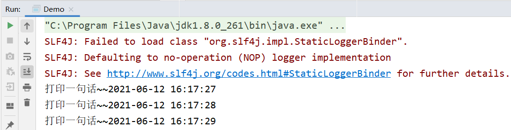

# day51-传智健康第四天

# 学习目标

- [ ] 能够掌握Quartz的基本使用
- [ ] 能够实现定时删除垃圾图片
- [ ] 能够掌握POI的基本使用
- [ ] 能够使用POI完成批量导入预约信息

# 第一章 - 定时任务Quartz

## 知识点-基本使用

### 1. 目标

能够使用定时任务组件Quartz

### 2. 路径

1：Quart介绍

- 掌握场景（定时任务）

2：Quartz入门案例

- spring整合Quartz（spring中配置）

3：cron表达式

4：cron表达式在线生成器

### 3. 讲解

#### 3.1. **Quartz介绍**

Quartz是Job scheduling（作业调度）领域的一个开源项目，Quartz既可以单独使用也可以跟spring框架整合使用，在实际开发中一般会使用后者。使用Quartz可以开发一个或者多个定时任务，每个定时任务可以单独指定执行的时间，例如每隔1小时执行一次、每个月第一天上午10点执行一次、每个月最后一天下午5点执行一次等。

是什么：后台任务框架，可以定时执行后台任务

作用：释放人力，后台自动执行任务

官网：<http://www.quartz-scheduler.org/>

maven坐标：

```xml
<!--quartz的基础包-->
<dependency>
 <groupId>org.quartz-scheduler</groupId>
 <artifactId>quartz</artifactId>
 <version>2.2.1</version>
</dependency>
<dependency>
 <groupId>org.quartz-scheduler</groupId>
 <artifactId>quartz-jobs</artifactId>
 <version>2.2.1</version>
</dependency>
```

```xml
<!--spring整合Quartz-->
<dependency>
     <groupId>org.springframework</groupId>
     <artifactId>spring-context-support</artifactId>
     <version>5.0.2.RELEASE</version>
</dependency>
```

#### 3.2. **Quartz入门案例**

* 导入依赖

```xml
<?xml version="1.0" encoding="UTF-8"?>
<project xmlns="http://maven.apache.org/POM/4.0.0"
         xmlns:xsi="http://www.w3.org/2001/XMLSchema-instance"
         xsi:schemaLocation="http://maven.apache.org/POM/4.0.0 http://maven.apache.org/xsd/maven-4.0.0.xsd">
    <modelVersion>4.0.0</modelVersion>

    <groupId>com.itheima</groupId>
    <artifactId>quartzdemo</artifactId>
    <version>1.0-SNAPSHOT</version>

    <dependencies>
        <!--quartz的基础包-->
        <dependency>
            <groupId>org.quartz-scheduler</groupId>
            <artifactId>quartz</artifactId>
            <version>2.2.1</version>
        </dependency>
        <dependency>
            <groupId>org.quartz-scheduler</groupId>
            <artifactId>quartz-jobs</artifactId>
            <version>2.2.1</version>
        </dependency>
        <!--spring整合Quartz-->
        <dependency>
            <groupId>org.springframework</groupId>
            <artifactId>spring-context-support</artifactId>
            <version>5.0.2.RELEASE</version>
        </dependency>

        <dependency>
            <groupId>org.springframework</groupId>
            <artifactId>spring-tx</artifactId>
            <version>5.0.2.RELEASE</version>
        </dependency>
    </dependencies>
</project>
```

* 定义任务

```java
package com.itheima.job;

import java.text.SimpleDateFormat;
import java.util.Date;

public class MyJob {

    SimpleDateFormat sf = new SimpleDateFormat("yyyy-MM-dd HH:mm:ss");

    /**
     * 一个方法可以看成是一个任务
     */
    public void print(){
        System.out.println("打印一句话~~"+ sf.format(new Date()));
    }
}
```

* 配置任务

1. 创建JobDetail对象,作用是负责通过反射调用指定的Job，注入目标对象，注入目标方法 

2. 注册一个触发器，指定任务触发的时间 

3. 注册一个统一的调度工厂，通过这个调度工厂调度任务

```xml
<?xml version="1.0" encoding="UTF-8"?>
<beans xmlns="http://www.springframework.org/schema/beans"
       xmlns:xsi="http://www.w3.org/2001/XMLSchema-instance"
       xsi:schemaLocation="http://www.springframework.org/schema/beans http://www.springframework.org/schema/beans/spring-beans.xsd">


    <!--1. 把任务类交给spring托管-->
    <bean id="myJob" class="com.itheima.job.MyJob"/>

    <!--2. 定义出来任务策略： 其实就是告诉spring哪个类的哪个方法是任务 MethodInvokingJobDetailFactoryBean-->
    <bean id="jobDetail" class="org.springframework.scheduling.quartz.MethodInvokingJobDetailFactoryBean">
        <property name="targetObject" ref="myJob"/>
        <property name="targetMethod" value="print"/>
    </bean>

    <!--3. 定义触发器： 什么时候执行方法。 CronTriggerFactoryBean-->
    <bean id="trigger" class="org.springframework.scheduling.quartz.CronTriggerFactoryBean">
        <property name="jobDetail" ref="jobDetail"/>
        <property name="cronExpression" value="0/1 * * * * ?"/>
    </bean>

    <!--4. 把触发器交给 任务调度容器：SchedulerFactoryBean-->
    <bean class="org.springframework.scheduling.quartz.SchedulerFactoryBean">
        <!--可以把很多的触发器交给任务调度容器-->
        <property name="triggers">
            <array>
                <ref bean="trigger"/>
            </array>
        </property>
    </bean>
</beans>
```

（4）创建启动类

加载spring容器。

```java
package com.itheima.job;

import org.springframework.context.support.ClassPathXmlApplicationContext;

import java.io.IOException;

public class Demo {
    public static void main(String[] args) throws IOException {
        //创建spring的容器
        new ClassPathXmlApplicationContext("applicationContext.xml");


        System.in.read();
    }
}

```

执行上面main方法观察控制台，可以发现每隔2秒会输出一次，说明每隔10秒自定义Job被调用一次。

  

 

#### 3.3. **cron表达式**

上面的入门案例中我们指定了一个表达式：0/10 * * * * ? 

这种表达式称为cron表达式，通过cron表达式可以灵活的定义出符合要求的程序执行的时间。本小节我们就来学习一下cron表达式的使用方法。如下图：

 

cron表达式分为七个域，之间使用空格分隔。其中最后一个域（年）可以为空。每个域都有自己允许的值和一些特殊字符构成。使用这些特殊字符可以使我们定义的表达式更加灵活。

下面是对这些特殊字符的介绍：

逗号（,）：指定一个值列表，例如使用在月域上1,4,5,7表示1月、4月、5月和7月

横杠（-）：指定一个范围，例如在时域上3-6表示3点到6点（即3点、4点、5点、6点）

星号（*）：表示这个域上包含所有合法的值。例如，在月份域上使用星号意味着每个月都会触发

斜线（/）：表示递增，例如使用在秒域上0/15表示每15秒

问号（?）：只能用在日和周域上 表示不指定 , 日和周不能同时指定特定数据或者非特定数据，需要 ? 来互斥。

井号（#）：只能使用在周域上，用于指定月份中的第几周的哪一天，例如6#3，意思是某月的第三个周五 (6=星期五，3意味着月份中的第三周)

L：某域上允许的最后一个值。只能使用在日和周域上。当用在日域上，表示的是在月域上指定的月份的最后一天。用于周域上时，表示周的最后一天，就是星期六

W：W 字符代表着工作日 (星期一到星期五)，只能用在日域上，它用来指定离指定日的最近的一个工作日


母亲节早上8：00：00

0 0 8 ？ 5 1#2

#### 3.4. **cron表达式在线生成器**

前面介绍了cron表达式，但是自己编写表达式还是有一些困难的，我们可以借助一些cron表达式在线生成器来根据我们的需求生成表达式即可。

http://cron.qqe2.com/

 

### 【小结】

1：Quart介绍

- 掌握场景（定时任务）

2：Quartz入门案例

- spring整合Quartz（spring中配置）

3：cron表达式

4：cron表达式在线生成器

<http://cron.qqe2.com/>

## 案例-定时清理垃圾图片

### 1. 目标

Quartz整合项目，完成定时清理垃圾图片

### 2. 路径

垃圾图片分析

执行时机分析

1：创建maven聚合工程health_jobs，打包方式为jar，导入Quartz等相关坐标

2：创建main启动方法

- 启动，加载spring容器

3：配置log4j.properties

5：配置applicationContext-jobs.xml

- spring整合Quartz

6：创建ClearImgJob定时任务类

- 查询七牛上的所有图片
- 查询数据库中的所有图片
- 七牛上的图片集合减去数据库的图片
- 调用七牛工具删除垃圾图片

### 3. 讲解

前面我们已经完成了体检套餐的管理，在新增套餐时套餐的基本信息和图片是分两次提交到后台进行操作的。也就是用户首先将图片上传到七牛云服务器，然后再提交新增窗口中录入的其他信息。如果用户只是上传了图片而没有提交录入的其他信息，此时的图片就变为了垃圾图片，因为在数据库中并没有记录它的存在。此时我们要如何处理这些垃圾图片呢？

解决方案就是通过定时任务组件定时清理这些垃圾图片。

#### 3.1. 清理垃圾图片分析

定义垃圾图片： 

​			七牛上有的，数据库（t_setmeal.img）中不存在的。

​			七牛上的所有图片-数据库的所有图片 = 垃圾的

执行时机: 

​			每天早上4点来执行一次

#### 3.2.  清理垃圾图片定时实现

##### 4.2.1.创建工程health_jobs

打包方式为war，导入Quartz等相关坐标

 

```xml
<?xml version="1.0" encoding="UTF-8"?>
<project xmlns="http://maven.apache.org/POM/4.0.0"
         xmlns:xsi="http://www.w3.org/2001/XMLSchema-instance"
         xsi:schemaLocation="http://maven.apache.org/POM/4.0.0 http://maven.apache.org/xsd/maven-4.0.0.xsd">
    <parent>
        <artifactId>day48_health_parent</artifactId>
        <groupId>com.itheima</groupId>
        <version>1.0-SNAPSHOT</version>
    </parent>
    <modelVersion>4.0.0</modelVersion>

    <artifactId>health_jobs</artifactId>


    <dependencies>
        <dependency>
            <groupId>com.itheima</groupId>
            <artifactId>health_dao</artifactId>
            <version>1.0-SNAPSHOT</version>
        </dependency>
        <dependency>
            <groupId>org.quartz-scheduler</groupId>
            <artifactId>quartz</artifactId>
        </dependency>
        <dependency>
            <groupId>org.quartz-scheduler</groupId>
            <artifactId>quartz-jobs</artifactId>
        </dependency>
    </dependencies>
</project>
```

##### 3.2.2. 配置log4j.properties

```properties
### direct log messages to stdout ###
log4j.appender.stdout=org.apache.log4j.ConsoleAppender
log4j.appender.stdout.Target=System.err
log4j.appender.stdout.layout=org.apache.log4j.PatternLayout
log4j.appender.stdout.layout.ConversionPattern=%d{ABSOLUTE} %5p %c{1}:%L - %m%n

### direct messages to file mylog.log ###
log4j.appender.file=org.apache.log4j.FileAppender
log4j.appender.file.File=c:\\mylog.log
log4j.appender.file.layout=org.apache.log4j.PatternLayout
log4j.appender.file.layout.ConversionPattern=%d{ABSOLUTE} %5p %c{1}:%L - %m%n

### set log levels - for more verbose logging change 'info' to 'debug' ###

log4j.rootLogger=debug, stdout
```

##### 3.2.3. 配置applicationContext-jobs.xml

```xml
<?xml version="1.0" encoding="UTF-8"?>
<beans xmlns="http://www.springframework.org/schema/beans"
       xmlns:xsi="http://www.w3.org/2001/XMLSchema-instance"
       xmlns:context="http://www.springframework.org/schema/context"
       xsi:schemaLocation="http://www.springframework.org/schema/beans http://www.springframework.org/schema/beans/spring-beans.xsd http://www.springframework.org/schema/context http://www.springframework.org/schema/context/spring-context.xsd">


    <!--1. 扫描包-->
    <context:component-scan base-package="com.itheima.job"/>

    <!--2. 定义任务策略： 要执行什么任务，具体是什么类的什么方法-->
    <bean id="jobDetail" class="org.springframework.scheduling.quartz.MethodInvokingJobDetailFactoryBean">
        <property name="targetObject" ref="cleanImgJob"/>
        <property name="targetMethod" value="cleanImg"/>
    </bean>

    <!--3. 定义触发器： 什么时候触发执行这个任务-->
    <bean id="trigger" class="org.springframework.scheduling.quartz.CronTriggerFactoryBean">
        <property  name="jobDetail" ref="jobDetail"/>
        <property name="cronExpression" value="0/5 * * * * ?"/> <!--每5秒执行一次删除的动作--> <!-- 秒 分  时  日  月 周-->
    </bean>

    <!--4. 定义调度容器：把触发器交给调度容器来管理-->
    <bean class="org.springframework.scheduling.quartz.SchedulerFactoryBean">
        <property name="triggers">
            <array>
                <ref bean="trigger"/>
            </array>
        </property>
    </bean>

    <!--5. 要记得导入dao的配置文件，否则现在这个工程里面的spring工厂不会识别到dao-->
    <import resource="applicationContext-dao.xml"/>

</beans>
```

##### 3.2.4. 创建ClearImgJob任务类

```java
package com.itheima.job;

import com.itheima.dao.SetmealDao;
import com.itheima.utils.QiNiuUtils;
import org.springframework.beans.factory.annotation.Autowired;
import org.springframework.stereotype.Component;

import java.util.List;

/*
    这是定时清除七牛云上面的垃圾图片
        垃圾图片的定义 ： 七牛的图片 -  mysql数据库里的图片
 */
@Component
public class CleanImgJob {

    @Autowired
    private SetmealDao dao;


    /**
     * 删除垃圾图片
     */
    public void cleanImg(){

        //1. 查询七牛上面的所有图片
        List<String> qiniuList = QiNiuUtils.listFile();
        System.out.println("七牛上面的图片是：" + qiniuList);

        //2. 查询数据库里面的所有图片
        List<String> dbList = dao.findAllImg();
        System.out.println("数据库里面的图片是：" + dbList);

        //3. 比较之后，找出垃圾图片
        //大的集合里面移除一部分数据，这部分数据可以是另一个集合里面内容。
        qiniuList.removeAll(dbList);
        System.out.println("剩下的要删除的图片是：" + qiniuList);

        //4. 删除垃圾图片
        QiNiuUtils.removeFiles(qiniuList.toArray(new String[]{}));
    }
}

```

##### 3.2.5. 创建启动类

```java
package com.itheima.job;

import org.springframework.context.support.ClassPathXmlApplicationContext;

import java.io.IOException;

public class MainDemo {
    public static void main(String[] args) throws IOException {
        new ClassPathXmlApplicationContext("applicationContext-job.xml");
        System.in.read();
    }
}
```

### 4. 小结

1：创建maven聚合工程health_jobs，打包方式为war，导入Quartz等相关坐标

2：配置web.xml

- web容器启动，加载spring容器

3：配置log4j.properties

4：配置applicationContext-redis.xml

- spring整合redis

5：配置applicationContext-jobs.xml

- spring整合Quartz

6：创建ClearImgJob定时任务类

- 使用Quartz清理垃圾图片


# 第二章 - Apache POI

## 知识点-基本使用

### 1. 目标

了解什么是Apache POI

掌握Apache POI的使用方法, 读写excel

### 2. 路径

1. POI介绍

2. POI入门案例

   （1）从Excel文件读取数据

   （2）向Excel文件写入数据

3. POI工具类的介绍

### 3. 讲解

#### 3.1. **POI介绍**

Apache POI是用Java编写的免费开源的跨平台的Java API，Apache POI提供API给Java程序对Microsoft Office格式档案读和写的功能，其中使用最多的就是使用POI操作Excel文件。

maven坐标：

```xml
<dependency>
    <groupId>org.apache.poi</groupId>
    <artifactId>poi</artifactId>
    <version>3.14</version>
</dependency>
<dependency>
    <groupId>org.apache.poi</groupId>
    <artifactId>poi-ooxml</artifactId>
    <version>3.14</version>
</dependency>
```

POI结构：

```java
HSSF － 提供读写Microsoft Excel XLS格式档案的功能 97-2003
XSSF － 提供读写Microsoft Excel OOXML XLSX格式档案的功能（我们使用） 2007
HWPF － 提供读写Microsoft Word DOC格式档案的功能 .doc word
HSLF － 提供读写Microsoft PowerPoint格式档案的功能 ppt
HDGF － 提供读Microsoft Visio格式档案的功能 
HPBF － 提供读Microsoft Publisher格式档案的功能
HSMF － 提供读Microsoft Outlook格式档案的功能 邮件
```

我们使用：XSSF － 提供读写Microsoft Excel OOXML XLSX格式档案的功能

POI操作offices文档，常用它操作excel, 2007版以后的excel  XSSFWorkbook

#### 3.2. **入门案例**

##### 3.2.1. **从Excel文件读取数据**

【需求】

使用POI可以从一个已经存在的Excel文件中读取数据

【路径】

1：创建工作簿对象

2：获得工作表对象

3：遍历工作表对象 获得行对象

4：遍历行对象 获得单元格（列）对象

5：获得数据

6：关闭

【讲解】

1. 实现

使用POI可以从一个已经存在的Excel文件中读取数据

在health_common中建立测试类，TestPoi.java

```java
 // 读取excel表格的内容
    @Test
    public void testRead01() throws IOException {

        //1. 创建工作簿
        XSSFWorkbook wb = new XSSFWorkbook("D:\\上课\\113期\\day51_传智健康\\04_资料\\read.xlsx");

        //2. 得到工作表 得到第一个工作表。
        XSSFSheet sheet = wb.getSheetAt(0);

        //3. 遍历工作表得到行
        for(Row row : sheet){

            //4. 遍历行得到格子，可以取数据了
            for(Cell cell : row){
                String value = cell.getStringCellValue();
                System.out.println("value=" + value);
            }
        }

        //关闭工作簿
        wb.close();
    }
```

通过上面的入门案例可以看到，POI操作Excel表格封装了几个核心对象：

```
XSSFWorkbook：工作簿
XSSFSheet：工作表
XSSFRow：行
XSSFCell：单元格
```

上面案例是通过遍历工作表获得行，遍历行获得单元格，最终获取单元格中的值。

还有一种方式就是获取工作表最后一个行号，从而根据行号获得行对象，通过行获取最后一个单元格索引，从而根据单元格索引获取每行的一个单元格对象，代码如下：

```java
	@Test
    public void testRead02() throws IOException {

        //1. 创建工作簿
        XSSFWorkbook wb = new XSSFWorkbook("D:\\上课\\113期\\day51_传智健康\\04_资料\\read.xlsx");

        //2. 得到工作表 得到第一个工作表。
        XSSFSheet sheet = wb.getSheetAt(0);

        //3. 得到最后一行的下标
        int lastRowNum = sheet.getLastRowNum(); //1

        //行号从0开始。
        for (int i = 0; i <= lastRowNum; i++) {
            //取出来每一行
            XSSFRow row = sheet.getRow(i);

            //获取最后一个格子的下标
            short lastCellNum = row.getLastCellNum();
            for (int j = 0; j < lastCellNum; j++) {
                System.out.println(row.getCell(j).getStringCellValue());
            }
        }

        wb.close();
    }

```

 

##### 3.2.2. **向Excel文件写入数据**

【需求】

 使用POI可以在内存中创建一个Excel文件并将数据写入到这个文件，最后通过输出流将内存中的Excel文件下载到磁盘

【路径】

```
1.创建工作簿对象
2.创建工作表对象
3.创建行对象
4.创建列(单元格)对象, 设置内容
5.通过输出流将workbook对象下载到磁盘
```

【实现】

使用POI可以在内存中创建一个Excel文件并将数据写入到这个文件，最后通过输出流将内存中的Excel文件下载到磁盘

```java
//生成Excel表格
    @Test
    public void testWrite() throws IOException{

        //1 定义工作簿
        XSSFWorkbook wb = new XSSFWorkbook();

        //2. 创建工作表
        XSSFSheet sheet = wb.createSheet("传智播客");

        //3. 构建第一行 , 填充格子的内容
        XSSFRow row = sheet.createRow(0);
        row.createCell(0).setCellValue("编号");
        row.createCell(1).setCellValue("姓名");
        row.createCell(2).setCellValue("年龄");

        //第二行
        XSSFRow row1 = sheet.createRow(1);
        row1.createCell(0).setCellValue(1);
        row1.createCell(1).setCellValue("张三");
        row1.createCell(2).setCellValue(18);

        //第三行
        XSSFRow row2 = sheet.createRow(2);
        row2.createCell(0).setCellValue(2);
        row2.createCell(1).setCellValue("李四");
        row2.createCell(2).setCellValue(28);


        //4. 把工作簿保存到硬盘上的某个文件去
        FileOutputStream fos = new FileOutputStream("D:/aa.xlsx");
        wb.write(fos);

        //5. 收尾
        fos.flush();
        fos.close();
        wb.close();
    }
```

 

小结：POI技术（向Excel文件写入数据）

- 创建工作簿的时候, 不需要传入参数(excel不存在的)
- 使用输出流，输出excel

应用场景：1：从excel中读取数据，写入到数据库（导入）；2：从数据库查询数据，写入到excel文件（报表技术，导出）

##### 3.2.3.POI工具类的介绍

将资料中的POIUtils工具类复制到health_common工程

 

### 4. 小结

1.POI介绍

​	POI就是一个工具, 用来操作Office, 主要用来操作Excel

2.POI入门案例

工作簿

工作表

行

单元格

​	（1）从Excel文件读取数据（导入到数据库）

​	（2）向Excel文件写入数据（导出报表）

3.POI工具类的介绍

​	使用工具类, 读取Excel, 每一行读取到了String[] 里面, 多行就是多个String[] , 最终封装到List

## 案例-批量导入预约信息【重点】

### 1. 需求

批量导入预约设置信息

其实就是把用户上传上来的存储在Excel文档中的预约设置信息存储到数据中

每一步的关键点

上传

上传后的文件为excelFile

通过action属性发送请求

获取

使用POIUtils读取

```java
读取excel文件的内容
    1.1 由于表格里面有可能有很多的行，所以返回值是一个list集合
    1.2 里面包装的是每一行的数据，用数组来包装
    1.3 数组的第0位，表示第一个格子的内容，数组的第1位，表示第二个格子的内容。
```

把读取到的预约设置信息存储到List<OrderSetting>实体类中

根据获取到不同的数据，在service层中做业务逻辑（就是做某件事时，需要考虑可能出现的各种不同的情况）的判断

​	此需求中考虑到传上来的数据中date列的有些数据在数据库中可能已经存在，如果直接添加会产生重复，所以需要分别处理，即做更新处理

​	才外，还需要验证

存储

响应

### 2. 路径

1：前台代码

（1）提供模板文件

（2）实现模板文件下载（填写数据）

（3）文件上传（读取excel的数据，批量导入到数据库）

2：后台代码

1. 创建OrderSettingController, 提供upload方法，接收前端传过来的文件MultipartFile excelFile；调用POIUtils读取excel内容，转成List<Ordersetting>实体类，调用业务导入，返回结果给页面
2. OrderSettingService与实现类
   * 遍历List<Ordersetting>集合
   * 通过预约日期查询是否存在预约设置信息
   * 存在：
     * 要判断已预约数是否大于最大预约数（即将更新的），如果 大于则报错。
     * 小于，则更新最大预约数
   * 不存在：
     * 添加记录
   * 事务控制
3. OrderSettingDao与映射文件
   * 通过日期查询预约设置信息 select * from t_ordersetting where orderDate=日期
   * 更新最大预约数 update t_orderSetting set number=#{值} where orderDate=日期
   * 添加预约设置信息 insert into t_orderSetting ...

业务：

- 从excel中读取预约设置信息，批量导入到数据库

（1）OrderSettingController.java（Controller）

（2）OrderSettingService.java（服务接口）

（3）OrderSettingServiceImpl.java（服务实现类）

（4）OrderSettingDao.java（Dao接口）

（5）OrderSettingDao.xml（Mapper映射文件）

### 3. 实现

【需求】

从Excel读取预约设置的数据，批量导入到数据库


【设计】

预约设置信息对应的数据表为t_ordersetting，预约设置操作对应的页面为ordersetting.html

1：t_ordersetting表结构：

 

orderDate：预约日期 

number：最多可预约人数 

reservations：已预约人数

【路径】

批量导入预约设置信息操作过程：

​	第一步、点击模板下载按钮下载Excel模板文件【文件下载】

​	第二步、将预约设置信息录入到模板文件中

​	第三步、点击上传文件按钮将录入完信息的模板文件上传到服务器【文件上传】

​	第四步、通过POI读取上传文件的数据并保存到数据库【poi导入】

2：将ordersetting.html放置到health_web中

 

#### 3.1. **前台代码**

##### 3.1.1. **提供模板文件**

资料中已经提供了Excel模板文件ordersetting_template.xlsx，将文件放在health_web工程的template目录下

 

##### 3.1.2. **实现模板文件下载**

（71）为模板下载按钮绑定事件实现模板文件下载

```html
<el-button style="margin-bottom: 20px;margin-right: 20px" type="primary" @click="downloadTemplate()">模板下载</el-button>
```

（2）downloadTemplate()

```javascript
//下载模板文件
downloadTemplate(){
    window.location.href="../template/ordersetting_template.xlsx";
},
```

（3）在health_web工程的webapp目录下创建template目录

（4）复制资料中的 资料\预约设置模板文件\ordersetting_template.xlsx 到 template目录下

##### 3.1.3. **文件上传**

（1）使用ElementUI的上传组件实现文件上传并绑定相关事件

```html
<el-upload action="/ordersetting/upload.do"
           name="excelFile"
           :show-file-list="false"
           :on-success="handleSuccess"
           :before-upload="beforeUpload">
    <el-button type="primary">上传文件</el-button>
</el-upload>
```

（2）handleSuccess方法：用于显示上传成功或者失败信息。

```javascript
//上传成功提示
handleSuccess(response, file) {
    if(response.flag){
         this.$message.success(response.message);
    }else{
         this.$message.error(response.message);
    }
},
```

 

（3）beforeUpload方法：用于校验上传的文件是否是excel文件

```javascript
//上传之前进行文件格式校验
beforeUpload(file){
    //【注意】部分同学得到 file.type=null或者是''，不是下面内容，解决直接return true;
    const isXLS = file.type = 'application/vnd.ms-excel';
    if(isXLS){
        return true;
    }
    const isXLSX = file.type = 'application/vnd.openxmlformats-officedocument.spreadsheetml.sheet';
    if (isXLSX) {
        return true;
    }
    this.$message.error('上传文件只能是xls或者xlsx格式!');
    return false;
},
```


#### 3.2. **后台代码**

##### 3.2.1. **Controller**

在health_web工程创建OrderSettingController并提供upload方法

```java
package com.itheima.controller;

import com.itheima.constant.MessageConstant;
import com.itheima.entity.Result;
import com.itheima.health.pojo.OrderSetting;
import com.itheima.service.OrderSettingService;
import com.itheima.utils.POIUtils;
import org.springframework.beans.factory.annotation.Autowired;
import org.springframework.web.bind.annotation.RequestMapping;
import org.springframework.web.bind.annotation.RestController;
import org.springframework.web.multipart.MultipartFile;

import java.io.IOException;
import java.text.SimpleDateFormat;
import java.util.ArrayList;
import java.util.HashMap;
import java.util.List;
import java.util.Map;

/*
    预约管理的controller
 */
@RestController
@RequestMapping("/ordersetting")
public class OrderSettingController {

    @Autowired
    private OrderSettingService os;


    /**
     * 导入预约信息，导入excel文件
     * @param excelFile 就是页面上传上来的Excel文件
     * @return
     */
    @RequestMapping("/upload")
    public Result upload(MultipartFile excelFile){

        try {
            /*
                1. 读取excel文件的内容
                    1.1 由于表格里面有可能有很多的行，所以返回值是一个list集合
                    1.2 里面包装的是每一行的数据，用数组来包装
                    1.3 数组的第0位，表示第一个格子的内容，数组的第1位，表示第二个格子的内容。
             */
            List<String[]> strList = POIUtils.readExcel(excelFile);

            //2. 遍历集合，取出来预约的日期以及可预约的最大数量，然后封装到一个OrderSetting身上。
            List<OrderSetting> orderSettingList = new ArrayList<>();
            SimpleDateFormat sf = new SimpleDateFormat("yyyy/MM/dd");
            //3. 组装数据成JavaBean OrderSetting对象
            for (String[] strArr : strList) {
                OrderSetting os = new OrderSetting(sf.parse(strArr[0]) , Integer.parseInt(strArr[1]));
                orderSettingList.add(os);
            }
            //4. 交代service干活
            int row = os.add(orderSettingList);

            Result result = null;
            if(row > 0 ){
                result = new Result(true , MessageConstant.IMPORT_ORDERSETTING_SUCCESS);
            }else{
                result =  new Result(false , MessageConstant.IMPORT_ORDERSETTING_FAIL);
            }

            return result;
        }catch (RuntimeException e) {
            e.printStackTrace();
            return new Result(false ,e.getMessage());
        } catch (Exception e) {
            e.printStackTrace();
            return new Result(false , MessageConstant.IMPORT_ORDERSETTING_FAIL);
        }

    }
}

```

##### 3.2.2. Service**实现服务类**

创建OrderSettingService服务接口并提供新增方法

```java
package com.itheima.service;

import com.itheima.health.pojo.OrderSetting;

import java.util.List;

public interface OrderSettingService {


   /**
    * 添加预约信息
    * @param orderSettingList
    * @return
    */
   int add(List<OrderSetting> orderSettingList);


}

```

创建服务实现类OrderSettingServiceImpl并实现新增方法

```java
package com.itheima.service.impl;

import com.itheima.dao.OrderSettingDao;
import com.itheima.health.pojo.OrderSetting;
import com.itheima.service.OrderSettingService;
import org.springframework.beans.factory.annotation.Autowired;
import org.springframework.stereotype.Service;
import org.springframework.transaction.annotation.Transactional;

import java.util.Date;
import java.util.List;

@Service
@Transactional
public class OrderSettingServiceImpl implements OrderSettingService {


    @Autowired
    private OrderSettingDao dao ;
   /**
     * 批量导入预约信息
     * @param orderSettingList  导入的预约信息集合
     * @return
     */
    @Override
    public int add(List<OrderSetting> orderSettingList) {

        int row1 = 0 ;
        int row2 = 0 ;

        //1. 遍历集合，取出来每一个预约的对象，预约的对象里面包含预约的日期和最大可以预约数
        for (OrderSetting orderSetting : orderSettingList) {

            //2. 得到预约的日期和最大可预约数量
            Date date = orderSetting.getOrderDate();
            int number = orderSetting.getNumber();

            /*
                3. 往数据库里面添加|更新数据
                    3.1 不能盲目的认为批量导入就是直接往数据库里面添加预约的数据即可
                    3.2 要考虑到数据库里面已经存在了现在正要导入的预约的日期这种情况
                    3.3 要先拿着现在要导入的这个日期去数据库里面查询记录，数据库里面有没有这一天的预约数据
                        如果有：
                            3.3.1 数据库里面有现在要导入的这一天的预约记录，要更新这条记录
                            3.3.2 要比较数库库里面的已经预约的数量（reservations） 和 现在要到如的可预约的数量大小关系
                                如果 已预约的数量 >  现在要导入的可预约的数量，禁止更新
                                否则，就可以更新了！
                         如果没有：
                            直接添加这条记录即可。
                     3.4 到底要做的是更新还是添加，取决于数据库里面有没有现在要导入这一天的预约记录
             */

            //3. 根据日期去查询数据库里面的记录信息
            OrderSetting osInDB = dao.findOrderSettingByDate(date);
            if(osInDB != null) { //表明有记录存在 ： 还要判断

                //4. 判断数据库的已经预约的数量和现在要导入的可以预约的数量大小关系
                if(number < osInDB.getReservations()){ //禁止导入
                    throw  new RuntimeException("可预约数量必须要大于已经预约的数量！");
                }else{ //做更新操作
                    row1 += dao.update(orderSetting);
                }

            }else{ //表明没有记录， 添加操作
                row2 += dao.add(orderSetting);
            }
        }
        return (row1 + row2 == orderSettingList.size()) ? 1 : 0;
    }
}

```

##### 3.2.3. **Dao接口**

创建Dao接口OrderSettingDao并提供更新和新增方法

```java
package com.itheima.dao;

import com.itheima.health.pojo.OrderSetting;
import org.apache.ibatis.annotations.Param;

import java.util.Date;
import java.util.List;

public interface OrderSettingDao {


    /**
     * 根据日期去查询预约记录
     * @param date 如果存在指定日期，那么返回这个日期的预约记录对象，否则返回null
     * @return
     */
    OrderSetting findOrderSettingByDate(Date date);

    /**
     * 更新预约信息（根据日期去更新的。）
     * @param orderSetting
     * @return
     */
    int update(OrderSetting orderSetting);

    /**
     * 添加预约记录
     * @param orderSetting
     * @return
     */
    int add(OrderSetting orderSetting);
}

```

##### 3.2.4. **Mapper映射文件**

创建Mapper映射文件OrderSettingDao.xml并提供相关SQL

```xml
<?xml version="1.0" encoding="UTF-8" ?>
<!DOCTYPE mapper
        PUBLIC "-//mybatis.org//DTD Mapper 3.0//EN"
        "http://mybatis.org/dtd/mybatis-3-mapper.dtd">

<mapper namespace="com.itheima.dao.OrderSettingDao">
    <!--
        1. 根据日期来查询预约的记录
            1.1 默认情况下，mybatis使用日期条件查询的时候，默认使用的是timestamp  时间戳 日期+时间
                javaType=Date ，告诉mybatis 请使用日期格式来查询数据 只要日期
    -->
    <select id="findOrderSettingByDate" parameterType="date" resultType="orderSetting">
        select * from t_ordersetting where orderDate = #{date ,javaType=Date}
    </select>

    <!--2. 根据日期来更新预约记录中的可预约数量-->
    <update id="update" parameterType="orderSetting">
        update t_ordersetting set number = #{number} where orderDate  = #{orderDate ,javaType=Date}
    </update>

    <!--3. 添加操作-->
    <insert id="add" parameterType="orderSetting">
        insert into t_ordersetting values(null , #{orderDate} , #{number} , #{reservations})
    </insert>
</mapper>
```

### 4. 小结

1：前台代码

（1）提供模板文件

（2）实现模板文件下载

（3）文件上传

2：后台代码

- 从excel中读取预约设置信息，批量导入到数据库

（1）OrderSettingController.java（Controller）

（2）OrderSettingService.java（服务接口）

（3）OrderSettingServiceImpl.java（服务实现类）

（4）OrderSettingDao.java（Dao接口）

（5）OrderSettingDao.xml（Mapper映射文件）

## 案例-**日历展示预约信息**

### 1. 目标

日历展示预约设置信息

### 2. 路径

1：前台代码

（1）使用静态数据调试

（2）发送ajax获取动态数据

2：后台代码

业务：

- 在页面上，使用日历展示预约设置信息

（1）OrderSettingController.java（Controller）

（2）OrderSettingService.java（服务接口）

（3）OrderSettingServiceImpl.java（服务实现类）

（4）OrderSettingDao.java（Dao接口）

（5）OrderSettingDao.xml（Mapper映射文件）

3：初始化下个月，上个月数据

### 3. 实现

【需求】

前面已经完成了预约设置功能，现在就需要通过日历的方式展示出来每天设置的预约人数。

在页面中已经完成了日历的动态展示，我们只需要查询当前月份的预约设置信息并展示到日历中即可，同时在日历中还需要展示已经预约的人数，效果如下：

 

#### 3.1. **前台代码**

##### 3.1.1. **使用静态数据调试**

为了能够快速看到效果，我们可以先使用静态数据模拟，然后再改为发送ajax请求查询数据库。

实现步骤：

（1）预约设置数据对应的模型数据为leftobj，在initData方法最后为leftobj模型数据赋值：

```javascript
this.leftobj = [
    { date: 1, number: 120, reservations: 1 },
    { date: 3, number: 120, reservations: 1 },
    { date: 4, number: 120, reservations: 120 },
    { date: 6, number: 120, reservations: 1 },
    { date: 8, number: 120, reservations: 1 }
];
```

 

其中date表示日期，number表示可预约人数，reservations表示已预约人数

（2）使用VUE的v-for标签遍历上面的leftobj模型数据，展示到日历上：

```html
<template>
    <template v-for="obj in leftobj">
        <template v-if="obj.date  dayobject.day.getDate()">
            <template v-if="obj.number > obj.reservations">
                <div class="usual">
                     <p>可预约{{obj.number}}人</p>
                     <p>已预约{{obj.reservations}}人</p>
                </div>
            </template>
            <template v-else>
                <div class="fulled">
                    <p>可预约{{obj.number}}人</p>
                    <p>已预约{{obj.reservations}}人</p>
                    <p>已满</p>
                </div>
            </template>
        </template>
    </template>
    <button v-if="dayobject.day > today" @click="handleOrderSet(dayobject.day)" class="orderbtn">设置</button>
</template>
```

 

 

##### 3.1.2. **获取动态数据**

将上面的静态模拟数据去掉，改为发送ajax请求，根据当前页面对应的月份查询数据库获取预约设置信息，将查询结果赋值给leftobj模型数据

（1）在钩子函数created中添加：

```javascript
created: function () {//在vue初始化时调用
    this.initData(null);
    this.createdData();
},
```

 （2）创建函数createData()

组织this.leftobj的数据，返回List<Map>

```javascript
//发送ajax请求，根据当前页面对应的月份查询预约设置信息
methods: {
    createdData(){
        axios.post("/ordersetting/getOrderSettingByMonth.do?date="+this.currentYear+"-"+this.currentMonth).then((response)=>{
            if(response.data.flag){
                this.leftobj = response.data.data;
                this.$message({
                    message:response.data.message,
                    type:"success"
                })
            }else{
                this.$message.error(response.data.message);
            }
        })
    },
    ...
}
```

 

#### 3.2. **后台代码**

##### 3.2.1. **Controller**

在OrderSettingController中提供findOrderByMonth方法，根据月份查询预约设置信息

```java
	@RequestMapping("/findorderbymonth")
    public Result findOrderByMonth(String date){ // 2021-06

        //1. 调用service
        List<OrderSetting> list = os.findOrderByMonth(date);

        //2. 由于页面已经写好了，它需要的数据和我们从service拿到的数据不一样，所以不能直接
        //给页面返回，需要手动封装一下
        List<Map> mapList = new ArrayList<Map>();
        for (OrderSetting orderSetting : list) {

            //每一条预约对象就是一个map，之所以要封装是因为页面要求的属性的名字和OrderSetting的属性名不一样！
            Map map = new HashMap();
            map.put("date", orderSetting.getOrderDate().getDate());
            map.put("number",orderSetting.getNumber() );
            map.put("reservations", orderSetting.getReservations());

            //构建好了之后，装到集合里面去
            mapList.add(map);
        }

        //返回数据
        return  new Result(true , MessageConstant.GET_ORDERSETTING_SUCCESS, mapList);
    }
```


##### 3.2.2. Service

* 接口

在OrderSettingService服务接口中扩展方法findOrderByMonth

```java
   /**
    * 查询指定月份的信息
    * @param date
    * @return
    */
   List<OrderSetting> findOrderByMonth(String date);
```

* 实现类

在OrderSettingServiceImpl服务实现类中实现方法findOrderByMonth

```java
/**
     * 根据月份，来查询指定月的预约信息。
     * @param date  2021-06 打算让dao查询一个区间的数据，从6-1 到 6月31日
     * @return
     */
    @Override
    public List<OrderSetting> findOrderByMonth(String date) {

        //1. 拼接开始日期和结束日期
        String begin = date +"-1"; // 2021-6-1
        String end = date +"-31"; // 2021-6-31

        //2. 查询
        return dao.findOrderByMonth(begin , end);
    }
```

##### 3.2.3. **Dao接口**

在OrderSettingDao接口中扩展方法findOrderByMonth

```java
    /**
     * 查询从某一个时间到另一个时间段的预约信息
     * @param begin
     * @param end
     * @return
     */
    List<OrderSetting> findOrderByMonth(@Param("begin") String begin, @Param("end") String end);

```

##### 3.2.4. **Mapper映射文件**

在OrderSettingDao.xml文件中扩展SQL

```xml
    <select id="findOrderByMonth" parameterType="string" resultType="orderSetting">
        select * from t_ordersetting where orderDate between #{begin} and #{end}
    </select>
```

也可以使用sql语句：SELECT * FROM t_ordersetting WHERE orderDate LIKE '2019-08-%'

#### 3.3. **初始化下个月，上个月数据**

 

（1）点击事件

```xml
<div class="choose">
    <span @click="goCurrentMonth(currentYear,currentMonth)" class="gotoday">今天</span>
    <span @click="pickPre(currentYear,currentMonth)">❮</span>
    <span @click="pickNext(currentYear,currentMonth)">❯</span>
</div>
```

（2）初始化日期数据（今天、上个月、下个月）：

```javascript
//切换到当前月份
goCurrentMonth: function (year, month) {
  	var d = new Date();
  	this.initData(this.formatDate(d.getFullYear(), d.getMonth() + 1, 1));
  	this.createdData();
},
//向前一个月
pickPre: function (year, month) {
    // setDate(0); 上月最后一天
    // setDate(-1); 上月倒数第二天
    // setDate(dx) 参数dx为 上月最后一天的前后dx天
    var d = new Date(this.formatDate(year, month, 1));
    d.setDate(0);
    this.initData(this.formatDate(d.getFullYear(), d.getMonth() + 1, 1));
    this.createdData();
},
//向后一个月
pickNext: function (year, month) {
    var d = new Date(this.formatDate(year, month, 1));
    d.setDate(35);////获取指定天之后的日期
    this.initData(this.formatDate(d.getFullYear(), d.getMonth() + 1, 1));
    this.createdData();
},
```

 分别执行this.createDate();表示初始化数据。

### 4. 小结

1：前台代码

（1）使用静态数据调试

 预约设置数据对应的模型数据为leftobj，在initData方法最后为leftobj模型数据赋值：

```javascript
this.leftobj = [
    { date: 1, number: 120, reservations: 1 },
    { date: 3, number: 120, reservations: 1 },
    { date: 4, number: 120, reservations: 120 },
    { date: 6, number: 120, reservations: 1 },
    { date: 8, number: 120, reservations: 1 }
];
```

 

其中date表示日期，number表示可预约人数，reservations表示已预约人数

使用VUE的v-for标签遍历上面的leftobj模型数据，展示到日历上：

```html
<template>
    <template v-for="obj in leftobj">
        <template v-if="obj.date  dayobject.day.getDate()">
            <template v-if="obj.number > obj.reservations">
                <div class="usual">
                     <p>可预约{{obj.number}}人</p>
                     <p>已预约{{obj.reservations}}人</p>
                </div>
            </template>
            <template v-else>
                <div class="fulled">
                    <p>可预约{{obj.number}}人</p>
                    <p>已预约{{obj.reservations}}人</p>
                    <p>已满</p>
                </div>
            </template>
        </template>
    </template>
    <button v-if="dayobject.day > today" @click="handleOrderSet(dayobject.day)" class="orderbtn">设置</button>
</template>
```

 

（2）发送ajax获取动态数据

2：后台代码

业务：

- 在页面上，使用日历展示预约设置信息

（1）OrderSettingController.java（Controller）

（2）OrderSettingService.java（服务接口）

（3）OrderSettingServiceImpl.java（服务实现类）

（4）OrderSettingDao.java（Dao接口）

（5）OrderSettingDao.xml（Mapper映射文件）

查询当前月份的预约设置(前端传递当前的年-月: 2019-06)

```sql
SELECT * FROM t_ordersetting WHERE orderDate LIKE '2019-06-%'
或者
SELECT * FROM t_ordersetting WHERE orderDate BETWEEN '2019-06-01' AND '2019-06-31'
```

页面需要的数据，使用List<Map>

```json
[
    {date: 1, number: 120, reservations: 1},
    {date: 3, number: 120, reservations: 1},
    {date: 4, number: 120, reservations: 120},
    {date: 6, number: 120, reservations: 1},
    {date: 8, number: 120, reservations: 1}
]
```

3：初始化下个月，上个月数据

## 案例-基于日历实现预约设置

### 1. 目标

日历展示预约设置信息，点击【设置】按钮完成针对当前时间进行设置，设置最多可预约的人数

### 2. 路径

1：前台代码

（1）为设置按钮绑定事件

（2）弹出预约设置窗口，并发送ajax请求

2：后台代码

业务：

- 在页面上，基于日历实现预约设置

（1）OrderSettingController.java（Controller）

（2）OrderSettingService.java（服务接口）

（3）OrderSettingServiceImpl.java（服务实现类）

（4）OrderSettingDao.java（Dao接口）

（5）OrderSettingDao.xml（Mapper映射文件）

### 3. 实现

【需求】

本章节要完成的功能为通过点击日历中的设置按钮来设置对应日期的可预约人数。效果如下：

 

#### 3.1. 前台代码

##### 3.1.1. **为设置按钮绑定事件**

（1）为日历中的设置按钮绑定单击事件，当前日期作为参数

```html
<button v-if="dayobject.day > today" @click="handleOrderSet(dayobject.day)" class="orderbtn">设置</button>
```

（2）handleOrderset()方法

```javascript
//预约设置
handleOrderSet(day){
    alert(day);
},
```


##### 3.1.2. **弹出预约设置窗口并发送ajax请求**

完善handleOrderSet方法，弹出预约设置窗口，用户点击确定按钮则发送ajax请求

参考：$prompt

 

```javascript
//预约设置
handleOrderSet(day){
    this.$prompt('请输入可预约的人数', '预约设置', {
        confirmButtonText: '确定',
        cancelButtonText: '取消',
        inputPattern: /^[1-9][0-9]*$/,
        inputErrorMessage: '输入格式有误'
    }).then(({ value }) => {
        //1.弹窗提示
        this.$message({
            type: 'success',
            message: '您设置的预约数量是: ' + value
        });

        //2. 发请求
        //2.1 定义参数 :  日期传递过去 和 设置的预约数 传过去。
        var date =this.formatDate(day.getFullYear(), day.getMonth() +  1 , day.getDate());

        //2.2 发请求
        axios.get("/ordersetting/updateordernumber.do?date="+date+"&number="+value).then(response=>{
            if(response.data.flag){
                this.$message.success(response.data.message);
                this.createData(); //重新获取当前月的数据下来显示。
            }else{
                this.$message.error(response.data.message);
            }
        });

    }).catch(() => {
        this.$message({
            type: 'info',
            message: '取消输入'
        });
    });
},
```

 

#### 3.2. **后台代码**

##### 3.2.1. **Controller**

在OrderSettingController中提供方法updateOrderNumber

```java
	@RequestMapping("/updateordernumber")
    public Result updateOrderNumber(String date , int number){

        //1. 调用service干活
        int row = os.updateOrderNumber(date, number);

        //2. 判断
        Result result = null;
        if(row >0 ){
            result = new Result(true , "设置预约数量成功！");
        }else{
            result = new Result(false , "设置预约数量失败！");
        }
        return result;

    }
```

##### 3.2.2. Service**服务实现类**

在OrderSettingService服务接口中提供方法updateOrderNumber

```java
   /**
    * 根据日期，修改预约数量
    * @param date 日期
    * @param number 数量
    * @return
    */
   int  updateOrderNumber(String date , int number);

```

在OrderSettingServiceImpl服务实现类中实现updateOrderNumber

```java
    /**
     * 根据日期修改预约数量
     * @param date 日期
     * @param number 数量
     * @return
     */
    @Override
    public int updateOrderNumber(String date, int number) {
        return dao.updateOrderNumber(date , number);
    }

```

##### 3.2.3. **Dao接口**

在OrderSettingDao接口中提供方法（上面已经完成）

```java
    /**
     * 根据日期修改预约数量
     * @param date 日期
     * @param number 预约数
     * @return
     */
    int updateOrderNumber(@Param("date") String date ,@Param("number") int number);
```

##### 3.2.4. **Mapper映射文件**

在OrderSettingDao.xml映射文件中提供SQL（上面已经完成）

```xml
   <!--5. 根据日期修改预约数量-->
    <update id="updateOrderNumber" >
        update t_ordersetting set number = #{number} where orderDate = #{date}
    </update>
```

### 4. 小结

1：前台代码

（1）为设置按钮绑定事件

（2）弹出预约设置窗口，并发送ajax请求

2：后台代码

业务：

- 在页面上，基于日历实现预约设置

（1）OrderSettingController.java（Controller）

（2）OrderSettingService.java（服务接口）

（3）OrderSettingServiceImpl.java（服务实现类）

（4）OrderSettingDao.java（Dao接口）

（5）OrderSettingDao.xml（Mapper映射文件）