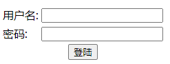
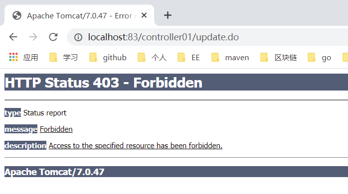

# day52-传智健康第五天

# 学习目标

- [ ] 了解认证和授权的概念
- [ ] 掌握Spring Security入门案例开发过程  
- [ ] 掌握Spring Security实现认证的过程
- [ ] 掌握Spring Security实现授权的过程
- [ ] 后台管理系统中加入Spring Serurity  

# 第一章-SpringSecurity基本使用

## 知识点-认证和授权

### 1.目标

了解认证和授权的概念

### 2.路径

1：认证和授权的概念

* 认证：登录（用户名和密码）
* 授权：访问系统功能的权限

2：权限模块的数据模型

- 用户表
- 角色表
- 权限表
- 菜单表

用户,角色是多对多

权限,角色是多对多

菜单,角色是多对多

### 3. 讲解

#### 3.1. **认证和授权概念**

前面我们已经完成了传智健康后台管理系统的部分功能，例如检查项管理、检查组管理、套餐管理、预约设置等。接下来我们需要思考2个问题：

问题1：在生产环境下我们如果不登录后台系统就可以完成这些功能操作吗？

答案显然是否定的，要操作这些功能必须首先登录到系统才可以。（用户登录系统-->认证）

问题2：是不是所有用户，只要登录成功就都可以操作所有功能呢？

答案是否定的，并不是所有的用户都可以操作这些功能。不同的用户可能拥有不同的权限，这就需要进行授权了。（用户登录之后，对每个用户进行授权，通过授权去访问系统中不同的功能-->授权）

认证：系统提供的用于识别用户身份的功能，通常提供用户名和密码进行登录其实就是在进行认证，认证的目的是让系统知道你是谁。

授权：用户认证成功后，需要为用户授权，其实就是指定当前用户可以操作哪些功能。

本章节就是要对后台系统进行权限控制，其本质就是对用户进行认证和授权。

#### 3.2. **权限数据模型**

前面已经分析了认证和授权的概念，要实现最终的权限控制，需要有一套表结构支撑：

用户表t_user、权限表t_permission、角色表t_role、菜单表t_menu、用户角色关系表t_user_role、角色权限关系表t_role_permission、角色菜单关系表t_role_menu。

表之间关系如下图：

 

通过上图可以看到，权限模块共涉及到7张表。在这7张表中，角色表起到了至关重要的作用，其处于核心位置，我们把基于角色的权限控制叫做RBAC，因为用户、权限、菜单都和角色是多对多关系。

 

接下来我们可以分析一下在认证和授权过程中分别会使用到哪些表：

认证过程：只需要用户表就可以了，在用户登录时可以查询用户表t_user进行校验，判断用户输入的用户名和密码是否正确。

 

授权过程：用户必须完成认证之后才可以进行授权，首先可以根据用户查询其角色，再根据角色查询对应的菜单，这样就确定了用户能够看到哪些菜单。然后再根据用户的角色查询对应的权限，这样就确定了用户拥有哪些权限。所以授权过程会用到上面7张表。

 

 

 

### 4. 小结

1. 认证和授权

   - 认证: 提供账号和密码进行登录认证, 系统知道你的身份（验证用户输入的帐号与密码是否与数据库的一致）

   - 授权: 根据不同的身份, 赋予不同的权限，不同的权限，可访问系统不同的功能

     通过用户id或用户名查询->user_role->role->role_permission->permission，查询到权限交给登陆用户

2. RBAC权限模块数据模型（基于角色的权限控制）

   - 用户表
   - 角色表
   - 权限表
   - 菜单表

   用户,角色是多对多

   权限,角色是多对多

   菜单,角色是多对多

   一共7张表

## 知识点-Spring Security入门

### 1. 目标

1. 了解springsecurity是什么

2.  使用Spring Security进行权限控制

### 2. 路径

1. Spring Security 简介
2. Spring Security 入门

### 3. 讲解

#### 3.1 介绍

Spring Security是 Spring提供的安全认证服务的框架。 使用Spring Security可以帮助我们来简化认证和授权的过程。官网：<https://spring.io/projects/spring-security>

 

对应的maven坐标：

```xml
<dependency>
  <groupId>org.springframework.security</groupId>
  <artifactId>spring-security-web</artifactId>
  <version>5.0.5.RELEASE</version>
</dependency>
<dependency>
  <groupId>org.springframework.security</groupId>
  <artifactId>spring-security-config</artifactId>
  <version>5.0.5.RELEASE</version>
</dependency>
```

> 常用的权限框架除了Spring Security，还有Apache的shiro框架。

#### 3.2 入门

##### 3.2.1. **工程搭建**

创建maven工程，打包方式为war，为了方便起见我们可以让入门案例工程依赖health_pojo，这样相关的依赖都继承过来了。

 

pom.xml

```xml
<?xml version="1.0" encoding="UTF-8"?>

<project xmlns="http://maven.apache.org/POM/4.0.0" xmlns:xsi="http://www.w3.org/2001/XMLSchema-instance" xsi:schemaLocation="http://maven.apache.org/POM/4.0.0 http://maven.apache.org/xsd/maven-4.0.0.xsd">  
  <parent> 
    <artifactId>day48_health_parent</artifactId>  
    <groupId>com.itheima</groupId>  
    <version>1.0-SNAPSHOT</version> 
  </parent>  
  <modelVersion>4.0.0</modelVersion>  
  <artifactId>springsecurity_demo</artifactId>  
  <!--1. 依赖pojo，也就拥有了spring security的依赖-->  
  <packaging>war</packaging>
  <dependencies> 
    <dependency> 
      <groupId>com.itheima</groupId>  
      <artifactId>health_pojo</artifactId>  
      <version>1.0-SNAPSHOT</version> 
    </dependency> 
  </dependencies> 
</project>

```

编写 index.html页面，内容为“登录成功”!!

##### 3.2.2. **配置web.xml**

在web.xml中主要配置SpringMVC的DispatcherServlet和用于整合第三方框架的DelegatingFilterProxy（代理过滤器，真正的过滤器在spring的配置文件），用于整合Spring Security。

```xml
<?xml version="1.0" encoding="UTF-8"?>
<web-app xmlns:xsi="http://www.w3.org/2001/XMLSchema-instance"
	xmlns="http://java.sun.com/xml/ns/javaee"
	xsi:schemaLocation="http://java.sun.com/xml/ns/javaee http://java.sun.com/xml/ns/javaee/web-app_2_5.xsd"
	version="2.5">

	<!--
		配置整合SpringSecurity的代理过滤器
			1.要整合SpringSecurity，必须要配置这个过滤器DelegatingFilterProxy
			2. 名字还不能乱写，一定要写成 springSecurityFilterChain
			3. 权限的控制|过滤，一般是针对所有的请求。当然后续我们可以网开一面，针对某些
				特定的请求，可以让它不过滤。
	-->
	<filter>
		<filter-name>springSecurityFilterChain</filter-name>
		<filter-class>org.springframework.web.filter.DelegatingFilterProxy</filter-class>
	</filter>

	<filter-mapping>
		<filter-name>springSecurityFilterChain</filter-name>
		<url-pattern>/*</url-pattern>
	</filter-mapping>

	 <!--配置前端控制器 DispatcherServlet-->
		<servlet>
			<servlet-name>dispatcher</servlet-name>
			<servlet-class>org.springframework.web.servlet.DispatcherServlet</servlet-class>

			<init-param>
				<param-name>contextConfigLocation</param-name>
				<param-value>classpath:spring-security03.xml</param-value>
			</init-param>

			<load-on-startup>1</load-on-startup>
		</servlet>

		<servlet-mapping>
			<servlet-name>dispatcher</servlet-name>
			<url-pattern>*.do</url-pattern>
		</servlet-mapping>

</web-app>
```

##### 3.2.3. **配置spring-security.xml**

在spring-security.xml中主要配置Spring Security的拦截规则和认证管理器。

```xml
<?xml version="1.0" encoding="UTF-8"?>
<beans xmlns="http://www.springframework.org/schema/beans"
       xmlns:xsi="http://www.w3.org/2001/XMLSchema-instance"
       xmlns:security="http://www.springframework.org/schema/security"
       xmlns:mvc="http://www.springframework.org/schema/mvc"
       xsi:schemaLocation="http://www.springframework.org/schema/beans http://www.springframework.org/schema/beans/spring-beans.xsd http://www.springframework.org/schema/security http://www.springframework.org/schema/security/spring-security.xsd http://www.springframework.org/schema/mvc http://www.springframework.org/schema/mvc/spring-mvc.xsd">


    <!--
        1. 权限的规则：配置哪些地址|连接|请求，需要什么权限才可以访问！
            security:http :用于配置权限规则
                auto-config ： 是否自动配置，帮我们提供登录的页面
                                true : 默认会提供一个登录的页面给我们
                                false : 一定要自己写一个登录的页面，并且要做配置。
                use-expressions : 是否使用表达式 用于控制下面的标签intercept-url 里面的
                                access属性是否必须写成表达式的写法 hasRole('Role_xxxx')
                                use-expressions = "true" , 那么 access :必须写成有表达式的写法hasRole('Role_xxxx')
                                use-expressions="false", 那么 access :只需要写角色的权限关键字即可，但是一定要以Role_打头
    -->
    <security:http auto-config="true" use-expressions="false">


        <!--
            intercept-url: 用来设置什么样的地址，要有什么样的角色（身份）才能访问
                pattern ： 用来定义访问的地址的匹配表达式 ，如果希望所有的请求都需要权限
                access : 指定角色（权限）
                     access="ROLE_ADMIN" 表示只有管理员的权限，才能访问所有的请求|地址。
         -->

        <security:intercept-url pattern="/**" access="ROLE_ADMIN"/>
    </security:http>

    <!--
        2. 认证管理：配置哪些用户拥有什么样的角色（权限）
            authentication-manager : 认证管理员
                 authentication-provider ： 由它提供认证的规则
                    user-service : 具体的认证的用户服务
                        security:user ： 提供具体的扫描样的用户对应什么样的权限
                            name : 用户名
                            password: 密码 ，如果是明文的密码，需要在前面加上 {noop}
                            authorities : 代表什么样的权限（角色）

    -->
    <security:authentication-manager>
        <security:authentication-provider>
            <security:user-service>
                <security:user name="admin" password="{noop}123" authorities="ROLE_ADMIN"/>
            </security:user-service>
        </security:authentication-provider>
    </security:authentication-manager>

    <mvc:default-servlet-handler/>
</beans>
```

{noop}：表示当前使用的密码为明文。表示当前密码不需要加密

 

自动跳转到登录页面（springSecurity自动提供的）

  

输入错误用户名和密码

 

输入正确用户名和密码（admin/admin）

> 如果见到以下的这个画面，其实也表示了登录成功了！ 只是这个favicon.icon 图标，我们没有！

 


如果新建index.html，可以正常访问index.html

 

### 4. 小结

* 介绍

  SpringSecurity是Spring家族的一个安全框架, 简化我们开发里面的认证和授权过程

* 使用步骤
  * 创建Maven工程, 添加坐标
  * 配置web.xml(前端控制器,springSecurity权限相关的过滤器)
  * 创建spring-security.xml(自动配置,使用表达式的方式完成授权，只要具有ROLE_ADMIN的角色权限才能访问系统中的所有功能； 授权管理器，指定用户名admin，密码admin，具有ROLE_ADMIN的角色权限)

* 注意事项

**在web.xml里面配置的权限相关的过滤器名字不能改（springSecurityFilterChain）**

```xml
<filter>   
   <filter-name>springSecurityFilterChain</filter-name>
   <filter-class>org.springframework.web.filter.DelegatingFilterProxy</filter-class>
</filter>
<filter-mapping>
   <filter-name>springSecurityFilterChain</filter-name>
   <url-pattern>/*</url-pattern>
</filter-mapping>
```

​    2.入门案例里面没有指定密码加密方式的. 配置密码的时候的加{noop}

```xml
<security:user-service>
   <security:user name="admin" password="{noop}admin" authorities="ROLE_ADMIN"/>
</security:user-service>
```

【注意】：

1. 所有的url路径配置的，必须以/开始，否则启动报错
2. 过滤器名字不能改（springSecurityFilterChain）
3. 明文，没有使用密码加密器时，配置密码的时候的加{noop}
4. use-expressions=false, access必须是以ROLE_开始始，否则启动报错


## 知识点-Spring Security进阶

### 1. 目标

前面我们已经完成了Spring Security的入门案例，通过入门案例我们可以看到，Spring Security将我们项目中的所有资源都保护了起来，要访问这些资源必须要完成认证而且需要具有ROLE_ADMIN角色。

但是入门案例中的使用方法离我们真实生产环境还差很远，还存在如下一些问题：

1、项目中我们将所有的资源（所有请求URL）都保护起来，实际环境下往往有一些资源不需要认证也可以访问，也就是可以匿名访问 （任何人都可以访问）。

2、登录页面是由框架生成的，而我们的项目往往会使用自己的登录页面。

3、直接将用户名和密码配置在了配置文件中，而真实生产环境下的用户名和密码往往保存在数据库中。

4、在配置文件中配置的密码使用明文，这非常不安全，而真实生产环境下密码需要进行加密。

本章节需要对这些问题进行改进。

### 2. 路径

1：配置可匿名访问的资源(不需要登录,权限 角色 就可以访问的资源)

2：使用指定的登录页面（login.html)

3：从数据库查询用户信息

4：对密码进行加密

5：配置多种校验规则（对访问的页面做权限控制）

6：注解方式权限控制（对访问的Controller类做权限控制）

7：退出登录

### 3. 讲解

#### 3.1 配置可匿名访问的资源

第一步：在项目中创建js、css目录并在两个目录下提供任意一些测试文件

 

访问http://localhost:85/js/vue.js

 

第二步：在spring-security.xml文件中配置，指定哪些资源可以匿名访问

```xml
    <!--
        指定匿名即可访问的资源，也就是不需要认证授权，就可以访问
            1. 访问css或者js文件夹里面的资源都可以直接访问
            2. login.html也不要拦截，否则我们就没法去登录了。
     -->
    <security:http security="none" pattern="/css/**"/>
    <security:http security="none" pattern="/js/**"/>
    <security:http security="none" pattern="/login.html"/>
```

通过上面的配置可以发现，js和css目录下的文件可以在没有认证的情况下任意访问。

#### 3.2 使用指定的登录页面

第一步：提供login.html作为项目的登录页面

1：用户名的name属性的值是username

2：密码的name属性的值是password

3：登录的url是login.do

```html
<!DOCTYPE html>
<html>
<head>
    <meta charset="UTF-8">
    <title>登录</title>
</head>
<body>
<form action="/login.do" method="post">
    <table>
        <tr>
            <td>用户名:</td>
            <td><input type="text" name="username"></td>
        </tr>
        <tr>
            <td>密码:</td>
            <td><input type="text" name="password"></td>
        </tr>
        <tr>
            <td colspan="2"><input type="submit" value="登录"></td>
        </tr>
    </table>
</form>
</body>
</html>
```

 

第二步：修改spring-security.xml文件，指定login.html页面可以匿名访问，否则无法访问。

```html
<security:http security="none" pattern="/login.html" />
```

第三步：修改spring-security.xml文件，加入表单登录信息的配置

> 在 <security:http auto-config=true> 里面配置以下代码

```xml
<!--
          security:form-login : 用于配置登录的表单页面信息
               login-page ： 登录页面是哪个
               username-parameter ：用户名的那个name属性的值是什么
               password-parameter ： 密码的那个name属性的值是什么
               login-processing-url : 登录的表单提交的地址是哪个
               default-target-url ： 登录成功之后，去到哪里
               authentication-failure-url : 登录失败之后，去到哪里
               always-use-default-target : 表示登录之后之后是否打开index首页。 true :表示一定会打开首页，false：不一定打开index.html
        -->
        <security:form-login
                login-page="/login.html"
                username-parameter="username"
                password-parameter="password"
                login-processing-url="/login.do"
                always-use-default-target="true"
                default-target-url="/index.html"
                authentication-failure-url="/login.html"/>


```

第四步：修改spring-security.xml文件，关闭CsrfFilter过滤器

```html
        <!--加入csrf的忽略-->
        <security:csrf disabled="true"/>
```

**注意事项1：**

如果用户名和密码输入不正确/正确。抛出异常：

 

分析原因：

 

Spring-security采用盗链机制，其中_csrf使用token标识和随机字符，每次访问页面都会随机生成，然后和服务器进行比较，成功可以访问，不成功不能访问（403：权限不足）。

解决方案：

```html
<!--关闭盗链安全请求-->
<security:csrf disabled="true" /> 
```

**注意事项2：**

1:创建test.html

```html
<!DOCTYPE html>
<html lang="en">
<head>
    <meta charset="UTF-8">
    <title>Title</title>
</head>
<body>
    我是test页面
</body>
</html>
```

 

2：先访问test.html页面，跳转到login.html

  +


3：再使用admin、admin登录，会跳转到test.html，怎么办？

 

分析原因：

登录成功后，没有始终跳转到成功页面，而是跳转到了之前访问的页面。

解决方案：

always-use-default-target="true"

```xml
<!--
    登录页面配置
    login-page:登录页面
username-parameter: 定义前端登陆时提交的用户名的参数名, 后台认证时，它会通过request.getParameter(username-parameter),form表单的参数名
            password-parameter: 定义前端登陆时提交的密码的参数名
    login-processing-url:处理登录的地址
    default-target-url:登录成功后默认跳转地址
    authentication-failure-url:登录失败跳转地址
    always-use-default-target="true"：登录成功后，始终跳转到default-target-url指定的地址，即登录成功的默认地址
 -->
<security:form-login login-page="/login.html"
                     username-parameter="username"
                     password-parameter="password"
                     login-processing-url="/login.do"
                     default-target-url="/index.html"
                     authentication-failure-url="/login.html"
                     always-use-default-target="true"
/>
```

#### 3.3. **从数据库查询用户信息**【重点】

> 如果我们要从数据库动态查询用户信息，就必须按照spring security框架的要求提供一个实现UserDetailsService接口的实现类，并按照框架的要求进行配置即可。框架会自动调用实现类中的方法并自动进行密码校验。

第一步：定义UserService类，实现UserDetailsService接口。

实现类代码：

```java
package com.itheima.security;

import com.itheima.health.pojo.User;
import org.springframework.security.core.GrantedAuthority;
import org.springframework.security.core.authority.SimpleGrantedAuthority;
import org.springframework.security.core.userdetails.UserDetails;
import org.springframework.security.core.userdetails.UserDetailsService;
import org.springframework.security.core.userdetails.UsernameNotFoundException;
import org.springframework.security.crypto.bcrypt.BCryptPasswordEncoder;

import java.util.ArrayList;
import java.util.HashMap;
import java.util.List;
import java.util.Map;

/*
    主要是使用代码来完成认证和授权
        1. 实现接口 UserDetailsService
        2. 实现方法loadUserByUsername， 这个方法的作用就是根据用户名去查询出来用户，以及用户的权限。
        3. 这里并不真的去查询数据库，而是使用一个Map集合来伪造数据。

        4. 这个类其实就是我们写好了的认证和授权的提供者，里面包含了认证的功能和授权的功能。
 */
public class UserService implements UserDetailsService {

    //使用一个map集合来伪造一个数据库，里面有一些用户 Key: 就是用户名， value :用户对象！
    private static Map<String , User> map = new HashMap<>();


    //使用静态代码块往map集合里面添加用户
    static {
        //第一个用户
        User user1 = new User();
        user1.setUsername("admin");
        user1.setPassword("admin"); //使用明文密码
        map.put(user1.getUsername() , user1);

        //第二个用户
        User user2 = new User();
        user2.setUsername("zhangsan");
        user2.setPassword("123"); //使用明文密码
        map.put(user2.getUsername() , user2);
    }

    /**
     * 根据用户名查询用户的权限
     * @param username 登录页面提交上来的username
     * @return  UserDetails 用户的详情信息（用户的账号，密码，能使用的权限）;
     * @throws UsernameNotFoundException
     */
    @Override
    public UserDetails loadUserByUsername(String username) throws UsernameNotFoundException {

        System.out.println("访问了loadUserByUsername=" + username);

        //1. 拿着用户名去查询用户对象，(真实的情况，这里应该要查询数据库的。) ，下面进入认证的代码
        User user = map.get(username);


        //2. 要判断
        if(user == null){ //没有这个用户
            return null;
        }

        //3. 如果不为null，就进入这段代码。 下面进入授权代码、
        List<GrantedAuthority> list = new ArrayList<>();
        list.add(new SimpleGrantedAuthority("ROLE_ADMIN")); //它是一个管理员的权限
        list.add(new SimpleGrantedAuthority("add")); // 除了具备管理员的权限，还增加了一个可以添加的权限
        list.add(new SimpleGrantedAuthority("delete")); //除了以上的权限， 还增加了一个可以删除的权限

        //4. 返回用户的详细信息，springsecurity会拿着这份资料去和我们页面提交上来的密码做比较
        //如果一样，就授予这个用户 list集合里面包含的权限，如果不一样，那么就直接登录失败。
        //现在还没有使用到加密的密码，所以密码的前面还需要加上 {noop}
        return new org.springframework.security.core.userdetails.User(user.getUsername() , "{noop}"+user.getPassword() , list);
    }
}

```

 

第二步：spring-security.xml：

```xml
  <!--
        2. 认证管理：使用我们写好的认证的服务 ：UserService
            authentication-manager : 认证管理员
                 authentication-provider ： 由它提供认证的规则
                    user-service-ref :表示使用的认证规则是我们写好的UserService这个类
                                    当然，我们需要把这个类先交给spring管理。

                    user-service-ref="userService"  ，里面的userService是托管类的id名字
    -->
    <bean id="us" class="com.itheima.security.UserService"/>
    <security:authentication-manager>
        <security:authentication-provider user-service-ref="us">
        </security:authentication-provider>
    </security:authentication-manager>
```

本章节我们提供了UserService实现类，并且按照框架的要求实现了UserDetailsService接口。在spring配置文件中注册UserService，指定其作为认证过程中根据用户名查询用户信息的处理类。当我们进行登录操作时，spring security框架会调用UserService的loadUserByUsername方法查询用户信息，并根据此方法中提供的密码和用户页面输入的密码进行比对来实现认证操作。

#### 3.4. **对密码进行加密**

前面我们使用的密码都是明文的，这是非常不安全的。一般情况下用户的密码需要进行加密后再保存到数据库中。

常见的密码加密方式有：

3DES、AES、DES：使用对称加密算法，可以通过解密来还原出原始密码

MD5、SHA1：使用单向HASH算法，无法通过计算还原出原始密码，但是可以建立彩虹表进行查表破解

MD5可进行加盐加密，保证安全

<https://www.cmd5.com/default.aspx?hashtype=md5&answer=cWluZ21pbmcxMTI0MTUu>

```java
public class TestMD5 {

    @Test
    public void testMD5(){
        // 密码同样是1234，加盐不同，最终出来的密文也不同
        System.out.println(MD5Utils.md5("1234xiaowang")); //a8231077b3d5b40ffadee7f4c8f66cb7
        System.out.println(MD5Utils.md5("1234xiaoli")); //7d5250d8620fcdb53b25f96a1c7be591
    }
}
```

同样的密码值，盐值不同，加密的结果不同。

bcrypt：将salt随机并混入最终加密后的密码，验证时也无需单独提供之前的salt，从而无需单独处理salt问题

spring security中的BCryptPasswordEncoder方法采用SHA-256 +随机盐+密钥  对密码进行加密。SHA系列是Hash算法，不是加密算法，使用加密算法意味着可以解密（这个与编码/解码一样），但是采用Hash处理，其过程是不可逆的。

（1）加密(encode)：注册用户时，使用SHA-256+随机盐+密钥把用户输入的密码进行hash处理，得到密码的hash值，然后将其存入数据库中。

（2）密码匹配(matches)：用户登录时，密码匹配阶段并没有进行密码解密（因为密码经过Hash处理，是不可逆的），而是使用相同的算法把用户输入的密码进行hash处理，得到密码的hash值，然后将其与从数据库中查询到的密码hash值进行比较。如果两者相同，说明用户输入的密码正确。

这正是为什么处理密码时要用hash算法，而不用加密算法。因为这样处理即使数据库泄漏，黑客也很难破解密码。

建立测试代码

```java
package com.itheima.security.test;

import org.junit.Test;
import org.springframework.security.crypto.bcrypt.BCryptPasswordEncoder;

public class TestSpringSecurity {
    // SpringSecurity加盐加密
    @Test
    public void testSpringSecurity(){
        // $2a$10$dyIf5fOjCRZs/pYXiBYy8uOiTa1z7I.mpqWlK5B/0icpAKijKCgxe
        // $2a$10$OphM.agzJ55McriN2BzCFeoLZh/z8uL.8dcGx.VCnjLq01vav7qEm

        BCryptPasswordEncoder encoder = new BCryptPasswordEncoder();
        String s = encoder.encode("abc");
        System.out.println(s);
        String s1 = encoder.encode("abc");
        System.out.println(s1);

        // 进行判断
        boolean b = encoder.matches("abc", "$2a$10$dyIf5fOjCRZs/pYXiBYy8uOiTa1z7I.mpqWlK5B/0icpAKijKCgxe");
        System.out.println(b);
    }
}
```

加密后的格式一般为：

```
$2a$10$/bTVvqqlH9UiE0ZJZ7N2Me3RIgUCdgMheyTgV0B4cMCSokPa.6oCa
```

加密后字符串的长度为固定的60位。其中：

$是分割符，无意义；

2a是bcrypt加密版本号；

10是循环10次加盐加密；

而后的前22位是salt值；

再然后的字符串就是密码的密文了。

**实现步骤：**

第一步：在spring-security.xml文件中指定密码加密对象

```xml
  <!--
        2. 认证管理：使用我们写好的认证的服务 ：UserService
            authentication-manager : 认证管理员
                 authentication-provider ： 由它提供认证的规则
                    user-service-ref :表示使用的认证规则是我们写好的UserService这个类
                                    当然，我们需要把这个类先交给spring管理。

                    user-service-ref="userService"  ，里面的userService是托管类的id名字
                          security:password-encoder : 使用什么密码加密技术
                                passwordEncoder : 表示使用BCryptPasswordEncoder

    -->
    <bean id="us" class="com.itheima.security.UserService"/>
    <bean id="passwordEncoder" class="org.springframework.security.crypto.bcrypt.BCryptPasswordEncoder"/>
    <security:authentication-manager>
        <security:authentication-provider user-service-ref="us">
            <security:password-encoder ref="passwordEncoder"/>
        </security:authentication-provider>
    </security:authentication-manager>
```

第二步：修改UserService实现类

```java
package com.itheima.security;

import com.itheima.health.pojo.User;
import org.springframework.security.core.GrantedAuthority;
import org.springframework.security.core.authority.SimpleGrantedAuthority;
import org.springframework.security.core.userdetails.UserDetails;
import org.springframework.security.core.userdetails.UserDetailsService;
import org.springframework.security.core.userdetails.UsernameNotFoundException;
import org.springframework.security.crypto.bcrypt.BCryptPasswordEncoder;

import java.util.ArrayList;
import java.util.HashMap;
import java.util.List;
import java.util.Map;

/*
    主要是使用代码来完成认证和授权
        1. 实现接口 UserDetailsService
        2. 实现方法loadUserByUsername， 这个方法的作用就是根据用户名去查询出来用户，以及用户的权限。
        3. 这里并不真的去查询数据库，而是使用一个Map集合来伪造数据。

        4. 这个类其实就是我们写好了的认证和授权的提供者，里面包含了认证的功能和授权的功能。
 */
public class UserService implements UserDetailsService {

    //使用一个map集合来伪造一个数据库，里面有一些用户 Key: 就是用户名， value :用户对象！
    private static Map<String , User> map = new HashMap<>();

    private static BCryptPasswordEncoder pe = new BCryptPasswordEncoder();

    //使用静态代码块往map集合里面添加用户
    static {
        //第一个用户
        User user1 = new User();
        user1.setUsername("admin");
        //user1.setPassword("admin"); //使用明文密码
        user1.setPassword(pe.encode("admin")); //使用密文密码
        map.put(user1.getUsername() , user1);

        //第二个用户
        User user2 = new User();
        user2.setUsername("zhangsan");
        //user2.setPassword("123"); //使用明文密码
        user2.setPassword(pe.encode("123")); //使用密文密码
        map.put(user2.getUsername() , user2);
    }

    /**
     * 根据用户名查询用户的权限
     * @param username 登录页面提交上来的username
     * @return  UserDetails 用户的详情信息（用户的账号，密码，能使用的权限）;
     * @throws UsernameNotFoundException
     */
    @Override
    public UserDetails loadUserByUsername(String username) throws UsernameNotFoundException {

        System.out.println("访问了loadUserByUsername=" + username);

        //1. 拿着用户名去查询用户对象，(真实的情况，这里应该要查询数据库的。) ，下面进入认证的代码
        User user = map.get(username);


        //2. 要判断
        if(user == null){ //没有这个用户
            return null;
        }

        //3. 如果不为null，就进入这段代码。 下面进入授权代码、
        List<GrantedAuthority> list = new ArrayList<>();
        list.add(new SimpleGrantedAuthority("ROLE_ADMIN")); //它是一个管理员的权限
        list.add(new SimpleGrantedAuthority("add")); // 除了具备管理员的权限，还增加了一个可以添加的权限
        list.add(new SimpleGrantedAuthority("delete")); //除了以上的权限， 还增加了一个可以删除的权限

        //4. 返回用户的详细信息，springsecurity会拿着这份资料去和我们页面提交上来的密码做比较
        //如果一样，就授予这个用户 list集合里面包含的权限，如果不一样，那么就直接登录失败。
        //现在还没有使用到加密的密码，所以密码的前面还需要加上 {noop}
        //return new org.springframework.security.core.userdetails.User(user.getUsername() , "{noop}"+user.getPassword() , list);
        return new org.springframework.security.core.userdetails.User(user.getUsername() , user.getPassword() , list);
    }
}

```

#### 3.5  配置多种校验规则（对页面）

为了测试方便，首先在项目中创建a.html、b.html、c.html、d.html几个页面

修改spring-security.xml文件：

前提：<security:http auto-config="true" use-expressions="true">，开启对表达式的支持

```xml
  <security:http auto-config="true" use-expressions="true">

     
        <!--isAuthenticated:只要认证过了就可以访问这两个页面 ，只要登录成功就可以访问-->
        <security:intercept-url pattern="/index.html" access="isAuthenticated()"/>
        <security:intercept-url pattern="/a.html" access="isAuthenticated()"/>

        <!--
            hasAnyAuthority : 权限的名字对了就可以，不会主动给我们加上任何的前缀
            hasRole : 如果我们的权限前面没有ROLE_ 会自己加上这个。-->

        <!--hasAnyAuthority ： 必须拥有add权限，才能打开b页面-->
        <security:intercept-url pattern="/b.html" access="hasAnyAuthority('add')"/>

        <!--hasRole('ROLE_ADMIN') :必须是管理员才能访问-->
        <security:intercept-url pattern="/c.html" access="hasAnyAuthority('ROLE_ADMIN')"/>

        <!--hasRole('ROLE_ABC') : 必须是ABC这样的角色才能访问！-->
        <security:intercept-url pattern="/d.html" access="hasAnyAuthority('ROLE_ABC')"/>
</security:http>
```

测试：

登录后可以访问a.html,b.html,c.html，不能访问d.html（抛出403的异常）

#### 3.6. 注解方式权限控制（对类）

Spring Security除了可以在配置文件中配置权限校验规则，还可以使用注解方式控制类中方法的调用。例如Controller中的某个方法要求必须具有某个权限才可以访问，此时就可以使用Spring Security框架提供的注解方式进行控制。

【路径】

1：在spring-security.xml文件中配置组件扫描和mvc的注解驱动，用于扫描Controller

2：在spring-security.xml文件中开启权限注解支持

3：创建Controller类并在Controller的方法上加入注解（@PreAuthorize）进行权限控制

实现步骤：

第一步：在spring-security.xml文件中配置组件扫描，用于扫描Controller

```xml
<context:component-scan base-package="com.itheima"/>
 <mvc:annotation-driven/>
```

第二步：在spring-security.xml文件中开启权限注解支持

```xml
<!--开启注解方式权限控制-->
<security:global-method-security pre-post-annotations="enabled" />
```

第三步：创建Controller类并在Controller的方法上加入注解（@PreAuthorize）进行权限控制

```java
package com.itheima.controller;

import org.springframework.security.access.prepost.PreAuthorize;
import org.springframework.web.bind.annotation.RequestMapping;
import org.springframework.web.bind.annotation.RestController;

@RestController
@RequestMapping("/controller01")
public class Controller01 {

    @PreAuthorize("hasAuthority('add')")  //拥有add权限才能调用它
    @RequestMapping("/add")
    public String add(){
        return "add success~!~";
    }

    @PreAuthorize("hasRole('ROLE_ADMIN')")
    @RequestMapping("/delete")
    public String delete(){
        return "delete success~!~";
    }

    @PreAuthorize("hasRole('ROLE_ABC')")
    @RequestMapping("/update")
    public String update(){
        return "update success~!~";
    }
}
```

测试delete方法不能访问

 

#### 3.7. 退出登录

用户完成登录后Spring Security框架会记录当前用户认证状态为已认证状态，即表示用户登录成功了。那用户如何退出登录呢？我们可以在spring-security.xml文件中进行如下配置：

【讲解】

第一步：index.html定义退出登录链接

```html
<!DOCTYPE html>
<html lang="en">
<head>
    <meta charset="UTF-8">
    <title>Title</title>
</head>
<body>
    登录成功！<br>
    <a href="/logout.do">退出登录</a>
</body>
</html>
```

第二步：在spring-security.xml定义：

```xml
        <!--
            退出登录的配置
                security:logout  用于设置退出登录
                    logout-success-url ： 退出成功之后 ，要到什么页面去
                    logout-url : 退出登录提交的请求地址是什么
                    invalidate-session ： 退出登录之后，是否要删除session，一般选择 true
         -->
        <security:logout logout-success-url="/login.html" logout-url="/logout.do" invalidate-session="true"/>
    </security:http>
```

​	通过上面的配置可以发现，如果用户要退出登录，只需要请求/logout.do这个URL地址就可以，同时会将当前session失效，最后页面会跳转到login.html页面。

###  4. 小结

1：配置可匿名访问的资源(不需要登录,权限 角色 就可以访问)

```xml
<security:http security="none" pattern="/js/**"></security:http>
<security:http security="none" pattern="/css/**"></security:http>
<security:http security="none" pattern="/login.html"></security:http>
```

2：使用指定的登录页面（login.html)

```xml
<security:form-login login-page="/login.html"
                     username-parameter="username"
                     password-parameter="password"
                     login-processing-url="/login.do"
                     default-target-url="/index.html"
                     authentication-failure-url="/login.html"
                     always-use-default-target="true"/>
```

3：从数据库查询用户信息

```xml
<security:authentication-manager>
    <security:authentication-provider user-service-ref="userService">
        <security:password-encoder ref="bCryptPasswordEncoder"></security:password-encoder>
    </security:authentication-provider>
</security:authentication-manager>
```

4：对密码进行加密

```xml
<bean id="bCryptPasswordEncoder" class="org.springframework.security.crypto.bcrypt.BCryptPasswordEncoder"></bean>
```

5：配置多种校验规则（对访问的页面做权限控制）

```xml
<security:intercept-url pattern="/index.html" access="isAuthenticated()"></security:intercept-url>
<security:intercept-url pattern="/a.html" access="isAuthenticated()"></security:intercept-url>
<security:intercept-url pattern="/b.html" access="hasAuthority('add')"></security:intercept-url>
<security:intercept-url pattern="/c.html" access="hasRole('ROLE_ADMIN')"></security:intercept-url>
<security:intercept-url pattern="/d.html" access="hasRole('ABC')"></security:intercept-url>
```

6：注解方式权限控制（对访问的Controller类做权限控制）

```xml
<security:global-method-security pre-post-annotations="enabled"></security:global-method-security>
```

同时使用注解：

在Controller类中的方法上添加：@PreAuthorize(value = "hasRole('ROLE_ADMIN')")

7：退出登录

```xml
<security:logout logout-url="/logout.do" logout-success-url="/login.html" invalidate-session="true"></security:logout>
```

# 第二章-SpringSecurity整合项目

## 1. 目标

在传智健康的项目中使用SpringSecurity完成认证和授权

## 2. 路径

1：导入SpringSecurity环境

（1）pom.xml中添加依赖

（2）web.xml添加代理过滤器

2：实现认证和授权

（1）导入login.html

（2）认证：SpringSecurityUserService.java

（3）创建Service类、Dao接口类、Mapper映射文件

（4）springmvc.xml（dubbo注解扫描范围扩大）

（5）spring-security.xml

（6）springmvc.xml（导入spring-security.xml）

（7）CheckItemController类（@PreAuthorize("hasAuthority('CHECKITEM_ADD')")：完成权限）

（8）checkitem.html（如果没有权限，可以提示错误信息）

3：显示用户名

4：用户退出

## 3. 实现

### 3.1 导入Spring Security环境

#### 3.1.1 pom.xml导入坐标

在health_parent父工程的pom.xml中导入Spring Security的maven坐标（已经引入）

```xml
<dependency>
  <groupId>org.springframework.security</groupId>
  <artifactId>spring-security-web</artifactId>
  <version>${spring.security.version}</version>
</dependency>
<dependency>
  <groupId>org.springframework.security</groupId>
  <artifactId>spring-security-config</artifactId>
  <version>${spring.security.version}</version>
</dependency>
```

#### 3.1.2 web.xml添加代理过滤器

在health_web工程的web.xml文件中配置用于整合Spring Security框架的过滤器DelegatingFilterProxy

```xml
	<!--
		配置整合SpringSecurity的代理过滤器
			1.要整合SpringSecurity，必须要配置这个过滤器DelegatingFilterProxy
			2. 名字还不能乱写，一定要写成 springSecurityFilterChain
			3. 权限的控制|过滤，一般是针对所有的请求。当然后续我们可以网开一面，针对某些
				特定的请求，可以让它不过滤。
	-->
	<filter>
		<filter-name>springSecurityFilterChain</filter-name>
		<filter-class>org.springframework.web.filter.DelegatingFilterProxy</filter-class>
	</filter>

	<filter-mapping>
		<filter-name>springSecurityFilterChain</filter-name>
		<url-pattern>/*</url-pattern>
	</filter-mapping>

```

### 3.2. **实现认证和授权**

#### 3.2.1. 导入login.html页面

 

 

此时login.html是可放行的页面，而pages下的页面必须认证之后才能访问的页面

#### 3.2.2 编写Service、Dao接口、Mapper映射文件

创建UserService服务接口、服务实现类、Dao接口、Mapper映射文件等

【路径】

1：UserService.java接口

2：UserServiceImpl.java类

3：UserDao.java（使用用户名称查询用户）

4：RoleDao.java（使用用户id查询角色集合）

5：PermissionDao.java（使用角色id查询权限集合）

6：UserDao.xml（使用用户名称查询用户）

7：RoleDao.xml（使用用户id查询角色集合）

8：PermissionDao.xml（使用角色id查询权限集合）

【讲解】

1：服务接口

> 写我们自己的service和dao,  根据用户名可以查询到用户的信息（用户的基本信息，也包含用户属于什么角色，以及这个角色有哪些权限！）

```java
package com.itheima.service;

import com.itheima.health.pojo.User;

public interface UserService {

    /**
     * 根据用户名来查询用户的信息，要查询数据库
     * @param username
     * @return
     */
    User findUserByUsername(String username);
}

```

2：服务实现类

```java
package com.itheima.service.impl;

import com.itheima.dao.UserDao;
import com.itheima.health.pojo.User;
import com.itheima.service.UserService;
import org.springframework.beans.factory.annotation.Autowired;
import org.springframework.stereotype.Service;
import org.springframework.transaction.annotation.Transactional;

@Service
public class UserServiceImpl implements UserService {

    @Autowired
    private UserDao userDao;

    @Override
    public User findUserByUsername(String username) {
        return userDao.findUserByUsername(username);
    }
}

```

3：Dao接口

（1）UserDao

```java
package com.itheima.dao;

import com.itheima.health.pojo.User;

public interface UserDao {

    User findUserByUsername(String username);
}

```

（2）RoleDao

```java
package com.itheima.dao;

import com.itheima.health.pojo.Role;
import com.itheima.health.pojo.User;

import java.util.Set;

public interface RoleDao {


    /**
     * 根据用户的id查询这个用户属于什么角色
     * @param uid
     * @return 一个用户可能有多重角色，所以妖返回set集合
     */
    Set<Role> findRoleByUid(int uid);

}

```

 

（3）PermissionDao

```java
package com.itheima.dao;

import com.itheima.health.pojo.Permission;
import com.itheima.health.pojo.Role;

import java.util.Set;

public interface PermissionDao {


    /**
     * 根据角色的id来查询这个角色有哪些权限
     * @param roleId 角色的id
     * @return
     */
    Set<Permission> findPermissionByRoleId(int roleId);

}
```

4：Mapper映射文件

（1）UserDao.xml

```xml
<?xml version="1.0" encoding="UTF-8"?>
<!DOCTYPE mapper
        PUBLIC "-//mybatis.org//DTD Mapper 3.0//EN"
        "http://mybatis.org/dtd/mybatis-3-mapper.dtd">
<mapper namespace="com.itheima.dao.UserDao">

    <!--定义数据表的列和javabean的属性的映射关系-->
    <resultMap id="userMap" type="user">
        
        <!--
            一个用户可以有多个角色（身份），所以这里要体现出来一对多的关系
                property : 表示user类里面有这个属性roles 它是一个集合
                select : 要想填充这个roles这个属性的值，就必须要去执行另一个Dao的某一个方法。
                column ： 在执行那个方法的时候，要传递参数，传递的是哪一列
         -->
        <collection property="roles" column="id" select="com.itheima.dao.RoleDao.findRoleByUid"/>
    </resultMap>


   <!-- 根据用户来查询用户的信息
            1. 下面的select语句明显就只查询了一张表：  t_user表
            2. 查询这张表，只会得到用户的基本信息，不知道这个用户属于什么角色，有哪些权限
            3. 当我们的javabean里面有一些属性没有办法通过查询现在这张表就得以赋值的时候
                必须要考虑有多表查询的情况，那么此时就不能使用resultType，应该使用resultMap
   -->
    <select id="findUserByUsername" parameterType="string" resultMap="userMap">
        select * from t_user where username = #{username}
    </select>

 </mapper>
```

（2）RoleDao.xml

```xml
<?xml version="1.0" encoding="UTF-8"?>
<!DOCTYPE mapper
        PUBLIC "-//mybatis.org//DTD Mapper 3.0//EN"
        "http://mybatis.org/dtd/mybatis-3-mapper.dtd">
<mapper namespace="com.itheima.dao.RoleDao">

    <resultMap id="roleMap" type="role">

        <!--
            一种角色可以有多种权限
                权限的信息，需要去查询权限表，根据角色的id来查询
         -->
        <collection property="permissions" column="id" select="com.itheima.dao.PermissionDao.findPermissionByRoleId"/>
    </resultMap>


   <!-- 根据用户的id来查询用户的角色信息
        1. 下面的语句只会查询角色的信息，并不知道这个角色有什么权限
        2. 在Role的类里面有一个属性 permissions 无法赋值，因为光查询角色表以及中间表根本不知道有什么权限
        3. 所以现在还得拿着角色id 去查询权限表，得到这个角色有什么权限
        4. 一种角色可有具有多重权限
        5. 综上： 这里不能使用resultType，必须使用resultMap-->

    <select id="findRoleByUid" parameterType="int" resultMap="roleMap">

        select * from t_role r , t_user_role ur where ur.user_id = #{uid} and ur.role_id = r.id

    </select>

 </mapper>
```

（3）PermissionDao.xml

```xml
<?xml version="1.0" encoding="UTF-8"?>
<!DOCTYPE mapper
        PUBLIC "-//mybatis.org//DTD Mapper 3.0//EN"
        "http://mybatis.org/dtd/mybatis-3-mapper.dtd">
<mapper namespace="com.itheima.dao.PermissionDao">


    <!--根据角色的id来查询权限的信息-->
    <select id="findPermissionByRoleId" parameterType="int" resultType="permission">
        select * from t_permission p , t_role_permission rp where rp.role_id = #{roleId} and rp.permission_id = p.id
    </select>

 </mapper>
```

#### 3.2.3.  编写SpringSecurityUserService

在health_web工程中按照Spring Security框架要求提供SpringSecurityUserService，并且实现UserDetailsService接口

```java
package com.itheima.security;

import com.itheima.health.pojo.Permission;
import com.itheima.health.pojo.Role;
import com.itheima.health.pojo.User;
import com.itheima.service.UserService;
import org.springframework.beans.factory.annotation.Autowired;
import org.springframework.security.core.GrantedAuthority;
import org.springframework.security.core.authority.SimpleGrantedAuthority;
import org.springframework.security.core.userdetails.UserDetails;
import org.springframework.security.core.userdetails.UserDetailsService;
import org.springframework.security.core.userdetails.UsernameNotFoundException;
import org.springframework.stereotype.Component;

import java.util.ArrayList;
import java.util.List;
import java.util.Set;

/*
    提供认证和授权的代码
        1. 其实就是根据用户名来查询用户，并且给这个用户补全它的权限信息，返回。
        2. 这个类要被spring管理起来
 */
@Component
public class SpringSecurityUserService implements UserDetailsService {


    @Autowired
    private UserService userService;

    /**
     * 根据用户名来查询用户的信息，包含用户的权限信息
     * @param username
     * @return
     * @throws UsernameNotFoundException
     */
    @Override
    public UserDetails loadUserByUsername(String username) throws UsernameNotFoundException {

        //1. 查询数据库得到用户信息
        User userInDB = userService.findUserByUsername(username);

        //2. 不一定要这个用户
        if(userInDB == null){
            return null;
        }
        //3. 封装权限！
        List<GrantedAuthority> list = new ArrayList<>();

        //3.1 遍历这个用户的角色信息，因为一个用户可能有多种角色
        Set<Role> roles = userInDB.getRoles();

        //3.2 遍历所有的角色，因为一种角色可以有多种权限
        for (Role role : roles) {

            //3.3 获取这个角色的权限信息，可能有多种
            Set<Permission> permissions = role.getPermissions();

            //3.4 遍历每一个权限
            for (Permission permission : permissions) {
                //3.5 把权限的关键字装到list集合中
                list.add(new SimpleGrantedAuthority(permission.getKeyword()));
            }
        }


        //4. 最后封装出来全新打包的user对象
        return new org.springframework.security.core.userdetails.User(userInDB.getUsername() , userInDB.getPassword() , list);
    }
}

```

使用debug跟踪调试，查看user。

 

#### 3.2.4. 编写springmvc.xml

修改health_web工程中的springmvc.xml文件

之前的包扫描

```xml
<!--批量扫描-->
<context:component-scan package="com.itheima.controller" />
```

**现在的包扫描**

```xml
<!--批量扫描-->
<context:component-scan base-package="com.itheima"/>
```

**注意：**此处原来扫描的包为com.itheima.controller，现在改为com.itheima包的目的是需要将我们上面定义的SpringSecurityUserService也扫描到。

#### 3.2.5. spring-security.xml

【路径】

1：定义哪些链接可以放行

2：定义哪些链接不可以放行，即需要有角色、权限才可以放行

3：认证管理，定义登录账号名和密码，并授予访问的角色、权限

4：**设置在页面可以通过iframe访问受保护的页面，默认为不允许访问，需要添加security:frame-options policy="SAMEORIGIN"**

【讲解】

在health_web工程中提供spring-security.xml配置文件

```xml
<?xml version="1.0" encoding="UTF-8"?>
<beans xmlns="http://www.springframework.org/schema/beans"
       xmlns:xsi="http://www.w3.org/2001/XMLSchema-instance"
       xmlns:security="http://www.springframework.org/schema/security"
       xmlns:context="http://www.springframework.org/schema/context"
       xsi:schemaLocation="http://www.springframework.org/schema/beans http://www.springframework.org/schema/beans/spring-beans.xsd http://www.springframework.org/schema/security http://www.springframework.org/schema/security/spring-security.xsd http://www.springframework.org/schema/context http://www.springframework.org/schema/context/spring-context.xsd">


    <!--1. 配置匿名即可访问的资源有哪些，也就是不需要登录，也不需要认证就可以访问的资源-->
    <security:http security="none" pattern="/css/**"/>
    <security:http security="none" pattern="/img/**"/>
    <security:http security="none" pattern="/js/**"/>
    <security:http security="none" pattern="/plugins/**"/>
    <security:http security="none" pattern="/login.html"/>


    <!--2. 配置扫描样的地址，需要权限才能访问，登录的页面-->
    <security:http auto-config="true" use-expressions="true">

        <!--2.1 访问什么地址，需要用到什么权限 : 只要登录成功，就可以访问pages里面的网页-->
        <security:intercept-url pattern="/pages/**" access="isAuthenticated()"/>

        <!--2.2 登录的页面要设置-->
        <security:form-login
                login-page="/login.html"
                password-parameter="password"
                username-parameter="username"
                login-processing-url="/login.do"
                default-target-url="/pages/main.html"
                authentication-failure-url="/login.html"
                always-use-default-target="true"
        />
        <!--2.3 如果使用了自己的登录页面，那么需要把csrf 给关闭掉-->
        <security:csrf disabled="true"/>

        <!--2.4 设置iframe选项，否则后台页面的中间内容无法显示-->
        <security:headers>
            <security:frame-options policy="SAMEORIGIN"/>
        </security:headers>

        <!--2.5 配置退出登录-->
        <security:logout logout-url="/logout.do" logout-success-url="/login.html" invalidate-session="true"/>

    </security:http>

    <!--3. 配置认证的管理员-->
    <bean id="pe" class="org.springframework.security.crypto.bcrypt.BCryptPasswordEncoder"/>
    <security:authentication-manager>
        <security:authentication-provider user-service-ref="springSecurityUserService">
            <security:password-encoder ref="pe"/>
        </security:authentication-provider>
    </security:authentication-manager>

    <!--4. 开启注解控制controller方法的权限开关-->
    <security:global-method-security pre-post-annotations="enabled"/>

</beans>
```

这里注意：如果出现以下问题

 

使用下面的配置，在spring-security.xml中添加。

放置到<security:http auto-config="true" use-expressions="true">里面

```xml
<security:headers>
    <!--设置在页面可以通过iframe访问受保护的页面，默认为不允许访问-->
    <security:frame-options policy="SAMEORIGIN"></security:frame-options>
</security:headers>
```

是因为我们在main.html中定义：如果不配置springSecurity会认为iframe访问的html页面是收保护的页面，不允许访问。

```html
<el-container>
    <iframe name="right" class="el-main" src="checkitem.html" width="100%" height="580px" frameborder="0"></iframe>
</el-container>
```

备注：

 

#### 3.2.6. springmvc.xml

在springmvc.xml文件中引入spring-security.xml文件

```xml
   <!--7. 引入spring-security.xml-->
    <import resource="classpath:spring-security.xml"/>
```

#### 3.2.7. CheckItemController类

在Controller的方法上加入权限控制注解，此处以CheckItemController为例

```java
package com.itheima.controller;

import com.itheima.constant.MessageConstant;
import com.itheima.entity.PageResult;
import com.itheima.entity.QueryPageBean;
import com.itheima.entity.Result;
import com.itheima.health.pojo.CheckGroup;
import com.itheima.health.pojo.CheckItem;
import com.itheima.service.CheckItemService;
import com.qiniu.util.Json;
import lombok.extern.slf4j.Slf4j;
import org.springframework.beans.factory.annotation.Autowired;
import org.springframework.security.access.prepost.PreAuthorize;
import org.springframework.stereotype.Controller;
import org.springframework.transaction.annotation.Transactional;
import org.springframework.web.bind.annotation.RequestBody;
import org.springframework.web.bind.annotation.RequestMapping;
import org.springframework.web.bind.annotation.ResponseBody;
import org.springframework.web.bind.annotation.RestController;

import java.util.List;

/*
    @Controller :
        1. 表示这个是一个组件，会被spring管理起来
        2. 默认所有的方法返回值都会被当成是页面的名字

    @RestController ：
        1. 等于 @Controller + @ResponseBody。
        2. 在类身上加上@RestController，即表示给所有的方法都加上了@ResponseBody
            等于告诉springmvc，所有的方法返回值都是字符串，不是页面的名字。
 */
//@Controller +  @ResponseBody  =  @RestController
@RestController
@RequestMapping("/checkitem")
public class CheckItemController {

    @Autowired
    private CheckItemService cs;


    /**
     * 查询所有的检查项
     * @return
     */
    @RequestMapping("/findAll")
    public Result findAll(){
        Result result = null;
        try {
            //1. 调用service，查询所有的检查项
            List<CheckItem> list = cs.findAll();

            //2. 返回
            result = new Result(true , MessageConstant.QUERY_CHECKITEM_SUCCESS , list);
        } catch (Exception e) {
            e.printStackTrace();
            result = new Result(false , MessageConstant.QUERY_CHECKITEM_FAIL);
        }
        return result;
    }

    /**
     * 更新检查项
     * @param checkItem
     * @return
     */
    @RequestMapping("/update")
    @PreAuthorize("hasAuthority('CHECKITEM_EDIT')")  //一定要有这个权限，才可以做更新操作
    public Result update(@RequestBody CheckItem checkItem){

        //1. 调用service
        int row = cs.update(checkItem);

        //2. 响应结果
        Result result = null;
        if(row > 0){
            result = new Result(true  , MessageConstant.EDIT_CHECKITEM_SUCCESS);
        }else{
            result = new Result(false  , MessageConstant.EDIT_CHECKITEM_FAIL);
        }
        return result;
    }


    /**
     * 删除检查项
     * @param id
     * @return
     */
    @RequestMapping("/delete")
    @PreAuthorize("hasAuthority('CHECKITEM_DELETE23498723482h3k4hkahdfkh234')")
    public Result delete(int id){
        //1. 调用service删除
        int row = cs.delete(id);

        //2.判定结果
        Result result = null;
        if(row > 0 ){
            result = new Result(true , MessageConstant.DELETE_CHECKITEM_SUCCESS);
        }else{
            result = new Result(false , MessageConstant.DELETE_CHECKITEM_FAIL);
        }

        //3. 返回
        return result;
    }

    /**
     * 检查项分页查询
     * @param bean  提交上来的参数，包含当前页，每页个数以及查询的条件
     *               {currentPage:1 , pageSize:10 , queryString:"视力"}
     *               {currentPage:1 , pageSize:10 , queryString:null}
     * @return
     */
    @RequestMapping("/findPage")
    @PreAuthorize("hasAuthority('CHECKITEM_QUERY')")
    public Result findPage(@RequestBody QueryPageBean bean){
        Result result = null;
        try {
            //1. 调用service
            PageResult<CheckItem> pr = cs.findPage(bean);

            //2. 组装result返回
            result  = new Result(true , MessageConstant.QUERY_CHECKITEM_SUCCESS , pr);

        } catch (Exception e) {
            e.printStackTrace();
            //2. 组装result返回
            result = new Result(false , MessageConstant.QUERY_CHECKITEM_FAIL );
        }

        //3. 返回result
        return result;
    }

    /**
     * 添加 检查项
     * @param checkItem
     * @return
     */
    @RequestMapping("/add")
    @PreAuthorize("hasAuthority('CHECKITEM_ADD')")
    public Result add(@RequestBody CheckItem checkItem ){

        
        //1. 调用service就可以了。
        int row = cs.add(checkItem);

        //2. 判断结果
        Result result = null;
        if(row > 0 ){ //添加成功
            result = new Result(true , MessageConstant.ADD_CHECKITEM_SUCCESS);
        }else{ //添加失败
            result = new Result(false , MessageConstant.ADD_CHECKITEM_FAIL);
        }

        //3. 把result对象给页面返回！
        return result;
    }
}

```


#### 3.2.8. 编写 checkitem.html

修改页面，没有权限时提示信息设置，此处以checkitem.html中的handleDelete方法为例。

如果权限抛出异常，可以指定showMessage(r)方法进行处理。

```javascript
// 删除 : row 表示当前这一条记录的数据。
handleDelete(row) {
    console.log(row);
    //1. 弹窗询问是否真的已经决定删除。
    this.$confirm('确定删除该检查项吗?', '提示', {
        confirmButtonText: '确定',
        cancelButtonText: '取消',
        type: 'warning'
    }).then(() => { //点击确定之后，进入这个位置
        //1. 发请求
        axios.get("/checkitem/delete.do?id="+row.id).then(response=>{
            if(response.data.flag){
                //2. 删除成功，就弹出提示
                this.$message.success(response.data.message);

                //3. 刷新页面
                this.findPage();
            }else{
                this.$message.error(response.data.message);
            }
        }).catch(r=>{
            this.showMessage(r);
        });
    });
},
//权限不足提示
showMessage(r){
    if(r == 'Error: Request failed with status code 403'){
        //权限不足
        this.$message.error('无访问权限');
    }else{
        this.$message.error('未知错误');
    }
}
```


### 3.3. **显示用户名**

【路径】

1：引入js

2：定义username属性

3：使用钩子函数，调用ajax，查询登录用户（从SpringSecurity中获取），赋值username属性

4：修改页面，使用{{username}}显示用户信息

【讲解】

前面我们已经完成了认证和授权操作，如果用户认证成功后需要在页面展示当前用户的用户名。Spring Security在认证成功后会将用户信息保存到框架提供的上下文对象中，所以此处我们就可以调用Spring Security框架提供的API获取当前用户的username并展示到页面上。

实现步骤：

第一步：在main.html页面中修改，定义username模型数据基于VUE的数据绑定展示用户名，发送ajax请求获取username

（1）：引入js

```xml
<script src="../js/axios-0.18.0.js"></script>
```

（2）：定义username属性

（3）：使用钩子函数，调用ajax

```javascript
<script>
    new Vue({
        el: '#app',
        data:{
            menuList:[
                {
                    "path": "1",
                    "title": "工作台",
                    "icon":"fa-dashboard",
                    "children": []
                },
                {
                    "path": "2",
                    "title": "会员管理",
                    "icon":"fa-user-md",
                    "children": [
                        {
                            "path": "/2-1",
                            "title": "会员档案",
                            "linkUrl":"member.html",
                            "children":[]
                        },
                        {
                            "path": "/2-2",
                            "title": "体检上传",
                            "children":[]
                        },
                        {
                            "path": "/2-3",
                            "title": "会员统计",
                            "linkUrl":"all-item-list.html",
                            "children":[]
                        },
                    ]
                },
                {
                    "path": "3",
                    "title": "预约管理",
                    "icon":"fa-tty",
                    "children": [
                        {
                            "path": "/3-1",
                            "title": "预约列表",
                            "linkUrl":"ordersettinglist.html",
                            "children":[]
                        },
                        {
                            "path": "/3-2",
                            "title": "预约设置",
                            "linkUrl":"ordersetting.html",
                            "children":[]
                        },
                        {
                            "path": "/3-3",
                            "title": "套餐管理",
                            "linkUrl":"setmeal.html",
                            "children":[]
                        },
                        {
                            "path": "/3-4",
                            "title": "检查组管理",
                            "linkUrl":"checkgroup.html",
                            "children":[]
                        },
                        {
                            "path": "/3-5",
                            "title": "检查项管理",
                            "linkUrl":"checkitem.html",
                            "children":[]
                        },
                    ]
                },
                {
                    "path": "4",
                    "title": "健康评估",
                    "icon":"fa-stethoscope",
                    "children":[
                        {
                            "path": "/4-1",
                            "title": "中医体质辨识",
                            "linkUrl":"all-medical-list.html",
                            "children":[]
                        },
                    ]
                },
                {
                    "path": "5",     //菜单项所对应的路由路径
                    "title": "统计分析",     //菜单项名称
                    "icon":"fa-heartbeat",
                    "children":[//是否有子菜单，若没有，则为[]
                        {
                            "path": "/5-1",
                            "title": "工作量统计",
                            "linkUrl":"all-medical-list.html",
                            "children":[]
                        }
                    ]
                }
            ],
            username:null // 用户名
        },
        created:function(){ //只要vue对象创建完毕就发送请求去获取用户名回来
            axios.get("/user/getUsername.do").then(response=>{
                this.$message.success("获取用户名成功");
                console.log(response);
                if(response.data.flag){
                    this.username  = response.data.data;
                }
            })

        }
    });
    $(function() {
            var wd = 200;
            $(".el-main").css('width', $('body').width() - wd + 'px');
    });
</script>
```

（4）：修改页面

```html
<div class="avatar-wrapper">
    
    <!--显示用户名-->
    {{username}}
</div>
```

 

第二步：创建UserController并提供getUsername方法

```java
package com.itheima.controller;

import com.itheima.entity.Result;
import org.springframework.security.core.context.SecurityContextHolder;
import org.springframework.security.core.userdetails.User;
import org.springframework.web.bind.annotation.RequestMapping;
import org.springframework.web.bind.annotation.RestController;

@RestController
@RequestMapping("/user")
public class UserController {

    @RequestMapping("/getUsername")
    public Result getUsername(){

        //1. 问springsecurity要用户信息
        // 当我们登录成功了之后，springsecurity会在session里面保存我们的用户认证授权的信息。
        User user = (User) SecurityContextHolder.getContext().getAuthentication().getPrincipal();


        //2. 封装数据返回
        Result result = null;
        if(user != null){ //有找到人
            result = new Result(true , "查询用户名成功" , user.getUsername());
        }else{
            result = new Result(false , "查询用户名失败" );
        }

        return result;
    }
}

```

通过debug调试可以看到Spring Security框架在其上下文中保存的用户相关信息：

 

显示当前登录人：

 

### 3.4. **用户退出**

【路径】

1：在main.html中提供的退出菜单上加入超链接

2：在spring-security.xml文件中配置

【讲解】

第一步：在main.html中提供的退出菜单上加入超链接

```html
<el-dropdown-item divided>
        <a href="/logout.do"><span style="display:block;">退出</span></a>
</el-dropdown-item>
```

第二步：在spring-security.xml文件中配置

```xml
<!--
  logout：退出登录
  logout-url：退出登录操作对应的请求路径
  logout-success-url：退出登录后的跳转页面
-->
<security:logout logout-url="/logout.do"
                 logout-success-url="/login.html" invalidate-session="true"/>
```

## 4. 小结

1：导入SpringSecurity环境

（1）pom.xml中添加依赖

（2）web.xml添加代理过滤器

2：实现认证和授权

（1）导入login.html登录页面

（2）认证：SpringSecurityUserService.java，实现UserDetailsService接口

（3）创建Service类、Dao接口类、Mapper映射文件（使用用户名查询当前用户信息，包括角色集合和权限集合）

（4）springmvc.xml（dubbo注解扫描范围扩大）

（5）spring-security.xml（重点）

（6）springmvc.xml（导入spring-security.xml）

（7）CheckItemController类（@PreAuthorize("hasAuthority('CHECKITEM_ADD')")：对类中的方法完成权限控制）

（8）checkitem.html（如果没有权限，可以提示错误信息，通过catch模块提示）


3：显示用户名

从SecurityContextHolder对象中获取认证的用户信息

```java
@RequestMapping(value = "/getUsername")
public Result getUsername(){
    try {
        // 从SpringSecurity中获取认证用户的信息
        User user = (User)SecurityContextHolder.getContext().getAuthentication().getPrincipal();
        return new Result(true, MessageConstant.GET_USERNAME_SUCCESS,user.getUsername());
    } catch (Exception e) {
        e.printStackTrace();
        return new Result(false, MessageConstant.GET_USERNAME_FAIL);
    }
}
```

4：用户退出

