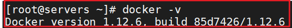
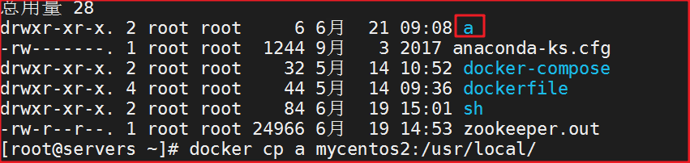
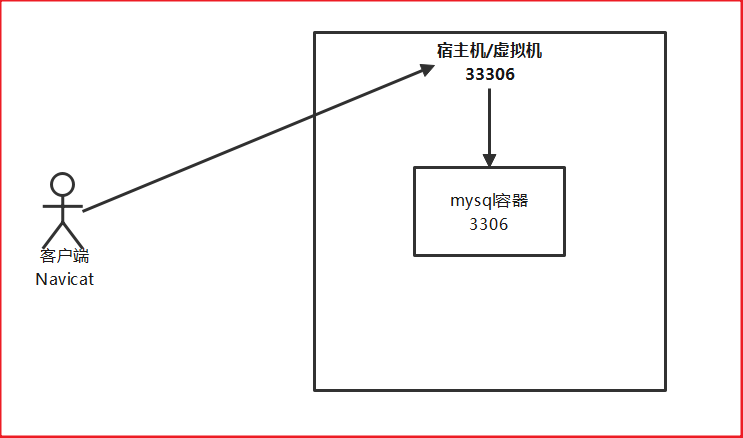
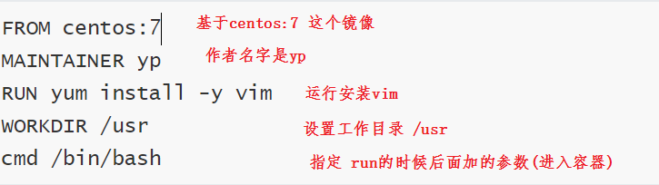
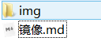

# day52-Docker 

# 学习目标

- [ ] docker是什么

- [ ] docker相关组件说明

- [ ] docker的安装和启动

- [ ] docker相关的容器的创建

- [ ] docker的常用的命令

- [ ] docker部署项目（系统）

  

# 第一章-Docker的介绍和安装

## 知识点-Docker的介绍

### 1.目标

- [ ] 知道docker是什么

### 2.路径

1. 为什么学习Docker

2. 什么是Docker

2. Docker的应用场景
3. 容器与虚拟机比较

### 3.讲解

#### 3.1 为什么使用Docker

目前整个软件行业存在着以下几个痛点:

1. 软件更新发布及部署低效，过程烦琐且需要人工介入。

   例如：对开发、测试、运维人员来说，最希望的就是一次创建或配置，可以在任意地方正常运行。

2. 环境一致性难以保证。

   例如：不同的应用程序可能会有不同的应用环境，有些软件安装之后会有端口之间的冲突

3. 不同环境之间迁移成本太高。

   例如：项目迁移原先用的乌班图系统，里面有个数据库，现在要迁移到centos中，此时需要从新在centos安装数据库，如果版本不一致，或者不支持，就会出现问题。

docker可以帮我们解决以上的痛点

#### 3.2什么是Docker

​	Docker 是一个开源的应用==容器引擎==，让开发者可以打包他们的应用(eg: 传智健康)以及依赖包(eg:jdk,tomcat)到一个可移植的容器中,然后发布到任何的Linux或Windows 上, 对进程进行封装隔离,属于操作系统层面的虚拟化技术。

​	Docker的容器思想就是来源于码头里的集装箱，它是一种标准化的箱子，可以层层重叠，可以大量放置在特别设计的轮船中（早期航运是没有集装箱概念的，货物杂乱无章的，影响出货和运输效率）。

​	Docker将这个模型运用到自己的设计中，唯一不同的是：集装箱运输货物，而Docker==运输软件==。

 

#### 3.3Docker的应用场景

- ==Web 应用的自动化打包和发布。==
- ==自动化测试和持续集成、发布。==
- 在服务型环境中部署和调整数据库或其他的后台应用。
- 从头编译或者扩展现有的 OpenShift 或 Cloud Foundry 平台来搭建自己的 PaaS 环境。

#### 3.4 容器与虚拟机比较

（1）本质上的区别

	


（2）使用上的区别

 

| 特性       | 容器               | 虚拟机      |
| ---------- | ------------------ | ----------- |
| 启动       | 秒级               | 分钟级      |
| 硬盘使用   | 一般为 `MB`        | 一般为 `GB` |
| 性能       | 接近原生           | 弱于        |
| 系统支持量 | 单机支持上千个容器 | 一般几十个  |

### 4.小结

1. 什么是Docker

   容器技术, 用来运输软件, 也是一种虚拟化技术

2. Docker应用场景

   + 把项目和依赖环境(jdk,tomcat) 进行打包, 进行环境的隔离
   + 自动化测试和持续集成


## 知识点-Docker组件

### 1.目标

- [ ] 了解docker相关组件

### 2.路径

1. Docker客户端和服务器
2. Docker镜像
3. Registry（中央仓库）
4. Docker容器

### 3.讲解

 

#### 3.1. Docker客户端和服务器

​	Docker是一个客户端-服务器（C/S）架构程序。Docker客户端只需要向Docker服务器或者守护进程发出请求，服务器或者守护进程将完成所有工作并返回结果。Docker提供了一个命令行工具Docker以及一整套RESTful API。你可以在同一台宿主机上运行Docker守护daemon进程和客户端，也可以从本地的Docker客户端连接到运行在另一台宿主机上的远程Docker守护进程。

 

#### 3.2. Docker镜像

​	镜像是构建Docker的基石。用户基于镜像来运行自己的容器。镜像也是Docker生命周期中的“构建”部分。镜像是基于联合文件系统的一种层式结构，由一系列指令一步一步构建出来。例如：添加一个文件；执行一个命令；打开一个窗口。

​	也可以将镜像当作容器的“源代码”。镜像体积很小，非常“便携”，易于分享、存储和更新。

#### 3.3. Registry（中央仓库）

​	Docker用Registry来保存用户构建的镜像。Registry分为公共和私有两种。Docker公司运营公共的Registry叫做Docker Hub。用户可以在Docker Hub注册账号，分享并保存自己的镜像（说明：在Docker Hub下载镜像巨慢，可以自己构建私有的Registry）。

#### 3.4. Docker容器

​	Docker可以帮助你构建和部署容器，你只需要把自己的应用程序或者服务打包放进容器即可。容器是基于镜像启动起来的，容器中可以运行一个或多个进程。我们可以认为，镜像是Docker生命周期中的构建或者打包阶段，而容器则是启动或者执行阶段。  容器基于镜像启动，一旦容器启动完成后，我们就可以登录到容器中安装自己需要的软件或者服务。 

​	

​	和集装箱一样，Docker在执行上述操作时，并不关心容器中到底装了什么，它不管是web服务器，还是数据库，或者是应用程序服务器什么的。所有的容器都按照相同的方式将内容“装载”进去。
​	Docker也不关心你要把容器运到何方：我们可以在自己的笔记本中构建容器，上传到Registry，然后下载到一个物理的或者虚拟的服务器来测试，在把容器部署到具体的主机中。像标准集装箱一样，Docker容器方便替换，可以叠加，易于分发，并且尽量通用。
​	使用Docker，我们可以快速的构建一个应用程序服务器、一个消息总线、一套实用工具、一个持续集成（CI）测试环境或者任意一种应用程序、服务或工具。我们可以在本地构建一个完整的测试环境，也可以为生产或开发快速复制一套复杂的应用程序栈。


## 环境-Docker安装与启动

### 1.目标

- [ ] 掌握Docker安装与启动

### 2.路径

### 3.讲解

​	Docker官方建议在Ubuntu中安装，因为Docker是基于Ubuntu发布的，而且一般Docker出现的问题Ubuntu是最先更新或者打补丁的。在很多版本的CentOS中是不支持更新最新的一些补丁包的。

​	由于我们学习的环境都使用的是CentOS，因此这里我们将Docker安装到CentOS上。注意：这里建议安装在==CentOS7.x以上的版本==，在CentOS6.x的版本中，安装前需要安装其他很多的环境而且Docker很多补丁不支持更新。

#### 3.1 安装Docker

+ 使用yum命令在线安装

```shell
yum -y install docker
```

+ 安装后查看Docker版本

```shell
docker -v
```

  

#### 3.2 启动与停止Docker

systemctl命令是系统服务管理器指令，它是 service 和 chkconfig 两个命令组合。

+ 启动docker

```shell
systemctl start docker
```

+ 停止docker

```shell
systemctl stop docker
```

+ 重启docker

```
systemctl restart docker
```

- 查看docker状态

```
systemctl status docker
```

+ ==开机自启【建议】==

```
systemctl enable docker
```


- 查看docker概要信息

```
docker info
```


- 查看docker帮助文档

```
docker --help
```

### 4.小结

+ 建议大家使用我的虚拟机

# 第二章-Docker镜像和容器的操作【重点】

## 知识点-Docker镜像的操作【重点】

### 1.目标

- [ ] 掌握Docker镜像的操作

### 2.路径

1. Docker镜像介绍
2. 列出本地镜像
3. 搜索镜像
4. 拉取镜像
5. 删除镜像

### 3.讲解

#### 3.1 什么是Docker镜像

​	Docker镜像是由文件系统叠加而成（是一种文件的存储形式）,可以看作是一个==特殊的文件系统==，除了提供容器运行时所需的程序、库、资源、配置等文件外，还包含了一些为运行时准备的一些配置参数（如匿名卷、环境变量、用户等）。镜像不包含任何动态数据，其内容在构建之后也不会被改变。

​	最底端是一个文件引导系统，即bootfs，这很像典型的Linux/Unix的引导文件系统。Docker用户几乎永远不会和引导系统有什么交互。实际上，当一个容器启动后，它将会被移动到内存中，而引导文件系统则会被卸载，以留出更多的内存供磁盘镜像使用。Docker容器启动是需要的一些文件，而这些文件就可以称为Docker镜像。

 


#### 3.2  列出本地镜像

列出docker下的当前docker服务所在的系统里面所有镜像：

```shell
docker images
```

 

- REPOSITORY：镜像所在的仓库名称

- TAG：镜像标签 版本号
- IMAGE ID：镜像ID 唯一
- CREATED：镜像的创建日期（不是获取该镜像的日期）
- SIZE：镜像大小

这些镜像都是存储在Docker宿主机的/var/lib/docker目录下

#### 3.3 搜索镜像

如果你需要从网络中查找需要的镜像，可以通过以下命令搜索: `docker search 镜像名称` .例如：


- NAME：仓库名称

- DESCRIPTION：镜像描述
- STARS：用户评价，反应一个镜像的受欢迎程度
- OFFICIAL：是否官方
- AUTOMATED：自动构建，表示该镜像由Docker Hub自动构建流程创建的

#### 3.4 拉取镜像

##### 3.4.1 从Docker Hub拉取

​	https://hub.docker.com/ 搜索，看有哪些版本

​	Docker镜像首页，包括官方镜像和其它公开镜像。Docker Hub上最受欢迎的10大镜像（通过Docker registry API获取不了镜像被pull的个数，只能通过镜像的stars数量，来衡量镜像的流行度。毫无疑问，拥有最高stars数量的库都是官方库）。 由于国情的原因，国内下载 Docker HUB 官方的相关镜像比较慢，可以使用国内（docker.io）的一些镜像加速器，镜像保持和官方一致，关键是速度块，推荐使用。


**Mirror与Private Registry的区别：**

Mirror是一种代理中转服务，我们(比如daocloud)提供的Mirror服务，直接对接Docker Hub的官方Registry。Docker Hub 上有数以十万计的各类 Docker 镜像。

Private Registry（私有仓库）是开发者或者企业自建的镜像存储库，通常用来保存企业内部的 Docker 镜像，用于内部开发流程和产品的发布、版本控制。在使用Private Registry时，需要在Docker Pull 或Dockerfile中直接键入Private Registry 的地址，通常这样会导致与 Private Registry 的绑定，缺乏灵活性。

**拉取镜像**

```shell
# dokcer pull 镜像名:版本号，  如果版本号不填，默认使用latest，拉取当时最新的版本，标记为latest，具体看不出来它的版本
# 建议拉取镜像时带上版本号
docker pull centos:7
```

​	目前国内访问docker hub速度上有点尴尬，使用docker Mirror势在必行。现有国内提供docker镜像加速服务的商家有不少，下面重点ustc镜像。

##### 3.4.2.ustc的镜像

ustc是老牌的linux镜像服务提供者了，还在遥远的ubuntu 5.04版本的时候就在用。ustc的docker镜像加速器速度很快。ustc docker mirror的优势之一就是不需要注册，是真正的公共服务。

https://lug.ustc.edu.cn/wiki/mirrors/help/docker

步骤：
（1）编辑该文件：vi /etc/docker/daemon.json  

   	PS: 如果该文件不存在就手动创建；另外有可能如果没有vim 命令则使用vi命令即可。
（2）在该文件中输入如下内容：

```json
{

	"registry-mirrors": ["https://docker.mirrors.ustc.edu.cn"]

}
```

还有本地阿里云的镜像地址,速度更快

登陆阿里云的控制台->所有产品->弹性计算->镜像容器服务->镜像加速器

```json
{ 
"registry-mirrors": ["https://alzgoonw.mirror.aliyuncs.com"] 
}
```

 

（3）注意：一定要重启docker服务，如果重启docker后无法加速，可以重新启动OS ,然后通过docker pull命令下载镜像 。

```shell
service docker restart
```

 

#### 3.5. 删除镜像

删除镜像方式1：根据仓库的名称（镜像的名称）来删除 还可以使用image_id来进行删除。

```
1、	docker rmi $IMAGE_ID：删除指定镜像
```

删除镜像方式2：

```
2、	docker rmi `docker img -q`：删除所有镜像
```

 


### 4.小结

1：了解什么是Docker镜像

​	  文件系统叠加而成

2：掌握镜像的操作

+ 列出本地所有的镜像

```
docker images
```

+ 搜索镜像

```
docker search 镜像名称
```

+ pull镜像(下载)

```
docker pull 镜像名称:版本
```

+ 删除镜像

```
docker rmi 镜像名称:版本/镜像id
```


## 知识点-Docker容器操作【重点】

### 1.目标

- [ ] 掌握Docker容器操作

### 2.路径

1. 查看容器
2. 创建(启动)容器
3. 停止容器
4. 文件拷贝
5. 目录挂载
6. 查看容器ip
7. 删除容器

### 3.讲解

#### 3.1 查看容器

+ 查看==正在运行==容器：

```shell
docker ps 
```

+ 查看所有的容器（启动过的历史容器）【常用】,列出==停止的与运行中==的

```shell
docker ps –a 
```


+ 查看最后一次运行的容器(了解)：

```shell
docker ps -l
```


+ 查看停止的容器(了解)

```shell
docker ps -f status=exited
```


#### 3.2 创建与启动容器

创建容器命令：docker run(创建且运行 create+st)（create）

常用的参数说明：

| 参数名   | 说明                                                         |
| -------- | ------------------------------------------------------------ |
| -i       | 表示运行容器                                                 |
| -t       | 表示容器启动后会进入其命令行。加入这两个参数后，容器创建就能登录进去。即分配一个伪终端 |
| --name   | 为创建的容器命名                                             |
| -v       | 表示目录映射关系（前者是宿主机目录，后者是映射到宿主机上的目录），可以使用多个－v做多个目录或文件映射。注意：最好做目录映射，在宿主机上所做修改，容器会自动更新-volume |
| -d       | 在run后面加上-d参数,则会创建一个==守护式容器==在后台运行（这样创建容器后不会自动登录容器，如果只加-i -t两个参数，创建后就会自动进去容器） |
| -p(port) | 表示端口映射，前者是宿主机端口，后者是容器内的映射端口。可以使用多个－p做多个端口映射 |


##### 3.1.1. 创建交互式容器

创建一个==交互式容器==并取名为mycentos

```shell
docker run -it --name=mycentos1 centos:7 /bin/bash
```

 

开启另外一个终端来查看状态：

```shell
docker ps 
```


退出当前容器：

```shell
exit
```


然后用ps -a 命令查看发现该容器也随之停止：

##### 3.1.2. 守护式容器【推荐】

创建一个守护式容器：如果对于==一个需要长期运行的容器==来说，我们可以创建一个守护式容器

命令如下（容器名称不能重复）：

```shell
docker run -di --name=mycentos2 centos:7
```


登录守护式容器：

`docker exec -it container_name` (或者container_id) /bin/bash（exit退出时，容器不会停止）

命令如下：

```shell
docker exec -it mycentos2 /bin/bash
```

 

#### 3.3停止与启动容器

+ 停止正在运行的容器：docker stop $CONTAINER_NAME/ID

```shell
docker stop mycentos2
```

 

+ 启动已运行过的容器：docker start $CONTAINER_NAME/ID

```shell
docker start mycentos2
```

 

#### 3.4. 文件拷贝

如果我们需要将文件拷贝到容器内可以使用cp命令:

```
docker cp 需要拷贝的本地文件或目录 容器名称:容器目录
```

也可以将文件从容器内拷贝出来

```
docker cp 容器名称:容器目录 本地的文件或目录
```

例子:

```
docker cp a mycentos2:/usr/local/
```

  

解释：cp 当前目录下的a文件到 容器中的/usr/local/下的a文件

```shell
[root@localhost ~]# docker exec -it mycentos2 /bin/bash
[root@32400e14bea6 /]# cd /usr/local/
[root@32400e14bea6 local]# ll
```

 

#### 3.5. 目录挂载（映射）【重点】

​	我们可以在创建容器的时候，将宿主机的目录与容器内的目录进行映射，这样我们就可以通过修改宿主机某个目录的文件从而去影响容器里所对应的目录。

```
创建容器 添加-v参数 后边为   宿主机目录:容器目录
```

创建容器 并挂载宿主机目录 到容器中的目录下：

```shell
docker run -di -v /usr/local/myhtml:/usr/local/myhtml --name=mycentos3 centos:7
```

如果你共享的是多级的目录，可能会出现权限不足的提示。

这是因为CentOS7中的安全模块selinux把权限禁掉了，我们需要添加参数--privileged=true来解决挂载的目录没有权限的问题。

```shell
docker run -di --privileged=true -v /root/test:/usr/local/test --name=mycentos4 centos:7
```

#### 3.6. 查看容器IP地址【了解】

我们可以通过以下命令查看容器运行的各种数据:

```shell
docker inspect mycentos2
```

也可以直接执行下面的命令直接输出IP地址:

```shell
docker inspect --format='{{.NetworkSettings.IPAddress}}' mycentos2
```

#### 3.7. 删除容器

+ 删除指定的容器： 这个命令只能删除已经关闭的容器，==不能删除正在运行的容器==

```
docker rm $CONTAINER_ID/NAME
```

+ 删除所有的容器【不要用了】：

```shell
docker rm `docker ps -a -q`
```

或者：

```shell
[root@localhost ~]# docker rm $(docker ps -aq)
```

### 4.小结

+ 查看容器

```
docker ps
docker ps -a
```

+ 创建容器

  + 创建交互式

  ```
  docker run -it --name=容器的名字 镜像的名字:版本或者镜像的id  /bin/bash
  ```

  + 创建守护式

  ```
  docker run -di --name=容器的名字 镜像的名字:版本或者镜像的id 
  ```

  + 如果是守护式 需要进入容器内部

  ```
  docker exec -it 容器的名字 /bin/bash
  ```

+ 文件的拷贝

  + 宿主机的文件拷贝到容器

    ```
    docker cp 宿主机的文件/目录 容器的名字:目录
    ```

  + 容器里面的文件拷贝到宿主机

    ```
    docker cp  容器的名字:目录 宿主机的文件/目录
    ```

+ 目录挂载

```
docker run -di --name=容器的名字 -v 宿主机目录:容器的目录 镜像的名字:版本或者镜像的id 
```

+ 删除容器 不能删除正在运行的容器

```
docker rm 容器的名字或者容器的id
```


​	


# 第三章-部署应用【重点】

## 实操-MySQL部署

### 1.目标

- [ ] 掌握MySQL的部署

### 2.路径

1.  拉取MySQL镜像
2.  创建MySQL容器
3.  进入MySQL容器, 授权可以远程登录
4. 远程登陆MySQL

### 3.讲解

#### 3.1 拉取MySQL镜像

```shell
docker pull mysql:5.7
```

查看镜像：

 

#### 3.2 创建MySQL容器

```shell
docker run -di --name=mysql -p 33306:3306 -e MYSQL_ROOT_PASSWORD=123456 mysql:5.7
```

-p 代表端口映射，格式为  宿主机映射端口:容器运行端口

【注意】-e 代表添加环境变量  MYSQL_ROOT_PASSWORD是root用户的登陆密码，必须，严格区分大小写

#### 3.3. 进入MySQL容器

+ 进入容器中

```shell
docker exec -it mysql /bin/bash
```

+ 登录mysql

```
mysql -uroot -p123456
```

+ 授权允许远程登录

```shell
GRANT ALL PRIVILEGES ON *.* TO 'root'@'%' IDENTIFIED BY '123456' WITH GRANT OPTION;
```

#### 3.4. 远程登陆MySQL

+ 我们在我们本机的电脑上去连接虚拟机Centos中的Docker容器，这里192.168.25.132是【你】的虚拟机操作系统的IP.

 

### 4.小结

>注意: 客户端链接需要写宿主机的端口



## 实操- tomcat部署

### 1.目标

- [ ] 掌握tomcat部署

### 2.路径

1. 拉取tomcat镜像
2. 创建tomcat容器
3. 测试tomcat

### 3.讲解

#### 3.1 拉取tomcat镜像

```shell
docker pull tomcat:7-jre8
```

#### 3.2 创建tomcat容器

```shell
docker run -di --name=tomcat -p 9100:8080 tomcat:7-jre8
```

#### 3.3 测试tomcat

浏览器地址栏输入：http://192.168.25.132:9100


## 知识点- Nginx部署

### 1.目标

- [ ] 掌握Nginx的部署

### 2.路径

1. 拉取Nginx镜像
2. 创建Nginx容器
3. 测试Nginx

### 3.讲解

#### 3.1拉取Nginx镜像

```shell
docker pull nginx
```

#### 3.2. 创建Nginx容器

```shell
docker run -di --name=nginx -p 80:80  nginx 
```

#### 3.3. 测试Nginx

浏览器地址栏输入：http://192.168.25.132

## 知识点-Redis部署

### 1.目标

- [ ] 掌握Redis的部署

### 2.路径

1. 拉取Redis镜像
2. 创建Redis容器
3. 客户端测试

### 3.讲解

#### 3.1 拉取Redis镜像

```shell
docker pull redis
```

#### 3.2.创建Redis容器

```shell
docker run -di --name=redis -p 6379:6379 redis
```

#### 3.3 客户端测试

本地安装一个redis的客户端 连接即可

```shell
redis-cli.exe -h 192.168.137.133 -p 16379
```


# 第四章-备份,迁移

## 知识点-备份与迁移

### 1.目标

- [ ] 了解备份与迁移

### 2.路径

1. 容器保存为镜像
2. 镜像备份
3. 镜像恢复与迁移

### 3.讲解

#### 3.1  容器保存为镜像

我们可以通过以下命令将容器保存为镜像

```shell
docker commit nginx mynginx
```

+ nginx是容器名称
+ mynginx是新的镜像名称

#### 3.2  镜像备份

```shell
docker  save -o mynginx.tar mynginx
```

+ -o 输出到的文件

执行后，运行ls命令即可看到打成的tar包.

#### 3.3 镜像恢复与迁移

首先我们先删除掉mynginx镜像,然后执行命令进行恢复

```shell
docker load -i mynginx.tar
```

+ -i 输入的文件

执行后再次查看镜像，可以看到镜像已经恢复

再创建容器。

### 4.小结

操作一遍就好了

# 第五章-DockerFile

## 知识点-DockerFile介绍

### 1.目标

- [ ] dockerfile介绍

### 2.路径

1. 什么是DockerFile
2. 常用命令 

### 3.讲解

#### 3.1 什么是Dockerfile 

Dockerfile是由一系列命令和参数构成的脚本，这些命令应用于==基础镜像并最终创建一个新的镜像==。

1、对于开发人员：可以为开发团队提供一个完全一致的开发环境；

2、对于测试人员：可以直接拿开发时所构建的镜像或者通过Dockerfile文件构建一个新的镜像开始工作了；
3、对于运维人员：在部署时，可以实现应用的无缝移植 

 

#### 3.2常用命令 

| 命令                              | 作用                                                         |
| --------------------------------- | ------------------------------------------------------------ |
| FROM image_name:tag               | 定义了使用哪个基础镜像启动构建流程                           |
| MAINTAINER user_name              | 声明镜像的创建者                                             |
| ENV key value                     | 设置环境变量 (可以写多条)                                    |
| RUN command                       | 是Dockerfile的核心部分(可以写多条)                           |
| ADD source_dir/filedest_dir/file  | 将宿主机的文件复制到容器内，如果是一个压缩文件，将会在复制后自动解压 |
| COPY source_dir/filedest_dir/file | 和ADD相似，但是如果有压缩文件并不能解压                      |
| WORKDIR path_dir                  | 设置工作目录                                                 |
| EXPOSE port1 prot2                | 用来指定端口，使容器内的应用可以通过端口和外界交互           |
| CMD argument                      | 在构建容器时使用，会被docker run 后的argument覆盖            |
| ENTRYPOINT argument               | 和CMD相似，但是并不会被docker run指定的参数覆盖              |
| VOLUME                            | 将本地文件夹或者其他容器的文件挂载到容器中                   |

https://deepzz.com/post/dockerfile-reference.html#toc_9

https://docs.docker.com/engine/reference/builder/

### 4.小结

1. DockerFile

   ​	就是Docker的脚本文件, 可以基于一个基础镜像(jar,war) 打出一个新的镜像

2. 避免很多的环境问题, 


## 案例-入门案例(自定义CentOS)

### 1.需求

自定义centos7镜像。要求：

/root

1.  默认登录路径为 /usr
2.  可以使用vim  

### 2.分析

1. 定义父镜像： FROM centos:7
2. 定义作者信息： MAINTAINER itheima <itheima@itcast.cn>
3. 执行安装vim命令： RUN yum install -y vim
4. 定义默认的工作目录： WORKDIR /usr
5. 定义容器启动执行的命令： CMD /bin/bash
6. 通过dockerfile构建镜像： docker build  –t 镜像名称 .

### 3.实现

#### 3.1脚本

+ 创建目录

```
mkdir -p /root/dockerfile/mycentos
```

+ 在mycentos目录下创建文件Dockerfile;  输入  `vi Dockerfile` (名字必须叫Dockerfile ) 

```
FROM centos:7
MAINTAINER yp
RUN yum install -y vim
WORKDIR /usr
cmd /bin/bash
```

 

+ 执行命名构建 (注意后边的空格和点，不要省略 )

```
docker build -t='mycentos' .
```

​	-t: 制定构建的镜像的名字

### 4.小结

1. 大家根据文档操作一遍

## 案例-Springboot微服务部署

### 1.需求

- [ ] 定义dockerfile，发布springboot项目  

### 2.分析

1. 定义父镜像： FROM java:8
2. 定义作者信息： MAINTAINER itheima <itheima@itcast.cn>
3. 将jar包添加到容器： ADD springboot.jar app.jar
4. 定义容器启动执行的命令： ENTRYPOINT ["java","-jar","/app.jar"]
5. 通过dockerfile构建镜像： docker build  –t 镜像名称:版本  .

### 3.实现

+ 创建目录

```
mkdir -p /root/dockerfile/springbootdemo
```

把`springboot-hello-0.0.1-SNAPSHOT.jar`上传到springbootdemo目录

+ 在springbootdemo目录下创建文件Dockerfile;  输入  `vi Dockerfile` (名字必须叫Dockerfile ) 

```
FROM java:8
MAINTAINER yp
ADD springboot-hello-0.0.1-SNAPSHOT.jar app.jar
ENTRYPOINT ["java","-jar","/app.jar"]
EXPOSE 8080
```

+ 执行命名构建 (注意后边的空格和点，不要省略 )

```
docker build -t='hello-docker' .
```

​	-t: 制定构建的镜像的名字

### 4.小结


# 第六章-Docker 服务编排 【扩展】

## 知识点-服务编排概念和DockerCompose的安装

### 1.目标

- [ ] 知道什么是服务编排

### 2.路径

1. 什么是服务编排
2. Docker Compose介绍
3. DockerCompose的安装

### 3.讲解

#### 3.1什么是服务编排

​	微服务架构的应用系统中一般包含若干个==微服务==，每个微服务一般都会部署多个实例，如果每个微服务都要手动启停，维护的工作量会很大。

+ 要从Dockerfile build image 或者去dockerhub拉取image
+  要创建多个container
+  要管理这些container（启动停止删除）

服务编排： ==按照一定的业务规则批量管理容器==  

#### 3.2Docker Compose介绍

​	Docker Compose是一个==编排多容器分布式部署的工具==，提供命令集管理容器化应用的完整开发周期，包括服务构建，启动和停止。使用步骤：

1. 利用 Dockerfile 定义运行环境镜像 
2. 使用 docker-compose.yml 定义组成应用的各服务
3.  运行 ==docker-compose up== 启动应用  

 

#### 3.3DockerCompose的安装

1. 安装Docker Compose

```shell
# Compose目前已经完全支持Linux、Mac OS和Windows，在我们安装Compose之前，需要先安装Docker。下面我 们以编译好的二进制包方式安装在Linux系统中。 
curl -L https://github.com/docker/compose/releases/download/1.22.0/docker-compose-`uname -s`-`uname -m` -o /usr/local/bin/docker-compose
# 设置文件可执行权限 
chmod +x /usr/local/bin/docker-compose
# 查看版本信息 
docker-compose -version
```

2. 卸载

```shell
# 二进制包方式安装的，删除二进制文件即可
rm /usr/local/bin/docker-compose
```


### 4.小结

1. 服务编排

    就是批量管理容器

2. DockerCompose

   服务编排的一种技术


## 案例-使用docker compose编排nginx+springboot项目

### 1.需求

- [ ] 使用docker compose编排, 通过nginx反向代理springboot项目

### 2.分析

### 3.实现

1. 在root目录下创建 docker-compose目录

```shell
mkdir docker-compose
cd docker-compose
```

2. 编写 docker-compose.yml 文件

+ vi docker-compose.yml

```ya
version: '2'
services:
  nginx:
   image: nginx
   ports:
    - 80:80
   links:
    - app
   volumes:
    - /data/nginx/conf.d:/etc/nginx/conf.d
   privileged: true
  app:
    image: hello-docker
    expose:
      - "8080"
```

+ 注释版本

```
version: '2'  #版本, 随便写从1开始
services:
  nginx:  #服务名字, 服务名字随便取的, 一般见名知意(容器)
   image: nginx #根据nginx镜像创建出来的
   ports:
    - 80:80  #映射端口号
   links:  
    - app   #关联另外一个服务
   volumes: # 就是-v 进行目录挂载
    - /data/nginx/conf.d:/etc/nginx/conf.d
   privileged: true #解决权限问题的
  app:   #服务名字, 服务名字随便取的, 一般见名知意(容器)
    image: hello-docker #根据hello-docker这个镜像创建的
    expose:
      - "8080"  #暴露端口号 
```


3. 创建/data/nginx/conf.d目录

```shell
mkdir -p /data/nginx/conf.d
```

4. 在/data/nginx/conf.d目录下 编写default.conf 文件
   + vi  /data/nginx/conf.d/default.conf

```shell
server {
    listen 80;
    access_log off;

    location / {
        proxy_pass http://app:8080;
    }
   
}
```

5. 在docker-copose 目录下 使用docker-compose 启动容器

```shell
docker-compose up
```

6. 测试访问

```shell
http://192.168.211.150/hello
```


### 4.小结

1. 大家大概能懂就行


# 总结

## 1.概念  

+ 理解docker概念
+ 理解docker角色

> 10分钟解决

## 2.大家环境

+ 使用我提供的镜像
+ 参考去配置

 

 

> 15分钟

## 3.Docker镜像的操作【重点】

> 最低3遍

## 4.Docker容器的操作【重点】

> 最低3遍

## 5.部署应用【重点】

> 本质就是操作Docker容器

## 6.备份,迁移,DockerFile 过一遍

## 7.预习