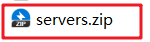

## 虚拟机配置

1. 打开资料文件中的镜像，拷贝到一个没有中文和空格的目录，解压

    

2. 解压后 使用vmware打开(注意：先不要启动虚拟机)

3. 修改虚拟网络地址（NAT）

 

 

 

 

> 建议: 重启电脑

4. 再启动虚拟机，ip地址：192.168.211.150 用户名：root   密码：itcast

5. 注意！注意！弹出框 选择 ==【已移动】==

