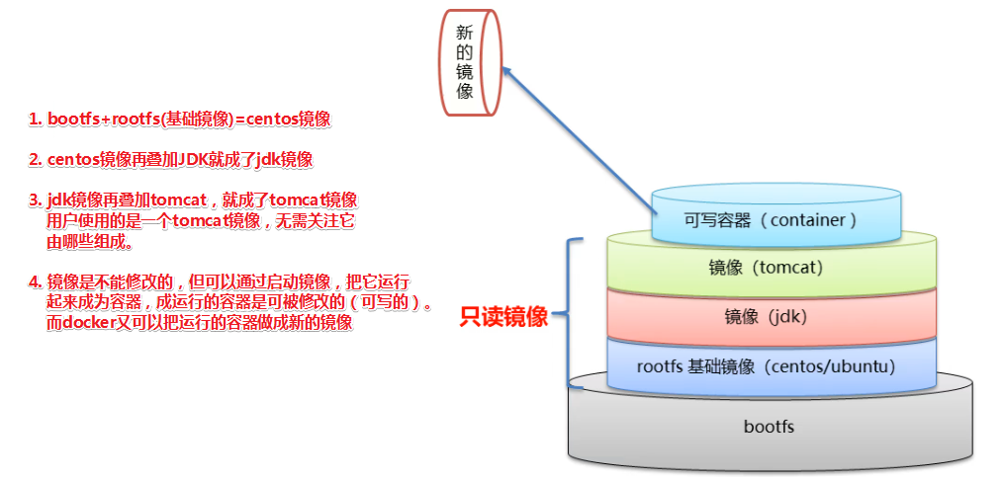

# Docker镜像原理

## 问题

* Docker镜像本质是什么？
* Docker中的一个centos镜像为什么只有200MB，而一个centos操作系统的iso文件却要几个G？
* Docker中一个tomcat镜像为什么有500MB，而一个tomcat安装包只有70+MB？

## Linux文件系统

Linux文件系统由bootfs和rootfs两部分组成

* bootfs：包含bootloader（引导加载程序）和kernel（内核）
* rootfs：root文件系统，包含的就是典型的linux系统中的/dev，/proc，/bin，/etc等标准目录和文件
* 不同的linux发行版本，bootfs基本一样，而rootfs不同。如：ubuntu，centos等

## Docker镜像文件

Docker镜像是由特殊的文件系统叠加而成

最底端的是bootfs，并使用宿主机的bootfs

第二层是root文件系统rootfs，称为base image

然后再往上可以叠加其它的镜像文件

统一文件系统（Union File System）技术将不同的层整合成一个文件系统，为这些层提供了一个统一的视角，这样就隐藏了多层的存在，在用户的角度看来，只存在一个文件系统（镜像）

一个镜像可以放在另一个镜像的上面，位于下面的镜像称为父镜像，最底部的为基础镜像

## 问题解答

* Docker镜像本质是什么？
  * 是一个分层的文件系统，将不同的分层合成一个文件系统。
* Docker中的一个centos镜像为什么只有200MB，而一个centos操作系统的iso文件却要几个G？
  * CentOS的镜像文件包含bootfs和rootfs，而docker的centos镜像复用操作系统的bootfs，只有rootfs和其镜像层，因此文件要小得多。
* Docker中一个tomcat镜像为什么有500MB，而一个tomcat安装包只有70+MB？
  * 由于docker镜像是分层的，tomcat虽然只有70多M，但他需要依赖于交镜像和基础镜像，所有整个对外暴露的tomcat镜像要比安装文件的多。