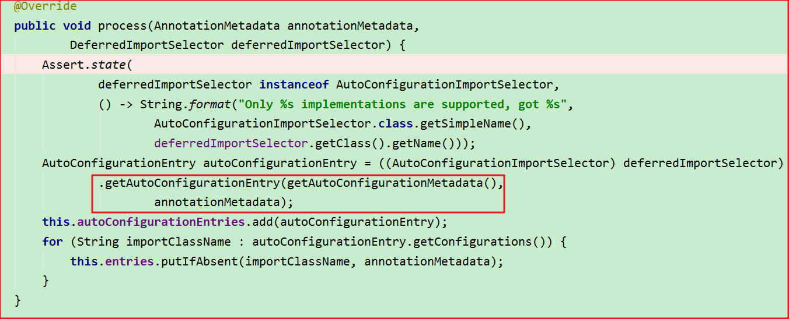
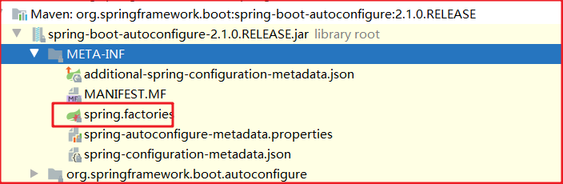
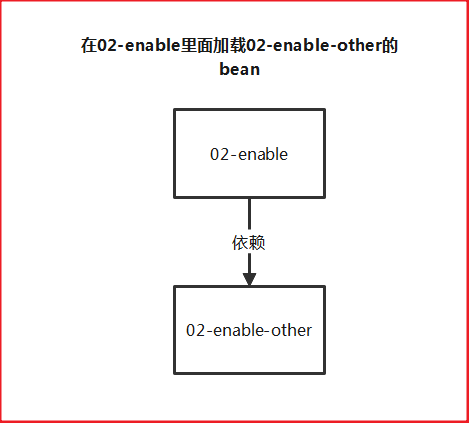
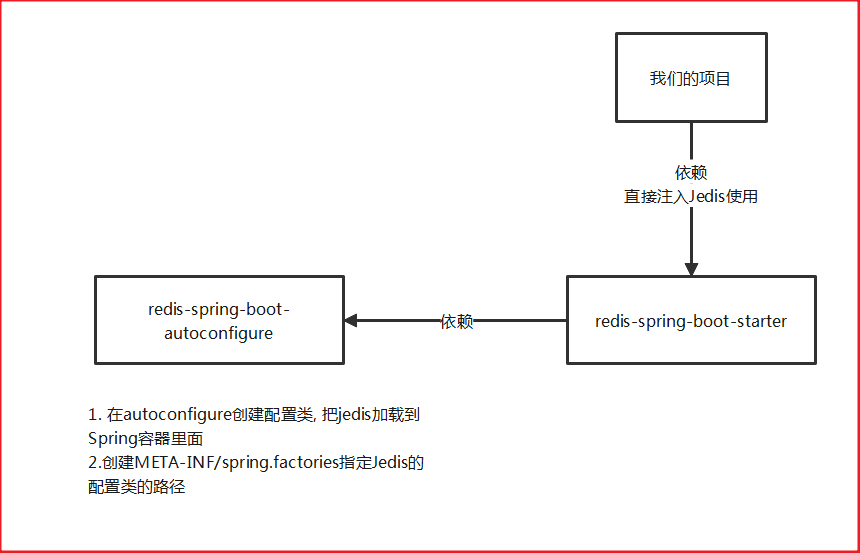
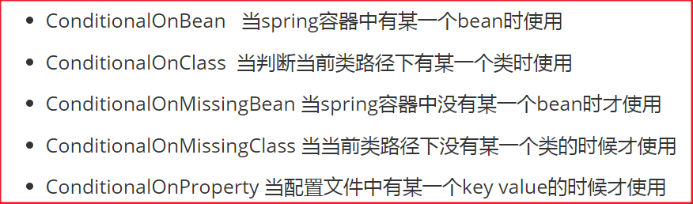

# day49-SpringBoot高级

# 学习目标

- [ ] 理解springboot自动配置原理
- [ ] 理解自动配置注解的原理解析
- [ ] 掌握自定义springboot的starter
- [ ] 了解springboot监听机制
- [ ] 了解springboot的启动流程
- [ ] 了解springboot监控
- [ ] 掌握springboot的部署


# 第一章-SpringBoot的自动配置原理

## 知识点-Condition接口及相关注解

### 1.目标

​	在我们使用springboot的时候，能带来的方便性和便利性，不需要配置便可以实现相关的使用，开发效率极大的提升，那么实际上，springboot本身的基础依赖中封装了许许多多的配置帮我们自动完成了配置了。那么它是如何实现的呢？讲Springboot自动配置，逃不开ConditionalOnxxx等等注解，也逃不开Condition接口所定义的功能。

- [ ] 掌握Condition接口及相关注解

### 2.路径

1.  Condition接口说明
2. Condition的应用案例
3.  Condition的应用案例优化

### 3.讲解

#### 3.1Condition接口说明

​	condition接口是spring4之后提供给了的接口，增加条件判断功能，用于选择性的创建Bean对象到spring容器中。

 

​	我们之前用过springboot整合redis 实现的步骤：就是添加redis起步依赖之后，直接就可以使用从spring容器中获取注入RedisTemplate对象了，而不需要创建该对象放到spring容器中了.意味着Spring boot redis的起步依赖已经能自动的创建该redisTemplate对象加入到spring容器中了。这里应用的重要的一个点就是condition的应用。

我们来演示下，是否加入依赖就可以获取redisTemplate,不加依赖就不会获取到redisTemplate


+ 注释依赖则报错：


#### 3.2Condition的应用

刚才看到的效果，那么它到底是如何实现的呢？我们现在给一个需求：

##### 3.2.1需求

​	在Spring容器中有一个user的bean对象，如果导入了jedis的坐标则加载该bean，如果没有导入则不加载该bean。

##### 3.2.2实现步骤

1. 定义一个User的pojo
2. 定义一个配置类用于创建user对象交给spring容器管理
3. 定义一个接口condition的实现类
   + 实现方法 判断是否有字节码对象，有则返回true 没有则返回false
4. 修改配置类上加入注解@Conditional(value=Condition)
5. 测试打印

##### 3.2.3实现

**1.环境的准备**

+ pom文件

```xml
<?xml version="1.0" encoding="UTF-8"?>
<project xmlns="http://maven.apache.org/POM/4.0.0"
         xmlns:xsi="http://www.w3.org/2001/XMLSchema-instance"
         xsi:schemaLocation="http://maven.apache.org/POM/4.0.0 http://maven.apache.org/xsd/maven-4.0.0.xsd">
    <modelVersion>4.0.0</modelVersion>

    <groupId>com.itheima</groupId>
    <artifactId>02-condition</artifactId>
    <version>1.0-SNAPSHOT</version>

    <parent>
        <artifactId>spring-boot-starter-parent</artifactId>
        <groupId>org.springframework.boot</groupId>
        <version>2.1.0.RELEASE</version>
    </parent>

    <properties>
        <project.build.sourceEncoding>UTF-8</project.build.sourceEncoding>
        <maven.compiler.source>1.8</maven.compiler.source>
        <maven.compiler.target>1.8</maven.compiler.target>
    </properties>

    <dependencies>
        <!--spring-boot-starter-->
        <dependency>
            <groupId>org.springframework.boot</groupId>
            <artifactId>spring-boot-starter</artifactId>
        </dependency>
        <!--jedis-->
        <dependency>
            <groupId>redis.clients</groupId>
            <artifactId>jedis</artifactId>
            <version>3.2.0</version>
        </dependency>
    </dependencies>
</project>
```

+ 启动类

```java
package com.itheima.condition;

import com.itheima.condition.bean.User;
import org.springframework.boot.SpringApplication;
import org.springframework.boot.autoconfigure.SpringBootApplication;
import org.springframework.context.ConfigurableApplicationContext;

/**
 * @Description:
 * @author: yp
 */
@SpringBootApplication
public class ConditionApplication {

    public static void main(String[] args) {
        //1. ConfigurableApplicationContext Spring容器
        ConfigurableApplicationContext context = SpringApplication.run(ConditionApplication.class, args);
        User user = (User) context.getBean("user");
        System.out.println(user);
    }

}

```

**2.实现**

+ 创建pojo

```
package com.itheima.condition.bean;

/**
 * @Description:
 * @author: yp
 */
public class User {
    private String username;
    public String getUsername() {
        return username;
    }
    public void setUsername(String username) {
        this.username = username;
    }

}

```

+ 创建配置类

```java
package com.itheima.condition.config;

import com.itheima.condition.bean.User;
import com.itheima.condition.condition.ConditionalOnClass;
import org.springframework.context.annotation.Bean;
import org.springframework.context.annotation.Configuration;

/**
 * @Description:
 * @author: yp
 */
@Configuration
public class UserConfig {

    @Bean
    @ConditionalOnClass(name = {"redis.clients.jedis.Jedis"})
    public User user(){
        return new User();
    }

}

```

+ 创建Condition的实现类

```JAVA
package com.itheima.condition.config;

import com.itheima.condition.bean.User;
import com.itheima.condition.condition.MyCondition;
import org.springframework.context.annotation.Bean;
import org.springframework.context.annotation.Conditional;
import org.springframework.context.annotation.Configuration;

/**
 * @Description:
 * @author: yp
 */
@Configuration
public class UserConfig {

    @Bean
    @Conditional(value = {MyCondition.class}) //Conditiond的子类: MyCondition里面的matches方法返回true, @Conditional控制加载当前的bean;返回false, @Conditional控制不加载当前的bean
    public User user(){
        return new User();
    }

}

```

+ 修改配置类上加入注解@Conditional(value=Condition)

 

​	@Conditional(value = MyCondition.class) 当符合指定类的条件返回true的时候则执行被修饰的方法，放入spring容器中。

+ 测试：

  加入jedis的依赖时：

```xml
<dependency>
    <groupId>redis.clients</groupId>
    <artifactId>jedis</artifactId>
    <version>3.2.0</version>
</dependency>
```


​	不加入jedis的依赖时：


##### 3.2.4 小结

我们由上边的看出。由于有了条件接口，那么我们可以选择性的在某种条件小才进行bean的注册和初始化等操作。他的接口的说明也描述了这有点；


#### 3.3Condition的应用需求优化

​	我们希望这个类注解可以进行动态的加载某一个类的全路径，不能写死为redis.将来可以进行重用。

##### 3.3.1需求

- [ ] 将类的判断定义为动态的. 判断哪个字节码文件存在可以动态指定

##### 3.3.2实现步骤

1. 自定义MyConditionalOnClass注解(需要加@Conditional注解), 定义name属性用于指定具体的类全路径 
2. 配置类使用这个注解, 动态的指定类路径
3. 在MyCondition中修改方法实现,在条件的实现类中进行动态的获取并加载类

##### 3.3.3实现

- 自定义MyConditionalOnClass注解, 定义name属性用于指定具体的类全路径 

```java
package com.itheima.condition.condition;

import org.springframework.context.annotation.Conditional;

import java.lang.annotation.Retention;
import java.lang.annotation.RetentionPolicy;

/**
 * @Description:
 * @author: yp
 */
@Retention(RetentionPolicy.RUNTIME)  //在运行阶段还有效
@Conditional(value = {MyCondition.class}) //Conditiond的子类: MyCondition里面的matches方法返回true, @Conditional控制加载当前的bean;返回false, @Conditional控制不加载当前的bean
public @interface ConditionalOnClass {
    String[] name();

}

```

- 配置类使用这个注解, 动态的指定类路径

```java
package com.itheima.condition.config;

import com.itheima.condition.bean.User;
import com.itheima.condition.condition.ConditionalOnClass;
import org.springframework.context.annotation.Bean;
import org.springframework.context.annotation.Configuration;

/**
 * @Description:
 * @author: yp
 */
@Configuration
public class UserConfig {

    @Bean
    @ConditionalOnClass(name = {"redis.clients.jedis.Jedis"})
    public User user(){
        return new User();
    }

}

```


- 在MyCondition中修改方法实现,在条件的实现类中进行动态的获取并加载类

```java
package com.itheima.condition.condition;

import org.springframework.context.annotation.Condition;
import org.springframework.context.annotation.ConditionContext;
import org.springframework.core.type.AnnotatedTypeMetadata;

import java.util.Map;

/**
 * @Description:
 * @author: yp
 */
public class MyCondition implements Condition {
    /**
     * 返回值: 返回true 代表满足条件; false:代表不满足条件
     * @param context Condition上下文对象  获得Spring容器,类加载器
     * @param metadata 注解原数据对象,  获得注解的属性
     * @return
     */
    @Override
    public boolean matches(ConditionContext context, AnnotatedTypeMetadata metadata) {
        //在MyCondition里面获得@ConditionalOnClass(name = {"redis.clients.jedis.Jedis"})的name的属性值
        try {
            //1.获得ConditionalOnClass注解的全部属性
            Map<String, Object> map = metadata.getAnnotationAttributes(ConditionalOnClass.class.getName());
            //2.获得name的属性值
            String[] values = (String[]) map.get("name");
            for (String value : values) {
                //System.out.println("value="+value);
                Class.forName(value);
            }
            return true;
        } catch (Exception e) {
            e.printStackTrace();
            return false;
        }
    }
}

```


 

### 4.小结

#### 4.1案例小结

+  定义条件类：自定义类实现Condition接口，重写 matches 方法，在 matches 方法中进行逻辑判断，返回
  boolean值 。 matches 方法两个参数：
  + context：上下文对象，可以获取属性值，获取类加载器，获取BeanFactory等。
  + metadata：元数据对象，用于获取注解属性。
+  判断条件： 在初始化Bean时，使用 @Conditional(条件类.class)注解

#### 4.2Conditional相关的注解

- ConditionalOnBean   当spring容器中有某一个bean时使用

- ConditionalOnClass  当判断当前类路径下有某一个类时使用

- ConditionalOnMissingBean 当spring容器中没有某一个bean时才使用

- ConditionalOnMissingClass 当当前类路径下没有某一个类的时候才使用

- ConditionalOnProperty 当配置文件中有某一个key value的时候才使用

  ...


## 知识点-@SpringBootApplication源码

### 1.目标

- [ ] 掌握@SpringBootApplication源码

### 2.路径

1. @SpringbootConfiguration
2. @EnableAutoConfiguration
3. @ComponentScan注解

### 3.讲解

#### 3.1@SpringbootConfiguration

 

如上图所示，就是该注解实际上是在启动类上的注解中的一个注解，我们再点击进去：

  

​	我们发现其实该注解就是一个@Configuration注解，那么意味着我们的==启动类被注解修饰后，意味着它本身也是一个配置类==,该配置类就可以当做spring中的applicationContext.xml的文件，用于加载配置使用。

#### 3.2@EnableAutoConfiguration【重点】

##### 3.2.1源码分析

+ 注解SpringBootApplication上有一个元注解@EnableAutoConfiguration,这就是起自动装配的作用

 

+ 注解@EnableAutoConfiguration上导入了一个类@Import(AutoConfigurationImportSelector.class)

 

+ AutoConfigurationImportSelector里面有一个process() 方法

  注:老版本里面是执行selectImports()方法



 

 

+ 其中，SpringFactoriesLoader.loadFactoryNames 方法的作用就是从META-INF/spring.factories文件中读取指定类对应的类名称列表 

  

META-INF/spring.factories的配置文件

```properties
# AutoConfigureWebMvc auto-configuration imports
org.springframework.boot.test.autoconfigure.web.servlet.AutoConfigureWebMvc=\
org.springframework.boot.autoconfigure.context.MessageSourceAutoConfiguration,\
org.springframework.boot.autoconfigure.freemarker.FreeMarkerAutoConfiguration,\
org.springframework.boot.autoconfigure.groovy.template.GroovyTemplateAutoConfiguration,\
org.springframework.boot.autoconfigure.gson.GsonAutoConfiguration,\
org.springframework.boot.autoconfigure.hateoas.HypermediaAutoConfiguration,\
org.springframework.boot.autoconfigure.http.HttpMessageConvertersAutoConfiguration,\
org.springframework.boot.autoconfigure.jackson.JacksonAutoConfiguration,\
org.springframework.boot.autoconfigure.jsonb.JsonbAutoConfiguration,\
org.springframework.boot.autoconfigure.mustache.MustacheAutoConfiguration,\
org.springframework.boot.autoconfigure.thymeleaf.ThymeleafAutoConfiguration,\
org.springframework.boot.autoconfigure.validation.ValidationAutoConfiguration,\
org.springframework.boot.autoconfigure.web.servlet.error.ErrorMvcAutoConfiguration,\
org.springframework.boot.autoconfigure.web.servlet.WebMvcAutoConfiguration
```

加载META-INF/spring.factories之后, 解析获得 List<String> configurations的值:


##### 3.2.2结论

+ @EnableAutoConfiguration 注解内部使用 @Import(AutoConfigurationImportSelector.class)来加载配置类。
+ 配置文件位置：META-INF/spring.factories，该配置文件中定义了大量的配置类，当 SpringBoot  应用启动时，AutoConfigurationImportSelector内部会自动加载这些配置类，初始化Bean
+ 并不是所有的Bean都会被初始化，在配置类中使用Condition来加载满足条件的Bean


#### 3.3@ComponentScan


​	如上图，在启动类的注解@SpringBootApplication注解里面又修饰了@CompnetScan注解，该注解的作用用于组件扫描包类似于xml中的`context-componet-scan`，如果不指定扫描路径，那么就扫描该注解修饰的启动类所在的包以及子包。这就是为什么我们在第一天的时候写了controller 并没有扫描也能使用的原因。


## 知识点-加载第三方的Bean

### 1.目标

- [ ] 掌握加载第三方的Bean, 在02-enable工程里面获得02-enable-other里面的bean

 

### 2.路径

1. 使用@ComponentScan扫描
2. 使用@Import注解
3. 使用@EnableXXX

### 3.讲解

#### 3.0环境的准备

 

#### 3.1@ComponentScan扫描

+ 02-enable-other的User.class

```java
package com.itheima.enableother.bean;


import org.springframework.stereotype.Component;

/**
 * @Description:
 * @author: yp
 */
@Component("user")
public class User {

}

```

+ 02-enable的启动类

```java
@SpringBootApplication
@ComponentScan(value ={"com.itheima.enableother.bean"})
public class EnableApplication {
    public static void main(String[] args) {
        ConfigurableApplicationContext context = SpringApplication.run(EnableApplication.class, args);
        User user = (User) context.getBean("user");

    }
}
```

#### 3.2使用@Import注解

##### 3.2.1导入bean

+ 02-enable-other的User

```java
package com.itheima.enableother.bean;


import org.springframework.stereotype.Component;

/**
 * @Description:
 * @author: yp
 */
@Component("user")
public class User {

}

```

+ 02-enable-other的Role

```java
package com.itheima.enableother.bean;

/**
 * @Description:
 * @author: yp
 */
public class Role {

}
```


+ 02-enable的启动类

```java
@SpringBootApplication
@Import(value = {User.class,Role.class})
public class EnableApplication {
    public static void main(String[] args) {
        ConfigurableApplicationContext context = SpringApplication.run(EnableApplication.class, args);
        User user = (User) context.getBean("user");
        System.out.println(user);


        Role role = (Role) context.getBean("com.itheima.enableother.bean.Role");
        System.out.println(role);
    }
}
```

##### 3.2.2导入配置类

+ 02-enable-other的UserConfig

```java
package com.itheima.enableother.config;

import com.itheima.enableother.bean.User;
import org.springframework.context.annotation.Bean;
import org.springframework.context.annotation.Configuration;

/**
 * @Description:
 * @author: yp
 */
@Configuration
public class UserConfig {
    @Bean
    public User user(){
        return new User();
    }
}

```

+ 02-enable的启动类

```java
@SpringBootApplication
@Import(value = {UserConfig.class})
public class EnableApplication {
    public static void main(String[] args) {
        ConfigurableApplicationContext context = SpringApplication.run(EnableApplication.class, args);
        User user = (User) context.getBean("user");
        System.out.println(user);
}
```


##### 3.2.3导入ImportSelector的实现类

+ 02-enable-other的MyImportSelector

```java
public class MyImportSelector implements ImportSelector {
    @Override
    public String[] selectImports(AnnotationMetadata importingClassMetadata) {
        //返回要注册到spring容器中的Bean的全路径
        return new String[]{"com.itheima.enableother.bean.Role","com.itheima.enableother.bean.User"};
    }
}
```

+ 02-enable的启动类

```java
@SpringBootApplication
@Import(value = {MyImportSelector.class})
public class EnableApplication {
    public static void main(String[] args) {
        ConfigurableApplicationContext context = SpringApplication.run(EnableApplication.class, args);
        User user = context.getBean(User.class);
        System.out.println(user);

        Role role = context.getBean(Role.class);
        System.out.println(role);
    }
}
```


##### 3.2.4导入ImportBeanDefinitionRegistrar实现类

+ 02-enable-other的MyImportBeanDefinitionRegistrar

```java
package com.itheima.enableother.config;

import com.itheima.enableother.bean.User;
import javafx.beans.property.adapter.JavaBeanBooleanProperty;
import org.springframework.beans.factory.config.BeanDefinition;
import org.springframework.beans.factory.support.AbstractBeanDefinition;
import org.springframework.beans.factory.support.BeanDefinitionBuilder;
import org.springframework.beans.factory.support.BeanDefinitionRegistry;
import org.springframework.context.annotation.ImportBeanDefinitionRegistrar;
import org.springframework.core.type.AnnotationMetadata;

/**
 * @Description:
 * @author: yp
 */
public class MyImportBeanDefinitionRegistrar implements ImportBeanDefinitionRegistrar {

    @Override
    public void registerBeanDefinitions(AnnotationMetadata importingClassMetadata, BeanDefinitionRegistry registry) {
        //1.构建Bean的定义对象
        BeanDefinition beanDefinition = BeanDefinitionBuilder.rootBeanDefinition(User.class).getBeanDefinition();
        //2.进行注册
        registry.registerBeanDefinition("u1", beanDefinition);
    }
}

```

+ 02-enable的启动类

```java
@SpringBootApplication
@Import(value = {MyImportBeanDefinitionRegistrar.class})
public class EnableApplication {
    public static void main(String[] args) {
        ConfigurableApplicationContext context = SpringApplication.run(EnableApplication.class, args);
        User user = (User) context.getBean("u1");
        System.out.println(user);
    }
}
```

#### 3.3使用@EnableXXX

+ 在02-enable-other中定义EnableUser

```java
@Target(ElementType.TYPE)
@Retention(RetentionPolicy.RUNTIME)
@Documented
@Import(UserConfig.class)
public @interface EnableUser {
}
```

+ 02-enable的启动类

```java
@SpringBootApplication
@EnableUser
public class EnableApplication {
    public static void main(String[] args) {
        ConfigurableApplicationContext context = SpringApplication.run(EnableApplication.class, args);
        User user = (User) context.getBean("user");
        System.out.println(user);
    }
}
```

如上一目了然，当然这里面用的功能点不在于自定义的注解，而在于import的注解。

### 4.小结


#### 1.3.3.2. 包扫描路径放大

方式一：第一种使用组件扫描 包扫描路径放大

在demo2启动类上修改

```
@ComponentScan(basePackages = "")


打印所有spring容器bean对象
String[] beanDefinitionNames = context.getBeanDefinitionNames();
 for (String beanDefinitionName : beanDefinitionNames) {
     System.out.println(beanDefinitionName);
 }
```

#### 1.3.3.3. import注解

方式二：第二种使用import注解进行导入配置类的方式即可

- 直接导入Bean
- 导入配置类
- 导入ImportSelector的实现类，通常用于加载配置文件中的Bean
- 导入ImportBeanDefinitionRegistrar实现类


## 知识点-切换内置的web服务器【了解】

### 1.目标

​	我们知道在springboot启动的时候如果我们使用web起步依赖，那么我们默认就加载了tomcat的类嵌入了tomcat了，不需要额外再找tomcat。

- [ ] 掌握切换内置的web服务器

### 2.路径

1. spring-boot-starter-web起步依赖的原理
2. 修改配置切换

### 3.讲解

#### 3.1spring-boot-starter-web起步依赖的原理

1. 加入pom.xml中起步依赖

```xml
<dependency>
    <groupId>org.springframework.boot</groupId>
    <artifactId>spring-boot-starter-web</artifactId>
</dependency>
```

2. 查看依赖图

   web起步依赖依赖于spring-boot-starter-tomcat，这个为嵌入式的tomcat的包。

    


3. 自动配置类说明

 

 

4. 以上如图所,web容器有4种类型
   + tomcat容器(默认spring-boot-starter-web加入的是tomcat ,所以根据上图配置，会配置tomcat作为web容器)
   + jetty
   + netty
   + undertow 

5. 启动时如下：


#### 3.2修改配置切换

​	如上，我们可以通过修改web容器，根据业务需求使用性能更优越的等等其他的web容器。这里我们演示使用jetty作为web容器。

在pom.xml中排出tomcat依赖，添加jetty依赖即可：

```xml
<dependency>
    <groupId>org.springframework.boot</groupId>
    <artifactId>spring-boot-starter-web</artifactId>
    <exclusions>
        <exclusion>
            <artifactId>spring-boot-starter-tomcat</artifactId>
            <groupId>org.springframework.boot</groupId>
        </exclusion>
    </exclusions>
</dependency>

<dependency>
    <groupId>org.springframework.boot</groupId>
    <artifactId>spring-boot-starter-jetty</artifactId>
</dependency>
```

再次启动如下图所示：

 

# 第二章-自定义starter

## 案例-自定义redis-starter

### 1.需求

- [ ] 自定义redis-starter。要求当导入redis坐标时，SpringBoot自动创建Jedis的Bean。

### 2.分析

 

1. 创建 redis-spring-boot-autoconfigure 模块
2. 创建 redis-spring-boot-starter 模块,依赖 redis-spring-boot-autoconfigure的模块
3. 在 redis-spring-boot-autoconfigure 模块中初始化 Jedis 的Bean。并定义META-INF/spring.factories 文件
4. 在测试模块中引入自定义的 redis-starter 依赖，测试获取
   Jedis 的Bean，操作 redis。

==参考mybatis-spring-boot-starter==

### 3.实现

- 创建 redis-spring-boot-autoconfigure 模块

```xml
<?xml version="1.0" encoding="UTF-8"?>
<project xmlns="http://maven.apache.org/POM/4.0.0"
         xmlns:xsi="http://www.w3.org/2001/XMLSchema-instance"
         xsi:schemaLocation="http://maven.apache.org/POM/4.0.0 http://maven.apache.org/xsd/maven-4.0.0.xsd">
    <modelVersion>4.0.0</modelVersion>

    <groupId>com.itheima</groupId>
    <artifactId>redis-spring-boot-autoconfigure</artifactId>
    <version>1.0-SNAPSHOT</version>

    <parent>
        <artifactId>spring-boot-starter-parent</artifactId>
        <groupId>org.springframework.boot</groupId>
        <version>2.1.0.RELEASE</version>
    </parent>

    <properties>
        <project.build.sourceEncoding>UTF-8</project.build.sourceEncoding>
        <maven.compiler.source>1.8</maven.compiler.source>
        <maven.compiler.target>1.8</maven.compiler.target>
    </properties>

    <dependencies>
        <dependency>
            <groupId>org.springframework.boot</groupId>
            <artifactId>spring-boot-starter</artifactId>
        </dependency>
        <dependency>
            <groupId>redis.clients</groupId>
            <artifactId>jedis</artifactId>
        </dependency>
    </dependencies>

</project>
```

- 创建 redis-spring-boot-starter 模块,依赖 redis-spring-  boot-autoconfigure的模块

```xml
<?xml version="1.0" encoding="UTF-8"?>
<project xmlns="http://maven.apache.org/POM/4.0.0"
         xmlns:xsi="http://www.w3.org/2001/XMLSchema-instance"
         xsi:schemaLocation="http://maven.apache.org/POM/4.0.0 http://maven.apache.org/xsd/maven-4.0.0.xsd">
    <modelVersion>4.0.0</modelVersion>

    <groupId>com.itheima</groupId>
    <artifactId>redis-spring-boot-starter</artifactId>
    <version>1.0-SNAPSHOT</version>

    <parent>
        <artifactId>spring-boot-starter-parent</artifactId>
        <groupId>org.springframework.boot</groupId>
        <version>2.1.0.RELEASE</version>
    </parent>

    <properties>
        <project.build.sourceEncoding>UTF-8</project.build.sourceEncoding>
        <maven.compiler.source>1.8</maven.compiler.source>
        <maven.compiler.target>1.8</maven.compiler.target>
    </properties>

    <dependencies>
        <dependency>
            <groupId>com.itheima</groupId>
            <artifactId>redis-spring-boot-autoconfigure</artifactId>
            <version>1.0-SNAPSHOT</version>
        </dependency>
    </dependencies>


</project>
```


- 在 redis-spring-boot-autoconfigure 模块中初始化 Jedis 的Bean。并定义META-INF/spring.factories 文件

  + RedisAutoConfiguration

  ```java
  package com.itheima.redis.autoconfigure;
  
  import org.springframework.beans.factory.annotation.Autowired;
  import org.springframework.boot.context.properties.EnableConfigurationProperties;
  import org.springframework.context.annotation.Bean;
  import org.springframework.context.annotation.Configuration;
  import redis.clients.jedis.Jedis;
  
  /**
   * @Description: Redis配置类
   * @author: yp
   */
  @Configuration
  @EnableConfigurationProperties(value = {RedisProperties.class}) //在spring.factories只配置了RedisAutoConfiguration, 需要把RedisProperties一起给加载
  public class RedisAutoConfiguration {
  
  
      // 把jedis加载到Spring容器里面
      /**
       * @Bean
       * 1.把方法的返回值注册到Spring容器里面
       * 2.自动的从Spring容器里面找到对应的类型给方法的参数进行注入
       */
      @Bean
      public Jedis jedis(RedisProperties redisProperties){
          return new Jedis(redisProperties.getHost(),redisProperties.getPort());
      }
  
  
  }
  
  ```

  + RedisProperties

  ```java
  package com.itheima.redis.autoconfigure;
  
  import org.springframework.boot.context.properties.ConfigurationProperties;
  import org.springframework.stereotype.Component;
  
  /**
   * @Description:
   * @author: yp
   */
  @Component
  @ConfigurationProperties(prefix = "redis")
  public class RedisProperties {
  
      private  String host;
      private  int port;
  
      public String getHost() {
          return host;
      }
  
      public void setHost(String host) {
          this.host = host;
      }
  
      public int getPort() {
          return port;
      }
  
      public void setPort(int port) {
          this.port = port;
      }
  }
  
  ```

  + 创建META-INF/spring.factories

  ```
  # Auto Configure
  org.springframework.boot.autoconfigure.EnableAutoConfiguration=\
  com.itheima.redis.autoconfigure.RedisAutoConfiguration
  ```

  

- 在测试模块中引入自定义的 redis-starter 依赖，测试获取Jedis 的Bean，操作 redis

  + pom

  ```xml
  <dependency>
      <groupId>com.itheima</groupId>
      <artifactId>redis-spring-boot-starter</artifactId>
      <version>1.0-SNAPSHOT</version>
  </dependency>
  ```

  

  + 配置文件

  ```yaml
  redis:
    host: 127.0.0.1
    port: 6379
  ```

  + Java代码

  ```java
  @EnableUser
  public class EnableApplication {
  
      public static void main(String[] args) {
          ConfigurableApplicationContext context = SpringApplication.run(EnableApplication.class, args);
  
          Jedis jedis = (Jedis) context.getBean("jedis");
          System.out.println(jedis);
  
  
      }
  }
  ```

  

### 4.小结


# 第三章-SpringBoot的监控【了解】

## 知识点-Actuator【了解】

### 1.目标

​	我们在使用的项目的时候，想知道相关项目的一些参数和调用状态，而SpringBoot自带监控功能Actuator，可以帮助实现对程序内部运行情况监控，比如监控状况、Bean加载情况、配置属性、日志信息等。

- [ ] 了解Actuator的使用

### 2.路径

1. 什么是Actuator
2. Actuator的使用
3. 监控路径列表说明

### 3.讲解

#### 3.1 什么是Actuator

​	Actuator是springboot自带的组件可以用来进行监控，Bean加载情况、环境变量、日志信息、线程信息等等，使用简单。

#### 3.2Actuator的使用

##### 3.2.1步骤

1. 创建springboot工程
2. 添加Actuator的起步依赖
3. 配置开启端点和相关配置项
4. 创建启动类
5. 通过端口路径查看信息 http://localhost:端口/路径

##### 3.2.2实现

- 创建springboot工程


- 添加Actuator的起步依赖

```xml
<?xml version="1.0" encoding="UTF-8"?>
<project xmlns="http://maven.apache.org/POM/4.0.0"
         xmlns:xsi="http://www.w3.org/2001/XMLSchema-instance"
         xsi:schemaLocation="http://maven.apache.org/POM/4.0.0 http://maven.apache.org/xsd/maven-4.0.0.xsd">
    <modelVersion>4.0.0</modelVersion>

    <groupId>com.itheima</groupId>
    <artifactId>02-actuator</artifactId>
    <version>1.0-SNAPSHOT</version>

    <parent>
        <artifactId>spring-boot-starter-parent</artifactId>
        <groupId>org.springframework.boot</groupId>
        <version>2.1.0.RELEASE</version>
    </parent>

    <properties>
        <project.build.sourceEncoding>UTF-8</project.build.sourceEncoding>
        <maven.compiler.source>1.8</maven.compiler.source>
        <maven.compiler.target>1.8</maven.compiler.target>
    </properties>

    <dependencies>
        <dependency>
            <groupId>org.springframework.boot</groupId>
            <artifactId>spring-boot-starter-web</artifactId>
        </dependency>

        <dependency>
            <groupId>org.springframework.boot</groupId>
            <artifactId>spring-boot-starter-test</artifactId>
            <scope>test</scope>
        </dependency>

        <dependency>
            <groupId>org.springframework.boot</groupId>
            <artifactId>spring-boot-starter-actuator</artifactId>
        </dependency>
    </dependencies>
    <build>
        <plugins>
            <plugin>
                <groupId>org.springframework.boot</groupId>
                <artifactId>spring-boot-maven-plugin</artifactId>
            </plugin>
        </plugins>
    </build>


</project>
```

- 配置开启端点和相关配置项application.properties

```properties
server.port=8080
# 配置健康端点开启所有详情信息
management.endpoint.health.show-details=always
# 设置开放所有web相关的端点信息
management.endpoints.web.exposure.include=*
```

+ 创建启动类

```java
package com.itheima.actuator;

import org.springframework.boot.SpringApplication;
import org.springframework.boot.autoconfigure.SpringBootApplication;

/**
 * @Description:
 * @author: yp
 */
@SpringBootApplication
public class ActuatorApplication {

    public static void main(String[] args) {
        SpringApplication.run(ActuatorApplication.class,args);
    }

}

```

- 通过端口路径查看信息 http://localhost:端口/路径

在浏览器输入 地址：`http://localhost:8080/actuator`

 

显示如上的信息，就可以看到相关的路径，这些路径分表代表不同的信息的含义。

#### 3.3 监控路径列表说明

以下展示部分列表

| **路径**        | **描述**                                                     |
| --------------- | ------------------------------------------------------------ |
| /beans          | 描述应用程序上下文里全部的Bean，以及它们的关系               |
| /env            | 获取全部环境属性                                             |
| /env/{name}     | 根据名称获取特定的环境属性值                                 |
| /health         | 报告应用程序的健康指标，这些值由HealthIndicator的实现类提供  |
| /info           | 获取应用程序的定制信息，这些信息由info打头的属性提供         |
| /mappings       | 描述全部的URI路径，以及它们和控制器(包含Actuator端点)的映射关系 |
| /metrics        | 报告各种应用程序度量信息，比如内存用量和HTTP请求计数         |
| /metrics/{name} | 报告指定名称的应用程序度量值                                 |
| /trace          | 提供基本的HTTP请求跟踪信息(时间戳、HTTP头等)                 |

## 知识点-SpringBoot admin【了解】

### 1.目标

​	使用actuator使用起来比较费劲，没有数据直观感受。我们可以使用SpringBoot admin。

- [ ] 了解SpringBoot admin的使用

### 2.路径

1. SpringBoot admin的介绍
2. SpringBoot admin角色说明
3. SpringBoot admin的使用
4. 测试

### 3.讲解

#### 3.1 介绍

- Spring Boot Admin是一个开源社区项目，用于管理和监控SpringBoot应用程序。 
- Spring Boot Admin 有两个角色，客户端(Client)和服务端(Server)。
- 应用程序作为Spring Boot Admin Client向为Spring Boot Admin Server注册
- Spring Boot Admin Server 通过图形化界面方式展示Spring Boot Admin Client的监控信息。

#### 3.2角色说明

spring boot admin的架构角色

+ admin server 用于收集统计所有相关client的注册过来的信息进行汇总展示
+ admin client 每一个springboot工程都是一个client 相关的功能展示需要汇总到注册汇总到server


#### 3.3使用

##### 3.3.1admin-server

**步骤**

1. 创建SpringBoot工程admin-server
2. 添加spring-boot-admin-starter-server依赖
3. 创建启动类, 开启@EnableAdminServer

**实现**

- 创建SpringBoot工程admin-server

 

- 添加spring-boot-admin-starter-server依赖

```xml
<?xml version="1.0" encoding="UTF-8"?>
<project xmlns="http://maven.apache.org/POM/4.0.0"
         xmlns:xsi="http://www.w3.org/2001/XMLSchema-instance"
         xsi:schemaLocation="http://maven.apache.org/POM/4.0.0 http://maven.apache.org/xsd/maven-4.0.0.xsd">
    <modelVersion>4.0.0</modelVersion>

    <groupId>com.itheima</groupId>
    <artifactId>admin-server</artifactId>
    <version>1.0-SNAPSHOT</version>

    <parent>
        <groupId>org.springframework.boot</groupId>
        <artifactId>spring-boot-starter-parent</artifactId>
        <version>2.1.0.RELEASE</version>
    </parent>

    <properties>
        <project.build.sourceEncoding>UTF-8</project.build.sourceEncoding>
        <maven.compiler.source>1.8</maven.compiler.source>
        <maven.compiler.target>1.8</maven.compiler.target>
        <spring-boot-admin.version>2.1.0</spring-boot-admin.version>
    </properties>

    <dependencies>
        <dependency>
            <groupId>de.codecentric</groupId>
            <artifactId>spring-boot-admin-starter-server</artifactId>
        </dependency>

        <dependency>
            <groupId>org.springframework.boot</groupId>
            <artifactId>spring-boot-starter-web</artifactId>
        </dependency>


        <dependency>
            <groupId>org.springframework.boot</groupId>
            <artifactId>spring-boot-starter-test</artifactId>
            <scope>test</scope>
        </dependency>
    </dependencies>


    <dependencyManagement>
        <dependencies>
            <dependency>
                <groupId>de.codecentric</groupId>
                <artifactId>spring-boot-admin-dependencies</artifactId>
                <version>${spring-boot-admin.version}</version>
                <type>pom</type>
                <scope>import</scope>
            </dependency>
        </dependencies>
    </dependencyManagement>
    <build>
        <plugins>
            <plugin>
                <groupId>org.springframework.boot</groupId>
                <artifactId>spring-boot-maven-plugin</artifactId>
            </plugin>
        </plugins>
    </build>
</project>
```

- 创建启动类, 开启@EnableAdminServer

```java
package com.itheima.adminserver;

import de.codecentric.boot.admin.server.config.EnableAdminServer;
import org.springframework.boot.SpringApplication;
import org.springframework.boot.autoconfigure.SpringBootApplication;

/**
 * @Description:
 * @author: yp
 */
@SpringBootApplication
@EnableAdminServer
public class AdminServerApplication {

    public static void main(String[] args) {
        SpringApplication.run(AdminServerApplication.class,args);
    }

}

```

注意: 避免端口冲突, 在`application.properties` 修改port为9000

##### 3.3.2admin client

**步骤**

1. 创建SpringBoot工程admin-client
2. 添加spring-boot-admin-starter-client依赖
3. 在application.properties配置admin-server
4. 创建启动类

**实现**

- 创建SpringBoot工程admin-client

 

- 添加spring-boot-admin-starter-client依赖

```xml
<?xml version="1.0" encoding="UTF-8"?>
<project xmlns="http://maven.apache.org/POM/4.0.0"
         xmlns:xsi="http://www.w3.org/2001/XMLSchema-instance"
         xsi:schemaLocation="http://maven.apache.org/POM/4.0.0 http://maven.apache.org/xsd/maven-4.0.0.xsd">
    <modelVersion>4.0.0</modelVersion>

    <groupId>com.itheima</groupId>
    <artifactId>admin-client</artifactId>
    <version>1.0-SNAPSHOT</version>

    <parent>
        <groupId>org.springframework.boot</groupId>
        <artifactId>spring-boot-starter-parent</artifactId>
        <version>2.1.0.RELEASE</version>

    </parent>

    <properties>
        <project.build.sourceEncoding>UTF-8</project.build.sourceEncoding>
        <maven.compiler.source>1.8</maven.compiler.source>
        <maven.compiler.target>1.8</maven.compiler.target>
        <spring-boot-admin.version>2.1.0</spring-boot-admin.version>
    </properties>

    <dependencies>
        <dependency>
            <groupId>de.codecentric</groupId>
            <artifactId>spring-boot-admin-starter-client</artifactId>
        </dependency>

        <dependency>
            <groupId>org.springframework.boot</groupId>
            <artifactId>spring-boot-starter-web</artifactId>
        </dependency>

        <dependency>
            <groupId>org.springframework.boot</groupId>
            <artifactId>spring-boot-starter-test</artifactId>
            <scope>test</scope>
        </dependency>
    </dependencies>

    <dependencyManagement>
        <dependencies>
            <dependency>
                <groupId>de.codecentric</groupId>
                <artifactId>spring-boot-admin-dependencies</artifactId>
                <version>${spring-boot-admin.version}</version>
                <type>pom</type>
                <scope>import</scope>
            </dependency>
        </dependencies>
    </dependencyManagement>

    <build>
        <plugins>
            <plugin>
                <groupId>org.springframework.boot</groupId>
                <artifactId>spring-boot-maven-plugin</artifactId>
            </plugin>
        </plugins>
    </build>

</project>
```


- 在application.properties配置admin-server

```properties

# 执行admin.server地址
spring.boot.admin.client.url=http://localhost:9000

management.endpoint.health.show-details=always
management.endpoints.web.exposure.include=*
```


- 创建启动类

```java
package com.itheima.adminclient;

import org.springframework.boot.SpringApplication;
import org.springframework.boot.autoconfigure.SpringBootApplication;

/**
 * @Description:
 * @author: yp
 */
@SpringBootApplication
public class AdminClientApplication {

    public static void main(String[] args) {
        SpringApplication.run(AdminClientApplication.class,args);
    }

}

```

#### 3.4 测试

启动两个系统。访问路径`<http://localhost:9000/>`


我们简单认识下：并点击相关界面链接就能看到相关的图形化展示了。


# 第四章-SpringBoot部署项目【掌握】

## 实操-springboot部署项目

### 1.目标

​	在springboot项目中，我们部署项目有两种方式：jar包直接通过java命令运行执行和war包存储在tomcat等servlet容器中执行

- [ ] 掌握SpringBoot项目打包

### 2.路径

1. Jar包部署
2. war包部署【了解】

### 3.讲解

#### 3.1Jar包部署

+ 创建项目
+ pom

```
  <build>
        <plugins>
            <plugin>
                <groupId>org.springframework.boot</groupId>
                <artifactId>spring-boot-maven-plugin</artifactId>
            </plugin>
        </plugins>
    </build>
```

+ 打包

 

+ 运行

```
jar -jar xxx.jar
```

#### 3.2war包部署【了解】

+ 创建项目
+ pom

 

 

```xml
<?xml version="1.0" encoding="UTF-8"?>
<project xmlns="http://maven.apache.org/POM/4.0.0"
         xmlns:xsi="http://www.w3.org/2001/XMLSchema-instance"
         xsi:schemaLocation="http://maven.apache.org/POM/4.0.0 http://maven.apache.org/xsd/maven-4.0.0.xsd">
    <modelVersion>4.0.0</modelVersion>

    <groupId>com.itheima</groupId>
    <artifactId>admin-client</artifactId>
    <version>1.0-SNAPSHOT</version>
    <packaging>war</packaging>

    <parent>
        <groupId>org.springframework.boot</groupId>
        <artifactId>spring-boot-starter-parent</artifactId>
        <version>2.1.0.RELEASE</version>

    </parent>

    <properties>
        <project.build.sourceEncoding>UTF-8</project.build.sourceEncoding>
        <maven.compiler.source>1.8</maven.compiler.source>
        <maven.compiler.target>1.8</maven.compiler.target>
        <spring-boot-admin.version>2.1.0</spring-boot-admin.version>
    </properties>

    <dependencies>
        <dependency>
            <groupId>de.codecentric</groupId>
            <artifactId>spring-boot-admin-starter-client</artifactId>
        </dependency>

        <dependency>
            <groupId>javax.servlet</groupId>
            <artifactId>javax.servlet-api</artifactId>
            <scope>provided</scope>
        </dependency>

        <dependency>
            <groupId>org.springframework.boot</groupId>
            <artifactId>spring-boot-starter-web</artifactId>
            <exclusions>
                <exclusion>
                    <groupId>org.springframework.boot</groupId>
                    <artifactId>spring-boot-starter-tomcat</artifactId>
                </exclusion>
            </exclusions>
        </dependency>

    </dependencies>

    <dependencyManagement>
        <dependencies>
            <dependency>
                <groupId>de.codecentric</groupId>
                <artifactId>spring-boot-admin-dependencies</artifactId>
                <version>${spring-boot-admin.version}</version>
                <type>pom</type>
                <scope>import</scope>
            </dependency>
        </dependencies>
    </dependencyManagement>

    <build>
        <finalName>demo</finalName>
        <plugins>
            <plugin>
                <groupId>org.springframework.boot</groupId>
                <artifactId>spring-boot-maven-plugin</artifactId>
            </plugin>
        </plugins>
    </build>

</project>
```

+ 打包


+ 运行 发布到tomcat

### 4.小结

工作里面项目做完,打包,上线。打包的方式：

1. 非SpringBoot项目， 打war包 把war发布到tomcat里面

2. SpringBoot项目，打jar包， 把jar上传到服务器（Linux， 装jdk）， 直接运行jar包

3. SpringBoot项目，打jar包， 把jar包打成docker镜像， 直接通过docker镜像创建容器运行

   （docker课程， Jenkins课程）

# 扩展-Run流程

### 1.看源码

+ 凭感觉
  + 方法名
  + 找入口
+ 不要全部看
+ 方式
  + 加断点
  + 不加断点， 直接进去


+ springboot初始化的Run流程的链接地址：

https://www.processon.com/view/link/59812124e4b0de2518b32b6e


> 明天的演讲内容: @EnableAutoConfiguration 加载过程

# 顺序

### 1.@EnableAutoConfiguration

+ 结合笔记总结出自己的话语

### 2.加载第三方的Bean

+ 重点掌握@Import （配置类），其它的也要练习
+ 包扫描

### 3.昨天东西没有掌握好，敲昨天

### 4.建议敲自定义starter

### 5.知道Condition相关注解作用

+ 代码还好, 不是重点



### 6.预习