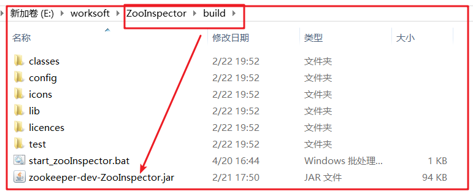
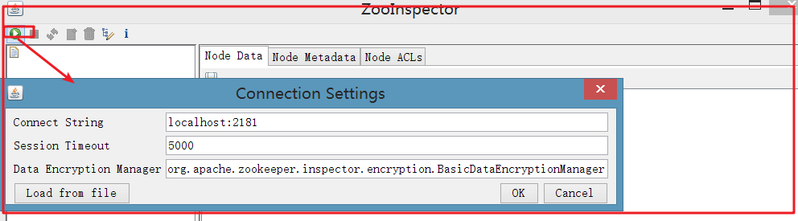
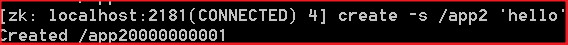

# day50_zookeeper

# 教学目标

- [ ] 了解zookeeper
- [ ] 了解zookeeper的应用场景
- [ ] 了解zookeeper的基本概念和数据模型
- [ ] 能够搭建和配置zookeeper
- [ ] 熟练操作zookeeper服务端和客户端命令
- [ ] 能够使用java api 操作zookeeper
- [ ] 理解zookeeper watch机制
- [ ] 能搭建zookeeper集群

# 第一章-Zookeeper相关的概念

## 知识点-Zookeeper介绍

### 1.目标

- [ ] 了解zookeeper

### 2.路径

1. 什么是分布式
2. 分布式和集群的区别
3. 什么是Zookeeper
4. Zookeeper的发展历程

### 3.讲解

#### 3.1什么是分布式

##### 3.1.1集中式系统

​	集中式系统，集中式系统中整个项目就是一个==独立的应用==，整个应用也就是整个项目，所有的东西都在一个应用里面。部署到一个服务器上。

##### 3.1.2分布式系统

​	我们通过一个例子来讲解: 随着公司的发展，应用的客户变多，功能也日益完善，加了很多的功能，整个项目在一个tomcat上跑，tomcat说它也很累，能不能少跑点代码，这时候 就产生了。我们可以把大项目按功能划分为很多的模块，比如说单独一个系统处理订单，一个处理用户登录，一个处理后台等等，然后每一个模块都单独在一个tomcat中跑，合起来就是一个完整的大项目，这样每一个tomcat都非常轻松。

		

分布式系统的描述总结是：

  - 多台计算机构成
  - 计算机之间通过网络进行通信 
  - 彼此进行交互 
  - 共同目标 

#### 3.2集群与分布式的区别【面试】

+ 相同点：

  分布式和集群都是需要有很==多节点服务器==通过网络协同工作完成整体的任务目标。

+ 不同点：

  分布式是指将业务系统进行拆分，即分布式的每一个节点都是==实现不同的功能==。而集群每个节点做的是==同一件事情==。

用户    订单    购物车  支付  秒杀

​											  秒杀

​                                              秒杀


现代乐队这样图就是分布式


古代乐队的图就属于集群


1


#### 3.3什么是Zookeeper

​	ZooKeeper是一个分布式的，开放源码的分布式应用==程序协调服务==，提供的功能包括：配置维护、域名服务、分布式同步、组服务等。

​	ZooKeeper 本质上是一个==分布式的小文件存储系统==。提供基于类似于文件系统的目录树方式的数据存储，并且可以对树中的节点进行有效管理。从而用来维护和监控你存储的数据的状态变化。通过监控这些数据状态的变化，从而可以达到基于数据的集群管理。

#### 3.4Zookeeper的发展历程

​	ZooKeeper 最早起源于雅虎研究院的一个研究小组。当时研究人员发现，在雅虎内部很多大型系统基本都需要依赖一个系统来进行分布式协同，但是这些系统往往都存在分布式单点问题。
​	所以，雅虎的开发人员就开发了一个通用的无单点问题的分布式协调框架，这就是ZooKeeper。ZooKeeper之后在开源界被大量使用，很多著名开源项目都在使用zookeeper，例如：

- Hadoop：使用ZooKeeper 做Namenode 的高可用。
- HBase：保证集群中只有一个master，保存hbase:meta表的位置，保存集群中的RegionServer列表。
- Kafka：集群成员管理，controller 节点选举。

### 4.小结

1. 集群与分布式的区别

   + 分布式: 每个节点做不同的事情
   + 集群: 每个节点做相同的事情

2. 什么是Zookeeper

   ​	分布式协调工具, 本质就是分布式的小文件存储系统

## 知识点-Zookeeper的应用场景

### 1.目标

- [ ] 了解zookeeper的应用场景

### 2.路径

1. ==注册中心==
2. 配置中心
3. ==分布式锁==
4. 分布式队列
5. 负载均衡

### 3.讲解

#### 	3.1. 注册中心

​	分布式应用中，通常需要有一套完整的命名规则，既能够产生唯一的名称又便于人识别和记住，通常情况下用树形的名称结构是一个理想的选择，树形的名称结构是一个有层次的目录结构。通过调用Zookeeper提供的创建节点的API，能够很容易创建一个全局唯一的path，这个path就可以作为一个名称。
​	阿里巴巴集团开源的分布式服务框架Dubbo中使用ZooKeeper来作为其命名服务，维护全局的服务地址列表。

​	解决问题：服务提供者单点问题。

#### 	3.2 配置中心

​	数据发布/订阅即所谓的配置中心：发布者将数据发布到ZooKeeper一系列节点上面，订阅者进行数据订阅，当数据有变化时，可以及时得到数据的变化通知，达到动态获取数据的目的。

 ZooKeeper 采用的是推拉结合的方式。

  1、推: 服务端会推给注册了监控节点的客户端 Wathcer 事件通知

  2、拉: 客户端获得通知后，然后主动到服务端拉取最新的数据

解决问题：到处修改配置，只要修改1次即可

#### 	3.3 分布式锁（理解）

​	分布式锁是控制分布式系统之间同步访问共享资源的一种方式。在分布式系统中，常常需要协调他们的动作。如果不同的系统或是同一个系统的不同主机之间共享了一个或一组资源，那么访问这些资源的时候，往往需要互斥来防止彼此干扰来保证一致性，在这种情况下，便需要使用到分布式锁。

解决： 分布式同步问题

#### 3.4. 分布式队列

​	在传统的单进程编程中，我们使用队列来存储一些数据结构，用来在多线程之间共享或传递数据。分布式环境下，我们同样需要一个类似单进程队列的组件，用来实现跨进程、跨主机、跨网络的数据共享和数据传递，这就是我们的分布式队列。	

解决惊群效应

解决：流量削峰(在更高的并发时，让服务排队)。

#### 3.5 负载均衡

​	负载均衡是通过负载均衡算法，用来把对某种资源的访问分摊给不同的设备，从而减轻单点的压力。

### 4.小结

ZK在工作里面(Java)的常见的应用

+ 注册中心
+ 分布式锁

​	


## 知识点-Zookeeper数据模型

### 1.目标

- [ ] 掌握Zookeeper数据模型

### 2.路径

1. zookeeper数据结构
2. 节点的分类

### 3.讲解

#### 3.1 zookeeper数据结构

​		ZooKeeper 的数据模型是层次模型。层次模型常见于文件系统。例如：我的电脑可以分为多个盘符（例如C、D、E等），每个盘符下可以创建多个目录，每个目录下面可以创建文件，也可以创建子目录，最终构成了一个树型结构。通过这种树型结构的目录，我们可以将文件分门别类的进行存放，方便我们后期查找。而且磁盘上的每个文件都有一个唯一的访问路径，例如：C:\Windows\itcast\hello.txt。

		层次模型和key-value 模型是两种主流的数据模型。ZooKeeper 使用文件系统模型主要基于以下两点考虑：

1. 文件系统的树形结构便于表达数据之间的层次关系。

2. 文件系统的树形结构便于为不同的应用分配独立的命名空间（namespace）。


​	ZooKeeper 的层次模型称作data tree。Datatree 的每个节点叫作znode（Zookeeper node）。不同于文件系统，每个节点都可以保存数据。每个节点都有一个版本(version)。版本从0 开始计数。

	

如图所示，data tree中有两个子树，用于应用1( /app1)和应用2（/app2）。

每个客户端进程pi 创建一个znode节点 p_i 在 /app1下， /app1/p_1就代表一个客户端在运行。

#### 3.2 节点的分类【重点】	

| 类别         | 特点                                                         |
| ------------ | ------------------------------------------------------------ |
| 持久有序节点 | 一旦创建不会丢失，无论是zookeeper宕机，还是client宕机;  有序 |
| 持久无序节点 | 一旦创建不会丢失，无论是zookeeper宕机，还是client宕机; 无序  |
| 临时有序节点 | zookeeper宕机了，或者client在指定的timeout时间内没有连接server，会丢失;有序 |
| 临时无序节点 | zookeeper宕机了，或者client在指定的timeout时间内没有连接server，会丢失;无序 |

有序: 每一个顺序性的znode关联一个唯一的==单调递增整数==。这个单调递增整数是znode名字的后缀。

### 4.小结

1. Zookeeper数据模型
   + 有层级关系的, 类似树结构  Data Tree
   + 由节点组成, 每个阶段称为 Data Node
2. 节点的类型
   + 持久有序
   + 持久无序
   + 临时有序
   + 临时无序

# 第二章-Zookeeper环境搭建

## 环境-Zookeeper的安装

### 1.目标

- [ ] 掌握Zookeeper的安装

### 2.路径

1. window版本
2. Linux版本

### 3.讲解

下载地址：http://archive.apache.org/dist/zookeeper/. 本课程使用的Zookeeper版本为3.4.13

#### 3.1window版本

- 第一步: 解压zookeeper(==解压到没有中文和空格目录下==)

    

- 第二步: 修改zoo.cfg配置文件,将conf下的zoo_sample.cfg复制一份改名为zoo.cfg

   

- 第三步: 配置 

   

  ```
  # The number of milliseconds of each tick
  tickTime=2000
  # The number of ticks that the initial 
  # synchronization phase can take
  initLimit=10
  # The number of ticks that can pass between 
  # sending a request and getting an acknowledgement
  syncLimit=5
  # the directory where the snapshot is stored.
  # do not use /tmp for storage, /tmp here is just 
  # 数据的保存路径
  dataDir=../data
  # log日志目录
  dataLogDir=../log
  # the port at which the clients will connect
  clientPort=2181
  # the maximum number of client connections.
  # increase this if you need to handle more clients
  #maxClientCnxns=60
  #
  # Be sure to read the maintenance section of the 
  # administrator guide before turning on autopurge.
  #
  # http://zookeeper.apache.org/doc/current/zookeeperAdmin.html#sc_maintenance
  #
  # The number of snapshots to retain in dataDir
  #autopurge.snapRetainCount=3
  # Purge task interval in hours
  # Set to "0" to disable auto purge feature
  #autopurge.purgeInterval=1
  ```

  

- 第四步:进入bin目录,运行zkServer.cmd 启动

   

==【注意】设置，右击窗口，选择属性==

 

#### 3.2 Linux版本

+ 第一步:安装 jdk（略）
+ 第二步: 把 zookeeper 的压缩包（zookeeper-3.4.13.tar.gz）上传到 linux 系统 `/usr/local/servers`

 

+ 第三步：解压缩压缩包

```
tar -zxvf zookeeper-3.4.13.tar.gz
```

+ 第四步：进入zookeeper-3.4.13目录，创建data目录

```
cd zookeeper-3.4.13
mkdir data
```

+ 第五步：进入conf目录 ，把zoo_sample.cfg 改名为zoo.cfg

```
cd conf
mv zoo_sample.cfg zoo.cfg
```

+ 第六步：打开zoo.cfg文件,  修改data属性

```
dataDir=/usr/local/servers/zookeeper-3.4.13/data
```

+ 启动: 进入bin目录，启动服务命令

```
 ./zkServer.sh start
```

+ 停止: 服务命令

```
./zkServer.sh stop
```

+ 查看服务状态

```
./zkServer.sh status
```

### 4.小结

1. Zookeeper安装
   + Window: 解压到一个==没有中文和空格==的目录下, 点击 bin/zkServer.cmd
   + Linux

### 5.可视化客户端

 

+ 解压到一个没有中文和空格的目录
+ 进入`ZooInspector\build `启动

```
java -jar zookeeper-dev-ZooInspector.jar
```


 

+ 连接

 

# 第三章-Zookeeper操作

## 知识点-命令操作Zookeeper

### 1.目标

- [ ] 了解客户端命令操作Zookeeper

### 2.路径

1. 帮助
2. 查询跟路径下的节点
3. 创建无序永久节点
4. 创建带序号永久节点
5. 创建无序临时节点
6. 创建有序临时节点
7. 查询节点数据
8. 修改节点数据
9. 删除节点
10.  递归删除节点
11. 看节点状态

### 3.讲解

#### 3.1帮助(查询所有命令)

```bash
help
```


#### 3.2 查询跟路径下的节点

```bash
ls /zookeeper
```

查看zookeeper节点


#### 3.3创建无序永久节点

```bash
create /app1 "helloworld"
```

创建app1节点，值为helloworld


#### 3.4 创建有序永久节点

```bash
create -s /app2 "helloworld"
```

 

#### 3.5 创建无序临时节点

```bash
create -e /app3 'hello'
```

-e:表示无序临时节点


关闭客户端，再次打开查看 app3节点消失

#### 3.6 创建有序临时节点

```bash
create -e -s /app4 'app4'
```

-e:表示普通临时节点

-s:表示带序号节点

	关闭客户端，再次打开查看 app4节点消失	

#### 3.7 查询节点数据

```bash
get /app1
```

		

```shell
# ­­­­­­­­­­­节点的状态信息，也称为stat结构体­­­­­­­­­­­­­­­­­­­
# 创建该znode的事务的zxid(ZooKeeper Transaction ID)
# 事务ID是ZooKeeper为每次更新操作/事务操作分配一个全局唯一的id，表示zxid，值越小，表示越先执行
cZxid = 0x4454 # 0x0表示十六进制数0
ctime = Thu Jan 01 08:00:00 CST 1970  # 创建时间
mZxid = 0x4454 						  # 最后一次更新的zxid
mtime = Thu Jan 01 08:00:00 CST 1970  # 最后一次更新的时间
pZxid = 0x4454 						  # 最后更新的子节点的zxid
cversion = 5 						  # 子节点的变化号，表示子节点被修改的次数
dataVersion = 0 					  # 表示当前节点的数据变化号，0表示当前节点从未被修改过
aclVersion = 0  					  # 访问控制列表的变化号 access control list
# 如果临时节点，表示当前节点的拥有者的sessionId
ephemeralOwner = 0x0				  # 如果不是临时节点，则值为0
dataLength = 13 					  # 数据长度
numChildren = 1 					  # 子节点的数量
```

#### 3.8 修改节点数据

```bash
set /app1 'hello'
```

	

#### 3.9 删除节点

```bash
delete /hello0000000006
```


#### 3.10 递归删除节点

```bash
delete /hello

rmr /hello
```


#### 3.11. 查看节点状态

```bash
stat /zookeeper
```


#### 3.12. 日志的可视化

- 这是日志的存储路径

  

- 日志都是以二进制文件存储的，使用记事本打开，无意义。

   

- 为了能正常查看日志，把查看日志需要的jar包放到统一路径下


- 使用命令可以直接查看正常日志

```java
java -classpath ".;*" org.apache.zookeeper.server.LogFormatter log.1
```


### 4.小结

+ 下去敲一遍

## 知识点-JavaAPI操作Zookeeper

### 1.目标

- [ ] 能够使用JavaAPI操作Zookeeper

### 2.路径

1. Curator的介绍
2. Curator操作Zookeeper

### 3.讲解

#### 3.1Curator的介绍

​	Apache  Curator 是 ZooKeeper 的==Java客户端库==。 Curator 项目的目标是简化 ZooKeeper 客户端的使用。Curator 最初是 Netfix 研发的,后来捐献了 Apache 基金会,目前是 Apache 的顶级项目。

官网： http://curator.apache.org/

常见的操作Zookeeper的客户端:

+ 原生Java API（不推荐使用）:位于org.apache.ZooKeeper包中
+ ZkClient:   Github上一个开源的ZooKeeper客户端，由datameer的工程师Stefan Groschupf和Peter Voss一起开发。zkclient-x.x.Jar也是在源生 api 基础之上进行扩展的开源 JAVA 客户端。
+ Apache Curator

#### 3.2Curator操作Zookeeper

##### 3.2.1环境的准备

步骤

1. 创建curator-demo
2. 在pom中添加坐标(Zookeeper, Curator, SpringBoot起步依赖...)
3. 拷贝CuratorUtil到工程
4. 创建启动类, 注册CuratorUtil
5. 拷贝logback.xml到工程  

实现

- 创建curator-demo

 

- 在pom中添加坐标

```xml
<?xml version="1.0" encoding="UTF-8"?>
<project xmlns="http://maven.apache.org/POM/4.0.0"
         xmlns:xsi="http://www.w3.org/2001/XMLSchema-instance"
         xsi:schemaLocation="http://maven.apache.org/POM/4.0.0 http://maven.apache.org/xsd/maven-4.0.0.xsd">
    <modelVersion>4.0.0</modelVersion>

    <groupId>com.itheima</groupId>
    <artifactId>curator-demo</artifactId>
    <version>1.0-SNAPSHOT</version>

    <parent>
        <groupId>org.springframework.boot</groupId>
        <artifactId>spring-boot-starter-parent</artifactId>
        <version>2.1.0.RELEASE</version>
    </parent>

    <properties>
        <project.build.sourceEncoding>UTF-8</project.build.sourceEncoding>
        <maven.compiler.source>1.8</maven.compiler.source>
        <maven.compiler.target>1.8</maven.compiler.target>
    </properties>

    <dependencies>
        <dependency>
            <groupId>org.springframework.boot</groupId>
            <artifactId>spring-boot-starter</artifactId>
        </dependency>

        <dependency>
            <groupId>org.springframework.boot</groupId>
            <artifactId>spring-boot-starter-test</artifactId>
        </dependency>

        <!--zookeeper的依赖-->
        <dependency>
            <groupId>org.apache.zookeeper</groupId>
            <artifactId>zookeeper</artifactId>
            <version>3.4.11</version>
        </dependency>
        <!--	zookeeper CuratorFramework 是Netflix公司开发一款连接zookeeper服务的框架，通过封装的一套高级API 简化了ZooKeeper的操作，提供了比较全面的功能，除了基础的节点的操作，节点的监听，还有集群的连接以及重试。-->
        <dependency>
            <groupId>org.apache.curator</groupId>
            <artifactId>curator-framework</artifactId>
            <version>4.0.1</version>
        </dependency>
        <dependency>
            <groupId>org.apache.curator</groupId>
            <artifactId>curator-recipes</artifactId>
            <version>4.0.1</version>
        </dependency>
        <!--测试-->
        <dependency>
            <groupId>junit</groupId>
            <artifactId>junit</artifactId>
            <version>4.12</version>
        </dependency>

        <dependency>
            <groupId>org.projectlombok</groupId>
            <artifactId>lombok</artifactId>
        </dependency>
    </dependencies>
</project>
```


- 拷贝CuratorUtil到工程

```java
package com.itheima.curator.utils;

import lombok.extern.slf4j.Slf4j;
import org.apache.curator.framework.CuratorFramework;
import org.apache.curator.framework.CuratorFrameworkFactory;
import org.apache.curator.framework.recipes.cache.*;
import org.apache.curator.retry.ExponentialBackoffRetry;
import org.apache.zookeeper.CreateMode;
import org.apache.zookeeper.data.Stat;
import java.time.LocalDateTime;
import java.util.Objects;
import java.util.logging.Logger;


@Slf4j
public class CuratorUtil {

    // 一个zookeeper集群只需要一个 client。劲量保证单例
    private static CuratorFramework client;
    // zk 服务端集群地址
    //private String connectString = "192.168.133.129:2181,192.168.133.129:2182,192.168.133.129:2183";
    private String connectString = "127.0.0.1:2181";

    // session 超时时间
    private int timeOut = 60000;

    // zkclient 重试间隔时间
    private int baseSleepTimeMs = 5000;

    //zkclient 重试次数
    private int retryCount = 5;

    public CuratorUtil() {
        this(null);
    }

    public CuratorUtil(String path) {
        init(path);
    }


    /**
     * 初始化
     * @param namespace
     */
    public void init(String namespace) {
        if (null == client) {
            synchronized (CuratorUtil.this) {
                if (null == client) {
                    client = CuratorFrameworkFactory
                            .builder()
                            .connectString(connectString)
                            .sessionTimeoutMs(timeOut)
                            .retryPolicy(new ExponentialBackoffRetry(baseSleepTimeMs, retryCount))
                            .namespace(namespace)
                            .build();
                    client.start();
                    log.info("client is created at ================== {}", LocalDateTime.now());
                }
            }
        }
    }

    /**
     * 关闭连接
     */
    public void closeConnection() {
        if (null != client) {
            client.close();
        }
    }

    /**
     * 创建节点
     * @param path
     * @param createMode
     * @return
     * @throws Exception
     */
    public String createNode(String path,CreateMode createMode) throws Exception {
        if (null == client) {
            throw new RuntimeException("there is not connect to zkServer...");
        }
        String node = client
                .create()
                .creatingParentsIfNeeded()
                .withMode(createMode)
                .forPath(path);

        log.info("create node : {}", node);
        return node;
    }

    /**
     * 创建节点
     * @param path
     * @param value
     * @param createMode
     * @return
     * @throws Exception
     */
    public String createNode(String path, String value,CreateMode createMode) throws Exception {
        if (null == client) {
            throw new RuntimeException("there is not connect to zkServer...");
        }
        String node = client
                .create()
                .creatingParentsIfNeeded()
                .withMode(createMode)
                .forPath(path, value.getBytes());

        log.info("create node : {}", node);
        return node;
    }


    /**
     * 删除节点
     * @param path
     * @throws Exception
     */
    public void deleteNode(String path) throws Exception {
        if (null == client) {
            throw new RuntimeException("there is not connect to zkServer...");
        }
        client
                .delete()
                .deletingChildrenIfNeeded()
                .forPath(path);
        log.info("{} is deleted ", path);
    }


    /**
     * 获得节点
     * @param path
     * @return
     * @throws Exception
     */
    public String getNodeData(String path) throws Exception {
        if (null == client) {
            throw new RuntimeException("there is not connect to zkServer...");
        }
        Stat stat = new Stat();
        byte[] bytes = client.getData().storingStatIn(stat).forPath(path);
        log.info("{} data is : {}", path, new String(bytes));
        log.info("current stat version is {}, createTime is {}", stat.getVersion(), stat.getCtime());
        return new String(bytes);
    }


    /**
     * 更新节点
     * @param path
     * @param value
     * @throws Exception
     */
    public void setNodeData(String path,String value) throws Exception {
        if (null == client) {
            throw new RuntimeException("there is not connect to zkServer...");
        }
        Stat stat = client.checkExists().forPath(path);
        if(null == stat){
            log.info(String.format("{} Znode is not exists",path));
            throw new RuntimeException(String.format("{} Znode is not exists",path));
        }
        String nodeData = getNodeData(path);
        client.setData().withVersion(stat.getVersion()).forPath(path, value.getBytes());
        log.info("{} Znode data is set. old vaule is {}, new data is {}",path,nodeData,value);
    }


    /**
     * 创建 给定节点的监听事件  监听一个节点的更新和创建事件(不包括删除)
     * @param path
     * @throws Exception
     */
    public void addWatcherWithNodeCache(String path) throws Exception {
        if (null == client) {
            throw new RuntimeException("there is not connect to zkServer...");
        }
        // dataIsCompressed if true, data in the path is compressed
        NodeCache nodeCache = new NodeCache(client, path,false);
        NodeCacheListener listener = () -> {
            ChildData currentData = nodeCache.getCurrentData();
            log.info("{} Znode data is chagnge,new data is ---  {}", currentData.getPath(), new String(currentData.getData()));
        };
        nodeCache.getListenable().addListener(listener);
        nodeCache.start();
    }


    /**
     * 监听给定节点下的子节点的创建、删除、更新
     * @param path
     * @throws Exception
     */
    public void addWatcherWithChildCache(String path) throws Exception {
        if (null == client) {
            throw new RuntimeException("there is not connect to zkServer...");
        }
        //cacheData if true, node contents are cached in addition to the stat
        PathChildrenCache pathChildrenCache = new PathChildrenCache(client,path,false);
        PathChildrenCacheListener listener = (client, event) -> {
            log.info("event path is --{} ,event type is {}" , event.getData().getPath(), event.getType());
        };
        pathChildrenCache.getListenable().addListener(listener);
        // StartMode : NORMAL  BUILD_INITIAL_CACHE  POST_INITIALIZED_EVENT
        pathChildrenCache.start(PathChildrenCache.StartMode.NORMAL);
    }


    /**
     * 听 给定节点的创建、更新（不包括删除） 以及 该节点下的子节点的创建、删除、更新动作。
     * @param path
     * @throws Exception
     */
    public void addWatcherWithTreeCache(String path) throws Exception {
        if (null == client) {
            throw new RuntimeException("there is not connect to zkServer...");
        }
        TreeCache treeCache = new TreeCache(client, path);

        TreeCacheListener listener = (client, event) -> {
            log.info("节点路径 --{} ,节点事件类型: {} , 节点值为: {}" , Objects.nonNull(event.getData()) ? event.getData().getPath() : "无数据", event.getType(),Objects.nonNull(event.getData()) ? new String(treeCache.getCurrentData(event.getData().getPath()).getData()) : "无数据");
        };
        treeCache.getListenable().addListener(listener);
        treeCache.start();
    }


}
```


- 创建启动类, 注册CuratorUtil

```java
package com.itheima.curator;

import com.itheima.curator.utils.CuratorUtil;
import org.springframework.boot.SpringApplication;
import org.springframework.boot.autoconfigure.SpringBootApplication;
import org.springframework.context.annotation.Bean;

/**
 * @Description:
 * @author: yp
 */
@SpringBootApplication
public class CuratorApplication {

    public static void main(String[] args) {
        SpringApplication.run(CuratorApplication.class,args);
    }

    @Bean
    public CuratorUtil curatorUtil(){
        return new CuratorUtil();
    }

}

```

+ 拷贝logback.xml到工程

 


##### 3.2.2代码实现

```java
package com.itheima.test;

import com.itheima.curator.CuratorApplication;
import com.itheima.curator.utils.CuratorUtil;
import org.apache.zookeeper.CreateMode;
import org.junit.Test;
import org.junit.runner.RunWith;
import org.springframework.beans.factory.annotation.Autowired;
import org.springframework.boot.test.context.SpringBootTest;
import org.springframework.test.context.junit4.SpringRunner;

/**
 * @Description:
 * @author: yp
 */
@SpringBootTest(classes = CuratorApplication.class)
@RunWith(SpringRunner.class)
public class ZkTest {

    @Autowired
    private CuratorUtil curatorUtil;

    @Test
    //创建持久有序节点
    public void fun01() throws Exception {
        curatorUtil.createNode("/a","a", CreateMode.PERSISTENT_SEQUENTIAL);
    }
    @Test
    //创建持久无序节点
    public void fun02() throws Exception {
        curatorUtil.createNode("/b","b",CreateMode.PERSISTENT);
    }

    @Test
    //创建临时有序节点
    public void fun03() throws Exception {
        curatorUtil.createNode("/c","c", CreateMode.EPHEMERAL_SEQUENTIAL);
    }

    @Test
    //创建临时无序节点
    public void fun04() throws Exception {
        curatorUtil.createNode("/d","d", CreateMode.EPHEMERAL);
    }


    @Test
    //获得/b的节点数据
    public void fun05() throws Exception {
        String nodeData = curatorUtil.getNodeData("/b");
        System.out.println(nodeData);
    }

    @Test
    //更新/b的节点数据为bb
    public void fun06() throws Exception {
        curatorUtil.setNodeData("/b","bb");
    }

    @Test
    //删除/b的节点
    public void fun07() throws Exception {
        curatorUtil.deleteNode("/b");
    }

}

```


### 4.小结

1. 大家下去敲一遍
2. 创建节点的路径必须是绝对路径  以 /开头的


## 知识点-watch机制【面试】

### 1.目标

- [ ] 理解zookeeper watch机制

### 2.路径

1.  什么是watch机制
2. Curator实现watch机制

### 3.讲解

Zookeeper的应用场景中配置中心，其中看到watch机制


#### 3.1 什么是watch机制

​	zookeeper作为一款成熟的分布式协调框架，==订阅-发布==功能是很重要的一个。所谓订阅功能，其实说白了就是==观察者模式==。观察者会订阅一些感兴趣的主题，然后这些主题一旦变化了，就会自动通知到这些观察者。

​	zookeeper的订阅发布也就是watch机制，是一个轻量级的设计。因为它采用了一种推拉结合的模式。一旦服务端感知主题变了，那么只会发送一个事件类型和节点信息给关注的客户端，而不会包括具体的变更内容，所以事件本身是轻量级的，这就是所谓的“推”部分。然后，收到变更通知的客户端需要自己去拉变更的数据，这就是“拉”部分。watche机制分为添加数据和监听节点。

#### 3.2Curator实现watch机制

##### 3.2.1说明

​	Curator在这方面做了优化，Curator引入了Cache的概念用来实现对ZooKeeper服务器端进行事件监听。Cache是Curator对事件监听的包装，其对事件的监听可以近似看做是一个本地缓存视图和远程ZooKeeper视图的对比过程。而且Curator会自动的再次监听，我们就不需要自己手动的重复监听了。

Curator中的cache共有三种

- NodeCache（监听和缓存根节点变化）:用来监听节点的数据变化的，当监听的节点的数据发生变化的时候就会回调对应的函数。
- PathChildrenCache（监听和缓存子节点变化）:用来监听指定节点 的子节点变化情况
- TreeCache（监听和缓存根节点变化和子节点变化）:TreeCache有点像上面两种Cache的结合体,NodeCache能够监听自身节点的数据变化（或者是创建该节点），PathChildrenCache能够监听自身节点下的子节点的变化，而TreeCache既能够监听自身节点的变化、也能够监听子节点的变化。

 

##### 3.2.2实现

```java
package com.itheima.test;

import com.itheima.curator.CuratorApplication;
import com.itheima.curator.utils.CuratorUtil;
import org.apache.zookeeper.CreateMode;
import org.junit.Test;
import org.junit.runner.RunWith;
import org.springframework.beans.factory.annotation.Autowired;
import org.springframework.boot.test.context.SpringBootTest;
import org.springframework.test.context.junit4.SpringRunner;

/**
 * @Description:
 * @author: yp
 */
@SpringBootTest(classes = CuratorApplication.class)
@RunWith(SpringRunner.class)
public class WatchTest {

    @Autowired
    private CuratorUtil curatorUtil;
    @Test
    //准备 /a  和/a/b 节点
    public void fun00() throws Exception {
        curatorUtil.createNode("/a", "a", CreateMode.PERSISTENT);
        curatorUtil.createNode("/a/b", "b", CreateMode.PERSISTENT);
    }

    @Test
    //改变节点, 测试监听
    public void fun01() throws Exception {
        //curatorUtil.setNodeData("/a","aaa");
        curatorUtil.setNodeData("/a/b","bbb");
    }

    @Test
    //只是监听/a的变化
    public void fun02() throws Exception {
        curatorUtil.addWatcherWithNodeCache("/a");
        while (true){
            Thread.sleep(3000);
        }
    }

    @Test
    //只是监听/a子节点变化
    public void fun03() throws Exception {
        curatorUtil.addWatcherWithChildCache("/a");
        while (true){
            Thread.sleep(3000);
        }
    }

    @Test
    //监听/a节点以及子节点变化
    public void fun04() throws Exception {
        curatorUtil.addWatcherWithTreeCache("/a");
        while (true){
            Thread.sleep(3000);
        }
    }
}
```


# 第四章-zookeeper集群搭建

## 知识点-zookeeper集群介绍 

### 1.目标

- [ ] 了解zookeeper集群相关的概念

### 2.路径

1. Zookeeper 集群介绍
2. 集群模式
3. Zookeeper 集群角色  

### 3.讲解

#### 3.1Zookeeper 集群介绍

​	Zookeeper 集群搭建指的是 ZooKeeper 分布式模式安装。 通常由 ==2n+1==台 servers 组成。 这是因为为了保证 Leader 选举（基于 Paxos 算法的实现） 能或得到多数的支持，所以 ZooKeeper 集群的数量一般为奇数。

#### 3.2集群模式

- 伪分布式集群搭建：

  ​	所谓伪分布式集群搭建ZooKeeper集群其实就是在一台机器上启动多个ZooKeeper，在启动每个ZooKeeper时分别使用不同的配置文件zoo.cfg来启动,每个配置文件使用不同的配置参数(clientPort端口号、dataDir数据目录。在zoo.cfg中配置多个server.id，其中ip都是当前机器，而端口各不相同，启动时就是伪集群模式了。

- 完全分布式集群搭建：

  多台机器各自配置zoo.cfg文件，将各自互相加入服务器列表，每个节点占用一台机器

#### 3.3Zookeeper 集群角色  

 

+ Leader 领导者 ：

  + 处理事务请求(增删改)

  +  集群内部各服务器的调度者

+  Follower 跟随者 
  +  处理客户端非事务请求(查)，转发事务请求给Leader服务器
  + 参与Leader选举投票

+  Observer 观察者：
  + 处理客户端非事务请求，转发事务请求给Leader服务器  

### 4.小结

1. ZK集群的台数 一般选择2n+1(奇数台)
2. ZK集群角色
   + Leader 领导者
     + 处理写的请求
     + 集群里面的协调
   + Follower 跟随者 
     + 处理读的请求, 转发写的请求到Leader
     + 投票
   + Observer 观察者
     + 处理读的请求, 转发写的请求到Leader


## 环境-集群的搭建

### 1.目标

- [ ] 了解zookeeper集群搭建

### 2.路径

1. 集群的搭建
2. leader选举
3. 模拟集群异常
4. 配置成Observer

### 3.讲解

#### 3.1集群的搭建

`资料\03-集群的搭建\01-zookeeper集群搭建`

#### 3.2leader选举【面试】

在领导者选举的过程中，如果某台ZooKeeper获得了==超过半数的选票==，则此ZooKeeper就可以成为Leader了。

假设有三台服务器组成的Zookeeper集群，它们的id从1-3，同时它们都是最新启动的，也就是没有历史数据，在存放数据量这一点上，都是一样的。

- 服务器1启动，发起一次选举。服务器1投自己一票。此时服务器1票数一票，不够半数以上(3/2)，选举无法完成，服务器1状态保持为LOOKING(选举状态)
- 服务器2启动，再发起一次选举。服务器1和2分别投自己一票并交换选票信息：此时服务器1发现服务器2的ID比自己目前投票推举的（服务器1）大，更改选票为推举服务器2。此时服务器1票数0票，服务器2票数2票，此时服务器2的票数已经超过半数，服务器2当选Leader。服务器1状态为FOLLOWING，服务器2更改状态为LEADING；
- 服务器3启动，发起一次选举。此时服务器1，2已经不是LOOKING状态，不会更改选票信息。交换选票信息结果：服务器2为2票，服务器3为1票。此时服务器3服从多数，更改选票信息为服务器2，并更改状态为FOLLOWING；

ZXID: 即zookeeper事务id号。ZooKeeper状态的每一次改变, 都对应着一个递增的Transaction id, 该id称为zxid

先比较ZXID, 再比较myId

#### 3.3 模拟集群异常

（1）首先我们先测试如果是从服务器挂掉，会怎么样

把3号服务器停掉，观察1号和2号，发现状态并没有变化

```shell
/usr/local/servers/zookeeper-cluster/zookeeper-3/bin/zkServer.sh stop

/usr/local/servers/zookeeper-cluster/zookeeper-1/bin/zkServer.sh status
/usr/local/servers/zookeeper-cluster/zookeeper-2/bin/zkServer.sh status
```

 

由此得出结论，3个节点的集群，从服务器挂掉，集群正常

（2）我们再把1号服务器（从服务器）也停掉，查看2号（主服务器）的状态，发现已经停止运行了。

```shell
/usr/local/servers/zookeeper-cluster/zookeeper-1/bin/zkServer.sh stop

/usr/local/servers/zookeeper-cluster/zookeeper-2/bin/zkServer.sh status
```


 

由此得出结论，3个节点的集群，2个从服务器都挂掉，主服务器也无法运行。因为==可运行的机器没有超过集群总数量的半数。==

（3）我们再次把1号服务器启动起来，发现2号服务器又开始正常工作了。而且依然是领导者。

```shell
/usr/local/servers/zookeeper-cluster/zookeeper-1/bin/zkServer.sh start

/usr/local/servers/zookeeper-cluster/zookeeper-2/bin/zkServer.sh status
```


 

（4）我们把3号服务器也启动起来，把2号服务器(主)停掉,停掉后观察1号和3号的状态。

```shell
/usr/local/servers/zookeeper-cluster/zookeeper-3/bin/zkServer.sh start
/usr/local/servers/zookeeper-cluster/zookeeper-2/bin/zkServer.sh stop

/usr/local/servers/zookeeper-cluster/zookeeper-1/bin/zkServer.sh status
/usr/local/servers/zookeeper-cluster/zookeeper-3/bin/zkServer.sh status
```


 

发现新的leader产生了~  

由此我们得出结论，当集群中的主服务器挂了，集群中的其他服务器会自动进行选举状态，然后产生新得leader 

（5）我们再次测试，当我们把2号服务器重新启动起来启动后，会发生什么？2号服务器会再次成为新的领导吗？我们看结果

```shell
/usr/local/servers/zookeeper-cluster/zookeeper-2/bin/zkServer.sh start

/usr/local/servers/zookeeper-cluster/zookeeper-2/bin/zkServer.sh status
/usr/local/servers/zookeeper-cluster/zookeeper-3/bin/zkServer.sh status
```


 

我们会发现，2号服务器启动后依然是跟随者（从服务器），3号服务器依然是领导者（主服务器），没有撼动3号服务器的领导地位。

由此我们得出结论，当领导者产生后，再次有新服务器加入集群，不会影响到现任领导者。

#### 3.4配置成Observer

+ 为了使用Observer模式，在任何想变成Observer模式的配置文件（$ZOOKEEPER_HOME/conf/zoo.cfg）中加入如下配置：

```
peerType=observer  
```

+ 并在==所有Server的配置文件==（$ZOOKEEPER_HOME/conf/zoo.cfg）中，配置成Observer模式的server的那行配置追加:observer，例如：

```
server.1=192.168.211.150:2881:3881
server.2=192.168.211.150:2882:3882
server.3=192.168.211.150:2883:3883
server.4=192.168.211.150:2884:3884:observer 
```

### 4.小结

1. 集群搭建, 对着文档操作一遍
2. leader选举【面试】
   + 先一个例子去说
   + 投票根据 (事务id,myId)

3. 集群异常
   + 在ZK的集群里面, 只要有一半以上的节点正常, 整个集群就正常

> 演讲:
>
> 1.ZK的数据节点的类型,说出每个类型的特点
>
> 2.聊聊Watch机制
>
> 3.ZK的选举机制

## 总结

### 1.ZK基本概念

+ 什么是ZK
+ ZK的应用场景
+ Watch
+ 数据类型, 节点类型

### 2.安装ZK

+ 先用Window里面的

### 3.操作ZK

+ 敲一遍

### 4.集群

+ leader选举【面试】
+ 再搭建集群(不是必须的)