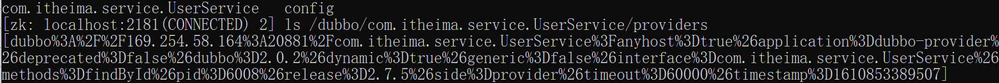
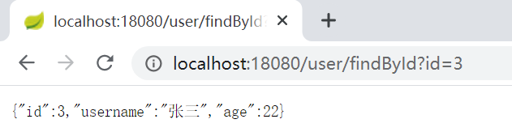
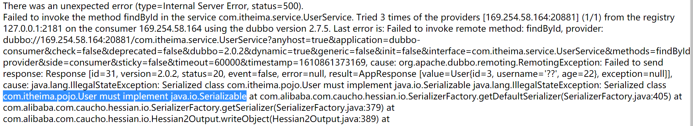
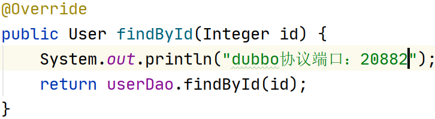

# **Apache Dubbo**

# 回顾：

## zookeeper是什么

分布式小文件存储系统，管理分布式中的服务

数据结构：树形层级的。持久化、临时、有序

## 有什么作用，使用场景：

注册中心（房产中介），配置中心、分布式锁、分布式队列、负载均衡（随机、轮循、一致性哈希、最少活跃数）

## 使用

安装，没有中文没有空格，1.8 

zkServer.cmd服务，zkCli.cmd客户端

常用命令：CRUD，查看状态，递归删除，connect, -server 

javaApi操作zookeeper, CRUD,createModel.4个

Watch机制：监听zookeeper上的节点数据，数据变更时，就会通知客户端（添加listener(回调))。

​	NodeCache当前节点下, PathChildrenCache子节点变化，TreeCache监听当前及子节点

## 集群

高可用，解决zookeeper单点问题

选举：zxid>myid

数据同步原理：ZAB，2PC 

# 学习目标

- 了解应用架构演进过程
- 了解RPC远程调用方式
- 掌握Dubbo框架的架构
- 掌握Zookeeper注册中心的基本使用
- 掌握Dubbo生产者和消费者的开发
- 了解Dubbo的管理控制台的使用
- 了解Dubbo的相关配置
- 了解Dubbo的负载均衡

# 1. 应用架构的演进过程

### 【目标】

了解软件架构的演进过程

### 【路径】

1：主流的互联网技术特点

2：架构演变的过程

（1）：单体架构

（2）：垂直架构

（3）：分布式服务架构

（4）：SOA架构

（5）：微服务架构

### 【讲解】

## 1.1. 主流的互联网技术特点

分布式 、高并发、集群、负载均衡、高可用。

分布式：一件事情拆开来多人一起做。

集群：一件事情大家一起做。

负载均衡：将请求平均分配到不同的服务器中，达到均衡的目的。

------

高并发：同一时刻，处理同一件事情的处理能力（解决方案：分布式、集群、负载均衡）

高可用：系统都是可用的。


## 1.2. 架构演变的过程

### 1.2.1.  单一应用架构

当网站流量很小时，只需一个应用，将所有功能都部署在一起，以减少部署节点和成本。此时，用于简化增删改查工作量的数据访问框架(ORM)是关键。


- 布署一个tomcat即可

- 架构优点：

  架构简单，前期开发成本低、开发周期短，适合小型项目（OA、CRM、ERP(sap)）。

- 架构缺点：

  全部功能集成在一个工程中

  （1）业务代码耦合度高，不易维护。

  （2）维护成本高，不易拓展

  （3）并发量大，不易解决

  （4）技术栈受限，只能使用一种语言开发。

### 1.2.2. 垂直应用架构

当访问量逐渐增大，单一应用增加机器带来的加速度越来越小，将应用拆成互不相干的几个应用，以提升效率。此时，用于加速前端页面开发的Web框架(MVC)是关键。

单个业务并发量大，按业务模块拆分


- 架构优点：

  （1）业务代码相对解耦

  （2）维护成本相对易于拓展（修改一个功能，可以直接修改一个项目，单独部署）

  （3）并发量大相对易于解决（搭建集群）

  （4）技术栈可扩展（不同的系统可以用不同的编程语言编写）。

- 架构缺点：

  代码之间存在数据、方法的冗余

### 1.2.3. 分布式服务架构【 理解】

当垂直应用越来越多，应用之间交互不可避免，将核心业务抽取出来，作为独立的服务，逐渐形成稳定的服务中心，使前端应用能更快速的响应多变的市场需求。此时，用于提高业务复用及整合的分布式服务框架(RPC)是关键。


解决：代码之间存在数据、方法的冗余


- 架构优点：

  （1）业务代码完全解耦，并可实现通用

  （2）维护成本易于拓展（修改一个功能，可以直接修改一个项目，单独部署）

  （3）并发量大易于解决（搭建集群）

  （4）技术栈完全扩展（不同的系统可以用不同的编程语言编写）。

- 架构缺点：

  缺少统一管理资源调度的框架

### 1.2.4. 流动计算架构（SOA）【理解】

当服务越来越多，容量的评估，小服务资源的浪费等问题逐渐显现，此时需增加一个调度中心基于访问压力实时管理集群容量，提高集群利用率。此时，用于提高机器利用率的资源调度和治理中心(SOA)是关键。

拥有： 统一管理资源调度的框架 dubbo+zookeeper


​	资源调度和治理中心的框架：dubbo+zookeeper

- 架构优点：

  （1）业务代码完全解耦，并可实现通用

  （2）维护成本易于拓展（修改一个功能，可以直接修改一个项目，单独部署）

  （3）并发量大易于解决（搭建集群）

  （4）技术栈完全扩展（不同的系统可以用不同的编程语言编写）。

### 【小结】

1：单体架构

全部功能集中在一个项目内（All in one）。

2：垂直架构

按照业务进行切割，形成小的单体项目。解决单个业务并发大

3：SOA架构（项目一）

面向服务的架构（SOA）是一个组件模型,全称为：Service-Oriented Architecture，它将应用程序的不同功能单元（称为服务）进行拆分，并通过这些服务之间定义良好的接口和契约联系起来。接口是采用中立的方式进行定义的，它应该独立于实现服务的硬件平台、操作系统和编程语言。这使得构建在各种各样的系统中的服务可以以一种统一和通用的方式进行交互.

可以使用dubbo作为调度的工具（RPC协议）

4：微服务架构（项目二）

将系统服务层完全独立出来，抽取为一个一个的微服务。

特点一：抽取的粒度更细，遵循单一原则，数据可以在服务之间完成数据传输（一般使用restful请求调用资源）。

特点二： 采用轻量级框架协议传输。（可以使用springcloudy）（http协议）

特点三： 每个服务都使用不同的数据库，完全独立和解耦。


# 2. RPC（远程过程调用）

### 【目标】

了解什么是RPC

### 【路径】

1：RPC介绍

2：RPC组件

3：RPC调用

### 【讲解】

## 2.1. RPC介绍

​	Remote Procedure Call 远程过程调用，是分布式架构的核心，按响应方式分如下两种：

​	同步调用：客户端调用服务方方法，等待直到服务方返回结果或者超时，再继续自己的操作。

​	异步调用：客户端把消息发送给中间件，不再等待服务端返回，直接继续自己的操作。

- 是一种进程间的通信方式(服务-客户)

- 它允许应用程序调用网络上的另一个应用程序中的方法

- 对于服务的消费者而言，无需了解远程调用的底层细节，是透明的

  需要注意的是RPC并不是一个具体的技术，而是指整个网络远程调用过程。

  RPC是一个泛化的概念，严格来说一切远程过程调用手段都属于RPC范畴。各种开发语言都有自己的RPC框架。Java中的RPC框架比较多，广泛使用的有RMI、Hessian、Dubbo、spring Cloud等。

## 2.2. RPC组件

简单来说一个RPC架构里包含如下4个组件:

1、 客户端(Client)：服务调用者

2、 客户端存根(Client Stub)：存放服务端地址信息，将客户端的请求参数打包成网络消息，再通过网络发送给服务方

3、 服务端存根(Server Stub)：接受客户端发送过来的消息并解包，再调用本地服务

4、 服务端(Server)：服务提供者。


## 2.3. RPC调用


1、 服务调用方（client）调用以本地调用方式调用服务；

2、 client stub接收到调用后负责将方法、参数等组装成能够进行网络传输的消息体

​        在Java里就是序列化的过程

3、 client stub找到服务地址，并将消息通过网络发送到服务端；

4、 server stub收到消息后进行解码,在Java里就是反序列化的过程；

5、 server stub根据解码结果调用本地的服务；

6、 本地服务执行处理逻辑；

7、 本地服务将结果返回给server stub；

8、 server stub将返回结果打包成消息，Java里的序列化；

9、 server stub将打包后的消息通过网络并发送至消费方；

10、 client stub接收到消息，并进行解码, Java里的反序列化；

11、 服务调用方（client）得到最终结果。

### 【小结】

1：RPC介绍

​	远程过程调用技术，使用接口来调用

2：RPC组件

​	客户端，客户端存根，服务端存根，服务端

3：RPC调用

​	客户端->客户端存根->服务端存根->服务端->服务端存根->客户端存根->客户端

# 3. Apache Dubbo概述

### 【目标】

什么是dubbo？

dubbo的架构是什么（图）？

### 【路径】

1：dubbo简介

2：dubbo架构

### 【讲解】

##  3.1. Dubbo简介

Apache Dubbo是一款高性能的Java RPC框架。其前身是阿里巴巴公司开源的一个高性能、轻量级的开源Java RPC框架，可以和Spring框架无缝集成。

Dubbo官网地址：http://dubbo.apache.org

Dubbo提供了三大核心能力：面向接口的远程方法调用，智能容错和负载均衡，以及服务自动注册和发现。

##  3.2. Dubbo架构【重点】

Dubbo架构图（Dubbo官方提供）如下：

 

节点角色说明：

| 节点        | 角色名称                |
| --------- | ------------------- |
| Provider  | 暴露服务的服务提供方          |
| Consumer  | 调用远程服务的服务消费方        |
| Registry  | 服务注册与发现的注册中心        |
| Monitor   | 统计服务的调用次数和调用时间的监控中心 |
| Container | 服务运行容器              |

虚线都是异步访问，实线都是同步访问
蓝色虚线:在启动时完成的功能
红色虚线(实线)都是程序运行过程中执行的功能

调用关系说明:

0. 服务容器负责启动，加载，运行服务提供者。

1. 服务提供者在启动时，向注册中心注册自己提供的服务。
2. 服务消费者在启动时，向注册中心订阅自己所需的服务。
3. 注册中心返回服务提供者地址列表给消费者，如果有变更，注册中心将基于长连接推送变更数据给消费者。
4. 服务消费者，从提供者地址列表中，基于软负载均衡算法，选一台提供者进行调用，如果调用失败，再选另一台调用。
5. 服务消费者和提供者，在内存中累计调用次数和调用时间，定时每分钟发送一次统计数据到监控中心。

什么是长连接？


### 【小结】

1：dubbo简介

2：dubbo架构

# 4. Dubbo快速开发【重点】

### 【目标】

使用dubbo，完成服务消费者，调用服务提供者方法

### 【路径】

1：环境准备

2：创建父工程（dubbo_parent)

3：创建实体对象子模块(dubbo_domain)

4：创建服务接口子模块(dubbo_interface)

5：创建服务提供者模块(dubbo_provider)

6：创建服务消费者模块(dubbo_consumer)

7：Zookeeper树形目录分析

### 【讲解】

​	需求：根据id查询用户对象，页面发送请求：user/findById.do?id=1 根据id从数据库获取用户对象

​    	先创建一个父工程，父工程下有4个子模块，一个是实体对象子模块，一个是服务接口模块，一个是服务提供者模块，一个是服务消费者模块，通过Dubbo来实现服务消费方远程调用服务提供方的方法。

## 4.1.  创建数据库表

```sql
create database itcast_dubbo;

CREATE TABLE `t_user` (
  `id` int(11) NOT NULL AUTO_INCREMENT,
  `username` varchar(20) DEFAULT NULL,
  `age` int(11) DEFAULT NULL,
  PRIMARY KEY (`id`)
) ENGINE=InnoDB AUTO_INCREMENT=3 DEFAULT CHARSET=utf8;

INSERT INTO t_user(username,age) VALUES("张三",22);
INSERT INTO t_user(username,age) VALUES("李四",20);
INSERT INTO t_user(username,age) VALUES("王五",25);
```

## 4.2. 创建父工程

   创建dubbo_parent，加入相关依赖

```xml
<?xml version="1.0" encoding="UTF-8"?>
<project xmlns="http://maven.apache.org/POM/4.0.0"
         xmlns:xsi="http://www.w3.org/2001/XMLSchema-instance"
         xsi:schemaLocation="http://maven.apache.org/POM/4.0.0 http://maven.apache.org/xsd/maven-4.0.0.xsd">
    <modelVersion>4.0.0</modelVersion>

    <groupId>com.itheima</groupId>
    <artifactId>dubbo_parent</artifactId>
    <packaging>pom</packaging>
    <version>1.0-SNAPSHOT</version>
    <modules>
        <module>dubbo_interface</module>
        <module>dubbo_provider</module>
        <module>dubbo_consumer</module>
        <module>dubbo_domain</module>
    </modules>
    <parent>
        <groupId>org.springframework.boot</groupId>
        <artifactId>spring-boot-starter-parent</artifactId>
        <version>2.1.0.RELEASE</version>
    </parent>

    <properties>
        <mysql.version>5.1.47</mysql.version>
        <druid.version>1.0.9</druid.version>
        <mybatis-spring.version>2.0.1</mybatis-spring.version>
        <lombok.version>1.18.4</lombok.version>
    </properties>
    <dependencyManagement>
        <dependencies>
            <dependency>
                <groupId>org.mybatis.spring.boot</groupId>
                <artifactId>mybatis-spring-boot-starter</artifactId>
                <version>1.1.1</version>
            </dependency>
            <dependency>
                <groupId>org.mybatis</groupId>
                <artifactId>mybatis-spring</artifactId>
                <version>${mybatis-spring.version}</version>
            </dependency>
            <!--lombok-->
            <dependency>
                <groupId>org.projectlombok</groupId>
                <artifactId>lombok</artifactId>
                <optional>true</optional>
                <version>${lombok.version}</version>
            </dependency>
            <!-- MySql -->
            <dependency>
                <groupId>mysql</groupId>
                <artifactId>mysql-connector-java</artifactId>
                <version>${mysql.version}</version>
            </dependency>
            <dependency>
                <groupId>com.alibaba</groupId>
                <artifactId>druid</artifactId>
                <version>${druid.version}</version>
            </dependency>
        </dependencies>
    </dependencyManagement>
    <dependencies>
        <dependency>
            <groupId>org.projectlombok</groupId>
            <artifactId>lombok</artifactId>
        </dependency>
    </dependencies>

</project>
```

## 4.3.  创建实体对象子模块

​	在当前父工程的基础上创建子模块dubbo_domain

### 4.3.1. 创建实体对象

在com.itheima.pojo包中创建User实体类

```java
package com.itheima.pojo;
import lombok.AllArgsConstructor;
import lombok.Data;
import lombok.NoArgsConstructor;

import java.io.Serializable;

/**
 * 用户实体对象
 */
@Data
@AllArgsConstructor
@NoArgsConstructor
public class User implements Serializable {
    private Integer id;
    private String username;
    private Integer age;
}
```

## 4.4. 创建接口子模块

​	在当前父工程的基础上创建子模块dubbo_interface

此模块，主要放业务接口的定义，它是服务消费者模块和服务提供者模块的公共依赖模块。

```xml
<?xml version="1.0" encoding="UTF-8"?>
<project xmlns="http://maven.apache.org/POM/4.0.0"
         xmlns:xsi="http://www.w3.org/2001/XMLSchema-instance"
         xsi:schemaLocation="http://maven.apache.org/POM/4.0.0 http://maven.apache.org/xsd/maven-4.0.0.xsd">
    <parent>
        <artifactId>dubbo_parent</artifactId>
        <groupId>com.itheima</groupId>
        <version>1.0-SNAPSHOT</version>
    </parent>
    <modelVersion>4.0.0</modelVersion>
    <artifactId>dubbo_interface</artifactId>
    <dependencies>
        <dependency>
            <groupId>com.itheima</groupId>
            <artifactId>dubbo_domain</artifactId>
            <version>1.0-SNAPSHOT</version>
        </dependency>
    </dependencies>
</project>
```

### 4.4.1. 创建服务接口

​	在包com.itheima.service创建业务接口

```java
package com.itheima.service;
import com.itheima.pojo.User;

public interface UserService {
    User findById(Integer id);
}
```

## 4.5. 服务提供者模块

### 4.5.1. 创建服务实现子模块

​	在当前父工程的基础上创建子模块dubbo_provider，加入相关依赖

~~~xml
<?xml version="1.0" encoding="UTF-8"?>
<project xmlns="http://maven.apache.org/POM/4.0.0"
         xmlns:xsi="http://www.w3.org/2001/XMLSchema-instance"
         xsi:schemaLocation="http://maven.apache.org/POM/4.0.0 http://maven.apache.org/xsd/maven-4.0.0.xsd">
    <parent>
        <artifactId>dubbo_parent</artifactId>
        <groupId>com.itheima</groupId>
        <version>1.0-SNAPSHOT</version>
    </parent>
    <modelVersion>4.0.0</modelVersion>

    <artifactId>dubbo_provider</artifactId>
    <dependencies>
        <dependency>
            <groupId>com.itheima</groupId>
            <artifactId>dubbo_interface</artifactId>
            <version>1.0-SNAPSHOT</version>
        </dependency>

        <!--springboot基础起步依赖-->
        <dependency>
            <groupId>org.springframework.boot</groupId>
            <artifactId>spring-boot-starter</artifactId>
        </dependency>
        <dependency>
            <groupId>org.mybatis.spring.boot</groupId>
            <artifactId>mybatis-spring-boot-starter</artifactId>
        </dependency>
        <dependency>
            <groupId>mysql</groupId>
            <artifactId>mysql-connector-java</artifactId>
        </dependency>
        <!--dubbo的起步依赖-->
        <dependency>
            <groupId>org.apache.dubbo</groupId>
            <artifactId>dubbo-spring-boot-starter</artifactId>
            <version>2.7.5</version>
        </dependency>
        <!-- zookeeper的api管理依赖 -->
        <dependency>
            <groupId>org.apache.curator</groupId>
            <artifactId>curator-recipes</artifactId>
            <version>4.2.0</version>
        </dependency>
        <!-- zookeeper依赖 -->
        <dependency>
            <groupId>org.apache.zookeeper</groupId>
            <artifactId>zookeeper</artifactId>
            <version>3.4.12</version>
        </dependency>
    </dependencies>
</project>
~~~

### 4.5.2. 创建实现类

​	在main下,创建子目录java,增加com.itheima.service.impl包及创建UserServiceImpl实现类

```java
package com.itheima.service.impl;
import com.itheima.dao.UserDao;
import com.itheima.pojo.User;
import com.itheima.service.UserService;
import org.apache.dubbo.config.annotation.Service;
import org.springframework.beans.factory.annotation.Autowired;

//【注意】这里的@service注解，必须是dubbo包下的
@Service
public class UserServiceImpl implements UserService {

    @Autowired
    private UserDao userDao;

    @Override
    public User findById(Integer id) {
        return userDao.findById(id);
    }
}
```

### 4.5.3. 创建持久层接口

​	增加com.itheima.dao包，创建UserDao接口

```java
package com.itheima.dao;
import com.itheima.pojo.User;

public interface UserDao {
    User findById(Integer id);
}
```

​	在resource下创建com/itheima/dao目录，创建UserDao接口的映射文件，内容如下

```xml
<?xml version="1.0" encoding="utf-8" ?>
<!DOCTYPE mapper PUBLIC "-//mybatis.org//DTD Mapper 3.0//EN"
        "http://mybatis.org/dtd/mybatis-3-mapper.dtd" >
<mapper namespace="com.itheima.dao.UserDao">
    <select id="findById" resultType="com.itheima.pojo.User" parameterType="int">
        select * from t_user where id = #{id}
    </select>
</mapper>
```

### 4.5.4. 创建application.yml

```yaml
server:
  port: 8888
spring:
  datasource:
    driver-class-name: com.mysql.jdbc.Driver
    url: jdbc:mysql://127.0.0.1:3306/itcast_dubbo?useUnicode=true&characterEncoding=utf8
    username: root
    password: admin
dubbo:
  application:
    name: dubbo-provider
  registry:
    address: zookeeper://127.0.0.1:2181
  scan:
    base-packages: com.itheima.service
```

### 4.5.5. 创建启动类

​	创建DubboProviderApplication

```java
package com.itheima;
import org.mybatis.spring.annotation.MapperScan;
import org.springframework.boot.SpringApplication;
import org.springframework.boot.autoconfigure.SpringBootApplication;
/**
 * 服务提供者启动类
 */
@SpringBootApplication
@MapperScan("com.itheima.dao")
public class DubboProviderApplication {
    public static void main(String[] args) {
        SpringApplication.run(DubboProviderApplication.class,args);
    }
}
```

### 4.5.6. 测试

​	检查是否注册到zookeeper

（1）启动zookeeper，作为dubbo的注册中心

（2）启动服务提供者

（3）登录zookeeper客户端，直接查看ls /dubbo/com.itheima.service.UserService/providers节点


（4）如果 /dubbo下面没有这个节点，说明没有注册上，

+ 如果有，内容是空，说明已经掉线
+ 正常注册并连接在线，如图所示：



注意：

+ 消费者与提供者应用名称不能相同

+ 如果有多个服务提供者，名称不能相同，通信端口(同一台电脑)不能相同，不同电脑则可以相同

+ 只有服务提供者才会配置服务发布的协议，默认是dubbo协议，端口号是20880


## 4.6. 服务消费者模块

​	此模块基于是Web应用，需要引入spring-boot-starter-web，需要在容器启动时，去zookeeper注册中心订阅服务,需要引入dubbo、zookeeper及客户端依赖。

### 4.6.1. 创建消费者子模块

​	在当前父工程的基础上创建子模块dubbo_consumer，加入相关依赖

```xml
<?xml version="1.0" encoding="UTF-8"?>
<project xmlns="http://maven.apache.org/POM/4.0.0"
         xmlns:xsi="http://www.w3.org/2001/XMLSchema-instance"
         xsi:schemaLocation="http://maven.apache.org/POM/4.0.0 http://maven.apache.org/xsd/maven-4.0.0.xsd">
    <parent>
        <artifactId>dubbo_parent</artifactId>
        <groupId>com.itheima</groupId>
        <version>1.0-SNAPSHOT</version>
    </parent>
    <modelVersion>4.0.0</modelVersion>

    <artifactId>dubbo_consumer</artifactId>

    <dependencies>
        <dependency>
            <groupId>com.itheima</groupId>
            <artifactId>dubbo_interface</artifactId>
            <version>1.0-SNAPSHOT</version>
        </dependency>
        <dependency>
            <groupId>org.springframework.boot</groupId>
            <artifactId>spring-boot-starter-web</artifactId>
        </dependency>

        <!--dubbo的起步依赖-->
        <dependency>
            <groupId>org.apache.dubbo</groupId>
            <artifactId>dubbo-spring-boot-starter</artifactId>
            <version>2.7.5</version>
        </dependency>

        <!-- zookeeper的api管理依赖 -->
        <dependency>
            <groupId>org.apache.curator</groupId>
            <artifactId>curator-recipes</artifactId>
            <version>4.2.0</version>
        </dependency>

        <!-- zookeeper依赖 -->
        <dependency>
            <groupId>org.apache.zookeeper</groupId>
            <artifactId>zookeeper</artifactId>
            <version>3.4.12</version>
        </dependency>
        <dependency>
            <groupId>com.alibaba</groupId>
            <artifactId>fastjson</artifactId>
            <version>1.2.8</version>
        </dependency>
    </dependencies>
</project>
```

### 4.6.2. 创建控制层

```java
package com.itheima.controller;

import com.itheima.pojo.User;
import com.itheima.service.UserService;
import org.apache.dubbo.config.annotation.Reference;
import org.springframework.web.bind.annotation.RequestMapping;
import org.springframework.web.bind.annotation.RestController;

@RestController
@RequestMapping("/user")
public class UserController {

    //【注意】这个注解导入的是dubbo的包，不要选错了
    @Reference
    UserService userService;

    @RequestMapping("/findById")
    public User findById(Integer id){
        User user = userService.findById(id);
        return user;
    }
}
```

### 4.6.3. 创建application.yml

```xml
server:
  port: 7777
dubbo:
  application:
    name: dubbo-consumer
  registry:
    address: zookeeper://127.0.0.1:2181
```

### 4.5.4. 创建启动类

​	创建DubboConsumerApplication

```java
package com.itheima;

import org.springframework.boot.SpringApplication;
import org.springframework.boot.autoconfigure.SpringBootApplication;
/**
 * 服务提供者启动类
 */
@SpringBootApplication
public class DubboConsumerApplication {
    public static void main(String[] args) {
        SpringApplication.run(DubboConsumerApplication.class,args);
    }
}
```

### 4.6.5. 测试

启动服务消费者，并在浏览器输入<http://localhost:80/user/findById.do?id=1>，查看浏览器输出结果

 	

注意：因为是RPC的框架，要求传递的参数和实体类要实现序列化

参数：Integer类型（实现序列化接口java.io.Serializable）

返回值：User（实现序列化接口java.io.Serializable），如果不进行序列化，抛出异常



## 4.7. Zookeeper树型目录分析

Zookeeper中存放Dubbo服务结构（作为Dubbo运行的注册中心）

 

流程说明：

1：服务提供者(Provider)启动时: 向 /dubbo/com.foo.BarService/providers 目录下写入自己的 URL 地址

2：服务消费者(Consumer)启动时: 订阅 /dubbo/com.foo.BarService/providers 目录下的提供者 URL 地址。并向 /dubbo/com.foo.BarService/consumers 目录下写入自己的 URL 地址

3：监控中心(Monitor)启动时: 订阅 /dubbo/com.foo.BarService 目录下的所有提供者和消费者 URL 地址

### 【小结】

1：环境准备

2：创建父工程（dubbo_parent)

3：创建公共子模块(dubbo_common)

4：创建接口子模块(dubbo_interface)

5：创建服务提供者模块(dubbo_provider)

6：创建服务消费者模块(dubbo_consumer)

7：Zookeeper中存放Dubbo服务结构(注册中心)

# 5. Dubbo管理控制台

我们在开发时，需要知道Zookeeper注册中心都注册了哪些服务，有哪些消费者来消费这些服务。我们可以通过部署一个管理中心来实现。其实管理中心就是一个web应用，部署到tomcat即可。

### 【目标】

Dubbo管理控制台的使用（即Dubbo监控中心）

### 【路径】

1：安装（dubbo-admin.war）

2：使用（dubbo-admin.war）

### 【讲解】

## 5.1. 安装

安装步骤：【JAVA_HOME一定是jdk1.8】

（1）将资料中的dubbo-admin.war文件复制到tomcat的webapps目录下

（2）启动tomcat，此war文件会自动解压

（3）修改WEB-INF下的dubbo.properties文件

```properties
# 注意dubbo.registry.address对应的值需要对应当前使用的Zookeeper的ip地址和端口号
dubbo.registry.address=zookeeper://localhost:2181
dubbo.admin.root.password=root
dubbo.admin.guest.password=guest
```

（4）重启tomcat

## 5.2. 使用

操作步骤：

（1）访问http://localhost:8080/dubbo-admin/，输入用户名(root)和密码(root)


（2）启动服务提供者工程和服务消费者工程，可以在查看到对应的信息

 


 


### 【小结】

1：安装（dubbo-admin.war），放置到tomcat，修改WEB-INF下的dubbo.properties文件

2：使用（dubbo-admin.war）

访问<http://localhost:8080/dubbo-admin/>，输入用户名(root)和密码(root)

注意：这里需要使用jdk1.8

# 6. Dubbo相关配置说明【掌握】

### 【目标】

Dubbo相关配置说明 

### 【路径】

1：服务接口访问协议

* dubbo协议
* rmi协议

2：启动时检查

3：Dubbo配置负载均衡

- 负载均衡介绍
- 测试负载均衡效果

### 【讲解】

## 6.1. 服务接口访问协议

服务提供者一方配置，可以指定协议和端口号（默认协议dubbo 端口20880）。

Dubbo支持的协议有：dubbo、rmi、hessian、http、webservice、rest、redis等。

```xml
dubbo:
  protocol:
    name: dubbo
    port: 20881
```

### 6.1.1. dubbo协议

​	dubbo 协议采用单一长连接和 NIO 异步通讯，适合于小数据量、大并发的服务调用，以及服务消费者机器数远大于服务提供者机器数的情况。不适合传送大数据量的服务，比如传文件，传视频等，除非请求量很低。

 dubbo协议：

- 连接个数：单连接
- 连接方式：长连接
- 传输协议：TCP
- 传输方式：NIO异步传输
- 序列化：Hessian二进制序列化
- 适用范围：传入传出参数数据包较小（建议小于100K），消费者比提供者个数多，单一消费者无法压满提供者，尽量不要用dubbo协议传输大文件或超大字符串。
- 适用场景：常规远程服务方法调用

### 6.1.2. rmi协议

RMI协议采用JDK标准的java.rmi.*实现，采用阻塞式短连接和JDK标准序列化方式，适合传输文件。

- 连接个数：多连接
- 连接方式：短连接
- 传输协议：TCP
- 传输方式：同步传输
- 序列化：Java标准二进制序列化
- 适用范围：传入传出参数数据包大小混合，消费者与提供者个数差不多，可传文件。
- 适用场景：常规远程服务方法调用，与原生RMI服务互操作

了解：https://www.cnblogs.com/tqlin/p/12125517.html

## 6.2. **启动时检查**

```yml
dubbo:
  consumer:
    check: false
```

开发阶段check值设置为false，生产环境改为true。

如果设置为true，启动服务消费者，会抛出异常，表示没有服务提供者

```
Caused by: java.lang.IllegalStateException: Failed to check the status of the service com.itheima.service.UserService. No provider available for the service
```

## 6.3. 超时调用

​	dubbo调用默认1秒钟超时，可以设置超时时间长些，保证调用不出问题，这个时间需要根据业务来确定。

建议由服务提供方设置超时，因为一个方法需要执行多长时间，服务提供方更清楚。

#### 6.3.1. 修改超时配置

修改消费者配置

```java
@Service(timeout = 3000)
public class UserServiceImpl implements UserService {
    ...
}
```

**或**

修改提供者配置

```java
@Reference(timeout = 3000)
private UserService userService;
```

#### 6.3.2. 修改UserServiceImpl

```java
@Override
public User findById(Integer id)  {
	System.out.println("开始睡眠。。。。。。");
	try {
		Thread.sleep(10000);
	} catch (InterruptedException e) {
		e.printStackTrace();
	}
	return userDao.findById(id);
}
```

## 6.4. 负载均衡

### 6.4.1. 负载均衡介绍

​	负载均衡（Load Balance）：其实就是将请求分摊到多个操作单元上进行执行，从而共同完成工作任务。

​	在集群负载均衡时，Dubbo 提供了多种均衡策略（包括随机random、轮询roundrobin、最少活跃调用数leastactive，一致性哈希consistenthash(固定)），缺省【默认】为random随机调用。

​	配置负载均衡策略

+ 服务消费者指定负载均衡策略，所有消费者都使用这种策略

  ```java
  dubbo:
    consumer:
      loadbalance: roundrobin
  ```

* 在@Reference或@Service 添加负载均衡配置，给指定的消费者或提供者设置负载均衡策略

  ```java
  消费方
  @Reference(loadbalance = "roundrobin")
  
  服务提供方
  @Service(loadbalance = "roundrobin")
  ```

  

### 6.4.2. 测试负载均衡效果

​	增加一个服务提供者，提供相同的服务;

​	正式生产环境中，服务提供者部署到多台机器上，不需要修改任何代码，只需要部署到不同机器即可测试。

  	如果是单机测试，必须通过修该提供者的dubbo协议端口和web服务端口来进行部署。

配置启动多个实例，修改服务提供方的端口

 


### 6.4.3. 创建服务实现子模块

​	 创建子模块dubbo_provider2

### 6.4.4. 参考dubbo_provider 

（1）复制pom.xml 复制main 复制test

（2）application.yml修改端口、服务名称

```
server:
  port: 9999
dubbo:
  application:
    name: dubbo-provider2
  protocol:
    name: dubbo
    port: 20882
```

（3）在service方法中添加输出语句（20881、20882），用来区分不同的应用

 

 

（4）消费者配置负载均衡

```
dubbo:
  consumer:
    loadbalance: roundrobin
```

（5）访问测试

​	启动两个提供者（dubbo_provider、dubbo_provider2）： 端口号：81 ，82

​	启动消费者，访问：http://localhost:80/user/findById.do?id=1

### 【小结】

1：了解服务接口访问协议

2：理解启动时检查配置

3：了解负载均衡