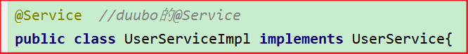
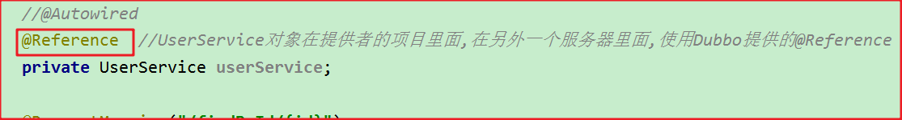

# 56day51-Dubbo

# 学习目标

- [ ] 了解应用架构演进过程
- [ ] 了解RPC远程调用方式
- [ ] 掌握Dubbo框架的架构
- [ ] 掌握Zookeeper注册中心的基本使用
- [ ] 掌握Dubbo生产者和消费者的开发
- [ ] 了解Dubbo的管理控制台的使用
- [ ] 了解Dubbo的相关配置
- [ ] 了解Dubbo的负载均衡

# 第一章-软件架构的演进过程

## 知识点-软件架构的演进过程

### 1.目标

​	软件架构的发展经历了由单体架构、垂直架构、【SOA架构,微服务】架构的演进过程.我们需要对软件架构的演进过程有一定的了解. 

### 2.路径

+ 单体架构
+ 垂直架构
+ SOA架构
+ 微服务架构

### 3.讲解

#### 3.1单体架构

    

1. 架构说明

   全部功能集中在一个项目里面(All in one).

2. 架构优点

   项目架构简单，前期开发成本低，周期短，小型项目的首选。

3. 架构缺点

   ​    耦合度比较高,不好维护和扩展

   ​	对于大项目,部署后性能比较低

   ​    技术栈受限,只能使用一种语言开发

   ​    解决高并发只能通过集群,成本高


#### 3.2垂直架构

   

​		随着互联网的发展，用户越来越多，软件技术也得到了很大的发展，人们开始研究一些技术使其与底层硬件交互会更加友好等。及某系统流量访问某模块占比很高，而其他模块没有什么流量访问，如果都部署到一起占用的资源就浪费了，如果分开部署，流量高的部署到一台高性能服务器，而流量低的部署到一台普通的服务器，两个模块之间的交互用WebService、RPC等方式进行访问。那样就可以解决上述传统架构的缺点问题.

1. 架构说明

   按照业务进行切割，形成小的项目，项目直接通过RPC等方式通信，交换数据等。

2. 架构优点

   ​    耦合度降低

   ​    技术不会受限制,不同系统可以使用不同语言开发

   ​    项目不会无限扩大

3. 架构缺点

   ​    项目间公共的逻辑重复,没办法复用

   ​    界面和业务逻辑没有分离

#### 3.3SOA架构

 

​	 在垂直架构中可以看到,项目间公共的逻辑重复,没办法复用. 随着互联网的发展，网站应用的规模不断扩大，常规的垂直应用架构已无法应对.	

​	SOA是Service-Oriented Architecture的首字母简称，它是一种==支持面向服务的架构==样式。从服务、基于服务开发和服务的结果来看，面向服务是一种思考方式。其实SOA架构更多应用于互联网项目开发。

1. 架构说明

   ​	将重复功能或模块抽取成组件的形式，对外提供服务，在项目与服务之间使用ESB（企业服务总线）的形式作为通信的桥梁，使用RPC等方式进行通信。

2. 架构优点

   ​	重复功能或模块抽取为服务，提高开发效率、可重用性高、可维护性高

   ​	可以针对不同服务制定对应的技术方案。

   ​	界面和业务逻辑实现分离

3. 架构缺点

   ​    各系统之间业务不同，因此很难确认功能或模块是重复的，不利于开发和维护

   ​    抽取服务的粒度大

#### 3.4微服务架构

  

​	 SOA架构有局限性，就是所有的接口都需要走ESB，如果不同的编程语言开发子系统，而这个编程语言对于某种RCP协议支持是最友好的，而ESB规则限定其只能使用ESB的规定协议。

1. 架构说明

   ​	 在服务治理架构上延伸，抽取的粒度更细，尽量遵循单一原则，采用轻量级框架协议(HTTP协议)传输。

2. 架构优点

   -  去中心化的思想，不在使用ESB作为通信的桥梁，服务、系统之间可以相互访问。
   -  粒度更细，有利于提高开发效率。
   -  可以针对不同服务制定对应的技术方案。
   -  适用于产品迭代周期短

3. 架构缺点

   - 粒度太细导致服务太多，维护成本高。
   - 负载均衡、事务等问题对技术团队的挑战及成本问题。  分布式事务

### 4.小结

1. 单体架构: 所有的模块全部写在一个项目里面
2. 垂直架构: 根据业务抽取成一个个系统
3. SOA架构: 把业务抽取成一个个服务
4. 微服务: 前后端分离, 后台只开发微服务, 分库

# 第二章-Apache Dubbo

## 知识点-Dubbo概述

### 1.目标

+ 知道什么是Dubbo以及RPC

### 2.路径

+ Dubbo介绍
+ RPC介绍

### 3.讲解

#### 3.1Dubbo介绍 

​	Apache Dubbo是一款高性能的Java ==RPC框架==。其前身是阿里巴巴公司开源的一个高性能、轻量级的开源Java RPC框架，可以和Spring框架无缝集成。 

Dubbo官网地址：http://dubbo.io/

Dubbo提供了三大核心能力：面向接口的远程方法调用，智能容错和负载均衡，以及服务自动注册和发现。

#### 3.2RPC介绍

​		RPC全称为remote procedure call，即远程过程调用。

​		比如两台服务器A和B，A服务器上部署一个应用，B服务器上部署一个应用，A服务器上的应用想调用B服务器上的应用提供的方法，由于两个应用不在一个内存空间，不能直接调用，所以需要通过网络来表达调用的语义和传达调用的数据

​	RPC是一个泛化的概念，严格来说一切远程过程调用手段都属于RPC范畴。各种开发语言都有自己的RPC框架。Java中的RPC框架比较多，广泛使用的有RMI、Hessian、Dubbo等。

> 需要注意的是RPC并不是一个具体的技术, 不是协议，而是指整个网络远程调用过程。

### 4.小结

1. 什么是Dubbo

   ​	一个Java的远程调用RPC框架

2. 什么是RPC

   ​	远程调用, 不是一种技术,==不是协议==, 是一个概念


## 知识点-Dubbo架构【面试】

### 1.目标

+ 掌握Dubbo架构

### 2.讲解

Dubbo架构图（Dubbo官方提供）如下：

 

节点角色说明：

| 节点               | 角色名称                               |
| ------------------ | -------------------------------------- |
| Provider(提供者)   | 暴露服务的服务提供方                   |
| Consumer(消费者)   | 调用远程服务的服务消费方               |
| Registry(注册中心) | 服务注册与发现的注册中心               |
| Monitor            | 统计服务的调用次数和调用时间的监控中心 |
| Container          | 服务运行容器                           |

虚线都是异步访问，

实线都是同步访问

蓝色虚线:在启动时完成的功能

调用关系说明:

1. 服务提供者在启动时，向注册中心注册自己提供的服务。
2. 服务消费者在启动时，向注册中心订阅自己所需的服务。
3. 注册中心返回服务提供者地址列表给消费者，如果有变更，注册中心将基于长连接推送变更数据给消费者。
4. 服务消费者，从提供者地址列表中，基于软负载均衡算法，选一台提供者进行调用，如果调用失败，再选另一台调用。
5. 服务消费者和提供者，在内存中累计调用次数和调用时间，定时每分钟发送一次统计数据到监控中心。

### 3.小结

1. 角色
   + 注册中心(一般使用ZK)
   + 服务的提供者
   + 服务的消费者
2. 过程
   + 服务的提供者(服务的消费者)向注册中心注册
   + 服务的消费者订阅
   + 服务的消费者从注册中心注册获得服务的提供者的信息, 进行远程调用

## 知识点-Dubbo快速入门【重点】

### 1.目标

​	Dubbo作为一个RPC框架，其最核心的功能就是要实现跨网络的远程调用。本小节就是要创建两个应用，一个作为服务的提供者，一个作为服务的消费者。	通过Dubbo来实现服务消费者远程调用服务提供者的方法。

- [ ] 需求：根据id查询用户对象，页面发送请求：user/findById?id=1 根据id从数据库获取用户对象


### 2.步骤

  

+ dubbo_provider和dubbo_consumer需要注册到Zookeeper

#### 2.0环境的准备

+ 数据库的准备
+ 创建dubbo_parent
+ 创建dubbo_domain
+ 创建dubbo_interface

#### 2.1服务提供者dubbo_provider

1. 创建dubbo_provider
2. ==在pom添加坐标==
3. ==创建配置文件==
4. 创建启动类
7. ==创建service==
6. 创建Dao

#### 2.2服务消费者dubbo-consumer

1. 创建dubbo_consumer
2. ==在pom添加坐标==
3. ==创建配置文件==
4. 创建启动类
7. 创建Controller, ==注入Service==

### 3.实现

#### 3.0环境的准备

+ 数据库的准备

```java
CREATE TABLE `t_user` (
  `id` int(11) NOT NULL AUTO_INCREMENT,
  `username` varchar(20) DEFAULT NULL,
  `age` int(11) DEFAULT NULL,
  PRIMARY KEY (`id`)
) ENGINE=InnoDB AUTO_INCREMENT=3 DEFAULT CHARSET=utf8;

INSERT INTO t_user(username,age) VALUES("张三",22);
INSERT INTO t_user(username,age) VALUES("李四",20);
INSERT INTO t_user(username,age) VALUES("王五",25);
```

#### 3.1dubbo_parent

+ pom

```xml
<?xml version="1.0" encoding="UTF-8"?>
<project xmlns="http://maven.apache.org/POM/4.0.0"
         xmlns:xsi="http://www.w3.org/2001/XMLSchema-instance"
         xsi:schemaLocation="http://maven.apache.org/POM/4.0.0 http://maven.apache.org/xsd/maven-4.0.0.xsd">
    <modelVersion>4.0.0</modelVersion>

    <groupId>com.itheima</groupId>
    <artifactId>dubbo_parent</artifactId>
    <version>1.0-SNAPSHOT</version>
    <modules>
        <module>dubbo_domain</module>
        <module>dubbo_interface</module>
        <module>dubbo_provider</module>
        <module>dubbo_consumer</module>
    </modules>
    <packaging>pom</packaging>

    <properties>
        <project.build.sourceEncoding>UTF-8</project.build.sourceEncoding>
        <maven.compiler.source>1.8</maven.compiler.source>
        <maven.compiler.target>1.8</maven.compiler.target>
        <mysql.version>5.1.47</mysql.version>
        <druid.version>1.0.9</druid.version>
        <mybatis-spring.version>2.0.1</mybatis-spring.version>
        <lombok.version>1.18.4</lombok.version>
    </properties>

    <parent>
        <groupId>org.springframework.boot</groupId>
        <artifactId>spring-boot-starter-parent</artifactId>
        <version>2.1.0.RELEASE</version>
    </parent>

    <dependencyManagement>
        <dependencies>
            <dependency>
                <groupId>org.mybatis.spring.boot</groupId>
                <artifactId>mybatis-spring-boot-starter</artifactId>
                <version>2.0.1</version>
            </dependency>
            <dependency>
                <groupId>org.mybatis</groupId>
                <artifactId>mybatis-spring</artifactId>
                <version>${mybatis-spring.version}</version>
            </dependency>
            <!--lombok-->
            <dependency>
                <groupId>org.projectlombok</groupId>
                <artifactId>lombok</artifactId>
                <optional>true</optional>
                <version>${lombok.version}</version>
            </dependency>
            <!-- MySql -->
            <dependency>
                <groupId>mysql</groupId>
                <artifactId>mysql-connector-java</artifactId>
                <version>${mysql.version}</version>
            </dependency>
        </dependencies>
    </dependencyManagement>
    <dependencies>
        <dependency>
            <groupId>org.projectlombok</groupId>
            <artifactId>lombok</artifactId>
        </dependency>
    </dependencies>
</project>
```


#### 3.2dubbo_domain

+ User

```java
package com.itheima.bean;
import lombok.AllArgsConstructor;
import lombok.Data;
import lombok.NoArgsConstructor;

import java.io.Serializable;

/**
 * 用户实体对象
 */
@Data
@AllArgsConstructor
@NoArgsConstructor
public class User implements Serializable {
    private Integer id;
    private String username;
    private Integer age;
}
```

#### 3.3dubbo_interface

+ pom

```xml
<?xml version="1.0" encoding="UTF-8"?>
<project xmlns="http://maven.apache.org/POM/4.0.0"
         xmlns:xsi="http://www.w3.org/2001/XMLSchema-instance"
         xsi:schemaLocation="http://maven.apache.org/POM/4.0.0 http://maven.apache.org/xsd/maven-4.0.0.xsd">
    <parent>
        <artifactId>dubbo_parent</artifactId>
        <groupId>com.itheima</groupId>
        <version>1.0-SNAPSHOT</version>
    </parent>
    <modelVersion>4.0.0</modelVersion>

    <artifactId>dubbo_interface</artifactId>

    <dependencies>
        <dependency>
            <groupId>com.itheima</groupId>
            <artifactId>dubbo_domain</artifactId>
            <version>1.0-SNAPSHOT</version>
        </dependency>
    </dependencies>

</project>
```

+ UserService

```java
package com.itheima.service;

import com.itheima.bean.User;

/**
 * @Description:
 * @author: yp
 */
public interface UserService {
    User findById(Integer id);
}

```


#### 3.4dubbo_provider

+ pom

```xml
<?xml version="1.0" encoding="UTF-8"?>
<project xmlns="http://maven.apache.org/POM/4.0.0"
         xmlns:xsi="http://www.w3.org/2001/XMLSchema-instance"
         xsi:schemaLocation="http://maven.apache.org/POM/4.0.0 http://maven.apache.org/xsd/maven-4.0.0.xsd">
    <parent>
        <artifactId>dubbo_parent</artifactId>
        <groupId>com.itheima</groupId>
        <version>1.0-SNAPSHOT</version>
    </parent>
    <modelVersion>4.0.0</modelVersion>

    <artifactId>dubbo_provider</artifactId>

    <dependencies>
        <dependency>
            <groupId>com.itheima</groupId>
            <artifactId>dubbo_interface</artifactId>
            <version>1.0-SNAPSHOT</version>
        </dependency>
        <!--springboot基础起步依赖-->
        <dependency>
            <groupId>org.springframework.boot</groupId>
            <artifactId>spring-boot-starter</artifactId>
        </dependency>
        <dependency>
            <groupId>org.mybatis.spring.boot</groupId>
            <artifactId>mybatis-spring-boot-starter</artifactId>
        </dependency>
        <dependency>
            <groupId>mysql</groupId>
            <artifactId>mysql-connector-java</artifactId>
        </dependency>
        <!--dubbo的起步依赖-->
        <dependency>
            <groupId>org.apache.dubbo</groupId>
            <artifactId>dubbo-spring-boot-starter</artifactId>
            <version>2.7.5</version>
        </dependency>
        <!-- zookeeper的api管理依赖 -->
        <dependency>
            <groupId>org.apache.curator</groupId>
            <artifactId>curator-recipes</artifactId>
            <version>4.2.0</version>
            <exclusions>
                <exclusion>
                    <groupId>org.apache.zookeeper</groupId>
                    <artifactId>zookeeper</artifactId>
                </exclusion>
            </exclusions>
        </dependency>
        <!-- zookeeper依赖 -->
        <dependency>
            <groupId>org.apache.zookeeper</groupId>
            <artifactId>zookeeper</artifactId>
            <version>3.4.12</version>
        </dependency>
    </dependencies>

</project>
```

+ application.yml

```yaml
server:
  port: 8888
spring:
  datasource:
    driver-class-name: com.mysql.jdbc.Driver
    url: jdbc:mysql://localhost:3306/mydb?useUnicode=true&characterEncoding=UTF-8&serverTimezone=UTC
    username: root
    password: 123456
dubbo:
  application:
    name: dubbo-provider
  registry:
    address: zookeeper://127.0.0.1:2181
  scan:
    base-packages: com.itheima.service
```

+ 启动类

```java
package com.itheima;

import org.mybatis.spring.annotation.MapperScan;
import org.springframework.boot.SpringApplication;
import org.springframework.boot.autoconfigure.SpringBootApplication;

/**
 * @Description:
 * @author: yp
 */
@SpringBootApplication
@MapperScan("com.itheima.dao")
public class ProviderApplication {

    public static void main(String[] args) throws InterruptedException {
        SpringApplication.run(ProviderApplication.class,args);
        while (true){
            Thread.sleep(3000);
        }
    }
}

```

+ UserDao

```java
package com.itheima.dao;

import com.itheima.bean.User;

public interface UserDao {
    User findById(Integer id);
}

<?xml version="1.0" encoding="utf-8" ?>
<!DOCTYPE mapper PUBLIC "-//mybatis.org//DTD Mapper 3.0//EN"
        "http://mybatis.org/dtd/mybatis-3-mapper.dtd" >
<mapper namespace="com.itheima.dao.UserDao">
    <select id="findById" resultType="com.itheima.bean.User" parameterType="int">
        select * from t_user where id = #{id}
    </select>
</mapper>
```

+ UserService

```java
package com.itheima.service;

import com.itheima.bean.User;
import com.itheima.dao.UserDao;
import com.itheima.service.UserService;
import org.apache.dubbo.config.annotation.Service;
import org.springframework.beans.factory.annotation.Autowired;

/**
 * @Description:
 * @author: yp
 */
@Service
public class UserServiceImpl implements UserService {

    @Autowired
    private UserDao userDao;

    @Override
    public User findById(Integer id) {
        return userDao.findById(id);
    }
}

```


#### 3.5dubbo_consumer

+ pom

```xml
<?xml version="1.0" encoding="UTF-8"?>
<project xmlns="http://maven.apache.org/POM/4.0.0"
         xmlns:xsi="http://www.w3.org/2001/XMLSchema-instance"
         xsi:schemaLocation="http://maven.apache.org/POM/4.0.0 http://maven.apache.org/xsd/maven-4.0.0.xsd">
    <parent>
        <artifactId>dubbo_parent</artifactId>
        <groupId>com.itheima</groupId>
        <version>1.0-SNAPSHOT</version>
    </parent>
    <modelVersion>4.0.0</modelVersion>

    <artifactId>dubbo_consumer</artifactId>

    <dependencies>
        <dependency>
            <groupId>com.itheima</groupId>
            <artifactId>dubbo_interface</artifactId>
            <version>1.0-SNAPSHOT</version>
        </dependency>
        <dependency>
            <groupId>org.springframework.boot</groupId>
            <artifactId>spring-boot-starter-web</artifactId>
        </dependency>
        <!--dubbo的起步依赖-->
        <dependency>
            <groupId>org.apache.dubbo</groupId>
            <artifactId>dubbo-spring-boot-starter</artifactId>
            <version>2.7.5</version>
        </dependency>

        <!-- zookeeper的api管理依赖 -->
        <dependency>
            <groupId>org.apache.curator</groupId>
            <artifactId>curator-recipes</artifactId>
            <version>4.2.0</version>
            <exclusions>
                <exclusion>
                    <groupId>org.apache.zookeeper</groupId>
                    <artifactId>zookeeper</artifactId>
                </exclusion>
            </exclusions>
        </dependency>

        <!-- zookeeper依赖 -->
        <dependency>
            <groupId>org.apache.zookeeper</groupId>
            <artifactId>zookeeper</artifactId>
            <version>3.4.12</version>
        </dependency>
    </dependencies>


</project>
```

+ application.yml

```java
server:
  port: 7777
dubbo:
  application:
    name: dubbo-consumer
  registry:
    address: zookeeper://127.0.0.1:2181
```

+ 启动类

```java
package com.itheima;

import org.springframework.boot.SpringApplication;
import org.springframework.boot.autoconfigure.SpringBootApplication;

/**
 * @Description:
 * @author: yp
 */
@SpringBootApplication
public class ConsumerApplication {
    public static void main(String[] args) {
        SpringApplication.run(ConsumerApplication.class,args);
    }
}

```

+ UserController

```java
package com.itheima.controller;

import com.itheima.bean.User;
import com.itheima.service.UserService;
import org.apache.dubbo.config.annotation.Reference;
import org.springframework.web.bind.annotation.GetMapping;
import org.springframework.web.bind.annotation.PathVariable;
import org.springframework.web.bind.annotation.RequestMapping;
import org.springframework.web.bind.annotation.RestController;

/**
 * @Description:
 * @author: yp
 */
@RestController
@RequestMapping("/user")
public class UserController {

    @Reference
    private UserService userService;

    @GetMapping("/findById/{id}")
    public User findById(@PathVariable("id") Integer id){
        System.out.println("UserController...findById()");
        User user = userService.findById(id);
        System.out.println(user);
        return user;
    }
}

```

### 4.小结

1. dubbo_provider

 

2. dubbo_consumer

 

### 5.思考问题

+ 思考一：在服务消费者工程(dubbo-consumer)中只是引用了UserService接口，并没有提供实现类，Dubbo是如何做到远程调用的？

  答:Dubbo底层是基于代理技术为UserService接口创建==代理对象==，远程调用是通过此代理对象完成的。可以通过开发工具的debug功能查看此代理对象的内部结构。另外，Dubbo实现网络传输底层是基于==Netty框架==完成的。

+ 思考二:上面的Dubbo入门案例中我们使用Zookeeper作为服务注册中心，服务提供者需要将自己的服务信息注册到Zookeeper，服务消费者需要从Zookeeper订阅自己所需要的服务，此时Zookeeper服务就变得非常重要了，那如何防止Zookeeper单点故障呢？

  答：Zookeeper其实是支持集群模式的，可以配置Zookeeper集群来达到Zookeeper服务的高可用，防止出现单点故障。


## 知识点-Dubbo管理控制台

### 1.目标

​	我们在开发时，需要知道Zookeeper注册中心都注册了哪些服务，有哪些消费者来消费这些服务。我们可以通过部署一个管理中心来实现。其实管理中心就是一个web应用，部署到tomcat即可

### 2.步骤

- Dubbo管理控制台的安装
- Dubbo管理控制台的使用

### 3.讲解

#### 3.1安装

安装步骤：

（1）将资料中的dubbo-admin-2.6.0.war文件复制到tomcat的webapps目录下

（2）启动tomcat，此war文件会自动解压

（3）修改WEB-INF下的dubbo.properties文件，注意dubbo.registry.address对应的值需要对应当前使用的Zookeeper的ip地址和端口号

​	dubbo.registry.address=zookeeper://127.0.0.1:2181
​	dubbo.admin.root.password=root
​	dubbo.admin.guest.password=guest

（4）重启tomcat

#### 3.2使用

操作步骤：

（1）访问http://localhost:8080/dubbo-admin-2.6.0/，输入用户名(root)和密码(root)


（2）启动服务提供者工程和服务消费者工程，可以在查看到对应的信息


### 4.小结

1. Dubbo管理控制台: 一个可视化工具, 可以查看提供者,消费者信息的
2. 版本
   + war, 发布到tomcat里面
   + jar  把dubbo-admin-0.0.1-SNAPSHOT.jar和start_dubbo_admin.bat一起拷贝到一个没有中文和空格目录, 点击start_dubbo_admin.bat就可以使用了

## 知识点-Dubbo相关配置说明【掌握】

### 1.目标

- [ ] 了解Dubbo的相关配置

### 2.路径

1. 序列化
2. 协议

### 3.讲解

#### 3.1序列化

两个机器传输数据，如何传输Java对象 ?

 

dubbo 内部已经将序列化和反序列化的过程内部封装了我们只需要在定义pojo类时实现Serializable接口即可。

如果pojo没有实现Serializable接口， 会报如下错误：

   

#### 3.2服务接口访问协议【面试】

一般在服务提供者一方配置，可以指定使用的协议名称和端口号。

其中Dubbo支持的协议有：==dubbo==、rmi、hessian、http、webservice、rest、redis等。

推荐使用的是dubbo协议。

```yaml
dubbo:
  protocol:
    name: dubbo
    port: 20881
```

​	dubbo 协议采用单一长连接和 NIO 异步通讯，==适合于小数据量(一次请求传输的数据量不大的情况), 大并发==的服务调用，以及服务消费者机器数远大于服务提供者机器数的情况。==不适合传送大数据量的服务，比如传文件，传视频等，除非请求量很低。==

- 连接个数：单连接
- 连接方式：长连接
- 传输协议：TCP
- 传输方式：NIO异步传输
- 序列化：Hessian二进制序列化
- 适用范围：传入传出参数数据包较小（建议小于100K），消费者比提供者个数多，单一消费者无法压满提供者，尽量不要用dubbo协议传输大文件或超大字符串。
- 适用场景：常规远程服务方法调用

官网:https://dubbo.apache.org/zh/docs/v2.7/user/references/protocol/rest/

#### 3.3 **启动时检查**

```yml
dubbo:
  consumer:
    check: false
```

上面这个配置需要配置在服务消费者一方，如果不配置默认check值为true。Dubbo 缺省会在启动时检查依赖的服务是否可用，不可用时会抛出异常，阻止 Spring 初始化完成，以便上线时，能及早发现问题。可以通过将check值改为false来关闭检查。

可以在开发阶段将check值设置为false，在生产环境下改为true。

```
Caused by: java.lang.IllegalStateException: Failed to check the status of the service com.itheima.service.UserService. No provider available for the service
```

### 4.小结

1. 序列化:  远程调用的时候, 传输对象,这个对象需要序列化. 也就意味着我们的JavaBean需要实现`Serializable`
2. dubbo协议
   + dubbo默认支持很多种协议  eg: dubbo,  redis, http ...
   + 默认的是dubbo协议, 适合数据量不大, 并发的场景
     + ==传输 TCP协议==
     + 传输方式：NIO异步传输
     + 序列化：Hessian二进制序列化


## 扩展-Dubbo高级特性

### 1.目标

- [ ] 了解Dubbo高级特性

### 2.路径

1. 缓存
2. 超时配置
3. 重试配置
4. 负载均衡
5. 集群容错  
6. 服务降级  

### 3.讲解

#### 3.1 缓存【面试】

​	如果Zookeeper宕机了, Dubbo服务间还可以远程调用吗?

​	可以。dubbo每次生成对应的代理对象后，消费者都会将远程信息缓存到本地，即便zookeeper注册中心宕机了，也可以继续调用。只是新的服务无法再次注册。

#### 3.2超时配置

​	dubbo调用默认1秒钟超时，可以设置超时时间长些，保证调用不出问题，这个时间需要根据业务来确定。

建议由服务提供方设置超时，因为一个方法需要执行多长时间，服务提供方更清楚。

+ 修改提供者配置

```java
@Service(timeout = 3000)//timeout:配置超时时间
public class UserServiceImpl implements UserService {
    ...
}
```

或者

+ 修改消费者配置

```java
@Reference(timeout = 3000) //timeout:配置超时时间
 private UserService userService;
```

#### 3.3重试配置

如果出现网络抖动，则这一次请求就会失败。 Dubbo 提供重试机制来避免类似问题的发生。

dubbo在调用服务不成功时，默认会重试2次请求。通过 retries 属性来设置重试次数。默认为 2 次  

+ 在消费方配置

 

不适合写的请求, 如果是写的操作 建议 `@Reference(retries = 0)`

#### 3.4负载均衡

##### 3.4.1.负载均衡介绍

​	负载均衡（Load Balance）：其实就是将请求分摊到多个操作单元上进行执行，从而共同完成工作任务。

​	在集群负载均衡时，Dubbo 提供了多种均衡策略（包括随机random、轮询roundrobin、最少活跃调用数leastactive，一致性哈希consistenthash(固定)），缺省【默认】为random随机调用。

https://dubbo.apache.org/zh/docs/v2.7/dev/source/loadbalance/

​	配置负载均衡策略

+ 服务消费者指定负载均衡策略，所有消费者都使用这种策略

  ```java
  dubbo:
    consumer:
      loadbalance: roundrobin
  ```

* 在@Reference或@Service 添加负载均衡配置，给指定的消费者或提供者设置负载均衡策略

  ```java
  消费方
  @Reference(loadbalance = "roundrobin")
  
  服务提供方
  @Service(loadbalance = "roundrobin")
  ```

  

##### 3.4.2. 测试负载均衡效果

​	增加一个服务提供者，提供相同的服务;

​	正式生产环境中，服务提供者部署到多台机器上，不需要修改任何代码，只需要部署到不同机器即可测试。

​	如果是单机测试，必须通过修该提供者的dubbo协议端口和web服务端口来进行部署。

配置启动多个实例，修改==服务提供方==的端口

 


#### 3.5集群容错  

 

集群容错模式：

+ ==Failover Cluster(failover)：失败重试。默认值==。当出现失败，重试其它服务器 ，默认重试2次，使用 retries 配置。一般用于读操作
+ Failfast Cluster(failfast) ：快速失败，只发起一次调用，失败立即报错。通常用于==写操作==。
+  Failsafe Cluster(failsafe) ：失败安全，出现异常时，直接忽略。返回一个空结果。
+ Failback Cluster(failback) ：失败自动恢复，后台记录失败请求，定时重发。通常用于消息通知操作。
+  Forking Cluster(forking) ：并行调用多个服务器，只要一个成功即返回。
+  Broadcast Cluster(broadcast) ：广播调用所有提供者，逐个调用，任意一台报错则报错。

在消费者配置

 


#### 3.6服务降级  

​	什么是服务降级？当服务器压力剧增的情况下，根据实际业务情况及流量，对一些服务和页面有策略的不处理或换种简单的方式处理，从而释放服务器资源以保证核心交易正常运作或高效运作。

可以通过服务降级功能临时屏蔽某个出错的非关键服务，并定义降级后的返回策略。

 

服务降级方式:

- `mock=force:return null` 表示消费方对该服务的方法调用都直接返回 null 值，不发起远程调用。用来屏蔽不重要服务不可用时对调用方的影响。
- 还可以改为 `mock=fail:return null` 表示消费方对该服务的方法调用在失败后，再返回 null 值，不抛异常。用来容忍不重要服务不稳定时对调用方的影响。

在消费方配置:

 

### 4.小结

1. ZK宕机了, Dubbo服务还可以继续调用。dubbo服务本地会进行缓存。 只不过新的dubbo服务不可能进行注册了。【重点】
2. 超时： 默认1000ms
3. 重试配置
   + 默认重试2次  适合查的情况， 不适合写的情况
   + 写的情况， 一般设置为0
4. 负载均衡 默认4种
   + 随机
   + 轮询
   + 最少活跃数
   + 一致hash
5. 集群容错
   + 在集群环境下， 某台服务超时或者失败的时候， 默认会调用集群里面其它的服务器（适合查的情况）
6. 服务降级
   + 当服务器压力剧增的情况下，根据实际业务情况及流量，对一些服务和页面有策略的不处理或换种简单的方式处理，从而释放服务器资源以保证核心交易正常运作或高效运作。

# 总结

## 1.概念

1. 什么是DUBBO
2. RPC
3. 缓存
4. Dubbo架构

## 2.Dubbo快速入门【重点】

+ 可以敲2遍

## 3一些配置

## 4.预习


> 演讲
>
> 1. 缓存
> 2. Dubbo架构

