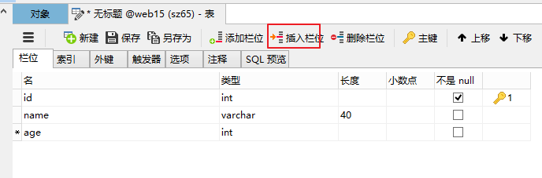
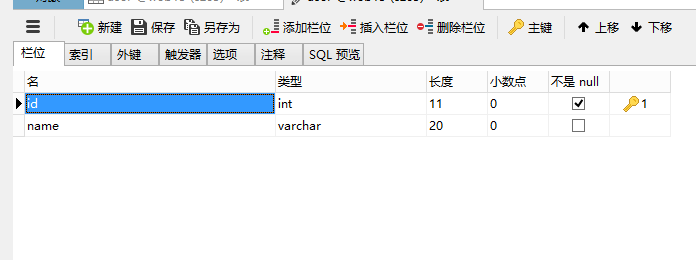
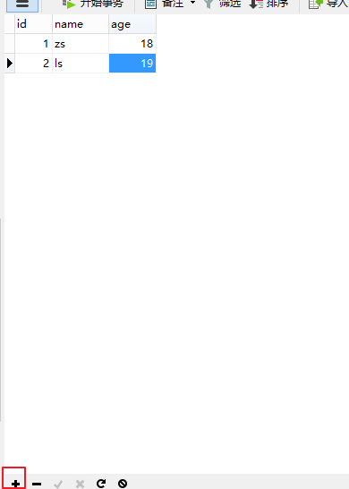

# day18-MySQL进阶

# 今日内容

- 可视化工具使用
- 多表之间的关系
- 多表查询---->重点掌握\难点
  - **连接查询**
    - **内连接查询**
    - **外连接查询**
  - **子查询**
- 事务---->重点掌握
  - **事务管理(开启事务,提交事务,回滚事务)**
  - 事务特性和事务的隔离级别(面试)
- 数据库备份和还原
- 三大范式

# 第一章-可视化工具使用

## 1.1 可视化软件的使用【会用就行】

- 连接数据库

  

- 对数据库的操作

  

- 对表的操作

- 创建表

   

  

- 修改表

  

  

- 删除表

  

- 对数据的操作

  - 插入数据

     

  - 删除数据

     

  - 修改数据

- 注意点:表, 记录如果创建好了, 没有展示, 需要**刷新一下**就可以了

  


# 第二章-多表间的关系

## 2.1 为什么要有多表?

##### 单表的缺点

创建一个员工表包含如下列(id, name, age, dep_name, dep_location),id主键并自动增长,添加5条数据

```sql
CREATE TABLE emp (
	id INT PRIMARY KEY AUTO_INCREMENT,
	NAME VARCHAR(30),
	age INT,
	dep_name VARCHAR(30),
	dep_location VARCHAR(30)
);

-- 添加数据
INSERT INTO emp (NAME, age, dep_name, dep_location) VALUES ('张三', 20, '研发部', '广州');
INSERT INTO emp (NAME, age, dep_name, dep_location) VALUES ('李四', 21, '研发部', '广州');
INSERT INTO emp (NAME, age, dep_name, dep_location) VALUES ('王五', 20, '研发部', '广州');

INSERT INTO emp (NAME, age, dep_name, dep_location) VALUES ('老王', 20, '销售部', '深圳');
INSERT INTO emp (NAME, age, dep_name, dep_location) VALUES ('大王', 22, '销售部', '深圳');
INSERT INTO emp (NAME, age, dep_name, dep_location) VALUES ('小王', 18, '销售部', '深圳');
```

缺点:表中出现了很多重复的数据(数据冗余)，如果要修改研发部的地址需要修改3个地方。


解决方案:将一张表分成2张表(员工表和部门表)


```sql
-- 创建部门表
CREATE TABLE department (
	id INT PRIMARY KEY AUTO_INCREMENT,
	dep_name VARCHAR(20),
	dep_location VARCHAR(20)
);

-- 创建员工表
CREATE TABLE employee (
	id INT PRIMARY KEY AUTO_INCREMENT,
	NAME VARCHAR(20),
	age INT,
	dep_id INT
);

-- 添加2个部门
INSERT INTO department (dep_name, dep_location) VALUES ('研发部', '广州');
INSERT INTO department (dep_name, dep_location) VALUES('销售部', '深圳');

-- 添加员工,dep_id表示员工所在的部门
INSERT INTO employee (NAME, age, dep_id) VALUES 
('张三', 20, 1), 
('李四', 21, 1), 
('王五', 20, 1), 
('老王', 20, 2),
('大王', 22, 2),
('小王', 18, 2);
```

**问题**：
当我们在employee的dep_id里面输入不存在的部门,数据依然可以添加.但是并没有对应的部门，不能出现这种情况。employee的dep_id中的内容只能是department表中存在的id


**目标**:需要约束dep_id字段的值, 只能是department表中已经存在id
**解决方式**:使用外键约束


## 2.2 外键约束【重点】

#### 外键约束作用

-  **用来维护多表之间关系**

外键: 从表中的某个字段,该字段的值是引用主表中主键的值
主表： 约束别人的表
副表/从表： 被别人约束的表


#### 外键的语法

##### 添加外键

```sql
1. 新建表时增加外键：
[CONSTRAINT] [外键约束名称] FOREIGN KEY(外键字段名) REFERENCES 主表名(主键字段名)
关键字解释：
CONSTRAINT -- 约束关键字
FOREIGN KEY(外键字段名) –- 某个字段作为外键
REFERENCES -- 主表名(主键字段名) 表示参照主表中的某个字段

2. 已有表增加外键：
ALTER TABLE 从表名 ADD [CONSTRAINT] [外键约束名称] FOREIGN KEY (外键字段名) REFERENCES 主表(主键字段名);

```

```sql
-- 删除员工表,从新创建,并添加外键
CREATE TABLE employee (
	id INT PRIMARY KEY AUTO_INCREMENT,
	NAME VARCHAR(20),
	age INT,
	dep_id INT,
	-- 添加一个外键
	-- 外键取名公司要求,一般fk结尾
	CONSTRAINT emp_depid_ref_dep_id_fk FOREIGN KEY(dep_id) REFERENCES department(id)
);
-- 添加正确数据
INSERT INTO employee (NAME, age, dep_id) VALUES
('张三', 20, 1),
('李四', 21, 1),
('王五', 20, 1),
('老王', 20, 2),
('大王', 22, 2),
('小王', 18, 2);


-- 验证: 添加错误数据
INSERT INTO employee (NAME, age, dep_id) VALUES ('二王', 20, 5);// 报错
```


##### 删除外键

- `alter table 表 drop foreign key 外键名称;`

  ```sql
  -- 删除employee员工表的外键
  alter table employee drop foreign key emp_dep_fk1;
  -- 往员工信息表中添加非法数据---部门id不存在
  INSERT INTO employee (NAME, age, dep_id) VALUES ('老张', 18, 6);-- 成功
  ```

  

- 为已存在的表添加外键,注意:外键字段上不能有非法数据

- `alter table 表名 add constraint 外键名称 foreign key(外键字段名) reference 主表(主键名)`

- ```sql
  -- 往员工信息表中添加非法数据---部门id不存在
  INSERT INTO employee (NAME, age, dep_id) VALUES ('老张', 18, 6);-- 失败
  ```

  

#### 外键的级联

- 要把部门表中的id值2，改成5，能不能直接修改呢？

  ```sql
  UPDATE department SET id=5 WHERE id=2;
  ```

  不能直接修改:Cannot delete or update a parent row: a foreign key constraint fails 如果副表(员工表)中有引用的数据,不能直接修改主表(部门表)主键

  要删除部门id等于1的部门, 能不能直接删除呢？

  ```sql
  DELETE FROM department WHERE id = 1;
  ```

  不能直接删除:Cannot delete or update a parent row: a foreign key constraint fails 如果副表(员工表)中有引用的数据,不能直接删除主表(部门表)数据

  **什么是级联操作**：
  在修改和删除主表的主键时，同时更新或删除副表的外键值，称为级联操作
  `ON UPDATE CASCADE` -- 级联更新，主表主键发生更新时，外键也会更新
  `ON DELETE CASCADE` -- 级联删除，主键主键发生删除时，外键也会删除

  具体操作：

  * 删除employee表
  * 重新创建employee表，添加级联更新和级联删除

  ```sql
  CREATE TABLE employee (
  	id INT PRIMARY KEY AUTO_INCREMENT,
  	NAME VARCHAR(30),
  	age INT,
  	dep_id INT,
  	CONSTRAINT employee_dep_fk FOREIGN KEY (dep_id) REFERENCES department(id) ON UPDATE CASCADE ON DELETE CASCADE
  );
  ```
  
* 再次添加数据到员工表和部门表
  
```sql
  INSERT INTO employee (NAME, age, dep_id) VALUES ('张三', 20, 1);
  INSERT INTO employee (NAME, age, dep_id) VALUES ('李四', 21, 1);
  INSERT INTO employee (NAME, age, dep_id) VALUES ('王五', 20, 1);
  INSERT INTO employee (NAME, age, dep_id) VALUES ('老王', 20, 2);
  INSERT INTO employee (NAME, age, dep_id) VALUES ('大王', 22, 2);
  INSERT INTO employee (NAME, age, dep_id) VALUES ('小王', 18, 2);
```

* 把部门表中id等于2的部门改成id等于5--->员工表中部门id为2的员工的部门id也会改为5
  
```sql
  UPDATE department SET id=5 WHERE id=2; -- 成功
```

* 删除部门id为1的部门---员工表中部门id为1的员工也会删除
  
```sql
  DELETE FROM department WHERE id=1;-- 成功
```


## 2.3 多表间关系

#### 一对多

例如：班级和学生，部门和员工，客户和订单

一的一方: 班级  部门  客户  

多的一方:学生  员工   订单   

**一对多建表原则**: 在从表(多的一方)创建一个字段,该字段作为外键指向主表(一的一方)的主键


#### 多对多

多对多（m:n）
例如：老师和学生，学生和课程，用户和角色

一个老师可以有多个学生,一个学生也可以有多个老师  多对多的关系

一个学生可以选多门课程,一门课程也可以由多个学生选择 多对多的关系

一个用户可以有多个角色,一个角色也可以有多个用户 多对多的关系

多对多关系建表原则: **需要创建一张中间表，中间表中至少两个字段，这两个字段分别作为外键指向各自一方的主键。**


#### 一对一

一对一（1:1）: 公司和地址, 老公和老婆

例如: 一个公司只能有一个注册地址，一个注册地址只能对应一个公司。 

例如: 一个老公可以有一个老婆,一个老婆只能有一个老公

在实际的开发中应用不多.因为**一对一可以创建成一张表**。
两种建表原则：

* 外键唯一：主表的主键和从表的外键（唯一），形成主外键关系，外键唯一`UNIQUE`

* 外键是主键：主表的主键和从表的主键，形成主外键关系
  

#### 多表设计之多表分析及创建

- 需求:完成一个学校的选课系统，在选课系统中包含班级，学生和课程这些实体。

- 分析:

  - 分析多表间关系:
  - 一个班级可以有多名学生,一名学生只能属于一个班级      一对多
    - 一个学生可以选多门课程,一门课程可以被多门学生选择   多对多
  - 建表原则:
    - 一对多: 在多的一方创建一个外键,指向一的一方的主键
    - 多对多: 创建一张中间表,至少有2个字段,分别作为外键指向各自一方的主键
  
- 实现:

  ```mysql
  create table class(
   id int primary key auto_increment,
   name varchar(40)  
  );
  
  create table student(
   id int primary key auto_increment,
   name varchar(40),
   c_id int,
   constraint stu_cls_fk1 foreign key(c_id) references class(id)
  );
  
  create table course(
   id int primary key auto_increment,
   name varchar(40)  
  );
  
  create table stu_cou(
  	sno int,
      cno int,
      constraint stu_cou_fk1 foreign key(cno) references course(id),
      constraint stu_cou_fk2 foreign key(sno) references student(id)
  );
  ```
  
  


# 第三章-连接查询

## 环境准备

```sql
-- 创建部门表
CREATE TABLE dept (
  id INT PRIMARY KEY AUTO_INCREMENT,
  NAME VARCHAR(20)
);

INSERT INTO dept (NAME) VALUES ('开发部'),('市场部'),('财务部');

-- 创建员工表
CREATE TABLE emp (
  id INT PRIMARY KEY AUTO_INCREMENT,
  NAME VARCHAR(10),
  gender CHAR(1),   -- 性别
  salary DOUBLE,   -- 工资
  join_date DATE,  -- 入职日期
  dept_id INT
);

INSERT INTO emp(NAME,gender,salary,join_date,dept_id) VALUES('孙悟空','男',7200,'2013-02-24',1);
INSERT INTO emp(NAME,gender,salary,join_date,dept_id) VALUES('猪八戒','男',3600,'2010-12-02',2);
INSERT INTO emp(NAME,gender,salary,join_date,dept_id) VALUES('唐僧','男',9000,'2008-08-08',2);
INSERT INTO emp(NAME,gender,salary,join_date,dept_id) VALUES('白骨精','女',5000,'2015-10-07',3);
INSERT INTO emp(NAME,gender,salary,join_date,dept_id) VALUES('蜘蛛精','女',4500,'2011-03-14',1);
```

## 3.1 交叉查询【了解】

1. 语法

```sql
select ... from 表1,表2 ;  
```

2. 练习: 
   1. 使用交叉查询部门和员工的信息
   2. 练习: 使用交叉查询部门的名称和员工id,名称,salary,join_date信息

```sql
-- 1. 使用交叉查询部门和员工的信息
select * from emp,dept;

-- 2. 练习: 使用交叉查询部门的名称和员工id,名称,salary,join_date信息
select emp.id,emp.name,emp.salary,emp.join_date,dept.name from emp,dept;
select e.id,e.name,e.salary,e.join_date,d.name from emp e,dept d;-- 取别名

```


以上数据其实是左表的每条数据和右表的每条数据组合。左表有3条，右表有5条，最终组合后3*5=15条数据。

**左表的每条数据和右表的每条数据组合，这种效果称为笛卡尔积**


## 3.2 内连接查询【重点】

- 内连接查询的是2张表**交集的部分(从表外键的值等于主表主键的值)**

####  隐式内连接

隐式里面是没有inner关键字的

```sql
select ... from 表1,表2 where 连接条件 [and 其他条件]  --(外键的值等于主键的值) 
```

- 练习:查询员工的id,姓名,性别,薪资,加入日期,所属部门

  ```sql
  select e.id,e.name,e.gender,e.salary,e.join_date,d.name  from emp e,dept d where e.dept_id = d.id;
  ```

####  显示内连接

显示里面是有inner关键字的

```sql
select ... from a [inner] join b on 连接条件 [ where 其它条件]
```

- 练习:查询员工的id,姓名,性别,薪资,加入日期,所属部门

  ```mysql
  select e.id,e.name,e.gender,e.salary,e.join_date,d.name  from emp e inner join dept d on e.dept_id = d.id;
  select e.id,e.name,e.gender,e.salary,e.join_date,d.name  from emp e  join dept d on e.dept_id = d.id;
  ```

  

#### 练习

查询所有部门下的员工信息,如果该部门下没有员工则不展示部门和员工信息.

```mysql
-- 往部门表中添加一个部门信息
insert into dept values(null,'销售部');
-- 往部门表中添加一条员工信息
insert into emp values(null,'罗贯中','男',10000,'2007-01-01',null);

-- 练习:查询所有部门下的员工信息,如果该部门下没有员工则不展示部门和员工信息.
select * from emp,dept where emp.dept_id = dept.id;
```


## 3.3 外连接【重点】

#### 左外连接

​	以join左边的表为主表,展示主表的所有数据,根据条件查询连接右边表的数据,若满足条件则展示,若不满足则以null显示.

​		可以理解为：==在内连接的基础上保证左边表的数据全部显示==

1. 语法

```sql
select ... from 左表名 left [outer] join 右表名 on 条件
```

2. 练习:查询所有部门下的员工,没有员工就就显示null

```sql
SELECT * FROM dept LEFT OUTER JOIN emp ON emp.emp.dept_id=dept.id;
```

#### 右外连接

​	以join右边的表为主表,展示右边表的所有数据,根据条件查询join左边表的数据,若满足则展示,若不满足则以null显示

可以理解为：在内连接的基础上保证右边表的数据全部显示

1. 语法

```mysql
select ... from 左表 right [outer] join 右表 on 条件
```

2. 练习:查询所有员工所对应的部门,没有部门就显示null

```mysql
SELECT * FROM dept RIGHT OUTER JOIN emp ON emp.dept_id=dept.id;
```

#### 内连接和外连接的区别

+ 内连接: 查询的是公共部分,满足连接条件的部分
+ 左外连接: 左边的数据全部显示出来. 再通过连接条件匹配出右边表的数据, 如果满足连接条件, 展示右边表的数据; 如果不满足, 右边的数据通过null代替
+ 右外连接: 右表的数据全部显示出来. 再通过连接条件匹配出左边表的数据, 如果满足连接条件, 展示左边表的数据; 如果不满足, 左边的数据通过null代替

3. 应用

```
1.用户1和订单m
  查询所有的用户的订单信息		外连接
  查询下单的用户的信息          内连接

2.用户1和账户m
  查询所有的用户的账户信息      外连接
  查询所有用户的开户信息        内连接
```


# 第四章-子查询【重点】

## 4.1 子查询入门

#### 什么是子查询  

直观一点: **一个查询语句里面至少包含2个select**

- **一个查询语句的结果作为另一个查询语句的条件**
- 有查询的嵌套，内部的查询称为子查询
- **子查询要使用括号**

- 子查询结果的三种情况：

  1. 子查询的结果是一个值的时候
     
  2. 子查询结果是单列多行的时候
     
  3. 子查询的结果是多行多列
     


## 4.2 子查询进阶

#### 子查询的结果是一个值的时候

子查询结果只要是`单个值`，肯定在`WHERE`后面作为`条件`
`SELECT ... FROM 表 WHERE 字段 [=,>,<,<>,...]（子查询）;`

1. **查询工资最高的员工是谁？** 

   1. 查询最高工资是多少

   ```sql
     SELECT MAX(salary) FROM emp;
   ```

     

   1. 根据最高工资到员工表查询到对应的员工信息

   ```sql
     SELECT * FROM emp WHERE salary=(SELECT MAX(salary) FROM emp);
   ```

     

2. **查询工资小于平均工资的员工有哪些？**

   1. 查询平均工资是多少

   ```sql
     SELECT AVG(salary) FROM emp;
   ```

     

   1. 到员工表查询小于平均的员工信息

   ```sql
     SELECT * FROM emp WHERE salary < (SELECT AVG(salary) FROM emp);
   ```

     

#### 子查询结果是单列多行的时候

子查询结果只要是`单列多行`，肯定在`WHERE`后面作为`条件`
子查询结果是单列多行，结果集类似于一个数组，父查询使用`IN`运算符
`SELECT ... FROM 表 WHERE 字段 IN （子查询）;`

1. **查询工资大于5000的员工，来自于哪些部门的名字**  

   1. 先查询大于5000的员工所在的部门id

   ```sql
     SELECT dept_id FROM emp WHERE salary > 5000;
   ```

     

   1. 再查询在这些部门id中部门的名字

   ```sql
     SELECT dept.name FROM dept WHERE dept.id IN (SELECT dept_id FROM emp WHERE salary > 5000);
   ```

     

2. **查询开发部与财务部所有的员工信息**

   1. 先查询开发部与财务部的id

   ```sql
   SELECT id FROM dept WHERE NAME IN('开发部','财务部');
   ```

   

   1. 再查询在这些部门id中有哪些员工

   ```sql
   SELECT * FROM emp WHERE dept_id IN (SELECT id FROM dept WHERE NAME IN('开发部','财务部'));
   ```

   

#### 子查询的结果是多行多列

子查询结果只要是`多行多列`，肯定在`FROM`后面作为`表`
`SELECT ... FROM （子查询） 表别名 WHERE 条件;`
**子查询作为表需要取别名，否则这张表没用名称无法访问表中的字段**

- **查询出2011年以后入职的员工信息，包括部门名称**

  1. 在员工表中查询2011-1-1以后入职的员工

  ```sql
  SELECT * FROM emp WHERE join_date > '2011-1-1';
  ```

  

  1. 查询所有的部门信息，与上面的虚拟表中的信息组合，找出所有部门id等于的dept_id

  ```sql
  SELECT * FROM dept d, (SELECT * FROM emp WHERE join_date > '2011-1-1') e WHERE e.dept_id = d.id;
  ```

  

# 第五章-事务

## 环境的准备

```sql
-- 账户表
create table account(
    id int primary key auto_increment,
    name varchar(20),
    money double
);

insert into account values (null,'zs',1000);
insert into account values (null,'ls',1000);
insert into account values (null,'ww',1000);
```

## 5.1 事务的概述

#### 什么是事务

- 事务指逻辑上的一组操作，组成这组操作的单元要么全部成功，要么全部失败。
  + 操作: zs向李四转账100元   zs:1000,ls:1000
  + 组成单元: zs钱-100, ls钱+100
    + 操作成功: zs钱900,ls钱1100
    + 操作失败: zs钱1000,ls钱1000
    + 不可能发生: zs钱900,ls钱1000;    zs钱1000,ls钱1100

#### 事务的作用

​	保证一组操作全部成功或者失败。   


## 5.2 MYSQL进行事务管理  

#### 自动管理事务(mysql默认)

​	一条sql语句就是一个事务(mysql默认自动开启事务,自动提交事务)

```sql
-- 场景: zs向ls转账100元
-- zs钱-100 ls钱+100
-- 自动事务管理: MySQL默认就是自动事务管理(自动开启事务,自动提交事务),一条sql语句就是一个事务
update account set money = money - 100 where name = 'zs';
-- 异常
update account set money = money + 100 where name = 'ls';

-- 查看mysql是否是自动提交事务
show variables like '%commit%';
```


#### 手动管理事务 

- 方式一: 手动开启事务的方式 【掌握】

  ​	`start transaction;开启事务`

     ` commit；提交   ` 	

  ​	 `rollback；回滚`

  ```sql
  -- 没有异常
  start transaction; -- 开启事务
  update account set money = money - 100 where name = 'zs'; -- zs钱-100
  -- 没有异常
  update account set money = money + 100 where name = 'ls'; -- ls钱 +100
  commit; -- 提交事务
  
  
  -- 有异常
  start transaction; -- 开启事务
  update account set money = money - 100 where name = 'zs'; -- zs钱-100
  -- 有异常
  update account set money = money + 100 where name = 'ls'; -- ls钱 +100
  rollback; -- 回滚事务
  
  ```
  
- 方式二: 设置MYSQL中的自动提交的参数【了解】

  查看MYSQL中事务是否自动提交

  ```sql
  show variables like '%commit%';
  ```

  设置自动提交的参数为OFF

  ```sql
  set autocommit = 0;-- 0:OFF  1:ON
  ```


#### 事务原理


#### 回滚点【了解】

##### 3.3.1什么是回滚点

​	在某些成功的操作完成之后，后续的操作有可能成功有可能失败，但是不管成功还是失败，前面操作都已经成功，可以在当前成功的位置设置一个回滚点。可以供后续失败操作返回到该位置，而不是返回所有操作，这个点称之为回滚点。

##### 3.3.2  回滚点的操作语句


##### 3.3.3具体操作

1)    将数据还原到1000

2)    开启事务

3)    让张三账号减3次钱 

4)    设置回滚点：savepoint three_times;

5)    让张三账号减4次钱

6)    回到回滚点：rollback to three_times;

- 总结：设置回滚点可以让我们在失败的时候回到回滚点，而不是回到事务开启的时候。

```sql
-- 设置回滚点: savepoint 名字;
-- 回滚到回滚点: rollback to 名字;
-- 开启事务
start transaction;
-- 张三转3次钱,每次转100
update account set money = money - 100 where name = 'zs';
update account set money = money - 100 where name = 'zs';
update account set money = money - 100 where name = 'zs';
-- 设置回滚点
savepoint abc;
-- 张三转4次钱,每次转100
update account set money = money - 100 where name = 'zs';
update account set money = money - 100 where name = 'zs';
update account set money = money - 100 where name = 'zs';
update account set money = money - 100 where name = 'zs';-- 日志文件zs:300,数据库zs:1000
-- 回滚到回滚点
rollback to abc;-- 日志文件zs:700,数据库zs:1000
-- 张三转2次钱,每次转100
update account set money = money - 100 where name = 'zs';
update account set money = money - 100 where name = 'zs';-- 日志文件zs:500,数据库zs:1000
-- 提交事务
commit;-- 数据库zs:500

```

**应用场景**

 	插入大量的数据的时候.  1亿条数据 需要插入很久.  要求: 1亿条数据是一个整体,要么全部插入成功的 要么都不插入成功.


#### 注意

+ 建议手动开启事务, 用一次 就开启一次,用完了,就关闭

+ 开启事务之后, 要么commit, 要么rollback

+ 一旦commit或者rollback, 当前的事务就结束了

+ 回滚到指定的回滚点, 但是这个时候事务没有结束的

  

## 5.3 事务特性和隔离级别

#### 事务特性【面试题】

- 原子性（Atomicity）原子性是指事务是一个不可分割的工作单位，事务中的操作要么都发生，要么都不发生。   

  ```sql
  eg: zs 1000; ls 1000; 
  	zs 给 ls转100
  	要么都发生zs 900; ls 1100;
  	要么都不发生zs 1000; ls 1000;
  ```

- 一致性（Consistency）事务前后数据的完整性必须保持一致.   

  ```sql
  eg: zs 1000; ls 1000;  一共2000
  	zs 给 ls转100
  	要么都发生 zs 900; ls 1100; 	一共2000
  	要么都不发生zs 1000; ls 1000; 一共2000
  ```

- 持久性（Durability）持久性是指一个事务一旦被提交，它对数据库中数据的改变就是永久性的，接下来即使数据库发生故障也不应该对其有任何影响。  

  ```sql
  eg: zs 1000 给小红 转520, 张三 提交了
  ```

- 隔离性（Isolation）事务的隔离性是指多个用户并发操作数据库时，一个用户的事务不能被其它用户的事务所干扰，多个并发事务之间数据要相互隔离。 简单来说: **事务之间互不干扰**

#### 如果不考虑隔离性，会引发下面的问题

​	事务在操作时的理想状态： 所有的事务之间保持隔离，互不影响。因为并发操作，多个用户同时访问同一个数据。可能引发并发访问的问题


####  事务隔离级别

​	可以通过设置事务隔离级别解决读的问题

##### 事务四个隔离级别  

| **级别** | **名字** | **隔离级别**     | **脏读** | **不可重复读** | **幻读** | **数据库默认隔离级别** |
| -------- | -------- | ---------------- | -------- | -------------- | -------- | ---------------------- |
| **1**    | 读未提交 | read uncommitted | 是       | 是             | 是       |                        |
| **2**    | 读已提交 | read committed   | 否       | 是             | 是       | Oracle                 |
| **3**    | 可重复读 | repeatable read  | 否       | 否             | 是       | MySQL                  |
| **4**    | 串行化   | serializable     | 否       | 否             | 否       |                        |

> 隔离级别越高，安全性越高，性能(效率)越差。

##### 设置隔离级别

- 设置事务隔离级别

```sql
set session transaction isolation level  隔离级别;
eg: 设置事务隔离级别为:read uncommitted,read committed,repeatable read,serializable
eg: set session transaction isolation level read uncommitted;
```

- 查询当前事务隔离级别

```sql
select @@tx_isolation;
```


## 5.4 演示数据库安全性问题的发生

1. 演示脏读
2. 演示避免脏读,并演示不可以重复读
3. 演示避免不可重复读
4. 演示隔离级别Serializable

 


# 第六章-数据的备份和还原 【会操作就行】 

## 6.1 数据的备份和还原 

#### 命令行方式

1. 备份格式

```sql
mysqldump -u用户名 -p密码 数据库 > 文件的路径
```

2. 还原格式 

```sql
SOURCE 导入文件的路径
```

> 注意：还原的时候需要先登录MySQL,并创建数据库和选中对应的数据库

#### 使用navicat备份和还原 

1. 备份

 

2. 还原

 


# 第七章-数据库设计三大范式【了解】

## 7.1 数据库设计三大范式

#### 1NF

##### 概述

​	数据库表的每一列都是不可分割的原子数据项，不能是集合、数组等非原子数据项。即表中的某个列有多个值时，必须拆分为不同的列。简而言之，**第一范式每一列不可再拆分，称为原子性**

#####  应用


#####  总结

​	如果不遵守第一范式，查询出数据还需要进一步处理（查询不方便）。遵守第一范式，需要什么字段的数据就查询什么数据（方便查询）

####  2NF

##### 概述

​	**在满足第一范式的前提下，表中的每一个字段都完全依赖于主键。**所谓完全依赖是指不能存在仅依赖主键一部分的列。简而言之，第二范式就是在第一范式的基础上所有列完全依赖于主键列。当存在一个复合主键包含多个主键列的时候，才会发生不符合第二范式的情况。比如有一个主键有两个列，不能存在这样的属性，它只依赖于其中一个列，这就是不符合第二范式。

**简而言之,第二范式需要满足:**

1. **一张表只描述一件事情**
2. **表中的每一个列都依赖于主键**

#####  应用


##### 总结

​	如果不准守第二范式，数据冗余，相同数据无法区分。遵守第二范式减少数据冗余，通过主键区分相同数据。

####  3NF

##### 概述

​	**在满足第二范式的前提下，表中的每一列都直接依赖于主键，而不是通过其它的列来间接依赖于主键**。简而言之，第三范式就是所有列不依赖于其它非主键列，也就是在满足2NF的基础上，任何非主列不得传递依赖于主键。所谓传递依赖，指的是如果存在"A → B → C"的决定关系，则C传递依赖于A。因此，满足第三范式的数据库表应该不存在如下依赖关系：主键列 → 非主键列x → 非主键列y

##### 应用


##### 总结

​	如果不准守第三范式，可能会有相同数据无法区分，修改数据的时候多张表都需要修改（不方便修改）。遵守第三范式通过id可以区分相同数据，修改数据的时候只需要修改一张表（方便修改）。

### 小结


- 一张表只描述一件事情
- 每张表中的字段都是不可再拆分
- 表中的字段不能出现传递依赖

# 总结

```java
必须练习:
	1.外键的添加和删除
    2.多表关系的分析以及多表的建表原则
    3.连接查询(内连接和外连接)   重点
    4.子查询   重点
    5.事务的操作(开启事务,提交事务,回滚事务)   重点
        
- 能够理解外键约束
    作用: 一张主表的主键来约束一张从表外键的值
	语法: constraint 外键名 foreign key(从表字段名) references 主表名(主表主键)  
	添加外键:
	alter table 表名 add constraint 外键名 foreign key(从表字段名) references 主表名(主表主键);
	create table 表名(
			字段名 字段类型 字段约束,
			字段名 字段类型 字段约束,
			...
			constraint 外键名 foreign key(从表字段名) references 主表名(主表主键)
	);
	删除外键:
		alter table 表名 drop foreign key 外键名;
	外键级联操作:
		on update cascade
		on delete cascade
            
- 能够说出多表之间的关系及其建表原则
    一对多: 在多的一方创建一个字段作为外键,指向一的一方的主键
	多对多: 创建一张中间表,至少有2个字段都作为外键,分别指向各自一方的主键
	一对一: 直接创建一张表	
            
- 能够使用内连接进行多表查询
 内连接:
	隐式内连接: select ... from 表1,表2 where 关联条件; (从表外键的字段值等于主表主键的值)
	显式内连接: select ... from 表1 [inner] join 表2 on 关联条件; (从表外键的字段值等于主表主键的值)

- 能够使用左外连接和右外连接进行多表查询
   左外连接: select ... from 左表 left [outer] join 右表 on 关联条件; 
   右外连接: select ... from 左表 right [outer] join 右表 on 关联条件;
    (关联条件:从表外键的字段值等于主表主键的值)  
    
- 能够使用子查询进行多表查询
   子查询的结果是一个值: 作为where条件
			select ... from 表 where 字段 [><=<>...] (子查询);
			
   子查询的结果是单列多行:作为where条件
			select ... from 表 where 字段 in (子查询);
			
  子查询的结果是多列多行:作为一张虚拟表(注意要给子查询的结果(虚拟表)取别名)
      		select ... from (子查询) 别名 where 条件;
			注意: 子查询一定要取别名
                
- 能够理解事务的概念
   作用:事务可以保证一组操作要么全部成功,要么全部失败
	
- 能够在MySQL中使用事务
    使用:
		mysql默认是自动事务: 自动开启事务,自动提交事务
			一条sql语句就是一个事务
			
		手动管理事务:
			开启事务: start transaction;
			提交事务: commit;
			回滚事务: rollback;

	 事务特点: 原子性,一致性,持久性,隔离性
     事务隔离级别: 
			读未提交:可能发生脏读,可能发生不可重复读,可能发生幻读
            读提交: 不可能发生脏读,可能发生不可重复读,可能发生幻读
            可重复读:不可能发生脏读,不可能发生不可重复读,可能发生幻读
            串行化:不可能发生脏读,不可能发生不可重复读,不可能发生幻读
                
- 能够完成数据的备份和恢复
    使用Navicat操作即可
    使用命令:
		备份:mysqldump -u用户名 -p密码 数据库名 > 文件路径
        还原: source 文件路径     注意:先登录数据库,创建数据库,并使用对应的数据库
- 能够理解三大范式 
   1.列不可分割---1NF
   2.不能产生局部依赖---2NF
   3.不能产生传递依赖--3NF
    记住: 一张表只描述一件事,每个列都不能分割,并且每个列都直接依赖主键
        
```

