# day23-http&tomcat&Servlet

# 今日内容

- WEB开发介绍
- 服务器的安装和使用--->重点
- http协议(请求,响应)
- Servlet------------->重点
  - 创建和执行
  - 生命周期
  - 继承体系结构
- ServletContext-------------重点


# 第一章-WEB开发介绍

## 1.1 WEB资源分类

#### 什么是web  

​	WEB，在英语中web即表示网页的意思，它用于==表示Internet主机(服务器)上供外界访问的资源==

#### WEB资源分类

##### 静态资源

- 网站中提供给人们展示的资源是一成不变的，也就是说不同人或者在不同时间，看到的内容都是一样的。
-  (eg: html,css,js)

##### 动态资源

- 指web页面中供人们浏览的数据是由程序产生的，不同的用户或者不同时间点访问web页面看到的内容各不相同。
- (eg: servlet,jsp,asp,php)


## 1.2 软件架构

#### 架构类别

##### C/S架构

​	Client / Server,客户端和服务器端，==用户需要安装专门客户端程序。==

##### B/S架构

​	Browser / Server,浏览器和服务器端，==不需要安装专门客户端程序，浏览器是操作系统内置。==

#### B/S 和C/S交互模型的比较

+ 相同点

  ​	**都是基于请求-响应交互模型**:即浏览器（客户端) 向 服务器发送 一个 请求。服务器 向 浏览器（客户端）回送 一个 响应 。

  ​	必须先有请求 再有响应

  ​	请求和响应成对出现

+ 不同点

  ​	实现C/S模型需要用户在自己的操作系统安装各种客户端软件（百度网盘、腾讯QQ等）；实现B/S模型，只需要用户在操作系统中安装浏览器即可。

>  注：B/S模型可以理解为一种特殊C/S模型。


## 1.3 web通信【重点】

### web通信机制

​	基于http协议,请求响应的机制

​	请求一次响应一次

​	先有请求后有响应		

​	基于HTTP协议


# 第二章-服务器

## 2.1 服务器介绍

####  什么是服务器

​	服务器就是一个软件，任何电脑只需要安装上了服务器软件， 我们的电脑就可以当做一台服务器了. 

​	服务器: 硬件(电脑)+软件(mysql, tomcat,nginx)

#### 常见web服务器

+ WebLogic

  ​	Oracle公司的产品，是目前应用比较多的Web服务器，支持J2EE规范。WebLogic是用于开发、集成、部署和管理大型分布式Web应用、网络应用和数据库应用的Java应用服务器。

   

+ WebSphere

  ​       IBM公司的WebSphere，支持JavaEE规范。WebSphere 是随需应变的电子商务时代的最主要的软件平台，可用于企业开发、部署和整合新一代的电子商务应用。

  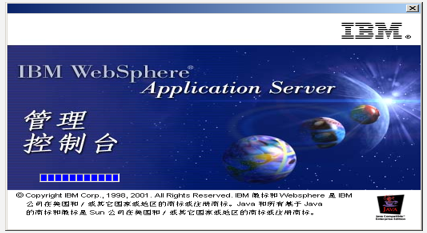 

+ Glass Fish 

  ​      最早是Sun公司的产品，后来被Oracle收购，开源免费，中型服务器。

+ JBoss

  ​      JBoss公司产品，开源，支持JavaEE规范，占用内存、硬盘小，安全性和性能高。

   

+ Tomcat    

  ​    中小型的应用系统，免费,开源,效率特别高, 适合扩展(搭集群)支持JSP和Servlet. 
  
   

  

## 2.2 tomcat介绍,安装和使用

#### 概述 	

​	Tomcat服务器是一个免费的开放源代码的Web应用服务器。

​	Tomcat是Apache软件基金会（Apache Software Foundation）的Jakarta项目中的一个核心项目，由Apache、Sun和其他一些公司及个人共同开发而成。由于有了Sun的参与和支持，最新的Servlet 和JSP规范总是能在Tomcat中得到体现。

​	因为Tomcat技术先进、性能稳定，而且免费，因而深受Java爱好者的喜爱并得到了部分软件开发商的认可，是目前比较流行的Web应用服务器。

#### tomcat的下载

1. **先去官网下载：http://tomcat.apache.org/，选择tomcat8版本（红框所示）**：

   

2. 选择要下载的文件（红框所示）：

   

    tar.gz 文件 是linux操作系统下的安装版本

    exe文件是window操作系统下的安装版本

    zip文件是window操作系统下压缩版本（我们选择zip文件）

   

3. **下载完成**：


#### tomcat服务器软件安装

1. **直接解压当前这个tomcat压缩包：(==不要有中文,不要有空格==)**

2. 配置环境变量：

   tomcat运行依赖于java环境：
   		

#### tomcat的目录结构

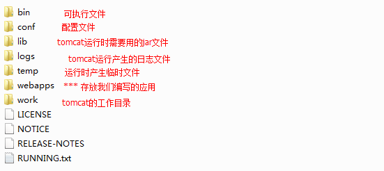

#### 启动与关闭tomcat服务器

1. 启动tomcat服务器

   查找tomcat目录下bin目录，查找其中的startup.bat命令，双击启动服务器：
   

   启动效果：
   

   

   

2. 测试访问tomcat服务器

   打开浏览器在，在浏览器的地址栏中输入：

   http://127.0.0.1:8080或者http://localhost:8080

   

   注： Localhost相当于127.0.0.1

3. 关闭tomcat服务器

   查找tomcat目录下bin目录，查找其中的shutdown.bat命令，双击关闭服务器：
   


## 2.3 tomcat常见问题

#### 安装注意点

+ 解压到一个==没有中文和空格==目录下
+ 使用之前, 配置java_home和path(jdk环境变量)
  + java_home 不要配到bin目录,配到jdk的安装目录
  + path 才是配到bin目录
  + jdk换成8,并且版本位数和Tomcat的版本位数一致
  + 如果java_home配置了还是闪退  忽略它了, 后面在IDEA里面进行启动, 就没有这个问题)


#### 端口号冲突  

​	报如下异常: java.net.BindException: Address already in use: JVM_Bind   8080

​	解决办法:

​	第一种:修改Tomcat的端口号   

​	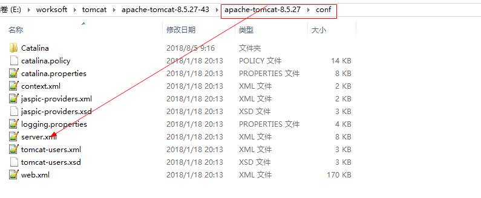

​		修改conf/server.xml ,  第70行左右

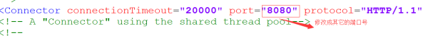

第二种:查询出来哪一个进程把8080占用了, 结束掉占用8080端口后的程序

​		打开命令行输入:  netstat -ano

​		找到占用了8080 端口的 进程的id

​		去任务管理器kill掉这个id对应的程序

​		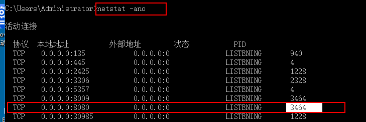

​		


## 2.4 运用Tomcat服务器部署WEB项目

#### 标准的JavaWeb应用目录结构

```java
  WebAPP(文件夹,项目)  
   		|---静态资源: html,css,js,图片(它们可以以文件存在,也可以以文件夹存在)  
   		|---WEB-INF 固定写法。此目录下的文件不能被外部(浏览器)直接访问
   			|---lib:jar包存放的目录
   			|---web.xml:当前项目的配置文件(3.0规范之后可以省略)
   			|---classes:java类编译后生成class文件存放的路径
```


#### 手动发布项目到tomcat

##### 2.2.1 方式一:直接发布

​	只要将准备好的web资源直接复制到tomcat/webapps文件夹下，就可以通过浏览器使用http协议访问获取

##### 2.2.2方式二: 虚拟路径的方式发布项目

1. 第一步：在tomcat/conf目录下新建一个Catalina目录（如果已经存在无需创建）


2. 第二步：在Catalina目录下创建localhost目录（如果已经存在无需创建）


3. 第三步：在localhost中创建xml配置文件，名称为：second（注：这个名称是浏览器访问路径）


4. 第四步：添加second.xml文件的内容为：  docBase就是你需要作为虚拟路径的项目的路径

   ```xml
   <?xml version = "1.0" encoding = "utf-8"?>
   <Context docBase="G:/myApp" />
   ```
   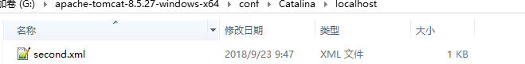

5. 第五步：直接访问(通过写配置文件的路径来访问):

   http://localhost:8080/second/a.html (second就是配置文件的名字, 映射成了myApp)


# 第三章-http协议

## 3.1 http协议概述

#### 什么是HTTP协议

- HTTP(Hyper Text Transfer Protocol)：超文本传输协议。
- HTTP 协议是基于 TCP/IP 协议的。
- 超文本：比普通文本更加强大。
- 传输协议：客户端和服务器端的通信规则(握手规则)。

- HTTP是互联网上用的最多的一个协议, 所有的www开头的都是遵循这个协议的(可能是https)

#### HTTP协议的作用

​	HTTP作用：用于定义WEB浏览器与WEB服务器之间==交换数据的过程==和数据本身的==内容\格式==

​	浏览器和服务器交互过程: 浏览器请求, 服务请求响应

​	请求(请求行,请求头,请求体)

​	响应(响应行,响应头,响应体)

 

## 3.2-请求部分

#### 抓包

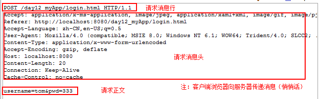

- get方式请求


```html
【请求行】
GET /myApp/success.html?username=zs&password=123456 HTTP/1.1

【请求头】
Accept: text/html, application/xhtml+xml, */*
X-HttpWatch-RID: 41723-10011
Referer: http://localhost:8080/myApp/login.html
Accept-Language: zh-Hans-CN,zh-Hans;q=0.5
User-Agent: Mozilla/5.0 (MSIE 9.0; qdesk 2.4.1266.203; Windows NT 6.3; WOW64; Trident/7.0; rv:11.0) like Gecko
Accept-Encoding: gzip, deflate
Host: localhost:8080
Connection: Keep-Alive
Cookie: Idea-b77ddca6=4bc282fe-febf-4fd1-b6c9-72e9e0f381e8
```

- post请求  

```html
【请求行】
POST /myApp/success.html HTTP/1.1

【请求头】
Accept: text/html, application/xhtml+xml, */*
X-HttpWatch-RID: 37569-10012
Referer: http://localhost:8080/myApp/login.html
Accept-Language: zh-Hans-CN,zh-Hans;q=0.5
User-Agent: Mozilla/5.0 (MSIE 9.0; qdesk 2.4.1266.203; Windows NT 6.3; WOW64; Trident/7.0; rv:11.0) like Gecko
Content-Type: application/x-www-form-urlencoded
Accept-Encoding: gzip, deflate
Host: localhost:8080
Content-Length: 27
Connection: Keep-Alive
Cache-Control: no-cache

【请求体】
username=zs&password=123456
```

#### 请求行

+ 请求行

```
GET  /myApp/success.html?username=zs&password=123456 HTTP/1.1	
POST /myApp/success.html HTTP/1.1
```

- 请求方式(8种,put,delete等)【面试】

  ​	GET:明文传输, 不安全,参数跟在请求路径后面,对请求参数大小有限制, 

  ​	POST: 暗文传输,安全一些,请求参数在请求体里,对请求参数大小没有有限制,

- URI:统一资源标识符（即：去掉协议和IP地址部分）

- 协议版本:HTTP/1.1

#### 请求头

​	请求头,以键值对的形式存在,但存在一个key对应多个值的请求头.

​	==作用:浏览器告诉服务器自己相关的设置.==

- Accept:浏览器可接受的MIME类型 ,告诉服务器客户端能接收什么样类型的文件。
- **User-Agent**:浏览器信息.(浏览器类型, 浏览器的版本....)
- Accept-Charset: 浏览器通过这个头告诉服务器，它支持哪种字符集
- Content-Length:表示请求参数的长度 
- Host:初始URL中的主机和端口 
- **Referer**:从哪里里来的(之前是哪个资源)----------防盗链  
- **Content-Type**:内容类型,告诉服务器,浏览器传输数据的MIME类型，文件传输的类型,application/x-www-form-urlencoded . 
- Accept-Encoding:浏览器能够进行解码的数据编码方式，比如gzip 
- Connection:表示是否需要持久连接。如果服务器看到这里的值为“Keep -Alive”，或者看到请求使用的是HTTP 1.1（HTTP 1.1默认进行持久连接 )
- **Cookie**:这是最重要的请求头信息之一(会话技术, 后面会有专门的时间来讲的)  
- Date：Date: Mon, 22Aug 2011 01:55:39 GMT请求时间GMT

#### 请求体

​	get方式没有请求体,只有post请求才有请求体. 即post请求时,请求参数(提交的数据)所在的位置


## 3.3 响应部分

#### 抓包

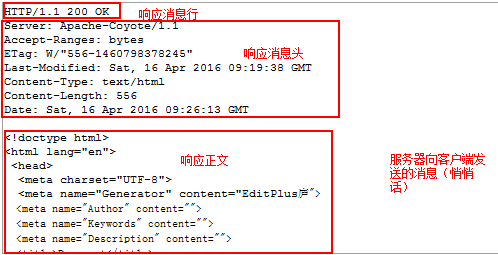

- 响应部分

  ```
  【响应行】
  HTTP/1.1 200
  
  【响应头】
  Accept-Ranges: bytes
  ETag: W/"143-1557909081579"
  Last-Modified: Wed, 15 May 2019 08:31:21 GMT
  Content-Type: text/html
  Content-Length: 143
  Date: Sun, 08 Dec 2019 02:20:04 GMT
  
  【响应体】
  <!DOCTYPE html>
  <html lang="en">
  <head>
      <meta charset="UTF-8">
      <title>Title</title>
  </head>
  <body>
      Success
  </body>
  </html>
  ```


#### 响应行 

```
HTTP/1.1 200
```

- 协议/版本

- ==响应状态码==  (记住-背诵下来)

  

  

  ​	200:正常,成功

  ​	302:重定向

  ​	304:表示客户机缓存的版本是最新的，客户机可以继续使用它，无需到服务器请求. 读取缓存  

  ​	404:客户端错误(一般是路径写错了,没有这个资源)

  ​	500:服务器内部错误

  


#### 响应头

响应头以key:vaue存在, 可能多个value情况. ==服务器指示浏览器去干什么,去配置什么.==

- **Location**: [http://www.it315.org/index.jsp指示新的资源的位置](http://www.it315.org/index.jsp%E6%8C%87%E7%A4%BA%E6%96%B0%E7%9A%84%E8%B5%84%E6%BA%90%E7%9A%84%E4%BD%8D%E7%BD%AE),通常和状态,码302一起使用，完成请求重定向
- **Content-Type**: text/html; charset=UTF-8; 设置服务器发送的内容的MIME类型,文件下载时候   


- **Refresh**: 5;url=http://www.baidu.com 指示客户端刷新频率。单位是秒  eg: 告诉浏览器5s之后跳转到百度


- **Content-Disposition**: attachment; filename=a.jpg  指示客户端(浏览器)下载文件 
- Content-Length:80 告诉浏览器正文的长度
- Server:apachetomcat 服务器的类型
- Content-Encoding: gzip服务器发送的数据采用的编码类型
- Set-Cookie:SS=Q0=5Lb_nQ;path=/search服务器端发送的Cookie
- Cache-Control: no-cache (1.1)  
- Pragma: no-cache  (1.0)  表示告诉客户端不要使用缓存
- Connection:close/Keep-Alive   
- Date:Tue, 11 Jul 2000 18:23:51 GMT

#### 响应体

​	页面展示内容, 和网页右键查看的源码一样


# 第四章-Servlet入门

## 4.1 Servlet概述

#### 什么是Servlet

- Servlet 是运行在 Java 服务器端的程序，用于接收和响应来自客户端基于 HTTP 协议的请求。

- 如果想实现 Servlet 的功能，可以通过实现 javax.servlet.Servlet 接口或者继承它的实现类。
- 核心方法：service()，任何客户端的请求都会经过该方法。

#### Servlet作用

​	用来处理客户端请求、响应给浏览器的动态资源。

​	但servlet的实质就是java代码，通过java的API动态的向客户端输出内容


## 4.2 使用IDEA创建web工程配置tomcat

#### idea配置tomcat

我们要将idea和tomcat集成到一起，可以通过idea就控制tomcat的启动和关闭：

 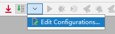

 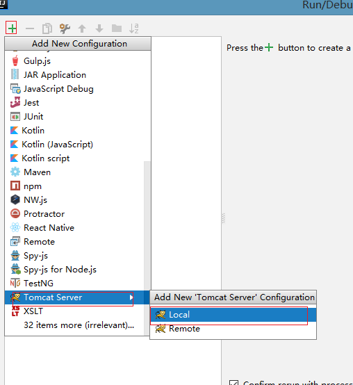


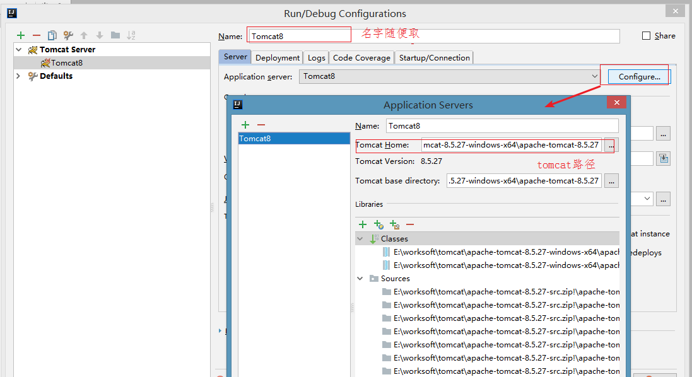 


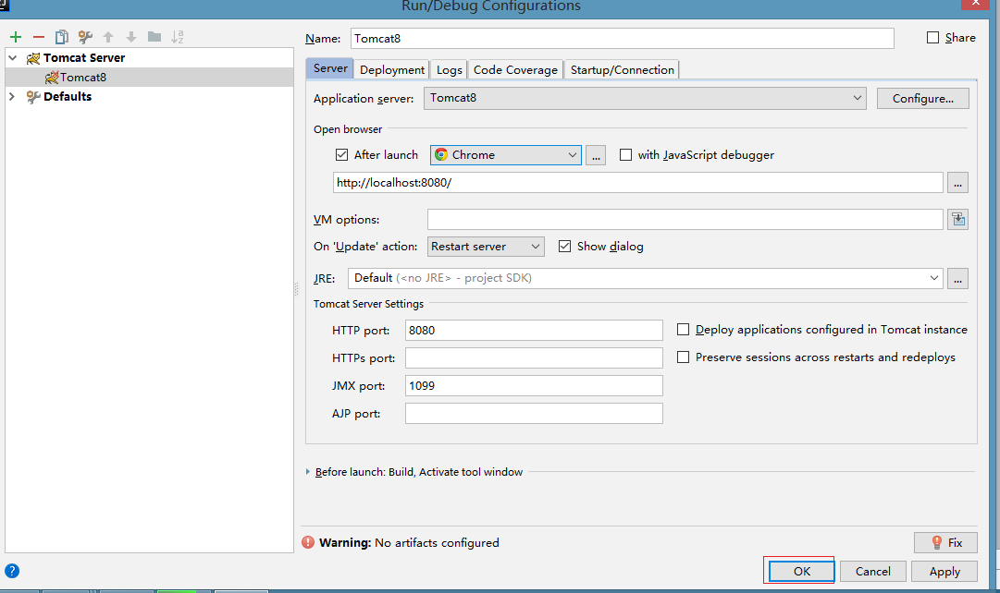


#### 创建JavaWeb工程

##### 2.2.1web工程创建

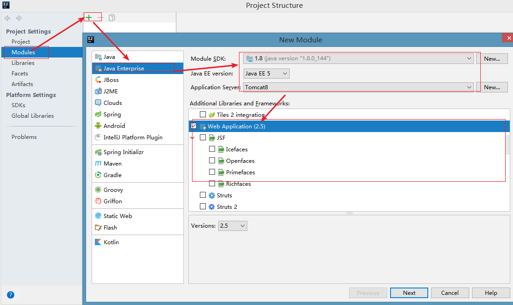

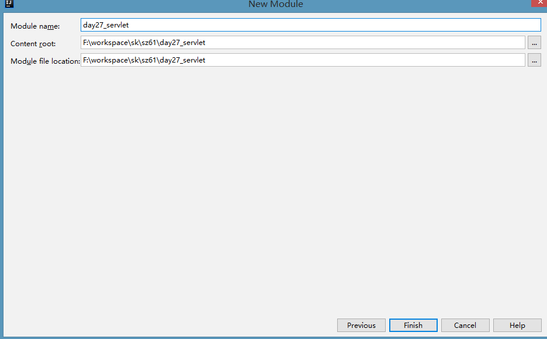

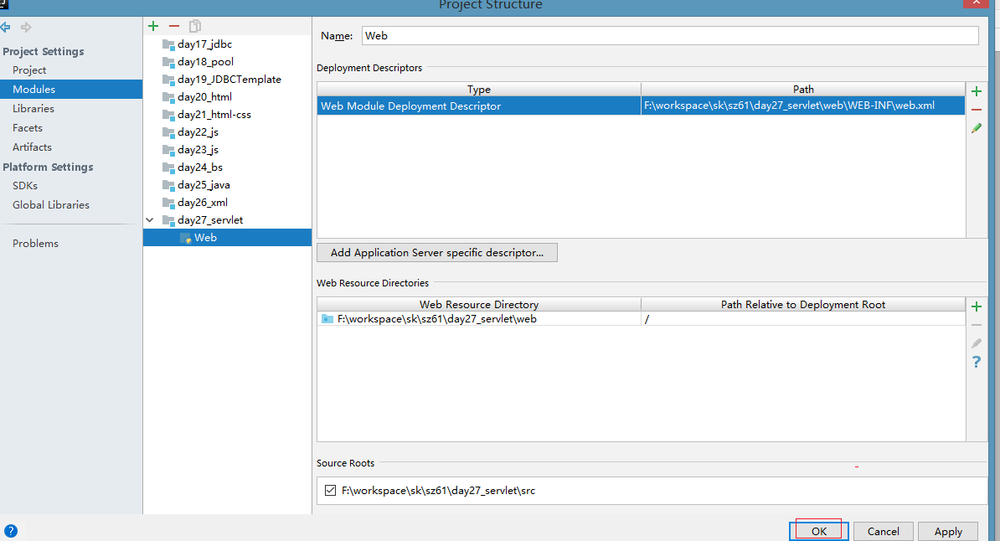


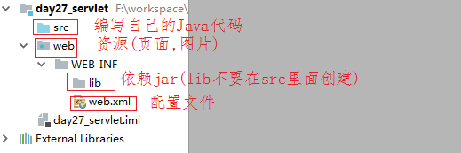

##### 发布

+ 情况一: 已经关联成功的情况(因为我创建项目的时候, 已经选择了tomcat)

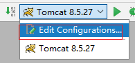 

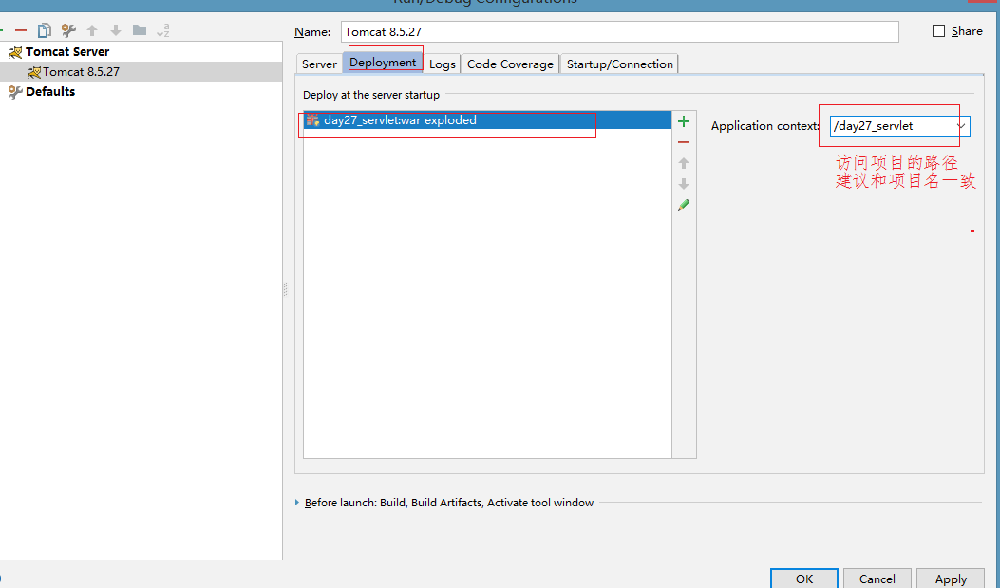

+ 情况二:  如果之前没有选择tomcat, 现在就需要自己关联发布

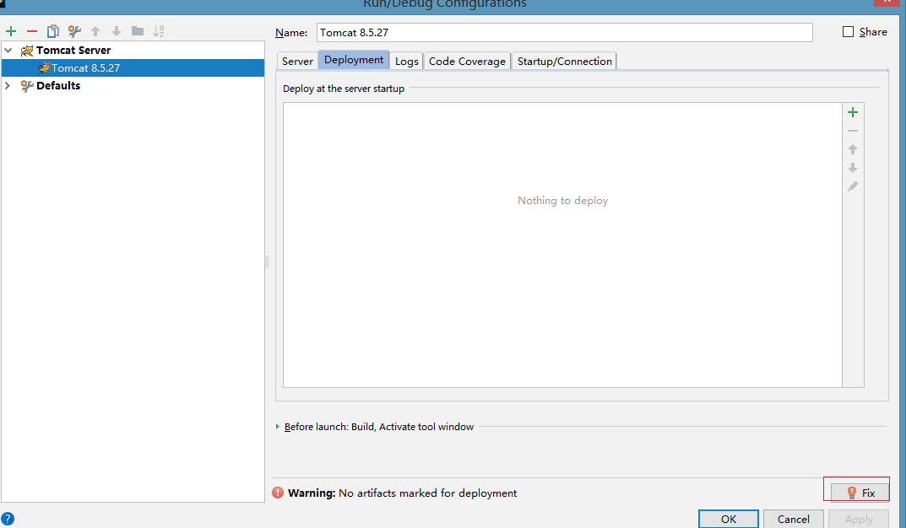

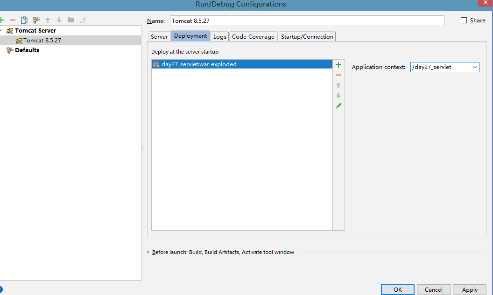

#### 小结

1. 配置tomcat(选择local)
2. 创建javaweb项目,选择Java Enterprise

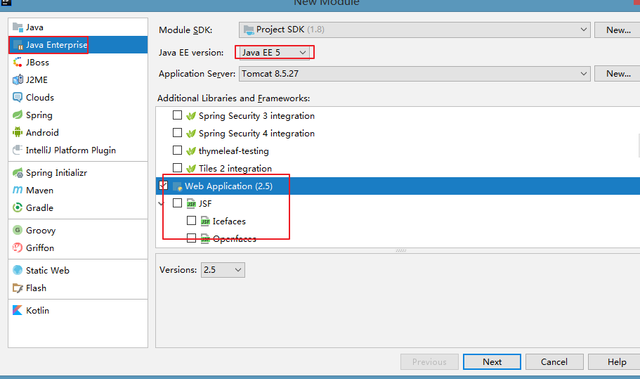 

3. 发布


4. 目录结构

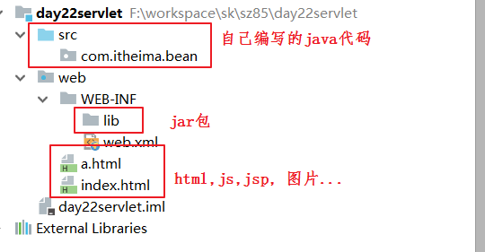 

 

## 4.3 Servlet入门案例

### 1.需求

​	在IDEA编写Servlet,发布到Tomcat. 在浏览器输入路径请求, 控制台打印Hello... 

### 2.分析   

#### 2.1配置文件方式实现

1. 创建web工程
2. 创建一个类实现Servlet接口
3. 在web.xml配置servlet参数


#### 2.2注解方式实现  

1. 创建web工程
2. 创建一个类实现Servlet接口
3. 在这个Servlet类上面添加@WebServlet("访问的路径")


### 3.实现  

#### 3.1配置文件方式实现  

+ 在com.itheima.web包下创建一个类实现Servlet接口

```java
package com.itheima.demo1_Servlet入门;

import javax.servlet.*;
import java.io.IOException;

/**
 * @Author：pengzhilin
 * @Date: 2021/5/3 12:17
 */
// 通过配置文件方式
public class ServletDemo1 implements Servlet {

    @Override
    public void service(ServletRequest servletRequest, ServletResponse servletResponse) throws ServletException, IOException {
        // 每次访问Servlet都会执行Servlet里面的service方法
        // eg:每次访问ServletDemo1就会来到这里
        System.out.println("ServletDemo1...");
    }


    @Override
    public void init(ServletConfig servletConfig) throws ServletException {

    }

    @Override
    public ServletConfig getServletConfig() {
        return null;
    }


    @Override
    public String getServletInfo() {
        return null;
    }

    @Override
    public void destroy() {

    }
}

```


+ web.xml配置（该文件在web/WEB-INF 文件夹下）：

```java
<?xml version="1.0" encoding="UTF-8"?>
<web-app xmlns="http://java.sun.com/xml/ns/javaee"
           xmlns:xsi="http://www.w3.org/2001/XMLSchema-instance"
           xsi:schemaLocation="http://java.sun.com/xml/ns/javaee
		  http://java.sun.com/xml/ns/javaee/web-app_2_5.xsd"
           version="2.5">
    <!--配置ServletDemo1的路径-->
    <servlet>
        <servlet-name>demo1</servlet-name>
        <servlet-class>com.itheima.demo1_Servlet入门.ServletDemo1</servlet-class>
    </servlet>
    <servlet-mapping>
        <servlet-name>demo1</servlet-name>
        <url-pattern>/demo1</url-pattern>
    </servlet-mapping>
</web-app>

```


#### 3.2注解方式实现

+ 在com.itheima.web包下创建一个类实现Servlet接口, 添加注解

```java
package com.itheima.demo1_Servlet入门;

import javax.servlet.*;
import javax.servlet.annotation.WebServlet;
import java.io.IOException;

/**
 * @Author：pengzhilin
 * @Date: 2021/5/3 12:25
 */
// 注解方式
@WebServlet("/demo2")
public class ServletDemo2 implements Servlet {

    @Override
    public void service(ServletRequest servletRequest, ServletResponse servletResponse) throws ServletException, IOException {
        System.out.println("ServletDemo2...");
    }

    @Override
    public void init(ServletConfig servletConfig) throws ServletException {

    }

    @Override
    public ServletConfig getServletConfig() {
        return null;
    }


    @Override
    public String getServletInfo() {
        return null;
    }

    @Override
    public void destroy() {

    }
}

```

配置tomcat服务器启动测试（配置过程之前已经展示，这里不再重复）

浏览器地址栏输入：http://localhost:8080/day27_servlet/demo02


### 4.小结

#### 4.1 如果出现实现Servlet报错

+ 检查当前的工程是否依赖了Tomcat

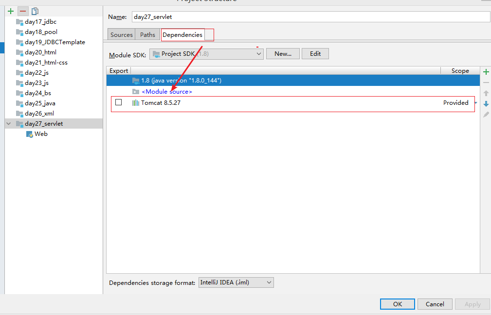

+ 如果没有依赖, 依赖tomcat

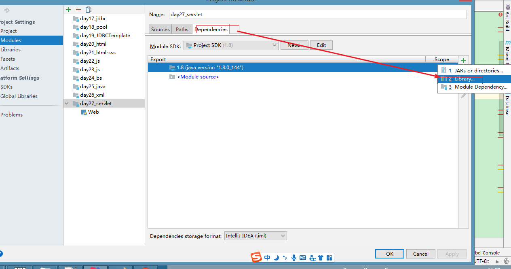

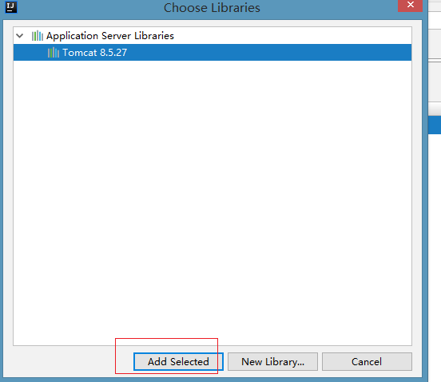 

#### 4.2配置文件方式与注解方式比较

​	注解方式简化的javaweb代码开发，可以省略web.xml配置文件. 

​	但是配置文件方式必须掌握的(后面在框架或者大项目里面会使用到的)  

#### 4.3步骤回顾

+ xml方式
  + 创建一个类实现Servlet接口
  + 在web.xml配置servlet
+ 注解方式
  + 创建一个类实现Servlet接口
  + 在类上面添加@WebServlet("访问的路径")


## 4.4 入门案例原理和路径

#### Servlet执行原理


通过上述流程图我们重点需要掌握如下几个点：

- **Servlet对象是由服务器创建(反射)**
- **request与response对象也是由tomcat服务器创建**
- **service()方法也是服务器调用的**


#### Servlet路径的配置url-pattern  

url-pattern配置方式共有三种: 

- **完全路径匹配:**  ==以 / 开始==.      注: 访问的路径不能多一个字母也不能少一个

```
例如: 配置了/demo01  请求的时候必须是: /demo01  
```

- **目录匹配**"==以 / 开始需要以 * 结束==.    注: Servlet里面用的 不多, 但是过滤器里面通常就使用目录匹配 

```
例如:  配置/*      访问:/a, /aa, /aaa;     配置 /aa/*     访问: /aa/b , /aa/cc,/aa/*
```

- **扩展名匹配**==不能以 / 开始, 以 * 开始的 .== 

```
例如:  *.action;  访问: aa.action, bb.action, c.action;   
错误写法: /*.do,  不可以写*.jsp,*.html
```

注意的地方:

- 一个路径只能对应一个servlet, 但是一个servlet可以有多个路径 


- tomcat获得匹配路径时，优先级顺序：完全路径匹配> 目录匹配 > 扩展名匹配 

#### 注意

1. 讲Servlet原理目的让大家对Servlet执行有一个深入认识, 只需要能懂就可以. 具体操作是服务器(创建servlet,执行service), ==你【重点】要做的就是写出Servlet==
2. 路径有多种方式, 一般用==**完全路径匹配**==  


# 第五章-Servlet进阶

## 5.1 Servlet的生命周期【重点】

#### 生命周期概述

​	一个对象从创建到销毁的过程

#### Servlet生命周期描述  

1. 常规【重点】

   ​	出生:默认情况下, 第一次访问Servlet的时候,服务器会创建Servlet对象, 会调用init()方法进行初始化【调用一次】

   ​	活着:任何一次访问, 都会调用service()方法处理这个请求

   ​	死亡: 服务器正常关闭或者项目从服务器移除, 调用destory()方法进行销毁【调用一次】

2. 扩展

   ​	servlet是单例多线程的, 尽量不要在servlet里面使用全局(成员)变量,可能会导致线程不安全

   ​	单例: 只有一个对象(init()调用一次, 创建一次)

   ​	多线程: 服务器会针对每次请求, 开启一个线程调用service()方法处理这个请求


#### ServletConfig【了解】

​	Servlet的配置对象, 可以使用ServletConfig来获得Servlet的初始化参数, ==在SpringMVC里面会遇到==

+ 先在配置文件里面配置初始化参数

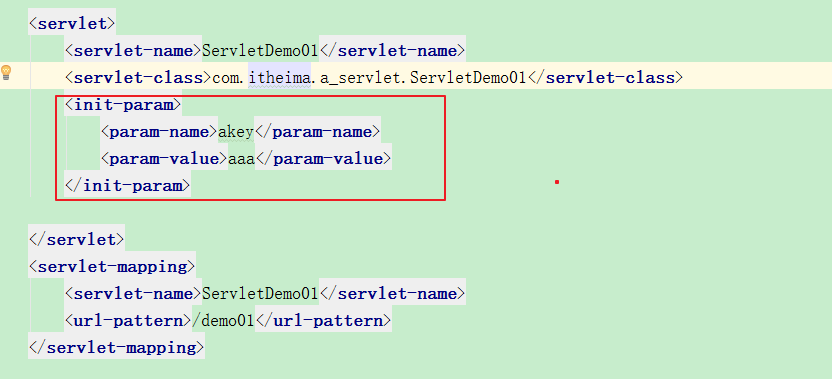

+ 获得配置文件中的初始化参数
  + `String getInitParameter(String name);`根据参数名称获取参数的值

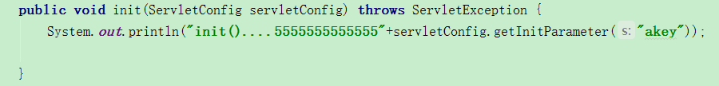

#### 启动项

​	Servlet默认情况下是第一次请求的时候创建.

​	如果我想让Servlet提前创建(服务器器的时候), 这个时候就可以使用启动项  ==在SpringMVC里面会遇到==


​	


## 5.2 Servlet体系结构

- Servlet接口

  ​	前面我们已经学会创建一个类实现sevlet接口的方式开发Servlet程序，实现Servlet接口的时候，我们必须实现接口的所有方法。但是，在servlet中，真正执行程序逻辑的是service，对于servlet的初始化和销毁，由服务器调用执行，开发者本身不需要关心。因此，有没有一种更加简洁的方式来开发servlet程序呢？

我们先来查阅API回顾Servlet接口：


​	由上图可知在servlet接口规范下，官方推荐使用继承的方式，继承GenericServlet 或者HttpServlet来实现接口，那么我们接下来再去查看一下这两个类的API：

- GenericServlet 类


​	阅读上图API可知，GenericServlet 是一个类，它简化了servlet的开发，已经提供好了一些servlet接口所需的方法，我们开发者只需要重写service方法即可

我们来使用GenericServlet 创建servlet：

1. 创建一个类
2. 继承GenericServlet
3. 重写service方法

```java
package cn.itcast.web;

import javax.servlet.GenericServlet;
import javax.servlet.ServletException;
import javax.servlet.ServletRequest;
import javax.servlet.ServletResponse;
import javax.servlet.annotation.WebServlet;
import java.io.IOException;

@WebServlet(name = "GenericDemoServlet",urlPatterns = "/generic")
public class GenericDemoServlet extends GenericServlet {
    @Override
    public void service(ServletRequest servletRequest, ServletResponse servletResponse) throws ServletException, IOException {
        System.out.println("GenericDemoServlet执行.......");
    }
}
```

​	虽然，GenericServlet已经简化了servlet开发，但是我们平时开发程序需要按照一种互联网传输数据的协议来开发程序——http协议，因此，sun公司又专门提供了HttpServlet，来适配这种协议下的开发。

- HttpServlet


阅读上图的API可知，继承HttpServlet，我们需要重写doGet、doPost等方法中一个即可，根据Http不同的请求，我们需要实现相应的方法。

我们来使用HttpServlet创建servlet：	

1. 创建一个类
2. 继承HttpServlet
3. 重写doGet方法

```java
package cn.itcast.web;

import javax.servlet.ServletException;
import javax.servlet.annotation.WebServlet;
import javax.servlet.http.HttpServlet;
import javax.servlet.http.HttpServletRequest;
import javax.servlet.http.HttpServletResponse;
import java.io.IOException;

@WebServlet(name = "HttpDemoServlet",urlPatterns = "/http")
public class HttpDemoServlet extends HttpServlet {
    @Override
    protected void doGet(HttpServletRequest req, HttpServletResponse resp) throws ServletException, IOException {
        System.out.println("HttpDemoServlet执行.......");
    }
}
```

​	通过以上两个API阅读，同学们注意一个细节HttpServlet是GenericServlet的子类，它增强了GenericServlet一些功能，因此，在后期使用的时候，我们都是选择继承HttpServlet来开发servlet程序。

1. 继承关系


2. 我们可以直接创建一个类继承HttpServlet, 直接在IDEA里面new Servlet

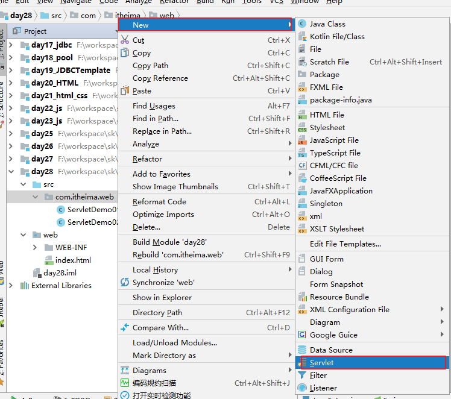


 


# 第六章-ServletContext

## 6.1 ServletContext概述

#### servletContext概述

​	ServletContext: 是一个全局上下文对象. 

​	服务器为每一个应用(项目)都创建了一个ServletContext对象。 ServletContext属于整个应用的，不局限于某个Servlet。 

#### ServletContext作用

​	作为域对象存取数据,让Servlet共享

​	获得文件MIME类型（文件下载）  

​	获得全局初始化参数

​	获取web资源路径  

## 6.2 ServletContext的功能

#### 域对象

- 域对象指的是对象有作用域。也就是有作用范围。域对象可以实现数据的共享。不同作用范围的域对象，共享数据的能力也不一样。
- ServletContext 就是其中的一个域对象。它也是 web 应用中最大的作用域，也叫 application 域。它可以实现整个应用之间的数据共享！

#### 作为域对象存取值【重点】


  

1. API

   + getAttribute(String name) ;向ServletContext对象的map取数据
   + setAttribute(String name, Object object) ;从ServletContext对象的map中添加数据
   + removeAttribute(String name) ;根据name去移除数据

2. 代码

   + ServletDemo12

     ```java
     
     @WebServlet("/demo12")
     public class ServletDemo12 extends HttpServlet {
         protected void doPost(HttpServletRequest request, HttpServletResponse response) throws ServletException, IOException {
             System.out.println("ServletDemo12...");
             // 1.获得ServletContext域对象
             ServletContext servletContext = getServletContext();
     
             // 2.设置键值对数据到ServletContext域对象中
             servletContext.setAttribute("bkey","bbb");
         }
    
         protected void doGet(HttpServletRequest request, HttpServletResponse response) throws ServletException, IOException {
          doPost(request, response);
         }
     }
     
     ```
   
   + ServletDemo06
   
     ```java
     
     @WebServlet("/demo13")
     public class ServletDemo13 extends HttpServlet {
      protected void doPost(HttpServletRequest request, HttpServletResponse response) throws ServletException, IOException {
             System.out.println("ServletDemo13...");
             // 1.获得ServletContext域对象
             ServletContext servletContext = getServletContext();
     
             // 2.通过ServletContext域对象取数据
             Object value = servletContext.getAttribute("bkey");
           System.out.println("value:"+value); // value: bbb
     
         }
     
         protected void doGet(HttpServletRequest request, HttpServletResponse response) throws ServletException, IOException {
             doPost(request, response);
         }
     }
     
     ```
     
   + ServletDemo14
   
     ```java
     @WebServlet("/demo14")
     public class ServletDemo14 extends HttpServlet {
             protected void doPost(HttpServletRequest request, HttpServletResponse response) throws ServletException, IOException {
                 System.out.println("ServletDemo14....");
                 // 1.获得ServletContext域对象
                 ServletContext servletContext = getServletContext();
     
                 // 2.通过ServletContext域对象删除数据
                 servletContext.removeAttribute("bkey");
             }
     
         protected void doGet(HttpServletRequest request, HttpServletResponse response) throws ServletException, IOException {
             doPost(request, response);
         }
     }
     
     ```
   
     


#### 获得文件mime类型

1. API 
   + getMimeType(String file) 
2. 代码

```java
protected void doGet(HttpServletRequest request, HttpServletResponse response) throws ServletException, IOException {
    //根据文件名获得文件的mini类型
    //1.获得ServletContext
    //2.调用getMimeType()方法
    String file01 = "a.mp3";
    String file02 = "b.png";
    String mimeType01 = getServletContext().getMimeType(file01);
    String mimeType02 = getServletContext().getMimeType(file02);

}
```


#### 获得全局初始化参数

- String getInitParameter(String name) ; //根据配置文件中的key得到value; 

在web.xml配置

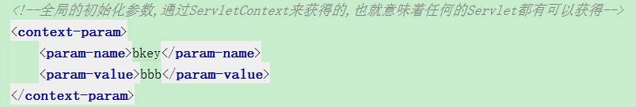

通过ServletContext来获得

 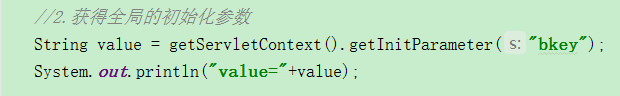

#### 获取web资源路径

1. API
   + String  getRealPath(String path);根据资源名称得到资源的绝对路径.
   + **getResourceAsStream(String path) ;返回制定路径文件的流**

>  注意: filepath:直接从项目的根目录开始写

2. 代码

```java
 protected void doPost(HttpServletRequest request, HttpServletResponse response) throws ServletException, IOException {
        // 获得文件MIME类型
        String fileName1 = "a.mp3";
        String fileName2 = "b.jpg";
        // getMimeType(String file)
        String f1MimeType = getServletContext().getMimeType(fileName1);
        String f2MimeType = getServletContext().getMimeType(fileName2);
        System.out.println("a.mp3文件的mime类型:"+f1MimeType);
        System.out.println("b.jpg文件的mime类型:"+f2MimeType);

        // 获得全局初始化参数: String getInitParameter(String name) ;
        System.out.println(getServletContext().getInitParameter("ckey"));// ccc

        // 获取web资源路径
        // web下面的itheima.txt的路径:
        // 错误绝对路径: G:\szitheima113\day23_servlet\web\itheima.txt
        // 正确绝对路径: G:\szitheima113\out\artifacts\day23_servlet_war_exploded\itheima.txt
        // - String  getRealPath(String path);根据资源名称得到资源的绝对路径.
        // getRealPath方法的路径已经到了web目录
        String realPath = getServletContext().getRealPath("itheima.txt");
        System.out.println("绝对路径:"+realPath);

        //- getResourceAsStream(String path) ;返回制定路径文件的流
        // getResourceAsStream方法的路径已经到了web目录
        InputStream is = getServletContext().getResourceAsStream("itheima.txt");
        System.out.println(is.read());// 97
    }
```


## 6.3 统计网站被访问的总次数

### 1.需求


- 在页面中显示您是第x位访问的用户.

### 2.思路分析

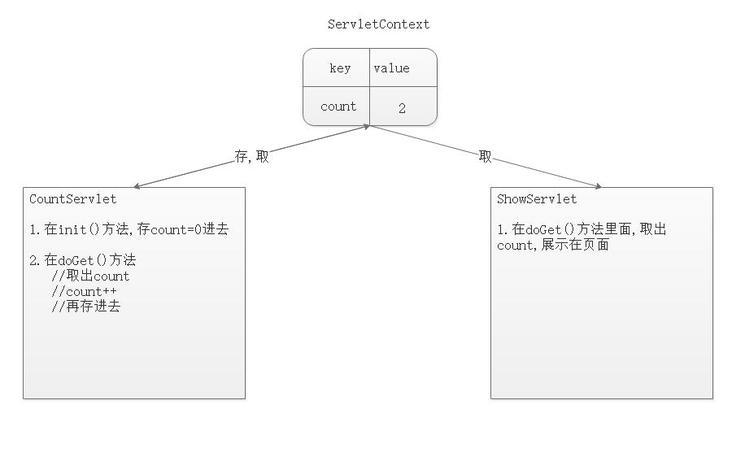 

- 在CountServlet的init方法里面，存储登录次数（0次）
- 在CountServlet的doGet()方法里面，取出值+1，再存储
- 在ShowServlet里面取出值展示

### 3.代码实现 

+ CountServlet

```java
package com.itheima.web;

import javax.servlet.ServletConfig;
import javax.servlet.ServletException;
import javax.servlet.annotation.WebServlet;
import javax.servlet.http.HttpServlet;
import javax.servlet.http.HttpServletRequest;
import javax.servlet.http.HttpServletResponse;
import java.io.IOException;


@WebServlet("/count")
public class CountServlet extends HttpServlet {

    @Override
    public void init(ServletConfig config) throws ServletException {
        super.init(config);
        //1.存 count = 0
        getServletContext().setAttribute("count",0);


    }

    protected void doGet(HttpServletRequest request, HttpServletResponse response) throws ServletException, IOException {
        //2. 取出count++
        int count = (int) getServletContext().getAttribute("count");
        count++;
        //3 .再存进去
        getServletContext().setAttribute("count",count);
        response.getWriter().print("<h1>Welcome</h1>");


    }

    protected void doPost(HttpServletRequest request, HttpServletResponse response) throws ServletException, IOException {
        doGet(request, response);
    }
}

```

+ ShowServlet

```java
package com.itheima.web;

import javax.servlet.ServletException;
import javax.servlet.annotation.WebServlet;
import javax.servlet.http.HttpServlet;
import javax.servlet.http.HttpServletRequest;
import javax.servlet.http.HttpServletResponse;
import java.io.IOException;

@WebServlet("/show")
public class ShowServlet extends HttpServlet {

    protected void doGet(HttpServletRequest request, HttpServletResponse response) throws ServletException, IOException {
       //处理响应乱码
        response.setContentType("text/html;charset=utf-8");

        //4.取出来展示
        int count = (int) getServletContext().getAttribute("count");
        response.getWriter().print("您是第"+count+"位访问的!");


    }

    protected void doPost(HttpServletRequest request, HttpServletResponse response) throws ServletException, IOException {
        doGet(request, response);
    }
}

```

### 4.小结

1. 注意事项: 
   + 存和取的时候 这个key要一致
   + CountServlet的init()方法里面的: super.init(config); 不要删

# 总结

```java
必须练习:
    1.Servlet的创建和访问----> 4.2,4.3 (idea中tomcat的配置,创建web项目,通过模板创建Servlet)
    2.Servlet的生命周期[记下来]
    3.ServletContext对象的使用---->6.2,6.3
    
- 能够理解软件的架构 
    C/S,B/S
- 能够理解WEB资源概念 
    静态资源:web页面中供人们浏览的数据始终是不变 (eg: html,css,js)
	动态资源:指web页面中供人们浏览的数据是由程序产生的，不同的用户或者不同时间点访问web页面看到的内容各不相同。(eg: servlet,jsp,asp,php)
        
- 能够理解WEB服务器
    服务器=硬件+软件
        
- 能够启动关闭Tomcat服务器 
     startup.bat \ shutdown.bat
        
- 能够运用Tomcat服务器部署WEB项目 
     webapp
        
- 能够使用idea编写servlet
      继承HttpServlet,重写doGet()\doPost()方法
        
- 能够使用idea配置tomcat方式发布项目
    
- 能够使用注解开发servlet
    @WebServlet("路径")
        
- 能够说出servlet生命周期方法执行流程
     init方法,第一次访问Servlet的时候执行,并且只执行一次
     service方法,每次访问都会执行一次
     destroy方法,结束服务器\项目移除的时候执行,并且只执行一次
        
- 能够使用Servletcontext对象
  	- 作为域对象存取数据
    - 获得文件mini类型（文件下载）
    - 获得全局初始化参数
    - 获取web资源路径

```

