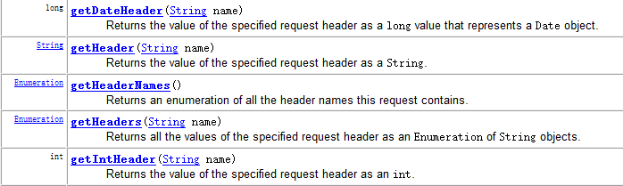
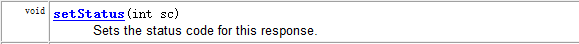
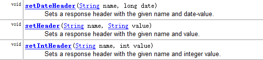
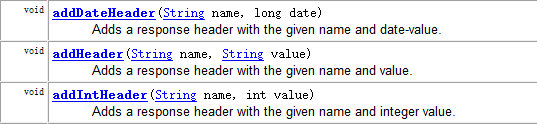
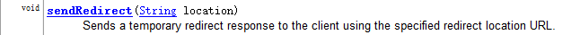
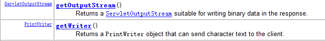
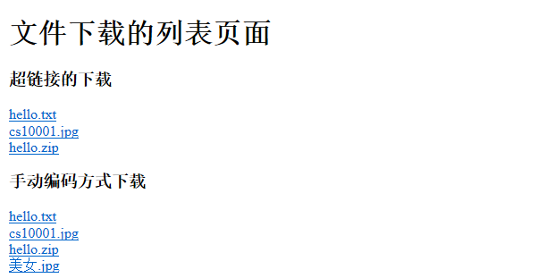
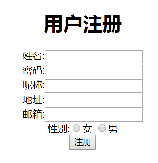
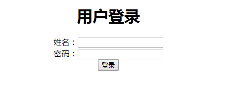

# day24-request&response

# 今日内容     

- request对象----------重点
  - 请求行
  - 请求头
  - 请求体
  - 作为域对象存取值
- response对象----------重点
  - 响应行
  - 响应头
  - 响应体
- 综合案例
  - 文件下载
  - 注册
  - 登录

# 第一章-request

## 1.1 request概述

#### 什么是request

    在Servlet API中，定义了一个HttpServletRequest接口，它继承自ServletRequest接口，专门用来封装HTTP请求消息。由于HTTP请求消息分为请求行、请求头和请求体三部分，因此，在HttpServletRequest接口中定义了获取请求行、请求头和请求消息体的相关方法.

​	

​	Web服务器收到客户端的http请求，会针对每一次请求，分别创建一个用于代表请求的request对象、和代表响应的response对象。

#### request作用

+ 操作请求三部分(行,头,体)
+ 请求转发
+ 作为域对象存数据    


## 1.2 操作请求行和请求头

#### 获取客户端信息(操作请求行)

​	请求方式  请求路径(URI)  协议版本

​	`GET  /day17Request/WEB01/register.htm?username=zs&password=123456   HTTP/1.1	`

- **getMethod()**;获取请求方式  

- **getRemoteAddr()** ；获取客户机的IP地址(知道是谁请求的)
- **getContextPath()**;获得当前应用工程名(部署的路径); **重点**
- **getRequestURI();获得请求地址，不带主机名**     
- **getRequestURL()；获得请求地址，带主机名** 
- getServerPort()；获得服务端的端口     
- getQueryString()；获的请求参数(get请求的,URL的?后面的. eg:username=zs&password=123456)

- html代码

  ```html
  <body>
  <!--在index中访问ServletDemo1: 可以通过表单标签的action属性或者超链接标签的href属性-->
  <!--相对路径:相对于当前页面路径而言的,当前路径./,上一层路径../-->
  <!--相对路径的写法套路: 你把2个页面的绝对路径写出来,省略公共部分-->
  <!--绝对路径:以http开头,包含ip地址和端口号的-->
  <!--<a href="aa/a.html">相对路径进入a.html</a>-->
  <!--<a href="http://localhost:8080/day24/aa/a.html">绝对路径进入a.html</a>-->
  
  <a href="http://localhost:8080/day24/ServletDemo1">绝对路径访问ServletDemo1(操作请求行)</a><br/>
  <a href="ServletDemo1?username=itheima&password=123456">相对路径访问ServletDemo1(操作请求行)</a><br/>
  
  
  </body>
  ```
  
  
  
- ServletDemo1代码

  ```java
  package com.itheima.demo1_操作请求行;
  
  import javax.servlet.ServletException;
  import javax.servlet.annotation.WebServlet;
  import javax.servlet.http.HttpServlet;
  import javax.servlet.http.HttpServletRequest;
  import javax.servlet.http.HttpServletResponse;
  import java.io.IOException;
  
  /**
   * @Author：pengzhilin
   * @Date: 2021/5/5 9:03
   */
  @WebServlet("/ServletDemo1")
  public class ServletDemo1 extends HttpServlet {
      protected void doPost(HttpServletRequest request, HttpServletResponse response) throws ServletException, IOException {
          //- getMethod();获取请求方式
          System.out.println("请求方式:"+request.getMethod());
  
          //- getRemoteAddr() ；获取客户机的IP地址(知道是谁请求的)
          System.out.println("客户机的IP地址:"+request.getRemoteAddr());
  
          //- getContextPath();获得当前应用工程名(部署的路径); 重点
          System.out.println("项目部署的路径:"+request.getContextPath());
  
          //- getRequestURI();获得请求地址，不带主机名
          System.out.println("请求地址，不带主机名:"+request.getRequestURI());
  
          //- getRequestURL()；获得请求地址，带主机名
          System.out.println("请求地址，带主机名:"+request.getRequestURL());
  
          //- getServerPort()；获得服务端的端口
        System.out.println("服务端的端口:"+request.getServerPort());
  
          //- getQueryString()；获的请求参数(get请求的,URL的?后面的. eg:username=zs&password=123456)
          System.out.println("请求参数:"+request.getQueryString());
  
      }
  
      protected void doGet(HttpServletRequest request, HttpServletResponse response) throws ServletException, IOException {
          doPost(request, response);
      }
  }
  
  ```
  
  

#### 获得请求头信息(操作请求头)

请求头: 浏览器告诉服务器自己的属性,配置的, 以key value存在, 可能一个key对应多个value




​	==**getHeader(String name);**==

- User-Agent: 浏览器信息
- Referer:来自哪个网站(防盗链)

- html代码

  ```html
  <a href="ServletDemo2">访问ServletDemo2(操作请求头)</a>
  ```

  

- ServletDemo2代码

  ```java
  
  /**
   * @Author：pengzhilin
   * @Date: 2021/5/5 9:44
   */
  @WebServlet("/ServletDemo2")
  public class ServletDemo2 extends HttpServlet {
      protected void doPost(HttpServletRequest request, HttpServletResponse response) throws ServletException, IOException {
          // 获得浏览器的版本信息
          String userAgent = request.getHeader("User-Agent");
          System.out.println("浏览器信息: " + userAgent);
          // 作用
          if (userAgent.contains("Firefox")){
              // 火狐的浏览器--->中文就需要进行Base64编码
  
          }else{
              // 其他浏览器----->URL编码(utf-8)
          }
  
          // 获得访问来源路径--->防盗链
          String referer = request.getHeader("Referer");
          System.out.println("获得访问来源路径:" + referer);
  
          // 作用
          if (referer.contains("baidu.com")) {
              // 给你图片
          } else {
              // 不给你图片
          }
  
      }
  
      protected void doGet(HttpServletRequest request, HttpServletResponse response) throws ServletException, IOException {
          doPost(request, response);
      }
  }
  
  ```


## 1.3 操作请求体(获得请求参数)【重点】

#### 获得请求参数

```java
String getParameter(String name)
获得指定参数名对应的值。如果没有则返回null，如果有多个获得第一个。  例如：username=jack

String[] getParameterValues(String name)
获得指定参数名对应的所有的值。此方法专业为复选框提供的。  例如：hobby=抽烟&hobby=喝酒&hobby=敲代码

Map<String,String[]> getParameterMap();
获得所有的请求参数。key为参数名,value为key对应的所有的值。
```

```html
<form action="ServletDemo3" method="post">
    用户名:<input type="text" name="username"><br/>
    密码:<input type="password" name="password"><br/>
    爱好:
        <input type="checkbox" name="hobby" value="basketball">篮球
        <input type="checkbox" name="hobby" value="football">足球
        <input type="checkbox" name="hobby" value="code">敲代码<br/>
    <input type="submit">
</form>
```

```java

/**
 * @Author：pengzhilin
 * @Date: 2021/5/5 9:56
 */
@WebServlet("/ServletDemo3")
public class ServletDemo3 extends HttpServlet {
    protected void doPost(HttpServletRequest request, HttpServletResponse response) throws ServletException, IOException {
        // 获得用户名
        String username = request.getParameter("username");
        String password = request.getParameter("password");

        // 获得爱好
        String[] hobbies = request.getParameterValues("hobby");
        String hobby = Arrays.toString(hobbies);

        System.out.println("用户输入的用户名:"+username);
        System.out.println("用户输入的密码:"+password);
        System.out.println("用户选择的爱好:"+hobby);
        System.out.println("------------------");

        // 获取所有提交的请求参数
        Map<String, String[]> map = request.getParameterMap();
        for (String key : map.keySet()) {
            String[] valueArr = map.get(key);
            System.out.println(key+"..."+Arrays.toString(valueArr));
        }

    }

    protected void doGet(HttpServletRequest request, HttpServletResponse response) throws ServletException, IOException {
        doPost(request, response);
    }
}

```


####  请求参数乱码处理

​	我们在输入一些中文数据提交给服务器的时候，服务器解析显示出来的一堆无意义的字符，就是乱码。
那么这个乱码是如何出现的呢？如下图所示：

 

1. get方式, 我们现在使用的tomcat>=8.0了, 乱码tomcat已经处理好了
2. post方式, 就需要自己处理

```java
请求对象;
void setCharacterEncoding(String env); //设置请求体的编码
```


#### 使用BeanUtils封装

​	现在我们已经可以使用request对象来获取请求参数，但是，如果参数过多，我们就需要将数据封装到对象。

​	以前封装数据的时候，实体类有多少个字段，我们就需要手动编码调用多少次setXXX方法，因此，我们需要BeanUtils来解决这个问题。

​	BeanUtils是Apache Commons组件的成员之一，主要用于==**简化JavaBean封装数据**==的操作。

使用步骤:

1. 导入jar
2. 使用BeanUtils.populate(对象,map)

+ 表单

```html
<form action="ServletDemo3" method="post">
    用户名:<input type="text" name="username"><br/>
    密码:<input type="password" name="password"><br/>
    爱好:
        <input type="checkbox" name="hobby" value="basketball">篮球
        <input type="checkbox" name="hobby" value="football">足球
        <input type="checkbox" name="hobby" value="code">敲代码<br/>
        <input type="submit">
</form>
```

+ ServletDemo03

```java

/**
 * @Author：pengzhilin
 * @Date: 2021/5/5 9:56
 */
@WebServlet("/ServletDemo3")
public class ServletDemo3 extends HttpServlet {
    protected void doPost(HttpServletRequest request, HttpServletResponse response) throws ServletException, IOException {
        // 处理请求乱码
        request.setCharacterEncoding("utf-8");

        // 获得用户名
        String username = request.getParameter("username");
        String password = request.getParameter("password");

        // 获得爱好
        String[] hobbies = request.getParameterValues("hobby");
        String hobby = Arrays.toString(hobbies);// []

        System.out.println("用户输入的用户名:"+username);
        System.out.println("用户输入的密码:"+password);
        System.out.println("用户选择的爱好:"+hobby);
        System.out.println("------------------");

        // 获取所有提交的请求参数-->eg: {username=[zs],password=[123],hobby=[basketball,football]}
        Map<String, String[]> map = request.getParameterMap();
        for (String key : map.keySet()) {
            String[] valueArr = map.get(key);
            System.out.println(key+"..."+Arrays.toString(valueArr));
        }

        System.out.println("=============使用BeanUtils封装数据=====================");
        try {
            // 创建User对象(空参构造)
            User user = new User();

            // 使用BeanUtils.populate(对象,map);
            BeanUtils.populate(user,map); 
            // 重新手动给hobby属性赋值---->覆盖之前赋的值
            user.setHobby(hobby.substring(1,hobby.length()-1));

            // 打印user对象
            System.out.println("user:"+user);

        } catch (Exception e) {
            e.printStackTrace();
        }


    }

    protected void doGet(HttpServletRequest request, HttpServletResponse response) throws ServletException, IOException {
        doPost(request, response);
    }
}

```

+ 如果请求参数有多个需要封装到JavaBean里面, 建议先获得Map, 再使用BeanUtils封装到JavaBean对象

> 注意: JavaBean属性需要和Map的key一致 说白了也就是JavaBean属性需要和表单的name一致


## 1.4 请求转发【重点】

- **使用方式:**

  ```java
  request.getRequestDispatcher("url").forward(request, response);  //转发
  ```

- **特点:**

  - 请求路径不会变化
  - 一次请求
  - 路径写相对路径,不要写绝对路径
  - 转发只能转发到当前项目的资源,不能转发到外部资源
  - 可以转发到WEB-INF里面的资源

- html

  ```java
  <a href="ServletDemo4">访问ServletDemo4(转发到ServletDemo5)</a>
  ```
  
- Servlet

  - ServletDemo4

    ```java
    @WebServlet("/ServletDemo4")
    public class ServletDemo4 extends HttpServlet {
        protected void doPost(HttpServletRequest request, HttpServletResponse response) throws ServletException, IOException {
            System.out.println("李四:张三你等会,我的钱在银行,我去给你取...");
            // 找李四的媳妇
            // 转发的路径: 写相对路径,不要写绝对路径
            //request.getRequestDispatcher("http://localhost:8080/day24/ServletDemo5").forward(request,response);// 报错
            //request.getRequestDispatcher("ServletDemo5").forward(request,response);// 正确
    
            // 请求转发的路径只能写相对路径,不能写绝对路径
            // 请求转发地址栏不会变
            // 请求转发只有1次请求
            // 请求转发只能转发到本项目中的资源,不能转发到外部项目资源
            //request.getRequestDispatcher("http://www.baidu.com").forward(request,response);// 报错
            //request.getRequestDispatcher("aa/a.html").forward(request,response);// 正确
    
            // 请求转发到WEB-INF路径下的资源
            request.getRequestDispatcher("WEB-INF/b.html").forward(request,response);
        }
    
        protected void doGet(HttpServletRequest request, HttpServletResponse response) throws ServletException, IOException {
            doPost(request, response);
        }
    }
    
    ```
    
  - ServletDemo5
  
    ```java
    /**
     * @Author：pengzhilin
     * @Date: 2021/5/5 11:01
     */
    @WebServlet("/ServletDemo5")
    public class ServletDemo5 extends HttpServlet {
        protected void doPost(HttpServletRequest request, HttpServletResponse response) throws ServletException, IOException {
            System.out.println("李四的媳妇...");
            // 给钱响应到页面
            response.getWriter().print("money:18000");
        }
    
        protected void doGet(HttpServletRequest request, HttpServletResponse response) throws ServletException, IOException {
            doPost(request, response);
        }
    }
    
    ```
    

## 1.5 作为域对象存取值

​	ServletContext: 范围 整个应用(无论多少次请求,只要是这个**应用里面的都是可以==共享==的**)

​	**request范围: 一次请求有效**  

​	域对象是一个容器，这种容器主要用于Servlet与Servlet/JSP之间的数据传输使用的。

- Object getAttribute(String name) ;
- void setAttribute(String name,Object object)  ;
- void removeAttribute(String name)  ;


```java
@WebServlet("/ServletDemo6")
public class ServletDemo6 extends HttpServlet {
    protected void doPost(HttpServletRequest request, HttpServletResponse response) throws ServletException, IOException {
        System.out.println("ServletDemo6...");
        // 存值
        request.setAttribute("akey","aaa");

        // 请求转发1次请求-->可以使用request域对象进行页面之间的传值
        request.getRequestDispatcher("ServletDemo7").forward(request,response);
    }

    protected void doGet(HttpServletRequest request, HttpServletResponse response) throws ServletException, IOException {
        doPost(request, response);
    }
}

```


```java
@WebServlet("/ServletDemo7")
public class ServletDemo7 extends HttpServlet {
    protected void doPost(HttpServletRequest request, HttpServletResponse response) throws ServletException, IOException {
        System.out.println("ServletDemo7...");
        // 取值
        System.out.println("akey的值: "+request.getAttribute("akey"));

    }

    protected void doGet(HttpServletRequest request, HttpServletResponse response) throws ServletException, IOException {
        doPost(request, response);
    }
}

```


# 第二章-Response

## 2.1 Response概述

#### HttpServletResponse概述

​	在Servlet API中，定义了一个HttpServletResponse接口(doGet,doPost方法的参数)，它继承自ServletResponse接口，专门用来封装HTTP响应消息。由于HTTP响应消息分为响应行、响应头、响应体三部分，因此，在HttpServletResponse接口中定义了向客户端发送响应状态码、响应头、响应体的方法

#### 作用

+ 操作响应的三部分(响应行,响应头,响应体)


## 2.2 操作响应行

#### 介绍

```
HTTP/1.1 200
```


​	

​	常用的状态码：(必须记忆)

​		200：成功

​		**302：重定向**

​		304：访问缓存

​		404：客户端错误

​		500：服务器错误

#### 总结

1. 设置的API:  response.setStatus(int code);  

2. 一般不需要设置状态码, 可能302 重定向需要设置

3. 常见的响应状态码

   + 200 成功
   + 302 重定向
   + 304 读缓存
   + 404 客户端错误
   + 500 服务器错误

   


## 2.3 操作响应头

#### 操作响应头的API

响应头: 是服务器指示浏览器去做什么

​	一个key对应一个value

​		

​	一个key对应多个value

​		

  关注的方法: ==**setHeader(String name,String value);**==

​	常用的响应头 

​		Refresh:定时跳转 (eg:服务器告诉浏览器5s之后跳转到百度)

​		Location:重定向地址(eg: 服务器告诉浏览器重定向到xxx)

​		Content-Disposition: 告诉浏览器下载

​		Content-Type：设置响应内容的MIME类型(服务器告诉浏览器内容的类型) 

#### 定时刷新

- ServletDemo8

  ```java
  /**
   * @Author：pengzhilin
   * @Date: 2021/5/4 11:51
   */
  @WebServlet("/ServletDemo8")
  public class ServletDemo8 extends HttpServlet {
      protected void doPost(HttpServletRequest request, HttpServletResponse response) throws ServletException, IOException {
          System.out.println("ServletDemo8...");
          response.setHeader("Refresh","http://www.itcast.cn");
      }
  
      protected void doGet(HttpServletRequest request, HttpServletResponse response) throws ServletException, IOException {
          doPost(request, response);
      }
  }

  ```
  
  

#### 重定向【重点】





1. 重定向两次请求
2. 重定向的地址栏路径改变
3. 重定向的路径写绝对路径(带域名/ip地址的, 如果是同一个项目里面的,域名/ip地址可以省略)
4. 重定向的路径可以是项目内部的,也可以是项目以外的(eg:百度)
5. 重定向不能重定向到WEB-INF下的资源
6. 把数据存到request里面, 重定向不可用

```java

/**
 * @Author：pengzhilin
 * @Date: 2021/5/5 11:53
 */
@WebServlet("/ServletDemo9")
public class ServletDemo9 extends HttpServlet {
    protected void doPost(HttpServletRequest request, HttpServletResponse response) throws ServletException, IOException {
        System.out.println("ServletDemo9...");
        // 重定向:方式一
        // response.setStatus(302);
        // response.setHeader("Location","http://www.itcast.cn");

        // 重定向: 方式二
        //response.sendRedirect("http://www.itcast.cn");

        // 重定向的路径: 相对路径
        //response.sendRedirect("index.html");
        // 重定向的路径: 绝对路径
        //response.sendRedirect("http://localhost:8080/day24/index.html");
        // 使用绝对路径访问内部项目中的资源可以省略http,ip地址,端口号
        response.sendRedirect("/day24/index.html");// 绝对路径

        // 重定向到WEB-INF下的资源
        //response.sendRedirect("http://localhost:8080/day24/WEB-INF/b.html");// 报错,不可以


        /*
            重定向和转发的区别:
                1.重定向的路径是会改变的,请求转发的路径是不会改变的
                2.重定向是2次请求,请求转发是1次请求
                3.重定向写绝对路径(也可以写相对路径),请求转发只能写相对路径
                4.重定向可以重定向到当前项目资源,也可以外部项目资源,请求转发只能转发到当前项目资源
                5.把数据存到request里面, 重定向不可用,请求转发可以用
                6.重定向不可以转发到WEB-INF下面的资源,请求转发可以转发到WEB-INF下面的资源
         */
    }

    protected void doGet(HttpServletRequest request, HttpServletResponse response) throws ServletException, IOException {
        doPost(request, response);
    }
}

```

#### 转发和重定向区别【面试】

1. 转发是一次请求, 重定向是二次请求
2. 转发的路径不会改变,重定向的路径会改变
3. 转发只能转发到项目的内部资源,重定向可以重定向到项目的内部资源, 也可以是项目外部资源(eg:百度)
4. 转发可以转发到WEB-INF下面的资源, 重定向不可以重定向到WEB-INF下面的资源
5. 把数据存到request里面,转发有效, 重定向无效
6. 转发的路径写相对的(不带http,不带ip,不带项目名), 重定向的路径写绝对的(带http,带ip,带项目名),重定向到内部项目,可以省略http,ip地址,端口号


## 2.4 操作响应体

#### 操作响应体的API

​	

​	

	- 页面输出只能使用其中的一个流实现,两个流是互斥的.
	- 流可以写文本,也可以写HTML代码

​	

#### 响应乱码处理

- 为什么会出现乱码?

  + 服务器默认是iso8859-1编码,不支持中文
  + 编码和解码不一致
  
- ServletDemo10--->字节流

  ```java
  
  /**
   * @Author：pengzhilin
   * @Date: 2021/5/5 12:11
   */
  @WebServlet("/ServletDemo10")
  public class ServletDemo10 extends HttpServlet {
      protected void doPost(HttpServletRequest request, HttpServletResponse response) throws ServletException, IOException {
          //设置浏览器打开方式
          response.setHeader("Content-type", "text/html;charset=utf-8");
  
          // 操作响应体--->字节流
          response.getOutputStream().write("ServletDemo10...".getBytes());
          response.getOutputStream().write("ServletDemo10操作响应体...".getBytes("utf-8"));
  
      }
  
      protected void doGet(HttpServletRequest request, HttpServletResponse response) throws ServletException, IOException {
          doPost(request, response);
      }
  }
  
  ```
  
  
  
- ServletDemo11----字符流

  ```java
  
  /**
   * @Author：pengzhilin
   * @Date: 2021/5/5 12:11
   */
  @WebServlet("/ServletDemo11")
  public class ServletDemo11 extends HttpServlet {
      protected void doPost(HttpServletRequest request, HttpServletResponse response) throws ServletException, IOException {
          // 解决乱码问题(原因: 服务器的编码和浏览器的解码不一致导致)
          // 方式一:
          // 设置服务器编码的编码
          // response.setCharacterEncoding("utf-8");
          // 设置浏览器解码的编码
          // response.setHeader("Content-Type","text/html; charset=utf-8");
  
          // 方式二:
          //response.setContentType("text/html; charset=utf-8");
  
          // 1.处理乱码 ---->设置模板
          request.setCharacterEncoding("utf-8");
          response.setContentType("text/html;charset=utf-8");
  
          // 操作响应体--->字符流
          response.getWriter().print("<h1>ServletDemo11...</h1>");
          response.getWriter().print("<font size='7' color='red'>ServletDemo11...</font>");
          response.getWriter().print("<h1>ServletDemo11操作响应体...</h1>");
  
      }
  
      protected void doGet(HttpServletRequest request, HttpServletResponse response) throws ServletException, IOException {
          doPost(request, response);
      }
  }
  
  ```

- 解决字符流输出中文乱码问题

```java
方式一:
	 response.setCharacterEncoding("utf-8");
     response.setHeader("Content-type","text/html;charset=utf-8");

方式二: 推荐
	response.setContentType("text/html;charset=utf-8");
```

- 使用字节输出流输出中文乱码问题【了解】

```java
//设置浏览器打开方式
response.setHeader("Content-type", "text/html;charset=utf-8");
//得到字节输出流
ServletOutputStream outputStream = response.getOutputStream();
outputStream.write("你好".getBytes("utf-8"));// 使用平台的默认字符(utf-8)集将此 String 编码为 byte 序列
```


## 案例-完成文件下载 ##

### 1.需求分析

- 创建文件下载的列表的页面,点击列表中的某些链接,下载文件.



### 2.文件下载分析

#### 2.1什么是文件下载

​	将服务器上已经存在的文件,输出到客户端浏览器.

​	说白了就是把服务器端的文件拷贝一份到客户端, 文件的拷贝---> 流(输入流和输出流)的拷贝

#### 2.2文件下载的方式

+ 第一种:超链接方式（不推荐） 

  链接的方式：直接将服务器上的文件的路径写到href属性中.如果浏览器不支持该格式文件,那么就会提示进行下载, 如果	浏览器支持这个格式(eg: png, jpg....)的文件,那么直接打开,不再下载了

+ 第二种:手动编码方式（推荐）  

  手动编写代码实现下载.无论浏览器是否识别该格式的文件,都会下载.


### 3.思路分析 ###

#### 3.1超链接方式

1. 准备下载的资源(文件)
2. 编写一个下载页面
3. 在这个页面上定义超链接,指定href

#### 3.2编码方式

##### 3.2.1手动编码方式要求

​	设置一个流和两个头

​	设置一个流：

    		 获得要下载的文件的输入流.

​	设置的两个头:

​	    	Content-Type: 告诉浏览器文件类型.(MIME的类型)  

    		Content-Disposition: 服务器告诉浏览器去下载


##### 3.2.2思路


### 4.代码实现 ###

- html

  ```html
  <h1>超链接方式下载文件</h1>
  <a href="download/b.jpg">b.jpg</a><br/>
  <a href="download/itheima.txt">itheima.txt</a><br/>
  <a href="download/itcast.zip">itcast.zip</a><br/>
  <h1>手动编码方式下载文件</h1>
  <a href="ServletDemo12?fileName=b.jpg">b.jpg</a><br/>
  <a href="ServletDemo12?fileName=itheima.txt">itheima.txt</a><br/>
  <a href="ServletDemo12?fileName=itcast.zip">itcast.zip</a><br/>
  ```

  

- ServletDemo12

```java

/**
 * @Author：pengzhilin
 * @Date: 2021/5/5 14:53
 */
@WebServlet("/ServletDemo12")
public class ServletDemo12 extends HttpServlet {
    protected void doPost(HttpServletRequest request, HttpServletResponse response) throws ServletException, IOException {
        System.out.println("开始下载文件...");
        //1.处理请求和响应乱码
        request.setCharacterEncoding("utf-8");
        response.setContentType("text/html;charset=utf-8");

        //2.获得请求参数(文件名)
        String fileName = request.getParameter("fileName");

        //3.通过ServletContext对象获得该文件对应的字节输入流
        InputStream is = getServletContext().getResourceAsStream("download/" + fileName);

        //4.设置Content-Type响应头,告诉浏览器要下载的文件的MIME类型
        String mimeType = getServletContext().getMimeType(fileName);
        response.setHeader("Content-Type",mimeType);

        //5.设置Content-Disposition响应头,告诉浏览器去下载
        response.setHeader("Content-Disposition","attachment;filename="+fileName);

        //6.通过响应对象获得字节输出流对象
        ServletOutputStream os = response.getOutputStream();

        //7.定义一个byte字节数组,用来存储读取到的字节数据
        byte[] bys = new byte[8192];
        //8.定义一个int变量,用来存储读取到的字节个数
        int len;
        //9.循环读取
        while ((len=is.read(bys)) != -1) {
            //10.在循环中,写数据
            os.write(bys,0,len);
        }
        //11.释放资源
        os.close();
        is.close();
    }

    protected void doGet(HttpServletRequest request, HttpServletResponse response) throws ServletException, IOException {
        doPost(request, response);
    }
}

```

- 解决中文文件名的文件下载乱码问题:

  ```java
  
  /**
   * @Author：pengzhilin
   * @Date: 2021/5/5 14:53
   */
  @WebServlet("/ServletDemo12")
  public class ServletDemo12 extends HttpServlet {
      protected void doPost(HttpServletRequest request, HttpServletResponse response) throws ServletException, IOException {
          System.out.println("开始下载文件...");
          //1.处理请求和响应乱码
          request.setCharacterEncoding("utf-8");
          response.setContentType("text/html;charset=utf-8");
  
          //2.获得请求参数(文件名)
          String fileName = request.getParameter("fileName");
          System.out.println("fileName:"+fileName);
  
          //3.通过ServletContext对象获得该文件对应的字节输入流
          InputStream is = getServletContext().getResourceAsStream("download/" + fileName);
  
          //4.设置Content-Type响应头,告诉浏览器要下载的文件的MIME类型
          String mimeType = getServletContext().getMimeType(fileName);
          response.setHeader("Content-Type",mimeType);
  
          // 判断发送请求的浏览器,然后根据浏览器的类型对文件名进行编码
          String browserType = request.getHeader("User-Agent");
          if (browserType.contains("Firefox")){
              // 进行Base64编码
              fileName = base64EncodeFileName(fileName);
              System.out.println(fileName);
          }else{
              // 进行url编码(utf8)
              fileName = URLEncoder.encode(fileName,"utf-8");
              System.out.println(fileName);
  
          }
  
          //5.设置Content-Disposition响应头,告诉浏览器去下载
          response.setHeader("Content-Disposition","attachment;filename="+fileName);// 编码后的文件名
  
          //6.通过响应对象获得字节输出流对象
          ServletOutputStream os = response.getOutputStream();
  
          //7.定义一个byte字节数组,用来存储读取到的字节数据
          byte[] bys = new byte[8192];
          //8.定义一个int变量,用来存储读取到的字节个数
          int len;
          //9.循环读取
          while ((len=is.read(bys)) != -1) {
              //10.在循环中,写数据
              os.write(bys,0,len);
          }
          //11.释放资源
          os.close();
          is.close();
      }
  
      protected void doGet(HttpServletRequest request, HttpServletResponse response) throws ServletException, IOException {
          doPost(request, response);
      }
  
      public static String base64EncodeFileName(String fileName) {
          BASE64Encoder base64Encoder = new BASE64Encoder();
          try {
              return "=?UTF-8?B?"
                      + new String(base64Encoder.encode(fileName
                      .getBytes("UTF-8"))) + "?=";
          } catch (UnsupportedEncodingException e) {
              e.printStackTrace();
              throw new RuntimeException(e);
          }
      }
  }
  
  ```

  


# 第三章-综合案例

## 案例-注册

### 1. 需求

  

### 2. 路径

1. 完成注册功能

### 3. 代码实现

#### 3.1 完成注册案例

##### 3.1.1 注册案例思路

 

##### 3.1.2准备工作

+ 数据库

```sql
create database day23;
use day23;
DROP TABLE IF EXISTS `user`;
CREATE TABLE `user` (
  `id` int(11) NOT NULL AUTO_INCREMENT,
  `username` varchar(40) DEFAULT NULL,
  `password` varchar(40) DEFAULT NULL,
  `address` varchar(40) DEFAULT NULL,
  `nickname` varchar(40) DEFAULT NULL,
  `gender` varchar(10) DEFAULT NULL,
  `email` varchar(20) DEFAULT NULL,
  `status` varchar(10) DEFAULT NULL,
  PRIMARY KEY (`id`)
) ;

```


+ JavaBean

```java
package com.itheima.demo9_注册案例;

/**
 * @Author：pengzhilin
 * @Date: 2021/5/5 15:45
 */
public class User {
    private int id;
    private String username;
    private String password;
    private String address;
    private String nickname;
    private String gender;
    private String email;
    private String status;

    public int getId() {
        return id;
    }

    public void setId(int id) {
        this.id = id;
    }

    public String getUsername() {
        return username;
    }

    public void setUsername(String username) {
        this.username = username;
    }

    public String getPassword() {
        return password;
    }

    public void setPassword(String password) {
        this.password = password;
    }

    public String getAddress() {
        return address;
    }

    public void setAddress(String address) {
        this.address = address;
    }

    public String getNickname() {
        return nickname;
    }

    public void setNickname(String nickname) {
        this.nickname = nickname;
    }

    public String getGender() {
        return gender;
    }

    public void setGender(String gender) {
        this.gender = gender;
    }

    public String getEmail() {
        return email;
    }

    public void setEmail(String email) {
        this.email = email;
    }

    public String getStatus() {
        return status;
    }

    public void setStatus(String status) {
        this.status = status;
    }

    @Override
    public String toString() {
        return "User{" +
                "id=" + id +
                ", username='" + username + '\'' +
                ", password='" + password + '\'' +
                ", address='" + address + '\'' +
                ", nickname='" + nickname + '\'' +
                ", gender='" + gender + '\'' +
                ", email='" + email + '\'' +
                ", status='" + status + '\'' +
                '}';
    }
}

```

+ 导入jar
+ 工具类和配置文件
+ register.html


##### 3.1.3 注册案例实现

```java

/**
 * @Author：pengzhilin
 * @Date: 2021/5/5 15:50
 */
@WebServlet("/ServletRegister")
public class ServletRegister extends HttpServlet {
    protected void doPost(HttpServletRequest request, HttpServletResponse response) throws ServletException, IOException {
        try {
            //1.处理请求和响应乱码
            request.setCharacterEncoding("utf-8");
            response.setContentType("text/html;charset=utf-8");

            //2.获得浏览器提交的数据(请求参数)
            Map<String, String[]> map = request.getParameterMap();

            //3.封装请求参数--->User对象
            User user = new User();
            BeanUtils.populate(user, map);
            // 单独设置状态属性
            user.setStatus("0");

            System.out.println("user:" + user);

            //4.创建QueryRunner对象
            QueryRunner qr = new QueryRunner(C3P0Utils.getDataSource());

            //5.调用update方法把数据插入到数据库,返回受影响的行数
            String sql = "insert into user values(null,?,?,?,?,?,?,?)";
            Object[] args = {
                    user.getUsername(),
                    user.getPassword(),
                    user.getAddress(),
                    user.getNickname(),
                    user.getGender(),
                    user.getEmail(),
                    //user.getStatus()
            };
            int rows = qr.update(sql, args);

            //6.判断受影响的行数:
            if (rows > 0) {
                //6.1 如果大于0,重定向到成功页面(success.html)
                response.sendRedirect("/day24/success.html");
            } else {
                //6.2 如果不大于0,重定向到失败页面(failed.html)
                response.sendRedirect("/day24/failed.html");
            }
        } catch (Exception e) {
            e.printStackTrace();
            // 失败了
            response.sendRedirect("/day24/failed.html");
        }
    }

    protected void doGet(HttpServletRequest request, HttpServletResponse response) throws ServletException, IOException {
        doPost(request, response);
    }
}

```

### 4. 小结

1. 注册本质: 向数据库插入一条记录
2. 思路(在RegisterServlet)
   + 获得用户提交的数据, 使用BeanUtils封装成User对象
   + 补全User对象(状态)
   + 使用DBUtils向数据库里面插入一条记录
   + 响应 页面


## 案例-登录 

### 1.需求



+ 点击登录按钮, 进行登录.
+ 登录成功,显示login Success
+ 登录失败,显示login failed


### 2.思路

 


### 3.代码实现

#### 3,1准备工作

+ 页面的准备 login.html

```html
<!DOCTYPE html>
<html lang="en">
<head>
    <meta charset="UTF-8">
    <title>Title</title>
</head>
<body>
<center>
    <h1>用户登录</h1>
    <form action="ServletLogin" method="post">
        姓名：<input type="text" name="username"/><br/>
        密码：<input type="password" name="password"/><br/>
        <input type="submit" value="登录"/>
    </form>
</center>
</body>
</html>
```

#### 3.2代码实现

```java
/**
 * @Author：pengzhilin
 * @Date: 2021/5/5 16:15
 */
@WebServlet("/ServletLogin")
public class ServletLogin extends HttpServlet {
    protected void doPost(HttpServletRequest request, HttpServletResponse response) throws ServletException, IOException {
        try {
            // 1.处理乱码
            request.setCharacterEncoding("utf-8");
            response.setContentType("text/html;charset=utf-8");

            // 2.获得请求参数(用户输入的用户名和密码)
            String username = request.getParameter("username");
            String password = request.getParameter("password");

            // 3.创建QueryRunner对象
            QueryRunner qr = new QueryRunner(C3P0Utils.getDataSource());

            // 4.调用query方法查询数据库,把结果封装成User对象
            String sql = "select * from user where username = ? and password = ?";
            User user = qr.query(sql, new BeanHandler<User>(User.class), username, password);

            // 5.判断是否登录成功(判断user对象是否为null)
            if (user == null) {
                // 5.1 如果为null,表示登录失败,重定向到失败页面
                response.sendRedirect(request.getContextPath()+"/failed.html");

            } else {
                // 5.2 如果不为null,表示登录成功,重定向到成功页面
                response.sendRedirect(request.getContextPath()+"/success.html");
            }
        } catch (SQLException e) {
            // 异常(失败)
            response.sendRedirect(request.getContextPath()+"/failed.html");
        }


    }

    protected void doGet(HttpServletRequest request, HttpServletResponse response) throws ServletException, IOException {
        doPost(request, response);
    }
}

```


### 4.小结

1. 本质: 就是根据用户名和密码查询数据库
2. 思路(LoginServlet)
   + 获得用户输入用户名和密码
   + 使用DBUtils根据用户名和密码查询数据库 封装成User对象
   + 判断是否登录成功(判断User是否为null)
   + 响应页面

# 总结

```java
练习步骤:----->每个课堂案例必须练习
	操作请求行
    操作请求头
    操作请求体
    操作响应行
    操作响应头
    操作响应体
    转发\重定向
    文件下载
    注册\登录------->先练这个

- 能够使用Request对象获取HTTP协议请求内容
    ----操作请求行
    - getMethod();获取请求方式  
    - getRemoteAddr() ；获取客户机的IP地址(知道是谁请求的)
    - getContextPath();获得当前应用工程名(部署的路径); 重点
    - getRequestURI();获得请求地址，不带主机名    
    - getRequestURL()；获得请求地址，带主机名 
	
    ----操作请求头
    ==getHeader(String name);==
    
- 能够处理HTTP请求参数的乱码问题
    ----操作请求体
    void setCharacterEncoding(String env); //设置请求体的编码
	
	String getParameter(String name)
    获得指定参数名对应的值。如果没有则返回null，如果有多个获得第一个。  例如：username=jack

    String[] getParameterValues(String name)
    获得指定参数名对应的所有的值。此方法专业为复选框提供的。  例如：hobby=抽烟&hobby=喝酒&hobby=敲代码

    Map<String,String[]> getParameterMap();
    获得所有的请求参数。key为参数名,value为key对应的所有的值。
        
- 能够使用Request域对象
    范围: 一次请求范围
    - Object getAttribute(String name) ;
    - void setAttribute(String name,Object object)  ;
    - void removeAttribute(String name)  ;

- 能够使用Request对象做请求转发
     request.getRequestDispatcher(url).forward(request, response);  //转发
		
- 能够使用Response对象操作HTTP响应内容 
   ----操作响应行
   response.setStatus(int code); 
	
	----操作响应头
    setHeader(String name,String value);
	    	Refresh:定时跳转 (eg:服务器告诉浏览器5s之后跳转到百度)
			Location:重定向地址(eg: 服务器告诉浏览器重定向到xxx)
            Content-Disposition: 告诉浏览器下载
			Content-Type：设置响应内容的MIME类型(服务器告诉浏览器内容的类型) 
	
	---操作响应体
	getOutputStream()
    getWriter()

- 能够处理响应乱码 
   response.setContentType("text/html;charset=utf-8");

- 能够完成文件下载案例 
    获取一个流,设置2个头
- 能够理解重定向
    ==重定向  response.sendRedirect("重定向的路径")==

    转发和重定向区别【面试】
    1. 转发是一次请求, 重定向是二次请求
    2. 转发的路径不会改变,重定向的路径会改变
    3. 转发只能转发到项目的内部资源,重定向可以重定向到项目的内部资源, 也可以是项目外部资源(eg:百度)
    4. 转发可以转发到WEB-INF下面的资源, 重定向不可以重定向到WEB-INF下面的资源
    5. 把数据存到request里面,转发有效, 重定向无效
    6. 转发的路径写相对的(不带http,不带ip,不带项目名), 重定向的路径写绝对的(带http,带ip,带项目名)

- 能够完成注册案例 
    1.通过请求对象获得提交的参数
    2.使用DBUtils把参数插入到数据库的表中
    3.跳转(重定向\转发)
- 能够完成登录案例 
    1.通过请求对象获得提交的参数
    2.使用DBUtils根据参数查询数据库中表的记录
    3.判断,进行跳转(重定向\转发)
```

