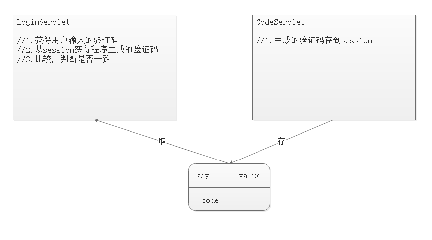
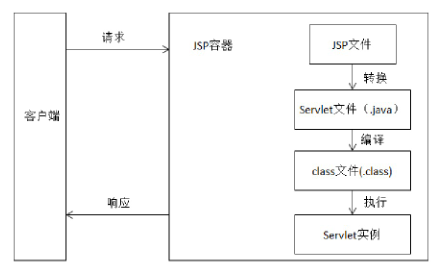

# day25-cookie&session&jsp

# 今日内容

- 会话技术
  - Cookie----->重点
    - 创建Cookie对象并存值
    - 设置Cookie的有效时长
    - 设置Cookie的有效路径(默认路径---项目部署路径)------->难点
    - 记录用户各自上一次访问的时间案例
  - Session---->重点
    - 如何获取Session对象
    - 使用Session对象作为域对象(存值,取值,删除值)
    - 对比三个域对象(创建,死亡,域范围)------->难点
    - 一次性验证码的案例
- JSP入门
  - JSP基本语法(是什么,语法规则)
  - 记住用户名案例

# 第一章-会话的概念

## 1.1 会话的概念

#### 会话的概念

​	会话：浏览器和服务器之间的多次请求和响应。

​	**用户打开浏览器，浏览不同的网页(资源)，发出多个请求，直到关闭浏览器的过程，称为一次会话(多次请求).** 

​	我们在会话的过程(多次请求)之中,用户可能会产生一些数据,这些数据话有的需要保存起来的,我们就可以通过会话技术来保存用户各自的数据

#### 为什么要使用会话技术

​	保存==用户各自(以浏览器为单位)==的数据。

#### 常用的会话技术

##### cookie

​	==**cookie是客户端（浏览器）端的技术**==，用户浏览的信息以键值对(key=value)的形式保存在浏览器上。如果没有关闭浏览器，再次访问服务器，会把cookie带到服务端，服务端就可以做响应的处理。

##### session  

​	==**session是服务器端的技术**。==服务器为每一个浏览器开辟一块内存空间，即session。由于内存空间是每一个浏览器独享的，所有用户在访问的时候，可以把信息保存在session对象中。同时，每一个session对象都对应一个sessionId，服务器把sessionId写到cookie中，再次访问的时候，浏览器会把cookie（sessionId）带过来，找到对应的session对象。


# 第二章-Cookie

## 2.1 Cookie的概念和作用

#### Cookie的概念 


​	Cookie是一种客户端的会话技术,它是服务器存放在浏览器的一小份数据,浏览器以后每次访问该服务器的时候都会将这小份数据携带到服务器去。

#### Cookie的作用

1. 在浏览器中存放数据
2. 将浏览器中存放的数据携带到服务器

#### Cookie的应用场景

1.记住用户名
当我们在用户名的输入框中输入完用户名后,浏览器记录用户名,下一次再访问登录页面时,用户名自动填充到用户名的输入框.


2.自动登录（记住用户名和密码）
当用户在淘宝网站登录成功后,浏览器会记录登录成功的用户名和密码,下次再访问该网站时,自动完成登录功能.
以上这些场景都是使用会话cookie实现的,将上次的信息保存到了cookie中,下次直接从cookie中获取数据信息


3.保存网站的上次访问时间
我们访问网站的时候,通常会看到网站上显示上次访问时间,这些信息就是在用户访问网站的时候保存在cookie中的

4.保存电影的播放进度  

​	在网页上播放电影的时候,如果中途退出浏览器了,下载再打开浏览器播放同一部电影的时候,会自动跳转到上次退出时候的进度,因为在播放的时候会将播放进度保存到cookie中


## 2.2 Cookie的快速入门

#### 相关的API

```java
new Cookie(String name,String value); 创建一个Cookie对象(cookie只能保存字符串数据。且不能保存中文)
response.addCookie(cookie对象);  把cookie写回浏览器 
request.getCookies() ;得到所有的cookie对象。是一个数组，开发中根据key得到目标cookie中保存的值
cookie.getName() ; 获得cookie中设置的key
cookie.getValue(); 获得cookie中设置的value
```

#### 入门代码

```java

/**
 * @Author：pengzhilin
 * @Date: 2021/5/6 9:41
 */
@WebServlet("/ServletDemo1")
public class ServletDemo1 extends HttpServlet {
    protected void doPost(HttpServletRequest request, HttpServletResponse response) throws ServletException, IOException {

        // 获取浏览器携带的所有cookie
        Cookie[] cookies = request.getCookies();

        // 循环遍历所有的cookie
        if (cookies != null) {
            for (Cookie cookie : cookies) {
                String name = cookie.getName();
                String value = cookie.getValue();
                System.out.println("cookie的键:" + name + ",cookie的值" + value);
            }
        }

        // 1.创建Cookie对象,并存储数据
        Cookie aCookie = new Cookie("akey", "aaa");
        Cookie bCookie = new Cookie("bkey", "bbb");

        // 2.把Cookie对象响应给浏览器
        response.addCookie(aCookie);
        response.addCookie(bCookie);

        // 3.响应点数据到页面
        response.getWriter().print("ServletDemo1...");
    }

    protected void doGet(HttpServletRequest request, HttpServletResponse response) throws ServletException, IOException {
        doPost(request, response);
    }
}

```

#### cookie的特点

+ Cookie保存在客户端(浏览器端的)

+ 第一次请求的时候, 没有Cookie的, 先由服务器写给浏览器.

+ Cookie里面只能保存字符串, 大小有限制

+ Cookie的key默认不支持中文,解决中文办法 ,**以后都不用使用中文**   

  ```java
  URLEncode.encode(value,"utf-8");//存入的时候(先通过utf-8编码)
  URLDecode.decode（value，"utf-8"）;//取出 (通过utf-8解码)
  ```

  ```java
  
  /**
   * @Author：pengzhilin
   * @Date: 2021/5/6 9:56
   */
  @WebServlet("/ServletDemo2")
  public class ServletDemo2 extends HttpServlet {
      protected void doPost(HttpServletRequest request, HttpServletResponse response) throws ServletException, IOException {
          // 获取浏览器携带的所有cookie
          Cookie[] cookies = request.getCookies();
  
          // 循环遍历所有的cookie
          if (cookies != null) {
              for (Cookie cookie : cookies) {
                  String name = cookie.getName();
                  String value = cookie.getValue();
                  System.out.println("cookie的键:" + URLDecoder.decode(name,"utf-8") + ",cookie的值:" + value);
              }
          }
  
          // 1.创建Cookie对象,并存储数据
          Cookie aCookie = new Cookie(URLEncoder.encode("中国","utf-8"), "很棒");
  
          // 2.把Cookie对象响应给浏览器
          response.addCookie(aCookie);
  
          // 3.响应点数据到页面
          response.getWriter().print("ServletDemo2...");
      }
  
      protected void doGet(HttpServletRequest request, HttpServletResponse response) throws ServletException, IOException {
          doPost(request, response);
      }
  }
  
  ```
  
  

#### 封装工具类(获得指定的cookie)

3. 我们一般根据cookie的name获得目标cookie对象.  我们可以把这块逻辑封装到工具类里面

- 工具类

  ```java
  
  /**
   * @Author：pengzhilin
   * @Date: 2021/5/6 10:07
   */
  public class CookieUtils {
  
      /**
       * 查找指定的cookie
       * @param cookieName
       * @param cookies
       * @return cookie对象
       */
      public static Cookie getCookie(String cookieName,Cookie[] cookies){
          // 如果没有携带cookie
          if (cookies == null){
              return null;
          }
  
          // 如果有携带cookie,找到了
          for (Cookie cookie : cookies) {
              String name = cookie.getName();
              if (cookieName.equals(name)){
                  // 找到了
                  return cookie;
              }
          }
  
          // 如果有携带cookie,没找到
          return null;
      }
  
  }
  
  ```

  

- 测试工具类

  ```java
  /**
   * @Author：pengzhilin
   * @Date: 2021/5/6 10:12
   */
  @WebServlet("/ServletDemo3")
  public class ServletDemo3 extends HttpServlet {
      protected void doPost(HttpServletRequest request, HttpServletResponse response) throws ServletException, IOException {
          // 需求: 查找名字为akey的cookie----->先访问ServletDemo1(写aCookie,bCookie到浏览器),然后访问ServletDemo3
          // 1.获得浏览器携带的所有Cookie
          Cookie[] cookies = request.getCookies();
  
          // 2.查找名字为akey的cookie
          Cookie aCookie = CookieUtils.getCookie("akey", cookies);
  
          // 3.打印cookie的名字和值
          System.out.println(aCookie.getName() + " = " + aCookie.getValue());
      }
  
      protected void doGet(HttpServletRequest request, HttpServletResponse response) throws ServletException, IOException {
          doPost(request, response);
      }
  }
  
  ```

  


## 2.3 Cookie进阶

#### cookie的分类(有效时长)

+ 会话级别cookie

​	在==默认的情况==下，当浏览器进程结束(浏览器关闭,会话结束)的时候，cookie就会消失。

+ 持久性cookie

  ​	给cookie设置有效期.`cookie.setMaxAge(int expiry)`  :参数是时间,单位是秒

  ​		 -1：默认。代表Cookie数据存到浏览器关闭（保存在浏览器文件中）。

          正整数：以秒为单位保存数据有有效时间（把缓存数据保存到磁盘中）    

  ​		 0：代表删除Cookie.如果要删除Cookie要确保**路径一致**。 

```java

/**
 * @Author：pengzhilin
 * @Date: 2021/5/6 10:27
 */
@WebServlet("/ServletDemo4")
public class ServletDemo4 extends HttpServlet {
    protected void doPost(HttpServletRequest request, HttpServletResponse response) throws ServletException, IOException {
        // 获取所有的cookie对象,打印数据
        Cookie[] cookies = request.getCookies();
        if (cookies != null){
            for (Cookie cookie : cookies) {
                System.out.println(cookie.getName()+"="+cookie.getValue());
            }
        }

        // 创建Cookie对象
        Cookie aCookie = new Cookie("akey", "aaa");
        Cookie bCookie = new Cookie("bkey", "bbb");

        // 设置aCookie的有效时长,bCookie的有效时长为默认
        aCookie.setMaxAge(60*60*24*7);

        // 响应Cookie对象
        response.addCookie(aCookie);
        response.addCookie(bCookie);

        // 响应数据到页面,证明当前Servlet执行了
        response.getWriter().print("ServletDemo4....");
    }

    protected void doGet(HttpServletRequest request, HttpServletResponse response) throws ServletException, IOException {
        doPost(request, response);
    }
}

```


#### cookie设置有效路径

```
setPath(String url) ;设置路径,如果不设置路径,就是默认路径
```

- **默认路径**,例如: 

  - 访问http://localhost:8080/day25/ServletDemo5;  cookie默认路径 /day25
  
  + 访问http://localhost:8080/day25/aa/ServletDemo6;  cookie默认路径 /day25/aa
  
  + 访问http://localhost:8080/day25/aa/bb/ServletDemo7;  cookie默认路径 /day25/aa/bb
  
  + ....
  
    
  
- **随带Cookie需要的条件**(设置有效路径): ==只有当访问资源的url包含此cookie的有效path的时候,才会携带这个cookie;==反之不会.  

  - eg: 假设Cookie路径是: /day25
  - 访问http://localhost:8080/day25/ServletDemo8;  会携带该cookie过来

  + 访问http://localhost:8080/day25/aa/ServletDemo9; 会携带该cookie过来
  + 访问http://localhost:8080/day25/aa/bb/ServletDemo10;  会携带该cookie过来
  + ....
  + eg: 假设Cookie路径是: /day25/aa
  + 访问http://localhost:8080/day25/ServletDemo11;  不会携带该cookie过来

  + 访问http://localhost:8080/day25/aa/ServletDemo12; 会携带该cookie过来
  + 访问http://localhost:8080/day25/aa/bb/ServletDemo13;  会携带该cookie过来
  + ....

-  **Cookie小结**

   -  有效路径作用 :
   
      1. 保证不会携带别的网站/项目里面的cookie到我们自己的项目
      3. 保证自己的项目可以合理的利用自己项目的cookie
      3. 如果路径不一样, cookie的key可以相同
      4. 如果路径一样, cookie的key相同,那么后面的Cookie会覆盖前面的Cookie
      
   - cookie的路径通常设置为项目的部署路径. 当前项目下的Servlet都可以使用该cookie. 一般这么设置: cookie.setPath(==request.getContextPath()==);
   
      只要是当前项目里面的资源 路径必须包含项目名路径. 


## 案例-记录用户各自的上次访问时间

### 1.需求


​	在访问一个资源的时候,展示上次访问的时间

​	若是第一次访问则展示:你是第一次访问,若不是第一次则展示:你上次访问的时间是:xxxx

### 2.分析


```java
1.获取浏览器携带的所有Cookie---->数组cookies
2.判断是否是第一次访问(其实就是判断携带的Cookie里面有没有目标Cookie)
3.如果是第一次访问:
3.1 创建当前日期对象
3.2 把日期对象转换为对应的毫秒值( long getTime())
3.3 创建Cookie对象,存储当前访问的系统时间
3.4 设置有效时长
3.5 设置有效路径(项目部署路径)
3.6 响应给浏览器
3.7 响应欢迎数据到页面(欢迎第一次访问本网站)
4.如果不是第一次访问:
4.1 获取存储上一次访问时间的目标Cookie对象
4.2 获取目标Cookie对象中的时间
4.3 把毫秒值时间转换为Date日期
4.4 把当前系统时间存储到目标Cookie中(更新时间)
4.5 把时间响应到页面上(您上一次访问的时间是:  xxx...)
```


### 3.代码实现


```java

/**
 * @Author：pengzhilin
 * @Date: 2021/5/6 11:33
 */
@WebServlet("/ServletDemo16")
public class ServletDemo16 extends HttpServlet {
    protected void doPost(HttpServletRequest request, HttpServletResponse response) throws ServletException, IOException {
        // 0.处理乱码
        request.setCharacterEncoding("utf-8");
        response.setContentType("text/html;charset=utf-8");

        //1.获取浏览器携带的所有Cookie---->数组cookies
        Cookie[] cookies = request.getCookies();

        //2.判断是否是第一次访问(其实就是判断携带的Cookie里面有没有目标Cookie)
        Cookie lastTimeCookie = CookieUtils.getCookie("lastTime", cookies);

        // 判断
        if (lastTimeCookie == null) {
            //3.如果是第一次访问:
            //3.1 创建当前日期对象
            Date nowDate = new Date();

            //3.2 把日期对象转换为对应的毫秒值( long getTime())
            long time = nowDate.getTime();

            //3.3 创建Cookie对象,存储当前访问的系统时间--->Cookie名字: lastTime
            Cookie cookie = new Cookie("lastTime", time + "");

            //3.4 设置有效时长
            cookie.setMaxAge(60*60*24*7);

            //3.5 设置有效路径(项目部署路径)
            cookie.setPath(request.getContextPath());

            //3.6 响应给浏览器
            response.addCookie(cookie);

            //3.7 响应欢迎数据到页面(欢迎第一次访问本网站)
            response.getWriter().print("欢迎第一次访问本网站!");

        } else {
            //4.如果不是第一次访问:
            //4.1 获取存储上一次访问时间的目标Cookie对象
            //4.2 获取目标Cookie对象中的时间
            String lastTime = lastTimeCookie.getValue();

            //4.3 把毫秒值时间转换为Date日期
            Date lastDate = new Date(Long.parseLong(lastTime));
            String sLastTime = lastDate.toLocaleString();

            //4.4 把当前系统时间存储到目标Cookie中(更新时间)
            //4.4.1 创建当前日期对象
            Date nowDate = new Date();

            //4.4.2 把日期对象转换为对应的毫秒值( long getTime())
            long time = nowDate.getTime();

            //4.4.3 创建Cookie对象,存储当前访问的系统时间--->Cookie名字: lastTime
            Cookie cookie = new Cookie("lastTime", time + "");

            //4.4.4 设置有效时长
            cookie.setMaxAge(60*60*24*7);

            //4.4.5 设置有效路径(项目部署路径)
            cookie.setPath(request.getContextPath());

            //4.4.6 响应给浏览器
            response.addCookie(cookie);

            //4.5 把时间响应到页面上(您上一次访问的时间是:  xxx...)
            response.getWriter().print("您上一次访问的时间是:"+sLastTime);
        }
    }

    protected void doGet(HttpServletRequest request, HttpServletResponse response) throws ServletException, IOException {
        doPost(request, response);
    }
}

```

### 4.小结

1. 案例关键:  判断是否第一次访问【说白了就是判断目标Cookie是否为null】

2. 取的时候 和存时候的key要一致

3. 不管是哪一次访问, 都需要记录当前的时间到Cookie

   

    


# 第三章-Session

## 3.1 session概述

#### session概述 

​	**session是服务器端的技术**。服务器为每一个浏览器开辟一块内存空间，即session对象。由于session对象是每一个浏览器特有的，所以用户的记录可以存放在session对象中。同时**，每一个session对象都对应一个sessionId，服务器把sessionId写到cookie中，再次访问的时候，浏览器把sessionId带过来，找到对应的session对象**(session是基于cookie的)

#### cookie和Session的不同

- cookie是保存在浏览器端的，大小和个数都有限制。session是保存在服务器端的， 原则上大小是没有限制(实际开发里面也不会存很大的数据), 安全一些。    
- cookie不支持中文，并且只能存储字符串；session可以存储基本数据类型，集合,对象等

#### Session的执行原理

​	**1.浏览器请求服务器,会携带cookie**

​	**2.服务器就会从cookie中获取sessionId**

​	**3.判断是否有sessionId,**

​	**4.如果没有,就直接为该浏览器创建新的Session对象(request.getSession() --->没有就创建,有就获取)**

​    **5.如果有sessionId,就根据sessionId查找对应的session对象**

​    **6.如果能找到session对象,那就直接使用**

​    **7.如果找不到session对象(session对象销毁),就直接创建新的session对象**

 

```java
/**
 * @Author：pengzhilin
 * @Date: 2021/5/6 12:14
 */
@WebServlet("/ServletDemo17")
public class ServletDemo17 extends HttpServlet {
    protected void doPost(HttpServletRequest request, HttpServletResponse response) throws ServletException, IOException {
        // 1.获得session对象
        HttpSession session = request.getSession();

        // 2.获得sessionId
        String id = session.getId();
        System.out.println("sessionId:" + id);

        // 3.响应数据到页面,证明该Servlet执行了
        response.getWriter().print("ServletDemo17...");
    }

    protected void doGet(HttpServletRequest request, HttpServletResponse response) throws ServletException, IOException {
        doPost(request, response);
    }
}

```


## 3.2 Session作为域对象存取值

#### Session作为域对象存取值

​	==范围: 一次会话(多次请求)== 保存用户各自的数据(以浏览器为单位)   

- request.getSession(); 获得session(如果第一次调用的时候其实是创建session,第一次之后通过sessionId找到session进行使用)
- Object getAttribute(String name) ;获取值
- void setAttribute(String name, Object value) ;存储值
- void removeAttribute(String name)  ;移除值,只是移除键值对,并不会删除session对象

```java

/**
 * @Author：pengzhilin
 * @Date: 2021/5/6 14:36
 */
@WebServlet("/ServletDemo18")
public class ServletDemo18 extends HttpServlet {
    protected void doPost(HttpServletRequest request, HttpServletResponse response) throws ServletException, IOException {
        // 存值
        request.getSession().setAttribute("akey","aaa");
        response.getWriter().print("ServletDemo18...set...");
    }

    protected void doGet(HttpServletRequest request, HttpServletResponse response) throws ServletException, IOException {
        doPost(request, response);
    }
}

```

```java

/**
 * @Author：pengzhilin
 * @Date: 2021/5/6 14:37
 */
@WebServlet("/ServletDemo19")
public class ServletDemo19 extends HttpServlet {
    protected void doPost(HttpServletRequest request, HttpServletResponse response) throws ServletException, IOException {
        // 1.处理乱码
        request.setCharacterEncoding("utf-8");
        response.setContentType("text/html;charset=utf-8");

        // 取值
        String value = (String) request.getSession().getAttribute("akey");
        response.getWriter().print("取出的session值:"+value);
    }

    protected void doGet(HttpServletRequest request, HttpServletResponse response) throws ServletException, IOException {
        doPost(request, response);
    }
}

```

```java

/**
 * @Author：pengzhilin
 * @Date: 2021/5/6 14:39
 */
@WebServlet("/ServletDemo20")
public class ServletDemo20 extends HttpServlet {
    protected void doPost(HttpServletRequest request, HttpServletResponse response) throws ServletException, IOException {
        // 删除值----->并不会删除session对象,至少把值给干掉了
        request.getSession().removeAttribute("akey");
        response.getWriter().print("ServletDemo20...remove...");
    }

    protected void doGet(HttpServletRequest request, HttpServletResponse response) throws ServletException, IOException {
        doPost(request, response);
    }
}

```

#### 关于Session对象的销毁

- 浏览器关闭了, session使用不了, 是session销毁了吗?
  - session没有销毁,只是浏览器端的含有sessionId的cookie没有了.  
  - session基于cookie, sessionId保存到cookie里面的, 默认情况下cookie是会话级别,浏览器关闭了cookie就是消失了,也就是说==sessionId消失了==, 从而找不到对应的session对象了, 就不能使用了.
- 结论:
    - 结论:  
      - 1.服务器响应的sessionId,是使用的默认基本的Cookie,关闭浏览器,cookie销毁了,也就是sessionId没有了,但session对象还在服务器中
      - 2.服务器响应的sessionId是持久级别的Cookie,关闭浏览器,cookie还在,也就是sessionId还在,并且session对象也还在服务器中, 可以获取上一次会话保存在session中的数据
  
- **解决: 自己获得sessionId, 自己写给浏览器 设置Cookie的有效时长, 这个Cookie的key必须: `JSESSIONID**`

  ```java
  
  /**
   * @Author：pengzhilin
   * @Date: 2021/5/6 15:02
   */
  @WebServlet("/ServletDemo21")
  public class ServletDemo21 extends HttpServlet {
      protected void doPost(HttpServletRequest request, HttpServletResponse response) throws ServletException, IOException {
          // 创建session对象存值
          HttpSession session = request.getSession();
  
          // 获取sessionId
          String id = session.getId();
          System.out.println("ServletDemo21...id:"+id);
  
          // 存值
          session.setAttribute("akey","aaa");
  
          // 手动响应sessionId
          Cookie cookie = new Cookie("JSESSIONID",id);
          // 设置有效时长
          cookie.setMaxAge(60*60);
          // 设置有效路径
          cookie.setPath(request.getContextPath());
          // 响应cookie
          response.addCookie(cookie);
      }
  
      protected void doGet(HttpServletRequest request, HttpServletResponse response) throws ServletException, IOException {
          doPost(request, response);
      }
  }
  
  ```

  

- **真正的销毁session对象,得使用session对象的invalidate()方法*

  ```java
  @WebServlet("/ServletDemo23")
  public class ServletDemo23 extends HttpServlet {
      protected void doPost(HttpServletRequest request, HttpServletResponse response) throws ServletException, IOException {
          // 销毁session对象
          request.getSession().invalidate();
          response.getWriter().println("ServletDemo23...销毁了session对象...");
      }
  
      protected void doGet(HttpServletRequest request, HttpServletResponse response) throws ServletException, IOException {
          doPost(request, response);
      }
  }
  ```

  


## 3.3 三个域对象比较  

#### 三个域对象比较 

| 域对象             | 创建                                          | 销毁                                                         | 作用范围       | 应用场景                                                |
| ------------------ | --------------------------------------------- | ------------------------------------------------------------ | -------------- | ------------------------------------------------------- |
| ServletContext     | 服务器启动                                    | 服务器正常关闭/项目从服务器移除                              | 整个项目       | 记录访问次数,聊天室                                     |
| HttpSession        | ==没有session 调 用==request.getSession()方法 | session过期（默认30分钟）/调用invalidate(）方法/服务器==异常==关闭 | 会话(多次请求) | 验证码校验, ==保存用户登录状态==等                      |
| HttpServletRequest | 来了请求                                      | 响应这个请求(或者请求已经接收了)                             | 一次请求       | servletA和jsp（servletB）之间数据传递(转发的时候存数据) |

`C:\Users\pengzhilin\.IntelliJIdea2018.2\system\tomcat\Tomcat_8_5_27_szitheima108-web_5\work\Catalina\localhost`目录查看

- 如果是正常关闭服务器,

​	把session钝化到服务器磁盘上,再次启动,把磁盘上的文件活化到内存里面

​	Session钝化：把内存中的session序列化到硬盘上

​	Session活化：从硬盘上读取序列化的session到内存中

#### 三个域对象怎么选择? 

三个域对象怎么选择? 

​	一般情况下, 最小的可以解决就用最小的.

​	但是需要根据情况(eg: 重定向, 多次请求, 会话范围, 用session;  如果是转发,一般选择request)


## 案例-一次性验证码校验

### 1.需求


​	

​	在网站登录的时候,生成一个验证码.登录的时候对验证码进行校验.

### 2.实现

#### 2.1生成验证码

1. 拷贝验证码的jar包
2. 创建CodeServlet

```
//1.生成验证码
//2.响应给客户端(浏览器)
```

```java
/**
 * @Author：pengzhilin
 * @Date: 2021/5/6 15:57
 */
@WebServlet("/ServletCode")
public class ServletCode extends HttpServlet {
    protected void doPost(HttpServletRequest request, HttpServletResponse response) throws ServletException, IOException {
        // 1.创建验证码对象
        // 参数1: 宽度 参数2: 高度,  参数3: 验证码的字符数   参数4: 线条数
        ValidateCode validateCode = new ValidateCode(200,50,4,100);

        // 2.响应验证码到页面
        validateCode.write(response.getOutputStream());

    }

    protected void doGet(HttpServletRequest request, HttpServletResponse response) throws ServletException, IOException {
        doPost(request, response);
    }
}

```

```java
<!DOCTYPE html>
<html lang="en">
<head>
    <meta charset="UTF-8">
    <title>Title</title>
</head>
<body>
<center>
    <h1>用户登录</h1>
    <form action="ServletLogin" method="post">
        姓名：<input type="text" name="username"/><br/>
        密码：<input type="password" name="password"/><br/>
        验证码:<input type="text" name="checkCode"><br/>
        <br/>
        <input type="submit" value="登录"/>
    </form>
</center>
</body>
<script>
        function getCode(obj) {
            // 点击一次图片,就修改src属性的值(访问一次ServletCode)
            obj.src = "ServletCode?date="+new Date().getMilliseconds();
        }
</script>
</html>
```


#### 2.2校验验证码


  

```java

@WebServlet("/ServletLogin")
public class ServletLogin extends HttpServlet {
    protected void doPost(HttpServletRequest request, HttpServletResponse response) throws ServletException, IOException {
        try {
            // 1.处理乱码
            request.setCharacterEncoding("utf-8");
            response.setContentType("text/html;charset=utf-8");

            // *********************校验验证码*******************************
            // 1.获得用户输入的验证码
            String checkCode = request.getParameter("checkCode");

            // 2.获得事先生成的验证码
            String code = (String) request.getSession().getAttribute("checkCode");

            // 3.校验
            if (!checkCode.equalsIgnoreCase(code)) {
                System.out.println("验证码失败...");
                // 不相等,响应失败页面
                response.sendRedirect(request.getContextPath() + "/failed.html");
                // 提前结束程序
                return;
            }


            // *********************校验用户名和密码*******************************
            // 2.获得请求参数(用户输入的用户名和密码)
            String username = request.getParameter("username");
            String password = request.getParameter("password");

            // 3.创建QueryRunner对象
            QueryRunner qr = new QueryRunner(C3P0Utils.getDataSource());

            // 4.调用query方法查询数据库,把结果封装成User对象
            String sql = "select * from user where username = ? and password = ?";
            User user = qr.query(sql, new BeanHandler<User>(User.class), username, password);

            // 5.判断是否登录成功(判断user对象是否为null)
            if (user == null) {
                System.out.println("用户名或者密码错误...");
                // 5.1 如果为null,表示登录失败,重定向到失败页面
                response.sendRedirect(request.getContextPath() + "/failed.html");

            } else {
                // 5.2 如果不为null,表示登录成功,重定向到成功页面
                response.sendRedirect(request.getContextPath() + "/success.html");
            }
        } catch (SQLException e) {
            // 异常(失败)
            response.sendRedirect(request.getContextPath() + "/failed.html");
        }


    }

    protected void doGet(HttpServletRequest request, HttpServletResponse response) throws ServletException, IOException {
        doPost(request, response);
    }
}

```

```html
<!DOCTYPE html>
<html lang="en">
<head>
    <meta charset="UTF-8">
    <title>Title</title>
</head>
<body>
<center>
    <h1>用户登录</h1>
    <form action="ServletLogin" method="post">
        姓名：<input type="text" name="username"/><br/>
        密码：<input type="password" name="password"/><br/>
        验证码:<input type="text" name="checkCode"><br/>
        <br/>
        <input type="submit" value="登录"/>
    </form>
</center>
</body>
<script>
        function getCode(obj) {
            // 点击一次图片,就修改src属性的值(访问一次ServletCode)
            obj.src = "ServletCode?date="+new Date().getMilliseconds();
        }
</script>
</html>
```


### 3.小结   ###

1.  需要在CodeServlet 把生成的验证码存到session里面
   + 不能存到ServletContext,  就共享验证码了
   + 不能存到request,  根本不能用

2. 思路
  
   + CodeServlet: 生成验证码存到Session
   + LoginServlet:
     + 获得用户输入的验证码
     + 获得session里面存的验证码
     + 比较是否一致
   
   
   
   


# 第四章_JSP入门

## 4.1 JSP概述

####  什么是JSP

​	Java server page(java服务器页面).  ==JSP本质就是Servlet==    

​	它和servlet技术一样，都是SUN公司定义的一种用于开发动态web资源的技术。

​	JSP=html(js,css)+java+jsp特有的内容

#### JSP产生的原因

需求: 我们要向页面动态输出一个表格. 发现特别的繁琐

servlet在展示页面的时候，相当的繁琐。sun公司为了解决这个问题，参照asp开发了一套动态网页技术jsp。

####  JSP执行原理

`C:\Users\pengzhilin\.IntelliJIdea2018.2\system\tomcat\Tomcat_8_5_27_szitheima01_9\work\Catalina\localhost`

JSP会翻译(通过默认的JspServlet,JSP引擎)成Servlet(.java),Servlet编译成class文件

​	JSP执行流程

​		第一次访问的xxx.jsp时候,服务器收到请求,JspServlet会去查找对应的jsp文件

​		找到之后,服务器会将这个jsp文件转换成java文件(Servlet)

​		服务器编译java文件,生成class文件

​		服务器运行class文件,生成动态的内容

​		服务器收到内容之后,返回给浏览器

 


### 3.小结

1. JSP: java 服务器 页面, sun公司定义的动态资源, 本质就是Servlet
2. JSP产生的原因: Servlet在动态展示很麻烦, jsp展示方便一点

## 4.2 JSP基本语法  

#### JSP脚本

我们可以通过JSP脚本在JSP页面上编写Java代码. 一共有三种方式:

| 类型                  | 翻译成Servlet对应的部分                             | 注意                  |
| --------------------- | --------------------------------------------------- | --------------------- |
| <%...%>:Java程序片段  | 翻译成Service()方法里面的内容, 局部的               |                       |
| <%=...%>:输出表达式   | 翻译成Service()方法里面的内容,相当于调用out.print() | 输出表达式不能以;结尾 |
| <%!...%>:声明成员变量 | 翻译成Servlet类里面的内容                           |                       |

- eg

```jsp
<%--
  Created by IntelliJ IDEA.
  User: pengzhilin
  Date: 2021/5/6
  Time: 15:46
  To change this template use File | Settings | File Templates.
--%>
<%@ page contentType="text/html;charset=UTF-8" language="java" %>
<html>
<head>
    <title>$Title$</title>
</head>
<body>
<h1>index.jsp</h1>
<%-- JSP基本语法 --%>
<%
    // Servlet的Service方法里面可以写啥,这里就可以写啥
    for (int i = 0; i < 10; i++) {
        System.out.println("第" + i + "次循环");
    }

    int num1 = 10;
%>

 <%--Servlet里面字符输出流out的write方法小括号中的内容--%>
<%--out.write(10)--%>
<%=
    10
%>
<%--out.write(num1)--%>
<%=
    num1
%>

<%--Serlvet的类里面可以写啥,这里就可以写啥--%>
<%!
    int num2 = 20;
%>
<%=
    num2
%>

</body>
</html>

```

#### JSP注释

| 注释类型                      |
| ----------------------------- |
| HTML注释<!--HTML注释-->       |
| JAVA注释     //; /* */        |
| JSP注释;     <%--注释内容--%> |

==注释快捷键:Ctrl+Shift+/==ctrl+\=====

## 案例-记住用户名案例

### 1.需求

 

### 2.分析

1. 在LoginServlet里面, 如果用户登录成功:

   ​	//判断用户是否勾选了记住用户名

   ​	//勾选了, 把用户名存到Cookie

2. 在login.jsp页面 从cookie取出展示

### 3.实现

+ LoginServlet

```java
package com.itheima.web;

import com.itheima.bean.User;
import com.itheima.utils.C3P0Utils;
import org.apache.commons.dbutils.QueryRunner;
import org.apache.commons.dbutils.handlers.BeanHandler;

import javax.servlet.ServletException;
import javax.servlet.annotation.WebServlet;
import javax.servlet.http.Cookie;
import javax.servlet.http.HttpServlet;
import javax.servlet.http.HttpServletRequest;
import javax.servlet.http.HttpServletResponse;
import java.io.IOException;
import java.sql.SQLException;

/**
 * @Author：pengzhilin
 * @Date: 2021/5/5 16:15
 */
@WebServlet("/ServletLogin")
public class ServletLogin extends HttpServlet {
    protected void doPost(HttpServletRequest request, HttpServletResponse response) throws ServletException, IOException {
        try {
            // 1.处理乱码
            request.setCharacterEncoding("utf-8");
            response.setContentType("text/html;charset=utf-8");

            // *********************校验验证码*******************************
            // 1.获得用户输入的验证码
            String checkCode = request.getParameter("checkCode");

            // 2.获得事先生成的验证码
            String code = (String) request.getSession().getAttribute("checkCode");

            // 3.校验
            if (!checkCode.equalsIgnoreCase(code)) {
                System.out.println("验证码失败...");
                // 不相等,响应失败页面
                response.sendRedirect(request.getContextPath() + "/failed.html");
                // 提前结束程序
                return;
            }


            // *********************校验用户名和密码*******************************
            // 2.获得请求参数(用户输入的用户名和密码)
            String username = request.getParameter("username");
            String password = request.getParameter("password");

            // 3.创建QueryRunner对象
            QueryRunner qr = new QueryRunner(C3P0Utils.getDataSource());

            // 4.调用query方法查询数据库,把结果封装成User对象
            String sql = "select * from user where username = ? and password = ?";
            User user = qr.query(sql, new BeanHandler<User>(User.class), username, password);

            // 5.判断是否登录成功(判断user对象是否为null)
            if (user == null) {
                System.out.println("用户名或者密码错误...");
                // 5.1 如果为null,表示登录失败,重定向到失败页面
                response.sendRedirect(request.getContextPath() + "/failed.html");

            } else {
                // ***************实现记住用户名的功能(登录成功才去记住用户名)*************************
                //1.获得记住用户名复选框的值
                String remember = request.getParameter("remember");

                //2.判断复选框是否勾选(值是否为ok或者null)
                if (remember != null && "ok".equals(remember)) {
                    //3.如果值不为null,为ok,那么就勾选了记住用户名复选框
                    //3.1 创建Cookie对象,保存用户名
                    Cookie cookie = new Cookie("username", username);
                    //3.2 设置Cookie对象的有效时长
                    cookie.setMaxAge(60*60*24*7);
                    //3.3 设置Cookie对象的有效路径
                    cookie.setPath(request.getContextPath());
                    //3.4 响应Cookie对象给浏览器
                    response.addCookie(cookie);
                }else {
                    //4. 如果复选框没有勾选,
                    //3.1 创建Cookie对象,保存空值,键还是和之前的Cookie的键一样
                    Cookie cookie = new Cookie("username", "");
                    //3.2 设置Cookie对象的有效时长为0
                    cookie.setMaxAge(0);
                    //3.3 设置Cookie对象的有效路径,还是和之前的Cookie的有效路径一样
                    cookie.setPath(request.getContextPath());
                    //3.4 响应Cookie对象给浏览器
                    response.addCookie(cookie);
                }


                // 5.2 如果不为null,表示登录成功,重定向到成功页面
                response.sendRedirect(request.getContextPath() + "/success.html");
            }
        } catch (SQLException e) {
            // 异常(失败)
            response.sendRedirect(request.getContextPath() + "/failed.html");
        }


    }

    protected void doGet(HttpServletRequest request, HttpServletResponse response) throws ServletException, IOException {
        doPost(request, response);
    }
}

```

+ login.jsp 


```jsp
<%--
  Created by IntelliJ IDEA.
  User: pengzhilin
  Date: 2021/5/6
  Time: 17:17
  To change this template use File | Settings | File Templates.
--%>
<%@ page contentType="text/html;charset=UTF-8" language="java" %>
<html>
<head>
    <title>login</title>
</head>
<body>
<center>
    <h1>用户登录</h1>
    <%
        System.out.println(session.getAttribute("checkCode"));
        // 可以使用的对象: request(HttpServletRequest),response(HttpServletResponse),session(HttpSession),application(ServletContext),config(ServletConfig)
    %>
    <form action="ServletLogin" method="post">
        姓名：<input type="text" name="username" value="${cookie.username.value}"/><br/>
        密码：<input type="password" name="password"/><br/>
        验证码:<input type="text" name="checkCode"><br/>
        <br/>
        <input type="checkbox" name="remember" value="ok">记住用户名
        <input type="submit" value="登录"/>
    </form>
</center>
</body>
<script>
    function getCode(obj) {
        // 点击一次图片,就修改src属性的值(访问一次ServletCode)
        obj.src = "ServletCode?date="+new Date().getMilliseconds();
    }
</script>

</body>
</html>

```


### 4.小结

1. 用户勾选了记住用户名,我们把用户名存到Cookie里面
2. 在login.jsp里面 从cookie取出用户名展示


# 总结

```java
必须练习:
	1.记录用户上次访问的时间------>Cookie
    2.记录用户名---->Cookie &  jsp
    3.一次性验证码校验---->Session
	cookie的api和执行原理
	session的api和执行原理
        
- 能够说出会话的概念
    浏览器开启(发送多次请求)--->浏览器关闭
    会话技术: cookie,session
        
- 能够创建、发送、接收、删除cookie
    new Cookie(String name,String value);
	response.addCookie(cookie); 
	request.getCookies() ;
	cookie.getName() ; //返回cookie中设置的key
	cookie.getValue(); //返回cookie中设置的value
	
- 能够完成记录用户各自的上次访问时间案例
    1.第一次访问的时候,记录当前时间,保存到cookie中
    2.第二次访问的时候,先获取之前创建的cookie,获取里面的时间,重新保存当前时间到cookie中,然后把cookie响应会去,再把获取的时间,显示到页面
    ....
    
- 能够获取session对象、添加、删除、获取session中的数据
    request.getSession()
    - Object getAttribute(String name) ;获取值
	- void setAttribute(String name, Object value) ;存储值
	- void removeAttribute(String name)  ;移除
	获取sessionId:  session对象.getId();

- 能够完成登录验证码案例
    1.在生成验证码的Servlet中生成验证码,并保存到session中
    2.在登录的Servlet中获取用户输入的验证码和session保存的验证码进行对比
    
- 了解JSP的脚本
   <% java代码:Servlet的service方法中 %>
   <%= java代码:Servlet的service方法中的out.write()方法的小括号中 %>
   <%! java代码:Servlet的类中 %>
   注释: html,jsp,java三类注释
       
- 能够完成记住用户名案例
	1.获取记住用户名复选框的值
    2.判断获取的复选框的值
    3.如果不为null,并且为指定的值(ok),那么就创建cookie对象,保存用户名,响应到浏览器
    4.否则,就删除之前的cookie(设置之前cookie的有效时长为0---注意路径一定要一致)
```

