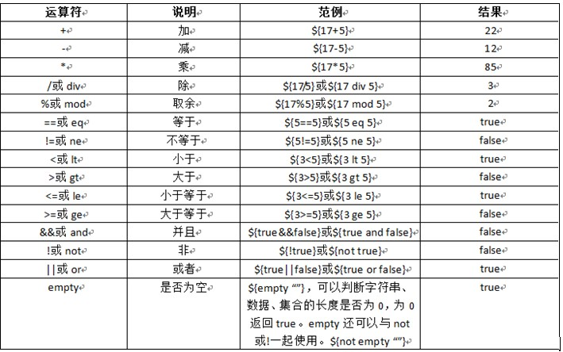
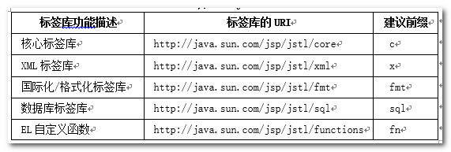
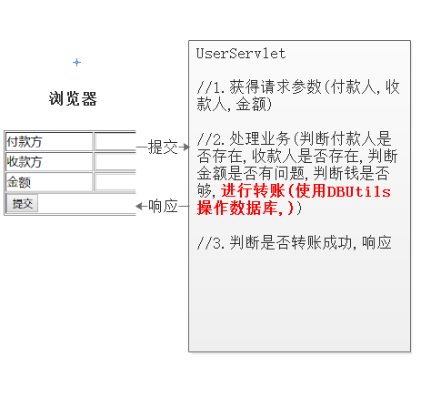
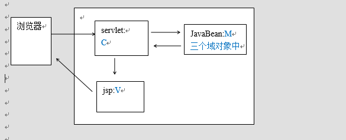
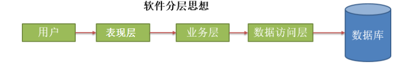
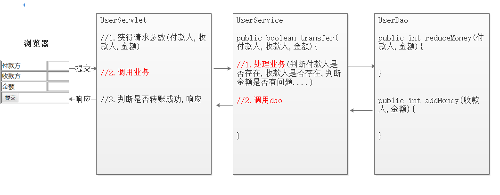
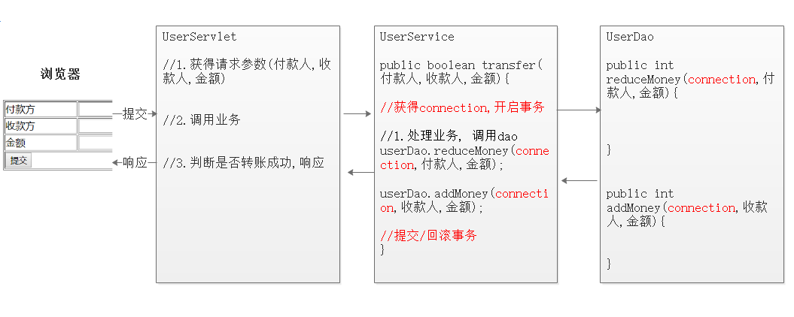
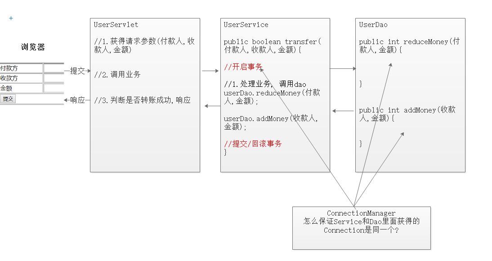

# day26-JSP&三层架构

# 今日内容介绍

- EL表达式----->重点
  - 获取数据-------域对象(request,session,ServletContext)
  - 执行运算
- JSTL标签库----->重点
  - if标签
  - choose标签(了解)
  - forEach标签
- 综合案例
  - 使用三层架构
  - 事务操作
- 开发模式(三层架构)----->重点

# 第一章-EL表达式 

## 1.1 EL表达式概述

#### 什么是El表达式

​	Expression Language:表达式语言,  jsp2.0之后内置在jsp里面

​	目的：为了使JSP写起来更加简单,  取值(取的域对象里面存的值)更加简单。(代替脚本 <% %>)

#### EL语法

​	**${el表达式}**

#### EL表达式的用途 

​	1.获取数据. 获取的是==域(request,session,ServletContext)对象==中存储的数据

​	2.EL执行运算

```jsp
<%@ page contentType="text/html;charset=UTF-8" language="java" %>
<html>
<head>
    <title>01_EL表达式体验</title>
</head>
<body>
<%--el: 就是用来取域对象中的值,或者执行运算--%>
<%--格式: ${el表达式}--%>
<%--JSP-->翻译成Servlet-->翻译后里面内置了很多对象()--%>
<%--jsp内置对象:request(HttpServletRequest),response(HttpServletResponse),session(HttpSession),application(ServletContext),config(ServletConfig)--%>
<%
    // 请求域对象中存值
    request.setAttribute("username","zhangsan");
%>

<h1>jsp方式:</h1>
<%= request.getAttribute("username") %><br/>

<%--el里面的内置对象: requestScope,sessionScope,applicationScope,pageScope,cookie--%>
<h1>el方式:</h1>
${requestScope.get("username")}<br/>

<h1>el简单方式:</h1>
${username}<br/>

</body>
</html>
```


## 1.2 El获取数据

+ 能够使用el表达式域里面的数据(==先要把数据存到域对象里面==)

#### 获取简单数据类型数据

​	语法:${requestScope|sessionScope|applicationScope.属性名}; 

​	快捷写法:==${属性名},  属性名就是存在域对象里面的key==

```jsp

<%@ page contentType="text/html;charset=UTF-8" language="java" %>
<html>
<head>
    <title>02_el获取简单数据类型数据</title>
</head>
<body>
<%
    /*往请求域对象中存值*/
    request.setAttribute("akey","aaa");

    /*往session域对象中存值*/
    session.setAttribute("bkey","bbb");

    /*往application域对象中存值(ServletContext)*/
    application.setAttribute("ckey","ccc");

    /*同时往请求域对象,session域对象,application域对象中存储一个同名的键与值*/
    //request.setAttribute("rkey","rrr");
    //session.setAttribute("rkey","rrrr");
    //application.setAttribute("rkey","rrrrr");
%>

<h1>取请求域对象中的值:</h1>
jsp方式:<br/>
<%= request.getAttribute("akey") %><br/>
el方式:<br/>
${requestScope.get("akey")}


<h1>取session域对象中的值:</h1>
jsp方式:<br/>
<%= session.getAttribute("bkey")%><br/>
el方式:<br/>
${sessionScope.get("bkey")}<br/>

<h1>取application域对象中的值:</h1>
jsp方式:<br/>
<%= application.getAttribute("ckey")%><br/>
el方式:<br/>
${applicationScope.get("ckey")}<br/>

<%--el表达式简单获取域对象值的方式: ${键名}--%>
<%--从小到大的范围进行查找:  request-->session-->application --%>
<h1>el简单方式</h1>
${akey}<br/>
${bkey}<br/>
${ckey}<br/>
${rkey}<br/>


</body>
</html>

```


#### 获取数组

​	语法: ${key[下标]}    key就是域对象里面存的key

```jsp

<%@ page contentType="text/html;charset=UTF-8" language="java" %>
<html>
<head>
    <title>03_EL获取数组</title>
</head>
<body>
<%
    /*请求域对象中存数组*/
    String[] arr = {"itheima","itcast","java"};
    request.setAttribute("array",arr);
%>

<h1>jsp方式取值:</h1>
<%= ((String[])request.getAttribute("array"))[0]%><br/>
<%= ((String[])request.getAttribute("array"))[1]%><br/>
<%= ((String[])request.getAttribute("array"))[2]%><br/>

<%--语法:${数组名[索引]}--%>
<h1>el方式取值: </h1>
${requestScope.get("array")[0]}<br/>
${requestScope.get("array")[1]}<br/>
${requestScope.get("array")[2]}<br/>
${array[0]}<br/>
${array[1]}<br/>
${array[2]}<br/>

</body>
</html>

```


#### 获取list

​	`语法:${key[index]}或者${key.get(index)};list属性名就是存入域对象里面的key`

```java
<%@ page import="java.util.ArrayList" %><%--
  Created by IntelliJ IDEA.
  User: pengzhilin
  Date: 2021/5/7
  Time: 9:46
  To change this template use File | Settings | File Templates.
--%>
<%@ page contentType="text/html;charset=UTF-8" language="java" %>
<html>
<head>
    <title>04_EL获取list集合</title>
</head>
<body>
<%
    ArrayList<String> list = new ArrayList<>();
    list.add("itheima");
    list.add("itcast");
    list.add("java");
    request.setAttribute("l",list);
%>

<h1>jsp方式:</h1>
<%= ((ArrayList<String>)request.getAttribute("l")).get(0)%><br/>
<%= ((ArrayList<String>)request.getAttribute("l")).get(1)%><br/>
<%= ((ArrayList<String>)request.getAttribute("l")).get(2)%><br/>

<h1>el方式:</h1>
${requestScope.get("l").get(0)}<br/>
${requestScope.get("l").get(1)}<br/>
${requestScope.get("l").get(2)}<br/>
${l.get(0)}<br/>
${l.get(1)}<br/>
${l.get(2)}<br/>
${l[0]}<br/>
${l[1]}<br/>
${l[2]}<br/>


</body>
</html>

```


#### 获取Map

​	 `语法:${map属性名.键}或者${map属性名.get("键")},map属性名就是存入域对象里面的key`

```jsp
<%@ page contentType="text/html;charset=UTF-8" language="java" %>
<html>
<head>
    <title>05_EL获取Map</title>
</head>
<body>
<%
    HashMap<String,String> map = new HashMap<>();
    map.put("k1","v1");
    map.put("k2","v2");
    map.put("k3","v3");
    request.setAttribute("m",map);
%>

<%--语法: ${域对象的key.map集合的key} 或者 ${域对象的key.get(map集合的key)}--%>
<h1>EL方式:</h1>
${m.k1}<br/>
${m.k2}<br/>
${m.k3}<br/>

${m.get("k1")}<br/>
${m.get("k2")}<br/>
${m.get("k3")}<br/>

</body>
</html>

```


####  获取bean

​	==语法:${key.javabean属性}==

​	依赖getxxx()方法; eg: getPassword()---去掉get-->Password()----首字母小写--->password


```jsp
<%@ page import="com.itheima.bean.User" %>
<%@ page contentType="text/html;charset=UTF-8" language="java" %>
<html>
<head>
    <title>06_EL获取bean</title>
</head>
<body>
<%
    User user = new User("zs","123456");
    request.setAttribute("u",user);
%>
<h1>el方式:</h1>
${u.getUsername()}<br/>
${u.getPassword()}<br/>
${u.username}<br/>
${u.password}<br/>


</body>
</html>

```

#### 注意事项

- 能获取到则获取,获取不到返回" "字符串 ,不是返回null

- ${域中属性名}:依次从requestScope|sessionScope|applicationScope中查找指定的属性

  ​	若找到,立即返回,且结束该次查找

  ​	若找不到返回""

- []和.方式的区别: 有特殊字符的要用[]

  - 若属性名中出现了".""+""-"等特殊的符号的时候,快捷获取的方式不好使,必须使用以下方式:
  
  ​	${xxxScope["属性名"]}	

特殊情况:

```java
<%@ page import="java.util.HashMap" %>
<%@ page contentType="text/html;charset=UTF-8" language="java" %>
<html>
<head>
    <title>07_EL取值注意事项.jsp</title>
</head>
<body>
<%--能获取到则获取,获取不到返回" "字符串 ,不是返回null--%>
${akey}<br/>

<%--${域中属性名}:依次从requestScope|sessionScope|applicationScope中查找指定的属性--%>
<%
    /*同时往请求域对象,session域对象,application域对象中存储一个同名的键与值*/
    //request.setAttribute("rkey","rrr");
    //session.setAttribute("rkey","rrrr");
    //application.setAttribute("rkey","rrrrr");
%>
${rkey}<br/>

<%
    request.setAttribute("a.b.c.d","abcd");

    HashMap<String,String> map = new HashMap<>();
    map.put("a.k1","v1");
    map.put("k2","v2");
    map.put("k3","v3");
    request.setAttribute("m",map);

%>
<%--
[]和.方式的区别: 有特殊字符的要用[]
- 若属性名中出现了".""+""-"等特殊的符号的时候,快捷获取的方式不好使,必须使用以下方式:
${xxxScope["属性名"]}
${key["属性名"]}
--%>
<h1>el方式:</h1>
${a.b.c.d} -- ${requestScope.get("a.b.c.d")} -- ${requestScope["a.b.c.d"]}<br/>
${m.a.k1} -- ${requestScope.get("m").get("a.k1")} -- ${m["a.k1"]}<br/>

</body>
</html>

```


## 1.3 EL执行运算

#### 运算符



#### 算数运算

- **+不能拼接字符串.**

  ```jsp
  <body>
  <%
      request.setAttribute("num",10);
  %>
  
  <h1>EL执行运算: 与java中操作一样</h1>
  ${10 + 20}<br/>
  ${10 > 20}<br/>
  ${num + 20}<br/>
  
  <h1>EL执行运算: 与java中操作不一样</h1>
  <%--算术运算符的+号运算符--%>
  <%--java中基本类型和字符串相加是拼接--%>
  <%--EL中基本类型和字符串相加不能拼接,如果是数组加字符串,并且字符串是数字,会自动格式化,否则会报异常--%>
  ${num +  "20"}<br/>
  ${num +  "abc"}<br/>
  
  
  </body>
  ```

  

#### 非空判断【重点】

​	empty:  判断一个对象是否为null;  判断集合长度是否为0;   判断一个字符串是否为 ""

​	not empty

​	语法: ${empyt 属性名};属性名 就是域对象里面的key值

```jsp
<%--empty:  判断一个对象是否为null;  判断集合长度是否为0;   判断一个字符串是否为 ""--%>
<%
    User u1 = new User();
    User u2 = null;
    ArrayList<String> list1 = new ArrayList<>();
    ArrayList<String> list2 = null;
    String str1 = "";
    String str2 = null;

    request.setAttribute("u1",u1);
    request.setAttribute("u2",u2);
    request.setAttribute("list1",list1);
    request.setAttribute("list2",list2);
    request.setAttribute("str1",str1);
    request.setAttribute("str2",str2);
%>

${empty u1}<br/>
${empty u2}<br/>
${empty list1}<br/>
${empty list2}<br/>
${empty str1}<br/>
${empty str2}<br/>
<hr/>
${not empty u1}<br/>
${not empty u2}<br/>
${not empty list1}<br/>
${not empty list2}<br/>
${not empty str1}<br/>
${not empty str2}<br/>

```

# 第二章-JSTL标签库  

## 2.1 JSTL标签库概述

#### 什么是JSTL标签库

​	JSTL（JSP Standard Tag Library，JSP标准标签库)是一个不断完善的开放源代码的JSP标签库，是由apache的jakarta小组来维护的。这个JSTL标签库没有集成到JSP的, 要使用的话, 需要导jar包.

#### JSTL标签库的作用

​	为了简化在jsp页面上操作数据;  eg:  遍历数据 判断数据等

#### JSTL标签库的类别




## 2.2 JSTL核心标签库

#### 核心标签库使用步骤

1. 导入jar包 

2. 在JSP页面上导入核心标签库`<%@ taglib prefix="c" uri="http://java.sun.com/jsp/jstl/core" %>`


#### if标签


- 语法

```jsp
<c:if test="el表达式${..}" [var="给之前的表达式的结果起个名字"] [scope="将结果保存在那个域中 默认page"]>
</c:if>
```

- 实例

```java
<%@ page contentType="text/html;charset=UTF-8" language="java" %>
<%@ taglib prefix="c" uri="http://java.sun.com/jsp/jstl/core" %>
<html>
<head>
    <title>01_if标签</title>
</head>
<body>
<%
    request.setAttribute("num",10);

%>

<%--需求:如果域对象中num的值大于5,就显示num大于5,否则就显示num小于或等于5--%>
<%--test属性:值为判断条件,可以写EL表达式--%>
<%--var属性: 存储test属性的结果,不可以写EL表达式,var的值是存储到了某个域中,默认是page--%>
<%--scope属性: 指定var属性的值到底存储到哪个域中, 不可以写EL表达式,默认page--%>
<c:if test="${num > 5}" var="flag" scope="session">
    <font color="red" size="7">num 大于 5</font>
</c:if>

<c:if test="${num <= 5}">
    <font color="red" size="7">num 小于或等于 5</font>
</c:if>

<c:if test="${flag}">
    true
</c:if>

</body>
</html>
```

```jsp
<%@ page contentType="text/html;charset=UTF-8" language="java" %>
<%@ taglib prefix="c" uri="http://java.sun.com/jsp/jstl/core" %>
<html>
<head>
    <title>02_if标签.jsp</title>
</head>
<body>

<%--从session域对象中取flag的值--%>
<c:if test="${flag}">
    true
</c:if>


</body>
</html>
```


#### choose标签---if.else if

- 语法:
  - <c:choose>
  - <c:when test="el表达式">
  - <c:otherwise>   else

- 实例 

```java
<%@ page contentType="text/html;charset=UTF-8" language="java" %>
<%@ taglib prefix="c" uri="http://java.sun.com/jsp/jstl/core" %>
<html>
<head>
    <title>03_choose标签</title>
</head>
<body>
<%
    request.setAttribute("num",2);
%>
<%--需求:如果域对象中num的值大于5,就显示num大于5,小于5,就显示num小于5,否则就是显示num等于5--%>
<c:choose>
    <c:when test="${num > 5}">
        num大于5
    </c:when>
    <c:when test="${num < 5}">
        num小于5
    </c:when>
    <c:otherwise>
        num等于5
    </c:otherwise>
</c:choose>

</body>
</html>
```

#### foreach标签

		

- 简单的使用:

  ```java
  <c:foreach begin="从哪里开始" end="到哪里结束" var="每次遍历的赋值变量" step="步长">
  	//每遍历一次 foreach里面就执行一次
  </c:foreach>		
  ```


- 复杂的使用:

  ```java
  <c:foreach items="使用el从域对象里面取出集合" var="每次遍历的赋值变量" varStatus="遍历的状态">
  	//每遍历一次 foreach里面就执行一次
  </c:foreach>
  ```

- c:forEach中的varStatus属性。

  这个对象记录着当前遍历的元素的一些信息：

         		   index:返回索引。从0开始

          		   count:返回计数。从1开始

         		    last:是否是最后一个元素

          		   first:是否是第一个元素	

```jsp
<%@ page contentType="text/html;charset=UTF-8" language="java" %>
<%@ taglib prefix="c" uri="http://java.sun.com/jsp/jstl/core" %>
<html>
<head>
    <title>04_forEach标签</title>
</head>
<body>
<%--普通循环: 循环打印10次hello jsp...--%>
<%--begin: 循环起始位置--%>
<%--end: 循环结束位置--%>
<%--step:步长--%>
<%--var: 存储遍历的变量(域,默认page)--%>
<c:forEach begin="1" end="10" step="1" var="i">
    <font color="red">hello jsp...${i}</font><br/>
</c:forEach>

<%--增强for循环: 循环遍历集合中的元素--%>
<%
    ArrayList<String> list = new ArrayList<>();
    list.add("itheima");
    list.add("itcast");
    list.add("java");
    request.setAttribute("l",list);
%>
    
<%--items:要迭代的集合或者数组...--%>
<%--varStatus:记录迭代过程中的状态()--%>
<%--
c:forEach中的varStatus属性。
这个对象记录着当前遍历的元素的一些信息：
       		   index:返回索引。从0开始
        		count:返回计数。从1开始
       		    last:是否是最后一个元素
        		first:是否是第一个元素
--%>
<c:forEach items="${l}" var="e" varStatus="status">
    ${e}<br/>
    当前循环的索引:${status.index}<br/>
    当前循环的次数:${status.count}<br/>
    当前迭代出来的元素是否是最后一个元素:${status.last}<br/>
    当前迭代出来的元素是否是第一个元素:${status.first}<br/>
    <hr/>
</c:forEach>


</body>
</html>

```


# 第三章-综合案例和开发模式

## 案例-完成转账的案例v1 ##

### 一.需求 ###

- 当单击提交按钮，付款方向收款方安照输入的金额转账。

  


### 二,分析

 

### 三,实现

#### 1.案例的准备工作

+ 数据库的准备

  ```mysql
  create database day26;
  use day26;
  create table account(
      id int primary key auto_increment,
      name varchar(20),
      money double
  );
  
  insert into account values (null,'zs',1000);
  insert into account values (null,'ls',1000);
  insert into account values (null,'ww',1000);
  ```

+ 页面

  ```jsp
  <%@ page contentType="text/html;charset=UTF-8" language="java" %>
  <html>
  <head>
    <meta http-equiv="Content-Type" content="text/html; charset=UTF-8">
    <title>Insert title here</title>
  </head>
  
  <body>
  <form  action="ServletTransfer" method="post">
    <table border="1px" width="500px" align="center">
      <tr>
        <td>付款方</td>
        <td><input type="text" name="from"></td>
      </tr>
      <tr>
        <td>收款方</td>
        <td><input type="text" name="to"></td>
      </tr>
      <tr>
        <td>金额</td>
        <td><input type="text" name="money"></td>
      </tr>
      <tr>
        <td colspan="2"><input type="submit"></td>
      </tr>
    </table>
  </form>
  
  </body>
  </html>
  ```
  
+ jar包
+ 工具类
+ 配置文件

#### 2.代码实现

+ UserServlet

```java

/**
 * @Author：pengzhilin
 * @Date: 2021/5/7 11:54
 */
@WebServlet("/ServletTransfer")
public class ServletTransfer extends HttpServlet {
    protected void doPost(HttpServletRequest request, HttpServletResponse response) throws ServletException, IOException {
        try {
            // 1.处理乱码
            request.setCharacterEncoding("utf-8");
            response.setContentType("text/html;charset=utf-8");

            //2.获得请求参数(付款方,收款方,转账金额)
            String fromUsername = request.getParameter("from");
            String toUsername = request.getParameter("to");
            String moneyStr = request.getParameter("money");
            double money = Double.parseDouble(moneyStr);

            //3.业务逻辑判断(余额是否够转账,收款方的名字是否合法,.....)
            //3.创建QueryRunner对象
            QueryRunner qr = new QueryRunner(C3P0Utils.getDataSource());

            //4.执行sql语句
            String sql1 = "update account set money = money - ? where name = ?";
            int rows1 = qr.update(sql1, money, fromUsername);

            String sql2 = "update account set money = money + ? where name = ?";
            int rows2 = qr.update(sql2, money, toUsername);

            //5.判断结果,然后响应结果到页面(转账成功,转账失败)
            if (rows1 > 0 && rows2 > 0){
                // 转账成功
                response.getWriter().println("转账成功!");
            }else{
                // 转账失败
                response.getWriter().println("转账失败!");
            }

        } catch (SQLException e) {
            e.printStackTrace();
            // 转账失败
            response.getWriter().println("转账失败!");
        }
    }

    protected void doGet(HttpServletRequest request, HttpServletResponse response) throws ServletException, IOException {
        doPost(request, response);
    }
}

```


### 四.小结

1. 转账: 一个用户的钱减少, 一个用户的钱增加


## 开发模式  

#### JSP的开发模式一

 	JavaBean:实体类。特点：私有化的属性、公共的getter setter方法、无参的构造。


#### JSP的开发模式二

​	JSP + Servlet + JavaBean 称为MVC的开发模式.

​	==MVC:开发模式==

​	M：model 模型 （javaBean：封装数据）

​	V：View 视图  （JSP：展示数据）

​	C：controller 控制器 （Servlet：处理逻辑代码，做为控制器）





#### 模式三: 三层架构 

- 软件中分层：按照不同功能分为不同层，通常分为三层：表现层(web层)，业务层，持久(数据库)层。

  

  

- 不同层次包名的命名

| 分层                 | 包名(公司域名倒写)  |
| -------------------- | ------------------- |
| 表现层(web层)        | com.itheima.web     |
| 业务层(service层)    | com.itheima.service |
| 持久层(数据库访问层) | com.itheima.dao     |
| JavaBean             | com.itheima.bean    |
| 工具类               | com.itheima.utils   |

- 分层的意义:
  1. 解耦：降低层与层之间的耦合性。 
  2. 可维护性：提高软件的可维护性，对现有的功能进行修改和更新时不会影响原有的功能。
  3. 可扩展性：提升软件的可扩展性，添加新的功能的时候不会影响到现有的功能。
  4. 可重用性：不同层之间进行功能调用时，相同的功能可以重复使用。


## 案例-完成转账的案例v2-三层架构 ##

### 一.需求 ###

- 使用三层架构改写转账案例

  


### 二,分析

 

### 三,实现

+ ServletTransfer

```java

/**
 * @Author：pengzhilin
 * @Date: 2021/5/7 11:54
 */
@WebServlet("/ServletTransfer")
public class ServletTransfer extends HttpServlet {
        // 创建Service对象
    private ServiceTransfer service = new ServiceTransfer();
    
    protected void doPost(HttpServletRequest request, HttpServletResponse response) throws ServletException, IOException {
        try {
            // 1.处理乱码
            request.setCharacterEncoding("utf-8");
            response.setContentType("text/html;charset=utf-8");

            //2.获得请求参数(付款方,收款方,转账金额)
            String fromUsername = request.getParameter("from");
            String toUsername = request.getParameter("to");
            String moneyStr = request.getParameter("money");
            double money = Double.parseDouble(moneyStr);

            // 3.调用service层
            boolean flag = service.transfer(fromUsername,toUsername,money);

            // 4.根据结果,响应页面
            if (flag == true){
                // 转账成功
                response.getWriter().println("转账成功!");
            }else{
                // 转账失败
                response.getWriter().println("转账失败!");
            }

        } catch (Exception e) {
            e.printStackTrace();
            // 转账失败
            response.getWriter().println("转账失败!");
        }
    }

    protected void doGet(HttpServletRequest request, HttpServletResponse response) throws ServletException, IOException {
        doPost(request, response);
    }
}

```


+ ServiceTransfer

```java

/**
 * @Author：pengzhilin
 * @Date: 2021/5/7 14:41
 */
public class ServiceTransfer {
        // 创建Dao对象
    private DaoTransfer dao = new DaoTransfer();
    
    /**
     * service方法处理业务逻辑,调用dao层
     * @param fromUsername
     * @param toUsername
     * @param money
     * @return
     */
    public boolean transfer(String fromUsername, String toUsername, double money) {
        try {
            // 调用Dao层
            int rows1 = dao.jianMoney(fromUsername,money);

            int res = 1/0;

            int rows2 = dao.jiaMoney(toUsername,money);

            // 业务判断
            if (rows1 > 0 && rows2 > 0){
                return true;
            }else{
                return false;
            }
        } catch (SQLException e) {
            e.printStackTrace();
            return false;
        }
    }
}

```

+ DaoTransfer

```java

/**
 * @Author：pengzhilin
 * @Date: 2021/5/7 14:41
 */
public class DaoTransfer {
    /**
     * 减钱
     * @param fromUsername
     * @param money
     * @return
     * @throws SQLException
     */
    public int jianMoney(String fromUsername, double money) throws SQLException {
        QueryRunner qr = new QueryRunner(C3P0Utils.getDataSource());
        String sql = "update account set money = money - ? where name = ?";
        int rows = qr.update(sql, money, fromUsername);
        return rows;
    }

    /**
     * 加钱
     * @param toUsername
     * @param money
     * @return
     * @throws SQLException
     */
    public int jiaMoney(String toUsername, double money) throws SQLException {
        QueryRunner qr = new QueryRunner(C3P0Utils.getDataSource());
        String sql = "update account set money = money + ? where name = ?";
        int rows = qr.update(sql, money, toUsername);
        return rows;
    }
}

```


### 四.小结

+ WEB层    com.itheima.web
  + 获得请求参数
  + 调用业务
  + 响应
+ 业务层     com.itheima.service    xxService
  + 处理业务
  + 调用Dao
+ 持久层     com.itheima.dao          xxDao
  + 操作数据库


## 案例-完成转账的案例v3-事务控制 ##

### 一.需求 ###

- 当单击提交按钮，付款方向收款方安照输入的金额转账。 使用手动事务进行控制

  


### 二,分析


#### 1.DBUtils实现事务管理

| API                                                          | 说明                                    |
| ------------------------------------------------------------ | --------------------------------------- |
| QueryRunner()                                                | 创建QueryRunner对象. 手动提交事务时使用 |
| query(connection，String sql, Object[] params, ResultSetHandler<T> rsh) | 查询(需要传入Connection)                |
| update(connection，String sql, Object... params)             | 更新                                    |

#### 2.思路

 

### 三,实现

+ UserService

```java

/**
 * @Author：pengzhilin
 * @Date: 2021/5/7 14:41
 */
public class ServiceTransfer {
    // 创建Dao对象
    private DaoTransfer dao = new DaoTransfer();

    /**
     * service方法处理业务逻辑,调用dao层
     * @param fromUsername
     * @param toUsername
     * @param money
     * @return
     */
    public boolean transfer(String fromUsername, String toUsername, double money) {
        try {
            //1.通过工具类获得连接
            Connection connection = C3P0Utils.getConnection();

            //2.开启事务
            connection.setAutoCommit(false);

            //3.调用dao层,传入连接对象
            int rows1 = dao.jianMoney(connection,fromUsername,money);

            int res = 1/0;

            int rows2 = dao.jiaMoney(connection,toUsername,money);

            //4.判断dao层返回的结果,
            if (rows1 > 0 && rows2 > 0) {
                //4.1 如果成功,就提交事务
                connection.commit();
                return true;
            }else {
                //4.2 如果失败,就回滚事务
                connection.rollback();
                return false;
            }
        } catch (Exception e) {
            e.printStackTrace();
            return false;
        }
    }
}

```

+ DaoTransfer

```java

/**
 * @Author：pengzhilin
 * @Date: 2021/5/7 14:41
 */
public class DaoTransfer {
    /**
     * 减钱
     * @param fromUsername
     * @param money
     * @return
     * @throws SQLException
     */
    public int jianMoney(Connection connection,String fromUsername, double money) throws SQLException {
        QueryRunner qr = new QueryRunner();
        String sql = "update account set money = money - ? where name = ?";
        int rows = qr.update(connection,sql, money, fromUsername);
        return rows;
    }

    /**
     * 加钱
     * @param toUsername
     * @param money
     * @return
     * @throws SQLException
     */
    public int jiaMoney(Connection connection,String toUsername, double money) throws SQLException {
        QueryRunner qr = new QueryRunner();
        String sql = "update account set money = money + ? where name = ?";
        int rows = qr.update(connection,sql, money, toUsername);
        return rows;
    }
}

```


### 四.小结

1. 在业务层进行事务的开启, 提交, 回滚
2. 操作数据库的Connection必须和开启事务的Connection是同一个
3. 选择的是传递参数的方式
   + 在业务层获得Connection 开启事务
   + 把Connection传给了dao的操作数据库的方法


## 案例-完成转账的案例v4-事务控制 ##

### 一.需求 ###

- 当单击提交按钮，付款方向收款方安照输入的金额转账。 使用事务进行控制

  


### 二,分析

#### 1.ThreadLocal

​	在“事务传递参数版”中，我们必须修改方法的参数个数，传递链接，才可以完成整个事务操作。如果不传递参数，是否可以完成？在JDK中给我们提供了一个工具类：ThreadLocal，此类可以在一个线程中共享数据。

​	java.lang.ThreadLocal,该类提供了线程局部 (thread-local) 变量，用于在当前线程中共享数据。ThreadLocal工具类底层就是一个Map，key存放的当前线程，value存放需要共享的数据

```java
//模拟ThreadLocal类 
public class ThreadLocal{
	private Map<Thread,Object> map = new HashMap<Thread,Object>();
	
	public void set(Connection conn){
		map.put(Thread.currentThread(),conn); //以当前线程对象作为key
	}
		
	public Object get(){
		map.get(Thread.currentThread()); //只有当前线程才能取出value数据
	}
}

结论：向ThreadLocal对象中添加的数据只能在当前线程下使用。
```

#### 2.思路



### 三,代码

+ ConnectionManager

```java

/**
 * @Author：pengzhilin
 * @Date: 2021/5/7 15:36
 */
public class ConnectionManager {
    // 创建ThreadLocal对象
    private static ThreadLocal<Connection> threadLocal = new ThreadLocal<>();

    // 提供一个方法获得连接对象
    public static Connection getConnection() throws Exception{
        // 获取ThreadLocal中的值(连接对象)
        Connection connection = threadLocal.get(); 

        // 没有获取到Connection对象,就添加一个Connection对象
        if (connection == null){
            connection = C3P0Utils.getConnection();
            threadLocal.set(connection);
        }

        // 返回连接对象
        return connection;
    }
}

```

+ ServiceTransfer

```java

/**
 * @Author：pengzhilin
 * @Date: 2021/5/7 14:41
 */
public class ServiceTransfer {
    // 创建Dao对象
    private DaoTransfer dao = new DaoTransfer();

    /**
     * service方法处理业务逻辑,调用dao层
     * @param fromUsername
     * @param toUsername
     * @param money
     * @return
     */
    public boolean transfer(String fromUsername, String toUsername, double money) {
        try {
            //1.通过ConnectionManager管理类获得连接
            Connection connection = ConnectionManager.getConnection();

            //2.开启事务
            connection.setAutoCommit(false);

            //3.调用dao层,传入连接对象
            int rows1 = dao.jianMoney(fromUsername,money);

            int res = 1/0;

            int rows2 = dao.jiaMoney(toUsername,money);

            //4.判断dao层返回的结果,
            if (rows1 > 0 && rows2 > 0) {
                //4.1 如果成功,就提交事务
                connection.commit();
                return true;
            }else {
                //4.2 如果失败,就回滚事务
                connection.rollback();
                return false;
            }
        } catch (Exception e) {
            e.printStackTrace();
            return false;
        }
    }
}

```

+ DaoTransfer

```java

/**
 * @Author：pengzhilin
 * @Date: 2021/5/7 14:41
 */
public class DaoTransfer {
    /**
     * 减钱
     * @param fromUsername
     * @param money
     * @return
     * @throws SQLException
     */
    public int jianMoney(String fromUsername, double money) throws Exception {
        QueryRunner qr = new QueryRunner();
        String sql = "update account set money = money - ? where name = ?";
        int rows = qr.update(ConnectionManager.getConnection(),sql, money, fromUsername);
        return rows;
    }

    /**
     * 加钱
     * @param toUsername
     * @param money
     * @return
     * @throws SQLException
     */
    public int jiaMoney(String toUsername, double money) throws Exception {
        QueryRunner qr = new QueryRunner();
        String sql = "update account set money = money + ? where name = ?";
        int rows = qr.update(ConnectionManager.getConnection(),sql, money, toUsername);
        return rows;
    }
}

```


### 四.小结

1. TheadLocal: jdk提供的一个对象. 只要是在同一个线程里面, 是可以共用的. 
2. 抽取了ConnectionManager, service和Dao里面的Connection都是从ConnectionManager里面获得的


# 总结

```java
必须练习:
	1.EL获取域对象中的数据
    2.EL执行运算
    3.JSTL----if标签,forEach标签
    4.转账案例---->案例4
        
- 能够说出el表达式的作用
    为了使JSP写起来更加简单,  取值(取的域对象里面存的值)更加简单。(代替脚本 <% %>)
    
- 能够使用el表达式获取javabean的属性
    简单类型: ${属性名}
	数组类型: ${属性名[索引]}
	List集合: ${属性名[索引]}  或者 ${属性名.get(索引)}
	Map集合: ${属性名.键}  或者 ${属性名.get(键)}
	JavaBean: ${属性名.JavaBean属性名}

- 能够使用jstl标签库的if标签
<c:if test="el表达式${..}" [var="给之前的表达式的结果起个名字"] [scope="将结果保存在那个域中 默认page"]>
</c:if>
    
- 能够使用jstl标签库的foreach标签
<c:foreach begin="从哪里开始" end="到哪里结束" var="每次遍历的赋值变量" step="步长">
	//每遍历一次 foreach里面就执行一次
</c:foreach>
    
<c:foreach items="使用el从域对象里面取出集合" var="每次遍历的赋值变量" varStatus="遍历的状态">
	//每遍历一次 foreach里面就执行一次
</c:foreach>  
    
- 能够使用三层架构模式完成显示用户案例
    web
	service
    dao
    utils
    bean
- 能够使用ThreadLocal
    保证同一条线程中使用的对象是同一个
    
- 能够完成转账案例

```


​		
