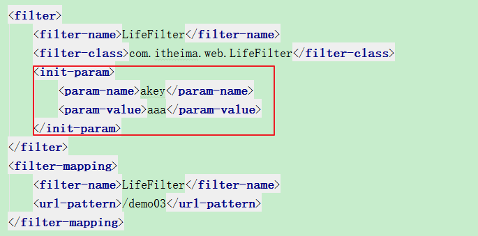
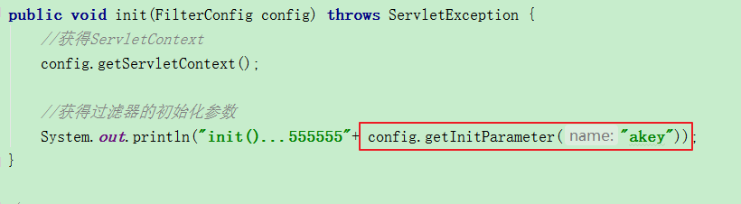
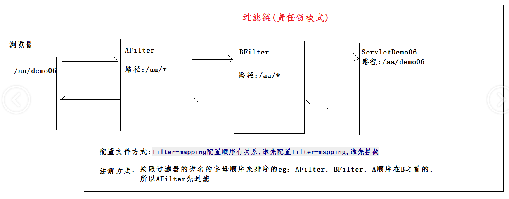
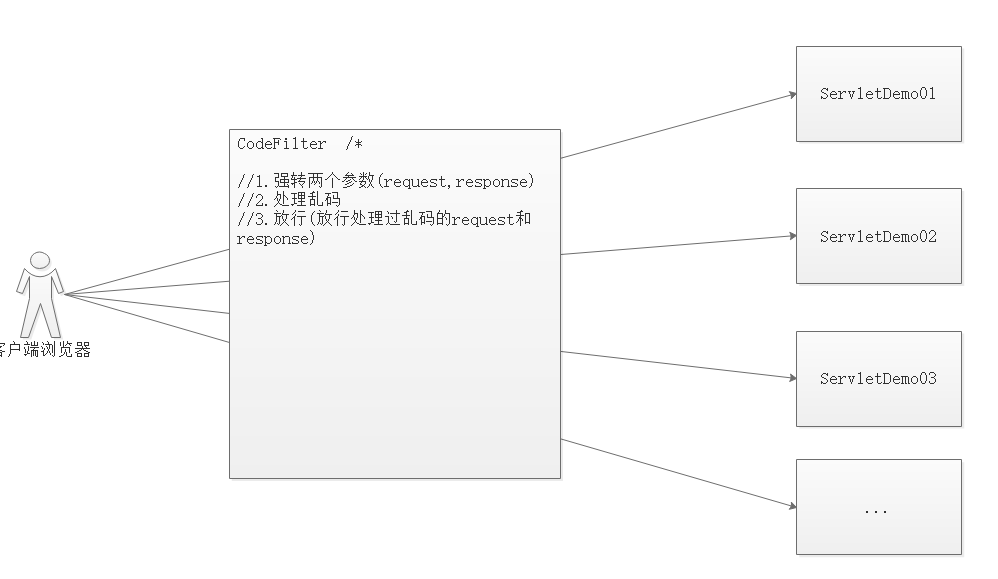
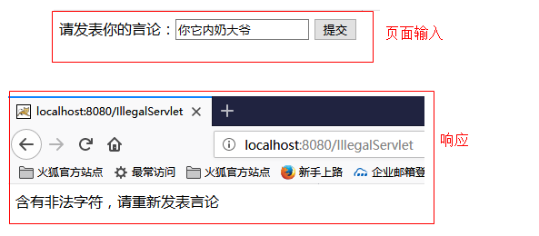
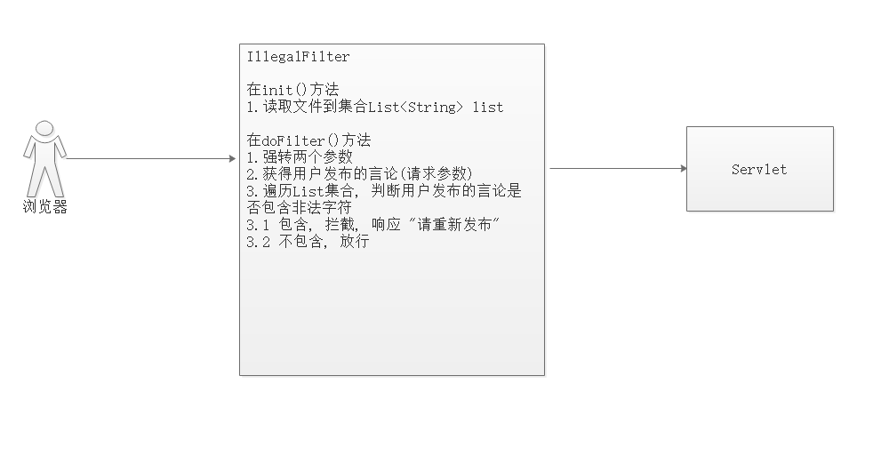
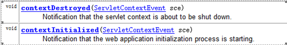
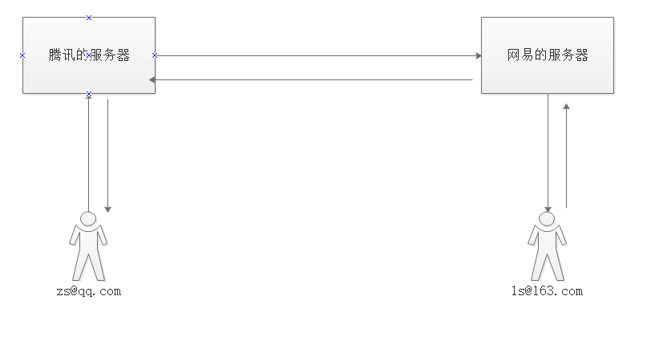
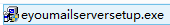
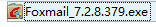

# day27-filter&listener&邮箱

# 今日内容

- Filter过滤器-------------->重点
  - 使用方式
  - 生命周期
  - 映射路径
  - 过滤器链
  - 设置拦截方式
  - 案例
- Listener监听器
  - ServletContextListener监听器使用
- 邮箱
  - 邮箱服务器搭建
  - Java代码发送邮件
- 扩展
  - 密码
  - 退出登录

# 第一章-Filter

## 1.1 Filter概述

#### 什么是filter 

- 过滤器是一个运行在服务器的程序, 优先于请求资源(Servlet或者jsp,html)之前执行. 过滤器是javaweb技术中**最为实用**的技术. 
- 也就是说在程序中访问服务器资源时，当一个请求到来，服务器首先判断是否有过滤器与请求资源相关联，如果有，过滤器可以将请求拦截下来，完成一些特定的功能，再由过滤器决定是否交给请求资源。如果没有则像之前那样直接请求资源了。响应也是类似的！
- Filter接口：创建一个类实现Filter接口,该类就是一个过滤器类,如果要让过滤器起到过滤的作用,还需要配置拦截路径


#### 过滤器的作用

​	对目标资源(Servlet,jsp)进行过滤.  

​	应用场景:登录权限检查,解决网站乱码,过滤敏感字符 ...   


## 1.2 Filter入门

- Filter 是一个接口。如果想实现过滤器的功能，**必须实现该接口,然后配置过滤的路径**！

#### 通过xml配置方式 

- 创建一个类实现Filter接口
- 在web.xml文件中配置过滤路径

```java
/**
 * @Author：pengzhilin
 * @Date: 2021/5/9 9:08
 */
@WebServlet("/ServletDemo1")
public class ServletDemo1 extends HttpServlet {
    protected void doPost(HttpServletRequest request, HttpServletResponse response) throws ServletException, IOException {
        System.out.println("来到了ServletDemo1...");
    }

    protected void doGet(HttpServletRequest request, HttpServletResponse response) throws ServletException, IOException {
        doPost(request, response);
    }
}
```

- 在web.xml对过滤器进行配置

```xml
<filter>
        <filter-name>FilterDemo1</filter-name>
        <filter-class>com.itheima.demo1_filter入门.FilterDemo1</filter-class>
    </filter>
    <filter-mapping>
        <filter-name>FilterDemo1</filter-name>
        <url-pattern>/ServletDemo1</url-pattern>
    </filter-mapping>
```

#### 通过注解方式  

- 创建一个类实现Filter接口
- 直接在这个类上面添加@WebFilter注解进行配置

```java
@WebFilter("/ServletDemo2")
public class FilterDemo2 implements Filter {
    @Override
    public void init(FilterConfig filterConfig) throws ServletException {

    }

    @Override
    public void doFilter(ServletRequest servletRequest, ServletResponse servletResponse, FilterChain filterChain) throws IOException, ServletException {
        System.out.println("来到了FilterDemo2过滤器...");
        // 放行
        filterChain.doFilter(servletRequest,servletResponse);
    }

    @Override
    public void destroy() {

    }
}
```

#### 模板创建Filter过滤器

- 选中包右键----->Filter(create new filter)按钮

  ```java
  @WebFilter("/ServletDemo3")
  public class FilterDemo3 implements Filter {
      public void destroy() {
      }
  
      public void doFilter(ServletRequest req, ServletResponse resp, FilterChain chain) throws ServletException, IOException {
          // 过滤...
          System.out.println("来到了FilterDemo3过滤器...");
  
          // 放行
          chain.doFilter(req, resp);
      }
  
      public void init(FilterConfig config) throws ServletException {
  
      }
  
  }
  ```

  

## 1.3 Filter的生命周期【重点】

#### Filter生命周期介绍 

​	过滤器从创建到销毁的过程   

#### Filter生命周期描述

1. 服务器启动的时候,就会创建过滤器,然后会调用init()方法进行初始化【调用一次】

2. 任何一次请求都会调用doFilter()方法进行过滤【路径相匹配】

3. 服务器正常关闭或者项目从服务器移除, 调用destory()方法进行销毁【调用一次】

   ```java
   
   /**
    * @Author：pengzhilin
    * @Date: 2021/5/9 9:35
    */
   @WebFilter("/ServletDemo4")
   public class FilterDemo4 implements Filter {
   
       public void init(FilterConfig config) throws ServletException {
           System.out.println("FilterDemo4...init...初始化...");
       }
   
   
       public void doFilter(ServletRequest req, ServletResponse resp, FilterChain chain) throws ServletException, IOException {
           // 过滤操作
           System.out.println("FilterDemo4...doFilter...过滤操作...");
   
           // 放行
           chain.doFilter(req, resp);
       }
   
       public void destroy() {
           System.out.println("FilterDemo4...destroy...销毁...");
       }
   
   }
   
   ```

   

#### FilterConfig【了解】

获得过滤器的初始化参数

- 配置初始化参数



- 在Filter的init()方法里面获得了



 


## 1.4 映射路径

​	假设有一个管理员权限的过滤器，它应该对用户发出的管理员功能的请求进行条件的过滤。但是当用户发出登录、注册等请求的时候，不应该进行过滤。所以我们过滤器，应该有选择的过滤器请求。这就需要学习配置过滤器不同的映射路径，从而让过滤器过滤希望过滤器的请求。

#### 完全路径匹配

以"/"开始 

```
/demo01 ---> 过滤器只能拦截路径/demo01; 
```

#### 目录匹配

以"/"开始 以 *结束 .    

```
/* --->当前项目下的所有的路径都可以拦截;   /aa/*  ---> 可以拦截 /aa/bb, /aa/bb/cc
```

#### 扩展名匹配

以"*"开始 例如: *.jsp  *.do   

```
*.do--->可以拦截路径的后缀是 do的 ;  *.jsp--->拦截所有JSP
```


## 1.5 拦截方式

​	有了上面学习的映射路径，我们可以控制过滤器过滤指定的内容，但是我们在访问资源的时候，并不是每次都是直接访问，有时是以转发的方式访问的，这就需要我们要让过滤器可以区分不同的访问资源的方式，有不同的拦截方式。 是通过 DispatcherType 来指定的.

### 配置方式

+ 通过dispatcherTypes配置拦截方式

  + DispatcherType.FORWARD: 【只】过滤转发

  + DispatcherType.REQUEST: 除了转发以为其它的都过滤(1.浏览器的直接请求 2.重定向)【默认值】

+ 拦截方式的这个值,我们可以配置多个

  ```java
  @WebFilter(value = {"/demo06"},dispatcherTypes={DispatcherType.FORWARD,DispatcherType.REQUEST})
  ```

> 一般情况下, 转发我们不会过滤的. 转发属于服务器内部的行为.  直接使用默认值的情况偏多

```java
@WebFilter(value = "/ServletDemo9",dispatcherTypes = {DispatcherType.REQUEST,DispatcherType.FORWARD})
public class FilterDemo9 implements Filter {
    public void destroy() {
    }

    public void doFilter(ServletRequest req, ServletResponse resp, FilterChain chain) throws ServletException, IOException {
        System.out.println("来到了FilterDemo9过滤器,然后不放行....");
        // 放行
        //chain.doFilter(req, resp);
    }

    public void init(FilterConfig config) throws ServletException {

    }

}
```


## 1.6 过滤器链  

- 概述: FilterChain 是一个接口，代表过滤器链对象。过滤器可以定义多个，就会组成过滤器链。
- 过滤器链作用：当一个filter收到请求的时候,调用chain.doFilter才可以访问下一个匹配的filter,若当前的filter是最后一个filter,调用chain.doFilter才能访问目标资源

**过滤器链执行顺序:**

+ 配置文件:  谁先配置`filter-mapping` 谁先执行
+ 注解方式: 按照Filter的首字母顺序 eg: AFilter BFilter A在B的前面, AFilter先执行




```java

/**
 * @Author：pengzhilin
 * @Date: 2021/5/9 10:20
 */
@WebFilter("/ServletDemo10")
public class FilterDemo10 implements Filter {
    public void destroy() {
    }

    public void doFilter(ServletRequest req, ServletResponse resp, FilterChain chain) throws ServletException, IOException {
        // 过滤
        System.out.println("来到了FilterDemo10过滤器...");

        // 过滤器链对象放行
        chain.doFilter(req, resp);

        // 放行之后执行
        System.out.println("FilterDemo10过滤器放行之后执行的代码...");
    }

    public void init(FilterConfig config) throws ServletException {

    }

}
```

```java

/**
 * @Author：pengzhilin
 * @Date: 2021/5/9 10:20
 */
@WebFilter("/ServletDemo10")
public class FilterDemo11 implements Filter {
    public void destroy() {
    }

    public void doFilter(ServletRequest req, ServletResponse resp, FilterChain chain) throws ServletException, IOException {
        // 过滤
        System.out.println("来到了FilterDemo11过滤器...");

        // 过滤器链对象放行
        chain.doFilter(req, resp);

        // 放行之后执行
        System.out.println("FilterDemo11过滤器放行之后执行的代码...");
    }

    public void init(FilterConfig config) throws ServletException {

    }

}

```

```java

/**
 * @Author：pengzhilin
 * @Date: 2021/5/9 10:22
 */
@WebServlet("/ServletDemo10")
public class ServletDemo10 extends HttpServlet {
    protected void doPost(HttpServletRequest request, HttpServletResponse response) throws ServletException, IOException {
        System.out.println("执行ServletDemo10...");
    }

    protected void doGet(HttpServletRequest request, HttpServletResponse response) throws ServletException, IOException {
        doPost(request, response);
    }
}

```

- 结果:

  ```java
  来到了FilterDemo10过滤器...
  来到了FilterDemo11过滤器...
  执行ServletDemo10...
  FilterDemo11过滤器放行之后执行的代码...
  FilterDemo10过滤器放行之后执行的代码...
  ```

  

## 1.7:统一全网站中文乱码的处理

### 1,需求分析

​	在整个网站中,可能会有get请求或post请求向服务器提交参数.参数中往往有中文信息.在后台每个Servlet中都需要去处理乱码. 

​	我们想做的是：请求到达Servlet中.就可以直接调用getParameter方法获得请求参数,请求参数已经没有乱码了.

### 2,思路分析

  

### 3,代码实现

```java
/**
 * @Author：pengzhilin
 * @Date: 2021/5/9 10:49
 */
@WebServlet("/ServletDemo14")
public class ServletDemo14 extends HttpServlet {
    protected void doPost(HttpServletRequest request, HttpServletResponse response) throws ServletException, IOException {
        // 接收请求参数
        String username = request.getParameter("username");
        System.out.println("参数username:"+username);

        // 响应中文
        response.getWriter().println("您传过来的参数是:"+username);
    }

    protected void doGet(HttpServletRequest request, HttpServletResponse response) throws ServletException, IOException {
        doPost(request, response);
    }
}

```


## 1.8:非法字符过滤  ##

### 1,需求分析 ###

​	当用户发出非法言论的时候，提示用户言论非法。

​	效果:

​		

 


### 2,思路分析 ###

1.创建一个表单用于发表言论。

2.创建一个txt文件，其中存入非法字符。

3.创建一个Filter，拦截请求。在init方法中将txt文件中的非法字符读取到内存中。

4.获取请求中的参数，对请求的参数进行非法字符的校验。

5.如果言论中不含有非法字符，就放行。

6.如果言论中含有非法字符，就拦截，并且提示用户非法言论。

  

### 3,代码实现 ###

+ IllegalFilter

```java

/**
 * @Author：pengzhilin
 * @Date: 2021/5/9 10:59
 */
@WebFilter("/bb/*")
public class FilterIllegal implements Filter {

    // 定义一个集合,用来存储所有的非法或者不文明字符
    private ArrayList<String> list = new ArrayList<>();

    public void destroy() {
    }

    public void doFilter(ServletRequest req, ServletResponse resp, FilterChain chain) throws ServletException, IOException {
        //2.在doFilter方法中:
        //2.1 请求和响应对象进行转型
        HttpServletRequest request = (HttpServletRequest) req;
        HttpServletResponse response = (HttpServletResponse) resp;

        //2.2 使用请求对象获得提交的言论
        String message = request.getParameter("message");

        //2.3 判断提交的言论中是否包含不文明或者不合法的字符
        for (String msg : list) {
            //2.4 如果有,就替换这些字符,直接响应到页面,不放行
            if (message.contains(msg)) {
                message = message.replace(msg, "***");
                response.getWriter().println("您发表的言论是:" + message);
                return;// 结束方法--->不放行
            }
        }

        //2.5 如果没有,就直接放行到Servlet
        chain.doFilter(request, response);
    }

    public void init(FilterConfig config) throws ServletException {
        // 1.在init方法中读IllegalWords.txt文件中的数据到内存中
        BufferedReader br = null;
        try {
            // 1.1 获得关联IllegalWords.txt文件的输入流
            InputStream is = config.getServletContext().getResourceAsStream("IllegalWords.txt");

            // 1.2 把输入流转换为字符缓冲输入流
            InputStreamReader isr = new InputStreamReader(is, "utf-8");
            br = new BufferedReader(isr);

            // 1.3 定义String类型的变量,用来存储读取到的行数据
            String line = null;

            // 1.4 循环读取行数据
            while ((line = br.readLine()) != null) {
                // 1.5 在循环中,把读取到的行数据存储到集合中
                list.add(line);
            }

        } catch (IOException e) {
            e.printStackTrace();
        } finally {
            // 1.6 释放资源
            try {
                br.close();
            } catch (IOException e) {
                e.printStackTrace();
            }
        }
    }

}

```


# 第二章-监听器Listener

## 2.1 Listener概述

#### 什么是Listener  

​	监听器就是一个Java类,用来监听其他的JavaBean对象的变化  

​	在javaweb中监听器就是监听**三个域对象**的状态的。request,session,servletContext(application)

#### 监听器的应用

​	主要在Swing编程   

​	在Android/ios大量应用  

​	JS里面的事件 

#### 监听器的术语

eg: 一个狗仔拍明星出轨

​	 事件源 :被监听的对象.(目标对象)               	明星 

 	监听器对象：监听的对象.              				 狗仔				

​	 事件：事件源行为的称呼.         					  出轨		  	

​	 注册(绑定):将"监听器"对象注册给"事件源".   狗仔需要和明星绑定(跟踪, 蹲点...)

​	 事件对象:在"监听器对象"中获得"事件源"      狗仔的镜头里面获得明星出轨证据


## 2.2 javaweb中的监听器介绍

#### javaweb的监听器  

​	javaweb的监听器:监听ServletContext,HttpSession,ServletRequest三个域对象状态

​	事件源和监听器绑定的过程:通过配置web.xml完成

#### JavaWeb中的监听器类型

+ 三类8个
  + 监听三个域对象的创建和销毁的监听器（三个）
    + ServletContextListener
    + HttpSessionListener
    + ServletRequestListener
  + 监听三个域对象的属性变更（属性添加、移除、替换）的监听器（三个）
    + ServletContextAttributeListener
    + HttpSessionAttributeListener
    + ServletRequestAttributeListener
  + 监听HttpSession中JavaBean的状态改变（钝化、活化、绑定、解除绑定）的监听（两个）
    + HttpSessionBindingListener
    + HttpSessionActivationListener

> 只讲解 监听ServletContext的创建和销毁.

#### JavaWeb的监听器使用步骤

1. 创建一个类实现监听器接口
2. 在web.xml进行配置(绑定)


## 2.3 ServletContextListener监听器的使用

- 作用:
  
  - 用来监听ServletContext域对象的创建和销毁
- 回滚Servletcontext创建和销毁
  - 创建: 在服务器启动时候,为每个web应用场景单独的ServletContext对象
  - 销毁: 在服务器关闭的时候,或者项目从web服务器中移除的时候

- ServletContextListener监听器的方法方法:

  

- 企业中应用

  初始化工作. 

  eg:启动Spring容器,把Spring框架初始化好. 等来了请求的时候就不需要初始化了,来了请求, 处理请求就比较快了

**步骤:**

1. 创建一个类实现ServletContextListener 
2. 在web.xml配置监听器

**代码:**

- JAVA代码

  ```java
  import javax.servlet.ServletContextEvent;
  import javax.servlet.ServletContextListener;
  
  /**
   * @Author：pengzhilin
   * @Date: 2021/5/9 11:46
   */
  public class MyServletContextListener implements ServletContextListener {
      @Override
      public void contextInitialized(ServletContextEvent servletContextEvent) {
          System.out.println("ServletContext...创建了...");
      }
  
      @Override
      public void contextDestroyed(ServletContextEvent servletContextEvent) {
          System.out.println("ServletContext...销毁了...");
      }
  }
  
  ```

- 配置(web.xml)

  ```xml
  <listener>
      <listener-class>com.itheima.demo8_监听器.MyServletContextListener</listener-class>
  </listener>
  
  ```


# 第三章-邮箱

### 1.邮件流程

 

### 2.邮件服务器

#### 2.1服务器

+ 硬件+软件(eg: mysql, tomcat,MailServer...)

#### 2.2邮件服务器

1. ==租(企业邮箱)==
2. 自己搭建

### 3.邮件软件安装

1. 服务端

 

2. 客户端 

 

### 4.邮件的发送

1. 直接通过Foxmail发送

2. 通过java代码发送
   + 拷贝jar
   + 拷贝工具类
   + 使用工具类发送
   
   ```java
   
   /**
    * 发送邮件工具类
    */
   public class MailUtil {
   	private MailUtil(){}
   	/**
   	 * 发送邮件
   	 * 参数一:发送邮件给谁
   	 * 参数二:发送邮件的内容
   	 */
   	public static void sendMail(String toEmail, String emailMsg) throws Exception {
   		//1_创建Java程序与eyou邮件服务器的连接对象
   		Properties props = new Properties();
   		props.put("mail.smtp.host", "localhost");
   		props.put("mail.smtp.auth", "true");
   		Authenticator auth = new Authenticator() {
   			public PasswordAuthentication getPasswordAuthentication() {
   				return new PasswordAuthentication("zs", "123456"); //类似登录
   			}
   		};
   		Session session = Session.getInstance(props, auth);
   		//2_创建一封邮件
   		Message message = new MimeMessage(session);
   		message.setFrom(new InternetAddress("zs@itheima.com"));//设置发件人
   		message.setRecipient(RecipientType.TO, new InternetAddress(toEmail));//设置收件人
   		message.setSubject("用户激活");
   		message.setContent(emailMsg, "text/html;charset=UTF-8");//设置发送的内容
   		//3_发送邮件
   		Transport.send(message);
   	}
   
   	public static void sendMail(String fromName,String password,String fromEmail,String toEmail,String subject, String emailMsg) throws Exception {
   		//1_创建Java程序与eyou邮件服务器的连接对象
   		Properties props = new Properties();
   		props.put("mail.smtp.host", "localhost");
   		props.put("mail.smtp.auth", "true");
   		Authenticator auth = new Authenticator() {
   			public PasswordAuthentication getPasswordAuthentication() {
   				return new PasswordAuthentication(fromName, password); //类似登录
   			}
   		};
   		Session session = Session.getInstance(props, auth);
   		//2_创建一封邮件
   		Message message = new MimeMessage(session);
   		message.setFrom(new InternetAddress(fromEmail));//设置发件人
   		message.setRecipient(RecipientType.TO, new InternetAddress(toEmail));//设置收件人
   		message.setSubject(subject);
   		message.setContent(emailMsg, "text/html;charset=UTF-8");//设置发送的内容
   		//3_发送邮件
   		Transport.send(message);
   	}
   	/**
   	 * 测试类
   	 */
   	public static void main(String[] args) throws Exception{
   		// String toEmail = "ls@itheima.com";// 收件人邮箱
   		// String emailMsg = "<a href = 'http://www.itheima.com'>激活账户</a>";
   		// sendMail(toEmail,emailMsg);
   		String fromName = "ww";// 发件人邮箱的名字
   		String password = "123456";// 发件人邮箱的密码
   		String fromEmail = "ww@itheima.com";// 发件人的邮箱
   		String toEmail = "zs@itheima.com";// 收件人的邮箱
   		String subject = "5月份会议内容";// 邮件主题
   		String emailMsg = "5月份一直加班到月底....";// 邮件内容
   		sendMail(fromName,password,fromEmail,toEmail,subject,emailMsg);
   
   		System.out.println("发送邮件成功!");
   	}
   }
   ```
   
   

# 第四章-扩展

### 1.密码加密

+ 可逆:   加密之后还可以解密
+ 不可逆:  加密之后 不可以解密 

### 2.MD5加密算法

+ 不可逆
+ 步骤  直接拷贝工具类进行加密

### 3.保证MD5加密算法安全

1. 前端控制(避免密码过于简单),加密多次

2. 加盐

   

### 4.修改注册和登录功能(密码的加密)

+ 登陆的时候 按照 注册那种方式加密一下, 再去查询数据库 就OK了

+ 修改注册Servlet的代码

  ```java
  package com.itheima.web;
  
  import com.itheima.bean.User;
  import com.itheima.utils.C3P0Utils;
  import com.itheima.utils.Md5Util;
  import org.apache.commons.beanutils.BeanUtils;
  import org.apache.commons.dbutils.QueryRunner;
  
  import javax.servlet.ServletException;
  import javax.servlet.annotation.WebServlet;
  import javax.servlet.http.HttpServlet;
  import javax.servlet.http.HttpServletRequest;
  import javax.servlet.http.HttpServletResponse;
  import java.io.IOException;
  import java.util.Map;
  
  /**
   * @Author：pengzhilin
   * @Date: 2021/5/5 15:50
   */
  @WebServlet("/ServletRegister")
  public class ServletRegister extends HttpServlet {
  
  
      protected void doPost(HttpServletRequest request, HttpServletResponse response) throws ServletException, IOException {
          try {
              //1.处理请求和响应乱码
              request.setCharacterEncoding("utf-8");
              response.setContentType("text/html;charset=utf-8");
  
              //2.获得浏览器提交的数据(请求参数)
              Map<String, String[]> map = request.getParameterMap();
  
              //3.封装请求参数--->User对象
              User user = new User();
              BeanUtils.populate(user, map);
              // 单独设置状态属性
              user.setStatus("0");
              System.out.println("user:" + user);
  
              // 对密码进行加密
              // 获得用户输入的密码
              String password = user.getPassword();
  
              // 对密码进行加盐
              password = user.getUsername() + password + "szitheima113";
  
              // 使用md5加密
              String md5Password = Md5Util.encodeByMd5(password);
  
              // 把加密之后的密码存储到user对象中
              user.setPassword(md5Password);
  
              //4.创建QueryRunner对象
              QueryRunner qr = new QueryRunner(C3P0Utils.getDataSource());
  
              //5.调用update方法把数据插入到数据库,返回受影响的行数
              String sql = "insert into user values(null,?,?,?,?,?,?,?)";
              Object[] args = {
                      user.getUsername(),
                      user.getPassword(),
                      user.getAddress(),
                      user.getNickname(),
                      user.getGender(),
                      user.getEmail(),
                      user.getStatus()
              };
              int rows = qr.update(sql, args);
  
              //6.判断受影响的行数:
              if (rows > 0) {
                  //6.1 如果大于0,重定向到成功页面(success.html)
                  response.sendRedirect(request.getContextPath()+"/login.html");
              } else {
                  //6.2 如果不大于0,重定向到失败页面(failed.html)
                  response.sendRedirect(request.getContextPath()+"/failed.html");
              }
          } catch (Exception e) {
              e.printStackTrace();
              // 失败了
              response.sendRedirect(request.getContextPath()+"/failed.html");
          }
      }
  
      protected void doGet(HttpServletRequest request, HttpServletResponse response) throws ServletException, IOException {
          doPost(request, response);
      }
  
  
  }
  
  ```

+ 登录Servlet的代码修改

  ```java
  package com.itheima.web;
  
  import com.itheima.bean.User;
  import com.itheima.utils.C3P0Utils;
  import com.itheima.utils.Md5Util;
  import org.apache.commons.dbutils.QueryRunner;
  import org.apache.commons.dbutils.handlers.BeanHandler;
  
  import javax.servlet.ServletException;
  import javax.servlet.annotation.WebServlet;
  import javax.servlet.http.Cookie;
  import javax.servlet.http.HttpServlet;
  import javax.servlet.http.HttpServletRequest;
  import javax.servlet.http.HttpServletResponse;
  import java.io.IOException;
  import java.sql.SQLException;
  
  /**
   * @Author：pengzhilin
   * @Date: 2021/5/5 16:15
   */
  @WebServlet("/ServletLogin")
  public class ServletLogin extends HttpServlet {
      protected void doPost(HttpServletRequest request, HttpServletResponse response) throws ServletException, IOException {
          try {
              // 1.处理乱码
              request.setCharacterEncoding("utf-8");
              response.setContentType("text/html;charset=utf-8");
  
              // *********************校验验证码*******************************
              // 1.获得用户输入的验证码
              String checkCode = request.getParameter("checkCode");
  
              // 2.获得事先生成的验证码
              String code = (String) request.getSession().getAttribute("checkCode");
  
              // 3.校验
              if (!checkCode.equalsIgnoreCase(code)) {
                  System.out.println("验证码失败...");
                  // 不相等,响应失败页面
                  response.sendRedirect(request.getContextPath() + "/failed.html");
                  // 提前结束程序
                  return;
              }
  
  
              // *********************校验用户名和密码*******************************
              // 2.获得请求参数(用户输入的用户名和密码)
              String username = request.getParameter("username");
              String password = request.getParameter("password");
  
              // 对密码进行加密,使用加密之后的密码进行查询
              // 对密码进行加盐
              password = username + password + "szitheima113";
  
              // 使用md5加密
              String md5Password = Md5Util.encodeByMd5(password);
  
  
  
              // 3.创建QueryRunner对象
              QueryRunner qr = new QueryRunner(C3P0Utils.getDataSource());
  
              // 4.调用query方法查询数据库,把结果封装成User对象
              String sql = "select * from user where username = ? and password = ?";
              User user = qr.query(sql, new BeanHandler<User>(User.class), username, md5Password);
  
              // 5.判断是否登录成功(判断user对象是否为null)
              if (user == null) {
                  System.out.println("用户名或者密码错误...");
                  // 5.1 如果为null,表示登录失败,重定向到失败页面
                  response.sendRedirect(request.getContextPath() + "/failed.html");
  
              } else {
                  // ***************实现记住用户名的功能(登录成功才去记住用户名)*************************
                  //1.获得记住用户名复选框的值
                  String remember = request.getParameter("remember");
  
                  //2.判断复选框是否勾选(值是否为ok或者null)
                  if (remember != null && "ok".equals(remember)) {
                      //3.如果值不为null,为ok,那么就勾选了记住用户名复选框
                      //3.1 创建Cookie对象,保存用户名
                      Cookie cookie = new Cookie("username", username);
                      //3.2 设置Cookie对象的有效时长
                      cookie.setMaxAge(60*60*24*7);
                      //3.3 设置Cookie对象的有效路径
                      cookie.setPath(request.getContextPath());
                      //3.4 响应Cookie对象给浏览器
                      response.addCookie(cookie);
                  }else {
                      //4. 如果复选框没有勾选,
                      //3.1 创建Cookie对象,保存空值,键还是和之前的Cookie的键一样
                      Cookie cookie = new Cookie("username", "");
                      //3.2 设置Cookie对象的有效时长为0
                      cookie.setMaxAge(0);
                      //3.3 设置Cookie对象的有效路径,还是和之前的Cookie的有效路径一样
                      cookie.setPath(request.getContextPath());
                      //3.4 响应Cookie对象给浏览器
                      response.addCookie(cookie);
                  }
  
  
                  // 5.2 如果不为null,表示登录成功,重定向到成功页面
                  response.sendRedirect(request.getContextPath() + "/success.html");
              }
          } catch (Exception e) {
              // 异常(失败)
              response.sendRedirect(request.getContextPath() + "/failed.html");
          }
  
  
      }
  
      protected void doGet(HttpServletRequest request, HttpServletResponse response) throws ServletException, IOException {
          doPost(request, response);
      }
  }
  
  ```

### 5.权限校验(session)

- 只能校验一个页面,如果多个页面需要校验,就需要每个页面加判断----->改进参考7过滤器权限校验

- 修改ServletLogin

  ```java
  // 使用session域对象存储user对象
  request.getSession().setAttribute("user",user);
  
  // 5.2 如果不为null,表示登录成功,重定向到成功页面
  response.sendRedirect(request.getContextPath() + "/success.jsp");
  ```

- 把success.html换成success.jsp

  ```jsp
  <%@ page contentType="text/html;charset=UTF-8" language="java" %>
  <%@ taglib prefix="c" uri="http://java.sun.com/jsp/jstl/core" %>
  <html>
  <head>
      <title>Title</title>
  </head>
  <body>
  <!--如果user不为null,说明有登录,就显示成功页面-->
  <c:if test="${not empty user}">
      success....<br/>
      欢迎${user.username}---<a href="#">退出登录</a>
  </c:if>
  <!--如果user为null,说明没有登录,就显示提示信息: 小子,你还没有登录呢,赶紧去<a>登录</a>-->
  <c:if test="${empty user}">
      小子,你还没有登录呢,赶紧去<a href="login.jsp">登录</a>
  </c:if>
  
  </body>
  </html>
  
  ```

  

### 6.退出登录

#### 5.1 思路

1. 修改success.jsp的超链接 请求LogoutServlet
2. 在LogoutServlet里面, 移除session里面存的user, 重定向到首页

#### 5.2实现

+ 超链接

```html
<body>
<!--如果user不为null,说明有登录,就显示成功页面-->
<c:if test="${not empty user}">
    success....<br/>
    欢迎${user.username}---<a href="LogoutServlet">退出登录</a>
</c:if>
<!--如果user为null,说明没有登录,就显示提示信息: 小子,你还没有登录呢,赶紧去<a>登录</a>-->
<c:if test="${empty user}">
    小子,你还没有登录呢,赶紧去<a href="login.jsp">登录</a>
</c:if>
```


+ LogoutServlet

```java
@WebServlet("/LogoutServlet")
public class LogoutServlet extends HttpServlet {
    protected void doPost(HttpServletRequest request, HttpServletResponse response) throws ServletException, IOException {
        //    移除session对象中的user对象
        request.getSession().removeAttribute("user");
        //     重定向登录页面
        response.sendRedirect("login.jsp");
    }

    protected void doGet(HttpServletRequest request, HttpServletResponse response) throws ServletException, IOException {
        doPost(request, response);
    }
}

```


### 7.过滤器进行权限校验

- 思路:

  

- 实现:

  - 登录成之后,需要把user对象存储到session域对象中

  - 定义一个过滤器类

    ```java
    
    /**
     * @Author：pengzhilin
     * @Date: 2021/5/9 16:13
     */
    @WebFilter("/*")
    public class FilterAuth implements Filter {
        public void destroy() {
        }
    
        public void doFilter(ServletRequest req, ServletResponse resp, FilterChain chain) throws ServletException, IOException {
            //1.创建一个过滤器类实现过滤器接口
            //2.设置过滤器的路径为 /*
            //3.获取请求的urI路径--->浏览器请求的路径(拦截的路径)
            HttpServletRequest request = (HttpServletRequest) req;
            HttpServletResponse response = (HttpServletResponse) resp;
            String requestURI = request.getRequestURI();
    
            //4.判断路径中是否包含(index,login,register,......)
            if (requestURI.contains("index") || requestURI.contains("login") || requestURI.contains("register")|| requestURI.contains("ServletCode")) {
                //4.1 如果包含,就直接放行
                chain.doFilter(request, response);
            } else {
                //4.2 如果不包含,就继续校验是否登录
                HttpSession session = request.getSession();
                User user = (User) session.getAttribute("user");
    
                if (user == null) {
                    //4.2.1. 如果没有登录(session对象中的user是否空),就不放行.,重定向到登录页面
                    response.sendRedirect("login.jsp");
                    return;
                } else {
                    //4.2.2  如果有登录(session对象中的user是否空),就放行
                    chain.doFilter(request, response);
                }
            }
        }
    
        public void init(FilterConfig config) throws ServletException {
    
        }
    
    }
    
    ```

    


# 总结

```java
必须练习:
	1.统一全网站中文乱码处理--->1.7
    2.非法字符过滤---->1.8
    3.扩展登录权限校验 ----->扩展7
    4.退出登录------>扩展6
    5.密码加密和解码---->扩展4
    6.ServletContextListener监听ServletContext的创建和销毁--->2.3
        
- 能够说出过滤器的作用
    对目标资源(Servlet,jsp)进行过滤.  
	应用场景:登录权限检查,解决网站乱码,过滤敏感字符 ...   

- 能够编写过滤器
  方式一:
       * - 创建一个类实现Filter接口
       * - 在web.xml对过滤器进行配置
  方式二:
       * - 创建一个类实现Filter接口
       * - 直接在这个类上面添加注解进行配置
           
- 能够说出过滤器生命周期相关方法
  1. 服务器启动的时候, 会创建过滤器对象,调用init()方法进行初始化【调用一次】
  2. 任何一次请求都会调用doFilter()方法进行过滤【路径相匹配】
  3. 服务器正常关闭或者项目从服务器移除, 调用destory()方法进行销毁【调用一次】

- 能够说出什么是过滤器链
   当一个filter收到请求的时候,调用chain.doFilter才可以访问下一个匹配的filter,若当前的filter是最后一个filter,调用chain.doFilter才能访问目标资源
           
- 能够编写过滤器解决全局乱码案例
     创建过滤器类,在doFilter方法中处理请求和响应乱码,然后过滤器的路径配置为/*即可
           
- 能够编写ServletContextListener
    1. 创建一个类实现ServletContextListener 
	2. 在web.xml配置监听器

- 能够搭建邮箱服务器	
	02_资料--->02-邮件相关资料---->邮件服务器搭建
	配置邮箱的域名---->创建用户名和密码
	
- 能够通过Java代码发送邮件
	使用工具类调用方法,传入参数即可
	
```


