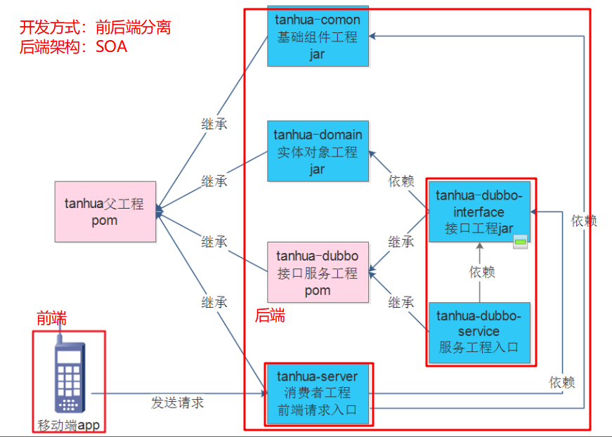

# 探花功能介绍

交友模块：搜附近（课上）   探花  测灵魂  桃花传音（项目实战）

圈子模块：好友圈子  推荐圈子（陌生人）

消息模块：即时聊天  点赞 评论 喜欢 公告等消息 好友列表 

视频模块：小视频

我的模块：我的基本信息功能、编辑个人信息   互相喜欢 喜欢 粉丝  我的动态 谁看过我  通用设置 


# 今日内容介绍


# 项目架构介绍

- 使用MongoDB 实现附近的人的解决方案 
- 使用Spark + Mllib实现智能推荐的解决方案
- 使用MongoDB进行海量数据的存储的解决方案
- 使用采用分布式文件系统存储小视频数据的解决方案
- 使用百度人脸识别的解决方案


# 前后端分离开发方式

什么是前后端分离开发？  前端课程（前端工程师） java课程（后台工程师）

为什么要前后端分离开发？解耦、各司其职、高效

前端：

- flutter + android + 环信SDK + redux + shared_preferences + connectivity + iconfont + webview + sqflite

后端：

- Spring Boot + SpringMVC + Mybatis + MybatisPlus + Dubbo+Zookeeper（SOA面向服务结构-消费者 服务提供者）
- MongoDB geo 实现地理位置查询
- MongoDB 实现海量数据的存储
- Redis 数据的缓存
- Spark + MLlib 实现智能推荐
- 第三方服务 环信即时通讯 
- 第三方服务 阿里云 OSS 、 短信服务


# 虚拟机环境搭建


 


账号：root  密码：root123

查看当前虚拟机网卡ip：ifconfig ens33

 

编辑ip

 

 

**重点注意！！！** 

```
将以前容器全部删除！！！
docker rm `docker ps -a -q`

cd /root/docker-file/base
docker-compose up -d
```


# 模拟器安装


注意：以管理员身份安装  都默认路径安装

如果安装apk闪退了

方式一：设置下兼容模式

 

方式二：安装其它模拟器  夜神 雷电等 

# 工程环境搭建

注意：

​	**tanhua_server：**

​	tanhua_server接口路径 方式 参数 响应结果 必须按照接口文档 (相当于controller 接收 跟 响应）

​        探花业务逻辑实现在tanhua_server中service包实现

​        tanhua_server中不操作数据库

​       **tanhua-dubbo-interface**： **接口必须要一样** 

​       tanhua_server作为消费者 调用 tanhua-dubbo-interface作为服务提供者 操作数据库（mysql mongdb等）

tanhua-common：自动装配 抽时间把之前老师讲过springboot自动装配 原理看看



# dubbo整合

## dubbo整合分析

### 需求

1、编写dubbo服务提供者  **完成用户保存返回用户id**     和     **根据手机号码查询用户功能**

2、编写dubbo消费者，调用提供者测试

### 消费者

1. 创建controller接收请求 

2. service层业务处理，通过调用服务提供者 来达到操作数据效果

   用户保存返回用户id

   根据手机号码查询用户功能

3. 将操作结果返回给页面

4. 在tanhua-dubbo-server创建配置文件

5. 在tanhua-dubbo-server创建启动类

### 服务提供者

1. 数据库表tb_user
2. 在tanhua-domain模块中创建User实体对象
3. tanhua-dubbo-interface创建服务接口
4. 在tanhua-dubbo-service创建服务实现类
5. 在tanhua-dubbo-service创建dao包dao接口
6. 在tanhua-dubbo-service创建配置文件
7. 在tanhua-dubbo-service创建启动类

## 测试

1.需要检查工程是否启动成功

2.需要检查服务提供者和消费者是否注册 订阅成功

  zkCli.cmd -server 10.10.20.160

  ls /  :zookeeper命令 查看节点下数据


## 小结

dubbo_server：接收响应请求  调用服务提供者  业务逻辑处理

dubbo_service：服务提供者 操作数据库（mysql mongodb）


# 注册登录

## 发送验证码

### 需求分析

输入手机号码，点击获取验证码，发送验证码

### 数据库表

redis key=VALIDATECODE_+phone  value=123456

### 消费编码

1. controller接收获取验证码请求 （严格按照接口文档编码）

2. controller调用service业务处理

   a.根据手机号查询redis验证码是否失效

   b.如果存在，直接返回错误信息，告知“验证码还未失效”

   c.如果不存在，调用短信平台（阿里云）发送验证码短信

   d.发送成功，将验证码写入redis

3. 在application.yml中进行短信配置

### 服务提供者编码

 	不需要写任何代码

### 调用短信平台

```
签名：传智播客
短信模板CODE：SMS_204761533 您的验证码：${code}，如非本人操作，请忽略本短信！
用户登录名称 itheima@1407147430108942.onaliyun.com
AccessKey ID LTAI5tPQf9qCNmTUwtAm2zzc
AccessKey Secret droBhjw5v0Go2FxSS3bk2dCNP5lsnF

自动装配类
1.创建属性配置类
2.创建Template模板类（以前工具类）
3.创建自动装配类
4.META-INF/spring.factories  配置加载自动装配类
5.哪个模块要使用此配置类，需要在application.yml进行配置
```

### 统一异常处理

传智健康中：业务层抛出异常  controller捕获异常 try catch

探花项目中：业务层抛出异常  统一异常处理类ExceptionAdvice

### 测试

短信、异常

