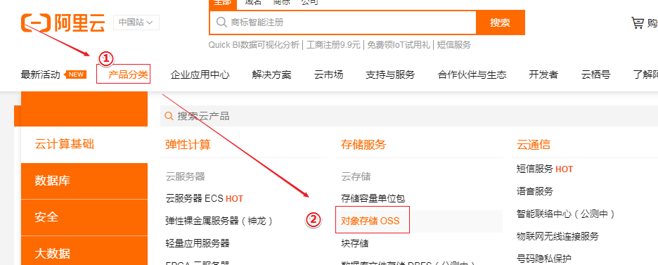
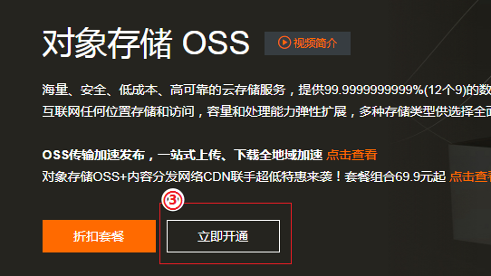
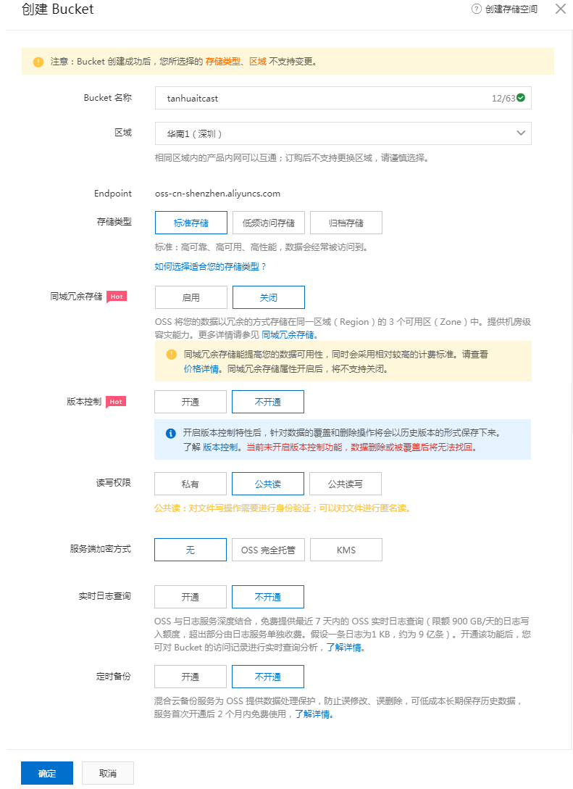
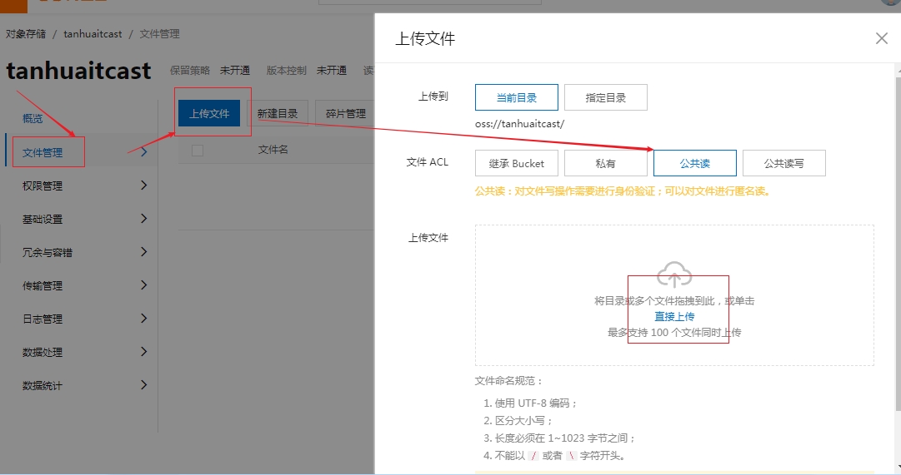
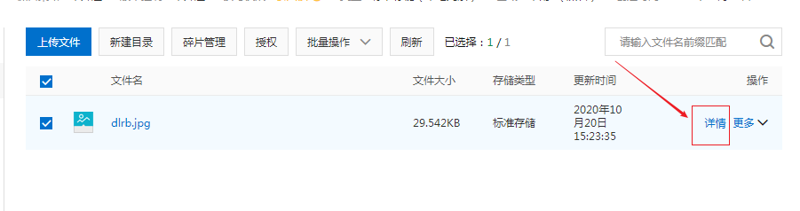
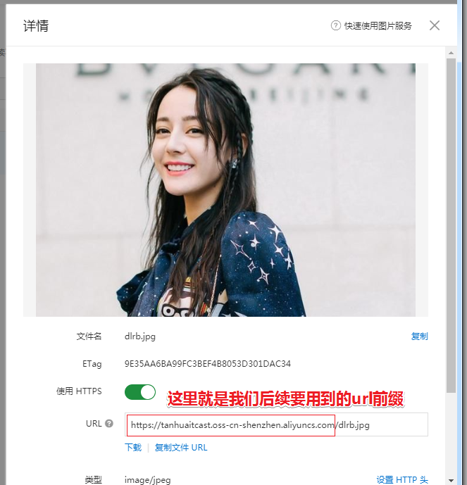
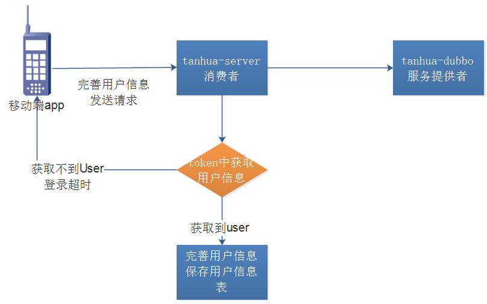
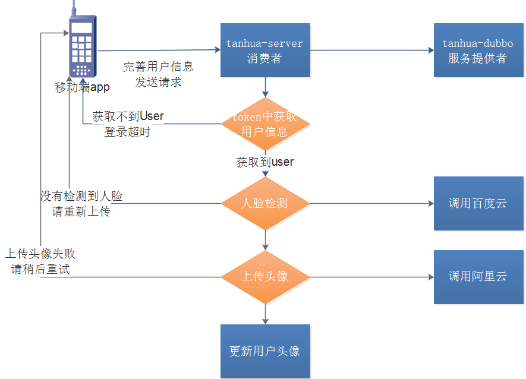
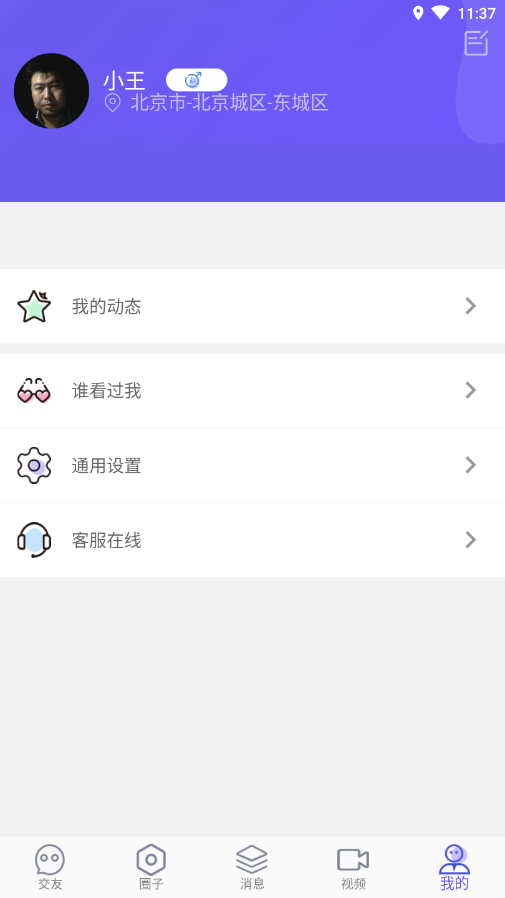
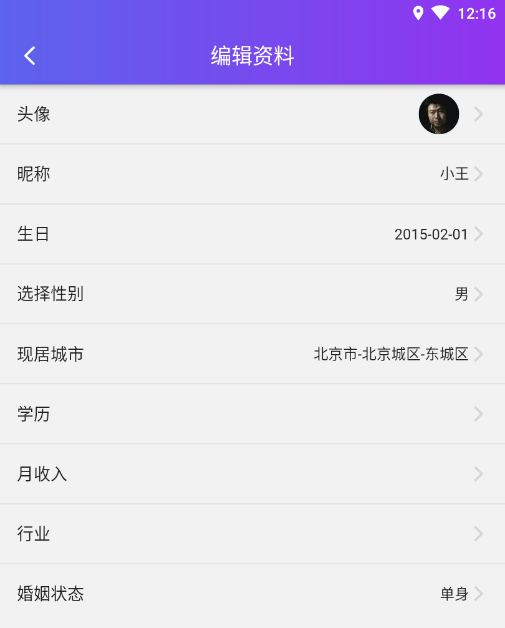

# 第2章 完善个人信息

# 学习目标

- 代码优化
- 阿里云OSS服务应用
- 百度人脸识别
- 完善个人信息
- 个人信息管理

# 1. 代码优化

### 【目标】

代码优化

### 【路径】

1：代码分析

2：代码优化

### 【讲解】

## 1.1. 抽取BasePojo

为了简化实体类中created和updated字段

修改tanhua-domain工程，抽取BasePojo

```java
package com.tanhua.domain.db;

import com.baomidou.mybatisplus.annotation.FieldFill;
import com.baomidou.mybatisplus.annotation.TableField;
import lombok.Data;
import java.io.Serializable;
import java.util.Date;
/**
 * 抽取BasePojo
 */
@Data
public abstract class BasePojo implements Serializable {
    @TableField(fill = FieldFill.INSERT)
    private Date created;
    @TableField(fill = FieldFill.INSERT_UPDATE)
    private Date updated;
}
```

修改User类

```java
package com.tanhua.domain.db;
import com.alibaba.fastjson.annotation.JSONField;
import lombok.Data;
import java.util.Date;
@Data
public class User extends BasePojo {
    private Long id;
    private String mobile; //手机号
    @JSONField(serialize = false)
    private String password; //密码，json序列化时忽略
    private Date created;
    private Date updated;
}
```

## 1.2. 自动填充

对于created和updated字段，每次操作都需要手动设置。为了解决这个问题，mybatis-plus支持自定义处理器的形式实现保存更新的自动填充。

在tanhua-dubbo-service工程中添加MyMetaObjectHandler

```java
package com.tanhua.dubbo.handler;

import com.baomidou.mybatisplus.core.handlers.MetaObjectHandler;
import org.apache.ibatis.reflection.MetaObject;
import org.springframework.stereotype.Component;
import java.util.Date;

/**
 * 公共填充类
 */
@Component
public class MyMetaObjectHandler implements MetaObjectHandler {
    /**
     * 插入时自动填充 created updated
     * @param metaObject
     */
    @Override
    public void insertFill(MetaObject metaObject) {
        setFieldValByName("created", new Date(), metaObject);
        setFieldValByName("updated", new Date(), metaObject);
    }

    /**
     * 更新时自动填充 updated
     *
     * @param metaObject
     */
    @Override
    public void updateFill(MetaObject metaObject) {
        setFieldValByName("updated", new Date(), metaObject);
    }
}
```

### 【小结】

完成简化实体类代码优化

# 2. 图片上传

### 【目标】

完成图片上传功能

### 【路径】

1：图片存储解决方案

2：抽取组件

### 【讲解】

## 2.1. 图片存储解决方案

实现图片上传服务，需要有存储的支持，那么我们的解决方案将以下几种：

1. 直接将图片保存到服务的硬盘
   1. 优点：开发便捷，成本低
   2. 缺点：扩容困难
2. 使用分布式文件系统进行存储
   1. 优点：容易实现扩容
   2. 缺点：开发复杂度稍大（有成熟的产品可以使用，比如：FastDFS）
4. 使用第三方的存储服务
   1. 优点：开发简单，拥有强大功能，免维护
   2. 缺点：付费

完善个人信息选用阿里云的OSS服务进行图片存储。

## 2.2. 阿里云OSS存储

### 2.2.1. 什么是OSS服务？

地址：https://www.aliyun.com/product/oss


### 2.2.2. 开通对象存储OSS服务




 

### 2.2.3. 创建Bucket

使用OSS，首先需要创建Bucket，Bucket翻译成中文是水桶的意思，把存储的图片资源看做是水，想要盛水必须得有桶，就是这个意思了。

进入控制台，https://oss.console.aliyun.com/overview

 

记下重要的配置信息

endpoint: oss-cn-shenzhen.aliyuncs.com

Bucket 名称: tanhuaitcast

选择Bucket后，即可看到对应的信息，如：url、消耗流量等 :

### 2.2.4. 上传文件



### 2.2.5. 查看文件

 

 

## 2.3. 抽取组件

参照阿里提供的开发指南JavaSDK版

https://help.aliyun.com/document_detail/32009.html?spm=a2c4g.11186623.6.916.6f416d39e2YD5I

### 2.3.1. 导入依赖

在tanhua-commons中添加javaSDK的依赖，如果之前已经添加过，则忽略些步骤

~~~xml
<dependency>
    <groupId>com.aliyun.oss</groupId>
    <artifactId>aliyun-sdk-oss</artifactId>
    <version>3.10.2</version>
</dependency>
~~~

### 2.3.2. Propeties配置对象

在tanhua-commons工程中创建OssProperties类中，从配置文件中获取阿里云OSS存储配置信息

~~~java
package com.tanhua.commons.properties;
import lombok.Data;
import org.springframework.boot.context.properties.ConfigurationProperties;

@Data
@ConfigurationProperties(prefix = "tanhua.oss")
public class OssProperties {
    private String endpoint;
    private String accessKeyId;
    private String accessKeySecret;
    private String bucketName;
    private String url;//sztanhua.oss-cn-shenzhen.aliyuncs.com
}
~~~

### 2.3.3. 上传模板对象

在tanhua-commons中创建上传模板类OssTemplate，自动装配注入此对象，完成上传图片功能

~~~java
package com.tanhua.commons.templates;

import com.aliyun.oss.OSS;
import com.aliyun.oss.OSSClientBuilder;
import com.tanhua.commons.properties.OssProperties;
import java.io.FileInputStream;
import java.io.InputStream;
import java.text.SimpleDateFormat;
import java.util.Date;
import java.util.UUID;

public class OssTemplate {

    private OssProperties ossProperties;

    public OssTemplate(OssProperties ossProperties){
        this.ossProperties = ossProperties;
    }

    /**
     * 上传文件
     * @param filename
     * @param is
     * @return
     */
    public String upload(String filename, InputStream is) {
        // Endpoint以杭州为例，其它Region请按实际情况填写。
        String endpoint = ossProperties.getEndpoint();
        // 云账号AccessKey有所有API访问权限，建议遵循阿里云安全最佳实践，创建并使用RAM子账号进行API访问或日常运维，请登录 https://ram.console.aliyun.com 创建。
        String accessKeyId = ossProperties.getAccessKeyId();
        String accessKeySecret = ossProperties.getAccessKeySecret();

        // 创建OSSClient实例。
        OSS ossClient = new OSSClientBuilder().build(endpoint, accessKeyId, accessKeySecret);

        String suffix = filename.substring(filename.lastIndexOf("."));
        String ymd = new SimpleDateFormat("yyyy/MM/dd").format(new Date());
        String name = "images/" + ymd + "/" + UUID.randomUUID().toString() + suffix;

        // 上传文件流。
        ossClient.putObject(ossProperties.getBucketName(), name, is);

        // 关闭OSSClient。
        ossClient.shutdown();
        return ossProperties.getUrl() + "/" + name;
    }
}
~~~

### 2.3.4. 配置类

在配置类TanhuaAutoConfiguration中加入OssTemplate对象相关配置

~~~java
package com.tanhua.commons;

import com.tanhua.commons.properties.FaceProperties;
import com.tanhua.commons.properties.OssProperties;
import com.tanhua.commons.properties.SmsProperties;
import com.tanhua.commons.templates.OssTemplate;
import com.tanhua.commons.templates.SmsTemplate;
import org.springframework.boot.context.properties.EnableConfigurationProperties;
import org.springframework.context.annotation.Bean;
import org.springframework.context.annotation.Configuration;

@Configuration
@EnableConfigurationProperties({
    SmsProperties.class, OssProperties.class
})
public class CommonsAutoConfiguration {

    @Bean
    public SmsTemplate smsTemplate(SmsProperties smsProperties){
        SmsTemplate smsTemplate = new SmsTemplate(smsProperties);
        smsTemplate.init();
        return smsTemplate;
    }

    @Bean
    public OssTemplate ossTemplate(OssProperties ossProperties){
        OssTemplate ossTemplate = new OssTemplate(ossProperties);
        return ossTemplate;
    }
}

~~~

### 2.3.5. 测试

tanhua-server工程的application.yml中加入oss配置信息如下

```yml
tanhua:
  ...
  oss:
    endpoint: http://oss-cn-shenzhen.aliyuncs.com
    bucketName: sztanhua
    url: https://sztanhua.oss-cn-shenzhen.aliyuncs.com
    accessKeyId: LTAI4FyG7DDp4FhmgfidgeAt
    accessKeySecret: LBXIjWlVmR2bpp9CVzYzqojUfJ6ezi
```

tanhua-server工程中添加测试类，测试文件上传功能

```java
package com.tanhua.server.test;

import com.tanhua.commons.templates.OssTemplate;
import com.tanhua.commons.templates.SmsTemplate;
import org.junit.Test;
import org.junit.runner.RunWith;
import org.springframework.beans.factory.annotation.Autowired;
import org.springframework.boot.test.context.SpringBootTest;
import org.springframework.test.context.junit4.SpringRunner;

import java.io.FileInputStream;
import java.io.FileNotFoundException;
import java.util.Map;

@SpringBootTest
@RunWith(SpringRunner.class)
public class OssTest {

    @Autowired
    private OssTemplate ossTemplate;

    @Test
    public void testOss() throws FileNotFoundException {
        FileInputStream is = new FileInputStream("C:\\Users\\Eric\\Desktop\\file\\timg.jpg");
        ossTemplate.upload("timg.jpg",is);
    }
}

```

 

### 【小结】

1：了解图片存储解决方案

2：完成图片存储组件抽取

# 3. 人脸检测

### 【目标】

完成人脸检测功能

### 【路径】

1：百度云AI介绍

2：百度云组件抽取

### 【讲解】

## 3.1. 百度云AI

地址：https://ai.baidu.com/tech/face


## 3.2. 账号申请

### 3.2.1. 账号登录注册

百度云AI支持百度账号登录，也可以支持云账号。按需注册即可


### 3.2.2. 创建应用

按需创建应用


获取对应的应用配置信息

```markdown
AppID：22837663

API Key：nA43galrxfUZTGtYRVK8F8tb

Secret Key：MQp567q4nGnIKfniURa2XAw8bT1SlPE3
```

## 3.3. 抽取组件

### 3.3.1. 导入依赖

此步略过

~~~xml
<!--百度人脸识别API-->
<dependency>
    <groupId>com.baidu.aip</groupId>
    <artifactId>java-sdk</artifactId>
    <version>4.8.0</version>
</dependency>
~~~

### 3.3.2. Propeties配置对象

在tanhua-commons工程中创建AipFaceProperties类中，从配置文件中获取配置信息

~~~java
package com.tanhua.commons.properties;

import lombok.Data;
import org.springframework.boot.context.properties.ConfigurationProperties;

@Data
@ConfigurationProperties(prefix = "tanhua.face")
public class FaceProperties {
    private String appId;
    private String apiKey;
    private String secretKey;
}

~~~

### 3.3.3. 上传模板对象

在tanhua-commons工程中创建创建AipFaceTemplate，自动装配注入此对象，完成图片人脸检测

~~~java
package com.tanhua.commons.templates;

import com.baidu.aip.face.AipFace;
import com.baidu.aip.util.Base64Util;
import com.tanhua.commons.properties.FaceProperties;
import org.json.JSONObject;

import java.util.HashMap;

public class FaceTemplate {

    private FaceProperties faceProperties;

    public FaceTemplate(FaceProperties faceProperties){
        this.faceProperties = faceProperties;
    }

    public boolean detect(byte[] bytes){
        // 初始化一个AipFace
        AipFace client = new AipFace(faceProperties.getAppId(), faceProperties.getApiKey(), faceProperties.getSecretKey());

        HashMap<String, String> options = new HashMap<String, String>();
        options.put("face_field", "age");
        options.put("max_face_num", "2");
        options.put("face_type", "LIVE");
        options.put("liveness_control", "LOW");

        // 调用接口
        String image = Base64Util.encode(bytes);
        String imageType = "BASE64";

        // 人脸检测
        JSONObject res = client.detect(image, imageType, options);
        // 没检测到人脸时，error_code值不为0
        Integer error_code = (Integer)res.get("error_code");
        return error_code == 0;
    }
}

~~~

### 3.3.4. 配置类

在tanhua-commons工程中创建TanhuaAutoConfiguration中加入AipFaceTemplate对象相关配置

~~~java
package com.tanhua.commons;

import com.tanhua.commons.properties.FaceProperties;
import com.tanhua.commons.properties.OssProperties;
import com.tanhua.commons.properties.SmsProperties;
import com.tanhua.commons.templates.FaceTemplate;
import com.tanhua.commons.templates.OssTemplate;
import com.tanhua.commons.templates.SmsTemplate;
import org.springframework.boot.context.properties.EnableConfigurationProperties;
import org.springframework.context.annotation.Bean;
import org.springframework.context.annotation.Configuration;

@Configuration
@EnableConfigurationProperties({
    SmsProperties.class, OssProperties.class, FaceProperties.class
})
public class CommonsAutoConfiguration {

    @Bean
    public SmsTemplate smsTemplate(SmsProperties smsProperties){
        SmsTemplate smsTemplate = new SmsTemplate(smsProperties);
        smsTemplate.init();
        return smsTemplate;
    }

    @Bean
    public OssTemplate ossTemplate(OssProperties ossProperties){
        OssTemplate ossTemplate = new OssTemplate(ossProperties);
        return ossTemplate;
    }

    @Bean
    public FaceTemplate faceTemplate(FaceProperties faceProperties){
        return new FaceTemplate(faceProperties);
    }
}

~~~

### 3.3.5. 测试

tanhua-server工程加入oss配置信息如下

```yml
tanhua:
  ...
  face:
    appId: 22949516
    apiKey: uDkEBDhtO02soeMB6kuMZTZi
    secretKey: sMGUX8tzPhc0eBfvy3rbGYuXiK6MZCEF
```

编写测试类，测试文件上传功能

```java
package com.tanhua.server.test;

import com.tanhua.commons.templates.FaceTemplate;
import org.junit.Test;
import org.junit.runner.RunWith;
import org.springframework.beans.factory.annotation.Autowired;
import org.springframework.boot.test.context.SpringBootTest;
import org.springframework.test.context.junit4.SpringRunner;

import java.io.File;
import java.io.FileInputStream;
import java.io.FileNotFoundException;
import java.io.IOException;
import java.nio.file.Files;

@SpringBootTest
@RunWith(SpringRunner.class)
public class FaceTest {

    @Autowired
    private FaceTemplate faceTemplate;

    @Test
    public void testFace() throws IOException {
        faceTemplate.detect(Files.readAllBytes(new File("C:\\Users\\Eric\\Desktop\\file\\test1.jpg").toPath()));
    }
}

```

### 【小结】

1：了解百度云AI

2：完成百度云组件抽取

# 4. 完善个人信息（重点）

### 【目标】

完善个人信息

### 【路径】

1：完善个人信息分析

2：完善个人信息实现

### 【讲解】

用户在首次登录时需要完善个人信息，包括性别、昵称、生日、城市、头像等。

其中，头像数据需要做图片上传，这里采用阿里云的OSS服务作为我们的图片服务器，并且对头像要做人脸识别，非人脸照片不得上传。

包含两步操作

* 填写用户基础信息
* 上传用户头像，更新用户的头像信息

数据库表：

* 用户表（tb_user）: id，mobile，password，created，updated
* 用户详细信息表（tb_info） 

```sql
CREATE TABLE `tb_user_info` (
  `id` bigint(20) NOT NULL,
  `nickname` varchar(50) DEFAULT NULL COMMENT '昵称',
  `avatar` varchar(200) DEFAULT NULL COMMENT '用户头像',
  `tags` varchar(50) DEFAULT '单身,本科,年龄相仿' COMMENT '用户标签：多个用逗号分隔',
  `gender` varchar(10) DEFAULT '3' COMMENT '性别，1-男，2-女，3-未知',
  `age` int(11) DEFAULT NULL COMMENT '用户年龄',
  `education` varchar(20) DEFAULT NULL COMMENT '学历',
  `city` varchar(100) DEFAULT NULL COMMENT '居住城市',
  `birthday` varchar(20) DEFAULT NULL COMMENT '生日',
  `cover_pic` varchar(200) DEFAULT NULL COMMENT '封面图片',
  `profession` varchar(20) DEFAULT NULL COMMENT '行业',
  `income` varchar(20) DEFAULT NULL COMMENT '收入',
  `created` datetime DEFAULT NULL,
  `updated` datetime DEFAULT NULL,
  `marriage` int(1) DEFAULT '0' COMMENT '0：未婚，1：已婚',
  PRIMARY KEY (`id`)
) ENGINE=InnoDB DEFAULT CHARSET=utf8 COMMENT='用户信息表';
```

* 用户表和信息表：一对一关系
* 维护关系：公用主键的关系（用户id==1 ，用户信息id==1）

完善个人信息流程：



上传头像流程：

 

## 4.1. 接口信息

- 完善个人信息
  - https://mock.boxuegu.com/project/164/interface/api/28553
  - 
- 上传头像
  - https://mock.boxuegu.com/project/164/interface/api/39725
  - 

## 4.2. Token有效期分析

​	用户登录成功之后，服务端返回Token作为客户端和服务端间用户认证的“密钥”，已经将token存到redis中，但token的有效期该如何实现呢？

### 4.2.1. 根据token获取用户

客户端发起请求，会在请求头header中携带Authorization参数。后端开发人员获取Authorization参数后，从redis中获取用户对象，并续期。

tanhua-server中的UserService添加方法

```java
/**
 * 通过token获取登陆用户信息
 * @param token
 * @return
 */
public User getUserByToken(String token){
    String key = "TOKEN_" + token;
    String userJsonStr = redisTemplate.opsForValue().get(key);
    if(StringUtils.isEmpty(userJsonStr)){
        return null;
    }
    // 延长有效期，续期
    redisTemplate.expire(key,1, TimeUnit.DAYS);
    User user = JSON.parseObject(userJsonStr, User.class);
    return user;
}
```

## 4.3. 服务提供者

### 4.3.1. UserInfo与UserInfoVo

tanhua-domain模块中编写用户信息实体类UserInfo

```java
package com.tanhua.domain.db;

import com.baomidou.mybatisplus.annotation.IdType;
import com.baomidou.mybatisplus.annotation.TableId;
import lombok.Data;

@Data
public class UserInfo extends BasePojo{
    @TableId(type= IdType.INPUT)
    private Long id; //用户id
    private String nickname; //昵称
    private String avatar; //用户头像
    private String birthday; //生日
    private String gender; //性别
    private Integer age; //年龄
    private String city; //城市
    private String income; //收入
    private String education; //学历
    private String profession; //行业
    private Integer marriage; //婚姻状态
    private String tags; //用户标签：多个用逗号分隔
    private String coverPic; // 封面图片
}
```

vo包下添加UserInfoVo

```java
package com.tanhua.domain.vo;

import lombok.Data;
import java.io.Serializable;

@Data
public class UserInfoVo implements Serializable {
    private Long id; //用户id
    private String nickname; //昵称
    private String avatar; //用户头像
    private String birthday; //生日
    private String gender; //性别
    private String age; //年龄
    private String city; //城市
    private String income; //收入
    private String education; //学历
    private String profession; //行业
    private Integer marriage; //婚姻状态
}
```

### 4.3.2. UserInfoMapper

tanhua-dubbo-service模块编写持久层代码UserInfoMapper

```java
package com.tanhua.dubbo.mapper;

import com.baomidou.mybatisplus.core.mapper.BaseMapper;
import com.tanhua.domain.db.UserInfo;


public interface UserInfoMapper extends BaseMapper<UserInfo> {
}

```

### 4.3.3. UserInfoApi

tanhua-dubbo-interface模块编写公共接口UserInfoApi

```java
package com.tanhua.dubbo.api;

import com.tanhua.domain.db.UserInfo;


public interface UserInfoApi {
    /**
     * 保存用户基础信息
     * @param userInfo
     */
    void save(UserInfo userInfo);

    /**
     * 通过id更新用户信息
     * @param userInfo
     */
    void update(UserInfo userInfo);
}

```

### 4.3.4. UserInfoApiImpl

tanhua-dubbo-service模块编写服务提供者核心代码UserInfoApiImpl

```java
package com.tanhua.dubbo.api;

import com.tanhua.domain.db.UserInfo;
import com.tanhua.dubbo.mapper.UserInfoMapper;
import org.apache.dubbo.config.annotation.Service;
import org.springframework.beans.factory.annotation.Autowired;


@Service
public class UserInfoApiImpl implements UserInfoApi {

    @Autowired
    private UserInfoMapper userInfoMapper;

    /**
     * 保存用户基本信息
     * @param userInfo
     */
    @Override
    public void save(UserInfo userInfo) {
        userInfoMapper.insert(userInfo);
    }

    /**
     * 通过id更新用户基本信息
     * @param userInfo
     */
    @Override
    public void update(UserInfo userInfo) {
        userInfoMapper.updateById(userInfo);
    }
}

```

## 4.4. 服务消费者

### 4.4.1. UserController

tanhua-server模块编写UserController

```java
package com.tanhua.server.controller;

import com.tanhua.domain.db.UserInfo;
import com.tanhua.domain.vo.UserInfoVo;
import com.tanhua.server.service.UserService;
import org.springframework.beans.BeanUtils;
import org.springframework.beans.factory.annotation.Autowired;
import org.springframework.http.ResponseEntity;
import org.springframework.web.bind.annotation.*;
import org.springframework.web.multipart.MultipartFile;


@RestController
@RequestMapping("/user")
public class UserController {

    @Autowired
    private UserService userService;

    /**
     * 个人信息
     * @param userInfoVo
     * @return
     */
    @PostMapping("/loginReginfo")
    public ResponseEntity loginReginfo(@RequestBody UserInfoVo userInfoVo, @RequestHeader("Authorization") String token){
        UserInfo userInfo = new UserInfo();
        // 复制属性
        BeanUtils.copyProperties(userInfoVo,userInfo);
        // 保存用户信息
        userService.saveUserInfo(userInfo,token);
        return ResponseEntity.ok(null);
    }

    /**
     * 上传用户头像
     * @param headPhoto
     * @param token
     * @return
     */
    @PostMapping("loginReginfo/head")
    public ResponseEntity uploadAvatar(MultipartFile headPhoto, @RequestHeader("Authorization") String token){
        userService.updateUserAvatar(headPhoto,token);
        return ResponseEntity.ok(null);
    }
}

```

### 4.4.2. UserService

```java
/**
 * 完善用户信息
 * @param userInfo
 * @param token
 */
public void saveUserInfo(UserInfo userInfo,String token) {
    User user = getUserByToken(token);
    if(null == user){
        throw new TanHuaException("登陆超时，请重新登陆");
    }
    userInfo.setId(user.getId());
    userInfoApi.save(userInfo);
}

/**
 * 上传用户头像处理
 * @param headPhoto
 * @param token
 */
public void updateUserAvatar(MultipartFile headPhoto, String token) {
    User user = getUserByToken(token);
    if(null == user){
        throw new TanHuaException("登陆超时，请重新登陆");
    }
    try {
        String filename = headPhoto.getOriginalFilename();
        byte[] bytes = headPhoto.getBytes();
        // 人脸检测
        if(!faceTemplate.detect(bytes)){
            throw new TanHuaException("没有检测到人脸，请重新上传");
        }
        // 上传头像到阿里云Oss
        String avatar = ossTemplate.upload(filename, headPhoto.getInputStream());
        UserInfo userInfo = new UserInfo();
        userInfo.setId(user.getId());
        userInfo.setAvatar(avatar);
        // 更新用户头像
        userInfoApi.update(userInfo);
    } catch (IOException e) {
        //e.printStackTrace();
        log.error("上传头像失败",e);
        throw new TanHuaException("上传头像失败，请稍后重试");
    }
}
```

### 4.4.3. 测试

 

 

 

### 【小结】

1：掌握完善个人信息功能

# 5. 查询用户信息

### 【目标】

查询用户信息

### 【路径】

1：查询用户信息分析

2：查询用户信息实现

### 【讲解】

## 5.1. 接口信息

**接口地址**：https://mock.boxuegu.com/project/164/interface/api/64673


## 5.2. 服务提供者

### 5.2.1. UserInfoApi

tanhua-dubbo-interface模块编写公共接口UserInfoApi

```java
/**
 * 通过id查询用户基本信息
 * @param userId
 * @return
 */
UserInfo findById(Long userId);
```

### 5.2.2. UserInfoApiImpl

tanhua-dubbo-service模块编写服务提供者核心代码UserInfoApiImpl

```java
/**
 * 通过id查询用户基本信息
 * @param userId
 */
@Override
public UserInfo findById(Long userId) {
    return userInfoMapper.selectById(userId);
}
```

## 5.3. 服务消费者

### 5.3.1. UserInfoController

tanhua-server模块编写UserInfoController

```java
package com.tanhua.server.controller;

import com.tanhua.domain.db.User;
import com.tanhua.domain.vo.ErrorResult;
import com.tanhua.domain.vo.UserInfoVo;
import com.tanhua.server.service.UserService;
import org.springframework.beans.factory.annotation.Autowired;
import org.springframework.http.HttpStatus;
import org.springframework.http.ResponseEntity;
import org.springframework.web.bind.annotation.GetMapping;
import org.springframework.web.bind.annotation.RequestHeader;
import org.springframework.web.bind.annotation.RequestMapping;
import org.springframework.web.bind.annotation.RestController;

@RestController
@RequestMapping("/users")
public class UserInfoController {

    @Autowired
    private UserService userService;

    @GetMapping
    public ResponseEntity getUserInfo(Long userID, Long huanxinID, @RequestHeader("Authorization") String token){
        Long userId = huanxinID;
        if(null == userId){
            userId = userID;
        }
        if(null == userId){
            User user = userService.getUserByToken(token);
            if(null == user){
                return ResponseEntity.status(HttpStatus.INTERNAL_SERVER_ERROR).body(ErrorResult.error("000006","请重新登陆后再操作"));
            }
            userId = user.getId();
        }
        // 通过id查询用户基本信息
        UserInfoVo userInfoVo = userService.findUserInfoById(userId);
        return ResponseEntity.ok(userInfoVo);
    }    
}

```

### 5.2.2. UserSerivce

tanhua-server模块编写UserSerivce

```java
/**
 * 通过id查询用户基本信息
 * @param userId
 * @return
 */
public UserInfoVo findUserInfoById(Long userId) {
    UserInfo userInfo = userInfoApi.findById(userId);
    UserInfoVo vo = new UserInfoVo();
    BeanUtils.copyProperties(userInfo, vo);
    // 年龄字段，数据库存的是数值，而页面需要的是字符串。
    if(null != userInfo.getAge()){
        vo.setAge(String.valueOf(userInfo.getAge().intValue()));
    }
    return vo;
}
```

### 5.2.3. 测试

 

### 【小结】

1：掌握查询用户信息功能

# 6. 更新用户信息

### 【目标】

更新用户信息

### 【路径】

1：更新用户信息分析

2：更新用户信息实现

### 【讲解】

## 6.1. 接口信息

**接口地址**：https://mock.boxuegu.com/project/164/interface/api/64687


## 6.2. 服务提供者

### 6.2.1. UserInfoApi

tanhua-dubbo-interface模块编写公共接口UserInfoApi

```java
/**
 * 通过id更新用户信息
 * @param userInfo
 */
void update(UserInfo userInfo);
```

### 6.2.2. UserInfoApiImpl

tanhua-dubbo-service模块编写服务提供者核心代码UserInfoApiImpl

```java
/**
 * 通过id更新用户信息
 * @param userInfo
 */
@Override
public void update(UserInfo userInfo) {
    userInfoMapper.updateById(userInfo);
}
```

## 6.3.服务消费者

### 6.3.1. UserInfoController

```java
/**
 * 保存用户基本信息
 * @param vo
 * @param token
 * @return
 */
@PutMapping
public ResponseEntity updateUserInfo(@RequestBody UserInfoVo vo, @RequestHeader("Authorization") String token){
    userService.updateUserInfo(vo,token);
    return ResponseEntity.ok(null);
}
```

### 6.3.2. UserSerivce

```java
/**
 * 保存用户基本信息
 * @param vo
 * @param token
 */
public void updateUserInfo(UserInfoVo vo, String token) {
    User user = getUserByToken(token);
    if(null == user){
        throw new TanHuaException("登陆超时，请重新登陆");
    }
    UserInfo userInfo = new UserInfo();
    BeanUtils.copyProperties(vo,userInfo);
    // 通过birthday，计算用户的年龄
    int age = GetAgeUtil.getAge(userInfo.getBirthday());
    userInfo.setAge(age);//设置年龄
    userInfo.setId(user.getId());
    userInfoApi.update(userInfo);
}
```

### 6.3.3. GetAgeUtil

```java
package com.tanhua.server.utils;

import org.joda.time.DateTime;
import org.joda.time.Years;
import java.text.ParseException;
import java.text.SimpleDateFormat;
import java.util.Date;

/**
 * 根据出生日期获取年龄
 */
public class GetAgeUtil {
    public static int getAge(String yearMonthDay){
        try {
            SimpleDateFormat sdf = new SimpleDateFormat("yyyy-MM-dd");
            Date birthDay = sdf.parse(yearMonthDay);
            Years years = Years.yearsBetween(new DateTime(birthDay), DateTime.now());
            return years.getYears();
        } catch (ParseException e) {
            e.printStackTrace();
            return 0;
        }
    }
}
```

### 6.3.4. 测试

 

### 【小结】

1：掌握更新用户信息功能

2：完善个人信息

# 7. 更新用户头像（作业）

## 7.1. 接口信息

接口地址：https://mock.boxuegu.com/project/164/interface/api/77931


## 7.2. 实现思路

# 总结

* 图片上传（OSS云存储），人脸检测（百度AI）
* **改造登录功能（重点）**
  * 登录成功，将用户对象存入到redis
  * 客户端后续访问，在请求头中携带参数（Authorization），从redis中获取用户
* **完善个人信息（重点）**
  * 第一次注册访问：填写基础的用户信息（保存用户信息表）
  * 客户端拍照，上传到服务端（人脸检测，上传到oss，更新用户信息）
* 个人信息管理（根据id查询，更新，更新用户头像）