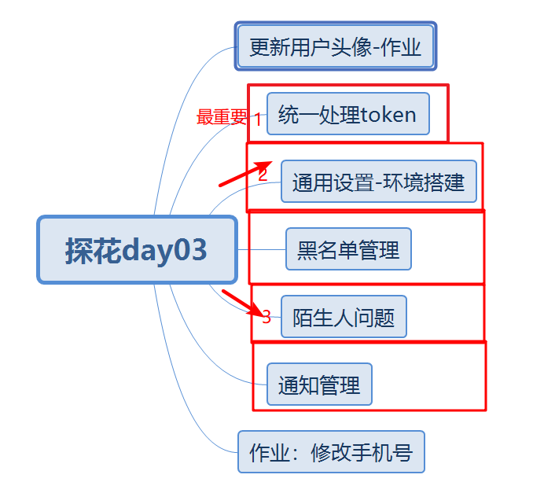
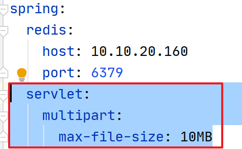
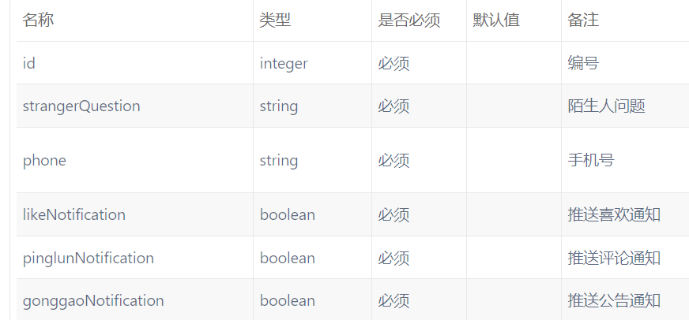
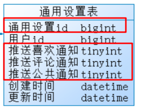
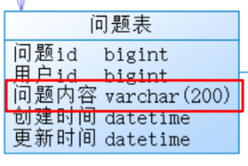
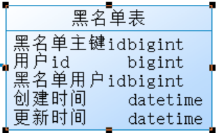
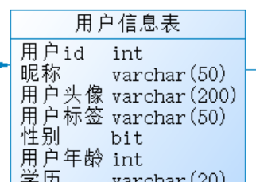
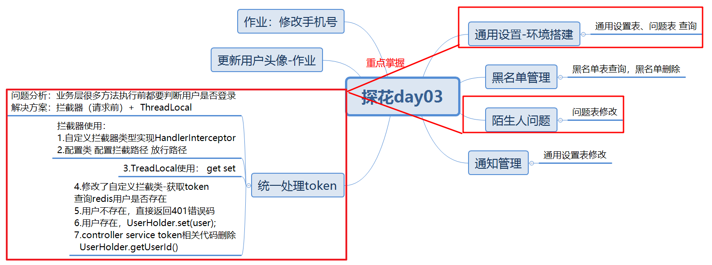

# 今日内容介绍

# 图片上传大小问题

 

# Token统一处理

## 需求分析

UserInfoService UserService 业务方法中，都先要看redis中当前用户token是否存在，代码过于冗余了。

解决思路：拦截器（**前**中后）+ThreadLocal

1.拦截器中没有拦截到用户信息，直接返回登录，请重新登录。

2.拦截器中拦截到用户信息，service业务方法中需要用到当前登录用户信息，如何处理？

   拦截器中拦截到用户信息：将用户信息存入ThreadLocal中

   service业务方法中：从ThreadLocal中获取用户信息

**拦截器跟过滤器有啥区别？**--常见基础面试题

答：https://www.cnblogs.com/panxuejun/p/7715917.html

**拦截器如何使用？**

1.自定义类实现handlerInterceptor接口 

2.在config包下创建配置类加载拦截器类 （springmvc.xml中interceptor配置）

**ThreadLocal简介**

多线程环境下去保证变量的安全

**ThreadLocal如何使用？**

ThreadLocal<T> threadLocal = new ThreadLocal<T>();
threadLocal.set() //将数据绑定到当前线程
threadLocal.get() //从当前线程中获取数据

## 数据库表

无

## 消费者编码分析

拦截器中实现：

1. 拦截器中获取请求头中token
2. 根据token作为key到redis中获取用户对象
3. 用户对象不存在，直接返回没有权限401
4. 用户对象存在，将用户对象存入ThreadLocal（UserHoler工具类 set get）

UserInfoService UserService：

1. 将原有的获取用户对象代码 改造为UserHoler工具类来获取
2. 将controller中token参数删除（拦截器中已经处理过）

## 服务提供者编码分析

不需要修改

## 测试

# 通用设置查询

## 需求分析

点击 通用设置 跳转 通用设置页面，查询通用设置信息

## 数据库表

 

根据什么条件查询 通用设置表 问题表？

答：根据用户id查询通用设置表  问题表

## 消费者编码分析

1. controller接收请求 

2. controller调用service业务逻辑处理

   a.通过UserHolder.getUserId()   UserHolder.getUser().getMobile()

   b.根据用户id查询问题表   问题不存在，设置默认问题  

   c.根据用户id查询通用设置表， 记录不存在 返回默认不通知

   d.封装数据到返回Vo对象中

## 服务提供者编码分析

1. 服务提供者：根据用户id查询问题表
2. 服务提供者：根据用户id查询通用设置表

## 测试

# 通知修改

## 需求分析

点击“通知设置”跳转通知设置页面，点击开关，决定是否开启消息通知

## 数据库表

tb_settings：修改  根据当前用户id 修改

## 消费者编码分析

1. controller接收请求 

2. controller调用service业务处理

   a.根据当前用户id查询通知设置表记录是否存在

   b.如果不存在，则保存通用设置记录

   c.如果存在，则更新通用设置记录

## 服务提供者编码分析

1. 服务提供者：保存通用设置记录
2. 服务提供者：更新通用设置记录

## 测试

# 黑名单查询

## 需求分析

在通知设置页面，点击黑名单，跳转查询黑名单分页列表页面

## 数据库表

 

根据什么条件查询黑名单表？

答：根据用户id查询黑名单用户id

​        再根据黑名单用户id查询用户信息表

## 消费者编码分析

1. controller接收请求 page pagesize

2. controller调用service业务处理

   方式一：

   a.调用服务:根据当前用户id查询黑名单表

   b.根据黑名单用户ids 查询用户信息表

   c.将数据封装Vo返回

   方式二：（推荐使用 效率更高些）

   a.调用服务：根据用户id分页查询(两张表关联查询)

   b.将结果封装Vo返回

## 服务提供者编码分析

1. 提供服务：根据用户id分页查询(两张表关联查询)

   答：数据库表 sql优化

## 测试

# 黑名单移除

## 需求分析

点击“移除黑名单”从表中删除

## 数据库表

tb_black_list：删除记录 根据当前用户id与黑名单用户id

## 消费者编码分析

1. controller接收请求后，/:uid 地址栏参数（黑名单用户id）@PathVariable

2. controller调用service业务处理

   调用服务：根据当前用户id与黑名单用户id 删除黑名单用户

## 服务提供者编码分析

1. 服务提供者：根据当前用户id与黑名单用户id 删除黑名单用户

## 测试

# 陌生人问题修改

## 需求分析

点击 设置陌生人问题 弹出当前用户设置的问题，可以修改问题内容，点击 确认发送请求

## 数据库表

tb_question：修改 保存

## 消费者编码分析

1. controller接收请求 修改的问题

2. controller调用业务层处理

   a.根据用户id查询问题表记录是否存在

   b.不存在，则保存问题表记录

   c.存在，则更新问题表

## 服务提供者编码分析

1. 服务提供者：保存问题表记录
2. 服务提供者：更新问题表记录

## 测试

# 之前你们的总结

1.公司中很少用多表关联查询**(应用场景-分库分表-数据量非常大)**
2.多表关联查询查询没有单表快

# 总结

