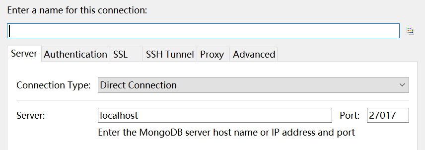
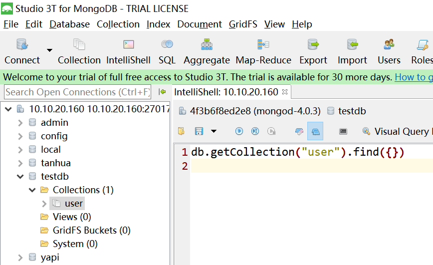
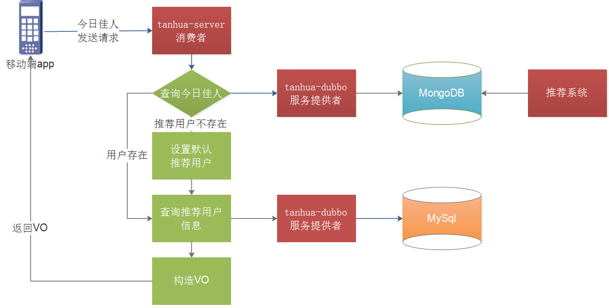
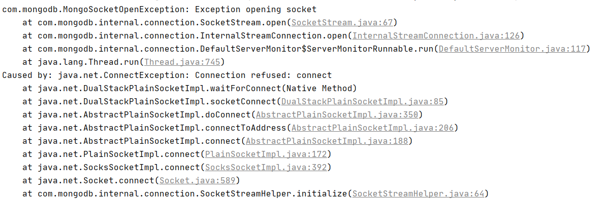
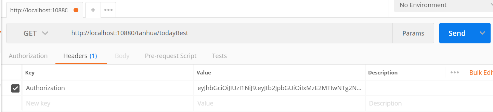

# 第4章 MongDB入门

# 学习目标

- MongoDB环境搭建
- MongoDB基本CRUD操作
- 通过JavaApi操作MongoDB
- SpringBoot整合MongoDB

# 1. MongoDB入门

### 【目标】

了解MongoDB

MongoDB基础操作

JavaApi操作MongoDB

### 【路径】

1：社交类软件功能特点分析

2：MongoDB介绍

3：MongoDB基础操作

4：通过JavaApi操作MongoDB

### 【讲解】

对于社交类软件的功能，我们需要对它的功能特点做分析：

- 数据量会随着用户数增大而增大
- 读多写少
- 价值较低
- 非好友看不到其动态内容
- ……

针对以上特点，我们来分析一下：

* mysql：关系型数据库
* redis：redis可以

- 对于数据量大而言，显然不能够使用关系型数据库进行存储，我们需要通过MongoDB进行存储
- 对于读多写少的应用，需要减少读取的成本
  - 比如说，一条SQL语句，单张表查询一定比多张表查询要快

探花交友项目：

* mysql数据库
* redis数据：加快查询速度
* mongodb：承担社交的业务功能

## 1.1. MongoDB简介


MongoDB是一个基于分布式文件存储的数据库。由C++语言编写。旨在为WEB应用提供可扩展的高性能数据存储解决方案。

MongoDB是一个介于关系数据库和非关系数据库之间的产品，是非关系数据库当中功能最丰富，最像关系数据库的，它支持的数据结构非常松散，是类似json的bson格式，因此可以存储比较复杂的数据类型。

MongoDB最大的特点是它支持的查询语言非常强大，其语法有点类似于面向对象的查询语言，几乎可以实现类似关系数据库单表查询的绝大部分功能，而且还支持对数据建立索引。

官网：https://www.mongodb.com

### 1.1.1. MongoDB的特点

MongoDB 最大的特点是他支持的查询语言非常强大，其语法有点类似于面向对象的查询语言，几乎可以实现类似关系数据库单表查询的绝大部分功能，而且还支持对数据建立索引。它是一个面向集合的,模式自由的文档型数据库。具体特点总结如下： 

1. 面向集合存储，易于存储对象类型的数据 
2. 模式自由 
3. 支持动态查询 
4. 支持完全索引，包含内部对象 
5. 支持复制和故障恢复 
6. 使用高效的二进制数据存储，包括大型对象（如视频等） 
7. 自动处理碎片，以支持云计算层次的扩展性 
8. 支持 Python，PHP，Ruby，Java，C，C#，Javascript，Perl及C++语言的驱动程 序， 社区中也提供了对Erlang及.NET 等平台的驱动程序 
9. 文件存储格式为 BSON（一种 JSON 的扩展）

### 1.1.2. 通过docker安装MongoDB

在课程资料的虚拟机中已经提供了MongoDB的镜像和容器，我们只需要使用简单的命令即可启动

~~~shell
#进入base目录
cd /root/docker-file/base/
#批量创建启动容器，其中已经包含了redis，zookeeper，mongodb容器
docker-compose up -d
#查看容器
docker ps -a
~~~


可以看到mongoDB已经启动，对外暴露了27017的操作端口

### 1.1.3. MongoDB体系结构

MongoDB 的逻辑结构是一种层次结构。主要由： 文档(document)、集合(collection)、数据库(database)这三部分组成的。逻辑结构是面 向用户的，用户使用 MongoDB 开发应用程序使用的就是逻辑结构。 

1. MongoDB 的文档（document），相当于关系数据库中的一行记录。 
2. 多个文档组成一个集合（collection），相当于关系数据库的表。 
3. 多个集合（collection），逻辑上组织在一起，就是数据库（database）。 
4. 一个 MongoDB 实例支持多个数据库（database）。 文档(document)、集合(collection)、数据库(database)的层次结构如下图:


为了更好的理解，下面与SQL中的概念进行对比：

| SQL术语/概念 | MongoDB术语/概念 | 解释/说明                           |
| ------------ | ---------------- | ----------------------------------- |
| database     | database         | 数据库                              |
| table        | collection       | 数据库表/集合                       |
| row          | document         | 数据记录行/文档                     |
| column       | field            | 数据字段/域                         |
| index        | index            | 索引                                |
| table joins  |                  | 表连接,MongoDB不支持                |
| primary key  | primary key      | 主键,MongoDB自动将_id字段设置为主键 |

 

### 1.1.4. 数据类型

- null：用于表示空值或者不存在的字段，{“x”:null} 
- 布尔型：布尔类型有两个值true和false，{“x”:true} 
- 数值：shell默认使用64为浮点型数值。{“x”：3.14}或{“x”：3}。对于整型值，可以使用 NumberInt（4字节符号整数）或NumberLong（8字节符号整数）， {“x”:NumberInt(“3”)}{“x”:NumberLong(“3”)} 
- 字符串：UTF-8字符串都可以表示为字符串类型的数据，{“x”：“呵呵”} 
- 日期：日期被存储为自新纪元依赖经过的毫秒数，不存储时区，{“x”:new Date()}
- 正则表达式：查询时，使用正则表达式作为限定条件，语法与JavaScript的正则表达式相 同，{“x”:/[abc]/} 
- 数组：数据列表或数据集可以表示为数组，{“x”： [“a“，“b”,”c”]} 
- 内嵌文档：文档可以嵌套其他文档，被嵌套的文档作为值来处理，{“x”:{“y”:3 }} 
- 对象Id：对象id是一个12字节的字符串，是文档的唯一标识，{“x”: objectId() } 
- 二进制数据：二进制数据是一个任意字节的字符串。它不能直接在shell中使用。如果要 将非utf-字符保存到数据库中，二进制数据是唯一的方式。

## 1.2. MongoDB基本操作

### 1.2.1. 数据库以及表的操作

~~~shell
#查看所有的数据库
> show dbs
admin   0.000GB
config  0.000GB
local   0.000GB

#通过use关键字切换数据库
> use admin
switched to db admin

#创建数据库
#说明：在MongoDB中，数据库是自动创建的，通过use切换到新数据库中，进行插入数据即可自动创建数据库
> use testdb
switched to db testdb
> show dbs #并没有创建数据库
admin   0.000GB
config  0.000GB
local   0.000GB
> db.user.insert({id:1,name:'zhangsan'})  #插入数据
WriteResult({ "nInserted" : 1 })
> show dbs
admin   0.000GB
config  0.000GB
local   0.000GB
testdb  0.000GB #数据库自动创建

#查看表
> show tables
user
> show collections
user
> 

#删除集合（表）
> db.user.drop()
true  #如果成功删除选定集合，则 drop() 方法返回 true，否则返回 false。

#删除数据库
> use testdb #先切换到要删除的数据中

> db.dropDatabase()  #删除数据库

> show dbs

~~~

### 1.2.2. 新增数据

在MongoDB中，存储的文档结构是一种类似于json的结构，称之为bson（全称为：Binary JSON）。

~~~shell
#插入数据
#语法：db.表明.insert(json字符串)

> db.user.insert({id:1,username:'zhangsan',age:20})

> db.user.save({id:2,username:'lisi',age:25})

> db.user.find()  #查询数据
~~~

### 1.2.3. 更新数据

update() 方法用于更新已存在的文档。语法格式如下：

```shell
db.collection.update(
   <query>,
   <update>,
   [
     upsert: <boolean>
   ]
)
```

**参数说明：**

- **query** : update的查询条件，类似sql update查询内where后面的。
- **update** : update的对象和一些更新的操作符（如$,$inc.$set）等，也可以理解为sql update查询内set后面的
- **upsert** : 可选，这个参数的意思是，如果不存在update的记录，是否插入objNew,true为插入，默认是false，不插入。

~~~shell
#查询全部
> db.user.find()

#更新数据
> db.user.update({id:1},{$set:{age:22}}) 

#注意：如果这样写，会删除掉其他的字段
> db.user.update({id:1},{age:25})

#更新不存在的字段，会新增字段
> db.user.update({id:2},{$set:{sex:1}}) #更新数据

#更新不存在的数据，默认不会新增数据
> db.user.update({id:3},{$set:{sex:1}})

#如果设置第一个参数为true，就是新增数据
> db.user.update({id:3},{$set:{sex:1}},true)
~~~

### 1.2.4. 删除数据

通过remove()方法进行删除数据，语法如下：

~~~shell
db.collection.remove(
   <query>,
   {
     justOne: <boolean>
   }
)
~~~

**参数说明：**

- **query** :（可选）删除的文档的条件。
- **justOne** : （可选）如果设为 true 或 1，则只删除一个文档，如果不设置该参数，或使用默认值 false，则删除所有匹配条件的文档。

实例：

~~~shell
#删除数据
> db.user.remove({})

#插入4条测试数据
db.user.insert({id:1,username:'zhangsan',age:20})
db.user.insert({id:2,username:'lisi',age:21})
db.user.insert({id:3,username:'wangwu',age:22})
db.user.insert({id:4,username:'zhaoliu',age:22})

> db.user.remove({age:22},true)

#删除所有数据
> db.user.remove({})

#说明：为了简化操作，官方推荐使用deleteOne()与deleteMany()进行删除数据操作。
db.user.deleteOne({id:1})
db.user.deleteMany({})  #删除所有数据

~~~

### 1.2.5. 查询数据

MongoDB 查询数据的语法格式如下：

```
db.user.find([query],[fields])
```

- **query** ：可选，使用查询操作符指定查询条件
- **fields** ：可选，使用投影操作符指定返回的键。查询时返回文档中所有键值， 只需省略该参数即可（默认省略）。

实例：

~~~shell
#插入测试数据
db.user.insert({id:1,username:'zhangsan',age:20})
db.user.insert({id:2,username:'lisi',age:21})
db.user.insert({id:3,username:'wangwu',age:22})
db.user.insert({id:4,username:'zhaoliu',age:22})

db.user.find()  #查询全部数据
db.user.find({},{id:1,username:1})  #只查询id与username字段
db.user.find().count()  #查询数据条数
db.user.find({id:1}) #查询id为1的数据
db.user.find({age:{$lte:21}}) #查询小于等于21的数据
db.user.find({age:{$lte:21}, id:{$gte:2}}) #and查询，age小于等于21并且id大于等于2
db.user.find({$or:[{id:1},{id:2}]}) #查询id=1 or id=2

#分页查询：Skip()跳过几条，limit()查询条数
db.user.find().limit(2).skip(1)  #跳过1条数据，查询2条数据
db.user.find().sort({id:-1}) #按照age倒序排序，-1为倒序，1为正序
~~~

### 1.2.6. 索引

索引通常能够极大的提高查询的效率，如果没有索引，MongoDB在读取数据时必须扫描集合中的每个文件并选取那些符合查询条件的记录。

这种扫描全集合的查询效率是非常低的，特别在处理大量的数据时，查询可以要花费几十秒甚至几分钟，这对网站的性能是非常致命的。

索引是特殊的数据结构，索引存储在一个易于遍历读取的数据集合中，索引是对数据库表中一列或多列的值进行排序的一种结构

~~~shell
#创建索引
> db.user.createIndex({'age':1})

#查看索引
> db.user.getIndexes()
[
	{
		"v" : 2,
		"key" : {
			"_id" : 1
		},
		"name" : "_id_",
		"ns" : "testdb.user"
	}
]
#说明：1表示升序创建索引，-1表示降序创建索引。
~~~

### 1.2.7. 执行计划

MongoDB 查询分析可以确保我们建议的索引是否有效，是查询语句性能分析的重要工具。

~~~shell
#插入1000条数据
for(var i=1;i<1000;i++)db.user.insert({id:100+i,username:'name_'+i,age:10+i})

#查看执行计划
> db.user.find({age:{$gt:100},id:{$lt:200}}).explain()

#测试没有使用索引
> db.user.find({username:'zhangsan'}).explain()

#winningPlan：最佳执行计划
#"stage" : "FETCH", #查询方式，常见的有COLLSCAN/全表扫描、IXSCAN/索引扫描、FETCH/根据索引去检索文档、SHARD_MERGE/合并分片结果、IDHACK/针对_id进行查询
~~~

### 1.2.8. UI客户端工具

免费客户端：

 Robo 3T是MongoDB的客户端工具，我们可以使用它来操作MongoDB。


查看数据： 

收费客户端：（免费试用1个月）

studio-3t-x64是MongoDB的客户端工具，我们可以使用它来操作MongoDB。



查看数据：




## 1.3. 通过JavaApi操作MongoDB（了解）

### 1.3.1. 创建工程

pom.xml

~~~xml
    <parent>
        <groupId>org.springframework.boot</groupId>
        <artifactId>spring-boot-starter-parent</artifactId>
        <version>2.1.0.RELEASE</version>
    </parent>

    <dependencies>
        <dependency>
            <groupId>org.mongodb</groupId>
            <artifactId>mongodb-driver-sync</artifactId>
            <version>3.9.1</version>
        </dependency>
        <dependency>
            <groupId>junit</groupId>
            <artifactId>junit</artifactId>
            <version>4.12</version>
            <scope>test</scope>
        </dependency>
        <dependency>
            <groupId>org.projectlombok</groupId>
            <artifactId>lombok</artifactId>
            <version>1.18.4</version>
        </dependency>

        <!--
        <dependency>
            <groupId>org.springframework.boot</groupId>
            <artifactId>spring-boot-starter</artifactId>
        </dependency>
        <dependency>
            <groupId>org.springframework.boot</groupId>
            <artifactId>spring-boot-starter-data-mongodb</artifactId>
        </dependency>
        <dependency>
            <groupId>org.springframework.boot</groupId>
            <artifactId>spring-boot-starter-test</artifactId>
            <scope>test</scope>
        </dependency>
        -->
    </dependencies>

    <build>
        <plugins>
            <!-- java编译插件 -->
            <plugin>
                <groupId>org.apache.maven.plugins</groupId>
                <artifactId>maven-compiler-plugin</artifactId>
                <version>3.2</version>
                <configuration>
                    <source>1.8</source>
                    <target>1.8</target>
                    <encoding>UTF-8</encoding>
                </configuration>
            </plugin>
        </plugins>
    </build>
~~~

### 1.3.2. 编写Demo

该demo中演示了，如何连接到MongoDB，如何选择数据库、表，进行查询的操作。

~~~java
package cn.itcast.mongodb;

import com.mongodb.client.*;
import org.bson.Document;

import java.util.function.Consumer;

public class MongoDBDemo {

    public static void main(String[] args) {
        // 建立连接
        MongoClient mongoClient =
                MongoClients.create("mongodb://192.168.136.160:27017");

        // 选择数据库
        MongoDatabase mongoDatabase = mongoClient.getDatabase("testdb");

        // 选择表
        MongoCollection<Document> userCollection = mongoDatabase.getCollection("person");

        // 查询数据
        userCollection.find().limit(10).forEach((Consumer<? super Document>) document -> {
            System.out.println(document.toJson());
        });
        
        // 关闭连接
        mongoClient.close();
    }
}

~~~

### 1.3.3. CURD操作

~~~java
public class TestCRUD {

    private MongoCollection<Document> mongoCollection;

    @Before
    public void init() {
        // 建立连接
        MongoClient mongoClient =
                MongoClients.create("mongodb://192.168.136.160:27017");

        // 选择数据库
        MongoDatabase mongoDatabase = mongoClient.getDatabase("testdb");

        // 选择表
        this.mongoCollection = mongoDatabase.getCollection("person");
    }

    @Test
    public void insert() {
        Document document = new Document()
                .append("id", 10001)
                .append("name", "zhangsan")
                .append("address", "北京顺义")
                .append("age", 20);
        mongoCollection.insertOne(document);
    }

    @Test
    public void find() {
        FindIterable<Document> documents = mongoCollection.find();
        documents.forEach((Consumer<? super Document>) document -> {
            System.out.println(document);
        });
    }

    //根据条件查询 age < 13 or age > 40
    @Test
    public void findByAge() {
        FindIterable<Document> documents =  mongoCollection.find(Filters.or(Filters.lt("age",13),Filters.gt("age",40)));
        documents.forEach((Consumer<? super Document>) document -> {
            System.out.println(document);
        });
    }

    @Test
    public void update() {
        mongoCollection.updateOne(Filters.eq("id",10001), Updates.set("age", 12));
    }

    @Test
    public void delete() {
        mongoCollection.deleteOne(Filters.eq("id",10001));
    }
}

~~~

### 【小结】

1：了解MongoDB

3：了解MongoDB基础操作

4：了解通过JavaApi操作MongoDB

# 2. SpringBoot整合MongoDB（重点）

### 【目标】

了解spring-data-mongdb

学会使用spring-data-mongdb

### 【路径】

1：spring-data-mongdb简介

2：spring-data-mongdb使用

### 【讲解】

spring-data对MongoDB做了支持，使用spring-data-mongodb可以简化MongoDB的操作，封装了底层的mongodb-driver。

地址：https://spring.io/projects/spring-data-mongodb

使用Spring-Data-MongoDB很简单，只需要如下几步即可：

* 导入起步依赖
* 编写配置信息
* 编写实体类
* 注入MongoTemplate对象，完成CRUD操作

## 2.1. 环境搭建

### 2.2.1. 导入依赖

~~~xml
<parent>
    <groupId>org.springframework.boot</groupId>
    <artifactId>spring-boot-starter-parent</artifactId>
    <version>2.1.0.RELEASE</version>
</parent>

<dependency>
     <groupId>org.springframework.boot</groupId>
     <artifactId>spring-boot-starter-data-mongodb</artifactId>
</dependency>
<dependency>
    <groupId>org.springframework.boot</groupId>
    <artifactId>spring-boot-starter-test</artifactId>
    <scope>test</scope>
</dependency>
~~~

### 2.2.2. 编写application.yml配置文件

~~~properties
spring:
  data:
    mongodb:
      uri: mongodb://192.168.136.160:27017/test
~~~

### 2.2.3. 编写启动类

```java
package com.tanhua.mongo;

import org.springframework.boot.SpringApplication;
import org.springframework.boot.autoconfigure.SpringBootApplication;

@SpringBootApplication
public class MongoApplication {

    public static void main(String[] args) {
        SpringApplication.run(MongoApplication.class, args);
    }
}
```

## 2.2. 完成基本操作

### 2.2.1. 编写实体类

~~~java
package com.tanhua.mongo.domain;

import lombok.AllArgsConstructor;
import lombok.Data;
import lombok.NoArgsConstructor;
import org.bson.types.ObjectId;
import org.springframework.data.mongodb.core.mapping.Document;

@Data
@AllArgsConstructor
@NoArgsConstructor
@Document(value="person")
public class Person {

    private ObjectId id;
    private String name;
    private int age;
    private String address;

}
~~~

### 2.2.1. 完成CRUD

~~~java
package com.tanhua.mongo.test;

import com.mongodb.client.result.DeleteResult;
import com.mongodb.client.result.UpdateResult;
import com.tanhua.mongo.domain.Person;
import org.bson.types.ObjectId;
import org.junit.Test;
import org.junit.runner.RunWith;
import org.springframework.beans.factory.annotation.Autowired;
import org.springframework.boot.test.context.SpringBootTest;
import org.springframework.data.mongodb.core.MongoTemplate;
import org.springframework.data.mongodb.core.query.Criteria;
import org.springframework.data.mongodb.core.query.Query;
import org.springframework.data.mongodb.core.query.Update;
import org.springframework.test.context.junit4.SpringRunner;

import java.util.List;

@RunWith(SpringRunner.class)
@SpringBootTest
public class MongoTest {

    @Autowired
    private MongoTemplate mongoTemplate;

    @Test
    public void testSave() {
        Person person = new Person();
        person.setId(ObjectId.get());
        person.setAddress("北京顺义");
        person.setAge(18);
        person.setName("张三");
        this.mongoTemplate.save(person);
    }

    @Test
    public void testFindAll() {
        Query query = Query.query(Criteria.where("age").lt(30));
        List<Person> list = mongoTemplate.find(query, Person.class);
        for (Person person : list) {
            System.out.println(person);
        }
    }

    @Test
    public void testFindPage() {
        int page = 1;
        int size = 5;
        Query query = new Query().limit(size).skip((page - 1) * size);
        List<Person> list = mongoTemplate.find(query, Person.class);
        for (Person person : list) {
            System.out.println(person);
        }
        long count = mongoTemplate.count(query, Person.class);
        System.out.println(count);
    }

    @Test
    public void testUpdate() {
        Query query = Query.query(Criteria.where("id").is("5f9ec0b0dd98503d70bd3e39"));
        Update update = Update.update("age", 10);
        mongoTemplate.updateFirst(query, update, Person.class);
    }

    @Test
    public void testDelete() {
        Query query = Query.query(Criteria.where("id").is("5f9ec0b0dd98503d70bd3e39"));
        mongoTemplate.remove(query, Person.class);
    }
}

~~~

### 【小结】

掌握spring-data-mongdb

# 3. 今日佳人

### 【目标】

今日佳人需求介绍

今日佳人功能分析

今日佳人功能实现

### 【路径】

1：了解今日佳人需求

2：今日佳人功能分析

3：今日佳人功能实现

### 【讲解】

在用户登录成功后，就会进入首页，首页中有今日佳人、推荐好友、探花、搜附近等功能。

今日佳人，会推荐缘分值最大的用户，进行展现出来。缘分值的计算是由用户的行为进行打分，如：点击、点赞、评论、学历、婚姻状态等信息组合而成的。

实现：我们先不考虑推荐的逻辑，假设现在已经有推荐的结果，我们只需要从结果中查询到缘分值最高的用户就可以了。

流程：



## 3.1. 表结构设计

~~~shell
#表结构  recommend_user 推荐用户表
{
  "userId":1001,  #推荐的用户id
  "toUserId":1002, #用户id
  "score":90,  #推荐得分
  "date":"2019/1/1" #日期
}
~~~

在MongoDB中只存储用户的id数据，其他的数据需要通过接口查询。

```js
//构造一些测试数据
use tanhua
//存储函数
db.system.js.save({_id:"addRecommendUser",value:function () {
   // 给toUserId=1的插入98条记录
   for (var i = 2; i <= 100; i++) {
       db.recommend_user.insert({
          "userId":NumberInt(i), "toUserId":NumberInt(1), "score":((60 + Math.random() * 40).toFixed(2)) * 1, "date":"2020-10-21"
       });
   }
}});
// 调用函数
db.loadServerScripts();
addRecommendUser();

//创建索引，toUserId：正序，score：倒序
db.recommend_user.createIndex({'toUserId':1,'score':-1})
```

## 3.2. 服务消费者-今日佳人

### 3.2.1. 接口说明


### 3.2.2. TodayBestVo

在tanhua-domain模块下创建TodayBestVo

```java
package com.tanhua.domain.vo;
import lombok.Data;
import java.io.Serializable;
@Data
public class TodayBestVo implements Serializable {
    private Long id;
    private String avatar;
    private String nickname;
    private String gender; //性别 man woman
    private Integer age;
    private String[] tags;
    private Long fateValue; //缘分值
}
```

### 3.2.3. TodayBestController

在tanhua-server模块下创建TodayBestController

```java
package com.tanhua.server.controller;

import com.tanhua.server.service.TodayBestService;
import org.springframework.beans.factory.annotation.Autowired;
import org.springframework.http.ResponseEntity;
import org.springframework.web.bind.annotation.GetMapping;
import org.springframework.web.bind.annotation.RequestMapping;
import org.springframework.web.bind.annotation.RestController;

@RestController
@RequestMapping("/tanhua")
public class TodayBestController {

    @Autowired
    private TodayBestService todayBestService;


    /**
     * 今日佳人：
     *  GET  /todayBest
     */
    @GetMapping("/todayBest")
    public ResponseEntity todayBest() {
        return todayBestService.queryTodayBest();
    }
}

```

### 3.2.4. TodayBestService

在tanhua-server模块下创建TodayBestService

```java
package com.tanhua.server.service;

import com.tanhua.domain.db.UserInfo;
import com.tanhua.domain.mongo.RecommendUser;
import com.tanhua.domain.vo.TodayBestVo;
import com.tanhua.dubbo.api.UserInfoApi;
import com.tanhua.dubbo.api.mongo.RecommendUserApi;
import com.tanhua.server.interceptor.UserHolder;
import org.apache.commons.lang3.StringUtils;
import org.apache.dubbo.config.annotation.Reference;
import org.springframework.beans.BeanUtils;
import org.springframework.http.ResponseEntity;
import org.springframework.stereotype.Service;

@Service
public class TodayBestService {

    @Reference
    private RecommendUserApi recommendUserApi;

    @Reference
    private UserInfoApi userInfoApi;

    /**
     * 查询今日佳人
     */
    public ResponseEntity queryTodayBest() {
        //1、获取当前登录用户的用户id
        Long userId = UserHolder.getUserId();
        //2、调用api查询数据
        RecommendUser user = recommendUserApi.queryWithMaxScore(userId);
        if(user == null) {
            user = new RecommendUser();  //当推荐用户不存在时，默认值
            user.setUserId(2l);
            user.setScore(95d);
        }
        //3、根据查询的推荐用户，查询用户信息
        UserInfo info = userInfoApi.findByUserId(user.getUserId());
        //4、构造vo对象
        TodayBestVo best = new TodayBestVo();
        BeanUtils.copyProperties(info, best);
        best.setFateValue(user.getScore().longValue());
        if(!StringUtils.isEmpty(info.getTags())) {
            best.setTags(info.getTags().split(","));
        }
        //5、返回值
        return ResponseEntity.ok(best);
    }
}
```

## 3.3. 服务提供者-今日佳人

### 3.3.1. 导入依赖

tanhua-domain模块的pom.xml引入mongo依赖

```xml
<!--SpringDataMongo起步依赖-->
<dependency>
    <groupId>org.springframework.boot</groupId>
    <artifactId>spring-boot-starter-data-mongodb</artifactId>
</dependency>
<dependency>
	<groupId>org.mongodb</groupId>
    <artifactId>mongodb-driver-sync</artifactId>
    <version>3.9.1</version>
</dependency>
```

### 3.3.2. RecommendUser

在tanhua-domain模块下创建RecommendUser

```java
package com.tanhua.domain.mongo;

import lombok.Data;
import org.bson.types.ObjectId;
import org.springframework.data.annotation.Id;
import org.springframework.data.mongodb.core.index.Indexed;
import org.springframework.data.mongodb.core.mapping.Document;

import java.io.Serializable;

@Data
@Document(collection = "recommend_user")
public class RecommendUser implements Serializable {

    @Id
    private ObjectId id; //主键id
    @Indexed
    private Long userId; //推荐的用户id
    private Long toUserId; //登录用户id
    @Indexed
    private Double score =0d; //推荐得分
    private String date; //日期
}
```

### 3.3.3. RecommendUserApi

在tanhua-dubbo-interface模块mongo包下创建RecommendUserApi

```java
package com.tanhua.dubbo.api.mongo;

import com.tanhua.domain.mongo.RecommendUser;

public interface RecommendUserApi {

    /**
     * 查询某个用户，推荐值最高的人
     */
    RecommendUser queryWithMaxScore(Long toUserId);
}

```

### 3.3.4. RecommendUserApiImpl

在tanhua-dubbo-service模块mongo包创建RecommendUserApiImpl

```java
package com.tanhua.dubbo.api.mongo;

import com.tanhua.domain.mongo.RecommendUser;
import org.apache.dubbo.config.annotation.Service;
import org.springframework.beans.factory.annotation.Autowired;
import org.springframework.data.domain.Sort;
import org.springframework.data.mongodb.core.MongoTemplate;
import org.springframework.data.mongodb.core.query.Criteria;
import org.springframework.data.mongodb.core.query.Query;


@Service
public class RecommendUserApiImpl implements RecommendUserApi {

    @Autowired
    private MongoTemplate mongoTemplate;

    @Override
    public RecommendUser queryWithMaxScore(Long toUserId) {
        /**
         * 根据toUserId查询 recommend_user , 根据score 排序，找第一条
         */
        Criteria criteria = Criteria.where("toUserId").is(toUserId);

        Query query = new Query(criteria).
                with(Sort.by(Sort.Order.desc("score")))
                .limit(1);

        return mongoTemplate.findOne(query,RecommendUser.class);
    }
}

```

### 3.3.5. application.yml

在tanhua-dubbo-service模块下

```yaml
  data:
    mongodb:
      uri: mongodb://10.10.20.160:27017/tanhua
```

### 3.3.6. 服务消费者启动bug

在项目中，添加了mongo的依赖的话，springboot就会自动去连接本地的mongo，由于他连接不上会导致出错。



解决方案：

- springboot中添加排除自动配置的注解

  ```java
  package com.tanhua.server;

  import org.springframework.boot.SpringApplication;
  import org.springframework.boot.autoconfigure.SpringBootApplication;
  import org.springframework.boot.autoconfigure.data.mongo.MongoDataAutoConfiguration;
  import org.springframework.boot.autoconfigure.mongo.MongoAutoConfiguration;
  @SpringBootApplication(exclude = {
      MongoAutoConfiguration.class
          }) //排除mongo的自动配置
  public class TanhuaServerApplication {
      public static void main(String[] args) {
          SpringApplication.run(TanhuaServerApplication.class,args);
      }
  }
  ```

### 3.3.7. 测试

postman测试



预期效果

 

### 【小结】

掌握今日佳人功能

# 总结

* mongo的基本命令
* Springboot整合mongo 
  * 引入依赖
  * 配置application.yml + 启动类
  * 实体类（@Document（“集合名称”），ObjectId）
  * 注入MongoTemplate。调用其方法完成CRUD
* 今日佳人推荐
* 公告管理(作业)