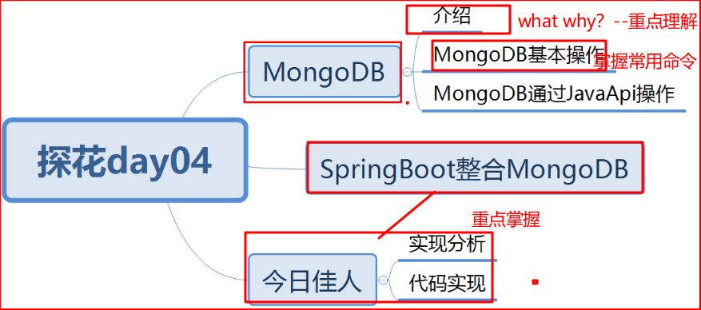
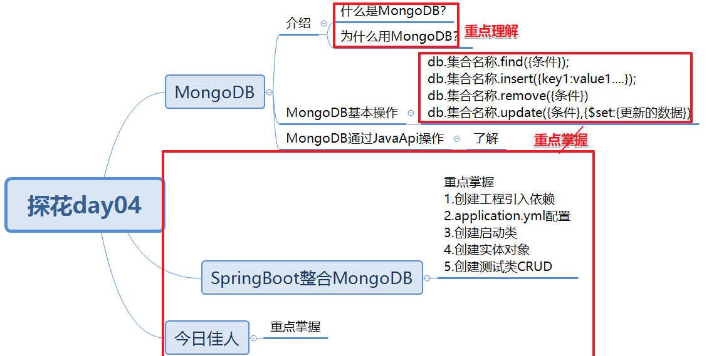

# 今日内容介绍




# MongoDB简介

**1.什么是MongoDB？**

答：C++语言编写高性能数据库，非关系型数据库，功能非常丰富。**数据结构非常松散**，最大特点**查询功能非常强大**！索引（加快查询速度的）

Mysql中的**表** == MongoDB中**集合**

**mysql支持多表连接,MongoDB不支持**    可以冗余字段

mongdb数据类型非常丰富，基本类似于mysql

**2.为什么用MongoDB？**

业务是否符合以下场景：

- 数据量会随着用户数增大而增大
- 读多写少
- 价值较低

“圈子”这类业务功能，为什么没有选择使用mysql？ 答：IO磁盘读写压力非常大

redis数据：加快查询速度

MongoDB:承担社交的业务功能

mysql:存储相对重要的数据

**3.如何使用MongoDB？**

```
db.集合名称.find({条件});
db.集合名称.insert({key1:value1....});
db.集合名称.remove({条件})
db.集合名称.update({条件},{$set:{更新的数据})
```

通过JavaApi操作MongoDB（了解）


**4.索引是什么？**

索引是特殊数据结构，作用就是为了提升查询速度的。mysql 默认索引是B+树   mongodb是B树 

例如：新华字典-目录-定位汉字所在页码（相当于mysql mongdb的索引）

实际工作中案例：艾默生网络能源 - 内部招聘系统 - 定时解析各大招聘网站简历 --公司内部招聘系统超级慢（打开一个简历需要3分钟）

如何优化解决？答：1.定位问题（程序开始start  结束地方end end-start=时间 ）2.代码中本身有些问题，优化些 3.操作数据库表关联查询语句（看执行计划 分析sql语句是否存在问题）4.将老的索引删除，重新建立正确索引

索引如何用？答：根据实际业务场景，实际查询条件，在查询条件上建立索引即可。


# SpringBoot整合MongoDB（重点）

1.创建测试工程，引入mongodb起步依赖

2.创建启动类（固定的）

3.创建实体对象 跟 数据库中表 一致

4.创建配置文件application.yml 配置连接mongodb配置

5.创建测试类 CRUD（重点掌握）


# 今日佳人

## 需求分析


用户登录探花交友app后，首页-今日佳人，会查询出跟当前用户缘分值最匹配的用户展示。

注意：今日功能实现后，app端是无法查看效果的，只能通过postman看效果。

## 数据库表

tb_userinfo:查询用户信息表(mysql)

recommend_user：今日佳人表或推荐用户表 （mongdb）

## 消费者编码分析

1. controller接收请求

2. controller调用service

   a.根据当前用户id查询跟当前用户最匹配的今日佳人用户对象RecommendUser(UserId Score)

   b.根据今日佳人UserId查询tb_userInfo表得到UserInfo对象

   c.将UserInfo与Score 封装Vo返回

## 服务提供者编码分析

1. 服务提供者：根据当前用户id 缘分值降序 取出一条最匹配的用户
2. 根据用户id查询用户信息（已经实现了）


## 测试


# 总结

1.注意：以后工作中，在操作数据库的时候，一定先记得备份数据。




# 解决问题能力-扩展知识点

debug 看错误信息 关机重启 找老师 Log日志 百度 csdn

先看服务提供者错，还是服务消费者出错  定位问题 clear install 找高良彬

**1.不要慌，调整心态，静下心来（非常重要！！！）。**

2.确保服务提供者、消费者工程启动正常的

3.启动正常的前提下，调用失败了！怎么办？

4.到zookeeper中bin目录下执行zkCli.cmd -server 10.10.20.160连接zookeeper 检查服务提供者与消费者是否正常

5.服务提供者或消费者节点没有注册或订阅地址信息，怎么办？

6.服务提供者：@Service包是否导错 配置文件扫描是否正确  消费者：@Reference是否导错包

7.在消费者以及服务提供者关键位置打上断点，一步一步调试。

8.业务处理完成后，需要检查下vo返回的数据是否正确。

