# 第5章 圈子功能实现-1

# 学习目标

- 完成公共列表-作业
- 圈子功能说明
- 圈子技术实现
- 圈子技术方案
- 圈子实现发布动态
- 圈子实现好友动态
- 圈子实现推荐动态
- 圈子实现点赞、喜欢功能（第6章实现）
- 圈子实现评论（第6章实现）
- 圈子实现评论的点赞（第6章实现）

# 1.公告管理-作业

### 【目标】

首页推荐需求介绍

首页推荐功能分析

首页推荐功能实现

### 【路径】

1：了解首页推荐需求

2：首页推荐功能分析

3：首页推荐功能实现

### 【讲解】

## 1.1. 服务消费者-公告管理

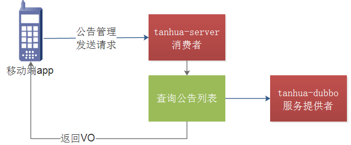 

### 1.1.1. 接口说明

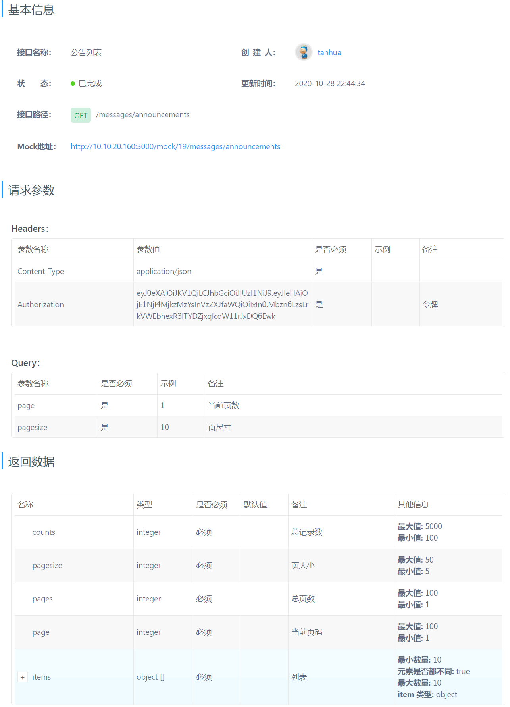

### 1.1.2. 公告实体类与VO

在tanhua-domain模块下创建Announcement

```java
package com.tanhua.domain.db;

import lombok.AllArgsConstructor;
import lombok.Data;
import lombok.NoArgsConstructor;

@Data
@NoArgsConstructor
@AllArgsConstructor
public class Announcement extends BasePojo {
    private String id;
    private String title;
    private String description;
}
```

### 1.1.3. Announcement

在tanhua-domain模块下创建AnnouncementVo

```java
package com.tanhua.domain.vo;

import lombok.AllArgsConstructor;
import lombok.Data;
import lombok.NoArgsConstructor;

@Data
@NoArgsConstructor
@AllArgsConstructor
public class AnnouncementVo {
    private String id;
    private String title;
    private String description;
    private String createDate;
}
```

### 1.1.4. AnnounController

在tanhua-server模块下创建AnnounController

```java
package com.tanhua.server.controller;

import com.tanhua.server.service.AnnounService;
import org.springframework.beans.factory.annotation.Autowired;
import org.springframework.http.ResponseEntity;
import org.springframework.web.bind.annotation.GetMapping;
import org.springframework.web.bind.annotation.RequestMapping;
import org.springframework.web.bind.annotation.RequestParam;
import org.springframework.web.bind.annotation.RestController;

/**
 * 公告
 */
@RestController
@RequestMapping("/messages")
public class AnnounController {

    @Autowired
    private AnnounService announService;

    /**
     * 查询公告列表
     *  GET /announcements
     *  参数：page，pagesize
     */
    @GetMapping("/announcements")
    public ResponseEntity announcements(@RequestParam(defaultValue = "1") int page,
                                        @RequestParam(defaultValue = "10")  int pagesize) {

        return announService.announcements(page,pagesize);
    }
}
```

### 1.1.5. AnnounService

在tanhua-server模块下创建AnnounService

```java
package com.tanhua.server.service;

import com.tanhua.domain.db.Announcement;
import com.tanhua.domain.vo.AnnouncementVo;
import com.tanhua.domain.vo.PageResult;
import com.tanhua.dubbo.api.AnnouncementApi;
import org.apache.dubbo.config.annotation.Reference;
import org.springframework.beans.BeanUtils;
import org.springframework.http.ResponseEntity;
import org.springframework.stereotype.Service;

import java.text.SimpleDateFormat;
import java.util.ArrayList;
import java.util.List;

@Service
public class AnnounService {

    @Reference
    private AnnouncementApi announcementApi;

    /**
     * 查询公告列表
     */
    public ResponseEntity announcements(int page, int pagesize) {
        //1、调用API查询分页数据 PageResult
        PageResult<Announcement> pageResult = announcementApi.findAll(page, pagesize);
        //2、获取所有的公告对象
        List<Announcement> records = pageResult.getItems();
        //3、一个公告对象，转化为一个vo对象
        List<AnnouncementVo> list = new ArrayList<>();

        for (Announcement record : records) {
            AnnouncementVo vo = new AnnouncementVo();
            BeanUtils.copyProperties(record,vo);
            if(record.getCreated() != null) {
                vo.setCreateDate(new SimpleDateFormat("yyyy-MM-dd hh:mm").format(record.getCreated()));
            }
            list.add(vo);
        }
        //4、构造需要的分页对象，PageResult
        PageResult resultVo = new PageResult(pageResult.getCounts(), pageResult.getPagesize(),pageResult.getPages(),pageResult.getPage(),list);
        //5、构造返回值
        return ResponseEntity.ok(resultVo);
    }
}
```

## 1.2. 服务提供者-公告管理

### 1.2.1. AnnouncementApi

在tanhua-dubbo-interface模块下创建AnnouncementApi

```java
package com.tanhua.dubbo.api;

import com.tanhua.domain.db.Announcement;
import com.tanhua.domain.vo.PageResult;

public interface AnnouncementApi {

    /**
     * 分页查询
     */
    PageResult<Announcement> findAll(int page, int size);
}
```

### 1.2.2 AnnouncementApiImpl

在tanhua-dubbo-service模块下创建AnnouncementApiImpl

```java
package com.tanhua.dubbo.api;
import com.baomidou.mybatisplus.core.conditions.query.QueryWrapper;
import com.baomidou.mybatisplus.core.metadata.IPage;
import com.baomidou.mybatisplus.extension.plugins.pagination.Page;
import com.tanhua.domain.db.Announcement;
import com.tanhua.domain.vo.PageResult;
import com.tanhua.dubbo.mapper.AnnouncementMapper;
import org.apache.dubbo.config.annotation.Service;
import org.springframework.beans.factory.annotation.Autowired;

@Service
public class AnnouncementApiImpl implements AnnouncementApi {

    @Autowired
    private AnnouncementMapper announcementMapper;

    @Override
    public PageResult<Announcement> findAll(int page, int size) {
        Page<Announcement> pages = new Page<>(page,size);
        IPage<Announcement> pageInfo = announcementMapper.selectPage(pages, new QueryWrapper<>());
        PageResult<Announcement> pageResult = new PageResult<Announcement>(pageInfo.getTotal(), pageInfo.getSize(),pageInfo.getPages(),pageInfo.getCurrent(),pageInfo.getRecords());
        return pageResult;
    }
}
```

### 1.2.3. AnnouncementMapper

在tanhua-dubbo-service模块下创建AnnouncementMapper

```java
package com.tanhua.dubbo.mapper;
import com.baomidou.mybatisplus.core.mapper.BaseMapper;
import com.tanhua.domain.db.Announcement;

public interface AnnouncementMapper extends BaseMapper<Announcement> {

}
```

### 1.3.4. 测试

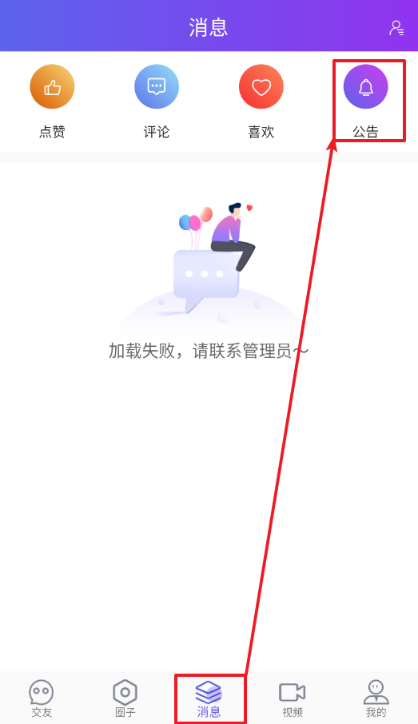 

 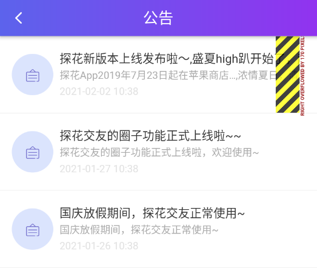


### 【小结】

掌握公共管理功能实现

# 2. 首页推荐

### 【目标】

首页推荐需求x介绍

首页推荐功能分析

首页推荐功能实现

### 【路径】

1：了解首页推荐需求

2：首页推荐功能分析

3：首页推荐功能实现

### 【讲解】

 

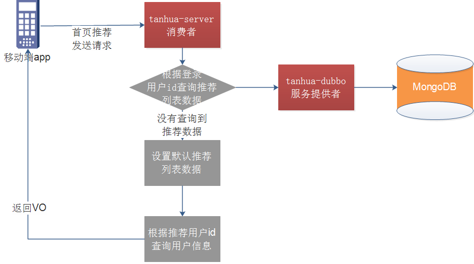

## 2.3. 服务消费者-首页推荐

### 2.3.1. 接口说明

 

 

响应：

```json
{
    "counts": 4698,
    "pagesize": 20,
    "pages": 58,
    "page": 16,
    "items": [
        {
            "id": 1011,
            "avatar": "assets/images/avatar_2.png",
            "nickname": "黑马小妹",
            "gender": "woman",
            "age": 23,
            "tags": [
                "本科",
                "年龄相仿",
                "单身"
            ],
            "fateValue": 96
        },
        {
            "id": 2495,
            "avatar": "assets/images/avatar_1.png",
            "nickname": "米朵妹妹",
            "gender": "man",
            "age": 28,
            "tags": [
                "年龄相仿",
                "本科",
                "单身"
            ],
            "fateValue": 87
        }
        ......
    ]
}
```

### 2.3.2. RecommendUserQueryParam

在tanhua-domain模块vo下创建RecommendUserQueryParam

```java
package com.tanhua.domain.vo;
import lombok.Data;
import java.io.Serializable;

@Data
public class RecommendUserQueryParam implements Serializable {

    private Integer page;
    private Integer pagesize;
    private String gender;
    private String lastLogin;
    private Integer age;
    private String city;
    private String education;
}
```

### 2.3.3. TodayBestController

在tanhua-server模块TodayBestController创建recommendList

```java
/**
 * 推荐列表
 * @param queryParam
 * @return
 */
@GetMapping("/recommendation")
public ResponseEntity recommendList(RecommendUserQueryParam queryParam){
    PageResult<TodayBestVo> pageResult = todayBestService.recommendList(queryParam);
    return ResponseEntity.ok(pageResult);
}
```

### 2.3.4. TodayBestService

在tanhua-server模块TodayBestService创建recommendList

```java
/**
  * 推荐列表
  * @param queryParam
  * @return
  */
public PageResult<TodayBestVo> recommendList(RecommendUserQueryParam queryParam) {
    //根据token查询当前登录的用户信息
    Long userId = UserHolder.getUserId();
    PageResult result = recommendUserApi.findPage(queryParam.getPage(),queryParam.getPagesize(),userId);
    List<RecommendUser> records = (List<RecommendUser>) result.getItems();
    // 如果未查询到，需要使用默认推荐列表
    if (CollectionUtils.isEmpty(records)) {
        result = new PageResult(10l,queryParam.getPagesize().longValue(),1l,1l,null);
        records = defaultRecommend();
    }
    List<TodayBestVo> todayBests = new ArrayList<>();
    for (RecommendUser record : records) {
        TodayBestVo best = new TodayBestVo();
        // 补全用户信息
        UserInfo userInfo = this.userInfoApi.findByUserId(record.getUserId());
        BeanUtils.copyProperties(userInfo, best);
        best.setId(record.getUserId());
        best.setFateValue(record.getScore().longValue());
        best.setTags(StringUtils.split(userInfo.getTags(), ','));
        todayBests.add(best);
    }
    //构造VO返回
    result.setItems(todayBests);
    return result;
}

//构造默认数据
private List<RecommendUser> defaultRecommend() {
    String ids = "1,2,3,4,5,6,7,8,9,10";
    List<RecommendUser> records = new ArrayList<>();
    for (String id : ids.split(",")) {
        RecommendUser recommendUser = new RecommendUser();
        recommendUser.setUserId(Long.valueOf(id));
        recommendUser.setScore(RandomUtils.nextDouble(70, 98));
        records.add(recommendUser);
    }
    return records;
}
```

## 2.2. 服务提供者-首页推荐

### 2.2.1. RecommendUserApi

在tanhua-dubbo-interface模块下创建RecommendUserApi

```java
/**
 * 推荐列表分页查询
 * @param page
 * @param pagesize
 * @param userId
 * @return
 */
PageResult<RecommendUser> findPage(int page, int pagesize, long userId);
```

### 2.2.2 RecommendUserApiImpl

在tanhua-dubbo-service模块下创建RecommendUserApiImpl

```java
/**
 * 推荐列表分页查询
 * @param page
 * @param pagesize
 * @param userId
 * @return
 */
@Override
public PageResult<RecommendUser> findPage(int page, int pagesize, long userId) {
    Query query = new Query();
    // 查询条件
    query.addCriteria(Criteria.where("toUserId").is(userId));
    // 获取 总记录数
    long total = mongoTemplate.count(query, RecommendUser.class);
    // 分页参数设置
    PageRequest pageRequest = PageRequest.of(page-1,pagesize,Sort.by(Sort.Order.desc("score")));
    query.with(pageRequest);
    // 查询分页结果集
    List<RecommendUser> recommendUserList = mongoTemplate.find(query, RecommendUser.class);
    // 封装返回对象
    PageResult<RecommendUser> pageResult = new PageResult<RecommendUser>();
    pageResult.setItems(recommendUserList);
    pageResult.setPage((long)page);
    pageResult.setPagesize((long)pagesize);
    pageResult.setCounts(total);
    // 计算总页数
    long pages = total/pagesize;
    pages+=total%pagesize>0?1:0;
    pageResult.setPages(pages);

    return pageResult;
}
```

### 2.3.3. 测试

postman测试

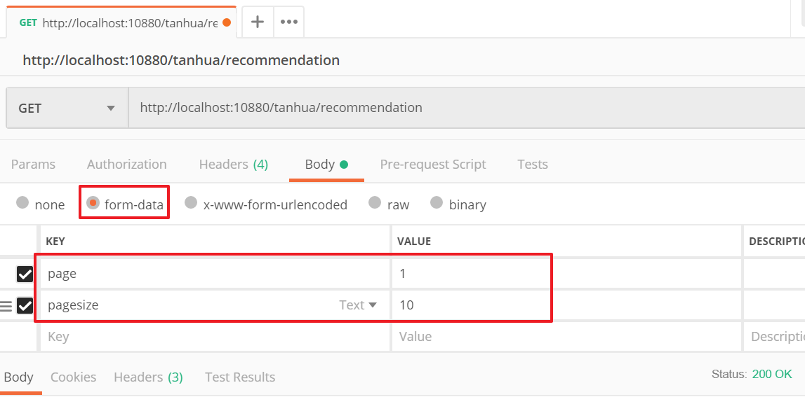

app测试

 

### 【小结】

掌握首页推荐功能

# 3. 圈子功能

### 【目标】

圈子功能需求介绍

圈子功能功能分析

圈子功能功能实现

### 【路径】

1：了解圈子功能需求

2：圈子功能分析

3：圈子功能实现

### 【讲解】

## 3.1. 功能介绍

探花交友项目中的圈子功能，类似微信的朋友圈，基本的功能为：发布动态、浏览好友动态、浏览推荐动态、点赞、评论、喜欢等功能。

 

发布：

 

## 3.2. 实现方案分析

对于圈子功能的实现，我们需要对它的功能特点做分析：

- 数据量会随着用户数增大而增大
- 读多写少
- 非好友看不到其动态内容
- ……

针对以上特点，我们来分析一下：

- 对于数据量大而言，显然不能够使用关系型数据库进行存储，我们需要通过MongoDB进行存储
- 对于读多写少的应用，需要减少读取的成本
  - 比如说，一条SQL语句，单张表查询一定比多张表查询要快
- 对于每个人数据在存储层面最好做到相互隔离，这样的话就不会有影响

**所以对于存储而言，主要是核心的4张表：**

- 发布表：记录了所有用户的发布的东西信息，如图片、视频等。
- 相册：相册是每个用户独立的，记录了该用户所发布的所有内容。
- 评论：针对某个具体发布的朋友评论和点赞操作。
- 时间线：所谓“刷朋友圈”，就是刷时间线，就是一个用户所有的朋友的发布内容。
- 好友表：记录好友关系
- 推荐圈子表：记录推荐动态表

## 3.3. 技术方案(重点)

根据之前我们的分析，对于技术方案而言，将采用MongoDB+Redis来实现，其中MongoDB负责存储，Redis负责缓存数据。

### 3.1.1. 发布流程

 

流程说明：

- 用户发布动态，首先将动态内容写入到发布表。
- 然后，将发布的指向写入到自己的相册表中。
- 最后，将发布的指向写入到好友的时间线中。

### 3.1.2. 查看流程

 

流程说明：

- 用户查看动态，如果查看自己的动态，直接查询相册表即可
- 如果查看好友动态，查询时间线表即可
- 如果查看推荐动态，查看推荐表即可

由此可见，查看动态的成本较低，可以快速的查询到动态数据。

## 3.4. 数据库表分析 

### 3.4.1. 数据库表

#### ① 发布表

```json
#表名：quanzi_publish
{
    "id":1,#主键id
    "userId":1, #用户id
    "text":"今天心情很好", #文本内容
    "medias":"http://xxxx/x/y/z.jpg", #媒体数据，图片或小视频 url
    "seeType":1, #谁可以看，1-公开，2-私密，3-部分可见，4-不给谁看
    "seeList":[1,2,3], #部分可见的列表
    "notSeeList":[4,5,6],#不给谁看的列表
	"longitude":108.840974298098,#经度
	"latitude":34.2789316522934,#纬度
    "locationName":"上海市浦东区", #位置名称
    "created",1568012791171 #发布时间
}
```

#### ② 相册表 

```json
#表名：quanzi_album_{userId}
{
    "id":1,#主键id
    "publishId":1001, #发布id
    "created":1568012791171 #发布时间
}
```

#### ③ 时间线表

```json
#表名：quanzi_time_line_{userId}
{
    "id":1,#主键id,
    "userId":2, #好友id
    "publishId":1001, #发布id
    "date":1568012791171 #发布时间
}
```

#### ④ 评论表

```json
#表名：quanzi_comment
{
    "id":1, #主键id
    "publishId":1001, #发布id
    "commentType":1, #评论类型，1-点赞，2-评论，3-喜欢
    "content":"给力！", #评论内容
    "userId":2, #评论人
    "isParent":false, #是否为父节点，默认是否
    "parentId":1001, #父节点id
    "created":1568012791171
}
```

#### ⑤ 好友表

```json
#表名：tanhua_users
{
    "id":1, #主键id
    "userId":1001, #用户id
    "friendId":1,  #好友id
    "created":1568012791171
}
```

#### ⑥ 推荐动态表

```json
#表名：recommend_quanzi
{ 
    "id" : 1, #主键id
    "userId" : 1001, #用户id
    "score" : 9.0, 
    "created" : 1568012791171,  
    "publishId":1001, #发布id
}
```

### 3.4.2. 实体类与VO

tanhua-domain模块mongo包中创建以下实体对象

#### ① Publish

~~~java
package com.tanhua.domain.mongo;

import lombok.Data;
import org.bson.types.ObjectId;
import org.springframework.data.mongodb.core.mapping.Document;

import java.io.Serializable;
import java.util.List;

/**
 * <p>
 * 发布的动态信息表
 * </p>
 */
@Data
@Document(collection = "quanzi_publish")
public class Publish implements Serializable {

    private ObjectId id; //主键id
    private Long pid; //Long类型，用于推荐系统的模型
    private Long userId;
    private String textContent; //文字

    private List<String> medias; //媒体数据，图片或小视频 url
    private Integer seeType; // 谁可以看，1-公开，2-私密，3-部分可见，4-不给谁看

    private String longitude; //经度
    private String latitude; //纬度
    private String locationName; //位置名称
    private Long created; //发布时间

    private Integer likeCount=0; //点赞数
    private Integer commentCount=0; //评论数
    private Integer loveCount=0; //喜欢数
}
~~~
#### ② Album
~~~java
package com.tanhua.domain.mongo;

import lombok.Data;
import org.bson.types.ObjectId;
import org.springframework.data.mongodb.core.mapping.Document;

import java.io.Serializable;

/**
 * <p>
 * 相册表，用于存储自己发布的数据，每一个用户一张表进行存储
 * </p>
 */
@Data
public class Album implements Serializable {

    private ObjectId id; //主键id
    private ObjectId publishId; //发布id
    private Long created; //发布时间
}
~~~
#### ③ TimeLine
~~~java
package com.tanhua.domain.mongo;

import lombok.Data;
import org.bson.types.ObjectId;
import org.springframework.data.mongodb.core.mapping.Document;

import java.io.Serializable;

/**
 * <p>
 * 时间线表，用于存储发布（或推荐）的数据，每一个用户一张表进行存储
 * </p>
 */
@Data
public class TimeLine implements Serializable {

    private ObjectId id;

    private Long userId; // 好友id
    private ObjectId publishId; //发布id

    private Long created; //发布的时间
}
~~~
#### ④ Friend
~~~java
package com.tanhua.domain.mongo;

import lombok.Data;
import org.bson.types.ObjectId;
import org.springframework.data.mongodb.core.mapping.Document;

import java.io.Serializable;

/**
 * <p>
 * 好友关系
 * </p>
 */
@Data
@Document(collection = "tanhua_users")
public class Friend implements Serializable {
    private ObjectId id;
    private Long userId; //用户id
    private Long friendId; //好友id
    private Long created; //时间
}

~~~
#### ⑤ RecommendQuanzi
```java
package com.tanhua.domain.mongo;

import lombok.Data;
import org.bson.types.ObjectId;
import org.springframework.data.annotation.Id;
import org.springframework.data.mongodb.core.index.Indexed;
import org.springframework.data.mongodb.core.mapping.Document;

import java.io.Serializable;

/**
 * <p>
 * 推荐动态
 * </p>
 */
@Data
@Document(collection = "recommend_quanzi")
public class RecommendQuanzi implements Serializable {

    @Id
    private ObjectId id; // 主键
    @Indexed
    private Long userId; // 推荐的用户id
    private Long pid;
    private ObjectId publishId; // 发布的动态的id
    @Indexed
    private Double score = 0d; // 推荐分数
    private Long created; // 日期
}
```

tanhua-domain模块vo包中创建以下VO

#### ⑥ PublishVo

```java
package com.tanhua.domain.vo;
import lombok.Data;
import java.io.Serializable;
import java.util.List;

@Data
public class PublishVo implements Serializable {

    private Long userId; // 用户id
    private String textContent; // 文本内容
    private String location; // 地理位置
    private String longitude; // 经度
    private String latitude; // 纬度
    private List<String> medias; // 图片url
}
```

#### ⑦ MomentVo

```java
package com.tanhua.domain.vo;
import lombok.Data;
import java.io.Serializable;
@Data
public class MomentVo implements Serializable {
    private String id; //动态id

    private Long userId; //用户id
    private String avatar; //头像
    private String nickname; //昵称
    private String gender; //性别 man woman
    private Integer age; //年龄
    private String[] tags; //标签


    private String textContent; //文字动态
    private String[] imageContent; //图片动态
    private String distance; //距离
    private String createDate; //发布时间 如: 10分钟前
    private int likeCount; //点赞数
    private int commentCount; //评论数
    private int loveCount; //喜欢数


    private Integer hasLiked; //是否点赞（1是，0否）
    private Integer hasLoved; //是否喜欢（1是，0否）
}
```

## 3.5. 服务消费者-发布动态

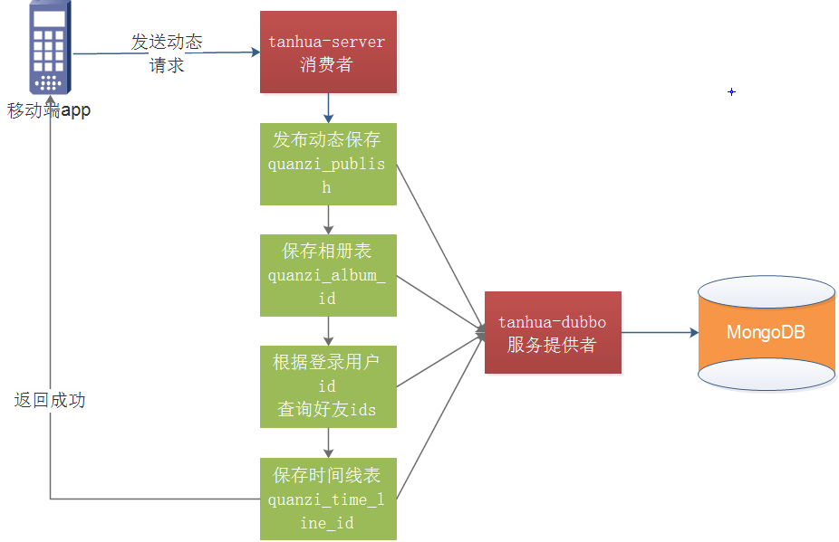 

### 3.5.1. 接口说明

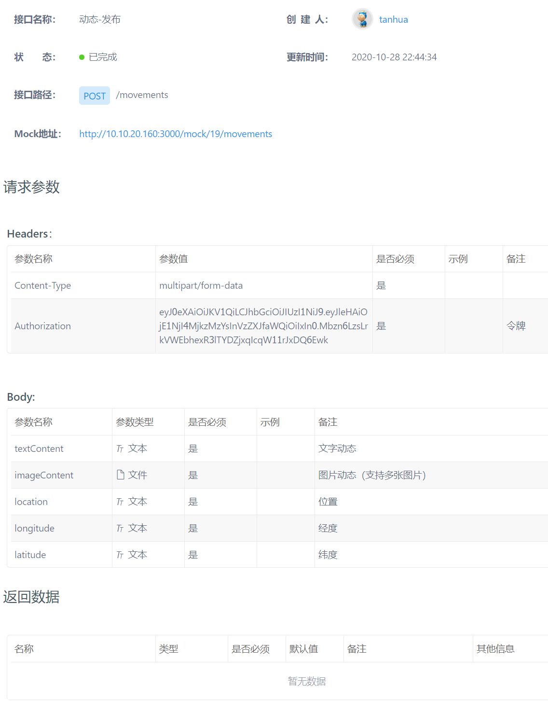

### 3.5.2. MomentController

tanhua-server模块编写MomentController，完成发布动态功能

~~~java
package com.tanhua.server.controller;

import com.tanhua.domain.vo.PublishVo;
import com.tanhua.server.service.MomentService;
import org.springframework.beans.factory.annotation.Autowired;
import org.springframework.http.ResponseEntity;
import org.springframework.web.bind.annotation.PostMapping;
import org.springframework.web.bind.annotation.RequestMapping;
import org.springframework.web.bind.annotation.RestController;
import org.springframework.web.multipart.MultipartFile;

import java.io.IOException;

@RestController
@RequestMapping("/movements")
public class MomentController {

    @Autowired
    private MomentService momentService;

    /**
     * 发布动态
     * @return
     */
    @PostMapping
    public ResponseEntity postMoment(PublishVo publishVo, MultipartFile[] imageContent) throws IOException {
        momentService.save(publishVo, imageContent);
        return ResponseEntity.ok(null);
    }
}

~~~

### 3.5.3. MovementsService

`tanhua-server模块`编写MovementsService，完成发布动态功能

~~~java
package com.tanhua.server.service;

import com.tanhua.commons.templates.OssTemplate;
import com.tanhua.domain.vo.PublishVo;
import com.tanhua.dubbo.api.mongo.PublishApi;
import com.tanhua.server.interceptor.UserHolder;
import org.apache.dubbo.config.annotation.Reference;
import org.springframework.beans.factory.annotation.Autowired;
import org.springframework.stereotype.Service;
import org.springframework.web.multipart.MultipartFile;

import java.io.IOException;
import java.util.ArrayList;
import java.util.List;

 
@Service
public class MomentService {

    @Autowired
    private OssTemplate ossTemplate;

    @Reference
    private PublishApi publishApi;
    /**
     * 发布动态
     * @param publishVo
     * @param imageContent
     */
    public void save(PublishVo publishVo, MultipartFile[] imageContent) throws IOException {
        // 上传文件到云存储
        List<String> medias = new ArrayList<String>();
        for (MultipartFile multipartFile : imageContent) {
            String filename = multipartFile.getOriginalFilename();
            String path = ossTemplate.upload(filename, multipartFile.getInputStream());
            medias.add(path);
        }
        publishVo.setUserId(UserHolder.getUserId());
        publishVo.setMedias(medias);
        publishApi.add(publishVo);
    }
}
~~~

## 3.6. 服务提供者-发布动态

### 3.6.1. mongo主键自增

tanhua-domain模块中mongo包中创建实体类

```java
package com.tanhua.domain.mongo;

import lombok.Data;
import org.bson.types.ObjectId;
import org.springframework.data.mongodb.core.mapping.Document;

@Data
@Document(collection = "sequence")
public class Sequence {

    private ObjectId id;

    private long seqId; //自增序列

    private String collName;  //集合名称
}
```

tanhua-dubbo-service模块下创建IdService

```java
package com.tanhua.dubbo.utils;

import com.tanhua.domain.mongo.Sequence;
import org.springframework.beans.factory.annotation.Autowired;
import org.springframework.data.mongodb.core.FindAndModifyOptions;
import org.springframework.data.mongodb.core.MongoTemplate;
import org.springframework.data.mongodb.core.query.Criteria;
import org.springframework.data.mongodb.core.query.Query;
import org.springframework.data.mongodb.core.query.Update;
import org.springframework.stereotype.Component;

@Component
public class IdService {

    @Autowired
    private MongoTemplate mongoTemplate;

    /**
     * 根据集合名，生成自增id
     * @param collectinName
     * @return
     */
    public Long nextId(String collectinName){
        Query query = Query.query(Criteria.where("collName").is(collectinName));
        Update update = new Update();
        update.inc("seqId",1);
        FindAndModifyOptions options = new FindAndModifyOptions();
        options.upsert(true);
        options.returnNew(true);
        Sequence seq = mongoTemplate.findAndModify(query, update, options, Sequence.class);
        return seq.getSeqId();
    }
}
```

### 3.6.2. PublishApi

tanhua-dubbo-interface模块mongo包中创建PublishApi

```java
package com.tanhua.dubbo.api.mongo;
import com.tanhua.domain.vo.PublishVo;

/**
 * <p>
 *  圈子动态api
 * </p>
 */
public interface PublishApi {

    /**
     * 添加用户动态
     * @param publishVo
     */
    void add(PublishVo publishVo);
}
```

### 3.6.3. PublishApiImpl

tanhua-dubbo-service模块mongo包中创建PublishApiImpl

```java
package com.tanhua.dubbo.api.mongo;

import com.tanhua.domain.mongo.*;
import com.tanhua.domain.vo.PageResult;
import com.tanhua.domain.vo.PublishVo;
import com.tanhua.dubbo.utils.IdService;
import org.apache.dubbo.config.annotation.Service;
import org.bson.types.ObjectId;
import org.springframework.beans.BeanUtils;
import org.springframework.beans.factory.annotation.Autowired;
import org.springframework.data.domain.PageRequest;
import org.springframework.data.domain.Sort;
import org.springframework.data.mongodb.core.MongoTemplate;
import org.springframework.data.mongodb.core.query.Criteria;
import org.springframework.data.mongodb.core.query.Query;

import java.util.List;
import java.util.stream.Collectors;

/**
 * <p>
 * 圈子动态api的实现，也为其服务的提供者
 * </p>
 */
@Service
public class PublishApiImpl implements PublishApi {

    @Autowired
    private MongoTemplate mongoTemplate;

    @Autowired
    private IdService idService;

    /**
     * 添加用户动态
     * @param publishVo
     */
    @Override
    public void add(PublishVo publishVo) {
        // 1. 保存到发布的总表
        long currentTimeMillis = System.currentTimeMillis();
        Publish publish = new Publish();
        BeanUtils.copyProperties(publishVo,publish);
        publish.setId(ObjectId.get());
        publish.setPid(idService.nextId("quanzi_publish"));
        publish.setLocationName(publishVo.getLocation());
        publish.setCreated(currentTimeMillis);
        publish.setSeeType(1); // 1-公开
        mongoTemplate.save(publish);

        // 2. 保存到相册
        Album album = new Album();
        album.setCreated(currentTimeMillis);
        album.setPublishId(publish.getId());
        album.setId(ObjectId.get());
        mongoTemplate.save(album,"quanzi_album_" + publish.getUserId());
        // 3. 查询好友
        Query query = Query.query(Criteria.where("userId").is(publishVo.getUserId()));
        List<Friend> friends = mongoTemplate.find(query, Friend.class);

        // 4. 保存到好友表
        friends.forEach(f->{
            TimeLine timeLine = new TimeLine();
            timeLine.setCreated(currentTimeMillis);
            timeLine.setPublishId(publish.getId());
            timeLine.setUserId(publish.getUserId());
            timeLine.setId(ObjectId.get());
            mongoTemplate.save(timeLine,"quanzi_time_line_" + f.getFriendId());
        });
    }
}
```

### 3.6.4. 测试

postman测试

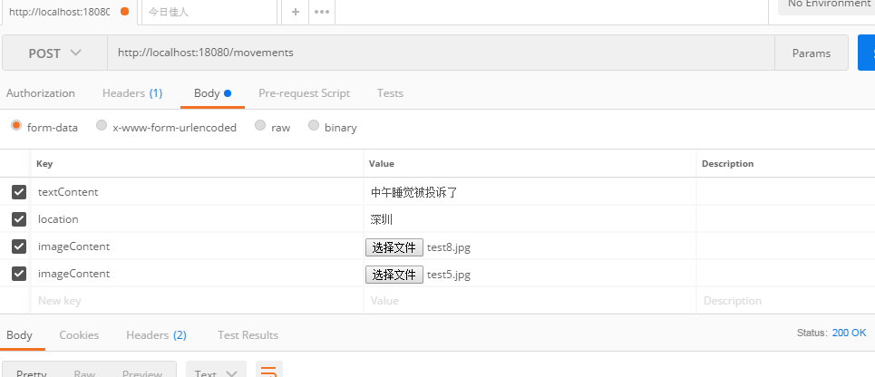

 结果：

app测试

 

 

## 3.7. 服务消费者-查询好友动态

查询好友动态其实就是查询自己的时间线表，好友在发动态时已经将动态信息写入到了自己的时间线表中。

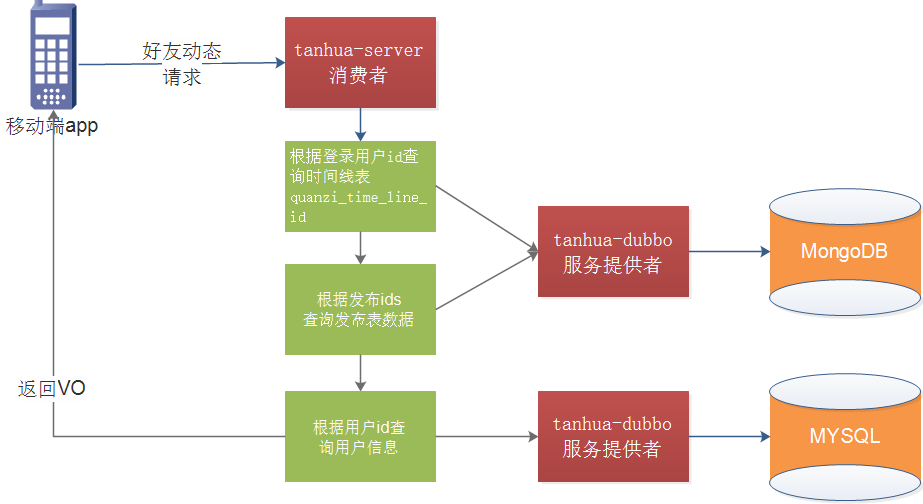

### 3.7.1. MomentController 

tanhua-server模块controller包中修改 MomentController 完成查询好友动态功能

~~~java
/**
 * 查询好友动态
 * @param page
 * @param pagesize
 * @return
 */
@GetMapping
public ResponseEntity queryFriendPublishList(@RequestParam(defaultValue = "1") int page, @RequestParam(defaultValue = "10") int pagesize){
    page=page<1?1:page;
    PageResult<MomentVo> pageResult = momentService.queryFriendPublishList(page,pagesize);
    return ResponseEntity.ok(pageResult);
}
~~~

### 3.7.2. MomentService

tanhua-server模块service包中修改 MomentService 完成查询好友动态功能

~~~java
@Reference
private UserInfoApi userInfoApi;

/**
 * 查询好友动态
 * @param page
 * @param pagesize
 * @return
 */
public PageResult<MomentVo> queryFriendPublishList(int page, int pagesize) {
    //1、获取登录用户的ID
    Long userId = UserHolder.getUserId();
    //2、调用api完成分页查询   publish对象
    PageResult result = publishApi.findFriendPublishByTimeline(page, pagesize, userId);
    //3、获取publish列表
    List<Publish> items = (List<Publish>) result.getItems();
    //4、一个publish构造成一个MomentVo
    List<MomentVo> list = new ArrayList<>();
    if(items != null) {
        for (Publish item : items) {
            MomentVo vo = new MomentVo();
            UserInfo userInfo = userInfoApi.findByUserId(item.getUserId());
            if(userInfo != null) {
                BeanUtils.copyProperties(userInfo,vo);
                if(userInfo.getTags() != null) {
                    vo.setTags(userInfo.getTags().split(","));
                }
            }
            BeanUtils.copyProperties(item, vo);
            vo.setId(item.getId().toHexString());
            vo.setCreateDate(RelativeDateFormat.format(new Date(item.getCreated())));
            vo.setHasLiked(0);  //是否点赞  0：未点 1:点赞
            vo.setHasLoved(0);  //是否喜欢  0：未点 1:点赞
            vo.setImageContent(item.getMedias().toArray(new String[]{}));
            vo.setDistance("50米");
            list.add(vo);
        }
    }
    //5、构造返回值
    result.setItems(list);
    return result;
}
~~~

### 3.7.3. RelativeDateFormat

tanhua-server模块utils包中创建RelativeDateFormat

```java
package com.tanhua.server.utils;

import java.text.ParseException;
import java.text.SimpleDateFormat;
import java.util.Date;

public class RelativeDateFormat {
 
    private static final long ONE_MINUTE = 60000L;
    private static final long ONE_HOUR = 3600000L;
    private static final long ONE_DAY = 86400000L;
    private static final long ONE_WEEK = 604800000L;
 
    private static final String ONE_SECOND_AGO = "秒前";
    private static final String ONE_MINUTE_AGO = "分钟前";
    private static final String ONE_HOUR_AGO = "小时前";
    private static final String ONE_DAY_AGO = "天前";
    private static final String ONE_MONTH_AGO = "月前";
    private static final String ONE_YEAR_AGO = "年前";
 
    public static void main(String[] args) throws ParseException {
        SimpleDateFormat format = new SimpleDateFormat("yyyy-MM-dd HH:m:s");
        Date date = format.parse("2013-11-11 18:35:35");
        System.out.println(format(date));
    }
 
    public static String format(Date date) {
        long delta = new Date().getTime() - date.getTime();
        if (delta < 1L * ONE_MINUTE) {
            long seconds = toSeconds(delta);
            return (seconds <= 0 ? 1 : seconds) + ONE_SECOND_AGO;
        }
        if (delta < 45L * ONE_MINUTE) {
            long minutes = toMinutes(delta);
            return (minutes <= 0 ? 1 : minutes) + ONE_MINUTE_AGO;
        }
        if (delta < 24L * ONE_HOUR) {
            long hours = toHours(delta);
            return (hours <= 0 ? 1 : hours) + ONE_HOUR_AGO;
        }
        if (delta < 48L * ONE_HOUR) {
            return "昨天";
        }
        if (delta < 30L * ONE_DAY) {
            long days = toDays(delta);
            return (days <= 0 ? 1 : days) + ONE_DAY_AGO;
        }
        if (delta < 12L * 4L * ONE_WEEK) {
            long months = toMonths(delta);
            return (months <= 0 ? 1 : months) + ONE_MONTH_AGO;
        } else {
            long years = toYears(delta);
            return (years <= 0 ? 1 : years) + ONE_YEAR_AGO;
        }
    }
 
    private static long toSeconds(long date) {
        return date / 1000L;
    }
 
    private static long toMinutes(long date) {
        return toSeconds(date) / 60L;
    }
 
    private static long toHours(long date) {
        return toMinutes(date) / 60L;
    }
 
    private static long toDays(long date) {
        return toHours(date) / 24L;
    }
 
    private static long toMonths(long date) {
        return toDays(date) / 30L;
    }
 
    private static long toYears(long date) {
        return toMonths(date) / 365L;
    }
 
}
```

## 3.8. 服务提供者-查询好友动态

### 3.8.1. PublishApi

tanhua-dubbo-interface模块mongo包中创建PublishApi

```java
package com.tanhua.dubbo.api.mongo;
import com.tanhua.domain.vo.PageResult;
import com.tanhua.domain.vo.PublishVo;

/**
 * <p>
 *  圈子动态api
 * </p>
 */
public interface PublishApi {

    /**
     * 查询登陆用户的好友动态
     * @param page
     * @param pagesize
     * @param userId
     * @return
     */
    PageResult findFriendPublishByTimeline(int page, int pagesize, long userId);
}
```

### 3.8.2. PublishApiImpl

tanhua-dubbo-service模块mongo包中创建PublishApiImpl

```java
package com.tanhua.dubbo.api.mongo;

import com.tanhua.domain.mongo.*;
import com.tanhua.domain.vo.PageResult;
import com.tanhua.domain.vo.PublishVo;
import com.tanhua.dubbo.utils.IdService;
import org.apache.dubbo.config.annotation.Service;
import org.bson.types.ObjectId;
import org.springframework.beans.BeanUtils;
import org.springframework.beans.factory.annotation.Autowired;
import org.springframework.data.domain.PageRequest;
import org.springframework.data.domain.Sort;
import org.springframework.data.mongodb.core.MongoTemplate;
import org.springframework.data.mongodb.core.query.Criteria;
import org.springframework.data.mongodb.core.query.Query;

import java.util.List;
import java.util.stream.Collectors;

/**
 * <p>
 * 圈子动态api的实现，也为其服务的提供者
 * </p>
 */
@Service
public class PublishApiImpl implements PublishApi {

    @Autowired
    private MongoTemplate mongoTemplate;

    @Autowired
    private IdService idService;
    
    /**
     * 查询登陆用户的好友动态
     * @param page
     * @param pagesize
     * @param userId
     * @return
     */
    @Override
    public PageResult findFriendPublishByTimeline(int page, int pagesize, long userId) {
        //1、查询时间线表，根据当前用户，查询此用户的时间表
        Query query = new Query().with(Sort.by(Sort.Order.desc("created")))
                .limit(pagesize).skip((page - 1) * pagesize);
        //publishId : 动态详情的id
        List<TimeLine> lines = mongoTemplate.find(query, TimeLine.class, "quanzi_time_line_" + userId);
        long total = mongoTemplate.count(query, TimeLine.class, "quanzi_time_line_" + userId);
        //2、循环时间线数据，查询publish，获取动态详情
        List<Publish> list = new ArrayList<>();
        for (TimeLine line : lines) {
            Publish publish = mongoTemplate.findById(line.getPublishId(), Publish.class);
            if (publish != null)
                list.add(publish);
        }
        //3、构造返回值
        long pages = total / pagesize;
        pages += total % pagesize > 0 ? 1 : 0;
        return new PageResult((long) total, (long) pagesize, (long) pages, (long) page, list);
    }
}
```

### 3.8.3. 测试

 

## 3.9. 服务消费者-查询推荐动态

推荐动态是通过推荐系统计算出的结果，现在我们只需要实现查询即可。

推荐动态和好友动态的结构是一样的，所以我们只需要查询推荐的时间表即可。

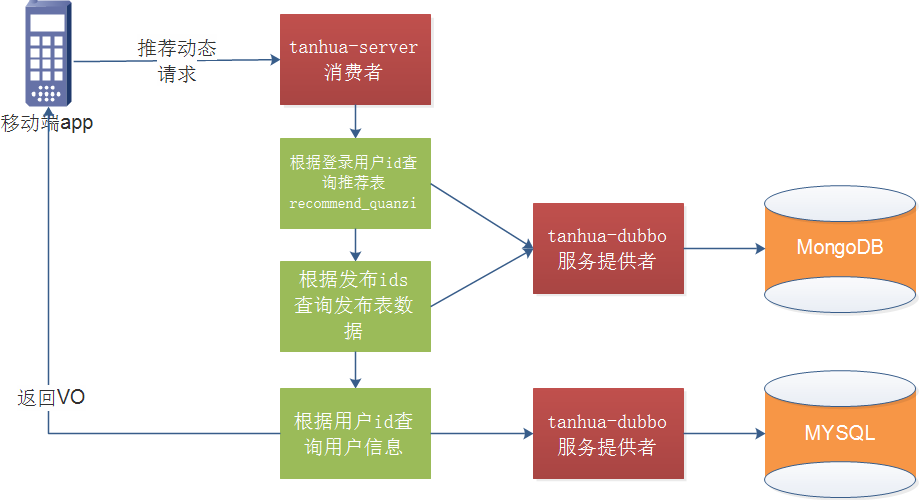

### 3.9.1. MomentController 

tanhua-server模块controller包中修改MomentController 完成查询推荐动态功能

~~~java
/**
 * 查询推荐动态
 * @param page
 * @param pagesize
 * @return
 */
@GetMapping("/recommend")
public ResponseEntity queryRecommendPublishList(@RequestParam(defaultValue = "1") int page, @RequestParam(defaultValue = "10") int pagesize){
    page=page<1?1:page;
    PageResult<MomentVo> pageResult = momentService.queryRecommendPublishList(page,pagesize);
    return ResponseEntity.ok(pageResult);
}
~~~

### 3.9.2. MomentService

tanhua-server模块service包中修改MomentService完成查询推荐动态功能

~~~java
/**
  * 查询推荐动态
  * @param page
  * @param size
  * @return
  */
public PageResult<MomentVo> queryRecommendPublishList(int page, int size) {
    //1、获取登录用户的ID
    Long userId = UserHolder.getUserId();
    //2、调用api完成分页查询   publish对象
    PageResult result = publishApi.findRecommendPublish(page, size, userId);
    //3、获取publish列表
    List<Publish> items = (List<Publish>) result.getItems();
    //4、一个publish构造成一个Movements
    List<MomentVo> list = new ArrayList<>();
    if(items != null) {
        for (Publish item : items) {
            MomentVo vo = new MomentVo();
            UserInfo userInfo = userInfoApi.findByUserId(item.getUserId());
            if(userInfo != null) {
                BeanUtils.copyProperties(userInfo,vo);
                if(userInfo.getTags() != null) {
                    vo.setTags(userInfo.getTags().split(","));
                }
            }
            BeanUtils.copyProperties(item, vo);
            vo.setId(item.getId().toHexString());
            vo.setCreateDate(RelativeDateFormat.format(new Date(item.getCreated())));
            vo.setHasLiked(0);  //是否点赞  0：未点 1:点赞
            vo.setHasLoved(0);  //是否喜欢  0：未点 1:点赞
            vo.setImageContent(item.getMedias().toArray(new String[]{}));
            vo.setDistance("50米");
            list.add(vo);
        }
    }
    //5、构造返回值
    result.setItems(list);
    return result;
}
~~~

## 3.10. 服务提供者-查询推荐动态

### 3.10.1. PublishApi

tanhua-dubbo-interface模块mongo包中创建PublishApi

```java
package com.tanhua.dubbo.api.mongo;
import com.tanhua.domain.vo.PageResult;
import com.tanhua.domain.vo.PublishVo;

/**
 * <p>
 *  圈子动态api
 * </p>
 */
public interface PublishApi {
    /**
     * 查询推荐动态
     * @param page
     * @param size
     * @param userId
     * @return
     */
    PageResult findRecommendPublish(int page, int size, long userId);

}
```

### 3.10.2. PublishApiImpl

tanhua-dubbo-service模块mongo包中创建PublishApiImpl

```java
package com.tanhua.dubbo.api.mongo;

import com.tanhua.domain.mongo.*;
import com.tanhua.domain.vo.PageResult;
import com.tanhua.domain.vo.PublishVo;
import com.tanhua.dubbo.utils.IdService;
import org.apache.dubbo.config.annotation.Service;
import org.bson.types.ObjectId;
import org.springframework.beans.BeanUtils;
import org.springframework.beans.factory.annotation.Autowired;
import org.springframework.data.domain.PageRequest;
import org.springframework.data.domain.Sort;
import org.springframework.data.mongodb.core.MongoTemplate;
import org.springframework.data.mongodb.core.query.Criteria;
import org.springframework.data.mongodb.core.query.Query;

import java.util.List;
import java.util.stream.Collectors;

/**
 * <p>
 * 圈子动态api的实现，也为其服务的提供者
 * </p>
 */
@Service
public class PublishApiImpl implements PublishApi {

    @Autowired
    private MongoTemplate mongoTemplate;

    @Autowired
    private IdService idService;

   /**
     * 查询推荐的动态
     *
     * @param page
     * @param userId
     * @return
     */
    @Override
    public PageResult findRecommendPublish(int page, int pagesize, long userId) {

        //1、查询推荐表，根据用户id查询  RecommendQuanzi
        Query query = new Query(Criteria.where("userId").is(userId))
                .with(Sort.by(Sort.Order.desc("created")))
                .limit(pagesize).skip((page - 1) * pagesize);

        List<RecommendQuanzi> recommends = mongoTemplate.find(query, RecommendQuanzi.class);
        long total = mongoTemplate.count(query, RecommendQuanzi.class);
        //2、根据推荐的数据，查询动态详情 publish
        List<Publish> list = new ArrayList<>();
        for (RecommendQuanzi recommend : recommends) {
            if (recommend.getPublishId() != null) {
                Publish publish = mongoTemplate.findById(recommend.getPublishId(), Publish.class);
                if (publish != null)
                    list.add(publish);
            }
        }
        //3、构造返回值
        long pages = total / pagesize;
        pages += total % pagesize > 0 ? 1 : 0;
        return new PageResult((long) total, (long) pagesize, (long) pages, (long) page, list);
    }
}
```

### 3.10.3. 测试

1.将publishId为空的数据删除

db.recommend_quanzi.remove({"publishId":null})

2.查询推荐动态数据

db.recommend_quanzi.find({userId:1}).sort({created:-1}).limit(10).skip(0);

 

### 【小结】

掌握圈子功能实现

# 4. 缓存-作业

### 【目标】

掌握缓存使用

### 【路径】

1：Spring Cache简介

2：Spring Cache使用

### 【讲解】

实现缓存逻辑有2种方式：

1. 每个接口单独控制缓存逻辑
2. 统一控制缓存逻辑

Spring从3.1开始定义了org.springframework.cache.Cache和org.springframework.cache.CacheManager接口来统一不同的缓存技术；并支持使用JCache（JSR-107）注解简化我们开发；

- Cache接口为缓存的组件规范定义，包含缓存的各种操作集合；

- Cache接口下Spring提供了各种xxxCache的实现；如RedisCache，EhCacheCache ,ConcurrentMapCache等；

- 每次调用需要缓存功能的方法时，Spring会检查检查指定参数的指定的目标方法是否已经被调用过；如果有就直接从缓存中获取方法调用后的结果，如果没有就调用方法并缓存结果后返回给用户。下次调用直接从缓存中获取。

- 使用Spring缓存抽象时我们需要关注以下两点；

  1、确定方法需要被缓存以及他们的缓存策略

  2、从缓存中读取之前缓存存储的数据

## 4.1. 重要概念

| 名称           | 解释                                                         |
| :------------- | :----------------------------------------------------------- |
| Cache          | 缓存接口，定义缓存操作。实现有：RedisCache、EhCacheCache、ConcurrentMapCache等 |
| CacheManager   | 缓存管理器，管理各种缓存（cache）组件                        |
| @Cacheable     | 主要针对方法配置，能够根据方法的请求参数对其进行缓存         |
| @CacheEvict    | 清空缓存                                                     |
| @CachePut      | 保证方法被调用，又希望结果被缓存。 与@Cacheable区别在于是否每次都调用方法，常用于更新 |
| @EnableCaching | 开启基于注解的缓存                                           |
| keyGenerator   | 缓存数据时key生成策略                                        |
| serialize      | 缓存数据时value序列化策略                                    |
| @CacheConfig   | 统一配置本类的缓存注解的属性                                 |

## 4.2. SPEL表达式

Spring Cache提供了一些供我们使用的SpEL上下文数据，下表直接摘自Spring官方文档：

| 名称          | 位置       | 描述                                                         | 示例                   |
| :------------ | :--------- | :----------------------------------------------------------- | :--------------------- |
| methodName    | root对象   | 当前被调用的方法名                                           | `#root.methodname`     |
| method        | root对象   | 当前被调用的方法                                             | `#root.method.name`    |
| target        | root对象   | 当前被调用的目标对象实例                                     | `#root.target`         |
| targetClass   | root对象   | 当前被调用的目标对象的类                                     | `#root.targetClass`    |
| args          | root对象   | 当前被调用的方法的参数列表                                   | `#root.args[0]`        |
| caches        | root对象   | 当前方法调用使用的缓存列表                                   | `#root.caches[0].name` |
| Argument Name | 执行上下文 | 当前被调用的方法的参数，如findArtisan(Artisan artisan),可以通过#artsian.id获得参数 | `#artsian.id`          |
| result        | 执行上下文 | 方法执行后的返回值（仅当方法执行后的判断有效，如 unless cacheEvict的beforeInvocation=false） | `#result`              |

**注意：**

1.当我们要使用root对象的属性作为key时我们也可以将“#root”省略，因为Spring默认使用的就是root对象的属性。 如

```
@Cacheable(key = "targetClass + methodName +#p0")
```

2.使用方法参数时我们可以直接使用“#参数名”或者“#p参数index”。 如：

```
@Cacheable(value="users", key="#id")
@Cacheable(value="users", key="#p0")
```

**SpEL提供了多种运算符**

| **类型**   | **运算符**                                     |
| :--------- | :--------------------------------------------- |
| 关系       | <，>，<=，>=，==，!=，lt，gt，le，ge，eq，ne   |
| 算术       | +，- ，* ，/，%，^                             |
| 逻辑       | &&，\|\|，!，and，or，not，between，instanceof |
| 条件       | ?: (ternary)，?: (elvis)                       |
| 正则表达式 | matches                                        |
| 其他类型   | ?.，?[…]，![…]，^[…]，$[…]                     |

以上的知识点适合你遗忘的时候来查阅，下面正式进入学习！

## 4.3. 入门案例

### 4.3.1. 导入依赖

略

### 4.3.2. 开启缓存支持

然后在启动类注解@EnableCaching开启缓存

```java
@SpringBootApplication
@EnableCaching  //开启缓存
public class DemoApplication{
 
    public static void main(String[] args) {
        SpringApplication.run(DemoApplication.class, args);
    }

}
```

### 4.3.3. 缓存@Cacheable

`@Cacheable`注解会先查询是否已经有缓存，有会使用缓存，没有则会执行方法并缓存。

```java
@Cacheable(value = "user" ,key = "#userId")
public User queryById(Long userId) {
    UserInfo user = new UserInfo();
    user.setId(userId);
    user.setNickname("ceshi");
    return user;
}
```

此处的`value`是必需的，它指定了你的缓存存放在哪块命名空间。

此处的`key`是使用的spEL表达式，参考上章。这里有一个小坑，如果你把`methodName`换成`method`运行会报错，观察它们的返回类型，原因在于`methodName`是`String`而`methoh`是`Method`。

此处的`User`实体类一定要实现序列化`public class User implements Serializable`，否则会报`java.io.NotSerializableException`异常。

到这里，你已经可以运行程序检验缓存功能是否实现。

### 4.3.4. 更新@CachePut

`@CachePut`注解的作用 主要针对方法配置，能够根据方法的请求参数对其结果进行缓存，和 `@Cacheable` 不同的是，它每次都会触发真实方法的调用 。简单来说就是用户更新缓存数据。但需要注意的是该注解的`value` 和 `key` 必须与要更新的缓存相同，也就是与`@Cacheable` 相同。示例：

```java
@CachePut(value = "user", key = "#userId")
public User updata(Long userId) {
   	UserInfo user = new UserInfo();
    user.setId(userId);
    user.setNickname("ceshi123");
    return user;
}
```

### 4.3.5. 清除@CacheEvict

`@CachEvict` 的作用 主要针对方法配置，能够根据一定的条件对缓存进行清空 。

```JAVA
//清除一条缓存，key为要清空的数据
@CacheEvict(value="user",key="#id")
public void delect(int id) {
   //删除用户
}
```

### 【小结】

掌握Spring Cache缓存使用

# 总结

* 首页好友推荐列表
* 理解圈子的功能技术选型（重点）
* 发布圈子的动态（重点）
  * （动态详情publish  -->  记录自己的时间表（album）--> 查询好友   --->写入好友的时间线表（TimeLine））
  * 存储到阿里云OSS
* 查询好友的动态（重点）
* 查询推荐的动态

