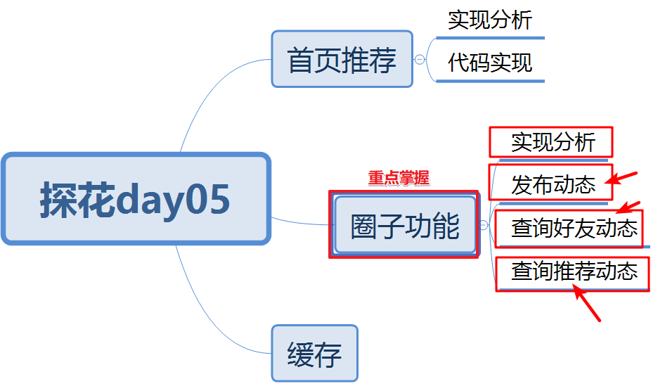
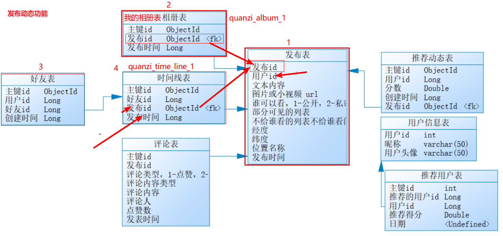
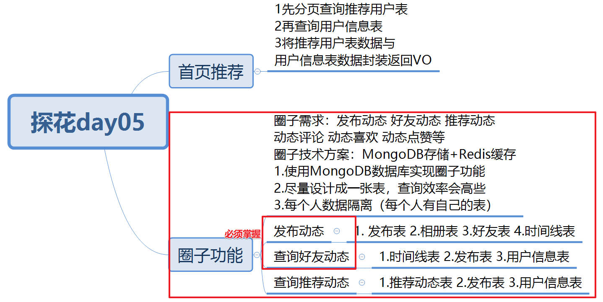

# 今日内容介绍

# 首页推荐

## 需求分析

推荐用户列表数据recommend_user，根据当前用户分页查询推荐用户表，在app展示推荐用户数据。

## 数据库表

recommend_user：根据当前用户id分页查询推荐用户表（10条记录）

tb_user_info：根据推荐用户id查询用户信息表

## 消费者编码分析

1. controller接收请求page pagesizes RecommendUserQueryParam接收

2. controller调用service业务层

   a.根据用户id分页查询推荐用户列表

   b.如果推荐用户列表数据为空，造10条假数据

   c.根据推荐用户ids查询用户信息

   d.封装VO，返回给app

## 服务提供者编码分析

1. 服务提供者：根据用户id分页查询推荐用户列表

## 测试

# 圈子功能技术方案分析

1.使用MongoDB数据库实现圈子功能

2.尽量设计成一张表，查询效率会高些

3.每个人数据隔离（每个人有自己的表）

将采用MongoDB+Redis来实现，其中MongoDB负责存储，Redis负责缓存数据。

主要是核心的6张表：

- 发布表（动态表 圈子表）：记录了所有用户的发布的东西信息，如图片、视频等。
- 相册：相册是每个用户独立的，记录了该用户所发布的所有内容。
- 评论：针对某个具体发布的朋友评论和点赞操作。
- 时间线：所谓“刷朋友圈”，就是刷时间线，就是一个用户所有的朋友的发布内容。
- 好友表：记录好友关系
- 推荐圈子表：记录推荐动态表

# 数据库表分析-发布动态

1.往发布表插入动态数据

2.往相册表插入我的动态记录（动态id）

3.先查询好友表获取好友ids

4.再往好友时间线表插入动态记录

# 发布动态

## 需求

圈子模块，点击发布会跳转发动态页面，输入动态内容与选择图片，保存动态数据。

## 数据库表

1. 往动态表插入动态数据quanzi_publish
2. 往相册表插入我的动态记录（动态id 或 发布id）
3. 先查询好友表获取好友ids
4. 再往好友时间线表插入动态记录（动态id 或 发布id）

## 消费者编码分析

1. controller接收请求 参数PublishVo publishVo, MultipartFile[] imageContent

2. controller调用service业务处理

   a.将传入的图片处理 上传阿里云oss 返回图片地址

   b.将publishVo数据传入服务提供者 调用发布动态服务方法

## 服务提供者编码分析

1. 服务提供者：发布动态服务方法

   a.往动态表插入动态数据quanzi_publish

   b.往相册表插入我的动态记录（动态id 或 发布id）

   c.先查询好友表获取好友ids

   d.再往好友时间线表插入动态记录（动态id 或 发布id）

## 测试

# 数据库表分析-好友动态

## 需求

圈子模块，可以点击“好友”动态功能，查询好友动态列表数据

例如：1号用户发布动态了 1号 跟 2 3 4 等用户是好友关系，那2 3 4用户登录app，可以1号用户发布动态了。

## 数据库表

查询好友动态？

1. 根据当前用户id 查询自己的时间线表（好友时间线表） 得到发布id
2. 根据发布id 查询发布表 得到动态数据
3. 根据发布动态用户id 查询用户信息表

## 消费者编码分析

1. controller接收请求 参数：分页参数

2. controller调用service业务处理

   a.分页查询自己的时间表服务（好友时间线表）

   b.再根据发布表中发布动态的用户id 查询用户信息

   d.将发布表数据 跟 用户数据 封装Vo返回

## 服务提供者编码分析

1. 服务提供者：分页查询自己的时间表服务（好友时间线表）

   a.根据当前用户id 分页查询自己的时间线表 

   b.根据发布id查询发布表

2. 根据用户id查询用户信息(已经实现)

## 测试

1. 今天测试功能点，都先调试一遍，保证代码执行能通过。
2. 重新登录，点击“好友”动态

# 数据表分析-推荐动态

## 需求

推荐动态数据跟好友动态数据效果一模一样，推荐动态查询陌生人动态数据（推荐系统分析写入推荐动态表中）

## 数据库表

1. 推荐动态表（根据当前登录用户userId查询推荐动态表 得到发布id）
2. 发布表
3. 用户信息表

## 消费者编码分析

1. controller接收请求 参数：分页参数

2. controller调用service业务处理

   a.分页查询推荐动态表（推荐动态表）

   b.再根据发布表中发布动态的用户id 查询用户信息

   c.将发布表数据 跟 用户数据 封装Vo返回

## 服务提供者编码分析

1. 服务提供者：分页查询推荐动态表

   a.根据当前用户id 分页查询查询推荐动态表

   b.根据发布id查询发布表

2. 根据用户id查询用户信息(已经实现)

# 测试

1. 先确认当前需要测试的用户，数据库中是否有数据
2. publishId不为空 删除空数据：db.recommend_quanzi.remove({"publishId":null})
3. 目前表中publishId的数据都是一样的，手动改下publishId
4. 先把好友动态搞定，再写推荐动态

# 总结

# 作业

1. 公告管理-作业
2. 好友动态 推荐动态 service业务处理方法抽取
3. 缓存-作业

# 课堂问题

**1.加好友之前的动态数据？**

答：

业务场景一：

异步程序处理，将相册表记录 copy  一份到当前用户时间线表中。

业务场景二：

从加为好友开始，有新的动态在好友动态列表展示。以前的老数据从头像点击进入看他的动态。

**是说如果有200个好友，发一条动态就要往200张时间线表添加一条数据吗 ？**

答：目前实现存在问题的，好友比较多循环插入时间线表性能非常不好。

业务解耦：当执行完成第1步 第2步后，第3步将时间线表消息写入RocketMQ中 第4步 异步程序从RocketMQ中拿出消息慢慢处理 往时间线表中插入数据即可。

例如：我：发一条动态    彭敏  彭敏女朋友 好友关系（微信中朋友圈并不是实时能看到动态的）

