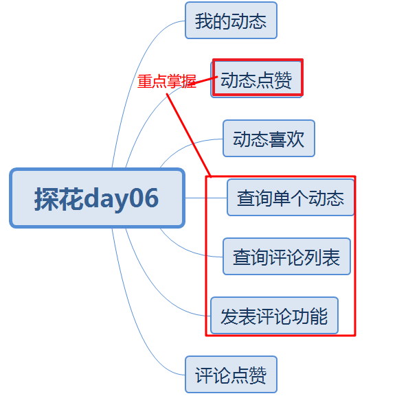
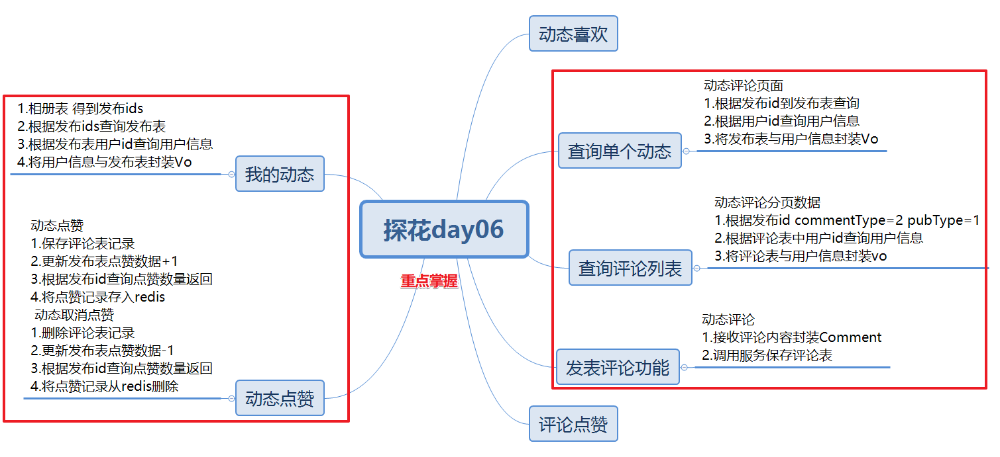

# 今日内容介绍

# 动态点赞

## 需求分析

1. 动态点赞考虑点赞数量累加（发布表 冗余了一个字段 点赞数量）
2. 动态点赞后，显示是否已经点赞（点赞记录存入redis）

当前登录用户可以对我的动态、好友动态、推荐动态进行点赞，点赞后需要记录点赞数量，并写入redis

## 数据库表

1. 评论表（点赞、喜欢、评论） ---评论表中点赞（针对评论的点赞）
2. 发布表 --发布表中点赞（针对动态的点赞）
3. 点赞记录写入redis

## 消费者编码分析

1. controller接收点赞请求 参数：动态id 返回值点赞数量

2. controller调用service业务处理

   a.封装评论对象 调用服务提供者保存点赞记录

   b.将点赞记录写入redis(后续查询动态从redis中查询是否点赞)

## 服务提供者编码分析

1. ​服务提供者：

   a.将动态点赞记录保存评论表

   b.根据发布id更新发布表点赞数量+1

   c.根据发布id查询发布表点赞数量 返回

   ​

## 测试

# 动态取消点赞

## 需求分析

1. 动态已经点赞了，再次点击取消点赞 考虑点赞数量-1（发布表点赞数量-1）
2. 取消点赞后，显示未点赞（点赞记录从redis删除）

## 数据库表

1. 评论表-将点赞记录删除
2. 发布表  点赞数量-1
3. 点赞记录写入redis 点赞记录从redis删除

## 消费者编码分析

1. controller接收取消点赞请求 参数：动态id 返回值点赞数量

2. controller调用service业务处理

   a.封装评论对象 调用服务提供者取消点赞记录

   b.将点赞记录从redis删除(后续查询动态从redis中查询是否点赞)

## 服务提供者编码分析

1. ​服务提供者：

   a.将动态点赞记录从评论表删除

   b.根据发布id更新发布表点赞数量-1

   c.根据发布id查询发布表点赞数量 返回

   ​

## 测试

# 查询单条动态

## 需求分析

点击评论进入动态评论页面，会发送两个请求 查询单条动态请求、动态评论列表请求

## 数据库表

1. 用户信息表 
2. 发布表

## 消费者编码分析

1. controller接收查询单条动态请求 参数动态id 返回动态数据+用户信息

2. controller调用service业务处理

   a.调用服务提供者 根据发布id查询发布表获取动态数据

   b.根据发布表中发布用户id 查询用户信息表 得到用户信息

   c.将动态数据与用户信息封装Vo返回

## 服务提供者编码分析

1. 调用服务提供者 根据发布id查询发布表获取动态数据

   ​

## 测试

注意：需要等到动态评论列表功能完成后才能看到app效果

这里只能通过postman测试看数据

# 查询动态的评论列表

## 需求分析

1. ​

## 数据库表

1. 用户信息表
2. 评论内容数据列表

## 消费者编码分析

1. ​

## 服务提供者编码分析

1. ​

   ​

## 测试

# 发表动态的评论

。。。。。。

# 评论点赞与取消点赞

## 需求分析

1. ​

## 数据库表

1. quanzi_comment 表likeCount +1（-1）
2. quanzi_comment表插入一条记录  publishId指向是被点赞记录的主键id

## 消费者编码分析

1. ​

## 服务提供者编码分析

1. ​

   ​

## 测试

# 作业

1. 我的动态功能分析思路
2. 动态喜欢功能分析思路-参考动态点赞
3. 动态的评论列表功能分析思路
4. 发表动态的评论功能分析思路
5. 评论点赞与取消点赞功能分析思路

# 总结

