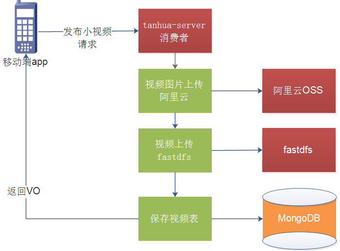
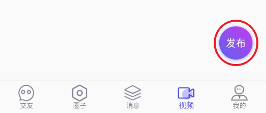
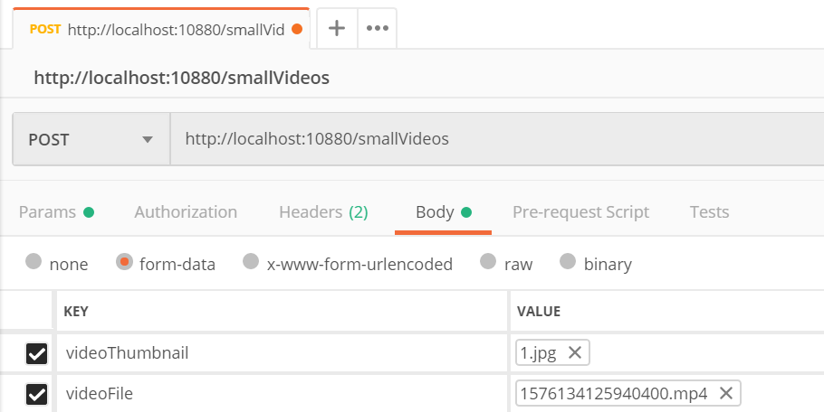
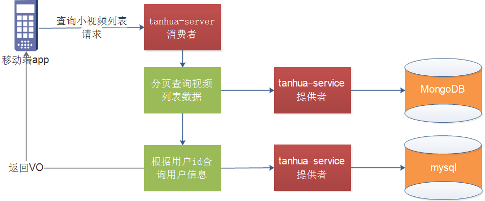
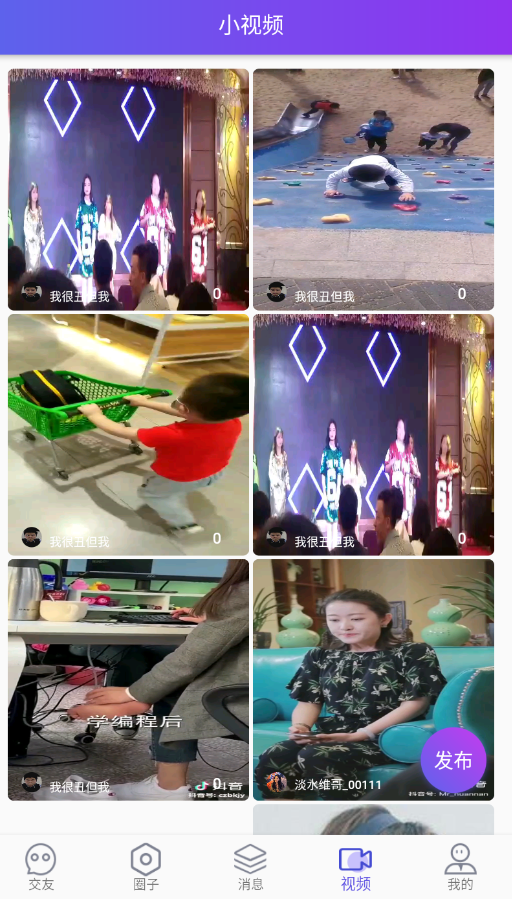
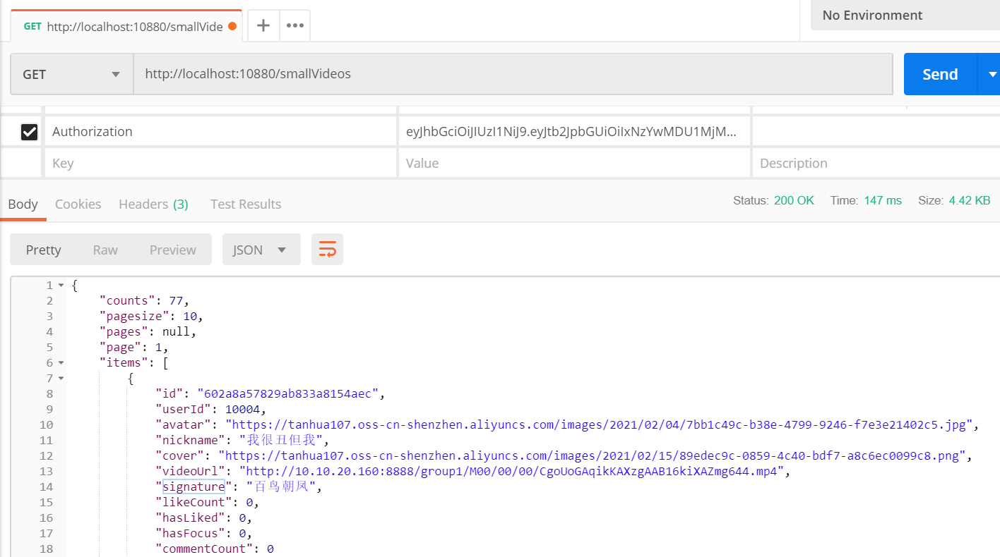
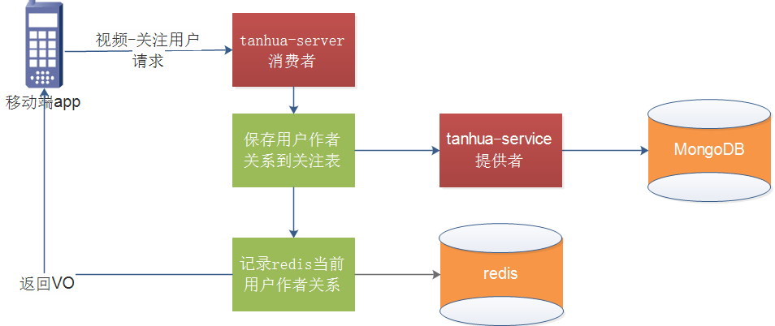
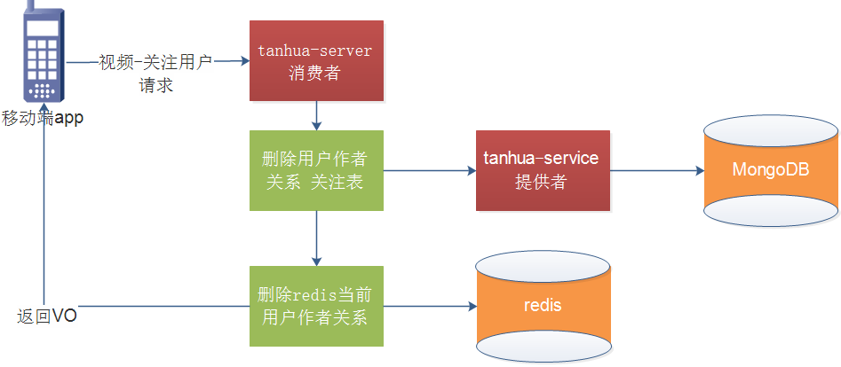

# 第7章 小视频功能实现

# 学习目标

- 小视频功能说明
- FastDFS环境搭建
- 小视频的功能实现

# 1. 小视频功能实现

### 【目标】

掌握发布小视频功能

### 【路径】

1：小视频功能介绍

2：小视频技术方案分析

3：FastDFS入门案例

4：小视频功能实现

### 【讲解】

小视频功能类似于抖音、快手小视频的应用，用户可以上传小视频进行分享，也可以浏览查看别人分享的视频，并且可以对视频评论和点赞操作。

效果：

 

查看详情：

 

评论：

 

点赞：

 

## 1.1. 技术方案

对于小视频的功能的开发，核心点就是：存储 + 推荐 + 加载速度 。

- 对于存储而言，小视频的存储量以及容量都是非常巨大的
  - 所以我们选择自己搭建分布式存储系统 FastDFS进行存储
- 对于推荐算法，我们将采用多种权重的计算方式进行计算
- 对于加载速度，除了提升服务器带宽外可以通过CDN的方式进行加速，当然了这需要额外购买CDN服务

## 1.2. FastDFS介绍

### 1.2.1. FastDFS是什么？

FastDFS是分布式文件系统。使用 FastDFS很容易搭建一套高性能的文件服务器集群提供文件上传、下载等服务。

### 1.2.2. 工作原理

FastDFS 架构包括 Tracker server 和 Storage server。客户端请求 Tracker server 进行文件上传、下载，通过 Tracker server 调度最终由 Storage server 完成文件上传和下载。

Tracker server 作用是负载均衡和调度，通过 Tracker server 在文件上传时可以根据一些策略找到 Storage server 提供文件上传服务。可以将 tracker 称为追踪服务器或调度服务器。

Storage server 作用是文件存储，客户端上传的文件最终存储在 Storage 服务器上，Storage server 没有实现自己的文件系统而是利用操作系统的文件系统来管理文件。可以将storage称为存储服务器。

 

每个 tracker 节点地位平等。收集 Storage 集群的状态。

Storage 分为多个组，每个组之间保存的文件是不同的。每个组内部可以有多个成员，组成员内部保存的内容是一样的，组成员的地位是一致的，没有主从的概念。

### 1.2.3. 文件的上传

 

客户端上传文件后存储服务器将文件 ID 返回给客户端，此文件 ID 用于以后访问该文件的索引信息。文件索引信息包括：组名，虚拟磁盘路径，数据两级目录，文件名。

### 1.2.4. 文件的下载

 

客户端下载请求到Tracker服务，Tracker返回给客户端storage的信息，客户端根据这些信息进行请求storage获取到文件。

## 1.3. FastDFS环境搭建

### 1.3.1. 搭建服务

我们使用docker进行搭建。目前所有的组件全部以docker的形式配置

~~~shell
#进入目录
cd /root/docker-file/fastdfs/
#修改docker-compose.yml(TRACKER_SERVER=实际虚拟机ip:22122)
vi docker-compose.yml
#删除之前的数据目录
cd /data/fastdfs
rm -rf storage/ tracker/
#进入目录
cd /root/docker-file/fastdfs/
#启动
docker-compose up -d
#查看容器
docker ps -a
#查看fastdfs中数据
cd /data/fastdfs/storage/data
~~~


FastDFS调度服务器地址：192.168.137.151:22122
FastDFS存储服务器地址：http://192.168.137.151:8888/

### 1.3.2. FastDFS入门分析

- 导入依赖
- 在application.yml中配置Fastdfs
- 注入FastFileStorageClient对象，完成文件上传

在tanhua-server模块pom文件，引入fastdfs的依赖如下

~~~xml
<dependency>
    <groupId>com.github.tobato</groupId>
    <artifactId>fastdfs-client</artifactId>
    <version>1.26.7</version>
    <exclusions>
        <exclusion>
            <groupId>ch.qos.logback</groupId>
            <artifactId>logback-classic</artifactId>
        </exclusion>
    </exclusions>
</dependency>
~~~

### 1.3.3. application.yml

在tanhua-server模块application.yml加入以下配置

~~~properties
# ===================================================================
# 分布式文件系统FDFS配置
# ===================================================================
fdfs:
  so-timeout: 1500
  connect-timeout: 600
  #缩略图生成参数
  thumb-image:
    width: 150
    height: 150
  #TrackerList参数,支持多个
  tracker-list: 192.168.137.151:22122
  web-server-url: http://192.168.137.151:8888/
~~~

### 1.3.4. 测试

在tanhua-server模块test包下

~~~java
package com.tanhua.server.test;

import com.github.tobato.fastdfs.domain.conn.FdfsWebServer;
import com.github.tobato.fastdfs.domain.fdfs.StorePath;
import com.github.tobato.fastdfs.service.FastFileStorageClient;
import com.tanhua.server.TanhuaServerApplication;
import org.apache.commons.io.FileUtils;
import org.junit.Test;
import org.junit.runner.RunWith;
import org.springframework.beans.factory.annotation.Autowired;
import org.springframework.boot.test.context.SpringBootTest;
import org.springframework.test.context.junit4.SpringRunner;

import java.io.File;
import java.io.IOException;

@RunWith(SpringRunner.class)
@SpringBootTest(classes = TanhuaServerApplication.class)
public class FastDFSTest {

    @Autowired
    private FastFileStorageClient client;

    @Autowired
    private FdfsWebServer fdfsWebServer;

    @Test
    public void testUploadFile() throws IOException {
        File file = new File("C:\\1.jpg");
        StorePath storePath = client.uploadFile(FileUtils.openInputStream(file), file.length(), "jpg", null);
        System.out.println(storePath.getFullPath());
        System.out.println(storePath.getPath());

        //获取文件请求地址
        String url = fdfsWebServer.getWebServerUrl()+storePath.getFullPath();
        System.out.println(url);
    }
}
~~~

存储服务器：

* 在线的存储服务器：阿里云OSS
* 自己搭建分布式的存储服务器：fastdfs

## 1.4. 服务消费者-发布小视频

  


### 1.4.1. VideoController

```java
package com.tanhua.server.controller;

import com.tanhua.server.service.VideoService;
import org.springframework.beans.factory.annotation.Autowired;
import org.springframework.http.HttpStatus;
import org.springframework.http.ResponseEntity;
import org.springframework.web.bind.annotation.PostMapping;
import org.springframework.web.bind.annotation.RequestMapping;
import org.springframework.web.bind.annotation.RequestParam;
import org.springframework.web.bind.annotation.RestController;
import org.springframework.web.multipart.MultipartFile;
import java.io.IOException;

@RestController
@RequestMapping("/smallVideos")
public class VideoController {

    @Autowired
    private VideoService videoService;

    /**
     * 发布小视频
     * @param videoThumbnail
     * @param videoFile
     * @return
     */
    @PostMapping
    public ResponseEntity post(MultipartFile videoThumbnail,MultipartFile videoFile) throws IOException {
        videoService.post(videoThumbnail,videoFile);
        return ResponseEntity.ok(null);
    }
}
```

### 1.4.2. VideoService

```java
package com.tanhua.server.service;
import com.alibaba.dubbo.config.annotation.Reference;
import com.github.tobato.fastdfs.domain.conn.FdfsWebServer;
import com.github.tobato.fastdfs.domain.fdfs.StorePath;
import com.github.tobato.fastdfs.service.FastFileStorageClient;
import com.tanhua.commons.templates.OssTemplate;
import com.tanhua.domain.mongo.Video;
import com.tanhua.dubbo.api.UserInfoApi;
import com.tanhua.dubbo.api.mongo.VideoApi;
import org.springframework.beans.factory.annotation.Autowired;
import org.springframework.stereotype.Service;
import org.springframework.web.multipart.MultipartFile;
import java.io.IOException;

@Service
public class VideoService {

    @Reference
    private VideoApi videoApi;

    @Reference
    private UserInfoApi userInfoApi;

    @Autowired
    private FastFileStorageClient fastFileStorageClient;

    @Autowired
    private FdfsWebServer fdfsWebServer;

    @Autowired
    private OssTemplate ossTemplate;

        /**
     * 发布小视频
     * @param videoThumbnail
     * @param videoFile
     */
    public void post(MultipartFile videoThumbnail, MultipartFile videoFile) throws IOException {
        //获取当前登录用户的用户id
        Long userId = UserHolder.getUserId();
        // 上传视频图片，获取对就看url
        String picUrl = ossTemplate.upload(videoThumbnail.getOriginalFilename(), videoThumbnail.getInputStream());
        // 获取上传的视频名称
        String videoFileOriginalFilename = videoFile.getOriginalFilename();
        // 截取文件后缀名
        String suffix = videoFileOriginalFilename.substring(videoFileOriginalFilename.lastIndexOf(".")+1);
        // 上传视频到fdfs
        StorePath storePath = fastFileStorageClient.uploadFile(videoFile.getInputStream(), videoFile.getSize(), suffix, null);
        // 获取视频的完整路径
        String videoUrl = fdfsWebServer.getWebServerUrl()+storePath.getFullPath();
        // 构建Video对象
        Video video = new Video();
        video.setPicUrl(picUrl);
        video.setVideoUrl(videoUrl);
        video.setText("百鸟朝凤");
        video.setUserId(userId);
        // 调用api保存
        videoApi.save(video);
    }
}
```

## 1.5. 服务提供者-发布小视频

### 1.5.1. Video

tanhua-domain模块mongo中创建pojo

~~~java
package com.tanhua.domain.mongo;

import lombok.Data;
import org.bson.types.ObjectId;
import org.springframework.data.mongodb.core.mapping.Document;

import java.io.Serializable;

@Data
@Document(collection = "video")
public class Video implements Serializable {
    private ObjectId id; //主键id
    private Long userId;
    private Long vid; // 处境id

    private String text; //文字
    private String picUrl; //视频封面文件，URL
    private String videoUrl; //视频文件，URL
    private Long created; //创建时间

    private Integer likeCount=0; //点赞数
    private Integer commentCount=0; //评论数
    private Integer loveCount=0; //喜欢数
}

~~~

### 1.5.2. VideoApi

tanhua-dubbo-interface模块mongo中创建VideoApi

~~~java
package com.tanhua.dubbo.api.mongo;
import com.tanhua.domain.mongo.Video;
public interface VideoApi {

    /**
     * 保存小视频
     */
    void save(Video video);
}
~~~

### 1.5.3. VideoApiImpl

tanhua-dubbo-service模块mongo中创建VideoApiImpl

~~~java
package com.tanhua.dubbo.api.mongo;

import com.alibaba.dubbo.config.annotation.Service;
import com.tanhua.domain.mongo.Video;
import com.tanhua.dubbo.utils.IdService;
import org.bson.types.ObjectId;
import org.springframework.beans.factory.annotation.Autowired;
import org.springframework.data.mongodb.core.MongoTemplate;

@Service
public class VideoApiImpl implements VideoApi {

    @Autowired
    private MongoTemplate mongoTemplate;

    @Autowired
    private IdService idService;

    //保存视频数据
    public void save(Video video) {
        video.setId(ObjectId.get());
        video.setCreated(System.currentTimeMillis());
        video.setVid(idService.nextId("video"));
        mongoTemplate.save(video);
    }
}
~~~

### 1.5.4. 测试

app测试

 

postman测试：

 

如果上传视频，会导致异常，是因为请求太大的缘故：


解决：application.yml

```properties
Spring:
  servlet:
    multipart:
      max-file-size: 30MB
      max-request-size: 30MB
```

## 【小结】

掌握发布小视频功能

# 2. 小视频列表

### 【目标】

掌握小视频列表功能

### 【路径】

1：小视频列表分析

2：小视频列表实现

### 【讲解】



## 2.1. 小视频列表分析

数据库表：video

```java
{
    "_id" : ObjectId("5fa60707ed0ad13fa89925cc"),
    "vid" : NumberLong(1),
    "userId" : NumberLong(1),
    "text" : "我就是我不一样的烟火~",
    "picUrl" : "https://tanhua-dev.oss-cn-zhangjiakou.aliyuncs.com/images/video/video_1.png",
    "videoUrl" : "https://tanhua-dev.oss-cn-zhangjiakou.aliyuncs.com/images/video/1576134125940400.mp4",
    "created" : NumberLong(1604716296066),
    "likeCount" : 0,
    "commentCount" : 0,
    "loveCount" : 0,
    "_class" : "com.tanhua.domain.mongo.Video"
}
```

* 创建controller对象，并配置分页查询接口方法
* 创建service对象，其中调用API，构造vo对象返回值
* 在API服务层，创建方法，分页查询小视频列表，返回`PageResult<Video>`

## 2.2. 服务提供者-小视频列表

### 2.2.1. VideoApi

tanhua-dubbo-interface模块mongo中VideoApi新增方法

~~~java
package com.tanhua.dubbo.server.api;

import com.tanhua.dubbo.server.pojo.Video;
import com.tanhua.dubbo.server.vo.PageInfo;

public interface VideoApi {

    /**
     * 小视频分页查询
     * @param page
     * @param pagesize
     * @return
     */
    PageResult findPage(int page, int pagesize);
}

~~~

### 2.2.2. VideoApiImpl

tanhua-dubbo-service模块mongo中创建VideoApiImpl新增方法

~~~java
@Service
public class VideoApiImpl implements VideoApi {

    @Autowired
    private MongoTemplate mongoTemplate;

    @Autowired
    private IdService idService;

    /**
     * 分页查询
     * @param page
     * @param pagesize
     * @return
     */
    @Override
    public PageResult findPage(int page, int pagesize) {
        PageResult pageResult = new PageResult();
        pageResult.setPagesize((long)pagesize);
        pageResult.setPage((long)page);
        Query query = new Query();
        long count = mongoTemplate.count(query, Video.class);
        pageResult.setCounts(count);

        query.with(PageRequest.of(page-1,pagesize)).with(Sort.by(Sort.Order.desc("created")));
        List<Video> videos = mongoTemplate.find(query, Video.class);

        pageResult.setItems(videos);

        return pageResult;
    }
}
~~~

### 2.2.3. VideoVo

~~~java
package com.tanhua.domain.vo;

import lombok.Data;

import java.io.Serializable;

@Data
public class VideoVo implements Serializable {

    private String id;
    private Long userId;
    private String avatar; //头像
    private String nickname; //昵称
    private String cover; //封面
    private String videoUrl; //视频URL
    private String signature; //签名
    private Integer likeCount; //点赞数量
    private Integer hasLiked; //是否已赞（1是，0否）
    private Integer hasFocus; //是是否关注 （1是，0否）
    private Integer commentCount; //评论数量
}
~~~

## 2.2. 服务消费者-小视频列表

### 2.2.1. VideoController

~~~java
package com.tanhua.server.controller;

import com.tanhua.domain.vo.PageResult;
import com.tanhua.server.service.VideoService;
import jdk.nashorn.internal.ir.annotations.Reference;
import org.springframework.beans.factory.annotation.Autowired;
import org.springframework.http.ResponseEntity;
import org.springframework.web.bind.annotation.*;
import org.springframework.web.multipart.MultipartFile;

import java.io.IOException;

@RestController
@RequestMapping("/smallVideos")
public class VideoController {

    @Autowired
    private VideoService videoService;

   /**
     * 分页查询
     * @param page
     * @param pagesize
     * @return
     */
    @GetMapping
    public ResponseEntity findPage(@RequestParam(defaultValue = "1") int page,
                                        @RequestParam(defaultValue = "10") int pagesize){
        page=page<1?1:page;
        PageResult<VideoVo> pageResult = videoService.findPage(page,pagesize);
        return ResponseEntity.ok(pageResult);
    }
}

~~~

### 2.2.2. VideoService

~~~java
package com.tanhua.server.service;

import com.github.tobato.fastdfs.domain.conn.FdfsWebServer;
import com.github.tobato.fastdfs.domain.fdfs.StorePath;
import com.github.tobato.fastdfs.service.FastFileStorageClient;
import com.tanhua.commons.templates.OssTemplate;
import com.tanhua.domain.db.UserInfo;
import com.tanhua.domain.mongo.FollowUser;
import com.tanhua.domain.mongo.Video;
import com.tanhua.domain.vo.PageResult;
import com.tanhua.domain.vo.VideoVo;
import com.tanhua.dubbo.api.UserInfoApi;
import com.tanhua.dubbo.api.mongo.VideoApi;
import com.tanhua.server.interceptor.UserHolder;
import org.apache.dubbo.config.annotation.Reference;
import org.springframework.beans.BeanUtils;
import org.springframework.beans.factory.annotation.Autowired;
import org.springframework.cache.annotation.CacheEvict;
import org.springframework.cache.annotation.Cacheable;
import org.springframework.data.redis.core.RedisTemplate;
import org.springframework.http.ResponseEntity;
import org.springframework.stereotype.Service;
import org.springframework.web.multipart.MultipartFile;

import java.io.IOException;
import java.util.ArrayList;
import java.util.List;

@Service
public class VideoService {

    @Reference
    private VideoApi videoApi;

    @Reference
    private UserInfoApi userInfoApi;

    @Autowired
    private OssTemplate ossTemplate;

    @Autowired
    private FastFileStorageClient fastFileStorageClient;  //上传对象

    @Autowired
    private FdfsWebServer fdfsWebServer; //获取存储服务器地址

    @Autowired
    private RedisTemplate<String,String> redisTemplate;

    /**
     * 分页查询
     * @param page
     * @param pagesize
     * @return
     */
    public PageResult<VideoVo> findPage(int page, int pagesize) {
        //1、调用api分页查询数据列表  PageResult<Video>
        PageResult result = videoApi.findPage(page,pagesize);
        //2、获取分页数据中数据列表   List<Video>
        List<Video> items = (List<Video>) result.getItems();
        //3、循环遍历数据集合，一个video构造一个vo
        List<VideoVo> list = new ArrayList<>();
        if(items != null) {
            for (Video item : items) {
                UserInfo info = userInfoApi.findByUserId(item.getUserId());
                VideoVo vo = new VideoVo();
                BeanUtils.copyProperties(info,vo);
                BeanUtils.copyProperties(item,vo);
                vo.setCover(item.getPicUrl());
                vo.setId(item.getId().toHexString());
                if(StringUtils.isNotEmpty(item.getText())){
                    vo.setSignature(item.getText());//签名
                }
                else
                {
                    vo.setSignature("默认签名");//签名
                }
                vo.setHasFocus(0); //TODO 是否关注
                vo.setHasLiked(0); //是否点赞
                list.add(vo);
            }
        }
        //4、存入pageResult中
        result.setItems(list);
        //5、构造返回值
        return result;
    }
}

~~~

### 2.2.3. 测试

- 为了保证测试效果，在dubbo提供者手动保存一些测试数据如下

```java
package com.tanhua.dubbo.test;

import com.tanhua.domain.mongo.Video;
import com.tanhua.dubbo.utils.IdService;
import org.bson.types.ObjectId;
import org.junit.Test;
import org.junit.runner.RunWith;
import org.springframework.beans.factory.annotation.Autowired;
import org.springframework.boot.test.context.SpringBootTest;
import org.springframework.data.mongodb.core.MongoTemplate;
import org.springframework.test.context.junit4.SpringRunner;

@RunWith(SpringRunner.class)
@SpringBootTest
public class VideoTest {

    @Autowired
    private MongoTemplate mongoTemplate;

    @Autowired
    private IdService idService;

    @Test
    public void testSaveVideos() {

        for (int i = 1; i <=20; i++) {
            Video video = new Video();
            video.setPicUrl("https://tanhua-dev.oss-cn-zhangjiakou.aliyuncs.com/images/video/video_"+i+".png");
            video.setVideoUrl("https://tanhua-dev.oss-cn-zhangjiakou.aliyuncs.com/images/video/1576134125940400.mp4");
            video.setId(ObjectId.get());
            video.setVid(idService.getNextId("video"));
            video.setUserId((long)i);
            video.setCreated(System.currentTimeMillis());
            video.setText("我就是我不一样的烟火~");
            mongoTemplate.save(video);
        }
    }
}
```

- 测试效果

app测试

 

postman测试



### 【小结】

掌握小视频列表功能

# 3. 关注用户

### 【目标】

掌握关注用户功能

### 【路径】

1：关注用户分析

2：关注用户实现

### 【讲解】

关注用户是关注小视频发布的作者，这样我们后面计算推荐时，关注的用户将权重更重一些。

关注用户

* controller：接受参数
* service：调用API，将关注数据存入到Redis
* api接口（VideoAPI）：关注的保存和删除
* 修改之前的查询service，从redis获取数据（如果存在返回1:，不存在返回0）

## 3.1. 服务消费者-关注用户

关注用户

 

取消关注用户




### 3.1.1. VideoController

```java
    /**
     * 关注视频的作者
     * @param userId
     * @return
     */
    @PostMapping("/{id}/userFocus")
    public ResponseEntity followUser(@PathVariable("id") long userId){
        videoService.followUser(userId);
        return ResponseEntity.ok(null);
    }

    /**
     * 取消关注
     * @param userId
     * @return
     */
    @PostMapping("/{id}/userUnFocus")
    public ResponseEntity unfollowUser(@PathVariable("id") long userId){
        videoService.unfollowUser(userId);
        return ResponseEntity.ok(null);
    }
```

### **3.1.2. VideoService**

```java
   /**
     * 关注视频的作者
     * @param userId
     */
    public void followUser(long userId) {
        // 构建关注对象
        FollowUser followUser = new FollowUser();
        followUser.setUserId(UserHolder.getUserId());
        followUser.setFollowUserId(userId);
        // 调用API添加关系
        videoApi.followUser(followUser);
        // 记录redis，表示当前用户关系了这个作者
        String key = "video_follow_" + UserHolder.getUserId()+ "_" + userId;
        redisTemplate.opsForValue().set(key,"1");
    }

    /**
     * 取消关注
     * @param userId
     */
    public void unfollowUser(long userId) {
        // 构建关注对象
        FollowUser followUser = new FollowUser();
        followUser.setUserId(UserHolder.getUserId());
        followUser.setFollowUserId(userId);
        // 调用API取消关系
        videoApi.unfollowUser(followUser);
        // 删除redis的记录
        String key = "video_follow_" + UserHolder.getUserId()+ "_" + userId;
        redisTemplate.delete(key);
    }
```

修改分页列表代码

```java
/**
  * 分页查询
  * @param page
  * @param pagesize
  * @return
  */
public PageResult<VideoVo> findPage(int page, int pagesize) {
    //1、调用api分页查询数据列表  PageResult<Video>
    PageResult result = videoApi.findPage(page,pagesize);
    //2、获取分页数据中数据列表   List<Video>
    List<Video> items = (List<Video>) result.getItems();
    //3、循环遍历数据集合，一个video构造一个vo
    List<VideoVo> list = new ArrayList<>();
    if(items != null) {
        for (Video item : items) {
            UserInfo info = userInfoApi.findByUserId(item.getUserId());
            VideoVo vo = new VideoVo();
            BeanUtils.copyProperties(info,vo);
            BeanUtils.copyProperties(item,vo);
            vo.setCover(item.getPicUrl());
            vo.setId(item.getId().toHexString());
            if(StringUtils.isNotEmpty(item.getText())){
                vo.setSignature(item.getText());//签名
            }
            else
            {
                vo.setSignature("默认签名");//签名
            }
            //从redis中获取操作记录，如果存在返回1，不存在返回0
            String key = "video_follow_"+UserHolder.getUserId()+"_"+item.getUserId();
            if(redisTemplate.hasKey(key)) {
                vo.setHasFocus(1); //TODO 是否关注
            }else{
                vo.setHasFocus(0); //TODO 是否关注
            }
            vo.setHasLiked(0); //是否点赞
            list.add(vo);
        }
    }
    //4、存入pageResult中
    result.setItems(list);
    //5、构造返回值
    return result;
}
```

## 3.2. 服务提供者-关注用户

### 3.2.1. FollowUser

~~~java
package com.tanhua.domain.mongo;

import lombok.Data;
import org.bson.types.ObjectId;
import org.springframework.data.mongodb.core.mapping.Document;

import java.io.Serializable;
 
@Data
@Document(collection = "follow_user")
public class FollowUser implements Serializable {

    private ObjectId id; //主键id
    private Long userId; //用户id
    private Long followUserId; //关注的用户id
    private Long created; //关注时间
}
~~~

### 3.2.2. VideoApi

~~~java
package com.tanhua.dubbo.api.mongo;

import com.tanhua.domain.mongo.FollowUser;
import com.tanhua.domain.mongo.Video;
import com.tanhua.domain.vo.PageResult;

public interface VideoApi {
	...
    ...    
    /**
     * 关注用户
     * @param followUser
     */
    void followUser(FollowUser followUser);

    /**
     * 取消关系
     * @param followUser
     */
    void unfollowUser(FollowUser followUser);
}

~~~

### 3.2.3. VideoApiImpl

~~~java
    /**
     * 关注用户
     * @param followUser
     */
    @Override
    public void followUser(FollowUser followUser) {
        followUser.setId(ObjectId.get());
        followUser.setCreated(System.currentTimeMillis());
        mongoTemplate.save(followUser);
    }

    /**
     * 取消关注
     * @param followUser
     */
    @Override
    public void unfollowUser(FollowUser followUser) {
        Query query = new Query();
        query.addCriteria(Criteria.where("userId").is(followUser.getUserId())
            .and("followUserId").is(followUser.getFollowUserId()));
        mongoTemplate.remove(query,FollowUser.class);
    }
~~~

### 3.2.4. 测试

 

### 【小结】

掌握关注用户功能

# 4. 缓存

### 【目标】

掌握SpringCache使用

### 【路径】

1：SpringCache介绍

2：SpringCache入门案例

3：视频列表缓存处理

### 【讲解】

实现缓存逻辑有2种方式：

1. 每个接口单独控制缓存逻辑
2. 统一控制缓存逻辑

Spring从3.1开始定义了org.springframework.cache.Cache和org.springframework.cache.CacheManager接口来统一不同的缓存技术；并支持使用JCache（JSR-107）注解简化我们开发；

- Cache接口为缓存的组件规范定义，包含缓存的各种操作集合；

- Cache接口下Spring提供了各种xxxCache的实现；如RedisCache，EhCacheCache ,ConcurrentMapCache等；

- 每次调用需要缓存功能的方法时，Spring会检查检查指定参数的指定的目标方法是否已经被调用过；如果有就直接从缓存中获取方法调用后的结果，如果没有就调用方法并缓存结果后返回给用户。下次调用直接从缓存中获取。

- 使用Spring缓存抽象时我们需要关注以下两点；

  1、确定方法需要被缓存以及他们的缓存策略

  2、从缓存中读取之前缓存存储的数据

## 4.1. 重要概念

| 名称           | 解释                                                         |
| :------------- | :----------------------------------------------------------- |
| Cache          | 缓存接口，定义缓存操作。实现有：RedisCache、EhCacheCache、ConcurrentMapCache等 |
| CacheManager   | 缓存管理器，管理各种缓存（cache）组件                        |
| @Cacheable     | 主要针对方法配置，能够根据方法的请求参数对其进行缓存         |
| @CacheEvict    | 清空缓存                                                     |
| @CachePut      | 保证方法被调用，又希望结果被缓存。 与@Cacheable区别在于是否每次都调用方法，常用于更新 |
| @EnableCaching | 开启基于注解的缓存                                           |
| keyGenerator   | 缓存数据时key生成策略                                        |
| serialize      | 缓存数据时value序列化策略                                    |
| @CacheConfig   | 统一配置本类的缓存注解的属性                                 |

## 4.2. SPEL表达式

Spring Cache提供了一些供我们使用的SpEL上下文数据，下表直接摘自Spring官方文档：

| 名称          | 位置       | 描述                                                         | 示例                   |
| :------------ | :--------- | :----------------------------------------------------------- | :--------------------- |
| methodName    | root对象   | 当前被调用的方法名                                           | `#root.methodname`     |
| method        | root对象   | 当前被调用的方法                                             | `#root.method.name`    |
| target        | root对象   | 当前被调用的目标对象实例                                     | `#root.target`         |
| targetClass   | root对象   | 当前被调用的目标对象的类                                     | `#root.targetClass`    |
| args          | root对象   | 当前被调用的方法的参数列表                                   | `#root.args[0]`        |
| caches        | root对象   | 当前方法调用使用的缓存列表                                   | `#root.caches[0].name` |
| Argument Name | 执行上下文 | 当前被调用的方法的参数，如findArtisan(Artisan artisan),可以通过#artsian.id获得参数 | `#artsian.id`          |
| result        | 执行上下文 | 方法执行后的返回值（仅当方法执行后的判断有效，如 unless cacheEvict的beforeInvocation=false） | `#result`              |

**注意：**

1.当我们要使用root对象的属性作为key时我们也可以将“#root”省略，因为Spring默认使用的就是root对象的属性。 如

```
@Cacheable(key = "targetClass + methodName +#p0")
```

2.使用方法参数时我们可以直接使用“#参数名”或者“#p参数index”。 如：

```
@Cacheable(value="users", key="#id")
@Cacheable(value="users", key="#p0")
```

**SpEL提供了多种运算符**

| **类型**   | **运算符**                                     |
| :--------- | :--------------------------------------------- |
| 关系       | <，>，<=，>=，==，!=，lt，gt，le，ge，eq，ne   |
| 算术       | +，- ，* ，/，%，^                             |
| 逻辑       | &&，\|\|，!，and，or，not，between，instanceof |
| 条件       | ?: (ternary)，?: (elvis)                       |
| 正则表达式 | matches                                        |
| 其他类型   | ?.，?[…]，![…]，^[…]，$[…]                     |

以上的知识点适合你遗忘的时候来查阅，下面正式进入学习！

## 4.3. 入门案例

### 4.3.1. 导入依赖

导入SpringDataRedis的依赖，并在application.yml中配置 （略）

### 4.3.2. 开启缓存支持

然后在启动类注解@EnableCaching开启缓存

```java
@SpringBootApplication
@EnableCaching  //开启缓存
public class DemoApplication{
 
    public static void main(String[] args) {
        SpringApplication.run(DemoApplication.class, args);
    }

}
```

### 4.3.3. 缓存@Cacheable

`@Cacheable`注解会先查询是否已经有缓存，有会使用缓存，没有则会执行方法并缓存。

```java
package com.tanhua.server.test.cache;

import com.tanhua.domain.db.User;
import com.tanhua.domain.db.UserInfo;
import org.springframework.cache.annotation.CacheEvict;
import org.springframework.cache.annotation.Cacheable;
import org.springframework.stereotype.Service;

import java.util.ArrayList;
import java.util.List;

@Service
public class TestUserInfoService {

    /**
     * 查询全部用户
     */
    @Cacheable(value="users")
    public List<UserInfo> findAll() {
        System.out.println("从数据库获取数据");
        //模拟从数据库查询
        List<UserInfo> list = new ArrayList<>();
        for (int i = 0; i < 10; i++) {
            UserInfo info = new UserInfo();
            info.setId((long)i);
            info.setNickname("itcast"+i);
            list.add(info);
        }
        return list;
    }

    /**
     * key ： user:2
     *  @Cacheable:
     *      value : 缓存的名称
     *      key：支持spel，可以获取方法上的参数
     */
    @Cacheable(value="user",key = "#userId")
    public UserInfo findById(Long userId) {
        System.out.println("从数据库获取数据");
        UserInfo info = new UserInfo();
        info.setNickname("abc");
        info.setId(userId);
        return info;
    }

}

```

此处的`value`是必需的，它指定了你的缓存存放在哪块命名空间。

此处的`key`是使用的spEL表达式，此处的`UserInfo`实体类一定要实现序列化`public class UserInfo implements Serializable`，否则会报`java.io.NotSerializableException`异常。

到这里，你已经可以运行程序检验缓存功能是否实现。

### 4.3.4. 清除@CacheEvict

`@CachEvict` 的作用 主要针对方法配置，能够根据一定的条件对缓存进行清空 。

```JAVA
package com.tanhua.server.test.cache;

import com.tanhua.domain.db.User;
import com.tanhua.domain.db.UserInfo;
import org.springframework.cache.annotation.CacheEvict;
import org.springframework.cache.annotation.Cacheable;
import org.springframework.stereotype.Service;

import java.util.ArrayList;
import java.util.List;

@Service
public class TestUserInfoService {
    
    .............
        
     /**
     * 保存用户
     */
    @CacheEvict(value = "users",allEntries=true)
    public void save(UserInfo userInfo) {
        System.out.println("保存用户到数据库中");
    }
    
    @CacheEvict(value="user",key = "#user.id")
    public void update(UserInfo user) {
        System.out.println("更新");
    }
    
}
```

### 4.3.5. 测试

```java
package com.tanhua.server.test.cache;

import com.tanhua.domain.db.UserInfo;
import com.tanhua.server.TanhuaServerApplication;
import org.junit.Test;
import org.junit.runner.RunWith;
import org.springframework.beans.factory.annotation.Autowired;
import org.springframework.boot.test.context.SpringBootTest;
import org.springframework.test.context.junit4.SpringRunner;

import java.util.List;

@RunWith(SpringRunner.class)
@SpringBootTest(classes = TanhuaServerApplication.class)
public class CacheTest {

    @Autowired
    private TestUserInfoService userInfoService;

    @Test
    public void testFindAll() {
        List<UserInfo> list = userInfoService.findAll();
        for (UserInfo info : list) {
            System.out.println(info);
        }
    }

    @Test
    public  void testSave() {
        UserInfo userInfo = new UserInfo();
        userInfoService.save(userInfo);
    }

    @Test
    public  void testFind() {
        UserInfo info = userInfoService.findById(1l);
        System.out.println(info);
    }

    @Test
    public  void testUpdate() {
        UserInfo info = new UserInfo();
        info.setId(1l);
        info.setNickname("def");
        userInfoService.update(info);
    }
}
```

## 4.4. 视频列表缓存处理

修改VideoService，分页列表存入缓存，发布视频删除缓存

```java
/**
  * 分页查询
  *
  * @param page
  * @param pagesize
  * @return
  */
@Cacheable(value = "videoList", key = "#page + '_' +  #pagesize")
public PageResult<VideoVo> findPage(int page, int pagesize) {
    log.info("****************小视频列表查询*******************");
    //1、调用api分页查询数据列表  PageResult<Video>
    PageResult result = videoApi.findPage(page, pagesize);
    //2、获取分页数据中数据列表   List<Video>
    List<Video> items = (List<Video>) result.getItems();
    //3、循环遍历数据集合，一个video构造一个vo
    List<VideoVo> list = new ArrayList<>();
    if (items != null) {
        for (Video item : items) {
            UserInfo info = userInfoApi.findByUserId(item.getUserId());
            VideoVo vo = new VideoVo();
            BeanUtils.copyProperties(info, vo);
            BeanUtils.copyProperties(item, vo);
            vo.setCover(item.getPicUrl());
            vo.setId(item.getId().toHexString());
            if (StringUtils.isNotEmpty(item.getText())) {
                vo.setSignature(item.getText());//签名
            } else {
                vo.setSignature("默认签名");//签名
            }
            //从redis中获取操作记录，如果存在返回1，不存在返回0
            String key = "followUser_" + UserHolder.getUserId() + "_" + item.getUserId();
            if (redisTemplate.hasKey(key)) {
                vo.setHasFocus(1); //TODO 是否关注
            } else {
                vo.setHasFocus(0); //TODO 是否关注
            }
            vo.setHasLiked(0); //是否点赞
            list.add(vo);
        }
    }
    //4、存入pageResult中
    result.setItems(list);
    //5、构造返回值
    return result;
}

/**
  * 发布小视频
  *
  * @param videoThumbnail
  * @param videoFile
  */
@CacheEvict(value = "videoList", allEntries = true)
public void post(MultipartFile videoThumbnail, MultipartFile videoFile) throws IOException {
    log.info("****************发布小视频*******************");
    //获取当前登录用户的用户id
    Long userId = UserHolder.getUserId();
    // 上传视频图片，获取对就看url
    String picUrl = ossTemplate.upload(videoThumbnail.getOriginalFilename(), videoThumbnail.getInputStream());
    // 获取上传的视频名称
    String videoFileOriginalFilename = videoFile.getOriginalFilename();
    // 截取文件后缀名
    String suffix = videoFileOriginalFilename.substring(videoFileOriginalFilename.lastIndexOf(".") + 1);
    // 上传视频到fdfs
    StorePath storePath = fastFileStorageClient.uploadFile(videoFile.getInputStream(), videoFile.getSize(), suffix, null);
    // 获取视频的完整路径
    String videoUrl = fdfsWebServer.getWebServerUrl() + storePath.getFullPath();
    // 构建Video对象
    Video video = new Video();
    video.setPicUrl(picUrl);
    video.setVideoUrl(videoUrl);
    video.setText("百鸟朝凤");
    video.setUserId(userId);
    // 调用api保存
    log.info("video::::" + video.toString());
    videoApi.save(video);
}
```

### 【小结】

掌握Spring Cache使用

# 总结

* FastDFS分布式文件存储系统（调度服务器，存储服务器）
* FastDFS的环境搭建
  * 找到tanhua-server中的pom文件，开启依赖
  * 找到application.yml配置
    * FastDFS的常规配置
    * 修改spring中关于上传文件的大小限制
  * 注入两个对象，完成文件上传即可
* 查询视频分页列表
* 发布视频
  * service端
    * 图片上传到阿里云OSS
    * 视频上传到FastDFS服务商
    * 构建Video对象，调用API保存
* 小视频作者关注和取消关注
* 缓存

作业：

* 完成视频的列表展示与发布
* 完成视频的点赞与取消
* 完成视频的评论功能
* 完成视频作者的关注与取消