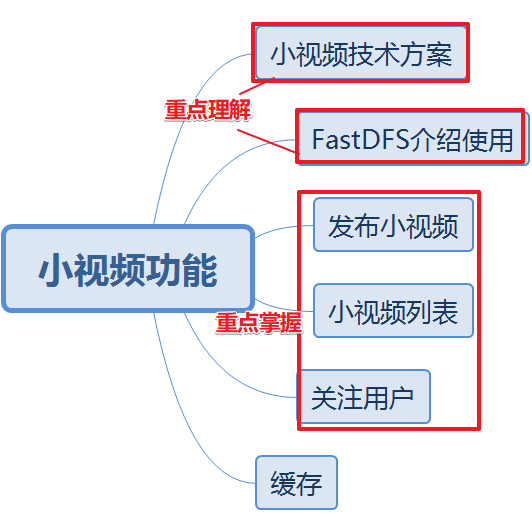

# 今日内容介绍



# 小视频功能考虑什么问题？

**速度**：访问额时候速度要足够快  redis  CDN服务(运维团队)

**推荐**：每个人刷小视频 给他推荐算法？   例如：今日佳人 推荐用户列表 推荐动态列表 通过推荐系统算法推荐给用户 将用户分类（大数据岗位工程师） ---- 推荐小视频列表

**存储**：小视频存储哪里？超级大

# FastDFS介绍使用

FastDFS是分布式文件系统，提供文件上传（发布小视频）、下载（刷小视频-查询）等服务。

FastDFS建立与操作系统的文件系统基础上实现的。


FastDFS原理介绍

Client:客户端 -上传文件 或 下载文件

Tracker:监控 调度Storage调度者

Storage:存储服务器

上传整个流程：

```
1.Storage集群中各个存储服务器启动的时候会向Tracker server同步状态
2.client上传文件，连接Tracker Server获取一个Storage存储服务器 ip port地址信息
3.client可以根据ip port地址，直接上传文件后，返回文件路径+文件名给client。
4.client将返回的路径+文件名保存数据库
```

下载整个流程：

```
1.Storage集群中各个存储服务器启动的时候会向Tracker server同步状态
2.client下载文件，连接Tracker Server获取一个Storage存储服务器 ip port地址信息
3.client可以根据ip port地址，到对应storage server存储服务下载文件
4.client以输出流形式返回给app.
```

# FastDFS入门案例

```
1.引入fastdfs依赖
2.application.yml配置
3.通过api来上传文件测试
4.搭建Tracker server Storager server环境（docker容器）  
  注意：需要将之前的环境数据删除干净 cd /data/fastdfs/
```

# 发布小视频

## 需求分析

点击视频-发布，选择一个小视频上传探花服务器，将视频存储，并通过前端app展示小视频。

## 数据库表

小视频表

## 消费者编码分析

1. controller接收2个参数 视频封面图片文件、视频文件

2. controller调用service业务处理

   a.视频封面图片文件（oss存储）、视频文件（fastdfs存储）

   b.分别得到图片地址、视频地址

   c.封装数据调用服务提供者保存视频记录

## 服务提供者编码分析

1. 服务提供者：发布小视频功能


## 测试


# 小视频列表

## 需求分析

目前：直接从视频表分页查询视频数据返回给app

实际：先从推荐小视频表查询给当前用户推荐的小视频列表，再查询小视频表返回给app

## 数据库表

video:视频表

userInfo:用户信息表

## 消费者编码分析

1. controller接收分页小视频请求

2. controller调用业务处理

   a.调用小视频列表分页查询服务方法

   b.根据视频记录中发布小视频的用户id查询UserInfo信息

   c.将小视频数据与用户信息封装返回Vo

## 服务提供者编码分析

1. 服务提供者：分页查询小视频列表服务方法

## 测试


# 关注用户

## 需求分析

视频列表中，刷小视频的点击“关注”，当前的登录就是视频作者的粉丝了。

tanhua_users:好友表

user_like:喜欢表

follow_user:关注表

## 数据库表

**follow_user:关注表**

tanhua_users:好友表

## 消费者编码分析

1. controller接收关注用户请求

2. controller调用service业务处理

   a.被关注的用户id 当前用户id

   b.根据当前用户与被关注的用户id查询FollowUser表 记录是否存在

   c.记录不存在，保存关注记录 记录存在，FollowUser不做任何操作

   d.根据被关注的用户id与当前登录用户id查询FollowUser表 记录是否存在

   f.记录存在，说明可以成为好友（就可以操作好友表）  记录不存在不做任何操作

   g.根据当前用户id与 好友id 到好友表查询记录是否存在 （最终要保证好友表只会有2条记录）

## 服务提供者编码分析

1. 服务提供者：根据当前用户与被关注的用户id查询FollowUser表
2. 服务提供者：保存关注记录到FollowUser表
3. 服务提供者：根据当前用户与被关注的用户id查询tanhua_users表

## 测试


# 缓存SpringCache+Redis

```
1.spring data redis依赖 以及 配置
2.在启动类上加上EnableCaching开启spring cache
3.TestUserInfoService业务测试类 测试查询所有用户列表数据 与 根据用户id查询用户对象数据
4.通过测试类调用TestUserInfoService业务测试类
@Cacheable:缓存数据
@CacheEvict:清除缓存数据
```

**视频列表分页查询**：@Cacheable:缓存数据

**发布视频**：@CacheEvict:清除缓存数据

# 作业

1.刷小视频-加一张表 推荐小视频表（参考推荐动态表实现）

2.小视频-点赞数 评论数 喜欢数 功能实现（参考圈子的点赞 评论 喜欢）

3.关注用户-tanhua_users:好友表功能实现


# 演讲

陈武天-谈一谈你对FastDFS理解？


# 总结

