# 第8章 即时通讯功能实现

# 学习目标

- 了解什么是即时通信
- 了解探花交友的消息功能
- 了解即时通信的技术方案
- 了解环信的即时通讯
- 实现环信的用户体系集成
- 实现添加联系人、联系人列表功能
- 实现点赞、评论、喜欢列表

# 1. 即时通信

### 【目标】

掌握环信通讯组件使用

### 【路径】

1：了解即时通讯

2：环信介绍

3：抽取环信组件

### 【讲解】

## 1.1. 即时通讯介绍

### 1.1.1. 什么是即时通信？

 

### 1.1.2. 功能说明

在探花交友项目中也提供了类似微信的聊天功能，用户可以和好友或陌生人聊天。

如果是陌生人，通过《聊一下》功能进行打招呼，如果对方同意后，就成为了好友，可以进行聊天了。

陌生人之间如果相互喜欢，那么就会成为好友，也就可以聊天了。

在消息界面中也可以查看：点赞、评论、喜欢、公告等消息信息。

 

 

 

### 1.1.3. 技术方案

对于高并发的即时通讯实现，还是很有挑战的，所需要考虑的点非常多，除了要实现功能，还要考虑并发、流量、负载、服务器、容灾等等。虽然有难度也并不是高不可攀。

对于现实即时通讯往往有两种方案：

- 方案一：
  - 自主实现，从设计到架构，再到实现。
  - 技术方面可以采用：Netty + WebSocket + RocketMQ + MongoDB + Redis + ZooKeeper + MySQL
  - 
- 方案二：
  - 对接第三方服务完成。
  - 这种方式简单，只需要按照第三方的api进行对接就可以了。
  - 如：环信、网易、容联云通讯等。

如何选择呢？

如果是中大型企业做项目可以选择自主研发，如果是中小型企业研发中小型的项目，选择第二种方案即可。方案一需要有大量的人力、物力的支持，开发周期长，成本高，但可控性强。方案二，成本低，开发周期短，能够快速的集成起来进行功能的开发，只是在可控性方面来说就差了一些。

探花交友项目选择方案二进行实现。

## 1.2. 环信介绍

官网：https://www.easemob.com/  稳定健壮，消息必达，亿级并发的即时通讯云


### 1.2.1. 开发简介

平台架构：

 

集成：

环信和用户体系的集成主要发生在2个地方，服务器端集成和客户端集成。

 

探花集成：

- 探花前端使用AndroidSDK进行集成
  - 文档：http://docs-im.easemob.com/im/android/sdk/import
- 后端集成用户体系
  - 文档：http://docs-im.easemob.com/im/server/ready/user

### 1.2.2. 环信Console

需要使用环信平台，那么必须要进行注册，登录之后即可创建应用。环信100以内的用户免费使用，100以上就要注册企业版了。

企业版价格：


创建应用：

 

创建完成：


### 1.2.3. 接口说明

#### 1.2.3.1. Appkey 数据结构

当您申请了 AppKey 后，会得到一个 **xxxx#xxxx** 格式的字符串，字符串只能由小写字母数字组成，AppKey是环信应用的唯一标识。

前半部分 **org_name** 是在多租户体系下的唯一租户标识，后半部分 **app_name** 是租户下的app唯一标识（在环信后台创建一个app时填写的应用 id 即是 app_name ）。

下述的 REST API 中，**/{org_name}/{app_name}**的请求，均是针对一个唯一的appkey进行的。目前环信注册的appkey暂不能由用户自己完成删除操作，如果对 APP 删除需要联系环信操作完成。

| Appkey             | xxxx     | 分隔符 | xxxx     | 描述                                               |
| ------------------ | -------- | ------ | -------- | -------------------------------------------------- |
| 环信应用的唯一标识 | org_name | #      | app_name | app_name只能是字母、数字、横线组合。长度不能超过32 |

#### 1.2.3.2. 环信 ID 数据结构

环信作为一个聊天通道，只需要提供环信 ID （也就是 IM 用户名）和密码就够了。

| 名称     | 字段名   | 数据类型 | 描述                           |
| :------- | :------- | :------- | :----------------------------- |
| 环信 ID  | username | String   | 在 AppKey 的范围内唯一用户名。 |
| 用户密码 | password | String   | 用户登录环信使用的密码。       |

#### 1.2.3.3. 获取管理员权限

环信提供的 REST API 需要权限才能访问，权限通过发送 HTTP 请求时携带 token 来体现，下面描述获取 token 的方式。说明：API 描述的时候使用到的 {APP 的 client_id} 之类的这种参数需要替换成具体的值。

**重要提醒：**获取 token 时服务器会返回 token 有效期，具体值参考接口返回的 expires_in 字段值。由于网络延迟等原因，系统不保证 token 在此值表示的有效期内绝对有效，如果发现 token 使用异常请重新获取新的 token，比如“http response code”返回 401。另外，请不要频繁向服务器发送获取 token 的请求，同一账号发送此请求超过一定频率会被服务器封号，切记，切记！！

client_id 和 client_secret 可以在环信管理后台的APP 详情页面看到。

> **HTTP Request**

| 请求方式                | 请求路径                         |
| :---------------------- | :------------------------------- |
|  | /**{org_name}/{app_name}/token** |

> **Request Headers**

| 参数         | 说明             |
| :----------- | :--------------- |
| Content-Type | application/json |

> **Request Body**

| 参数          | 说明                                                         |
| :------------ | :----------------------------------------------------------- |
| grant_type    | client_credentials                                           |
| client_id     | App的client_id，可在[app详情页找到](https://console.easemob.com/app-detail/detail) |
| client_secret | App的client_secret，可在[app详情页找到](https://console.easemob.com/app-detail/detail) |

> **Response Body**

| 参数         | 说明                                                 |
| :----------- | :--------------------------------------------------- |
| access_token | 有效的token字符串                                    |
| expires_in   | token 有效时间，以秒为单位，在有效期内不需要重复获取 |
| application  | 当前 App 的 UUID 值                                  |


## 1.3. 抽取环信组件（了解）

tanhua-commons模块中抽取环信组件

### 1.3.1. pom文件

tanhua-commons模块pom文件加入依赖如下

```xml
<!--springboot基础起步依赖-->
<dependency>
    <groupId>org.springframework.boot</groupId>
    <artifactId>spring-boot-starter-web</artifactId>
</dependency>
```

### 1.3.2. HuanXinProperties

tanhua-commons模块properties包下

```java
package com.tanhua.commons.properties;

import lombok.Data;
import org.springframework.boot.context.properties.ConfigurationProperties;
import org.springframework.context.annotation.Configuration;

@Configuration
@ConfigurationProperties(prefix = "tanhua.huanxin")
@Data
public class HuanXinProperties {

    private String url;
    private String orgName;
    private String appName;
    private String clientId;
    private String clientSecret;

    public String getHuanXinUrl() {
        return this.url
                + this.orgName + "/"
                + this.appName;
    }
}
```

### 1.3.3. HuanXinUser

tanhua-commons模块vo包下

```java
package com.tanhua.commons.vo;

import lombok.AllArgsConstructor;
import lombok.Data;

import java.io.Serializable;

@Data
@AllArgsConstructor
public class HuanXinUser implements Serializable {

    private String username;
    private String password;
    private String nickname;
}
```

### 1.3.4. HuanXinTemplate

tanhua-commons模块templates包下

```java
package com.tanhua.commons.templates;

import com.alibaba.fastjson.JSON;
import com.tanhua.commons.exception.TanHuaException;
import com.tanhua.commons.properties.HuanXinProperties;
import com.tanhua.commons.vo.HuanXinUser;
import lombok.extern.slf4j.Slf4j;
import org.springframework.beans.factory.annotation.Autowired;
import org.springframework.http.HttpEntity;
import org.springframework.http.HttpHeaders;
import org.springframework.http.ResponseEntity;
import org.springframework.web.client.RestTemplate;

import java.util.*;
@Slf4j
public class HuanXinTemplate {

    @Autowired
    private RestTemplate restTemplate;

    private HuanXinProperties props;

    private long tokenDuration;

    private String token;

    public HuanXinTemplate(HuanXinProperties properties){
        this.props = properties;
    }

    /**
     * 发送短信
     * @param target 接收方
     * @param msg
     */
    public void sendMsg(String target, String msg) {
        String url = props.getHuanXinUrl();
        url+="/messages";

        HttpHeaders headers = new HttpHeaders();
        headers.add("Content-Type","application/json");
        headers.add("Authorization","Bearer " + getToken());

        Map<String,Object> requestBody = new HashMap<String,Object>();
        requestBody.put("target_type","users");
        requestBody.put("target", Arrays.asList(target));

        Map<String, Object> msgParam = new HashMap<String, Object>();
        msgParam.put("msg", msg);
        msgParam.put("type", "txt");

        requestBody.put("msg", msgParam);

        HttpEntity<Map<String,Object>> httpEntity = new HttpEntity<Map<String,Object>>(requestBody,headers);
        ResponseEntity<String> responseEntity = restTemplate.postForEntity(url, httpEntity, String.class);
        try {
            int statusCode = responseEntity.getStatusCode().value();
            log.info("发送消息*****url:{}******sendMsg:{}******statusCode{}*****",url,msg,statusCode);
            if(200 != statusCode){
                throw new TanHuaException("发送信息失败!");
            }
        } catch (Exception e) {
            e.printStackTrace();
        }

    }

    /**
     * 交友
     * @param userId
     * @param friendId
     */
    public void makeFriends(Long userId, Long friendId){
        String token = getToken();
        String url = props.getHuanXinUrl();
        url+="/users/"+ userId.toString()+"/contacts/users/" + friendId.toString();

        HttpHeaders headers = new HttpHeaders();
        headers.add("Content-Type","application/json");
        headers.add("Authorization","Bearer " + token);

        HttpEntity httpEntity = new HttpEntity(headers);
        ResponseEntity<String> responseEntity = restTemplate.postForEntity(url, httpEntity, String.class);
        int statusCode = responseEntity.getStatusCode().value();
        log.info("交友*****url:{}******userId:{}******friendId{}*****",url,userId,friendId);
        if(200 != statusCode){
            throw new TanHuaException("添加好友失败!");
        }
    }

    /**
     * 注册用户
     * @param userId
     */
    public void register(Long userId){
        // 获取授权令牌
        String token = getToken();
        // 注册用户rest api地址
        String url = props.getHuanXinUrl();
        url+="/users";
        // 请求体内容
        HuanXinUser user = new HuanXinUser(userId.toString(),"123456","1");
        // 请求头信息
        HttpHeaders headers = new HttpHeaders();
        headers.add("Content-Type","application/json");
        headers.add("Authorization","Bearer " + token);
        // 发送请求
        ResponseEntity<String> responseEntity = restTemplate.postForEntity(url, new HttpEntity<HuanXinUser>(user, headers), String.class);
        int statusCode = responseEntity.getStatusCode().value();
        log.info("注册用户*****url:{}******userId:{}*****",url,userId);
        if(200 != statusCode){
            throw new TanHuaException("用户注册失败,HuanXin httpCode:"+statusCode);
        }
    }

    /**
     * 注册用户
     */
    public void registerBatch(){
        // 获取授权令牌
        String token = getToken();
        // 注册用户rest api地址
        String url = props.getHuanXinUrl();
        url+="/users";
        // 请求体内容
        HuanXinUser user = new HuanXinUser("1","123456","1");
        List<HuanXinUser> list = new ArrayList<HuanXinUser>();
        for (int i = 10; i < 20 ; i++) {
            list.add(new HuanXinUser(i+"",i+"",String.format("今晚打老虎_%05d",i)));
        }
        // 请求头信息
        HttpHeaders headers = new HttpHeaders();
        headers.add("Content-Type","application/json");
        headers.add("Authorization","Bearer " + token);
        // 发送请求
        ResponseEntity<String> responseEntity = restTemplate.postForEntity(url, new HttpEntity<List>(list, headers), String.class);
        int statusCode = responseEntity.getStatusCode().value();
        log.info("注册用户*****url:{}******userId:{}*****",url,list);
        if(200 != statusCode){
            throw new TanHuaException("用户注册失败,HuanXin httpCode:"+statusCode);
        }
    }

    /**
     * 获取授权
     * @return
     */
    private String getToken(){
        if(tokenDuration < System.currentTimeMillis()){
            return applyNewToken();
        }
        return token;
    }

    /**
     * 获取管理员的授权令牌
     * @return
     */
    private String applyNewToken(){
        String url = props.getHuanXinUrl();
        url+="/token";

        Map<String,String> paramMap = new HashMap<String,String>();
        paramMap.put("grant_type","client_credentials");
        paramMap.put("client_id",props.getClientId());
        paramMap.put("client_secret",props.getClientSecret());

        ResponseEntity<String> resEntity = restTemplate.postForEntity(url, paramMap, String.class);
        int statusCode = resEntity.getStatusCode().value();
        log.info("获取管理员的授权令牌*****url:{}******statusCode:{}*****",url,statusCode);
        if(200 != statusCode){
            throw new TanHuaException("获取环信token失败");
        }
        Map<String,Object> resultMap = JSON.parseObject(resEntity.getBody(),Map.class);
        long expiresInSeconds = (int)resultMap.get("expires_in");
        tokenDuration = System.currentTimeMillis()-10*60*1000 + expiresInSeconds*1000;
        token = (String) resultMap.get("access_token");
        return token;
    }
}
```

### 1.3.5. CommonsAutoConfiguration

tanhua-commons模块修改CommonsAutoConfiguration自动装配类中

```java
package com.tanhua.commons;
... ...
/**
 * 自动配置类
 */
@Configuration
@EnableConfigurationProperties({SmsProperties.class, OssProperties.class, FaceProperties.class, HuanXinProperties.class})
public class CommonsAutoConfiguration {

    ... ...

    @Bean
    public HuanXinTemplate huanXinTemplate(HuanXinProperties huanXinProperties){
        return new HuanXinTemplate(huanXinProperties);
    }
    
    @Bean
    public RestTemplate restTemplate(RestTemplateBuilder builder){
        return builder.build();
    }
}
```

### 1.3.6. application.yml

tanhua-server模块的application.yml文件加入配置如下

```yml
 tanhua:
 ...
 # im
  huanxin:
    url: http://a1.easemob.com/
    orgName: 1112190901181842
    appName: tanhua
    clientId: YXA6fVCzHj7rQjySx-6Ffsq2PA
    clientSecret: YXA62etJXe7EZloCx-SjHByJ5uc4HQQ
```

### 1.3.7. 测试

tanhua-server模块的test包下

```java
package com.tanhua.server.test;

import com.alibaba.fastjson.JSON;
import com.tanhua.commons.templates.HuanXinTemplate;
import org.junit.Test;
import org.junit.runner.RunWith;
import org.springframework.beans.factory.annotation.Autowired;
import org.springframework.boot.test.context.SpringBootTest;
import org.springframework.test.context.junit4.SpringRunner;

import java.util.HashMap;
import java.util.Map;

@SpringBootTest
@RunWith(SpringRunner.class)
public class HuanXinTest {

    @Autowired
    private HuanXinTemplate huanXinTemplate;

    @Test
    public void testRegister(){
        huanXinTemplate.register(1l);
        huanXinTemplate.register(2l);
    }

    @Test
    public void registerBatch(){
        huanXinTemplate.registerBatch();
    }

    @Test
    public void makeFriend(){
        huanXinTemplate.makeFriends(1l,2l);
    }

    @Test
    public void sendMsg() {
        String ab = "{\"userId\": \"1\",\"nickname\":\"黑马小妹\",\"strangerQuestion\": \"你喜欢去看蔚蓝的大海还是去爬巍峨的高山？\",\"reply\": \"我喜欢秋天的落叶，夏天的泉水，冬天的雪地，只要有你一切皆可~\"}";
        Map<String, Object> map = new HashMap<>();
        map.put("userId", "1");
        map.put("nickname", "小师妹");
        map.put("strangerQuestion", "你喜欢去看蔚蓝的大海还是去爬巍峨的高山");
        map.put("reply", "我喜欢秋天的落叶，夏天的泉水，冬天的雪地，只要有你一切皆可~");
        String msg = JSON.toJSONString(map);
        System.out.println(msg);
        huanXinTemplate.sendMsg("2",msg);
    }
}
```

### 【小结】

掌握环信组件使用

# 2. 应用集成（重点）

### 【目标】

掌握环信通讯集成使用

### 【路径】

1：注册环信用户

2：查询环信用户信息

3：发送消息给客户端

### 【讲解】

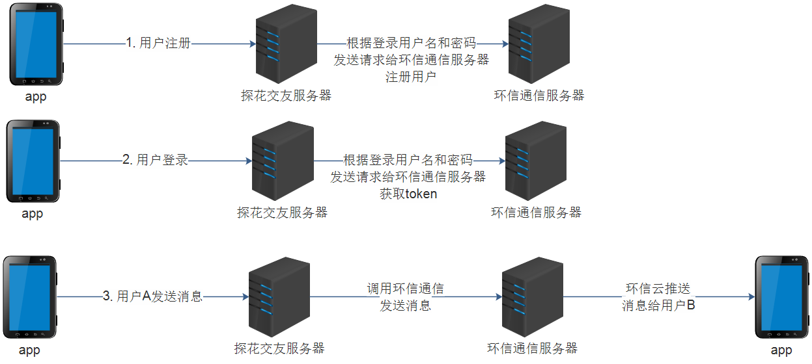

将用户体系集成的逻辑写入到`tanhua-server`系统中。

* 探花用户注册时需要将用户信息注册到环信系统中
  * 对于老数据：编写单元测试方法批量的注册到环信
  * 对于新数据：loginVerification注册到环信
* APP从服务端获取当前用户的环信用户密码，自动登入环信系统
* APP自动获取环信服务器发送的信息数据

## 2.1. 注册环信用户

在用户登录逻辑中，当第一次注册时，将用户信息注册到环信

tanhua-server模块的service包下

```java
 @Autowired
 private HuanXinTemplate huanXinTemplate; 
 /**
   * 注册登录-第一步：验证码校验(登录)
   */
 public Map<String, Object> loginVerification(String phone, String verificationCode) {
 	......
 	//用户不存在，自动注册用户
    if (user == null) {
        ......
        //注册环信通讯
        huanXinTemplate.register(user.getId());
    }
 }
```

## 2.2. 查询环信用户信息

在app中，用户登录后需要根据用户名密码登录环信，由于用户名密码保存在后台，所以需要提供接口进行返回。


tanhua-server模块的controller包下编写HuanXinController实现

~~~java
package com.tanhua.server.controller;

import com.tanhua.commons.vo.HuanXinUser;
import com.tanhua.server.interceptor.UserHolder;
import org.springframework.http.ResponseEntity;
import org.springframework.web.bind.annotation.GetMapping;
import org.springframework.web.bind.annotation.RequestMapping;
import org.springframework.web.bind.annotation.RestController;

@RestController
@RequestMapping("/huanxin")
public class HuanXinController {

    /**
     * 获取当前登陆的用户名与密码，用于环信的登陆
     * @return
     */
    @GetMapping("/user")
    public ResponseEntity<HuanXinUser> getLoginHuanXinUser(){
        HuanXinUser user = new HuanXinUser(UserHolder.getUserId().toString(), "123456",String.format("今晚打老虎_%d",100));
        return ResponseEntity.ok(user);
    }
}
~~~

## 2.3. 发送消息给客户端

目前已经完成了用户体系的对接，下面我们进行测试发送消息，场景是这样的：

 

 

点击“聊一下”，就会给对方发送一条陌生人信息，这个消息由系统发送完成。

我们暂时通过环信的控制台进行发送： 

消息内容：

~~~shell
{"userId": "1","nickname":"黑马小妹","strangerQuestion": "你喜欢去看蔚蓝的大海还是去爬巍峨的高山？","reply": "我喜欢秋天的落叶，夏天的泉水，冬天的雪地，只要有你一切皆可~"}
~~~

 

 

 

可以看到已经接收到了消息。

### 【小结】

掌握环信通讯集成使用

# 3. 消息管理（重点）

### 【目标】

掌握消息管理实现

### 【路径】

1：查看用户详情

2：查看陌生人消息

3：回复陌生人消息

4：添加联系人

5：联系人列表

### 【讲解】

客户端完成消息管理共有三步

* 查看用户详情，点击聊一下查看陌生人问题
* 填写内容，发送陌生人消息
* 如果对方感兴趣，可以回复陌生人消息，双方成为好友

## 3.1. 服务消费者-查看用户详情

在首页可以查看感兴趣人的详细资料。点击“聊一下”，可以查看对方的问题

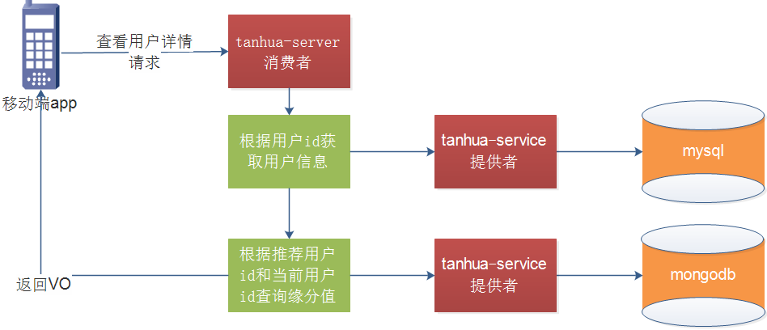

### 3.1.1. mock接口


### 3.1.2. TodayBestController

```java
    /**
     * 佳人信息
     * @param userId
     * @return
     */
    @GetMapping("/{id}/personalInfo")
    public ResponseEntity<TodayBestVo> queryUserDetail(@PathVariable("id") Long userId){
        TodayBestVo userInfoVo = todayBestService.getUserInfo(userId);
        return ResponseEntity.ok(userInfoVo);
    }
```

### 3.1.3. TodayBestService

```java
    /**
     * 佳人信息
     * @param userId
     * @return
     */
    public TodayBestVo getUserInfo(Long userId) {
        // 查询用户详情
        UserInfo userInfo = userInfoApi.findByUserId(userId);
        // 转成返回的格式
        TodayBestVo bestVo = new TodayBestVo();
        // 复制属性值
        BeanUtils.copyProperties(userInfo,bestVo,"tags");
        // 查询推荐的缘分值
        Double score = recommendUserApi.queryForScore(userId, UserHolder.getUserId());
        if(score == null){
            bestVo.setFateValue(80l);
        }else {
            bestVo.setFateValue(score.longValue());
        }
        bestVo.setTags(userInfo.getTags().split(","));
        return bestVo;
    }
```

## 3.2. 服务提供者-查看用户详情

### 3.2.1. RecommendUserApi

tanhua-dubbo-interface模块编写查询用户缘分值方法

```java
    /**
     * 查询两个用户的缘分值
     * @param userId
     * @param toUserId
     * @return
     */
    Double queryForScore(Long userId, Long toUserId);
```

### **3.2.2. RecommendUserApiImpl**

tanhua-dubbo-service模块编写查询用户缘分值方法

```java
/**
  * 查询缘分值
  * @param userId
  * @param toUserId
  * @return
  */
@Override
public Double queryForScore(Long userId, Long toUserId) {
    Query query = new Query();
    query.addCriteria(Criteria.where("toUserId").is(toUserId).and("userId").is(userId));
    query.with(Sort.by(Sort.Order.desc("date")));
    RecommendUser user = mongoTemplate.findOne(query, RecommendUser.class);
    if(null != user){
        return user.getScore();
    }
    return null;
}
```

### 3.2.3 测试

为方便测试可以修改RecommendUserApiImpl类中findPage方法

```
query.with(Sort.by(Sort.Order.asc("userId")));
```

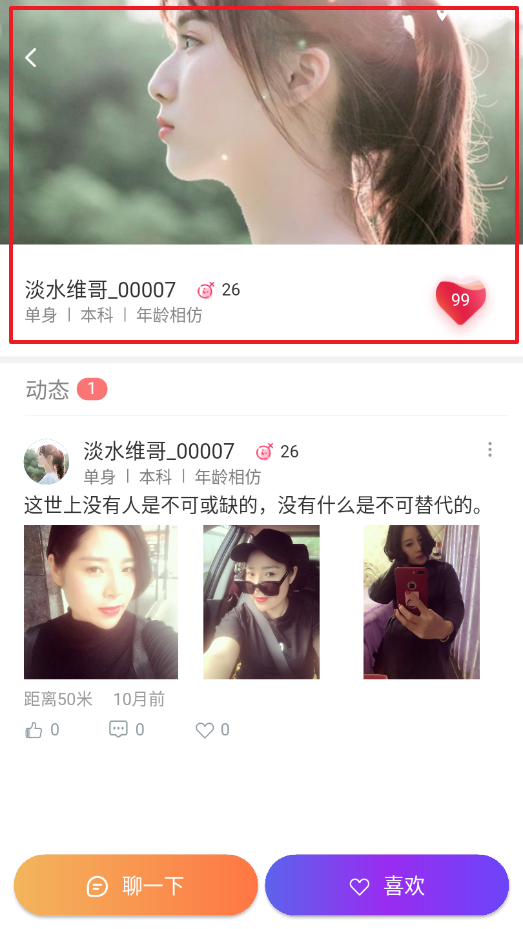 

## 3.3. 服务消费者-查询陌生人问题

点击“聊一下”，可以查看对方的问题


### 3.3.1. mock接口


### 3.3.2. TodayBestController

```java
/**
 * 查询用户设置的陌生人问题
 * @param userId
 * @return
 */
@GetMapping("/strangerQuestions")
public ResponseEntity<String> strangerQuestions(Long userId){
    String question = todayBestService.queryStrangerQuestions(userId);
    return ResponseEntity.ok(question);
}
```

### 3.3.3. TodayBestService

```java
@Reference
private QuestionApi questionApi;
/**
 * 查询用户设置的陌生人问题
 * @param userId
 * @return
 */
public String queryStrangerQuestions(Long userId) {
    Question question = questionApi.findByUserId(userId);
    if(null == question || StringUtils.isEmpty(question.getTxt())){
        return "你喜欢我吗?";
    }
    return question.getTxt();
}
```

### 3.3.4. 测试

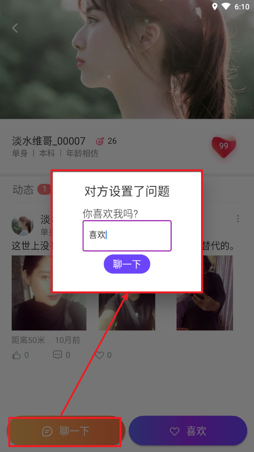 

## 3.3.服务消费者-回复陌生人消息

需求：

* 通过服务器端，给目标用户发送一条陌生人消息

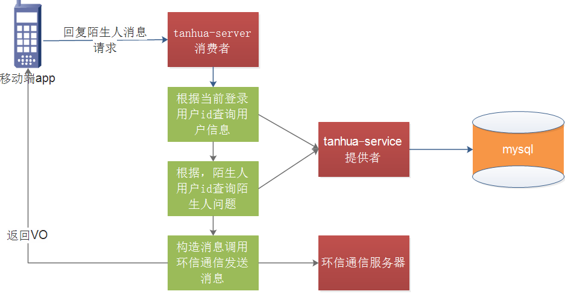

### 3.3.1. mock接口


### 3.3.2. TodayBestController

```java
@Autowired
private IMService imService;

/**
 * 回复陌生人问题
 * @param paramMap
 * @return
 */
@PostMapping("/strangerQuestions")
public ResponseEntity replyStrangerQuestions(@RequestBody Map<String,Object> paramMap){
    imService.replyStrangerQuestions(paramMap);
    return ResponseEntity.ok(null);
}
```

### 3.3.3. IMService

创建`IMService`并编写方法，完成回复陌生人消息功能

```java
package com.tanhua.server.service;

import com.alibaba.fastjson.JSON;
import com.tanhua.commons.templates.HuanXinTemplate;
import com.tanhua.domain.db.Question;
import com.tanhua.domain.db.UserInfo;
import com.tanhua.dubbo.api.QuestionApi;
import com.tanhua.dubbo.api.UserInfoApi;
import com.tanhua.server.interceptor.UserHolder;
import lombok.extern.slf4j.Slf4j;
import org.apache.dubbo.config.annotation.Reference;
import org.springframework.beans.factory.annotation.Autowired;
import org.springframework.stereotype.Service;

import java.util.HashMap;
import java.util.Map;
 
@Service
public class IMService {

    @Autowired
    private HuanXinTemplate huanXinTemplate;

    @Reference
    private QuestionApi questionApi;

    @Reference
    private UserInfoApi userInfoApi;

    /**
     * 回复陌生人消息
     * @param paramMap
     * @return
     */
    public void replyStrangerQuestions(Map<String,Object> paramMap) {
        long userId = Long.parseLong(paramMap.get("userId").toString());
        String content = ((String) paramMap.get("reply"));

        UserInfo userInfo = userInfoApi.findByUserId(UserHolder.getUserId());
        Question question = questionApi.findByUserId(userId);

        //构建消息内容
        Map<String, String> map = new HashMap<String, String>();
        map.put("userId", userInfo.getId().toString());
        map.put("nickname", userInfo.getNickname());
        map.put("strangerQuestion", question==null?"你喜欢我吗？":question.getTxt());
        map.put("reply", content);

        String msg = JSON.toJSONString(map);
        // 发信息给im
        huanXinTemplate.sendMsg(userId+"",msg);
    }
}
```

### 3.3.4. 测试

发送消息测试

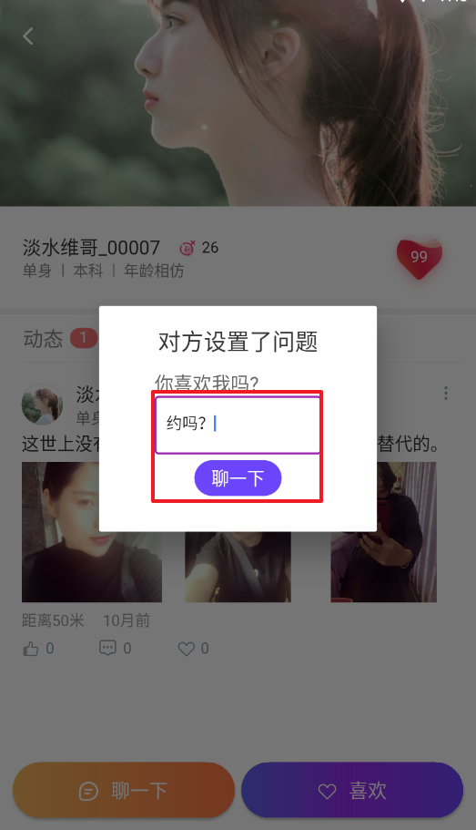 

接收消息测试

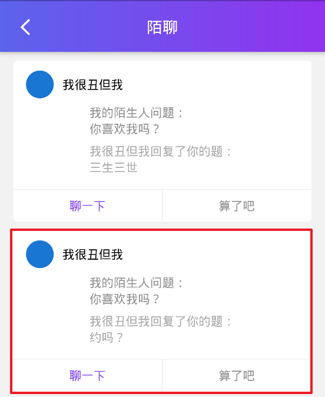 

## 3.4. 服务消费者-添加联系人

用户获取陌生人消息后，点击“聊一下”，就会成为联系人（好友）。

实现：

- 将好友写入到MongoDB中
- 将好友关系注册到环信


### 3.4.1. mock接口

 

### 3.4.2. IMController

```java
package com.tanhua.server.controller;

import com.tanhua.server.service.IMService;
import org.springframework.beans.factory.annotation.Autowired;
import org.springframework.http.ResponseEntity;
import org.springframework.web.bind.annotation.PostMapping;
import org.springframework.web.bind.annotation.RequestBody;
import org.springframework.web.bind.annotation.RequestMapping;
import org.springframework.web.bind.annotation.RestController;

import java.util.Map;

@RestController
@RequestMapping("/messages")
public class IMController {

    @Autowired
    private IMService imService;

    /**
     * 添加好友
     * @param paramMap
     * @return
     */
    @PostMapping("/contacts")
    public ResponseEntity addContacts(@RequestBody Map<String,Long> paramMap){
        imService.addContacts(paramMap.get("userId"));
        return ResponseEntity.ok(null);
    }
}
```

### 3.4.3. IMService

`IMService`补充添加联系人方法

```java
/**
 * 添加好友
 * @param friendId
 */
public void addContacts(Long friendId) {
    // 添加为好友
    Long userId = UserHolder.getUserId();
    friendApi.add(userId, friendId);
    // 环信上也加为好友
    huanXinTemplate.makeFriends(userId,friendId);
}
```

## 3.5. 服务提供者-添加联系人

### 3.5.1. FriendApi

创建FriendApi添加好友的方法

```java
package com.tanhua.dubbo.api;
public interface FriendApi {

    /**
     * 添加为好友
     * @param userId
     * @param friendId
     */
    void add(Long userId, Long friendId);
}
```

### 3.5.2. FriendApiImpl

创建FriendApiImpl添加好友的方法

```java
package com.tanhua.dubbo.api.mongo;

import com.tanhua.domain.mongo.Friend;
import org.apache.dubbo.config.annotation.Service;
import org.bson.types.ObjectId;
import org.springframework.beans.factory.annotation.Autowired;
import org.springframework.data.mongodb.core.MongoTemplate;
import org.springframework.data.mongodb.core.query.Criteria;
import org.springframework.data.mongodb.core.query.Query;
 
@Service
public class FriendApiImpl implements FriendApi {

    @Autowired
    private MongoTemplate mongoTemplate;

    @Override
    public void add(Long userId, Long friendId) {
        //记录好友关系：两条好友关系   1-8   8-1
        //1、查询好友关系是否存在
        Query query = new Query(
                Criteria.where("userId").is(userId)
                        .and("friendId").is(friendId)
        );
        if(!mongoTemplate.exists(query, Friend.class)) {
            //2、保存好友关系   userId-friendId
            Friend friend = new Friend();
            friend.setUserId(userId);
            friend.setFriendId(friendId);
            friend.setId(ObjectId.get());
            friend.setCreated(System.currentTimeMillis());
            mongoTemplate.save(friend);
        }

        query = new Query(
                Criteria.where("userId").is(friendId)
                        .and("friendId").is(userId)
        );
        if(!mongoTemplate.exists(query, Friend.class)) {
            //2、保存好友关系   userId-friendId
            Friend friend = new Friend();
            friend.setUserId(friendId);
            friend.setFriendId(userId);
            friend.setId(ObjectId.get());
            friend.setCreated(System.currentTimeMillis());
            mongoTemplate.save(friend);
        }
    }
}
```

### 3.5.3. 测试

postman测试：


 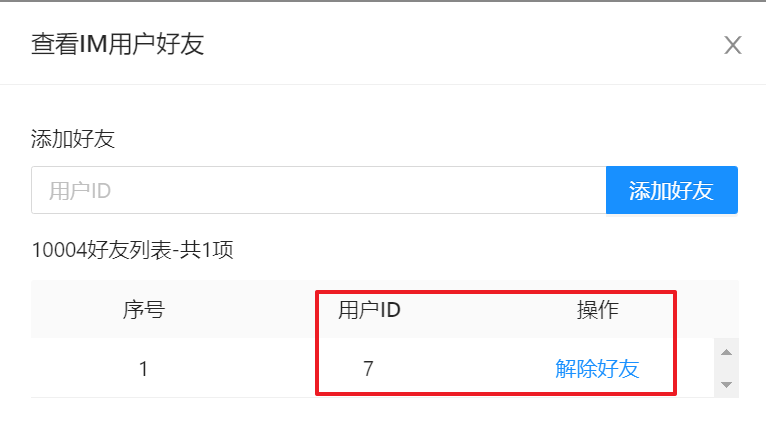

可以看到好友已经添加成功。

app测试：注册新用户测试

 

## 3.6. 服务消费者-联系人列表

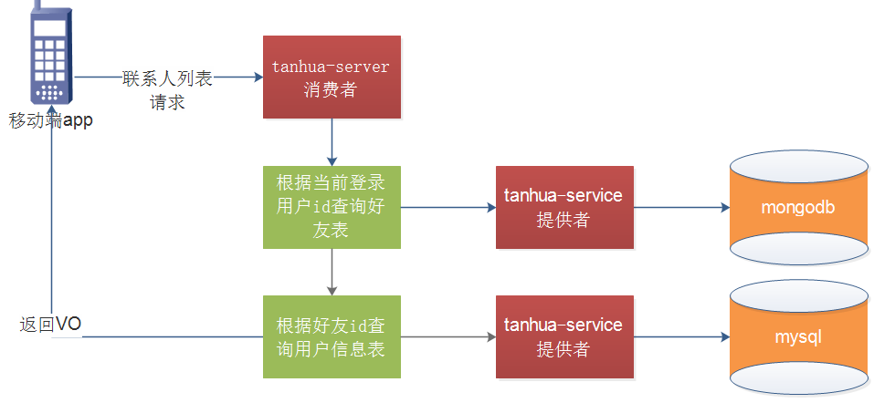

### 3.6.1. mock接口


响应数据结构：

 

### 3.6.2. ContactVo

```java
package com.tanhua.domain.vo;
import lombok.Data;
@Data
public class ContactVo {
    private Long id;
    private String userId;
    private String avatar;
    private String nickname;
    private String gender;
    private Integer age;
    private String city;
}
```

### 3.6.3. IMController

在`IMController`中添加查询联系人列表方法

```java
/**
 * 联系人列表
 * @return
 */
@GetMapping("/contacts")
public ResponseEntity queryContactsList(@RequestParam(defaultValue = "1") Integer page,
                                      @RequestParam(defaultValue = "10") Integer pagesize,
                                      @RequestParam(required = false) String keyword){
    PageResult<ContactVo> pageResult = imService.queryContactsList(page,pagesize,keyword);
    return ResponseEntity.ok(pageResult);
}
```

### 3.6.4. IMService

在`IMService`中添加查询联系人方法

```java
/**
  * 联系人列表分页
  * @param page
  * @param size
  * @param keyword
  * @return
  */
public PageResult<ContactVo> queryContactsList(Integer page, Integer size, String keyword) {
    //1、调用API 查询当前用户的好友列表  PageResult<Friend>
    PageResult result = friendApi.findPage(UserHolder.getUserId(),page,size,keyword);
    //2、获取数据列表
    List<Friend> items = (List<Friend>) result.getItems();
    //3、循环列表，构造vo
    List<ContactVo> list  = new ArrayList<>();
    for (Friend item : items) {
        UserInfo userInfo = userInfoApi.findByUserId(item.getFriendId());
        ContactVo vo = new ContactVo();
        BeanUtils.copyProperties(userInfo, vo);
        vo.setCity(StringUtils.substringBefore(userInfo.getCity(),"-"));
        vo.setUserId(userInfo.getId().toString());
        list.add(vo);
    }
    result.setItems(list);
    return result;
}
```

## 3.7. 服务提供者-联系人列表

### 3.7.1. FriendApi

在FriendApi中添加分页查询方法

```java
/**
 * 分页查询好友
 * @param page
 * @param size
 * @param keyword
 * @return
 */
PageResult findPage(Long userId, Integer page, Integer size, String keyword);
```

### 3.7.2. FriendApiImpl

在FriendApiImpl中添加分页查询方法

```java
/**
 * 分页查询好友
 * @param page
 * @param size
 * @param keyword
 * @return
 */
@Override
public PageResult findPage(Long userId, Integer page, Integer size, String keyword) {
    Query query = new Query();
    query.addCriteria(Criteria.where("userId").is(userId));
    long count = mongoTemplate.count(query, Friend.class);
    PageResult<Friend> pageResult = new PageResult<Friend>();
    pageResult.setPagesize((long)size);
    pageResult.setPage((long)page);
    pageResult.setCounts(count);

    query.with(PageRequest.of(page-1,size));
    List<Friend> friends = mongoTemplate.find(query, Friend.class);
    pageResult.setItems(friends);

    return pageResult;
}
```

### 3.7.3. 测试

 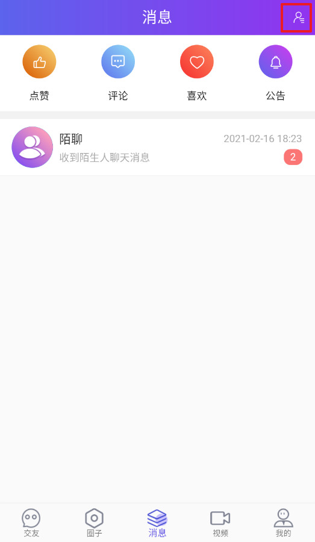 

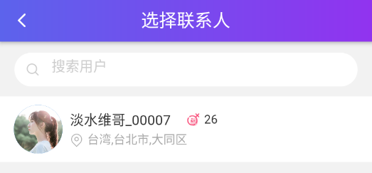 

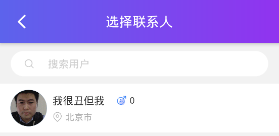 


### 【小结】

掌握消息管理功能

# 4. 点赞评论喜欢列表查询

### 【目标】

掌握点赞评论喜欢功能

### 【路径】

1：点赞评论喜欢功能分析

2：点赞评论喜欢功能实现

### 【讲解】

## 4.1. 服务消费者-点赞评论喜欢

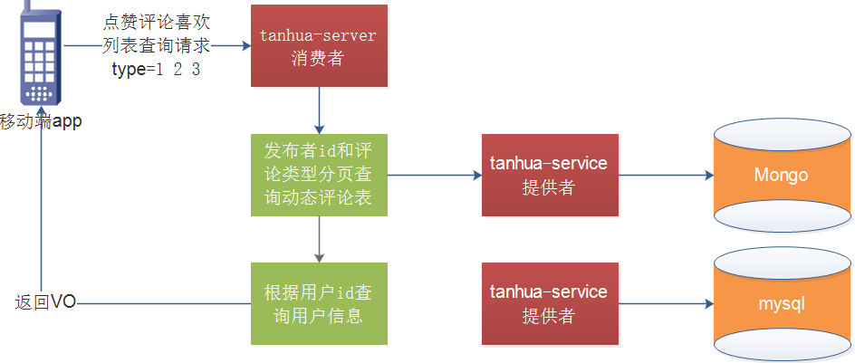

### 4.1.1. MessageVo

根据接口定义vo对象。

```java
package com.tanhua.domain.vo;

import lombok.Data;

@Data
public class MessageVo {
    private String id;
    private String avatar;
    private String nickname;
    private String createDate;
}
```

### 4.1.2. IMController

```java
/**
  * 查询点赞列表
  */
@GetMapping("likes")
public ResponseEntity<PageResult> queryLikeList(@RequestParam(defaultValue = "1") Integer page,
@RequestParam(defaultValue = "10") Integer pageSize){
    return imService.messageCommentList(1,  page,  pageSize);
}

/**
  * 查询评论列表
  */
@GetMapping("comments")
public ResponseEntity<PageResult> queryCommentList(@RequestParam(defaultValue = "1") Integer page,@RequestParam(defaultValue = "10")Integer pageSize) {xx
    return imService.messageCommentList(2,  page,  pageSize);
}

/**
  * 查询喜欢列表
  */
@GetMapping("loves")
public ResponseEntity<PageResult> queryLoveList(@RequestParam(defaultValue = "1") Integer page,
@RequestParam(defaultValue = "10") Integer pageSize) {
    return imService.messageCommentList(3,  page,  pageSize);
}
```

### 4.1.3. IMService

```java
/**
  * 查询点赞\评论\喜欢列表
  */
public ResponseEntity messageCommentList(Integer type, Integer page, Integer pageSize) {
    PageResult result = commentApi.findByUserId(page, pageSize, type, UserHolder.getUserId());
    List<Comment>  items = (List<Comment>)result.getItems();
    List<MessageVo> messageVoList = new ArrayList<>();
    for (Comment record : items) {
        MessageVo messageVo = new MessageVo();
        messageVo.setId(record.getId().toHexString());
        UserInfo info = userInfoApi.findByUserId(record.getUserId());
        messageVo.setAvatar(info.getAvatar());
        messageVo.setNickname(info.getNickname());
        String createDate = new SimpleDateFormat("yyyy-MM-dd HH:mm").format(new Date(record.getCreated()));
        messageVo.setCreateDate(createDate);
        messageVoList.add(messageVo);
    }
    result.setItems(messageVoList);

    return ResponseEntity.ok(result);
}
```

## 4.2. 服务提供者-点赞评论喜欢

### 4.2.1. Comment

点赞、评论、喜欢列表应该是别人对我发布的信息做了操作之后显示的数据，所以查询条件是发布人的id作为查询条件。

修改Comment对象，增加 publishUserId 字段。

```java
package com.tanhua.domain.mongo;

import lombok.Data;
import org.bson.types.ObjectId;
import org.springframework.data.mongodb.core.mapping.Document;

import java.io.Serializable;

@Data
@Document(collection = "quanzi_comment")
public class Comment implements Serializable {

    private ObjectId id;

    private ObjectId publishId;    //发布id
    private Integer commentType;   //评论类型，1-点赞，2-评论，3-喜欢
    private Integer pubType;       //评论内容类型： 1-对动态操作 2-对视频操作 3-对评论操作
    private String content;        //评论内容
    private Long userId;           //评论人
    private Integer likeCount = 0; //点赞数
    private Long created; //发表时间
    private Long publishUserId; //被评论人ID

    //动态选择更新的字段
    public String getCol() {
        return this.commentType == 1 ? "likeCount" : commentType==2? "commentCount"
            : "loveCount";
    }
}
```

### 4.2.2. CommentApi

```java
/**
* 通过发布者id和评论的类型分页查询
*
* @param userId
* @param commentType
* @param page
* @param pageSize
* @return
*/
PageResult findByUserId(Integer page, Integer pageSize,Integer commentType,Long userId);
```

### 4.2.3. CommentApiImpl

```java
/**
* 通过发布者id和评论的类型分页查询
*
* @param userId
* @param commentType
* @param page
* @param pageSize
* @return
*/
@Override
public PageResult findByUserId(Integer page, Integer pageSize, Integer commentType, Long userId) {
    PageResult<Comment> pageResult = new PageResult<>();

    Query query = Query.query(Criteria.where("publishUserId").is(userId)
                              .and("commentType").is(commentType)).limit(pageSize).skip((page - 1) * pageSize);

    List<Comment> commentList = this.mongoTemplate.find(query, Comment.class);

    long total = this.mongoTemplate.count(query, Comment.class);
    int pages = total / pageSize + total % pageSize > 0 ? 1 : 0;
    pageResult.setCounts(total);
    pageResult.setPagesize((long) pageSize);
    pageResult.setPage((long) page);
    pageResult.setPages((long) pages);
    pageResult.setItems(commentList);
    return pageResult;
}


/**
  * 动态-点赞(修改原有方法)
  */
@Override
public long save(Comment comment) {
    //a.动态点赞记录保持 动态评论表
    comment.setId(ObjectId.get());
    comment.setCreated(System.currentTimeMillis());
    //点赞 //喜欢 //评论  需要接收消息的用户id
    if(comment.getPubType() == 1){
        Query query = new Query();
        Publish publish = mongoTemplate.findOne(query,Publish.class);
        comment.setPublishUserId(publish.getUserId());
    }
    mongoTemplate.save(comment);
    //b.根据发布id 更新发布表点赞数+1
    updateCount(comment,1);
    //c.根据发布id查询发布表点赞数
    Long count = getCount(comment);
    return count;
}
```

### 4.2.4. 测试

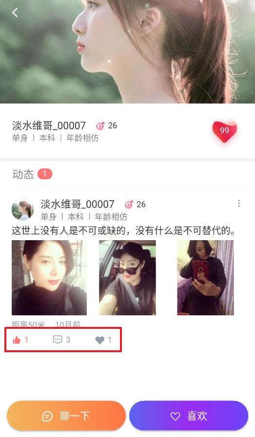 

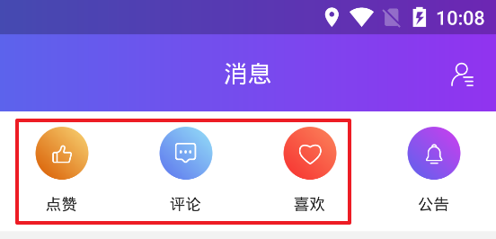 

 

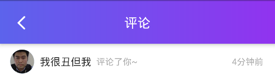 

  

### 【小结】

掌握点赞评论喜欢列表查询功能

# 总结

* 即时通信与环信
* 抽取环信组件（了解）
* 应用体系集成
  * 用户注册时，将信息注册到环信通信
  * 客户端登录成功之后，向服务端发送请求获取此用户在环信的用户名和密码
* 消息管理
  * 查看佳人详情
  * 查看用户的陌生人问题
  * 回复陌生人问题（通过服务端向用户发送消息）
  * 添加联系人（添加到朋友表中双向，注册到环信上）
  * 联系人链表
* 点赞评论，喜欢
  * bug