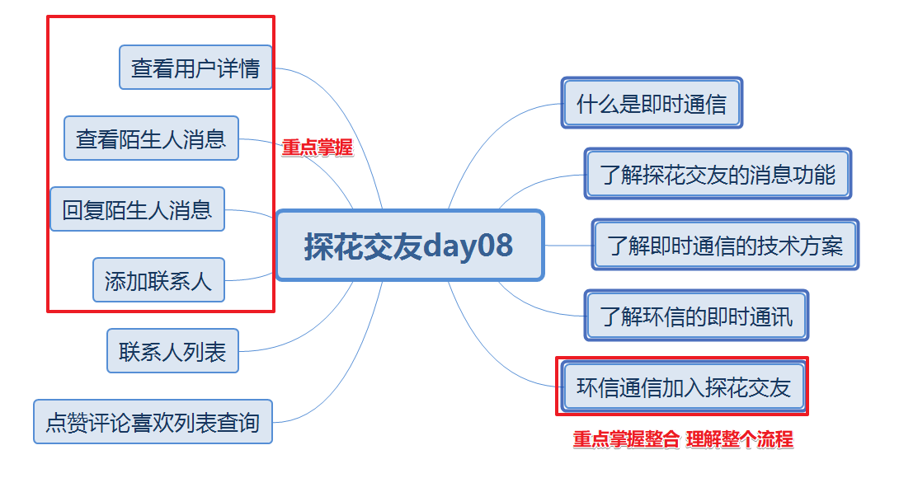
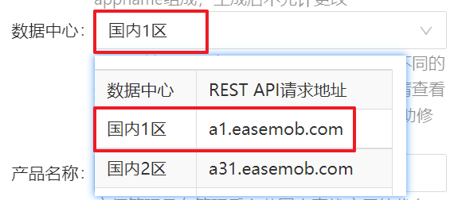
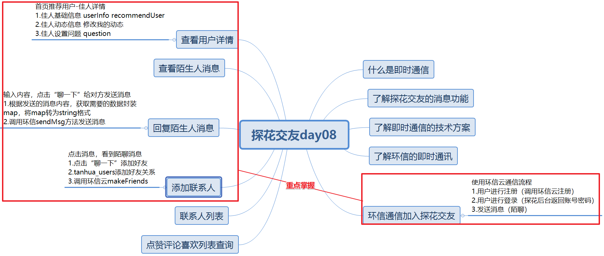

# 今日内容介绍



# 探花交友-即时通讯

首页推荐用户-聊一下

消息模块-好友聊天 陌生人聊天


前端app:已经实现聊天功能

后端服务：需要提供登录环信云功能（返回当前用户的账号和密码，由app端发送请求给环信云）


# 环信云使用说明

 

 

```
Appname:mytanhua113
Appkey:1112190901181842#mytanhua113	
Client ID:YXA6ePunD1eJSyOAvZtLHnsJCw
ClientSecret:YXA67CcwUiVdLwH5UBD-CKkBmfLC6zg
Orgname:1112190901181842
url:http://a1.easemob.com/
```

#  应用集成（重点）

```
1.保证用户登录后调用huanxinUser()获取了用户信息
2.app端配置appKey是正确的
3.为了确保测试效果，一定要清理下app缓存(重新配置下)
4.测试接收消息的用户，必须在环信云已经注册了
5.发送的测试消息内容，本身是可以随意发送消息的，但是由于app端限定数据格式。
6.探花app消息模块-如果显示加载失败xxx....,需要重新登录app.
7.使用1号用户登录MuMu app，别换其他用户操作。

http://192.168.37.85:10880
1112190901181842#mytanhua113
```


# 回复陌生人问题

## 需求分析

当前登录用户，首页推荐用户列表中，选择某一个喜欢的佳人，点击“聊一下”输入内容，点“聊一下”发送陌聊消息给佳人。

## 数据库表

{"userId": "2","nickname":"黑马小妹","strangerQuestion": "你喜欢去看蔚蓝的大海还是去爬巍峨的高山？","reply": "我喜欢秋天的落叶，夏天的泉水，冬天的雪地，只要有你一切皆可~"}

"userId": "2"：当前登录的用户id  "nickname":"黑马小妹":当前登录的用户昵称

"strangerQuestion": "你喜欢去看蔚蓝的大海还是去爬巍峨的高山？"：陌生人用户的问题

"reply": "我喜欢秋天的落叶，夏天的泉水，冬天的雪地，只要有你一切皆可~"：当前用户输入的内容


UserInfo:根据当前用户id 查询

tb_question：根据传入的userId(佳人用户id)，查询佳人问题


## 消费者编码分析

1. controller接收回复陌生人请求 userId:佳人用户id  reply:当前用户对佳人回复的内容

2. controller调用service业务处理

   a.userId 通过UserHolder.getUserId()

   b.根据当前用户id查询userInfo得到昵称

   c.根据传入的佳人用户id 查询tb_question 得到佳人问题

   d.reply:回复的内容（传入的参数）

   f.将以上数据map（json格式）调用环信云sendMsg(接收消息的用户id,msg消息内容)

## 服务提供者编码分析

已经实现了

## 测试


# 点赞评论喜欢列表查询

## 需求分析

quanzi_comment：评论表（点赞 、喜欢、评论记录）


# 作业

1. 查看用户详情功能分析思路
2. 查询陌生人问题功能分析思路
3. 添加联系人功能分析思路
4. 联系人列表功能分析思路

# 查看用户详情功能分析思路

## 需求分析

点击首页推荐用户，查询推荐用户详情，用户详细信息+缘分值


## 数据库表


## 消费者编码分析

1. controller接收查询佳人详情请求 

2. controller调用service业务处理

   a.根据传入的佳人用户id 查询tb_user_info 得到userInfo

   b.根据佳人用户id和登陆用户id查询recommend_user得到缘分值


## 服务提供者编码分析

已经实现了


# 查询陌生人问题功能分析思路

## 需求分析

点击“聊一下”，可以查看对方的问题


## 数据库表


## 消费者编码分析

1. controller接收查询陌生人问题请求 

2. controller调用service业务处理

   a.根据传入的佳人用户id 查询tb_question 得到 陌生人问题


## 服务提供者编码分析

已经实现了


# 添加联系人功能分析思路

## 需求分析

用户获取陌生人消息后，点击“聊一下”，就会成为联系人（好友）。


## 数据库表


## 消费者编码分析

1. controller接收查询陌生人问题请求 

2. controller调用service业务处理

   a.根据传入的佳人用户id 查询tb_question 得到 陌生人问题

## 服务提供者编码分析

已经实现了

## 测试

# 总结




# 演讲

探花项目中如何集成环信云？

答：用户注册  用户登录（返回userId 密码123456） 发送消息