# 第9章 地址位置功能实现

# 学习目标

- 谁看过我的功能实现
- 我的喜欢的功能实现
- 上报地理位置功能实现
- 搜附近的功能实现

# 1. 谁看过我

### 【目标】

掌握谁看过我功能实现

### 【路径】

1：谁看过我功能分析

2：谁看过我功能实现

### 【讲解】

记录别人来访了我的主页的信息。

* 保存访问记录
* 查询访问记录
  * 根据时间判断

## 1.1. 数据库


userId：被访问人的用户id

visitorUserId：访问者的用户id

## 1.2. 服务消费者-谁看过我

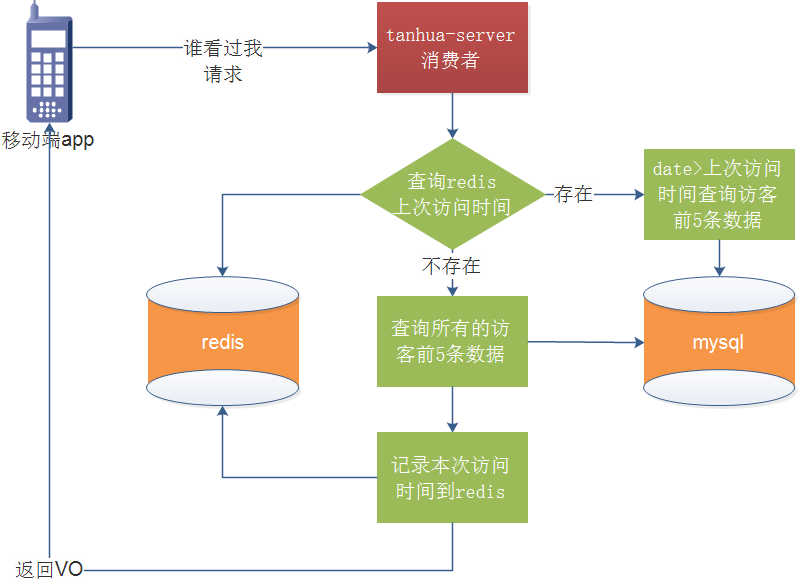

### 1.2.1. mock接口

地址： https://mock.boxuegu.com/project/164/interface/api/64750 

 

 

### 1.2.2. VisitorVo

```java
package com.tanhua.domain.vo;

import lombok.Data;

import java.io.Serializable;

@Data
public class VisitorVo implements Serializable {
    private Long id;
    private String avatar;
    private String nickname;
    private String gender;
    private Integer age;
    private String[] tags;
    private Integer fateValue;
}
```

### 1.2.3. Visitor

```java
package com.tanhua.domain.mongo;

import lombok.Data;
import org.bson.types.ObjectId;
import org.springframework.data.mongodb.core.mapping.Document;

import java.io.Serializable;

@Data
@Document(collection = "visitors")
public class Visitor implements Serializable {

    private ObjectId id;
    private Long userId; //我的id
    private Long visitorUserId; //来访用户id
    private String from; //来源，如首页、圈子等
    private Long date; //来访时间

    private Double score; //得分
}
```

### 1.2.4. MomentController

```java
/**
 * 谁看过我
 * @return
 */
@GetMapping("/visitors")
public ResponseEntity queryVisitors(){
    List<VisitorVo> visitorVoList = momentService.queryVisitors();
    return ResponseEntity.ok(visitorVoList);
}
```

### 1.2.5. MomentsService

```java
@Reference
private VisitorApi visitorApi;

/**
  * 谁看过我
  */
public List<VisitorVo> queryVisitors() {
    Long userId = UserHolder.getUserId();
    //1.从redis查询上次访问时间
    String key = "visitors_time_"+userId;
    String time = (String)redisTemplate.opsForValue().get(key);
    List<Visitor> visitorList = new ArrayList<>();
    if(StringUtils.isNotEmpty(time)){
        //2.如果redis有数据 date>上次上次访问时间 & 前5条记录 获取访客列表
        visitorList = visitorApi.queryVisitors(time,userId);
    }else {
        //3.如果redis没有数据 查询所有访客记录前5条记录
        visitorList = visitorApi.queryVisitors(userId);
    }
    //4.将访问时间记录redis
    redisTemplate.opsForValue().set(key,System.currentTimeMillis()+"");

    //5.返回VO
    List<VisitorVo> visitorVoList  = new ArrayList<>();
    if(visitorList != null && visitorList.size()>0){
        for (Visitor visitor : visitorList) {
            VisitorVo visitorVo = new VisitorVo();
            //根据用户id查询用户信息
            UserInfo userInfo = userInfoApi.findByUserId(visitor.getVisitorUserId());//来访用户id
            BeanUtils.copyProperties(userInfo,visitorVo);
            visitorVo.setTags(StringUtils.split(userInfo.getTags(), ','));
            visitorVo.setFateValue(visitor.getScore().intValue());//缘分值
            visitorVoList.add(visitorVo);
        }
    }
    return visitorVoList;
}
```

## 1.3. 服务提供者-谁看过我

### 1.3.1. VisitorApi

编写VisitorsApi

~~~java
package com.tanhua.dubbo.api.mongo;
import com.tanhua.domain.mongo.Visitor;
import java.util.List;

public interface VisitorApi {
    /**
     * 根据上次访问时间与当前用户id 查询前5条访客列表记录
     * @param time
     * @param userId
     * @return
     */
    List<Visitor> queryVisitors(String time, Long userId);

    /**
     * 根据当前用户id 查询前5条访客列表记录
     * @param userId
     * @return
     */
    List<Visitor> queryVisitors(Long userId);

    /**
     * 保存访客记录
     */
    void save(Visitor visitor);
}
~~~

### 1.3.2. VisitorApiImpl

编写`VisitorsApiImpl`

~~~java
package com.tanhua.dubbo.api.mongo;

import com.tanhua.domain.mongo.Visitor;
import org.apache.dubbo.config.annotation.Service;
import org.bson.types.ObjectId;
import org.springframework.beans.factory.annotation.Autowired;
import org.springframework.data.domain.Sort;
import org.springframework.data.mongodb.core.MongoTemplate;
import org.springframework.data.mongodb.core.query.Criteria;
import org.springframework.data.mongodb.core.query.Query;

import java.util.List;

@Service
public class VisitorApiImpl implements VisitorApi{

    @Autowired
    private MongoTemplate mongoTemplate;

    /**
     * 根据上次访问时间与当前用户id 查询前5条访客列表记录
     * @param time
     * @param userId
     * @return
     */
    @Override
    public List<Visitor> queryVisitors(String time, Long userId) {
        Query query = new Query(Criteria.where("userId").is(userId).and("date").gt(time));
        query.limit(5);
        return mongoTemplate.find(query,Visitor.class);
    }

    /**
     * 根据当前用户id 查询前5条访客列表记录
     * @param userId
     * @return
     */
    @Override
    public List<Visitor> queryVisitors(Long userId) {
        Query query = new Query(Criteria.where("userId").is(userId));
        query.with(Sort.by(Sort.Order.desc("date")));
        query.limit(5);
        return mongoTemplate.find(query,Visitor.class);
    }

    /**
     * 保存访客记录
     */
    @Override
    public void save(Visitor visitor) {
        visitor.setId(ObjectId.get());
        visitor.setDate(System.currentTimeMillis());
        mongoTemplate.save(visitor);
    }
}
~~~

### 1.3.3. 构造测试数据

~~~java
package com.tanhua.server.test;

import com.tanhua.domain.mongo.Visitor;
import com.tanhua.dubbo.api.mongo.VisitorApi;
import org.apache.commons.lang3.RandomUtils;
import org.junit.Test;
import org.junit.runner.RunWith;
import org.springframework.beans.factory.annotation.Autowired;
import org.springframework.boot.test.context.SpringBootTest;
import org.springframework.test.context.junit4.SpringJUnit4ClassRunner;

@RunWith(SpringJUnit4ClassRunner.class)
@SpringBootTest
public class TestVisitors {

    @Autowired
    private VisitorApi visitorApi;

    @Test
    public void testSave(){
        for (int i = 0; i < 100; i++) {
            Visitor visitor = new Visitor();
            visitor.setFrom("首页");
            visitor.setUserId(130l);//用户id
            visitor.setScore(77d);
            visitor.setVisitorUserId(RandomUtils.nextLong(11,50));
            this.visitorApi.save(visitor);
        }
        System.out.println("ok");
    }
}
~~~

### 1.3.4. 测试

postman测试：

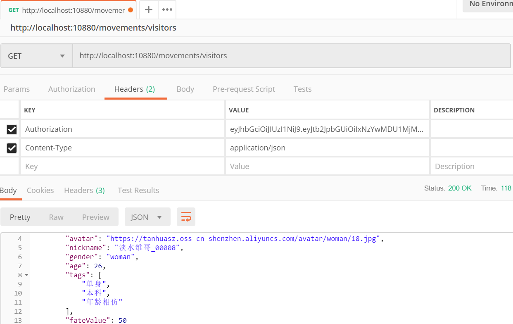

app测试：

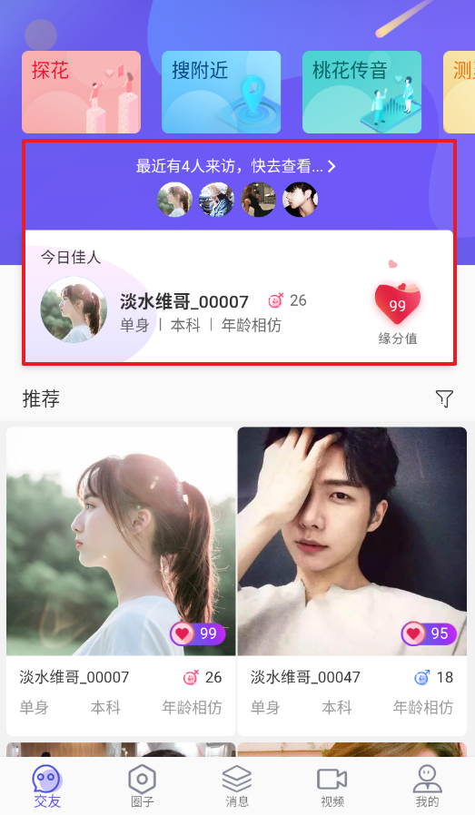 

### 【小结】

掌握谁看过我功能实现

# 2. 我的喜欢

### 【目标】

 掌握互相喜欢、喜欢、粉丝功能实现

### 【路径】

1： 互相喜欢、喜欢、粉丝统计

2： 查询相互喜欢、我喜欢、粉丝列表分页查询

3：粉丝-喜欢

### 【讲解】

在我的模块中，将详细展现“喜欢”相关的数据，如下：

 

 

## 2.1. 我的喜欢介绍

- 喜欢
  - 我喜欢别人，如：张三喜欢李四，就是喜欢的数据，并不代表李四也喜欢张三。
- 粉丝
  - 对于李四而言，张三就是他的粉丝。
- 相互关注（喜欢）
  - 如果李四也喜欢张三，那么，张三和李四就是相互喜欢。两个人添加好友关系！

## 2.2. 服务消费者-互相喜欢、喜欢、粉丝统计

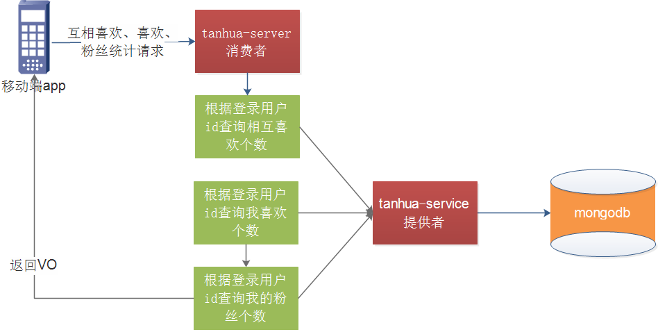

### 2.2.1. mock接口


 

### 2.2.2. CountsVo

------

```java
package com.tanhua.domain.vo;

import lombok.Data;

import java.io.Serializable;

@Data
public class CountsVo implements Serializable {
    private Long eachLoveCount; //互相喜欢
    private Long loveCount; //喜欢
    private Long fanCount; //粉丝
}
```

### 2.2.3. UserInfoController

```java
@Autowired
private UserService userService;

/**
 * 我的页面中的统计
 * 互相喜欢，喜欢，粉丝 - 统计
 * @return
 */
@GetMapping("/counts")
public ResponseEntity<CountsVo> counts(){
    CountsVo countsVo = userService.counts();
    return ResponseEntity.ok(countsVo);
}
```

### 2.2.4. UserService

```java
@Reference
private UserLikeApi userLikeApi;

/**
 * 我的页面中的统计
 * 互相喜欢，喜欢，粉丝 的个数
 * @return
 */
public CountsVo counts() {
    Long userId = UserHolder.getUserId();
    // 相互喜欢个数，统计好友数
    Long loveEachOtherCount = userLikeApi.countLikeEachOther(userId);
    // 统计我喜欢的
    Long likeCount = userLikeApi.countOneSideLike(userId);
    // 统计我的粉丝
    Long fensCount = userLikeApi.countFens(userId);
    CountsVo vo = new CountsVo();
    vo.setEachLoveCount(loveEachOtherCount);
    vo.setLoveCount(likeCount);
    vo.setFanCount(fensCount);
    return vo;
}
```

## 2.3. 服务提供者-互相喜欢、喜欢、粉丝统计

### 2.3.1. UserLike

```java
package com.tanhua.domain.mongo;

import lombok.Data;
import org.bson.types.ObjectId;
import org.springframework.data.mongodb.core.index.Indexed;
import org.springframework.data.mongodb.core.mapping.Document;

import java.io.Serializable;
 
@Data
@Document(collection = "user_like")
public class UserLike implements Serializable {

    private ObjectId id;
    @Indexed
    private Long userId; //用户id，自己
    @Indexed
    private Long likeUserId; //喜欢的用户id，对方

    private Long created; //创建时间
}
```


### 2.3.1. UserLikeApi

~~~java
package com.tanhua.dubbo.api.mongo;

public interface UserLikeApi {

    /**
     * 统计好友数 即相互喜欢的个数
     * @param userId
     * @return
     */
    Long countLikeEachOther(Long userId);

    /**
     * 统计我喜欢的个数
     * @param userId
     * @return
     */
    Long countOneSideLike(Long userId);

    /**
     * 统计我的粉丝个数
     * @param userId
     * @return
     */
    Long countFens(Long userId);
}

~~~

### 2.2.2. UserLikeApiImpl

~~~java
package com.tanhua.dubbo.api.mongo;

import com.tanhua.domain.mongo.Friend;
import com.tanhua.domain.mongo.UserLike;
import org.apache.dubbo.config.annotation.Service;
import org.springframework.beans.factory.annotation.Autowired;
import org.springframework.data.mongodb.core.MongoTemplate;
import org.springframework.data.mongodb.core.query.Criteria;
import org.springframework.data.mongodb.core.query.Query;
 
@Service
public class UserLikeApiImpl implements UserLikeApi{

    @Autowired
    private MongoTemplate mongoTemplate;

    /**
     * 统计好友数 即相互喜欢的个数
     * @param userId
     * @return
     */
    @Override
    public Long countLikeEachOther(Long userId) {
        Query query = new Query(
                Criteria.where("userId").is(userId)
        );
        return mongoTemplate.count(query, Friend.class);
    }

    /**
     * 统计我喜欢的个数
     * @param userId
     * @return
     */
    @Override
    public Long countOneSideLike(Long userId) {
        Query query = new Query(
                Criteria.where("userId").is(userId)
        );
        return mongoTemplate.count(query, UserLike.class);
    }

    /**
     * 统计我的粉丝个数
     * @param userId
     * @return
     */
    @Override
    public Long countFens(Long userId) {
        Query query = new Query(
                Criteria.where("likeUserId").is(userId)
        );
        return mongoTemplate.count(query, UserLike.class);
    }
}
~~~

### 2.3.5. 测试

postman测试

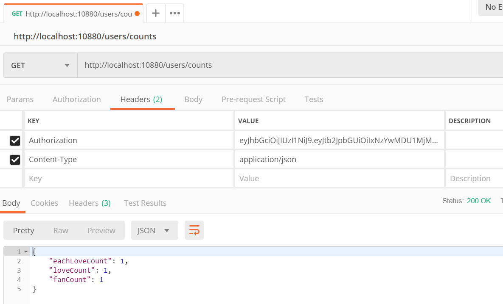

app测试

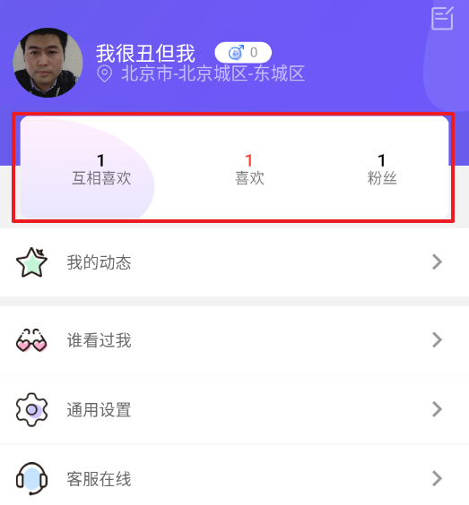 

## 2.4. 服务消费者-查询相互喜欢、我喜欢、粉丝列表分页查询

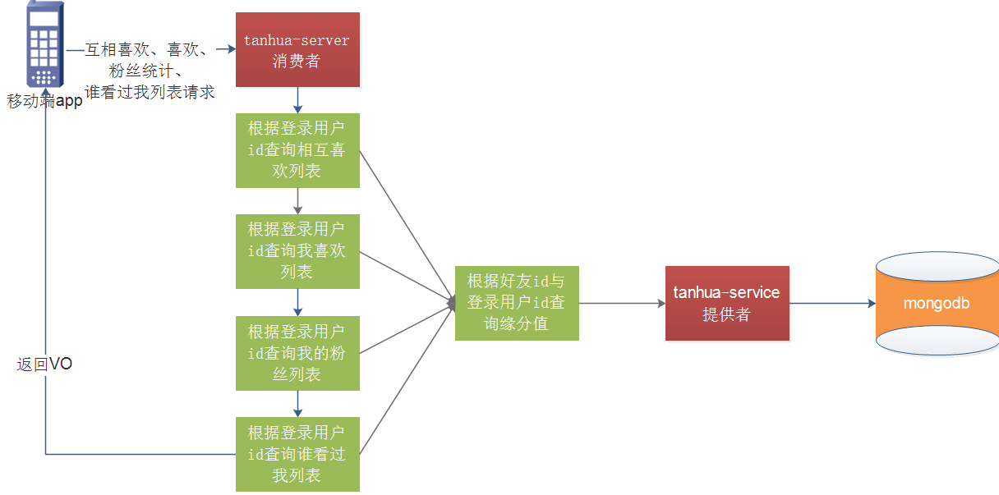

### 2.4.1. 接口说明

该接口集成了4个接口，用type做了区分，如下：

 1 互相关注 2 我关注 3 粉丝 4 谁看过我 


### 2.4.2. FriendVo

```java
package com.tanhua.domain.vo;

import lombok.Data;

import java.io.Serializable;

@Data
public class FriendVo implements Serializable {

    private Long id;
    private String avatar;
    private String nickname;
    private String gender;
    private Integer age;
    private String city;
    private String education;
    private Integer marriage; //婚姻状态（0未婚，1已婚）
    private Integer matchRate; //匹配度
}
```

### 2.4.3. UserInfoController

```java
    /**
     * 相互喜欢、我喜欢、粉丝列表分页查询
     * @param type
     * 1 互相关注
     * 2 我关注
     * 3 粉丝
     * 4 谁看过我
     * @param page
     * @param pagesize
     * @return
     */
    @GetMapping("/friends/{type}")
    public ResponseEntity queryUserLikeList(@PathVariable int type,
                                            @RequestParam(defaultValue = "1") int page,
                                            @RequestParam(defaultValue = "10") int pagesize){
        page=page<1?1:page;
        PageResult<FriendVo> pageResult = userService.queryUserLikeList(page,pagesize,type);
        return ResponseEntity.ok(pageResult);
    }
```

### 2.4.4. UserService

```java
   /**
     * 相互喜欢、我喜欢、粉丝列表分页查询
     * @param type
     * 1 互相关注 friend liked=1
     * 2 我关注 userId, liked=0
     * 3 粉丝 userId=friendId, liked=0
     * 4 谁看过我 visitor userId
     * @param page
     * @param pagesize
     * @return
     */
    public PageResult<FriendVo> queryUserLikeList(int page, int pagesize, int type) {
        // 登陆用户 id
        Long userId = UserHolder.getUserId();
        PageResult pageResult = new PageResult();
        switch (type){
            case 1:
                pageResult = userLikeApi.findPageLikeEachOther(userId,page,pagesize);
                break;
            case 2:
                pageResult = userLikeApi.findPageOneSideLike(userId,page,pagesize);
                break;
            case 3:
                pageResult = userLikeApi.findPageFens(userId,page,pagesize);
                break;
            case 4:
                pageResult = userLikeApi.findPageMyVisitors(userId,page,pagesize);
                break;
            default: break;
        }
        //3、获取查询数据列表
        List<RecommendUser> items = (List<RecommendUser>) pageResult.getItems();
        //4、循环数据列表，一个对象构造一个vo
        List<FriendVo> list = new ArrayList<>();
        for (RecommendUser item : items) {
            UserInfo info = userInfoApi.findByUserId(item.getUserId());
            FriendVo vo = new FriendVo();
            BeanUtils.copyProperties(info,vo);
            vo.setMatchRate(item.getScore().intValue());
            list.add(vo);
        }
        //5、构造返回值
        pageResult.setItems(list);
        return pageResult;
    }
```

## 2.5. 服务提供者-查询相互喜欢、我喜欢、粉丝列表分页查询

### 2.5.1. UserLikeApi

```java
    /**
     * 查询我喜欢的列表
     * @param userId
     * @param page
     * @param pagesize
     * @return
     */
    PageResult findPageOneSideLike(Long userId, int page, int pagesize);

    /**
     * 查询粉丝列表
     * @param userId
     * @param page
     * @param pagesize
     * @return
     */
    PageResult findPageFens(Long userId, int page, int pagesize);

    /**
     * 相互喜欢的分页查询
     * @param userId
     * @param page
     * @param pagesize
     * @return
     */
    PageResult findPageLikeEachOther(Long userId, int page, int pagesize);

    /**
     * 我的访客列表
     * @param userId
     * @param page
     * @param pagesize
     * @return
     */
    PageResult findPageMyVisitors(Long userId, int page, int pagesize);
```

### 2.5.2. UserLikeApiImpl

```java
   /**
     * 查询我喜欢的列表
     * @param userId
     * @param page
     * @param pagesize
     * @return
     */
    @Override
    public PageResult findPageOneSideLike(Long userId, int page, int pagesize) {
        Query query = Query.query(
                Criteria.where("userId").is(userId))
                .limit(pagesize)
                .skip((page - 1) * pagesize);
        long total = this.mongoTemplate.count(query, UserLike.class);
        List<UserLike> list = this.mongoTemplate.find(query, UserLike.class);
        List<RecommendUser> users = new ArrayList<>();
        for (UserLike userLike : list) {
            users.add(queryScore(userLike.getLikeUserId(),userLike.getUserId()));
        }
        int pages = total / pagesize + total % pagesize > 0 ? 1 : 0;
        PageResult pageResult =
                new PageResult(total,(long)pagesize,(long)page,(long)pages,users);
        return pageResult;
    }

    private RecommendUser queryScore(Long userId, Long toUserId) {
        Query query = Query.query(Criteria.where("toUserId").is(toUserId).and("userId").is(userId));
        RecommendUser user = this.mongoTemplate.findOne(query, RecommendUser.class);
        if (user == null) {
            user = new RecommendUser();
            user.setUserId(userId);
            user.setToUserId(toUserId);
            user.setScore(95d);
        }
        return user;
    }
    /**
     * 查询粉丝列表
     * @param userId
     * @param page
     * @param pagesize
     * @return
     */
    @Override
    public PageResult<RecommendUser> findPageFens(Long userId, int page, int pagesize) {
        Query query = Query.query(
                Criteria.where("likeUserId").is(userId))
                .limit(pagesize)
                .skip((page - 1) * pagesize);
        long total = this.mongoTemplate.count(query, UserLike.class);
        List<UserLike> list = this.mongoTemplate.find(query, UserLike.class);

        List<RecommendUser> users = new ArrayList<>();
        for (UserLike userLike : list) {
            users.add(queryScore(userLike.getUserId(),userLike.getLikeUserId()));
        }
        int pages = total / pagesize + total % pagesize > 0 ? 1 : 0;
        PageResult pageResult =
                new PageResult(total,(long)pagesize,(long)page,(long)pages,users);
        return pageResult;
    }

    /**
     * 相互喜欢的分页查询
     * @param userId
     * @param page
     * @param pagesize
     * @return
     */
    @Override
    public PageResult findPageLikeEachOther(Long userId, int page, int pagesize) {
        Query query = new Query(
                Criteria.where("userId").is(userId)
        ).limit(pagesize).skip((page -1) * pagesize);

        List<Friend> list = mongoTemplate.find(query, Friend.class);
        List<RecommendUser> users = new ArrayList<>();

        for (Friend friend : list) {
            RecommendUser user = queryScore(friend.getFriendId(),friend.getUserId());
            users.add(user);
        }

        long total  = mongoTemplate.count(query, Friend.class);
        int pages = total / pagesize + total % pagesize > 0 ? 1 : 0;
        PageResult pageResult =
                new PageResult(total,(long)pagesize,(long)page,(long)pages,users);
        return pageResult;
    }

    /**
     * 我的访客列表
     * @param userId
     * @param page
     * @param pagesize
     * @return
     */
    @Override
    public PageResult<RecommendUser> findPageMyVisitors(Long userId, int page, int pagesize) {
        Query query = Query.query(
                Criteria.where("userId").is(userId))
                .limit(pagesize)
                .skip((page - 1) * pagesize);
        List<Visitor> list = mongoTemplate.find(query, Visitor.class);
        long total = this.mongoTemplate.count(query, Visitor.class);

        List<RecommendUser> users = new ArrayList<>();
        for (Visitor visitors : list) {
            users.add(queryScore(visitors.getVisitorUserId(),userId));
        }
        int pages = total / pagesize + total % pagesize > 0 ? 1 : 0;
        PageResult pageResult =
                new PageResult(total,(long)pagesize,(long)page,(long)pages,users);
        return pageResult;
    }
```

### 2.5.3. 测试

postman测试

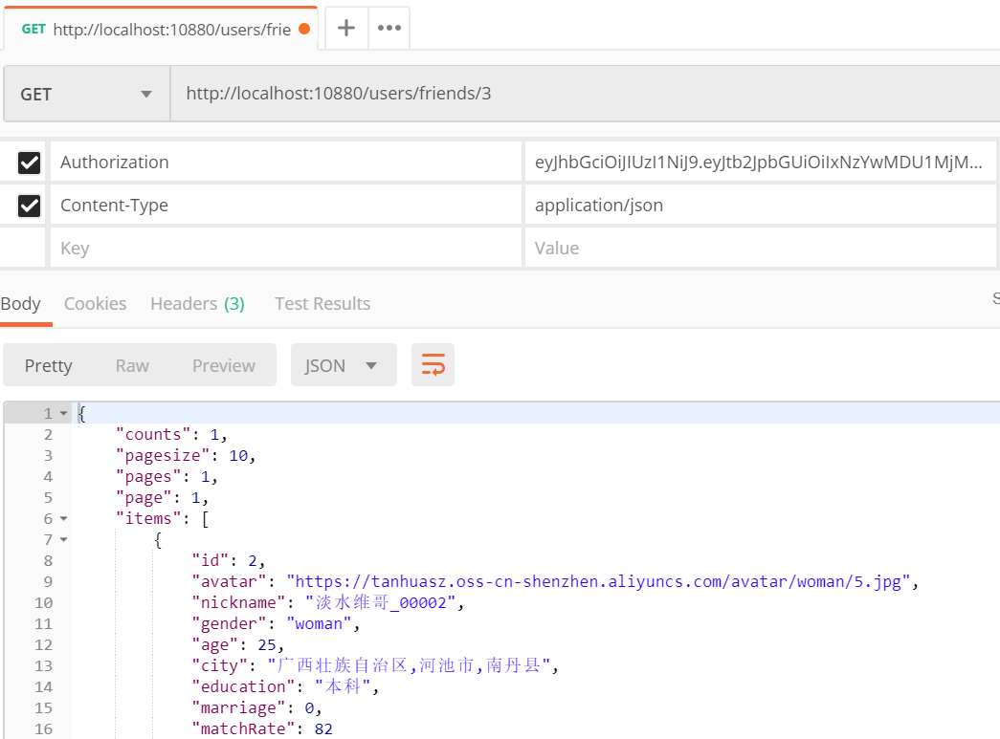

app测试

 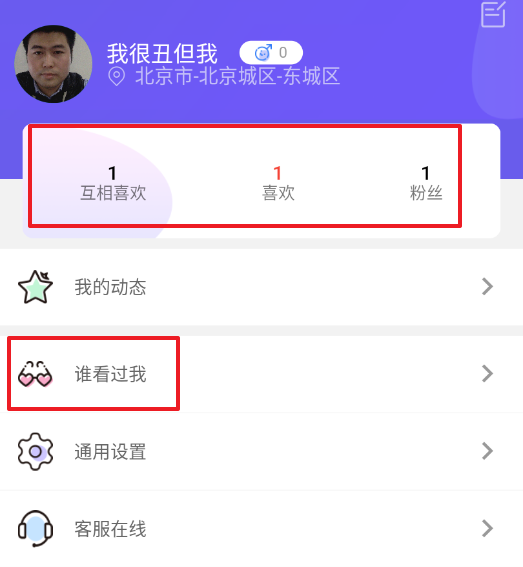

 

 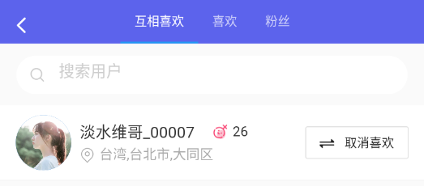

 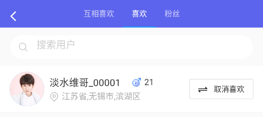

 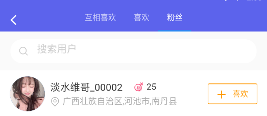

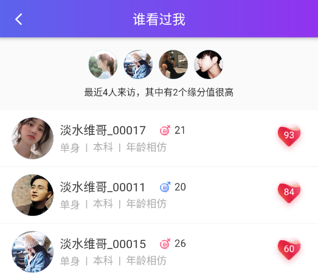 

 

## 2.6. 服务消费者-喜欢

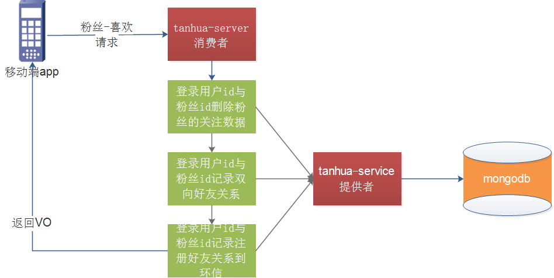

### 2.6.1. UserInfoController

```java
   /**
     * 粉丝-喜欢
     * 请求连接：POST  /fans/:uid
     */
    @PostMapping("/fans/{id}")
    public ResponseEntity fansLike(@PathVariable("id") Long likeUserId) {
        return userService.fansLike(likeUserId);
    }
```

### 2.6.2. UserService

```java
   @Reference
   private FriendApi friendApi;

   /**
     * 对关注我的粉丝，进行喜欢操作
     *  likeUserId ： 粉丝的用户id
     */
    public ResponseEntity fansLike(Long likeUserId) {
        //1、删除粉丝的关注数据
        userLikeApi.delete(likeUserId,UserHolder.getUserId());
        //2、记录双向的好友关系
        friendApi.add(UserHolder.getUserId(),likeUserId);
        //3、注册好友关系到环信
        huanXinTemplate.makeFriends(UserHolder.getUserId(),likeUserId);
        return ResponseEntity.ok(null);
    }
```

## 2.7. 服务提供者-喜欢

### 2.7.1. UserLikeApi

```java
//喜欢
void delete(Long userId, Long likeUserId);
```

### 2.7.2. UserLikeApiImpl

```java
@Override
public void delete(Long userId, Long likeUserId) {
    Query query = new Query(
        Criteria.where("userId").is(userId)
        .and("likeUserId").is(likeUserId)
    );
    mongoTemplate.remove(query, UserLike.class);
}
```

### 2.7.3. 测试

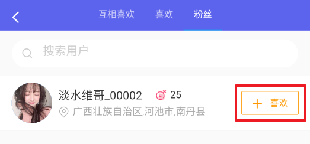  

### 【小结】

掌握互相喜欢、喜欢、粉丝功能实现

# 3. 地理位置（重点）

### 【目标】

 掌握地址位置功能实现

### 【路径】

1： 地址位置功能分析

2： 地址位置功能实现

### 【讲解】

客户端检测用户的地理位置，当变化大于500米时或每隔5分钟，向服务端发送地理位置。

## 3.1. 服务消费者-地址位置

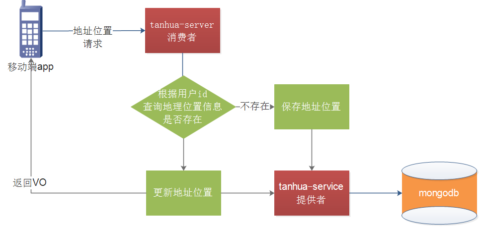

### 3.1.1. 接口说明


### 3.1.2. LocationController

```java
package com.tanhua.server.controller;

import com.tanhua.server.service.LocationService;
import org.springframework.beans.factory.annotation.Autowired;
import org.springframework.http.ResponseEntity;
import org.springframework.web.bind.annotation.PostMapping;
import org.springframework.web.bind.annotation.RequestBody;
import org.springframework.web.bind.annotation.RequestMapping;
import org.springframework.web.bind.annotation.RestController;

import java.util.Map;

@RestController
@RequestMapping("/baidu")
public class LocationController {

    @Autowired
    private LocationService locationService;

    /**
     * 上报地理位置
     * @param paramMap
     * @return
     */
    @PostMapping("/location")
    public ResponseEntity reportLocation(@RequestBody Map<String,Object> paramMap){
        locationService.reportLocation(paramMap);
        return ResponseEntity.ok(null);
    }
}

```

### 3.1.3. LocationService

```java
package com.tanhua.server.service;

import com.tanhua.dubbo.api.UserInfoApi;
import com.tanhua.dubbo.api.mongo.UserLocationApi;
import com.tanhua.server.interceptor.UserHolder;
import org.apache.dubbo.config.annotation.Reference;
import org.springframework.stereotype.Service;

import java.util.Map;
 
@Service
public class LocationService {

    @Reference
    private UserLocationApi userLocationApi;

    /**
     * 上报地理位置
     * @param paramMap
     */
    public void reportLocation(Map<String, Object> paramMap) {
        Double latitude = (Double)paramMap.get("latitude");
        Double longitude = (Double)paramMap.get("longitude");
        String address = (String) paramMap.get("addrStr");
        userLocationApi.addLocation(latitude,longitude,address, UserHolder.getUserId());
    }
}
```

## 3.2. 服务提供者-地址位置

### 3.2.1. UserLocation

~~~java
package com.tanhua.domain.mongo;

import lombok.Data;
import org.bson.types.ObjectId;
import org.springframework.data.annotation.Id;
import org.springframework.data.mongodb.core.geo.GeoJsonPoint;
import org.springframework.data.mongodb.core.index.CompoundIndex;
import org.springframework.data.mongodb.core.index.Indexed;
import org.springframework.data.mongodb.core.mapping.Document;

import java.io.Serializable;
 
@Data
@Document(collection = "user_location")
@CompoundIndex(name = "location_index", def = "{'location': '2dsphere'}")
public class UserLocation implements Serializable {

    @Id
    private ObjectId id;
    @Indexed
    private Long userId; //用户id
    private GeoJsonPoint location; //x:经度 y:纬度
    private String address; //位置描述
    private Long created; //创建时间
    private Long updated; //更新时间
    private Long lastUpdated; //上次更新时间
}
~~~

### 3.2.2. UserLocationApi

~~~java
package com.tanhua.dubbo.api.mongo;
public interface UserLocationApi {
    /**
     * 上报地理位置
     * @param latitude
     * @param longitude
     * @param address
     * @param userId
     */
    void addLocation(Double latitude, Double longitude, String address, Long userId);
}
~~~

### 3.2.3. UserLocationApiImpl

~~~java
package com.tanhua.dubbo.api.mongo;

import com.tanhua.domain.mongo.UserLocation;
import org.apache.dubbo.config.annotation.Service;
import org.bson.types.ObjectId;
import org.springframework.beans.factory.annotation.Autowired;
import org.springframework.data.mongodb.core.MongoTemplate;
import org.springframework.data.mongodb.core.geo.GeoJsonPoint;
import org.springframework.data.mongodb.core.query.Criteria;
import org.springframework.data.mongodb.core.query.Query;
import org.springframework.data.mongodb.core.query.Update;

 
@Service
public class UserLocationApiImpl implements UserLocationApi {

    @Autowired
    private MongoTemplate mongoTemplate;

    /**
     * 上报地理位置
     *
     * @param latitude
     * @param longitude
     * @param address
     * @param userId
     */
    @Override
    public void addLocation(Double latitude, Double longitude, String address, Long userId) {
        long millis = System.currentTimeMillis();
        Query query = new Query();
        query.addCriteria(Criteria.where("userId").is(userId));
        if (mongoTemplate.exists(query, UserLocation.class)) {
            Update update = new Update();
            update.set("lastUpdated",millis);
            update.set("updated",millis);
            update.set("location",new GeoJsonPoint(latitude, longitude));
            mongoTemplate.updateFirst(query,update,UserLocation.class);
        }else{
            UserLocation location = new UserLocation();
            location.setAddress(address);
            location.setId(ObjectId.get());
            location.setUserId(userId);
            location.setCreated(millis);
            location.setLastUpdated(millis);
            location.setUpdated(millis);
            location.setLocation(new GeoJsonPoint(latitude,longitude));
            mongoTemplate.save(location);
        }
    }
}

~~~

### 3.2.4. 测试

坐标拾取系统：http://api.map.baidu.com/lbsapi/getpoint/index.html 

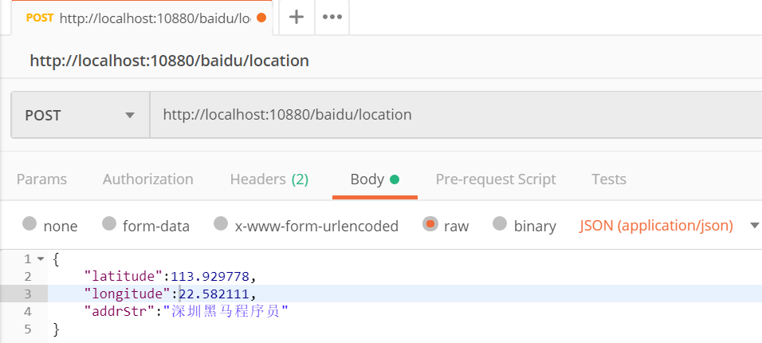


造测试数据

tanhua-dubbo-service模块test包下

```java
package com.tanhua.dubbo.test;

import com.tanhua.dubbo.api.mongo.UserLocationApi;
import org.junit.Test;
import org.junit.runner.RunWith;
import org.springframework.beans.factory.annotation.Autowired;
import org.springframework.boot.test.context.SpringBootTest;
import org.springframework.test.context.junit4.SpringRunner;

@RunWith(SpringRunner.class)
@SpringBootTest
public class UserLocationTest {

    @Autowired
    private UserLocationApi userLocationApi;

    @Test
    public void addLocation(){
        userLocationApi.addLocation(113.929778,22.582111,"深圳黑马程序员",1l);
        userLocationApi.addLocation(113.925528,22.587995,"红荔村肠粉",2l);
        userLocationApi.addLocation(113.93814,22.562578,"深圳南头直升机场",3l);
        userLocationApi.addLocation(114.064478,22.549528,"深圳市政府",4l);
        userLocationApi.addLocation(113.986074,22.547726,"欢乐谷",5l);
        userLocationApi.addLocation(113.979399,22.540746,"世界之窗",6l);
        userLocationApi.addLocation(114.294924,22.632275,"东部华侨城",7l);
        userLocationApi.addLocation(114.314011,22.598196,"大梅沙海滨公园",8l);
        userLocationApi.addLocation(113.821705,22.638172,"深圳宝安国际机场",9l);
        userLocationApi.addLocation(113.912386,22.566223,"海雅缤纷城(宝安店)",10l);
    }
}
```

### 【小结】

掌握地址位置功能实现

# 4、搜附近（重点）

### 【目标】

 掌握搜附近功能实现

### 【路径】

1： 搜附近功能分析

2： 搜附近功能实现

### 【讲解】

在首页中点击“搜附近”可以搜索附近的好友，效果如下：

 

## 4.1. 服务消费者-搜附近

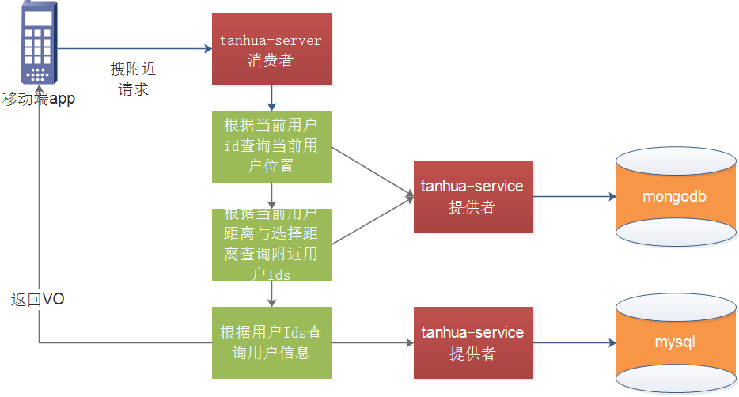

### 4.1.1. 接口说明


 

### 4.1.2. NearUserVo

```java
package com.tanhua.server.vo;
import lombok.AllArgsConstructor;
import lombok.Data;
import lombok.NoArgsConstructor;

@Data
@NoArgsConstructor
@AllArgsConstructor
public class NearUserVo {
    private Long userId;
    private String avatar;
    private String nickname;
}
```

### 4.1.3. UserLocationVo

> **由于UserLocation不能序列化，所以要再定义UserLocationVo进行返回数据。**

```java
package com.tanhua.domain.vo;

import com.tanhua.domain.mongo.UserLocation;
import lombok.Data;
import java.io.Serializable;
import java.util.ArrayList;
import java.util.List;

@Data
public class UserLocationVo implements Serializable {
    private String id;
    private Long userId; //用户id
    private Double longitude; //经度
    private Double latitude; //维度
    private String address; //位置描述
    private Long created; //创建时间
    private Long updated; //更新时间
    private Long lastUpdated; //上次更新时间

    public static final UserLocationVo format(UserLocation userLocation) {
        UserLocationVo userLocationVo = new UserLocationVo();
        userLocationVo.setAddress(userLocation.getAddress());
        userLocationVo.setCreated(userLocation.getCreated());
        userLocationVo.setId(userLocation.getId().toHexString());
        userLocationVo.setLastUpdated(userLocation.getLastUpdated());
        userLocationVo.setUpdated(userLocation.getUpdated());
        userLocationVo.setUserId(userLocation.getUserId());
        userLocationVo.setLongitude(userLocation.getLocation().getX());
        userLocationVo.setLatitude(userLocation.getLocation().getY());
        return userLocationVo;
    }

    public static final List<UserLocationVo> formatToList(List<UserLocation> userLocations) {
        List<UserLocationVo> list = new ArrayList<>();
        for (UserLocation userLocation : userLocations) {
            list.add(format(userLocation));
        }
        return list;
    }
}
```

### 4.1.3. TodayBestController

```java
   @Autowired
   private LocationService locationService; 

/**
  * 搜附近
  * @param gender
  * @param distance
  * @return
  */
@GetMapping("/search")
public ResponseEntity searchNearBy(@RequestParam(required=false) String gender,
                                   @RequestParam(defaultValue = "2000") String distance){
    List<NearUserVo> list = locationService.searchNearBy(gender,distance);
    return ResponseEntity.ok(list);
}
```

### 4.1.4. LocationService

```java
/**
 * 搜附近
 * @param gender
 * @param distance
 * @return
 */
public List<NearUserVo> searchNearBy(String gender, String distance) {
    //1、获取当前用户id
    Long userId = UserHolder.getUserId();
    //2、调用API根据用户id，距离查询当前用户附近的人 List<UserLocationVo>
    List<UserLocationVo> locations = userLocationApi.searchNear(userId,Long.valueOf(distance));
    //3、循环附近的人所有数据
    List<NearUserVo> userVoList = new ArrayList<>();
    for (UserLocationVo location : locations) {
        //4、调用UserInfoApi查询用户数据，构造NearUserVo对象
        UserInfo info = userInfoApi.findByUserId(location.getUserId());
        if(info.getId().toString().equals(userId.toString())) {  //排除自己
            continue;
        }
        if(gender !=null && !info.getGender().equals(gender)) { //排除性别不符合
            continue;
        }
        NearUserVo vo = new NearUserVo();
        vo.setUserId(info.getId());
        vo.setAvatar(info.getAvatar());
        vo.setNickname(info.getNickname());
        userVoList.add(vo);
    }
    return userVoList;
}
```

## 4.2. 服务提供者-搜附近

### 4.2.1. UserLocationApi 

```java
    /**
     * 搜附近
     * @param userId
     * @param distance
     * @return
     */
    List<UserLocationVo> searchNear(Long userId, Long miles);
```

### 4.2.3. UserLocationApiImpl

~~~java
    /**
     * 搜附近
     * @param userId
     * @param distance
     * @return
     */
    @Override
    public List<UserLocationVo> searchNear(Long userId, Long miles) {
        //1、根据用户id，查询当前用户的位置
        Query query = Query.query(Criteria.where("userId").is(userId));
        UserLocation userLocation = mongoTemplate.findOne(query, UserLocation.class);
        //2、指定查询的半径范围
        GeoJsonPoint location = userLocation.getLocation();
        Distance distance = new Distance(miles/1000, Metrics.KILOMETERS);
        //3、根据此半径画圆
        Circle circle = new Circle(location,distance); //圆点，半径
        //4、调用mongotemplate查询 List<UserLocation>
        Query nearQuery = new Query(
                Criteria.where("location").withinSphere(circle)
        );
        List<UserLocation> userLocations = mongoTemplate.find(nearQuery, UserLocation.class);
        //5、转化为List<UserLocationVo>
        return UserLocationVo.formatToList(userLocations);
    }
~~~

### 4.2.4. 测试

postman测试

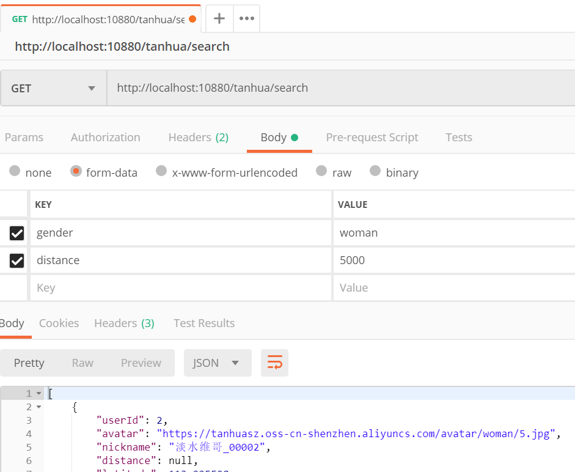


 app测试

 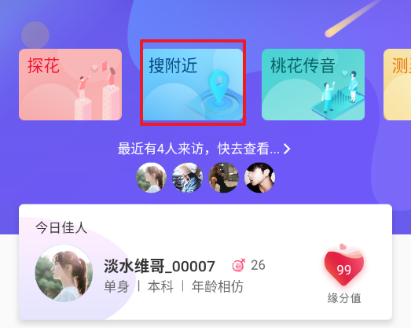

 

### 【小结】

掌握搜附近功能实现

# 总结

- 谁看过我
- 我的喜欢
  - 查询统计数据
  - 查询喜欢列表
  - 粉丝-喜欢
- 搜附近
  - 地址位置
  - 搜附近