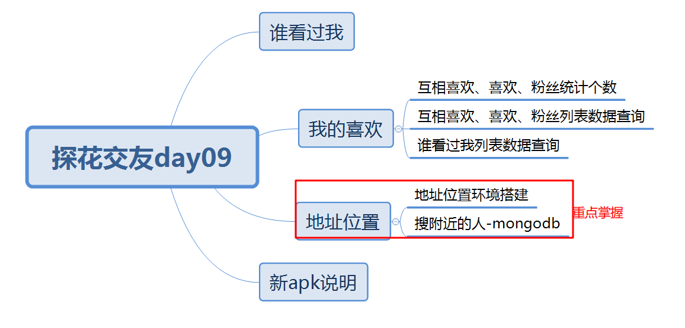
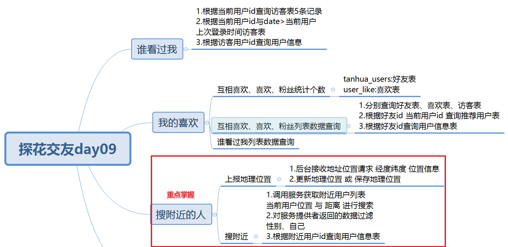

# 今日内容介绍

# 谁看过我

## 需求分析

首页谁看过我，如果是首次登录，查询最近来访5条记录（访客表）

非首次登录，从上次登录的时候  到 当前时间段 查询最近来访5条记录（访客表）

**访客表的数据如何产生的？**

看了用户的资料、动态、小视频等产生访客记录

## 数据库表

访客表：查询

userId:当前登录用户

visitorUserId:来访的用户id

from:首页圈子等

date:来访时间

score:得分（冗余了一个字段）

userInfo:查询

## 消费者编码分析

1. controller接收谁看过我请求 返回List<XXXVo>

2. controller调用service业务处理

   a.如果没有上次登录时间，根据当前登录用户id 查询访客记录（默认查询5条）

   b.如果有上次登录时间，根据当前登录用户id 与  date大于上次登录时间  查询访客记录（默认查询5条）

   c.根据visitorUserId:来访的用户id 查询userInfo

   d.封装Vo返回

## 服务提供者编码分析

1. 服务提供者：根据当前登录用户id 查询5条访客记录
2. 服务提供者：根据当前登录用户id 与date>上次登录时间 查询5条访客记录
3. 服务提供者：保存访客功能实现

## 测试

1. 为了方便测试，需要提供保存访客记录服务功能  （通过测试类造数据）
2. 注意lastTime调用服务提供者需要注意将string类型转为Long
3. db.getCollection("visitors").find({$and:[{userId:1},{date:{$gte:1625969071053}}]}).sort({"date":-1}).limit(5)

# 搜附近

## 上报地理位置

### 需求分析

app定时每隔5分钟，会发送定位请求，将位置保存表中

### 数据库表

地址位置表：保存 更新

userId:当前用户的id location:地址位置（经纬度）

### 消费者编码分析

1. controller接收请求longitude经度 latitude纬度 addrStr 位置描述

2. controller调用service业务处理

   a.调用服务提供者：保存地理位置（也可有能是更新）

### 服务提供者编码分析

1. 服务提供者：保存地理位置

   a.根据userId查询地理位置表，看记录是否存在

   b.如果不存在，保存地理位置

   c.如果存在，更新地理位置

### 测试

通过测试类方式验证代码正确性，实际需要通过app定时发送请求测试。

### 注意

GeoJsonPoint：没有实现序列化 （消费者调用服务提供者会序列化异常）

前端app发送地理位置坐标搞反了

## 搜附近

### 需求分析

首页-搜附近-选择性别 与 距离，搜索符合要求用户展示。

搜索的：不需要展示自己的（根据当前用户位置 + 条件）搜索   过滤性别符合要求的

### 数据库表

地理位置表：查询（查询自己的位置 + 距离 ）

优化：可以将地理位置表冗余一个字段：性别（提升搜索速度）

### 消费者编码分析

1. controller接收搜附近请求性别gender  距离distance (米)

2. controller调用service业务层

   a.调用搜附近服务方法 返回List<T>

   **b.将自己的用户id过滤     将性别不符合要求过滤**

   c.根据userId查询UserInfo

   d.封装VO返回

### 服务提供者编码分析

1. 服务提供者：调用搜附近服务方法

   **a.根据当前用户id查询当前用户位置**

   **b.根据当前用户位置 与 距离 通过Mongodb的API搜附近用户列表数据**

### 测试

# 总结

# 演讲

搜附近功能如何实现？

1.介绍表结构（性别加上）

2.上报地理位置

3.搜附近

# 作业

1. 访客记录功能实现---拦截器中实现（拦截后）
2. 互相喜欢、喜欢、粉丝统计思路功能分析
3. 互相喜欢、喜欢、粉丝分页查询思路功能分析
4. 粉丝-喜欢思路功能分析
5. 优化：地址位置表冗余一个字段：性别