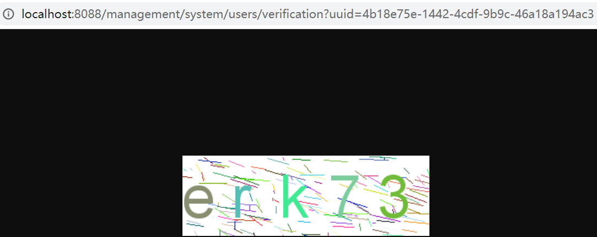
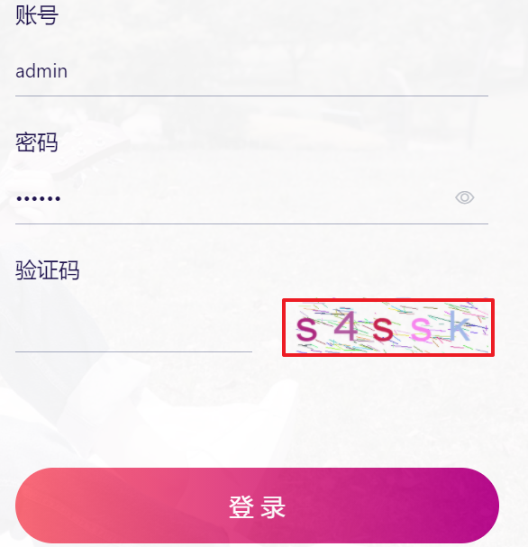
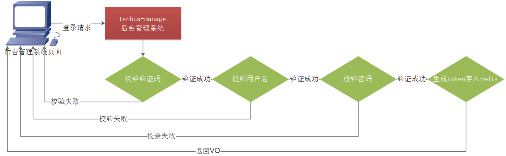
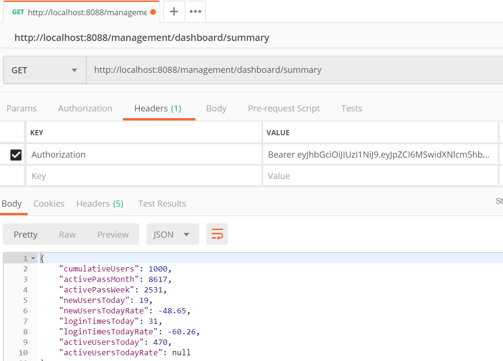
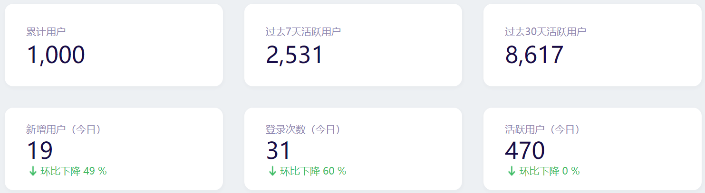
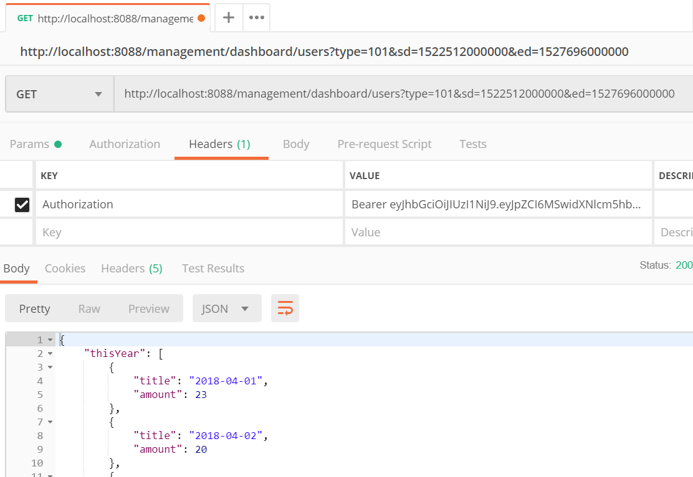
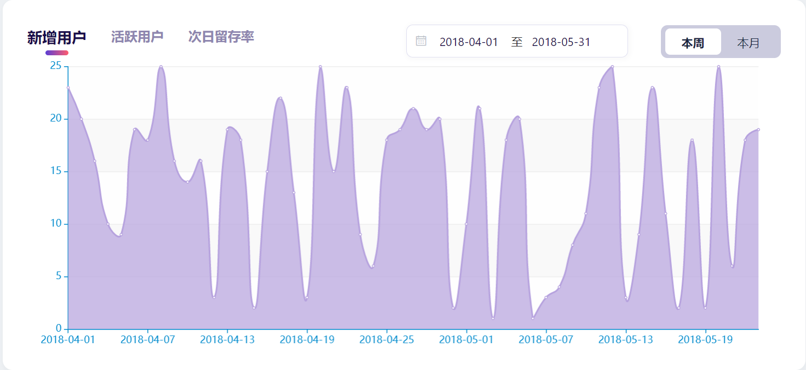

# 第10章 后台管理系统

# 学习目标

- 后台系统简介
- 搭建前端系统
- 实现登录功能
- 实现后台管理基本功能

# 1. 后台系统简介

### 【目标】

了解后台系统简介

### 【路径】

1：了解后台系统功能

2：掌握前端系统搭建

3：了解后台API文档

### 【讲解】

探花交友APP建立的后台管理系统，目的是完成探花交友项目的业务闭环，主要功能包括：用户管理、动态管理、审核管理已经系统管理。

## 1.1. 功能说明


课程中实现的功能有：登录、首页、用户管理、动态审核。

## 1.2. 搭建前端系统

后台系统也是采用前后端分离的方式，前端采用Vue.js实现，关于前端系统我们不进行实现，拿来直接使用。


### 1.2.1. nginx安装

将资料中提供的nginx解压到没有中文没有空格的目录下


其中html目录中为，vue编译后的所有页面。

### 1.2.2. 配置

修改Nginx的`/conf/nginx.conf`配置文件：

~~~shell
    server {
        listen       8088;  #请求端口
        server_name  localhost;

        #charset koi8-r;

        #access_log  logs/host.access.log  main;
		

		location / {
            root   html;
            index  index.html index.htm;
        }
		
		location  /management {
			proxy_pass http://127.0.0.1:18083/;  #转发后台tanhua-manager地址
		}
		#....略
	}
~~~

### 1.2.3. 测试

双击`nginx.exe`,待启动完成后访问：http://127.0.0.1:8088即可访问后台项目

## 1.3. 后台的API文档

登陆：http://192.168.137.160:3000/

**（1） 在yapi中创建新项目**


**（2） 导入API文档数据**


### 【小结】

了解后台系统简介

# 2. 环境搭建

### 【目标】

了解后台系统环境搭建

### 【路径】

1：后台系统环境搭建

### 【讲解】

## 2.1. 创建tanhua-manage

> **1、pom.xml添加依赖**

~~~xml
    <dependencies>

        <dependency>
            <groupId>org.springframework.boot</groupId>
            <artifactId>spring-boot-starter-web</artifactId>
        </dependency>

        <!--SpringDataRedis依赖-->
        <dependency>
            <groupId>org.springframework.boot</groupId>
            <artifactId>spring-boot-starter-data-redis</artifactId>
        </dependency>

        <!--lombok依赖-->
        <dependency>
            <groupId>org.projectlombok</groupId>
            <artifactId>lombok</artifactId>
        </dependency>

        <!--工具包-->
        <dependency>
            <groupId>org.apache.commons</groupId>
            <artifactId>commons-lang3</artifactId>
        </dependency>
        <dependency>
            <groupId>com.fasterxml.jackson.core</groupId>
            <artifactId>jackson-databind</artifactId>
        </dependency>
        <dependency>
            <groupId>commons-codec</groupId>
            <artifactId>commons-codec</artifactId>
        </dependency>
        <dependency>
            <groupId>joda-time</groupId>
            <artifactId>joda-time</artifactId>
        </dependency>

        <!--jwt依赖-->
        <dependency>
            <groupId>io.jsonwebtoken</groupId>
            <artifactId>jjwt</artifactId>
            <version>0.9.1</version>
        </dependency>

        <!--fastdfs文件存储-->
        <dependency>
            <groupId>com.github.tobato</groupId>
            <artifactId>fastdfs-client</artifactId>
            <version>1.26.7</version>
            <exclusions>
                <exclusion>
                    <groupId>ch.qos.logback</groupId>
                    <artifactId>logback-classic</artifactId>
                </exclusion>
            </exclusions>
        </dependency>


        <!--dubbo的起步依赖-->
        <dependency>
            <groupId>org.apache.dubbo</groupId>
            <artifactId>dubbo-spring-boot-starter</artifactId>
            <version>2.7.5</version>
        </dependency>

        <!-- zookeeper的api管理依赖 -->
        <dependency>
            <groupId>org.apache.curator</groupId>
            <artifactId>curator-recipes</artifactId>
            <version>4.2.0</version>
        </dependency>

        <!-- zookeeper依赖 -->
        <dependency>
            <groupId>org.apache.zookeeper</groupId>
            <artifactId>zookeeper</artifactId>
            <version>3.4.12</version>
        </dependency>

        <dependency>
            <groupId>cn.hutool</groupId>
            <artifactId>hutool-all</artifactId>
            <version>5.4.3</version>
        </dependency>

        <dependency>
            <groupId>com.baomidou</groupId>
            <artifactId>mybatis-plus</artifactId>
        </dependency>
        <dependency>
            <groupId>com.baomidou</groupId>
            <artifactId>mybatis-plus-boot-starter</artifactId>
            <version>${mybatis.mybatis-plus}</version>
        </dependency>
        <dependency>
            <groupId>mysql</groupId>
            <artifactId>mysql-connector-java</artifactId>
        </dependency>
        
        <dependency>
            <groupId>cn.itcast</groupId>
            <artifactId>tanhua-dubbo-interface</artifactId>
            <version>1.0-SNAPSHOT</version>
        </dependency>

        <dependency>
            <groupId>cn.itcast</groupId>
            <artifactId>tanhua-commons</artifactId>
            <version>1.0-SNAPSHOT</version>
        </dependency>
    </dependencies>
~~~

## 2.2. application.yml

~~~yml
server:
  port: 18083

#配置redis
spring:
  datasource:
    driver-class-name: com.mysql.jdbc.Driver
    url: jdbc:mysql://127.0.0.1:3306/tanhua-manager?useUnicode=true&characterEncoding=utf8&autoReconnect=true&allowMultiQueries=true&useSSL=false
    username: root
    password: root
  redis:
    host: 192.168.136.160
    port: 6379
dubbo:
  application:
    name: tanhua-manage
  registry:
    address: zookeeper://192.168.136.160:2181
  consumer:
    check: false
#配置短信平台信息
tanhua:
  secret: 76bd425b6f29f7fcc2e0bfc286043df1
  #替换成自己的 oss存储信息
  sms:
    validateCodeTemplateCode: SMS_204661533
    signName: 传智
    parameterName: code
    accessKeyId: LTAI4FynsGS7V2bPJqQqrzhH
    accessKeySecret: c9fMcE7W8njMFNLJNJQT2vn5A0J1ey
  oss:
    endpoint: http://oss-cn-shenzhen.aliyuncs.com
    bucketName: tanhua
    url: https://tanhua.oss-cn-shenzhen.aliyuncs.com
    accessKeyId: LTVI4FynsGS7V2bPJqQqrzhH
    accessKeySecret: c9fDE7W8njMFNLJNJQT2vn5A0J1ey
  face:
    appId: 22837663
    apiKey: nA43galrxfUZTGtYRVK8F8tb
    secretKey: MQp567q4nGnIKfniURa2XAw8bT1SlPE3
  huanxin:
    url: http://a1.easemob.com/
    orgName: 1112190901181842
    appName: tanhua
    clientId: YXA6VggstiTmSSi_dWvqeoCg
    clientSecret: YXAvRviM513TuJLAeFTtef9Th4wo
#mybaits-plus
mybatis-plus:
  global-config:
    db-config:
      table-prefix: tb_    #数据库表前缀
      id-type: auto        #数据库表主键的策略

~~~

## 2.3. 启动类

```java
package com.tanhua.manage;

import org.springframework.boot.SpringApplication;
import org.springframework.boot.autoconfigure.SpringBootApplication;
import org.springframework.boot.autoconfigure.data.mongo.MongoDataAutoConfiguration;
import org.springframework.boot.autoconfigure.mongo.MongoAutoConfiguration;
import org.springframework.cache.annotation.EnableCaching;


@SpringBootApplication(exclude = {MongoAutoConfiguration.class, MongoDataAutoConfiguration.class})
public class ManagerServerApplication {

    public static void main(String[] args) {
        SpringApplication.run(ManagerServerApplication.class,args);
    }
}
```

## 2.4. 创建数据库


## 2.5. 基础代码

将今日资料中的基础代码，拷贝到工程中


将资料中exception统一异常处理代码和Interceptor拦截器代码copy到工程合适位置

### 【小结】

了解后台系统环境搭建

# 3. 登录

### 【目标】

掌握登录退出功能实现

### 【路径】

1：验证码功能实现

2：登录功能实现

3：用户基础信息实现

4：退出功能实现

### 【讲解】

后台系统的登录模块独立于APP端的登录。

表结构：

~~~sql
CREATE TABLE `tb_admin` (
  `id` bigint(20) NOT NULL AUTO_INCREMENT COMMENT 'id',
  `username` varchar(255) NOT NULL COMMENT '账号',
  `password` varchar(255) NOT NULL COMMENT '密码',
  `avatar` varchar(255) DEFAULT NULL COMMENT '头像',
  `created` datetime NOT NULL COMMENT '创建时间',
  `updated` datetime NOT NULL COMMENT '更新时间',
  PRIMARY KEY (`id`) USING BTREE,
  KEY `username` (`username`) USING BTREE
) ENGINE=InnoDB AUTO_INCREMENT=3 DEFAULT CHARSET=utf8 COMMENT='后台管理员表';

INSERT INTO `tb_admin` (`id`, `username`, `password`, `avatar`, `created`, `updated`) VALUES ('1', 'admin', 'e10adc3949ba59abbe56e057f20f883e', NULL, '2020-09-07 17:55:28', '2020-09-07 17:55:28');
~~~

## 3.1. 验证码

### 3.1.1. 接口说明


### 3.1.2. AdminController

~~~java
package com.tanhua.manage.controller;

import cn.hutool.captcha.CaptchaUtil;
import cn.hutool.captcha.LineCaptcha;
import com.tanhua.manage.service.AdminService;
import lombok.extern.slf4j.Slf4j;
import org.springframework.beans.factory.annotation.Autowired;
import org.springframework.web.bind.annotation.GetMapping;
import org.springframework.web.bind.annotation.RequestMapping;
import org.springframework.web.bind.annotation.RestController;

import javax.servlet.http.HttpServletRequest;
import javax.servlet.http.HttpServletResponse;
import java.io.IOException;

@RestController
@RequestMapping("/system/users")
@Slf4j
public class AdminController {

    @Autowired
    private AdminService adminService;

    /**
     * 后台登陆时 图片验证码 生成
     */
    @GetMapping("/verification")
    public void showValidateCodePic(String uuid,HttpServletRequest req, HttpServletResponse res){
        res.setDateHeader("Expires",0);
        res.setHeader("Cache-Control", "no-store, no-cache, must-revalidate");
        res.addHeader("Cache-Control", "post-check=0, pre-check=0");
        // Set standard HTTP/1.0 no-cache header.
        res.setHeader("Pragma", "no-cache");
        res.setContentType("image/jpeg");
        LineCaptcha lineCaptcha = CaptchaUtil.createLineCaptcha(299, 97);
        String code = lineCaptcha.getCode();
        log.debug("uuid={},code={}",uuid,code);
        adminService.saveCode(uuid,code);
        try {
            lineCaptcha.write(res.getOutputStream());
        } catch (IOException e) {
            e.printStackTrace();
        }
    }
}

~~~

### 3.1.3. AdminService

```java
package com.tanhua.manage.service;

import com.baomidou.mybatisplus.extension.service.impl.ServiceImpl;
import com.tanhua.manage.domain.Admin;
import com.tanhua.manage.mapper.AdminMapper;
import lombok.extern.slf4j.Slf4j;
import org.springframework.beans.factory.annotation.Autowired;
import org.springframework.data.redis.core.RedisTemplate;
import org.springframework.stereotype.Service;

import java.time.Duration;

@Service
@Slf4j
public class AdminService extends ServiceImpl<AdminMapper, Admin> {

    private static final String CACHE_KEY_CAP_PREFIX = "MANAGE_CAP_";

    @Autowired
    private RedisTemplate redisTemplate;

    /**
     * 保存生成的验证码
     * @param uuid
     * @param code
     */
    public void saveCode(String uuid, String code) {
        String key = CACHE_KEY_CAP_PREFIX + uuid;
        // 缓存验证码，10分钟后失效
        redisTemplate.opsForValue().set(key,code, Duration.ofMinutes(10));
    }
}

```

### 3.1.4. 测试

地址：http://localhost:8088/management/system/users/verification



地址：http://localhost:8088/

 

## 3.2. 登录



### 3.2.1. 接口说明


### 3.2.3. AdminController

~~~java
   /**
     * 用户登录
     *  POST  /login
     *  参数：
     *
     */
    @PostMapping("/login")
    public ResponseEntity login(@RequestBody Map<String,String> map) {
        return adminService.login(map);
    }
~~~

### 3.2.3. AdminService

```java
    @Autowired
    private JwtUtils jwtUtils;
    /**
     * 登录
     *  username password verificationCode uuid
     */
    public ResponseEntity login(Map<String, String> map) {
        String username= map.get("username");
        String password= map.get("password");
        String verificationCode= map.get("verificationCode");
        String uuid= map.get("uuid");

        if(StringUtils.isEmpty(username) || StringUtils.isEmpty(password)) {
            throw  new BusinessException("用户名或者密码为空");
        }

        if(StringUtils.isEmpty(verificationCode) || StringUtils.isEmpty(uuid)) {
            throw  new BusinessException("验证码为空");
        }

        //1、获取redis中的验证码并比较
        String key = CACHE_KEY_CAP_PREFIX + uuid;
        String value = (String)redisTemplate.opsForValue().get(key);
        if (StringUtils.isEmpty(value) || !value.equals(verificationCode)) {
            throw  new BusinessException("验证码校验失败");
        }

        redisTemplate.delete(key);
        //2、通过用户名查询登录的Admin对象，比较
        Admin admin = query().eq("username", username).one();
        if(admin == null) {
            throw  new BusinessException("用户名错误");
        }

        //3、判断对象中的密码和输入密码是否一致
        if(!admin.getPassword().equals(SecureUtil.md5(password))) {
            throw  new BusinessException("密码错误");
        }

        //4、生成token
        String token = jwtUtils.createJWT(admin.getUsername(), admin.getId());
        //5、将用户对象存入redis中
        String adminStr = JSON.toJSONString(admin);
        redisTemplate.opsForValue().set(CACHE_KEY_TOKEN_PREFIX+token, adminStr,Duration.ofHours(1));

        //6、构造返回值
        Map result = new HashMap();
        result.put("token",token);
        return ResponseEntity.ok(result);
    }
```

## 3.3. 用户基本信息

### 3.3.1. 接口说明


### 3.3.2. AdminController

~~~java
   /**
     * 获取当前登录用户的详情：
     *  POST    /profile
     *  在请求头中包含一个 Authorization 数据(token元素)
     *     Bearer token
     *  返回AdminVo
     */
    @PostMapping("/profile")
    public ResponseEntity profile() {
        Admin admin = AdminHolder.getAdmin();
        AdminVo vo = new AdminVo();
        BeanUtils.copyProperties(admin, vo);
        return ResponseEntity.ok(vo);
    }
~~~

## 3.4. 退出

### 3.4.1. 接口说明


### 3.4.2. AdminController

~~~java
   /**
     * 退出登录
     *  POST  /logout
     */
    @PostMapping("/logout")
    public ResponseEntity logout(@RequestHeader("Authorization") String token) {
        token = token.replace("Bearer ", "");
        return adminService.logout(token);
    }
~~~

### 3.4.3. AdminService

```java
//退出登录
public ResponseEntity logout(String token) {
    String key = CACHE_KEY_TOKEN_PREFIX+token;
    redisTemplate.delete(key);
    return ResponseEntity.ok(null);
}
```

### 【小结】

掌握登录退出功能实现

# 4. 首页

### 【目标】

掌握概要统计信息功能实现

### 【路径】

1：概要统计信息功能分析

2：概要统计信息功能实现

### 【讲解】


在首页中，显示各种的数据，比如：累计用户数、新增用户数、登录次数等内容。这些数据是需要基于用户的操作来进行统计的，所以需要建立tb_log表来记录用户的操作。

基于log表的数据进行计算，将计算的结果保存到tb_analysis_by_day表中。

## 4.1. 表结构

~~~sql
CREATE TABLE `tb_log` (
  `id` bigint(20) NOT NULL AUTO_INCREMENT,
  `user_id` bigint(20) NOT NULL COMMENT '用户id',
  `type` varchar(255) NOT NULL COMMENT '操作类型,\r\n01为登录，0201为发动态，0202为浏览动态，0203为动态点赞，0204为动态喜欢，0205为评论，0206为动态取消点赞，0207为动态取消喜欢，0301为发小视频，0302为小视频点赞，0303为小视频取消点赞，0304为小视频评论',
  `log_time` varchar(10) DEFAULT NULL COMMENT '操作日期',
  `place` varchar(255) DEFAULT NULL COMMENT '操作地点',
  `equipment` varchar(255) DEFAULT NULL COMMENT '操作设备',
  `created` datetime DEFAULT NULL COMMENT '创建时间',
  `updated` datetime DEFAULT NULL COMMENT '更新时间',
  PRIMARY KEY (`id`) USING BTREE,
  KEY `time_type_user` (`log_time`,`type`,`user_id`) USING BTREE
) ENGINE=InnoDB AUTO_INCREMENT=152668 DEFAULT CHARSET=utf8 COMMENT='用户日志表';


CREATE TABLE `tb_analysis_by_day` (
  `id` bigint(20) NOT NULL AUTO_INCREMENT,
  `record_date` date NOT NULL COMMENT '日期',
  `num_registered` int(8) NOT NULL DEFAULT '0' COMMENT '新注册用户数',
  `num_active` int(8) NOT NULL DEFAULT '0' COMMENT '活跃用户数',
  `num_login` int(8) NOT NULL DEFAULT '0' COMMENT '登陆次数',
  `num_retention1d` int(8) NOT NULL DEFAULT '0' COMMENT '次日留存用户数',
  `created` datetime NOT NULL COMMENT '创建时间',
  `updated` datetime NOT NULL COMMENT '更新时间',
  PRIMARY KEY (`id`) USING BTREE,
  KEY `record_date` (`record_date`) USING BTREE
) ENGINE=InnoDB AUTO_INCREMENT=1001 DEFAULT CHARSET=utf8;

~~~

## 4.2. 概要统计信息

### 4.2.1. 接口说明


返回数据：

| 名称                     | 类型    | 是否必须 | 默认值 | 备注                                               | 其他信息                     |
| :----------------------- | :------ | :------- | :----- | :------------------------------------------------- | :--------------------------- |
| cumulativeUsers          | integer | 必须     |        | 累计用户                                           | **最大值:** 500**最小值:** 0 |
| activePassMonth          | integer | 必须     |        | 过去30天活跃用户                                   | **最大值:** 500**最小值:** 0 |
| activePassWeek           | integer | 必须     |        | 过去7天活跃用户                                    | **最大值:** 500**最小值:** 0 |
| newUsersToday            | integer | 必须     |        | 今日新增用户                                       | **最大值:** 500**最小值:** 0 |
| newUsersTodayRate        | integer | 必须     |        | 今日新增用户涨跌率，单位百分数，正数为涨，负数为跌 |                              |
| loginTimesToday          | integer | 必须     |        | 今日登录次数                                       | **最大值:** 500**最小值:** 0 |
| loginTimesTodayRate      | integer | 必须     |        | 今日登录次数涨跌率，单位百分数，正数为涨，负数为跌 |                              |
| activeUsersToday         | integer | 必须     |        | 今日活跃用户                                       | **最大值:** 500**最小值:** 0 |
| activeUsersTodayRate     | integer | 必须     |        | 今日活跃用户涨跌率，单位百分数，正数为涨，负数为跌 |                              |
| useTimePassWeek          | integer | 必须     |        | 过去7天平均日使用时长，单位秒                      |                              |
| activeUsersYesterday     | integer | 必须     |        | 昨日活跃用户                                       |                              |
| activeUsersYesterdayRate | integer | 必须     |        | 昨日活跃用户涨跌率，单位百分数，正数为涨，负数为跌 |                              |

### 4.2.2. AnalysisController

```java
package com.tanhua.manage.controller;

import cn.hutool.core.date.DateTime;
import cn.hutool.core.date.DateUtil;
import com.tanhua.manage.service.AnalysisService;
import com.tanhua.manage.utils.ComputeUtil;
import com.tanhua.manage.vo.AnalysisSummaryVo;
import org.springframework.beans.factory.annotation.Autowired;
import org.springframework.web.bind.annotation.GetMapping;
import org.springframework.web.bind.annotation.RestController;

@RestController
public class AnalysisController {

    @Autowired
    private AnalysisService analysisService;

    /**
     * 概要统计信息
     */
    @GetMapping("/dashboard/summary")
    public AnalysisSummaryVo getSummary() {

        AnalysisSummaryVo analysisSummaryVo = new AnalysisSummaryVo();

        DateTime dateTime = DateUtil.parseDate("2020-09-08");

        //累计用户数
        analysisSummaryVo.setCumulativeUsers(analysisService.queryNumRegistered());

        //过去30天活跃用户
        analysisSummaryVo.setActivePassMonth(analysisService.queryActiveUserCount(dateTime, -30));

        //过去7天活跃用户
        analysisSummaryVo.setActivePassWeek(analysisService.queryActiveUserCount(dateTime, -7));

        //今日活跃用户
        analysisSummaryVo.setActiveUsersToday(analysisService.queryActiveUserCount(dateTime, 0));


        //今日新增用户
        analysisSummaryVo.setNewUsersToday(analysisService.queryRegisterUserCount(dateTime, 0));

        //今日新增用户涨跌率，单位百分数，正数为涨，负数为跌
        analysisSummaryVo.setNewUsersTodayRate(ComputeUtil.computeRate(
                analysisSummaryVo.getNewUsersToday(),
                analysisService.queryRegisterUserCount(dateTime, -1)
        ));

        //今日登录次数
        analysisSummaryVo.setLoginTimesToday(analysisService.queryLoginUserCount(dateTime, 0));

        //今日登录次数涨跌率，单位百分数，正数为涨，负数为跌
        analysisSummaryVo.setLoginTimesTodayRate(ComputeUtil.computeRate(
                analysisSummaryVo.getLoginTimesToday(),
                analysisService.queryLoginUserCount(dateTime, -1)
        ));
        return analysisSummaryVo;

    }
}
```

### 4.2.3. AnalysisService

```java
package com.tanhua.manage.service;

import cn.hutool.core.date.DateTime;
import cn.hutool.core.date.DateUtil;
import com.baomidou.mybatisplus.core.toolkit.Wrappers;
import com.baomidou.mybatisplus.extension.service.impl.ServiceImpl;
import com.tanhua.manage.domain.AnalysisByDay;
import com.tanhua.manage.mapper.AnalysisByDayMapper;
import org.springframework.stereotype.Service;

@Service
public class AnalysisService extends ServiceImpl<AnalysisByDayMapper, AnalysisByDay> {

    /**
     * 累计用户数
     * @return
     */
    public Long queryNumRegistered(){
        AnalysisByDay analysisByDay = getOne(Wrappers.<AnalysisByDay>query().select("SUM(num_registered) as numRegistered"));
        return Long.valueOf(analysisByDay.getNumRegistered());
    }
    
    /**
     * 查询活跃用户的数量
     */
    public Long queryActiveUserCount(DateTime today, int offset) {
        return this.queryUserCount(today, offset, "num_active");
    }

    /**
     * 查询注册用户的数量
     */
    public Long queryRegisterUserCount(DateTime today, int offset) {
        return this.queryUserCount(today, offset, "num_registered");
    }

    /**
     * 查询登录用户的数量
     */
    public Long queryLoginUserCount(DateTime today, int offset) {
        return this.queryUserCount(today, offset, "num_login");
    }

    private Long queryUserCount(DateTime today, int offset, String column){
        AnalysisByDay analysisByDay = super.getOne(Wrappers.<AnalysisByDay>query()
                .select("SUM("+column+") AS num_active")
                .le("record_date", today.toDateStr())
                .ge("record_date", DateUtil.offsetDay(today, offset).toDateStr())
        );
        return Long.valueOf(analysisByDay.getNumActive());
    }
}
```

### 4.2.5. 测试

postman测试



页面效果



## 4.4. 新增、活跃用户、次日留存率-作业

### 4.4.1. 接口说明


返回数据：

| 名称     | 类型      | 是否必须 | 默认值 | 备注 | 其他信息                                                     |
| :------- | :-------- | :------- | :----- | :--- | :----------------------------------------------------------- |
| thisYear | object [] | 必须     |        | 本年 | **最小数量:** 12**元素是否都不同:** true**最大数量:** 12**item 类型:** object |
| title    | string    | 必须     |        | 日期 | **枚举:** 1,2,3,4,5,6,7,8,9,10,11,12                         |
| amount   | integer   | 必须     |        | 数量 | **最大值:** 9999**最小值:** 50                               |
| lastYear | object [] | 必须     |        | 去年 | **最小数量:** 12**元素是否都不同:** true**最大数量:** 12**item 类型:** object |
| title    | string    | 必须     |        | 日期 | **枚举:** 1,2,3,4,5,6,7,8,9,10,11,12                         |
| amount   | integer   | 必须     |        | 数量 | **最大值:** 9999**最小值:** 50                               |

### 4.4.2. AnalysisController

```java
  @GetMapping("/dashboard/users")
    public AnalysisUsersVo getUsers(@RequestParam(name = "sd") Long sd
            , @RequestParam("ed") Long ed
            , @RequestParam("type") Integer type) {
        return this.analysisService.queryAnalysisUsersVo(sd, ed, type);
    }
```

### 4.4.3. AnalysisService

```java
 /**
     * 新增、活跃用户、次日留存率
     */
    public AnalysisUsersVo queryAnalysisUsersVo(Long sd, Long ed, Integer type) {

        DateTime startDate = DateUtil.date(sd);

        DateTime endDate = DateUtil.date(ed);

        AnalysisUsersVo analysisUsersVo = new AnalysisUsersVo();

        //今年数据
        analysisUsersVo.setThisYear(this.queryDataPointVos(startDate, endDate, type));
        //去年数据
        analysisUsersVo.setLastYear(this.queryDataPointVos(
                DateUtil.offset(startDate, DateField.YEAR, -1),
                DateUtil.offset(endDate, DateField.YEAR, -1), type)
        );

        return analysisUsersVo;
    }

    private List<DataPointVo> queryDataPointVos(DateTime sd, DateTime ed, Integer type) {

        String startDate = sd.toDateStr();

        String endDate = ed.toDateStr();

        String column = null;
        switch (type) { //101 新增 102 活跃用户 103 次日留存率
            case 101:
                column = "num_registered";
                break;
            case 102:
                column = "num_active";
                break;
            case 103:
                column = "num_retention1d";
                break;
            default:
                column = "num_active";
                break;
        }

        List<AnalysisByDay> analysisByDayList = super.list(Wrappers.<AnalysisByDay>query()
                .select("record_date , " + column + " as num_active")
                .ge("record_date", startDate)
                .le("record_date", endDate));

        return analysisByDayList.stream()
                .map(analysisByDay -> new DataPointVo(DateUtil.date(analysisByDay.getRecordDate()).toDateStr(), analysisByDay.getNumActive().longValue()))
                .collect(Collectors.toList());
    }
```

### 4.4.4. 测试

postman测试



页面效果



### 【小结】

掌握概要统计信息功能实现

# 总结

- 后台管理系统简介
- 后台管理系统环境搭建
- 后台管理系统
  - 登录退出
  - 概要统计信息