# 第11章 用户管理与RocketMQ

# 学习目标

- 掌握用户管理功能实现
- 了解RocketMQ的概念模型
- 了解RocketMQ提供的消息投递方式
- 掌握SpringBoot整合RocketMQ
- 基于RocketMQ实现异步推送消息


# 1. RocketMQ概念与安装

### 【目标】

了解RocketMQ概念与安装

### 【路径】

1：了解RocketMQ概念

2：RocketMQ概念模型

3：RocketMQ下载与安装

### 【讲解】

## 1.1. 了解RocketMQ概念

### 1.1.1. 消息中间件

​	消息中间件利用高效可靠的消息传递机制进行平台无关的数据交流，并基于数据通信来进行[分布式系统](https://baike.baidu.com/item/%E5%88%86%E5%B8%83%E5%BC%8F%E7%B3%BB%E7%BB%9F)的集成。通过提供消息传递和消息排队模型，它可以在分布式环境下扩展进程间的通信。对于消息中间件，常见的角色大致也就有Producer（生产者）、Consumer（消费者），broker（中间件）

### 1.1.2. 常见的消息中间件产品

#### ① RocketMQ

​	阿里旗下开源的一款分布式、队列模型的消息中间件，原名Metaq，3.0版本名称改为RocketMQ，是阿里参照kafka设计思想使用java-JMS实现的一套mq。同时将阿里系内部多款mq产品（Notify、metaq）进行整合，只维护核心功能，去除了所有其他运行时依赖，保证核心功能最简化，在此基础上配合阿里上述其他开源产品实现不同场景下mq的架构，目前主要多用于订单交易系统。

具有以下特点：

- 能够保证严格的消息顺序
- 提供针对消息的过滤功能
- 提供丰富的消息拉取模式
- 高效的订阅者水平扩展能力
- 实时的消息订阅机制
- 亿级消息堆积能力

#### ② ActiveMQ

ActiveMQ 是Apache出品，最流行的，能力强劲的开源消息总线。ActiveMQ 是一个完全支持JMS1.1和J2EE 1.4规范的 JMS Provider实现。

#### ③ RabbitMQ

AMQP协议的领导实现，支持多种场景。

#### ④ ZeroMQ

史上最快的消息队列系统

#### ⑤ Kafka

Apache下的一个子项目 。特点：高吞吐，在一台普通的服务器上既可以达到10W/s的吞吐速率；完全的分布式系统。适合处理海量数据。

## 1.2. RocketMQ概念模型

### 1.2.1. RocketMQ架构

RocketMQ作为一款纯java、分布式、队列模型的开源消息中间件，支持事务消息、顺序消息、批量消息、定时消息、消息回溯等。RocketMQ由阿里巴巴开源。

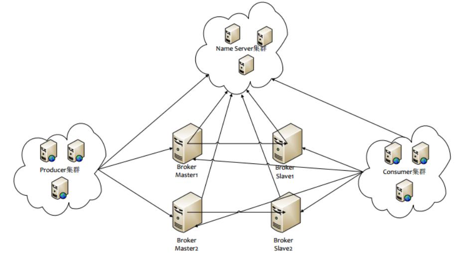

如图所示为RocketMQ基本的部署结构，主要分为NameServer集群、Broker集群、Producer集群和Consumer集群四个部分。 

**大致流程**：
Broker在启动的时候会去向NameServer注册并且定时发送心跳，Producer在启动的时候会到NameServer上去拉取Topic所属的Broker具体地址，然后向具体的Broker发送消息

为了消除单点故障，增加可靠性或增大吞吐量，可以在多台机器上部署多个nameserver和broker，并且为每个broker部署1个或多个slave

### 1.2.2. 相关概念

**NameServer**

NameServer的作用是Broker的注册中心。

**每个NameServer节点互相之间是独立的，没有任何信息交互**，也就不存在任何的选主或者主从切换之类的问题，因此NameServer是很轻量级的。单个NameServer节点中存储了活跃的Broker列表（包括master和slave），这里活跃的定义是与NameServer保持有心跳。

**Topic、Tag、Queue、GroupName**

Topic 与 Tag 都是业务上用来归类的标识，区分在于 Topic 是一级分类，而 Tag 可以理解为是二级分类

**Topic**

是生产者在发送消息和消费者在拉取消息的类别。Topic与生产者和消费者之间的关系非常松散。一个生产者可以发送不同类型Topic的消息。消费者组可以订阅一个或多个主题，只要该组的实例保持其订阅一致即可。

​    Topic翻译为**话题**。我们可以理解为第一级消息类型，比如一个电商系统的消息可以分为：交易消息、物流消息等，一条消息必须有一个Topic。

**Tag**

标签，意思就是子主题，为用户提供了额外的灵活性。有了标签，方便RocketMQ提供的查询功能。

可以理解为第二级消息类型，交易创建消息，交易完成消息..... 一条消息可以没有Tag

**Queue**

一个topic下，可以设置多个queue(消息队列)，默认4个队列。当我们发送消息时，需要要指定该消息的topic。

RocketMQ会轮询该topic下的所有队列，将消息发送出去。

在 RocketMQ 中，所有消息队列都是持久化，长度无限的数据结构，所谓长度无限是指队列中的每个存储单元都是定长，访问其中的存储单元使用 Offset 来访问，offset 为 java long 类型，64 位，理论上在 100年内不会溢出，所以认为是长度无限。

也可以认为 Message Queue 是一个长度无限的数组，Offset 就是下标。

**groupName**

RocketMQ中也有组的概念。代表具有相同角色的生产者组合或消费者组合，称为生产者组或消费者组。

作用是在集群HA的情况下，一个生产者down之后，本地事务回滚后，可以继续联系该组下的另外一个生产者实例，不至于导致业务走不下去。在消费者组中，可以实现消息消费的负载均衡和消息容错目标。

有了GroupName，在集群下，动态扩展容量很方便。只需要在新加的机器中，配置相同的GroupName。启动后，就立即能加入到所在的群组中，参与消息生产或消费。

**Broker-存放消息**

Broker是具体提供业务的服务器，单个Broker节点与所有的NameServer节点保持长连接及心跳，定时(每隔30s)注册Topic信息到所有Name Server。Name Server定时(每隔10s)扫描所有存活broker的连接，如果Name Server超过2分钟没有收到心跳，则Name Server断开与Broker的连接。底层的通信和连接都是基于Netty实现的。

负载均衡：Broker上存Topic信息，Topic由多个队列组成，队列会平均分散在多个Broker上，会自动轮询当前所有可发送的broker ，尽量平均分布到所有队列中，最终效果就是所有消息都平均落在每个Broker上

高可用：Broker中分**master**和**slave**两种角色，每个master可以对应多个slave，但一个slave只能对应一个master，master和slave通过指定相同的Brokername组成，其中不同的BrokerId==0 是master，非0是slave。

高可靠并发读写服务：master和slave之间的同步方式分为同步双写和异步复制，异步复制方式master和slave之间虽然会存在少量的延迟，但性能较同步双写方式要高出10%左右。

Topic、Broker、queue

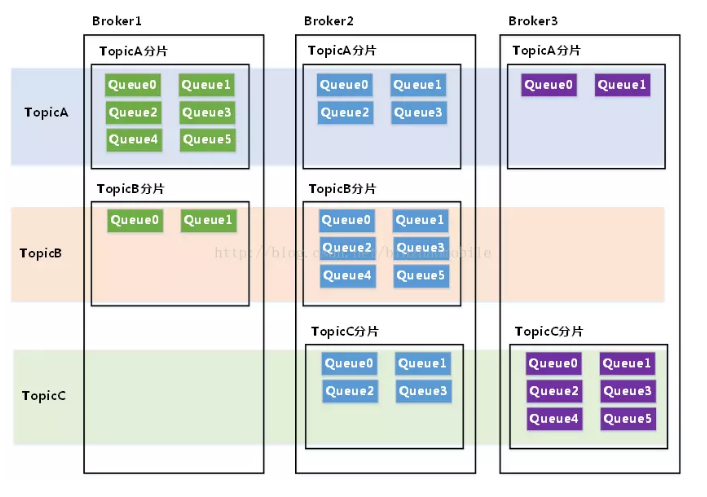

**Producer-生产消息**

* 与nameserver的关系

  单个Producer和一台NameServer节点(随机选择)保持长连接，定时查询topic配置信息，如果该NameServer挂掉，生产者会自动连接下一个NameServer，直到有可用连接为止，并能自动重连。与NameServer之间没有心跳。

* 与broker的关系

  单个Producer和与其关联的所有broker保持长连接，并维持心跳。默认情况下消息发送采用轮询方式，会均匀发到对应Topic的所有queue中。

Consumer-消费消息

* 与nameserver的关系

  单个Consumer和一台NameServer保持**长连接**，定时查询topic配置信息，如果该NameServer挂掉，消费者会自动连接下一个NameServer，直到有可用连接为止，并能自动重连。与NameServer之间没有心跳。

* 与broker的关系

  单个Consumer和与其关联的所有broker保持**长连接**，并维持心跳，失去心跳后，则关闭连接，并向该消费者分组的所有消费者发出通知，分组内消费者重新分配队列继续消费。

##### 消费者类型

###### pull consume

Consumer 的一种，应用通常主动调用 Consumer 的拉消息方法从 Broker 拉消息，主动权由应用控制

###### push consume

Consumer 的一种，应用通常通过 Consumer 对象注册一个 Listener 接口，一旦收到消息，Consumer 对象立刻回调 Listener 接口方法，类似于activemq的方式

### 1.2.3. RocketMQ的特性

**消费模式**

* **集群模式：**在默认情况下，就是集群消费，此时消息发出去后将只有一个消费者能获取消息。

* **广播模式**：一条消息被多个Consumer消费。消息会发给Consume Group中的每一个消费者进行消费。

##### 消息顺序

消息的顺序指的是消息消费时，能按照发送的顺序来消费。

RocketMQ是通过将“相同ID的消息发送到同一个队列，而一个队列的消息只由一个消费者处理“来实现顺序消息

##### 消息重复

###### 消息重复的原因

消息领域有一个对消息投递的QoS（服务质量）定义，分为：最多一次（At most once）、至少一次（At least once）、仅一次（ Exactly once）。

MQ产品都声称自己做到了At least once。既然是至少一次，就有可能发生消息重复。

有很多原因导致，比如：网络原因闪断，ACK返回失败等等故障，确认信息没有传送到消息队列，导致消息队列不知道自己已经消费过该消息了，再次将该消息分发给其他的消费者

不同的消息队列发送的确认信息形式不同：RocketMQ返回一个CONSUME_SUCCESS成功标志，RabbitMQ是发送一个ACK确认消息

###### 消息去重

1）、去重原则：使用业务端逻辑保持==幂等性==

* 对张三的1号订单扣款
* 在操作之前判断（是否已经扣过款项）

幂等性：就是用户对于同一操作发起的一次请求或者多次请求的结果是一致的，不会因为多次点击而产生了副作用，数据库的结果都是唯一的，不可变的。

2）、只要保持幂等性，不管来多少条重复消息，最后处理的结果都一样，需要业务端来实现。

去重策略：保证每条消息都有唯一编号(比如唯一流水号)，且保证消息处理成功与去重表的日志同时出现。

### 1.2.4. RocketMQ的应用场景

* 削峰填谷

  比如如秒杀等大型活动时会带来较高的流量脉冲，如果没做相应的保护，将导致系统超负荷甚至崩溃。如果因限制太过导致请求大量失败而影响用户体验，可以利用MQ 超高性能的消息处理能力来解决。

* 异步解耦

  通过上、下游业务系统的松耦合设计，比如：交易系统的下游子系统（如积分等）出现不可用甚至宕机，都不会影响到核心交易系统的正常运转。

* 顺序消息

  与FIFO原理类似，MQ提供的顺序消息即保证消息的先进先出，可以应用于交易系统中的订单创建、支付、退款等流程。

* 分布式事务消息

  比如阿里的交易系统、支付红包等场景需要确保数据的最终一致性，需要引入 MQ 的分布式事务，既实现了系统之间的解耦，又可以保证最终的数据一致性。

## 1.3. RocketMQ下载与安装

本课程所有的需求软件全部以docker的形式配置。

### 1.3.1. 配置Broker

**进入配置目录**

```shell
  vi /data/rmq/broker/brokerconf/broker.conf  
```

**【注意】修改配置如下**

```shell
brokerIP1=120.79.201.49
namesrvAddr=120.79.201.49:9876
brokerName=broker_tanhua
```

### 1.3.2. 启动docker容器

```shell
 cd /root/docker-file/rmq/
   docker-compose up -d
```

java端操作NameServer的地址：120.79.201.49:9876

RocketMQ管理后台	的请求地址：http://120.79.201.49:8180

### 1.3.3. 测试

在启动RockerMQ时，不仅包含了NameServer和Broker，还包含了RocketMQ的管理工具，我们可以通过浏览器打开访问

输入地址http://192.168.136.160:8180

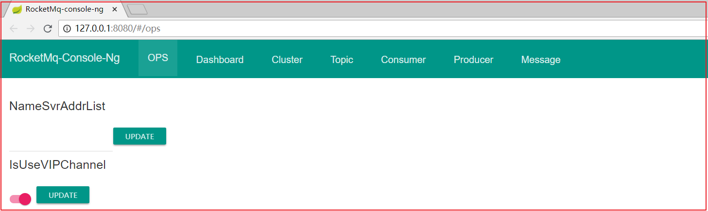


上面显示的是英文，如果想显示中文，可以点击语言切换，选中Chinese

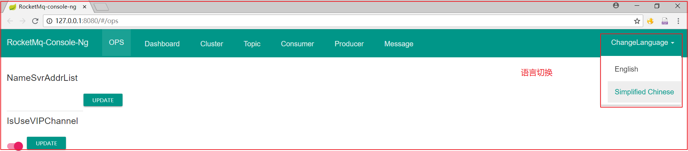

切换后如下图：

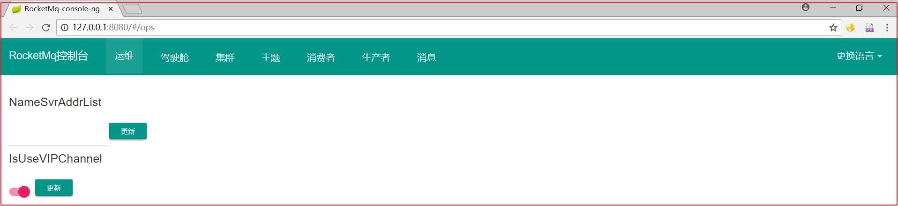

### 【小结】

了解RocketMQ概念与安装

# 2. SpringBoot整合RocketMQ

### 【目标】

掌握Springboot整合RocketMQ

### 【路径】

1：创建生产者工程

2：创建消费者工程

3：发送消息测试

### 【讲解】

RocketMQ消息消费类型有2种类型，我们先实现一次集群消息模式，再实现广播模式。集群模式也就是消息只能同时被一个消费者读取，而广播模式则可以同时被所有消费者读取。

## 2.1. 创建生产者工程 

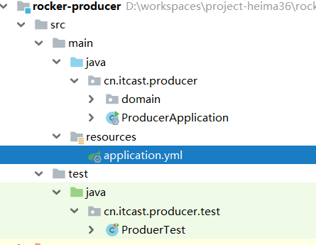 

### 2.1.1. 引入依赖

```xml
<parent>
    <groupId>org.springframework.boot</groupId>
    <artifactId>spring-boot-starter-parent</artifactId>
    <version>2.1.0.RELEASE</version>
</parent>


<dependencies>
    <dependency>
        <groupId>org.springframework.boot</groupId>
        <artifactId>spring-boot-starter-web</artifactId>
    </dependency>

    <dependency>
        <groupId>org.springframework.boot</groupId>
        <artifactId>spring-boot-starter-test</artifactId>
        <scope>test</scope>
    </dependency>
    <dependency>
        <groupId>org.projectlombok</groupId>
        <artifactId>lombok</artifactId>
        <version>1.18.4</version>
    </dependency>

    <dependency>
        <groupId>com.fasterxml.jackson.core</groupId>
        <artifactId>jackson-databind</artifactId>
        <version>2.9.9</version>
    </dependency>

    <dependency>
        <groupId>commons-codec</groupId>
        <artifactId>commons-codec</artifactId>
    </dependency>
    <!--RocketMQ相关-->
    <dependency>
        <groupId>org.apache.rocketmq</groupId>
        <artifactId>rocketmq-spring-boot-starter</artifactId>
        <version>2.0.3</version>
    </dependency>
    <dependency>
        <groupId>org.apache.rocketmq</groupId>
        <artifactId>rocketmq-client</artifactId>
        <version>4.6.0</version>
    </dependency>

    <dependency>
        <groupId>joda-time</groupId>
        <artifactId>joda-time</artifactId>
    </dependency>
</dependencies>
```

### 2.1.2. ProducerApplication

```java
package cn.itcast.producer;

import org.springframework.boot.SpringApplication;
import org.springframework.boot.autoconfigure.SpringBootApplication;

@SpringBootApplication
public class ProducerApplication {

    public static void main(String[] args) {
        SpringApplication.run(ProducerApplication.class, args);
    }

}
```

### 2.1.3. application.yml

```yml
#配置生产者
rocketmq:
  name-server: 192.168.136.160:9876
  producer:
    group: produerDemo
```

## 2.2. 创建消费者工程

 

### 2.2.1 引入依赖

```xml
<parent>
    <groupId>org.springframework.boot</groupId>
    <artifactId>spring-boot-starter-parent</artifactId>
    <version>2.1.0.RELEASE</version>
</parent>


<dependencies>
    <dependency>
        <groupId>org.springframework.boot</groupId>
        <artifactId>spring-boot-starter-web</artifactId>
    </dependency>

    <dependency>
        <groupId>org.springframework.boot</groupId>
        <artifactId>spring-boot-starter-test</artifactId>
        <scope>test</scope>
    </dependency>
    <dependency>
        <groupId>org.projectlombok</groupId>
        <artifactId>lombok</artifactId>
        <version>1.18.4</version>
    </dependency>

    <dependency>
        <groupId>com.fasterxml.jackson.core</groupId>
        <artifactId>jackson-databind</artifactId>
        <version>2.9.9</version>
    </dependency>

    <dependency>
        <groupId>commons-codec</groupId>
        <artifactId>commons-codec</artifactId>
    </dependency>
    <!--RocketMQ相关-->
    <dependency>
        <groupId>org.apache.rocketmq</groupId>
        <artifactId>rocketmq-spring-boot-starter</artifactId>
        <version>2.0.3</version>
    </dependency>
    <dependency>
        <groupId>org.apache.rocketmq</groupId>
        <artifactId>rocketmq-client</artifactId>
        <version>4.6.0</version>
    </dependency>

    <dependency>
        <groupId>joda-time</groupId>
        <artifactId>joda-time</artifactId>
    </dependency>
</dependencies>
```

### 2.2.2 启动类

```java
package cn.itcast.consumer;

import org.springframework.boot.SpringApplication;
import org.springframework.boot.autoconfigure.SpringBootApplication;

@SpringBootApplication
public class ConsumerApplication {

    public static void main(String[] args) {
        SpringApplication.run(ConsumerApplication.class, args);
    }
}
```

### 2.2.3 application.yml

```yml
#服务器端口
server:
  port: 9091
#配置nameserver
rocketmq:
  name-server: 192.168.136.160:9876
```

## 2.3. 普通消息测试

### 2.3.1. 生产者

创建一个测试类，作为消息生产者

```java
package cn.itcast.producer;

import org.apache.rocketmq.spring.core.RocketMQTemplate;
import org.junit.Test;
import org.junit.runner.RunWith;
import org.springframework.beans.factory.annotation.Autowired;
import org.springframework.boot.test.context.SpringBootTest;
import org.springframework.test.context.junit4.SpringRunner;

@RunWith(SpringRunner.class)
@SpringBootTest
public class ProduerTest {

    /**
     * 生产者发送消息：
     *   1、注入RocketMqTemplate
     *   2、调用方法发送消息
     */
    @Autowired
    private RocketMQTemplate template;

    //发送普通消息
    @Test
    public void testSendBaseMessage() {
        template.convertAndSend("baseTopic36", "heima36 is ok123"); //消息主题，消息的内容
    }
}
```

### 2.3.2. 消费者

消费者需要使用 

@Component

@RocketMQMessageListener ，需要配置消费者名字和topic名字

```java
package cn.itcast.consumer.listener;

import org.apache.rocketmq.spring.annotation.RocketMQMessageListener;
import org.apache.rocketmq.spring.core.RocketMQListener;
import org.springframework.stereotype.Component;

/**
 * RocketMQ监听器
 *  1、实现RocketMQListener接口
 *  2、实现onMessage方法，完成业务处理
 *  3、需要交给容器管理：@Component
 *  4、在监听器上通过注解配置，需要监听的topic和消费者的组名
 */
@Component
@RocketMQMessageListener(
        topic = "baseTopic36",consumerGroup = "baseGroup"
)
public class BaseMessageListener implements RocketMQListener<String> {


    /**
     * 当获取到中间中，最新消息时候
     * 自动的调用onMessage方法
     * 参数：发送的消息内容
     */
    public void onMessage(String s) {
        System.out.println("消息中间件的内容；"+s);
    }
}

```

## 2.4. 顺序消息测试

### 2.4.1. 顺序消息简介

消息有序指的是可以按照消息的发送顺序来消费。RocketMQ是通过将“相同ID的消息发送到同一个队列，而一个队列的消息只由一个消费者处理“来实现顺序消息 。

场景：用户从创建订单，到支付，到订单完成。不同的状态下需要发送邮件

* 消息生产者：针对不同的状态，发送消息
  * 创建订单：发消息
  * 支付完成：发消息
  * 订单完成：发消息
* 消息消费者：
  * 获取消息，发送邮件

**如何保证顺序**

```properties
在MQ的模型中，顺序需要由3个阶段去保障：
	1.消息被发送时保持顺序
	2.消息被存储时保持和发送的顺序一致
	3.消息被消费时保持和存储的顺序一致
```

发送时保持顺序意味着对于有顺序要求的消息，用户应该在同一个线程中采用同步的方式发送。存储保持和发送的顺序一致则要求在同一线程中被发送出来的消息A和B，存储时在空间上A一定在B之前。而消费保持和存储一致则要求消息A、B到达Consumer之后必须按照先A后B的顺序被处理。 

### 2.4.2. 生产者

Producer端确保消息顺序唯一要做的事情就是将消息路由到特定的队列，在RocketMQ中，通过MessageQueueSelector来实现分区的选择。

Order实体类

```java
package com.itheima.producer.dto;

import lombok.AllArgsConstructor;
import lombok.Data;
import lombok.NoArgsConstructor;

import java.util.ArrayList;
import java.util.List;

@Data
@AllArgsConstructor
@NoArgsConstructor
public class Order {

    private Long id;
    private String desc;

    public static List<Order> buildOrders(){
        List<Order> list = new ArrayList<Order>();
        Order order1a = new Order(4l, "创建订单a");
        Order order2a = new Order(5l, "创建订单b");
        Order order3a = new Order(6l, "创建订单c");
        list.add(order1a);
        list.add(order2a);
        list.add(order3a);

        Order order1b = new Order(4l, "付款a");
        Order order2b = new Order(5l, "付款b");
        Order order3b = new Order(6l, "付款c");
        list.add(order1b);
        list.add(order2b);
        list.add(order3b);


        Order order1c = new Order(4l, "完成a");
        Order order2c = new Order(5l, "完成b");
        Order order3c = new Order(6l, "完成b");
        list.add(order1c);
        list.add(order2c);
        list.add(order3c);
        return list;
    }
}
```

需要自己编写消息选择队列的代码，这里我们用 orderid 对 队列总数 取模：long index = orderId % mqs.size();

```java
    /**
     * 顺序消息
     */
    @Test
    public void testOrderlySendMessage() {
        List<Order> orderList = Order.buildOrders();
        for (Order order : orderList) {
            //1、选择队列
            template.setMessageQueueSelector(new MessageQueueSelector() {
                //选择目标队列  list：所有队列，message：消息，key：需要进行取模的参数（订单ID）
                public MessageQueue select(List<MessageQueue> list, Message message, Object key) {
                    Long id = Long.valueOf((String)key);
                    int index = (int) (id % list.size());
                    return list.get(index);
                }
            });
            //2、发送消息
            template.syncSendOrderly("orderlyTopic36",order.toString(),order.getId().toString());
        }
    }
```

### 2.4.3. 消费者

```java
package cn.itcast.consumer.listener;

import org.apache.rocketmq.spring.annotation.ConsumeMode;
import org.apache.rocketmq.spring.annotation.RocketMQMessageListener;
import org.apache.rocketmq.spring.core.RocketMQListener;
import org.springframework.stereotype.Component;


/**
 * consumeMode:顺序消息
 *  消息消费者端：通过多线程获取消息的
 *      获取的消息顺序：保持一致
 *              4：创建订单a
 *              4：付款a
 *              4：完成a
 */
@Component
@RocketMQMessageListener(
        topic = "orderlyTopic36",consumerGroup = "orderlyGroup",consumeMode= ConsumeMode.ORDERLY
)
public class OrderlyMessageListener implements RocketMQListener<String> {


    @Override
    public void onMessage(String message) {
        System.out.println("当前线程："+Thread.currentThread().getName()+",接收到消息：="+message);
    }
}
```

## 2.5. 延迟消息测试

### 2.5.1. 延迟消息简介

* 在某些场景下，需要发送消息之后。等待一段时间，然后通知消费者使用并消费
* 使用场景：支付
  * 生产者：生成支付订单之后，发送一个延迟消息（15分钟）之后，
  * 消费者：在15分钟之后获取消息，检查支付状态

### 2.5.2. 生产者

```java
    /**
     * 发送延迟消息
     */
    @Test
    public void testDelaySendMessage() {
        String time = new SimpleDateFormat("yyyy-MM-dd HH:mm:ss").format(new Date());
        template.syncSend("delayTopic36", "延迟消息:"+time,10000);
    }

```

### 2.5.3. 消费者

```java
package cn.itcast.consumer.listener;

import org.apache.rocketmq.spring.annotation.RocketMQMessageListener;
import org.apache.rocketmq.spring.core.RocketMQListener;
import org.springframework.stereotype.Component;

/**
 * RocketMQ监听器
 *  1、实现RocketMQListener接口
 *  2、实现onMessage方法，完成业务处理
 *  3、需要交给容器管理：@Component
 *  4、在监听器上通过注解配置，需要监听的topic和消费者的组名
 */
@Component
@RocketMQMessageListener(
        topic = "delayTopic36",consumerGroup = "delayGroup"
)
public class DelayMessageListener implements RocketMQListener<String> {


    /**
     * 当获取到中间中，最新消息时候
     * 自动的调用onMessage方法
     * 参数：发送的消息内容
     */
    public void onMessage(String s) {
        System.out.println("消息中间件的内容；"+s);
    }
}
```

## 2.5. 广播消息测试

### 2.5.1. 广播消息简介

集群模式，只有一个消费者可以收到消息

广播模式是所有的消费者都可以收到消息。

### 2.5.2. 生产者

```java
/**
  * 发送广播消息
  */
@Test
public void testSendBroadCastMessage() {
    for (int i = 0; i < 10; i++) {
        template.convertAndSend("broadCast36", "消息："+i); //消息主题，消息的内容
    }
}
```

### 2.5.2. 消费者

想要实现广播功能，只需要修改消费者的 消息类型选项，即：

```
messageModel = MessageModel.BROADCASTING
```

```java
package cn.itcast.consumer.listener;


import org.apache.rocketmq.spring.annotation.MessageModel;
import org.apache.rocketmq.spring.annotation.RocketMQMessageListener;
import org.apache.rocketmq.spring.core.RocketMQListener;
import org.springframework.stereotype.Component;

@Component
@RocketMQMessageListener(
        topic = "broadCast36",consumerGroup = "broadCastGroup",
        messageModel= MessageModel.BROADCASTING
)
//messageModel == CLUSTERING 消息模式（集群模式）
//messageModel == BROADCASTING 广播模式（集群模式）
public class BroadCastMessageListener implements RocketMQListener<String> {

    @Override
    public void onMessage(String s) {
        System.out.println("消费者1获取消息="+s);
    }
}
```

当修改为广播模式后，这个新的消费者会收到消息

### 【小结】

掌握Springboot整合RocketMQ

# 3. 用户管理

### 【目标】

掌握用户管理功能实现

### 【路径】

1：用户管理功能分析

2：掌握用户管理功能实现

### 【讲解】

## 3.1. 服务消费者-用户管理

### 3.1.1. UsersController

```java
package com.tanhua.manage.controller;

import com.tanhua.domain.db.UserInfo;
import com.tanhua.domain.vo.PageResult;
import com.tanhua.manage.service.UsersService;
import org.springframework.beans.factory.annotation.Autowired;
import org.springframework.http.ResponseEntity;
import org.springframework.web.bind.annotation.*;

import java.util.HashMap;
import java.util.Map;

@RestController
@RequestMapping("/manage")
public class UsersController {

    @Autowired
    private UsersService usersService;

    /**
     * 用户管理页面分页查询
     * @return
     */
    @GetMapping("/users")
    public ResponseEntity findPage(@RequestParam(value = "page",defaultValue = "1") Long page,
                                   @RequestParam(value = "pagesize", defaultValue = "10") Long pagesize){
        Map<String,Object> paramMap = new HashMap<String,Object>(2);
        paramMap.put("page",page);
        paramMap.put("pagesize",pagesize);
        PageResult<UserInfo> pageResult = usersService.findPage(paramMap);
        return ResponseEntity.ok(pageResult);
    }

    /**
     * 用户详情
     * @param userId
     * @return
     */
    @GetMapping("/users/{userId}")
    public ResponseEntity findUserDetail(@PathVariable(value = "userId") long userId){
        UserInfo userInfo = usersService.findById(userId);
        return ResponseEntity.ok(userInfo);
    }
}
```

### 3.1.2. UsersService

```java
package com.tanhua.manage.service;

import com.tanhua.domain.db.UserInfo;
import com.tanhua.domain.vo.PageResult;
import com.tanhua.dubbo.api.UserInfoApi;
import org.apache.dubbo.config.annotation.Reference;
import org.springframework.stereotype.Service;

import java.util.Map;

@Service
public class UsersService {

    @Reference
    private UserInfoApi userInfoApi;

    /**
     * 用户管理页面分页查询
     *
     * @param paramMap
     * @return
     */
    public PageResult<UserInfo> findPage(Map<String, Object> paramMap) {
        PageResult<UserInfo> pageResult = userInfoApi.findPage(paramMap);
        return pageResult;
    }

    /**
     * 用户详情
     *
     * @param userId
     * @return
     */
    public UserInfo findById(long userId) {
        return userInfoApi.findByUserId(userId);
    }
}
```

## 3.2. 服务提供者-用户管理

### 3.2.1. UserInfoApi

```java
/**
  * 用户管理页面分页查询
  * @param paramMap
  * @return
  */
PageResult<UserInfo> findPage(Map<String, Object> paramMap);
```

### 3.2.2. UserInfoApiImpl

```java
/**
  * 用户管理页面分页查询
  * @param paramMap
  * @return
  */
@Override
public PageResult<UserInfo> findPage(Map<String, Object> paramMap) {
    Long page = (Long) paramMap.get("page");
    Long pagesize = (Long) paramMap.get("pagesize");
    IPage<UserInfo> userInfoIPage = userInfoMapper.selectPage(new Page<>(page,pagesize), null);
    PageResult<UserInfo> pageResult = new PageResult<UserInfo>();
    pageResult.setPage(page);
    pageResult.setPagesize(pagesize);
    pageResult.setCounts(userInfoIPage.getTotal());
    pageResult.setItems(userInfoIPage.getRecords());
    return pageResult;
}
```

### 3.2.3. 测试


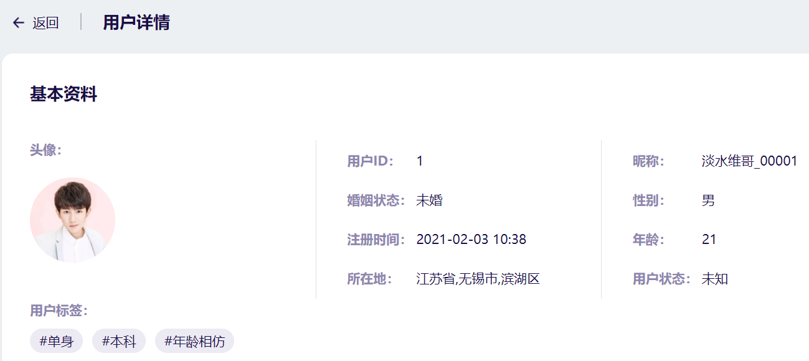

## 3.3. 服务消费者-用户动态

### 3.3.1. UsersController

```java
/**
  * 获取当前用户的所有视频分页列表
  */
@GetMapping("/videos")
public ResponseEntity findAllVideos(@RequestParam(defaultValue = "1") int page,
                                    @RequestParam(defaultValue = "10") int pagesize,
                                    @RequestParam(required = false) Long uid) {
    return usersService.findAllVideos(page,pagesize,uid);
}

/**
  * 获取当前用户的所有动态分页列表
  */
@GetMapping("/messages")
public ResponseEntity findAllMovements(@RequestParam(defaultValue = "1") int page,
                                       @RequestParam(defaultValue = "10") int pagesize,
                                       @RequestParam(required = false) Long uid,
                                       @RequestParam(required = false) String state) {
    return usersService.findAllMovements(page,pagesize,uid,0);
}

/**
  * 根据id查询，动态详情
  */
@GetMapping("/messages/{publishId}")
public ResponseEntity findMovementById(@PathVariable("publishId") String publishId) {
    return usersService.findMovementById(publishId);
}

/**
  * 查看动态的评论列表
  */
@GetMapping("/messages/comments")
public ResponseEntity findAllComments(
    @RequestParam(defaultValue = "1") int page,
    @RequestParam(defaultValue = "10") int pagesize,
    String messageID) {
    return usersService.findAllComments(page,pagesize,messageID);
}
```

### 3.3.2. UsersService

```java
package com.tanhua.manage.service;

import cn.hutool.core.date.DateTime;
import com.tanhua.domain.db.UserInfo;
import com.tanhua.domain.mongo.Comment;
import com.tanhua.domain.mongo.Publish;
import com.tanhua.domain.mongo.Video;
import com.tanhua.domain.vo.CommentVo;
import com.tanhua.domain.vo.MomentVo;
import com.tanhua.domain.vo.PageResult;
import com.tanhua.domain.vo.VideoVo;
import com.tanhua.dubbo.api.UserInfoApi;
import com.tanhua.dubbo.api.mongo.CommentApi;
import com.tanhua.dubbo.api.mongo.PublishApi;
import com.tanhua.dubbo.api.mongo.VideoApi;
import com.tanhua.manage.utils.RelativeDateFormat;
import org.apache.commons.lang3.StringUtils;
import org.apache.dubbo.config.annotation.Reference;
import org.springframework.beans.BeanUtils;
import org.springframework.beans.factory.annotation.Autowired;
import org.springframework.data.redis.core.RedisTemplate;
import org.springframework.http.ResponseEntity;
import org.springframework.stereotype.Service;

import java.text.SimpleDateFormat;
import java.util.ArrayList;
import java.util.Date;
import java.util.List;

@Service
public class UsersService {

    @Reference
    private UserInfoApi userInfoApi;

    @Reference
    private VideoApi videoApi;

    @Reference
    private PublishApi publishApi;

    @Reference
    private CommentApi commentApi;

    @Autowired
    private RedisTemplate redisTemplate;

    //获取当前用户的所有视频分页列表
    public ResponseEntity findAllVideos(int page, int pagesize, Long uid) {
        //1、根据用户id查询所有的视频分页列表  PageResult
        PageResult result = videoApi.findAll(page,pagesize,uid);
        //2、获取分页数据中数据列表   List<Video>
        List<Video> items = (List<Video>) result.getItems();
        //3、循环遍历数据集合，一个video构造一个vo
        List<VideoVo> list = new ArrayList<>();
        if(items != null) {
            for (Video item : items) {
                UserInfo info = userInfoApi.findByUserId(item.getUserId());
                VideoVo vo = new VideoVo();
                BeanUtils.copyProperties(info,vo);
                BeanUtils.copyProperties(item,vo);
                vo.setCover(item.getPicUrl());
                vo.setId(item.getId().toHexString());
                vo.setSignature(item.getText());//签名
                list.add(vo);
            }
        }
        //4、存入pageResult中
        result.setItems(list);
        //5、构造返回值
        return ResponseEntity.ok(result);
    }

    //获取当前用户的所有动态分页列表
    public ResponseEntity findAllMovements(int page, int pagesize, Long uid, Integer publishState) {
        //1、调用API查询publish
        PageResult result = publishApi.findAll(page,pagesize,uid,publishState);
        //3、获取publish列表
        List<Publish> items = (List<Publish>) result.getItems();
        //4、一个publish构造成一个Movements
        List<MomentVo> list = new ArrayList<>();
        if(items != null) {
            for (Publish item : items) {
                MomentVo vo = new MomentVo();
                UserInfo userInfo = userInfoApi.findByUserId(item.getUserId());
                if(userInfo != null) {
                    BeanUtils.copyProperties(userInfo,vo);
                    if(userInfo.getTags() != null) {
                        vo.setTags(userInfo.getTags().split(","));
                    }
                }
                BeanUtils.copyProperties(item, vo);
                vo.setId(item.getId().toHexString());
                vo.setCreateDate(new SimpleDateFormat("yyyy-MM-dd HH:mm").format(new Date(item.getCreated())));
                vo.setImageContent(item.getMedias().toArray(new String[]{}));
                vo.setDistance("50米");
                list.add(vo);
            }
        }
        //5、构造返回值
        result.setItems(list);
        return ResponseEntity.ok(result);
    }

    //根据id，查询动态详情
    public ResponseEntity findMovementById(String publishId) {
        //1、根据api查询  publish
        Publish publish = publishApi.findById(publishId);
        //2、转化Movements
        MomentVo vo = new MomentVo();
        //3、构造返回值
        UserInfo userInfo = userInfoApi.findByUserId(publish.getUserId());
        if(userInfo != null) {
            BeanUtils.copyProperties(userInfo,vo);
            if(userInfo.getTags() != null) {
                vo.setTags(userInfo.getTags().split(","));
            }
        }
        BeanUtils.copyProperties(publish, vo);
        vo.setId(publish.getId().toHexString());
        vo.setCreateDate(new SimpleDateFormat("yyyy-MM-dd HH:mm").format(new Date(publish.getCreated())));
        vo.setImageContent(publish.getMedias().toArray(new String[]{}));
        vo.setDistance("50米");
        return ResponseEntity.ok(vo);
    }

    //查询动态的评论列表
    public ResponseEntity findAllComments(int page, int pagesize, String messageID) {
        //1、调用API查询： PageResult中封装的都是Comment对象
        PageResult result = commentApi.findPage(messageID,page, pagesize);
        //2、获取page对象中的数据列表  list<Comment>
        List<Comment> items = (List<Comment>) result.getItems();
        //3、一个Comment对象转化为一个VO对象
        List<CommentVo> list = new ArrayList<>();
        for (Comment comment : items) {
            CommentVo vo = new CommentVo();
            //4、查询发送评论用户详情
            BeanUtils.copyProperties(comment, vo);
            vo.setId(comment.getId().toString());
            vo.setCreateDate(new DateTime(comment.getCreated()).toString("yyyy年MM月dd日 HH:mm"));
            UserInfo info = userInfoApi.findByUserId(comment.getUserId());
            BeanUtils.copyProperties(info, vo);
            vo.setHasLiked(0); //是否点赞
            list.add(vo);
        }
        //5、构造返回值
        result.setItems(list);
        return ResponseEntity.ok(result);
    }
}
```

## 3.4. 服务提供者-用户动态

### 3.4.1. PublishApi

```java
/**
  * 获取当前用户的所有动态分页列表
  * @return
  */
PageResult findAll(int page, int pagesize, Long uid, Integer publishState);
```

### 3.4.2. PublishApiImpl

```java
/**
  * 获取当前用户的所有动态分页列表
  * @return
  */
@Override
public PageResult findAll(int page, int pagesize, Long uid, Integer state) {

    Query query = new Query();
    //构造userId查询条件
    if(uid != null) {
        query.addCriteria(Criteria.where("userId").is(uid));
    }

    List<Publish> list = mongoTemplate.find(query, Publish.class);
    long total = mongoTemplate.count(query, Publish.class);
    int pages = total / pagesize + total % pagesize > 0 ? 1 : 0;
    PageResult pageResult =
        new PageResult(total,(long)pagesize,(long)page,(long)pages,list);
    return pageResult;
}
```

### 3.4.3. VideoApi

```java
/**
  * 获取当前用户的所有视频分页列表
  * @return
  */
PageResult findAll(int page, int pagesize, Long uid);
```

### 3.4.4. VideoApiImpl

```java
/**
  * 获取当前用户的所有视频分页列表
  * @return
  */
@Override
public PageResult findAll(int page, int pagesize, Long uid) {
    //1、分页查询数据列表
    Criteria criteria = new Criteria();
    if(uid != null) {
        criteria = criteria.where("userId").is(uid);
    }
    Query query = new Query(criteria).limit(pagesize)
        .skip((page-1) * pagesize).with(Sort.by(Sort.Order.desc("created")));
    List<Video> list = mongoTemplate.find(query, Video.class);
    //2、查询总记录数
    long total = mongoTemplate.count(query, Video.class);
    //3、构造返回值
    int pages = total / pagesize + total % pagesize > 0 ? 1 : 0;
    PageResult pageResult =
        new PageResult(total,(long)pagesize,(long)page,(long)pages,list);
    return pageResult;
}
```

### 3.4.5.测试

 当前用户的所有动态分页列表：

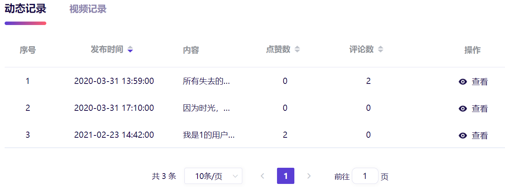

查看动态详情：

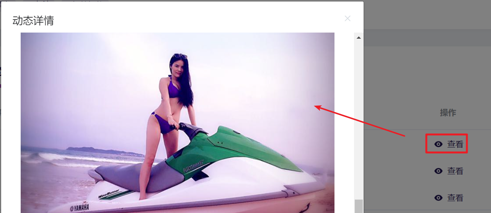

查看动态评论列表：

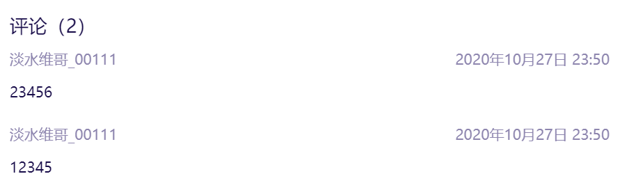

当前用户的所有视频分页列表：

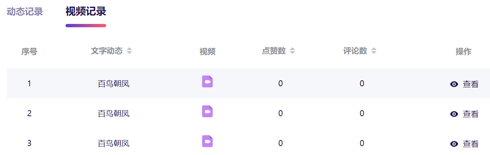

查看视频详情：

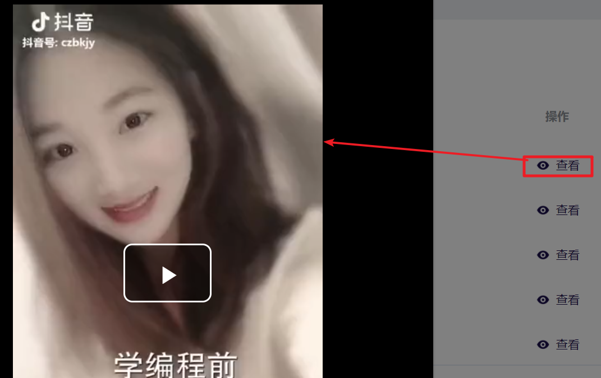

### 【小结】

掌握用户管理功能实现

# 总结

* 完成后台管理系统-用户管理
* 后台管理系统
  * 手机端操作完成之后，tanhua-server向rocketMQ发送操作日志消息
  * 后台系统tanhua-manage从RocketMQ获取消息,写入到后台系统的日表中 tb_log
  * 通过定时任务，完成数据的统计和分析，写入到统计表中
  * 从统计表中，查询统计结果
* RocketMQ的概念和相关概念模型
* SpringBoot整合RocketMQ：普通消息，顺序消息，延迟消息，广播模式/集群模式
