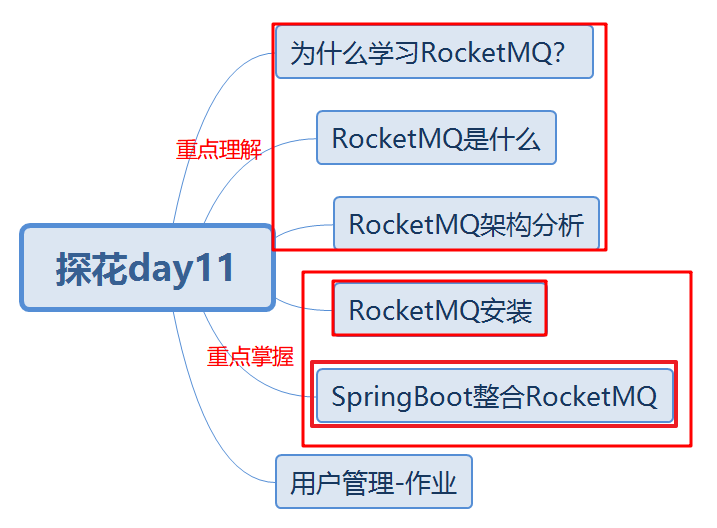
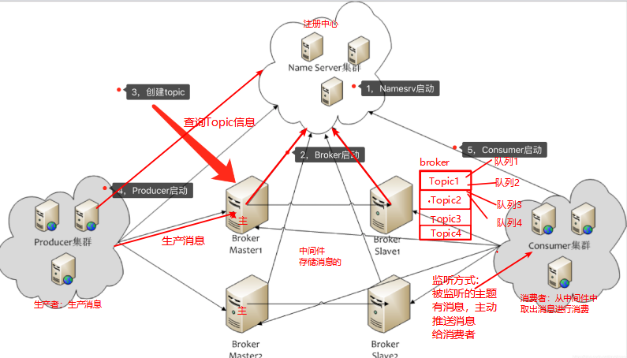
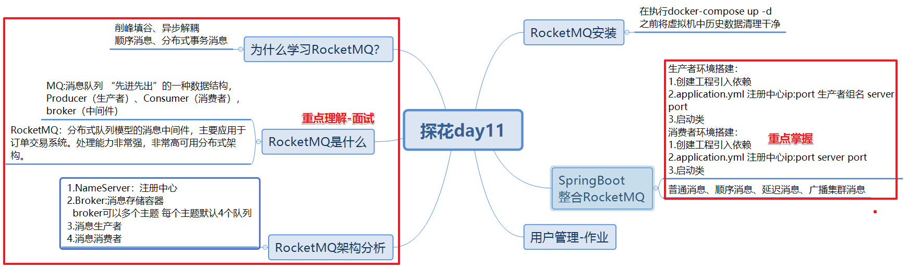

# 今日内容介绍




# 为什么要学习RocketMQ？

答：解决分布式系统中一些问题的,实际项目中高并发问题。

削峰填谷：为了解决类似于秒杀请求，短时间内系统并发量特别高的场景。

异步解耦：为了 的体验，将同步的请求拆分成异步请求处理。

顺序消息：为了解决电商系统中，加入购物车、创建订单、支付、退款等功能（只要保证消息写到同一个消息队列中就可以了）

分布式事务消息：为了解决分布式系统的事务


# 什么是RocketMQ?

MQ:消息队列 “先进先出”的一种数据结构，Producer（生产者）、Consumer（消费者），broker（中间件）。

RocketMQ：分布式队列模型的消息中间件，主要应用于订单交易系统。处理能力非常强，非常高可用分布式架构。

# RocketMQ架构-重点理解



NameServer:注册中心 可以跟broker producer  consumer建立长连接 定时心跳

Broker:跟NameServer建立连接，将Topic主题注册到Name Server上（ip port主题等信息）

  	Broker: 可以有多个主题Topic,每个主题默认有4个队列

Producer:生产者跟NameServer 查询Topic主题信息   生产者连接Broker写入消息

Consumer:消费者跟NameServer 查询Topic主题信息   消费者连接Broker获取消息（主动获取，监听获取）

1.NameServer先启动

2.Broker再启动，跟NameServer建立长连接，并将topic主题信息注册NameServer

3.Producer生产消息连接Namserver获取Topic信息，以轮询的方式将消息写入broker中主题队列中。

4.Consumer消费者连接Namserver获取Topic信息，以监听方式或主动拉取方式获取消息。


# Rocket特性

1.消费模式

答：broker中消息是否能够被多个消费者消费，如果可以就是广播模式，如果只能被一个消费者消费就是集群模块（默认就是集群模式）

2.如何保证消息顺序消费？

消息的顺序指的是消息消费时，能按照发送的顺序来消费。

RocketMQ是通过将“相同ID的消息发送到同一个队列，而一个队列的消息只由一个消费者处理“来实现顺序消息

3.消息重复？

队列：最多一次（At most once）、**至少一次（At least once）**、仅一次（ Exactly once）。

**去重原则：使用业务端逻辑保持幂等性**

例如：支付案例：在最终扣款之前判断支付状态（业务代码来控制）

**去重策略：保证每条消息都有唯一编号(比如唯一流水号)，且保证消息处理成功与去重表的日志同时出现。**

例如：每一个消息都有一个唯一消息id,处理之前先将消息写入表中，消息的id作为主键，插入失败了，说明之前曾经消费过此条消息。


# RocketMQ安装

注意：

rmqnamesrv:注册中心

rmqbroker:中间件

rmqconsole：图形化界面-管理控制台 可以看到中间件的所有内容 nameserver

```
1.
cd /root/docker-file/rmq

2.
more docker-compose.yml

3.
rm -rf /data/rmq/server/logs /data/rmq/server/store /data/rmq/broker/logs /data/rmq/broker/store

4.注意点：/data/rmq/broker/brokerconf/broker.conf 不能删除

10.10.20.160:9876
http://10.10.20.160:8180
```

# SpringBoot整合RocketMQ-重点理解

## 普通消息测试

### 生产者工程搭建

```
1.创建工程，引入相关依赖
2.创建启动类
3.创建application.yml(配置nameserver 生产者组名)
4.创建测试类，RocketMQTemplate对象中convertAndSend（主题名称，发送的消息内容）
```

### 消费者工程搭建

```
1.创建工程，引入相关依赖
2.创建启动类
3.创建application.yml(配置nameserver等)
4.创建监听类 实现RocketMQListener接口<String> 
  监听类上加上@Component，将当前监听类放到spring容器中
  监听类上加上@RocketMQMessageListener topic=“指定监听的主题” consumerGroup=“指定消费者组名”
```

注意点：别将代码放到同一个idea模块中

**项目中重点：**

```
1.生产者发送消息的内容
2.监听类中onMessage方法中获取到消息后，业务如何处理？
```

## 顺序消息测试

例如：实际业务场景中，将同一个订单的消息，要求按照顺序进行消费。

在**生产者将消息写入broker**中主题的队列时，**根据订单id通过取模方式来选择一个队列**，往固定的队列中写消息.

订单号6   取模   默认队列数量：6      6%6 ==>0（代表第一个队列）

**如果要保证消息顺序消费，必须要保证生产者将同一类消息写入到同一个队列中。**

重点关注：

```
生产者：发送消息的时候，根据实际情况选择key 取模 队列数量 根据最终结果选择队列
消费者：监听类设置consumeMode= ConsumeMode.ORDERLY （先进先出）
```

## 延迟消息测试

例如：支付但未付款，发送一个延迟消息到消息队列（15分钟），等到15分钟后再进行消费。

重点关注：

```
生产者：delayLevel延迟级别 默认有18个 1s 5s 10s 30s 1m 2m 3m 4m 5m 6m 7m 8m 9m 10m 20m 30m 1h 2h
如果延迟的时间不满足要求，可以在broker.conf中自定义延迟级别
消费者：没有特别需要注意点
```


## 广播消息测试

**集群模式**，只有一个消费者可以收到消息

**广播模式**是所有的消费者都可以收到消息。

重点关注：

```
广播模式：
	生产者：没有特别需要关注点
	消费者：RocketMQMessageListener注解中messageModel= MessageModel.BROADCASTING 广播模式
集群模式：
	生产者：没有特别需要关注点
	消费者：RocketMQMessageListener注解中messageModel= MessageModel.CLUSTERING 广播模式
```


rocketmq版本：rocketmq-spring-boot-starter 2.0.2  rocketmq-client：4.4.0


# 总结




# 演讲

RocketMQ谈一谈你对它了解？

1.RocketMQ内部整体架构介绍（4个角色）

2.RocketMQ内部整体架构执行流程说清楚


# 作业