# 第12章 消息推送与内容审核

# 学习目标

* 基于RocketMQ实现消息推送
* 定时任务完成定时统计
* 华为云内容审核

# 1. 基于RocketMQ实现记录日志表

### 【目标】

掌握RocketMQ实现消息推送

### 【路径】

1：APP端操作记录分析

2：生产者环境搭建

3：消费者环境搭建

### 【讲解】

用户在APP端的所有操作都需要记录到后台管理系统数据库中。我们这里采用的是RocketMQ来实现，整体的流程如下

* 用户在APP完成登录或者注册操作
* **tanhua-server**端正常完成业务后，发送MQ消息
* **tanhua-manager**端，获取MQ消息体
* 解析消息，记录日志信息到数据库中

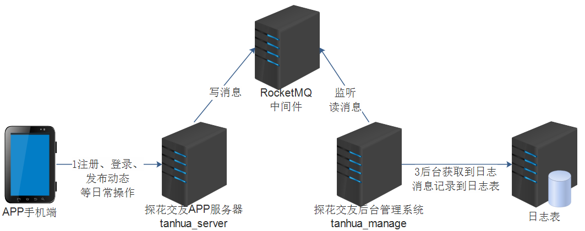

## 1.1. 生产者

### 1.2.1. 引入依赖

tanhua-server模块pom.xml中

```xml
<dependency>
    <groupId>org.apache.rocketmq</groupId>
    <artifactId>rocketmq-spring-boot-starter</artifactId>
    <version>2.0.3</version>
</dependency>
<dependency>
    <groupId>org.apache.rocketmq</groupId>
    <artifactId>rocketmq-client</artifactId>
    <version>4.6.0</version>
</dependency>
```
### 1.2.2. application.yml

tanhua-server模块application.yml配置rocketMQ服务器相关信息

```yaml
rocketmq:
  name-server: 192.168.136.160:9876
  producer:
    group: tanhua
```
### 1.2.2. UserService

tanhua-server模块UserService的登录方法loginVerification，发送MQ消息。

```java
@Autowired
private RocketMQTemplate rocketMQTemplate;

/**
  * 注册登录-第一步：验证码校验(登录)
  */
public Map<String, Object> loginVerification(String phone, String verificationCode) {
    //消息类型为：用户注册
    String type = "0101";
    ......
    //5用户不存在，自动注册用户
    if (user == null) {
        ......
        //消息类型为：用户登录
     	type = "0202";
    }
    //10.发送消息，记录用户登录注册信息，用于后台统计
    Map<String,Object> message = new HashMap<>();
    message.put("userId",user.getId().toString());
    message.put("type",type);
    message.put("date",new SimpleDateFormat("yyyy-MM-dd").format(new Date()));
    rocketMQTemplate.convertAndSend("tanhua-log",message);
}
```

### 1.2.3. 测试

用户登录后，打开RocketMQ管理控制台查看消息是否已经发送成功。

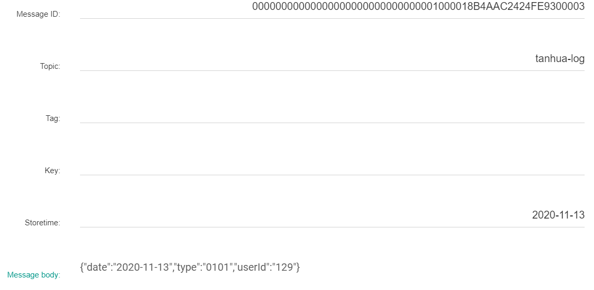

## 1.2. 消费者

### 1.2.1. 引入依赖

tanhua-manage模块pom.xml中

```xml
<dependency>
    <groupId>org.apache.rocketmq</groupId>
    <artifactId>rocketmq-spring-boot-starter</artifactId>
    <version>2.0.3</version>
</dependency>
<dependency>
    <groupId>org.apache.rocketmq</groupId>
    <artifactId>rocketmq-client</artifactId>
    <version>4.6.0</version>
</dependency>
```
### 1.2.2. Log

tanhua-manage模块domain包中

```java
package com.tanhua.manage.domain;

import lombok.AllArgsConstructor;
import lombok.Builder;
import lombok.Data;
import lombok.NoArgsConstructor;

@Data
@Builder
@NoArgsConstructor
@AllArgsConstructor
public class Log {
    /**
     * id
     */
    private Long id;
    /**
     * 用户id
     */
    private Long userId;
    /**
     * 操作时间
     */
    private String logTime;
    /**
     * 登陆地点
     */
    private String place;
    /**
     * 登陆设备
     */
    private String equipment;
    /**
     * 操作类型,
     * 0101为登录，0102为注册，0201为发动态，0202为浏览动态，0203为动态点赞，0204为动态喜欢，0205为评论，0206为动态取消点赞，0207为动态取消喜欢，0301为发小视频，0302为小视频点赞，0303为小视频取消点赞，0304为小视频评论
     */
    private String type;
}
```

### 1.2.3. LogMapper

tanhua-manage模块mapper包中

```java
package com.tanhua.manage.mapper;

import com.baomidou.mybatisplus.core.mapper.BaseMapper;
import com.tanhua.manage.domain.Log;
import org.apache.ibatis.annotations.Mapper;

@Mapper
public interface LogMapper extends BaseMapper<Log> {
}
```

### 1.2.4. LogService

tanhua-manage模块service包中

```java
package com.tanhua.manage.service;

import com.baomidou.mybatisplus.extension.service.impl.ServiceImpl;
import com.tanhua.manage.domain.Log;
import com.tanhua.manage.mapper.LogMapper;
import org.springframework.stereotype.Service;

@Service
public class LogService extends ServiceImpl<LogMapper, Log> {
    
}
```

### 1.2.5. application.yml

tanhua-manage模块application.yml配置rocketMQ服务器相关信息

```yaml
rocketmq:
  name-server: 192.168.136.160:9876
```
### 1.2.6. LogMessageListener

tanhua-manage模块listener包中

```java
package com.tanhua.manage.listener;

import com.alibaba.fastjson.JSON;
import com.tanhua.manage.domain.Log;
import com.tanhua.manage.service.LogService;
import org.apache.rocketmq.spring.annotation.RocketMQMessageListener;
import org.apache.rocketmq.spring.core.RocketMQListener;
import org.springframework.beans.factory.annotation.Autowired;
import org.springframework.stereotype.Component;

import java.util.Map;

@Component
@RocketMQMessageListener(
        topic = "tanhua-log",consumerGroup = "tanhua-log-consumer"
)
public class LogMessageListener implements RocketMQListener<String> {

    @Autowired
    private LogService logService;

    @Override
    public void onMessage(String message) {
        Map map = JSON.parseObject(message, Map.class);
        String userId = (String) map.get("userId");
        String type =  (String) map.get("type");
        String date =  (String) map.get("date");

        //构造log对象
        Log log = new Log();
        log.setUserId(Long.valueOf(userId));
        log.setType(type);
        log.setLogTime(date);
        //调用service保存日志
        logService.save(log);
    }
}
```

### 【小结】

掌握RocketMQ实现消息推送

# 2. 定时任务

### 【目标】

掌握定时统计功能实现

### 【路径】

1：Spring定时任务入门案例

2：定时数据统计功能实现

### 【讲解】

在实际项目开发中，除了Web应用、SOA服务外，还有一类不可缺少的，那就是定时任务调度。定时任务的场景可以说非常广泛：

* 某些网站会定时发送优惠邮件；

* 银行系统还款日信用卡催收款；

* 某些应用的生日祝福短信等。

完成这些功能都需要用到定时任务调度。那究竟何为定时任务调度，一句话概括就是：基于给定的时间点、给定的时间间隔、给定的执行次数自动执行的任务

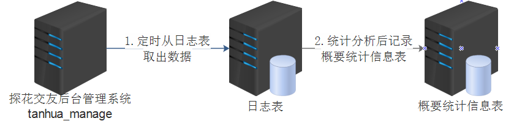

## 2.1. 入门案例

案例：每隔5秒钟。打印系统时间

### 2.1.1. ManageApplication

**@EnableScheduling**：开启定时任务支持

```java
@EnableScheduling
public class ManageApplication {

    public static void main(String[] args) {
        SpringApplication.run(ManageApplication.class,args);
    }
}
```

### **2.1.2. AnalysisJob**

编写定时执行方法

```java
package com.tanhua.manage.job;

import org.springframework.scheduling.annotation.Scheduled;
import org.springframework.stereotype.Component;

import java.text.SimpleDateFormat;
import java.util.Date;

@Component
public class AnalysisJob {

    @Scheduled(cron = "0/5 * * * * ?")
    public void analysis() {
        System.out.println("当前时间："+new SimpleDateFormat("yyyy-MM-dd HH:mm:ss").format(new Date()));
    }
}
```

执行效果：每5秒打印当前系统时间

**@Scheduled：配置定时执行的方法**

## 2.2. CRON表达式

对于定时任务，我们使用的时候主要是注重两个方面，一个是定时任务的业务，另一个就是Cron表达式。

**Cron  表达式支持到六个域 **

| **名称** | **是否必须** | **允许值**      | **特殊字符**    |
| -------- | ------------ | --------------- | --------------- |
| 秒       | 是           | 0-59            | , - * /         |
| 分       | 是           | 0-59            | , - * /         |
| 时       | 是           | 0-23            | , - * /         |
| 日       | 是           | 1-31            | , - * ? / L W C |
| 月       | 是           | 1-12 或 JAN-DEC | , - * /         |
| 周       | 是           | 1-7 或 SUN-SAT  | , - * ? / L C # |

月份和星期的名称是不区分大小写的。FRI 和 fri 是一样的。 域之间有空格分隔

*** 星号**

```
使用星号(*) 指示着你想在这个域上包含所有合法的值。例如，在月份域上使用星号意味着每个月都会触发这个 trigger。
表达式样例： 
0 * 17 * * ? 
意义：每天从下午5点到下午5:59中的每分钟激发一次 trigger。它停在下午 5:59 是因为值 17 在小时域上，在下午 6 点时，小时变为 18 了，也就不再理会这个 trigger，直到下一天的下午5点。 在你希望 trigger 在该域的所有有效值上被激发时使用 * 字符。
```

**? 问号**

```
? 号只能用在日和周域上，但是不能在这两个域上同时使用。你可以认为 ? 字符是 "我并不关心在该域上是什么值。" 这不同于星号，星号是指示着该域上的每一个值。? 是说不为该域指定值。 

不能同时这两个域上指定值的理由是难以解释甚至是难以理解的。基本上，假定同时指定值的话，意义就会变得含混不清了：考虑一下，如果一个表达式在日域上有值11，同时在周域上指定了 WED。那么是要 trigger 仅在每个月的11号，且正好又是星期三那天被激发？还是在每个星期三的11号被激发呢？要去除这种不明确性的办法就是不能同时在这两个域上指定值。 只要记住，假如你为这两域的其中一个指定了值，那就必须在另一个字值上放一个 ?。 

表达式样例： 
0 10,44 14 ? 3 WED 
意义：在三月中的每个星期三的下午 2:10 和 下午 2:44 被触发。
```

**, 逗号**

```
逗号 (,) 是用来在给某个域上指定一个值列表的。例如，使用值 0,15,30,45 在秒域上意味着每15秒触发一个 trigger。 
表达式样例： 
0 0,15,30,45 * * * ? 
意义：每刻钟触发一次 trigger。
```

**/ 斜杠**

```
斜杠 (/) 是用于时间表的递增的。我们刚刚用了逗号来表示每15分钟的递增，但是我们也能写成这样 0/15。
表达式样例： 
0/15 0/30 * * * ? 
意义：在整点和半点时每15秒触发 trigger。
```

**-中划线**

```
中划线 (-) 用于指定一个范围。例如，在小时域上的 3-8 意味着 "3,4,5,6,7 和 8 点。"  域的值不允许回转，所以像 50-10 这样的值是不允许的。 
表达式样例： 
0 45 3-8 ? * * 
意义：在上午的3点至上午的8点的45分时触发 trigger。
```

**L 字母**

```
L 说明了某域上允许的最后一个值。它仅被日和周域支持。当用在日域上，表示的是在月域上指定的月份的最后一天。例如，当月域上指定了 JAN 时，在日域上的 L 会促使 trigger 在1月31号被触发。假如月域上是 SEP，那么 L 会预示着在9月30号触发。换句话说，就是不管指定了哪个月，都是在相应月份的时最后一天触发 trigger。 
表达式 0 0 8 L * ? 意义是在每个月最后一天的上午 8:00 触发 trigger。在月域上的 * 说明是 "每个月"。 
当 L 字母用于周域上，指示着周的最后一天，就是星期六 (或者数字7)。所以如果你需要在每个月的最后一个星期六下午的 11:59 触发 trigger，你可以用这样的表达式 0 59 23 ? * L。 
当使用于周域上，你可以用一个数字与 L 连起来表示月份的最后一个星期 X。例如，表达式 0 0 12 ? * 2L 说的是在每个月的最后一个星期一触发 trigger。 
不要让范围和列表值与 L 连用
虽然你能用星期数(1-7)与 L 连用，但是不允许你用一个范围值和列表值与 L 连用。这会产生不可预知的结果。
```

**W 字母**

```
W 字符代表着平日 (Mon-Fri)，并且仅能用于日域中。它用来指定离指定日的最近的一个平日。大部分的商业处理都是基于工作周的，所以 W 字符可能是非常重要的。例如，日域中的 15W 意味着 "离该月15号的最近一个平日。" 假如15号是星期六，那么 trigger 会在14号(星期四)触发，因为距15号最近的是星期一，这个例子中也会是17号（译者Unmi注：不会在17号触发的，如果是15W，可能会是在14号(15号是星期六)或者15号(15号是星期天)触发，也就是只能出现在邻近的一天，如果15号当天为平日直接就会当日执行）。W 只能用在指定的日域为单天，不能是范围或列表值。
```

**#井号**

```
字符仅能用于周域中。它用于指定月份中的第几周的哪一天。例如，如果你指定周域的值为 6#3，它意思是某月的第三个周五 (6=星期五，#3意味着月份中的第三周)。另一个例子 2#1 意思是某月的第一个星期一 (2=星期一，#1意味着月份中的第一周)。注意，假如你指定 #5，然而月份中没有第 5 周，那么该月不会触发。 
```

## 2.3. 定时统计

### 2.3.1. 数据来源分析

统计`tb_log`表中数据，按照要求存入到`tb_analysis_by_day`表中

```sql
#案例：统计2020-11-14数据
#将tb_log表中的数据，进行统计，记录到tb_analysis_by_day

#num_registered：当日总注册人数 ：  SELECT COUNT(DISTINCT  user_id) FROM tb_log WHERE log_time='2020-11-14' AND TYPE='0102'
#num_login：当日登录人数        :   SELECT COUNT(DISTINCT  user_id) FROM tb_log WHERE log_time='2020-11-14' AND TYPE='0101'
#num_active：当日活跃人数       :   SELECT COUNT(DISTINCT  user_id) FROM tb_log WHERE log_time='2020-11-14'
#num_retention1d：次日留存用户数量 (前一天注册，第二天继续使用APP)

SELECT  COUNT(DISTINCT  user_id) FROM tb_log WHERE log_time='2020-11-14' AND user_id IN (
    SELECT user_id FROM tb_log WHERE log_time='2020-11-13' AND TYPE='0102'
)

```

### **2.3.3. **AnalysisService

```java
@Autowired
private AnalysisByDayMapper byDayMapper;

@Autowired
private LogMapper logMapper;    
/**
  * 数据统计
  *  按照日期 统计tb_log日志表中的数据
  *  写入到tb_analysis_by_day
  */
public void analysis() {
    //1、获取统计的日期
    String todayStr = DateUtil.formatDate(new Date());  //2020-11-14
    String yestodayStr = ComputeUtil.offsetDay(new Date(), -1); //2020-11-13
    Date today = DateUtil.parse(todayStr);  //今日date对象
    //2、根据日期，查询tb_analysis_by_day是否有今日的统计记录
    //如果是第一次统计，创建一条今日的统计数据
    QueryWrapper<AnalysisByDay> queryWrapper = new QueryWrapper();
    queryWrapper.eq("record_date", today);
    AnalysisByDay analysis = byDayMapper.selectOne(queryWrapper);
    if(analysis == null) {
        //不存在，今日第一次统计。保存一天数据到数据库
        analysis = new AnalysisByDay();
        analysis.setRecordDate(today);
        analysis.setCreated(new Date());
        analysis.setUpdated(new Date());
        byDayMapper.insert(analysis);
    }
    //3、统计log表中，今日的注册人数
    Integer registerNum = logMapper.queryNumsByType(todayStr,"0102");
    analysis.setNumRegistered(registerNum);
    //4、统计log表中，今日的登录人数
    Integer loginNum = logMapper.queryNumsByType(todayStr,"0101");
    analysis.setNumLogin(loginNum);
    //5、统计log表中，今日的活跃人数
    Integer activeNum = logMapper.queryNumsByDate(todayStr);
    analysis.setNumActive(activeNum);
    //6、统计log表中，次日留存用户
    Integer numRetention1d = logMapper.queryRetention1d(todayStr,yestodayStr);
    analysis.setNumRetention1d(numRetention1d);
    //更新tb_analysis_by_day表
    byDayMapper.updateById(analysis);
}
```

### 2.3.2. AnalysisJob

```java
package com.tanhua.manage.job;

import com.tanhua.manage.service.AnalysisByDayService;
import org.springframework.beans.factory.annotation.Autowired;
import org.springframework.scheduling.annotation.Scheduled;
import org.springframework.stereotype.Component;

import java.text.SimpleDateFormat;
import java.util.Date;

/**
 * 案例：每隔5秒钟，打印系统时间
 *   0、在引导类上配置注解@EnableScheduling
 *   1、此类需要交给spring容器管理
 *   2、配置一个方法（没有参数，没有返回值）
 *      * 定时需要执行的业务逻辑
 *   3、在此方法上，通过注解配置时间表达式
 *      时间表达式：配置时间规则
 */
@Component
public class AnalysisJob {

    @Autowired
    private AnalysisService service;

    @Scheduled(cron = "* 0/30 * * * ?")
    public void analysis () {
        String now = new SimpleDateFormat("yyyy-MM-dd HH:mm:ss").format(new Date());
        System.out.println("开始进行统计时间是："+now);
        service.analysis();
        System.out.println("完成数据统计");
    }
}
```

### 2.3.4. LogMapper

```java
package com.tanhua.manage.mapper;

import com.baomidou.mybatisplus.core.mapper.BaseMapper;
import com.tanhua.manage.domain.Log;
import org.apache.ibatis.annotations.Param;
import org.apache.ibatis.annotations.Select;
@Mapper
public interface LogMapper extends BaseMapper<Log> {


    //根据日期和类型，统计总数
    @Select("SELECT COUNT(DISTINCT  user_id) FROM tb_log WHERE log_time=#{logTime} AND TYPE=#{type}")
    Integer queryNumsByType(@Param("logTime") String today, @Param("type") String type);

    //根据日期统计总数
    @Select("SELECT COUNT(DISTINCT  user_id) FROM tb_log WHERE log_time=#{logTime}")
    Integer queryNumsByDate(String todayStr);

    //根据日期，统计次日留存
    @Select("SELECT  COUNT(DISTINCT  user_id) FROM tb_log WHERE log_time=#{today} AND user_id IN (\n" +
            "    SELECT user_id FROM tb_log WHERE log_time=#{yestoday} AND TYPE='0102'\n" +
            ")")
    Integer queryRetention1d(@Param("today") String todayStr, @Param("yestoday") String yestodayStr);
}

```

### 【小结】

掌握定时统计功能实现

# 3. 华为云内容审核

### 【目标】

掌握华为云内容审核组件使用

### 【路径】

1：华为云内容介绍

2：华为云内容组件使用

### 【讲解】

对于用户发布的动态信息是需要进行审核的，这里我们选择华为云的内容审核服务。

## 3.1. 介绍

地址：https://www.huaweicloud.com/product/moderation.html

 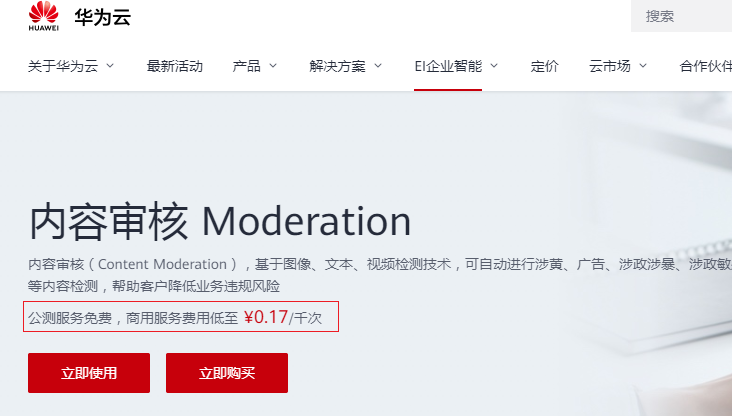

https://www.huaweicloud.com/product/textmoderation.html

 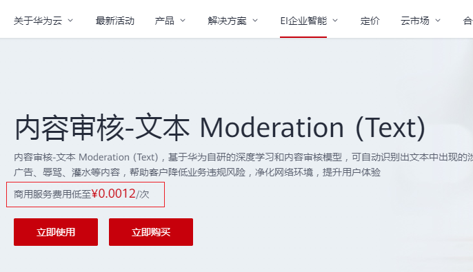

我们暂时只需要本和图像审核即可。

## 3.2. 使用说明

需要先注册华为云账户并且完成实名认证。

快速入门文档

文本审核：https://support.huaweicloud.com/qs-moderation/moderation_07_0001.html

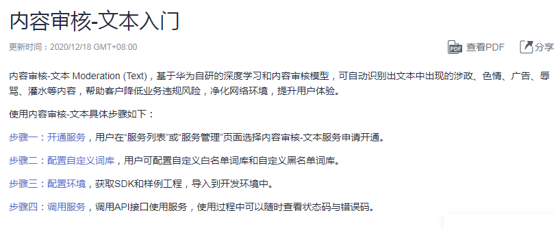

图像审核： https://support.huaweicloud.com/qs-moderation/moderation_07_0002.html

 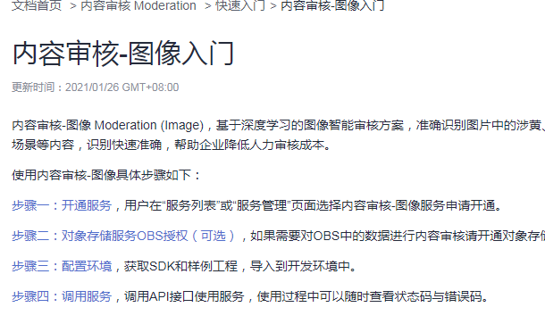

### 3.2.1. 开通服务

登陆后进入控制台，选择区域为 华东-上海一

 

 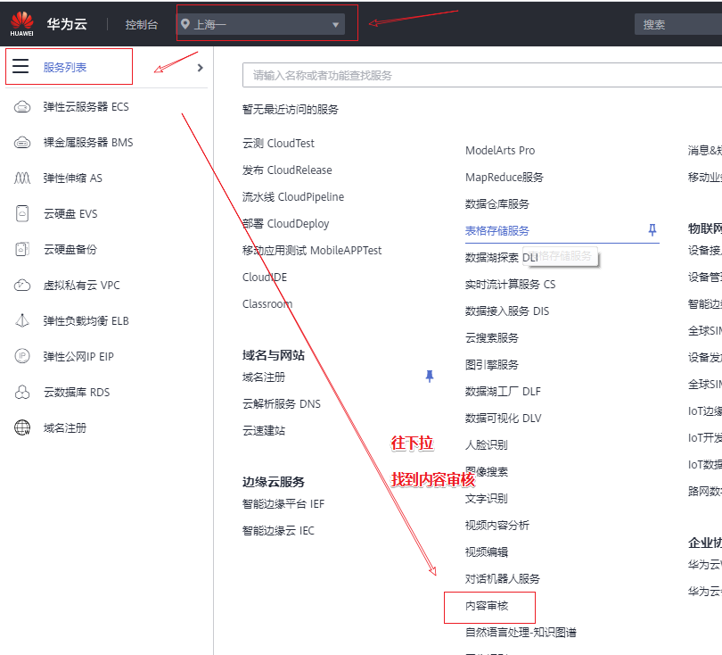

 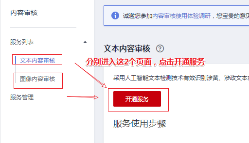


### 3.2.2. API调用信息收集

#### ① domain name

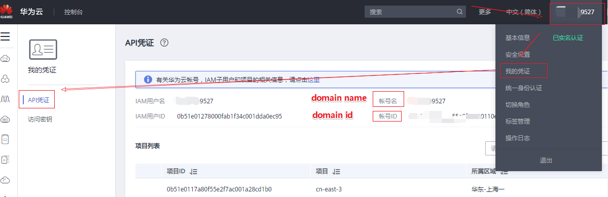

#### ② project name 

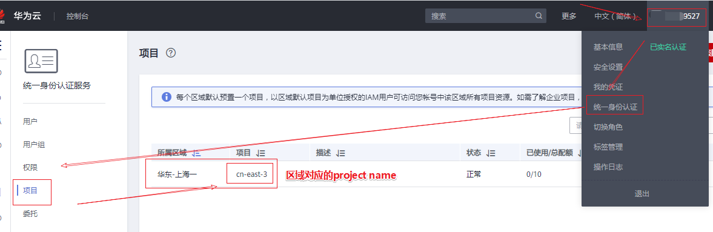

#### ③ Api基本路径

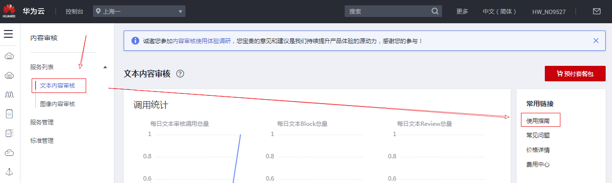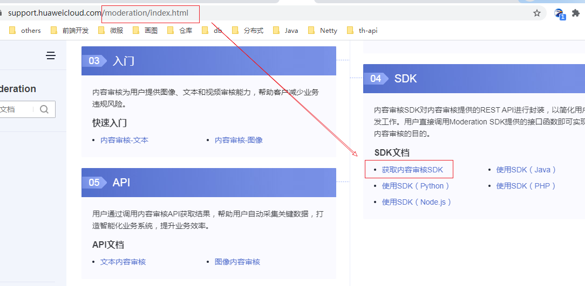

 

 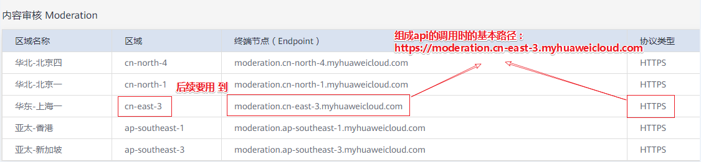

【注意】要根据开通内容审核时选择的区域来选择

这里我们获得调用api的基本路径

```
Api基本路径
https://moderation.cn-east-3.myhuaweicloud.com
```

#### ④ 文本与图像审核api获取

 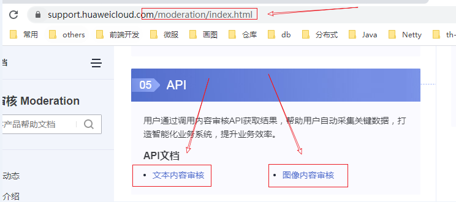

文本：POST /v1.0/moderation/text

图像：POST /v1.0/moderation/image

​		批量：POST  /v1.0/moderation/image/batch

```
文本审核完整api api基本路径+api
POST: https://moderation.cn-east-3.myhuaweicloud.com/v1.0/moderation/text
图像审核完整api api基本路径+api，项目里使用批量，用户发布动态时上传多个图片
POST: https://moderation.cn-east-3.myhuaweicloud.com/v1.0/moderation/image/batch
```

#### ⑤ Token授权获取

在文本内容审核api获取的上方，点开【如何调用API】->【认证鉴权】

 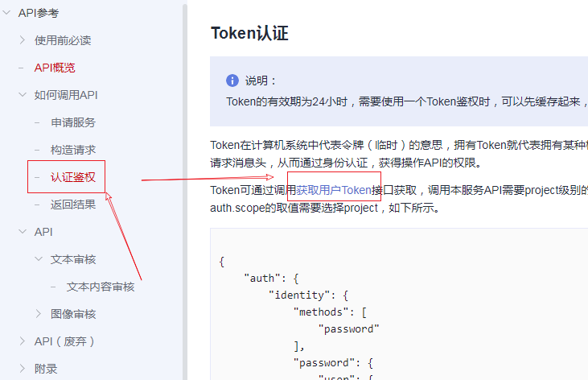

点击【获取用户Token】链接，在弹出的窗口中往下拉，找到 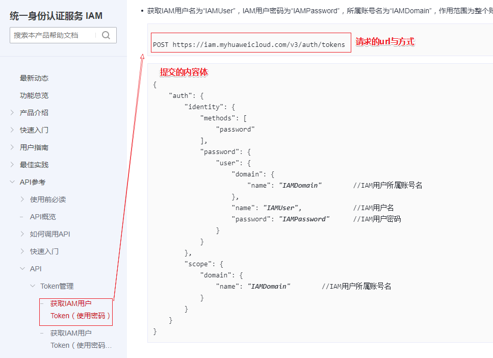


## 3.4. 抽取组件

tanhua-commons模块导入hutool依赖

```xml
<dependency>
    <groupId>cn.hutool</groupId>
    <artifactId>hutool-all</artifactId>
    <version>5.4.3</version>
</dependency>
```

tanhua父工程中

```xml
<!--通用依赖-->
<dependencies>
    。。。。。。
    <dependency>
        <groupId>com.apifan.common</groupId>
        <artifactId>common-random</artifactId>
        <version>1.0.5</version>
    </dependency>
</dependencies>
```

### 3.4.1. HuaWeiUGCProperties

```java
package com.tanhua.commons.properties;

import lombok.Data;
import org.springframework.boot.context.properties.ConfigurationProperties;
import org.springframework.context.annotation.Configuration;

@Configuration
@ConfigurationProperties(prefix = "tanhua.huawei")
@Data
public class HuaWeiUGCProperties {

    private String username;
    private String password;
    private String project;
    private String domain;
    private String categoriesText;
    private String categoriesImage;
    private String textApiUrl;
    private String imageApiUrl;
}
```

### 3.4.2. HuaWeiUGCTemplate

```java
package com.tanhua.commons.templates;

import cn.hutool.core.util.StrUtil;
import cn.hutool.http.HttpRequest;
import cn.hutool.http.HttpResponse;
import cn.hutool.json.JSONObject;
import cn.hutool.json.JSONUtil;
import com.tanhua.commons.properties.HuaWeiUGCProperties;
import org.apache.commons.lang3.time.DateUtils;

import java.util.Date;

/**
 * 华为 内容审核 工具模板
 */
public class HuaWeiUGCTemplate {

    private HuaWeiUGCProperties properties;

    private String token;

    private long expire = 0L;

    public HuaWeiUGCTemplate(HuaWeiUGCProperties properties) {
        this.properties = properties;
    }

    /**
     * 文本审核
     * 参考：https://support.huaweicloud.com/api-moderation/moderation_03_0018.html
     * @param textModeration
     * @return
     */
    public boolean textContentCheck(String textModeration) {
        String url = properties.getTextApiUrl();
        String reqBody = JSONUtil.createObj()
            .set("categories", StrUtil.split(properties.getCategoriesText(), ','))
            .set("items", JSONUtil.createArray()
                .set(JSONUtil.createObj()
                    .set("text", textModeration)
                    .set("type", "content")
                )
            ).toString();

        String resBody = HttpRequest.post(url)
            .header("X-Auth-Token", this.getToken())
            .contentType("application/json;charset=utf8")
            .setConnectionTimeout(3000)
            .setReadTimeout(2000)
            .body(reqBody)
            .execute()
            .body();

        JSONObject jsonObject = JSONUtil.parseObj(resBody);
        if (jsonObject.containsKey("result") && jsonObject.getJSONObject("result").containsKey("suggestion")) {
            String suggestion = jsonObject.getJSONObject("result").getStr("suggestion").toUpperCase();
            if ("PASS".equals(suggestion)) {
                return true;
            }
        }
        return false;
    }

    /**
     * 图片审核
     * 参数：https://support.huaweicloud.com/api-moderation/moderation_03_0036.html
     * @param urls 多个图片的完整地址
     * @return
     */
    public boolean imageContentCheck(String[] urls) {
        String url = properties.getImageApiUrl();
        String reqBody = JSONUtil.createObj()
            .set("categories", properties.getCategoriesImage().split(","))
            .set("urls", urls)
            .toString();

        String resBody = HttpRequest.post(url)
            .header("X-Auth-Token", this.getToken())
            .contentType("application/json;charset=utf8")
            .setConnectionTimeout(5000)
            .setReadTimeout(3000)
            .body(reqBody)
            .execute()
            .body();

        System.out.println("resBody=" + resBody);
        JSONObject jsonObject = JSONUtil.parseObj(resBody);
        if (jsonObject.containsKey("result")) {
            //审核结果中如果出现一个block或review，整体结果就是不通过，如果全部为PASS就是通过
            if (StrUtil.contains(resBody, "\"suggestion\":\"block\"")) {
                return false;
            } else if (StrUtil.contains(resBody, "\"suggestion\":\"review\"")) {
                return false;
            } else {
                return true;
            }
        }

        //默认人工审核
        return false;
    }

    /**
     * 获取授权Token
     * 参考 https://support.huaweicloud.com/api-iam/iam_30_0001.html
     * @return
     */
    public synchronized String getToken() {
        // 获取当前系统时间
        Long now = System.currentTimeMillis();
        // 判断token是否超时，超时需要重新获取
        if (now > expire) {
            // token的url
            String url = "https://iam.myhuaweicloud.com/v3/auth/tokens";
            // 构建请求体内容
            String reqBody = JSONUtil.createObj().set("auth", JSONUtil.createObj()
                .set("identity", JSONUtil.createObj()
                    .set("methods", JSONUtil.createArray().set("password"))
                    .set("password", JSONUtil.createObj()
                        .set("user", JSONUtil.createObj()
                            .set("domain", JSONUtil.createObj().set("name", properties.getDomain()))
                            .set("name", properties.getUsername())
                            .set("password", properties.getPassword())
                        )
                    )
                )
                .set("scope", JSONUtil.createObj()
                    .set("project", JSONUtil.createObj()
                        .set("name", properties.getProject())
                    )
                )
            ).toString();
            // 执行请求获取响应结果
            HttpResponse response = HttpRequest.post(url)
                .contentType("application/json;charset=utf8")
                .setConnectionTimeout(3000).setReadTimeout(5000)
                .body(reqBody).execute();
            // 获取返回的token
            token = response.header("X-Subject-Token");
            //设置Token有效时长 避免频繁获取
            setExpireTime(response.body());
        }
        return token;
    }

    /**
     * 设置Token有效时长，如果api有返回，则要提前5分钟获取新的Token
     * 默认有效时长2小时
     * @param jsonString
     */
    private void setExpireTime(String jsonString) {
        try {
            JSONObject jsonObject = JSONUtil.parseObj(jsonString);
            if (jsonObject.containsKey("token") && jsonObject.getJSONObject("token").containsKey("expires_at")) {
                String str = jsonObject.getJSONObject("token").getStr("expires_at");
                str = str.replace("T", " ");
                Date expireAt = DateUtils.parseDate(str.substring(0, 16), "yyyy-MM-dd HH:mm");
                expire = expireAt.getTime()-5*60*1000; // 提前5分钟
            }
        } catch (Exception e) {
        }
        // 没获取到有效期，则1小时后过期
        expire = System.currentTimeMillis() + 60*60*1000;
    }
}
```

### 3.4.3. CommonsAutoConfiguration

```java
@Configuration
//自动的读取yml中配置信息，并复制到SmsProperties对象，将此对象存入容器
@EnableConfigurationProperties({
        SmsProperties.class,
        OssProperties.class,
        AipFaceProperties.class,
        HuanXinProperties.class,
        HuaWeiUGCProperties.class
})
public class CommonsAutoConfiguration {
    
    。。。。。。
        
    @Bean
    public HuaWeiUGCTemplate huaWeiUGCTemplate(HuaWeiUGCProperties properties) {
        return new HuaWeiUGCTemplate(properties);
    }
}
```

### 3.4.4. application.yml

修改tanhua-manage工程application.yml

```yml
tanhua:
  huawei:
    username: 【用户名】
    password: 【密码】    
    project: 【project name】
    domain: 【domain name】
    # 图片检测内容 politics：是否涉及政治人物的检测，terrorism：是否包含涉政暴恐元素的检测，porn：是否包含涉黄内容元素的检测，ad：是否包含广告的检测（公测特性），all：包含politics、terrorism和porn三种场景的检测
    categoriesImage: politics,terrorism,porn
    # 文字检测内容 politics：涉政，porn：涉黄，ad：广告，abuse：辱骂，contraband：违禁品，flood：灌水
    categoriesText: politics,porn,ad,abuse,contraband,flood
    textApiUrl: https://moderation.cn-east-3.myhuaweicloud.com/v1.0/moderation/text
    imageApiUrl: https://moderation.cn-east-3.myhuaweicloud.com/v1.0/moderation/image/batch
```

### 3.4.5. 测试

```java
package com.tanhua.manage.test;

import com.tanhua.commons.templates.HuaWeiUGCTemplate;
import org.junit.Test;
import org.junit.runner.RunWith;
import org.springframework.beans.factory.annotation.Autowired;
import org.springframework.boot.test.context.SpringBootTest;
import org.springframework.test.context.junit4.SpringRunner;

@RunWith(SpringRunner.class)
@SpringBootTest
public class HuaWeiTest {

    @Autowired
    private HuaWeiUGCTemplate template;

    @Test
    public void testToken() {
        System.out.println(template.getToken());
    }

    @Test
    public void testText() {
        boolean check = template.textContentCheck("好好先生");
        System.out.println(check);
    }

    @Test
    public void testImages() {
        String[] urls = new String[]{
                "http://tanhua-dev.oss-cn-zhangjiakou.aliyuncs.com/images/logo/9.jpg",
                "http://tanhua-dev.oss-cn-zhangjiakou.aliyuncs.com/images/logo/10.jpg"
        };
        boolean check = template.imageContentCheck(urls);
        System.out.println(check);
    }
}
```

### 【小结】

掌握华为云内容审核组件使用

# 4. 动态审核

### 【目标】

掌握动态审核功能实现

### 【路径】

1：了解动态发布审核流程

2：掌握动态审核功能实现

### 【讲解】

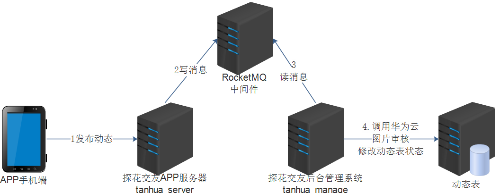

## 4.1. quanzi_publish

修改mongodb数据表，添加状态（state）字段，执行命令如下

添加新字段，并设置初始值为未审核状态

```shell
db.getCollection('quanzi_publish').update({},{$set:{state:NumberInt(0)}},{multi:1})
```

## 4.2. Publish

修改tanhua-domain中修改Publish对象，添加状态state属性

```java
@Data
@NoArgsConstructor
@AllArgsConstructor
@Document(collection = "quanzi_publish")
public class Publish implements java.io.Serializable {

    private static final long serialVersionUID = 8732308321082804771L;
    private ObjectId id; //主键id
    private Long pid; //Long类型，用于推荐系统的模型(自动增长)

    private Long userId;
    private String textContent; //文字
    private List<String> medias; //媒体数据，图片或小视频 url
    private Integer seeType; // 谁可以看，1-公开，2-私密，3-部分可见，4-不给谁看
    private String longitude; //经度
    private String latitude; //纬度
    private String locationName; //位置名称

    private Long created; //发布时间
    private Integer state=0;// 状态0：待审核，1：已审核，2：已驳回
    
    private Integer likeCount=0; //点赞数
    private Integer commentCount=0; //评论数
    private Integer loveCount=0; //喜欢数
}
```

添加状态属性state

state=0：待审核

state=1：已审核

state=2：已驳回

## 4.3. MomentService

修改tanhua-server中的MovementsService类，在添加动态之后，发送MQ消息

```java
/**
  * 发布动态
  * @param publishVo
  * @param imageContent
  */
public void save(PublishVo publishVo, MultipartFile[] imageContent) throws IOException {
    // 上传文件到云存储
    List<String> medias = new ArrayList<String>();
    for (MultipartFile multipartFile : imageContent) {
        String filename = multipartFile.getOriginalFilename();
        String path = ossTemplate.upload(filename, multipartFile.getInputStream());
        medias.add(path);
    }
    publishVo.setUserId(UserHolder.getUserId());
    publishVo.setMedias(medias);

    // 得到动态的id
    String publishId = publishApi.add(publishVo);

    // 发送消息，由消费者自动审核
    try {
        rocketMQTemplate.convertAndSend("tanhua-publish",publishId);
    } catch (MessagingException e) {
        log.error("发送MQ消息失败",e);
    }
}
```

## 4.4. PublishApi

修改publishApi中的save方法返回值

```java
/**
  * 添加用户动态
  * @param publishVo
  */
String add(PublishVo publishVo);

/**
  * 更新 动态的状态
  * @param id
  * @param state
  */
void updateState(String id, Integer state);
```

## 4.5. PublishApiImpl

修改PublishApiImpl中的save方法返回值

```java
/**
  * 添加用户动态
  * @param publishVo
  */
@Override
public String add(PublishVo publishVo) {
    // 1. 保存到发布的总表
    long currentTimeMillis = System.currentTimeMillis();
    Publish publish = new Publish();
    BeanUtils.copyProperties(publishVo,publish);
    publish.setId(ObjectId.get());
    publish.setPid(idService.nextId("quanzi_publish"));
    publish.setLocationName(publishVo.getLocation());
    publish.setCreated(currentTimeMillis);
    publish.setSeeType(1); // 1-公开
    mongoTemplate.save(publish,"quanzi_publish_" + publish.getUserId());

    // 2. 保存到相册
    Album album = new Album();
    album.setCreated(currentTimeMillis);
    album.setPublishId(publish.getId());
    album.setId(ObjectId.get());
    mongoTemplate.save(album,"quanzi_album_" + publish.getUserId());
    // 3. 查询好友
    Query query = Query.query(Criteria.where("userId").is(publishVo.getUserId()));
    List<Friend> friends = mongoTemplate.find(query, Friend.class);

    // 4. 保存到好友表
    friends.forEach(f->{
        TimeLine timeLine = new TimeLine();
        timeLine.setCreated(currentTimeMillis);
        timeLine.setPublishId(publish.getId());
        timeLine.setUserId(publish.getUserId());
        timeLine.setId(ObjectId.get());
        mongoTemplate.save(timeLine,"quanzi_time_line_" + f.getFriendId());
    });
    return publish.getId().toHexString();
}

/**
  * 更新动态的状态
  * @param id
  * @param state
  */
@Override
public void updateState(String id, Integer state) {
    Query query = new Query();
    query.addCriteria(Criteria.where("id").is(id));

    Update update = new Update();
    update.set("state",state);
    mongoTemplate.updateFirst(query,update,Publish.class);
}
```

## 4.3. PublishMessageListener

tanhua-manage中添加监听器处理消息

```java
package com.tanhua.manage.listener;

import com.alibaba.fastjson.JSON;
import com.tanhua.commons.templates.HuaWeiUGCTemplate;
import com.tanhua.domain.mongo.Publish;
import com.tanhua.dubbo.api.mongo.PublishApi;
import com.tanhua.manage.domain.Log;
import com.tanhua.manage.service.LogService;
import org.apache.dubbo.config.annotation.Reference;
import org.apache.rocketmq.spring.annotation.RocketMQMessageListener;
import org.apache.rocketmq.spring.core.RocketMQListener;
import org.springframework.beans.factory.annotation.Autowired;
import org.springframework.stereotype.Component;

import java.util.Map;

@Component
@RocketMQMessageListener(
        topic = "tanhua-publish",consumerGroup = "tanhua-publish-consumer"
)
public class PublishMessageListener implements RocketMQListener<String> {

    @Reference
    private PublishApi publishApi;

    @Autowired
    private HuaWeiUGCTemplate template;

    @Override
    public void onMessage(String id) {
        System.out.println("开始审核动态内容id="+id);
        Publish publish = publishApi.findById(id);

        //1、只会对状态=0的动态，进行内容审核
        if(publish.getState() == 0) {
            //2、调用template工具，审核文字内容
            boolean textCheck = template.textContentCheck(publish.getTextContent());
            //3、调用template工具，审核图片内容
            boolean imageCheck = template.imageContentCheck(publish.getMedias().toArray(new String[]{}));//传递图片的所有URL数组
            //4、根据审核结果更新publish状态
            Integer state = 2; //审核驳回
            if(textCheck && imageCheck) {
                state = 1;
            }
            publishApi.updateState(id,state);
        }
    }
}
```

### 【小结】

掌握动态审核功能实现

# 总结

* 基于RocketMQ完成操作日志的收集
* 后台管理系统
  - 手机端操作完成之后，tanhua-server向rocketMQ发送操作日志消息
  - 后台系统tanhua-manage从RocketMQ获取消息,写入到后台系统的日表中 tb_log
  - 通过定时任务，完成数据的统计和分析，写入到统计表中
  - 从统计表中，查询统计结果
* 华为云内容审核
* 动态审核
  * 整体执行流程

