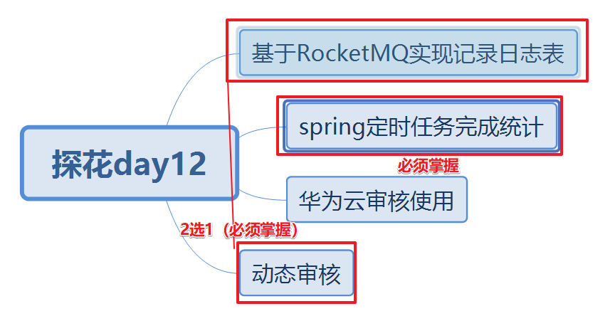
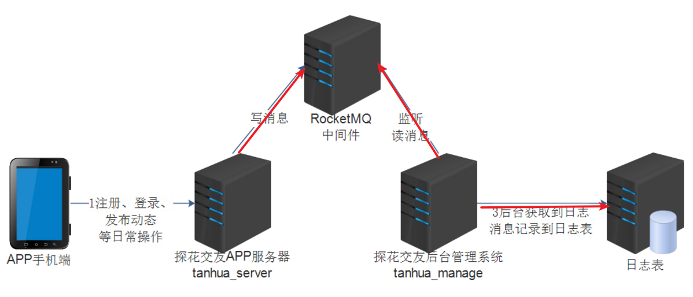
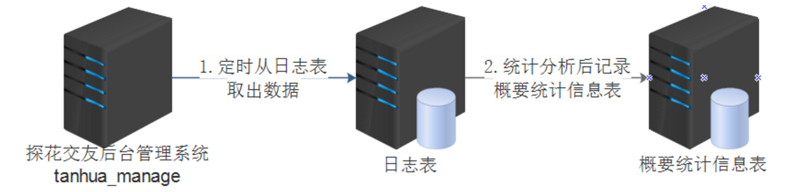
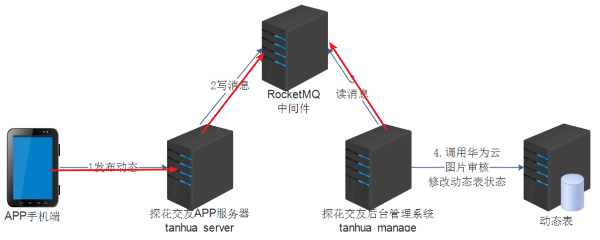

# 今日内容介绍



# 基于RocketMQ实现日志表

## 需求分析



1.tanhua_server工程写什么消息内容到RocketMQ?

答：userId：用户id  logTime:日志时间  type：操作类型

0101为登录，0102为注册，0201为发动态，0202为浏览动态，0203为动态点赞，0204为动态喜欢，0205为评论，0206为动态取消点赞，0207为动态取消喜欢，0301为发小视频，0302为小视频点赞，0303为小视频取消点赞，0304为小视频评论

2.tanhua_manage工程获取到消息后如何进行业务处理？

答：将接收到的消息封装日志对象，调用dao保存数据库表。

## 数据库表

tb_log：往日志表插入数据

## 消息生产者编码分析

1. 在对应的操作业务代码中，加入生成消息的代码。（演示：**注册登录**中加入代码）
2. 引入依赖
3. 加入配置

## 消息消费者编码分析

1. 引入依赖
2. 加入配置
3. 编写监听类实现RocketMQListener接口 类上指定监听的主题 消费组组名
4. onMessage方法中获取到消息保存log表


## 测试

问题：sendDefaultImpl call timeout; 发送消息到消息队列超时了

解决：

```
rocketmq:
  name-server: 10.10.20.160:9876
  producer:
    group: tanhua
    sendMessageTimeout: 60000
```

测试结果：{"type":"0101","userId":1,"logTime":"2021-07-15"}


# 定时任务统计分析

## 需求分析



通过spring定时（每隔1小时）任务将日志表统计分析后写入概要统计信息表中。

## 数据库

0101为登录，0102为注册，0201为发动态，0202为浏览动态，0203为动态点赞，0204为动态喜欢，0205为评论，0206为动态取消点赞，0207为动态取消喜欢，0301为发小视频，0302为小视频点赞，0303为小视频取消点赞，0304为小视频评论


日志表：查询（统计分析）

num_registered：新注册用户数

select count(*) from tb_log where log_time = '2021-07-15' and type = '0102'


num_active：活跃用户数

select count(DISTINCT user_id) from tb_log where log_time = '2021-07-15' 


num_login：登陆次数

select count(*) from tb_log where log_time = '2021-07-15' and type = '0101'


num_retention1d：次日留存用户数

select * from tb_log where user_id in(
select user_id from tb_log where  log_time ='2021-07-14' and type = '0102')
and log_time = '2021-07-15'


概要统计信息表：插入 与 修改（业务处理）


# 华为云使用

```
domain name: hw23848243
domain id:0ac291a6f48010241fd5c00bcf7b87c6
项目 区域：cn-east-3
endpoint:https://moderation.cn-east-3.myhuaweicloud.com/
文本审核路径：POST /v1.0/moderation/text
图片审核路径：POST /v1.0/moderation/image/batch
```


# 动态审核

## 需求分析



1.tanhua_server工程写什么消息内容到RocketMQ?

答：发布id  

2.tanhua_manage工程获取到消息后如何进行业务处理？

答：根据发布id查询发布表得到动态文本内容 动态图片地址 

## 数据库表

quanzi_publish：审核（状态字段修改）state=0;// 状态0：待审核，1：已审核，2：已驳回

## 消息生产者编码分析

1.quanzi_publish表新增一个状态字段（状态默认值改为1）

2.找到发布动态代码，在发布动态后将发布id以消息形式写入RocketMQ

## 消息消费者编码分析

1.编写监听类实现监听接口，类上指定动态审核主题，指定消费者组名称

2.在onMessage方法中，根据消息中发布id查询发布表，获取文本内容 与 图片地址urls

3.分别调用华为云api进行审核，只要有一个审核return false，结果审核驳回，反之审核通过。

4.根据发布id修改状态值=1 或 2


# 演讲

RocketMQ实现日志表  或   动态审核


