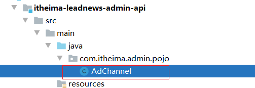
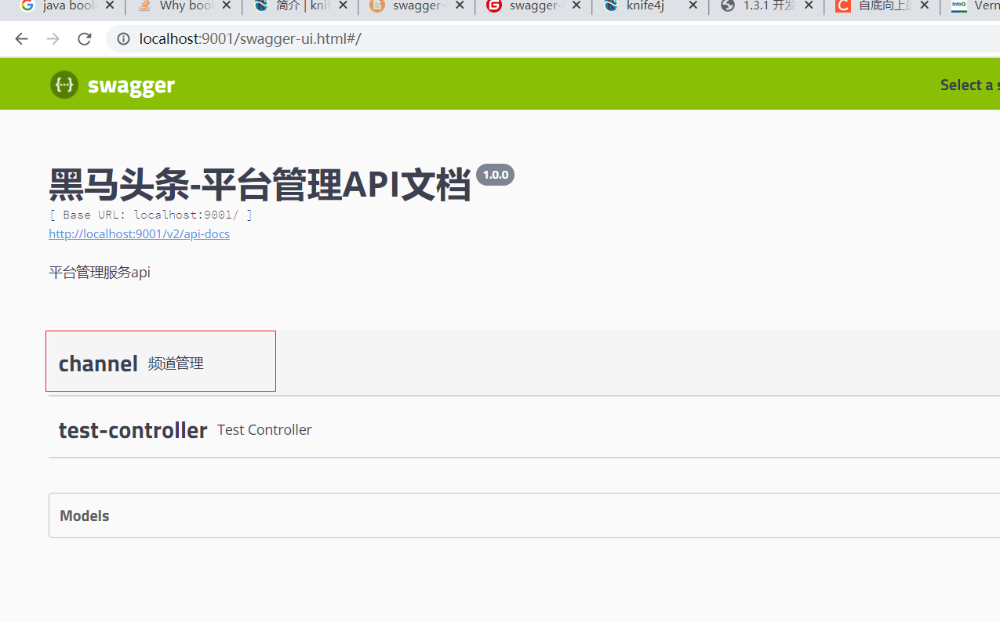

# 第一章 环境搭建

## 学习目标：

- 能够描述黑马头条项目有哪些业务
- 能够了解黑马头条项目使用到什么技术
- 能够了解黑马头条数据库设计过程
- 能够掌握初始化工程的搭建
- 能够掌握接口开发的流程
- 能够完成频道管理的功能开发
- 能够掌握使用接口swagger、postman、knife4j


## 1 项目介绍

### 1.1项目背景

​		随着智能手机的普及，人们更加习惯于通过手机来看新闻。由于生活节奏的加快，很多人只能利用碎片时间来获取信息，因此，对于移动资讯客户端的需求也越来越高。黑马头条项目正是在这样背景下开发出来。黑马头条项目采用当下火热的微服务+大数据技术架构实现。本项目主要着手于获取最新最热新闻资讯，通过大数据分析用户喜好精确推送咨询新闻


### 1.2 项目概述

黑马头条项目是对在线教育平台业务进行大数据统计分析的系统。碎片化、切换频繁、社交化和个性化现如今成为人们阅读行为的标签。黑马头条对海量信息进行搜集，通过系统计算分类，分析用户的兴趣进行推送从而满足用户的需求。


### 1.3 项目术语定义

- 项目：泛指黑马头条整个项目或某一项目模块
- 工程：泛指黑马头条某一项目的源码工程


- 用户：泛指黑马头条APP用户端用户
- 自媒体人：泛指通过黑马自媒体系统发送文章的用户
- 管理员：泛指黑马头条管理系统的使用用户


- App：泛指黑马头条APP
- WeMedia：泛指黑马头条自媒体系统
- Admin：泛指黑马头条管理系统

## 2 需求说明

### 2.1 功能架构图


### 2.2 APP主要功能大纲

- 频道栏：用户可以通过此功能添加自己感兴趣的频道，在添加标签时，系统可依据用户喜好进行推荐
- 文章列表：需要显示文章标题、文章图片、评论数等信息，且需要监控文章是否在APP端展现的行为

- 搜索文章：联想用户想搜索的内容，并记录用户的历史搜索信息
- 个人中心：用户可以在其个人中心查看收藏、关注的人、以及系统设置等功能
- 查看文章：用户点击文章进入查看文章页面，在此页面上可进行点赞、评论、不喜欢、分享等操作；除此之外还需要收集用户查看文章的时间，是否看我等行为信息

- 实名认证：用户可以进行身份证认证和实名认证，实名认证之后即可成为自媒体人，在平台上发布文章
- 注册登录：登录时，验证内容为手机号登录/注册，通过手机号验证码进行登录/注册，首次登录用户自动注册账号。

### 2.3 自媒体端功能大纲

- 内容管理：自媒体用户管理文章页面，可以根据条件进行筛选，文章包含草稿、已发布、未通过、已撤回状态。用户可以对文章进行修改，上/下架操作、查看文章状态等操作
- 评论管理：管理文章评论页面，显示用户已发布的全部文章，可以查看文章总评论数和粉丝评论数，可以对文章进行关闭评论等操作

- 素材管理：管理自媒体文章发布的图片，便于用户发布带有多张图片的文章

- 图文数据：自媒体人发布文章的数据：阅读数、评论数、收藏了、转发量，用户可以查看对应文章的阅读数据
- 粉丝画像：内容包括：粉丝性别分布、粉丝年龄分布、粉丝终端分布、粉丝喜欢分类分布

### 2.4 平台管理端功能大纲

- 用户管理：系统后台用来维护用户信息，可以对用户进行增删改查操作，对于违规用户可以进行冻结操
- 用户审核：管理员审核用户信息页面，用户审核分为身份审核和实名审核，身份审核是对用户的身份信息进行审核，包括但不限于工作信息、资质信息、经历信息等；实名认证是对用户实名身份进行认证

- 内容管理：管理员查询现有文章，并对文章进行新增、删除、修改、置顶等操作
- 内容审核：管理员审核自媒体人发布的内容，包括但不限于文章文字、图片、敏感信息等
- 频道管理：管理频道分类界面，可以新增频道，查看频道，新增或修改频道关联的标签
- 网站统计：统计内容包括：日活用户、访问量、新增用户、访问量趋势、热门搜索、用户地区分布等数据
- 内容统计：统计内容包括：文章采集量、发布量、阅读量、阅读时间、评论量、转发量、图片量等数据
- 权限管理：超级管理员对后台管理员账号进行新增或删除角色操作

### 2.5 其它需求


### 2.6 交互需求


## 3 技术结构图

包括前端（Weex、Vue、Echarts、WS）、网关（GateWay）、DevOps（单元测试、代码规范）

服务层中包括中间件（Kafka）、索引、微服务、大数据存储等重难点技术


- Weex+Vue+WebSocket ：使用Weex跨平台开发工具，整合集成VUE框架，完成黑马头条移动端功能开发，并集成WebSocket实现即时消息（文章推荐、私信）的推送
- Vue+Echarts ： 自媒体系统使用Vue开发关键，集成Echarts图表框架，完成相关粉丝画像、数据分析等功能
- Vue+Echarts+WebSocket ： 管理系统也是使用Vue开发，集成Echarts，完成网站统计、内容统计等功能，集成WebSocket，实现系统看板实时数据自动化更新
- Spring-Cloud-Gateway : 微服务之前架设的网关服务，实现服务注册中的API请求路由，以及控制流速控制和熔断处理都是常用的架构手段，而这些功能Gateway天然支持
- PMD&P3C : 静态代码扫描工具，在项目中扫描项目代码，检查异常点、优化点、代码规范等，为开发团队提供规范统一，提升项目代码质量
- Junit : 在持续集成思想中，单元测试偏向自动化过程，项目通过Junit+Maven的集成实现这种过程
- 运用Spring Boot快速开发框架，构建项目工程；并结合Spring Cloud全家桶技术，实现后端个人中心、自媒体、管理中心等微服务。
- 运用WebMagic爬虫技术，完善系统内容自动化采集
- 运用Kafka完成内部系统消息通知；与客户端系统消息通知；以及实时数据计算
- 运用MyCat数据库中间件计算，对系统数据进行分开分表，提升系统数据层性能
- 运用Redis缓存技术，实现热数据的计算，NoSession等功能，提升系统性能指标
- 运用Zoookeeper技术，完成大数据节点之后的协调与管理，提升系统存储层高可用
- 使用Mysql存储用户数据，以保证上层数据查询的高性能
- 使用Mongo存储用户热数据，以保证用户热数据高扩展和高性能指标
- 使用FastDFS作为静态资源存储器，在其上实现热静态资源缓存、淘汰等功能
- 运用Habse技术，存储系统中的冷数据，保证系统数据的可靠性
- 运用ES搜索技术，对冷数据、文章数据建立索引，以保证冷数据、文章查询性能
- 运用Sqoop、Kettle等工具，实现大数据的离线入仓；或者数据备份到Hadoop
- 运用Spark+Hive进行离线数据分析，实现系统中各类统计报表
- 运用Spark Streaming + Hive+Kafka实现实时数据分析与应用；比如文章推荐
- 运用Neo4j知识图谱技术，分析数据关系，产出知识结果，并应用到上层业务中，以帮助用户、自媒体、运营效果/能力提升。比如粉丝等级计算
- 运用AI技术，来完成系统自动化功能，以提升效率及节省成本。比如实名认证自动化

## 4 数据库设计

### 4.1 ER图设计


er图设计划分出了9个库，各个库主要解决的是某一个特定的业务。

数据库设计规范，详见资料文件夹下《黑马头条-数据库规范设计说明书.md》文件。

PowerDesinger工具使用，详见资料文件夹下'powerdesinger的基本使用'文件夹里的《powerdesinger的基本使用》文件。

### 4.2 分库设计

​		黑马头条项目采用的分库分表设计，因为业务比较复杂，后期的访问量巨大，为了分摊数据库的压力，整个项目用的不只是一个数据库。其中核心库有**5**个，每一个数据库解决的是一个业务点，非常接近与实际项目设计。


- AppInfo  app信息库，主要存储用户信息，文章信息，用户动态，用户评论，用户认证等信息
- Behavior  用户行为库，主要存储用户行为，包括用户的转发，点赞，评论行为等
- WeMedia  多媒体库，主要存储多媒体人图文数据统计，账号信息，粉丝相关信息等。
- Crawlers  爬虫库，主要存储从网络上爬取的文章信息等。
- Admin  后台管理库，主要存储后台管理员的信息。

### 4.3 核心数据流转图


> 说明：整个项目其核心数据为文章信息，上图主要说明文章的数据流转
>
> 1 爬虫系统从外网采集数据后入**爬虫库**，即爬虫库中保存了一份采集的文章信息
>
> 2 自媒体人可以通过发布文章后首先进入**自媒体库**
>
> 3 爬虫文章和自媒体文章最后都要经过审核成功后入**appinfo库**，这里面的文章信息，最终是要给app端用户所查看
>
> 4 在app端用户查看的时候，需要记录用户的一些行为，如转发、评论、点赞等需要入**用户行为库**

### 4.4 冗余设计

​		黑马头条项目全部采用逻辑关联，没有采用主外键约束。也是方便数据源冗余，尽可能少的使用多表关联查询。冗余是为了效率，减少join。单表查询比关联查询速度要快。某个访问频繁的字段可以冗余存放在两张表里，不用关联了。

​		如查询一个订单表需要查询该条订单的用户名称，就必须join另外用户表，如果业务表很大，那么就会查询的很慢，这个时候我们就可以使用冗余来解决这个问题，在新建订单的同时不仅仅需要把用户ID存储，同时也需要存储用户的名称，这样我们在查询订单表的时候就不需要去join另外用户表，也能查询出该条订单的用户名称。这样的冗余可以直接的提高查询效率，单表更快。


### 4.5 导入数据库

 

**如上图所示。导入数据库即可。实际上后面我们给大家提供了一个虚拟机 用于模拟开发环境，只需要启动虚拟机即可，不需要再次导入。**

## 5 初始工程搭建

### 5.1 工程结构说明

 


整体如下：

 

解释：

```properties
itheima-leadnews 为所有工程的父工程 打包方式为POM
itheima-leadnews-api 为所有微服务对应相关POJO及依赖的feign所在的聚合工程  打包方式为POM 
itheima-leadnews-common 所有的通用的工具类 依赖包 pojo 等的工程，打包方式为jar 
itheima-leadnews-common-db 所有需要用到的持久层相关 例如mybatis 等，打包方式为jar
itheima-leadnews-core 所有的核心抽取工程的聚合工程,用于抽取通用controller,feign等 打包方式为pom
itheima-leadnews-gateway 所有的网关微服务聚合工程 聚合所有的网关微服务便于统一管理 打包方式为pom
itheima-leadnews-service 所有微服务所在聚合工程 聚合所有的用到的微服务 便于统一管理 打包方式为pom
```


### 5.2 后端通用工程搭建

#### 5.2.1 开发环境说明

项目依赖环境：

- JDK1.8
- Intellij Idea
- spring cloud alibaba 
- spring cloud 
- centos7
- docker

idea 配置：

jdk1.8 以及使用utf-8编码 全局设置。

#### 5.2.2 初始工程导入

 

参考如上图所示的工程，进行导入idea工程即可。

## 6 后端开发-通用说明及开发规范

### 6.1 什么是前后端开发

项目基于前后端分离的架构进行开发，前后端分离架构总体上包括前端和服务端，通常是多人协作开发

- 对于后端java工程师：

  把精力放在设计模式，spring+springmvc，linux，mysql事务隔离与锁机制，mongodb，http/tcp，多线程，分布式架构，弹性计算架构，微服务架构，java性能优化，以及相关的项目管理等等。

- 对于前端工程师：

  把精力放在html5，css3，vuejs，webpack，nodejs，Google V8引擎，javascript多线程，模块化，面向切面编程，设计模式，浏览器兼容性，性能优化等等。

#### 6.1.1前后端分离开发流程


#### 6.1.2 前后端开发流程

1，需求分析

梳理用户的需求，分析业务流程

2，接口定义

根据需求分析定义接口，定义出接口文档

3，服务端和前端并行开发

服务端：依据接口文档进行服务端接口开发

前端：根据用户需求开发操作界面，并根据接口文档制作mock数据，进行测试

4，前后端集成接口联调

最终前端调用服务端接口完成业务

#### 6.1.3 接口文档

##### 6.1.3.1 什么是接口文档？

在项目开发中，web项目的前后端分离开发，APP开发，需要由前后端工程师共同定义接口，编写接口文档，之后大家都根据这个接口文档进行开发，到项目结束前都要一直维护。

**简单来说：就是定义前后端沟通共同开发的文档。**

##### 6.1.3.2 为什么要写接口文档？

1、项目开发过程中前后端工程师有一个统一的文件进行沟通交流开发。不能靠“嘴遁”。
2、项目维护中或者项目人员更迭，方便后期人员查看、维护。

##### 6.1.3.3 接口文档的原则规范是什么？

对使用文档的用户（前端）而言

+ 易理解
+ 易阅读
+ 易使用

对编写文档的用户（后台）而言

+ 易编写
+ 易开发
+ 易阅读

所以基本上按照以上原则编写即可，那接口的规范其实就是 定义好相关的描述并容易理解阅读。

API规范：清晰的描述出接口的作用 请求参数 请求路径 返回值 请求体 请求头 响应头等信息。

例如：


 

参考地址：

```html
http://swagger-bootstrap-ui.xiaominfo.com/doc.html#/1.8.X%E7%89%88%E6%9C%AC%E6%8E%A5%E5%8F%A3/1.8.9%E7%89%88%E6%9C%AC-20190107/numberInvalidRest1UsingGET
```


##### 6.1.3.4 接口文档的表现形式有哪些？

一般来说，接口文档是需要后台开发人员来提供的，接口文档的形式有许多种,任何形式都是可以的。例如

+ word文档
+ md文档
+ html文档
+ 嘴说（这个权当玩笑）

那么就出现了一个问题：如上所示需要开发人员 编写接口文档岂不是很累？要写许多的请求路径 和参数 以及示例值，工作强度大，时间耗费，所以我们开发人员可使用一些程序帮我们一键生成接口文档，那么这个技术可以使用：swagger 以及升级版的[knife4j](https://doc.xiaominfo.com/knife4j/) 后面我们会使用到。

### 6.2 后端接口开发规范

#### 6.2.1 开发原则

- 自顶向下的设计原则：功能应该从表现层分析再到控制层、服务层、持久层逐层设计

- 自底向上的开发原则：上层需调用下层，因此开发应从底层向上层逐层开发（但是不是一概而论）

- 单一职责的开发原则：类或者方法提供的功能应该单一明确，特别越底层越应单一职责，以便维护

  项目中Mapper方法必须功能单一，参数明确，拒绝两种以上的持久逻辑使用同一个Mapper方法

- 依赖倒置的开发原则：上层依赖下层，是依赖下层接口，并不是依赖下层的实现

  项目中每层都是通过接口调用Controller->Service->Mapper

#### 6.2.2 开发步骤

+ 明确需求：根据原型文件进行需求分析

- 明确类定义：明确哪些是重用类，哪些是需要新增的类
- 明确主键规则：确认操作表的ID生成规则，自增或id_work
- ControllerApi定义：定义接口
- Mapper实现:使用mybatis-plus封装的方法还是自定义mapper映射
- Service实现：可用通过时序图帮助我们梳理实现逻辑
- Controller实现：简单的Service层调用
- 单元测试或接口测试或前端直接联调测试


### 6.3 接口通用请求和响应

**dto(Data Transfer Object)**:数据传输对象,用于展示层与服务层之间的数据传输对象

 

#### 6.3.1 通用的响应对象：

```java
package com.itheima.common.pojo;

import io.swagger.annotations.ApiModel;
import io.swagger.annotations.ApiModelProperty;

import java.io.Serializable;

/**
 * @author ljh
 * @version 1.0
 * @date 2021/2/19 10:43
 * @description 标题
 * @package com.itheima.common.pojo
 */

@ApiModel(description = "通用返回响应结果对象", value = "result")
public class Result<T> implements Serializable {
    @ApiModelProperty(notes = "响应结果的错误信息", required = true)
    private String message;
    @ApiModelProperty(notes = "响应结果的错误信息状态码,2000X表示成功,4000X表示错误，5000X表示服务端异常", required = true)
    private Integer code;
    @ApiModelProperty(notes = "响应结果逻辑数据", required = true)
    private T data;

    //成功 并不返回数据
    public static <T> Result<T> ok() {
        return new Result<T>(StatusCode.SUCCESS.message(), StatusCode.SUCCESS.code(), null);
    }

    //成功 并返回数据
    public static <T> Result<T> ok(T data) {
        return new Result<T>(StatusCode.SUCCESS.message(), StatusCode.SUCCESS.code(), data);
    }

    //系统错误 不返回数据
    public static <T> Result<T> error() {
        return new Result<T>(StatusCode.FAILURE.message(), StatusCode.FAILURE.code(), null);
    }

    //系统错误 并返回逻辑数据
    public static <T> Result<T> error(T data) {
        return new Result<T>(StatusCode.FAILURE.message(), StatusCode.FAILURE.code(), data);
    }

    //错误并返回指定错误信息和状态码以及逻辑数据
    public static <T> Result<T> error(StatusCode statusCode, T data) {
        return new Result<T>(statusCode.message(), statusCode.code(), data);
    }

    // 错误并返回指定错误信息和状态码 不返回数据
    public static <T> Result<T> error(StatusCode statusCode) {
        return new Result<T>(statusCode.message(), statusCode.code(), null);
    }

    //自定义错误和状态返回
    public static <T> Result<T> errorMessage(String message, Integer code, T data) {
        return new Result<T>(message, code, data);
    }
    //自定义错误信息 状态码固定
    public static <T> Result<T> errorMessage(String message) {
        return new Result<T>(message, StatusCode.CUSTOM_FAILURE.code(), null);
    }


    public Result() {

    }

    public Result(String message, Integer code, T data) {
        this.message = message;
        this.code = code;
        this.data = data;
    }

    public String getMessage() {
        return message;
    }

    public void setMessage(String message) {
        this.message = message;
    }

    public Integer getCode() {
        return code;
    }

    public void setCode(Integer code) {
        this.code = code;
    }

    public T getData() {
        return data;
    }

    public void setData(T data) {
        this.data = data;
    }

	 /**
     * 是否操作成功 2000X 都是成功
     *
     */
    public Boolean isSuccess() {
        //2000开头的表示成功
        if (code.toString().startsWith("2000")) {
            return true;
        }
        return false;
    }
}
```

#### 6.3.2 通用的分页请求对象


```java
package com.itheima.common.pojo;

import lombok.AllArgsConstructor;
import lombok.Builder;
import lombok.Data;
import lombok.NoArgsConstructor;

import java.io.Serializable;

/**
 * @author ljh
 * @version 1.0
 * @date 2021/2/20 11:38
 * @description 标题
 * @package com.itheima.common.pojo
 */
@NoArgsConstructor
@AllArgsConstructor
@Data
public class PageRequestDto<T> implements Serializable {
    //当前页码
    private Long page = 1L;
    //每页显示的行
    private Long size = 10L;
    //请求体实体对象
    private T body;
}

```


#### 6.3.3 通用的异常枚举

```java
package com.itheima.common.pojo;

/**
 * 枚举类状态码
 *
 * @author ljh
 * @version 1.0
 * @date 2021/2/19 10:49
 * @description 标题
 * @package com.itheima.common.pojo
 */
public enum StatusCode {
    //区分与http状态码
    SUCCESS(20000, "操作成功"),
    PARAM_ERROR(40000, "参数异常"),
    NOT_FOUND(40004, "资源不存在"),
    FAILURE(50000, "系统异常");

    private final Integer code;

    private final String message;

    StatusCode(Integer code, String message) {
        this.code = code;
        this.message = message;
    }

    //获取状态码
    public Integer code() {
        return code;
    }

    //获取信息
    public String message() {
        return message;
    }

    @Override
    public String toString() {
        return String.valueOf(this.code);
    }
}

```

#### 6.3.4 分页返回对象

```java
package com.itheima.common.pojo;

import jdk.nashorn.internal.objects.annotations.Constructor;
import lombok.AllArgsConstructor;
import lombok.Data;
import lombok.NoArgsConstructor;

import java.io.Serializable;
import java.util.List;

/**
 * 分页相关的封装对象
 *
 * @author ljh
 * @version 1.0
 * @date 2021/2/19 11:10
 * @description 标题
 * @package com.itheima.common.pojo
 */

@Data
@NoArgsConstructor
@AllArgsConstructor
public class PageInfo<T> implements Serializable {
    //当前页码
    private Long page;
    //每页显示行
    private Long size;
    //总记录数
    private Long total;
    //总页数
    private Long totalPages;
    //当前页记录
    private List<T> list;
}
```


### 6.4 springboot开发环境说明（此操作不需要在代码中实现）

采用springboot的profile方式进行切换即可,举例如下：

```yaml
spring:
  profiles:
    active: dev
---
server:
  port: 9001
spring:
  application:
    name: leadnews-admin
  profiles: dev  
  datasource:
    driver-class-name: com.mysql.jdbc.Driver
    url: jdbc:mysql://localhost:3306/leadnews_admin?useSSL=false&useUnicode=true&characterEncoding=UTF-8&serverTimezone=&serverTimezone=Asia/Shanghai
    username: root
    password: 123456  
# 设置Mapper接口所对应的XML文件位置，如果你在Mapper接口中有自定义方法，需要进行该配置
mybatis-plus:
  mapper-locations: classpath*:mapper/*.xml
  # 设置别名包扫描路径，通过该属性可以给包中的类注册别名
  type-aliases-package: com.heima.model.admin.pojos
---
server:
  port: 9001
spring:
  application:
    name: leadnews-admin
  profiles: pro
  datasource:
    driver-class-name: com.mysql.jdbc.Driver
    url: jdbc:mysql://localhost:3306/leadnews_admin?useSSL=false&useUnicode=true&characterEncoding=UTF-8&serverTimezone=&serverTimezone=Asia/Shanghai
    username: root
    password: 123456
# 设置Mapper接口所对应的XML文件位置，如果你在Mapper接口中有自定义方法，需要进行该配置
mybatis-plus:
  mapper-locations: classpath*:mapper/*.xml
  # 设置别名包扫描路径，通过该属性可以给包中的类注册别名
  type-aliases-package: com.heima.model.admin.pojos
---
server:
  port: 9001
spring:
  application:
    name: leadnews-admin
  profiles: test
  datasource:
    driver-class-name: com.mysql.jdbc.Driver
    url: jdbc:mysql://localhost:3306/leadnews_admin?useSSL=false&useUnicode=true&characterEncoding=UTF-8&serverTimezone=&serverTimezone=Asia/Shanghai
    username: root
    password: 123456
# 设置Mapper接口所对应的XML文件位置，如果你在Mapper接口中有自定义方法，需要进行该配置
mybatis-plus:
  mapper-locations: classpath*:mapper/*.xml
  # 设置别名包扫描路径，通过该属性可以给包中的类注册别名
  type-aliases-package: com.heima.model.admin.pojos
```


```properties
jar -jar xxx.jar --spring.profiles.active=dev
jar -jar xxx.jar --spring.profiles.active=pro
jar -jar xxx.jar --spring.profiles.active=test
```

## 7 频道管理

### 7.1 需求说明

参考原型需求。首先我们先实现平台方的管理。


 


ad_channel  频道表


### 7.2 平台运营微服务搭建（admin）

#### 7.2.1 搭建微服务

（1）搭建微服务工程

 

（2）itheima-leadnews-service-admin工程 pom文件

```xml
<?xml version="1.0" encoding="UTF-8"?>
<project xmlns="http://maven.apache.org/POM/4.0.0"
         xmlns:xsi="http://www.w3.org/2001/XMLSchema-instance"
         xsi:schemaLocation="http://maven.apache.org/POM/4.0.0 http://maven.apache.org/xsd/maven-4.0.0.xsd">
    <parent>
        <artifactId>itheima-leadnews-service</artifactId>
        <groupId>com.itheima</groupId>
        <version>1.0-SNAPSHOT</version>
    </parent>
    <modelVersion>4.0.0</modelVersion>

    <artifactId>itheima-leadnews-service-admin</artifactId>

    <description>平台运营后台微服务</description>

    <dependencies>
        <dependency>
            <groupId>com.itheima</groupId>
            <artifactId>itheima-leadnews-common-db</artifactId>
            <version>1.0-SNAPSHOT</version>
        </dependency>
        <dependency>
            <groupId>com.itheima</groupId>
            <artifactId>itheima-leadnews-admin-api</artifactId>
            <version>1.0-SNAPSHOT</version>
        </dependency>
        <dependency>
            <groupId>com.itheima</groupId>
            <artifactId>itheima-leadnews-core-controller</artifactId>
            <version>1.0-SNAPSHOT</version>
        </dependency>
    </dependencies>
</project>
```

创建itheima-leadnews-admin-api工程,pom.xml如下

```xml
<?xml version="1.0" encoding="UTF-8"?>
<project xmlns="http://maven.apache.org/POM/4.0.0"
         xmlns:xsi="http://www.w3.org/2001/XMLSchema-instance"
         xsi:schemaLocation="http://maven.apache.org/POM/4.0.0 http://maven.apache.org/xsd/maven-4.0.0.xsd">
    <parent>
        <artifactId>itheima-leadnews-api</artifactId>
        <groupId>com.itheima</groupId>
        <version>1.0-SNAPSHOT</version>
    </parent>
    <modelVersion>4.0.0</modelVersion>

    <artifactId>itheima-leadnews-admin-api</artifactId>
    

</project>
```

将上边表对应的实体类信息创建到该工程下：

 

```java
@Data
@TableName("ad_channel")
public class AdChannel implements Serializable {

    @TableId(value = "id", type = IdType.AUTO)
    private Integer id;

    /**
     * 频道名称
     */
    @TableField("name")
    private String name;

    /**
     * 频道描述
     */
    @TableField("description")
    private String description;

    /**
     * 是否默认频道
     */
    @TableField("is_default")
    private Boolean isDefault;

    @TableField("status")
    private Boolean status;

    /**
     * 默认排序
     */
    @TableField("ord")
    private Integer ord;

    /**
     * 创建时间
     */
    @TableField("created_time")
    private Date createdTime;

}
```


修改itheima-leadnews-api工程的pom.xml文件如下:

```xml
<dependencies>
    <dependency>
        <groupId>com.baomidou</groupId>
        <artifactId>mybatis-plus-boot-starter</artifactId>
    </dependency>

    <dependency>
        <groupId>org.springframework.cloud</groupId>
        <artifactId>spring-cloud-starter-openfeign</artifactId>
    </dependency>


    <dependency>
        <groupId>com.itheima</groupId>
        <artifactId>itheima-leadnews-core-feign</artifactId>
        <version>1.0-SNAPSHOT</version>
    </dependency>

    <dependency>
        <groupId>com.itheima</groupId>
        <artifactId>itheima-leadnews-common</artifactId>
        <version>1.0-SNAPSHOT</version>
    </dependency>

</dependencies>
```

（3）在微服务itheima-leadnews-service-admin工程下resources下创建application.yml文件

```yaml
spring:
  profiles:
    active: dev
---
server:
  port: 9001
spring:
  application:
    name: leadnews-admin
  profiles: dev
  datasource:
    driver-class-name: com.mysql.jdbc.Driver
    url: jdbc:mysql://192.168.211.136:3306/leadnews_admin?useSSL=false&useUnicode=true&characterEncoding=UTF-8&serverTimezone=&serverTimezone=Asia/Shanghai
    username: root
    password: 123456
  cloud:
    nacos:
      server-addr: 192.168.211.136:8848
      discovery:
        server-addr: ${spring.cloud.nacos.server-addr}

# 设置Mapper接口所对应的XML文件位置，如果你在Mapper接口中有自定义方法，需要进行该配置
mybatis-plus:
  mapper-locations: classpath*:mapper/*.xml
---
server:
  port: 9001
spring:
  application:
    name: leadnews-admin
  profiles: pro
  datasource:
    driver-class-name: com.mysql.jdbc.Driver
    url: jdbc:mysql://192.168.211.136:3306/leadnews_admin?useSSL=false&useUnicode=true&characterEncoding=UTF-8&serverTimezone=&serverTimezone=Asia/Shanghai
    username: root
    password: 123456
  cloud:
    nacos:
      server-addr: 192.168.211.136:8848
      discovery:
        server-addr: ${spring.cloud.nacos.server-addr}
# 设置Mapper接口所对应的XML文件位置，如果你在Mapper接口中有自定义方法，需要进行该配置
mybatis-plus:
  mapper-locations: classpath*:mapper/*.xml
---
server:
  port: 9001
spring:
  application:
    name: leadnews-admin
  profiles: test
  datasource:
    driver-class-name: com.mysql.jdbc.Driver
    url: jdbc:mysql://192.168.211.136:3306/leadnews_admin?useSSL=false&useUnicode=true&characterEncoding=UTF-8&serverTimezone=Asia/Shanghai
    username: root
    password: 123456
  cloud:
    nacos:
      server-addr: 192.168.211.136:8848
      discovery:
        server-addr: ${spring.cloud.nacos.server-addr}
# 设置Mapper接口所对应的XML文件位置，如果你在Mapper接口中有自定义方法，需要进行该配置
mybatis-plus:
  mapper-locations: classpath*:mapper/*.xml
```

****


（4）创建引导类：AdminApplication

```java
package com.itheima;

import com.baomidou.mybatisplus.extension.plugins.PaginationInterceptor;
import org.mybatis.spring.annotation.MapperScan;
import org.springframework.boot.SpringApplication;
import org.springframework.boot.autoconfigure.SpringBootApplication;
import org.springframework.context.annotation.Bean;

/**
 * @author ljh
 * @version 1.0
 * @date 2021/2/19 14:53
 * @description 标题
 * @package com.itheima
 */
@SpringBootApplication
@MapperScan("com.itheima.admin.mapper")
public class AdminApplication {
    public static void main(String[] args) {
        SpringApplication.run(AdminApplication.class, args);
    }

    //分页插件
    @Bean
    public PaginationInterceptor paginationInterceptor() {
        return new PaginationInterceptor();
    }
}
```

#### 7.2.2 准备虚拟机

1)打开资料文件中的镜像，拷贝到一个地方，然后解压

 

2)**解压后 使用vmware打开(注意：先不要启动虚拟机)**


3) 修改虚拟网络地址（NAT）

 

 

 

 


4）启动虚拟机

**虚拟机ip地址：192.168.211.136 用户名：root   密码：123456**


5)  **注意！注意！弹出框 选择 【已移动】**


6) 开启虚拟机即可连接使用mysql

```properties
数据库用户名： root  密码 123456   数据库和表都已经建立，不需要导入sql
```

### 7.3 频道列表

#### 7.3.1 需求分析

需求：查询根据条件分页查询所有的频道列表


思路：

```properties
定义请求，并根据传递过来的 当前页页码 和每页显示行数以及请求参数 执行分页查询
得到分页结果 并统一返回给前端即可
```

#### 7.3.2 持久层

```java
package com.itheima.admin.mapper;

import com.baomidou.mybatisplus.core.mapper.BaseMapper;
import com.itheima.admin.pojo.AdChannel;

/**
 * 频道管理mapper
 */
public interface AdChannelMapper extends BaseMapper<AdChannel> {

}
```

#### 7.3.3 业务层

接口：

```java
package com.itheima.admin.service;

import com.baomidou.mybatisplus.extension.service.IService;
import com.itheima.admin.pojo.AdChannel;

/**
 * @author ljh
 * @version 1.0
 * @date 2021/2/19 14:56
 * @description 标题
 * @package com.itheima.admin.service
 */
public interface AdChannelService extends IService<AdChannel> {

}

```

实现类:

```java
package com.itheima.admin.service.impl;

import com.baomidou.mybatisplus.extension.service.impl.ServiceImpl;
import com.itheima.admin.mapper.AdChannelMapper;
import com.itheima.admin.pojo.AdChannel;
import com.itheima.admin.service.AdChannelService;
import org.springframework.stereotype.Service;

/**
 * @author ljh
 * @version 1.0
 * @date 2021/2/19 14:57
 * @description 标题
 * @package com.itheima.admin.service.impl
 */
@Service
public class AdChannelServiceImpl extends ServiceImpl<AdChannelMapper,AdChannel> implements AdChannelService {
    
}

```

#### 7.3.4 控制层


```java
@RestController
@RequestMapping("/channel")
public class AdChannelController {
    @Autowired
    private AdChannelService adChannelService;


    /**
     * 根据分页请求对象 分页查询频道列表
     *
     * @param pageRequestDto
     * @return
     */
    @PostMapping("/search")
    public Result<PageInfo<AdChannel>> searchByPage(@RequestBody PageRequestDto<AdChannel> pageRequestDto) {
        Page page = new Page(pageRequestDto.getPage(), pageRequestDto.getSize());
       QueryWrapper<AdChannel> querywrapper = new QueryWrapper<AdChannel>();
       
        AdChannel body = pageRequestDto.getBody();
        if(body!=null) {
             //条件 name 查询
            if(!StringUtils.isEmpty(body.getName())) {
               querywrapper.like("name",body.getName());
            }
            //条件 状态查询
            if(!StringUtils.isEmpty(body.getStatus())) {
              querywrapper.eq("status",body.getStatus());
            }
        }
        IPage iPage = adChannelService.page(page, querywrapper);
        PageInfo<AdChannel> pageInfo = new PageInfo(iPage.getCurrent(), iPage.getSize(), iPage.getTotal(), iPage.getPages(), iPage.getRecords());
        return Result.ok(pageInfo);
    }

}
```


#### 7.3.5 启动类中添加分页插件

如果要分页需要添加分页的插件存储到微服务中，如果已经添加，则不用添加该配置了。

```java
//mybatisplus分页插件
@Bean
public PaginationInterceptor paginationInterceptor() {
    return new PaginationInterceptor();
}
```


### 7.4 接口测试工具

#### 7.4.1 使用postman测试

 


#### 7.4.2 Swagger介绍

(1)简介

Swagger 是一个规范和完整的框架，用于生成、描述、调用和可视化 RESTful 风格的 Web 服务(<https://swagger.io/>)。 它的主要作用是：

1. 使得前后端分离开发更加方便，有利于团队协作

2. 接口的文档在线自动生成，降低后端开发人员编写接口文档的负担

3. 功能测试 

   Spring已经将Swagger纳入自身的标准，建立了Spring-swagger项目，现在叫Springfox。通过在项目中引入Springfox ，即可非常简单快捷的使用Swagger。

(2)SpringBoot集成Swagger

- 引入依赖,在itheima-leadnews模块中引入该依赖

  ```xml
  <dependency>
      <groupId>io.springfox</groupId>
      <artifactId>springfox-swagger2</artifactId>
      <version>2.9.2</version>
  </dependency>
  <dependency>
      <groupId>io.springfox</groupId>
      <artifactId>springfox-swagger-ui</artifactId>
      <version>2.9.2</version>
  </dependency>
  ```


- 在itheima-leadnews-service-admin工程的config包中添加一个配置类

```java
package com.itheima.admin.config;

import org.springframework.boot.autoconfigure.condition.ConditionalOnProperty;
import org.springframework.context.annotation.Bean;
import org.springframework.context.annotation.Configuration;
import springfox.documentation.builders.ApiInfoBuilder;
import springfox.documentation.builders.PathSelectors;
import springfox.documentation.builders.RequestHandlerSelectors;
import springfox.documentation.service.ApiInfo;
import springfox.documentation.service.Contact;
import springfox.documentation.spi.DocumentationType;
import springfox.documentation.spring.web.plugins.Docket;
import springfox.documentation.swagger2.annotations.EnableSwagger2;

@Configuration
@EnableSwagger2
public class SwaggerConfiguration {

   @Bean
   public Docket buildDocket() {
      HashSet<String> strings = new HashSet<>();
      strings.add("application/json");

      return new Docket(DocumentationType.SWAGGER_2)
              .apiInfo(buildApiInfo())
              //设置返回值数据类型为json
              .produces(strings)
              .select()
              // 要扫描的API(Controller)基础包
              .apis(RequestHandlerSelectors.basePackage("com.itheima"))
              .paths(PathSelectors.any())
              .build();
   }

   private ApiInfo buildApiInfo() {
      Contact contact = new Contact("黑马程序员","","");
      return new ApiInfoBuilder()
              .title("黑马头条-平台管理API文档")
              .description("平台管理服务api")
              .contact(contact)
              .version("1.0.0").build();
   }
}
```

（3）Swagger常用注解

@Api：修饰整个类，描述Controller的作用  

@ApiOperation：修饰类的一个方法 标识 操作信息 接口的定义

@ApiParam：单个参数的描述信息  

@ApiModel：描述使用到的对象信息

@ApiModelProperty：描述使用到的对象的属性信息

@ApiResponse：HTTP响应其中1个描述  

@ApiResponses：HTTP响应整体描述  

@ApiIgnore：使用该注解忽略这个API  

@ApiError ：发生错误返回的信息  

@ApiImplicitParam：一个请求参数  

@ApiImplicitParams：多个请求参数的描述信息

 @ApiImplicitParam属性：

| 属性         | 取值   | 作用                                          |
| ------------ | ------ | --------------------------------------------- |
| paramType    |        | 查询参数类型                                  |
|              | path   | 以地址的形式提交数据                          |
|              | query  | 直接跟参数完成自动映射赋值                    |
|              | body   | 以流的形式提交 仅支持POST                     |
|              | header | 参数在request headers 里边提交                |
|              | form   | 以form表单的形式提交 仅支持POST               |
| dataType     |        | 参数的数据类型 只作为标志说明，并没有实际验证 |
|              | Long   |                                               |
|              | String |                                               |
| name         |        | 接收参数名                                    |
| value        |        | 接收参数的意义描述                            |
| required     |        | 参数是否必填                                  |
|              | true   | 必填                                          |
|              | false  | 非必填                                        |
| defaultValue |        | 默认值                                        |

我们在controller中添加Swagger注解，代码如下所示：

```java
@Api(value = "频道管理", tags = "channel", description = "频道管理")
public class AdChannelController {
    
}
```

在itheima-leadnews-admin-api中和itheima-common中POJO中代码中添加注解ApiModel和ApiModelProperties如下：

```java
package com.itheima.common.pojo;

import io.swagger.annotations.ApiModel;
import io.swagger.annotations.ApiModelProperty;
import lombok.AllArgsConstructor;
import lombok.Data;
import lombok.NoArgsConstructor;

import java.io.Serializable;
import java.util.List;

/**
 * 分页相关的封装对象
 *
 * @author ljh
 * @version 1.0
 * @date 2021/2/19 11:10
 * @description 标题
 * @package com.itheima.common.pojo
 */

@Data
@NoArgsConstructor
@AllArgsConstructor
@ApiModel(description = "分页对象")
public class PageInfo<T> implements Serializable {
    //当前页码
    @ApiModelProperty(notes = "当前页码")
    private Long page;
    //每页显示行
    @ApiModelProperty(notes = "每页显示的行")
    private Long size;
    //总记录数
    @ApiModelProperty(notes = "总记录数")
    private Long total;
    //总页数
    @ApiModelProperty(notes = "总页数")
    private Long totalPages;
    //当前页记录
    @ApiModelProperty(notes = "当前页记录")
    private List<T> list;

}

```

```java
package com.itheima.common.pojo;

import io.swagger.annotations.ApiModel;
import io.swagger.annotations.ApiModelProperty;
import lombok.AllArgsConstructor;
import lombok.Builder;
import lombok.Data;
import lombok.NoArgsConstructor;

import java.io.Serializable;

/**
 * @author ljh
 * @version 1.0
 * @date 2021/2/20 11:38
 * @description 标题
 * @package com.itheima.common.pojo
 */
@NoArgsConstructor
@AllArgsConstructor
@Data
@ApiModel(description = "分页请求对象")
public class PageRequestDto<T> implements Serializable {
    //当前页码
    @ApiModelProperty(notes = "当前页码")
    private Long page = 1L;
    //每页显示的行
    @ApiModelProperty(notes = "每页显示的行")
    private Long size = 10L;
    //请求体实体对象
    @ApiModelProperty(notes = "请求体条件对象")
    private T body;
}
```


```java
package com.itheima.common.pojo;

import io.swagger.annotations.ApiModel;
import io.swagger.annotations.ApiModelProperty;

import java.io.Serializable;

/**
 * @author ljh
 * @version 1.0
 * @date 2021/2/19 10:43
 * @description 标题
 * @package com.itheima.common.pojo
 */

@ApiModel(description = "通用返回响应结果对象", value = "result")
public class Result<T> implements Serializable {
    @ApiModelProperty(notes = "响应结果的错误信息", required = true)
    private String message;
    @ApiModelProperty(notes = "响应结果的错误信息状态码,2000X表示成功,4000X表示错误，5000X表示服务端异常", required = true)
    private Integer code;
    @ApiModelProperty(notes = "响应结果逻辑数据", required = true)
    private T data;

    //成功 并不返回数据
    public static <T> Result<T> ok() {
        return new Result<T>(StatusCode.SUCCESS.message(), StatusCode.SUCCESS.code(), null);
    }

    //成功 并返回数据
    public static <T> Result<T> ok(T data) {
        return new Result<T>(StatusCode.SUCCESS.message(), StatusCode.SUCCESS.code(), data);
    }

    //系统错误 不返回数据
    public static <T> Result<T> error() {
        return new Result<T>(StatusCode.FAILURE.message(), StatusCode.FAILURE.code(), null);
    }

    //系统错误 并返回逻辑数据
    public static <T> Result<T> error(T data) {
        return new Result<T>(StatusCode.FAILURE.message(), StatusCode.FAILURE.code(), data);
    }

    //错误并返回指定错误信息和状态码以及逻辑数据
    public static <T> Result<T> error(StatusCode statusCode, T data) {
        return new Result<T>(statusCode.message(), statusCode.code(), data);
    }

    // 错误并返回指定错误信息和状态码 不返回数据
    public static <T> Result<T> error(StatusCode statusCode) {
        return new Result<T>(statusCode.message(), statusCode.code(), null);
    }

    //自定义错误和状态返回
    public static <T> Result<T> errorMessage(String message, Integer code, T data) {
        return new Result<T>(message, code, data);
    }


    public Result() {

    }

    public Result(String message, Integer code, T data) {
        this.message = message;
        this.code = code;
        this.data = data;
    }

    public String getMessage() {
        return message;
    }

    public void setMessage(String message) {
        this.message = message;
    }

    public Integer getCode() {
        return code;
    }

    public void setCode(Integer code) {
        this.code = code;
    }

    public T getData() {
        return data;
    }

    public void setData(T data) {
        this.data = data;
    }
}
```


启动admin微服务，访问地址：http://localhost:9001/swagger-ui.html




官方的注解说明如下：掌握常见的即可

```html
https://github.com/swagger-api/swagger-core/wiki/Annotations-1.5.X
```

思考？

如何好用？仅仅是这样，那么如果有离线需求呢？如果服务器换地方了呢？在线调试还不够完善，阅读相对麻烦，UI功能不是特别强，为此有一个软件knife4j 便做了一次增强。

#### 7.4.3 knife4j

(1)简介

knife4j是为Java MVC框架集成Swagger生成Api文档的增强解决方案,前身是swagger-bootstrap-ui,取名kni4j是希望它能像一把匕首一样小巧,轻量,并且功能强悍!

gitee地址：https://gitee.com/xiaoym/knife4j

官方文档：https://doc.xiaominfo.com/

效果演示：http://knife4j.xiaominfo.com/doc.html

(2)核心功能

该UI增强包主要包括两大核心功能：文档说明 和 在线调试

- 文档说明：根据Swagger的规范说明，详细列出接口文档的说明，包括接口地址、类型、请求示例、请求参数、响应示例、响应参数、响应码等信息，使用swagger-bootstrap-ui能根据该文档说明，对该接口的使用情况一目了然。
- 在线调试：提供在线接口联调的强大功能，自动解析当前接口参数,同时包含表单验证，调用参数可返回接口响应内容、headers、Curl请求命令实例、响应时间、响应状态码等信息，帮助开发者在线调试，而不必通过其他测试工具测试接口是否正确,简介、强大。
- 个性化配置：通过个性化ui配置项，可自定义UI的相关显示信息
- 离线文档：根据标准规范，生成的在线markdown离线文档，开发者可以进行拷贝生成markdown接口文档，通过其他第三方markdown转换工具转换成html或pdf，这样也可以放弃swagger2markdown组件
- 接口排序：自1.8.5后，ui支持了接口排序功能，例如一个注册功能主要包含了多个步骤,可以根据swagger-bootstrap-ui提供的接口排序规则实现接口的排序，step化接口操作，方便其他开发者进行接口对接

(3)快速集成

- 在itheima-leadnews工程中pom.xml`文件中引入`knife4j的依赖,并删除掉原来的swagger的依赖如下：

```xml
<dependency>
     <groupId>com.github.xiaoymin</groupId>
     <artifactId>knife4j-spring-boot-starter</artifactId>
</dependency>
```


注意,如果是高版本springboot已经去除掉了validation 还需要在itheima-leadnews-common工程中添加依赖，因为knife4j需要使用到他

```xml
<dependency>
    <groupId>org.springframework.boot</groupId>
    <artifactId>spring-boot-starter-validation</artifactId>
</dependency>
```


- 创建Swagger配置文件

新建Swagger的配置文件`SwaggerConfiguration.java`文件,创建springfox提供的Docket分组对象,代码如下：

```java
package com.itheima.admin.config;

import com.github.xiaoymin.knife4j.spring.annotations.EnableKnife4j;
import org.springframework.context.annotation.Bean;
import org.springframework.context.annotation.Configuration;
import org.springframework.context.annotation.Import;
import springfox.bean.validators.configuration.BeanValidatorPluginsConfiguration;
import springfox.documentation.builders.ApiInfoBuilder;
import springfox.documentation.builders.PathSelectors;
import springfox.documentation.builders.RequestHandlerSelectors;
import springfox.documentation.service.ApiInfo;
import springfox.documentation.service.Contact;
import springfox.documentation.spi.DocumentationType;
import springfox.documentation.spring.web.plugins.Docket;
import springfox.documentation.swagger2.annotations.EnableSwagger2;

import java.util.HashSet;

@Configuration
@EnableSwagger2
@EnableKnife4j
@Import(BeanValidatorPluginsConfiguration.class)
public class SwaggerConfiguration {

   @Bean
   public Docket buildDocket() {
      HashSet<String> strings = new HashSet<>();
      strings.add("application/json");
      Docket docket=new Docket(DocumentationType.SWAGGER_2)
              .apiInfo(buildApiInfo())
              //设置返回数据类型
              .produces(strings)
              //分组名称
              .groupName("1.0")
              .select()
              //这里指定Controller扫描包路径
              .apis(RequestHandlerSelectors.basePackage("com.itheima"))
              .paths(PathSelectors.any())
              .build();
      return docket;
   }
   private ApiInfo buildApiInfo() {
      Contact contact = new Contact("黑马程序员","","");
      return new ApiInfoBuilder()
              .title("黑马头条-平台管理API文档")
              .description("平台管理服务api")
              .contact(contact)
              .version("1.0.0").build();
   }
}
```

以上有两个注解需要特别说明，如下表：

| 注解              | 说明                                                         |
| ----------------- | ------------------------------------------------------------ |
| `@EnableSwagger2` | 该注解是Springfox-swagger框架提供的使用Swagger注解，该注解必须加 |
| `@EnableKnife4j`  | 该注解是`knife4j`提供的增强注解,Ui提供了例如动态参数、参数过滤、接口排序等增强功能,如果你想使用这些增强功能就必须加该注解，否则可以不用加 |

- 访问

在浏览器输入地址：`http://localhost:9001/doc.html`

 


### 7.5 频道新增

#### 7.5.1 需求分析

 

#### 7.5.2 controller

```java
@PostMapping
public Result insert(@RequestBody AdChannel adChannel) {
    boolean flag = adChannelService.save(adChannel);
    if (!flag) {
        return Result.error();
    }
    return Result.ok();
}
```


### 7.6 频道修改

#### 7.6.1 需求分析


先点击编辑 进入到 编辑页面 再点击保存即可

思路：

```properties
1. 先根据点击到的频道ID获取频道信息展示到页面
2. 再编辑数据之后点击保存 则将编辑后的数据将其更新到数据库中
```


#### 7.6.2 controller


```java
//根据id主键获取频道信息
@GetMapping("/{id}")
public Result<AdChannel> findById(@PathVariable(name = "id") Integer id) {
    AdChannel channel = adChannelService.getById(id);
    return Result.ok(channel);
}

//根据id主键进行修改频道
@PutMapping
public Result updateById(@RequestBody AdChannel adChannel) {
    if (adChannel.getId() == null) {
        return Result.errorMessage("必须带有主键值", StatusCode.PARAM_ERROR.code(), null);
    }
    boolean flag = adChannelService.updateById(adChannel);
    if (!flag) {
        return Result.error();
    }
    return Result.ok();
}
```


### 7.7 频道删除

#### 7.7.1 需求分析


#### 7.7.2 controller


```java
//根据Id主键进行删除频道
@DeleteMapping("/{id}")
public Result deleteById(@PathVariable(name = "id") Integer id) {
    boolean flag = adChannelService.removeById(id);
    if (!flag) {
        return Result.error();
    }
    return Result.ok();
}
```

