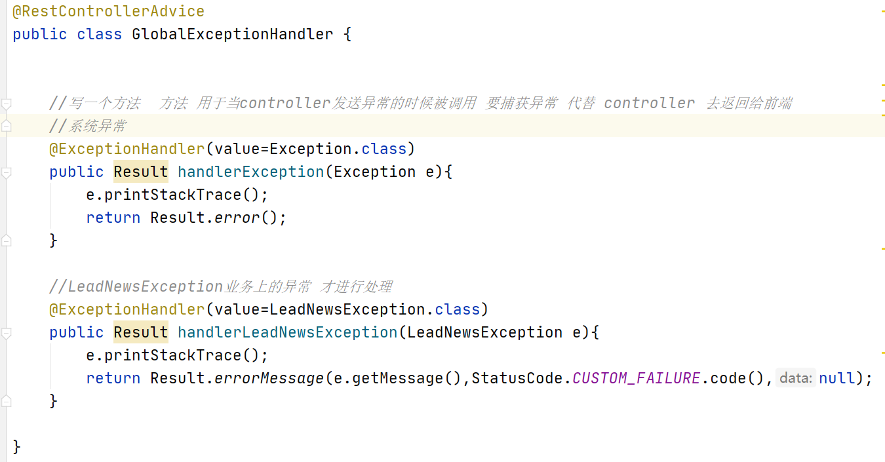
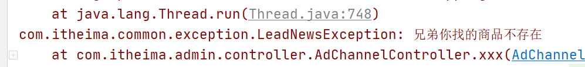
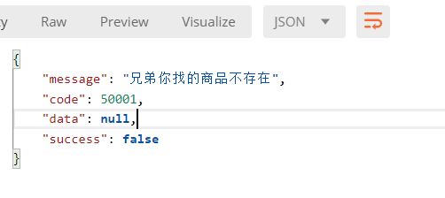
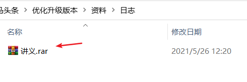
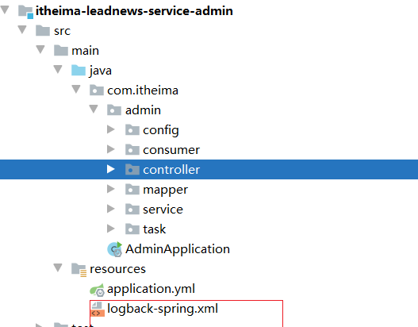
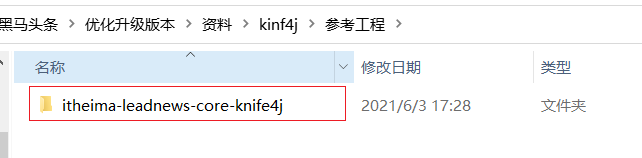
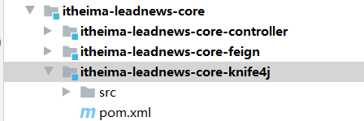
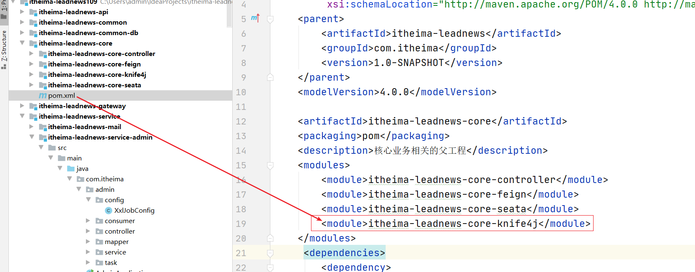
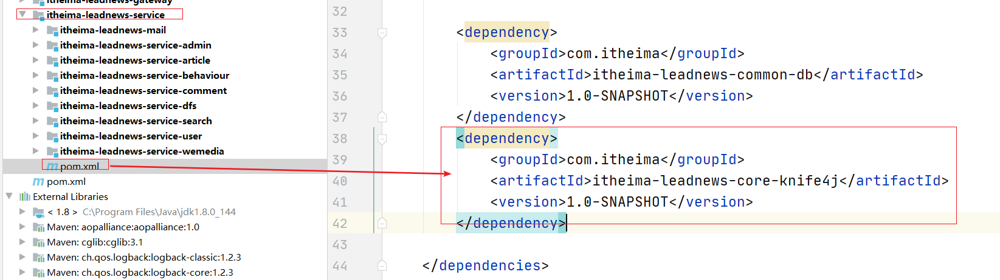

# 02 平台管理端基础数据准备&登录实现

## 今日目标

- 能够掌握项目中通用异常的处理方式
- 能够了解前端基础环境搭建
- 能够完成敏感词管理的开发
- 能够熟悉常用密码加密方式
- 能够完成admin端登录功能
- 能够完成nacos注册中心的搭建

## 1 通用异常

### 1.1 什么是通用异常

目前的代码中如果发生系统异常，则直接会给用户抛出不友好的异常信息，如下图：

 

为了提高前后台用户的体验，并且系统本身很多的地方都会有一些业务相关的异常，需要统一进行捕获并进行返回给前端。springmvc为我们提供了几个注解 实现统一异常的捕获功能，根据不同的异常的类型进行不同的处理。

总结：

```properties
1.需要处理系统异常相关 未知的错误
2.需要处理自定义业务异常相关  已知的业务的错误。例如 商品获取不到，查询不到数据等。
```


### 1.2 异常配置说明



`@RestControllerAdvice`  控制器增强注解 添加该注解的全局异常处理类需要被spring扫描到

`@ExceptionHandler` 异常处理器 与上面注解一起使用，可以拦截指定的异常信息并做相关的处理


### 1.3 集成项目中使用

（1）在itheima-leadnews-common中进行创建 自定义异常类 

```java
package com.itheima.common.exception;

import com.itheima.common.pojo.StatusCode;

/**
 * 自定义异常
 */
public class LeadNewsException extends Exception{

    //错误的状态码
    private Integer code;

    //错误信息
    private String message;

    public LeadNewsException(){

    }
    public LeadNewsException(Integer code, String message){
        this.code=code;
        this.message=message;
    }

    public LeadNewsException(String message){
        //自定义的异常的状态
        this.code= StatusCode.CUSTOM_FAILURE.code();
        this.message=message;
    }


    @Override
    public String getMessage() {
        return message;
    }

    public void setMessage(String message) {
        this.message = message;
    }


    public Integer getCode() {
        return code;
    }

    public void setCode(Integer code) {
        this.code = code;
    }


}
```

(2)创建全局异常处理类进行异常处理

```java
@RestControllerAdvice
public class GlobalExceptionHandler {


    //写一个方法  方法 用于当controller发送异常的时候被调用 要捕获异常 代替 controller 去返回给前端
    //系统异常
    @ExceptionHandler(value=Exception.class)
    public Result handlerException(Exception e){
        e.printStackTrace();
        return Result.error();
    }

    //LeadNewsException业务上的异常 才进行处理
    @ExceptionHandler(value=LeadNewsException.class)
    public Result handlerLeadNewsException(LeadNewsException e){
        e.printStackTrace();
        return Result.errorMessage(e.getMessage(),StatusCode.CUSTOM_FAILURE.code(),null);
    }

}
```

(3)测试：

 


测试自定义异常：

controller中添加

```java
@DeleteMapping("/xxx")
public Result xxx() throws LeadNewsException{
    //delete 业务操作
    try {
        int i=1/0;
    } catch (Exception e) {
        e.printStackTrace();
        throw new LeadNewsException("兄弟你找的商品不存在");
    }
    return Result.ok();
}
```


控制台输出：




postman中输出：

 

## 2 通用controller的抽取

### 2.1 需求分析

我们还需要实现敏感词管理，还需要实现各种表对应的【简单】的CRUD的操作，这个时候单表操作简单但是开发效率不高，每次都要编写，如果超过很多张表，那么需要重复劳动很多次。由此我们想到优化解决方案，其中就可以采取类似于mybatisplus一样的效果，mybatisplus已经实现了 基本的业务层CRUD操作和持久层CRUD操作，但是没实现controller的CRUD操作。那么我们需要自定义一个核心的controller的CRUD操作。

### 2.2 思路说明


如图：

```properties
如左侧所示，如果没有右侧的话。那么我们开发的时候每一个表对应的controller都要编写一个crud相关的业务代码，进行调用实现需求，虽然技术难度不大，但是频繁的操作很麻烦。

优化之后如右侧所示： 
1.扩展维护性增强 
2 不需要大量的代码重复劳动，需要自己编写一个controller 继承抽象类的controller即可立即实现所有相关的CRUDP功能
```


### 2.3 实现步骤

（1）创建核心接口和核心接口的实现类（该类为抽象类） 由于该核心接口和实现类 对于所有的微服务都能使用到属于系统工程的核心自定义功能模块，所以我们放到core核心工程去做，如下图：

 

该类已经实现请参考如下所示类：

 

抽象类相关：

```java
package com.itheima.core.controller;

import com.baomidou.mybatisplus.annotation.TableField;
import com.baomidou.mybatisplus.annotation.TableId;
import com.baomidou.mybatisplus.core.conditions.query.LambdaQueryWrapper;
import com.baomidou.mybatisplus.core.conditions.query.QueryWrapper;
import com.baomidou.mybatisplus.core.metadata.IPage;
import com.baomidou.mybatisplus.extension.plugins.pagination.Page;
import com.baomidou.mybatisplus.extension.service.IService;
import com.itheima.common.pojo.PageInfo;
import com.itheima.common.pojo.PageRequestDto;
import com.itheima.common.pojo.Result;
import com.itheima.common.pojo.StatusCode;
import io.swagger.annotations.ApiOperation;
import net.sf.jsqlparser.schema.Column;
import org.slf4j.Logger;
import org.slf4j.LoggerFactory;
import org.springframework.util.StringUtils;
import org.springframework.web.bind.annotation.*;

import java.beans.PropertyDescriptor;
import java.io.Serializable;
import java.lang.reflect.Field;
import java.util.List;

/***
 * 描述
 * @author ljh
 * @packagename com.changgou.core
 * @version 1.0
 * @date 2020/8/10
 */

public abstract class AbstractCoreController<T> implements ICoreController<T> {
    //
    private static final Logger logger = LoggerFactory.getLogger(AbstractCoreController.class);

    //调用方的service
    protected IService<T> coreService;

    public AbstractCoreController(IService<T> coreService) {
        this.coreService = coreService;
    }

    /**
     * 删除记录
     *
     * @param id
     * @return
     */
    @DeleteMapping("/{id}")
    @Override
    public Result deleteById(@PathVariable(name = "id") Serializable id) {
        boolean flag = coreService.removeById(id);
        if (!flag) {
            return Result.error();
        }
        return Result.ok();
    }

    /**
     * 添加记录
     *
     * @param record
     * @return
     */
    @PostMapping
    @Override
    public Result insert(@RequestBody T record) {
        boolean flag = coreService.save(record);
        if (!flag) {
            return Result.error();
        }
        return Result.ok();
    }

    //更新数据
    @Override
    @PutMapping
    public Result updateByPrimaryKey(@RequestBody T record) {
        boolean flag = coreService.updateById(record);
        if (!flag) {
            return Result.error();
        }
        return Result.ok();
    }


    @Override
    @GetMapping("/{id}")
    public Result<T> findById(@PathVariable(name = "id") Serializable id) {
        T t = coreService.getById(id);
        return Result.ok(t);
    }

    @Override
    @GetMapping
    public Result<List<T>> findAll() {
        List<T> list = coreService.list();
        return Result.ok(list);
    }


    /**
     * 通用条件分页查询
     *
     * @param pageRequestDto
     * @return
     */
    @PostMapping(value = "/search")
    @Override
    public Result<PageInfo<T>> findByPage(@RequestBody PageRequestDto<T> pageRequestDto) {
        Page page = new Page(pageRequestDto.getPage(), pageRequestDto.getSize());

        //条件 name 查询 非 lamda表达式查询条件
        QueryWrapper<T> queryWrapper = getWrapper(pageRequestDto.getBody());
        IPage iPage = coreService.page(page, queryWrapper);
        PageInfo<T> pageInfo = new PageInfo(iPage.getCurrent(), iPage.getSize(), iPage.getTotal(), iPage.getPages(), iPage.getRecords());
        return Result.ok(pageInfo);
    }

    private QueryWrapper<T> getWrapper(T body) {
        QueryWrapper queryWrapper = new QueryWrapper();
        if (body == null) {
            return queryWrapper;
        }
        Field[] declaredFields = body.getClass().getDeclaredFields();

        for (Field declaredField : declaredFields) {
            try {
                //遇到 id注解 则直接跳过 不允许实现根据主键查询
                //https://www.coder.work/article/2808807
                if (declaredField.isAnnotationPresent(TableId.class) || declaredField.getName().equals("serialVersionUID")) {
                    //遇到
                    continue;
                }
                //属性描述器  record.getClass()
                PropertyDescriptor propDesc = new PropertyDescriptor(declaredField.getName(), body.getClass());
                //获取这个值  先获取读方法的方法对象,并调用获取里面的值
                Object value = propDesc.getReadMethod().invoke(body);
                //如果是字符串
                TableField annotation = declaredField.getAnnotation(TableField.class);
                //如果传递的值为空则不做处理
                if(value != null) {
                    //如是字符串 则用like
                    if (value.getClass().getName().equals("java.lang.String")) {
                        queryWrapper.like(annotation.value(), value);
                    } else {
                        //否则使用=号
                        queryWrapper.eq(annotation.value(), value);
                    }
                }

            } catch (Exception e) {
                logger.error(e.getCause().getLocalizedMessage());
                e.printStackTrace();
            }
        }
        return queryWrapper;
    }

   //获取分页对象
   protected PageInfo<T> getPageInfo(IPage<T> iPage){
        return new PageInfo<T>(iPage.getCurrent(),iPage.getSize(),iPage.getTotal(),iPage.getPages(),iPage.getRecords());
   }

}

```

pom相关说明：

在itheima-leadnews-core工程的pom.xml文件中添加如下依赖配置

```xml
  <dependencies>
        <dependency>
            <groupId>com.itheima</groupId>
            <artifactId>itheima-leadnews-common</artifactId>
            <version>1.0-SNAPSHOT</version>
        </dependency>
    </dependencies>
```

在itheima-leadenews-core-controller工程的pom.xml文件中添加如下依赖：

```xml
<dependencies>
    <dependency>
        <groupId>com.baomidou</groupId>
        <artifactId>mybatis-plus-boot-starter</artifactId>
    </dependency>
</dependencies>
```


（2）创建业务Testcontroller 继承该抽象类 并实现CRUD功能,用于测试


## 3 敏感词管理


ad_sensitive 敏感词


创建实体类：

 

```java
package com.itheima.admin.pojo;

import com.baomidou.mybatisplus.annotation.IdType;
import com.baomidou.mybatisplus.annotation.TableField;
import com.baomidou.mybatisplus.annotation.TableId;
import com.baomidou.mybatisplus.annotation.TableName;
import lombok.Data;

import java.io.Serializable;
import java.time.LocalDateTime;

@Data
@TableName("ad_sensitive")
public class AdSensitive implements Serializable {

  
    /**
     * 主键
     */
    @TableId(value = "id", type = IdType.AUTO)
    private Integer id;

    /**
     * 敏感词
     */
    @TableField("sensitives")
    private String sensitives;

    /**
     * 创建时间
     */
    @TableField("created_time")
    private LocalDateTime createdTime;

}
```

#### 3.1 dao

```java
package com.itheima.admin.mapper;

import com.baomidou.mybatisplus.core.mapper.BaseMapper;
import com.itheima.admin.pojo.AdSensitive;

/**
 * @author ljh
 * @version 1.0
 * @date 2021/2/22 14:11
 * @description 标题
 * @package com.itheima.admin.mapper
 */
public interface AdSensitiveMapper extends BaseMapper<AdSensitive> {
    
}

```

#### 3.2 service

接口：

```java
package com.itheima.admin.service;

import com.baomidou.mybatisplus.extension.service.IService;
import com.itheima.admin.pojo.AdSensitive;

/**
 * @author ljh
 * @version 1.0
 * @date 2021/2/22 14:09
 * @description 标题
 * @package com.itheima.admin.service
 */
public interface AdSensitiveService extends IService<AdSensitive> {
}

```

实现类：

```java
package com.itheima.admin.service.impl;

import com.baomidou.mybatisplus.extension.service.impl.ServiceImpl;
import com.itheima.admin.mapper.AdSensitiveMapper;
import com.itheima.admin.pojo.AdSensitive;
import com.itheima.admin.service.AdSensitiveService;
import org.springframework.stereotype.Service;

/**
 * @author ljh
 * @version 1.0
 * @date 2021/2/22 14:10
 * @description 标题
 * @package com.itheima.admin.service.impl
 */
@Service
public class AdSensitiveServiceImpl extends ServiceImpl<AdSensitiveMapper, AdSensitive> implements AdSensitiveService {
    
}

```


#### 3.3 controller

```java
@RestController
@RequestMapping("/adSensitive")
public class AdSensitiveController extends AbstractCoreController<AdSensitive> {

    private AdSensitiveService adSensitiveService;

    @Autowired
    public AdSensitiveController(AdSensitiveService adSensitiveService) {
        super(adSensitiveService);
        this.adSensitiveService=adSensitiveService;
    }
}
```


#### 3.4 测试

 


#### 3.5 代码生成器

##### 3.5.1 代码生成器介绍

如上，我们同样实现了相关的功能，而且已经极大的简化了代码的开发了，但是，也需要频繁的创建controller service dao ,并且这种方式其实都是大同小异的，为此既然有规律，那么我们也可以使用代码生成器来实现代码生成，而不需要再编写代码了。直接一键生成代码！ 完全不需要手动编写代码。

代码生成器工程所在目录：只需要在idea中打开该代码生成器即可。

**持续升级优化**请参考以下地址

```properties
https://gitee.com/grapefruits/code-template-plus.git
```

 


##### 3.5.2 代码生成器使用

 

【**按照需要**】将其copy到对应的目录。

 

 

 

 

这样，就可以一键生成所有的代码，以后的工程也可以按照这种方式进行搭建，基本的CRUD的功能就不再手动编写。

##### 3.5.3 测试

略

## 4 日志

日志处理是一个正式项目必备的功能，日志要能够根据时间、类型等要素，根据指定格式来保存指定的日志，方便我们观察程序运行情况、定位程序bug

SpringBoot中推荐使用Logback日志框架。默认采用logback来实现日志处理。更多日志相关参考如下：

 

### 4.1 整合logback到头条项目中

在每一个微服务的classpath下创建logback-spring.xml文件，内容如下：

 

```xml
<?xml version="1.0" encoding="UTF-8"?>
<!-- 日志级别从低到高分为TRACE < DEBUG < INFO < WARN < ERROR < FATAL，如果设置为WARN，则低于WARN的信息都不会输出 -->
<!-- scan:当此属性设置为true时，配置文档如果发生改变，将会被重新加载，默认值为true -->
<!-- scanPeriod:设置监测配置文档是否有修改的时间间隔，如果没有给出时间单位，默认单位是毫秒。
                 当scan为true时，此属性生效。默认的时间间隔为1分钟。 -->
<!-- debug:当此属性设置为true时，将打印出logback内部日志信息，实时查看logback运行状态。默认值为false。 -->
<configuration scan="true" scanPeriod="60 seconds">
    <contextName>logback</contextName>
    <!-- name的值是变量的名称，value的值时变量定义的值。通过定义的值会被插入到logger上下文中。定义后，可以使“${}”来使用变量。 -->
    <!--可通过-Dlog.home设置值来获取-->
    <property name="log.path" value="${log.home:-E:/logs}"/>

    <springProperty scope="context" name="logName" source="spring.application.name" defaultValue="localhost.log" />
    <!--0. 日志格式和颜色渲染 -->
    <!-- 彩色日志依赖的渲染类 -->
    <conversionRule conversionWord="clr" converterClass="org.springframework.boot.logging.logback.ColorConverter"/>
    <conversionRule conversionWord="wex"
                    converterClass="org.springframework.boot.logging.logback.WhitespaceThrowableProxyConverter"/>
    <conversionRule conversionWord="wEx"
                    converterClass="org.springframework.boot.logging.logback.ExtendedWhitespaceThrowableProxyConverter"/>
    <!-- 彩色日志格式 -->
    <property name="CONSOLE_LOG_PATTERN"
              value="${CONSOLE_LOG_PATTERN:-%clr(%d{yyyy-MM-dd HH:mm:ss.SSS}){faint} %clr(${LOG_LEVEL_PATTERN:-%5p}) %clr(${PID:- }){magenta} %clr(---){faint} %clr([%15.15t]){faint} %clr(%-40.40logger{39}){cyan} %clr(:){faint} %m%n${LOG_EXCEPTION_CONVERSION_WORD:-%wEx}}"/>

    <!--1. 输出到控制台-->
    <appender name="CONSOLE" class="ch.qos.logback.core.ConsoleAppender">
        <!--控制台在这里没有什么用-->
        <!--此日志appender是为开发使用，只配置最底级别，控制台输出的日志级别是大于或等于此级别的日志信息-->
        <!--<filter class="ch.qos.logback.classic.filter.ThresholdFilter">
            <level>debug</level>
        </filter>-->
        <encoder>
            <Pattern>${CONSOLE_LOG_PATTERN}</Pattern>
            <!-- 设置字符集 -->
            <charset>UTF-8</charset>
        </encoder>
    </appender>

    <!--2. 输出到文档-->
    <!-- 2.1 level为 DEBUG 日志，时间滚动输出  -->
    <appender name="DEBUG_FILE" class="ch.qos.logback.core.rolling.RollingFileAppender">
        <!-- 正在记录的日志文档的路径及文档名 -->
        <file>${log.path}/${logName}_web_debug.log</file>
        <!--日志文档输出格式    [${PID:- }] 标识进程ID -->
        <encoder>
            <pattern>%d{yyyy-MM-dd HH:mm:ss.SSS} [${PID:- }] [%thread] %-5level %logger{50} - %msg%n</pattern>
            <charset>UTF-8</charset> <!-- 设置字符集 -->
        </encoder>
        <!-- 日志记录器的滚动策略，按日期，按大小记录 -->
        <rollingPolicy class="ch.qos.logback.core.rolling.TimeBasedRollingPolicy">
            <!-- 日志归档 -->
            <fileNamePattern>${log.path}/${logName}_web_debug-%d{yyyy-MM-dd}.%i.log</fileNamePattern>
            <timeBasedFileNamingAndTriggeringPolicy class="ch.qos.logback.core.rolling.SizeAndTimeBasedFNATP">
                <maxFileSize>10MB</maxFileSize>
            </timeBasedFileNamingAndTriggeringPolicy>
            <!--日志文档保留天数-->
            <maxHistory>15</maxHistory>
        </rollingPolicy>
        <!-- 此日志文档只记录debug级别的 -->
        <filter class="ch.qos.logback.classic.filter.LevelFilter">
            <level>debug</level>
            <onMatch>ACCEPT</onMatch>
            <onMismatch>DENY</onMismatch>
        </filter>
    </appender>

    <!-- 2.2 level为 INFO 日志，时间滚动输出  -->
    <appender name="INFO_FILE" class="ch.qos.logback.core.rolling.RollingFileAppender">
        <!-- 正在记录的日志文档的路径及文档名 -->
        <file>${log.path}/${logName}_web_info.log</file>
        <!--日志文档输出格式-->
        <encoder>
            <pattern>%d{yyyy-MM-dd HH:mm:ss.SSS} [${PID:- }] [%thread] %-5level %logger{50} - %msg%n</pattern>
            <charset>UTF-8</charset>
        </encoder>
        <!-- 日志记录器的滚动策略，按日期，按大小记录 -->
        <rollingPolicy class="ch.qos.logback.core.rolling.TimeBasedRollingPolicy">
            <!-- 每天日志归档路径以及格式 -->
            <fileNamePattern>${log.path}/${logName}_web-info-%d{yyyy-MM-dd}.%i.log</fileNamePattern>
            <timeBasedFileNamingAndTriggeringPolicy class="ch.qos.logback.core.rolling.SizeAndTimeBasedFNATP">
                <maxFileSize>10MB</maxFileSize>
            </timeBasedFileNamingAndTriggeringPolicy>
            <!--日志文档保留天数-->
            <maxHistory>15</maxHistory>
        </rollingPolicy>
        <!-- 此日志文档只记录info级别的 -->
        <filter class="ch.qos.logback.classic.filter.LevelFilter">
            <level>info</level>
            <onMatch>ACCEPT</onMatch>
            <onMismatch>DENY</onMismatch>
        </filter>
    </appender>

    <!-- 2.3 level为 WARN 日志，时间滚动输出  -->
    <appender name="WARN_FILE" class="ch.qos.logback.core.rolling.RollingFileAppender">
        <!-- 正在记录的日志文档的路径及文档名 -->
        <file>${log.path}/${logName}_web_warn.log</file>
        <!--日志文档输出格式-->
        <encoder>
            <pattern>%d{yyyy-MM-dd HH:mm:ss.SSS} [${PID:- }] [%thread] %-5level %logger{50} - %msg%n</pattern>
            <charset>UTF-8</charset> <!-- 此处设置字符集 -->
        </encoder>
        <!-- 日志记录器的滚动策略，按日期，按大小记录 -->
        <rollingPolicy class="ch.qos.logback.core.rolling.TimeBasedRollingPolicy">
            <fileNamePattern>${log.path}/${logName}_web-warn-%d{yyyy-MM-dd}.%i.log</fileNamePattern>
            <timeBasedFileNamingAndTriggeringPolicy class="ch.qos.logback.core.rolling.SizeAndTimeBasedFNATP">
                <maxFileSize>10MB</maxFileSize>
            </timeBasedFileNamingAndTriggeringPolicy>
            <!--日志文档保留天数-->
            <maxHistory>15</maxHistory>
        </rollingPolicy>
        <!-- 此日志文档只记录warn级别的 -->
        <filter class="ch.qos.logback.classic.filter.LevelFilter">
            <level>warn</level>
            <onMatch>ACCEPT</onMatch>
            <onMismatch>DENY</onMismatch>
        </filter>
    </appender>

    <!-- 2.4 level为 ERROR 日志，时间滚动输出  -->
    <appender name="ERROR_FILE" class="ch.qos.logback.core.rolling.RollingFileAppender">
        <!-- 正在记录的日志文档的路径及文档名 -->
        <file>${log.path}/${logName}_web_error.log</file>
        <!--日志文档输出格式-->
        <encoder>
            <pattern>%d{yyyy-MM-dd HH:mm:ss.SSS} [${PID:- }] [%thread] %-5level %logger{50} - %msg%n</pattern>
            <charset>UTF-8</charset> <!-- 此处设置字符集 -->
        </encoder>
        <!-- 日志记录器的滚动策略，按日期，按大小记录 -->
        <rollingPolicy class="ch.qos.logback.core.rolling.TimeBasedRollingPolicy">
            <fileNamePattern>${log.path}/${logName}_web-error-%d{yyyy-MM-dd}.%i.log</fileNamePattern>
            <timeBasedFileNamingAndTriggeringPolicy class="ch.qos.logback.core.rolling.SizeAndTimeBasedFNATP">
                <maxFileSize>10MB</maxFileSize>
            </timeBasedFileNamingAndTriggeringPolicy>
            <!--日志文档保留天数-->
            <maxHistory>15</maxHistory>
        </rollingPolicy>
        <!-- 此日志文档只记录ERROR级别的 -->
        <filter class="ch.qos.logback.classic.filter.LevelFilter">
            <level>ERROR</level>
            <onMatch>ACCEPT</onMatch>
            <onMismatch>DENY</onMismatch>
        </filter>
    </appender>

    <!--
        <logger>用来设置某一个包或者具体的某一个类的日志打印级别、
        以及指定<appender>。<logger>仅有一个name属性，
        一个可选的level和一个可选的addtivity属性。
        name:用来指定受此logger约束的某一个包或者具体的某一个类。
        level:用来设置打印级别，大小写无关：TRACE, DEBUG, INFO, WARN, ERROR, ALL 和 OFF，
              还有一个特俗值INHERITED或者同义词NULL，代表强制执行上级的级别。
              如果未设置此属性，那么当前logger将会继承上级的级别。
        addtivity:是否向上级logger传递打印信息。默认是true。
        <logger name="org.springframework.web" level="info"/>
        <logger name="org.springframework.scheduling.annotation.ScheduledAnnotationBeanPostProcessor" level="INFO"/>
    -->

    <!--
        使用mybatis的时候，sql语句是debug下才会打印，而这里我们只配置了info，所以想要查看sql语句的话，有以下两种操作：
        第一种把<root level="info">改成<root level="DEBUG">这样就会打印sql，不过这样日志那边会出现很多其他消息
        第二种就是单独给dao下目录配置debug模式，代码如下，这样配置sql语句会打印，其他还是正常info级别：
        【logging.level.org.mybatis=debug logging.level.dao=debug】
     -->

    <!--
        root节点是必选节点，用来指定最基础的日志输出级别，只有一个level属性
        level:用来设置打印级别，大小写无关：TRACE, DEBUG, INFO, WARN, ERROR, ALL 和 OFF，
        不能设置为INHERITED或者同义词NULL。默认是DEBUG
        可以包含零个或多个元素，标识这个appender将会添加到这个logger。
    -->

    <!-- 4. 最终的策略 -->
    <!-- 4.1 开发环境:打印控制台-->
    <springProfile name="dev">
        <!--设置对应的包名为debug模式其他的为info模式 可按需求进行更改-->
        <logger name="com.itheima" level="debug"/>
        <root level="info">
            <appender-ref ref="CONSOLE"/>
            <appender-ref ref="DEBUG_FILE"/>
            <appender-ref ref="INFO_FILE"/>
            <appender-ref ref="WARN_FILE"/>
            <appender-ref ref="ERROR_FILE"/>
        </root>
    </springProfile>

    <!--<logger name="org.springframework.web.servlet" level="debug"></logger>-->
   <!-- <root level="debug">
        <appender-ref ref="CONSOLE"/>
        <appender-ref ref="DEBUG_FILE"/>
        <appender-ref ref="INFO_FILE"/>
        <appender-ref ref="WARN_FILE"/>
        <appender-ref ref="ERROR_FILE"/>
    </root>-->

    <!-- 4.2 生产环境:输出到文档-->
    <springProfile name="pro">
        <root level="info">
            <appender-ref ref="CONSOLE"/>
            <appender-ref ref="DEBUG_FILE"/>
            <appender-ref ref="INFO_FILE"/>
            <appender-ref ref="ERROR_FILE"/>
            <appender-ref ref="WARN_FILE"/>
        </root>
    </springProfile>

</configuration>
```


参考如下：

```properties
https://www.jianshu.com/p/39178af66aef
```


修改：通用异常的打印方式：

```java
package com.itheima.common.exception;

import com.itheima.common.pojo.Result;
import com.itheima.common.pojo.StatusCode;
import org.slf4j.Logger;
import org.slf4j.LoggerFactory;
import org.springframework.web.bind.annotation.ExceptionHandler;
import org.springframework.web.bind.annotation.RestControllerAdvice;

/**
 * @author ljh
 * @version 1.0
 * @date 2021/5/3 10:12
 * @description 标题
 * @package com.itheima.common.exception
 */
@RestControllerAdvice
public class GlobalExceptionHandler {
    private Logger logger = LoggerFactory.getLogger(GlobalExceptionHandler.class);

    //写一个方法  方法 用于当controller发送异常的时候被调用 要捕获异常 代替 controller 去返回给前端
    //系统异常
    @ExceptionHandler(value=Exception.class)
    public Result handlerException(Exception e){
        //e.printStackTrace();
        logger.error("error",e);
        return Result.error();
    }

    //LeadNewsException业务上的异常 才进行处理
    @ExceptionHandler(value=LeadNewsException.class)
    public Result handlerLeadNewsException(LeadNewsException e){
        //e.printStackTrace();
        logger.error("error",e);
        return Result.errorMessage(e.getMessage(),StatusCode.CUSTOM_FAILURE.code(),null);
    }

}

```

## 5 整合knife4j起步依赖

如图：

 

将该工程放到core聚合工程中：

 





在微服务聚合工程中添加该依赖：实现接口添加knife4j自动配置：




这样不需要再进行配置了，直接使用接口文档即可。


## 6 jwt介绍

### 6.1 token认证

随着 Restful API、微服务的兴起，基于 Token 的认证现在已经越来越普遍。基于token的用户认证是一种**服务端无状态**的认证方式，所谓服务端无状态指的token本身包含登录用户所有的相关数据，而客户端在认证后的每次请求都会携带token，因此服务器端无需存放token数据。

​	当用户认证后，服务端生成一个token发给客户端，客户端可以放到 cookie 或 localStorage 等存储中，每次请求时带上 token，服务端收到token通过验证后即可确认用户身份。


### 6.2 什么是JWT？

​	我们现在了解了基于token认证的交互机制，但令牌里面究竟是什么内容？什么格式呢？市面上基于token的认证方式大都采用的是JWT(Json Web Token)。

​	JSON Web Token（JWT）是一个开放的行业标准（RFC 7519），它定义了一种简洁的、自包含的协议格式，用于在通信双方传递json对象，传递的信息经过数字签名可以被验证和信任。

**JWT令牌结构：**

JWT令牌由Header、Payload、Signature三部分组成，每部分中间使用点（.）分隔，比如：xxxxx.yyyyy.zzzzz

- Header

头部包括令牌的类型（即JWT）及使用的哈希算法（如HMAC、SHA256或RSA）。

一个例子：

```json
{
	"alg": "HS256"，
	"typ": "JWT"
}
```

将上边的内容使用Base64Url编码，得到一个字符串就是JWT令牌的第一部分。

- Payload

第二部分是负载，内容也是一个json对象，它是存放有效信息的地方，它可以存放jwt提供的现成字段，比
如：iss（签发者），exp（过期时间戳）， sub（面向的用户）等，也可自定义字段。
此部分不建议存放敏感信息，因为此部分可以解码还原原始内容。
一个例子：

```json
{
	"sub": "1234567890"，
	"name": "456"，
	"admin": true
}
```

最后将第二部分负载使用Base64Url编码，得到一个字符串就是JWT令牌的第二部分。

- Signature

第三部分是签名，此部分用于防止jwt内容被篡改。
这个部分使用base64url将前两部分进行编码，编码后使用点（.）连接组成字符串，最后使用header中声明
签名算法进行签名。
一个例子：

```json
HMACSHA256(
base64UrlEncode(header) + "." +
base64UrlEncode(payload)，
secret)
```

base64UrlEncode(header)：jwt令牌的第一部分。
base64UrlEncode(payload)：jwt令牌的第二部分。
secret：签名所使用的密钥。

下图中包含一个生成的jwt令牌：


### 6.3 生成token

在itheima-leadnews工程中pom.xml中添加jwt相关依赖

```xml
<!--jwt-->
<dependency>
    <groupId>io.jsonwebtoken</groupId>
    <artifactId>jjwt</artifactId>
    <version>0.9.1</version>
</dependency>
```

工具类：

```java
package com.itheima.common.util;


import com.itheima.common.constants.SystemConstants;
import io.jsonwebtoken.*;

import javax.crypto.SecretKey;
import javax.crypto.spec.SecretKeySpec;
import java.util.*;

public class AppJwtUtil {

    // TOKEN的有效期一天（S）
    private static final int TOKEN_TIME_OUT = 3600;
    // 加密KEY
    private static final String TOKEN_ENCRY_KEY = "MDk4ZjZiY2Q0NjIxZDM3M2NhZGU0ZTgzMjYyN2I0ZjY";
    // 最小刷新间隔(S)
    private static final int REFRESH_TIME = 300;

    // 生产ID
    public static String createToken(Long id) {
        Map<String, Object> claimMaps = new HashMap<>();
        claimMaps.put("id", id);
        long currentTime = System.currentTimeMillis();
        return Jwts.builder()
                .setId(UUID.randomUUID().toString())
                .setIssuedAt(new Date(currentTime))  //签发时间
                .setSubject("system")  //说明
                .setIssuer("heima") //签发者信息
                .setAudience("app")  //接收用户
                .compressWith(CompressionCodecs.GZIP)  //数据压缩方式
                .signWith(SignatureAlgorithm.HS512, generalKey()) //加密方式
                //过期一个小时
                .setExpiration(new Date(currentTime + TOKEN_TIME_OUT * 1000))  //过期时间戳
                .addClaims(claimMaps) //cla信息
                .compact();
    }

    /**
     * 获取token中的claims信息
     *
     * @param token
     * @return
     */
    private static Jws<Claims> getJws(String token) {
        return Jwts.parser()
                .setSigningKey(generalKey())
                .parseClaimsJws(token);
    }

    /**
     * 获取payload body信息
     *
     * @param token
     * @return
     */
    public static Claims getClaimsBody(String token) {
        try {
            return getJws(token).getBody();
        } catch (ExpiredJwtException e) {
            return null;
        }
    }

    /**
     * 获取hearder body信息
     *
     * @param token
     * @return
     */
    public static JwsHeader getHeaderBody(String token) {
        return getJws(token).getHeader();
    }

    /**
     * 是否过期
     *
     * @param token
     * @return 1 有效  0 无效  2 已过期
     */
    public static Integer verifyToken(String token) {

        try {
            Claims claims = AppJwtUtil.getClaimsBody(token);
            if (claims == null) {
                return SystemConstants.JWT_FAIL;
            }
            return SystemConstants.JWT_OK;
        } catch (ExpiredJwtException ex) {
            return SystemConstants.JWT_EXPIRE;
        } catch (Exception e) {
            return SystemConstants.JWT_FAIL;
        }
    }

    /**
     * 由字符串生成加密key
     *
     * @return
     */
    public static SecretKey generalKey() {
        byte[] encodedKey = Base64.getEncoder().encode(TOKEN_ENCRY_KEY.getBytes());
        SecretKey key = new SecretKeySpec(encodedKey, 0, encodedKey.length, "AES");
        return key;
    }

    public static void main(String[] args) {
       /* Map map = new HashMap();
        map.put("id","11");*/
        String token = AppJwtUtil.createToken(1102L);
        System.out.println(token);

        Claims claims = AppJwtUtil.getClaimsBody(token);
        Integer integer = AppJwtUtil.verifyToken("dsafafsa");
        System.out.println(integer);
        System.out.println(claims);

    }
}
```

系统常量类：

```java
package com.itheima.common.constants;

/**
 * @author ljh
 * @version 1.0
 * @date 2021/2/22 15:13
 * @description 标题
 * @package com.itheima.common.constants
 */
public class SystemConstants {
    //JWT TOKEN已过期
    public static final Integer JWT_EXPIRE = 2;
    //JWT TOKEN有效
    public static final Integer JWT_OK = 1;
    //JWT TOKEN无效
    public static final Integer JWT_FAIL = 0;

}

```

 


## 7 平台运营端-登录实现


### 7.1 需求分析

ad_user 运营平台用户信息表，用户需要登录后台。


思路：

```properties
页面传递 用户名和密码 到后台 后台接收 执行查询 如果查询到了 登录成功，并生成令牌返回给前端
```


### 7.2 service

接口

```java
public interface AdUserService extends IService<AdUser> {


    Map<String, Object> login(AdUser adUser);
}
```

实现类：

```java
@Service
public class AdUserServiceImpl extends ServiceImpl<AdUserMapper, AdUser> implements AdUserService {

    @Autowired
    private AdUserMapper adUserMapper;

    @Override
    public Map<String, Object> login(AdUser adUser) {
        //根据用户名获取到用户信息
        QueryWrapper<AdUser> querywrapper = new QueryWrapper<AdUser>() ;
        querywrapper.eq("name",adUser.getName());
        AdUser user = adUserMapper.selectOne(querywrapper);
        //再获取用户表中的盐值
        if(user==null){
            return null;
        }
        String salt = user.getSalt();
        String password = DigestUtils.md5DigestAsHex((adUser.getPassword() + salt).getBytes());
        if(!password.equals(user.getPassword())){
            return null;
        }
        //登录成功
        Map<String,Object> info = new HashMap<>();
        String token = AppJwtUtil.createToken(user.getId().longValue());
        info.put("token",token);
        //密码不要设置
        user.setPassword("");
        info.put("user",user);
        return info;
    }
}
```


### 7.3 controller

创建一个controller实现登录功能

```java
package com.itheima.admin.controller;

import com.itheima.admin.pojo.AdUser;
import com.itheima.admin.service.AdUserService;
import com.itheima.common.pojo.Result;
import org.springframework.beans.factory.annotation.Autowired;
import org.springframework.util.DigestUtils;
import org.springframework.util.StringUtils;
import org.springframework.web.bind.annotation.PostMapping;
import org.springframework.web.bind.annotation.RequestBody;
import org.springframework.web.bind.annotation.RequestMapping;
import org.springframework.web.bind.annotation.RestController;

import java.util.Map;

/**
 * @author ljh
 * @version 1.0
 * @date 2021/2/22 15:37
 * @description 标题
 * @package com.itheima.admin.controller
 */
@RestController
@RequestMapping("/admin")
public class LoginController {

    @Autowired
    private AdUserService adUserService;

    /**
     * 用户登录
     *
     * @param adUser 接收用户名和密码信息进行登录
     * @return
     */
    @PostMapping("/login")
    public Result login(@RequestBody AdUser adUser) {
        if (StringUtils.isEmpty(adUser)) {
            return Result.errorMessage("用户名和密码不能为空");
        }
        if (StringUtils.isEmpty(adUser.getName())) {
            return Result.errorMessage("用户名和密码不能为空");
        }
        if (StringUtils.isEmpty(adUser.getPassword())) {
            return Result.errorMessage("用户名和密码不能为空");
        }
        Map<String, Object> info = adUserService.login(adUser);
        if (info == null) {
            return Result.errorMessage("登录失败");
        }
        return Result.ok(info);
    }

    public static void main(String[] args) {
        String s = DigestUtils.md5DigestAsHex(("admin" + "").getBytes());
        System.out.println(s);
    }
}

```


### 7.5 测试

表中的密码我们可能已经忘记了，那么我们可以自己动手生成并手动填充到数据库中 **注意此处用于测试**


## 8 spring cloud nacos注册中心搭建

### 8.1 简介

Nacos是阿里的一个开源产品，它是针对微服务架构中的服务发现、配置管理、服务治理的综合型解决方案。
官方介绍是这样的：

> Nacos  致力于帮助您发现、配置和管理微服务。Nacos 提供了一组简单易用的特性集，帮助您实现动态服务
> 发现、服务配置管理、服务及流量管理。 Nacos 帮助您更敏捷和容易地构建、交付和管理微服务平台。
> Nacos 是构建以“服务”为中心的现代应用架构的服务基础设施。

官网地址：https://nacos.io

官方文档：https://nacos.io/zh-cn/docs/what-is-nacos.html

Nacos主要提供以下四大功能：

1. 服务发现与服务健康检查
   Nacos使服务更容易注册，并通过DNS或HTTP接口发现其他服务，Nacos还提供服务的实时健康检查，以防
   止向不健康的主机或服务实例发送请求。
2. 动态配置管理
   动态配置服务允许您在所有环境中以集中和动态的方式管理所有服务的配置。Nacos消除了在更新配置时重新
   部署应用程序，这使配置的更改更加高效和灵活。
3. 动态DNS服务
   Nacos提供基于DNS 协议的服务发现能力，旨在支持异构语言的服务发现，支持将注册在Nacos上的服务以
   域名的方式暴露端点，让三方应用方便的查阅及发现。
4. 服务和元数据管理
   Nacos 能让您从微服务平台建设的视角管理数据中心的所有服务及元数据，包括管理服务的描述、生命周
   期、服务的静态依赖分析、服务的健康状态、服务的流量管理、路由及安全策略。


### 8.2 安装Nacos Server（虚拟机已经安装此步骤可以省略）

在liunx下安装nacos必须先安装jdk8+才能运行

可以从https://github.com/alibaba/nacos/releases 下载包


 

下载后解压：

```shell
 tar ‐xvf nacos‐server‐1.2.1.tar.gz -C /usr/local/server
```

如果报错：没有目录，则执行如下命令：

```shell
mkdir /usr/local/server -p
```

进入安装程序的bin目录：

```shell
./startup.sh -m standalone
```

启动成功，可通过浏览器访问 http://192.168.211.136:8848/nacos  ，打开如下nacos控制台登录页面：


**虚拟机中启动nacos**：

```properties
cd sh
./start_nacos.sh
```


### 8.3 注册服务

由于每一个微服务都要用到依赖，可以在itheima-leadnews-service工程的pom.xml中添加如下依赖

```xml
<dependency>
    <groupId>com.alibaba.cloud</groupId>
    <artifactId>spring-cloud-starter-alibaba-nacos-discovery</artifactId>
</dependency>
```


在admin微服务中的application.yml修改如下，添加nacos的配置

```yaml
spring:
  profiles:
    active: dev
---
server:
  port: 9001
spring:
  application:
    name: leadnews-admin
  profiles: dev
  datasource:
    driver-class-name: com.mysql.jdbc.Driver
    url: jdbc:mysql://192.168.211.136:3306/leadnews_admin?useSSL=false&useUnicode=true&characterEncoding=UTF-8&serverTimezone=&serverTimezone=Asia/Shanghai
    username: root
    password: 123456
  cloud:
    nacos:
      server-addr: 192.168.211.136:8848
      discovery:
        server-addr: ${spring.cloud.nacos.server-addr}

# 设置Mapper接口所对应的XML文件位置，如果你在Mapper接口中有自定义方法，需要进行该配置
mybatis-plus:
  mapper-locations: classpath*:mapper/*.xml
  # 设置别名包扫描路径，通过该属性可以给包中的类注册别名
  type-aliases-package: com.itheima.admin.pojo
logging:
  level.com: debug
---
server:
  port: 9001
spring:
  application:
    name: leadnews-admin
  profiles: pro
  datasource:
    driver-class-name: com.mysql.jdbc.Driver
    url: jdbc:mysql://192.168.211.136:3306/leadnews_admin?useSSL=false&useUnicode=true&characterEncoding=UTF-8&serverTimezone=&serverTimezone=Asia/Shanghai
    username: root
    password: 123456
  cloud:
    nacos:
      server-addr: 192.168.211.136:8848
      discovery:
        server-addr: ${spring.cloud.nacos.server-addr}
# 设置Mapper接口所对应的XML文件位置，如果你在Mapper接口中有自定义方法，需要进行该配置
mybatis-plus:
  mapper-locations: classpath*:mapper/*.xml
  # 设置别名包扫描路径，通过该属性可以给包中的类注册别名
  type-aliases-package: com.itheima.admin.pojo
---
server:
  port: 9001
spring:
  application:
    name: leadnews-admin
  profiles: test
  datasource:
    driver-class-name: com.mysql.jdbc.Driver
    url: jdbc:mysql://192.168.211.136:3306/leadnews_admin?useSSL=false&useUnicode=true&characterEncoding=UTF-8&serverTimezone=Asia/Shanghai
    username: root
    password: 123456
  cloud:
    nacos:
      server-addr: 192.168.211.136:8848
      discovery:
        server-addr: ${spring.cloud.nacos.server-addr}
# 设置Mapper接口所对应的XML文件位置，如果你在Mapper接口中有自定义方法，需要进行该配置
mybatis-plus:
  mapper-locations: classpath*:mapper/*.xml
  # 设置别名包扫描路径，通过该属性可以给包中的类注册别名
  type-aliases-package: com.itheima.admin.pojo
```


启动类中添加注解：

 

启动nacos服务端和启动微服务之后，看到如下即可说明成功


